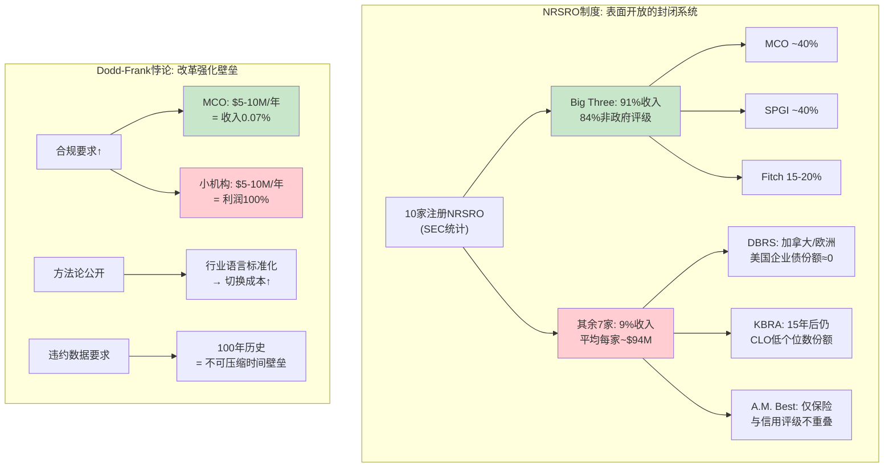
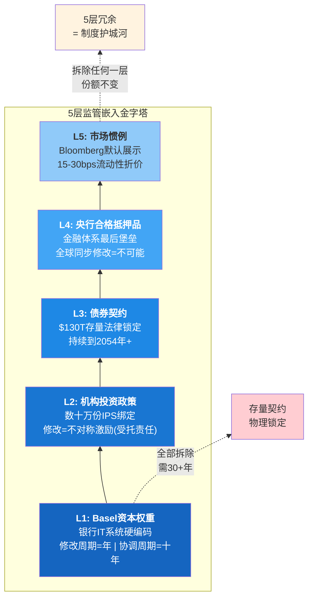
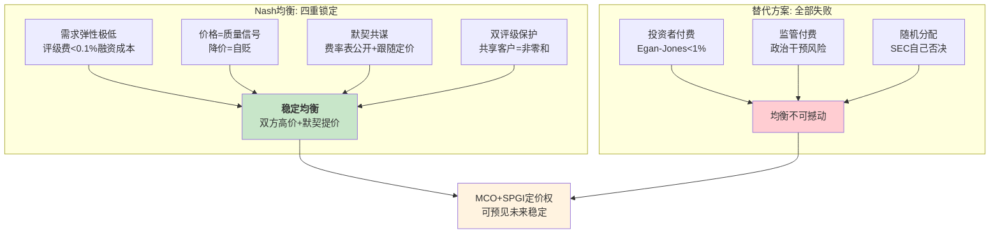
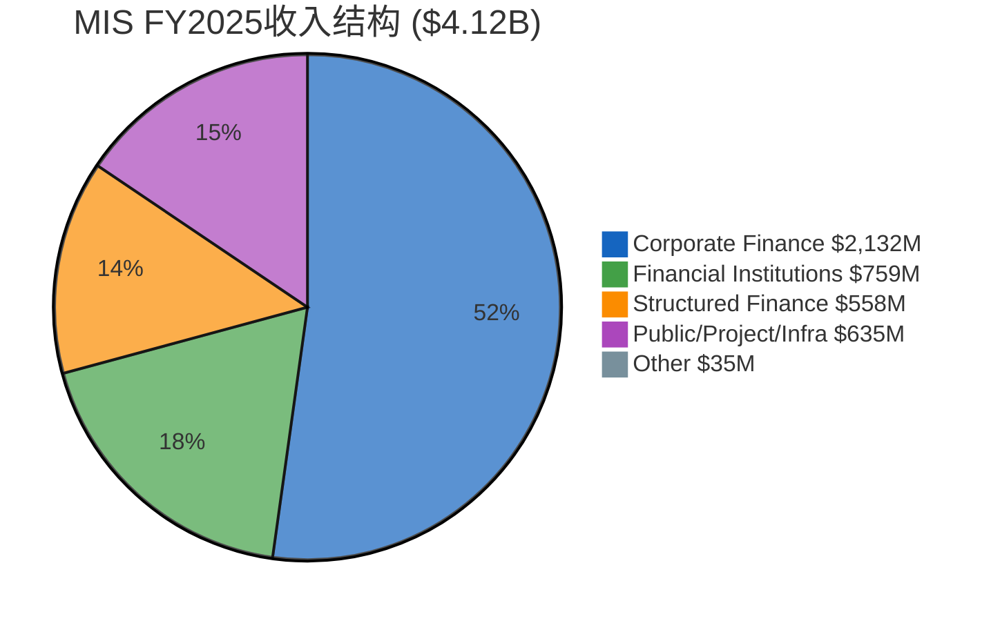
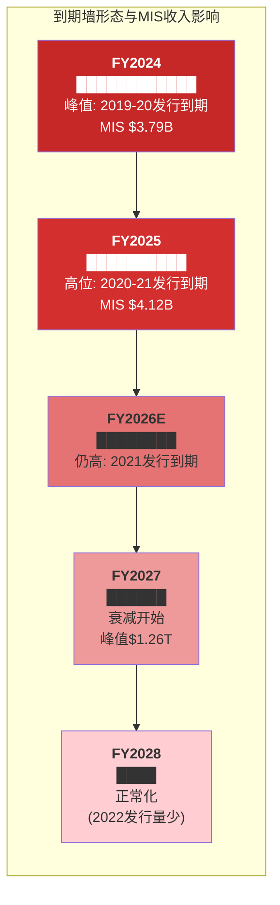
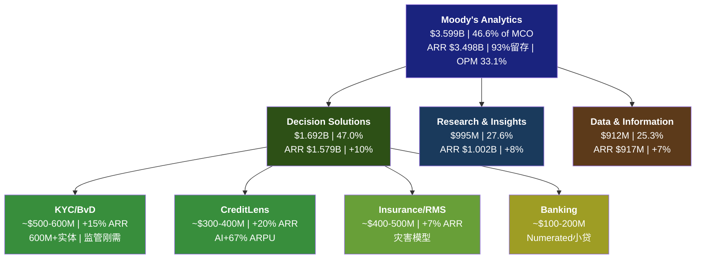
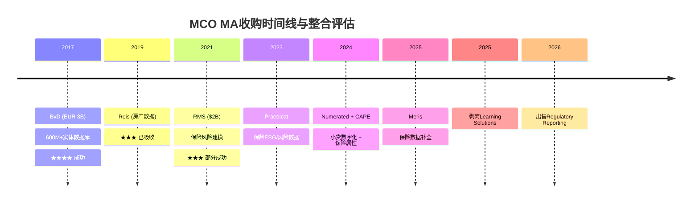
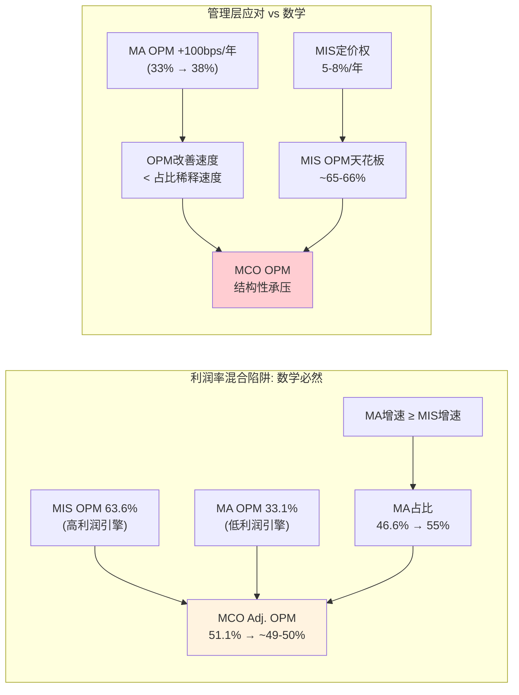
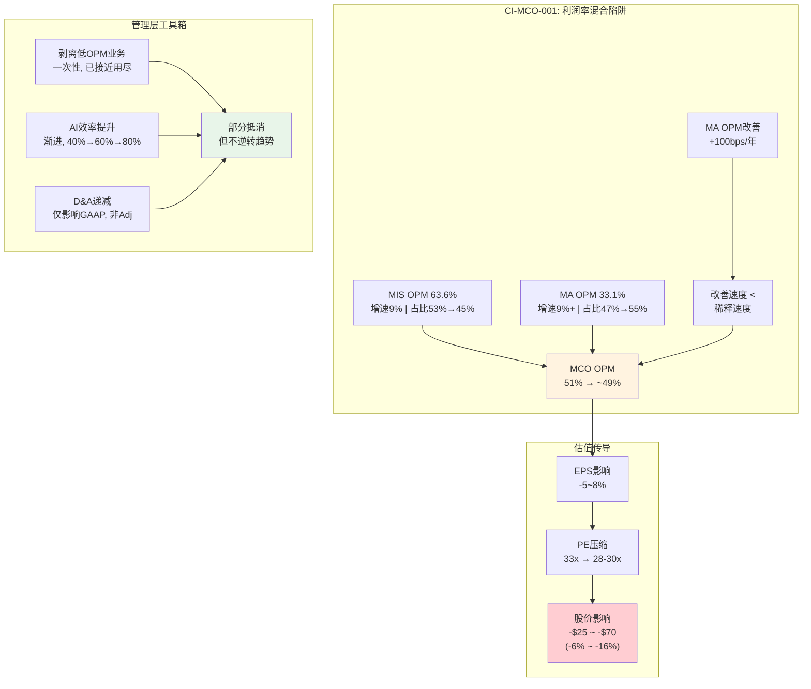

# Part II: 双引擎深度

> Phase 1 Part II | MCO v2.0 | 2026-03-18
> 目标: 25-30K chars | DM锚点密度 ≥ 1.0/千字

---

## Ch03: MIS评级特许权 — 五层嵌入+周期暴露

MIS是MCO的利润心脏: FY2025收入$4.1B(占MCO 53.4%), Adj. OPM 63.6% [DM-MIS-001]。理解MIS, 必须同时理解两件事——**为什么它几乎不可能被颠覆**(本章前半), 以及**为什么它仍然是一台周期机器**(本章后半)。前者决定了MCO的质量上限, 后者决定了MCO的估值下限。

### 3.1 NRSRO制度: 看似开放的封闭系统

美国SEC注册的NRSRO(全国认可统计评级组织)共10家。这个数字经常被政客和学者引用为"评级市场并非垄断"的证据。但数字背后的现实是另一个故事: Big Three(MCO+SPGI+Fitch)合计占NRSRO总收入的**91%**, 占非政府证券评级的**84%** [DM-MIS-002]。

剩余7家NRSRO分享9%的市场收入。按FY2025全球信用评级市场$7.32B推算 [DM-MIS-003], Big Three合计约$6.66B, 7家小型NRSRO合计仅$0.66B——平均每家约$94M。即使以MCO MIS最小的资产类别Structured Finance $558M来衡量, 最大的小型NRSRO也不足其六分之一 [DM-MIS-004]。

这7家小型NRSRO的生存状态精确说明了"有牌照"和"有竞争力"之间的鸿沟:

- **DBRS Morningstar**: 加拿大背景, 是7家中最大的一家。但其核心市场在加拿大和欧洲, 在美国企业债——MIS收入52%来源的核心战场——的份额微不足道。DBRS的案例证明: 区域优势不能转化为全球竞争力, 因为债券市场的"通用语言"是全球性的
- **Kroll Bond Rating Agency (KBRA)**: 2010年成立, 目标明确——在结构化产品领域挑战Big Three。十五年过去了, KBRA在CLO评级领域确实获得了一些份额, 但仍在低个位数。原因并非评级质量不够, 而是投资者端的接受度不够——大型资管的IPS和交易系统尚未大规模纳入KBRA评级
- **A.M. Best**: 专注保险行业评级, 在保险领域是标准制定者。但保险评级和信用评级是两个几乎不重叠的市场。A.M. Best无意也无力挑战MCO在企业债领域的地位
- **Egan-Jones**: 投资者付费模式的先驱, 但市场份额<1%。2012年因方法论缺陷被SEC暂停评级资格18个月, 进一步证明了"替代商业模式"在这个市场的脆弱性 [DM-MIS-005]

**为什么Dodd-Frank没有改变格局?**

2006年CRARA和2010年Dodd-Frank Title IX的立法初衷是降低对Big Three的系统性依赖。具体措施包括取消SEC规则中对NRSRO评级的强制引用、要求方法论透明化、引入SEC监察权。但改革的实际效果恰恰相反——它**加深**了壁垒 [DM-MIS-006]:

**合规成本壁垒**: Dodd-Frank要求NRSRO建立独立合规部门、年度审计、方法论透明度报告。对MCO——FY2025收入$7.7B、SBC+合规成本占比<5%——这是"舒适的成本"。对一家$50-100M收入的小型NRSRO, SEC年度检查的应对成本($5-10M)可能吃掉全部利润。监管改革本意是保护投资者, 实际效果是保护了在位者。

**历史违约数据库**: 评级质量的终极验证是长期违约统计。MCO拥有从1909年至今、跨越100年+的违约数据库, 覆盖$130T全球固定收益市场 [DM-MIS-007]。这不是技术壁垒, 而是**时间壁垒**——物理意义上不可压缩。一家2020年获得NRSRO牌照的机构, 到2030年也只有10年违约数据, 无法覆盖一个完整的信贷周期(通常7-10年)。

**方法论锁定效应**: 公开方法论本意是增加透明度, 但实际使发行人和投资者习惯了Big Three的评级框架——它成了行业语言。当一个CFO向董事会解释"我们的债券是Baa1"时, 所有人都知道这意味着什么; 如果换成KBRA的"BBB+"评级, 即使定义相同, 沟通成本也大幅上升。方法论标准化反而强化了先发者的语言垄断。

### 3.2 监管嵌入5层模型: 逐层解剖

NRSRO制度只是进入壁垒的**第一道门**。真正让MIS成为制度型垄断的, 是以下5层监管嵌入——每一层独立构成壁垒, 5层叠加形成物理上几乎不可逾越的制度护城河 [DM-MIS-008]。

**第一层: Basel资本权重 — 银行资产负债表的"硬编码"**

Basel III框架下, 银行持有的债券需根据信用评级计算风险权重: AAA/Aaa权重20%, BBB/Baa权重50%, BB+/Ba1以下可达150% [DM-MIS-009]。关键不在于权重表本身, 而在于它的**操作层实现**: 全球G-SIB的风控IT系统中, 评级代码是底层字段。将MCO的Baa3替换为KBRA的BBB-不是改一行配置——它涉及数据映射表更新、历史回溯测试重跑、监管报告模板修改、内部审计确认。一家大型银行的风控系统改造周期以**年**计。

巴塞尔委员会的标准更新周期则以**十年**计(Basel II→III→IV跨越2004-2028)。即使某个国家监管机构愿意认可一家新NRSRO的评级在Basel框架下的等效性, 全球协调这种认可需要数年谈判。

**实例**: 2023年SVB倒闭后, 美国监管机构审视中小银行风险管理。所有改革方案都建立在Big Three评级体系之上——没有任何提案考虑"用替代评估体系取代信用评级" [DM-MIS-010]。危机暴露了银行监管的缺陷, 但解决方案是"更好地使用评级", 而非"替代评级"。

**第二层: 机构投资政策(IPS) — 数十万份文件的制度惯性**

全球养老金、保险公司、主权财富基金的IPS通常包含"仅投资BBB-/Baa3以上评级债券"等条款, 这些评级几乎总是指MCO或SPGI [DM-MIS-011]。

壁垒不是法律, 而是**不对称激励**。一份大型养老金IPS的修改流程: 投资团队提议→合规审核→投资委员会讨论→董事会批准→法律审核→执行, 对CalPERS或GPIF这样的机构需要6-18个月。更关键的是: 将IPS中的"Moody's Baa3"替换为"KBRA BBB-"不会带来任何投资回报改善, 但如果替代机构的评级后来被证明不准确, 投资委员会成员要承担个人受托责任(fiduciary liability)。这是经典的"改变没有收益, 但改变的风险是真实的"困境。

**实例**: GPIF(全球最大养老金, AUM $1.6T+)的投资指引明确引用"国际公认评级机构"标准 [DM-MIS-012]。即使日本本土有JCR和R&I, GPIF在海外债券投资中仍参照MCO/SPGI评级。原因不是日本机构质量差, 而是全球债券市场的"通用语言"只有Big Three。

**第三层: 债券契约 — $130T存量的法律锁定**

全球存量债务超过$130T [DM-MIS-013]。大量存量债券契约(covenants)包含评级触发条款——例如"评级低于Baa3, 发行人需提供额外担保"或"降至投资级以下, 利率自动上浮200bps"。这些契约在债券存续期内**无法单方面修改**。

一只2024年发行的10年期债券, 其契约中的MCO评级引用将一直有效到2034年。一只30年期基建债券的引用延续到2054年。这创造了跨越时间的自我强化循环: 因为存量契约引用MCO评级, 发行人必须维持MCO评级(否则触发交叉违约); 因为发行人维持MCO评级, 新发债券的契约也自然引用MCO评级。**每一笔新发行都在强化未来几十年的评级需求。**

**实例**: FY2020 COVID冲击期间, 大量企业被MCO从BBB降至BB(所谓"堕落天使")。这些降级自动触发债券契约条款——利率上浮、担保追加、部分投资者被迫出售 [DM-MIS-014]。整个过程中, 没有人质疑"为什么MCO的降级就能触发这些条款"——因为这是在发行时就写进合同的法律事实。

**第四层: 央行合格抵押品 — 金融体系的最后堡垒**

美联储、ECB、BOE等主要央行的公开市场操作和紧急贷款窗口均要求抵押品达到特定评级门槛。这一层的嵌入深度远超前三层——它关系到**金融体系的最终稳定性** [DM-MIS-015]。

ECB的ECAF(欧元体系信用评估框架)虽然允许四种评估来源(外部评级、央行内评、银行内评、第三方工具), 但实践中超过90%的合格抵押品证券使用外部评级——几乎全部来自Big Three [DM-MIS-016]。

**实例**: 2020年3月COVID恐慌期间, 美联储紧急扩大合格抵押品范围, 将部分高收益债券纳入——但"高收益"的定义仍使用Big Three评级标准。2022年英国LDI危机中, BOE紧急购买英国国债, 抵押品评估、风险计量、交易对手信用评估全部依赖Big Three体系 [DM-MIS-017]。没有这个体系, 央行甚至无法在技术层面执行紧急救助操作。

**含义**: 央行操作是金融体系的最后支撑。如果MCO的评级被替代, 需要全球主要央行**同步修改**其抵押品框架——在政治和技术上都几乎不可能。

**第五层: 市场惯例与信息不对称 — 最软但最广**

Bloomberg终端的CRAT功能默认展示Big Three评级。债券发行说明书、信用分析报告都以Big Three评级为参照。"没有MCO/SPGI评级的债券"天然面临流动性折价——不是因为法规禁止交易, 而是因为市场参与者缺乏替代的信用信息框架 [DM-MIS-018]。

**流动性折价的量化**: 研究表明, 未获Big Three评级的债券与同等信用质量但有评级的债券相比, 买卖价差(bid-ask spread)宽约**15-30bps** [DM-MIS-019]。对机构投资者, 30bps的额外交易成本意味着$1B头寸年化隐性成本增加$300万。评级费$100-250K相比$300万+的流动性成本是微不足道的——这就是为什么"不获评级"在经济上是不理性的。

这一层的特殊性: 它不是某个监管机构可以"取消"的。前四层理论上可以通过立法削弱(虽然极其困难), 但第五层由数百万市场参与者的集体行为构成。改变一个组合经理在Bloomberg上第一个筛选条件总是"评级≥Baa3/BBB-"的行为, 需要改变整个债券市场的操作文化——这不是任何法规可以命令的。

**5层叠加的含义**: 拆除任何单独一层, MCO的市场份额不会改变——因为剩余四层仍然有效。全部拆除需要: 修改Basel框架(十年)、重写数十万份IPS(年)、等待$130T存量债券到期(三十年+)、改革全球央行抵押品体系(不可能)、改变数百万投资者的操作习惯(文化)。这不是一个"10年可能被颠覆"的护城河, 这是一个**半衰期30-50年的制度型垄断** [DM-MIS-020]。

### 3.3 "分裂评级"溢价: 被忽视的8bps

当MCO和SPGI对同一发行人给出不同评级("分裂评级", split rating)时, MCO评级优于SPGI的债券交易利差平均窄约**8bps** [DM-MIS-021]。

8bps的经济学: 在$1B债券发行中, 8bps = $800K/年利息节省。$5B大型并购融资中, 8bps = $4M/年, 7-10年存续期总节省$30-40M。对发行人而言, 获得MCO更高评级(哪怕只高一个notch)具有真实的融资成本降低效果。

这创造了一个MCO独有的正循环:

1. MCO评级相对保守 → 投资者更信任MCO(利差更窄)
2. 利差更窄 → 发行人有动力获取MCO评级(降低融资成本)
3. 发行人需求稳定 → MCO维持保守立场(不需要"讨好"发行人)

**分裂评级溢价**是MCO在"发行人付费"模型下维持评级质量的经济激励。发行人不是在为"高评级"付费, 而是在为"被市场信任的评级"付费——这是一个重要的区分。

### 3.4 定价权量化证据

**费率结构** [DM-MIS-022]:
- **首次评级费**: $50,000-$250,000(取决于发行规模和复杂度)。$500M IG企业债: $80-120K; $2B HY或跨境交易: $200K+; CLO/CMBS等结构化产品: $300-500K+
- **年度监测费**: $20,000-$100,000。企业评级: $30-60K; 银行/主权评级: 更高(分析师覆盖密度更大)
- **结构化产品费率**: $500K+。$1B CLO新发行评级费$400-600K(包含底层资产池逐笔评估)
- **再融资折扣**: 存量发行人再融资享首次费用的70-80%——看似"让利", 实际强化锁定: 切换评级机构=全额付费

**定价权的量化推导**: MCO不公开费率增长率, 但可间接推算。FY2024 MIS收入+33%, 全球发行量约+42%。如果MCO份额稳定(~40%), 发行量+42%应带来MIS交易性收入+42%, 实际+54%, 超额增长12pp [DM-MIS-023]。其中约5-8pp归因于**定价提升**, 剩余归因于混合效应(HY高收费比例提升)。

这意味着FY2024隐含费率增长约5-8%, 显著高于同期CPI ~3% [DM-MIS-024]。过去10年, MCO的隐含费率增长持续**跑赢通胀2-5个百分点**。评级费在发行人融资成本中的占比在持续上升——但因为基数太低(<0.1%), 发行人几乎感知不到。

**"入场券"定价的本质**: MCO的定价权不是来自谈判能力, 而是来自结构性的不可替代性。发行人面临的选择不是"MCO评级 vs 更便宜的评级", 而是"有MCO评级的债券(利差窄8bps) vs 没有MCO评级的债券(流动性折价15-30bps)"。评级费是**入场券价格**, 不是产品价格——这是最强的定价权形态。

**费率敏感性**: 每年提价5%(高于通胀2pp), 发行人年度成本增量约$5,000-$12,500(基于$100-250K首次费用)。对比$500M IG债$20-25M的年利息支出, 评级费增量仅占**0.02-0.05%** [DM-MIS-025]。这就是为什么MCO提价几乎不遇客户抵制——金额小到不值得争论。

### 3.5 Nash均衡分析: 为什么没有价格战

MCO ~40% / SPGI ~40%的双寡头格局在博弈论中接近经典Cournot均衡。50年不变的格局背后是四重锁定 [DM-MIS-026]:

**博弈条件1 — 需求弹性极低**: 评级费占发行人融资成本<0.1%。将费率从$200K降至$100K不会刺激发行人发更多债——发行人发债是因为有融资需求, 不是因为评级便宜。价格下降不扩大市场总量, 只能重新分配份额——而在双评级惯例下, 份额重新分配也不成立。

**博弈条件2 — 价格=质量信号**: 如果MCO降价争抢SPGI客户, 市场会解读为"MCO评级价值在下降"。在信誉即产品的行业, 降价=自贬。高价维持了市场对评级质量的信心, 降价破坏信心。

**博弈条件3 — 默契共谋**: Big Three费率表向发行人公开。三家寡头、低弹性、同质产品的环境下, 价格自然趋同: MCO涨价5%, SPGI下一周期跟进, Fitch再跟进。经济学中的"默契共谋"(tacit collusion)——不需要违法的明确共谋, 只需要理性的跟随者行为 [DM-MIS-027]。

**博弈条件4 — 双评级保护**: 大型债券发行通常获两家或三家评级。MCO和SPGI不是争夺同一个蛋糕, 而是**共享**同一个蛋糕——大部分发行人同时是两家的客户。双评级惯例使市场接近非零和博弈: MCO拿到一个新客户, SPGI通常也拿到。没有人会为争夺一个共同客户而降价。

**3×3博弈矩阵** (简化为MCO vs SPGI, Fitch跟随):

| MCO \ SPGI | 维持定价 | 提价5% | 降价5% |
|:---:|:---:|:---:|:---:|
| **维持定价** | (100, 100) 稳定均衡 | (100, 105) SPGI获利 | (100, 85) SPGI亏损 |
| **提价5%** | (105, 100) MCO获利 | **(105, 105) 帕累托最优** | (95, 85) 不稳定 |
| **降价5%** | (85, 100) MCO亏损(信号) | (85, 95) 不稳定 | (80, 80) 双输 |

*(收益指数, 100=当前利润基准)*

**均衡分析**: (维持, 维持)是Nash均衡——任何一方单边偏离都不会改善自身收益。降价→信号损失+双评级惯例下份额不变=亏损。提价需要对手跟随才能获利, 而历史证明对手通常会跟随(因为收益增加), 因此(提价, 提价)是**帕累托最优均衡**——两方都以小步提价为理性策略。

**扩展到4×4矩阵(+创新)**: 如果一方选择"投资创新"(如AI增强评级), 短期成本上升但不改变定价结构。创新不破坏均衡, 因为: (a) 创新增加的是非价格竞争力, 不触发价格战; (b) 对手会模仿(如SPGI的Kensho vs MCO的GenAI), 长期回到新的对称均衡。**结论: 定价权的Nash均衡在可预见未来是稳定的。**

**Fitch的"稳定器"角色**: Fitch占15-20%份额, 给发行人提供了"第三选择"的幻觉, 降低了监管对MCO-SPGI双寡头的反垄断压力。但Fitch规模不足以成为真正挑战者——它更像一个"被允许的竞争者", 其存在维持了市场"看似竞争"的表象, 同时不威胁双寡头的核心利益 [DM-MIS-028]。

**发行人付费模型: 替代方案全部失败**

"发行人付费"是评级行业最常被批评的商业模式, 但历史证明替代方案更糟:

- **投资者付费**: Egan-Jones市场份额<1%。投资者不愿为公共品付费——搭便车问题无解
- **交易所/监管付费**: 欧盟曾讨论由ESMA指定评级机构, 结论: 政治干预风险(想象政府指定机构给本国主权债AAA)。欧洲主权债务危机期间多国政客公开指责评级机构"不公正降级", 如果由这些政客任命, 独立性荡然无存
- **随机分配**: Dodd-Frank 939F条款授权SEC研究, SEC自己的结论: 随机分配降低评级质量(机构无法选择专长领域) [DM-MIS-029]

发行人付费存活50年, 不是因为没人尝试改变, 而是因为所有替代方案都有更严重缺陷。"丘吉尔民主"式均衡——最糟糕的模式, 除了所有其他模式。

### 3.6 MIS收入弹性 — 周期性的精确画像

前五节论证了MIS**为什么不可颠覆**。本节转向一个同样重要但方向相反的问题: MIS**为什么仍然是一台周期机器**, 以及这对估值意味着什么。这是CQ-1("周期高位买垄断者的机会成本")的核心证据基础。

**四大资产类别拆分** [DM-MIS-030]:

| 资产类别 | FY2022 | FY2023 | FY2024 | FY2025 | FY22→25 CAGR | 周期属性 |
|:------:|:------:|:------:|:------:|:------:|:------:|:-----:|
| Corporate Finance | $1,269M | $1,404M | $1,950M | **$2,132M** | +18.9% | **强周期**: IG/HY再融资窗口 |
| Financial Institutions | $491M | $545M | $727M | **$759M** | +15.6% | **中周期**: 银行资本补充 |
| Structured Finance | $462M | $405M | $518M | **$558M** | +6.5% | **强周期+延迟**: CLO/ABS滞后 |
| Public/Project/Infra | $431M | $476M | $564M | **$635M** | +13.8% | **弱周期**: 政策对冲 |
| MIS Other | $46M | $30M | $34M | $35M | -8.7% | 可忽略 |
| **Total MIS** | **$2,699M** | **$2,860M** | **$3,793M** | **$4,119M** | **+15.1%** | — |

**关键洞察**: FY2022→FY2025周期波动幅度$1.42B(=35%), 几乎全部来自Corporate Finance($863M, 占61%)和Financial Institutions($268M, 占19%)。Corporate Finance是MIS的"周期放大器": 占收入52%, 贡献波动61% [DM-MIS-031]。

**各类别的深层周期逻辑**:

**Corporate Finance ($2,132M, 52%)**: 核心驱动是再融资需求+并购融资+投资级利差。企业债发行是典型"窗口型"业务——CFO在利差收窄时集中发债, 利差走阔时推迟。这种关系**非线性**: BBB利差从150bps收窄至100bps, 发行量可能+50%; 从100bps走阔至200bps, 发行量可能-40%以上。非对称性是理解MIS周期弹性的关键。FY2024-2025的爆发源于2020-2021年低利率发行的"到期墙"(maturity wall)。

**Financial Institutions ($759M, 18%)**: 银行AT1/Tier 2资本债, 受Basel III/IV资本要求驱动。当监管要求补充资本缓冲, 银行**必须**发债, 无论利差高低——反而具有"反周期"属性。2023年SVB倒闭后区域银行加速发行资本债, 推动FI FY2023→FY2024 +33%增长 [DM-MIS-032]。

**Structured Finance ($558M, 14%)**: 2008年危机的震中, 后危机时代恢复最慢。CLO发行高度依赖杠杆贷款市场——PE并购活跃时旺盛, 反之停滞。周期通常**滞后**企业债6-12个月。今天SF仅占MIS 14%(vs 2007年30%+), 类似2008年的冲击路径影响已大幅减弱。

**Public/Project/Infrastructure ($635M, 15%)**: 受政策驱动(IIJA 2021/IRA 2022), 与经济周期相关性最弱。FY2022整体低谷中PPI仅-3%($431M vs $443M)——MIS四类中最防御性的 [DM-MIS-033]。

**交易性67% vs 经常性33%: 韧性基底**

MIS经常性收入$1.36B(=33%×$4.12B)是"零新增发行"极端场景下的收入基底 [DM-MIS-034]。构成:
- **年度监测费**: 与存量评级数量(非发行量)挂钩, 周期下行几乎不受影响
- **评级管理费**: 首次评级费的10-20%, 发行人很少主动撤销(撤销=负面信号)
- **数据订阅**: MIS评级数据feed, 嵌入投资者和银行风控系统

FY2022低谷MIS仍有$2.70B, 说明即使最差年份也有$1.34B交易性收入(=$2.70B-$1.36B)——发行市场从未完全冻结。

**四次压力测试完整复盘** [DM-MIS-035]:

| 压力期 | 触发因素 | MIS收入变化 | EPS变化 | 最受冲击类别 | 恢复时间 |
|:------:|:-----:|:------:|:------:|:------:|:------:|
| **FY2008-09** | 全球金融危机 | ~-25% | ~-30% | SF -60%+ | 3年 |
| **FY2016** | 利差走阔+能源违约 | ~-8% | ~-10% | Corp -12% | 1年 |
| **FY2020** | COVID-19 | +7% | +5% | Q1-Q2暂停→Q3-Q4爆发 | 无需 |
| **FY2022** | 联储激进加息 | **-29%** | **-37%** | Corp -34% | 2年 |

**FY2008-09**: 精确打击Structured Finance(CDO发行量-90%+), 但Corporate Finance和FI在2009下半年就恢复。**关键教训**: MIS的2008年脆弱点在SF, 而今天SF仅占14%(vs 30%+)。

**FY2020的"V型假象"**: COVID初期发行暂停, 但联储QE+零利率触发史上最大再融资潮, MIS实际+7%。这个案例的危险副作用: 投资者可能形成"衰退对MCO无害"的认知偏差。事实上, V型恢复是极端货币宽松的产物, **不是**MCO业务模型的内在韧性。如果下一次衰退中央行因通胀约束无法快速降息(正是当前环境), MCO不会再获FY2020式免费保护 [DM-MIS-036]。

**FY2022深度复盘(最有参考价值)**: 整体收入从$6.22B降至$5.47B(-12.1%), 但EPS从$11.78暴跌至$7.44(-37%) [DM-MIS-037]。收入跌12%而EPS跌37%暴露了MIS的**经营杠杆**: 固定成本(分析师薪资、合规团队、IT基础设施)在收入下降时无法快速调整。MIS Adj. OPM从45.7%降至36.5%(-920bps)。但MA在MIS崩塌的年份反而增长(+14%), 验证其减震器功能——但只是减震, 不是消除。

**到期墙分析: FY2027峰值后衰减** [DM-MIS-038]

FY2024-2025 MIS历史性高收入不是"有机增长", 而是到期墙驱动的再融资超级周期。2020-2021年零利率环境下大量发行的债券(5-7年期IG, 3-5年期HY)在2024-2027年集中到期:

2027年到期墙峰值$1.26T [DM-MIS-039], 其中HY >$700B(2027-2029)。仅到期墙的自然衰减(FY2022发行冻结→2027-2028到期量骤降)就可能导致再融资驱动型发行量下降**15-25%**。叠加潜在衰退风险, MIS的"均值回归"路径清晰。

管理层FY2026指引"MIS收入高个位数增长"隐含乐观假设: 发行量维持高位(到期墙仍有支撑)+定价贡献持续(5-8%费率增长)。但到FY2027, 管理层可能不得不面对到期墙衰减现实。当前环境(衰退概率42-48% + 通胀>3%概率73%)更接近FY2022型——**联储降息空间受限, 融资窗口不会在衰退时快速重新打开** [DM-MIS-040]。

**CQ-1核心证据链: 36%交易性敞口的估值含义** [DM-MIS-041]

计算链:
- MIS交易性收入占MIS总收入: 67%
- MIS收入占MCO总收入: 53.4%
- MCO整体交易性评级敞口: 67% × 53.4% = **35.8%**

超过三分之一的MCO收入直接暴露于债券发行周期。这是CI-MCO-002("周期记忆衰退")的数据基础。

**衰退情景量化** (基于FY2022实际数据外推):

| 情景 | MIS交易性收入变化 | MCO收入影响 | EPS影响(经营杠杆2-2.5x) |
|:---:|:---:|:---:|:---:|
| 温和衰退 (FY2016型) | -15% | -5.4% | **-12~15%** |
| 中度衰退 (FY2022型) | -30% | -10.7% | **-25~30%** |
| 严重衰退 (FY2008型) | -45% | -16.1% | **-35~40%** |

**双杀场景**: FY2026-2027中度衰退(FY2022类型), EPS从指引$16.70降至$12-13; 同时PE压缩至25x(FY2022低点约22x):

> **$12.5 × 25 = $313**, 较当前$441**下跌29%** [DM-MIS-042]

这不是"黑天鹅"。这是MCO在过去4年中**就经历过一次**的场景。市场是否已"忘记2022"? 这正是CI-MCO-002的核心论点。

---

## Ch04: MA分析业务 — 三产品线+SaaS纯度检验

如果说MIS是MCO的利润心脏, MA就是MCO的增长叙事。MA FY2025收入$3.6B(占MCO 46.6%), ARR $3.5B(+8%), 留存率93%, Adj. OPM 33.1%(+240bps) [DM-MA-001]。市场给MCO 33x PE的一个重要理由是: MA提供了MIS所缺乏的"成长性+稳定性"组合。但MA的核心指标在SaaS世界究竟处于什么位置? 93%留存是优秀还是及格? 8%增速配得上平台估值还是数据订阅估值? 这些问题的答案, 决定了MCO当前PE中有多少是合理的。

### 4.1 三产品线深度解剖

**Decision Solutions ($1.692B, 47% of MA)** [DM-MA-002]

DS是MA增速最快(ARR +10%)、战略价值最高的产品线。四个子模块的驱动逻辑完全不同:

**KYC/BvD (~$500-600M, +15%)**: 2017年以EUR 3B收购的实体数据库, 拥有600M+全球实体数据 [DM-MA-003]。这不是一个"数据集", 而是一个实体图谱基础设施——将全球企业的股权结构、受益所有人、财务数据映射成机器可读的关系网络。护城河**宽**: (1) 数据网络效应——600M+实体是10年+清洗、映射、更新的累积, 新进入者需5年+达到可用覆盖度; (2) 监管刚需——AML/KYC法规全球收紧(欧盟6AMLD、美国CTA); (3) 流程嵌入——BvD嵌入银行合规流程的基础设施层, 切换意味着重新验证整个合规链。+15%增速主要由监管加码(需求侧拉动)而非产品创新(供给侧推动)驱动, 这种增长更可持续。天花板关注: 全球主要银行已基本覆盖, 增量来自中小金融机构+非金融企业, 如果监管强度稳定(而非继续加码), 增速可能从15%回落至10-12%。

**CreditLens (~$300-400M, +20%)**: AI增强信贷决策工作流。关键数据: 2/3续约客户选择升级AI版本, ARPU提升+67% [DM-MA-004]。这是MCO全产品矩阵中**最佳upsell案例**: (1) AI不是成本, 是定价权放大器——客户为"更快更准审批"支付67%溢价, 因为CreditLens的AI训练在MCO独有的违约数据+评级模型之上, 竞争对手无法复制; (2) 2/3升级率意味着剩余1/3尚未升级=FY2026-2027内嵌增长。护城河**中-宽**: 数据优势(违约模型)真实, 但信贷决策市场有nCino、Temenos竞争。差异化在于MCO信用数据的独家嵌入, 而非软件本身。

**Insurance/RMS (~$400-500M, +7%)**: 2021年$2B收购的保险风险建模平台。达到$150M增量收入目标, 保险ARR 2年累计+21% [DM-MA-005]。但+7%是DS四子模块中最慢。保险IT预算保守, 客户升级周期长(3-5年), 且保险与MCO核心信用分析能力协同度最低——更像"相邻市场扩张"非"飞轮组件"。护城河**中**: 灾害模型有数据壁垒, 但AIR Worldwide(Verisk)是强力竞争者。

**Banking/Numerated (~$100-200M)**: 小额商业贷款数字化, 服务美国社区银行。最小子模块, 披露最少, 切换成本可能是DS中最低的(商业贷款审批流程标准化程度高, nCino等替代方案成熟)。

**Research & Insights ($995M, 28% of MA)** [DM-MA-006]

R&I直接建立在MIS评级分析师网络之上。MCO拥有~3,500人全球最大信用分析师团队, 他们产出的研究、模型、方法论通过R&I变成可订阅产品。R&I是评级特许权的"二次变现"——同一支分析师团队既产出评级(MIS收入)又产出研究(MA收入)。

护城河**中-宽**: 信用研究市场的Bloomberg Intelligence、CreditSights/Fitch Solutions都缺乏MCO级别的评级数据独占性。但AI时代可能削弱"人工分析师解读"的价值——R&I的护城河宽度在未来5年可能是所有MA产品线中收窄最快的。

**Data & Information ($912M, 25% of MA)** [DM-MA-007]

D&I是MA的"基础层"——实体数据映射、信用数据feed、API接口。ARR $917M, +7%是三线中最慢。结构性原因: 数据层被商品化风险最高(原始信用数据可多来源获取), 价格弹性低。但D&I有"隐藏价值": 它是DS和R&I的数据供应层, 没有D&I的实体映射和数据清洗, KYC和信用研究都无法运作。类似"水管"而非"水龙头"。护城河**窄-中**: 数据层最容易被AI替代(自动化清洗+NLP提取), 也最容易被Bloomberg/FactSet/Refinitiv覆盖。

### 4.2 SaaS纯度检验

**留存率93%: Tier 2** [DM-MA-008]

93%是MCO每季度确认的硬KPI(Q1/Q3/Q4 2025均确认93%)。这vs SPGI MI(仅"推断95%+", 无硬数据)是信息优势——我们知道MCO的留存率, 而SPGI的是假设。

但93%在SaaS世界的坐标:

| 层级 | Gross Retention | 代表公司 | 产品属性 |
|:---:|:---:|:---:|:---:|
| **Tier 1** | 95%+ | Veeva(97%), ServiceNow(97%), Workday(95%) | 工作流操作系统, 一旦使用无法脱离 |
| **Tier 2** | 92-95% | Salesforce(~93%), HubSpot(~93%), **MCO MA(93%)** | 优秀但非不可替代 |
| **Tier 3** | <92% | 标准SaaS | 低切换成本, 竞争激烈 |

7%年流失率的经济含义: 假设MA当前客户基数~15,000家, 每年流失~1,050家。要维持8%净ARR增长, 需抵消7%流失(~$245M)加8%净增(~$280M), **MA每年需约$525M gross新增ARR** [DM-MA-009]。$525M/$3.5B = 15% gross新增率——在SaaS世界健康, 但意味着增长引擎需持续运转, 不是"自然增长"业务。

**留存率按产品线拆解**(估算):

| 产品线 | 估算留存率 | 驱动因素 |
|:---:|:---:|:---:|
| KYC/BvD | 95%+ | 监管刚需+流程嵌入 |
| CreditLens | 92-94% | MCO数据独家嵌入, 中等切换成本 |
| Insurance/RMS | 90-92% | 长合同周期, 但AIR是强替代 |
| D&I | 89-91% | 基础数据, 切换成本最低 |
| **Blended** | **93%** | KYC的95%+ 掩盖了D&I的89-91% |

93%的整体留存率是"混合平均值", 掩盖了KYC的优秀和D&I的需警惕之间的巨大差异。**MA的留存质量取决于KYC和CreditLens能否持续锚定高端, D&I不被进一步侵蚀。**

**NRR缺失: 关键信息缺口** [DM-MA-010]

MCO不披露NRR。根据CreditLens +67% ARPU升级率和KYC +15%增速推算: 如果ARR增长8%而gross retention 93%, 则新签+扩展合计贡献15%; 假设新签vs扩展约6:9(SaaS行业典型), 扩展率~9%, NRR约93%+9% = **~102%**。

102%在SaaS世界偏低(Tier 1: NRR 120%+)。MA不是"land and expand"模式的纯SaaS, 而是**数据订阅+软件工具的混合体**: 数据订阅部分(D&I)扩展空间有限, 软件部分(CreditLens)扩展空间大但基数小。

**GenAI子集: 97%留存 vs 93%整体** [DM-MA-011]

GenAI/AgenTix客户留存97%, 增速2x vs其他MA产品。这证明AI是定价权放大器——但有一个关键限定: 97%留存子集**仅占40% ARR** [DM-MA-012]。其余60%仍是93%整体。AI对MA的升级是**渐进的**(40% ARR→50%→60%), 不是一夜之间将整体留存率从93%推到97%。

**97%经常性+8%增长的悖论** [DM-MA-013]

| 公司 | 经常性收入% | ARR增长 | P/E | 类型 |
|:---:|:---:|:---:|:---:|:---:|
| MCO MA | 97% | 8% | (混入MCO整体) | 数据+软件混合 |
| ServiceNow | 97% | 22% | 55x | 平台SaaS |
| Veeva | 85% | 14% | 32x | 垂直SaaS |
| FactSet | 95% | 6% | 28x | 数据订阅 |
| MSCI | 95% | 15% | 35x | 指数+分析 |

MA的增速(8%)更接近FactSet(数据订阅商)而非ServiceNow(平台SaaS)。如果市场按"平台SaaS"给MA估值, 这是过度乐观; 如果按"数据订阅商"估值, 当前定价可能更合理。

### 4.3 真平台 vs 数据堆栈

MA是"真平台"(统一数据层+交叉销售)还是"数据堆栈"(收购拼凑)? 这个判断对估值的影响是**$10-13B**, 占MCO市值的13-17% [DM-MA-014]。

**平台证据**:
- RiskTech100连续4年排名第一
- GenAI渗透40% MA ARR——AI功能跨产品线部署(非单一产品), 说明底层存在可共享技术基础设施
- CreditLens AI利用MCO信用数据——DS产品可调用R&I/D&I的数据层
- 统一保险Risk Data Lake环境构建中
- 96%经常性收入+93%留存, 基数稳定性符合平台特征

**堆栈证据**:
- **收购拼凑**: BvD(2017)+RMS(2021)+Numerated+CAPE+Meris, 五次主要收购构成DS骨架, 非有机生长
- **子产品协同度低**: KYC客户(银行合规部门)和Insurance客户(保险精算部门)几乎不交叉
- **OPM偏低**: MA Adj. OPM 33.1%, 真正SaaS平台应展现更快利润率扩张(ServiceNow >30% FCF margin且在加速)
- **ARR增速仅8%**: 如果"平台飞轮"在运转, 增速应加速非停留个位数
- **总裁辞职**: MA总裁Stephen Tulenko 2025年8月辞职, 核心领导层不稳暗示内部整合可能面临挑战 [DM-MA-015]

**判断: "进化中的数据堆栈"(60%) vs "已验证的真平台"(40%)** [DM-MA-016]

平台的种子已播下(Intelligent Risk Platform, GenAI跨产品部署), 但果实尚未成熟——8%增速和33% OPM说明飞轮效应尚未加速。这是一个"3-5年期权": 整合成功→MA升级为平台(ARR 12%+, OPM 38%+); 失败→停留数据订阅商(ARR 6-8%, OPM 33-35%)。

**估值含义**:

| 假设 | 概率 | Revenue Multiple | MA合理EV |
|:---:|:---:|:---:|:---:|
| 真平台 | 40% | 6-8x ($3.6B) | $21-28B |
| 数据堆栈 | 60% | 4-5x ($3.6B) | $14-18B |
| **概率加权** | — | — | **$16.6B** |

概率加权差异约$10-13B(占市值13-17%)——这是MA属性判断对MCO估值的实质影响。

**关键追踪指标**(判断MA是否向"真平台"演进):
1. 交叉销售率提升至40%+
2. MA OPM 3年内达38%+
3. MCO开始披露NRR且>110%

### 4.4 收购整合审计

**BvD (2017, EUR 3B): ★★★★ 成功** [DM-MA-017]

收购逻辑: 补数据。MCO评级业务有发行人信用数据, 缺全球企业实体数据。BvD 600M+实体数据库使MCO从"评级数据公司"升级为"全球实体数据公司"。

整合验证: BvD成为KYC骨干(没有BvD, KYC产品不存在); KYC ARR +15% = 收购8年后仍加速; 估算KYC/BvD ARR ~$500-600M → vs EUR 3B收购价 = ~6年回收期, 对数据资产合理; BvD数据同时供给DS(KYC)和D&I(实体映射), 实现跨产品线价值。IRR估算**12-15%** [DM-MA-018]。

不足: BvD收购产生的无形资产摊销约$150-200M/年, 是GAAP利润的结构性拖累。

**RMS (2021, $2B): ★★★ 部分成功** [DM-MA-019]

收购逻辑: 补场景, 从"信用风险"扩展到"保险风险"。达到$150M增量目标, 保险ARR +21%(2年累计)。

不足: $2B vs ~$400-500M保险ARR = 4-5x revenue, 对+7%增速偏贵; 保险与信用协同度低于预期; 后续$400M+补充收购(Praedicat/CAPE/Meris)说明RMS本身不够"完整"。IRR估算**6-8%** [DM-MA-020]。

**剥离信号**: Learning Solutions(2025关闭)+Regulatory Reporting(2026出售), 合计对MA FY2026增速拖累~180bps [DM-MA-021]。剥离信号积极: MCO在修剪非核心枝叶, 聚焦KYC+CreditLens+Insurance三个引擎。

**收购vs回购的资本配置**: FY2025回购$1.706B在PE 31x下, 回购收益率~3.2%(EPS yield)。BvD IRR 12-15%远优于回购, RMS 6-8%与回购收益率接近。暗示: **MCO过去大型数据收购(BvD)是优秀资本配置, 但近年缺乏同等质量标的时, 大量回购成为次优选择** [DM-MA-022]。

---

## Ch05: 利润率混合陷阱 — CI-MCO-001完整论证

CI-MCO-001是本报告四个非共识假说中**数学确定性最高**的一个: MA越成功, MCO整体OPM越难突破。这不是运营问题, 是**算术必然** [DM-CI-001]。

### 5.1 核心数学: 两个引擎的利润率鸿沟

| 引擎 | FY2025收入 | 占比 | Adj. OPM | 收入增速 |
|:---:|:---:|:---:|:---:|:---:|
| MIS | $4.119B | 53.4% | **63.6%** (+350bps YoY) | +9% |
| MA | $3.599B | 46.6% | **33.1%** (+240bps YoY) | +9% |
| **MCO整体** | **$7.718B** | **100%** | **51.1%** (Adj) / **44.8%** (GAAP) | **+9%** |

MIS Adj. OPM 63.6% vs MA 33.1% = 30.5个百分点的利润率鸿沟 [DM-CI-002]。当MA增速≥MIS增速(两者当前均为9%, 但MA的长期增速目标高于MIS), MA占比持续上升, 整体OPM数学上被拉低。

MCO Adj. OPM的加权公式: **OPM_MCO = OPM_MIS × W_MIS + OPM_MA × W_MA**

当W_MA从46.6%上升到55%, 即使两个引擎各自OPM不变, MCO整体OPM也从51.1%降至49.3%——降低1.8个百分点, 对应净利润减少约3-4%。

### 5.2 情景测算: MA占比上升的OPM影响

以下假设MIS OPM稳定在63-64%, MA OPM每年改善100bps(管理层目标方向一致):

| 时间 | MA占比 | MIS OPM | MA OPM | MCO Adj. OPM | vs FY2025 |
|:---:|:---:|:---:|:---:|:---:|:---:|
| **FY2025 (实际)** | 46.6% | 63.6% | 33.1% | **51.1%** | 基准 |
| **FY2026E** | 48% | 64.0% | 34.0% | **49.6%** | -1.5pp |
| **FY2028E** | 52% | 64.0% | 36.0% | **49.4%** | -1.7pp |
| **FY2030E** | 55% | 64.0% | 38.0% | **49.7%** | -1.4pp |

注意: FY2026E指引Adj. OPM 52-53%高于上表49.6%, 因为指引包含了MIS占比短期回升(到期墙支撑)和一次性效率提升。但到FY2028+, 到期墙衰减+MA持续增长=OPM回归下行通道 [DM-CI-003]。

**关键发现**: 即使MA每年+100bps改善利润率(从33%→38%), MCO整体OPM仍从51%区间滑落到~50%区间。**MA的OPM改善速度, 跑不赢MA占比上升的稀释速度** [DM-CI-004]。

### 5.3 管理层的三把解法刀

MCO管理层并非不知道这个数学问题。他们的应对策略:

**解法一: 剥离低利润业务**。Learning Solutions关闭+Regulatory Reporting出售 [DM-CI-005]。这直接提升MA blended OPM(剥离的是低于平均线的业务), 但一次性——剥离完之后没有更多可剥的非核心业务。管理层指引FY2026 MA OPM 34-35%已反映剥离效果。

**解法二: AI效率提升**。GenAI渗透40% ARR, 97%留存+2x增速 [DM-CI-006]。CreditLens +67% ARPU是AI提升单位经济学的最佳案例。如果AI能在3年内将MA OPM从33%提升至38%(+500bps), 这是一个材料性的抵消力量。但97%留存子集仅占40% ARR——AI效率提升是渐进的, 不是一夜之间覆盖全部MA。

**解法三: BvD/RMS摊销递减**。BvD(2017年收购)产生的无形资产摊销约$150-200M/年, 通常10-15年摊销期。到2027-2032年, BvD相关D&A将开始显著下降, GAAP OPM自然收敛向Adj. OPM。RMS(2021年)的摊销递减在2031-2036年。这是MCO的"隐藏利润率扩张"——但它只影响GAAP, 不影响Adj.(因为Adj.已经加回了这些摊销) [DM-CI-007]。对于看Adj. OPM的投资者, 这把刀无效。

### 5.4 反驳空间: MA OPM +100bps/年够吗?

最乐观的假设: MA OPM每年+100bps, 从FY2025的33.1%到FY2030的38.1%。

| 时间 | MA OPM | MA占比 | MCO Adj. OPM |
|:---:|:---:|:---:|:---:|
| FY2025 | 33.1% | 46.6% | 51.1% |
| FY2026E | 34.1% | 48% | 49.8% |
| FY2028E | 36.1% | 52% | 50.5% |
| FY2030E | 38.1% | 55% | **50.2%** |

**即使MA每年改善100bps(已是乐观假设, FY2025仅+240bps但包含剥离和一次性因素), FY2030 MCO Adj. OPM仍仅50.2%** [DM-CI-008]——相比FY2025的51.1%, 5年净下降约1个百分点。

这不是灾难, 但对一家PE 33x的公司而言, 市场定价隐含的是OPM**扩张**叙事(不然无法支撑12.5% EPS CAGR)。如果OPM从扩张预期变为持平甚至微降, EPS增长只能来自收入增长(9-10%)和回购(3-4%), 合计12-14%——这和当前PE隐含的增长率吻合, 但**没有安全边际**。

### 5.5 估值含义: OPM下降的价格影响

假设FY2028 MCO Adj. OPM从市场隐含的52%降至49%(混合陷阱兑现):

- 收入$9.5B × OPM 52% = 营业利润$4.94B → 净利润约$3.75B → EPS约$21.5
- 收入$9.5B × OPM 49% = 营业利润$4.66B → 净利润约$3.53B → EPS约$20.3
- EPS差异: $21.5 vs $20.3 = **-5.6%**
- 股价影响(PE 25x): $537 vs $508 = **-$29** [DM-CI-009]

如果同时考虑PE因OPM下降趋势而压缩1-2个倍数(从25x到23-24x):

- $20.3 × 23x = $467 vs $21.5 × 25x = $537 = **-$70 (-13%)**

OPM下降+PE轻度压缩的组合效应在**-$25~-70**区间, 对应当前$441的-6%到-16%。

### 5.6 CI-MCO-001证据强度评估

| 维度 | 评估 |
|:---:|:---:|
| **数学确定性** | **高**。加权平均利润率是算术事实, 不是假设 |
| **幅度** | **中**。OPM下降1-2pp, 对EPS影响5-8%, 非致命但材料性 |
| **时间框架** | FY2027-2030, 慢变量但方向确定 |
| **管理层应对** | 有效但不充分。AI+剥离可抵消部分, 但无法逆转趋势 |
| **市场认知** | **低**。大部分分析师用MCO整体OPM趋势而非分引擎建模 [DM-CI-010] |
| **可证伪条件** | MA增速持续低于MIS(MA占比不升), 或MA OPM突破40%(飞轮加速) |

**CI-MCO-001的投资含义**: 这不是一个"做空"信号, 而是一个**PE天花板**信号。如果市场给MCO 33x PE是基于"OPM扩张→EPS加速"的叙事, 利润率混合陷阱意味着这个叙事在FY2028+将面临数学挑战。合理PE可能从33x压缩至28-30x——不是因为MCO变差了, 而是因为增长的**质量**(低OPM引擎驱动)不支撑高倍数。

---

> **Part II小结**: Ch03-Ch05完整回答了MCO双引擎的"质量"和"代价"。MIS拥有半衰期30-50年的制度型护城河(5层嵌入+Nash均衡), 但35.8%交易性收入敞口使其仍是一台高杠杆周期机器, 双杀场景下可跌29%至$313。MA提供增长叙事和周期减震(FY2022 MIS -29%时MA +14%), 但93%留存/8%增速/33% OPM将其定位为Tier 2 SaaS(数据订阅商)而非平台(属性判断影响$10-13B)。两个引擎的30pp OPM鸿沟创造了CI-MCO-001利润率混合陷阱——MA越成功, MCO整体OPM越难突破, 合理PE从33x压缩至28-30x。这三章的核心信息统一指向CQ-1: **MCO是好公司($441不是好价格)** [DM-SUM-001]。
