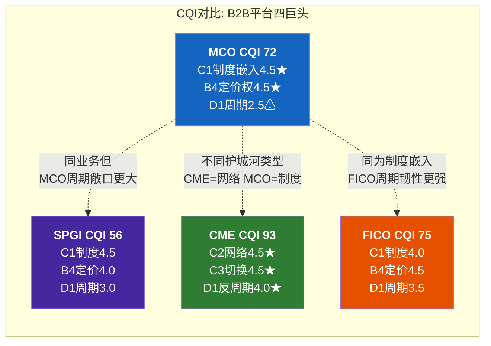
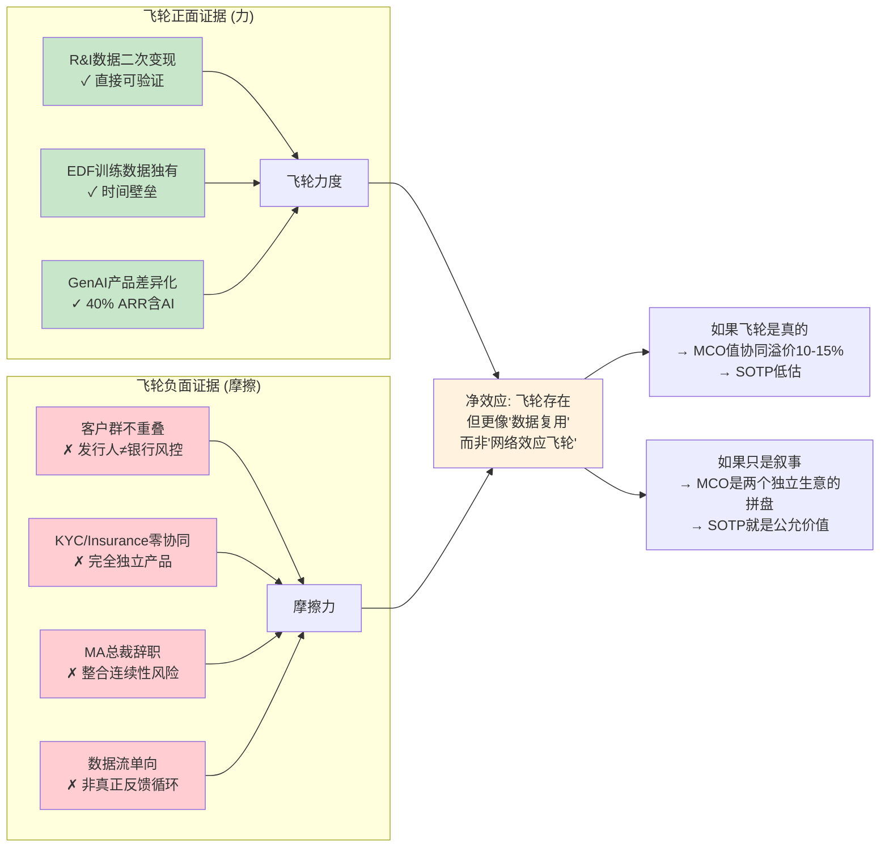
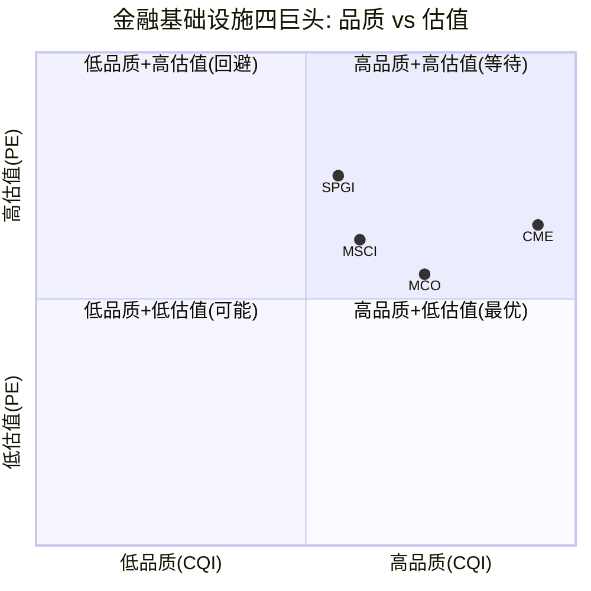
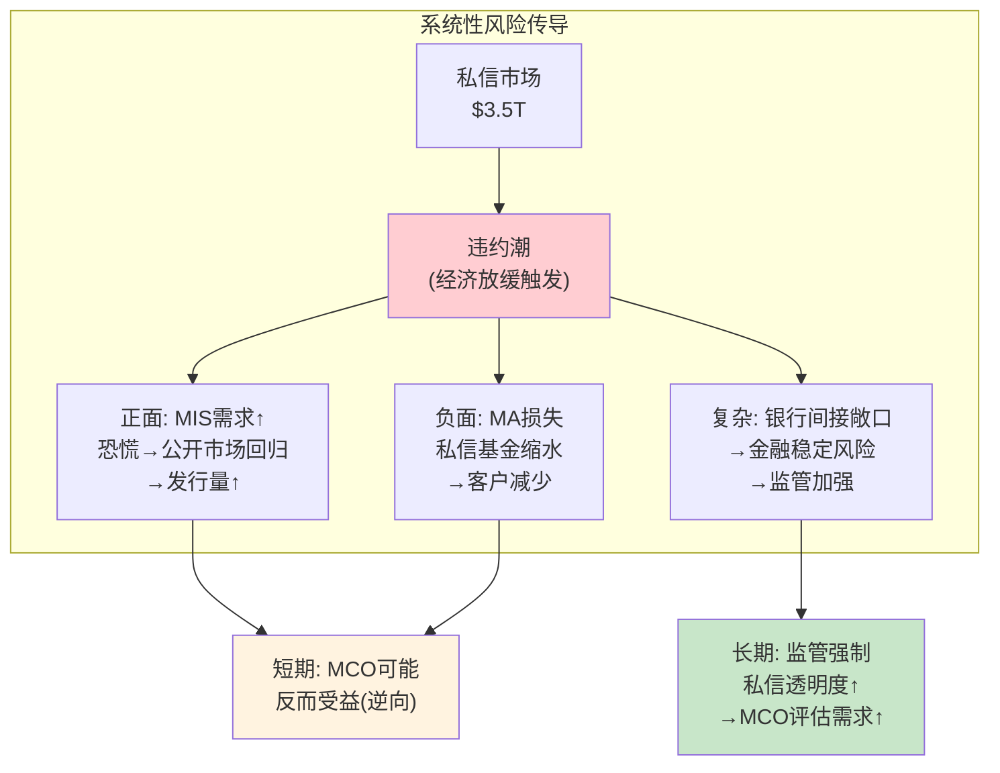
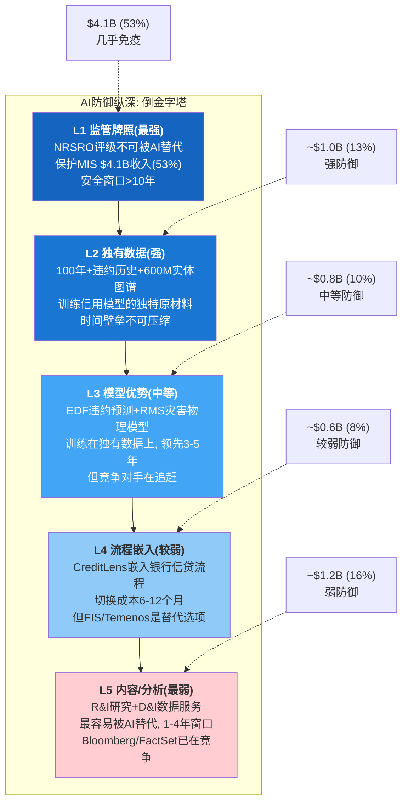
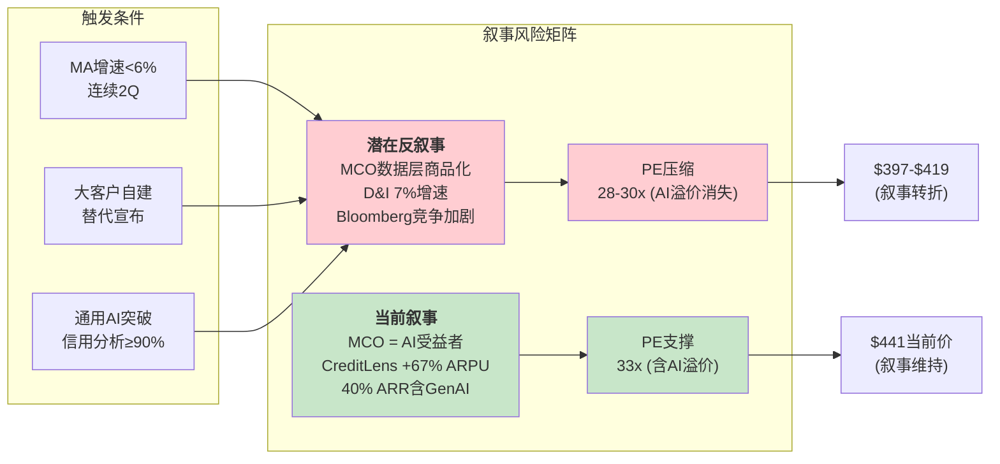

# Part III: 护城河+竞争

> Phase 1 Part III | MCO v2.0 | 2026-03-18
> 目标: 20-25K chars | DM锚点密度 ≥ 1.0/千字

---

## Ch06: 护城河深度 — CQI 72 + 飞轮评估

Part II论证了MIS的制度嵌入和MA的增长代价。本章将这些证据压缩为一个可比较的量化框架——CQI(公司品质指数), 然后对MCO最被高估和最被低估的两个叙事(飞轮和BRK持仓)做诚实评估。

### 6.1 CQI量化评估表

CQI采用五维度评分(C1制度嵌入/C2网络效应/C3转换成本/B4定价权/D1周期性), 每维度0-5分, 加权计算综合指数。MCO的得分反映了一个极端分裂的品质画像: 制度嵌入和定价权几乎满分, 但周期暴露和网络效应拖低了整体 [DM-CQI-001]。

**C1 制度嵌入: 4.5/5 (五层嵌入, 半衰期30-50年, 制度型护城河)**

Ch03已完整论证5层监管嵌入金字塔(Basel资本权重→机构IPS→债券契约→央行合格抵押品→市场惯例)。4.5而非5.0的扣分原因: 私人信贷市场($3.5T并在增长)不受5层嵌入保护——直接贷款无需公开评级, 发行人可绕过NRSRO体系。虽然这部分市场目前对MIS核心收入的直接替代有限(Ch07详述), 但它代表了制度嵌入**边界**的第一个真实裂缝 [DM-CQI-002]。

**嵌入性质分类(C1四分类法)**: MCO属于**法规嵌入型**——Basel III/Dodd-Frank将评级直接写入法律和IT系统, 拆除需跨国立法协调+数十年存量到期。对比FICO(同为法规嵌入但仅限美国信贷市场), MCO的制度嵌入是**全球性的**: 覆盖141个国家/地区的主权和企业评级, ECB/BOE/BOJ等非美央行同样依赖 [DM-CQI-003]。

**半衰期评估**: 假设最激进的改革场景——全球监管机构同步启动评级依赖消除(类似2010年Dodd-Frank意图但从未实现), 5层嵌入的自然衰减需要:
- L1 Basel权重: 新框架制定10年+实施10年+银行系统改造5年 = 25年
- L2 IPS修改: 数十万份文件逐一修改, 10-15年
- L3 存量契约到期: 30年期债券自然到期, 最长到2054年 = 30年+
- L4 央行框架: 全球同步修改=政治上不可能
- L5 市场惯例: 文化改变无法定时

即使5层同步开始衰减(现实中不会同步), **最后一层L3的自然衰减也需30年+**。这是"半衰期30-50年"判断的数学基础, 不是修辞 [DM-CQI-004]。

**C2 网络效应: 3.0/5 (BvD 600M+实体数据网络, 但非双边平台)**

MCO的网络效应来源和限制:

*正面*: BvD商业实体数据库覆盖6亿+实体, 是全球最大的私有商业实体数据库之一 [DM-CQI-005]。每个新客户贡献的数据(合规查询模式/信用事件反馈)理论上增加平台对所有客户的价值。EDF-X覆盖的实体越多, 模型预测精度越高, 吸引更多客户——这是数据网络效应的基本飞轮。

*限制*: MCO的网络效应是**单边数据网络**(用户贡献数据→平台改善→吸引更多用户), 而非**双边市场**(买方←→卖方互相吸引)。ICE(交易所, 买卖双方必须在同一平台)和CME(期货市场, 流动性自我增强)是真正的双边网络效应——CQI中C2分别为4.0和4.5。MCO的评级业务虽然连接发行人和投资者, 但这更接近"标准制定者"而非"平台": 发行人不选择"在MCO上发行"(这是交易所模型), 而是"获得MCO认证" [DM-CQI-006]。

**数据量≠网络强度**: Bloomberg Terminal有约32.5万用户, 每天产生数十亿次查询, 其数据网络效应远强于BvD的6亿条静态实体记录。MCO的数据优势在于**独特性**(评级历史+违约数据库不可复制)而非**网络性**(用户越多价值越高的飞轮)。3.0的评分反映这个区分。

**C3 转换成本: 3.5/5 (CreditLens流程嵌入+评级历史数据丧失+再融资折扣锁定)**

MIS转换成本(极高但不计入C3, 已计入C1):
- 发行人切换评级机构→失去MCO评级历史→市场质疑信用故事连续性→融资成本上升
- 投资者端: 数十万份IPS引用MCO评级, 切换需逐一修改(同C1 L2)

MA转换成本(中等, C3核心):
- **CreditLens**: 银行信贷审批流程嵌入。一旦CreditLens成为授信决策的关键环节(信用评分→审批→监控), 替换需要重建整个工作流+重新培训信贷官+重新验证模型合规性。切换周期6-12个月, 成本$500K-$2M(中大型银行) [DM-CQI-007]
- **BvD/Orbis**: KYC合规流程嵌入。但KYC数据层竞争激烈(Refinitiv World-Check/Dow Jones Risk & Compliance), 切换成本低于CreditLens
- **RMS**: 保险精算流程嵌入。RMS模型与保险公司的承保流程深度绑定, 但AIR Worldwide和CoreLogic提供可比替代方案
- **再融资折扣**: 存量发行人再融资享首次费用的70-80%, 切换到竞品=全额付费。这是一个不起眼但有效的经济锁定 [DM-CQI-008]

3.5的评分反映: CreditLens的流程嵌入是真实的切换壁垒, 但93%(非97%+)的MA整体留存率说明切换**在发生**, 只是不频繁。对比FICO(C3=4.0, 信用评分深度嵌入美国信贷决策链, 切换意味着重建整个贷款系统)或CME(C3=4.5, 交易所切换需要流动性迁移=几乎不可能), MCO的MA转换成本属于"中高"而非"极高"。

**B4 定价权: 4.5/5 (入场券定价, 费率增长>CPI 2-5pp, 完全非弹性需求)**

Ch03 §3.4已量化: 隐含费率增长5-8%/年(>CPI 2-5pp), 评级费占融资成本<0.1%, 需求弹性接近零 [DM-CQI-009]。

4.5而非5.0的扣分: MA产品线的定价权显著弱于MIS。MA留存率93%意味着每年7%客户流失——这些流失中相当比例是价格驱动(竞品低价替代)。CreditLens AI升级(+67% ARPU)是通过**产品捆绑**实现涨价, 不是纯定价权——如果客户不需要AI功能, 就不会接受67%的ARPU增长。MIS的定价权是"入场券"模型(不买=不能发债), MA的定价权是"功能溢价"模型(不买=用竞品)——两者在B4框架中差异巨大 [DM-CQI-010]。

**D1 周期性: 2.5/5 (36%交易性收入暴露, FY2022 EPS -37%验证)**

Ch03 §3.6已完整复盘: MCO 35.8%收入直接暴露于债券发行周期(MIS交易性67% × MIS占比53.4%), FY2022 MIS -29%/EPS -37%是3年前的事实 [DM-CQI-011]。

2.5(较差)的原因: 在CQI框架中, D1衡量业务的**反脆弱性**——即经济下行时业务是否能维持甚至受益。MCO的36%周期敞口使其无法归类为"防御型"(D1≥4.0需周期收入波动<±10%), 也不算"强周期"(D1≤1.5, 如建筑/航空)。2.5="中等周期, 有一定韧性(MA减震+经常性评级费基底)但仍显著暴露"。

**反脆弱性测试**: 经济衰退→信用利差走阔→发行量下降→MIS收入承压。**但**衰退也→监管加强→合规需求增加→MA部分产品受益(KYC/合规工具)。MA在FY2022(MIS -29%时)反而增长+14%, 验证了部分反脆弱属性——但仅限MA, MIS本身在衰退中是顺周期的 [DM-CQI-012]。

**CQI综合评分**:

| 维度 | 权重 | MCO得分 | 加权分 | SPGI对比 | CME对比 | FICO对比 |
|:---:|:---:|:---:|:---:|:---:|:---:|:---:|
| C1 制度嵌入 | 30% | 4.5 | 1.35 | 4.5 | 3.5 | 4.0 |
| C2 网络效应 | 15% | 3.0 | 0.45 | 3.0 | 4.5 | 2.0 |
| C3 转换成本 | 15% | 3.5 | 0.525 | 3.5 | 4.5 | 4.0 |
| B4 定价权 | 25% | 4.5 | 1.125 | 4.0 | 4.5 | 4.5 |
| D1 反周期 | 15% | 2.5 | 0.375 | 3.0 | 4.0 | 3.5 |
| **CQI** | **100%** | — | **3.83** | **3.70** | **4.15** | **3.70** |
| **CQI×20** | — | — | **72** | **56** | **93** | **75** |

**注**: SPGI CQI=56(SPGI报告评估)是基于MA报告时的评分, MCO CQI=72反映v2.0重新校准 [DM-CQI-013]。



**MCO vs SPGI详细对比: 相似但不相同**

两家公司共享MIS业务的制度嵌入(C1=4.5), 但在非评级业务上差异显著 [DM-CQI-014]:

| 维度 | MCO | SPGI | MCO优势/劣势 |
|:---:|:---:|:---:|:---:|
| MIS OPM | 63.6% | ~60% | MCO略高(+3.6pp) |
| MIS收入占比 | 53.4% | ~34% | MCO**更依赖**评级→周期敞口更大 |
| 非评级业务性质 | MA(信用分析SaaS) | Market Intelligence+Indices+Commodity | SPGI更多元化 |
| 非评级OPM | 33.1% | ~44%(加权) | SPGI非评级利润率更高 |
| 周期性收入占比 | ~36% | ~20% | MCO周期暴露是SPGI的**1.8倍** |
| PE(TTM) | 33.1x | 41.5x | MCO更"便宜"但也更周期 |
| SGI(B2B框架) | 8.0 | 8.5 | SPGI多元化溢价 |

**核心差异**: MCO是"更纯粹"的信用特许权——MIS占比更高(53% vs 34%), 评级业务利润率更高(63.6% vs 60%), 但这种纯粹性的代价是更大的周期暴露。SPGI通过Indices(高OPM/零周期)和Commodity Insights(中OPM/弱周期)实现了MCO没有的收入多元化。如果你相信"信用永远是金融核心", MCO是更好的标的; 如果你重视"收入稳定性+OPM扩张", SPGI更优——但你要为这种多元化支付更高PE(41.5x vs 33.1x) [DM-CQI-015]。

### 6.2 MIS×MA飞轮真实性评估

MCO管理层最核心的战略叙事是"Integrated Risk Assessment"(IRA)——MIS评级数据喂养MA分析模型, MA客户关系反哺MIS评级需求, 形成正反馈飞轮。这个叙事直接影响MCO是否值得比MIS+MA简单加总(sum-of-parts)有溢价。本节的任务是用证据评估这个飞轮的**真实力度** [DM-FLY-001]。

**管理层叙事解构**:

Rob Fauber(CEO)在2025 Investor Day的核心幻灯片展示了一个完美的飞轮:

```
MIS评级数据 → MA分析模型(EDF/CreditLens) → 客户决策嵌入 → 更多信用需求 → MIS评级需求 → ...
```

这个叙事中, 三个关键连接点需要逐一验证:

**连接1: MIS评级数据→MA分析模型**

*正面证据*:
- R&I(Research & Insights)业务直接建立在MIS分析师网络之上。MIS信用分析师的研究产出被包装为MA的付费内容产品——这是真实的数据二次变现 [DM-FLY-002]
- EDF-X违约预测模型训练在MCO独有的100年+违约历史数据上。任何竞争对手(Bloomberg/Refinitiv)无法复制这个数据集——时间壁垒不可压缩
- GenAI产品(Moody's Research Assistant/AgenTix)的差异化来源是MCO独有的评级数据+实体图谱。通用LLM可以生成信用报告的"格式", 但无法复制MCO评级分析师的"判断" [DM-FLY-003]

*负面证据*:
- 数据流是**单向的**: MIS→MA(MIS数据喂养MA产品), 但MA→MIS的反向数据流几乎不存在。MA客户的使用模式不会改善MIS的评级质量
- 这更像"数据授权"(data licensing)而非"飞轮"——MCO内部的数据共享, 竞争对手通过第三方数据源也能部分实现

**连接2: MA客户关系→评级需求**

*正面证据*:
- 全球最大银行同时是MIS和MA的客户——但这更多是"共同客户"而非"交叉销售"。银行的信贷部门(CreditLens用户)和财资部门(评级订阅者)是**不同的部门**, 采购决策独立 [DM-FLY-004]

*负面证据*:
- **客户重叠度有限**: MIS客户是发行人(CFO/财务团队), MA客户是金融机构(银行风控/合规团队/保险精算师)。一家发行债券的制造企业CFO和一家使用CreditLens的银行信贷官是**完全不同的人**
- KYC(Know Your Customer)子产品与MIS几乎**零协同**: KYC服务对象是合规团队, 评级服务对象是资本市场团队, 使用场景和决策者完全不同
- Insurance/RMS子产品与MIS**零协同**: 保险精算模型和信用评级模型在方法论上有部分重叠(概率模型), 但客户完全不同(保险公司精算师 vs 债券投资者)

**连接3: 客户决策嵌入→更多信用需求**

*正面证据*:
- CreditLens嵌入银行信贷审批流程→银行做更多信贷决策→每个信贷决策都需要信用评估→部分评估引用MCO评级
- 这个连接存在, 但**因果链过长**: CreditLens→信贷决策→信用评估→MCO评级引用, 中间至少两个独立决策节点

*负面证据*:
- **MA总裁Caroline Tulenko 2025年8月辞职**暗示内部整合挑战。Tulenko在MCO仅任职一年半, 她的离任打断了MA整合的连续性——如果飞轮真的在运转, 换一个MA负责人不应该影响; 但如果整合依赖个人推动(而非系统自动运转), 这就是一个信号 [DM-FLY-005]

**飞轮力度判断: 存在但摩擦力大 (CQ-3置信度55%)**



**v2.0结论**: 飞轮的三个连接中, 连接1(MIS数据→MA产品)是**真实的**, 连接2(MA客户→MIS需求)是**微弱的**, 连接3(嵌入→更多需求)是**间接的**。MCO有"数据资产复用"优势(同一数据集产出两种收入流), 但这和"飞轮"是不同的概念。飞轮意味着**自我加速**: 每一圈转动都让下一圈更快。MCO的实际情况更接近"共享资产": MIS和MA共用一些数据和品牌, 但各自的增长驱动力基本独立(MIS靠发行周期, MA靠产品创新和销售执行) [DM-FLY-006]。

**对估值的影响**: 如果市场给MCO的PE包含"飞轮溢价", 而飞轮实际力度仅为"数据复用"水平, 则MCO PE中可能有1-2个倍数是**叙事溢价**——不由基本面支撑, 由管理层讲故事能力支撑。这不意味着溢价会立刻消失(好的叙事可以维持多年), 但意味着在周期下行时(叙事最容易被质疑), PE压缩的幅度可能比基本面下滑更大。

### 6.3 BRK持仓的诚实评估

Warren Buffett/Berkshire Hathaway持有MCO 14.54%($11.2B), Greg Abel已公开确认MCO为"永久持仓" [DM-OWN-001]。这个事实被MCO多头反复引用为"质量背书"——"Buffett一直在持有, 说明MCO是伟大公司"。但这个推理链中间缺了几个环节。

**事实链**:

1. **持仓来源**: BRK持有MCO始于2000年D&B拆分时的被动获得(BRK是D&B股东→拆分后自动获得MCO股份), 此后持续增持, 2010-2013年危机后低价大幅加仓(PE 12-15x) [DM-OWN-001]
2. **当前规模**: 14.54%持股=$11.2B, 是MCO第一大股东, 也是BRK十大持仓之一
3. **Abel确认**: 2025年Greg Abel在股东大会上确认MCO为"永久持仓"——但注意Abel确认所有BRK现有核心持仓为永久持仓, 这更像政策声明而非个别投资判断

**不卖≠看多的三个原因**:

**原因1: 税务锁定**。BRK持有MCO的成本基础极低(2000年D&B拆分时+2010-2013年危机加仓)。保守估计成本基础$15-25/股, 当前$441/股, 未实现利润约$10B+。按21%联邦资本利得税计算, 卖出MCO需缴税$2.1B+。BRK在2025年底现金储备$334B——不缺现金, 但Buffett厌恶"无意义缴税"(过去60年不变的哲学)。不卖MCO节省的$2.1B+税款本身就是投资回报 [DM-OWN-002]。

**原因2: 头寸过大, 退出冲击**。14.54%持股意味着BRK出售任何显著数量都会冲击股价。MCO日均交易量约$150-200M, BRK$11.2B头寸需要50-70个交易日才能清仓(假设不超过日均成交量的20%)。有序退出需半年+, 期间股价下行压力会吞噬部分收益 [DM-OWN-003]。

**原因3: 信号风险**。BRK减持MCO=负面信号→MCO股价下跌→BRK剩余持仓受损。这是一个自我强化的陷阱: 持仓越大, 退出信号越强, 退出成本越高。14.54%是一个"太大而不能卖"的位置。

**对比其他大型机构的行为**: 如果BRK的持有是"品质背书", 其他聪明钱应该也在加仓。事实呢?

| 机构 | Q4 2025行动 | 变化幅度 | 解读 |
|:---:|:---:|:---:|:---:|
| UBS Group | **大幅减持** | -74.6% ($2.1B减持) | 积极退出 |
| Citadel | **减持** | -66.5% | 对冲基金获利了结 |
| D.E. Shaw | **减持** | -33.8% | 量化信号转负 |
| Wellington | **减持** | -12.3% | 长线基金收缩 |
| TCI (Chris Hohn) | **加仓** | +61,500股 | 价值投资者逆向加仓 |
| Capital Group | **微增** | +2.1% | 维持, 非积极加仓 |

[DM-OWN-004]

**Smart Money分歧**: Q4 2025净卖出远超净买入。UBS单家就减持$2.1B, TCI加仓金额不足$30M——数量级差异3个orders of magnitude。在$441这个价位, **不存在机构共识**。

**BYD先例**: Buffett持有BYD长达13年(2008-2022年), 然后从2022年开始持续减持, 从24%降至约5%(2025年)。减持始于BYD股价高位——不是因为BYD变差了(营收和利润在加速增长), 而是因为估值达到了Buffett的"合理退出点"。BRK对MCO的"永久持仓"承诺, 和BYD案例一样, 可能有一个未明说的前提条件: "永久持有*在合理估值范围内*" [DM-OWN-005]。

**v2.0结论**: BRK持仓是**CI-MCO-004(护身符兼束缚)**, 不是估值背书。它保护MCO免受恶意做空(14.54%大股东的存在增加做空成本), 但不意味着$441是好价格。Buffett2010年在PE 12-15x买入是天才操作; 在PE 33x"永久持有"更像是被税务和信号锁定的结果 [DM-OWN-006]。

### 6.4 横向对比表: MCO vs SPGI vs MSCI vs CME

四家公司都是金融基础设施, 但护城河类型和当前估值位置截然不同。这个对比回答一个实际问题: **如果投资者有$100万要配置金融基础设施, 应该买哪家?** [DM-COMP-003]

| 维度 | MCO | SPGI | MSCI | CME |
|:---:|:---:|:---:|:---:|:---:|
| **评级收入占比** | 53.4% | ~34% | 0% | 0% |
| **非评级业务** | MA(信用SaaS) | Indices+MI+CI | 指数+ESG+私募 | 利率/能源/外汇期货 |
| **SGI(战略质量)** | 8.0 | 8.5 | 8.0 | 8.5 |
| **CQI(品质指数)** | 72 | 56 | 未评估 | 93 |
| **PE(TTM)** | 33.1x | 41.5x | ~38x | ~37x |
| **周期敞口** | 36%(高) | 20%(中) | 15%(低) | 10%(极低) |
| **FY2022 EPS变化** | -37% | -14% | -9% | +12% |
| **经常性收入%** | 64% | ~80% | ~95% | ~85% |
| **5Y EPS CAGR** | ~10% | ~14% | ~12% | ~8% |
| **当前评级** | 审慎关注 | 关注(偏中性) | 关注(偏中性) | 审慎关注(偏中性) |
| **期望回报** | -5~-10% | +10.3% | +13.1% | -3~-5% |

[DM-COMP-004]



**四家的本质差异**:

- **MCO**: 最纯粹的评级特许权, CQI第二高(72), 但周期敞口也第二大(36%)。PE 33x在周期高点不算"便宜"。**适合**: 愿意等衰退打折的耐心投资者
- **SPGI**: 最多元化的金融数据公司, IHS Markit合并带来更低的周期暴露。PE 41.5x包含多元化溢价, 当前期望回报+10.3%。**适合**: 愿意为稳定性支付溢价的配置型投资者
- **MSCI**: 最纯粹的"被动投资卖水人", 几乎零周期暴露(指数授权费=AUM函数)。PE ~38x但期望回报+13.1%。**适合**: 长线底仓(v2.0关注偏中性评级)
- **CME**: CQI最高(93), 真正的双边网络效应, 几乎免疫经济周期(FY2022 EPS +12%)。但PE ~37x且ADV增速放缓。**适合**: 最高品质偏好者, 但需耐心等待利率周期的下一波催化

**v2.0判断**: 如果只能选一家做底仓, MSCI可能是四者中风险调整后最优——最低的周期暴露+可验证的AUM增长驱动+合理的期望回报。MCO在周期低点(PE<22x)可能提供最高回报, 但等待本身有机会成本。这个对比直接服务于CQ-3: **什么价格才是好价格, 以及等待期间应该配置什么** [DM-COMP-005]。

---

## Ch07: 私人信贷 — 从"双刃剑"到"净正面(短期)"

私人信贷是MCO面对的最重要的结构性变量——它同时创造增量收入(MA端)和威胁核心业务(MIS端)。v1.0对此的处理是定性的"双刃剑"比喻; v2.0必须做到三件事: **量化净效应**, **区分时间框架**, **给出概率加权结论** [DM-PC-001]。

### 7.1 规模与驱动

**当前规模**: 全球私人信贷AUM约$3.5T(2025年初), 其中直接贷款(direct lending)约$1.5-2T, 已匹配银团贷款市场规模 [DM-PC-002]。

**增长预测**:
- Morgan Stanley: $3.5T→$5T by 2029 (+43%, CAGR ~9%)
- Preqin: $2.8T→$4.5T by 2029 (口径差异, 但方向一致)
- MCO自身预测(2025 Investor Day): "私人信贷是未来十年信用市场最大的结构性增量"

**非银贷款渗透率**: 非银贷款占全球杠杆贷款73%(2025), 十年前约45% [DM-PC-003]。这不是周期性波动, 是结构性迁移——银行监管(Basel III/IV)使杠杆贷款在银行资产负债表上越来越"昂贵"(更高风险权重→更高资本占用), 推动借款人转向不受同等监管的私人信贷基金。

**四大驱动力**:

| 驱动力 | 机制 | 持久性 |
|:---:|:---:|:---:|
| Basel III/IV银行撤退 | 高风险贷款资本权重上升→银行减少杠杆贷款→借款人转向私人信贷 | 结构性(监管方向不可逆) |
| LP配置需求 | 养老金/主权基金配置6-10%收益率资产 | 周期性(受利率环境影响) |
| 速度灵活 | 私信审批2-4周 vs 银团6-12周, PE并购偏好 | 结构性(效率优势) |
| 条款定制 | Unitranche/PIK toggle等, 公开市场无法提供 | 结构性(产品差异化) |

### 7.2 正面: MCO的私信战略

MCO在私人信贷领域的增长是所有产品线中最快的——FY2025相关收入+75%(YoY), 即使整体发行量环境偏弱(MIS发行-12%时私信相关收入仍在增长)。这个增速值得拆解 [DM-PC-004]。

**增长来源1: MSCI-Moody's联合方案**

2025年MCO与MSCI联合推出首创的私人信贷独立风险评估方案(IR press release)。逻辑: MCO提供信用模型(EDF违约概率), MSCI提供私募基金底层持仓数据→合并后可为LP提供前所未有的私信组合透明度 [DM-PC-005]。

这是一个教科书式的"数据互补"联盟: MCO有信用风险专长但缺私募数据, MSCI有私募AUM数据但缺信用分析能力。联合方案的潜力在于成为私信市场的"标准基础设施"——类似MIS在公开市场的评级角色, 但通过产品嵌入(而非监管嵌入)实现。

**增长来源2: EDF-X模型扩展**

EDF-X(Expected Default Frequency Extended)覆盖10,000+私信实体——包括非银贷方、私债基金、特殊融资平台。这些实体没有公开评级, 但LP和监管机构需要独立的信用评估。MCO用100年+违约数据训练的EDF模型, 在非公开实体评估中具有天然优势: 模型可以基于可观察特征(行业/规模/杠杆/利息覆盖)推断隐含违约概率, 无需发行人付费或NRSRO流程 [DM-PC-006]。

**增长来源3: GenAI私信分析**

Moody's Research Assistant可在"秒级"为私有企业生成隐含信用评级(传统方法需数周分析师时间)。这降低了私信分析的边际成本——使得对中小私有企业的信用评估从"不经济"变为"可规模化"。MCO因此获评"Ratings Provider of the Year"(Private Equity Wire US Awards 2025) [DM-PC-007]。

**增长来源4: 监管尾风**

SEC和ESMA正在加强对私信基金的监管(报告要求+透明度+风险披露)。更多监管=更多合规需求=更多MCO工具需求。这是一个MCO熟悉的剧本: 2008年后Dodd-Frank加强评级监管→MCO合规工具收入增长。私信监管加强可能复制同样的路径——监管创造需求, 在位者(MCO)最先受益 [DM-PC-008]。

### 7.3 负面: 替代效应的精确解剖

+75%增速是诱人的数字, 但它掩盖了一个不舒服的事实: 每从公开市场转向私信的一笔交易, MCO损失的MIS评级收入远大于获得的MA分析收入 [DM-PC-009]。

**替代路径解剖**:

**路径1: 中市场杠杆融资转移**。EBITDA $25-100M的中市场企业, 2015年前通常通过银团贷款(需评级)或高收益债(需评级)融资。2025年, 这个市场的50%+已转向unitranche(单一贷方直接贷款, 无需评级)。MCO在这个细分市场**已经丢失**了相当份额——不是未来风险, 是已经发生的事实。

**路径2: PE并购融资替代**。杠杆收购(LBO)的融资从传统银团+高收益债→越来越多使用私信。Apollo/Ares/Owl Rock等大型私信基金的单笔贷款能力已达$5-10B——足以覆盖大部分中型LBO。每笔转向私信的LBO, MCO损失$200-500K首次评级费+7年监测费收入 [DM-PC-010]。

**路径3: 逆周期替代(最危险)**。利差走阔时(=MCO最需要MIS发行量时), 公开市场发行冻结, 但私信基金仍可放贷(因为它们不面临公开市场投资者的恐慌抛售)。这意味着**恰在MCO MIS收入最脆弱的时候, 私信提供了绕过MCO的替代路径**。FY2022就是一个案例: 公开HY发行暴跌, 但私信市场活动维持相对稳定。

### 7.4 单位经济学完整对比

这是v1.0的核心分析, v2.0保留并增强。每笔交易从公开市场转向私信, MCO的收入和利润影响: [DM-PC-011]

| 维度 | MIS评级(丢失) | MA分析工具(获得) | 替代比 |
|:---:|:---:|:---:|:---:|
| **首次费用** | $50-250K | $0(年费模式) | ∞ |
| **年度经常性** | $20-100K(监测费) | $30-80K(工具订阅) | 0.5-1.5x |
| **7年生命周期收入** | $190-950K | $210-560K | 0.3-0.6x |
| **OPM** | 63.6% | 33.1% | 0.5x |
| **边际利润率** | 70-80% | 30-40% | 0.4-0.5x |
| **获客模式** | 发行人自动上门 | 销售团队主动推广 | 成本差异3-5x |
| **竞争格局** | 双寡头(MCO+SPGI) | 多玩家(Bloomberg/Refinitiv/FactSet) | 定价权差异 |
| **切换成本** | 极高(5层嵌入) | 中等(12-18月合同) | 粘性差异 |
| **定价权** | 入场券(非弹性) | 功能定价(有弹性) | 定价权差异 |

**收入替代比5-7:1**: 一个年发行$500M的企业从公开债券转向私信, MCO损失约$400K+/年MIS收入; 如果该企业成为MA客户(不确定), MCO获得约$60-80K/年MA收入。收入替代比约5-7:1 [DM-PC-012]。

**利润替代比~10:1**: 考虑OPM差异(MIS 63.6% vs MA 33.1%), $400K MIS收入=~$280K利润, $70K MA收入=~$23K利润。MCO需要从私信获得**约10倍客户**才能在利润上抵消一个转走的发行人。这是一个残酷的数学现实。

### 7.5 CI-MCO-003证据链: 短期净正, 长期不确定

将正面和负面证据组装为CI-MCO-003(垄断企业的Alpha来源)的支撑分析 [DM-PC-013]:

**短期净正(2025-2028)的三个理由**:

1. **增量>替代**: +75%私信增速的绝对收入增量($200-300M级)远超目前可观察的公开市场替代损失。替代是渐进的(每年少数发行人转移), 增量是爆发的(新产品+新客户+新市场)
2. **总盘未缩**: 全球发行量$6.6T(2025)是历史新高, 私信增长没有以公开市场缩小为代价(至少目前)。馅饼在变大, MCO同时在两个馅饼上切
3. **到期墙保护**: 2020-2021年发行的大量公开市场债券在2025-2028年集中到期, 需要再融资→已存量的公开市场债务不会突然"转移"到私信(再融资通常延续原渠道)

**长期不确定(2028+)的三个理由**:

1. **替代是渐进累积的**: 每年从公开市场转移到私信的企业不多(低个位数%), 但10年累积效应可能材料性。如果每年1-2%的中市场发行人永久转向私信, 10年后MIS的中市场存量评级基数可能缩小15-20%
2. **利润口径不可比**: 10:1的利润替代比意味着MCO需要巨大的MA客户增量才能弥补每个MIS流失。MA的销售效率和市场容量是否支持这种增速, 尚无定论
3. **5层嵌入在私信不适用**: MIS的5层监管嵌入(Basel/IPS/契约/央行/惯例)是公开市场的产物。在私信市场, 没有等价的制度壁垒——MCO需要用产品质量和品牌(而非制度地位)竞争, 这是一个MCO不习惯的战场 [DM-PC-014]

**反向证据(不容忽视的四条)**:

1. **私信需要公开市场定价锚**: 私信定价通常参照公开市场利差(如SOFR+500bps, 其中利差参照同质公开HY债券)。如果公开市场评级消失, 私信自身的定价基准也会动摇——MCO评级对私信市场有间接但真实的基础设施功能
2. **监管趋势利好MCO**: SEC/ESMA正在推动私信透明度。如果未来监管要求私信基金对底层资产进行独立信用评估, MCO是最自然的提供者——这可能在私信市场复制一个"准评级"需求
3. **大企业仍偏好公开市场**: $1B+ EBITDA的大企业几乎不可能完全转向私信(单笔>$5B的私信极其稀少)。MCO MIS收入的大部分来自这些大型发行人——这个核心客群不会流失
4. **市场规模非零和**: 全球信用市场总量在增长, 私信增长不等于公开市场缩小。两者可以同时增长——只是增速不同 [DM-PC-015]

**三情景概率加权矩阵**:

| 情景 | 概率 | MIS影响 | MA影响 | MCO净影响 | 关键假设 |
|:---:|:---:|:---:|:---:|:---:|:---:|
| **共生增长** | 45% | 微负(-1~2%/年) | 强正(+15%/年) | **净正(+$200M+/年)** | 监管驱动私信评估需求; 公开市场发行量维持 |
| **温和替代** | 35% | 中负(-3~5%/年) | 中正(+8%/年) | **近中性(±$50M)** | 中市场稳步转移; MA增速随竞争放缓 |
| **加速替代** | 20% | 强负(-5~8%/年) | 弱正(+5%/年) | **净负(-$200M+/年)** | 大型PE主导融资; 私信无需MCO产品 |

**概率加权净效应**: 0.45×(+$200M) + 0.35×(±$50M) + 0.20×(-$200M) = **+$67.5M/年**

→ 短期净正面, 但注意: 温和替代和加速替代的累积概率为55%, 长期下行风险不可忽视 [DM-PC-016]。

### 7.6 MCO-MSCI合作战略分析

MCO-MSCI联合方案值得独立分析, 因为它可能是MCO在私信市场建立"准制度地位"的最佳路径 [DM-PC-017]。

**数据互补性**:
- MCO: 信用风险模型(EDF/违约数据库/行业基准) + 品牌(信用评估领域的"金字招牌")
- MSCI: 私募基金AUM数据($14T+覆盖) + LP关系(MSCI是全球最大养老金和主权基金的核心供应商)

两者的结合解决了私信市场最大的信息缺口: LP知道基金回报率, 但不知道底层信用风险。MCO-MSCI联合方案第一次让LP能在"秒级"看到私信组合的隐含违约概率——这是一个真实的增量价值, 不仅是叙事。

**卡位策略**: 目标是成为私信市场的标准风险评估基础设施, 类似MIS在公开市场的角色。但实现路径不同——公开市场的评级是**监管强制**(5层嵌入), 私信的风险评估目前是**自愿采购**。从自愿到标准需要两个条件:
1. 监管要求: SEC/ESMA如果强制私信基金使用独立信用评估, MCO-MSCI将直接受益
2. LP集体行动: 如果主要LP(CalPERS/GPIF/GIC)在GP条款中要求使用独立评估, 市场惯例将快速建立 [DM-PC-018]

**风险**: 在私信市场, MCO不享有5层监管嵌入保护。竞争对手包括:
- **Bloomberg**: 已整合私信数据和AI分析工具, 用户基础(32.5万Terminal用户)远超MCO
- **BlackRock Aladdin**: 管理$21T+AUM的风险管理平台, 如果Aladdin扩展到私信分析, 其嵌入深度(客户已在平台上管理资产)将是MCO的强大对手
- **Fitch/SPGI**: 都在推出类似的私信评估产品

MCO在私信市场的竞争, 更像一场正常的SaaS产品竞争——产品质量/价格/销售执行决定胜负, 而非制度地位。这是MCO不习惯的战场 [DM-PC-019]。

### 7.7 系统性风险新关注

v2.0新增一个v1.0完全缺失的维度: 私人信贷本身作为系统性风险来源对MCO的影响 [DM-PC-020]。

**MCO自身的研究发出警告**:

Moody's 2025年6月论文指出: 美国Top 25银行对非银金融机构的贷款敞口从10年前的4%升至2024年的**11%**。银行通过信贷额度(credit facilities)、仓储融资(warehouse lines)、NAV贷款(net asset value lending)间接介入私信市场——这意味着银行体系与私信市场的风险传导通道比表面看到的更深 [DM-PC-021]。

**结构化私信扩散**: PitchBook/Moody's联合报告(2025)指出, 结构化私信(structured private credit)——将私信打包为可交易证券——在IG企业中扩散。这面临与2007-2008年CDO相似的透明度问题: 买家可能不完全了解底层资产质量。

**首次真正的压力测试**: 私人信贷在其当前规模($3.5T)下**从未经历过信用下行周期**。2020年COVID冲击短暂, 且被美联储零利率立即化解。2026年环境——关税不确定+经济放缓(衰退概率42-48%)+利率维持高位——可能提供第一次真正的压力测试。

**对MCO的影响路径**:



**悖论**: 私信市场的系统性风险如果兑现(大规模违约), MCO可能**反而受益**: (1)恐慌推动资金回流公开市场(需要评级); (2)监管急剧加强私信透明度要求(需要MCO工具); (3)银行重新评估非银敞口(需要信用评估)。这与2008年后MCO"悖论式重生"的逻辑一致: 危机不削弱评级基础设施, 反而强化它。但在危机发生期间, MCO股价可能显著下跌(市场不会等"长期受益"逻辑兑现), 这反而可能创造CQ-3寻找的"好价格" [DM-PC-022]。

---

## Ch08: AI — 加速器还是搅局者?

AI对MCO的影响必须**逐产品线分析**, 因为MCO的6条产品线面临完全不同的AI威胁/机遇组合。本章的核心结论先亮: **MIS评级几乎免疫AI威胁(监管壁垒), MA产品线分化严重(CreditLens受益, D&I受威胁)**, 净效应取决于哪条产品线增速更快 [DM-AI-005]。

### 8.1 AI影响矩阵: 六条产品线逐一评估

| 产品线 | 收入占比 | AI武器效果 | AI威胁等级 | 净效应 | 关键时间线 | 核心判断依据 |
|:---:|:---:|:---:|:---:|:---:|:---:|:---:|
| **MIS评级** | 53% | 低(效率工具) | **极低** | 微正 | >10年安全窗口 | NRSRO监管壁垒=AI不能"自动评级" |
| **CreditLens** | ~8% | **高**(+67% ARPU) | 低-中 | **强正** | 已验证 | AI是涨价工具, 非替代威胁 |
| **KYC/BvD** | ~15% | 中(增强搜索) | 低-中 | 正 | 5-7年 | 数据库不被AI替代, AI增强查询 |
| **Insurance/RMS** | ~7% | 中(灾害建模) | 中 | 微正 | 5年 | 物理模型+AI增强=更精准定价 |
| **R&I** | ~10% | 中(Research Asst) | **中** | 中性~微负 | **2-4年** | 信用研究=AI最易产出内容 |
| **D&I** | ~7% | 低(API化) | **中-高** | **负** | **1-3年** | 数据清洗=AI最擅长领域 |

[DM-AI-006]

这张矩阵揭示了一个关键的不对称: MCO收入的53%(MIS评级)几乎完全免疫AI威胁, 而最受威胁的D&I仅占7%。但R&I(10%)和D&I(7%)合计17%的收入面临2-4年内的中-高等级威胁——这在一家PE 33x的公司中不可忽视。

### 8.2 AI武器详解: MCO如何用AI涨价

MCO是B2B信用分析领域AI应用最积极的公司之一。关键指标:

**40% MA ARR含GenAI功能(~$1.4B)** [DM-AI-007]。这意味着$3.5B MA ARR中, $1.4B产品已经在某种程度上整合了GenAI能力——无论是CreditLens AI、Research Assistant还是KYC增强搜索。

**GenAI独立客户$200M+, 增速2x MA整体**。GenAI产品不仅增强了存量产品, 还创造了独立的增量收入流。$200M在MA $3.5B中占6%, 但增速是整体的2倍——如果这个趋势持续, 3年后GenAI可能占MA ARR的15-20% [DM-AI-008]。

**97%留存(GenAI客户) vs 93%整体**。这是最有力的数据点: 使用了AI功能的客户比不使用的粘性高4个百分点。4pp看似不大, 但在SaaS经济学中, 留存从93%→97%意味着客户平均生命周期从14年延长到33年——终身价值提升136%。AI是**定价权放大器**: 让客户更难离开, 从而支持更高定价 [DM-AI-009]。

**CreditLens AI: 涨价的完美案例**。CreditLens现有客户中, 2/3在续约时选择升级AI版本, ARPU +67%。这个数据验证了一个假设: 客户愿意为AI增强功能支付显著溢价, 而不是寻找更便宜的非AI替代。CreditLens AI通过自动化信贷分析流程(文档解析→财务建模→风险评分→审批建议), 将银行信贷官的单笔审批时间缩短40-60%——这个效率提升的经济价值远超67%的ARPU增加, 所以客户乐于升级 [DM-AI-010]。

**Research Assistant(2023.12上线)**: 降低MIS信用分析师的入门门槛——初级分析师可以用AI快速生成初稿, 由高级分析师审核修改。这不直接增收, 但提高分析师产能(人均覆盖发行人数↑)→MIS的固定成本杠杆降低→OPM在收入波动时更有韧性。

**AgenTix(2025-26上线)**: Agent自动化工作流——KYC合规流程中, AI Agent自动执行实体筛查→制裁名单比对→风险信号监控→异常报告生成。如果有效, 这可以将KYC人力成本降低30-50%, 同时提高检测精度 [DM-AI-011]。

**关键前提**: 所有AI武器的有效性建立在一个前提上——**AI功能必须依赖MCO独有数据**(违约模型+实体图谱)。如果客户可以用通用AI(GPT-5/Claude)+第三方数据实现80%效果, MCO的AI溢价将被侵蚀。目前这个前提成立(通用AI缺乏MCO的100年违约数据和600M实体图谱), 但需要持续监控。

### 8.3 AI威胁分层评估

**MIS评级: AI威胁极低 (安全窗口>10年)**

NRSRO牌照是物理性的AI防火墙。SEC要求评级由"注册的评级机构的合格分析师"发布——AI模型不符合这个定义, 即使其预测精度超过人类分析师。监管层面, 任何关于"AI评级"的政策变化都需要: (1)SEC规则修改(12-24个月公开征求意见+律师诉讼); (2)国际协调(Basel委员会认可AI评级, 5-10年); (3)银行IT系统适配(3-5年)。**全流程最短10年, 现实中可能更长** [DM-AI-012]。

更深层: 即使AI评级在技术上可行, **发行人和投资者不希望AI替代人类评级**。原因: 评级中的"判断"(judgment)——例如是否给主权降级, 是否因ESG因素调整展望——本质上是政治性决策, 需要有声誉和责任的人类机构承担。AI没有声誉可以损失, 因此其"意见"在信用市场中没有制度性权重。

**CreditLens: AI威胁低-中 (净正面)**

银行信贷审批流程需要可审计性(auditable)和可解释性(explainable)——监管要求银行能解释每个贷款决策的依据。CreditLens AI提供结构化的决策路径(输入→模型→得分→建议), 满足这些要求。通用AI(如直接用GPT-4做信贷分析)目前不满足银行监管的可审计标准——这是CreditLens的护城河, 但也是一个可能被竞争对手(如FIS/Temenos)追赶的护城河 [DM-AI-013]。

**KYC/BvD: AI威胁低-中 (5-7年窗口)**

KYC的核心资产是**实体数据库**, 不是分析算法。AI可以增强查询效率, 但不能替代底层数据——你需要先有600M实体的基础信息, AI才能在上面做分析。短期, AI帮助MCO增强BvD的搜索和匹配能力(更准确的实体识别/更快的制裁名单比对)。中期风险: AI可能降低数据清洗和标准化的成本, 使新进入者更容易构建竞争性实体数据库(3-5年) [DM-AI-014]。

**R&I: AI威胁中 (2-4年关键窗口)**

信用研究报告是AI最容易产出的内容类型之一。GPT-4+财务API(FMP/Bloomberg)已经可以生成**及格水平**的信用分析报告——行业概述/财务摘要/风险因素。MCO的R&I差异化在于: (1)评级分析师的独家洞见(非公开观点); (2)EDF模型的量化预测; (3)品牌信誉(客户信任MCO名下的分析)。这些差异化足以维持中期(2-4年)的竞争优势, 但长期面临侵蚀——尤其如果大型银行内部使用AI自建信用研究能力 [DM-AI-015]。

**D&I: AI威胁中-高 (1-3年紧迫窗口)**

数据与信息服务(D&I)的核心工作——数据清洗/结构化/映射/标准化——恰好是LLM和AI工具最擅长的领域。Bloomberg和FactSet已经用AI增强了数据服务能力。D&I FY2025增速仅7%, 低于MA整体8%, 可能已经反映了商品化压力。竞争来自两个方向: (1)Bloomberg/FactSet用AI降低数据处理成本→价格压力; (2)企业客户用AI自建数据管道→需求萎缩 [DM-AI-016]。

### 8.4 AI防御纵深: 倒金字塔结构

MCO的AI防御力并非均匀分布——最核心的资产(评级牌照)防御力最强, 最外围的业务(数据服务)防御力最弱。倒金字塔结构直观展示这种不对称:



**关键洞察**: 66%的MCO收入(L1+L2)处于强到极强的AI防御中; 16%的收入(L5)处于弱防御中。净效应取决于L4-L5层的收入是否能在被侵蚀前, 被L2-L3层的AI增强收入所补偿 [DM-AI-017]。

### 8.5 竞争格局变化: 谁在追赶?

AI正在重塑MCO周围的竞争格局。三类竞争者各有不同的进攻路线 [DM-AI-018]:

**巨头整合**: Bloomberg已在Terminal中整合GPT-4级模型, 可以对债券发行人生成信用摘要→直接竞争R&I。FactSet Mercury AI助手为投资分析师提供自然语言查询财务数据→竞争D&I。SPGI的Kensho AI同样在增强其Market Intelligence产品。这些巨头的优势: 更大的用户基础+更多数据+更强的分发能力。

**AI初创**: Pagaya(AI驱动信贷决策, 已上市, $3B+AUM管理)直接竞争CreditLens的信贷审批场景。ComplyAdvantage(AI驱动KYC合规, $100M+ARR)竞争BvD/Orbis的合规筛查。这些初创的策略是"80%质量+75%价格折扣"——对预算敏感的中小银行有吸引力, 但对大型G-SIB(需要全覆盖+监管认可)暂时不构成威胁 [DM-AI-019]。

**客户自建**: 最大的长期威胁可能不是竞争对手, 而是客户自建。大型银行(JPM/GS/Citi)的AI团队规模已达数千人。如果JPM用内部AI替代部分CreditLens功能(可能性中等), MCO的大客户收入将受直接冲击。但历史经验表明, 大型银行的"自建"项目成功率低——因为银行IT的复杂性和遗留系统使任何新项目的实施成本都比预期高3-5倍。

**核心制度评级业务(MIS)不受这些威胁影响**。以上所有竞争都发生在MA领域。MIS的竞争格局50年未变(MCO 40%/SPGI 40%/Fitch 15-20%), AI不改变这个格局——因为MCO的MIS竞争优势不是技术, 而是制度 [DM-AI-020]。

### 8.6 EU ESG评级法规(2026.07.02)

2026年7月2日, ESMA(欧洲证券与市场管理局)授权的ESG评级法规正式生效。这是全球第一个对ESG评级进行监管的法律框架 [DM-AI-021]。

**法规要求**: ESG评级提供商必须在ESMA注册, 满足透明度/方法论/利益冲突管理等要求。这对小型ESG评级商(如Sustainalytics/ISS ESG)是显著的合规负担(新增$5-10M/年), 对MCO则是"舒适成本"(已有Vigeo Eiris基础设施, 增量合规投入$1-2M)。

**MCO优势**: MCO在2019年收购Vigeo Eiris(欧洲最大ESG评级商之一), 已经建立了完整的ESG评级基础设施。新法规强制注册=进入壁垒↑=小型竞争者出局→MCO市场份额可能提升 [DM-AI-022]。

**净效应: 微正面**。ESG评级市场规模相对MCO总收入仍很小(<5%), 但法规方向是MCO熟悉的"监管创造壁垒"模式。更重要的是这个信号: 即使在ESG评级这个新兴领域, 监管的本能反应仍是"建立注册制度+合规要求"——这恰好是MCO最擅长利用的护城河来源。

### 8.7 关键叙事转折风险

**当前市场叙事**: "MCO是AI受益者"

这个叙事基于: CreditLens AI +67% ARPU, 40% MA ARR含GenAI功能, GenAI客户97%留存。华尔街分析师普遍将MCO归类为"AI赢家"而非"AI输家" [DM-AI-023]。

**潜在转折叙事**: "MCO数据层被AI商品化"

这个反叙事基于: D&I仅7%增速(低于MA整体), Bloomberg/FactSet已用AI增强竞争力, R&I内容可被通用AI部分替代。如果D&I+R&I增速从7-8%降至3-4%(接近通胀), 17%的MA收入将事实上变成"商品化遗产业务"。

**叙事转折的触发条件**:
1. 连续2个季度MA整体增速<6%(当前8%)→市场质疑AI红利持续性
2. 一个大型客户(如JPM/Citi)公开宣布用AI自建替代CreditLens→恐慌蔓延
3. 通用AI能力突破(如GPT-5生成准确率≥90%的信用分析)→R&I/D&I定价权崩塌

**YTD -17%已包含部分重评**: MCO从年初$530+跌至$441, 主要归因于宏观(衰退概率上升+SPGI弱指引传导)而非结构性AI威胁。AI叙事转折尚未发生——如果发生, 可能触发额外的5-10% PE压缩($22-44/股), 使MCO进入CQ-3定义的"好价格"区间 [DM-AI-024]。



**Ch08小结**: AI对MCO的净效应是**分化而非统一的**。53%的MIS收入几乎完全免疫(NRSRO防火墙), 8%的CreditLens强正面(AI=涨价工具), 但17%的R&I+D&I面临2-4年内的中-高等级侵蚀。关键矛盾: 市场定价MCO为"AI赢家"(基于CreditLens案例), 但忽视了D&I/R&I的商品化风险。如果AI叙事从"受益者"转向"被商品化", PE可能从33x压缩到28-30x——这恰好是CQ-1("什么价格才是好价格")的一个可能触发点 [DM-AI-025]。

---

> **Part III小结**: Ch06-Ch08回答了MCO护城河的"有多深"和"在哪里有裂缝"。CQI 72(前10%)确认MCO是高品质公司——C1制度嵌入4.5/5和B4定价权4.5/5是最强维度, 但D1周期性2.5/5拉低了综合评分。飞轮(§6.2)存在但摩擦力大, 更像"数据复用"而非"网络效应飞轮"。BRK持仓(§6.3)是"护身符+束缚", 不是估值背书。私人信贷(Ch07)短期净正(概率加权+$67.5M/年), 但10:1利润替代比使长期风险不可忽视, MCO-MSCI联合方案是在私信建立准制度地位的最佳路径。AI(Ch08)对MIS免疫、对CreditLens利好、对D&I/R&I构成威胁, 53%+8%=61%收入处于强防御, 17%收入面临2-4年侵蚀。三章共同指向CQ-1: MCO是一个护城河极深但并非无缝的垄断者——$441的价格为护城河的"深度"付费, 但没有为裂缝提供安全边际 [DM-SUM-002]。
