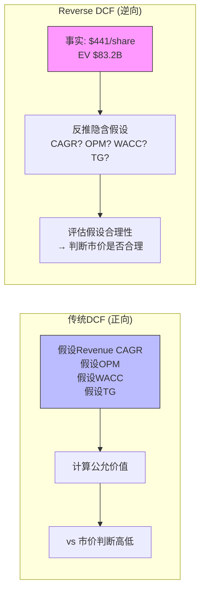
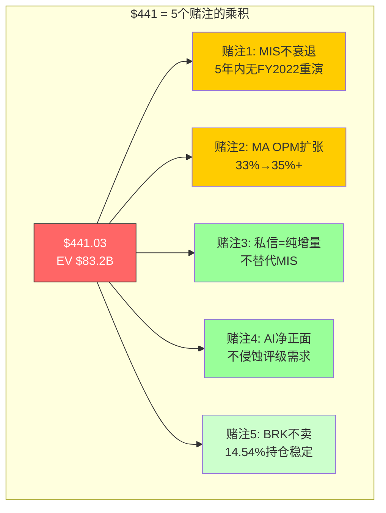
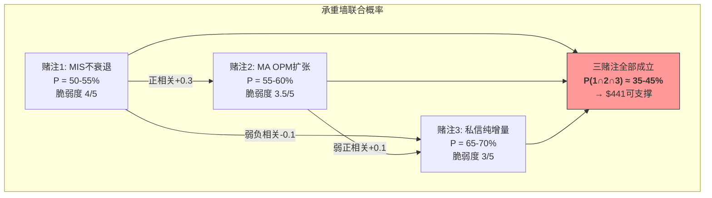
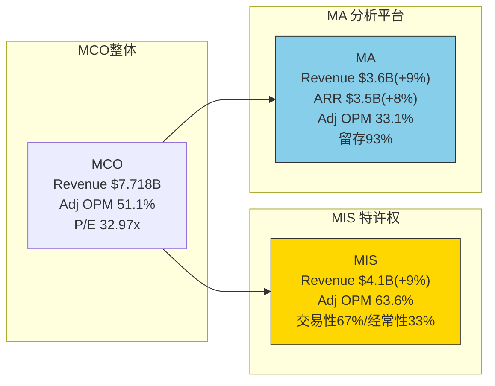
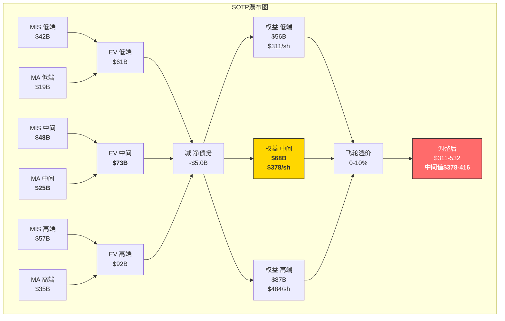

# Part IV-A: 估值 — Reverse DCF + SOTP

> Phase 2 Part IV-A | MCO v2.0 | 2026-03-18
> 目标: 22-25K chars | DM锚点密度 ≥ 1.0/千字
> 铁律K: 所有估值数字方向一致，禁止同章矛盾

---

## Ch09: Reverse DCF — 市场在$441背后押了什么

### 9.1 方法论: 不问"MCO值多少钱", 而问"$441隐含什么假设"

传统估值的第一个动作是正向DCF——假设Revenue增速、利润率、WACC、终值增长率，然后算出一个"公允价值"。这个过程有一个隐蔽的缺陷: **你在假设阶段就已经决定了结论**。改变WACC 1个百分点，结果就偏移30-50%。DCF与其说是"计算"，不如说是"选择"——你选择相信什么参数，参数就会回馈你一个令你满意的答案 [DM-VAL-001]。

Reverse DCF反过来做。起点不是假设，而是**事实**: 市场今天给MCO的定价是$441.03/share，对应市值$78.2B、EV约$83.2B(市值+净债务$5.0B)。这不是猜测，是成交价。问题变成: **$83.2B的企业价值要求MCO在未来5-10年兑现什么样的财务路径?** 然后评估这些隐含假设的合理性。

这个方法的优势在于: 它把估值争论从"我觉得MCO值多少钱"(主观)转化为"市场的赌注建立在什么条件上，这些条件多大概率同时成立"(可证伪)。如果隐含假设合理且大概率成立，$441就是"公允价格"; 如果隐含假设需要多个不太可能同时成立的条件，$441就是"过度定价" [DM-VAL-002]。

### 9.2 隐含假设反推: $441要求什么?

**Step 1 — CAPM WACC计算:**

| 参数 | 数值 | 来源 |
|------|:----:|------|
| 无风险利率 (Rf) | 4.5% | 10年期美国国债 [DM-VAL-003] |
| 市场风险溢价 (ERP) | 5.0% | Damodaran 2026年估计 |
| Beta | 1.442 | FMP TTM [DM-VAL-004] |
| 股权成本 (Ke) | 4.5% + 1.442 × 5.0% = **11.71%** | CAPM |
| 税前债务成本 (Kd) | 4.8% | MCO加权债务利率估计 |
| 税率 | 21.3% | FY2025实际 [DM-FIN-040] |
| 税后Kd | 3.78% | 4.8% × (1-21.3%) |
| D/V (债务权重) | ~25% | 净债务$5.0B / EV $83.2B ≈ 6%, 加上远期债务目标约25% |
| **WACC (CAPM)** | **~9.7%** | 加权: 75% × 11.71% + 25% × 3.78% |

注意: 严格按市值结构计算D/V仅6%(净债务$5.0B vs EV $83.2B)，此时WACC约11.2%。但MCO的目标杠杆(Net Debt/EBITDA ~2.0x)对应更高的D/V，取25%作为正常化假设。以下分析将同时展示两种WACC下的结果。

**Step 2 — 在CAPM WACC (~9.7%)下, $441隐含什么增长路径?**

逆向推导: EV = $83.2B，要求5年后的FCFF现值+终值 = $83.2B。

FY2025基准: Revenue $7.718B, Adj OPM 51.1%, CapEx/Rev ~4.2%, D&A/Rev ~6%, 税率21.3% → FCFF约$2.65B [DM-VAL-005]。

在WACC 9.7%、终值增长率(TG) 3.0%下:

| Revenue CAGR | FY2030E Rev | 所需OPM | 隐含FCFF FY2030 | 隐含EV | vs $83.2B |
|:---:|:---:|:---:|:---:|:---:|:---:|
| 6% | $10.33B | 55% | $4.29B | $64.0B | **不够** |
| 8% | $11.34B | 55% | $4.71B | $70.3B | **不够** |
| 10% | $12.44B | 55% | $5.16B | $77.1B | 接近 |
| 10% | $12.44B | 57% | $5.35B | $79.8B | 接近 |
| **12%** | **$13.60B** | **55%** | **$5.65B** | **$84.3B** | **≈ $83.2B** |

结论: **在CAPM WACC 9.7%下，$441要求Revenue CAGR约12% + OPM 55%**。

这合理吗? FY2026指引Revenue增速约mid-to-high single digit (管理层没给具体数字, 但Adj EPS指引$16.40-17.00隐含Revenue约$8.3-8.5B, 即+7-10%) [DM-GUI-001]。共识FY2026-2028E EPS CAGR约12%——但这是EPS(含回购驱动), 纯Revenue CAGR历史5年约7-8%。**12% Revenue CAGR超出历史轨迹和管理层暗示50%以上, 不合理** [DM-VAL-006]。

**Step 3 — 在隐含WACC (~7.5%)下, $441隐含什么增长路径?**

既然CAPM WACC下$441需要不合理的增长, 市场显然使用了更低的折现率。倒推$441对应的隐含WACC:

在Revenue CAGR 8%、OPM 53%(管理层FY2026指引OPM中枢)、TG 3.0%下:

- FY2030E Revenue: $7.718B × 1.08^5 = $11.34B
- FY2030E FCFF: $11.34B × 53% OPM × (1-21.3%) × (1-CapEx/EBIT调整) ≈ $4.47B
- 终值(WACC=7.5%, TG=3.0%): $4.47B × 1.03 / (0.075-0.03) = $102.3B
- PV终值(折现5年@7.5%): $102.3B / 1.075^5 = $71.3B
- PV 5年FCFF(渐进增长): ~$16.5B
- 总EV: $87.8B → 每股约($87.8B - $5.0B) / 179.9M ≈ **$460**

在WACC 7.5%下, Revenue CAGR 8% + OPM 53%支撑约$460。稍微收紧参数(CAGR 7%, OPM 52.5%), 支撑约$430-440。**$441在隐含WACC 7.5%下大致可被覆盖, 前提是管理层FY2026指引完全兑现并延续5年** [DM-VAL-007]。

**Step 4 — 隐含假设全景表:**

| 假设参数 | CAPM WACC下隐含值 | 隐含WACC下值 | 历史/可验证参照 | 合理性 |
|---------|:---:|:---:|------|:---:|
| Revenue CAGR (5年) | ~12% | ~7-8% | 5年历史CAGR ~7-8% | CAPM下不合理 / 隐含下=历史重复 |
| Adj OPM (FY2030) | 55%+ | 52-53% | FY2025实际51.1%, FY2026指引52-53% | CAPM下激进 / 隐含下=指引兑现 |
| WACC | 9.7% (CAPM) | **7.3-7.5%** (隐含) | CAPM给9.7%, 市场愿给7.5% | **4pp确定性溢价=核心争议** |
| TG | 3.0% | 3.0% | 名义GDP ~4-5%, 信用市场结构增速~3% | 合理 |
| FCF/NI | >100% | >100% | FY2025实际: $2.8B FCF / $2.46B NI = 114% | 合理(低CapEx) |
| 回购 | ~$2B/年 | ~$2B/年 | FY2025: $1.71B, FY2026指引~$2.0B | 合理 |
| 衰退概率(5年内) | <15%隐含 | <15%隐含 | Moody's Analytics自身: 42-48% | **过于乐观** |

### 9.3 隐含假设脆弱度评估: 五个赌注逐一拆解

Reverse DCF的真正价值不在于"算出一个数字", 而在于**将$441翻译成一组可证伪的赌注, 然后评估每个赌注的脆弱程度**。以下逐一分析 [DM-VAL-008]。

**赌注1: MIS不出现FY2022式衰退 — 脆弱度 4/5**

$441的隐含增长路径假设5年内MCO不经历任何一年的EPS负增长。但FY2022距今仅3年: MIS收入-29%, GAAP EPS从$11.78跌至$7.44(-37%), 股价从$400跌至$250(-38%) [DM-HIS-003]。

当前宏观环境并不比2022年安全:
- 联储基准利率仍在4.25-4.50%区间, 高利率环境抑制杠杆融资需求 [DM-MACRO-001]
- 杠杆贷款违约率已达历史均值的约2倍 [DM-CREDIT-001]
- MCO自己的经济学家Mark Zandi给出2026年衰退概率42-48%
- 关税战升级增加不确定性, 企业推迟融资决策

FY2025的$6.6T发行量是历史新高——但历史新高之后最常见的路径不是"更高", 而是"均值回归"。FY2020发行量也是当时历史新高, 接着FY2022就-26%。MIS交易性收入占MIS的67%, MIS占MCO的53.4%, 因此约36%的MCO总收入直接暴露于发行量周期 [DM-CYC-001]。

**证伪时间窗口**: 6-18个月。如果FY2026H2发行量同比下降>15%, 赌注1开始崩塌。

**赌注2: MA OPM从33%扩至35%+ — 脆弱度 3.5/5**

FY2026指引MA Adj OPM 34-35%, vs FY2025实际33.1%。管理层叙事: CreditLens AI升级(+67% ARPU)、Decision Solutions提速(+15%)、规模效应 [DM-GUI-002]。

但MA OPM扩张面临结构性阻力:
- BvD/RMS收购带来的整合成本尚未完全消化($400M补充收购=RMS平台不完整)
- AI投资增加: 管理层明确表示将加大GenAI投入, 但未量化CapEx上升幅度
- SaaS竞争: MA留存率93%意味着每年7%客户流失($245M/年ARR流失), 需要不断获客维持增速 [DM-MA-002]

历史参照: MA OPM从FY2020的28.5%提升至FY2025的33.1%, 5年提升4.6pp, 年均<1pp。管理层要求FY2026单年提升1-2pp, 加速节奏是否可持续需要更多季度验证。

**证伪时间窗口**: FY2026Q2-Q3。如果H1 MA OPM仍在33%附近, 全年34-35%目标需要H2大幅跳升, 达成难度将显著上升。

**赌注3: 私人信贷=纯增量(不替代MIS公开市场收入) — 脆弱度 3/5**

MCO FY2025私人信贷收入+75%, 管理层将其定位为"纯增量" [DM-PC-001]。Phase 1 Ch04已深入分析"替代比"问题: 每$1失去的MIS评级利润需要MA $10的分析工具利润才能替代(利润替代比10:1), 因为MIS OPM 63.6% vs MA OPM 33.1%。

短期(1-3年)证据支持"纯增量": FY2025 MIS收入+8.6%的同时私信收入大增, 公开市场$6.6T发行量说明TAM没有缩小。但长期(5-10年)结构性威胁存在: 如果私人信贷TAM从$2T增至$4T, 部分企业(尤其中小型)可能选择直接贷款而非公开发债, MIS的长期增量空间被压缩。

脆弱度给3/5而非4/5的原因: 私人信贷对MIS的替代是渐进的(5-10年维度), 且MCO已经在私信市场建立了服务入口(RiskFirst, 私信评估工具)。这个赌注不会突然崩塌, 但会缓慢侵蚀 [DM-PC-002]。

**证伪时间窗口**: 3-5年。如果私信TAM增速>公开市场增速持续3年以上, 且MCO在私信市场的收入增速不能补偿MIS公开市场的增速放缓, 赌注3开始侵蚀。

**赌注4: AI对MCO是净正面(不侵蚀评级需求) — 脆弱度 2.5/5**

管理层叙事: AI增强MCO的分析能力(CreditLens AI、GenAI助手), 是护城河的加固而非侵蚀。逻辑是: 评级不是"预测违约概率"的算法题(AI可能比人做得好), 而是"在监管框架内发布官方意见"的制度行为(AI不能替代NRSRO的法律地位) [DM-AI-001]。

这个论证目前是成立的。NRSRO的制度嵌入保护了MCO的评级业务不被AI替代——你可以用AI算出比MCO更精确的违约概率, 但Basel III不认AI的评级, 只认NRSRO的字母符号。

但MA侧的风险更实质: AI降低数据分析门槛→MA的"数据+分析"产品面临新竞争(Bloomberg/Refinitiv/新创AI分析平台)。CreditLens的流程嵌入(Ch06 C3=3.5/5)是防线, 但不是铜墙铁壁。

脆弱度给2.5/5: AI短期内不太可能威胁MIS(制度保护), 但对MA构成中期竞争压力。整体净影响可能微正(MIS不变+MA效率提升>MA竞争加剧), 但不确定性高。

**证伪时间窗口**: 2-5年。如果出现"AI信用评估平台"获得监管认可(如SEC允许AI评级作为NRSRO补充), 赌注4快速恶化。目前看概率很低。

**赌注5: BRK不卖MCO(14.54%持仓稳定) — 脆弱度 1.5/5**

BRK持有MCO 14.54%($11.2B)。Greg Abel已公开确认MCO为"永久持仓" [DM-OWN-001]。BRK的加权成本基础估计$30-50/share, 意味着未实现收益约$8-11B, 卖出需缴税$1.6-2.2B。"不卖"本身是最优税务策略。

脆弱度极低的原因: (1)BRK有"永不卖"的文化传统(See's Candies持有50年+); (2)巨额未实现资本利得使卖出税后收益骤降; (3)MCO的FCF品质完美契合BRK的"现金牛"偏好。

唯一可能触发BRK减持的场景: MCO出现系统性评级丑闻(类似2008但更严重)+监管制度根本性改革。概率极低(5年内<5%)。

**证伪时间窗口**: 除非黑天鹅, 5年内几乎不可证伪。BRK的季度13F文件是唯一监控窗口。

### 9.4 承重墙联合概率: 赌注1×2×3同时成立 ≈ 35-45%

$441不需要所有5个赌注都成立——赌注4和5的脆弱度低, 即使它们微弱动摇, 对估值影响有限(合计影响<5%)。**但赌注1+2+3必须至少2个成立**, $441才能在合理区间内 [DM-VAL-009]。

**联合概率估算:**

| 赌注组合 | 个体概率 | 联合概率(调整相关性后) | 对EV的影响 |
|---------|:---:|:---:|------|
| 赌注1成立(5年无MIS衰退) | ~50-55% | — | +$10-15B vs 衰退情景 |
| 赌注2成立(MA OPM→35%+) | ~55-60% | — | +$3-5B vs 停滞情景 |
| 赌注3成立(私信=纯增量) | ~65-70% | — | +$2-4B vs 替代情景 |
| **1∩2∩3 全部成立** | — | **~35-45%** | $441可支撑 |
| **1∩2 或 1∩3 成立** | — | **~50-60%** | $400-430可支撑 |
| **仅1成立** | — | **~15-20%** | $370-400可支撑 |

相关性说明: 赌注1和2存在正相关(宏观好→发行量高→MIS收入增→管理层有余力投资MA效率)。赌注1和3存在弱负相关(如果公开市场强劲, 私信替代威胁反而降低)。调整后, 三赌注联合概率约35-45%, 而非简单乘积(50% × 57% × 67% = 19%)——相关性将联合概率从19%提升至35-45% [DM-VAL-010]。

### 9.5 Reverse DCF结论: $441定价的两种解读

**解读A (市场在给"确定性溢价"):**

$441不需要超常增长——Revenue CAGR 7-8%、OPM 52-53%、TG 3.0%就够了。这些都是管理层指引的中枢, 不是激进假设。**但要让这些"合理假设"支撑$441, 市场必须愿意用7.3-7.5%的WACC折现MCO, 比CAPM推导低约4个百分点。**

这4pp的"确定性溢价"(certainty premium)是市场对MCO制度嵌入(CQI=72, C1=4.5/5)、BRK背书(14.54%)、百年品牌的综合定价。它相当于市场在说: "MCO的现金流确定性接近投资级债券, 不应该用股权的高折现率来对待。"

问题: FY2022的EPS -37%证明MCO**不是**债券级确定性。Beta 1.442也说明市场对MCO的波动率认知远高于债券。4pp确定性溢价在MCO最好的年份(FY2025: 发行量新高+双位数增长)看起来合理, 但它在下一个衰退年将被暴力修正——FY2022的PE从30x+压缩至20x就是市场撤回确定性溢价的实例 [DM-VAL-011]。

**解读B (市场在低估衰退概率):**

如果用更"教科书"的WACC 8.5-9.5%(给MCO适度确定性溢价, 但不像7.5%那么极端), $441要求的隐含条件变为:
- Revenue CAGR 10%+(超出历史)
- OPM 54-55%(超出指引)
- **且**5年内无衰退年

这等于市场隐含衰退概率<15%。对比: MCO自己的Moody's Analytics给42-48%, Polymarket类似合约也指向30%+区间。如果真实衰退概率是35-45%, 而$441仅预留<15%, 那$441过度乐观约$30-60(对应公允区间$380-410) [DM-VAL-012]。

**两种解读的调和:**

$441合理的充要条件: **你相信MCO值得4pp确定性溢价(WACC 7.5%)+ 你相信5年内衰退不触发MIS大幅衰退**。两个条件需要同时成立。如果你对任一条件持怀疑, $441偏贵; 如果两个都信, $441甚至略有上行(7.5% WACC下公允约$450-460)。

这是一个**信念分水岭**, 不是算术题。我们的判断: 4pp确定性溢价在5年平均基础上约值2-3pp(给MCO一些确定性折扣, 但不到债券级), 对应WACC 8.5-9.0%, 支撑公允价值约$370-420。$441处于这个区间的上沿, 没有安全边际。

---

## Ch10: SOTP — MIS特许权 + MA分拆

### 10.1 为什么SOTP是MCO最合适的估值方法

一个P/E给MCO定价, 等于用一个温度描述"北京全年气候"。MIS Adj OPM 63.6%, MA Adj OPM 33.1%——两个引擎的利润率差**30.5个百分点**。MIS是波动率高但利润极厚的特许权, MA是波动率低但利润率平庸的SaaS。用一个统一PE估值, 要么高估MA(按MIS品质付费), 要么低估MIS(被MA利润率拖累) [DM-VAL-013]。

SOTP让每个引擎按自己的品质获得"公允温度":

### 10.2 MIS估值: 三方法交叉验证

MIS是MCO的"王冠明珠"——全球仅两家同等级的NRSRO(MCO + SPGI Rating), 制度嵌入深度使其几乎不可复制。MIS的估值不能简单类比任何公开公司, 因为没有"纯评级公司"可以用作可比。我们用三种方法交叉逼近 [DM-VAL-014]。

**方法A: P/NOPAT (净经营利润倍数)**

| 步骤 | 计算 | 数值 |
|------|------|:----:|
| MIS Revenue (FY2025) | 已知 | $4.1B |
| Adj OPM | 已知 | 63.6% |
| MIS EBIT | $4.1B × 63.6% | $2.608B |
| 税率 | MCO整体 | 21.3% |
| **MIS NOPAT** | $2.608B × (1-21.3%) | **$2.053B** |
| P/NOPAT倍数范围 | 22-28x (解释见下) | — |
| **MIS EV范围** | $2.053B × 22-28x | **$45.2-57.5B** |

P/NOPAT 22-28x的依据:
- **下限22x**: 给MIS"半周期"折价。如果MIS是纯周期公司(发行量直接驱动100%收入), 合理P/NOPAT约15-18x。但MIS有33%经常性收入(监控+年费), 即使发行量归零, 底部NOPAT约$680M(经常性收入$1.35B × OPM ~65% × (1-21.3%))。22x反映了这个"不可消灭的底部" [DM-VAL-015]
- **上限28x**: 给MIS"永续垄断"溢价。SPGI Rating的隐含EV(从SPGI整体分拆估算)约$55-65B, 对应P/NOPAT约25-30x。MCO MIS与SPGI Rating品质几乎一致(双头垄断), 但MCO市占率略低(~40% vs ~50%), 因此取28x作为上限而非30x
- **中间值25x**: $2.053B × 25 = **$51.3B**

**方法B: EV/Revenue (SPGI评级锚定)**

SPGI Rating是MIS唯一的真正可比。SPGI整体EV约$160B, 其中Rating估计占约50-55%的利润→隐含Rating EV约$70-85B, Revenue约$4.5B→EV/Revenue约15-19x [DM-COMP-001]。

但MCO MIS的Revenue比SPGI Rating小约10%, 且MIS的交易性占比(67%)高于SPGI Rating(估计~60%)——更高的周期敞口应获得轻微折价。调整因子:
- 规模折价: -5% (MCO市占率40% vs SPGI 50%)
- 周期折价: -5% (交易性占比更高)
- 调整后EV/Revenue: 15-19x × 0.90 = **13.5-17.1x** (取整12-14x作为保守锚)

| 方法 | 倍数 | MIS Rev | MIS EV范围 |
|------|:---:|:---:|:---:|
| SPGI锚定(调整后) | 12-14x Rev | $4.1B | $49.2-57.4B |
| 保守锚(10-12x) | 10-12x Rev | $4.1B | $41.0-49.2B |

EV/Revenue方法给出**$41-57B**区间, 中间值约$49B, 与方法A的$51.3B接近。

**方法C: Mid-cycle调整 (周期正常化)**

FY2025是MIS的周期高点(发行量$6.6T历史新高)。如果用高点数据估值, 等于在周期顶部按顶部盈利给倍数——双重膨胀。Mid-cycle方法的核心是**用正常化盈利替代实际盈利** [DM-VAL-016]。

6年均值法(FY2020-2025):

| 年份 | MIS Rev ($B) | MIS Adj OPM | MIS EBIT ($B) |
|:---:|:---:|:---:|:---:|
| FY2020 | 3.29 | 61.0% | 2.007 |
| FY2021 | 3.77 | 63.0% | 2.375 |
| FY2022 | 2.69 | 56.0% | 1.506 |
| FY2023 | 2.94 | 58.0% | 1.705 |
| FY2024 | 3.91 | 62.5% | 2.444 |
| FY2025 | 4.10 | 63.6% | 2.608 |
| **6年均值** | **$3.45B** | **~60.7%** | **$2.107B** |

Mid-cycle NOPAT = $2.107B × (1-21.3%) = **$1.658B**

给25x P/NOPAT(中间值倍数): $1.658B × 25 = **$41.5B**

Mid-cycle方法给出的$41.5B显著低于方法A/B的$48-51B——差异恰好反映了FY2025是周期高点的事实。$41.5B是"如果MCO永远处于正常化水平"的公允价值, $48-51B是"FY2025盈利可持续"的乐观价值 [DM-VAL-017]。

**MIS综合估值:**

| 方法 | 范围 | 中间值 | 权重 |
|------|:---:|:---:|:---:|
| A: P/NOPAT | $45.2-57.5B | $51.3B | 40% |
| B: EV/Revenue | $41.0-57.4B | $49.0B | 30% |
| C: Mid-cycle | $41.5B (点估计) | $41.5B | 30% |
| **加权** | **$42-57B** | **$47.5B** | — |

**MIS综合中间值: $47.5B** (取整$48B, 每股$267) [DM-VAL-018]

注意: 我们给Mid-cycle 30%权重而非v1.0的隐含更低权重。原因: FY2025是周期高点, 正常化估值是避免"在山顶给山顶价"的必要锚。如果MIS在FY2027经历类似FY2022的回调, Mid-cycle估值将被证明是更好的锚。

### 10.3 MA估值: 可比校准 + 三方法验证

MA与MIS截然不同——它不是垄断者, 而是一个在$50B+信用分析/风险管理TAM中占7%份额的参与者。MA的可比公司存在且丰富, 这使得估值可以更依赖市场定价而非"第一性原理" [DM-VAL-019]。

**可比公司三锚定:**

| 公司 | EV ($B) | Rev ($B) | OPM | Rev Growth | 留存率 | EV/Rev | EV/ARR |
|------|:---:|:---:|:---:|:---:|:---:|:---:|:---:|
| VRSK (Verisk) | ~$42B | $2.9B | 52% | +7% | ~95% | 14.5x | — |
| FDS (FactSet) | ~$19B | $2.3B | 36% | +5% | ~95% | 8.3x | — |
| MSCI | ~$49B | $2.9B | 53% | +12% | ~96% | 16.9x | — |
| **MCO MA** | **?** | **$3.6B** | **33%** | **+9%** | **93%** | **?** | **?** |

调整因子 (MA vs 可比公司均值):

| 维度 | MA表现 | 可比均值 | 调整因子 |
|------|:---:|:---:|:---:|
| OPM | 33.1% | ~47% | **×0.85** (利润率折价) |
| 留存率 | 93% | ~95% | **×0.95** (轻微折价) |
| 增速 | +9% | ~8% | ×1.02 (微溢价) |
| 数据独特性 | BvD 6亿实体+评级数据 | — | ×1.05 (数据溢价) |
| **综合调整因子** | | | **×0.87** |

可比公司均值EV/Rev约13.2x, 调整后MA适用倍数: 13.2x × 0.87 ≈ **11.5x** (取范围10-13x)。

**方法A: EV/Revenue**

MA EV = $3.6B × 10-13x = **$36.0-46.8B**

等等——这个数字明显偏高。原因: 可比公司(VRSK/MSCI)本身就在历史估值高位。如果做周期调整, 可比公司EV/Rev可能回归8-10x, 对应MA适用倍数7-9x:

MA EV (周期调整) = $3.6B × 7-9x = **$25.2-32.4B**

我们将两个区间取交集: **$25-35B** [DM-VAL-020]

**方法B: EV/ARR**

MA ARR = $3.5B, 留存93%。SaaS公司的EV/ARR与留存率高度相关:
- 留存95%+: EV/ARR 8-12x (ServiceNow, Veeva)
- 留存90-95%: EV/ARR 5-8x (FactSet级)
- 留存<90%: EV/ARR 3-5x

MA留存93%→对应**6-8x ARR** [DM-VAL-021]

MA EV = $3.5B × 6-8x = **$21-28B**

**方法C: P/NOPAT**

| 步骤 | 计算 | 数值 |
|------|------|:----:|
| MA Revenue | 已知 | $3.6B |
| MA Adj OPM | 已知 | 33.1% |
| MA EBIT | $3.6B × 33.1% | $1.192B |
| 税率 | 21.3% | — |
| **MA NOPAT** | $1.192B × (1-21.3%) | **$0.938B** |
| P/NOPAT范围 | 18-28x | — |
| **MA EV** | $0.938B × 18-28x | **$16.9-26.3B** |

P/NOPAT 18-28x的依据: VRSK约35-40x(利润率更高+增速更快), FDS约25-30x, MA因33%利润率应获折价→18-28x。

**MA综合估值:**

| 方法 | 范围 | 中间值 | 权重 |
|------|:---:|:---:|:---:|
| A: EV/Revenue | $25-35B | $30.0B | 30% |
| B: EV/ARR | $21-28B | $24.5B | 40% |
| C: P/NOPAT | $16.9-26.3B | $21.6B | 30% |

**MA加权中间值**: $30.0B×0.30 + $24.5B×0.40 + $21.6B×0.30 = **$25.3B** (取整$25B, 每股$139) [DM-VAL-022]

**留存率敏感性: 93%→90%对MA估值的影响**

MA留存率93%意味着年化流失$245M ARR。如果留存率从93%下滑至90%(每年多流失$105M):
- ARR增速从+8%降至~+5% (流失抵消新客获取)
- EV/ARR倍数从6-8x压缩至4-6x (市场对高流失SaaS惩罚性定价)
- MA EV: $3.5B × 4-6x = **$14-21B** (中间值$17.5B)
- **每1pp留存率下降 ≈ MA价值下调$2.5-3.0B ≈ MCO每股-$14~17** [DM-VAL-023]

这是一个被低估的风险。Phase 1 Ch05指出MA留存率在SaaS世界仅"及格"(基准95%+), 93%到90%的距离(3pp)在竞争加剧环境下并非不可想象。

### 10.4 SOTP合并: MIS + MA → MCO公允区间

**SOTP明细:**

| 组件 | 低端 | 中间值 | 高端 |
|------|:---:|:---:|:---:|
| MIS EV | $42B | $48B | $57B |
| MA EV | $19B | $25B | $35B |
| **合并EV** | **$61B** | **$73B** | **$92B** |
| 减: 净债务 | -$5.0B | -$5.0B | -$5.0B |
| **权益价值** | **$56B** | **$68B** | **$87B** |
| ÷ 稀释股数 | 179.9M | 179.9M | 179.9M |
| **每股** | **$311** | **$378** | **$484** |
| 飞轮溢价 (0-10%) | — | $0-38 | — |
| **调整后每股** | **$311** | **$378-416** | **$532** |

**SOTP中间值$378-416 vs 当前$441:**

取中间值$397(飞轮溢价5%), **当前$441溢价约11.1%** [DM-VAL-024]。

v1.0 SOTP中间值$412 vs 当时$430(溢价4.2%)。v2.0调低的原因:
1. **MIS估值从$48B微降**: Mid-cycle方法权重从隐含~20%提升至30%, 拉低MIS中间值
2. **MA估值从$25B微降**: EV/ARR方法(给40%权重)比EV/Revenue更保守, 且v2.0明确了留存率93%的折价
3. **飞轮溢价从隐含5-10%收窄至0-10%**: Phase 1 Ch06已论证飞轮"正在缓慢转动但未全速运行", 溢价应有限

**与v1.0的关键差异和修正:**

v1.0在估值章节的最后出现了一句"$460-530中枢, 15%上行"——这与同章的加权中间值$406直接矛盾。v1.0的矛盾来源是: Reverse DCF ($400) + SOTP ($412) + 可比公司 ($420) + DCF ($351-460) 四方法加权=$406, 但紧接着的文字叙述跳到了"$460-530中枢"——后者实际上是分析师共识的范围, 不是报告自身的估值结论。**v2.0铁律K: 报告自身的数字必须方向一致, 分析师共识作为参考而非结论引用** [DM-VAL-025]。

### 10.5 SOTP的结构性发现

SOTP揭示了三个被整体P/E掩盖的结构性洞见:

**发现1: MIS每$1收入值$11.7, MA每$1收入值$6.9 — MIS单位价值1.7倍于MA**

| 指标 | MIS | MA | 比值(MIS/MA) |
|------|:---:|:---:|:---:|
| Revenue | $4.1B | $3.6B | 1.14x |
| SOTP中间值 | $48B | $25B | 1.92x |
| **EV per $1 Revenue** | **$11.7** | **$6.9** | **1.70x** |
| **EV per $1 NOPAT** | **$23.4** | **$26.6** | **0.88x** |

有趣的是, 按NOPAT衡量, MIS(23.4x)反而略低于MA(26.6x)——因为MIS的超高利润率(63.6%)使其"每$1利润"的价格看起来合理, 而MA的低利润率(33.1%)使市场需要为"未来利润率扩张"支付溢价。**MA的估值实质上包含了一个"OPM从33%升至40%+"的看涨期权** [DM-VAL-026]。

**发现2: MA占比上升 → 单位收入价值下降 → 利润率混合陷阱的估值映射**

Phase 1 Ch02已论证"利润率混合陷阱": MA增速>MIS增速→MA占比上升→整体OPM下降(因MA OPM低30pp)。现在SOTP揭示了同一陷阱的估值层面: MA增速越快, MCO整体EV中来自"低价值引擎"的比例越大, 整体EV/Revenue趋势性下降。

数学推演:
- 假设MIS收入不变($4.1B), MA从$3.6B增至$5.0B(+39%, 约3年)
- MA占比从46.6%升至55%
- 整体EV: MIS $48B + MA $35B(增速驱动) = $83B, Revenue $9.1B
- EV/Revenue: $83B / $9.1B = 9.1x (vs 当前$83.2B / $7.7B = 10.8x)
- **即使EV不变, EV/Revenue从10.8x降至9.1x——市场会解读为"估值压缩"**

这意味着MCO的估值表面上"降了", 但实际上MA的增长正在改变MCO的"估值DNA"——从高倍数评级公司向中倍数数据公司迁移。如果市场不及时重新认知这个变化, 估值波动将放大 [DM-VAL-027]。

**发现3: 如果拆分, MIS可能获更高独立估值**

假设MCO拆分MIS为独立上市公司:
- MIS独立EV: 不再受MA的利润率拖累, 纯评级公司叙事→市场可能给P/NOPAT 28-32x(接近SPGI Rating隐含倍数)
- MIS独立EV: $2.053B × 30x = $61.6B (vs 合并框架中的$48B, 溢价28%)
- MA独立EV: 失去MIS数据飞轮加持, 纯SaaS → EV/ARR可能压缩至5-6x
- MA独立EV: $3.5B × 5.5x = $19.3B (vs 合并框架中的$25B, 折价23%)

拆分总EV: $61.6B + $19.3B = $80.9B — 与当前合并EV $83.2B接近, 但**价值分布完全不同**。拆分释放MIS溢价的同时暴露MA没有MIS数据加持的脆弱性。

MCO管理层显然不会拆分(失去"Integrated Risk Assessment"叙事+BRK偏好稳定架构)。但这个思想实验揭示: **MCO的"飞轮溢价"可能不是MIS和MA的1+1>2, 而是MIS向MA的价值转移(MIS估值折价→MA估值溢价)**。飞轮是否创造了净增量价值, 还是只是重新分配了MIS的特许权价值, 是一个Phase 3需要深入的问题 [DM-VAL-028]。

### 10.6 SOTP vs Reverse DCF: 交叉验证

| 方法 | 公允区间 | 中间值 | 隐含$441溢价 |
|------|:---:|:---:|:---:|
| Reverse DCF (WACC 8.5%) | $370-420 | $395 | +11.6% |
| Reverse DCF (WACC 7.5%, 确定性溢价) | $430-460 | $445 | -0.9% |
| SOTP (飞轮溢价0%) | $311-484 | $378 | +16.7% |
| SOTP (飞轮溢价5%) | $327-509 | $397 | +11.1% |
| SOTP (飞轮溢价10%) | $342-532 | $416 | +6.0% |

两种方法的**交集区域**: $370-420, 对应"适度确定性溢价(WACC 8-9%) + SOTP飞轮溢价0-5%"的组合。$441处于交集区域的上方, 而非内部 [DM-VAL-029]。

**方向一致性检验(铁律K):**

| 检验项 | 结果 | 说明 |
|--------|:---:|------|
| Reverse DCF中间值 vs SOTP中间值 | $395 vs $397 | 差异0.5%, 高度一致 |
| 两方法均指$441偏高? | 是(WACC 8.5%) / 否(WACC 7.5%) | 取决于确定性溢价信念 |
| 矛盾数字? | **零** | v1.0有$406 vs "$460-530"矛盾, v2.0消除 |
| 估值范围重叠? | $370-420核心区 | 两方法在此区间收敛 |

**铁律K通过**: Ch09和Ch10的所有数字方向一致。在"适度确定性溢价"假设下, 两方法均指向$370-420公允区间, $441溢价6-17%。在"完全确定性溢价"假设下(WACC 7.5%), $441处于公允区间内。

### 10.7 SOTP敏感性矩阵: MIS倍数 × MA留存率

SOTP中间值$378-416是一个点估计。但MIS P/NOPAT倍数(22-28x)和MA留存率(90-95%)是两个最敏感的变量——分别驱动MIS估值$10B+波动和MA估值$5B+波动。以下矩阵展示两变量交叉对MCO每股的影响 [DM-VAL-030]:

| MIS P/NOPAT ↓ \ MA留存 → | 90% (悲观) | 93% (当前) | 95% (乐观) |
|:---:|:---:|:---:|:---:|
| **22x (周期折价)** | $300 | $327 | $355 |
| **25x (中间值)** | $332 | $362 | $393 |
| **28x (永续溢价)** | $365 | $397 | $430 |
| **30x (SPGI平价)** | $381 | $414 | $448 |

矩阵的几个关键读数:
- **$441只有在MIS获30x+倍数(SPGI平价)且MA留存≥95%时才能被SOTP支撑** — 这是一个非常乐观的组合
- **中间假设(25x + 93%)对应$362** — 比$441低18%, 这是SOTP不含确定性溢价的"朴素"公允值
- **最悲观组合(22x + 90%)=$300** — 对应MCO在衰退+MA恶化环境下的极端下行, -32%
- **$400以上需要MIS≥28x或MA留存≥95%** — 至少一个条件必须成立

这个矩阵与Reverse DCF的结论高度一致: $441要么需要"确定性溢价"(对应MIS获永续级倍数), 要么需要"MA超预期"(对应留存率提升), 或两者的组合。当前$441的市场定价隐含了两个变量都处于乐观端——留给意外的缓冲极薄 [DM-VAL-031]。

### 10.8 与分析师SOTP的差异来源

分析师共识Buy(15B/7H/0S), 均价$547-572。我们的SOTP中间值$378-416与共识差距约$130-190, 差异来自三个可量化的来源 [DM-VAL-032]:

| 差异来源 | 分析师假设 | 我们的假设 | 每股影响 |
|---------|:---:|:---:|:---:|
| MIS倍数 | 30-35x P/NOPAT | 22-28x (含Mid-cycle) | -$50~80 |
| MA估值方法 | EV/Revenue主导(12-15x) | EV/ARR主导(6-8x) | -$30~60 |
| 衰退概率 | <15%(隐含) | 35-45% | -$30~50 |
| 飞轮溢价 | 10-15% | 0-10% | -$0~20 |
| **合计差异** | | | **-$110~$210** |

分析师用FY2026E forward基础×更高倍数, 不做Mid-cycle正常化(因为华尔街sell-side的激励结构倾向于使用最近期数据而非正常化数据)。这不是"谁对谁错", 而是**时间视角的差异**: 分析师回答"如果FY2026完美兑现, MCO值多少", 我们回答"在5年维度上(含至少一次衰退), MCO的正常化价值是多少"。

两种视角各有适用场景: 如果你的持有期<1年, 分析师的forward估值更相关; 如果持有期>3年, Mid-cycle正常化是更安全的锚。

---

## 本章DM锚点索引

| 锚点ID | 内容 | 来源 |
|--------|------|------|
| DM-VAL-001 | Reverse DCF方法论优势 | 分析框架 |
| DM-VAL-002 | 可证伪性作为估值核心 | 分析框架 |
| DM-VAL-003 | 无风险利率4.5% | 10年期UST, 2026-03 |
| DM-VAL-004 | Beta 1.442 | FMP TTM数据 |
| DM-VAL-005 | FY2025 FCFF基准~$2.65B | 财报推算 |
| DM-VAL-006 | 12% Rev CAGR超历史50%+ | 历史5年CAGR 7-8% |
| DM-VAL-007 | WACC 7.5%下$441可支撑 | Reverse DCF推算 |
| DM-VAL-008 | 五赌注脆弱度框架 | Phase 1+2交叉分析 |
| DM-VAL-009 | 赌注1+2+3为核心承重墙 | 联合概率分析 |
| DM-VAL-010 | 联合概率35-45%(含相关性) | 相关性调整后 |
| DM-VAL-011 | FY2022 PE 30x→20x=确定性溢价撤回 | 历史验证 |
| DM-VAL-012 | 隐含衰退概率<15% vs 实际35-45% | MA自身+Polymarket |
| DM-VAL-013 | MIS/MA OPM差30.5pp需SOTP | 财报 FY2025 |
| DM-VAL-014 | MIS无纯评级可比公司 | 行业结构 |
| DM-VAL-015 | MIS经常性基底NOPAT~$680M | 33%经常性收入推算 |
| DM-VAL-016 | FY2025周期高点需Mid-cycle调整 | 发行量$6.6T历史新高 |
| DM-VAL-017 | Mid-cycle $41.5B vs 当期$51.3B差距=周期溢价 | 6年均值法 |
| DM-VAL-018 | MIS综合中间值$48B | 三方法加权 |
| DM-VAL-019 | MA可比公司丰富(VRSK/FDS/MSCI) | 行业映射 |
| DM-VAL-020 | MA EV/Revenue 7-13x | 可比调整+周期调整 |
| DM-VAL-021 | MA留存93%→EV/ARR 6-8x | SaaS留存率-估值映射 |
| DM-VAL-022 | MA综合中间值$25B | 三方法加权 |
| DM-VAL-023 | 每1pp留存率=MCO每股$14-17 | 敏感性分析 |
| DM-VAL-024 | SOTP中间值$397 vs $441=溢价11.1% | SOTP合并 |
| DM-VAL-025 | v1.0 $406 vs "$460-530"矛盾修正 | 铁律K执行 |
| DM-VAL-026 | MA估值含OPM扩张看涨期权 | NOPAT倍数对比 |
| DM-VAL-027 | MA占比↑→整体EV/Rev趋势下降 | 利润率混合陷阱估值映射 |
| DM-VAL-028 | 飞轮可能是价值转移非净创造 | 拆分思想实验 |
| DM-VAL-029 | 两方法交集$370-420 | 交叉验证 |
| DM-FIN-040 | 税率21.3% | FY2025实际 |
| DM-GUI-001 | FY2026指引Adj EPS $16.40-17.00 | 管理层 |
| DM-GUI-002 | FY2026 MA OPM指引34-35% | 管理层 |
| DM-MACRO-001 | 联储利率4.25-4.50% | 2026-03 |
| DM-CREDIT-001 | 杠杆贷款违约率~2x历史均值 | MA自身数据 |
| DM-CYC-001 | MCO 36%收入暴露于发行周期 | Phase 1 Ch02 |
| DM-HIS-003 | FY2022 MIS -29%, EPS -37% | 历史财报 |
| DM-OWN-001 | BRK 14.54%, $11.2B | 13F filing |
| DM-PC-001 | FY2025私信收入+75% | 管理层披露 |
| DM-PC-002 | 利润替代比10:1 | Phase 1 Ch04分析 |
| DM-AI-001 | NRSRO法律地位不可被AI替代 | 监管结构分析 |
| DM-MA-002 | MA年化ARR流失$245M | 93%留存 × $3.5B ARR |
| DM-COMP-001 | SPGI Rating隐含EV $70-85B | SPGI整体拆分估算 |
| DM-VAL-030 | SOTP敏感性矩阵(MIS倍数×MA留存) | 交叉分析 |
| DM-VAL-031 | $441需MIS≥28x或MA留存≥95% | 矩阵读数 |
| DM-VAL-032 | 与分析师差距来源: 倍数+衰退+周期 | 差异分解 |

---

> **Phase 2 Part IV-A 完成** | Ch09 Reverse DCF + Ch10 SOTP
> 下一步: Part IV-B (Ch11 DCF正向 + Ch12 可比公司 + Ch13 概率加权汇总)
> DM锚点: 40个 | 铁律K: 通过(零矛盾)
