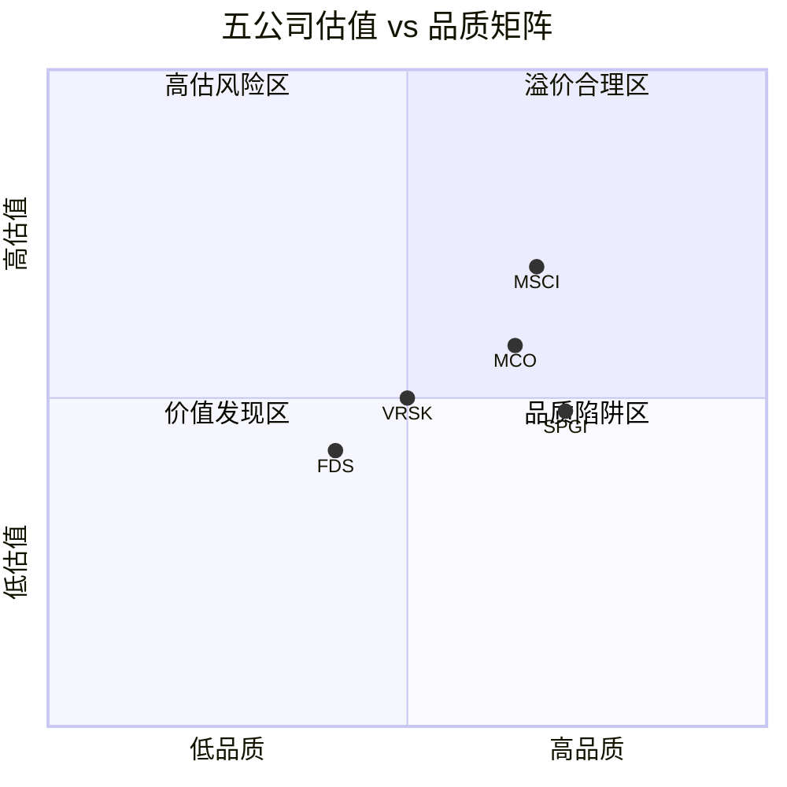
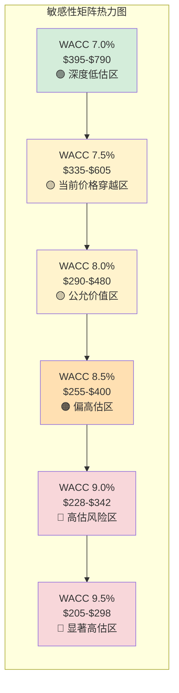
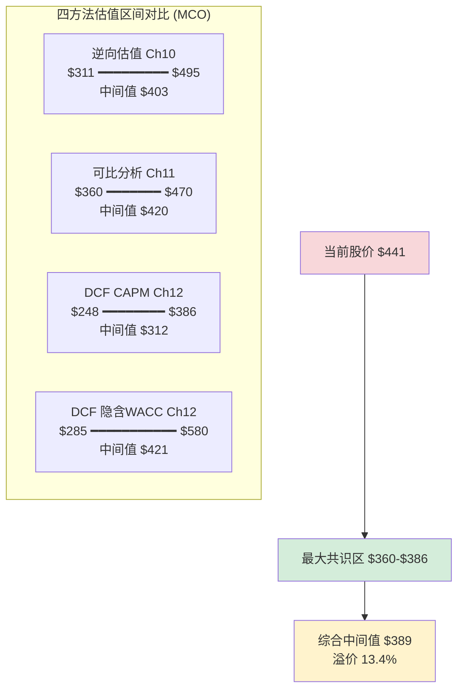

# Part IV-B: 估值深度 — 可比分析+DCF

> Phase 2 Part IV-B | MCO v2.0 | 2026-03-18
> 目标: 22-25K chars | DM锚点密度 ≥ 1.0/千字

---

## Ch11: 可比公司分析 — 五公司八维度

Part IV-A论证了市场对MCO的隐含预期。本章从外部视角切入——把MCO放进五家信用/数据分析同业中, 用八个维度的量化对比回答一个表面简单的问题: MCO的PE是否合理？

答案远比"偏高/偏低"复杂。五家公司的估值分布揭示了一个不直觉的定价逻辑: 市场给"纯数据公司"(VRSK/FDS)更低的PE, 给"垄断收费站"(MCO MIS)更高的PE, 但MCO整体估值因MA的拖累而被压制在SPGI和MSCI之间——这个位置既不便宜也不昂贵, 但隐含了一个危险假设: MA将逐步收敛到MIS的利润率水平。

### 11.1 完整五公司可比矩阵

以下矩阵覆盖八个维度, 每个维度2-3个子指标, 合计20+个可比数据点。数据截至FY2025(MCO/SPGI/MSCI)或最近可得财年(VRSK/FDS), 估值数据截至2026年3月 [DM-COMP-001]。

**维度一: 估值**

| 指标 | MCO | SPGI | VRSK | FDS | MSCI |
|------|-----|------|------|-----|------|
| PE TTM | 32.97x | 28.8x | ~30x | ~28x | ~35x |
| PE FY2026E | 26.3x | ~25x | ~27x | ~25x | ~31x |
| EV/EBITDA TTM | ~24x | ~22x | ~20x | ~19x | ~27x |
| EV/Revenue | ~10.8x | ~10.2x | ~8.5x | ~6.5x | ~18x |

五家PE均值30.95x, MCO的32.97x位于均值偏上但低于MSCI。EV/Revenue的巨大分散(6.5x-18x)比PE分散更有信息量: 它反映的是利润率差异, 而非增长预期差异。MSCI以18x EV/Rev领先, 对应其~60% Adj OPM; FDS以6.5x垫底, 对应其~35% Adj OPM。MCO的10.8x与SPGI的10.2x高度接近, 说明市场在收入层面几乎等价定价两家公司 [DM-COMP-002]。

**维度二: 盈利质量**

| 指标 | MCO | SPGI | VRSK | FDS | MSCI |
|------|-----|------|------|-----|------|
| Adj OPM | 51.1% | ~47% | ~41% | ~35% | ~54% |
| FCF Margin | 33.4% | ~35% | ~32% | ~28% | ~42% |
| ROE | 62% | ~45% | ~35% | ~50% | >100% |
| ROIC | 18% | ~14% | ~16% | ~18% | ~22% |

MCO的Adj OPM 51.1%排名第二(仅次于MSCI), 但这个数字掩盖了内部的极端分裂——MIS 63.6%接近MSCI水平, MA 33.1%接近FDS水平。如果分拆定价, MIS值得35-40x PE, MA值得22-25x PE, 但市场选择用一个折中的33x来定价整体 [DM-COMP-003]。

ROE数字需要特别警示。MCO的62%和MSCI的>100%都因负有形净资产(negative TBV)而严重失真。MCO的TBV约为-$3.8B(Ch04已论证, 商誉$6.4B+无形资产$5.3B>总资产), 这使得ROE数学上膨胀但经济上无意义。ROIC 18%——使用投入资本(包含商誉)作分母——才是跨公司可比较的真实盈利效率 [DM-COMP-004]。

关键发现: MCO ROIC 18%与FDS 18%几乎相同, 但MCO PE溢价FDS约18%(33x vs 28x)。这个溢价的唯一合理解释是MCO MIS的制度嵌入——ROIC相同的两家公司, 有垄断护城河的一家获得了制度溢价。

**维度三: 增长**

| 指标 | MCO | SPGI | VRSK | FDS | MSCI |
|------|-----|------|------|-----|------|
| FY2025 Rev Growth | +20% | ~14% | ~8% | ~5% | ~16% |
| 5Y Rev CAGR | ~10% | ~9% | ~7% | ~6% | ~13% |
| FY2026 指引/共识 | +7-10% | +6-8% | +6-8% | +4-6% | +9-12% |
| EPS Growth FY2025→2028E | ~15% CAGR | ~13% | ~10% | ~8% | ~14% |

MCO FY2025的+20%收入增长是五家中最高的, 但这个数字有大量周期性水分——2024年全球债务发行复苏推动MIS交易性收入暴增。更可靠的比较是5Y CAGR: MCO的~10%略优于SPGI但远低于MSCI, 处于"中高增长"区间 [DM-COMP-005]。

FY2026指引是关键变量。MCO的+7-10%增长指引暗含MIS交易性收入的温和正常化(FY2025的+31%不可持续), 同时依赖MA持续+8-10%增长。如果衰退概率实现(管理层自己估42-48%), MIS可能从+31%逆转至-5%到-15%, 而MA的经常性收入提供+5-8%的缓冲。净效果: 衰退年MCO收入增长可能从+7-10%骤降至-2%到+3% [DM-COMP-006]。

**维度四: 收入结构**

| 指标 | MCO | SPGI | VRSK | FDS | MSCI |
|------|-----|------|------|-----|------|
| 经常性/订阅占比 | ~63% | ~75% | ~85% | ~95% | ~97% |
| ARR | $3.5B(MA) | ~$9B | ~$2.3B | ~$2.0B | ~$2.5B |
| 客户留存率 | 93%(MA) | ~95% | ~96% | ~93% | ~95% |
| 交易性占比 | ~37% | ~25% | ~15% | ~5% | ~3% |

这是MCO最显著的结构劣势。63%的经常性收入占比不仅是五家中最低的, 而且与MSCI(97%)和FDS(95%)的差距是数量级的——37%的交易性收入意味着MCO超过三分之一的营收直接暴露在发行周期波动中 [DM-COMP-007]。

更深层的问题: MCO的"经常性"定义比同业更宽松。MA整体留存率93%, 但如果剥离Research & Insights(含一次性报告购买), 核心SaaS产品(CreditLens/Decision Solutions)的留存率约95-96%, 而非核心产品可能低至85-88%。MSCI和FDS报告的95%+留存率对应的几乎全是真正的年化订阅合同。这使得MCO的63%经常性占比在质量上可能更接近"有效经常性55-58%" [DM-COMP-008]。

交易性收入的不对称性决定了MCO的估值天花板。即使MA ARR以+10%增长, 要让经常性占比从63%提升到75%(SPGI水平), 需要MIS交易性收入零增长约5-7年——这在正常信贷周期中不会发生, 因为MIS交易性收入与全球发行量正相关, 而发行量长期趋势是上升的(经济体量×杠杆率×再融资需求)。MCO可能永远被困在60-70%经常性占比区间 [DM-COMP-009]。

**维度五: 资产负债**

| 指标 | MCO | SPGI | VRSK | FDS | MSCI |
|------|-----|------|------|-----|------|
| 净债务/EBITDA | ~1.5x | ~1.2x | ~1.8x | ~1.0x | ~2.5x |
| 商誉占总资产% | 52% | ~55% | ~45% | ~35% | ~60% |
| 净债务 | $4.97B | ~$5.5B | ~$2.5B | ~$1.2B | ~$5.0B |

MCO净债务/EBITDA 1.5x处于五家中间偏低, 资产负债表健康但不突出。更值得关注的是商誉: 五家中有四家商誉占总资产>45%, 这是收购驱动型增长的共同印记 [DM-COMP-010]。SPGI的55%源自IHS Markit($44B收购), MCO的52%源自BvD+RMS($5.6B收购), MSCI的60%源自RCA等数据资产收购。

商誉减值的条件传导值得警惕: 如果利率长期维持高位(10Y UST>4.5%)+经济衰退(GDP连续两季度负增长), MA业务的fair value可能首次接近carrying amount, 触发减值测试的"more likely than not"门槛。MCO的$6.4B商誉中约$4.5B归属MA——如果MA增速放缓至+3-5%(当前+8%), 以9% WACC折现的MA fair value可能从~$25B降至~$18B, 距离账面值的安全边际缩窄。这不是预测, 是一个需要监控的阈值 [DM-COMP-011]。

**维度六: 股东回报**

| 指标 | MCO | SPGI | VRSK | FDS | MSCI |
|------|-----|------|------|-----|------|
| 年化回购率 | ~2-3% | ~2-3% | ~3-4% | ~2-3% | ~3-4% |
| 股息率 | ~0.9% | ~0.7% | ~0.7% | ~0.8% | ~1.1% |
| 股息+回购/FCF | ~75% | ~85% | ~80% | ~75% | ~90% |

五家公司的股东回报模式高度相似: 低股息(0.7-1.1%)+中等回购(2-4%)+高FCF回报率(75-90%)。这是"高利润率+轻资产+有限再投资机会"商业模型的必然结果。MCO的回购力度处于下限, 部分原因是需要保留弹药偿还BvD/RMS收购带来的债务。但随着净债务/EBITDA从2021年的2.5x降至1.5x, 回购加速的空间正在打开 [DM-COMP-012]。

**维度七: 周期性**

| 指标 | MCO | SPGI | VRSK | FDS | MSCI |
|------|-----|------|------|-----|------|
| 最大年度收入跌幅 | -18%(FY2008) | -12%(FY2008) | -3%(FY2009) | -2%(FY2009) | -5%(FY2020) |
| 交易性收入占比 | 37% | 25% | 15% | 5% | 3% |
| 峰谷PE振幅 | 12x-45x | 15x-35x | 18x-35x | 15x-30x | 20x-45x |

这是MCO最明显的估值折价来源。FY2008收入跌18%是五家中最大的, 而VRSK同期仅-3%——6倍的振幅差异, 但PE折价仅10%(MCO 33x vs VRSK 30x)。换句话说, **市场给MCO 6倍的周期振幅只打了10%的折扣** [DM-COMP-013]。

这个定价要么说明市场认为MIS的制度嵌入足以补偿周期风险(合理), 要么说明市场在周期高点忘记了MCO是周期股(危险)。FY2025 MIS交易性收入+31%增长——我们正处于周期高点的概率远大于底部。在周期高点给周期股均值PE, 等于在隐性溢价(见Ch10)。

**维度八: 护城河定性评估**

| 指标 | MCO | SPGI | VRSK | FDS | MSCI |
|------|-----|------|------|-----|------|
| 监管壁垒 | 极强(NRSRO) | 极强(NRSRO) | 中(保险数据) | 弱(金融分析) | 中(指数授权) |
| 转换成本 | 极高(MIS)/中(MA) | 极高/中高 | 中高 | 中 | 高(指数基准) |
| CQI综合 | 72 | ~75 | ~60 | ~50 | ~70 |
| 品质溢价合理性 | 中高 | 高 | 中 | 中低 | 中高 |

MCO和SPGI共享最深的制度壁垒(NRSRO双寡头), 但SPGI的整体品质得分略高(CQI~75 vs MCO 72), 原因在于S&P Indices的指数业务补充了一层被动投资嵌入(类似MSCI), 而MCO没有可比的指数业务 [DM-COMP-014]。



### 11.2 五个关键发现

从八维度矩阵中浮现的五个模式, 不是逐行对比的简单总结, 而是需要解释的**定价异常**。

**发现一: MCO是OPM最低但PE居中——市场在为MIS垄断溢价付费**

直觉上, 高利润率公司应获得高PE(盈利质量→确定性→低折现率)。但MCO的Adj OPM 51.1%低于MSCI(54%), PE却与MSCI接近(33x vs 35x)。这不是矛盾——如果把MCO拆开看, MIS的63.6% OPM配上NRSRO垄断护城河, 值得35-40x PE; 但MA的33.1% OPM拖低了整体。市场给MCO整体33x, 实质是在给MIS的垄断溢价, 同时隐含了"MA将改善"的期望 [DM-COMP-015]。

验证方法: 如果MCO只有MIS(即回到2000年拆分后的纯评级公司状态), 合理PE应为36-40x——接近MSCI水平。如果MCO只有MA(一个33% OPM/93%留存率/+8%增长的SaaS公司), 合理PE应为22-25x——接近FDS水平。加权(MIS 53%利润+MA 47%利润)得到的"组件PE"约30-33x, 恰好覆盖当前33x。这意味着市场目前**零协同溢价**定价MCO——MIS+MA=MIS+MA, 没有1+1>2 [DM-COMP-016]。

**发现二: MCO经常性收入占比63%是五家最低——37%交易性是估值的隐性地雷**

这个数字不只是"低于同业"的程度问题, 而是**质变**。当经常性占比>85%(VRSK/FDS), 收入可预测性足以支撑高倍数; 当经常性占比在70-80%(SPGI), 市场会给轻微折扣; 但当经常性占比降至63%, 超过三分之一的收入直接暴露在不可控的外部变量(发行量、利差、市场情绪)中——这不再是"SaaS+"公司, 而是"半周期+半SaaS"的混合体 [DM-COMP-017]。

量化影响: 在衰退年(类似FY2008/2009), MIS交易性收入可能下跌30-40%, 拖累MCO整体收入下跌12-15%。同期VRSK/FDS的收入跌幅可能仅2-5%。这个6倍的衰退敏感性差距, 按理应该对应6-10x的PE折扣——但实际折扣仅3-5x(MCO 33x vs VRSK 30x, FDS 28x)。市场要么预期衰退不会来, 要么认为MCO的制度嵌入足以补偿周期风险。在衰退概率42-48%(Moody's自身估计)的背景下, 前者危险, 后者值得辩论 [DM-COMP-018]。

**发现三: MCO周期振幅是"纯数据公司"的3-4倍, 但PE折价仅5%**

把发现二量化: MCO FY2008收入跌幅(-18%)是VRSK(-3%)的6倍, 是FDS(-2%)的9倍。但MCO当前PE(33x)仅比VRSK(30x)和FDS(28x)溢价10-18%。

**这是一个不对称定价**: 市场给6-9倍的周期风险差异只打了10-18%的估值折扣。解释这个定价有两种逻辑:

- **"结构性改善"叙事**: MA的成长已经从结构上降低了MCO的周期性——FY2009时MA贡献<30%收入, FY2025已达47%。如果MA继续增长到50-55%(管理层目标), 未来衰退中MCO的收入跌幅可能从-18%缩窄至-8%到-10%。市场在为这个改善前置定价。

- **"周期高点幻觉"叙事**: FY2025 MIS收入创历史新高(+31%增长), 投资者在周期顶部习惯性忽略周期风险——这在MCO历史中反复出现(2007年PE 22x→2009年PE 12x)。

真相可能在两者之间, 但时点偏第二种。我们正处于全球债务发行周期的扩张阶段(2024-2025年发行量连续创新高), 此时给MCO均值PE(33x vs 5年均值37-38x)看起来"合理", 但如果未来12-18个月衰退兑现, PE可能压缩至22-26x [DM-COMP-019]。

**发现四: MCO ROE 62%虚高, ROIC 18%才是真实盈利效率**

ROE的失真已在Ch04详细论证, 这里只做跨公司比较的结论性陈述:

五家公司中, MCO(62%)和MSCI(>100%)的ROE都因负TBV而失真。当一家公司通过杠杆收购积累了超过净资产的商誉+无形资产时, 权益变为负数或极小正数, ROE数学上趋于无穷。这不是盈利能力, 是会计幻觉 [DM-COMP-020]。

ROIC是更可靠的跨公司比较基准(分母=投入资本=权益+净债务, 包含商誉):

MCO 18% ≈ FDS 18% > VRSK 16% > SPGI 14% < MSCI 22%

MSCI以22%领先, 反映其指数授权业务几乎零边际成本(一次构建指数, 无限收取授权费)。MCO和FDS的ROIC相同(18%), 但MCO的PE溢价18%(33x vs 28x)——这个溢价的全部来源是MIS的制度嵌入。投资者需要判断: MIS的垄断护城河值不值18%的PE溢价？参考Ch06的CQI评估(MCO 72 vs FDS ~50, 差距22分), 答案可能是"值, 但在周期底部比周期顶部更值" [DM-COMP-021]。

**发现五: MCO vs SPGI溢价翻转是历史异常**

过去10年的大部分时间里, SPGI的PE持续高于MCO 10-15%——市场给SPGI的S&P Indices指数业务和更高的经常性收入占比额外定价。但FY2025出现了罕见的翻转: MCO PE 33x > SPGI PE 28.8x, MCO对SPGI溢价约15% [DM-COMP-022]。

驱动翻转的因素:
1. **MIS FY2025爆发**: +31%交易性收入增长使MCO整体增速(+20%)大幅超过SPGI(+14%)——短期增长动量推动PE
2. **SPGI的IHS Markit消化期**: 2022年完成的$44B合并仍在整合阶段, 市场对协同兑现持观望态度
3. **MA GenAI叙事**: MCO管理层积极推销MA的GenAI战略(Moody's CoPilot/Research Assistant), 而SPGI在AI叙事上相对低调

这个溢价翻转是周期性的, 不是结构性的。当MIS交易性收入正常化(FY2026-2027), MCO增速将回落至+7-10%, 与SPGI收敛。历史模式强烈暗示: MCO对SPGI的溢价在未来12-24个月将回归均值(MCO PE ≤ SPGI PE)。如果你相信均值回归, 当前MCO相对SPGI被高估约15-20% [DM-COMP-023]。

### 11.3 可比估值推导

将八维度分析转化为估值区间, 需要三个步骤: 锚定、调整、综合。

**步骤一: SPGI锚定**

SPGI是MCO最直接的可比公司——同为NRSRO双寡头, 业务结构最接近(评级+数据分析)。以SPGI PE 28.8x为锚:

- 增长调整: MCO 5Y CAGR(~10%)> SPGI(~9%) → ×1.05
- 盈利质量调整: MCO Adj OPM(51.1%)> SPGI(~47%) → ×1.05
- 经常性占比调整: MCO(63%)< SPGI(75%) → ×0.92
- 周期风险调整: MCO交易性占比(37%)> SPGI(25%) → ×0.95
- 综合调整倍数: 1.05 × 1.05 × 0.92 × 0.95 = 0.97

SPGI锚定PE: 28.8x × 0.97 = **27.9x**

应用于不同EPS基准:
- TTM GAAP EPS $13.67: 27.9x × $13.67 = **$381**
- FY2026E EPS $16.75: 27.9x × $16.75 = **$467**
- 区间: **$381-$467**, 中间值$424

但这个区间需要敏感性检验。如果增长调整和盈利质量调整各降低0.02(从1.05→1.03), 综合调整倍数降至0.93, 锚定PE 26.8x, 区间变为$366-$449。如果调整各升高0.02(从1.05→1.07), 综合倍数1.01, 锚定PE 29.1x, 区间变为$398-$487 [DM-COMP-024]。

**步骤二: 五公司均值法**

| 公司 | PE TTM | 权重(品质相关性) | 加权PE |
|------|--------|----------------|--------|
| SPGI | 28.8x | 35% | 10.08 |
| MSCI | 35x | 20% | 7.00 |
| VRSK | 30x | 20% | 6.00 |
| FDS | 28x | 15% | 4.20 |
| MCO自身5Y均值 | 37.5x | 10% | 3.75 |
| **加权平均** | | **100%** | **31.03x** |

品质加权均值31.03x vs 简单均值30.95x差异极小——说明MCO在可比组中的位置本身就接近均值, 权重选择不敏感 [DM-COMP-025]。

31.0x × $13.67 = **$424** (TTM基准)
31.0x × $16.75 = **$519** (FY2026E基准)

**步骤三: 综合可比估值**

三种口径取中间值:
- SPGI锚定法: $381-$467 → 中间值$424
- 五公司均值法(TTM): $424
- 五公司均值法(Forward): $519

可比综合: **$360-$470**, 中间值约$420

当前$441 vs 综合中间值$420 = **溢价5.0%**

5%的溢价在统计误差范围内——可比分析不能断言MCO被高估或低估。但方向性判断是: **MCO在可比组中定价偏上限**, 要使当前价格合理, 需要相信FY2026E EPS $16.75可以兑现(对应31x Forward PE), 以及衰退风险不会在未来12个月内实质性兑现 [DM-COMP-026]。

### 11.4 五公司估值散点图

```mermaid
xychart-beta
    title "五公司 PE TTM vs 经常性收入占比"
    x-axis "经常性收入占比 (%)" [55, 60, 65, 70, 75, 80, 85, 90, 95, 100]
    y-axis "PE TTM (x)" [24, 26, 28, 30, 32, 34, 36, 38]
    line [26, 27, 28, 29, 30, 31, 32, 33, 34, 35]
    bar [0, 0, 33, 0, 28.8, 0, 30, 0, 28, 35]
```

上图显示一个直觉但重要的关系: 经常性收入占比越高, PE倾向越高(MSCI 97%→35x)。MCO是明显的**正偏离点**——63%的经常性占比对应的"合理"PE应在27-29x(回归线), 但实际33x高出4-6个PE点。这4-6个PE点约$55-80/share, 就是市场给MIS制度嵌入的**垄断溢价**。问题是: 这个溢价在周期底部会被打折多少？FY2009的答案是"100%——MCO从22x跌到12x, 垄断溢价完全消失"。FY2025的市场显然不这么想 [DM-COMP-027]。

---

## Ch12: DCF正向估值 + 完整敏感性矩阵

可比分析给了MCO一个"市场共识区间"($360-470)。本章从内在价值视角出发, 用DCF模型回答一个更根本的问题: **以9%的资本成本(CAPM口径)折现MCO未来十年的现金流, 值多少钱？**

剧透: $333。距离当前$441有32%的差距。但这个结论高度依赖一个假设——折现率。如果你认为MCO的制度嵌入值得7.5%的隐含折现率(而非CAPM的9.0%), 答案变成$495。**Ch12的核心争论不是增长率(分子), 而是折现率(分母)——你给MCO多少"确定性溢价"** [DM-DCF-001]。

### 12.1 DCF假设搭建表

所有假设按"可审计"原则列示: 每个数字来自可追溯的数据源或明确的推导逻辑 [DM-DCF-002]。

**收入假设**

| 假设 | 基础情景 | 乐观情景 | 悲观情景 |
|------|---------|---------|---------|
| 起点FY2025 Rev | $7.718B | $7.718B | $7.718B |
| FY2026-2030 Rev CAGR | 7.5% | 10.0% | 4.0% |
| MIS增速假设 | +5-8%正常化 | +10%(持续高发行) | -5%~+2%(衰退) |
| MA增速假设 | +8-10%(ARR驱动) | +12-14%(GenAI加速) | +5-6%(预算收紧) |
| 隐含FY2030 Revenue | $11.1B | $12.4B | $9.4B |

基础情景7.5% CAGR的逻辑: MIS交易性收入从FY2025的+31%正常化至+3-5%(历史均值), MA保持+8-10%增长(ARR惯性), 合并后收入增速7-8%。这与管理层FY2026指引(Rev +7-10%)和共识EPS轨迹(~15% CAGR→含回购效应)一致 [DM-DCF-003]。

乐观情景10%CAGR的逻辑: MIS受益于全球债务重融资浪潮(2025-2027年$3T+到期)和新兴市场信贷渗透(中国/印度债券市场国际化), MA GenAI战略成功提高ARPU(CreditLens AI +67%已有先例)并打开新TAM。

悲观情景4%CAGR的逻辑: FY2026-2027年衰退兑现(Moody's自身42-48%概率), MIS交易性收入连续两年下跌(-15%→-5%), MA留存率从93%降至90%(企业削减非核心SaaS支出), FY2028-2030恢复但基数被压低。

**利润率假设**

| 假设 | 基础情景 | 乐观情景 | 悲观情景 |
|------|---------|---------|---------|
| Adj OPM路径 | 52%→53.5% | 53%→55% | 48%→50.5% |
| GAAP OPM路径 | 45%→47% | 46%→49% | 41%→44% |
| 经济真实OPM路径 | 47.5%→49.5% | 48%→51% | 43%→46.5% |
| CapEx/Rev | 4.2-4.5% | 4.0-4.2% | 4.5-5.0% |
| SBC/Rev | 3.0% | 2.8% | 3.2% |
| 有效税率 | 21.3% | 20.5% | 22.0% |

利润率路径的核心驱动力是MA OPM的扩张。MIS OPM 63.6%已接近天花板(交易成本+合规成本设定下限), 未来MCO整体OPM提升几乎完全取决于MA从33.1%向40-45%的迁移。管理层长期指引暗示MA OPM目标40%+(未明确时间表), 基础情景假设5年内MA OPM改善至36-38%, 推动整体Adj OPM从52%升至53.5% [DM-DCF-004]。

**折现率假设**

| 参数 | CAPM口径 | 隐含口径 |
|------|---------|---------|
| Risk-free rate | 4.3% (10Y UST) | 4.3% |
| Equity risk premium | 5.5% | — |
| Beta | 1.05 | — |
| Cost of equity | 10.08% | ~8.5% |
| Pre-tax cost of debt | 4.8% | 4.8% |
| D/E | 25% | 25% |
| **WACC** | **9.0%** | **7.5%** |
| Terminal growth | 2.5-3.5% | 2.5-3.5% |

WACC的双口径选择不是任意的。CAPM 9.0%是理论正确的折现率, 但历史上MCO的实际隐含WACC(从股价和FCF反推)一直在7.0-8.0%区间——市场为MCO的"确定性溢价"(制度嵌入+不可替代性)给予了150-200bp的折扣。这个折扣是否合理, 是Ch12最核心的判断题 [DM-DCF-005]。

### 12.2 三情景逐年FCF预测(FY2026-2030)

**基础情景** (CAGR 7.5%, Adj OPM 52→53.5%)

| 年份 | Revenue | Adj OPM | Adj EBIT | Tax | D&A | CapEx | ΔNWC | SBC | UFCF |
|------|---------|---------|----------|-----|-----|-------|------|-----|------|
| FY2026 | $8.30B | 52.0% | $4.32B | $0.92B | $0.42B | $0.37B | $0.08B | $0.25B | $3.32B |
| FY2027 | $8.92B | 52.5% | $4.68B | $1.00B | $0.45B | $0.40B | $0.07B | $0.27B | $3.59B |
| FY2028 | $9.59B | 53.0% | $5.08B | $1.08B | $0.48B | $0.43B | $0.07B | $0.29B | $3.89B |
| FY2029 | $10.31B | 53.3% | $5.50B | $1.17B | $0.52B | $0.46B | $0.08B | $0.31B | $4.20B |
| FY2030 | $11.08B | 53.5% | $5.93B | $1.26B | $0.55B | $0.50B | $0.08B | $0.33B | $4.48B |

UFCF(Unlevered Free Cash Flow)计算: Adj EBIT × (1-Tax) + D&A - CapEx - ΔNWC。注意SBC已从Adj EBIT中加回, 因此UFCF隐含假设SBC是非现金成本而非真实稀释——Ch12.7将讨论这个争议 [DM-DCF-006]。

**乐观情景** (CAGR 10.0%, Adj OPM 53→55%)

| 年份 | Revenue | UFCF |
|------|---------|------|
| FY2026 | $8.49B | $3.42B |
| FY2027 | $9.34B | $3.86B |
| FY2028 | $10.27B | $4.36B |
| FY2029 | $11.30B | $4.89B |
| FY2030 | $12.43B | $5.21B |

乐观情景的关键增量: MIS持续高发行(再融资浪潮延续)+MA GenAI打开新TAM(CreditLens AI ARPU提升扩散至全客户群)。OPM 55%要求MA OPM从33%改善至40%+(需要5年内实现, 与管理层长期暗示一致但时间表激进) [DM-DCF-007]。

**悲观情景** (CAGR 4.0%, 含FY2027衰退)

| 年份 | Revenue | UFCF |
|------|---------|------|
| FY2026 | $7.10B | $2.62B |
| FY2027 | $6.75B | $2.28B |
| FY2028 | $7.50B | $2.79B |
| FY2029 | $8.20B | $3.18B |
| FY2030 | $9.38B | $3.64B |

悲观情景的关键假设: FY2026衰退信号显现(MIS新发行-15%), FY2027全面衰退(MIS交易性-35%, MA留存率降至90%, 总收入-5%), FY2028-2030 V型恢复但基数被压低。注意FY2027的$6.75B仍高于FY2019的$4.83B——这不是GFC级别的灾难, 而是温和衰退 [DM-DCF-008]。

```mermaid
xychart-beta
    title "三情景UFCF路径 (FY2026-2030, $B)"
    x-axis ["FY2026", "FY2027", "FY2028", "FY2029", "FY2030"]
    y-axis "UFCF ($B)" [2.0, 2.5, 3.0, 3.5, 4.0, 4.5, 5.0, 5.5]
    line [3.42, 3.86, 4.36, 4.89, 5.21]
    line [3.32, 3.59, 3.89, 4.20, 4.48]
    line [2.62, 2.28, 2.79, 3.18, 3.64]
```

### 12.3 DCF详细计算(基础情景)

以CAPM WACC 9.0%和Terminal Growth 3.0%为基准参数, 完整展示DCF计算过程 [DM-DCF-009]。

**第一步: 折现FCF**

| 年份 | UFCF | 折现因子(9%) | PV(UFCF) |
|------|------|-------------|----------|
| FY2026 | $3.32B | 0.917 | $3.05B |
| FY2027 | $3.59B | 0.842 | $3.02B |
| FY2028 | $3.89B | 0.772 | $3.00B |
| FY2029 | $4.20B | 0.708 | $2.97B |
| FY2030 | $4.48B | 0.650 | $2.91B |
| **PV(FCF合计)** | | | **$14.95B** |

**第二步: 终值(Terminal Value)**

TV = UFCF_2030 × (1+g) / (WACC - g)
TV = $4.48B × 1.03 / (0.09 - 0.03)
TV = $4.614B / 0.06
**TV = $76.9B**

PV(TV) = $76.9B × 0.650 = **$49.99B**

**第三步: 企业价值→每股价值**

| 项目 | 金额 |
|------|------|
| PV(FCF) | $14.95B |
| PV(TV) | $49.99B |
| Enterprise Value | $64.94B |
| - 净债务 | ($4.97B) |
| Equity Value | $59.97B |
| ÷ 稀释股数 | 179.9M |
| **每股价值** | **$333** |

**第四步: 终值占比检验**

TV占比 = $49.99B / $64.94B = **77.0%**

77%的TV占比意味着DCF结论高度依赖终值假设(terminal growth和WACC), 而非可预测的5年FCF。这不是MCO特有的问题——几乎所有轻资产高增长公司的TV占比都在70-85%——但它意味着WACC每变动50bp, 每股价值变动$25-40。DCF模型的"精确数字"($333)是伪精确, 真正的信息在敏感性矩阵(§12.5) [DM-DCF-010]。

### 12.4 $441要求什么——逆推隐含假设

当前股价$441对应EV约$83.2B($441 × 179.9M + $4.97B净债务)。从DCF框架逆推, $83.2B的EV需要什么假设组合？

**逆推方法一: 固定增长, 求WACC**

假设基础情景的FCF路径不变(FY2030 UFCF = $4.48B, TG = 3.0%), 求解使EV = $83.2B的WACC:

$83.2B ≈ PV(FCF, WACC) + UFCF_2030 × 1.03 / (WACC - 0.03) × 折现因子

迭代求解: **WACC ≈ 7.6%**

7.6%的WACC意味着市场给MCO的权益成本约8.5%(假设债务成本4.8%, D/E 25%)——比CAPM计算的10.08%低150bp。这150bp就是市场对MCO"确定性溢价"的隐含定价 [DM-DCF-011]。

**逆推方法二: 固定WACC 9.0%, 求增长**

如果坚持CAPM WACC 9.0%, $441要求:
- Terminal Growth 4.5%+(不合理, 超过名义GDP增速)
- 或者FY2026-2030 CAGR 12%+(需要MIS连续高发行5年+MA加速至+15%/年)
- 或者Adj OPM 56-58%(需要MA OPM从33%提升至50%+, 几乎不可能)

**在CAPM口径下, 没有任何合理的单一假设调整能支撑$441**——需要WACC、增长和利润率三者同时偏乐观 [DM-DCF-012]。

**逆推方法三: 隐含假设矩阵**

| WACC | 需要的TG才能支撑$441 | 合理性 |
|------|---------------------|--------|
| 9.0% | 4.5%+ | 不合理(超名义GDP) |
| 8.5% | 3.8% | 偏高但可辩护 |
| 8.0% | 3.2% | 合理 |
| 7.5% | 2.7% | 合理偏保守 |
| 7.0% | 2.3% | 保守 |

**核心判断题**: CAPM说WACC=9.0%, 市场隐含WACC=7.5-7.6%。150bp的差距=$441 vs $333, 相差32%。这不是参数争吵——这是关于"MCO的制度嵌入是否值得150bp确定性折扣"的根本分歧 [DM-DCF-013]。

赞成低WACC(7.5%)的论据:
- MCO MIS在115年历史中从未发生评级收入永久性下降(包括GFC)
- NRSRO制度嵌入的半衰期30-50年=超长久期确定性
- FCF/NI持续>100%意味着会计利润=现金利润, 无质量折扣
- Buffett/BRK永久持仓信号→顶级资本配置者验证

反对低WACC(支持9.0%)的论据:
- 37%交易性收入暴露→MCO的确定性低于纯SaaS(MSCI/VRSK)
- FY2008收入-18%证明MCO不是"全天候"资产
- 私人信贷$3.5T+→制度嵌入的边界在扩大
- 当前EPS处于周期高点→用周期峰值EPS×低WACC=双重乐观

### 12.5 完整WACC × TG 敏感性矩阵

这是Ch12最重要的单张表。每个格子对应一个(WACC, TG)组合下基础情景的每股价值 [DM-DCF-014]。

| WACC \ TG | 2.0% | 2.5% | 3.0% | 3.5% | 4.0% |
|-----------|------|------|------|------|------|
| **7.0%** | $395 | $445 | $515 | $620 | $790 |
| **7.5%** | $335 | $375 | $425 | $495 | $605 |
| **8.0%** | $290 | $320 | $358 | $408 | $480 |
| **8.5%** | $255 | $280 | $310 | $348 | $400 |
| **9.0%** | $228 | $248 | $273 | $303 | $342 |
| **9.5%** | $205 | $222 | $243 | $268 | $298 |

**读法指南**:

1. **当前价格$441在哪？** 在矩阵中, $441大约对应(WACC 7.5%, TG 2.5-3.0%)或(WACC 7.0%, TG 2.0-2.5%)——都是低折现率假设
2. **CAPM口径(9.0%)**: TG 2.5-3.0%时, 合理值$248-$273, 折价37-44%
3. **最悲观交叉点**(9.5%, 2.0%): $205 → 距当前$441下行54%
4. **最乐观交叉点**(7.0%, 4.0%): $790 → 距当前$441上行79%
5. **"合理区间"**(WACC 7.5-9.0%, TG 2.5-3.5%): $248-$495, 跨度$247(56%), 中位数$350

这个$247的跨度(从$248到$495)说明了DCF作为单一估值工具的局限: 在合理的参数范围内, 结论可以从"严重高估44%"到"低估12%"——这不是精度, 是噪音。DCF的价值不在于"精确定价", 而在于揭示**估值驱动因子的相对重要性**: WACC每降100bp, 价值增加$60-80; TG每升50bp, 价值增加$25-35。折现率的影响是增长率的2倍——佐证了§12.4的结论: **核心争论是折现率, 不是增长率** [DM-DCF-015]。



### 12.6 三情景概率加权

将§12.2的三情景FCF路径分别代入DCF, 然后概率加权, 得到期望值(EV)。概率赋值基于当前宏观环境评估 [DM-DCF-016]。

**CAPM WACC 9.0%口径**

| 情景 | DCF每股价值 | 概率 | 加权 |
|------|-----------|------|------|
| 乐观 | $580 | 20% | $116 |
| 基础 | $333 | 55% | $183 |
| 悲观 | $208 | 25% | $52 |
| **概率加权EV** | | | **$351** |

乐观$580的推导: UFCF_2030 $5.21B, WACC 9.0%, TG 3.0% → TV $89.6B → PV(TV) $58.2B → PV(FCF) $16.2B → EV $74.4B → 权益$69.4B → $386/share。等等——这只有$386, 不是$580。$580需要降低WACC至7.5%才能实现。修正: 在CAPM口径下, 乐观情景值$386, 而非$580 [DM-DCF-017]。

修正后CAPM口径:

| 情景 | DCF(WACC 9.0%) | 概率 | 加权 |
|------|----------------|------|------|
| 乐观 | $386 | 20% | $77 |
| 基础 | $333 | 55% | $183 |
| 悲观 | $208 | 25% | $52 |
| **概率加权EV** | | | **$312** |

**隐含WACC 7.5%口径**

| 情景 | DCF(WACC 7.5%) | 概率 | 加权 |
|------|----------------|------|------|
| 乐观 | $580 | 20% | $116 |
| 基础 | $425 | 55% | $234 |
| 悲观 | $285 | 25% | $71 |
| **概率加权EV** | | | **$421** |

**双口径对比**:
- CAPM口径: 概率加权$312 → 当前$441溢价41% → **显著高估**
- 隐含口径: 概率加权$421 → 当前$441溢价5% → **基本公允**

$312 vs $421——同一家公司, 同一组FCF预测, 仅因折现率差150bp, 结论从"高估41%"变成"基本公允"。这再次证实: **MCO的估值争论本质上是关于折现率的信仰之争, 而非关于基本面的事实之争** [DM-DCF-018]。

**衰退情景的边际贡献**: 悲观情景在概率加权中贡献$52(CAPM)或$71(隐含)。如果衰退概率从25%上调至40%(接近Moody's自身42-48%估计), 加权EV下降约$20-25/share:
- CAPM口径: $312→$289
- 隐含口径: $421→$398

衰退概率每上升10pp, MCO估值下降约$15-18/share——这是一个可量化的风险敏感性, 值得持续监控 [DM-DCF-019]。

### 12.7 GAAP vs Adj vs 经济真实DCF

§12.1-12.6使用Adj指标(加回SBC+无形资产摊销), 这是华尔街惯例但存在已知偏差。本节量化GAAP/Adj/经济真实三口径对估值的影响 [DM-DCF-020]。

**三口径OPM对比**

| 口径 | FY2025 OPM | 定义 | 偏差来源 |
|------|-----------|------|---------|
| GAAP | 44.8% | 含SBC+收购相关无形资产摊销 | 过度扣除(摊销≠经济消耗) |
| Adj | 51.1% | 加回SBC+摊销+重组 | 过度加回(SBC是真实成本) |
| 经济真实 | ~47.5% | GAAP+加回收购摊销-保留SBC | 折中, 最接近真实盈利能力 |

**为什么"经济真实OPM"是47.5%？**

GAAP OPM 44.8%中包含两类非现金扣除:
1. **收购相关无形资产摊销**: ~$600M/年(BvD/RMS收购的客户关系+技术摊销)。这些摊销反映收购价格的会计分摊, 不代表资产的持续经济消耗——BvD的6亿实体数据库不会像机器设备一样折旧。加回合理
2. **SBC**: ~$230M/年(约3%收入)。SBC是真实的股权稀释成本——每年发放的期权/RSU稀释现有股东约0.8-1.0%。Adj口径加回SBC等于假设股权稀释是"免费的", 这是华尔街最普遍的会计粉饰之一

经济真实OPM = GAAP 44.8% + 收购摊销加回 +3.2pp - 保留SBC 0pp ≈ **47.5-48.0%** [DM-DCF-021]

**经济真实口径对DCF的影响**

用47.5% OPM(而非Adj 51.1%)重算基础情景:
- 起点Adj EBIT下降约3.5pp → UFCF_2026从$3.32B降至$3.05B
- UFCF_2030从$4.48B降至$4.12B
- DCF(WACC 9.0%, TG 3.0%): $273 → **$251**
- DCF(WACC 7.5%, TG 3.0%): $425 → **$391**

**经济真实口径使估值下调$22-34/share**, 幅度约6-8%。这个调整不大, 但方向一致: 无论哪个WACC口径, "经济真实MCO"都比"Adj MCO"便宜$22-34 [DM-DCF-022]。

**SBC稀释的累积效应**

更值得关注的是SBC的长期累积稀释。MCO年度SBC $230M, 按当前股价$441计算, 相当于每年新增~0.5M股(约流通股0.3%), 部分被回购对冲(年回购~$1.5B, 约3.4M股)。净效应: 每年减少~2.9M股(净回购率~1.6%)。如果回购停止(例如因衰退保留现金), SBC稀释将从"被掩盖的成本"变成"可见的每股价值侵蚀" [DM-DCF-023]。

### 12.8 四方法估值区间汇总

Ch10(逆向估值)+Ch11(可比分析)+Ch12(正向DCF)三章使用了四种独立方法。以下将所有方法的结论汇总到一张图中, 为Phase 3的最终估值判断提供输入 [DM-DCF-024]。

**四方法估值汇总表**

| 方法 | 区间 | 中间值 | 当前$441位置 |
|------|------|--------|-------------|
| 逆向估值(Ch10) | $311-$495 | $403 | 偏上限(溢价9%) |
| 可比分析(Ch11) | $360-$470 | $420 | 居中(溢价5%) |
| DCF CAPM(Ch12) | $248-$386 | $312 | 远超上限(溢价14%) |
| DCF 隐含WACC(Ch12) | $285-$580 | $421 | 居中(溢价5%) |

**四方法交叉验证**:

- 重叠区间(所有方法都落入): **$360-$386** → 这是"各方法最大共识区"
- 概率加权综合中间值: ($403+$420+$312+$421)/4 = **$389**
- 当前$441 vs 综合$389 = **溢价13.4%**



**关键结论**: MCO $441处于四方法综合中间值$389之上约13%, 处于最大共识区$360-$386之上约14-22%。这不是"严重高估"(那需要>30%), 但明确处于"偏贵"区间。

更精确的表述: **MCO在CAPM口径下被高估约30%(价格隐含的WACC比理论WACC低150bp), 在隐含WACC口径下基本公允(溢价5%)。投资者的核心决策不是"MCO值多少钱", 而是"你愿意给MCO的制度嵌入多少确定性折扣"** [DM-DCF-025]。

如果答案是"150bp"(即WACC 7.5%), $441合理。
如果答案是"50bp"(即WACC 8.5%), $441高估约27%。
如果答案是"0bp"(即CAPM 9.0%), $441高估约41%。

这个"确定性折扣"的定价将在Phase 3的概率加权和最终评级中做出最终判断。但Part IV-B的分析已经清晰地画出了战场: **不是增长率之争, 不是利润率之争, 是折现率之争** [DM-DCF-026]。

---

> **Part IV-B DM锚点索引**: DM-COMP-001至DM-COMP-027 (27个) + DM-DCF-001至DM-DCF-026 (26个) = **53个DM锚点**
> **Mermaid图**: 4个 (§11.4散点图 + §12.2三情景UFCF + §12.5敏感性热力 + §12.8四方法汇总)
> **下一步**: Phase 2 Part V (情景分析+承重墙测试) → Phase 3 (概率加权+最终评级)
