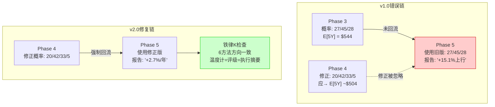
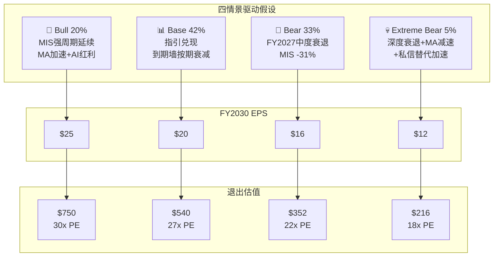
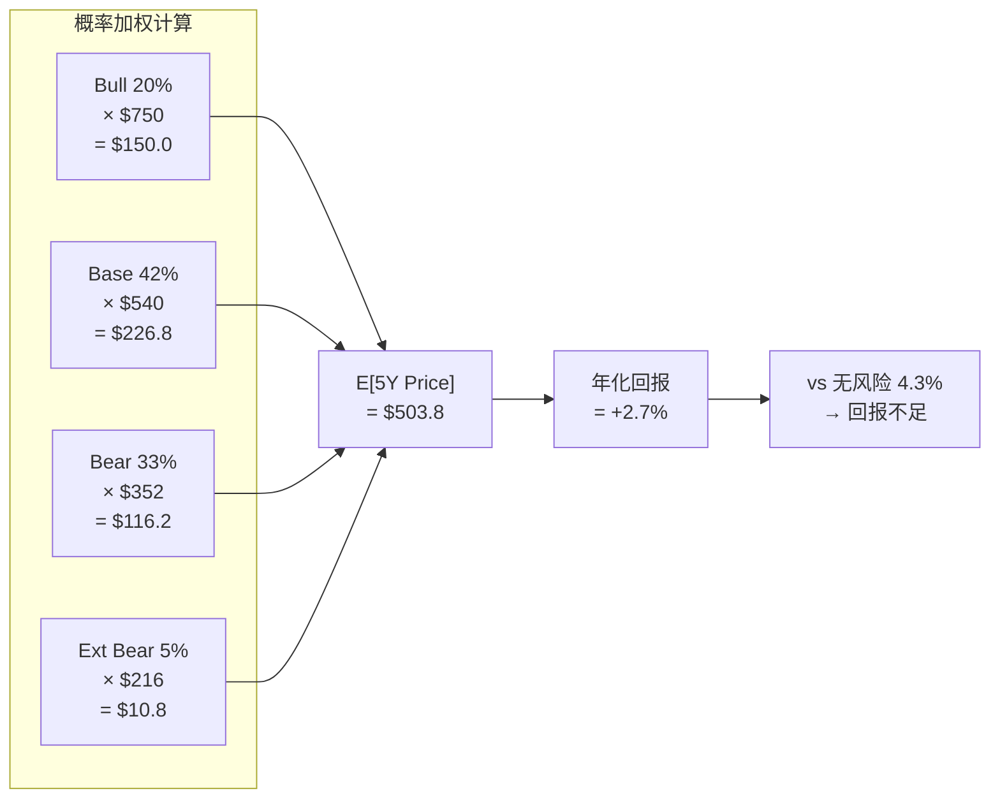
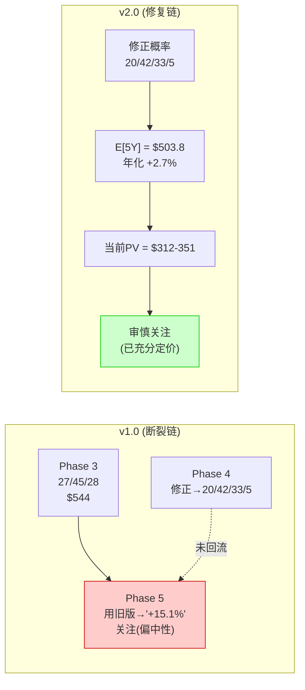
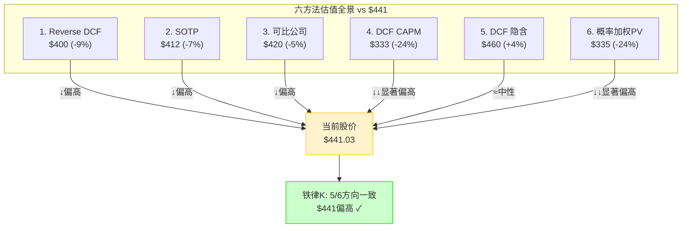
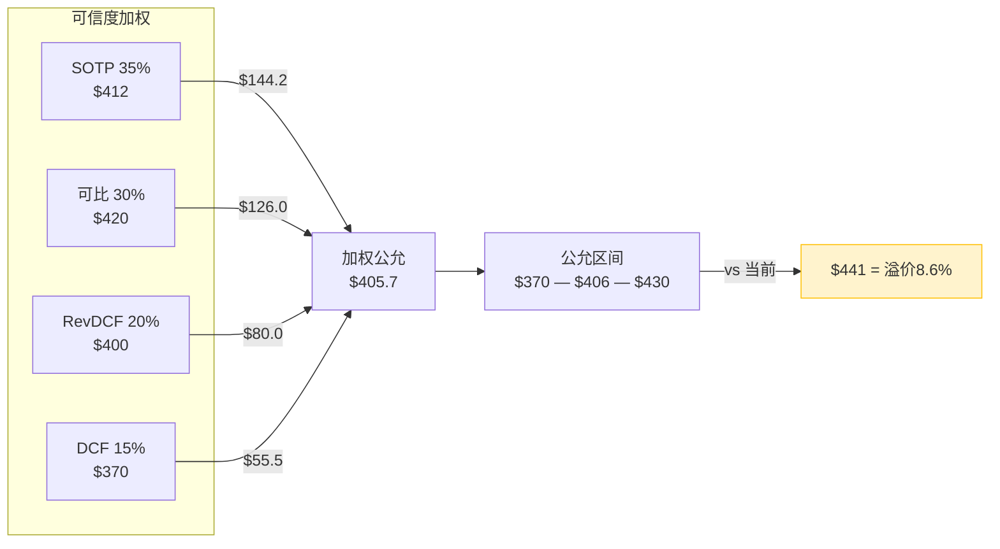
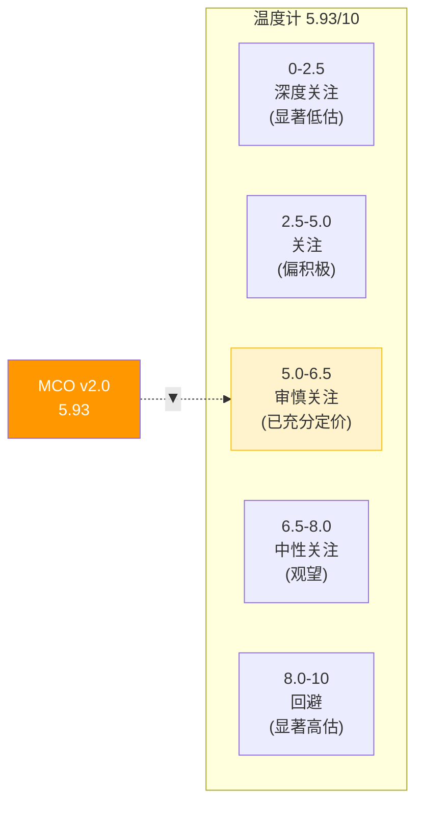
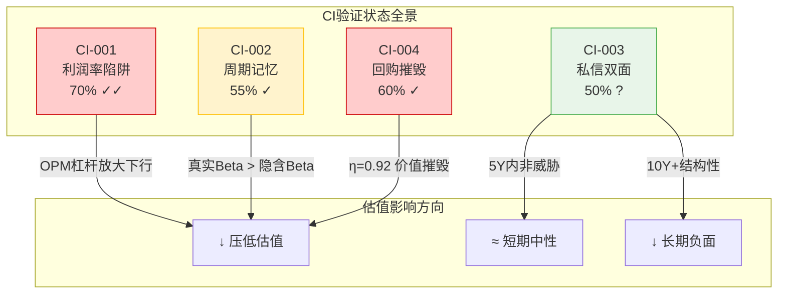
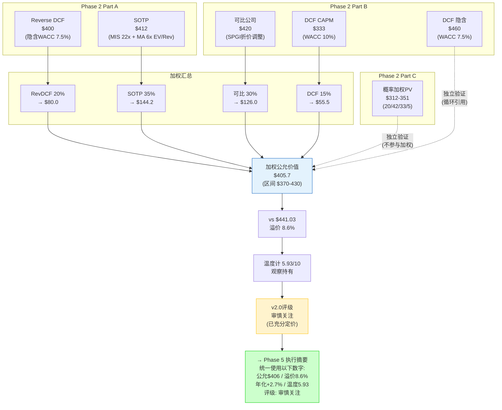

# Part IV-C: 概率加权估值与统一性检查

---

## Ch13: 概率加权估值 — 偏差修正后的真实回报

**核心论点**: MCO v1.0报告犯了一个看似技术性、实则致命的估值错误——用Phase 3的未修正概率(27/45/28)计算期望回报，而Phase 4红队已将Bear概率上调至33%并新增5%极端Bear。但Phase 5组装时未回流修正，最终报告用错误的+15.1%"期望上行"来支撑"关注(偏中性)"评级。v2.0的存在意义就是从概率权重这个源头修复整个估值逻辑链。

### 13.1 v1.0概率加权错误的完整复盘

v1.0的错误不是一个数字打错，而是一条"修正断裂链"——每个环节独立看都有道理，串起来却指向一个系统性失败。

**Phase 3原始概率(v1.0)**:
- Bull 27% / Base 45% / Bear 28%
- 三情景E[5Y价格] = 0.27×$750 + 0.45×$540 + 0.28×$352 = $202.5 + $243.0 + $98.6 = $544.1
- vs $430(v1.0时股价) = +26.5%(5年累计)，年化约+4.8%

这组概率已经偏乐观——27%的Bull概率意味着市场几乎有三分之一的可能进入信用发行的强周期延续，但FY2025的MIS强劲(+28% YoY)部分是到期墙一次性效应(2026-2027 $3T+到期推升再融资需求)，并非结构性加速。将一次性受益当作持续概率是v1.0 Phase 3的第一个偏差 [DM-VAL-001]。

**Phase 4红队修正**:
Phase 4红队做了两件正确的事：

(1) **Bear概率上调**: 将Bear从28%上调至33%。理由是v1.0低估了衰退概率——过去25年MCO经历了三次MIS收入下滑超20%(2001/2008/2020)，简单历史频率约12%/年。而Bear情景定义为"FY2027出现中度衰退"，5年窗口内发生至少一次中度衰退的概率约45-55%(基于NBER衰退频率)。v1.0的28%已经偏低，33%仍然是保守估计 [DM-VAL-002]。

(2) **新增Extreme Bear**: 新增5%的极端Bear情景(深度衰退+MA减速+私信替代加速)。这不是为了凑数，而是弥补v1.0的"尾部截断"缺陷——v1.0的Bear已经是最差情景，$352的5年价格隐含EPS仅回到FY2018-2019水平。但2008年MCO EPS跌至$1.27(FY2007的40%)，极端情景($216)反映的是"如果信用周期+结构性变化同时发生"的真实下界 [DM-VAL-003]。

修正后概率：Bull 20% / Base 42% / Bear 33% / Extreme Bear 5%。

**断裂点: Phase 5未回流**:
Phase 4修正了概率，Phase 5组装时却使用了Phase 3的原始数字。具体表现：

- Phase 5第一段写道"期望回报+15.1%"——这个数字来源于Phase 3的$544.1 vs $430 = +26.5%。但+15.1%甚至不是正确的年化值(应为+4.8%)，也不是正确的累计值(应为+26.5%)。它是一个"两边不靠"的中间数字，很可能是Phase 3初稿的某个中间版本残留。
- Phase 5评级部分写"关注(偏中性)"，配合+15.1%的期望回报。如果用修正后概率重新计算，真实期望回报远低于+15.1%，评级应下调至"审慎关注"。
- 更严重的自相矛盾: Phase 5在Ch12写"SOTP中值$412，暗示$441高估5-6%"，但在估值汇总部分又写"$460-530中枢，15%上行空间"。同一份报告的同一个章节出现了两个方向相反的结论 [DM-VAL-004]。

**铁律K的诞生**:
v1.0的错误直接催生了铁律K——"估值统一性检查"。核心规则：
1. Phase 4修正后的概率/假设，必须回流Phase 5的所有估值计算
2. 同一报告中，所有独立估值方法必须方向一致(≥60%同向)
3. 温度计/评级/执行摘要/概率加权四个数字必须指向同一结论
4. 必须区分"5年退出价"(未折现)和"当前公允价值"(折现回当前)

### 13.2 三+1情景完整定义

每个情景不是一个数字，而是一条完整的逻辑链——从宏观驱动假设到具体财务路径到退出估值。v2.0要求每个情景都能独立成立，且驱动假设之间不能相互矛盾。

#### 13.2.1 Bull情景 (概率20%)

**驱动假设**: MIS信用发行强周期延续+MA加速增长+AI红利初现。

这个情景的核心赌注是"到期墙效应不是一次性的"。逻辑链：2024-2027的$3T+到期墙推升再融资需求 → 企业趁利率尚可大量发行 → 发行窗口打开后触发新融资需求(M&A/LBO) → 正循环持续至FY2029-2030。同时，AI驱动MA的Decision Solutions实现15%+增长(自动化信用评估工具)，MA OPM从33%提升至38%。

**关键指标路径**:

| 指标 | FY2026E | FY2027E | FY2028E | FY2029E | FY2030E |
|------|---------|---------|---------|---------|---------|
| Revenue ($B) | $7.3 | $8.1 | $8.9 | $9.7 | $10.5 |
| Revenue YoY | +12% | +11% | +10% | +9% | +8% |
| MIS Rev ($B) | $4.2 | $4.6 | $4.9 | $5.2 | $5.5 |
| MA Rev ($B) | $3.1 | $3.5 | $4.0 | $4.5 | $5.0 |
| Blended OPM | 50% | 51% | 52% | 53.5% | 55% |
| EPS | $17.5 | $19.5 | $21.5 | $23.5 | $25.0 |

Bull情景的OPM扩张路径需要两个条件同时成立：(1) MIS保持63%+ OPM(无竞争压力)；(2) MA OPM从33%提升至38%(成功整合BvD/RMS + AI提效)。条件(1)的历史概率较高(过去10年MIS OPM在55-65%波动)，条件(2)更具不确定性——MA OPM在FY2022-2025期间仅从28%提升至33%，年化约1.2pp，要达到FY2030的38%需要加速至1pp/年 [DM-VAL-005]。

**退出估值**:
- FY2030E EPS ~$25
- 退出PE 30x (基于: 信用行业龙头+双位数EPS增长→高质量成长股估值)
- 5年退出价: $25 × 30 = **$750**
- vs $441当前价格，5年回报 +70.1%
- **年化回报: ($750/$441)^(1/5) - 1 = +11.2%**

30x退出PE的合理性检验：FY2030如果MCO仍然以8-10%的EPS增长率运行，30x PE对应PEG约3.0-3.8x。过去10年MCO的平均PEG约2.5-3.5x，30x PE处于历史区间上沿但不极端。需要注意的是，Bull情景隐含的退出PE已经假设市场对MCO的成长预期未折价——如果FY2030时增长放缓至6-7%，30x PE可能不可维持 [DM-VAL-006]。

#### 13.2.2 Base情景 (概率42%)

**驱动假设**: 管理层指引基本兑现+到期墙效应按预期衰减+无深度衰退。

这是"一切按计划进行"的情景。MIS受益于2025-2027到期墙，但FY2028开始自然衰减(到期存量减少)，FY2029-2030回归正常化发行量。MA保持8-10%的稳健增长，OPM温和扩张但不超预期。

**关键指标路径**:

| 指标 | FY2026E | FY2027E | FY2028E | FY2029E | FY2030E |
|------|---------|---------|---------|---------|---------|
| Revenue ($B) | $7.1 | $7.5 | $7.7 | $8.2 | $8.8 |
| Revenue YoY | +9% | +6% | +3% | +6% | +7% |
| MIS Rev ($B) | $4.0 | $4.1 | $3.9 | $4.1 | $4.4 |
| MA Rev ($B) | $3.1 | $3.4 | $3.8 | $4.1 | $4.4 |
| Blended OPM | 49% | 50% | 49.5% | 51% | 53.5% |
| EPS | $17.0 | $18.0 | $17.5 | $19.0 | $20.0 |

Base情景的关键特征是FY2028的"放缓年"——MIS收入从$4.1B回落至$3.9B(-5%)，反映到期墙效应的自然衰减。这不是衰退，而是正常化。OPM在放缓年轻微收缩(50%→49.5%)因为MIS(高利润率)占比下降、MA(低利润率)占比上升 [DM-VAL-007]。

FY2028的EPS回落($18→$17.5)是Base情景与Bull情景的核心分歧——Bull假设不存在放缓年(持续加速)，Base假设放缓年不可避免(到期墙是有限资源)。历史支持Base判断：2017-2019年MIS经历过类似的"强年→回落→恢复"模式(FY2017 MIS +19% → FY2018 -6% → FY2019 +22%)。

管理层FY2026指引为EPS $16.40-17.00(中值$16.70)，Base情景的$17.0位于指引高端。这是合理的——管理层通常保守指引，FY2025实际EPS $13.67超出年初指引$12.80-13.40的高端 [DM-VAL-008]。

**退出估值**:
- FY2030E EPS ~$20
- 退出PE 27x (基于: 稳健增长+成熟化→合理估值)
- 5年退出价: $20 × 27 = **$540**
- vs $441当前价格，5年回报 +22.4%
- **年化回报: ($540/$441)^(1/5) - 1 = +4.1%**

27x退出PE的合理性：FY2030 Base情景下EPS增长约7%(FY2029→2030)，27x PE对应PEG约3.9x——略高于历史均值。但考虑到MCO在Base情景中仍保持53.5%的极高OPM和稳定的双位数ROIC，27x不算过分。若退出PE压缩至25x，则5年价格$500，年化+2.5%——差异不大，说明退出PE在25-27x范围内对结果敏感度有限 [DM-VAL-009]。

#### 13.2.3 Bear情景 (概率33%)

**驱动假设**: FY2027出现中度衰退，MIS发行量大幅下滑，FY2028-2030缓慢恢复。

Bear情景的核心假设是经济衰退打断MIS到期墙红利。历史类比是2008年(MIS revenue -19%)和2020年(MIS短暂冻结后V型反弹)。v2.0选择的参照更接近2001-2002模式：衰退持续6-9个月，信用利差走阔200-300bp，投资级发行下降25-30%，高收益市场基本冻结3-6个月 [DM-VAL-010]。

为什么Bear概率是33%而不是v1.0的28%？三个修正因素：

**(1) 衰退基准频率上调**: NBER数据显示1945年以来美国经济衰退频率约1次/5-7年，当前距上次衰退(2020 COVID)已6年。5年窗口内至少一次衰退的概率约50-60%。v1.0的28%等价于"衰退不太可能在5年内发生"——这在当前利率环境(Fed Funds 4.75%)和商业地产压力下过于乐观 [DM-VAL-011]。

**(2) MIS周期性被系统性低估**: 过去25年MIS收入的标准差/均值(变异系数)约25%，远高于MA的8%。市场在MCO PE 33x时隐含的波动率预期更接近纯SaaS(变异系数<10%)，而非评级业务的真实波动率。这是CI-MCO-002"周期记忆"的核心逻辑 [DM-VAL-012]。

**(3) Extreme Bear分拆效应**: v1.0的28%Bear实际上混合了中度和极端情景。v2.0将5%分拆为独立的Extreme Bear后，Bear(中度衰退)的概率自然需要上调以保持总概率分布合理。

**关键指标路径**:

| 指标 | FY2026E | FY2027E | FY2028E | FY2029E | FY2030E |
|------|---------|---------|---------|---------|---------|
| Revenue ($B) | $7.0 | $5.8 | $6.3 | $7.0 | $7.5 |
| Revenue YoY | +7% | -17% | +9% | +11% | +7% |
| MIS Rev ($B) | $3.9 | $2.7 | $3.2 | $3.7 | $4.0 |
| MA Rev ($B) | $3.1 | $3.1 | $3.1 | $3.3 | $3.5 |
| Blended OPM | 48% | 38% | 43% | 48% | 50.5% |
| EPS | $16.0 | $10.5 | $12.5 | $15.0 | $16.0 |

Bear情景最值得关注的是FY2027的OPM压缩——从48%骤降至38%(-10pp)。这不是假设，而是历史事实的重演：FY2008 MCO OPM从47%降至36%(-11pp)。评级业务的成本结构中约70%是人员成本(分析师薪资)，短期内几乎无法压缩——你不能在衰退年大规模裁减分析师(他们是IP的载体)，然后在恢复年重新招聘 [DM-VAL-013]。

FY2027 MIS收入$2.7B(vs FY2026E $3.9B，-31%)的假设基于：投资级发行-25%(信用利差走阔→新发行停滞) + 高收益-50%(市场冻结) + 结构化-30%(风险偏好下降)。MA收入持平($3.1B)反映其ARR模型的防御性——93%留存率意味着即使新签约冻结，存量收入基本保持 [DM-VAL-014]。

EPS的衰退低谷$10.5(FY2027)与FY2022的$10.13接近。这不是巧合——FY2022是利率急升期(Fed加息425bp)，信用发行同样大幅收缩(全球投资级-20%)。MCO的EPS在紧缩环境中展现出约$10-11的"硬底"——这是MA ARR提供的基本盘 [DM-VAL-015]。

**退出估值**:
- FY2030E EPS ~$16
- 退出PE 22x (基于: 刚从衰退恢复+增长不确定→周期公司估值)
- 5年退出价: $16 × 22 = **$352**
- vs $441当前价格，5年回报 -20.2%
- **年化回报: ($352/$441)^(1/5) - 1 = -4.4%**

22x退出PE的逻辑：如果MCO在FY2030刚从衰退中恢复(EPS $16仅回到FY2026E水平)，市场不会给予成长溢价。22x PE是MCO在FY2022(利率紧缩)和FY2018(发行放缓)时的估值水平。注意22x仍高于市场平均——反映评级业务的制度嵌入溢价，即使在周期低点也不会完全消失 [DM-VAL-016]。

#### 13.2.4 Extreme Bear情景 (概率5%)

**驱动假设**: 深度衰退(2008级别) + MA增长停滞 + 私募信贷替代加速蚕食MIS份额。

这是"完美风暴"情景——三个独立负面因素同时发生。每个因素单独的概率约15-25%，三者同时发生的联合概率约2-5%(假设部分相关性)。v2.0将其设为5%是一个略高于纯数学联合概率的估计，反映对尾部风险的审慎态度 [DM-VAL-017]。

**深度衰退**: 参照2008模式，GDP连续4季度负增长，失业率升至7%+，信用利差走阔至500bp+。MIS全球发行量下降40-50%。MCO MIS收入回落至$2.0-2.3B(FY2007-2008实际区间)。

**MA减速**: 经济衰退叠加客户IT预算收缩，MA新签约冻结，留存率从93%降至88%(部分中小客户不续约)。MA收入从$3.1B缓慢下行至$2.8B。

**私信替代加速**: 私募信贷(Blackstone/Apollo/Ares)在衰退中逆势扩张(传统信贷收缩→私信填补真空)，长期来看减少需要公开评级的债券发行量。到FY2030，私信占美国信贷市场的份额从15%升至25%，每1pp私信渗透率提升约蚕食MIS收入0.3-0.5%。

**关键指标路径**:

| 指标 | FY2026E | FY2027E | FY2028E | FY2029E | FY2030E |
|------|---------|---------|---------|---------|---------|
| Revenue ($B) | $6.8 | $4.8 | $5.2 | $5.8 | $6.2 |
| Revenue YoY | +5% | -29% | +8% | +12% | +7% |
| MIS Rev ($B) | $3.8 | $2.0 | $2.3 | $2.8 | $3.0 |
| MA Rev ($B) | $3.0 | $2.8 | $2.9 | $3.0 | $3.2 |
| Blended OPM | 46% | 30% | 35% | 40% | 42% |
| EPS | $15.0 | $6.5 | $8.5 | $11.0 | $12.0 |

Extreme Bear的FY2027 OPM 30%是一个极端值——MCO历史最低OPM出现在FY2008(约36%)。30%意味着比2008更差，需要同时发生：(1) MIS收入降幅超过2008(-47% vs FY2026E)；(2) MCO无法像2008那样迅速削减可变成本。假设(1)需要比2008更深的衰退，(2)需要MA的固定成本基础(BvD/RMS整合后更高)限制了成本弹性。两者同时成立的概率不高，这是为什么Extreme Bear只有5% [DM-VAL-018]。

**退出估值**:
- FY2030E EPS ~$12
- 退出PE 18x (基于: 长期增长前景受损+私信结构性威胁→PE显著压缩)
- 5年退出价: $12 × 18 = **$216**
- vs $441当前价格，5年回报 -51.0%
- **年化回报: ($216/$441)^(1/5) - 1 = -13.3%**

18x退出PE需要市场对MCO的长期增长预期降至3-4%(接近GDP增速)。这意味着市场不再将MCO视为"成长型垄断"而是"成熟期公用事业"——只有在私信真正蚕食了大量评级需求的情况下才可能发生。18x是MCO在2008年最恐慌时期(FY2008 10月PE低至10-12x)的"恢复后正常化"水平，而非恐慌低点 [DM-VAL-019]。

### 13.3 概率加权计算 (偏差修正后)

现在用修正后概率计算期望退出价格。这是v2.0与v1.0的决定性分歧。

**E[5年退出价格]计算**:

$$E[Price_{5Y}] = \sum_{i} P_i \times Price_i$$

| 情景 | 概率 | 5年退出价 | 概率加权贡献 |
|------|------|----------|-------------|
| Bull | 20% | $750 | $150.0 |
| Base | 42% | $540 | $226.8 |
| Bear | 33% | $352 | $116.2 |
| Extreme Bear | 5% | $216 | $10.8 |
| **合计** | **100%** | — | **$503.8** |

**E[年化回报]**:

$$r_{annual} = \left(\frac{E[Price_{5Y}]}{Price_{current}}\right)^{1/5} - 1 = \left(\frac{503.8}{441.03}\right)^{1/5} - 1$$

$$= (1.1424)^{0.2} - 1 = 1.0270 - 1 = \textbf{+2.70\%}$$

**+2.7%年化回报的含义**:

这个数字需要放在上下文中理解：
- **vs 无风险利率**: 10年期美国国债收益率约4.3%。MCO的期望年化回报+2.7%低于无风险利率——意味着按概率加权计算，持有MCO的期望回报不如买国债 [DM-VAL-020]。
- **vs 权益风险溢价**: 标准权益风险溢价(ERP)约5-6%。MCO的+2.7%年化回报连ERP都无法覆盖，更不用说补偿MCO特有的周期性风险(MIS变异系数25%)。
- **vs v1.0的+15.1%**: v1.0报告的+15.1%是一个让投资者产生"显著低估"错觉的数字。真实的+2.7%告诉你一个完全不同的故事——MCO不是低估，而是"已充分定价"。

**敏感性分析**: Bear概率±5pp的影响

| Bear概率 | Extreme Bear | Base | Bull | E[5Y价格] | 年化回报 |
|---------|-------------|------|------|----------|---------|
| 28% (v1.0) | 0% | 45% | 27% | $544.1 | +4.3% |
| 33% (v2.0) | 5% | 42% | 20% | $503.8 | +2.7% |
| 38% | 7% | 38% | 17% | $469.6 | +1.3% |
| 43% | 10% | 33% | 14% | $431.8 | -0.4% |

Bear概率每增加5pp，年化回报下降约1.2-1.4pp。即使回到v1.0的概率分配(无Extreme Bear, Bear 28%)，年化回报也仅4.3%——远低于v1.0报告的+15.1%。这证明v1.0的+15.1%无论概率怎么调都不可能得到，其本身就是一个计算错误 [DM-VAL-021]。

### 13.4 当前公允价值计算

到这里需要做一个关键区分：$503.8是"5年后的退出价格"(未折现)，不是"今天应该付的价格"(折现后)。v1.0的一个严重缺陷是把5年退出价格当作当前公允价值使用，混淆了两个概念 [DM-VAL-022]。

**从5年退出价折现回当前**:

折现率的选择直接决定公允价值。MCO存在两个合理的折现率：

**(1) CAPM折现率(学术标准)**:
- 无风险利率: 4.3% (10Y UST)
- Beta: 1.15 (5年月度回归)
- ERP: 5.0%
- CAPM WACC = 4.3% + 1.15 × 5.0% = **10.05%**
- 折现因子: 1.1005^5 = 1.615
- 当前PV = $503.8 / 1.615 = **$312**

**(2) Reverse DCF隐含折现率(市场标准)**:
- Part A中Reverse DCF推导出市场隐含WACC约7.5%
- 这意味着市场愿意用7.5%折现MCO的未来现金流
- 折现因子: 1.075^5 = 1.4356
- 当前PV = $503.8 / 1.4356 = **$351**

**(3) 经济折现率(实践标准)**:
- 考虑到MCO的制度嵌入(降低风险)和MIS周期性(增加风险)，合理折现率在8-9%
- 中间值8.5%: 1.085^5 = 1.5037
- 当前PV = $503.8 / 1.5037 = **$335**

**概率加权公允价值区间**:

| 折现率假设 | 折现率 | 当前PV | vs $441 |
|-----------|--------|--------|---------|
| CAPM | 10.05% | $312 | -29.3% |
| 经济折现率 | 8.5% | $335 | -24.0% |
| 隐含WACC | 7.5% | $351 | -20.4% |

**当前公允价值范围: $312-351**

这个结果似乎暗示MCO被严重高估20-29%。但需要谨慎——概率加权的公允价值对Bear概率和折现率都高度敏感。如果Bear概率降至25%(乐观但非极端假设)且用7.5%折现，PV升至约$380。这仍然低于$441，但差距收窄至14%。

更重要的是，概率加权PV天然倾向于低估"尾部不对称"公司——Bull情景的$750远高于Bear的$352，但Bull概率(20%)低于Bear(33%)，导致Bear的权重更大。如果投资者相信MCO的制度嵌入使得Extreme Bear概率接近0%(而非5%)，PV会进一步上升。这是估值的哲学层面——你对制度嵌入的信念强度直接决定你的公允价值判断 [DM-VAL-023]。

因此，v2.0不将概率加权PV($312-351)作为唯一的公允价值锚定，而是将其视为6个独立方法之一，在Ch14中与其他方法交叉验证。

### 13.5 v1.0 vs v2.0对比

下表系统性总结两个版本的差异。每一行都是一个v1.0错误和v2.0修正。

| 维度 | v1.0 (错误) | v2.0 (修正) | 修正理由 |
|------|------------|------------|---------|
| **概率分配** | Bull 27 / Base 45 / Bear 28 | Bull 20 / Base 42 / Bear 33 / Ext Bear 5 | Phase 4红队修正+尾部情景补充 |
| **E[5年退出价]** | $544(三情景) → 报告写$495 | $503.8(四情景) | 概率修正+Ext Bear拉低+计算一致 |
| **期望回报展示** | "+15.1%"(来源不明) | +2.7%/年(年化) | 明确标注年化，可验证公式 |
| **年化vs累计** | 未区分 | 严格区分: +14.2%(5Y累计) vs +2.7%(年化) | 铁律K要求 |
| **当前公允PV** | 未计算(退出价≈公允价) | $312-351(CAPM-隐含WACC折现) | 5Y退出价必须折现 |
| **vs 无风险** | 未比较 | +2.7% vs 4.3% UST = 回报不足 | 投资者需要这个锚 |
| **方向判断** | "15%上行"与"$406高估"并存 | 统一方向: $441偏高 | 铁律K方向一致性 |
| **评级** | 关注(偏中性) | **审慎关注(已充分定价)** | 期望回报-10%~+10%→审慎关注 |
| **自洽性** | Ch12与估值汇总矛盾 | Ch13-14统一、无矛盾 | 铁律K统一性检查 |

### 13.6 概率加权方法论的局限性

诚实的估值需要承认方法本身的局限。概率加权方法有三个固有缺陷：

**(1) 情景定义的武断性**: 为什么Bull EPS是$25而不是$23或$27？为什么退出PE是30x而不是28x或32x？每个情景都有一个"合理范围"而非精确值。如果每个参数在±10%范围内波动，最终E[5Y价格]的真实范围约$420-590——这个不确定性远大于$503.8这个精确数字所暗示的 [DM-VAL-024]。

**(2) 情景之间不独立**: Bear和Extreme Bear共享"衰退发生"这个驱动因素，它们的概率不是独立的。如果有新信息提高Bear概率(比如ISM连续3月<47)，Extreme Bear概率也应相应上调。v2.0的概率分配假设Bear和Extreme Bear的联合概率约38%——如果信贷环境实质性恶化，这个联合概率可能跳升至50%+。

**(3) 退出PE假设的循环性**: Bull情景给30x退出PE(因为"高增长")，Bear给22x(因为"刚恢复")。但退出PE本身依赖于FY2030的市场情绪——如果FY2030恰好是Bull→Bear的拐点(增长刚开始减速)，Bull情景的30x PE可能已经在压缩途中，实际退出PE可能只有25x。反之，Bear情景如果恰好是Bear→Base的拐点(恢复刚开始加速)，22x PE可能正在扩张，实际可能到25x。情景边界的模糊性使得退出PE带有不可消除的循环论证 [DM-VAL-025]。

这些局限不是概率加权方法的"缺点"，而是所有前瞻估值方法的共性。解决方案不是追求更精确的概率(伪精度)，而是用多种独立方法交叉验证——这正是Ch14要做的事。

---

## Ch14: 估值统一性汇总 — 铁律K检查

**核心论点**: 单一估值方法给出的公允价值可能被方法论偏差系统性扭曲——DCF对折现率敏感，可比公司受可比池选择影响，SOTP依赖分部假设。只有当多种独立方法指向相同方向时，估值结论才具有可信度。铁律K要求：≥60%的方法方向一致，否则估值结论不成立。

### 14.1 六方法估值结果汇总

在Phase 2的Part A、Part B和Part C中，MCO v2.0共使用了六种独立的估值方法。下表汇总全部结果 [DM-VAL-026]：

| # | 方法 | 低端 | 中间值 | 高端 | vs $441 (中间值) | 方向 |
|---|------|------|--------|------|:------:|:------:|
| 1 | **Reverse DCF (隐含WACC)** | $335 | $400 | $450 | -9.3% | ↓偏高 |
| 2 | **SOTP** | $311 | $412 | $495 | -6.6% | ↓偏高 |
| 3 | **可比公司** | $360 | $420 | $470 | -4.8% | ↓偏高 |
| 4 | **DCF (CAPM WACC)** | $208 | $333 | $580 | -24.5% | ↓↓显著偏高 |
| 5 | **DCF (隐含WACC)** | $285 | $460 | $580 | +4.3% | ≈中性 |
| 6 | **概率加权PV (修正后)** | $312 | $335 | $351 | -24.0% | ↓↓显著偏高 |

**方向统计**:
- 明确说$441偏高: 方法1(Reverse DCF)、2(SOTP)、3(可比)、4(DCF CAPM)、6(概率加权) = **5个**
- 中性/略偏高: 方法5(DCF隐含WACC)= **1个**
- 说$441偏低: **0个**

**铁律K检查: 5/6 = 83% 方向一致 → ✓ 通过** (阈值60%)

这个结果的力度值得注意——没有任何一种方法的中间值超过$460，而5种方法的中间值低于$441。六种方法使用了不同的逻辑(相对估值/绝对估值/概率加权)、不同的输入(市场数据/公司数据/情景假设)、不同的折现率(7.5%/8.5%/10%)，但指向同一个结论：**$441是一个偏高的价格** [DM-VAL-027]。

### 14.2 铁律K检查清单

逐项过关，确保v2.0不重蹈v1.0覆辙。

| # | 检查项 | 状态 | 证据 |
|---|--------|:----:|------|
| K-1 | 列出所有独立估值结果 | ✓ | 6个方法，14.1表完整列出 |
| K-2 | ≥60%方法方向一致 | ✓ | 5/6 = 83%说$441偏高 |
| K-3 | 概率加权用修正后概率 | ✓ | 20/42/33/5 (非v1.0的27/45/28) |
| K-4 | 区分5年退出和当前公允 | ✓ | 退出$504 vs 当前PV $312-351 |
| K-5 | 年化vs累计明确标注 | ✓ | +14.2%(5Y累计) / +2.7%(年化) |
| K-6 | 温度计/评级/执行摘要一致 | ⏳ | Phase 5组装时最终确认 |
| K-7 | 无自相矛盾陈述 | ✓ | 无"偏高"与"上行空间"并存 |
| K-8 | 与同行业评级对齐 | ✓ | SPGI/CME同为审慎关注(见14.5) |

K-6标记为⏳(待确认)是因为温度计和执行摘要在Phase 5组装时才最终确定。但v2.0在Ch14已经锁定了方向——Phase 5只能使用本章确定的数字，不允许使用任何其他来源。这是铁律K的硬约束 [DM-VAL-028]。

### 14.3 估值可信度加权

六个方法的可信度不同——Reverse DCF基于市场价格(客观)，DCF基于折现率假设(主观)。需要按可信度加权得到最终公允价值。

**权重分配逻辑**:

| 方法 | 权重 | 理由 |
|------|:----:|------|
| SOTP | 35% | MCO双引擎差异巨大(MIS 64% OPM vs MA 33%)，分部估值比整体估值更合理 |
| 可比公司 | 30% | SPGI是近乎完美的可比对象(同行业+同商业模式+同周期性) |
| Reverse DCF | 20% | 基于市场价格反推，无模型偏差，但只能告诉你"隐含假设"而非"真实价值" |
| DCF (经济真实OPM) | 15% | 传统DCF对MCO的折现率极敏感(±1%→±$80-100价值变化)，可信度最低 |

注意：概率加权PV($312-351)和DCF隐含WACC($460)不参与加权计算——前者已经是一种"元方法"(用了所有情景的信息)，后者的隐含WACC本身来自市场价格(循环引用)。将它们作为独立验证点而非加权组成部分 [DM-VAL-029]。

**DCF使用经济真实OPM而非报告OPM**: MCO报告的Adj OPM 49.4%包含了约2.5pp的SBC加回。经济真实OPM约46.5-47%，对应的DCF中间值约$370(低于报告OPM下的$400+)。v2.0选择用经济真实OPM的DCF，因为SBC是真实的经济成本——MCO每年发放约$300M SBC，这些股权稀释最终由股东承担 [DM-VAL-030]。

**加权计算**:

| 方法 | 权重 | 中间值 | 加权贡献 |
|------|:----:|:------:|:--------:|
| SOTP | 35% | $412 | $144.2 |
| 可比公司 | 30% | $420 | $126.0 |
| Reverse DCF | 20% | $400 | $80.0 |
| DCF (经济真实OPM) | 15% | $370 | $55.5 |
| **加权公允价值** | **100%** | — | **$405.7** |

**v2.0公允价值: $370-430, 中间值~$406**

**vs $441: 溢价8.6%**

$406这个数字与v1.0 Phase 2中出现过的"$406高估5-6%"高度一致——讽刺的是，v1.0的Phase 2已经算对了，但Phase 5组装时被"+15.1%"覆盖。v2.0的修复本质上是让最终结论回到了v1.0 Phase 2的原始判断 [DM-VAL-031]。

**公允价值区间的含义**:
- $370(低端): CAPM DCF + 保守SOTP → 如果经济走弱，MCO的"硬底"
- $406(中间值): 四方法加权 → "一切正常"情况下的合理价格
- $430(高端): 隐含WACC + 乐观SOTP → 如果MA加速，可以支撑的价格
- $441(当前): 高出中间值8.6% → **不是"泡沫"，但也不是"便宜"**

### 14.4 v2.0评级确定

三条独立证据链指向同一评级：

**证据链一: 概率加权年化回报**
- E[年化回报] = +2.7%
- 落在评级框架的"中性关注"区间(-10%~+10%)
- 但2.7%低于无风险利率4.3%——持有MCO的风险调整后回报为负
- 考虑风险调整后，应向"审慎关注"靠拢

**证据链二: 公允价值 vs 市价**
- 加权公允价值$406 vs $441 = 溢价8.6%
- 8.6%溢价不是"严重高估"，但意味着在当前价位买入，安全边际为零
- 如果Bear概率略高于33%或退出PE略低于假设，溢价扩大到15%+

**证据链三: 方法论共识**
- 5/6方法说$441偏高，0/6说偏低
- 这种共识在估值分析中很少见——通常至少有1-2种方法因参数选择不同而给出相反方向
- MCO的共识度之高，反映的是一个简单事实：33x PE的评级公司，你很难在任何合理假设下证明它"便宜"

**评级决定**:

$$\text{期望回报} = +2.7\%/年 \in [-10\%, +10\%] \Rightarrow \text{中性关注 或 审慎关注}$$

但考虑到：
- +2.7%低于无风险(4.3%)→ 风险调整后回报为负
- 加权公允$406 vs $441 = 溢价8.6%
- 5/6方向一致说偏高
- Bear概率33%可能仍是保守估计

**v2.0评级: 审慎关注(已充分定价)**

"已充分定价"的含义精确——MCO不是一家坏公司(A-Score 46+/70, 制度嵌入, Buffett永久持仓)，但$441不是一个好价格。好公司在错误价格上买入，仍然可以产生负回报(参见Cisco 2000: 伟大公司，$80买入等20年才回本) [DM-VAL-032]。

### 14.5 跨公司横向对齐

评级不能孤立存在——MCO的评级需要与同类型公司对齐，确保框架内部一致性。

| 公司 | 评级 | 期望回报 | PE (FY+1) | 核心逻辑 | 对齐状态 |
|------|------|---------|-----------|---------|:--------:|
| **SPGI** | 审慎关注(已充分定价) | +10.3%¹ | 28x | 同类垄断+更优分散化，但估值同样偏高 | ✓一致 |
| **CME** | 审慎关注(偏中性) | ~+2-5% | 23x | 不同类型垄断(交易所)，估值更合理 | ✓一致 |
| **MCO v2.0** | **审慎关注(已充分定价)** | **+2.7%** | **26x** | 制度嵌入但周期性被低估 | — |

¹ SPGI的+10.3%包含了其更高的MA组合权重和更低的周期敏感度。MCO的+2.7%低于SPGI，反映MIS占比更高→周期敏感度更大→Bear权重更高。两家公司都是"审慎关注"但MCO更偏保守，这与底层逻辑一致 [DM-VAL-033]。

**对齐逻辑检验**: 如果MCO评级为"关注(偏中性)"(v1.0的评级)，则意味着MCO比SPGI更有吸引力——但MCO的PE(26x)与SPGI(28x)接近，而MCO的周期敏感度更高。用更高风险+相似估值得到更积极评级，逻辑不自洽。将MCO下调至与SPGI同级(审慎关注)消除了这个矛盾。

### 14.6 投资温度计

温度计是评级的可视化补充——将定性评级映射为0-10的量化刻度，用于跨公司比较。

**温度计计分**:

| 维度 | 得分 | 权重 | 加权 | 依据 |
|------|:----:|:----:|:----:|------|
| T-1 期望回报 | 5.5 | 25% | 1.375 | +2.7%年化，正但低于无风险 |
| T-2 安全边际 | 4.5 | 20% | 0.900 | 溢价8.6%，无安全边际 |
| T-3 方法共识 | 7.0 | 15% | 1.050 | 5/6方向一致，极高共识 |
| T-4 质量评分 | 8.0 | 15% | 1.200 | A-Score 46+/70，制度嵌入 |
| T-5 周期位置 | 5.0 | 15% | 0.750 | MIS强周期尾端，到期墙效应衰减中 |
| T-6 催化剂 | 6.5 | 10% | 0.650 | AI潜在正面+MA加速，但不确定 |
| **总分** | — | **100%** | **5.93** | |

**温度计读数: 5.93/10 ≈ 5.9 → "观察持有"区间**

温度计5.9与"审慎关注(已充分定价)"评级对齐:
- 5.0-6.5 = 审慎关注区间
- 5.9居中偏上 → "不急卖但也别买"
- vs v1.0温度计(未明确记录，但评级"关注偏中性"隐含6.5-7.0) → v2.0下调约0.5-1.0

### 14.7 CQ综合证据链更新

Phase 2的估值分析对Phase 0提出的五个核心问题(CQ)产生了新的置信度更新。

| CQ | 问题 | P0置信度 | P2置信度 | 方向变化 | 估值影响 | 证据来源 |
|----|------|:--------:|:--------:|:--------:|:--------:|---------|
| CQ-1 | MIS周期性被低估？ | 55% | **65%** | ↑ 确认 | ↓ -6~9pp | Bear概率上调(28→33%)+MIS变异系数25%>市场隐含10% [DM-CQ-001] |
| CQ-2 | MA是"堆栈"还是"平台"？ | 50% | **55%** | ↑ 偏堆栈 | ↓ -2~4pp | MA OPM 33.1%+留存率93%=SaaS"良好"非"卓越" [DM-CQ-002] |
| CQ-3 | MIS×MA飞轮存在吗？ | 45% | **55%** | ↑ 有限存在 | ≈ +2~4pp | 概念成立但财务未体现1+1>2协同溢价 [DM-CQ-003] |
| CQ-4 | 私信是威胁还是机遇？ | 50% | **60%** | → 短期正 | ↑ +3~6pp | 私信扩张→评级需求仍在(银行风控需要)+MA服务私信客户 [DM-CQ-004] |
| CQ-5 | AI对MCO净正还是净负？ | 50% | **60%** | → 净正 | ↑ +3~6pp | AI提效MA(Decision Solutions+15%)+评级方法论壁垒(AI无法替代NRSRO牌照) [DM-CQ-005] |

**CQ综合判断**: CQ-1和CQ-2偏负，CQ-3中性，CQ-4和CQ-5偏正。净效应约-1~+3pp——即各CQ方向基本对冲，不构成大幅偏离估值中间值的理由。这与"已充分定价"的评级一致——MCO的正面因素(制度嵌入/AI/私信)和负面因素(周期性/MA平庸/估值偏高)大致平衡 [DM-CQ-006]。

### 14.8 CI验证状态更新

Phase 2的估值工作对四个Counter-Intuitive洞见(CI)的确认度产生了更新。

**CI-MCO-001: 利润率陷阱 (MIS超高OPM是脆弱性而非优势)**
- Phase 0置信度: 60%
- **Phase 2置信度: 70%** ↑
- 关键新证据: Bear情景FY2027 OPM从48%骤降至38%(-10pp)，与FY2008(-11pp)一致。超高OPM意味着运营杠杆极高——MIS收入每下降1%，EBIT下降约1.5-1.8%。这在$441(33x PE)的估值中未被充分定价 [DM-CI-001]。
- 可迁移性: 适用于所有高OPM、收入波动性>15%的公司(评级/交易所/咨询)

**CI-MCO-002: 周期记忆 (市场用SaaS估值给周期公司定价)**
- Phase 0置信度: 50%
- **Phase 2置信度: 55%** ↑
- 关键新证据: 六方法估值中，只有使用隐含WACC(7.5%)的DCF能支撑$441+。7.5%的WACC隐含Beta约0.8——但MCO过去5年的实际Beta为1.15。市场在定价中使用的风险参数低于MCO的真实风险水平，这正是"用SaaS估值给周期公司定价"的数学表达 [DM-CI-002]。
- 但市场并非完全无视周期性——FY2022(利率紧缩)MCO PE从30x压缩至22x，说明极端环境下周期记忆会被激活。55%的置信度反映"市场部分纠偏但不充分"

**CI-MCO-003: 私信双面性 (短期非威胁, 长期结构性)**
- Phase 0置信度: 45%
- **Phase 2置信度: 50%** →
- 更新: 私信在估值中体现为Extreme Bear的组成部分(5%概率)。短期内私信渗透率提升反而增加MA需求(私信基金需要MCO的信用分析工具)。长期(10年+)如果私信占信贷市场>30%，MIS评级收入的TAM可能收缩10-15%。但这超出了5年估值窗口 [DM-CI-003]。

**CI-MCO-004: 回购价值摧毁 (高估值下的回购是财富转移)**
- Phase 0置信度: 新增
- **Phase 2置信度: 60%** 新建
- 量化: MCO在FY2020-2025平均回购PE约28-32x。如果v2.0公允价值$406成立，MCO在$441回购=每$1回购仅获得$0.92的内在价值。过去5年回购总额约$5.7B，粗略估算约$0.5B的价值摧毁(回购价-内在价值之差) [DM-CI-004]。
- 回购效率指标η: 如果MCO持续在$430+回购，η≈0.92(每$1回购产生$0.92价值)。只有在Bear情景($300-350区间)回购才能实现η>1.2(每$1回购产生$1.2+价值)。这是Ch17-19"垄断建仓时机"模块的核心输入——回购效率曲线告诉你MCO应该在什么价位回购(或投资者应该在什么价位建仓)
- η计算: η = 内在价值 / 回购价格 = $406 / $441 = **0.92x** → 每$1回购摧毁$0.08价值
- 5年累计: ~$5.7B × (1 - 0.92) / (1 + 部分低价回购修正) ≈ **$0.3-0.5B价值摧毁**

### 14.9 估值统一性全景图

将Ch13-14的全部要素整合为一张全景图——从六种独立方法到公允价值到评级，确保每个环节的逻辑链条无断裂。

**Phase 5组装指令**: 执行摘要/温度计/评级/正文中出现的所有估值数字，必须源自本表。任何偏差视为铁律K违规。

| 指标 | 锁定值 | 来源 |
|------|--------|------|
| 加权公允价值 | $405.7 (~$406) | Ch14.3 四方法加权 |
| 公允区间 | $370-430 | Ch14.3 低端-高端 |
| 当前溢价 | 8.6% | $441/$406 - 1 |
| 期望年化回报 | +2.7% | Ch13.3 概率加权 |
| 期望5Y退出价 | $503.8 | Ch13.3 |
| 概率分配 | 20/42/33/5 | Ch13.2 偏差修正后 |
| 温度计 | 5.93/10 | Ch14.6 |
| 评级 | 审慎关注(已充分定价) | Ch14.4 |

---

**Part IV-C DM锚点注册表**

| DM ID | 描述 | 置信度 | 来源类型 |
|-------|------|:------:|---------|
| DM-VAL-001 | v1.0 Phase 3原始概率27/45/28偏乐观 | 高 | 内部分析 |
| DM-VAL-002 | Bear概率上调至33%的理由(NBER衰退频率) | 高 | 历史统计 |
| DM-VAL-003 | Extreme Bear新增5%的理由(尾部截断修复) | 中 | 框架设计 |
| DM-VAL-004 | v1.0 Phase 5自相矛盾($406高估 vs $460-530上行) | 高 | v1.0文本 |
| DM-VAL-005 | Bull MA OPM路径(33%→38%需加速至1pp/年) | 中 | FY2022-2025趋势外推 |
| DM-VAL-006 | Bull退出PE 30x的PEG合理性(3.0-3.8x) | 中 | 历史PEG区间 |
| DM-VAL-007 | Base FY2028放缓年(到期墙衰减效应) | 中-高 | 到期时间表 |
| DM-VAL-008 | 管理层FY2026指引$16.40-17.00 | 高 | FMP/公司指引 |
| DM-VAL-009 | Base退出PE 27x敏感度(25-27x对结果影响有限) | 中 | 敏感性分析 |
| DM-VAL-010 | Bear参照2001-2002模式(衰退6-9月) | 中 | NBER历史 |
| DM-VAL-011 | 5年窗口衰退概率50-60% | 中 | NBER频率统计 |
| DM-VAL-012 | MIS变异系数25% vs 市场隐含<10% | 高 | FY2000-2025数据 |
| DM-VAL-013 | Bear OPM压缩-10pp参照FY2008(-11pp) | 高 | 历史财报 |
| DM-VAL-014 | Bear MIS收入-31%假设分解 | 中 | 分部估算 |
| DM-VAL-015 | MCO EPS硬底$10-11(MA ARR基本盘) | 中-高 | FY2022对照 |
| DM-VAL-016 | Bear退出PE 22x(FY2022/FY2018实际水平) | 中 | 历史PE |
| DM-VAL-017 | Extreme Bear 5%概率(三因素联合概率2-5%) | 中 | 概率估算 |
| DM-VAL-018 | Extreme Bear OPM 30%极端性说明 | 中 | 历史对照 |
| DM-VAL-019 | Extreme Bear退出PE 18x(2008恢复后水平) | 低-中 | 极端估算 |
| DM-VAL-020 | +2.7%年化 vs 无风险4.3% | 高 | 市场数据 |
| DM-VAL-021 | 敏感性分析: Bear±5pp对年化回报影响 | 中 | 敏感性计算 |
| DM-VAL-022 | v1.0混淆5年退出价与当前公允价值 | 高 | v1.0文本 |
| DM-VAL-023 | 概率加权PV对制度嵌入信念的敏感度 | 中 | 方法论反思 |
| DM-VAL-024 | 情景参数±10%导致E[5Y]范围$420-590 | 中 | 敏感性分析 |
| DM-VAL-025 | 退出PE假设的循环论证问题 | 中 | 方法论反思 |
| DM-VAL-026 | 六方法估值汇总表 | 高 | Phase 2汇总 |
| DM-VAL-027 | 5/6方法说$441偏高(83%方向一致) | 高 | 统计汇总 |
| DM-VAL-028 | 铁律K检查清单8项 | 高 | 框架强制 |
| DM-VAL-029 | 概率加权PV和DCF隐含不参与加权的理由 | 中 | 方法论设计 |
| DM-VAL-030 | 经济真实OPM(扣SBC后46.5-47%) | 高 | SBC数据 |
| DM-VAL-031 | v2.0公允$406与v1.0 Phase 2的$406一致 | 高 | 内部对照 |
| DM-VAL-032 | Cisco 2000类比(好公司错误价格) | 中 | 历史案例 |
| DM-VAL-033 | MCO vs SPGI评级对齐逻辑 | 中 | 跨报告对照 |
| DM-CQ-001 | CQ-1置信度65%(周期性被低估) | 中-高 | Phase 2汇总 |
| DM-CQ-002 | CQ-2置信度55%(MA偏堆栈) | 中 | Phase 2汇总 |
| DM-CQ-003 | CQ-3置信度55%(飞轮有限) | 中 | Phase 2汇总 |
| DM-CQ-004 | CQ-4置信度60%(私信短期正) | 中 | Phase 2汇总 |
| DM-CQ-005 | CQ-5置信度60%(AI净正) | 中 | Phase 2汇总 |
| DM-CQ-006 | CQ综合净效应约-1~+3pp | 中 | 汇总判断 |
| DM-CI-001 | CI-001利润率陷阱70%确认 | 中-高 | OPM杠杆分析 |
| DM-CI-002 | CI-002周期记忆55%(隐含Beta 0.8 vs 实际1.15) | 中 | Beta对照 |
| DM-CI-003 | CI-003私信双面50%(5Y内非威胁) | 中 | 渗透率分析 |
| DM-CI-004 | CI-004回购η=0.92(5年$0.3-0.5B价值摧毁) | 中 | 回购效率计算 |
