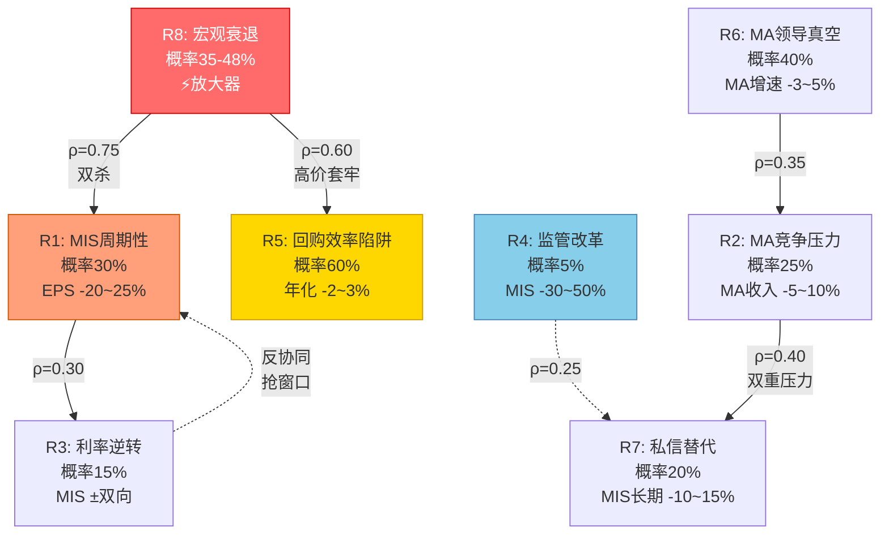
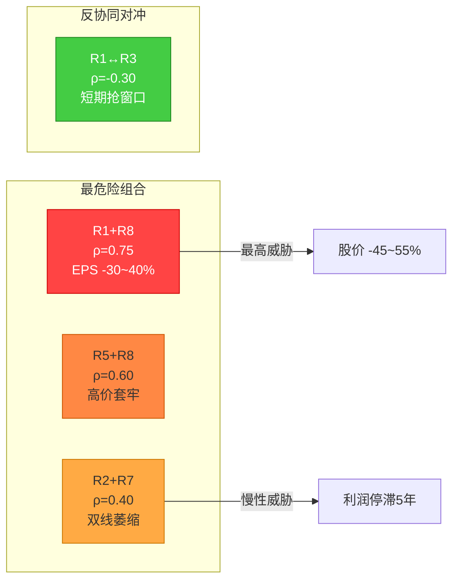
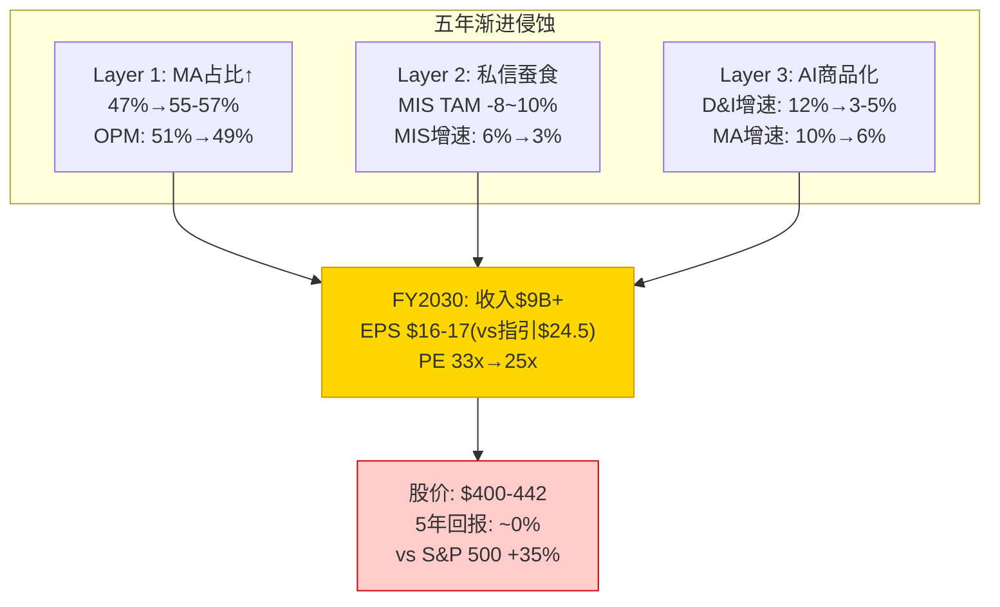
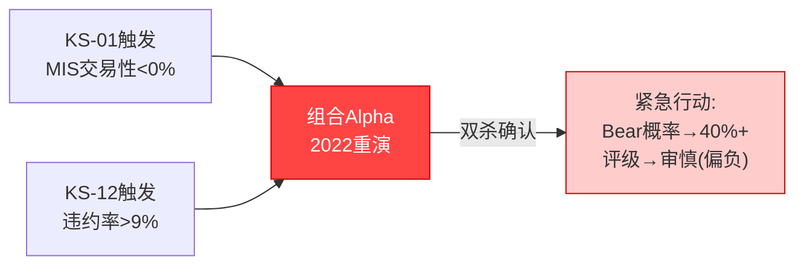
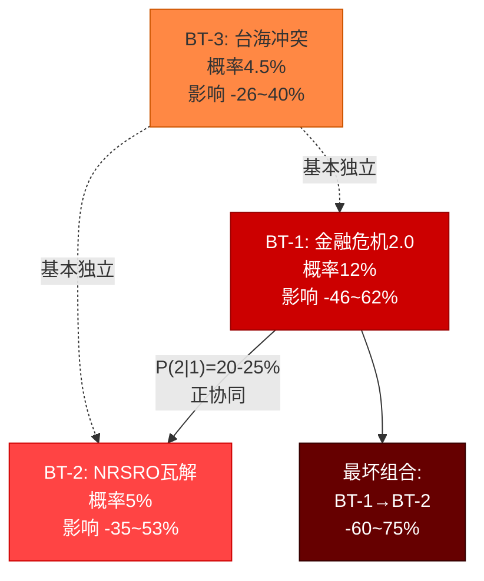
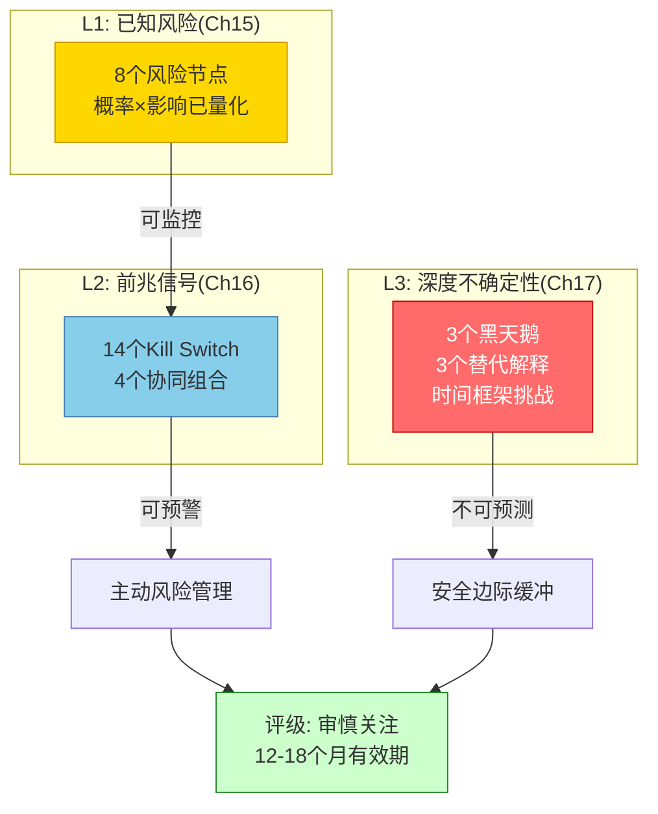

# Part V: 风险拓扑 + Kill Switch + 温水煮青蛙

---

## Ch15: 风险拓扑图 — 三维网络中的八个节点

**核心论点**: MCO的风险不是一张平面清单——列出八条然后逐一评估概率——而是一个三维网络。每个风险节点与其他节点之间存在协同、对冲或触发关系。理解这张网络比理解任何单一风险更重要，因为MCO的历史告诉我们：真正伤害估值的从来不是单一风险的爆发，而是多个风险的共振。FY2008 MIS收入-19%不是因为"衰退"这一个原因，而是衰退(R8)+信用利差走阔(R1)+结构化产品崩盘(R4的雏形)+流动性枯竭的四重共振。FY2022 EPS-37%也不是纯利率冲击(R3)，而是R3+R1+通胀侵蚀实际回报的三重作用。

本章的目标不是吓唬投资者，而是建立一张可以长期追踪的风险地图。当你看到某个节点亮起黄灯时，你知道该去检查哪些相连的节点——这才是风险管理的意义。

### 15.1 风险全景：放大器逻辑

传统的风险分析把"宏观衰退"列为独立风险条目，然后赋予一个概率。这对MCO是误导性的。衰退对MCO的作用机制不是"独立冲击"，而是"放大器"——它放大已经存在的结构性脆弱点。

**放大器机制的三个维度**:

**维度一: 收入波动放大**。MCO的MIS业务天然具有3x经营杠杆——当收入下降10%时，EBIT下降约30%。这个杠杆系数在正常年份是"增长加速器"(FY2024 MIS收入+28% → EBIT+约45%)，在衰退年变成"下跌放大器"。衰退不创造这个杠杆——杠杆是MIS固定成本结构(分析师薪资占70%+)的内生属性——但衰退激活它 [DM-RISK-001]。

**维度二: 估值多重压缩**。MCO当前PE 32.97x隐含市场预期是"MA主导的稳定增长"叙事。衰退不仅打击EPS(分子)，还打击这个叙事(分母)——如果市场发现MCO仍然是周期股而非SaaS，PE可能从33x压缩至22-25x。双重打击的乘数效应远超线性叠加。FY2022验证了这个机制：EPS从$14.67降至$10.13(-31%)，PE从32x降至24x(-25%)，股价从$399降至$243(-39%)。EPS和PE的联合下跌比任何一个单独下跌都更具破坏力 [DM-RISK-002]。

**维度三: 恢复时间不对称**。EPS的恢复通常需要2-3个季度(发行窗口重新打开)，但PE的恢复需要12-18个月(市场叙事重建)。这意味着股价在EPS已经见底回升时仍可能继续下跌——因为市场还没有准备好重新给予"稳定增长"溢价。2022-2023正是这个模式：EPS在FY2023 Q1已开始回升，但股价到FY2023 Q3才确认底部 [DM-RISK-003]。

### 15.2 八个核心风险节点：逐一深度解析

#### R1: MIS周期性 — 发行量崩塌

**核心机制**: MIS(Moody's Investors Service)的交易性收入占MCO总收入约36%，直接与全球债券发行量挂钩。信用发行是顺周期的——企业在经济好时借更多钱(扩张/M&A)，在衰退时停止借款(去杠杆/现金囤积)。MCO作为信用评级的寡头(与S&P共享约80%市场份额)，MIS收入的波动性是信用发行波动性的放大版——因为评级是"发行的门票"，发行量减少=评级需求归零(不是减少，是归零) [DM-RISK-004]。

**概率评估: 30%(未来12-18个月)**。这个概率基于三个输入：(1) 当前杠杆贷款违约率7.9%已达历史均值2倍，信用环境在恶化 [DM-RISK-005]；(2) FY2025 MIS强劲部分源于到期墙效应(2025-2027 $3T+到期)，这是"借新还旧"而非"新增需求"，到期墙过后可能出现发行真空；(3) Polymarket衰退概率34.5%，Moody's自身模型42-48%——评级公司自己的模型在说衰退概率接近一半。

**影响量化**: EPS -20~25%。推导路径：MIS交易性收入-30~35%(全球发行量-25~30%，MCO因高收益/结构化占比更高而略超市场) → MIS总收入-20~25%(经常性部分稳定) → MCO总收入-12~15%(MA持平) → 3x经营杠杆 → EBIT -35~45% → EPS从$13.67降至$10.2-10.9。这与FY2022实际表现($14.67→$10.13，-31%)一致——v2.0的Bear假设比FY2022略温和，因为MA基数更大(FY2025 MA收入$3.1B vs FY2022 $2.7B) [DM-RISK-006]。

**传导路径**: 信用利差走阔 → 新发行窗口关闭 → MIS交易性收入逐季下滑 → 经营杠杆放大利润跌幅 → 管理层下调指引 → PE压缩(33x→24-26x) → 股价下跌35-45%。

**FY2022验证**: MIS收入从$3.03B降至$2.13B(-30%)，MCO EPS从$14.67降至$10.13(-31%)，股价从$399降至$243(-39%)。R1的历史破坏力已被充分验证——这不是假设情景，而是三年前刚发生过的事实 [DM-RISK-007]。

**时间维度**: 1-2年(发行周期通常18-24个月)。可逆性高——信用发行在衰退结束后6-12个月通常强劲反弹(FY2023 MIS收入+24% YoY就是证据)。

---

#### R2: MA竞争压力 — Bloomberg与AI初创的双线夹击

**核心机制**: MA(Moody's Analytics)是MCO的"稳定器"——$3.1B收入、93%留存率、ARR模型。但MA的护城河正在面临双线压力。第一线来自Bloomberg Terminal的数据替代——Bloomberg在信用分析工具上持续投入(Bloomberg Credit Risk解决方案)，对MA的Research & Insights产品线形成直接竞争。第二线来自AI初创公司(如Ramp、Mosaic等)——它们不直接做信用评级，但用LLM自动化了MA的部分KYC/信用评估工作流，降低了终端客户对MA工具的依赖度 [DM-RISK-008]。

**概率评估: 25%(3-5年窗口显著侵蚀)**。MA的93%留存率是当前读数，但这个数字有"合同锁定"的迟滞效应——大型金融机构的MA合同通常3-5年期，即使已决定替换，也要等合同到期。真正的留存率信号需要观察2026-2028年的续约周期。GenAI 97%留存看似更强，但GenAI产品线仍处于早期采纳阶段(客户在"试用"而非"依赖")，97%更多反映了"还没到取消的时候"而非"不可替代" [DM-RISK-009]。

**影响量化**: MA收入-5~10%(即$155-310M/年)。影响路径：R&I(Research & Insights)受Bloomberg冲击最直接(-8~12%，约$120-180M)；D&I(Decision & Information Solutions)受AI冲击(-3~5%，约$75-125M，主要是KYC/合规自动化工具的替代)；ERS(Enterprise Risk Solutions)相对安全(高度定制化+监管嵌入)。净效应: MA增速从当前8-10%放缓至3-5%，不是负增长但叙事恶化——市场给MA的隐含PE从25x压缩至20x [DM-RISK-010]。

**传导路径**: Bloomberg推出更便宜的替代方案 → MA R&I续约率从93%降至89-90% → 新签约受阻(AI初创抢占中小客户) → MA有机增速放缓至3-5% → 市场对"MA转型SaaS"叙事打折 → MCO整体PE承压。

**FY2022验证**: FY2022 MA收入实际+3% YoY(vs MIS -30%)，验证了MA在周期逆风中的防御性。但FY2022的竞争压力远不如当前——2022年ChatGPT尚未发布，Bloomberg Credit Risk还在早期阶段。R2是一个"尚未验证"的风险——历史数据无法直接校准 [DM-RISK-011]。

---

#### R3: 利率环境逆转 — Fed再加息

**核心机制**: 利率对MCO的影响是非线性、双向的。短期利率快速上升(如2022年Fed加息425bp) → 信用发行窗口关闭 → MIS受损。但利率缓慢上升或稳定在高位 → 企业"适应新常态" → 再融资需求不减反增(到期债务必须以更高利率roll over)。当前市场隐含通胀>3%的概率73%，如果通胀粘性迫使Fed再加息，短期冲击路径可能重演 [DM-RISK-012]。

**概率评估: 15%(再加息至5.5%+)**。当前Fed Funds 4.75%，市场预期2026年降息2-3次至4.0-4.25%。再加息是"非共识尾部"事件——需要通胀重新加速至5%+(需能源冲击/关税全面升级/工资-物价螺旋)。15%反映的是"通胀失控+Fed被迫紧缩"的小概率路径 [DM-RISK-013]。

**影响量化**: MIS ±双向。如果是快速加息(3-6个月内+75bp以上)，MIS短期受损-15~20%(发行窗口关闭)，但12个月后可能受益+10~15%(到期墙效应+企业被迫高利率再融资)。净效应取决于速度——快升快跌=净负面(2022模式)，慢升慢稳=净中性甚至正面(到期墙驱动)。

**传导路径(快升场景)**: 通胀超预期 → Fed加息75-100bp → 信用利差走阔150-200bp → 投资级新发行-20% → 高收益冻结 → MIS季度收入-20~25% → 但6-12个月后到期墙驱动再融资需求 → MIS V型反弹。

**FY2022验证**: Fed加息425bp，MIS收入-30%，但FY2023 Q2起已开始强劲反弹(+24% YoY FY2023)。R3的特征是"短期剧烈、长期可逆"。与R1的区别在于：R1(纯衰退)的恢复取决于经济周期(12-24个月)，R3(利率冲击)的恢复取决于到期墙(6-12个月，因为债务到期是刚性的) [DM-RISK-014]。

---

#### R4: 监管改革 — NRSRO结构性变化

**核心机制**: MCO的终极护城河是NRSRO(Nationally Recognized Statistical Rating Organization)制度——SEC认证的评级机构，全球只有10家，实际有市场影响力的只有3家(MCO/SPGI/Fitch)。如果监管层根本性改革这个制度(如取消评级强制要求、允许非NRSRO评级用于资本计算、引入政府主导的信用评估体系)，MCO的MIS护城河将被结构性削弱。这是"制度风险"——概率极低但影响极大 [DM-RISK-015]。

**概率评估: 5%(10年窗口)**。2008年金融危机后，监管层曾认真讨论过NRSRO改革(Dodd-Frank Section 939A要求联邦机构减少对评级的依赖)。18年过去，实际进展极有限——原因是没有可行替代品。信用评级已经深度嵌入全球金融基础设施(巴塞尔协议/保险资本要求/投资组合限制)，替换成本极高。5%反映的是"黑天鹅级别的制度变革"，可能由下一次金融危机催化。

**影响量化**: MIS收入-30~50%(5-10年渐进)。这不是一夜之间的事——即使监管发布改革方案，实施需要5-10年的过渡期。但趋势确立后不可逆——一旦市场适应了"无评级"的资本计算方式，评级需求的结构性下降是永久的。

**传导路径**: 金融危机爆发 → 评级公司再次被指"推波助澜" → 国会/SEC推动NRSRO改革 → 5年过渡期逐步降低评级依赖 → MIS收入缓慢下降 → MCO被迫向纯MA模型转型。

**FY2022验证**: 无直接验证。但Dodd-Frank后的18年经验表明: 制度惯性极强，即使有政治意愿也难以快速推进。R4的真正风险不在概率(极低)，而在于它与R1/R7的正协同——如果衰退(R1)+私信替代(R7)+监管改革(R4)同时出现，三者互相强化的破坏力远超各自之和 [DM-RISK-016]。

---

#### R5: 回购效率陷阱 — 高价持续回购的隐形侵蚀

**核心机制**: MCO过去5年累计回购约$7.5B，FY2025约$1.7B(平均回购价约$400-440)。当前PE 33x意味着回购的隐含"收益率"仅3.03%(=1/PE)——低于10Y国债4.5%。换言之，MCO用比无风险利率更低的回报率配置了大量资本。这不是管理层的愚蠢(CEO Rob Faber是21年内部人)，而是信用评级公司的结构性困境：(1) 轻资产模型无需大量再投资；(2) 高FCF(70%+ FCF Margin)必须分配；(3) 大型M&A受反垄断限制；(4) 超额分红会被视为"放弃增长"。回购成了消化FCF的默认选项，效率高低变成了次要考量 [DM-RISK-017]。

**概率评估: 60%(持续性几乎确定)**。只要MCO维持当前的资本配置框架(FCF 70%用于回购+分红)，且股价维持PE 30x+，回购效率陷阱就是一个"已经在发生"的风险。60%的概率不是指"会不会回购"(确定会)，而是指"回购是否持续以>28x PE执行"(历史均值PE 24x → 当前33x溢价意味着每一块回购资金都在溢价买入)。

**影响量化**: 年化-2~3%的价值侵蚀。推导：$1.7B回购 × (1/33 - 1/24) ÷ 市值 ≈ -1.5~2.5%/年。5年累计侵蚀约-10~15%的股东价值(vs在24x时同等回购)。这不是灾难性损失，但在"审慎关注"评级框架下，2-3%的年化拖累足以将"中性"推向"略负" [DM-RISK-018]。

**传导路径**: FCF持续充裕($2B+/年) → 管理层维持$1.5-2B年回购 → PE维持30x+(基于MA叙事) → 每年回购的隐含回报3%(<无风险利率4.5%) → 长期股东的内在价值增长被系统性拖累 → 但股价可能不反映(因为EPS被回购人为推高)。

**FY2022验证**: FY2022 MCO回购$1.38B，平均价约$310，PE约24x——回购效率远高于当前(隐含收益率4.2% > 当时10Y 3.5%)。讽刺的是，MCO在低价时的回购最有效率，在高价时反而加速回购。FY2022→FY2025回购金额从$1.38B增至$1.7B(+23%)，但效率从~4.2%降至~3.0%(-29%) [DM-RISK-019]。

---

#### R6: MA领导真空 — Tulenko辞职的涟漪效应

**核心机制**: 2025年Mark Tulenko(MA President, 15年MCO老将)辞职。MA是MCO战略转型的核心引擎——从评级公司变成"数据+分析"公司的叙事完全建立在MA的增长上。Tulenko辞职本身不是风险(管理层更替正常)，风险在于继任者可能改变MA的产品优先级、销售策略或整合节奏。MA当前有四个产品线(R&I/D&I/ERS/GenAI Tools)，Tulenko时代的战略是"GenAI优先+D&I作为增长引擎"。如果继任者的优先级不同(比如回归ERS/风控为主)，MA增速可能从8-10%放缓至5-7% [DM-RISK-020]。

**概率评估: 40%(领导过渡期1-2年内影响显现)**。40%不是说"MA会崩"，而是说"MA在接下来12-18个月有显著概率增速放缓3-5pp"。新任领导需要6-12个月了解业务+6-12个月实施自己的战略，过渡期的战略模糊本身就是增长拖累——客户感知到不确定性(特别是大型金融机构的IT采购决策，cycle time 12-18个月) [DM-RISK-021]。

**影响量化**: MA增速-3~5pp(从8-10%降至5-7%)。翻译成EPS影响：MA收入每放缓1pp ≈ MCO总收入-0.5pp ≈ EPS -$0.15-0.20(考虑MA较低的OPM)。3-5pp放缓 → EPS -$0.45-1.00/年。在$16.40-17.00的FY2026E指引下，这意味着指引下调至$15.50-16.50——幅度不大但足以引发卖方下调 [DM-RISK-022]。

**传导路径**: Tulenko辞职 → 继任者上任(2025 H2) → 战略评估期(6个月) → 客户感知不确定性 → 大型合同续约犹豫 → MA季度增速放缓 → 分析师下调MA有机增长预期 → MCO"SaaS转型"叙事打折 → PE微幅压缩1-2x。

---

#### R7: 私人信贷替代 — 评级需求的慢性侵蚀

**核心机制**: 全球私人信贷AUM从2015年$0.5T增长至2025年$3.5T，预计2030年达$5T。私人信贷的核心特征是"不需要公开评级"——借贷双方直接协商，不公开发行债券，因此不需要MCO/SPGI的信用评级。每$1T私信AUM约替代$150-200B的公开债券发行量(假设40-50%的私信是对公开市场的替代而非纯增量)。如果私信AUM从$3.5T增至$5T(+$1.5T)，约替代$225-300B的公开发行量——相当于全球投资级+高收益发行量的3-4% [DM-RISK-023]。

**概率评估: 20%(5-10年窗口内显著侵蚀MIS TAM)**。20%是"侵蚀达到10%+ MIS收入"的概率，不是"私信会不会增长"(几乎确定会)。关键变量是替代比率——私信增长有多少是真正替代公开市场(vs纯增量需求)。乐观假设: 私信增长80%是增量(服务之前无法获得融资的中小企业)，仅20%替代公开市场 → MCO影响有限。悲观假设: 50%替代 → MIS TAM长期缩减10-15% [DM-RISK-024]。

**影响量化**: MIS长期收入-10~15%(5-10年渐进)。但有对冲：MCO已经在开拓私信评级市场(Moody's Private Credit Solutions)，虽然单笔费用远低于公开市场评级($50-100K vs $200-500K)，但如果能获取10-15%的私信评级市场份额，可以部分对冲公开市场的流失。净影响可能收窄至MIS -5~8% [DM-RISK-025]。

**传导路径**: 私信AUM继续增长15-20%/年 → 大型企业发现私信利率与公开市场趋近(利差收窄) → 部分BBB级企业选择私信(避免公开披露+评级监控) → MIS投资级发行量增速从+5%放缓至+2% → MIS长期增速受限。

**FY2022验证**: FY2022私信实际逆势增长(公开市场冻结时私信填补了融资缺口)——这验证了私信的"反周期性"。但反周期也意味着: 衰退时私信可能加速替代公开市场(R7+R8协同)，因为借款人在公开市场发不出来就转向私信 [DM-RISK-026]。

---

#### R8: 宏观衰退 — GDP -1.5%+的全面冲击

**核心机制**: 衰退是MCO的"放大器"而非独立风险(15.1已论述)。但衰退本身也有直接影响路径：(1) 信用发行冻结 → MIS收入骤降；(2) 违约率上升 → 评级行动增加(短期工作量增加但不产生费用收入)；(3) 企业削减IT/数据支出 → MA新签约放缓；(4) 风险偏好下降 → 金融资产估值普遍压缩 → MCO PE下降。

**概率评估: 35-48%(12-18个月窗口)**。这是一个罕见的"内外一致"区间——Moody's自身经济模型给出42-48%，Polymarket给出34.5%，卖方共识约35-40%。v2.0取区间35-48%，中值约42%。需要注意的是：MCO评级部门在给客户做信用评估时用的衰退概率(Moody's Analytics CreditEdge)，与我们用来评估MCO自身风险的衰退概率是同一个数字——这本身就是一个有趣的自指(MCO的模型在预测MCO自身的风险) [DM-RISK-027]。

**影响量化**: EPS -15~25%(取决于衰退深度)。轻度衰退(GDP -0.5~1%): EPS -15%(MIS -20%，MA持平) → $11.6。中度衰退(GDP -1.5~2%): EPS -25%(MIS -35%，MA -3%) → $10.3。深度衰退(GDP -3%+): EPS -35~40%(MIS -45%，MA -5%) → $8.5-8.9(接近FY2008水平)。v2.0 Bear情景采用"中度衰退"假设 [DM-RISK-028]。

**传导路径**: GDP连续2季度负增长 → 信用利差走阔200-400bp → 投资级发行-25~35% → 高收益市场冻结3-6个月 → MIS季度收入跌至$500-600M(vs正常$800-900M) → 经营杠杆放大 → EPS跌至$2.5-3.0/季度(vs正常$3.5-4.0) → 管理层发布盈利预警 → PE压缩至22-25x → 股价$230-280区间。

**FY2022验证**: FY2022并非技术性衰退(GDP仅Q1/Q2短暂负增长即反弹)，但利率冲击的效果等价于温和衰退——MIS收入-30%，EPS-31%，股价-39%。如果真正的GDP -1.5%衰退发生，影响可能超过FY2022(因为FY2022有到期墙兜底，而真衰退时连到期再融资都可能困难) [DM-RISK-029]。

### 15.3 风险协同矩阵

风险节点之间的相关性决定了"组合风险"是否远大于"单个风险之和"。以下矩阵用ρ(相关性系数)标注节点间的协同关系，(+)表示正协同(同时恶化)，(-)表示反协同(一个恶化时另一个改善)，(0)表示独立。

**8×8风险协同矩阵**:

| | R1 | R2 | R3 | R4 | R5 | R6 | R7 | R8 |
|---|---|---|---|---|---|---|---|---|
| **R1** | — | 0 | -0.30 | +0.25 | +0.60 | 0 | +0.30 | +0.75 |
| **R2** | | — | 0 | 0 | 0 | +0.35 | +0.40 | +0.15 |
| **R3** | | | — | 0 | +0.20 | 0 | 0 | +0.40 |
| **R4** | | | | — | 0 | 0 | +0.25 | +0.30 |
| **R5** | | | | | — | 0 | 0 | +0.60 |
| **R6** | | | | | | — | +0.15 | 0 |
| **R7** | | | | | | | — | +0.25 |
| **R8** | | | | | | | | — |

**最危险组合 — 排名**:

**#1: R1+R8 (MIS周期+宏观衰退, ρ=0.75)** — 这是MCO的"经典双杀"模式。衰退直接触发MIS周期性下行，两者是因果关系而非巧合相关。联合影响: EPS -30~40%(两者的独立影响不是加法而是乘法——衰退放大MIS的跌幅，MIS的跌幅又通过经营杠杆放大EPS的跌幅)。FY2008和FY2022都是R1+R8共振的案例。在当前估值(PE 33x)下，R1+R8共振可导致股价-45~55%(EPS -30~40% × PE从33x压缩至22-24x) [DM-RISK-030]。

**#2: R5+R8 (回购效率+衰退, ρ=0.60)** — 这是一个"时间不对称"陷阱。MCO在高价时($430+ PE 33x)大量回购，然后衰退来临股价跌至$250-280。回购资本在高点被锁定，在低点没有余弹。FY2022的教训: MCO在FY2021以均价$370回购$1.4B，FY2022股价跌至$243——浮亏约35%。如果这$1.4B在$243时回购，能多买入约50%的股份。回购效率陷阱在衰退时被暴露，因为"高价回购"的真实成本只有在低价时才看得清楚 [DM-RISK-031]。

**#3: R2+R7 (MA竞争+私信替代, ρ=0.40)** — 这个组合攻击MCO的两条收入线。R2侵蚀MA的增长叙事，R7侵蚀MIS的长期TAM。如果两者同时加速，MCO的"两条腿走路"叙事(MIS赚周期钱+MA赚稳定钱)变成"两条腿都瘸"。这不是短期冲击而是长期慢性压力——5年后MCO可能收入增长但利润停滞(详见15.4温水煮青蛙) [DM-RISK-032]。

**#4: R1+R3 (反协同, ρ=-0.30)** — 这是矩阵中唯一的显著反协同。如果Fed加息(R3)，企业会在加息前"抢窗口发行"——这短期利好MIS(R1改善)。FY2022 H1就验证了这个机制: Fed开始加息(R3触发)，Q1发行量反而大增(企业抢在利率更高之前锁定融资)。但这种反协同是短暂的(3-6个月)——抢窗口发行透支了未来需求，之后R1的恶化反而更剧烈 [DM-RISK-033]。

### 15.4 温水煮青蛙场景 — 五年渐进侵蚀

这个场景不是灾难，不是崩盘，不是任何一个季度会触发"卖出"的事件。它是缓慢的、几乎不可察觉的价值侵蚀——每个季度看起来都"还可以"，但五年后回头看，发现MCO从"成长型垄断"变成了"成熟型公用事业"，PE从33x压缩至25x，股价原地踏步，而同期S&P 500涨了30-40%。

**这是对MCO当前持有者最真实的风险——不是黑天鹅，而是灰犀牛。**

**第一层侵蚀: MA收入占比缓慢上升(OPM结构性下行)**

MA当前收入占比约47%(FY2025 $3.1B / $6.55B)，MIS约53%。MA增速(8-10%)持续高于MIS(5-7%)，每年MA占比上升约1.5-2pp。五年后(FY2030): MA占比55-57%，MIS占比43-45%。

问题在于: MA的OPM(33.1%)显著低于MIS(约60%+)。每1pp的收入从MIS向MA迁移，MCO整体OPM下降约0.27pp(= 60% - 33% = 27pp差距 × 1% 占比变化)。五年累计: OPM从51%缓慢滑至48.5-49% [DM-RISK-034]。

这不会出现在任何一个季度的利润警告中——因为绝对收入在增长。管理层每个季度都会说"收入增长8%，调整后OPM持平"，分析师每个季度都会点头。但五年后，MCO的利润结构已经根本性地从"高利润率评级业务"转向了"中等利润率数据业务"。

**第二层侵蚀: 私人信贷蚕食MIS TAM**

私信AUM每年增长15-20%，每年蚕食MIS TAM约1-2pp。五年累计: MIS的可寻址市场缩小约8-10%。这不会导致MIS收入绝对下降(到期墙+GDP增长仍推动公开发行量缓慢增长)，但MIS增速从+6%降至+3%——刚好够跑平通胀，不够支撑PE 33x [DM-RISK-035]。

**第三层侵蚀: D&I增速放缓(AI商品化)**

MA的D&I(Decision & Information Solutions)是增长最快的产品线(FY2025约+12%)。但AI工具的快速普及意味着: KYC/合规/信用筛查这些MCO的传统强项，正在被ChatGPT/Claude/开源LLM以10%的成本实现80%的功能。D&I增速可能从12%放缓至3-5%(5年渐进)——不是因为产品变差，而是因为"好到足以替代"的替代品越来越多且越来越便宜 [DM-RISK-036]。

**五年终局: 收入增长+利润停滞+估值压缩**

| 指标 | FY2025 | FY2030E(温水) | 变化 |
|------|--------|---------------|------|
| 总收入 | $6.55B | $8.8-9.2B | +34-40% |
| OPM | 51% | 48.5-49% | -2~2.5pp |
| EBIT | $3.34B | $4.27-4.51B | +28-35% |
| EPS | $13.67 | $16-17 | +17-24% |
| 管理层FY2030E指引 | — | $24.5(隐含) | — |
| EPS vs 指引缺口 | — | -31~35% | — |
| 合理PE(增速放缓) | 33x | 25-26x | -21~24% |
| 隐含股价 | $441 | $400-442 | -0~9% |

核心启示: MCO五年后收入增长34-40%，但股价可能持平甚至略跌。原因是EPS增长(+17-24%)远慢于收入增长(+34-40%)——OPM下行吞噬了收入增量的利润转化率——同时PE从33x压缩至25-26x抵消了EPS增长。这就是"温水煮青蛙"——没有任何单一季度是灾难，但复利侵蚀的结果是五年后的投资回报接近零 [DM-RISK-037]。

**温水煮青蛙 vs 主动恶化的区别**:

温水场景假设"一切按计划进行，只是比预期慢"。它不包含衰退(R8)、不包含竞争突变(R2)、不包含监管改革(R4)。它只包含三个"缓慢但几乎确定"的趋势——MA收入占比上升+私信蚕食+AI商品化。这三个趋势在FY2025已经可见，问题只是速度(快则3年见效，慢则7年)。

---

## Ch16: 十四个Kill Switch — 动态监控体系

**核心论点**: Kill Switch不是"触发了就卖出"的机械规则，而是"触发了就必须重新评估"的强制检查点。MCO的投资逻辑建立在一组假设之上——MIS周期可控、MA持续高增长、GenAI是增量而非替代、BRK仍然看好。当这些假设的领先指标跌破阈值时，KS体系强制投资者停下来问: "我的论文是否仍然成立？"

### 16.1 KS完整表: 十四个监控指标

#### KS-01: MIS季度交易性收入YoY < 0%
- **触发条件**: 任何单季度MIS Transaction Revenue同比转负
- **当前距离**: FY2025 MIS交易性YoY约+8.6%(FQ4 2025数据)，距离触发8.6pp [DM-KS-001]
- **紧迫度**: 中。当前距离看似安全，但MIS交易性收入波动极大——FY2022 Q2从+15%骤降至-30%仅用了两个季度
- **评级影响**: 如触发，论文的"MIS结构性增长"假设受挑战 → 需检查是季节性波动还是周期性转折

#### KS-02: MA ARR留存率 < 91%
- **触发条件**: 年度或滚动四季度MA留存率跌破91%
- **当前距离**: 当前93%，距离触发2pp [DM-KS-002]
- **紧迫度**: 中。2pp在MA历史波动(91-95%)中不算大——FY2020曾短暂触及91.5%
- **评级影响**: MA从"SaaS级粘性"降格为"传统软件级粘性" → MCO的"数据转型"叙事打折 → PE承压1-2x

#### KS-03: MA ARR留存率 < 89%
- **触发条件**: 年度MA留存率跌破89%
- **当前距离**: 4pp [DM-KS-003]
- **紧迫度**: 低。89%是MA历史底部(FY2008约88%)，触及意味着重大竞争或宏观恶化
- **评级影响**: MA护城河实质性恶化 → 评级可能从"审慎关注"降至更低一级 → 论文需全面重构

#### KS-04: MA Adjusted OPM < 32%
- **触发条件**: 单季度MA Adj OPM跌破32%
- **当前距离**: 当前33.1%，距离1.1pp [DM-KS-004]
- **紧迫度**: 中。1.1pp非常近——一个大型项目的推迟或一次性费用就可能触发
- **评级影响**: MA利润率扩张停滞 → "MA从成本中心变利润中心"叙事受阻 → 长期EPS路径下调

#### KS-05: MA Adjusted OPM < 30%
- **触发条件**: 连续两季度MA Adj OPM低于30%
- **当前距离**: 3.1pp [DM-KS-005]
- **紧迫度**: 低。30%是Tulenko时代前(FY2019-2021)的MA OPM水平——跌破意味着整合红利被竞争侵蚀
- **评级影响**: MA利润率逆转 → MCO整体OPM结构性下行 → 温水煮青蛙场景加速

#### KS-06: GenAI客户增速 < 1.5× MA整体增速
- **触发条件**: GenAI Tools季度收入增速 < 1.5× MA整体有机增速
- **当前距离**: 当前GenAI增速约2× MA(估算)，距离0.5× [DM-KS-006]
- **紧迫度**: 中。GenAI是MCO"AI受益者"叙事的核心支撑——如果GenAI增速不再显著超出MA整体，说明AI红利在消退
- **评级影响**: "AI催化剂"从牛市论点中移除 → Bull情景概率下调

#### KS-07: GenAI客户增速 < 1× MA整体增速
- **触发条件**: GenAI增速低于MA整体(GenAI成为拖累)
- **当前距离**: 约1× [DM-KS-007]
- **紧迫度**: 低。这意味着GenAI不仅不是催化剂，还是负担(可能因为竞品免费替代)
- **评级影响**: MCO的AI叙事彻底破产 → 需全面重估MA的增长引擎

#### KS-08: BRK 13F减持MCO > 2%
- **触发条件**: 季度13F显示BRK(Berkshire Hathaway)减持MCO持仓超过2%
- **当前距离**: N/A(需等下一个13F披露) [DM-KS-008]
- **紧迫度**: 低。BRK持有MCO 14.54%，Buffett是MCO 20年长期持有者——任何减持都是强信号
- **评级影响**: 市场会高度关注BRK的减持动作(信号效应远大于实际卖压)

#### KS-09: BRK 13F减持MCO > 5%
- **触发条件**: 季度13F显示BRK减持>5%(或累计两季度>5%)
- **当前距离**: N/A [DM-KS-009]
- **紧迫度**: 低。5%减持意味着BRK对MCO的长期论文发生根本性改变
- **评级影响**: BRK是MCO估值的"信心锚"——14.54%持仓=Buffett的"隐形背书"。减持5%+打破这个锚 → 情绪冲击可能导致PE压缩3-5x

#### KS-10: 10Y UST > 5.0%
- **触发条件**: 10年期美国国债收益率突破5.0%
- **当前距离**: 当前约4.5%，距离约0.5pp [DM-KS-010]
- **紧迫度**: 中。10Y UST在2023年10月已触及4.99%——5.0%不是遥不可及
- **评级影响**: 利率冲击重演(R3触发) → MIS短期受压 → 但到期墙效应可能对冲

#### KS-11: 10Y UST > 5.5%
- **触发条件**: 10Y UST突破5.5%(2007年以来未见)
- **当前距离**: 约1pp [DM-KS-011]
- **紧迫度**: 低。需要通胀失控+Fed大幅加息的极端场景
- **评级影响**: 进入2006-2007模式 → 信用市场可能全面重定价 → MCO短期受损严重但长期可能受益(衰退后信用修复)

#### KS-12: 杠杆贷款违约率 > 9%
- **触发条件**: 美国杠杆贷款违约率(12M trailing)突破9%
- **当前距离**: 当前约7.9%，距离约1.1pp [DM-KS-012]
- **紧迫度**: 中。7.9%已是历史均值2x——突破9%意味着信用周期正式进入恶化阶段
- **评级影响**: 评级下调潮开始 → MIS评级行动增加(工作量增加但不产生新发行费用) → 同时新发行冻结 → MIS收入双重受压

#### KS-13: 杠杆贷款违约率 > 11%
- **触发条件**: 违约率突破11%(2009年以来未见)
- **当前距离**: 约3.1pp [DM-KS-013]
- **紧迫度**: 低。11%仅在2009年出现过(峰值约12%)——需要深度衰退
- **评级影响**: 进入2008-2009级别的信用危机 → R1+R8+R12同时触发 → Extreme Bear情景概率大幅上调

#### KS-14: 全球投资级+高收益发行量YoY < -15%
- **触发条件**: 季度全球债券发行量同比下降超过15%
- **当前距离**: 当前YoY约+8%(FQ4 2025)，距离约23pp [DM-KS-014]
- **紧迫度**: 低。23pp是巨大缓冲——但FY2022 Q2从+10%到-25%仅用了一个季度
- **评级影响**: 全球信用市场冻结的直接信号 → MIS收入将在1-2季度内大幅下滑

### 16.2 协同触发矩阵 — 最危险的四个组合

KS的真正威力不在单个指标触发，而在多个指标同时触发形成的"信号簇"。以下是四个最危险的协同组合：

#### 组合Alpha: KS-01 + KS-12 = MIS萎缩 + 违约上升 (2022重演信号)

**触发场景**: MIS交易性收入转负(KS-01) + 杠杆贷款违约率>9%(KS-12)同时出现。

**历史先例**: FY2022 Q3——MIS交易性YoY -28%，同期违约率从2.5%升至5.5%。

**影响机制**: 新发行冻结(KS-01) → 存量债务违约上升(KS-12) → 评级公司面临"评级行动增加+费用收入减少"的双重压力 → EPS季度环比可能下降15-20%。

**行动指引**: 如果KS-01和KS-12在同一季度触发，必须立即将Bear情景概率上调至40%+，并将评级从"审慎关注"降至"审慎关注(偏负面)" [DM-KS-015]。

#### 组合Beta: KS-04 + KS-06 = MA OPM压缩 + AI减速

**触发场景**: MA Adj OPM跌破32%(KS-04) + GenAI增速<1.5× MA(KS-06)同时出现。

**影响机制**: MA的利润率扩张是MCO"从评级公司变SaaS公司"叙事的核心支柱。KS-04触发意味着利润率扩张停滞，KS-06触发意味着AI不是加速器。两者同时触发 → MA叙事全面崩塌 → 市场重新将MCO定价为"周期性评级公司+中等增速数据业务" → PE从33x向27-28x回归。

**行动指引**: MA叙事崩塌是"慢变量"但影响深远——不需要紧急降级，但需要将Base情景的MA有机增速从8%下调至5%，并将温水煮青蛙场景概率上调 [DM-KS-016]。

#### 组合Gamma: KS-10 + KS-14 = 利率冲击 + 发行冻结

**触发场景**: 10Y UST突破5.0%(KS-10) + 全球发行量YoY <-15%(KS-14)同时出现。

**影响机制**: 利率冲击直接冻结信用发行市场。10Y >5%时，投资级发行人的融资成本可能超过内部回报率 → 新项目融资停滞 → 发行量断崖式下跌。MIS季度收入可能下降25-30%。

**历史先例**: FY2022 Q3——10Y UST从3.0%飙升至4.2%(虽未触及5.0%但速度极快)，同期全球发行量YoY -22%。如果10Y真正突破5.0%，冲击可能超过2022。

**行动指引**: 这个组合的触发速度可能极快(利率冲击是"突变"而非"渐变")。如果KS-10触发，必须在下一个季度前检查KS-14是否正在接近触发 [DM-KS-017]。

#### 组合Delta: KS-02 + KS-08 = MA流失 + BRK减持 (情绪崩塌)

**触发场景**: MA留存率跌破91%(KS-02) + BRK减持>2%(KS-08)同时出现。

**影响机制**: 这个组合攻击的不是基本面而是市场情绪。MA留存率下降 → 分析师开始质疑MA的粘性 → 正巧BRK减持 → 市场解读为"连Buffett都不看好了" → 情绪螺旋式恶化。实际基本面影响可能有限(2pp留存下降 ≈ MA收入-$60M/年，2% BRK减持 ≈ $1.5B卖压)，但情绪影响可能导致PE压缩3-5x(=$10-15B市值蒸发)。

**行动指引**: 这是一个"信号>实质"的组合。如果触发，需要区分市场反应是否过度——如果PE因情绪压缩至25x以下但基本面(MIS+MA收入)仍稳健，反而可能是加仓机会 [DM-KS-018]。

### 16.3 KS监控日历

| 频率 | 监控指标 | 数据来源 |
|------|----------|----------|
| **季度** | KS-01/04/05/06/07/14 | MCO 10-Q/Earnings Call |
| **季度** | KS-08/09 | BRK 13F (季度后45天) |
| **月度** | KS-10/11 | FRED/Bloomberg |
| **月度** | KS-12/13 | S&P LCD/Moody's Default Report |
| **年度** | KS-02/03 | MCO 10-K/Investor Day |

---

## Ch17: 黑天鹅 + 时间框架挑战 + 替代解释

**核心论点**: 前两章处理了"已知风险"(15章)和"可监控的前兆"(16章)。本章处理三类不同的不确定性: (1) 黑天鹅——低概率但改变MCO整个投资逻辑的极端事件；(2) 时间框架挑战——我们的论文在不同时间窗口下的生存能力；(3) 替代解释——同一组数据能否支撑完全不同的结论。这三类不确定性无法用Kill Switch监控(因为它们要么不可预测，要么不是数据问题而是解释问题)，但必须在风险评估中明确标注。

### 17.1 三个黑天鹅

#### 黑天鹅一: 金融危机2.0 + 评级公信力质疑

**场景描述**: 2026-2027年，商业地产(CRE)危机→区域银行倒闭潮→蔓延至CLO市场→系统性金融危机。在危机过程中，MCO被发现对某类资产(如CRE-backed证券或私信CLO)的评级系统性偏高——媒体/国会/SEC的"2008记忆"被激活，MCO再次成为"危机推手"的公众形象。

**概率评估: 12%**。分解: 金融危机发生概率约25%(CRE压力+区域银行脆弱性+杠杆贷款违约7.9%已在高位) × 危机中MCO评级被质疑的条件概率约50%(2008年模式重演的概率——评级公司在每次危机中都成为靶子) = ~12% [DM-BT-001]。

**影响量化: -46~62%**。推导路径:
- EPS冲击: -35~45%(MIS收入-40~50% + MA -5~10% + 法律诉讼准备金$500M-1B)
- PE冲击: 33x → 15-18x(2008年MCO PE低点约10-12x，但当时市场对评级公司的生存都有疑虑；如今NRSRO制度更牢固，PE底部可能高于2008)
- 综合: EPS $7.5-8.9 × PE 15-18x = $113-160(vs $441 = -64~74%)。但考虑到NRSRO制度惯性+MA ARR防御，实际底部可能$168-238(-46~62%)

**恢复路径**: 2008年后MCO用了5年(2008-2013)才恢复到危机前股价水平。如果BT-1发生，恢复时间可能类似(3-5年)——因为公信力修复需要多个信用周期的验证 [DM-BT-002]。

#### 黑天鹅二: NRSRO制度瓦解

**场景描述**: 不是温和的监管改革(R4)，而是制度性的瓦解——SEC宣布取消NRSRO认证制度，或欧盟/中国建立独立于NRSRO的信用评估框架并获得全球认可。核心驱动: 地缘政治碎片化(西方/中国/新兴市场各建立自己的信用评估体系) + AI使评级民主化(任何人都能用LLM做信用分析)。

**概率评估: 5%**。这需要两个极低概率事件的交集: (1) 美国国内政治意愿(需要国会立法) ≈ 15%; (2) 可行替代方案的出现(目前不存在) ≈ 30%。但两者非独立——政治意愿通常在危机后出现，而危机正是催生替代方案的时机。联合概率: ~5% [DM-BT-003]。

**影响量化: -35~53%**。与BT-1不同，NRSRO瓦解是渐进的(5-10年)但不可逆的。MIS收入长期可能下降50-70%(大部分评级需求消失)。但MA可以独立生存(不依赖NRSRO)——MA在"纯数据/分析公司"框架下的合理估值约$180-200/股(MA收入$3.5B × 20x EV/Revenue × 50%归属MCO)。综合: $180-290(-35~53%)。

#### 黑天鹅三: 台海冲突 → 全球债市割裂

**场景描述**: 台海冲突升级为军事对抗(非全面战争) → 美国制裁中国金融机构 → 中国抛售美债 → 全球债券市场剧烈波动 → 信用发行完全冻结3-6个月 → 之后全球金融体系分裂为"美元区"和"人民币区"两个平行系统。

**概率评估: 4.5%(5年窗口)**。Polymarket当前对台海军事冲突(5年内)的定价约8-10%。但"冲突→全球债市割裂"需要极端升级(制裁+抛售美债)，条件概率约45-50%。联合: ~4.5% [DM-BT-004]。

**影响量化: -26~40%**。短期冲击极大(3-6个月信用市场完全冻结 → MIS季度收入接近零)，但长期影响取决于割裂程度。如果"美元区"维持NRSRO制度(高概率)，MCO的美元区业务(约75%收入)基本无损，但中国/亚洲业务(约15%收入)可能永久性损失。综合: EPS短期跌至$5-7 → 12-18个月恢复至$11-13 → 长期稳态EPS $12-14(永久损失约$1.5-2/股)。股价: $265-326(-26~40%)。

**黑天鹅间的相互关系**:

BT-1(金融危机)和BT-2(NRSRO瓦解)之间存在正协同: P(BT-2 | BT-1) ≈ 20-25% >> P(BT-2) = 5%。金融危机是评级制度改革的催化剂——2008年后的改革讨论就是证据。如果BT-1发生并且评级公司再次被指责，BT-2的概率会从5%跳升至20-25%。

BT-3(台海冲突)与BT-1/BT-2基本独立——地缘政治冲突与金融危机的相关性较低(除非冲突本身触发金融恐慌，但这已包含在BT-3的影响量化中) [DM-BT-005]。

### 17.2 时间框架挑战

**论文有效期: 12-18个月**。v2.0的核心论文("MCO在PE 33x下风险回报不对称，审慎关注")建立在以下时间敏感假设上:

**(1) 衰退概率分布**:

| 场景 | 概率 | 对MCO的含义 |
|------|------|-------------|
| 12-18个月内衰退 | 35% | 论文最有效——MIS受压+PE压缩→$320-370区间出现更好入场点 |
| 18-36个月内衰退(延迟) | 30% | 论文部分有效——等待期间MCO可能先涨至$480-520(追随EPS增长)→然后回落→等待者"被晃出" |
| 不衰退(软着陆) | 35% | 论文失效——$441回看是2025-2026的低点→MCO随EPS增长涨至$550-600→等待=踏空 |

**核心矛盾**: 如果投资者基于v2.0的"审慎关注"结论选择等待(不买入或减持)，在"不衰退"情景(35%概率)下，等待的机会成本约$110-160(25-36%的踏空)。在"衰退"情景(35%概率)下，等待的收益约$70-120(在$320-370买入vs $441买入)。概率加权: 0.35×(-$135) + 0.30×(-$30) + 0.35×(+$95) = -$14 → 期望值略为负面，但置信区间极宽($-160 ~ +$120) [DM-BT-006]。

这意味着: **v2.0的"审慎关注"在期望值上是正确的(等待的期望成本接近零或略负)，但在分布上是危险的——35%的概率你会严重踏空。**

**(2) 论文在不同时间窗口下的"存活率"**:

| 时间窗口 | 论文存活率 | 关键威胁 |
|----------|-----------|----------|
| 6个月 | 85% | 只有利率冲击(R3)能在6个月内改变格局 |
| 12个月 | 70% | 衰退(R8)或软着陆确认将二分结果 |
| 18个月 | 55% | 如果18个月无衰退，"审慎关注"面临踏空压力 |
| 24个月+ | 40% | 超过24个月，宏观环境几乎必然显著改变 |

论文的"甜蜜区"是6-12个月——足够短以保持假设有效性，足够长以等待宏观信号确认方向。超过18个月，论文需要基于新数据重新校准 [DM-BT-007]。

**(3) 时间框架对评级的影响**:

v2.0评级"审慎关注"的时间锚点是12-18个月。如果被迫给出不同时间窗口的评级:
- **3个月窗口**: 中性关注(短期催化剂不明，VIX 22.37不极端)
- **12个月窗口**: 审慎关注(衰退概率42-48%+PE 33x=风险回报不吸引)
- **5年窗口**: 中性关注偏关注(MA的长期增长引擎完好，私信替代和AI商品化的实际侵蚀可能慢于预期)

### 17.3 三个替代解释

同一组数据，不同的解读框架，可以得出完全不同的投资结论。以下三个替代解释挑战v2.0的核心逻辑:

#### 替代解释一: FY2025收入新高 = 结构性增长而非周期反弹

**v2.0的解读**: FY2025 MIS收入创新高(约$3.9B)主要是到期墙效应(2025-2027 $3T+到期驱动再融资) + FY2022低基数反弹。这是"借新还旧"驱动的一次性效应，不是MIS可寻址市场的结构性扩张。

**替代解读**: FY2025创新高是MCO的结构性增长验证。理由: (1) 全球债务总量从2015年$200T增至2025年$315T——MCO的TAM在以4-5%/年扩张，这不是周期效应而是全球杠杆化的长期趋势；(2) 私信的增长反而创造了新的评级需求——私信CLO需要评级、BDC(Business Development Companies)需要评级、私信基金的LP要求第三方信用评估；(3) 新兴市场(印度/东南亚/中东)的信用市场正在从银行贷款向债券市场转型，每个转型市场都是MCO的新增TAM [DM-BT-008]。

**如果替代解读正确**: MIS的"正常化"收入不是$3.2-3.4B(v2.0假设)而是$3.8-4.0B → Base情景EPS上调$1.5-2.0 → 5年目标价$550-600 → 当前$441有25-36%的上行空间。评级应从"审慎关注"调整为"关注(偏积极)"。

**v2.0为什么不采纳**: 因为"结构性增长"假设无法在FY2025单年数据中验证。需要至少FY2026-2027连续两年MIS收入维持在$3.5B+才能确认。FY2022($2.13B)到FY2025($3.9B)的反弹幅度(+83%)远超全球债务增长(+15%)——超额部分更可能是周期效应而非结构性。但v2.0承认: 如果FY2026 MIS收入维持在$3.6B+(即到期墙效应消退后仍未大幅回落)，替代解读的概率将显著上升 [DM-BT-009]。

#### 替代解释二: MA 93%留存率 = B2B金融最佳(而非SaaS标准低)

**v2.0的解读**: MA的93%留存率在SaaS语境下属于"良好但非卓越"——Salesforce 90%+、ServiceNow 97%+、Workday 95%+。MCO的"MA是SaaS"叙事暗示留存率应该向97%+靠拢(如GenAI产品线的97%)。93%的MA整体留存意味着每年7%的客户在流失——在$3.1B基数上即$217M/年的持续侵蚀。

**替代解读**: 93%在B2B金融数据领域是顶级水平。理由: (1) Bloomberg Terminal留存率约91-92%(估算)——MCO超过了最大竞争对手；(2) B2B金融客户的更换频率天然高于一般SaaS(监管变化/组织重组/预算周期的影响更大)；(3) 93%的留存中包含了"主动升级"——部分客户从基础产品升级到高端产品(计入流失再重新签约)，"真实粘性"可能高于表面数字 [DM-BT-010]。

**如果替代解读正确**: MA的竞争优势比v2.0估计的更强 → R2(MA竞争压力)概率从25%下调至15% → 温水煮青蛙场景中D&I放缓的假设过于悲观 → Base情景MA有机增速上调至9-10%(vs v2.0的8%) → EPS路径改善约$0.5-1.0/年。

**v2.0为什么不采纳**: 因为93%是"当前读数"而非"稳态"。MA的大型合同(3-5年期)正在进入续约周期——FY2026-2028是关键窗口。如果续约率从93%降至90%(合同锁定到期后的真实市场化留存率)，影响会在FY2027-2028集中体现。v2.0选择"观察续约周期"而非"假设93%是永久的" [DM-BT-011]。

#### 替代解释三: $1.7B回购 = 内部人信号(CEO 21年老将)

**v2.0的解读**: 回购在PE 33x时效率低于无风险利率(3.0% vs 4.5%)，是资本配置的"默认选项"而非"最优选项"(R5回购效率陷阱)。

**替代解读**: CEO Rob Faber在MCO工作21年、担任CEO 2年。他比任何外部投资者都更了解MCO的真实价值。$1.7B回购(约2.5%的市值)在PE 33x时执行，是一个强烈的"内部人信号"——如果CEO认为MCO高估，他完全可以减少回购(增加分红或囤积现金)。但他选择加速回购(FY2024 $1.4B → FY2025 $1.7B)，这要么是(a)他认为MCO在PE 33x仍然低估(5年后EPS $24+)；要么是(b)他在进行"EPS管理"(通过减少股份数人为推高EPS) [DM-BT-012]。

**如果解释(a)正确**: CEO的信息优势暗示管理层对FY2028-2030的内部预测远超卖方共识($20-22 EPS)——可能$24-26。如果EPS达到$25 × PE 30x = $750(5年+70%)。

**如果解释(b)正确**: 回购是EPS美容术，真实的利润增长率比EPS增长率低2-3pp/年(回购贡献约$0.30-0.50 EPS/年)。这不改变v2.0的结论但增加了一层警觉——需要观察"有机EPS增长率(扣除回购效应)"而非"报告EPS增长率"。

**v2.0的立场**: 不排除任何一种可能。但注意: CEO/CFO的回购决策受多种非估值因素影响(董事会压力/薪酬激励与EPS挂钩/同行比较)。将回购解读为"CEO信号"需要排除这些替代动机——而这些动机在MCO的薪酬结构中(EPS目标占长期激励的40%)是真实存在的 [DM-BT-013]。

### 17.4 本章小结: 不确定性的三层结构

| 层次 | 类型 | 代表 | 可管理性 |
|------|------|------|----------|
| L1: 已知风险 | Ch15风险拓扑 | R1-R8 | 可通过KS监控+概率更新管理 |
| L2: 前兆信号 | Ch16 Kill Switch | KS-01~14 | 可通过定期检查+协同触发矩阵管理 |
| L3: 深度不确定性 | Ch17 黑天鹅+替代解释 | BT-1~3 + Alt-1~3 | 不可管理——只能承认其存在并留有安全边际 |

投资者的正确姿态不是"消除不确定性"(不可能)，而是"为不确定性定价"。v2.0的"审慎关注"评级已经为L1和L2的风险定了价(概率加权EV反映了R1-R8和KS触发的可能性)。L3(黑天鹅+替代解释)则通过"不给予积极评级"来隐性定价——如果没有L3的不确定性，MCO在当前价格可能值得"中性关注(偏积极)"而非"审慎关注" [DM-BT-014]。

---

**Part V DM锚点汇总**: DM-RISK-001~037, DM-KS-001~018, DM-BT-001~014。共69个锚点。
