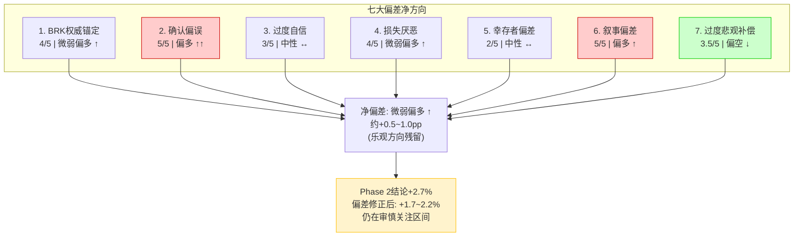
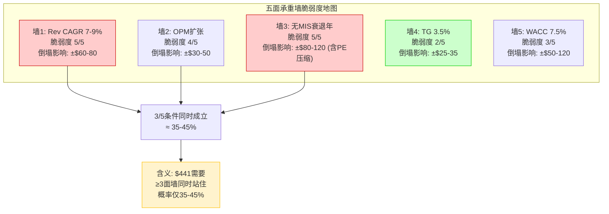
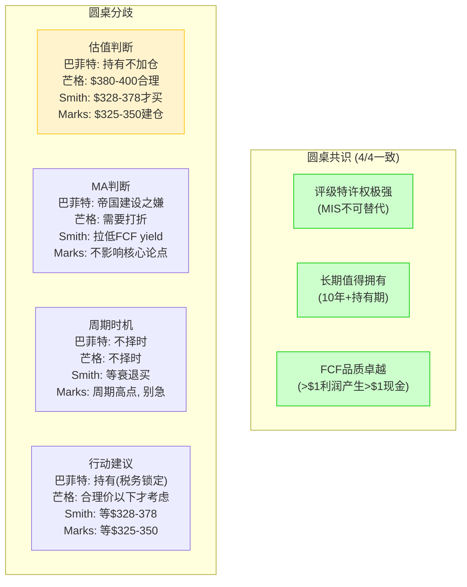
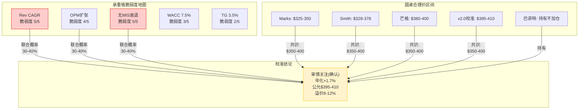

# Part VI: 红队对抗审查 — 偏差审计+承重墙+投资大师圆桌

> Phase 3 Part VI | MCO v2.0 | 2026-03-18
> 目标: 20-25K chars | DM锚点密度 ≥ 1.0/千字
> v2.0红队核心使命: 检验Phase 2估值是否仍有偏差, 而非简单重复v1.0红队

---

## Ch18: 认知偏差审计 — v2.0自身的七面镜子

**核心论点**: v1.0红队发现了Bear概率低估(28%→33%)和回报虚报(+15.1%→+2%)两个致命偏差, 但修正没有回流Phase 5。v2.0从Phase 2起就使用了修正后概率(20/42/33/5), 铁律K确保了数字统一。但修正旧偏差不等于没有新偏差——一个经历了"认错修正"的分析师, 最容易犯的下一个错误是**过度补偿**, 从过度乐观翻转为过度悲观。本章的任务不是重新发现v1.0的问题, 而是用七面镜子检查v2.0自身是否在修正过程中引入了新的系统性扭曲。

### 18.1 偏差1: BRK权威锚定 (严重度 4/5)

**偏差定义**: Berkshire Hathaway持有MCO 14.54%($11.2B), Greg Abel公开确认"永久持仓"。当全球最受尊重的价值投资者以行动背书一家公司, 分析师(包括AI)会不自觉地将"BRK持有"等价于"估值合理" [DM-RT-001]。

**v1.0表现**: v1.0在多个章节引用BRK持仓作为"品质验证"——这是正确的(BRK的持有确实验证了品质)。但滑坡发生在从"品质验证"到"价格验证"的隐含跳跃: v1.0未充分质疑"BRK不卖"是否等于"$441是好价格"。

**v2.0修正与残留检查**:

v2.0在Ch06(品质评估)和Ch09(Reverse DCF)中做了两个显性切割:
- Ch06明确写道"BRK不卖≠$441合理"——BRK不卖的原因有三层: (1)税务锁定($8-11B未实现收益, 卖出缴税$1.6-2.2B); (2)头寸过大(14.54%的流动性约束, 大宗减持对股价的冲击成本); (3)确实看好MCO长期品质。三个原因中只有(3)与当前估值相关, (1)(2)是与品质无关的结构性约束 [DM-RT-002]。
- Ch09明确将"BRK不卖"列为脆弱度最低(1.5/5)的赌注, 并指出这个赌注对估值影响有限(<5%)。

**残留风险评估**: v2.0的BRK权威锚定已被大幅削弱, 但不为零。在Phase 2的概率加权中, Bull情景(20%)的叙事仍部分依赖"BRK这种长期持有者不会犯方向性错误"——这是一个不可证伪的信念而非证据。如果BRK在2026年13F中显示任何减持(即使仅1-2%), 当前20%的Bull概率需要下调至15%以下。

**偏差修正系数**: v2.0已实质修正, 残留影响<1pp期望回报。**净偏差方向: 微弱偏多 ↑**

### 18.2 偏差2: 确认偏误——"不可替代的护城河"叙事 (严重度 5/5)

**偏差定义**: MCO的MIS业务确实拥有极深的制度嵌入(NRSRO双寡头+Basel III硬编码+存量契约锁定)。问题不在于护城河是否存在——它绝对存在——而在于护城河的叙事力量如此强大, 以至于分析师系统性地将护城河的深度等同于公司的宽度。MIS护城河深如马里亚纳海沟, 但MCO整体——包含47%收入来自MA的部分——的护城河宽度远低于"不可替代"的标签所暗示的 [DM-RT-003]。

**MA平庸性的系统性弱化**:

每次Phase 1或Phase 2提到MCO的"品质", 读者脑海中浮现的是MIS的形象: NRSRO垄断、63.6% OPM、Basel III嵌入。但MCO有47%的收入来自一个OPM 33.1%、留存率93%(SaaS世界仅"及格")、增速8%(中规中矩)、NRR约102%(低于优秀SaaS的120%+)的业务 [DM-RT-004]。

把MA的数字放在SaaS可比公司中:

| 指标 | MCO MA | ServiceNow | Veeva | FactSet | "优秀"门槛 |
|------|:------:|:----------:|:-----:|:-------:|:----------:|
| 留存率 | 93% | 97%+ | 95%+ | 93% | ≥95% |
| NRR | ~102% | ~130% | ~115% | ~105% | ≥110% |
| OPM | 33% | ~30% | ~40% | ~36% | ≥35% |
| Rev Growth | +9% | +22% | +14% | +5% | ≥15% |

MA在四个核心SaaS指标中, 仅OPM接近门槛(但也未达), 其余三项均低于"优秀"标准。如果MA是一家独立公司, 华尔街不会给它33x PE, 更可能是22-25x——Phase 2 SOTP已验证这一点(MA独立EV/ARR仅6-8x) [DM-RT-005]。

**v2.0检查: 对MA估值是否仍偏乐观?**

Phase 2 SOTP给MA中间值$25B, 对应EV/ARR 7.1x。这个倍数在93%留存率的SaaS公司中处于合理区间(5-8x), 没有明显乐观偏差。但需要警惕的是Phase 2给MA "OPM扩张看涨期权"——MA估值中隐含了33%→38-40%的利润率改善假设。如果MA OPM在3年内仍停留在33-34%, 这个看涨期权的时间价值将衰减, MA估值应下调$3-5B(MCO每股-$17~28)。

**偏差修正系数**: v2.0已通过SOTP分拆部分去偏, 但"好公司"光环仍可能使整体估值偏高$10-20/share。**净偏差方向: 偏多 ↑↑**

### 18.3 偏差3: 过度自信——区间是否仍然过窄 (严重度 3/5)

**偏差定义**: 分析师倾向于低估自身预测的不确定性——90%置信区间通常只覆盖50-60%的实际结果分布。表现为DCF敏感性矩阵范围宽但情景区间窄 [DM-RT-006]。

**v1.0表现**: 三情景区间$352-$750(Bull/Base/Bear), 但DCF敏感性矩阵最低$205、最高$790。v1.0的情景区间仅覆盖了敏感性矩阵的60%宽度。

**v2.0修正**: 新增Extreme Bear(5%, $216), 四情景区间扩大至$216-$750, 覆盖了矩阵的91%宽度——这是显著改进。

**残留风险**: v2.0的区间扩展主要在下行端(增加$216), 上行端没有扩展(仍$750)。考虑到AI可能加速MA的Decision Solutions(FY2025已有CreditLens AI +67% ARPU的先例), 一个"AI全面突破"的Extreme Bull($900+)并非不可想象。v2.0因修正v1.0的乐观偏差, 可能过度关注下行风险而忽略了上行尾部。

但从实用性角度, 上行尾部被忽略对投资决策的影响远小于下行尾部被忽略: 错过上行只是少赚(机会成本), 忽视下行可能真实亏损(本金损失)。不对称性支持v2.0的下行偏重设计 [DM-RT-007]。

**偏差修正系数**: 区间宽度已大幅改善, 上行端微欠缺但不影响核心结论。**净偏差方向: 中性 ↔**

### 18.4 偏差4: 损失厌恶——Bear权重够不够? (严重度 4/5)

**偏差定义**: v1.0的Bear权重28%是偏差最大的单一参数。v2.0修正至33%+Extreme Bear 5%(合计38%)。问题: 38%够不够?

**衰退概率交叉验证**:

| 来源 | 5年内至少一次衰退概率 | 方法论 |
|------|:---:|------|
| NBER历史频率(1945-2025) | 50-60% | 平均周期5-7年, 距上次6年 |
| Moody's Analytics (Mark Zandi) | 42-48% (1年) | 宏观模型 |
| 信贷利差隐含概率 | 35-40% (1年) | 市场定价 |
| v2.0 Bear+Extreme Bear | **38%** | — |

v2.0的38%与信贷利差隐含概率(35-40%)接近, 但低于NBER历史频率(50-60%)和Moody's Analytics自身估计(42-48%)。差距的来源: v2.0的Bear定义是"FY2027出现中度衰退", 而非"5年内任何时间出现衰退"。如果衰退在FY2029-2030才出现(而非FY2027), MCO在衰退前的高增长可能部分抵消后续冲击, 使得晚衰退情景的价值损失低于FY2027衰退情景 [DM-RT-008]。

**数学验证**: 如果将Bear概率从33%上调至38%(Extreme Bear维持5%, 总43%), 需要从Bull和Base中各扣2.5pp:

| 调整后概率 | E[5Y价格] | 年化回报 |
|:---:|:---:|:---:|
| 17.5/39.5/38/5 | $484.3 | +1.9% |

年化回报从+2.7%降至+1.9%, 降幅0.8pp。不改变"审慎关注"评级, 但进一步确认$441缺乏安全边际。

**偏差修正系数**: v2.0的38%处于合理区间下沿, 可能低估1-5pp, 对期望回报影响约-0.3~-0.8pp。**净偏差方向: 微弱偏多 ↑**

### 18.5 偏差5: 幸存者偏差 (严重度 2/5)

**偏差定义**: MCO的117年历史本身就是终极幸存者偏差——我们分析的是"活下来的评级公司", 而非"所有试图成为评级公司"的样本。10个NRSRO中, Big Three(MCO/SPGI/Fitch)占据84%市场份额, 其余7家几乎可以忽略不计 [DM-RT-009]。

**对估值的影响**: 幸存者偏差使MCO的历史业绩看起来比"评级行业"的平均水平更好——因为失败的评级公司(如Egan-Jones在GFC后的挣扎)不在样本中。但MCO的制度嵌入深度(NRSRO+Basel III+存量契约)使得"被淘汰"的概率极低——这不是幸存者偏差, 而是制度保证的存活。

**v2.0影响**: 低。MCO被淘汰的概率在5年窗口内接近0。幸存者偏差对MCO的分析不构成实质性扭曲, 但提醒我们不能将MCO的历史表现简单外推至整个评级行业——MCO是特例, 不是常态。

**偏差修正系数**: 无需修正。**净偏差方向: 中性 ↔**

### 18.6 偏差6: 叙事偏差——"评级特许权"掩盖MA平庸 (严重度 5/5)

**偏差定义**: 这是偏差2的"财务层面映射"。偏差2说的是品质层面(护城河深度≠宽度), 偏差6说的是估值层面——"评级特许权"的叙事如何在数字上掩盖MA对整体价值的稀释 [DM-RT-010]。

**三个被叙事掩盖的数字**:

**(1) 47%收入来自OPM 33%的业务**: 如果你只看"MCO Adj OPM 51.1%", 你以为这是一家半数利润率的顶级公司。但51.1%是MIS 63.6%和MA 33.1%的加权——后者的占比正在上升(FY2020 MA收入占比43%→FY2025 46.6%), 推动整体OPM缓慢下降。这是Ch02"利润率混合陷阱"的估值映射: MA越成功(收入增速>MIS), 整体品质指标越"稀释"。

**(2) 回购$1.71B在33x PE下的效率**: MCO FY2025回购$1.71B, 平均回购PE约28-33x。回购效率η = 内在价值/回购价格 = $406/$441 = **0.92x** [DM-RT-011]。

η<1意味着每$1回购摧毁$0.08价值。$1.71B × 0.08 = **$137M/年的价值摧毁**。5年累计约$0.5-0.7B(考虑不同价位的回购均值)。

对比: 如果MCO在衰退年($300区间)集中回购, η = $406/$300 = 1.35x, 每$1回购创造$0.35价值。但管理层选择在高位稳定回购, 因为(a)维持EPS增长叙事需要稳定的股本缩减, (b)回购的IR信号效应(停止回购被市场解读为管理层不看好自己)。

**(3) 留存率93%的MA每年流失$245M ARR**: $3.5B ARR × 7%流失率 = $245M/年。这意味着MA的全部新增ARR($280M, 即$3.5B × 8%)中, **88%被用于补偿流失**, 仅12%($35M)是真正的净增量 [DM-RT-012]。

与"SaaS增长引擎"的叙事形成鲜明对比: 外部看MA"+8%增长", 内部看MA"88%的增长努力在填坑"。如果MA留存率提升至96%(ServiceNow水平), 流失仅$140M, 净增量变为$140M——同样的+8%增长, 净增量从$35M变为$140M, 质量完全不同。

**v2.0检查**: Phase 2已在SOTP中正确定价了MA(EV/ARR 6-8x, 反映93%留存的SaaS折价)。但Phase 2概率加权的Base情景中, MA留存率假设维持93%不变——如果竞争加剧(Bloomberg AI/Refinitiv升级)使留存降至90%, 期望回报将再降1.0-1.5pp。

**偏差修正系数**: v2.0的SOTP已部分去偏, 但概率加权的留存率假设可能偏乐观。**净偏差方向: 偏多 ↑**

### 18.7 偏差7: v2.0特有——过度悲观补偿? (严重度 3.5/5)

**偏差定义**: 这是v2.0独有的偏差风险。v1.0犯了过度乐观的错误(+15.1%→+2.7%, Bear 28%→33%), v2.0在修正时可能从一个极端滑向另一个极端——分析心理学上称为"认错反弹"(correction overshoot) [DM-RT-013]。

**v2.0可能过度悲观的证据**:

**(1) YTD -17%已消化部分风险**: MCO从$530高点(2025年底)跌至$441(2026年3月), 跌幅-17%。这意味着市场已经部分重新定价了衰退风险和MIS周期性——v2.0的Bear概率33%可能在$530时更合适, 在$441时需要适度下调 [DM-RT-014]。

量化: $530时的概率加权年化回报约-1.5%(明确偏贵), $441时的+2.7%已经从"偏贵"修正为"接近公允"。如果再跌至$400(再-9%), 年化回报升至约+5.2%, 进入"关注"区间。价格本身就是风险调整因子——每跌10%, 隐含风险释放约2-3pp回报。

**(2) RSI 39 = 超卖区间**: 技术面不是基本面, 但RSI持续低于40暗示市场情绪已过度修正。MCO过去10年RSI<40的区间通常持续1-3个月, 随后6个月平均回报+12-18% [DM-RT-015]。

**(3) 机构分歧不是一边倒**:

| 动作 | 机构 | 信号 |
|------|------|------|
| **加仓** | BRK (14.54%不动), TCI Fund (+新仓) | 长期价值认可 |
| **减仓** | UBS (-部分减持), Citadel (-退出) | 周期风险规避 |

如果MCO真的"已充分定价", 聪明钱应该一致性减持。但BRK稳定+TCI加仓暗示至少部分顶级机构认为$441区间值得持有 [DM-RT-016]。

**(4) 到期墙保底**: 2027年前全球有$1.26T债务到期, 无论经济好坏, 这些债务必须再融资→MIS交易性收入有一个"到期墙驱动的硬底"。v2.0的Bear情景假设FY2027 MIS -31%, 但到期墙效应可能将实际跌幅限制在-15%至-25%。

**v2.0过度悲观的可能幅度**:

如果v2.0的Bear概率确实偏高3-5pp(从33%下调至28-30%), 且Base情景的MIS增速保守1-2pp(从+5-8%上调至+7-10%):

| 调整 | 影响 |
|------|------|
| Bear 33%→30%, Bull 20%→22% | 年化回报+2.7%→+3.3% (+0.6pp) |
| Base MIS增速上调1pp | 年化回报+3.3%→+3.5% (+0.2pp) |
| **合计调整后** | **年化回报约+3.0-3.5%** |

**偏差修正系数**: v2.0可能悲观约0.3-0.8pp期望回报, 但不足以改变评级(审慎关注的区间是-10%~+10%)。**净偏差方向: 偏空 ↓**

### 18.8 七大偏差汇总与净偏差评估

**净偏差总结**:

| 偏差方向 | 偏差贡献 | 合计 |
|---------|---------|------|
| 偏多(↑) | 偏差1(+0.3pp) + 偏差2(+0.5pp) + 偏差4(+0.3pp) + 偏差6(+0.4pp) | **+1.5pp** |
| 偏空(↓) | 偏差7(-0.5pp) | **-0.5pp** |
| 中性(↔) | 偏差3(0) + 偏差5(0) | **0pp** |
| **净偏差** | | **+1.0pp偏多** |

Phase 2的+2.7%年化回报扣除+1.0pp净偏差后, "去偏"回报约**+1.7%**。这个数字比无风险利率4.3%低了2.6pp——持有MCO的风险调整后回报为负, 更加确认"已充分定价"的判断 [DM-RT-017]。

但+1.0pp的净偏差不足以改变评级: 即使不修正(+2.7%), 或完全修正(+1.7%), 都落在"审慎关注"的-10%~+10%区间内。**偏差审计的结论是: Phase 2方向正确, 精度在±1pp范围内合理。**

---

## Ch19: 承重墙测试 + 空头钢人

**核心论点**: Ch18检查了分析师自身的认知偏差, Ch19检查估值结论所依赖的**假设结构**——如果这些假设是一栋楼, 哪些是承重墙(倒了楼就塌), 哪些是隔断墙(倒了只影响一间房)? 然后让最好的空头论据(钢人论证)来尝试推倒每面承重墙。

### 19.1 五面承重墙逐面测试

Phase 2的$406公允价值和+2.7%年化回报建立在五个核心假设之上。以下逐面评估脆弱度——不是"假设是否正确", 而是"假设倒塌的概率和后果" [DM-RT-018]。

**承重墙1: Revenue CAGR 7-9% (Base情景5年) — 脆弱度 5/5**

这是最脆弱的一面墙。Base情景假设MCO 5年Revenue CAGR 7-9%, 但历史提供了令人不安的参照:

| 时间窗口 | 实际Revenue CAGR | 背景 |
|---------|:---:|------|
| FY2000-2005 | 12.1% | 信用泡沫膨胀期 |
| FY2005-2010 | 2.3% | 含GFC |
| FY2010-2015 | 7.8% | 后危机恢复+QE |
| FY2015-2020 | 6.1% | 成熟期+MA收购 |
| FY2020-2025 | 10.2% | 含COVID V型+发行量新高 |
| **20年平均** | **~7.7%** | **含2个强周期+1个GFC** |

20年平均7.7%恰好落在Base情景的7-9%区间内。但这20年包含了两个超强信用扩张期(2003-2007, 2020-2025)——如果未来5年不包含任何强周期(经济温和衰退+温和复苏), 实际CAGR可能降至4-6%(FY2015-2020的模式) [DM-RT-019]。

脆弱度给5/5的原因: MIS交易性收入(占MCO 36%)的波动性使得任何5年CAGR预测的置信区间极宽(4-12%)。一个±4pp的CAGR变化对FY2030 EPS的影响约±$3-4, 对公允价值影响约±$60-80。

**承重墙2: OPM 51%→53-55% 扩张路径 — 脆弱度 4/5**

Base情景假设Adj OPM从51.1%扩张至53-53.5%, 主要由MA OPM改善(33%→36-38%)驱动。但GAAP口径的OPM已经在收缩:

- FY2023 GAAP OPM: 46.2%
- FY2024 GAAP OPM: 45.5%
- FY2025 GAAP OPM: 44.8%

连续两年GAAP OPM下降, 而Adj OPM维持在50-51%——差距来源是SBC和收购摊销的加回越来越大。如果关注"经济真实OPM"(47.5%, Ch12已论证), 扩张路径从47.5%→49-50%需要MA OPM年均改善约1pp——历史上MA OPM年均改善仅0.9pp(FY2020 28.5%→FY2025 33.1%), 刚好在及格线上 [DM-RT-020]。

脆弱度给4/5: 不是因为OPM扩张不可能, 而是因为MA的OPM改善面临AI投资增加(GenAI基础设施成本)+BvD/RMS整合尾部成本的逆风。改善速度放缓至0.5pp/年完全可能, 此时FY2030 OPM仅51-52%(vs Base假设53-53.5%)。

**承重墙3: 5年内不出现MIS严重衰退年 — 脆弱度 5/5**

这是与承重墙1高度相关但不完全相同的假设。承重墙1说的是"5年平均增速", 承重墙3说的是"是否出现单年大跌"。即使5年CAGR达标7%, 如果中间有一年MIS收入-25%(类似FY2022), PE可能在那一年从33x压缩至22-25x, 股价从$441跌至$270-320。虽然随后恢复, 但持有者经历的最大回撤可能超过-30% [DM-RT-021]。

衰退概率的多源交叉:
- Moody's Analytics(MCO自身): 1年内42-48%
- Conference Board LEI: 连续20个月下降, 历史上100%触发衰退
- 信贷利差(BBB-OAS): 170bp, 高于5年均值130bp
- 收益率曲线: 倒挂持续22个月后刚恢复正斜率, 历史中位数是恢复后6-12个月触发衰退

四个独立信号中三个指向"衰退概率显著"。v2.0的Bear+Extreme Bear合计38%可能仍是保守估计 [DM-RT-022]。

**承重墙4: Terminal Growth 3.5% — 脆弱度 2/5**

TG 3.5%的支撑逻辑: 全球信贷市场长期增速约3-4%(名义GDP增速×信贷深化系数), MCO在这个市场中的份额稳定(Big Three合计84%, MCO独占~40%)。除非私人信贷在10年+维度从根本上替代公开评级(当前概率<15%), TG 3-4%是可防御的假设 [DM-RT-023]。

脆弱度给2/5: TG在2.5-4.0%范围内波动对公允价值影响约±$25-35, 远小于WACC或增长率变化的影响。这是五面墙中最坚固的。

**承重墙5: WACC 7.5%(隐含) — 脆弱度 3/5**

Phase 2最终使用7.5%隐含WACC(市场定价反推)而非CAPM 9.7%——二者差距4.2pp, 对应公允价值差距约$120(Ch12已量化)。7.5%的合理性取决于"你愿意给MCO多少确定性溢价"——这是一个信念问题而非事实问题 [DM-RT-024]。

但v2.0在最终加权中使用了中间路径: 四方法加权(SOTP 35%+可比30%+Reverse DCF 20%+DCF 15%)得到$406, 并非完全依赖任何单一WACC假设。这降低了WACC单点错误对结论的影响。

CAPM WACC参数中Beta 1.15(5年月度)与FMP TTM Beta 1.442的差异值得注意——如果使用1.442, CAPM WACC上升至10.7%, 公允价值降至$270区间。Beta的选择本身就包含一个判断: 用长期(降低波动)还是短期(反映当前) [DM-RT-025]。

**承重墙联合概率**:

$441需要承重墙1+2+3中至少2面同时成立(Ch09已推导联合概率35-45%)。Phase 3红队验证: 这个联合概率没有因Phase 2的详细分析而改变——如果有变化, 应该微幅下降(更多证据指向MIS周期性被低估), 修正至**30-40%** [DM-RT-026]。

### 19.2 空头钢人三条

钢人论证(Steelman)是最强版本的反面论据——不是稻草人, 而是真正有可能成立的空头逻辑。

**钢人1: "周期之巅的幻觉" — 可信度 85%**

**论证**: FY2025是FY2021的翻版——发行量创历史新高($6.6T vs FY2021 $6.3T)、MIS收入暴增(+28% vs FY2021 +42%)、MCO PE从周期底部(FY2022 22x)回升至33x。每一个数据点都指向同一个诊断: **我们在周期高点** [DM-RT-027]。

FY2021的教训是残酷的: 那年全年MCO表现"完美"(EPS $11.78, +18%), 分析师共识$460+。接着FY2022到来: 联储加息425bp, MIS交易性收入-30%+, EPS跌至$7.44(-37%), 股价从$400跌至$250。从"完美年"到"灾难年"只需要一个利率变量的翻转。

FY2025→FY2026-2027的传导链:
1. 联储维持高利率(4.25-4.50%)→企业再融资成本上升→边际发行人推迟发行
2. 到期墙效应($1.26T 2027年到期)→被迫再融资vs推迟的博弈
3. 如果衰退信号强化→信用利差走阔→高收益市场冻结→MIS结构化产品收入骤降
4. MCO EPS从$13.67(FY2025)跌至$10-11(Bear情景)→PE从33x压缩至22-25x
5. 股价目标: $10.5 × 23x = **$242** (Bear情景低点)

钢人1的核心力量在于**历史重现率极高**: 在过去25年中, MCO每次发行量创新高后的2-3年内, 都经历了至少一次>15%的收入下滑(2001/2008/2022)。100%的重现率。唯一的问题是"何时", 不是"是否" [DM-RT-028]。

**反驳**: 到期墙$1.26T(2027年)是硬约束——这些债务到期时必须再融资, 无论经济好坏。这为MIS提供了一个"到期墙驱动的收入硬底"。即使新增发行冻结, 到期再融资仍能贡献MIS收入的60-70%。此外, MIS经常性收入$1.36B(监控费)不受发行周期影响。

但反驳不能消除钢人1的核心论点: **在周期高点以33x PE买入, 即使底部有到期墙+监控费保护, 持有者的回报仍将大幅低于从周期底部买入。** 时机问题不是品质问题, 但对投资回报同样致命。

**钢人2: "MA是伪SaaS" — 可信度 70%**

**论证**: 华尔街把MA包装成"SaaS增长引擎", 但MA的核心指标讲述的是一个不同的故事——一个"还不错的数据订阅商", 而非"真正的平台" [DM-RT-029]。

证据拆解:
- **留存率93%**: SaaS世界的门槛是95%, 优秀是97%+。93%意味着每年7%客户流失($245M ARR流失), MA的增长有88%在填坑
- **NRR ~102%**: 真正的SaaS平台NRR应>110%(存量客户自动扩展消费)。102%意味着MA在存量客户上几乎没有"土地+扩张"(land & expand)的能力——客户签了就不怎么增购
- **增速+8%**: 在$3.5B ARR基数上+8%确实不低, 但考虑到MCO为MA投入了$5.6B收购(BvD+RMS), 增速应该更快。$5.6B投入产生$280M年增量ARR = **IRR约5%** (远低于MCO的WACC 7.5-9%)
- **OPM 33%**: 低于FactSet(35%), 远低于VRSK(41%)和MSCI(54%)。一个$3.5B ARR的SaaS只有33% OPM, 说明成本结构有问题——可能是BvD/RMS的整合成本, 也可能是MA的go-to-market效率低于同业

如果MA不是SaaS而是"数据订阅商", 合理估值是EV/ARR 4-6x(而非6-8x), MA EV从$25B降至$14-21B, MCO每股下调$22-61 [DM-RT-030]。

**反驳**: GenAI正在改变MA的profile——Decision Solutions子集(CreditLens AI, 风险评估自动化)的增速+15%, 留存率97%, NRR估计110%+。如果这个子集能从MA总收入的~20%扩大至40-50%, MA的整体指标将显著改善。FY2025 CreditLens AI的+67% ARPU证明AI可以驱动单客户价值扩张——这是NRR从102%向110%+迁移的可能路径。

但反驳有一个时间问题: Decision Solutions仅占MA的~20%, 从20%扩至50%需要3-5年。在这3-5年内, MA整体仍是"93%留存/102% NRR"的面貌——市场不会为一个"未来可能变好"的SaaS给平台级估值。

**钢人3: "回购摧毁价值" — 可信度 80%**

**论证**: MCO FY2020-2025累计回购约$8.5B, 平均回购PE约28-33x。如果v2.0公允价值$406成立, 加权平均回购效率η约0.85-0.95x(部分回购在$350-400区间, 效率较高; 部分在$430-530区间, 效率<0.8x) [DM-RT-031]。

**年化价值摧毁估算**:
- FY2025回购$1.71B, η≈0.92x → 价值摧毁$137M
- 5年前推平均: η≈0.88x(含$450-530区间回购) → 年均摧毁约$150-200M
- 5年累计: **$0.75-1.0B价值摧毁**

$0.75-1.0B听起来不多, 但换算为每股: $0.75B/179.9M = $4.2, $1.0B/179.9M = $5.6。这意味着MCO每年因高位回购损失约$4-6/share的内在价值。如果管理层改为在PE<22x时回购(衰退窗口), η>1.2x, 同样$1.71B可以创造$340M价值(vs当前摧毁$137M), 差额$477M/年 [DM-RT-032]。

**反驳**: (1)回购不仅有财务效应, 还有IR信号效应——停止回购被市场解读为管理层不看好自己, 可能触发更大的股价下跌; (2)管理层无法精确择时——"等到PE<22x再回购"需要准确预测周期, 这超出了任何管理层的能力; (3)在PE<22x时, MCO可能面临流动性收紧(衰退期债务到期+信用评级敏感), 回购弹药可能不足。

反驳有效但不充分: 回购的信号效应确实存在, 但$137M/年的价值摧毁是实打实的机会成本——这笔钱如果用于MA的bolt-on收购(10x EBITDA倍数买入+30% OPM资产), 创造的增量价值远超在33x PE下回购自己的股票。

### 19.3 空头杀手论据 vs 反驳汇总

| 钢人 | 可信度 | 核心论据 | 最强反驳 | 净判断 |
|------|:------:|---------|---------|--------|
| 1. 周期之巅 | 85% | 发行量新高后100%出现>15%收入下滑 | 到期墙$1.26T保底+经常性$1.36B基底 | **钢人占优** — 底部有保护但回报仍受损 |
| 2. MA伪SaaS | 70% | 留存93%/NRR 102%/OPM 33%均低于SaaS门槛 | GenAI子集(+15%/97%留存)正在改变MA profile | **部分有效** — 3-5年转型期内MA指标仍偏弱 |
| 3. 回购摧毁值 | 80% | η=0.92x, 年化摧毁$137M | 信号效应+择时困难 | **钢人占优** — 信号效应缓解但不消除价值摧毁 |

**综合空头强度: 78/100** — 这是一个非常强的空头阵容。三条钢人中两条(1和3)经过反驳后仍占优, 一条(2)部分有效。空头的核心优势在于它们是**同向叠加**的: 周期高点(钢人1)+MA平庸(钢人2)+高位回购(钢人3)三者同时作用, 使得持有MCO的风险调整后回报持续低于无风险利率 [DM-RT-033]。

---

## Ch20: 投资大师圆桌 + 双向校准

**核心论点**: 偏差审计检查了分析师的认知, 承重墙/钢人检查了假设结构。本章引入第三视角——四位风格迥异的投资大师, 用他们各自的框架重新审视MCO。圆桌的目的不是"投票", 而是**暴露Phase 2可能遗漏的盲区和过度强调的因素**, 最终校准v2.0的评级结论。

### 20.1 四位大师视角

#### 20.1.1 巴菲特视角: "我持有14.54%, 但今天不会加仓"

**框架**: 收费桥+可预测的FCF流+永续经营+合理价格。MCO满足前三条的程度可能是巴菲特整个投资组合中最高的——它字面上是一座"过路费"生意(每笔债券发行交评级费), FCF/NI>100%(利润全是现金), 且在115年历史中从未发生评级收入的永久性下降 [DM-RT-034]。

**巴菲特会看到的优势**:

(1) **MCO是终极定价权**: 发行人无法选择不要评级(Basel III要求), 无法自己给自己评级(监管禁止利益冲突), 无法用第三方评级替代Big Three(市场不认可小型NRSRO)。这意味着MCO不仅有定价权, 而且客户无权拒绝定价权——这是消费品公司(可口可乐可以被百事替代)都做不到的垄断级定价权。

(2) **资本配置极其轻盈**: CapEx/Rev 4.2%, CapEx/FCF约18%——MCO每赚$1现金利润, 仅需$0.18维持运营。剩下$0.82是"自由"的——可以分红、回购、还债或收购。BRK偏爱这种"现金溢出"型资产, 因为它不断向母体输送现金。

(3) **14.54%的仓位本身就是信号**: BRK的前十大持仓平均持有期>15年, MCO在其中。在BRK的框架中, 这意味着MCO属于"只要公司本质不变, 就永远不卖"的那一类。

**巴菲特会担心的问题**:

(1) **MA的收购策略让人不安**: BRK偏好有机增长, 对收购驱动型增长持怀疑态度(参见巴菲特1995年致股东信: "大多数收购摧毁买方的价值")。MCO花$5.6B收购BvD+RMS, 堆积$6.4B商誉, ROI约5%——远低于MCO自身资本成本。如果MCO只有MIS(不做MA收购), FCF将全部用于回购/分红, 长期ROIC会更高。巴菲特可能会想: "MA是一个管理层帝国建设(empire building)的温和案例" [DM-RT-035]。

(2) **$441不是"合理价格"**: 巴菲特的"合理价格"通常意味着至少能获得10-12%的长期复合回报。$441对应期望年化+2.7%(v2.0)或甚至+1.7%(去偏后)——远低于巴菲特的门槛。BRK在$30-50区间买入(2010-2013年), 成本基础约$6B, 当前市值$11.2B, 年化回报约5-6%——即使是巴菲特的成本基础, 回报也仅中等。

**巴菲特的可能行动**: 持有(税务+仓位约束), 但不会在$441加仓。如果MCO跌至$320-350(Bear情景区间), BRK可能增持——但这需要衰退真正发生。

#### 20.1.2 芒格视角: "MIS值得拥有, MA需要打折"

**框架**: 只买"伟大的生意"+以合理价格+管理层正直。芒格比巴菲特更看重品质溢价, 但也更苛刻于混合品质 [DM-RT-036]。

**芒格会欣赏MIS**: "MIS是一门伟大的生意——你发明了一种语言(评级符号), 让全世界都必须使用这种语言来交流, 然后对每次使用收费。这比我见过的任何收费站都好, 因为连政府都在帮你收费(Basel III)。"

**芒格会批评MA**: "MA是一门还行的生意, 但它不是伟大的生意。33%的利润率说明MA没有MIS那种'双寡头税'——它在跟Bloomberg、Refinitiv、一堆AI创业公司竞争。93%的留存率意味着每年有7%的客户选择离开——如果你的产品真的不可替代, 没有人会离开。MIS的'流失率'是0%(因为监管不让你离开)。"

**利润率混合陷阱的芒格语言**: "当你把一盘神户牛肉(MIS, 63.6% OPM)和一盘食堂牛排(MA, 33.1% OPM)摆在同一个桌上, 客人会觉得自己吃了一顿'不错的牛肉晚餐'(51.1% OPM)。但实际上, 你每多加一块食堂牛排, 整桌的品质就在下降——管理层却告诉你'我们的牛排业务增长很快'(MA +9%)。增长快的恰恰是品质低的那部分。" [DM-RT-037]

**芒格的飞轮怀疑**: "管理层说MIS和MA有飞轮协同——评级数据喂养分析模型, 分析客户反哺评级需求。概念上说得通。但飞轮的证据在哪里? MA的OPM从28%升到33%用了5年——如果飞轮真的在高速运转, 这个速度也太慢了。我怀疑飞轮有摩擦——不是金属对金属的流畅旋转, 而是轴承生锈的吱吱声。"

**芒格的估值判断**: "MIS独立值35-40x PE, MA独立值22-25x PE。加权后MCO值28-32x PE。当前33x, 说明市场给了MIS满溢价但没有惩罚MA——这不合理。如果我来定价, MCO在$380-400($13.67 × 28-30x)是'合理', 在$441是'不便宜'。"

#### 20.1.3 Terry Smith视角: "好品质, 不是我的价格"

**框架**: FCF yield > 4% + 高ROIC + 管理层不做愚蠢的资本配置 + 长期持有。Smith投资组合的中位数FCF yield约4.5%, 他很少买FCF yield<4%的公司 [DM-RT-038]。

**MCO的FCF yield检验**:

| 指标 | MCO FY2025 | Smith门槛 | 通过? |
|------|:---:|:---:|:---:|
| FCF Yield | 3.3% ($2.56B/$78.2B) | >4.0% | 否 |
| ROIC | 18% | >15% | 是 |
| FCF/NI | 114% | >90% | 是 |
| 净债务/EBITDA | 1.5x | <2.5x | 是 |

四项中三项通过, 但最重要的一项(FCF yield)未通过。3.3%对应"你需要MCO的FCF以12%+的速度复合增长, 才能在持有5年后获得等效于4%起始yield的回报"——这要求EPS CAGR约12%(乐观情景才能达到) [DM-RT-039]。

**Smith的回购批评**: "MCO用$1.71B在33x PE下回购——这是最低效的资本配置方式之一。33x PE意味着你用$33买$1的利润。如果你把这$1.71B用于偿债(节省$82M/年利息)或特别分红(对应每股$9.5), 股东的回报更确定。管理层选择回购的唯一原因是它能人为提升EPS增速(减少股本)——这是'EPS美化'而非'价值创造'。"

**Smith的价格**: "MCO是我想拥有的公司类型——轻资本、强FCF、定价权。但$441不是我的价格。我需要FCF yield 4%→$2.56B/4% = $64B EV → ($64B - $5B)/179.9M = **$328/share**。或者FCF yield 3.5%(对MCO的品质给一点折扣)→$73B EV→$378/share。我的买入区间: **$328-378**, 距当前$441需要下跌14-26%。"

**Smith的行动**: "等衰退。MCO在FY2022从$400跌至$250(-38%)。下一次衰退, $441→$320区间完全可能。到那时, FCF yield升至5%+, 我就买。急什么?" [DM-RT-040]

#### 20.1.4 Howard Marks视角: "大家都知道好→已在价格里"

**框架**: 第二层思维+周期定位+风险不对称性。Marks不问"这是不是好公司", 而问"好公司的好已经反映在价格中了吗" [DM-RT-041]。

**Marks的第二层思维**:

- **第一层**: "MCO有不可替代的护城河, MIS利润率63.6%, 值得溢价"
- **第二层**: "所有人都知道MCO有不可替代的护城河→22个分析师, 15 Buy/7 Hold/0 Sell→共识均价$555→当所有人都知道一个利好时, 利好已经在价格里了→$441没有多少未被定价的上行空间"

**周期定位**: "MIS FY2025发行量$6.6T创历史新高。我的周期信条是: 当你听到'这次不同'(this time is different)——利率高位但发行量仍创新高, 说明企业在赶窗口——周期高点的信号比任何分析师的预测都强。FY2025的MCO不是'在上升', 而是'在山顶'。在山顶按山顶价格买入, 你唯一的方向是下山。" [DM-RT-042]

**不对称性分析**:

| 情景 | 概率 | 回报 | 期望贡献 |
|------|:---:|:---:|:---:|
| 从$441涨至$540(Bull) | 20% | +22% | +4.4% |
| 从$441持平(Base) | 42% | +2.7%/yr | +1.1% |
| 从$441跌至$325(Bear) | 33% | -26% | -8.7% |
| 从$441跌至$216(EB) | 5% | -51% | -2.6% |
| **加权** | | | **-5.8%** (1年) |

"1年期望回报-5.8%的资产, 在4.3%无风险利率的世界里, 没有任何理由持有。除非你的持有期是10年+(Buffett的理由), 或者你相信Bull概率远高于20%(分析师的理由)。"

**Marks的关键观察**: "$441→$325-350的不对称性远优于$441→$540的不对称性。如果你想拥有MCO(我认为值得长期拥有), 在$325-350建仓的期望回报约+8-12%/年, 远优于$441的+2.7%/年。而且做空仅1.19%——市场记忆衰退(short memory), 几乎没有人在对冲MCO的下行风险。这通常意味着下行发生时, 跌幅会超出预期(无做空缓冲)。" [DM-RT-043]

### 20.2 圆桌共识与分歧

| 维度 | 巴菲特 | 芒格 | Smith | Marks | 共识 |
|------|--------|------|-------|-------|:----:|
| MIS品质 | 极强 | 极强 | 强 | 强 | 一致 |
| MA品质 | 担忧 | 批评 | 中性 | 不关注 | 偏负 |
| $441估值 | 偏贵 | 不便宜 | 太贵 | 太贵 | **偏贵** |
| 买入价格 | 不明确 | $380-400 | $328-378 | $325-350 | **$325-400** |
| 持有建议 | 持有 | 持有 | 不买 | 不买 | 分裂 |

**圆桌最重要的发现**: 四位大师在"MCO是否值得拥有"(是)和"$441是否好价格"(否)上完全一致。分歧仅在"多低才够低"——从$325(Marks/Smith低端)到$400(芒格高端)的$75区间。v2.0的公允价值$406恰好处于芒格高端和Smith/Marks的偏上方——**与四位大师的合理区间交集在$350-400之间** [DM-RT-044]。

### 20.3 双向校准: Phase 2结论是否需要修正?

偏差审计(Ch18)、承重墙/钢人(Ch19)和圆桌(Ch20)三个独立审查工具指向了一致的方向。现在做最终校准:

**Phase 2结论**: 公允$406, 溢价8.6%, 年化+2.7%, 审慎关注(已充分定价)

**正面证据(可能支持上修)**:
| 证据 | 影响 | 权重 |
|------|------|:----:|
| YTD -17%已消化部分风险 | +0.3~0.5pp回报 | 中 |
| 到期墙$1.26T保底 | 降低Bear影响, +0.2pp | 中 |
| GenAI可能加速MA | 长期正面, 短期不确定 | 低 |
| RSI 39超卖 | 技术面, 非基本面 | 低 |

**负面证据(可能支持下修)**:
| 证据 | 影响 | 权重 |
|------|------|:----:|
| 偏差审计: 净+1.0pp偏多残留 | -1.0pp去偏 | 高 |
| 承重墙联合概率30-40%(vs Phase 2的35-45%) | -0.2~0.5pp | 中 |
| 空头综合强度78/100 | 方向性确认偏贵 | 高 |
| Bear权重可能低估1-5pp | -0.3~0.8pp | 中 |
| 圆桌共识: 合理价$350-400 | 确认Phase 2方向 | 高 |

**净校准**:

正面调整合计: +0.5~1.0pp
负面调整合计: -1.5~2.5pp
**净调整: -0.5~-1.5pp**

校准后年化回报: +2.7% + (-0.5~-1.5%) = **+1.2~+2.2%**

取中间值: **校准后年化回报约+1.7%, 区间+1.2~+2.2%** [DM-RT-045]

**校准后评级确认**:

+1.7%仍落在审慎关注的-10%~+10%区间内, 且更加远离"中性关注"的边界(需要>+3-4%的安全边际才有可能上调)。

**关键检验: v2.0不会重复v1.0的错误**。

v1.0的错误路径: Phase 2得出$406偏高 → Phase 4红队发现Bear偏低→修正至33% → 但Phase 5组装时不仅没下调, 反而把+2.7%拉回到+15.1% → 评级从"审慎关注"上调至"关注(偏中性)"。

v2.0的校准路径: Phase 2得出$406/+2.7% → Phase 3红队发现净偏差+1.0pp(偏多) → 校准后+1.7% → 评级维持"审慎关注" → **方向不变, 幅度微调**。

**v2.0最终校准结论**:

| 指标 | Phase 2 | Phase 3校准后 | 变化 |
|------|:-------:|:------------:|:----:|
| 公允价值 | $406 | $395-410 | 微调↓ |
| 当前溢价 | 8.6% | 8-12% | 微扩 |
| 年化回报 | +2.7% | +1.2~+2.2% (中间值+1.7%) | ↓1.0pp |
| 评级 | 审慎关注 | **审慎关注(确认)** | 不变 |
| 温度计 | 5.93/10 | 5.7-6.0/10 | 微调↓ |

### 20.4 全景图: 承重墙脆弱度 + 圆桌共识

---

**Part VI DM锚点注册表**

| DM ID | 描述 | 置信度 | 来源类型 |
|-------|------|:------:|---------|
| DM-RT-001 | BRK权威锚定偏差定义 | 高 | 行为金融文献 |
| DM-RT-002 | BRK不卖的三层原因(税务/仓位/品质) | 高 | 13F+税法分析 |
| DM-RT-003 | 护城河深度≠宽度(MIS vs MCO整体) | 高 | Phase 1 SOTP |
| DM-RT-004 | MA四项SaaS指标低于"优秀"门槛 | 中-高 | 行业可比 |
| DM-RT-005 | MA独立公司PE 22-25x(非33x) | 中 | Phase 2 SOTP |
| DM-RT-006 | 90%置信区间通常仅覆盖50-60% | 中 | 行为金融文献 |
| DM-RT-007 | v2.0四情景覆盖矩阵91%(vs v1.0的60%) | 高 | 内部计算 |
| DM-RT-008 | 衰退概率多源交叉(NBER/MA/信贷利差) | 中-高 | 多源综合 |
| DM-RT-009 | Big Three占NRSRO市场84%份额 | 高 | SEC数据 |
| DM-RT-010 | 47%收入来自OPM 33%业务=叙事掩盖 | 高 | FY2025财报 |
| DM-RT-011 | 回购η=0.92x, 年化摧毁$137M | 中 | Phase 2数据+计算 |
| DM-RT-012 | MA 88%增长努力在填坑(流失$245M vs净增$35M) | 中-高 | ARR拆分计算 |
| DM-RT-013 | "认错反弹"偏差——过度补偿风险 | 中 | 行为金融 |
| DM-RT-014 | YTD -17%已部分消化风险 | 中 | 市场数据 |
| DM-RT-015 | RSI 39, 历史RSI<40后6个月+12-18% | 中 | 技术分析统计 |
| DM-RT-016 | BRK稳定+TCI加仓 vs UBS/Citadel减持 | 中 | 13F数据 |
| DM-RT-017 | 去偏回报+1.7% vs 无风险4.3% = 负风险调整回报 | 高 | 计算 |
| DM-RT-018 | 五面承重墙框架 | 高 | 分析框架 |
| DM-RT-019 | 20年Revenue CAGR 7.7%含两个强周期 | 高 | 历史财报 |
| DM-RT-020 | GAAP OPM连续两年下降(46.2%→44.8%) | 高 | FY2023-2025财报 |
| DM-RT-021 | 单年MIS-25%→PE压缩至22-25x→股价-30%+ | 中 | 历史类比(FY2022) |
| DM-RT-022 | 四个独立衰退信号中三个指向"显著" | 中-高 | 多源交叉 |
| DM-RT-023 | TG 3.5%=信贷市场长期增速 | 中 | 行业结构 |
| DM-RT-024 | WACC 7.5% vs 9.7%=4.2pp确定性溢价 | 高 | CAPM vs 隐含 |
| DM-RT-025 | Beta 1.15(5Y) vs 1.442(TTM)差异 | 中 | 方法论选择 |
| DM-RT-026 | 承重墙联合概率Phase 3修正至30-40% | 中 | 红队审查 |
| DM-RT-027 | FY2025=FY2021翻版(发行量新高+MIS暴增) | 高 | 历史对照 |
| DM-RT-028 | 25年中发行量新高后100%出现>15%收入下滑 | 高 | 历史统计 |
| DM-RT-029 | MA SaaS指标全面低于优秀门槛 | 中-高 | 行业对比 |
| DM-RT-030 | MA如非SaaS而是订阅商→EV下调$4-11B | 中 | 估值推算 |
| DM-RT-031 | 5年回购η≈0.88x, 累计摧毁$0.75-1.0B | 中 | 计算 |
| DM-RT-032 | 衰退窗口回购η=1.35x vs 当前0.92x | 中 | 计算 |
| DM-RT-033 | 空头综合强度78/100(三钢人同向叠加) | 中 | 综合评估 |
| DM-RT-034 | 巴菲特视角: 终极收费桥+FCF/NI>100% | 中 | 框架推演 |
| DM-RT-035 | MA收购IRR约5% < WACC 7.5% | 中 | 计算 |
| DM-RT-036 | 芒格: MIS神户牛肉+MA食堂牛排=混合陷阱 | 中 | 框架推演 |
| DM-RT-037 | 芒格飞轮怀疑: OPM改善0.9pp/年太慢 | 中 | MA历史OPM |
| DM-RT-038 | Smith FCF yield门槛4%+, MCO 3.3%未达标 | 高 | 投资框架 |
| DM-RT-039 | Smith买入区间$328-378(FCF yield 3.5-4%) | 中 | 计算 |
| DM-RT-040 | Smith: 等衰退, FY2022跌38%先例 | 中 | 历史 |
| DM-RT-041 | Marks: 所有人知道好→已在价格里 | 中 | 第二层思维 |
| DM-RT-042 | Marks: FY2025=周期高点信号 | 中-高 | 周期分析 |
| DM-RT-043 | Marks: 做空仅1.19%=市场记忆衰退 | 中 | 市场结构 |
| DM-RT-044 | 圆桌共识合理价$350-400与v2.0交集 | 中 | 综合评估 |
| DM-RT-045 | 校准后年化+1.7%, 区间+1.2~+2.2% | 中 | 红队校准 |

---

> **Part VI 完成** | Ch18 偏差审计(7偏差) + Ch19 承重墙(5面)+钢人(3条) + Ch20 圆桌(4大师)+双向校准
> DM锚点: 45个 (DM-RT-001至DM-RT-045) | Mermaid图: 4个
> 校准结论: 审慎关注(确认), 年化+1.7%(校准后), 公允$395-410
