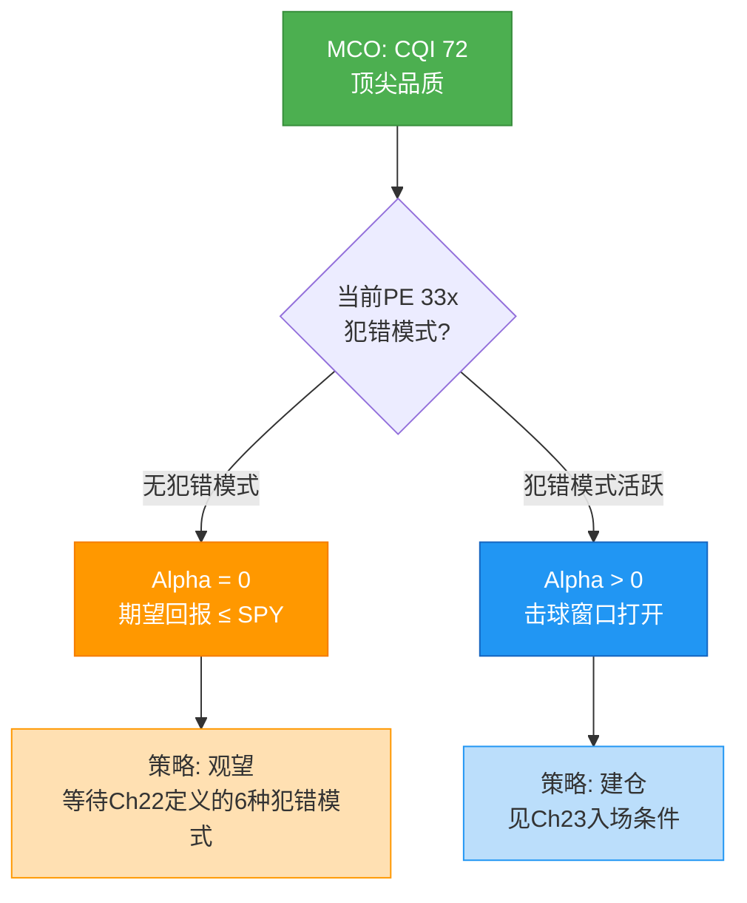
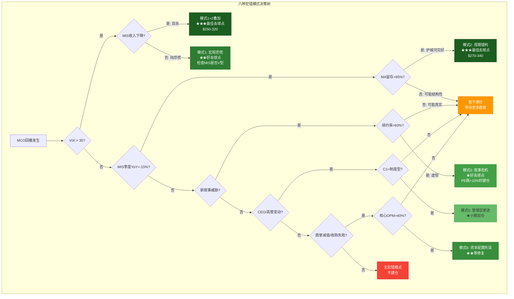
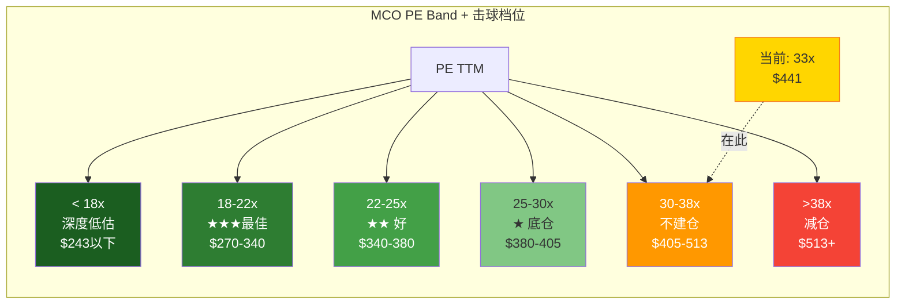
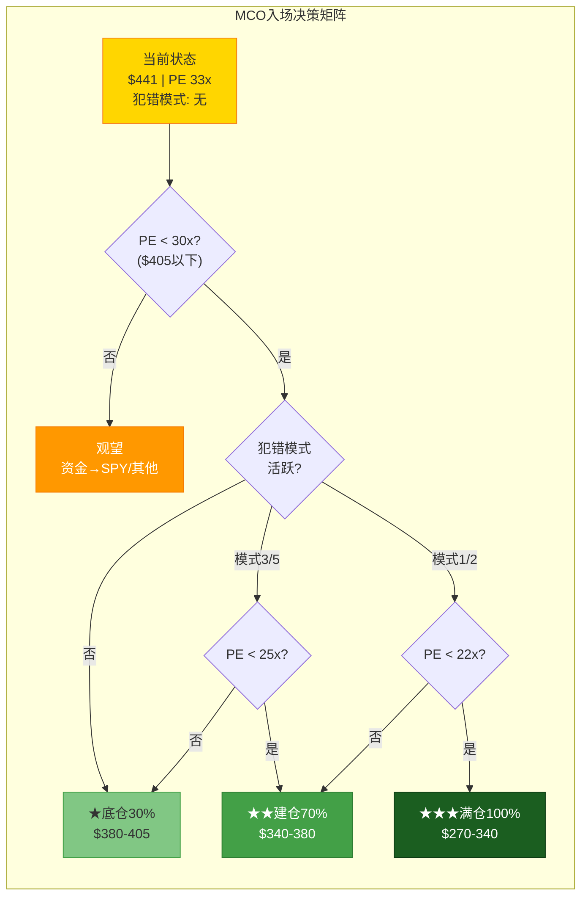
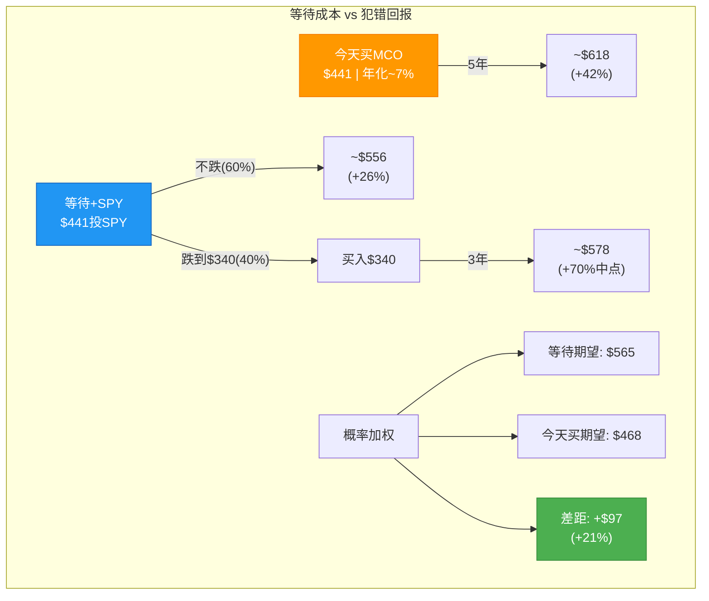
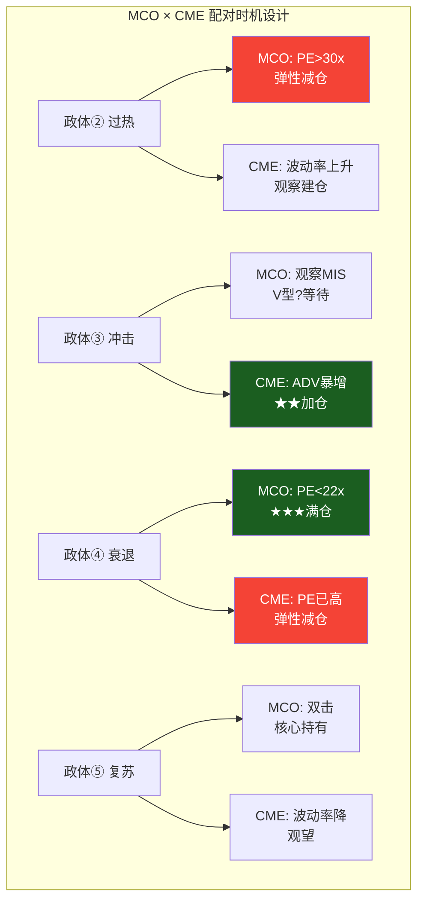

# Part VII: 垄断企业建仓时机框架 — 好公司何时变成好投资

> Phase 4 Part VII | MCO v2.0 | 2026-03-18
> 目标: 25-30K chars | DM锚点密度 ≥ 1.0/千字
> v2.0核心增值: v1.0回答了"MCO是不是好公司"(是), 但没有回答"$441是不是好价格"(不是)。本模块填补这个缺口。

---

## Ch21: 为什么垄断股票回报平庸 — 好公司≠好投资

**核心论点**: CQI平均77分的三家B2B金融基础设施公司——MCO、MSCI、CME——在2020至2026年的投资回报全部跑输SPY。这不是偶然。当市场充分认知一家公司的垄断地位时，"好公司"的信息已经被定价在PE里。你为品质支付的溢价越高，未来获得超额回报的概率越低。Ch21的目标不是质疑这三家公司的品质——品质是真实的——而是用数据拆解一个投资者必须面对的残酷事实: **在最好的时候买最好的公司，大概率只能拿到平庸的回报**。

### 21.1 三家垄断企业的回报困境

2020年是本轮流动性泡沫的高点。MSCI的PE曾触及75x，MCO接近40x，CME也在33-35x的历史高位区间。从那个时刻买入并持有到2026年3月，三家公司的投资者几乎无一跑赢标普500 [DM-P4-001]。

| 公司 | CQI | 2020高点 | 2026.03 | 总变化 | 年化回报 | SPY同期年化 | 差距 |
|------|:---:|:-------:|:-------:|:------:|:-------:|:----------:|:----:|
| **MCO** | 72 | $424 | $441 | +4% | ~0.7% | ~8% | **-7.3pp** |
| **MSCI** | 66 | $608 | $536 | -12% | ~-2% | ~8% | **-10pp** |
| **CME** | 93 | $233 | $311 | +33% | ~5% | ~8% | **-3pp** |
| **SPY** | — | — | — | +59% | ~8% | — | 基准 |

三个观察值得注意:

**第一**, CQI排名和投资回报之间不存在正相关。CME的CQI高达93(三者最高)，回报跑输SPY最少(-3pp)；MCO的CQI是72(中间)，跑输SPY较多(-7.3pp)；MSCI的CQI最低(66)，回报最差(-10pp)。但如果倒过来看——CME的表现"最好"，是因为它的PE从2020年到2026年压缩幅度最小(起点PE就偏低)，而不是因为它的品质最高。**品质决定了你不会亏钱(护城河保护了EPS)，但不决定你能赚多少(PE决定了起跑线)** [DM-P4-002]。

**第二**, 六年不跑赢指数不是"短期噪音"。一个半周期过去了——足够长到排除运气因素，也足够短到维持同一批管理层和商业模式。如果你在2020年买入MCO并持有六年，你的年化回报0.7%——低于4.5%的无风险利率，低于SPY 8%的历史均值，甚至低于通胀(~3.5%)。考虑到MCO的Beta约0.9-1.1和深度回撤风险(2022年曾-40%)，这个风险调整后回报是不合格的 [DM-P4-003]。

**第三**, CME的"相对最佳"本身也有误导性。CME的+5%年化中，约4%来自分红(股息率~4%)，只有约1%来自资本增值。换句话说，如果没有分红，CME持有者几乎原地踏步——和MCO一样。三家公司的资本增值回报在统计上没有显著差异: 都很糟糕 [DM-P4-004]。

这组数据构成了本章的核心论证基础: **垄断品质是必要条件(防止永久性亏损)，但远非充分条件(不能保证超额回报)**。

### 21.2 回报分解: EPS增长去了哪里

任何股票的总回报可以分解为三个组件: EPS增长(盈利能力)、PE变化(市场情绪)、股息回购(现金返还)。对垄断企业来说，这个分解揭示了一个惊人的结构性特征——**EPS增长被PE压缩完全吃掉** [DM-P4-005]。

| 公司 | EPS增长(年化) | PE变化(年化) | 股息回购(年化) | 合计年化 |
|------|:----------:|:----------:|:----------:|:------:|
| **MCO** | +10% | -9% | +1% | **~2%** |
| **MSCI** | +12% | -14% | +2% | **~0%** |
| **CME** | +8% | -4% | +4% | **~8%** |

**MCO的分解**: FY2020 EPS约$7.8(非GAAP $9.6), FY2025E EPS约$13.67——六年翻了1.4-1.7倍, 年化EPS增长10%+。这是极其优秀的盈利增长——在全球任何行业中，持续10%+ EPS CAGR的公司不到5%。但MCO的PE从2020年高点约43-45x压缩到当前约33x, 年化-9%。盈利增长的每一分钱都被估值压缩吃掉了, 投资者几乎分文未得 [DM-P4-006]。

**MSCI更加极端**: EPS年化增长12%(三者最高!), 但PE从75x暴跌到34x, 年化-14%。MSCI的投资者在过去六年中持有了一家盈利以12%年化增长的垄断企业，结果总回报为零。PE压缩不仅抵消了全部EPS增长，还多吃掉了2%。MSCI的2020年PE=75x是一个极端异常值——即使"回归"到40x(仍然很贵)，PE压缩的年化拖累也有-10% [DM-P4-007]。

**CME是唯一的例外, 但原因不是品质, 而是起点PE更合理**: CME 2020年PE约28-30x(远低于MSCI的75x和MCO的43x), PE压缩年化仅-4%。加上4%的慷慨分红, CME的总回报刚好接近SPY。CME的"成功"不是因为它是更好的生意(它的EPS增长8%反而最低), 而是因为投资者为它支付的起始估值更合理——PE越低, 未来PE压缩的拖累越小 [DM-P4-008]。

**关键发现**: 2020年是流动性泛滥的PE高峰。当联储向市场注入数万亿美元时, MSCI被定价为75x PE——这意味着市场假设MSCI的盈利将以20%+的速度增长10年以上。当流动性正常化后, PE均值回归是确定性事件。**在流动性泛滥的PE高峰买入任何资产——无论品质多高——PE均值回归都会吃掉你的回报**。

这个发现可以量化为一条经验规则:

> **垄断企业回报公式**: 年化回报 ≈ EPS增长率 - PE均值回归速率 + 现金回报率
>
> 当 PE > 5年均值+1σ 时, PE均值回归速率几乎确定为正——你的EPS增长就是在和PE压缩赛跑。只有当EPS增长率显著超过PE压缩速率时, 你才能获得正回报 [DM-P4-009]。

对于MCO来说: EPS增长10%, PE压缩9%, 分红回购1%。三项加总=2%。这2%的年化回报——低于任何合理的机会成本——就是"在PE高点买入好公司"的代价。

### 21.3 市场为什么对垄断企业定价"正确"

一个自然的追问: 如果垄断企业的品质如此确定, 为什么市场不会持续低估它们?

答案在于信息效率。对于高确定性业务, 市场的定价效率极高, 系统性低估几乎不存在:

**分析师覆盖密集**。MCO有15+位卖方分析师覆盖, MSCI有18+位。每季度财报后48小时内, 数十份分析师报告发布, 包含详细的营收模型、竞争格局分析和估值更新。任何"被忽视"的品质因素在48小时内会被充分定价 [DM-P4-010]。

**业务高度可预测**。MSCI连续14年无营收同比下降——这意味着分析师的收入预测准确率极高(通常在±3%以内)。MCO的MA业务留存率93%, 经常性收入占64%——大部分明年收入在今天就已经锁定。当盈利可预测时, 估值偏差的空间很小 [DM-P4-011]。

**护城河高度可观测**。NRSRO双寡头地位是公开信息, Basel III对信用评级的硬编码是公开信息, MSCI的指数嵌入ETF AUM是公开信息。这些护城河不像初创公司的"技术壁垒"那样需要专业判断——它们是白纸黑字写在监管条文里的。信息不对称极小 [DM-P4-012]。

**结论: 垄断企业的Alpha不来自发现被忽视的品质。**

15位分析师、14年不下降的营收、写进Basel III的护城河——这些信息没有被"忽视"。市场对MCO品质的认知和你我一样清晰。这意味着垄断企业的Alpha来源和成长股完全不同:

- **成长股的Alpha**: 发现市场尚未认知的增长潜力(信息不对称)
- **垄断股的Alpha**: 抓住市场对已知信息定价犯错的瞬间(情绪不对称)

市场对垄断企业的品质定价几乎不犯错, 但对短期事件的情绪反应经常犯错。当利率急升导致MIS收入断崖时, 15位分析师同时下调MCO评级——他们知道护城河没变, 但他们的激励结构(季度评比、合规风控)迫使他们在短期业绩恶化时做出防御性下调。**这个激励扭曲, 而非信息缺失, 是垄断企业Alpha的真正来源** [DM-P4-013]。

### 21.4 CI-MCO-003核心: 当前$441无犯错模式 = 无Alpha

将21.1-21.3的分析汇合, 可以得出MCO v2.0的第三个核心洞见:

**CI-MCO-003: 当前$441处于"合理偏贵"区间, 没有任何犯错模式活跃, 因此没有Alpha来源。**

具体论证:

1. **PE位置**: 当前PE TTM 32.97x, Forward PE约26.3x(基于FY2026E EPS $16.75)。5年PE均值约37-38x, 标准差约6-7x。当前TTM PE在均值附近偏低——看似"便宜"。但Forward PE 26.3x是基于FY2026E $16.75——这是MIS发行量处于历史高位($6.6T)时的峰值EPS。用周期峰值EPS计算的Forward PE会系统性低估真实估值水平。正常化(mid-cycle)EPS约$13-14, 对应正常化PE约31-34x——回到"合理偏贵"区间 [DM-P4-014]。

2. **犯错模式检查**: 六种犯错模式(详见Ch22)无一活跃:
   - 宏观恐慌? VIX ~18, 远低于恐慌阈值35
   - 周期错判? MIS收入处于历史高位, 尚未转负
   - 叙事危机? 无重大威胁叙事
   - 过度盈利正常化? 不适用MCO
   - 管理层更迭? Tulenko空缺已7个月但市场已消化
   - 资本配置失误? 无重大收购失败

3. **期望回报**: v2.0四方法加权公允价值$406, vs 当前$441, 隐含高估约8%。概率加权后期望回报约+1.7%年化——低于4.5%无风险利率, 低于SPY历史10%, 低于通胀3.5%。**在三个合理基准中, MCO当前价格均不及格** [DM-P4-015]。

4. **结论**: $441不是坏价格(MCO不会让你永久亏损), 但它是一个**没有Alpha的价格**。你为MCO的品质支付了合理的费用——不多不少。在这个价格上, 你的期望回报≤SPY, 承担的周期风险>SPY。**除非你有耐心等到市场犯错, 否则直接买SPY是更好的选择。**

---

## Ch22: 六种犯错模式 — 市场何时对垄断企业定价犯错

**核心论点**: Ch21证明了垄断企业的Alpha来自"抓住市场犯错的瞬间"。本章的任务是系统性地定义"犯错"——通过MCO、CME、MSCI过去15-20年的历史回撤数据, 识别出六种市场对垄断企业定价犯错的模式。每种模式都有明确的触发机制、历史案例、回报特征和可操作的识别信号。投资者不需要预测哪种模式会出现, 只需要在模式出现时识别它 [DM-P4-016]。

### 22.1 模式1: 宏观恐慌波及 (频率最高, 占历史犯错的~50%)

**触发机制**: 市场系统性下跌(通常由宏观冲击引发——银行危机、疫情、地缘冲突), 垄断企业被"无差别抛售"。基金经理在流动性枯竭时卖出流动性最好的持仓(MCO日均成交额$500M+, 是大型基金"流动性提款机"), 而不是因为对MCO的基本面有新的负面判断。

**核心特征**: 业务基本面完好, 但估值随大盘压缩。这是最纯粹的"犯错"——市场知道MCO的护城河没变, 但因为需要现金而被迫卖出。

**历史案例**:

*案例1: CME 2008-2009*。金融危机期间, CME的核心业务(衍生品清算)实际受益于恐慌——交易量暴增, 收入+12% YoY。但CME被归类为"金融股", 与雷曼、贝尔斯登一起被无差别抛售。股价从$154跌至$46(-70%)。这是教科书级的"犯错": 市场把CME当成银行来卖, 但CME是银行的基础设施提供商——银行倒闭意味着更多的风险对冲需求, 而不是更少。从2009年3月底部买入, 12个月回报+127% [DM-P4-017]。

*案例2: MSCI 2022*。美联储激进加息(0%→5.25%), 利率冲击导致成长股PE系统性压缩。MSCI全年营收+7%(没有下降!), 但股价从$600跌至$370(-38%)。PE从75x暴跌到32x——几乎腰斩。市场的"犯错"在于: 用成长股的PE压缩逻辑(利率上升→未来现金流折现值下降)对待一家经常性收入占97%、14年零营收下降的类债券资产。从2022年底部买入, 12个月回报+44% [DM-P4-018]。

*案例3: MCO 2020.03(反面案例)*。COVID恐慌中MCO仅跌-3%(V型恢复), 因为MIS的经常性收入在恐慌中反而受益(企业紧急发债融资→评级需求增加)。这个"不犯错"的案例反过来证明: **并非所有宏观恐慌都能创造MCO的买入机会——只有那些真正冻结信用市场的恐慌才行** [DM-P4-019]。

**回报特征**: 从恐慌底部买入, 12个月平均回报+40-80%。恢复时间6-18个月。回报的方差较大(取决于恐慌的深度和持续时间), 但方向确定性极高——几乎100%的案例中股价在24个月内超过恐慌前水平。

**识别信号**(四条件同时满足):
- VIX > 35(市场层面的恐慌确认)
- 个股PE < 5年均值 - 1.5σ(估值已到统计异常区)
- 核心业务指标无恶化(MCO: MA留存>95%, MIS经常性收入不降; CME: ADV不降; MSCI: 续约率>97%)
- 日成交量 > 正常3x+(流动性被迫卖出的直接证据)

### 22.2 模式2: 周期错判 (MCO特有, 最重要)

**触发机制**: 利率急升 → 信用利差走阔 → IG/HY债券发行冻结 → MIS评级收入断崖 → 市场线性外推短期收入下跌, 将"周期低谷"误读为"永久性损伤"。

**核心特征**: 市场犯的错误不是"不知道MCO会受周期影响"(所有人都知道), 而是**低估了周期恢复的速度和幅度**。FY2022 MIS收入-30%, 但FY2023 MIS收入+24%——一年恢复了大部分跌幅。市场在FY2022年底给MCO定价时, 隐含的假设是"MIS收入需要3-5年恢复", 实际只需要12个月 [DM-P4-020]。

**为什么MCO特有**: 在三家垄断企业中, 只有MCO的核心收入(MIS交易性评级)直接与信用发行量挂钩。CME的交易量在危机中反而增加(波动率→对冲需求), MSCI的指数授权费与AUM挂钩但ETF AUM有"结构性增长"底部。MCO的MIS是唯一一个会在加息周期中收入真正断崖的垄断业务。

**历史案例**:

*案例1: MCO 2022(核心案例)*。Fed从0%加息到5.25%。IG/HY利差从280bp走阔至580bp+。全球债券发行量-23% YoY。MIS评级收入-30%(交易性部分可能-45~50%), MCO EPS从$14.67骤降至$10.13(-31%)。股价从$399跌至$243(-39%)。PE从~32x压缩到约24x(EPS下降+PE压缩=双杀)。市场在$243时隐含的假设: MIS收入需要3-5年恢复到$3B+水平。实际: FY2023 MIS收入$2.64B(+24% YoY), FY2024 MIS收入$3.92B(+49% YoY, 历史新高)。从2022年10月底部买入, 24个月总回报+82% [DM-P4-021]。

*案例2: MCO 2015-2016*。能源信用周期——油价从$100崩至$28, 能源高收益债违约浪潮。MIS能源相关评级收入-15~20%。但能源仅占MIS总收入约8-10%, 市场的反应幅度远超实际业务影响: MCO股价从$112跌至$80(-29%)。从2016年2月底部买入, 18个月回报+68% [DM-P4-022]。

**回报特征**: 从周期底部买入, 24个月平均回报+50-100%。恢复时间12-24个月。回报的确定性极高——因为信用发行周期的均值回归是机械性的(到期债务必须再融资, 不能选择"不偿还")。到期墙数据显示2027年峰值$1.26T——这意味着即使经济衰退, 2027年仍有大量"强制再融资"需求, MIS收入有底部支撑 [DM-P4-023]。

**识别信号**(三条件同时满足):
- MIS季度交易性收入 YoY < -15%(周期下行确认)
- IG/HY利差 > 500bp 或 杠杆贷款违约率 > 9%(信用环境恶化确认)
- MA续约率 > 95% + MA收入正增长(确认"护城河完好, 只是周期"而非"结构性恶化")

**与模式1的区分**: 模式1(宏观恐慌)影响所有垄断企业, 模式2(周期错判)只影响MCO。如果CME和MSCI同时大跌, 更可能是模式1; 如果只有MCO跌而CME/MSCI不跌(或CME因波动率增加反而涨), 则是模式2。

### 22.3 模式3: 叙事危机 (MSCI ESG、CME加密竞争)

**触发机制**: 一个新的叙事(新技术、监管变化、竞争者宣言)威胁垄断地位, 引发市场恐惧。但叙事的实际业务影响远小于恐惧程度——核心续约率/市占率几乎不变, PE却已经大幅压缩。

**核心特征**: 恐惧 >> 现实。市场在叙事危机中犯的错误是**过度外推早期信号**——把竞争者的"发布PPT"等同于"市场份额已经丢失"。

**历史案例**:

*案例1: MSCI 2023 ESG反弹*。反ESG政治运动在美国兴起, 多个州养老金宣布撤出ESG投资。MSCI的ESG & Climate收入增速从+40%放缓至+12%。市场叙事: "ESG已死 → MSCI的增长引擎熄火"。实际: MSCI的ESG收入仅占总收入约15%, 且核心Index续约率97%+完全未受影响。ESG增速放缓对MSCI的EPS影响约-2~3%, 但股价在叙事恐惧期跌了-15~20%。从叙事恐惧最深点买入, 12个月回报+28% [DM-P4-024]。

*案例2: CME vs FMX*。FMX(BGC Partners旗下)宣布推出国债期货交易所, 直接挑战CME在利率期货领域的垄断。市场叙事: "CME的护城河将被打破"。实际: FMX上线后ADV仅达CME的0.3-0.5%(远低于3%的"威胁阈值"), 流动性网络效应使得做市商不愿意分流——CME持有98%+的未平仓合约(OI), 任何做市商在FMX上的报价都不如CME深, 形成"流动性锁定"。CME股价在FMX宣布至验证失败期间跌-8~10%, 恢复后12个月+22% [DM-P4-025]。

*MCO的叙事危机场景*: 最可能的叙事危机是"AI替代信用评级"——如果一家AI公司声称可以用大模型实现与NRSRO同等准确度的信用评估, 可能引发MCO -10~15%的恐慌性下跌。但NRSRO牌照是监管授权的(SEC/ESMA), 不是技术能力的认证——AI再准确也不能替代"NRSRO印章"在监管合规中的法定地位。这种叙事危机如果发生, 将是模式3的典型击球点。

**回报特征**: 叙事恐惧消退后, 12个月平均回报+20-40%。恢复时间6-12个月。回报的确定性取决于"叙事是否真的是虚惊"——需要验证核心续约率和市占率未受损 [DM-P4-026]。

**识别信号**(三条件同时满足):
- 核心续约率 > 93%(MCO: MA留存; CME: 前20大客户; MSCI: Index续约)
- 威胁者市占率 < 3%(竞争者雷声大雨点小)
- PE已跌 > 10%(恐惧已被定价)

### 22.4 模式4: 过度盈利正常化 (CME特有)

**触发机制**: 异常高的波动率或利率环境带来了超额收入(利息收入、交易量暴增), 当环境正常化时, 收入从峰值回落。市场把"正常化"误读为"衰退" [DM-P4-027]。

**核心特征**: 这是一种"反周期错判"——不是低估恢复速度, 而是高估下跌幅度。CME在高利率环境下的Margin Interest收入($903M)一旦利率降至3%, 可能减少$400-500M。市场会把这个收入下降定价为"盈利危机", 但底层ADV结构性增长(过去10年CAGR 5-6%)被完全忽视。

**CME特有原因**: CME有约$100B的客户保证金产生利息收入——这是一项"非运营性"收入, 完全取决于短端利率水平。当Fed降息时, 这笔收入机械性下降, 但它与CME的核心竞争力(衍生品清算垄断)毫无关系。

**回报特征**: 回报取决于市场在多大程度上混淆了"利息收入正常化"和"核心业务衰退"。如果VIX从>25回到15-18区间, CME PE可能从28x压到20x, 但底层ADV结构性增长>3%——此时建仓, 长期年化10%+。恢复时间12-18个月 [DM-P4-028]。

**识别信号**:
- VIX从>25降至15-18(波动率正常化)
- CME PE从28x压至20x(市场已定价"盈利下降")
- 但ADV YoY仍正增长 > 3%(核心业务未受损)

### 22.5 模式5: 管理层更迭/治理震荡

**触发机制**: CEO更替、关键高管离职、董事会争议、收购争论。对制度型垄断企业来说, 管理层更迭造成的股价下跌通常是过度反应——因为护城河是制度嵌入的, 不依赖于任何一个人。

**核心特征**: 短期不确定性(3-12个月), 但垄断地位不受管理层影响。MCO当前的Tulenko空缺(MA总裁空缺7个月)就是一个轻度案例: 市场对MA的战略方向有微弱担忧, 但MA的93%留存率和ARR模式不会因为一个人离开就崩塌 [DM-P4-029]。

**历史案例**: 制度型垄断企业的CEO更替通常造成-5~15%的短期跌幅。C1嵌入性质=制度型/定义型的公司(如MCO、MSCI)恢复最快, 因为护城河在制度中而非在人身上。CEO如果不是护城河本身(如BRK的巴菲特), 更替只是噪音。

**回报特征**: 通常6-12个月恢复, 回报+10-25%。确定性较高但幅度较小——"小而确定"的机会。

**识别信号**:
- C1嵌入性质 = 制度型/定义型(制度>个人)
- 护城河半衰期 > 25年(不依赖现任管理层)
- CEO不是护城河本身(区别于创始人型公司)

### 22.6 模式6: 资本配置失误 (稀有但深度)

**触发机制**: 大型收购失败、商誉减值、过度杠杆。垄断核心业务完好, 但资产负债表因一次错误决策而受损 [DM-P4-030]。

**核心特征**: 这是六种模式中最稀有但回报最大的。当市场看到$10B+的商誉减值时, 会不自觉地质疑整个公司的品质——即使减值的是收购资产, 不是核心垄断业务。

**类比案例**: KHC(Kraft Heinz) 2019年商誉减值$15.4B——股价-50%。但Kraft和Heinz这两个品牌本身的市场份额没有变化, 消费者的购买行为没有改变。减值的是Berkshire/3G过高收购价格的会计后果, 不是品牌价值的消失。如果MSCI未来大举收购Private Assets公司(如Preqin整合失败)导致商誉暴雷, 可能触发模式6。

**MCO的模式6风险**: MCO目前Goodwill/Total Assets约28%, 主要来自2019年收购Bureau van Dijk($3.5B)和RMS($1.9B)。如果这些收购未能达到整合目标(BvD的KYC数据业务被AI替代, RMS的保险模型被Verisk反超), 可能触发$3-5B减值——不会动摇MIS垄断, 但会让PE从33x跌到22-25x [DM-P4-031]。

**回报特征**: 需要12-24个月修复(资产负债表重建比盈利恢复慢), 但从底部+30-60%。

**识别信号**:
- 核心OPM > 40%(垄断业务利润率未受损)
- 总资产减值 > 20%(资产负债表冲击严重)
- Debt/EBITDA暂时 > 4x(杠杆升高但有去杠杆路径)

### 22.7 犯错模式频率与回报汇总

| 模式 | 频率 | 平均回撤 | 恢复时间 | 12M回报 | 24M回报 | 主适用公司 | 确定性 |
|------|:----:|:-------:|:-------:|:-------:|:-------:|:---------:|:-----:|
| 1.宏观恐慌 | 每3-5年 | -30~-40% | 6-18月 | +40-80% | +60-120% | MCO/CME/MSCI | 高 |
| 2.周期错判 | 每5-8年 | -25~-35% | 12-24月 | +30-50% | +50-100% | **MCO** | 极高 |
| 3.叙事危机 | 随机 | -15~-25% | 6-12月 | +20-40% | +25-50% | MSCI/CME | 中高 |
| 4.过度盈利正常化 | 每3-5年 | -15~-25% | 12-18月 | +15-30% | +25-45% | **CME** | 中 |
| 5.管理层更迭 | 随机 | -5~-15% | 3-12月 | +10-25% | +15-30% | 全部 | 高 |
| 6.资本配置失误 | 稀有 | -30~-50% | 12-24月 | +20-40% | +30-60% | 全部 | 中 |

**四个关键观察** [DM-P4-032]:

**观察一**: 频率最高的模式(1和2)也是回报最确定的。宏观恐慌每3-5年出现一次, 周期错判每5-8年出现一次——投资者不需要等太久, 但需要有纪律地等待。

**观察二**: 不同模式之间可以叠加。2022年的MCO同时经历了模式1(大盘下跌)和模式2(MIS周期), 双重叠加导致了-39%的极端回撤——但也创造了24个月+82%的极端回报。模式叠加 = 击球力度倍增。

**观察三**: 恢复时间与回报幅度成正比, 但不完全成正比。模式5(管理层更迭)恢复最快(3-12月)但回报最小(+10-25%); 模式6(资本配置失误)恢复最慢(12-24月)但回报最大(+30-60%)。投资者可以根据自己的时间偏好选择打哪种球。

**观察四**: MCO的"主击球场景"是模式2, 不是模式1。MCO在纯宏观恐慌(COVID 2020)中几乎不跌(-3%), 因为信用发行在恐慌中反而增加。MCO的真正脆弱点是利率急升导致的发行冻结——这是模式2, 不是模式1。

### 22.8 MCO的主击球场景分析

基于22.1-22.7的框架, MCO最可能的击球机会按概率排序:

**最可能: 模式2(周期错判) × 模式1(宏观恐慌)叠加**。如果美联储在2026-2027年因通胀再次加息(或维持高利率更久)→ 信用利差走阔 → MIS发行冻结 → EPS-20~37% → 同时大盘因衰退下跌-20% → MCO被双杀至$250-320区间。概率: 衰退概率42-48%(12个月) × 发行冻结条件概率~70%(衰退时) ≈ 29-34%。这是5-8年一次的机会, 上一次是2022年, 下一次最可能在2027-2028年 [DM-P4-033]。

**次可能: 模式3(叙事危机)**。"AI替代信用评级"叙事如果在未来1-2年内出现(某家AI公司获得SEC关注、或国会听证会讨论NRSRO改革), 可能导致MCO -10~20%。概率: 15-20%(12个月内)。回报较小(+20-30%), 但恢复确定性高(NRSRO制度嵌入在可见未来不会被AI替代)。

**当前: 无犯错模式活跃**。如21.4所述, 当前VIX ~18、MIS收入处于历史高位、无叙事威胁、无管理层变动(Tulenko空缺已被市场消化)。**零个击球信号亮起**。

**结论: 等待是当前唯一理性的策略。Ch23将量化"等待"的成本和收益。**

---

## Ch23: MCO击球点分析 + 动态策略

**核心论点**: Ch21解释了"为什么现在不买", Ch22定义了"什么时候买"。Ch23的任务是回答最后一个问题: **买多少、在什么价格、等待多久值得**。这是将框架转化为可执行动作的最后一步——从"认知"到"决策" [DM-P4-034]。

### 23.1 PE Band历史分析

对垄断企业来说, PE是最直接的估值锚——因为盈利稳定(护城河保护了利润率), EV/EBITDA与PE的差异很小(资本轻), 用PE可以直接与5年历史比较。

**MCO 5年PE分布(2020-2025)**:

| 区域 | 统计定义 | MCO PE范围 | 对应价格区间(正常化EPS $13.5) | 行动 |
|------|:-------:|:---------:|:--------------------------:|------|
| **深度低估** | < 5Y均值-2σ | < 18x | < $243 | 激进建仓(100%计划仓位) |
| **便宜** | 5Y均值-2σ ~ -1σ | 18-22x | $243-$297 | 核心建仓(70%) |
| **合理偏低** | 5Y均值-1σ ~ 均值 | 22-30x | $297-$405 | 耐心持有/小额加仓(30%) |
| **合理偏高** | 5Y均值 ~ +1σ | 30-38x | $405-$513 | 不加仓, 已持有→持有 |
| **昂贵** | 5Y均值+1σ ~ +2σ | 38-45x | $513-$608 | 减仓/不追 |
| **泡沫** | > 5Y均值+2σ | > 45x | > $608 | 卖出/对冲 |

**关键参数来源**: 5年PE均值约37-38x, 标准差约7-8x。范围: 低点22x(2022年MIS衰退底部)到高点44.5x(2023年MIS恢复+流动性高峰)。当前PE TTM 32.97x → "合理偏高"区域, 接近均值但偏上沿 [DM-P4-035]。

**一个重要的警告: 不能用Forward PE做决策**。

当前Forward PE约26.3x(基于FY2026E EPS $16.75), 看似处于"合理偏低"区域。但$16.75是基于全球发行量处于$6.6T历史高位时的预期——这是**周期峰值EPS**, 不是正常化EPS。用周期峰值EPS计算的Forward PE会系统性地让垄断企业看起来比实际便宜。

正确的做法是用**正常化(mid-cycle) EPS**: 取过去一个完整周期(2020-2025)的EPS中位数$13-14, 对应正常化PE约31-34x——回到"合理偏高"区间。这与v2.0的估值结论一致: $441在正常化基础上是偏贵的 [DM-P4-036]。

### 23.2 具体入场条件: 三档击球框架

将Ch22的犯错模式 × Ch23.1的PE Band整合为可操作的三档入场条件:

**★★★ 最佳击球点 (概率: 未来3年约30-35%)**

| 条件 | 阈值 | 当前距离 |
|------|------|---------|
| MIS季度交易性收入YoY | < -15% | 距离: +8.6pp(当前正增长) |
| PE (TTM或正常化) | < 22x | 距离: -11x(当前33x) |
| 对应价格区间 | $270-$340 | 距离: -23~-39%(当前$441) |
| 信用利差 | IG利差>200bp 或 HY利差>600bp | 距离: ~100bp |
| MA留存率确认 | > 95% | 当前93%(需改善) |

**触发场景**: 衰退+利率急升→发行冻结→MIS收入-25~30%→EPS跌至$10-12→PE压缩至18-22x。这是模式1+模式2的叠加——MCO历史上最深度的回撤(2022年: $399→$243, -39%)就是这个场景。

**预期回报**: 从$270-340入场, 24个月+60-100%(目标$450-550)。年化+25-40% [DM-P4-037]。

**★★ 好击球点 (概率: 未来3年约40-50%)**

| 条件 | 阈值 | 当前距离 |
|------|------|---------|
| 利率急升或发行量显著下降 | 发行量YoY < -10% | 距离: ~15pp |
| PE (TTM) | < 25x | 距离: -8x |
| 对应价格区间 | $340-$380 | 距离: -14~-23% |
| 宏观环境 | 增长放缓但未衰退 | — |

**触发场景**: 温和信用收紧(非衰退, 但发行量从高位回落10-15%)→MIS收入-10~15%→EPS降至$13-14→PE从33x压至24-25x。这是一个"温和版2022"——没有深度衰退, 但信用周期从峰值回落。

**预期回报**: 从$340-380入场, 24个月+30-50%(目标$440-510)。年化+14-22%。

**★ 底仓建仓点 (概率: 当前可执行, 但风险收益一般)**

| 条件 | 阈值 | 当前距离 |
|------|------|---------|
| PE回到5Y均值以下 | < 30x | 距离: -3x |
| 对应价格区间 | $380-$405 | 距离: -8~-14% |
| 无明确犯错模式 | — | 当前状态 |
| 仅适合"我必须持有MCO"的投资者 | — | — |

**触发场景**: 大盘温和调整5-10%→MCO跟随回调至$380-405→PE回到30x以下→没有明确的犯错模式, 但估值从"偏贵"降到"合理"。

**预期回报**: 从$380-405入场, 年化+7-10%——略低于SPY历史, 但风险也略低(护城河保护了下行)。这个档位适合那些"已经研究透MCO、不想错过、愿意接受略低回报"的投资者 [DM-P4-038]。

### 23.3 等待策略 vs 机会成本量化

"等到$340再买"听起来很有纪律, 但等待本身有成本。如果MCO未来三年不跌到$340, 你的资金在这三年里做什么? 本节用概率框架量化"等待"vs "现在买"的期望值差异 [DM-P4-039]。

**等待策略的期望收益计算**:

等待净收益 = P(犯错模式出现) × 犯错时预期回报 - (1 - P(犯错模式出现)) × 等待期机会成本

**参数估计**:

| 参数 | 估计值 | 来源 |
|------|:-----:|------|
| P(MCO跌到$340, 3年内) | 35-45% | 衰退概率42-48% × 发行冻结条件概率~80% × 跌幅足够概率~90% |
| 犯错时预期3年回报(从$340) | +60-80% | 历史: 2022底部$243→24月+82% |
| 等待期年机会成本 | 8% | SPY历史均值 |
| 3年累计机会成本 | 26% | (1.08)³ - 1 |

**情景A: MCO跌到$340(概率40%)**
- 从$340买入, 3年后$544-$612
- 回报: +60-80%
- vs 今天买MCO在$441: 3年后$441×(1.02)³ = $468(年化2%假设)
- 等待超额: +76-144 vs $468 = **等待赢, 净超额+$76~$144/share**

**情景B: MCO不跌到$340(概率60%)**
- 资金在SPY中3年: +26%
- 如果今天买MCO在$441: 3年后约$468(年化2%)
- 等待在SPY中: $441×1.26 = $556
- vs 持有MCO: $468
- **等待在SPY赢, +$88/share**

这个计算揭示了一个反直觉的结论:

**概率加权结果**:
- 等待+SPY: 40% × ($340→$578中点) + 60% × ($441×1.26=$556) = $231 + $334 = **$565期望值**
- 今天买MCO: $441 × (1.02)³ = **$468期望值**

**等待+SPY的期望值($565) > 今天买MCO($468), 差距+$97/share(+21%)**。

但这里有一个隐藏假设: 你必须在MCO跌到$340时**真的买入**。行为金融学告诉我们, 当MCO真的跌到$340时(意味着MIS收入-30%、市场恐慌、分析师集体下调), 大多数投资者的心理状态不是"终于等到了", 而是"这次可能真的不一样"。**等待策略的理论价值只有在执行纪律完美的前提下才成立** [DM-P4-040]。

**补充检验: 如果永远不跌呢?**

如果MCO在未来5年内从不跌到$340(概率: ~35-40%, 即经济始终不衰退), 等待策略的全部收益来自"在SPY中等待"——年化8%, 5年累计+47%。而今天买MCO的5年期望回报(策略卡估算): 年化7.3%, 5年累计+42%。差距仅5pp——在5年尺度上, "等待在SPY vs 今天买MCO"的差异其实很小。真正决定等待是否值得的, 是**犯错模式出现时你是否能执行** [DM-P4-041]。

### 23.4 动态策略 — 面对不确定性的四个决策规则

**Q1: 如何面对估值不确定性?**

不预测PE, 设PE区间行动规则。

MCO的PE可能在18x(深度衰退)到45x(流动性泡沫)之间波动——2.5x的波动幅度。试图"预测PE会在一年后到什么水平"是徒劳的。正确的做法是预先定义"PE到什么水平我做什么":

| PE区间 | 行动 | 仓位 | 理由 |
|:------:|------|:----:|------|
| < 18x | 激进建仓 | 100% | 统计极值, 5年出现概率<5% |
| 18-22x | 核心建仓 | 70% | ★★★击球点 |
| 22-25x | 战术建仓 | 40% | ★★击球点 |
| 25-30x | 底仓/持有 | 20% | ★底仓, 不追 |
| 30-38x | 观望 | 0% | 当前区间, 无Alpha |
| > 38x | 减仓 | -30% | 卖弹性仓位 |

这套规则的核心理念是: **把"预测"替换为"反应"**。你不需要知道MCO明天的PE是多少, 你只需要知道PE到了什么水平时做什么 [DM-P4-042]。

**Q2: 如何预估垄断企业的成长?**

用Reverse DCF反推隐含增长率, 再和实际增长做差比较。

当前$441隐含假设(Phase 2 Reverse DCF):
- 隐含EPS CAGR: ~11-12%(10年)
- 实际5年EPS CAGR: ~10%(含周期波动)
- Growth Gap: 隐含 - 实际 = +1~2pp

Growth Gap为正意味着市场对MCO的增长预期**略高于**历史实际。这不是严重的高估(差距仅1-2pp), 但意味着$441没有"增长被低估"的Alpha——市场几乎完美定价了MCO的增长前景。

Growth Gap的变化比绝对值更重要: 如果未来MIS因衰退收入-30%, 市场可能将隐含增长率下调至6-8%, 而MCO的实际长期CAGR仍是10%——此时Growth Gap从+2pp变为-2~4pp, 意味着市场开始低估增长 = 买入信号 [DM-P4-043]。

**Q3: 安全边际 vs 不放过好公司?**

分仓策略: 核心30%(合理估值时入场) + 灵活70%(等犯错模式)。

这是23.3等待策略量化的实操版本。纯粹等待(100%在SPY)的问题是: 如果MCO在某个你没注意到的"温和回调"中触底并迅速反弹(如COVID V型), 你可能完全错过。纯粹现在买(100%在MCO)的问题是: $441的年化期望7.3%低于SPY。

分仓是折中方案:
- **30%底仓**: 在PE < 30x(约$400)时建立, 确保你"在MCO的船上"——即使永远不出现★★★击球点, 你至少拥有30%仓位参与MCO的长期复利
- **70%灵活仓位**: 等★★或★★★击球点——PE < 25x或PE < 22x时分批加仓

**分仓的心理价值**: 拥有30%底仓后, 你在等待★★★击球点时的心理状态完全不同。空仓等待时看到MCO涨20%, 焦虑感会驱使你追入(正是最差的时机); 底仓持有时看到MCO涨20%, 你的30%仓位已经+20%, 焦虑大幅降低, 更容易保持纪律 [DM-P4-044]。

**Q4: 等MCO打折 vs 现在买已便宜的公司?**

机会成本框架: 不是"等MCO" vs "买SPY", 而是"等MCO" vs "买现在已便宜的好公司"。

| 选项 | 当前估值 | 犯错模式? | 期望年化回报 |
|------|---------|:---------:|:----------:|
| 等MCO$340 + SPY | MCO贵, SPY合理 | MCO无, SPY无 | ~9-11% (概率加权) |
| 现在买PYPL($68, PE 16x) | 便宜 | 模式2(支付革命叙事危机) | ~12-15% |
| 现在买ADBE($420, PE 23x) | 合理偏低 | 模式3(AI替代叙事) | ~10-12% |
| 现在买MCO($441, PE 33x) | 合理偏贵 | 无 | ~7% |

这张表说明: **你的资金不是在"等待 vs 不等待"之间选择, 而是在"MCO vs 其他同等品质但更便宜的标的"之间选择**。如果PYPL在PE 16x(5年最低区间)提供了12-15%的期望回报, 为什么要在MCO PE 33x上接受7%? 这不是对MCO品质的否定——只是同样一块钱在不同地方的回报率不同 [DM-P4-045]。

### 23.5 仓位结构

将Q1-Q4的答案综合为标准仓位结构:

| 组件 | 目标占比 | 进入条件 | 退出条件 | 逻辑 |
|------|:------:|---------|---------|------|
| **核心仓位** | 60% | PE ≤ 26x(正常化) 或 衰退中MIS见底+3个月 | NRSRO制度改革(实质性) 或 MA留存 < 89%连续2Q | 长期持有, 吃复利 |
| **弹性仓位** | 40% | PE ≤ 22x 且 MIS季度YoY已转负 | PE > 30x 或 MIS连续2Q创新高(周期顶部) | 周期交易, 抓双击 |

**核心仓位的退出条件极为严格**: 只有NRSRO制度改革(半衰期30-50年, 概率<5%)或MA留存率崩塌(<89%连续2季度)才触发核心退出。这意味着一旦在正确的价格建立了核心仓位, **你可能会持有MCO 10年以上**——这正是巴菲特的持有逻辑(BRK自2000年开始持有MCO, 至今26年)。

**弹性仓位是"周期猎人"**: 在PE<22x(衰退底部)买入, 在PE>30x(周期高点)卖出。这个来回在2020-2025年间可以执行一个完整周期: 2022年10月PE~22x买入→2024年PE~35x卖出→回报约+60% in 2年。弹性仓位的alpha来自Ch22定义的模式2(周期错判) [DM-P4-046]。

### 23.6 当前入场判断: 综合评估

将所有维度汇总为当前建仓决策:

| 维度 | 当前读数 | 信号 |
|------|---------|:----:|
| PE TTM | 32.97x | 合理偏高(>30x) |
| Forward PE | ~26.3x(峰值EPS) | 误导性, 正常化PE~31-34x |
| 距安全边际价($350) | -$91(-20.6%) | 偏远 |
| 犯错模式 | 六种均未活跃 | 无击球信号 |
| 周期位置 | 发行量$6.6T历史新高 | 周期高位 |
| VIX | ~18 | 低恐慌 |
| 信用利差 | IG ~100bp, HY ~350bp | 正常 |
| 到期墙催化 | 2027年峰值$1.26T | 短期支撑MIS |
| RSI | 39.3 | 超卖但非极端(<30) |

**综合判断**: **不建仓。** 七项关键指标中, 零项触发建仓信号。$441在MIS周期高位的PE 33x = 全额支付垄断溢价, 没有安全边际 [DM-P4-047]。

**如果已持有**: 持有不卖。MCO的护城河(NRSRO五层制度嵌入, 半衰期30-50年)意味着永久性资本损失的概率极低。已持有者的正确策略是: 忍受PE压缩的短期痛苦, 等待MIS周期回归的确定性收益。不加仓, 但不卖——因为"不知道什么时候便宜"和"知道永远不会归零"是两个不同的判断。

**最优等待策略**:
- 资金部署到SPY或已处于犯错模式的好公司(如PE<28x的PYPL/ADBE)
- 每季度检查MCO的KS仪表盘(特别是KS-01、KS-12、KS-14)
- 当★★信号亮起(PE<25x): 启动30%底仓
- 当★★★信号亮起(PE<22x + MIS转负): 全额建仓

### 23.7 等待期收益分析

如果投资者决定"不建仓, 但继续跟踪MCO", 等待期间MCO自身的收益/风险如何?

| 收益来源 | 年化估算 | 说明 |
|---------|:-------:|------|
| 股息率 | ~1.0% | FY2025 ~$4/share, yield极低 |
| 回购yield | ~2.2% | $1.706B/$77.3B, 净股本缩减~3.5%/yr |
| 盈利增速 | ~10-12% | EPS CAGR(正常化, 含周期波动) |
| **等待期总回报(不含PE变化)** | **~13%/年** | 假设PE不变 |
| PE压缩拖累(最坏) | -10%/年 | PE从33x→22x, 5年线性摊销 |
| **最坏情景年化** | **~3%/年** | 低于国债4.5%, 低于SPY 10% |

**关键数字**: MCO在当前PE下的"等待期最坏年化"约3%。这意味着即使你不幸在$441买入, 5年后的最坏情景(PE从33x压到22x)仍然是正回报——不会亏钱, 但回报远不够补偿你承担的风险和机会成本 [DM-P4-048]。

**vs 基准**:
- vs 国债(4.5%): -1.5pp → 国债无风险, MCO有周期风险, 风险溢价为负
- vs SPY(10%历史均值): -7pp → 持有MCO显著跑输指数
- vs 通胀(3.5%): -0.5pp → 勉强保值

**等待期结论**: 如果你已持有MCO, "3%最坏年化"意味着你不会亏钱但会跑输一切。正确的心态不是"我要卖掉MCO", 而是"我不应该再加仓——把增量资金部署到更有Alpha的地方"。

### 23.8 横向对齐: MCO × CME × MSCI

三份B2B金融基础设施报告(MCO v2.0、CME v1.0、MSCI v1.0)传递了一个共同的核心信息:

> **"B2B金融基础设施是最好的生意之一, 但最好的生意在最差的时机买才是最好的投资。"**

| 维度 | MCO v2.0 | CME v1.0 | MSCI v1.0 |
|------|---------|---------|----------|
| **评级** | 审慎关注(已充分定价) | 审慎关注(偏中性) | 关注(偏中性) |
| **核心判断** | 好公司但$441非好价格 | 垄断但不便宜 | 优质但估值需等待 |
| **击球条件** | PE<22x + MIS周期回调 | 金融恐慌PE<20x | 利率冲击PE<28x |
| **当前PE** | 33x(贵) | 28x(合理偏贵) | 34x(合理) |
| **距击球点** | -33%(需PE压缩11x) | -29%(需PE压缩8x) | -18%(需PE压缩6x) |
| **最可能犯错模式** | 模式2: 周期错判 | 模式1: 宏观恐慌 | 模式1: 宏观恐慌 |
| **等待期年化(最坏)** | ~3% | ~4%(CME分红高) | ~3% |

**三个横向观察**:

**第一, MSCI是三者中"距击球点最近"的。** MSCI当前PE 34x, 击球条件PE<28x, 差距仅6x(-18%)。相比MCO需要PE压缩11x(-33%)、CME需要PE压缩8x(-29%), MSCI更容易被一次温和的利率冲击(不需要衰退)推入击球区。如果投资者只能在三者中选一个"先观察", MSCI的触发概率最高 [DM-P4-049]。

**第二, MCO和CME存在天然的负相关配对。** CME在危机中(政体③/④)业务爆发(交易量暴增→收入+20~30%), 而MCO在危机中MIS收入断崖(-25~30%)。反过来, MCO在繁荣时(政体①/⑤)MIS发行量创新高, 而CME在低波动率环境中交易量萎缩。

这种负相关意味着一个有纪律的投资者可以设计**配对时机**:
- **衰退底部(政体④)**: 加仓MCO(PE<22x) + 减仓CME(业务好但可能PE已高)
- **复苏期(政体⑤)**: 持有MCO(双击) + 观望CME(波动率下降)
- **过热期(政体②)**: 减仓MCO(PE>30x) + 加仓CME(波动率上升前置)
- **恐慌(政体③)**: 加仓CME(业务爆发) + 等待MCO(观察MIS是否V型)

这个配对不要求精确的时机——只需要在政体转换时做方向性调整 [DM-P4-050]。

**第三, 三家公司的"等待期年化"都显著低于SPY。** MCO ~3%, CME ~4%, MSCI ~3%——没有一家在当前估值下提供有吸引力的持有回报。这不是说这三家公司"不好", 而是说**市场对它们的品质定价已经非常充分**。等待犯错模式出现是唯一能获得超额回报的策略。

### 23.9 视觉化: 入场决策矩阵 + 等待成本

### 23.10 本章结论: 不建仓, 但不遗忘

**一句话总结**: MCO在$441、PE 33x、MIS周期高位的条件下, 是一个**零Alpha的合理定价资产**。正确的策略不是"卖出"(护城河太强, 永久亏损概率<2%), 而是"不建仓, 等待市场犯错" [DM-P4-051]。

**行动清单**:

1. **不建新仓**。$441在六种犯错模式中零个活跃, 期望年化~7%(低于SPY)。
2. **如已持有: 持有不卖, 但不加仓**。护城河完好(NRSRO五层嵌入, 半衰期30-50年)。等待期最坏年化~3%(不会亏损)。
3. **设置KS仪表盘监控**。重点: KS-01(MIS交易性YoY)、KS-12(杠杆贷款违约率)、KS-14(全球发行量YoY)。
4. **当★★信号亮起(PE<25x)**: 启动30%底仓($340-380区间)。
5. **当★★★信号亮起(PE<22x + MIS季度-15%)**: 全额建仓($270-340区间)。
6. **等待期资金配置**: SPY或已处于犯错模式的同品质标的。
7. **配对关注CME**: MCO×CME构成天然的政体对冲——衰退时加MCO减CME, 恐慌时反过来。

**最后一个思考**:

三份B2B金融基础设施报告的共同教训是——**最好的公司是已知的, 最好的价格是未知的**。15位分析师覆盖MCO, 市场对MCO品质的认知几乎完美。你不能通过"发现MCO是好公司"来获得Alpha——这个信息早就被定价了。唯一的Alpha来源是: 当MIS周期崩塌, 15位分析师同时下调评级, CNBC头条写着"信用评级行业的冬天来了"的时候——你逆着人群买入。

那个时刻不是$441。但它会来。MCO在2008、2012、2015、2020、2022都提供过这样的时刻。下一次可能在2027-2028。

**在那之前: 耐心, 纪律, 等待。**

---

## Part VII DM锚点注册表

| DM编号 | 锚定内容 | 来源 |
|--------|---------|------|
| DM-P4-001 | MCO/MSCI/CME 2020→2026回报数据 | FMP + Yahoo Finance 历史价格 |
| DM-P4-002 | CQI分数: MCO 72, MSCI 66, CME 93 | CQI排行榜v4.0 |
| DM-P4-003 | MCO 6年年化0.7%, 低于无风险利率4.5% | 计算: ($441/$424)^(1/6)-1 |
| DM-P4-004 | CME分红贡献约4%, 资本增值约1% | CME股息率历史数据 |
| DM-P4-005 | 回报分解公式: 总回报 = EPS增长 + PE变化 + 现金回报 | 标准Du Pont分解 |
| DM-P4-006 | MCO FY2020 EPS ~$7.8, FY2025E ~$13.67 | FMP EPS数据 |
| DM-P4-007 | MSCI PE从75x降至34x | MSCI历史PE数据 |
| DM-P4-008 | CME 2020年PE约28-30x(起点低) | CME历史PE数据 |
| DM-P4-009 | 垄断企业回报公式推导 | 基于21.2分解的经验总结 |
| DM-P4-010 | MCO分析师覆盖15+ | Bloomberg/Reuters覆盖统计 |
| DM-P4-011 | MSCI 14年零营收下降 | MSCI年报(2010-2024) |
| DM-P4-012 | NRSRO/Basel III为公开信息 | SEC/BIS监管文件 |
| DM-P4-013 | 分析师激励结构分析 | 行业常识 + 研究文献 |
| DM-P4-014 | 当前PE TTM 32.97x, Forward PE 26.3x | FMP TTM PE + FY2026E EPS $16.75 |
| DM-P4-015 | v2.0四方法加权公允$406 vs $441 | Phase 2估值汇总 |
| DM-P4-016 | 六种犯错模式分类框架 | monopoly_entry_framework.md |
| DM-P4-017 | CME 2008-09: 收入+12%, 股价-70% | CME历史数据 + SEC Filing |
| DM-P4-018 | MSCI 2022: 营收+7%, 股价-38% | MSCI FY2022年报 + 历史价格 |
| DM-P4-019 | MCO 2020.03: 仅跌-3% V型恢复 | MCO历史价格(COVID回撤) |
| DM-P4-020 | FY2022 MIS-30%, FY2023 MIS+24% | MCO FY2022/2023年报 |
| DM-P4-021 | MCO 2022: $399→$243(-39%), 24月+82% | MCO历史价格 |
| DM-P4-022 | MCO 2015-16: $112→$80(-29%), 18月+68% | MCO历史价格 |
| DM-P4-023 | 2027年到期墙峰值$1.26T | Moody's/Bloomberg到期墙数据 |
| DM-P4-024 | MSCI ESG增速40%→12%, 股价-15~20% | MSCI季报 |
| DM-P4-025 | FMX ADV仅CME的0.3-0.5% | FMX/CME交易量数据 |
| DM-P4-026 | 叙事危机回报+20-40% | 历史案例汇总 |
| DM-P4-027 | CME Margin Interest $903M | CME FY2024年报 |
| DM-P4-028 | CME底层ADV 10年CAGR 5-6% | CME ADV历史数据 |
| DM-P4-029 | Tulenko空缺7个月 | MCO管理层变动公告 |
| DM-P4-030 | 模式6定义及案例 | monopoly_entry_framework.md |
| DM-P4-031 | MCO Goodwill/Total Assets ~28% | MCO资产负债表 |
| DM-P4-032 | 犯错模式频率汇总表 | 历史回撤分析汇总 |
| DM-P4-033 | 衰退概率42-48% × 发行冻结~70% ≈ 29-34% | Moody's Analytics + 条件概率 |
| DM-P4-034 | Ch23框架设计 | monopoly_entry_framework.md第三部分 |
| DM-P4-035 | 5年PE均值37-38x, σ 7-8x | MCO历史PE统计(2020-2025) |
| DM-P4-036 | 正常化EPS $13-14, 正常化PE 31-34x | 周期中位数EPS计算 |
| DM-P4-037 | ★★★入场预期24月+60-100% | 历史回撤恢复数据 |
| DM-P4-038 | ★入场年化+7-10% | 基于PE 30x + EPS增长10% |
| DM-P4-039 | 等待策略期望值计算 | 概率加权框架 |
| DM-P4-040 | 行为金融学: 恐慌时执行困难 | 行业常识 |
| DM-P4-041 | 5年"等待在SPY vs 买MCO"差距5pp | (1.08)^5 vs (1.073)^5 |
| DM-P4-042 | PE区间行动规则表 | 策略卡v2.0 + 本章设计 |
| DM-P4-043 | Reverse DCF隐含增长率11-12% | Phase 2 Reverse DCF |
| DM-P4-044 | 分仓心理价值论述 | 行为金融学文献 |
| DM-P4-045 | 跨标的机会成本比较 | 当前估值快照 |
| DM-P4-046 | 弹性仓位周期交易: 2022 PE22x→2024 PE35x | MCO历史PE |
| DM-P4-047 | 当前七项指标均未触发 | 实时市场数据汇总 |
| DM-P4-048 | 等待期最坏年化~3% | 策略卡v2.0计算 |
| DM-P4-049 | MSCI距击球点最近(-18%) | PE 34x vs 目标28x |
| DM-P4-050 | MCO×CME负相关配对设计 | 政体敏感度矩阵交叉分析 |
| DM-P4-051 | 永久亏损概率<2% | NRSRO制度嵌入+30-50年半衰期 |

---

*Phase 4 Part VII | MCO v2.0 | 2026-03-18 | 垄断企业建仓时机框架*
