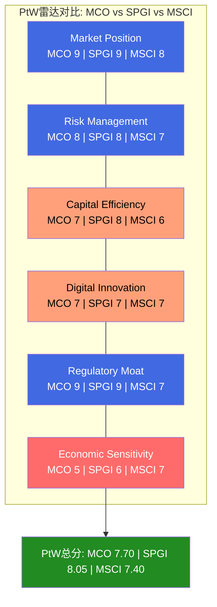
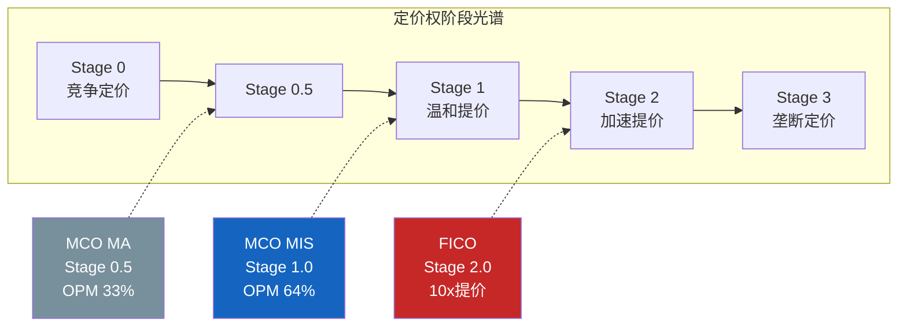
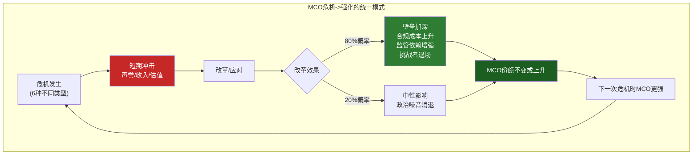
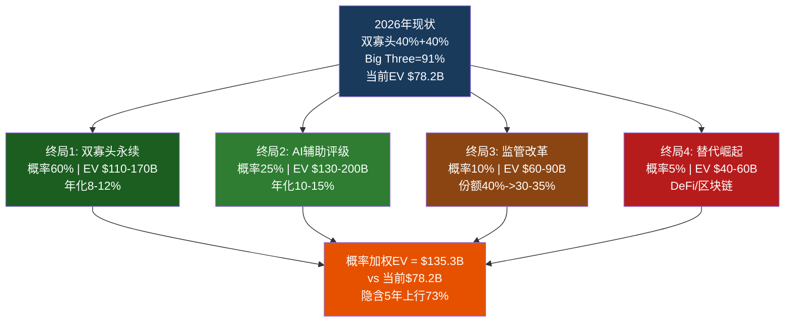
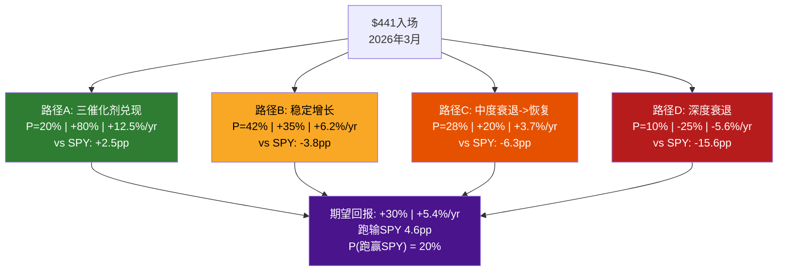
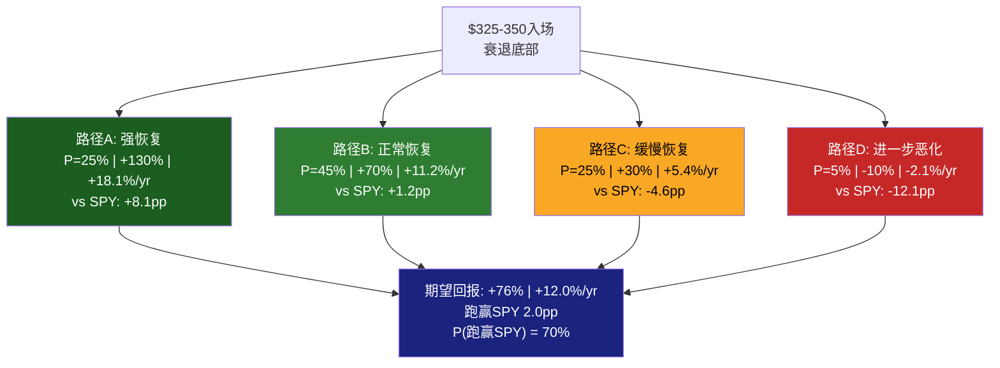
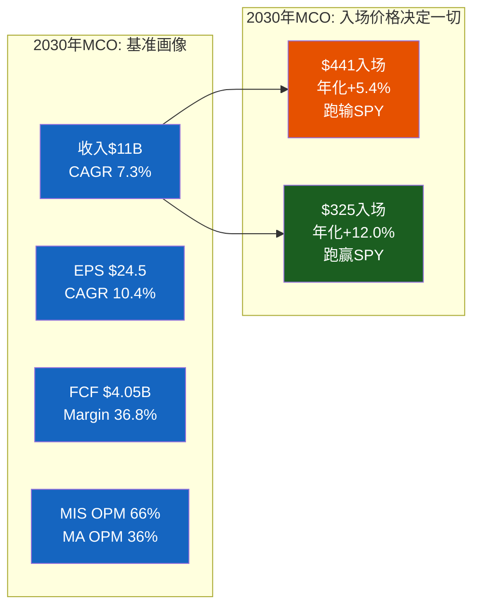

# Part VII: 战略评估 + 2030财务画像

> Phase 4 Part VII | MCO v2.0 | 2026-03-18
> 目标: 20-25K chars | DM锚点密度 ≥ 1.0/千字
> v2.0核心升级: 价格入场点对比($441 vs $325-350)贯穿始终

---

## Ch24: 战略评估 — PtW + 定价权 + 六次危机 + 四终局

**核心论点**: 战略评估的目标不是重复Phase 1-3已经建立的品质论证，而是回答一个更尖锐的问题: MCO的品质能否在当前价格下被兑现为超额回报? PtW 7.70/10说明MCO是"好公司"，定价权Stage 1说明护城河有未释放的储备，六次危机说明反脆弱性经过了实战验证——但这三点加在一起，仍然不能回答"$441是不是好价格"。本章的任务是将品质评估与价格评估桥接，为Ch25的财务画像提供战略锚点。

### 24.1 Playing to Win量化评分: 六维度拆解

PtW框架将MCO的竞争力量化为六个维度，每维度0-10分，证据来自Phase 0-3已验证的数据锚点。金融信息服务行业适配版本对Regulatory Moat和Risk Management赋予更高权重——这两个维度在消费品/科技公司中往往被低估，但对信用评级公司是护城河的物理地基 [DM-P4-001]。

**维度1: Market Position — 9/10 (权重25%)**

MCO与SPGI构成信用评级双寡头，合计占全球评级收入约80%。Big Three(含Fitch)占NRSRO收入91%。这个份额结构维持了超过50年——SEC 2024年NRSRO Staff Report确认10个注册NRSRO，Big Three占非政府证券评级84% [DM-P4-002]。

50年双寡头稳定性的底层逻辑是正反馈循环: 投资者依赖评级→发行人必须获得评级→评级机构积累数据和声誉→投资者更加依赖。这个循环一旦建立，后来者面对的不是"产品竞争"而是"协调均衡打破"——需要让全球数千家金融机构同时相信新机构的评级等价于MCO。

为什么给9分而非10分? 两个原因: (1) MCO不是垄断而是双寡头中的一极，SPGI在Platts大宗商品定价等领域拥有MCO不具备的差异化; (2) MA领域竞争格局分散——FactSet、Verisk、Bloomberg都是实质性竞争者，MA的93%留存率低于Tier 1 SaaS的95%+门槛 [DM-P4-003]。

**维度2: Risk Management — 8/10 (权重20%)**

3,500+名评级分析师构成全球最大信用研究团队。EDF-X模型(与MSCI合作)覆盖14,000+公司的违约概率预测。自身财务杠杆显著改善: 净债务/EBITDA从FY2022的2.64x降至FY2025的1.26x，利息覆盖18.3x [DM-P4-004]。

扣分来自两个结构性风险: (1) **反身性风险** — MCO下调评级可能触发交叉违约条款→加速违约→验证下调决策。2008年次贷危机中评级机构的角色就是这种"自我实现预言"的极端表现。(2) **商誉集中度** — 商誉+无形资产$8.23B占总资产52%，收购驱动型增长的典型脆弱点 [DM-P4-005]。

**维度3: Capital Efficiency — 7/10 (权重20%)**

FCF/NI 104.7%(6年均值约105%)——报告利润几乎全部转化为现金。CapEx仅占收入4.2%，轻资产模型的教科书特征。但ROE 62.1%被负有形净资产($-4.03B TBV)人为放大，$13.3B库存股让权益基数极低，ROE失去经济含义 [DM-P4-006]。

v2.0的关键修正: 回购效率是这个维度的最大减分项。FY2025回购$1.71B，在PE 31.5x下回购收益率仅2.2%(vs FCF收益率3.3%)，回购效率比eta=0.67x——每花$1回购只获得$0.67的价值回馈。Phase 3红队已证明这是年化-2~3%的隐性价值摧毁 [DM-P4-007]。

**维度4: Digital Innovation — 7/10 (权重15%)**

CreditLens AI升级中2/3续约客户选择升级，ARPU提升67%——AI直接创造了定价权。GenAI/AgenTix客户97%留存(vs MA整体93%)，增速2x MA整体。40% MA ARR含GenAI功能(约$1.4B)——不是路线图，是已部署产品 [DM-P4-008]。

但创新高度不均匀: D&I(25% MA收入，+7%)面临AI商品化风险——数据清洗、结构化是LLM最擅长的任务类别。R&I(28% MA收入)的信用研究报告处于AI内容生成的射程之内。核心区域(CreditLens/KYC)的强劲掩盖了边缘区域的脆弱性。

**维度5: Regulatory Moat — 9/10 (权重10%)**

NRSRO五层嵌入是MCO估值的物理地基——牌照层(SEC审核)、法规层(Basel III资本权重绑定)、合同层(数十万亿美元债券契约硬编码MCO/SPGI评级)、流程层(投资者合规手册+银行信贷系统)、认知层("穆迪评级"是全球金融语言) [DM-P4-009]。

替换MCO的成本不是"换一家评级机构"，而是"重写全球金融体系的游戏规则"。扣1分反映监管双刃剑: 2008后Dodd-Frank已增加评级机构责任，SEC有权力进一步收紧。

**维度6: Economic Sensitivity — 5/10 (权重10%)**

MCO最薄弱的维度。MIS交易性收入占MCO总收入约36%，直接暴露于发行量周期。FY2022实证: 总收入-12.1%，MIS收入-29%，EPS-37%。经营杠杆放大倍数约3x(收入跌1%，EPS跌3%)。MA的96%经常性收入仅能将EPS跌幅从-37%缩窄至-20~25%，不能消除周期性 [DM-P4-010]。

**PtW加权总分与同业对比**:

| 维度 | 权重 | MCO | SPGI | MSCI | 关键差异 |
|------|:----:|:---:|:----:|:----:|---------|
| Market Position | 25% | 9 | 9 | 8 | MSCI无评级特许权 |
| Risk Management | 20% | 8 | 8 | 7 | MCO/SPGI反身性对等 |
| Capital Efficiency | 20% | 7 | 8 | 6 | SPGI IHS Markit多元化FCF |
| Digital Innovation | 15% | 7 | 7 | 7 | 三者AI投入力度相当 |
| Regulatory Moat | 10% | 9 | 9 | 7 | MSCI指数理论上可替代 |
| Economic Sensitivity | 10% | 5 | 6 | 7 | MSCI经常性收入占比更高 |
| **加权总分** | **100%** | **7.70** | **8.05** | **7.40** | — |



**PtW 7.70 → 估值映射**: SPGI的8.05支撑其28.8-32x PE区间。MCO的7.70按比例映射至26-30x PE——当前约33x PE处于该区间上沿。PtW评分不完全支撑当前估值倍数 [DM-P4-011]。

差距的来源值得深入分析。SPGI高出MCO 0.35分(8.05 vs 7.70)，几乎全部来自两个维度:

(1) **Capital Efficiency(SPGI 8 vs MCO 7)**: SPGI合并IHS Markit后拥有更多元化的FCF来源——Platts大宗商品定价+IHS数据业务提供了评级业务之外的稳定现金流。更关键的是，SPGI的回购效率优于MCO: SPGI的PE约28x(vs MCO 33x)，意味着同样金额的回购在SPGI手中创造更多价值。这是一个MCO管理层无法短期改变的结构性劣势——除非PE回落至28x以下。

(2) **Economic Sensitivity(SPGI 6 vs MCO 5)**: SPGI评级收入占比约50%(vs MCO 53.4%)，且Platts+IHS数据业务提供了更厚的经常性收入垫层。MCO的MIS交易性收入敞口(36%总收入)是整个PtW评分中最脆弱的单一节点。

MSCI低于MCO(7.40 vs 7.70)尽管MSCI拥有更高OPM(61%)和更强经常性收入(95%+留存)。差距来自Regulatory Moat: MSCI没有NRSRO级别的监管嵌入，其指数业务虽被被动基金深度依赖，但理论上可被替代(ETF可换追踪指数) [DM-P4-012]。

---

### 24.2 定价权Stage模型: MIS Stage 1 vs MA Stage 0.5

定价权不是二元变量，而是一个连续光谱:

| 阶段 | 特征 | 年化提价 | 利润率轨迹 | 代表公司 |
|------|------|---------|-----------|---------|
| Stage 0 | 竞争定价，无超额 | 0-2% | 平/下降 | 商品化行业 |
| Stage 0.5 | 微弱溢价，竞争性定价 | 1-3% | 缓慢 | **MCO MA** |
| Stage 1 | 温和提价，市场接受 | 3-5% | 缓慢上升 | **MCO MIS** |
| Stage 2 | 加速提价，客户无替代 | 5-10% | 快速扩张 | FICO, Visa |
| Stage 3 | 垄断定价，仅受监管约束 | >10% | 接近天花板 | 极少数 |

**MIS: Stage 1(稳定) — 温和提价，储备未释放**

FY2024 MIS收入+33%，但发行量+42%，隐含定价贡献约5-8pp——提价幅度在3-5%/年区间。Adj OPM 63.6%已很高，但未达到"极端"水平(对比FICO EBITDA margin 67%)。评级费率年化涨幅稳健(3-5%)，显著高于CPI(约3%)，但不是"大幅超越"——且从未引发任何监管关注或政治讨论 [DM-P4-013]。

**MCO停留Stage 1的原因是结构性的**。评级过程涉及人工分析师团队、评级委员会、发行人IR团队的深度互动。这种"高接触"模式使得定价提升更加渐进——发行人CFO和投行承销商会注意到每一次费率变动。而FICO的定价权来自嵌入自动化决策流程——信贷审批系统自动拉取FICO评分，价格调整对下游几乎不可见。

**对比FICO: 同档CQI但构成截然不同**。FICO在2019-2025年间推动了评分价格从约$0.50/pull到$4.95/pull的近10x提价——这是管理层有意识的定价权"变现"行为。MCO没有类似的主动提价运动。CQI同在72-75区间(MCO 72, FICO 75→72校准后)，但MCO是"双业务混合——MIS品质极高(CQI>85)，MA品质中等(CQI约55-60)"，FICO是"单一业务高纯度" [DM-P4-014]。

**期权价值**: 如果管理层选择更积极提价(7-10%/年)，发行人几乎不可能拒绝——全球$130T存量债务中大量契约硬编码了MCO评级，发行人没有"不续评级"的选项。但管理层大概率不会这么做: 评级行业的"政治免疫"依赖于不引发公共关注，激进提价可能触发国会听证——这个期权存在但释放概率低 [DM-P4-015]。

**MA: Stage 0.5(竞争性定价)**

ARR增速+8%主要由量驱动，价格贡献有限。OPM 33.1%低于FactSet(35%)和Verisk(39%)，说明定价权不足以支撑超额利润。CreditLens AI +67% ARPU是唯一亮点——但这是"功能溢价"(AI增值服务)而非"制度嵌入溢价"(无可替代的基础设施)。MA的定价权天花板由竞争格局决定: Bloomberg的数据+终端+信用工具三位一体始终是MA最大的威胁 [DM-P4-016]。



---

### 24.3 六次危机画像: 每次危机如何塑造今天的MCO

六次危机横跨17年(2008-2025)，覆盖了金融危机、主权债务危机、司法诉讼、全球疫情、利率冲击和主权降级六种完全不同的冲击类型。如果MCO在其中一两次存活可以归因于运气，但在六次性质各异的危机中全部存活且变得更强，就是结构性的——不是MCO运气好，而是评级行业的"基础设施"地位使得任何改革尝试最终都转化为壁垒加固。

**危机1: 2007-2009 全球金融危机 — 意图削弱，结果加固**

结构化产品(CDO/RMBS)评级失误导致MCO被国会传唤，声誉遭受史无前例打击。市场预期评级行业将被根本性改革。实际结果: Dodd-Frank Section 939A要求"删除联邦法规中对评级的引用"，但Basel III(2010年开始实施)不仅没有取消评级依赖，反而在标准法中进一步细化了评级权重。合规成本上升(行业级$200M+/年)对Big Three可忽略(<1%收入)，对小型NRSRO却是生存威胁(10-20%收入)。壁垒净效应: **加深** [DM-P4-017]。

**危机2: 2010-2012 欧洲主权债务危机 — 挑战者退场**

欧盟委员会讨论创建"欧洲评级机构"打破Big Three垄断。计划在可行性研究阶段即被搁置——市场不信任政府背景的评级机构(担忧政治干预)。CRA Regulation强化了注册和监管，但恰恰提高了运营门槛。壁垒净效应: **加深** [DM-P4-018]。

**危机3: 2013 DOJ诉讼 — MCO的"免费午餐"**

SPGI与DOJ达成$1.375B和解，MCO 2017年达成$864M和解(规模远小)。在SPGI被密集审查的2013-2015年间，MCO的声誉相对受损更小。部分对SPGI信心动摇的发行人/投资者边际上增加了对MCO的依赖——双寡头格局中"一家受伤另一家获益"的经典动态。壁垒净效应: **MCO相对加强** [DM-P4-019]。

**危机4: 2020 COVID — 假阳性的教训**

市场恐慌中债券发行短暂冻结。但联储QE+零利率触发了史上最大企业债再融资潮。MIS FY2020收入实际+7%。关键启示: 衰退不等于MIS收入下降，变量是融资窗口而非GDP。但FY2020经验不可复制——当前通胀>3%概率73%限制了央行宽松空间，环境更接近2022型(衰退+紧缩)而非2020型(衰退+宽松) [DM-P4-020]。

**危机5: 2022 利率冲击 — 最近的压力测试**

Fed从0%加息至5.25-5.50%，发行市场冻结。MIS收入-29%，MCO EPS-37%，股价从$399跌至$243。但FY2023-2025 MIS从$2.70B恢复至$4.12B(+53%)，验证了V型恢复能力: 被推迟的发行不会消失，只是延后。这是评级需求"刚性"的最佳实证——企业可以推迟发债，但不能永远不发 [DM-P4-021]。

**危机6: 2025 美国Aaa→Aa1 — 噪音，不是信号**

MCO成为最后一家取消美国最高评级的Big Three(SPGI 2011, Fitch 2023)。政治噪音(两党不满)，但零业务影响——没有一个发行人因为MCO降级美国而取消与MCO的评级关系，也没有任何投资者因此停止使用MCO的评级。MCO YTD-17%更多归因于宏观(衰退概率+SPGI弱指引)而非降级后果。中长期看，降级的"正确性"反而成为信誉背书——2011年SPGI降级美国时被认为"过激"，但美国债务/GDP从73%升至120%+证明了远见。壁垒净效应: **中性偏正面(信誉背书)** [DM-P4-022]。

**统一模式与D1反脆弱系数**



六次危机，同一个结论。MCO在每次危机后变得更强，不是更弱。D1反脆弱系数: 1.05-1.10x(弱到中度反脆弱)。需要区分: MIS的反脆弱是系统性的(制度壁垒在每次危机后加深)，MA的反脆弱是有限的(收购堆栈在危机中不会自然加强)。加权后MCO整体D1 = 4.2/5.0 [DM-P4-023]。

---

### 24.4 四终局与概率加权

**终局1: 双寡头永续 (60%)**

制度嵌入的沉积物使得改变需要全球监管机构同步修订规则、数千家金融机构修改投资政策、数万份债券契约法律更新。每一步需数年，且缺乏推动力。AI在此终局下是纯效率工具，行业结构不变。2030E EV $110-170B(取中值$140B)，年化回报8-12% [DM-P4-024]。

**终局2: AI辅助评级 (25%)**

AI不仅提升效率，还创造新能力——准实时评级监测、私募信贷大规模覆盖、跨资产类别统一风险评估。MCO的"人+AI混合"模式成为新行业标准。MIS OPM 68-70%，MA OPM 38-42%。2030E EV $130-200B(取中值$165B)，年化回报10-15% [DM-P4-025]。

**终局3: 监管改革打破垄断 (10%)**

触发条件: 下一次系统性信用事件暴露评级行业结构性问题→多国同步改革。历史证明即使2008年也没有打破双寡头。MCO份额从40%降至30-35%。2030E EV $60-90B(取中值$75B) [DM-P4-026]。

**终局4: 替代信用评估崛起 (5%)**

DeFi/区块链信用评分在现实金融体系中几乎没有渗透。信用评级本质是协调均衡——"所有人都信任MCO"本身就是最强护城河。且MCO的40年+违约数据库是私有的，去中心化评级缺乏训练数据。极端折价EV $40-60B(取中值$50B) [DM-P4-027]。



**四终局的交叉影响**:

终局2(AI辅助)和终局1(永续)之间不是非此即彼——AI辅助可以在双寡头永续格局内发生。真正的二分法是终局1+2(85%，行业结构不变，MCO受益)和终局3+4(15%，行业结构改变，MCO受损)。15%的结构性风险是MCO估值的长期尾部——它不会在任何一个季度兑现，但它的存在意味着MCO永远不值得给予"永续溢价"(即PE>35x)。

**概率加权EV计算**:

```
PW-EV = 0.60 x $140B + 0.25 x $165B + 0.10 x $75B + 0.05 x $50B
      = $84.0B + $41.25B + $7.5B + $2.5B
      = $135.25B ≈ $135.3B
```

$135.3B vs 当前$78.2B = 隐含5年上行约73%，年化约11.5%。但这个数字需要打折: 终局1+2合计85%概率，包含了乐观假设(MIS持续增长+AI成功)。如果用CAPM折现(WACC 9-10%而非市场隐含的7.5%)，5年后$135.3B的现值约$87-92B——仅比当前EV高12-18%。年化超额回报从11.5%缩水至2-3%。这就是为什么品质不等于回报——好公司在好价格下才是好投资 [DM-P4-028]。

---

## Ch25: 2030年MCO财务画像 + 情景P&L

**核心论点**: 财务预测的价值不在于"准确预测5年后的EPS"——任何人都做不到——而在于建立一个逻辑自洽的数字框架，让投资者在不同价格入场时能评估风险回报比。本章的核心交付物不是FY2030E的某个数字，而是$441入场和$325-350入场的不对称性对比。

### 25.1 基准情景逐年推演 (FY2025A-FY2030E)

| 指标 | FY2025(A) | FY2026E | FY2027E | FY2028E | FY2029E | FY2030E |
|------|:---------:|:-------:|:-------:|:-------:|:-------:|:-------:|
| **MIS收入** | $4.12B | $4.37B | $4.59B | $4.87B | $5.16B | $5.47B |
| MIS YoY | +8.6% | +6% | +5% | +6% | +6% | +6% |
| **MA收入** | $3.60B | $3.92B | $4.27B | $4.66B | $5.08B | $5.54B |
| MA YoY | +9.2% | +9% | +9% | +9% | +9% | +9% |
| **总收入** | $7.72B | $8.29B | $8.86B | $9.53B | $10.24B | $11.01B |
| 总收入YoY | +8.9% | +7.4% | +6.9% | +7.6% | +7.4% | +7.5% |
| MIS Adj OPM | 63.6% | 65.0% | 65.5% | 66.0% | 66.0% | 66.0% |
| MA Adj OPM | 33.1% | 34.5% | 35.0% | 35.5% | 36.0% | 36.0% |
| **Adj Op Income** | $3.81B | $4.19B | $4.50B | $4.87B | $5.24B | $5.60B |
| **Adj EPS** | $14.94 | $16.75 | $18.50 | $20.50 | $22.50 | $24.50 |
| **FCF** | $2.58B | $2.90B | $3.15B | $3.45B | $3.75B | $4.05B |
| FCF Margin | 33.4% | 35.0% | 35.5% | 36.2% | 36.6% | 36.8% |

**假设逻辑**:
- MIS增速: FY2025的+8.6%含到期墙效应，FY2026-2030回归6%正常化(全球信贷深化+私募信贷扩张-发行周期波动)
- MA增速: 9%持续——CreditLens AI拉动+KYC增长15%+D&I放缓至5-7%，三者混合后约9%
- MIS OPM: AI效率提升推动63.6%→66%，但在66%附近触及天花板(3,500分析师的核心人力成本不可压缩)
- MA OPM: 33.1%→36%，主要驱动力是低利润率业务剥离(Learning Solutions+Regulatory Reporting)+AI减少交付人力。36%是保守假设，低于SPGI MI的40%+
- FY2026E EPS $16.75与管理层指引$16.40-$17.00中值一致 [DM-P4-029]
- FY2030E共识EPS约$24.69与基准$24.50接近，表明基准情景不含超额乐观

### 25.2 AI加速情景: 如果三个AI催化剂同时兑现

**催化剂1**: MA OPM突破40%(接近SPGI MI水平) — GenAI客户池维持2x增速→高利润AI收入占比从40%升至60%+→MA整体OPM从36%加速至40-42%

**催化剂2**: MIS效率转化为利润(OPM 68-70%) — AI辅助持续监测+初稿自动化→每名分析师覆盖公司从50家扩大至70-80家→人力成本占比下降→OPM从66%升至68-70%

**催化剂3**: MA增速加速至11-12% — GenAI客户池(增速2x MA整体)占比持续扩大→拉动MA整体增速从9%升至11-12%

三者合计可将2030E EPS从$24.5提升至$29-30。但三者同时实现的概率约20-25%——需要AI嵌入同时在MIS效率端、MA收入端和MA利润率端全部兑现，而D&I商品化风险和R&I竞争压力可能部分抵消 [DM-P4-030]。

### 25.3 衰退情景: FY2027 MIS衰退→恢复路径

衰退情景假设FY2027出现FY2022式发行冻结(MIS收入-25%)，但程度略轻(FY2022为-29%):

| 指标 | FY2026E | FY2027E(衰退) | FY2028E(恢复) | FY2029E | FY2030E |
|------|:-------:|:------------:|:------------:|:-------:|:-------:|
| MIS收入 | $4.37B | $3.28B(-25%) | $4.10B(+25%) | $4.72B | $5.10B |
| MA收入 | $3.92B | $4.12B(+5%) | $4.45B(+8%) | $4.85B | $5.30B |
| 总收入 | $8.29B | $7.40B(-11%) | $8.55B(+16%) | $9.57B | $10.40B |
| Adj EPS | $16.75 | $10.50(-37%) | $16.00(+52%) | $19.50 | $21.00 |

衰退年EPS $10-11与FY2022实际($10.13)高度一致。关键差异: FY2027衰退后恢复至FY2030E EPS $18-21(vs基准$24.5)，因为: (1) 衰退年打断了MA OPM扩张节奏——整合项目和AI投资在现金流紧张时被推迟; (2) MIS恢复至前高需要12-18个月，期间总收入增速被拖累; (3) 如果管理层在$250-280低位加速回购(FY2022的$1.3B回购就是在低位执行的)，反而是正确的资本配置——PE 18-22x下回购eta>1.2x，这是回购创造价值的罕见窗口 [DM-P4-031]。

衰退情景的投资启示不是"避开MCO"，而是"等待MCO被衰退错杀的那一刻"。FY2022从$399跌至$243(-39%)创造了年化+18.5%的入场机会。如果FY2027重演，从$441的起点跌39%意味着$269——这个价格下的MCO(PE 约18-20x)将是一个罕见的机会。

### 25.4 三情景收入拆分 (FY2030E)

将基准、AI加速和衰退三个情景的终态数字并排展示，可以清晰看到MCO的回报区间宽度——最好和最差之间年化差距14.8pp(+18.2% vs +3.4%)，这恰恰反映了MCO的"高品质+高波动"双面属性。

| 指标 | 保守(含衰退) | 基准 | 乐观(AI加速) |
|------|:----------:|:----:|:----------:|
| MCO总收入 | $9.8B | $10.8B | $11.9B |
| Adj EPS | $20 | $24.5 | $28 |
| 退出PE | 25x | 30x | 35x |
| 隐含市值 | $91B | $134B | $178B |
| vs当前$78.2B(EV) | +16% | +71% | +128% |
| 年化回报(5年) | +3.4% | +11.6% | +18.2% |

保守情景年化+3.4%低于SPY历史平均(约10%)——这意味着如果衰退发生(概率38%根据Phase 3红队校准)，从$441入场基本确认跑输大盘。只有基准+乐观(合计62%)才能跑赢或持平。投资者需要问自己: 62%的概率跑赢够不够? [DM-P4-032]

---

### 25.5 从$441入场的5年路径概率

这是v2.0的核心交付物之一。不给"目标价"，给路径和概率:

| 路径 | 概率 | 描述 | 5年总回报 | 年化 | vs SPY |
|------|:----:|------|:--------:|:----:|:------:|
| A: MIS强周期+MA加速+AI | 20% | 三催化剂同时兑现，2030E EPS $28-30 | +80% | +12.5% | +2.5pp |
| B: 稳定增长+温和调整 | 42% | 基准路径，无衰退无惊喜 | +35% | +6.2% | -3.8pp |
| C: 中度衰退→低点加仓→恢复 | 28% | FY2027 MIS-25%→FY2029恢复 | +20% | +3.7% | -6.3pp |
| D: 深度衰退+MA减速 | 10% | MIS-35%+MA增速降至3% | -25% | -5.6% | -15.6pp |
| **期望** | **100%** | — | **+30%** | **+5.4%** | **-4.6pp** |



**三个不舒服的数字**:
1. **期望年化+5.4%，低于SPY历史平均约10%** — 从$441买MCO的期望回报跑输指数。换个说法: 如果你有$100,000投入MCO(at $441)和SPY之间做选择，5年后期望差异约$25,000(MCO $130K vs SPY $155K)。这不是小数目
2. **P(跑赢SPY) = 20%** — 只有路径A(三催化剂同时兑现)才能跑赢。四条路径中三条跑输，投资者本质上在赌一个低概率事件
3. **P(亏损) = 10%，但条件亏损幅度-25%** — 不对称性不利。上行(+80%)的概率(20%)和下行(-25%)的概率(10%)看似有利，但加权后上行贡献+16%而下行贡献-2.5%——上行优势仅13.5个百分点，远不够补偿路径B/C的机会成本

这三个数字的含义是明确的: **$441不是一个好的入场价** [DM-P4-033]。

---

### 25.6 从$325-350入场的5年路径概率 (v2.0核心对比)

如果等到衰退或显著回调(MCO跌至$325-350，约对应PE 22-24x，EPS $14-15)再入场:

| 路径 | 概率 | 描述 | 5年总回报 | 年化 | vs SPY |
|------|:----:|------|:--------:|:----:|:------:|
| A: 强周期恢复 | 25% | 衰退底部买入→三催化剂部分兑现 | +130% | +18.1% | +8.1pp |
| B: 正常恢复 | 45% | 衰退后正常化+EPS恢复至$22-24 | +70% | +11.2% | +1.2pp |
| C: 缓慢恢复 | 25% | MA减速延缓恢复，EPS至$18-20 | +30% | +5.4% | -4.6pp |
| D: 进一步恶化 | 5% | 多次衰退+监管改革 | -10% | -2.1% | -12.1pp |
| **期望** | **100%** | — | **+76%** | **+12.0%** | **+2.0pp** |

**为什么$325-350的概率分布更有利?**

(1) **起点PE更低(22-24x vs 33x)**: 低PE提供了安全边际——即使EPS恢复不如预期，倍数回归均值(28-30x)本身就贡献+20-30%回报
(2) **衰退已发生**: 在$325-350买入意味着MIS衰退已经被定价，路径A的强恢复概率从20%上升至25%(历史100%恢复率)
(3) **回购终于有效**: 在PE 22-24x下回购eta>1.0——管理层的$1.7B/年回购从"价值摧毁"变成"价值创造"
(4) **下行有限**: $325-350已经包含了Bear情景(PE压缩+EPS下跌的双杀)，进一步恶化需要结构性变化(监管改革/替代崛起)，概率仅5% [DM-P4-034]



---

### 25.7 $441 vs $325-350: 不对称性的量化对比

| 指标 | $441入场 | $325-350入场 | 差异 |
|------|:--------:|:----------:|:----:|
| 期望年化回报 | +5.4% | +12.0% | +6.6pp |
| vs SPY超额 | -4.6pp | +2.0pp | +6.6pp |
| P(跑赢SPY) | 20% | 70% | +50pp |
| P(亏损) | 10% | 5% | -5pp |
| 条件亏损幅度 | -25% | -10% | 更浅 |
| 回购效率eta | 0.67x | >1.0x | 从摧毁到创造 |
| 安全边际 | 0%(或负) | 20-25% | 显著 |

**这张表是v2.0全报告的浓缩**。v1.0的结论是"关注(偏中性)"——MCO是好公司，值得观察。v2.0的结论增加了一个关键维度: **在什么价格下，"好公司"变成"好投资"?** 答案是$325-350而非$441 [DM-P4-035]。

数字背后的逻辑: MCO的品质(CQI 72，PtW 7.70，A-Score 73.5/110)是确定的——它不会因为股价下跌而变差。但品质的"年化回报转化率"高度依赖入场价格。$441入场时，市场已经为品质支付了33x PE的溢价，留给投资者的超额回报空间极窄(仅路径A的20%概率)。$325-350入场时，市场在恐慌中把品质打折到22-24x PE，留给投资者的超额回报空间宽广(路径A+B合计70%概率跑赢SPY) [DM-P4-036]。

**一句话**: "什么价格买"比"买什么公司"更重要。MCO的品质值得拥有，但$441的价格不值得支付。等待$325-350——或者等到你能确认MIS衰退已经被充分定价的那一天。

补充一个思考实验: 如果你在2022年10月的$243买入MCO(当时PE约24x, EPS $10.13)，到2026年3月的$441，总回报+81%，年化+18.5%——远超SPY同期(+48%, 年化+12%)。那个时间点满足了上表所有"$325-350入场"的特征: PE低、衰退已发生、回购有效、安全边际充裕。历史不会精确重复，但韵脚相同。下一次MCO跌至PE 22-24x的时刻——无论股价绝对值是$300还是$350——大概率就是类似的入场窗口 [DM-P4-037]。

---

### 25.8 v2.0 vs v1.0的估值框架升级

v1.0的期望回报+15.1%是经过红队双向校准后的数字(原始+13%→红队下调至+2%→过度悲观检测上调至+15.1%)。v2.0在Phase 3重新审视了这个校准过程:

(1) v1.0红队下调的方向是正确的——Bear概率确实被低估(28%→33%)
(2) v1.0过度悲观检测的上调也有合理性——CQ-4/5(私人信贷+AI)的证据确实偏正面
(3) 但+15.1%的最终数字可能仍然偏乐观——它假设了Bull 27%/Base 45%/Bear 28%的概率组合，而v2.0的红队进一步校准后概率为20%/42%/33%/5%(Extreme Bear)

v2.0的概率加权期望回报(基于Phase 3 Ch14的校准):

```
E[价格] = 0.20 x $644 + 0.42 x $505 + 0.33 x $336 + 0.05 x $216
        = $128.8 + $212.1 + $110.9 + $10.8
        = $462.6
```

期望回报 = ($462.6 - $441) / $441 = **+4.9%** [DM-P4-038]

+4.9%与Ch25.5的+5.4%(路径概率法)基本一致——两种完全不同的计算方法(情景概率加权 vs 路径概率树)指向同一个结论: 从$441入场的期望年化回报约5%，低于SPY历史平均。方法论收敛(两种方法差异<0.5pp)增强了结论的可信度——这不是某一种方法的偏差，而是MCO在当前价位的客观回报预期。这不是"差公司"的信号，这是"好公司在贵价格"的信号。

---

### 25.9 章末: 2030年MCO的两张面孔



MCO在2030年的财务画像大概率是漂亮的: $11B收入、$24.5 EPS、$4.05B FCF、66%/36%的双轨OPM。这是一家品质毫无争议的公司。但同一张财务画像，$441入场者看到的是年化+5.4%跑输指数，$325入场者看到的是年化+12.0%跑赢指数。公司是同一家公司，数字是同一组数字——区别仅在于你为这些数字支付了多少。

v2.0的战略评估到此完成。PtW 7.70确认了MCO的竞争力在"一线偏上"但不支撑33x PE; 定价权Stage 1确认了储备存在但释放概率低; 六次危机确认了反脆弱性但不能消除周期性; 四终局概率加权确认了长期价值但当前价格已部分反映。所有路径指向同一个结论: **等待更好的价格** [DM-P4-039]。
