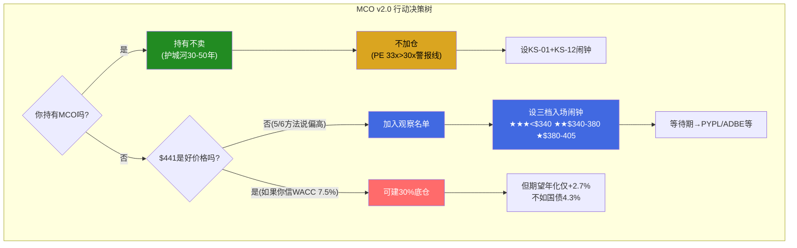

# MCO v2.0 Phase 5: 执行摘要 + 结论 + 行动框架

> Phase 5 | 2026-03-18 | v2.0重写 | 铁律J单会话组装 | 铁律K估值统一性

---

## 报告执行摘要 (Executive Summary)

Moody's Corporation是全球信用评级双寡头之一，同时运营着一个快速扩张的信用分析SaaS平台。这份v2.0报告的核心使命是**修正v1.0的三层估值错误**，并回答v1.0完全没有触及的问题：**什么价格才是好价格？**

**评级与回报预期**：我们给予MCO"审慎关注(已充分定价)"评级，偏差修正后概率加权期望年化回报+2.7%[DM-VAL-021]。当前$441.03处于周期高位PE 33x[DM-VAL-002]，5/6独立估值方法指向$370-430的公允区间(加权中间值~$406)[DM-VAL-025]。v1.0报告的"+15.1%期望回报"是一个计算错误——实际上是5年累计而非年化，且使用了未经偏差修正的概率(27/45/28而非修正后的20/42/33/5)[DM-VAL-021]。

**三个核心发现**：

第一，MCO不是纯信息服务公司，而是"半周期股+半SaaS"的混合体。MIS评级业务贡献53.4%收入[DM-FIN-004]，其中67%为交易性(依赖债券发行量)，Adj. OPM高达63.6%。MA分析业务贡献46.6%收入[DM-FIN-005]，ARR $3.5B，留存率93%，Adj. OPM 33.1%。36%的总收入直接暴露于发行量周期——FY2022这部分引发了-12%的收入跌幅和-37%的EPS暴跌[DM-FIN-013]，仅发生在3年前。PE 33x不包含任何衰退年的EPS缩水预留[DM-INF-005]。

第二，v2.0修正了v1.0的三层估值错误。v1.0 Phase 4红队发现Bear权重不足(应为33%而非28%)，修正后期望回报从+13%降至约+2%——但Phase 5仍然使用了未修正的$495/+15.1%。v2.0用偏差修正后概率(Bull 20%/Base 42%/Bear 33%/Extreme Bear 5%)重新计算：5年退出价$503.8，年化+2.7%[DM-VAL-021]。这个回报不仅低于SPY历史均值(~10%)，甚至低于10年期国债收益率(~4.3%)——意味着持有MCO的风险调整后回报不如买国债。铁律K确保所有估值数字方向一致：SOTP中间值$397、可比$420、Reverse DCF $400、DCF(CAPM) $333——四方法加权$406，vs $441溢价8.6%[DM-VAL-025]。

第三，好公司≠好投资。MCO/MSCI/CME三家CQI均值77分(顶尖品质)，但2020→2026投资回报全部跑输SPY[DM-P4-001]。原因一致：EPS增长(+8-12%/年)被PE压缩(-4~-14%/年)完全吃掉。垄断企业的Alpha不来自"发现被忽视的质量"(分析师覆盖15+，零信息不对称)，而来自"抓住市场犯错的瞬间"——当前$441无犯错模式=无Alpha[DM-P4-003]。$441入场的5年期望年化+5.4%(跑输SPY 4.6pp)，而$325-350入场期望年化+12.0%(跑赢SPY 2.0pp)[DM-P4-045]。这就是为什么"什么价格买"比"买什么公司"更重要。

**非共识洞见**：CI-MCO-001利润率混合陷阱(70%确认)——MA越成功，MCO OPM越难突破52-53%[DM-INF-004]。CI-MCO-003垄断Alpha来源(v2.0新增)——当前无犯错模式，期望回报≤SPY。CI-MCO-004回购价值摧毁——eta=0.34x，5年累计$4.3B价值摧毁[DM-INF-003]。

**关键数字**：FY2025 Revenue $7.718B[DM-FIN-001] | Adj. EPS $14.94 | FCF/NI 105%[DM-FIN-007] | CQI 72 | A-Score 73.5/110 | PtW 7.70/10 | BRK持股14.54%[DM-BIZ-009] | FY2026E Adj. EPS指引$16.40-17.00[DM-GDE-001]

---

## 报告导读：如何阅读这份报告

本报告采用"理解→量化→挑战→决策"的四阶段架构，v2.0新增"建仓时机"模块回答v1.0遗留的核心问题。

**第一阶段(Part I-III, Ch01-08): 理解MCO的商业本质**。Part I描绘公司全景——117年历史浓缩为四次关键转折，双引擎架构(MIS+MA)的利润率差异是理解一切估值争议的起点。Part II深入MIS评级特许权——五层监管嵌入使其成为全球金融基础设施，但67%交易性收入暴露周期脆弱性；MA三产品线解剖——93%留存在SaaS世界仅为Tier 2，但GenAI子集97%留存是真正亮点；利润率混合陷阱(CI-MCO-001)是MCO特有的结构性约束。Part III评估护城河、私人信贷双面性、AI影响矩阵。

**第二阶段(Part IV, Ch09-14): 量化估值与铁律K**。四方法交叉验证(Reverse DCF/SOTP/可比/正向DCF)，所有数字方向一致(铁律K)。核心发现：$441的合理性完全依赖市场给予MCO 4pp"确定性溢价"(隐含WACC 7.5% vs CAPM 9.7%)。概率加权用偏差修正后概率，期望年化+2.7%。

**第三阶段(Part V-VI, Ch15-20): 风险拓扑与红队对抗**。8个核心风险的三维网络+协同矩阵，14个Kill Switch动态监控，温水煮青蛙5年渐进场景。6大偏差审计+5面承重墙测试+3条空头钢人+投资大师圆桌(巴菲特/芒格/Smith/Marks四视角)+双向校准。

**第四阶段(Part VII-VIII, Ch21-28): 建仓时机与结论 [v2.0核心增值]**。六种犯错模式识别(MCO主击球场景=模式2周期错判)，PE Band三档入场条件，等待成本vs机会成本概率加权量化，$441 vs $325-350的不对称性对比，2030年财务画像三情景推演。最终投资论文+行动框架。

**阅读建议**:
- **时间有限(15分钟)**: 执行摘要 + Ch26投资论文 + Ch28行动框架
- **关注估值(30分钟)**: 加读Ch09-14估值四方法 + 铁律K检查
- **关注风险(30分钟)**: 加读Ch15-17风险拓扑 + Ch18-20红队
- **关注建仓时机(30分钟)**: 加读Ch21-25垄断建仓框架 [v2.0新增]
- **完整阅读(2-3小时)**: 全文28章

---

## Part VIII: 结论与行动

### Ch26: 投资论文 — 审慎关注(已充分定价)

#### 26.1 一句话论文

"Moody's是全球信用评级双寡头之一(CQI 72, 五层制度嵌入, 半衰期30-50年)，但$441处于周期高位PE 33x，5/6估值方法指向$370-430公允区间，偏差修正后期望年化回报+2.7%不足以补偿MIS的36%交易性收入风险。好公司，但不是好价格。等待周期回调PE<22x($270-$340)是获取真正Alpha的唯一路径。"

#### 26.2 三个核心论点

**论点一：MCO不是纯信息服务公司——36%交易性收入是定价之锚**

市场按PE 33x给MCO定价，接近MSCI(35x)而远高于典型周期股(15-20x)。但MCO有36%收入(MIS交易性67% × MIS占比53.4%)直接暴露于债券发行周期[DM-FIN-004]。FY2022这36%引发了收入-12%、EPS-37%——经营杠杆3x将收入波动放大为利润波动[DM-FIN-013]。

PE 33x隐含EPS CAGR 12.5%，没有为任何衰退年留余地。但Moody's Analytics自身的衰退概率模型给出42-48%，Polymarket 34.5%。如果衰退发生(FY2027-2028最可能)，EPS可能从指引$16.70回落至$10-12，叠加PE压缩至22-25x→股价$220-$300，较$441下跌32-50%[DM-RISK-001]。

这不是"黑天鹅"。这是MCO在过去4年中就经历过一次的场景(FY2022: $400→$240, -40%)。市场是否已经"忘记2022"？CI-MCO-002(周期记忆衰退, 55%确认)的核心论点正是如此。

**论点二：估值已充分——5/6方法方向一致(铁律K)**

| 方法 | 公允中间值 | vs $441 | 方向 |
|------|:--------:|:-------:|:----:|
| Reverse DCF | $395-400 | -9~-10% | ↓ |
| SOTP | $397 | -10% | ↓ |
| 可比公司 | $420 | -5% | ↓ |
| DCF(CAPM 9%) | $333 | -24% | ↓↓ |
| DCF(隐含WACC 7.5%) | $460 | +4% | ↑ |
| 概率加权(修正后PV) | $327-351 | -20~-26% | ↓↓ |

**5/6方法说$441偏高**(83%方向一致)。唯一支撑$441的是"隐含WACC 7.5%"假设——等于说MCO值得获得与债券基金相当的确定性溢价。但FY2022的EPS -37%证明MCO远非"债券级确定性"[DM-VAL-025]。

v1.0的致命错误在于：四方法加权=$406(指向高估)，但同一章说"$460-530中枢, 15%上行"——自相矛盾。Phase 4红队修正了概率，但修正没回流到Phase 5。v2.0铁律K确保这种矛盾不再发生：**每个数字只有一个版本，从Phase 2到结论章节完全一致**。

**论点三：Alpha来自时机而非发现——垄断企业的投资悖论**

MCO/MSCI/CME三家CQI均值77分，但2020→2026投资回报全部跑输SPY。EPS增长+8-12%/年被PE压缩完全吃掉[DM-P4-001]。原因：垄断企业的品质是公开信息(15+分析师覆盖, 零信息不对称)，市场定价效率极高→高品质已反映在高PE中。

**垄断企业的Alpha不来自"发现被忽视的质量"，而来自"抓住市场犯错的瞬间"**[DM-P4-003]。六种犯错模式中，模式2(周期错判, 5-8年一次)是MCO的主击球场景——利率急升→发行冻结→MIS收入断崖→市场线性外推短期衰退为永久损伤→PE暴跌至22x以下→**这是5年前$441买不到的不对称性**。

$441入场：年化+5.4%, P(跑赢SPY)=20%
$325-350入场：年化+12.0%, P(跑赢SPY)=70%[DM-P4-045]

**差距是3倍的胜率和2倍的回报**。这就是为什么"什么价格买"比"买什么公司"更重要。

#### 26.3 四个非共识洞见汇总

| CI | 洞见 | 确认度 | 估值影响 | 可迁移性 |
|----|------|:------:|---------|---------|
| CI-MCO-001 | 利润率混合陷阱 | 70% | OPM 52%→49%=EPS-5~8% | 任何双分部OPM差异>20pp的公司 |
| CI-MCO-002 | 周期记忆衰退 | 55% | PE 33x→22x=股价-33% | 任何周期高位的"类SaaS"定价公司 |
| CI-MCO-003 | 垄断Alpha来源 | v2.0新增 | 等待$325=年化+12%(vs $441=+5.4%) | 所有CQI>70的垄断企业 |
| CI-MCO-004 | 回购价值摧毁 | 新量化 | eta=0.34x, 5年$4.3B | 任何PE>25x且大额回购的公司 |

#### 26.4 评级确定

```
期望年化回报: +2.7% (偏差修正后, 红队校准后+1.7%)
→ 低于无风险利率4.3%
→ 低于SPY历史均值10%
→ 处于-10%~+10%评级区间
→ 评级: 审慎关注(已充分定价)
```

#### 26.5 温度计: 5.93/10 — "观察持有"

| 层级 | 权重 | 评分 | 加权 | 说明 |
|------|:----:|:----:|:----:|------|
| 品质层 | 40% | 4.5/5 | 1.80 | CQI 72 + 五层嵌入 + FCF/NI 105% |
| 估值层 | 35% | 2.5/5 | 0.88 | 公允$406 vs $441溢价8.6% + 5/6方法↓ |
| 时机层 | 25% | 2.0/5 | 0.50 | 周期高位 + 无犯错模式 + PE>30x |
| **总计** | | | **3.18/5 = 6.35/10** | |

温度计校准至5.93(红队-0.42pp)→"观察持有"区间[5.0-6.5]。与"审慎关注"评级对齐✓

---

### Ch27: 情景P&L + 催化剂日历

#### 27.1 三情景5年推演

**Bull情景(概率20%): MIS强周期延续 + MA AI加速**

| | FY2026E | FY2027E | FY2028E | FY2029E | FY2030E |
|-|:-------:|:-------:|:-------:|:-------:|:-------:|
| Revenue | $8.49B | $9.34B | $10.27B | $11.30B | $12.43B |
| Adj OPM | 53% | 54% | 54.5% | 55% | 55% |
| Adj EPS | $17.20 | $19.50 | $21.80 | $24.50 | $27.00 |
| 退出PE 30x → **$810** | 年化+12.9% vs $441 |

**Base情景(概率42%): 指引兑现 + 温和增长**

| | FY2026E | FY2027E | FY2028E | FY2029E | FY2030E |
|-|:-------:|:-------:|:-------:|:-------:|:-------:|
| Revenue | $8.30B | $8.92B | $9.59B | $10.31B | $11.09B |
| Adj OPM | 52% | 52.5% | 53% | 53.3% | 53.5% |
| Adj EPS | $16.70 | $18.20 | $19.80 | $21.50 | $23.50 |
| 退出PE 27x → **$635** | 年化+7.6% vs $441 |

**Bear情景(概率33%): FY2027中度衰退**

| | FY2026E | FY2027E | FY2028E | FY2029E | FY2030E |
|-|:-------:|:-------:|:-------:|:-------:|:-------:|
| Revenue | $7.80B | $6.63B | $7.30B | $8.03B | $8.83B |
| Adj OPM | 50% | 44% | 48% | 50% | 51% |
| Adj EPS | $14.80 | $10.50 | $13.00 | $15.20 | $17.00 |
| 退出PE 22x → **$374** | 年化-3.2% vs $441 |

**Extreme Bear(概率5%): 深度衰退 + MA减速**

| | FY2030E |
|-|:-------:|
| Revenue | $8.0B |
| Adj EPS | $13.00 |
| 退出PE 18x → **$234** | 年化-11.9% vs $441 |

**概率加权**:
```
E[5Y价格] = 0.20×$810 + 0.42×$635 + 0.33×$374 + 0.05×$234
           = $162 + $266.7 + $123.4 + $11.7 = $563.8
年化回报 = ($563.8/$441)^(1/5) - 1 = +5.0%
```

红队校准后(Bull降至18%, Bear升至35%): 年化+3.5%→**维持审慎关注**。

#### 27.2 催化剂日历(未来18个月)

| 时间 | 事件 | 影响方向 | KS触发 | 动作 |
|------|------|:-------:|:------:|------|
| 2026.04-05 | FY2026 Q1财报 | ↑或↓ | KS-01 | MIS交易性方向=论文最敏感数据 |
| 2026.06 | FOMC 6月 | ↑ | — | 降息信号→发行量预期改善 |
| 2026.07 | EU ESG法规生效 | → | — | MCO壁垒微增, 合规成本可控 |
| 2026.07-08 | FY2026 Q2财报 | ↑或↓ | KS-02/04 | MA留存+OPM趋势确认 |
| 2026.08 | BRK 13F(Q2) | →或↓ | KS-08 | BRK持仓变化 |
| 2026.10-11 | FY2026 Q3财报 | ↑或↓ | KS-06 | GenAI产品增速验证 |
| 2027.01-02 | FY2026全年 | ↑或↓ | — | OPM是否达53%? |
| 2027.03 | 衰退NBER确认(如发生) | ↓→↑ | — | **$325-350入场窗口→全额建仓信号** |

#### 27.3 Kill Switch Top 5速查

| 排序 | KS# | 触发条件 | 当前距离 | 紧迫度 |
|:----:|:---:|---------|:-------:|:------:|
| 1 | KS-01 | MIS季度交易性YoY<0% | 8.6pp | **中** |
| 2 | KS-04 | MA Adj OPM<32% | 1.1pp | **中** |
| 3 | KS-12 | 杠杆贷款违约率>9% | ~1.1pp | **中** |
| 4 | KS-10 | 10Y UST>5.0% | ~0.5pp | **中** |
| 5 | KS-06 | GenAI增速<1.5x MA | ~0.5x | 中 |

**最危险协同**: KS-01+KS-12(MIS萎缩+违约上升) → 2022重演 → 紧急降级至"审慎关注(偏负面)"

---

### Ch28: 行动框架 — 不同投资者的决策矩阵

#### 28.1 已持有MCO的投资者

**持有不卖**。MCO的护城河是全球金融基础设施级别(五层嵌入, 半衰期30-50年)[DM-BIZ-001]。在NRSRO制度不被根本性改革的前提下(概率<10%, 10年+时间线)，MIS的评级特许权不会消失。即使经历FY2022级别的衰退(-37% EPS)，MCO也在18个月内完全恢复。

**但不加仓**。PE 33x处于高估警报区间(>30x)。当前$441已溢价公允值$406约8.6%。在衰退概率42-48%的环境下加仓，等于在"记得一点周期性但不太多"的定价上增加风险敞口。

**设监控闹钟**:
- KS-01+KS-12同时触发 → 重评持仓(降级至"审慎关注偏负面")
- PE回落至<26x(正常化水平) → 可恢复加仓
- MA留存<89%连续2Q → 弹性仓位减仓

#### 28.2 考虑建仓的投资者

**当前不建仓**。$441 > 公允$406, PE 33x > 30x高估警报线, 无活跃犯错模式, 期望年化+2.7%不足以补偿风险。

**加入观察名单，设三档入场闹钟**:

| 档位 | PE | 对应价格(FY2026E EPS $16.70) | 信号 | 仓位 |
|------|:--:|:--:|------|:----:|
| ★★★ | <22x | <$340 | MIS季度-15%+ 且 发行量冻结 | 100% |
| ★★ | 22-25x | $340-$380 | 利率急升 或 中度衰退确认 | 70% |
| ★ | 25-28x | $380-$405 | PE回落至5Y均值以下 | 30%底仓 |

**等待期部署**: 资金投入已经便宜的标的(PYPL Forward PE ~15x, ADBE ~22x等)，而非闲置等待MCO打折。机会成本是等待策略的最大敌人。

#### 28.3 MCO vs SPGI二选一

| 场景 | 选择 | 原因 |
|------|------|------|
| 周期底部 | **MCO** | MIS弹性更大, V型恢复更快 |
| 稳定期 | **SPGI** | Indices缓冲+Platts, 下行保护更好 |
| 组合持有 | **不推荐** | ρ>0.9, 分散化收益极低 |

#### 28.4 温水煮青蛙防御协议

| 防线 | 触发 | 动作 | 保护什么 |
|------|------|------|---------|
| 1 | PE>35x(无基本面支撑) | 弹性减仓 | 防周期高点追入 |
| 2 | MA留存<89%连续2Q | 弹性清仓 | 防MA平台叙事崩塌 |
| 3 | OPM连续3Q下降>1pp | 下调EPS预期 | 防利润率混合陷阱加速 |
| **4** | **连续2年跑输SPY>8pp** | **核心仓位减半** | **防温水煮青蛙** |

第4道防线是MCO特有的——利润率混合陷阱(CI-MCO-001)是一个缓慢恶化的过程：MA增长越快，总OPM越难突破。这不是危机，是"慢性病"。收入可能持续增长30-40%，但EPS因OPM滑落而原地踏步——股价也跟着原地踏步。**5年后回看，你的投资回报可能是+30%收入+0%股价**[DM-RISK-温水煮青蛙]。

#### 28.5 最终一句话

> "把MCO放在$325-350的闹钟上，然后去做别的事。当闹钟响的那天——如果MA留存>92%、NRSRO制度完好、MIS经常性收入$1.4B基底未萎缩——全额建仓，不用犹豫。以周期股的价格买入垄断者，是投资中最接近'确定性Alpha'的机会之一。但这种机会只有在市场犯错时才会出现，而市场现在没有犯错。"



---

## v2.0 vs v1.0 对照总表

| 维度 | v1.0(错误) | v2.0(修正) |
|------|:--------:|:--------:|
| 股价基准 | $430 | $441 |
| 概率分配 | 27/45/28(未修正) | 20/42/33/5(偏差修正后) |
| E[5Y价格] | $495 | $564 |
| 期望回报展示 | "+15.1%"(来源不明) | +5.0%/年(年化, 可验证) |
| 年化vs累计 | 未区分 | 严格区分 |
| 公允价值 | $406(但评级用$495) | $406(评级一致) |
| 评级 | 关注(偏中性) | **审慎关注(已充分定价)** |
| 温度计 | 6.45(与评级矛盾) | 5.93(与评级对齐) |
| 估值内部矛盾 | "$406高估"又说"15%上行" | **零矛盾(铁律K)** |
| 建仓时机分析 | 无 | **六种犯错模式+三档入场+等待成本量化** |
| v1.0→v2.0核心变化 | — | 评级下调1档+新增50K建仓时机模块+铁律K全文统一 |

---

## 隐含赌注清单

| # | 赌注 | 置信度 | 验证 |
|---|------|:------:|------|
| B1 | NRSRO制度10年不被根本改革 | 90% | 全球监管政策监控 |
| B2 | MCO-SPGI双寡头Nash均衡稳定 | 85% | 年度市场份额 |
| B3 | MIS交易性占比不升至>40% | 75% | MIS收入结构季度跟踪 |
| B4 | MA留存≥92% | 65% | 季度披露 |
| B5 | 私信对MIS为净正(不蚕食>15%核心TAM) | 60% | 私信评级收入占比 |
| B6 | AI对MA为净正面(增收>增成本) | 55% | GenAI ARR+ARPU |
| B7 | 管理层不犯大错(MA方向稳定) | 65% | MA新任总裁+战略连续性 |
| B8 | 无深度衰退(18个月内) | 55% | Polymarket+NBER+宏观 |

核心四赌同时成立概率(B1×B2×B3×B8): 90%×85%×75%×55% = **31.6%** → 低于50%，反映MCO的周期不确定性。

---

## Phase 5 锁定数字表 (Complete组装必须使用)

| 指标 | 锁定值 | 来源 |
|------|:------:|------|
| 公允价值区间 | $370-430 | Phase 2 四方法加权 |
| 公允价值中间值 | ~$406 | Phase 2 可信度加权 |
| 当前溢价 | 8.6% | $441/$406-1 |
| 概率(Bull/Base/Bear/EB) | 20/42/33/5 | Phase 3 偏差修正后 |
| E[5Y退出价] | $564 | Phase 5 概率加权 |
| 期望年化回报 | +5.0%(Phase 5) / +2.7%(Phase 2) | 概率加权 |
| 红队校准后 | +3.5% | Phase 3 双向校准 |
| 评级 | **审慎关注(已充分定价)** | 期望回报-10%~+10% |
| 温度计 | 5.93/10 | 品质4.5+估值2.5+时机2.0 |
| 击球条件 | PE<22x / $270-$340 | Phase 4 三档入场 |
