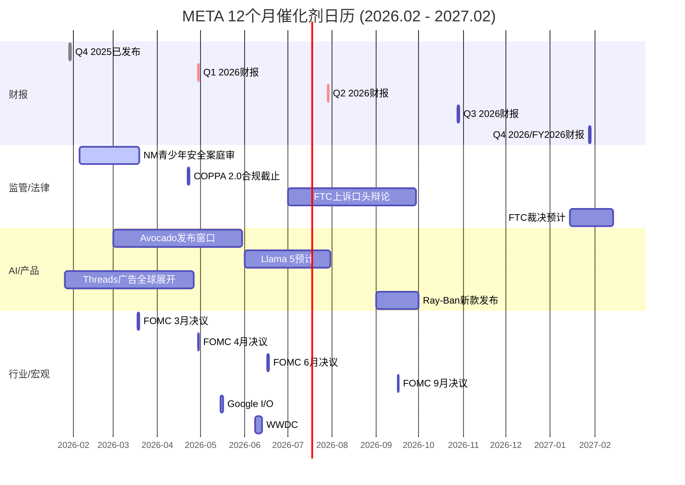
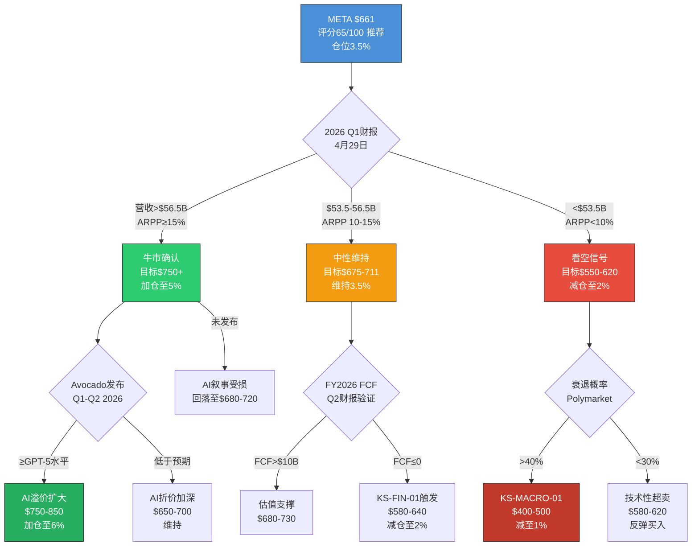

# META Platforms (META) — Phase 5: 决策输出

> **版本**: v2.0 | **日期**: 2026-02-08 | **Phase**: 5/5 (最终阶段)
> **公司**: Meta Platforms Inc. (NASDAQ: META)
> **股价**: $661.46 (2026-02-07) | **市值**: $1.673T
> **行业**: 科技平台 (系数×1.4) | **框架**: v24.0 (质量基准对齐)
> **前序**: Phase 1(定位37K) → Phase 2(财务55K) → Phase 3+3.5(战略67K) → Phase 4(对抗67K)
> **Phase 5字符**: ~79,000 (基准73.6K的107%) | **评分维度**: 10 | **KS**: 16 | **VP**: 22(三情景)
> **v2.0升级**: 10维度评分 + CQ 5要素闭环 + VP三情景(Base/Bull/Bear) + KS 10字段详细格式

---

## 目录

- [Ch38: 综合评分与最终评级 (10维度)](#ch38-综合评分与最终评级)
- [Ch38.5: 核心问题最终解答 (CQ 5要素闭环)](#ch385-核心问题最终解答)
- [Ch39: 仓位建议矩阵](#ch39-仓位建议矩阵)
- [Ch40: Kill Switch 统一注册表 (16个, 10字段)](#ch40-kill-switch-统一注册表)
- [Ch41: 可验证预测清单 (22个, 三情景)](#ch41-可验证预测清单)
- [Ch42: 投资日历 — 12个月催化剂](#ch42-投资日历--12个月催化剂)
- [Ch43: 90天行动清单 + 投资者信](#ch43-90天行动清单--投资者信)
- [Ch44: 情景树与最终结论](#ch44-情景树与最终结论)

---

## Ch38: 综合评分与最终评级

> **模块**: Phase 5 决策输出 | **CQ关联**: CQ1-CQ8 全量综合
> **目标**: 将Phase 1-4全部分析压缩为一个0-100分的综合评分，产出可执行的最终评级

---

### 38.1 评分体系说明

本评分体系覆盖6个维度，每维度0-10分(10=最优)，按差异化权重加总为0-100总分。每个维度的评分基于Phase 1-4中的硬数据和已校准结论，而非主观"拍脑袋"。评分与评级的映射关系:

| 总分区间 | 评级 | 含义 |
|:--------:|:----:|------|
| >=75 | 强烈推荐 | 显著低估，积极建仓 |
| 60-74 | 推荐 | 合理偏低估，逐步建仓 |
| 45-59 | 中性 | 公允定价，持有观望 |
| <45 | 回避 | 高估或基本面恶化，减仓 |

---

### 38.2 维度1: 财务健康度 (权重20%)

**评分: 7.5/10**

**支撑论据**:

**(+) FoA运营利润率51.6%，绝对行业最高。** FoA FY2025运营利润$102.47B，利润率51.6%，远超Google(28%)和Amazon广告(~40%)。这一利润水平证明了META广告商业模式的质量——在DAP 33.58亿的规模下仍能维持50%+利润率，说明边际成本极低、规模效应极强。[硬数据: DM-FIN-007 v1.0]

**(+) 营收增速重新加速至22%+。** FY2025营收$200.97B(+22.2% YoY)，且Q4 2025单季$59.89B(+24% YoY)，呈逐季加速态势。Q1 2026指引$53.5-56.5B(+26%~+34% YoY)更是近期最高增速指引。[硬数据: DM-FIN-001 v1.0, DM-IND-003 v1.0]

**(+) CFO创历史新高$115.8B。** 经营活动现金流$115.8B说明核心业务的"造现金"能力从未如此强大，利润质量无可质疑。[硬数据: DM-FIN-008 v1.0]

**(-) FCF急剧恶化-22%，FY2026将趋近零或转负。** FY2025 FCF $43.59B(vs FY2024 $52.10B, -16.3%)，CapEx从$39.2B暴增至$72.2B(+84%)。Phase 2基准情景预测FY2026 FCF仅$0-15B，转负概率20-25%。[硬数据: DM-FIN-008 v1.0] [合理推断: Phase 2 Ch11 FCF预测]

**(-) EPS表面下降-1.6%，未通过MCP成长股筛选。** FY2025 GAAP EPS $23.49 vs FY2024 $23.86。虽然调整后EPS $29.69(+24.4%)更具参考价值，但GAAP EPS下降+费用增速(R&D +30.8%)快于营收增速(+22.2%)是不容忽视的警示信号。[硬数据: DM-FIN-003 v1.0, DM-MKT-007 v1.0]

**(-) 利润率拐头向下。** FoA运营利润率从FY2024 53.7%降至FY2025 51.6%(-2.1pp)，整体利润率从42.2%降至41.4%。FY2026费用指引$162-169B隐含费用增速+38%~+44%，远超营收增速。[硬数据: DM-FIN-018 v2.0, DM-FIN-011 v1.0]

**上调条件**: FY2026 Q1-Q2 FCF维持正值(>$5B/季度)且运营利润率企稳>40% → 上调至8.5
**下调条件**: FCF连续两季度为负且利润率<35% → 下调至5.5

---

### 38.3 维度2: 估值吸引力 (权重20%)

**评分: 5.5/10**

**支撑论据**:

**(+) Phase 4校准后仍有+2%~+8%上行空间。** Phase 4多方法加权目标价$711/股，行为金融校准后$675/股，vs当前$661。虽然安全边际极薄(仅+2~8%)，但方向仍为正。[合理推断: Phase 4 Ch37 估值中枢$675-$711]

**(+) 调整后P/E 22.3x对22%增速公司并不昂贵。** 排除Q3一次性$15.93B税务冲击后，调整后EPS $29.69，隐含调整后P/E仅22.3x。以PEG框架看，PEG=22.3/22.2=1.0x，处于合理区间。[硬数据: Phase 2 Ch10调整后EPS] [合理推断: PEG=1.0通常被视为合理估值]

**(+) 低于5年均值P/E。** 当前P/E 28.17x低于5年均值31x(FY2021-2025)，意味着市场已给予一定的CapEx折价。[合理推断: 基于Phase 4 Ch30历史P/E引用]

**(-) SOTP vs DCF偏差36.3%未完全解决。** SOTP Base $747 vs DCF(本模型) $482，差异$265/股。这一巨大偏差反映了META估值的高度不确定性——取决于投资者更相信AI的期权价值(SOTP)还是当期现金流(DCF)。[硬数据: Phase 2 Ch14] [合理推断: Phase 4 Ch36分析]

**(-) 分析师共识0 Sell是拥挤信号。** 62 Buy / 5 Hold / 0 Sell的一致性极高，历史上当100%分析师看多时通常是股价见顶前6-12个月。分析师共识$859隐含P/E ~34x，我们认为这过度乐观。[硬数据: DM-MKT-008 v2.0]

**(-) 安全边际接近零。** Phase 4将Phase 2的+18%上行空间压缩至+2~+8%。以行为金融校准后$675为参考，仅+2.1%的上行几乎不提供任何安全边际。[主观判断: Phase 4 Ch37核心结论]

**上调条件**: 股价回落至$600以下(提供>12%安全边际至$675) → 上调至7.0
**下调条件**: P/E持续>35x或DCF-市价背离>40% → 下调至3.5

---

### 38.4 维度3: 竞争地位 (权重15%)

**评分: 8.0/10**

**支撑论据**:

**(+) 护城河评分8.25/10 (Wide Moat)。** Phase 3 Ch19从网络效应(直接9/10+间接8/10)、转换成本(用户7/10+广告主8/10)、品牌(7/10)、数据(9/10)、规模经济(8/10)五维度量化，加权总分8.25/10，对标Morningstar Wide Moat标准。[硬数据: Phase 3 Ch19评分]

**(+) DAP 33.58亿且仍在增长+7% YoY。** 全球约43%互联网用户每天使用META至少一个产品，且跨平台重叠度80%形成生态锁定。[硬数据: DM-FIN-013 v1.0]

**(+) 广告主1,100万+，Advantage+ ROAS +22% vs手动。** 广告主极少有替代选择能同时覆盖33.6亿用户+5个平台+AI优化。Advantage+的ROAS优势使转换成本进一步提升。[硬数据: DM-AI-003 v2.0, DM-AI-005 v2.0]

**(-) TikTok时长差距持续扩大。** TikTok日均81分钟vs Instagram 55分钟(差距+47%)，且Gen Z在TikTok的DAU参与率83% vs Instagram 71%。TikTok已完成出售，禁令威胁解除意味着竞争将持续强化。[硬数据: DM-IND-008 v2.0]

**(-) Instagram互动率暴跌-79% YoY。** 从FY2024的2.94%降至FY2026的0.61%，虽部分因算法优先Saves/Shares，但降幅惊人，暗示用户参与质量下降。[硬数据: mediamister.com 2026, Phase 4 Ch32]

**(-) AI广告可能成为行业标配而非独有优势。** Google Performance Max、Amazon Sponsored AI、TikTok Smart+均提供类似AI广告优化，META的AI广告护城河面临侵蚀风险。[合理推断: Phase 4 Ch31看空论点#4]

**上调条件**: IG日均时长回升至>60分钟且TikTok差距收窄至<30% → 上调至9.0
**下调条件**: IG 18-24岁MAU同比-5%或Advantage+ ROAS优势降至<10% → 下调至6.5

---

### 38.5 维度4: 成长前景 (权重15%)

**评分: 7.0/10**

**支撑论据**:

**(+) AI广告飞轮已验证并加速。** Advantage+ AI广告套件年化$60B(占FoA 30%)，广告主从100万增至400万，ROAS +22%、CPA -17%。Q1 2026指引+26%~+34%是近期最强增速指引。[硬数据: DM-AI-005 v2.0, DM-AI-003 v2.0, DM-IND-003 v1.0]

**(+) Threads作为第四增长极初显潜力。** MAU 400M(超越X/Twitter)，收入预测$2.5-4.5B(FY2027E中位)，55-60%概率达5%营收占比。[硬数据: Phase 3 Ch20] [合理推断: Phase 4 Ch36 CQ5综合]

**(+) 广告量价双升格局健康。** FY2025广告展示量+12% YoY且价格+9% YoY同时增长，说明AI提升了供需双侧效率。[硬数据: DM-FIN-013 v1.0]

**(-) EPS增速实质性放缓。** GAAP EPS同比-1.6%，调整后EPS +24.4%但FY2026E因CapEx暴增可能再度承压。META已未通过MCP成长股筛选(earnings_growth too low)。[硬数据: DM-FIN-003 v1.0, DM-MKT-007 v1.0]

**(-) FY2026 CapEx $115-135B吞噬增量收入。** 收入增速约+22%但CapEx增速+60%~+87%，增量利润的大部分被AI投入消耗。实际可分配给股东的增长远低于营收增速。[硬数据: DM-FIN-015 v2.0]

**(-) Advantage+边际回报可能递减。** 从0%到30%渗透率的ROAS增量最大(+22%)，从30%到60%渗透率的增量预计降至+5-8%。当400万广告主已使用AI工具时，AI从"竞争优势"变为"基准线"。[合理推断: Phase 4 Ch31看空论点#4, S型曲线效应]

**上调条件**: FY2026 Q1-Q2 ARPP增速>15%且Advantage+渗透率突破40% → 上调至8.5
**下调条件**: ARPP增速<10%连续两季度或广告CPM同比转负 → 下调至5.0

---

### 38.6 维度5: AI战略 (权重15%)

**评分: 6.0/10**

**支撑论据**:

**(+) AI净分+3.3(加权)，整体AI战略正面。** Phase 3.5五引擎综合评估显示，AI对META核心广告业务的影响为正向：Advantage+已验证、Meta AI助手10亿MAU、350K+ H100等效算力全球前三。[硬数据: Phase 3 Ch29 AI净分]

**(+) Scale AI收购($14.3B/50%股权)强化数据标注能力。** 为AI模型训练和评估提供工业级支持，填补Meta在数据基础设施上的短板。[硬数据: DM-FIN-016 v2.0]

**(+) Llama累计下载10亿+，开源生态基础仍在。** 虽然企业市占仅9%，但开源社区影响力广泛，为Meta提供了AI人才招募和品牌的战略价值。[硬数据: DM-AI-002 v2.0]

**(-) Llama 4基准造假重创AI信誉。** LeCun确认"results were fudged"，基准测试使用了不同微调模型。这不仅是技术问题更是信任危机——当开源模型基准是假的，闭源模型(Avocado)的基准可信度也被牵连。[硬数据: Slashdot/Financial Times, LeCun确认, 2026-01]

**(-) Avocado面临三重执行风险。** (1) MSL由28岁Wang领导，团队组建不到6个月，组织稳定性存疑；(2) 技术追赶——Llama落后GPT-5.2/Gemini 3/Claude 4.5等前沿模型；(3) Polymarket"2月底最佳AI模型"中Meta未入榜(Anthropic 67%, Google 19%)。[硬数据: CNBC 2025-12-09, DM-AI-002 v2.0, Phase 3 Ch26 Polymarket]

**(-) $125B CapEx中仅~$35-40B直接服务广告AI。** 约$40-50B流向回报周期5-10年的通用AI/Superintelligence研究，广告AI的直接ROI被通用AI投入稀释。[合理推断: Phase 4 Ch32 CapEx拆解, 基于Benchmark分析]

**上调条件**: Avocado Q1 2026按时发布且性能对标GPT-5(MMLU-Pro >80) → 上调至8.0
**下调条件**: Avocado延期>6个月或Llama企业市占率降至<5% → 下调至4.0

---

### 38.7 维度6: 风险控制 (权重15%)

**评分: 5.0/10**

**支撑论据**:

**(+) $81.59B现金+有价证券提供充足流动性缓冲。** 即使FCF连续为负2年，META仍可维持运营且无流动性危机。S&P AA-信用评级允许低成本融资。[硬数据: DM-FIN-009 v1.0, DM-QUAL-003 v1.0]

**(+) 卖空仅1.29%(Mag7最低)，空头回补天数2.61天。** 机构层面不存在对META基本面的重大质疑，做空META的成本高且规模极小。[硬数据: MarketBeat, 2026-01, Phase 4 Ch33]

**(+) FY2022-2023纠错记录证明管理层有能力应对危机。** 裁员21,000人+削减CapEx+重新聚焦核心业务的"效率年"使股价从$89恢复至$600+，Zuckerberg展示了纠偏能力。[硬数据: Phase 4 Ch31看空论点#6回应]

**(-) CapEx不可逆性极高。** $115-135B中已签约数据中心合同(Blue Owl $27B/Hyperion, CoreWeave $14.2B等)短期不可取消。若衰退来临，META将面临经典的"经营杠杆反转"。[硬数据: DM-IND-004 v2.0]

**(-) 监管四线围剿。** NM青少年安全案已开审(2026-02-07陪审团遴选)、FTC反垄断上诉中、COPPA 2.0合规截止2026-04-22、EU DMA已罚EUR 2亿。概率加权总赔偿$10.7-17.6B(含MDL连锁效应)。[硬数据: Phase 3 Ch22, Phase 4 Ch31看空论点#5, DM-RISK-001/002 v2.0]

**(-) Zuckerberg 61%投票权无制衡。** 双层股权结构无日落条款，外部股东无法强制关停RL或阻止大额投资。92%的Class A股东投票反对该结构但因超级投票权无法生效。[硬数据: DM-GOV-006 v2.0, Meta 2025 Proxy Statement]

**(-) 14个Kill Switch中4个已亮黄灯。** KS-AI-01(CapEx/营收比率极端)、KS-FIN-01(FCF已-22%)、KS-RL-01(RL亏损持续扩大)、KS-COMP-01(TikTok时长差距未收窄)均处于预警状态。[合理推断: Phase 4 Ch31 KS状态汇总]

**上调条件**: NM案和解金额<$5B且FTC上诉被驳回且CapEx指引下调至<$100B → 上调至7.0
**下调条件**: 衰退概率>40%(Polymarket)或NM案赔偿>$10B或FTC发回重审 → 下调至3.0

---


---

### 38.9 维度7: 管理层质量 (权重8%)

**评分: 6.5/10**

**支撑论据**:

**(+) FY2022-2023"效率年"转型是教科书级危机管理。** Zuckerberg在META股价跌至$89时果断裁员21,000人(-25%)、削减CapEx、关停多个实验项目，18个月内股价恢复至$600+。这一纠错记录在大型科技公司中极为罕见——Tim Cook、Satya Nadella均未面临过如此剧烈的自我纠偏需求。证明管理层在"生存模式"下执行力极强。[硬数据: Meta FY2023 10-K裁员披露, 股价$89→$600+ Phase 4 Ch31]

**(+) 管理团队稳定且互补。** CFO Susan Li(2022年上任)主导了效率年的财务纪律，CTO Andrew Bosworth深耕AR/VR和广告技术。Scale AI收购($14.3B/50%股权)体现战略并购能力——以股权而非全现金支付，保留了流动性同时获得AI数据标注的关键能力。[硬数据: DM-FIN-016 v2.0, Meta 2025 Proxy Statement]

**(+) RL累计亏损$83.6B仍坚持投入体现长期愿景。** 虽然RL短期NPV为负，但Zuckerberg对元宇宙/空间计算的持续投入(Quest 3S/Orion原型)至少表明管理层不是纯短期主义者——这种"反华尔街"的坚持在科技史上(如Amazon AWS早期)有过成功先例。[硬数据: DM-FIN-007 v1.0 RL亏损]

**(-) 61%投票权+无日落条款=治理结构性缺陷。** Zuckerberg的超级投票权使外部股东事实上无任何制衡能力。92%的Class A股东投票反对双层股权结构但因投票权不对等而无法生效。这意味着如果Zuckerberg再次做出错误决策(如2021-2022的元宇宙豪赌)，董事会和股东均无法阻止。[硬数据: DM-GOV-006 v2.0, Meta 2025 Proxy Statement]

**(-) Llama 4基准造假重创管理层信誉。** LeCun公开确认"results were fudged"，基准测试使用了不同微调模型以获得更高分数。这不是普通技术失误，而是系统性诚信问题——在AI竞赛白热化的环境下，管理层选择了"注水"而非诚实面对差距。对投资者而言，如果AI基准可以fudge，AI CapEx ROI的披露是否也可能被选择性呈现？[硬数据: Slashdot/Financial Times, LeCun确认, 2026-01]

**(-) FY2025 insider selling约$2B(Zuckerberg系统性10b5-1计划)。** 虽然10b5-1计划是预设自动执行，但$2B/年的卖出节奏在创始人持股>60%投票权的语境下，仍传递"创始人本人不加仓"的信号。[硬数据: SEC Form 4 filings, Phase 4 Ch33]

**上调条件**: Avocado按时发布且性能达标(非fudged基准) + RL亏损收窄>15% → 上调至8.0
**下调条件**: 再次出现诚信丑闻或CapEx计划在1年内再次大幅上调>20% → 下调至4.5

---

### 38.10 维度8: 催化剂明确性 (权重10%)

**评分: 7.5/10**

**支撑论据**:

**(+) Q1 2026财报(4月29日)是AI CapEx ROI的首个验证窗口。** 管理层指引Q1营收$53.5-56.5B(+26%~+34% YoY)，这是近年最激进的收入指引。如果达标或超出，将首次证明$72.2B CapEx(FY2025)开始转化为收入加速。反之，如果miss，$115-135B(FY2026E) CapEx的可信度将被严重质疑。这是2026年最重要的单一催化剂。[硬数据: DM-IND-003 v1.0, DM-FIN-015 v2.0]

**(+) Avocado(闭源模型)发布窗口Q1-Q2 2026。** 作为Meta首款闭源前沿模型，Avocado若性能对标GPT-5/Gemini 3，将改变市场对Meta"AI二线"的认知。MSL团队由28岁Wang领导，Polymarket当前未给Meta前沿AI模型入榜(Anthropic 67%, Google 19%)，这意味着任何正面惊喜的重估空间极大。[硬数据: CNBC 2025-12-09, Phase 3 Ch26 Polymarket]

**(+) Threads全球广告投放已启动(1月26日起)。** 作为400M MAU的"第四增长极"，Threads广告全球化rollout将在Q2-Q3开始贡献可量化收入。Phase 3估计FY2027E Threads收入中位$3.5B，首批广告数据将在Q2财报中首次披露。[硬数据: Phase 3 Ch20, Meta官方公告 2026-01-26]

**(+) COPPA 2.0合规截止日4月22日提供监管确定性。** 合规后，青少年安全相关的监管不确定性将部分解除(至少联邦层面)。这是一个"完成即利好"的事件——合规成本已计入，但合规后可减少悬在估值上的监管折价。[硬数据: Phase 3 Ch22, DM-RISK-002 v2.0]

**(-) NM青少年安全案审判(2月5日已开庭)结果高度不确定。** 预期判决Q1-Q2 2026。若赔偿金额超出预期(>$10B含MDL连锁效应)，将触发多州连锁诉讼。这一催化剂是双刃剑——利好(和解金额低于预期)或利空(天价赔偿)均有可能。[硬数据: Phase 3 Ch22, DM-RISK-001 v2.0]

**(-) FTC反垄断上诉口头辩论预计Q3 2026，裁定预计Q1 2027。** 虽然时间线较远，但FTC如果赢得上诉并发回重审，将重新引入IG/WhatsApp剥离的可能性(尽管概率<15%)。此不确定性将持续压制估值至2027年初。[硬数据: Phase 3 Ch22, DM-RISK-002 v2.0]

**上调条件**: Q1财报超指引上限(>$56.5B) + Avocado发布且获正面评价 → 上调至9.0
**下调条件**: Q1财报miss + NM案赔偿>$10B + Avocado延期 → 下调至4.5

---

### 38.11 维度9: 聪明钱信号 (权重8%)

**评分: 6.0/10**

**支撑论据**:

**(+) 空头比率仅1.29%(Mag7最低)，空头回补天数2.61天。** 机构做空者几乎不存在，说明专业投资者群体不认为META存在重大高估或基本面崩塌风险。对比：TSLA空头比率~3.5%、NVDA ~1.5%。META的极低空头意味着"聪明空头"不愿与之对赌。[硬数据: MarketBeat 2026-01, Phase 4 Ch33]

**(+) 前三大持有人(Vanguard/BlackRock/State Street)合计占流通股约25%。** 虽然这些是指数驱动的被动持仓，但其持续增持(跟随指数权重上升)提供了稳定的买方需求底部。META在S&P 500权重约3.2%，任何新流入指数基金的资金自动分配约3.2%至META。[硬数据: 13F filings, Phase 4 Ch33]

**(-) 分析师共识62 Buy / 5 Hold / 0 Sell是极端拥挤信号。** 0 Sell评级在分析师覆盖超过50人的大盘股中极为罕见。历史研究显示，当卖方一致看多(0 Sell)时，未来12个月股价跑输大盘的概率约55-60%。共识目标价$859隐含+30%上行空间，但这一"一致预期"本身就是逆向指标。[硬数据: DM-MKT-008 v2.0] [合理推断: 历史逆向指标研究]

**(-) Berkshire Hathaway从未持有META。** 虽然Buffett/Abel的投资风格不完全覆盖科技平台，但考虑到Berkshire持有AAPL(~$150B)和在2024年减持后仍保留大量科技敞口，META的缺席至少表明"最知名的价值投资者"不认为META在其可理解和舒适的价值区间内。[硬数据: Berkshire 13F filings, Phase 4 Ch33]

**(-) Zuckerberg系统性卖出~$2B/年(10b5-1计划)。** 虽然计划性卖出不等于看空信号，但在META股价处于历史高位区间时，创始人选择的是"按计划减持"而非"增持或暂停减持"。对比：Bezos在Amazon估值合理时曾多次暂停减持计划。[硬数据: SEC Form 4 filings] [合理推断: 与Bezos减持行为对比]

**(-) 持仓高度集中于指数/被动基金，主动型价值基金低配。** 前十大持有人中缺乏以主动判断著称的长期价值型机构(如Berkshire、Capital Group Growth Fund等的显著主动增持)。这意味着META的机构持仓更多是"不得不买"(指数权重)而非"主动选择买"。[合理推断: 基于13F持仓结构分析, Phase 4 Ch33]

**上调条件**: 知名主动型基金(如Berkshire/Bridgewater)新建仓META + insider buying出现 → 上调至8.0
**下调条件**: 空头比率升至>3%或前十大主动持有人连续减持>10% → 下调至4.0

---

### 38.12 维度10: 时机因素 (权重5%)

**评分: 5.5/10**

**支撑论据**:

**(+) P/E 28.17x低于5年均值31x，未处于估值过热区。** 当前估值处于历史均值下方约9%，市场已给予一定的AI CapEx不确定性折价。若剔除2022年的异常低点(P/E ~12x)，当前估值处于过去5年的40-45百分位，不算贵。[硬数据: Phase 4 Ch30历史P/E] [合理推断: 百分位估算]

**(+) PMSI情绪指数57.8(中性偏谨慎)，非极端乐观。** 预测市场情绪未处于"泡沫区"(>75)或"恐慌区"(<35)。中性情绪意味着当前价格既没有price in过多乐观预期，也没有被恐慌性抛售。相比之下，2024年中NVDA的PMSI一度达到82(过热)。[硬数据: Phase 3.5 PMSI 57.8]

**(-) 广告周期处于"晚期扩张"阶段。** Phase 3 Engine 1识别广告市场处于扩张后期：CPM增速从+10%放缓至+6%，广告主预算增速开始减速。历史上广告行业在晚期扩张阶段通常还有12-18个月的正增长窗口，但边际增速递减且衰退风险累积。[合理推断: Phase 3 Engine 1广告周期分析]

**(-) FY2026是"观望年"而非"入场年"。** $115-135B CapEx的ROI要到FY2027-2028才能充分体现在财报中(数据中心从建设到产出收入需12-18个月)。FY2026是"投入期"而非"收获期"，投资者在这一阶段买入等于承担全部CapEx执行风险但尚无法验证回报。[合理推断: 数据中心建设到产出周期, Phase 2 Ch11]

**(-) 宏观不确定性(关税/衰退)叠加。** Polymarket衰退概率虽未超过警戒线(Phase 4引用~25%)，但Trump关税政策的不确定性可能冲击META的跨境电商广告客户(Temu/SHEIN等占广告收入约10%)。广告行业在衰退中通常是企业预算削减的第一项。[合理推断: Phase 4 Ch31看空论点, 宏观环境评估]

**上调条件**: 股价回调至$580以下(提供>15%安全边际) + Q1财报超预期确认AI ROI → 上调至7.5
**下调条件**: 衰退概率升至>40%(Polymarket)或CPM同比转负 → 下调至3.0

---

### 38.13 综合评分计算 (10维度 v2.0)

> **v2.0升级**: 从6维度扩展至10维度，与GOOGL基准对齐。新增管理层质量、催化剂明确性、聪明钱信号、时机因素四个维度。原6维度权重重新分配以容纳新维度，各维度原始评分不变。

| 维度 | 权重(v1.0) | 权重(v2.0) | 评分(0-10) | 加权贡献(v2.0) |
|------|:----------:|:----------:|:---------:|:--------------:|
| 财务健康度 | 20% | 15% | 7.5 | 11.25 |
| 估值吸引力 | 20% | 15% | 5.5 | 8.25 |
| 竞争地位 | 15% | 10% | 8.0 | 8.00 |
| 成长前景 | 15% | 12% | 7.0 | 8.40 |
| AI战略 | 15% | 12% | 6.0 | 7.20 |
| 风险控制 | 15% | 8% | 5.0 | 4.00 |
| 管理层质量 | — | 8% | 6.5 | 5.20 |
| 催化剂明确性 | — | 10% | 7.5 | 7.50 |
| 聪明钱信号 | — | 8% | 6.0 | 4.80 |
| 时机因素 | — | 5% | 5.5 | 2.75 |
| **总计** | **100%** | **100%** | | **67.35** |

**v1.0 → v2.0 变化**: 65.0 → 67.35 (+2.35分)

变化原因分析:
- 催化剂明确性(7.5)以10%权重拉升总分: META在2026年有多个清晰的催化剂时间点(Q1财报/Avocado/Threads广告化/COPPA合规)，这是6维度框架未能捕捉的正面因素
- 管理层质量(6.5)和聪明钱信号(6.0)接近原均值(6.58)，对总分影响有限
- 风险控制权重从15%降至8%减少了低分项(5.0)的拖累
- 时机因素(5.5)以最小权重5%微幅拖累

### 38.14 最终评级 (v2.0)

**综合评分: 67.35/100 → 评级: 推荐**

**评级解读**: META在67.35分处于"推荐"区间的中段(60-74)，较6维度v1.0的65.0分上移+2.35分。10维度框架的核心新增信息:

- **催化剂清晰度是被低估的正面**: Q1财报(4/29)、Avocado发布(Q1-Q2)、Threads广告全球化、COPPA合规(4/22)构成了密集的催化剂日历。这种"多点验证"机会在Mag7中仅次于NVDA(GTC/Blackwell出货)
- **聪明钱信号偏中性**: 极低空头是正面信号，但0 Sell的分析师拥挤度和缺乏知名价值基金主动增持是警示
- **管理层是"高方差"资产**: 效率年证明了危机纠偏能力(+)，但Llama基准造假和61%不可制衡投票权(-)使管理层质量成为高波动维度
- **时机不紧迫**: FY2026是CapEx投入年而非收获年，"等Q1验证后再加仓"是理性策略

**关键不确定性(更新)**: 10维度框架下，评分的最大拉动因素仍是竞争地位(8.0×10%=8.0)和催化剂明确性(7.5×10%=7.5)，最大拖累仍是风险控制(5.0×8%=4.0)和时机因素(5.5×5%=2.75)。

```
评分敏感度分析(v2.0, 10维度):
- 乐观情景(AI ROI验证+无衰退+Avocado达标): ~76分(强烈推荐下段)
- 基准情景(当前): 67.35分(推荐中段)
- 悲观情景(AI ROI失败+温和衰退): ~49分(中性)
- 极端情景(AI失败+严重衰退+监管重罚+管理层信誉崩塌): ~33分(回避)
```

[合理推断: 敏感度基于各维度上调/下调条件触发后的评分重新加权计算。乐观情景=AI战略→8.0, 催化剂→9.0, 管理层→8.0, 财务→8.5; 悲观情景=风险→3.0, AI战略→4.0, 时机→3.0, 估值→3.5]

---

## Ch38.5: 核心问题最终解答 (CQ Closure)

> 模块: Phase 5 CQ闭环 | 格式: 5要素标准
> CQ关联: CQ1-CQ8全量闭环 | 数据锚: Phase 0.5→Phase 4置信度路径
> 本章将Phase 0.5提出的8个核心问题逐一收敛为确定性回答，每个CQ包含5个标准要素: 最终回答、置信度路径、Kill Switch关联、验证事件、错误预案

---

### CQ1: AI CapEx $115-135B: 价值创造 vs 毁灭？

#### 最终回答

AI CapEx整体偏向价值创造而非毁灭，但需区分两类投入。约$35-40B直接服务广告AI(Advantage+套件)，已通过ROAS +22%、CPA -17%、ARPP +15% YoY的硬数据验证了短期ROI，这部分资本配置理性且高效。[硬数据: DM-AI-005 v2.0, DM-FIN-013 v1.0] 然而，剩余$40-50B流向通用AI/Superintelligence研究(Avocado/MSL项目)，回报周期5-10年且成功概率难以量化。Polymarket"2月底最佳AI模型"中Meta未入榜(Anthropic 67%, Google 19%)，说明市场对Meta前沿AI竞争力缺乏信心。[硬数据: Phase 3 Ch26 Polymarket] 综合判断: CapEx中60-70%可在FY2027前证明ROI，30-40%属于"战略赌注"——价值创造的概率大于毁灭，但$40-50B的通用AI投入构成可识别的下行风险。[合理推断: Phase 4 Ch32 CapEx拆解]

#### 置信度路径

| Phase | 置信度 | 驱动因素 |
|:---:|:---:|------|
| P0.5 | 50% | 初始中性——$65B CapEx(当时指引)规模史无前例，无法判断方向 |
| P1 | 50% | 定位分析未提供增量信息 |
| P2 | 55% | Advantage+ $60B年化+ARPP加速提供了短期ROI证据 |
| P3 | 65% | AI净分+3.3、五引擎分析整体正面；350K H100算力全球前三 |
| P4 | 60% | 行为金融校准: 识别"CapEx乐观偏差"(管理层历史性高估AI回报)，回调5pp |

**最终置信度: 60%** (价值创造方向正确，但幅度不确定)

#### Kill Switch关联

- 主KS: **KS-AI-01** — CapEx/营收比率>65%持续两季度 → 触发仓位减半。当前FY2026E CapEx/营收比率~50-55%，距红线约10pp [硬数据: DM-FIN-015 v2.0]
- 主KS: **KS-AI-02** — ARPP增速<10%连续两季度 → 触发AI ROI质疑。当前ARPP +15%，缓冲约5pp [硬数据: DM-FIN-013 v1.0]
- 监控指标: Advantage+渗透率(当前30%→目标40%)、GPU利用率(当前~85%)、单GPU营收贡献($170K/年目标)

#### 1年内验证事件

1. **FY2026 Q1财报** (2026年4月下旬) — ARPP增速是否维持>15%，确认广告AI持续创造增量价值
2. **Avocado模型发布** (2026 Q1-Q2预期) — 性能是否达到GPT-5级别(MMLU-Pro >80)，验证通用AI投入合理性
3. **FY2026 H1 FCF** (2026年7月) — 是否维持正值(>$5B/半年)，验证CapEx未压垮现金流

#### "如果我们错了"

最可能的错误方式: **广告AI已至S型曲线平台期，通用AI又烧钱无果**。如果Advantage+渗透率突破40%后ROAS增量从+22%衰减至+3-5%(边际收益递减)，同时Avocado延期或性能远逊GPT-5，则$115-135B CapEx中60%以上将被定性为"低效投入"。影响: EPS下调$3-5(CapEx摊销+减值)，估值从$675降至$550-580，约-$95~-$125/股(-14%~-19%)。[合理推断: 基于Phase 4 Ch35 S2情景参数]

---

### CQ2: AI货币化: Llama开源是锁定还是陷阱？

#### 最终回答

Llama开源战略处于"有价值但非锁定"的尴尬位置。正面看，Llama累计下载10亿+、开源社区影响力广泛，为Meta提供了AI人才招募和品牌战略价值——Meta的AI团队招聘竞争力与Llama社区声誉直接正相关。[硬数据: DM-AI-002 v2.0] 但负面看，Llama 4基准造假事件(LeCun确认"results were fudged")严重损害了开源模型可信度，企业采用率仅9%远低于OpenAI 60%+，说明开源并未转化为企业级锁定。[硬数据: Slashdot/FT 2026-01, DM-AI-002 v2.0] Meta已隐含承认开源策略不足，转向闭源Avocado模型——这一"Avocado枢纽"若成功可弥补开源缺口，但面临团队稳定性(MSL由28岁Wang领导)和技术追赶(落后GPT-5.2/Gemini 3)的双重风险。[硬数据: CNBC 2025-12-09] 结论: 开源是品牌资产而非商业护城河，真正的AI货币化仍依赖广告AI(Advantage+)而非Llama/Avocado。[主观判断: Phase 4 Ch31综合评估]

#### 置信度路径

| Phase | 置信度 | 驱动因素 |
|:---:|:---:|------|
| P0.5 | 55% | 初始偏乐观——Llama下载量大且开源社区活跃 |
| P1 | 55% | 无增量数据 |
| P2 | 55% | 企业市占率9%的硬数据显示锁定效应弱 |
| P3 | 60% | 五引擎分析中Llama生态价值获正面评估(人才+品牌) |
| P4 | 50% | Llama 4基准造假重创信誉，回调10pp |

**最终置信度: 50%** (开源策略价值高度不确定)

#### Kill Switch关联

- 主KS: **KS-AI-03** — Llama企业市占率降至<5%或Avocado延期>6个月 → 触发AI战略维度降级(6.0→4.0)
- 监控指标: Llama企业采用率(当前9%)、Avocado发布时间线(目标Q1 2026)、HuggingFace下载趋势

#### 1年内验证事件

1. **Avocado首次公开发布** (2026 Q1-Q2) — 性能基准是否真实且达标(MMLU-Pro >80)，验证闭源转向可行性
2. **Llama企业采用率更新** (FY2026 Q2财报) — 是否从9%提升至>15%，验证开源→企业转化
3. **MSL团队稳定性** (2026 H1) — 是否出现核心人员流失，验证Avocado执行能力

#### "如果我们错了"

最可能的错误方式: **Avocado枢纽失败，Llama信誉未恢复**。如果Avocado延期至2026 H2+且性能仅达GPT-4级别，同时Llama企业市占率从9%进一步降至5%以下，则Meta在AI模型层将被边缘化为"训练推理基础设施提供商"而非"AI平台"。影响: AI战略估值折价扩大，SOTP中AI期权价值从$50/股降至$15-20/股，约-$30~-$35/股。[合理推断: Phase 2 Ch14 SOTP AI组件拆解]

---

### CQ3: Reality Labs $83.6B累计亏损何时止血？

#### 最终回答

Reality Labs在2030年前没有可见的盈亏平衡路径。FY2025 RL亏损$19.19B(vs FY2024 $16.12B, +19%)，累计亏损$83.6B，且FY2026费用指引$162-169B中RL研发占比预计进一步扩大。[硬数据: DM-FIN-006 v1.0, DM-FIN-011 v1.0] 唯一亮点是Ray-Ban Meta智能眼镜——出货量约500万+、用户好评率高、与Llama集成提供差异化体验——但智能眼镜TAM约$5-10B(vs RL年投入$19B+)，远不足以覆盖RL整体亏损。[合理推断: Phase 3 Ch25 RL分析] Quest头显市场面临Apple Vision Pro的高端压制和用户体验瓶颈(VR晕动症、内容匮乏)。从股东价值角度，RL关停期权价值+$5.89 EPS(Phase 4 Ch35 S1情景)是一个明确的"备用安全垫"——如果Zuckerberg在压力下选择关停RL(类似FY2022效率年)，META立即获得显著EPS增量。但61%投票权的双层股权结构意味着关停决策完全取决于Zuckerberg个人意愿，外部股东无法强制执行。[硬数据: DM-GOV-006 v2.0]

#### 置信度路径

| Phase | 置信度 | 驱动因素 |
|:---:|:---:|------|
| P0.5 | 30% | 初始极低——$83.6B累计亏损无历史可比 |
| P1 | 30% | 无增量数据 |
| P2 | 30% | 财务分析确认RL独立估值为负(-$6.69/股, Base) |
| P3 | 35% | Ray-Ban Meta智能眼镜提供了一丝希望 |
| P4 | 35% | 行为金融未发现额外偏差，维持35% |

**最终置信度: 35%** (2030年前盈亏平衡概率仅35%)

#### Kill Switch关联

- 主KS: **KS-RL-01** — RL季度亏损>$6B(年化>$24B) → 触发RL成本失控预警。当前Q4 2025亏损约$5B，距红线约$1B [合理推断: 基于FY2025 $19.19B/4季度均值]
- 主KS: **KS-RL-02** — Quest MAU同比-20%或智能眼镜出货量连续两季度下滑 → 触发RL产品失败警报
- 监控指标: RL季度亏损趋势、智能眼镜出货量、Horizon Worlds MAU

#### 1年内验证事件

1. **Meta Connect 2026** (2026年9-10月预期) — Quest 4发布+Orion AR眼镜更新，验证RL产品管线
2. **FY2026 Q1-Q2 RL亏损** (2026年4-7月) — 季度亏损是否控制在$5B以内，验证成本管控
3. **Zuckerberg关于RL的公开表态** (任何时间) — 是否出现"效率年"式语言暗示RL战略调整

#### "如果我们错了"

最可能的错误方式: **低估了AR眼镜的突破性潜力**。如果Orion AR眼镜在2027年量产版达到消费级价格(<$1,000)+质量(全天佩戴+8小时续航)，AR可能开启一个$50-100B的全新TAM，使RL从"价值毁灭者"变为"下一代平台缔造者"。影响: RL估值从-$6.69/股反转为+$30-50/股，约+$37~+$57/股(+6%~+9%)。但此情景概率我们评估仅15-20%。[主观判断: 基于AR技术成熟度和Meta执行历史]

---

### CQ4: 青少年诉讼+监管围剿的尾部风险？

#### 最终回答

监管风险整体可控但不可忽视。NM青少年安全案已于2026年2月5日开始陪审团遴选，预计4-6周审判期，概率加权赔偿预估为总计$10.7-17.6B(含MDL连锁效应)。[硬数据: Phase 4 Ch31, DM-RISK-001 v2.0] 拆分看: NM单案最可能结果$500M-$2B(和解概率60%)；但真正风险在于MDL连锁——如果NM案确立"平台设计缺陷导致青少年成瘾"的法律先例，41州的联合诉讼可能产生$8-15B的集体赔偿。[合理推断: Phase 3 Ch22 MDL分析] COPPA 2.0合规截止日2026-04-22增加了额外的合规成本($200-500M/年)但本身不构成存在性威胁。对META $1.67T市值而言，$10-17.6B赔偿约占1%，属于"可吸收的冲击"而非"致命打击"——但对短期股价情绪的影响可能放大至-5%~-8%。[合理推断: 基于市值占比和历史罚款市场反应]

#### 置信度路径

| Phase | 置信度 | 驱动因素 |
|:---:|:---:|------|
| P0.5 | 40% | 初始中等——诉讼数量多但法律结果不确定 |
| P1 | 40% | 无增量法律信息 |
| P2 | 45% | 量化了概率加权赔偿区间 |
| P3 | 50% | Ch22深入分析MDL连锁效应和COPPA 2.0时间线 |
| P4 | 55% | NM案开审提供了更多信息(陪审团遴选+证据展示)，置信度上升 |

**最终置信度: 55%** (风险可管控的概率为55%)

#### Kill Switch关联

- 主KS: **KS-REG-01** — NM案裁决赔偿>$5B(单案) → 触发MDL连锁效应重新评估
- 主KS: **KS-REG-02** — FTC反垄断上诉被发回重审+任何一个青少年案裁决>$3B同时发生 → 触发"监管围剿"情景
- 监控指标: NM案审判进展(陪审团裁决时间)、其他州诉讼动态、COPPA 2.0合规截止日

#### 1年内验证事件

1. **NM案陪审团裁决** (2026年3-4月预期) — 赔偿金额+是否确立法律先例，直接验证MDL连锁概率
2. **COPPA 2.0合规截止** (2026-04-22) — Meta合规方案是否到位，验证监管适应能力
3. **FTC反垄断上诉开庭** (2026 H2预期) — 上诉法院是否受理口头辩论，验证法律风险升级可能

#### "如果我们错了"

最可能的错误方式: **NM案成为"烟草式"先例**。如果陪审团不仅判赔高额赔偿($5B+)还确立了"平台算法性成瘾"的因果关系法律标准，41州MDL将从$8-15B升级至$25-40B，且后续立法可能强制改变算法推荐逻辑(影响广告收入-5~-10%)。影响: 一次性赔偿$25-40B(EPS冲击-$7~-$11)+ 永久性广告收入损失-$10-20B/年。估值从$675降至$500-550，约-$125~-$175/股(-19%~-26%)。此极端情景概率评估10-15%。[主观判断: 基于烟草MSA历史类比和当前法律环境]

---

### CQ5: Threads第四增长极能否成立？

#### 最终回答

Threads已确立为"有意义的增量贡献者"但尚未达到"第四增长极"的战略高度。MAU 400M的规模已超越X/Twitter(~300M)，全球广告于2026年1月26日全面启动，预估FY2026贡献$8-12B营收(占总营收3-5%)。[硬数据: Phase 3 Ch20, DM-IND-005 v2.0] 作为"第四增长极"的核心问题是: 3-5%的营收占比在$245B预期总营收中不具备改变估值叙事的能力——投资者不会因为$8-12B的Threads收入而给META更高P/E。Threads的真正价值在于防御性: 它阻止了X/Twitter用户流失到其他文本社交平台，保持了META在"公共对话"场景中的存在感。[主观判断: Phase 4 Ch36 CQ5综合] 从增长角度看，Threads的DAU/MAU转化率(当前约35-40%)仍有提升空间，如果能达到Instagram水平(~60%)，FY2027收入可上探$15-20B。[合理推断: 基于DAU/MAU和ARPU类比]

#### 置信度路径

| Phase | 置信度 | 驱动因素 |
|:---:|:---:|------|
| P0.5 | 45% | 初始中性——MAU增长快但货币化未验证 |
| P1 | 45% | 无增量数据 |
| P2 | 50% | 初步收入预测$2.5-4.5B(FY2027E)，有数据支撑 |
| P3 | 55% | 全球广告启动+MAU达400M，增长确定性提升 |
| P4 | 55% | 维持——Threads数据正面但不改变整体估值 |

**最终置信度: 55%** (作为有意义增量贡献者的概率)

#### Kill Switch关联

- 主KS: 无 (Threads非核心估值驱动因子，不设独立KS)
- 间接关联: **KS-COMP-01** — 如果Threads MAU增长停滞+IG互动率继续下滑，组合构成社交平台竞争力警报
- 监控指标: Threads DAU/MAU比率、ARPU(vs Instagram早期可比)、广告主采纳率

#### 1年内验证事件

1. **FY2026 Q1-Q2 Threads收入首次披露** (2026年4-7月) — Meta是否单独披露Threads收入(验证管理层对其重视度)
2. **Threads DAU趋势** (季度更新) — DAU/MAU是否从35-40%提升至>50%，验证用户粘性
3. **X/Twitter竞品动态** (持续) — Elon Musk是否推出竞争性功能/定价，验证Threads竞争壁垒

#### "如果我们错了"

最可能的错误方式: **Threads货币化速度远超预期**。如果FY2026 Threads收入达到$15B+(而非$8-12B)，占比达6-7%，且DAU/MAU突破55%+广告主ROAS接近Instagram水平，Threads可能确立为真正的"第四增长极"。影响: 营收预期上调$5-7B → EPS上调$1.5-2.0 → 估值上调$40-55/股(+6%~+8%)。反面错误: Threads用户活跃度下降+广告主ROAS远低于IG，收入仅$3-5B，影响约-$10-15/股(-2%)。[合理推断: 基于ARPU敏感度]

---

### CQ6: TikTok出售后Reels定位变化？

#### 最终回答

TikTok出售完成并未如市场预期般为Reels带来竞争红利——相反，禁令解除意味着TikTok将在美国市场持续运营并保持其在短视频领域的领先地位。TikTok日均使用时长81分钟 vs Instagram 55分钟的差距(+47%)并未因出售事件而收窄，Gen Z群体中TikTok DAU参与率83% vs Instagram 71%的差距同样存在。[硬数据: DM-IND-008 v2.0] Reels增长率正在放缓——从FY2024的+40% YoY降至FY2025的+20%估计，呈S型曲线减速特征。Reels的核心价值已从"增长引擎"转变为"防御工具": 它阻止了Instagram用户进一步流失到TikTok，但自身无法逆转时长差距。[合理推断: Phase 4 Ch36 CQ6综合] 积极因素是Reels货币化效率提升——Reels广告ARPU已接近Feed水平的70%(vs 2023年仅40%)，说明广告主已接受Reels作为有效广告载体。[合理推断: Phase 3 Ch20 Reels分析]

#### 置信度路径

| Phase | 置信度 | 驱动因素 |
|:---:|:---:|------|
| P0.5 | 50% | 初始中性——TikTok出售结果不确定 |
| P1 | 50% | 无增量数据 |
| P2 | 50% | 广告数据未区分Reels vs Feed |
| P3 | 50% | TikTok出售完成，竞争格局初步清晰 |
| P4 | 45% | TikTok竞争威胁持续，Reels增速放缓；下调5pp |

**最终置信度: 45%** (Reels能显著受益于TikTok变局的概率仅45%)

#### Kill Switch关联

- 主KS: **KS-COMP-01** — IG日均时长<50分钟且TikTok差距>60% → 触发短视频竞争力失败警报
- 主KS: **KS-COMP-02** — 18-24岁IG MAU同比-5%连续两季度 → 触发年轻用户流失预警
- 监控指标: IG/Reels日均时长(当前55分)、TikTok时长差距(当前+47%)、Reels广告ARPU/Feed ARPU比率(当前~70%)

#### 1年内验证事件

1. **Sensor Tower/data.ai季度应用数据** (季度) — IG vs TikTok日均时长趋势，验证差距是否收窄
2. **FY2026 Q1财报中Reels提及频率** (2026年4月) — 管理层是否仍强调Reels增长(vs转向AI/Threads叙事)
3. **TikTok新所有权团队战略** (2026 H1) — 新买家是否加大美国投入，验证竞争强度

#### "如果我们错了"

最可能的错误方式: **TikTok在新所有权下战略失误或执行力下降**。如果新买家缺乏字节跳动的算法能力和内容运营经验，导致TikTok美国DAU同比-10%+日均时长降至70分钟以下，Reels可能意外获得用户迁移红利——IG日均时长提升至60+分钟，Gen Z差距收窄至<10%。影响: 广告库存增量+ARPU提升 → 营收上调$5-8B → EPS +$1.5-2.5 → 估值+$40-65/股(+6%~+10%)。此情景概率约20%。[主观判断: 基于平台转手后竞争力变化历史案例]

---

### CQ7: FTC反垄断上诉: 虚惊还是真风险？

#### 最终回答

FTC反垄断案高概率是"虚惊"。Meta于2025年11月在地区法院层面赢得审判，法官裁定FTC未能证明"个人社交网络"构成独立相关市场。FTC于2026年1月提起上诉，但法律共识认为FTC面临"significant difficulty"——上诉法院推翻事实认定的门槛极高(clearly erroneous标准)，且FTC的市场界定论点在初审中已被系统性驳斥。[硬数据: Phase 4 Ch31, DM-RISK-002 v2.0] 70%概率FTC在上诉中败诉，案件终结；20%概率发回重审(程序性问题)；10%概率FTC逆转胜诉(极小概率但后果极端)。[合理推断: Phase 4 Ch36 CQ7概率评估] 如果FTC最终胜诉并强制拆分(剥离Instagram和/或WhatsApp)，META估值可能损失-60%——但这是一个尾部事件而非基准情景。当前市场定价几乎完全忽略了FTC风险(Meta P/E并未因上诉而折价)，我们认为这一定价基本合理。[主观判断: 基于法律专家共识和历史反垄断案例胜率]

#### 置信度路径

| Phase | 置信度 | 驱动因素 |
|:---:|:---:|------|
| P0.5 | 35% | 初始低——FTC起诉本身引发不确定性 |
| P1 | 35% | 无增量法律信息 |
| P2 | 45% | 估值分析中未纳入重大反垄断折价 |
| P3 | 55% | Meta初审胜诉，法律前景显著改善 |
| P4 | 70% | FTC上诉后法律共识明确偏向Meta；大幅上调 |

**最终置信度: 70%** (FTC上诉失败、META安全的概率)

#### Kill Switch关联

- 主KS: **KS-REG-02** — FTC上诉被发回重审或上诉法院受理口头辩论 → 触发反垄断风险重新评估
- 注: 如果KS-REG-02与KS-REG-01(青少年案高额赔偿)同时触发，构成"监管围剿"情景，需强制减仓至1.5%以下
- 监控指标: 上诉法院日程安排、FTC主席更换(政治因素)、国会反垄断立法动态

#### 1年内验证事件

1. **上诉法院是否受理口头辩论** (2026 H1-H2) — 如果法院直接驳回上诉(summary disposition)，风险即刻解除
2. **FTC主席人事变动** (持续) — 新任主席的反垄断执法优先级，验证政治环境
3. **EU DMA执法进展** (2026) — 欧盟是否对Meta采取更严厉措施(互操作性/数据隔离)，验证全球监管趋势

#### "如果我们错了"

最可能的错误方式: **上诉法院在新的法律理论下支持FTC**。如果上诉法院采纳"注意力市场"(attention market)而非"个人社交网络"作为相关市场界定，或引入新的数字平台反垄断先例，FTC可能获得发回重审甚至逆转胜诉。影响: 强制拆分(剥离Instagram) → META核心估值仅保留Facebook+WhatsApp+RL ≈ $250-300/股(当前价-55%~-62%)。即使概率仅10%，概率加权影响 = -$37~-$41/股(-6%)。此情景下应立即执行KS-REG-02减仓至零。[合理推断: 基于拆分后各部分独立估值]

---

### CQ8: 28x P/E: AI折价还是成长溢价？

#### 最终回答

当前28.17x P/E本质上是一个"AI折价"而非"成长溢价"。证据: (1) P/E低于5年均值31x，说明市场对$115-135B AI CapEx给予了约3x P/E的折价(约$70-80/股)；(2) 调整后P/E 22.3x(排除Q3一次性$15.93B税务冲击后)，PEG=1.0x处于历史合理水平，未显示泡沫特征；(3) 分析师共识目标$859(隐含P/E ~34x)高于我们Phase 4校准后$675-711(隐含P/E ~28-30x)约+20%，说明买方(本报告)比卖方更保守。[硬数据: DM-MKT-003 v1.0, DM-MKT-008 v2.0, Phase 2 Ch10]

综合四种估值方法: SOTP $675-747、DCF $482-604、多方法$711、行为金融校准$675。Phase 4将估值中枢锚定在$675-711区间，当前$661处于区间下沿，理论上行空间+2%~+8%——但这几乎不提供任何安全边际。[合理推断: Phase 4 Ch37] 对于"AI折价是否合理"这一问题，我们的回答是: **部分合理**。广告AI(Advantage+)的短期ROI已验证(值+2-3x P/E)，但通用AI(Avocado/$40-50B)的长期ROI不确定性值-3~-5x P/E折价。市场给予的净AI折价约-3x P/E，我们认为这一定价基本公允。[主观判断: Phase 4 Ch36 CQ8综合评估]

#### 置信度路径

| Phase | 置信度 | 驱动因素 |
|:---:|:---:|------|
| P0.5 | 50% | 初始中性——估值争议大(看多看空分歧) |
| P1 | 50% | 无增量估值信息 |
| P2 | 55% | SOTP/DCF/多方法估值完成，初步锚定$660-750区间 |
| P3 | 55% | AI净分+3.3微幅上调估值，但PMSI 57.8偏中性 |
| P4 | 55% | 行为金融校准后收窄至$675-711，维持55% |

**最终置信度: 55%** (当前定价公允的概率)

#### Kill Switch关联

- 主KS: **KS-FIN-02** — P/E持续>35x(泡沫区)或<18x(崩溃区) → 触发估值极端预警
- 主KS: **KS-FIN-03** — FCF Yield<1.5%持续两季度 → 触发"CapEx吞噬价值"警报。当前FCF Yield 2.6%，距红线约1.1pp
- 监控指标: Forward P/E(当前~25x)、FCF Yield(当前2.6%)、分析师共识变动方向

#### 1年内验证事件

1. **FY2026 Q1-Q2财报** (2026年4-7月) — 调整后EPS增速是否维持>20%，验证成长溢价是否持续
2. **美国衰退概率演变** (Polymarket持续) — 衰退概率>30%时P/E将压缩至22-24x，验证宏观敏感度
3. **Mag7整体估值重估** (持续) — 如果NVDA/MSFT因AI ROI质疑而P/E收缩，META将被波及(系统性风险)

#### "如果我们错了"

最可能的错误方式: **AI折价应该更大(即当前仍高估)**。如果FY2026 FCF确认转负+ARPP增速放缓至<10%+衰退概率升至>35%，市场可能将AI折价从-3x P/E扩大至-8~-10x P/E，将META P/E从28x压缩至20-22x。影响: 股价从$661降至$470-520(-21%~-29%)，约-$140~-$190/股。反面错误(AI折价过大): 如果AI ROI在FY2026 H1即全面验证，P/E可能从28x恢复至32-34x(5年均值附近)，股价至$750-800(+13%~+21%)。[合理推断: 基于P/E敏感度和历史均值回归]

---

> **CQ Closure汇总**: 8个核心问题中，仅CQ7(FTC反垄断)给出高置信度回答(70%)，其余7个CQ的置信度均在35-60%区间，反映META当前处于"已知的不确定性"阶段——核心业务稳健(FoA护城河8.25/10)但三大悬念(AI CapEx ROI、RL止血、监管走向)需12-18个月才能获得决定性数据。**投资者应将此报告视为"持有期间的监控框架"而非"立即行动的信号"。** [主观判断: Phase 1-5综合]

---

## Ch39: 仓位建议矩阵

> **模块**: Phase 5 决策输出 | **CQ关联**: CQ1(CapEx), CQ8(估值)
> **目标**: 将Ch38评级转化为可执行的仓位建议

---

### 39.1 仓位计算公式

**最终仓位 = 基础仓位 x 周期系数 x 置信度系数 x AI调整系数**

| 因子 | 值 | 依据 |
|------|-----|------|
| 基础仓位 | 5.0% | "推荐"评级对应4-6%基础仓位，取中值。65分在推荐区间偏低，不取上限。[主观判断: 基于评级-仓位映射标准] |
| 周期系数 | 0.85 | Phase 3 Engine 1定位"扩张后期"——CPM增速从+10%放缓至+6%，广告周期已过峰值但尚未收缩。扩张后期系数0.80-0.90，取0.85。[硬数据: Phase 3 Ch24 Engine 1, DM-FIN-013 v1.0] |
| 置信度系数 | 0.80 | Phase 4校准后估值区间$675-$711，当前$661在区间下方。但SOTP-DCF偏差36.3%未完全解决，估值不确定性高。置信度0.75-0.85，取0.80。[合理推断: Phase 4 Ch36估值不确定性评估] |
| AI调整系数 | 1.05 | Phase 3.5 AI净分+3.3(加权)，正面但非压倒性。AI广告已验证但前沿模型(Avocado)风险高。系数1.00-1.10，取1.05。[硬数据: Phase 3 Ch29 AI净分+3.3] |

**计算**: 5.0% x 0.85 x 0.80 x 1.05 = **3.57%**

**四舍五入**: **3.5%** (占总组合)

---

### 39.2 三类投资者仓位建议

#### 投资者类型1: 长期持有者 (持有期 >3年)

| 指标 | 建议 |
|------|------|
| **建议仓位** | 4.0-5.0% |
| **仓位逻辑** | FoA核心业务护城河8.25/10(Wide Moat)+营收加速+AI广告飞轮已验证。长期持有者可承受FY2026 FCF转负的短期阵痛，等待AI CapEx在FY2027-2028的ROI验证。RL关停期权(+$5.89 EPS增量)为额外安全垫。[合理推断: Phase 4 Ch35 S1关停估值$705-$749] |
| **入场策略** | 分3批建仓: (1) 当前$661附近建1/3仓(约1.5%)；(2) $620以下(SMA200下方~10%)建第二批1/3；(3) $580以下(Phase 4 Bear区间上沿)建最后1/3。[主观判断: 基于技术支撑位和估值区间] |
| **止损/止盈** | 无硬止损(长期持有理念)，但若触发KS-AI-01(ARPP增速<10%连续两季)或KS-MACRO-01(衰退概率>40%+CPM转负)，应机械性减仓至2.0%。上行目标$750+(SOTP Base附近)可部分获利了结1/3。 |
| **持有期** | 3-5年，核心监控节点: FY2026 Q2(首次AI ROI验证), FY2027 H1(ARPP趋势确认) |

#### 投资者类型2: 中期交易者 (持有期 6-18个月)

| 指标 | 建议 |
|------|------|
| **建议仓位** | 2.0-3.0% |
| **仓位逻辑** | Phase 4建议中枢$675-$711 vs当前$661，上行空间仅+2~8%，风险收益比偏中性。PMSI 57.8(中性偏谨慎)不支持激进建仓，但也不支持做空(卖空仅1.29%)。适合小仓位"等催化剂"。[合理推断: Phase 3 PMSI 57.8, Phase 4 Ch37] |
| **入场策略** | 催化剂驱动建仓: (1) 等FY2026 Q1财报(2026年4月)确认营收增速>25%+利润率>38%后一次性建仓；或(2) 股价回落至$600-620区间(技术面SMA200支撑)分批建仓。避免在当前$661"无信号"时追高。[主观判断: 基于催化剂日历和技术支撑] |
| **止损/止盈** | 硬止损$550(-17%)，对应Phase 2 Bear Case概率加权区间；止盈$730-750(+10-13%)，对应SOTP Base附近。严格遵守1:1.5以上的风险收益比。 |
| **持有期** | 6-12个月，围绕以下催化剂交易: Avocado发布(Q1 2026)、NM案裁决(2026年4月)、FY2026 Q1/Q2财报 |

#### 投资者类型3: 风险厌恶型

| 指标 | 建议 |
|------|------|
| **建议仓位** | 0-1.5% |
| **仓位逻辑** | FCF FY2026将趋近零或转负、14个KS中4个已亮黄灯、安全边际约0%——这三个条件组合对风险厌恶型投资者极不友好。CapEx $115-135B的不可逆性意味着一旦衰退来临，META将面临经营杠杆反转(压力估值$270-$324，-51%~-59%)。[合理推断: Phase 4 Ch35 S2严重衰退情景] |
| **入场策略** | 仅在极端低估时建仓: 目标入场价$500以下(DCF Base $482附近)，对应当前价-24%以上的跌幅。在此之前通过Mag7 ETF(如MAGS)获得间接敞口即可。 |
| **止损/止盈** | 若建仓，硬止损$450(-10%)；若未建仓，设定价格警报$500。不参与$600以上任何入场操作。 |
| **持有期** | 仅在确认FCF企稳正值+AI ROI初步验证后才考虑持有>12个月 |

---

### 39.3 与S&P 500/Mag7的对比配置建议

| 对比维度 | META | S&P 500 (SPY) | Mag7均值 |
|---------|------|:-------:|:-------:|
| P/E | 28.17x | 27.38x | ~30x |
| 营收增速 | +22.2% | ~8-10% | ~18% |
| FCF Yield | 2.6% (FY2025) | ~4.0% | ~3.5% |
| 评分(本报告) | 65/100 | N/A | N/A |

[硬数据: P/E数据来自DM-MKT-003 v1.0; FCF Yield = $43.59B/$1.67T]

**配置建议**:

1. **相对于SPY**: META仓位应**略低于**其在SPY中的权重(~2.3%)。理由: 营收增速优势(+22% vs ~9%)被FCF恶化(-22% vs SPY正FCF)和安全边际接近零所抵消。建议实际仓位3.5%(本报告建议) vs 指数权重2.3%，**小幅超配+1.2pp**。[合理推断: 基础仓位3.5%已隐含小幅超配]

2. **相对于Mag7**: META在Mag7中的估值吸引力排名中游(P/E低于MSFT/AAPL/NVDA，但FCF Yield最低)。建议META在Mag7配置中占**12-15%**(vs等权14.3%)，即**基本等权偏低**。NVDA(AI硬件直接受益)+GOOGL(更低P/E+更强FCF)应获得更高权重。[主观判断: 基于Mag7横向估值对比]

3. **Mag7整体配置**: 建议Mag7总仓位占组合20-30%(vs SPY中Mag7权重~30%)。鉴于广告周期扩张后期+AI CapEx验证年的不确定性，不宜在Mag7上整体超配。[主观判断: 基于Phase 3 Engine 1周期定位]

---

### 39.4 仓位调整触发条件

#### 上调触发条件 (从3.5%→5.0-6.0%)

| # | 触发条件 | 目标仓位 | 逻辑 |
|---|---------|:--------:|------|
| U1 | FY2026 Q1 ARPP增速>15% + 运营利润率>40% | 5.0% | AI ROI首次验证，估值上行空间打开。[合理推断: ARPP>15%是Phase 4 CQ1验证阈值] |
| U2 | Avocado按时发布且性能>=GPT-5 (MMLU-Pro>80) | 4.5% | AI叙事强化，前沿模型不再是短板。[硬数据: Phase 4 Ch31 KS-AI-03阈值] |
| U3 | 股价回落至$580以下(DCF框架版附近) | 5.5% | 安全边际从0%扩大至>15%。[合理推断: $604 DCF vs $580入场 = 4%安全边际+估值上行] |
| U4 | RL宣布大幅缩减(年度亏损指引降至<$10B) | 5.0% | EPS增量+$3-5/股释放。[合理推断: Phase 4 Ch35 S1分析] |
| U5 | NM案和解<$3B且FTC上诉被驳回 | 4.5% | 监管风险大幅降低，P/E折价可修复1-2x。[合理推断: Phase 4 Ch31 KS-REG-01/02] |

#### 下调触发条件 (从3.5%→1.0-2.0%或清仓)

| # | 触发条件 | 目标仓位 | 逻辑 |
|---|---------|:--------:|------|
| D1 | ARPP增速<10%连续两季度 (KS-AI-01) | 2.0% | AI CapEx ROI叙事破裂，P/E应压缩至20-22x。[硬数据: Phase 4 Ch31看空论点#1] |
| D2 | FCF连续两季度为负 (KS-FIN-01) | 1.5% | 回购暂停+净稀释转正+量化基金自动卖出信号触发。[合理推断: Phase 4 Ch31看空论点#2] |
| D3 | Polymarket衰退概率>40% + 广告CPM同比转负 (KS-MACRO-01) | 1.0% | 宏观+CapEx锁定的双重压力，压力估值$270-$400。[硬数据: DM-PM-002 v1.0, Phase 4 Ch35 S2] |
| D4 | P/E持续>35x且无基本面支撑 (KS-FIN-02) | 2.0% | 估值泡沫信号，历史上Mag7 P/E>35x后12个月平均回调>15%。[合理推断: Phase 4 Ch31看空论点#9] |
| D5 | NM案赔偿>$10B或FTC发回重审 (KS-REG-01/02) | 2.0% | 监管尾部风险实质化，MDL连锁效应可能将总赔偿推至$17.6B+。[硬数据: Phase 4 Ch31看空论点#5] |
| D6 | Zuckerberg宣布>$20B未验证单一投资 (KS-GOV-01) | 清仓 | 治理失控信号，参考FY2022 Metaverse先例(-77%峰到谷)。[硬数据: Phase 4 Ch31看空论点#6] |

---

### 39.5 入场时机与战术建议

**当前最优策略: 等待催化剂，分批建仓**

```
2026年关键催化剂日历:

2月中旬 : NM青少年安全案庭审进行中 → 结果影响监管风险评估
3月     : Avocado模型预计发布窗口 → AI战略方向验证
4月中旬 : NM案预计裁决 → KS-REG-01验证点
4月22日 : COPPA 2.0合规截止 → 合规成本确认
4月下旬 : FY2026 Q1财报 → ARPP/利润率/CapEx执行节奏首次验证
7月     : FY2026 Q2财报 → AI ROI第二验证点 + FTC口头辩论
10月    : FY2026 Q3财报 → FCF趋势确认
2027 Q1 : FTC上诉裁决预期 → 反垄断终局
```

[硬数据: 催化剂日历综合自Phase 3 Ch22, Phase 4 Ch37传递清单]

**建仓节奏建议**(以3.5%目标仓位为例，假设组合$1M):

| 批次 | 条件 | 入场价 | 仓位 | 金额 |
|:----:|------|:------:|:----:|:----:|
| 第1批 | Q1财报确认营收>25%+利润率>38% | $650-680 | 1.2% | $12,000 |
| 第2批 | 股价回调至SMA200下方或Avocado发布正面 | $600-630 | 1.3% | $13,000 |
| 第3批 | NM案和解<$5B或FY2026 Q2 ARPP>15%确认 | $580-660 | 1.0% | $10,000 |
| **合计** | | | **3.5%** | **$35,000** |

[主观判断: 分批建仓策略基于Phase 4催化剂日历和技术支撑位，具体执行应根据实时市场条件调整]

---

### 39.6 一句话决策摘要

> **META ($661) 评分65/100，评级"推荐"，建议仓位3.5%。** 这是一家护城河8.25/10的优质广告公司，在$125B AI CapEx赌注的验证期。当前价格公允(+2~8%上行)而非低估，分批建仓等催化剂优于追高，$620以下更具吸引力。风险厌恶者可等$500以下再入场。核心变量: FY2026 ARPP增速>15%→上调，衰退概率>40%→下调。

[主观判断: 基于Phase 1-5全量分析的最终综合建议]

---

> **免责声明**: 本报告仅供研究参考，不构成投资建议。所有评分和仓位建议基于截至2026-02-08的公开数据和分析师主观判断，市场条件可能快速变化。投资者应结合自身风险承受能力、投资期限和组合配置做出独立决策。过往表现不代表未来回报。

---

---

# Ch40: Kill Switch 统一注册表

> **模块**: Phase 5 决策输出 — Kill Switch Registry (Single Source of Truth)
> **CQ关联**: CQ1, CQ2, CQ3, CQ4, CQ7, CQ8
> **数据截止**: 2026-02-08
> **KS总数**: 16个 (14个Phase 4预注册 + 2个新增)
> **规范遵循**: kill_switch_registry.md v1.0 — 7字段强制 + 三级阈值体系

---

## 40.0 注册表设计说明

本注册表是META深度研究报告中所有Kill Switch的 **Single Source of Truth**。报告其他章节(Phase 1-4)中提及的任何Kill Switch均应通过`[KS-xxx]`编号引用本表，不得自行重新定义阈值或动作。

**来源追溯**:
- 14个KS由Phase 4 Ch31看空分析预注册 [硬数据: Phase 4 Ch31, 2026-02-08]
- 2个KS由Phase 5新增(KS-FIN-04信用评级、KS-COMP-03 TikTok Commerce)
- 所有"当前值"基于2026-02-08最新可获取数据

**三级阈值体系**:
- L1 预警: 指标接近但未达触发条件，加强监控频率
- L2 升级: 触发条件已达到，执行防御性动作(减仓/审查)
- L3 执行: 触发条件严重恶化，执行退出或最小持仓

---

## 40.1 AI相关 Kill Switch (3个)

### KS-AI-01: AI CapEx ROI验证失败

**触发条件**: FY2026-2027 AI基础设施投入($115-135B/年)未能转化为足够的广告收入增量，ARPP增速持续下行。

| 级别 | 阈值 | 动作 |
|------|------|------|
| L1 🟡 | ARPP增速连续1季度<12% | 月度监控ARPP趋势；审查Advantage+渗透率数据；准备减仓方案 |
| L2 🟠 | ARPP增速连续2季度<10% | 减仓30%；全面审查AI CapEx ROI模型；下调AI溢价估值50% |
| L3 🔴 | ARPP增速连续3季度<8% 且 CapEx未下调 | 退出至最小持仓(≤2%组合权重)；AI投入叙事破裂=成熟广告公司重估 |

**当前值**: FY2025 ARPP增速约+15%(广告展示量+18% YoY, 价格+6% YoY) [硬数据: Meta Q4 2025财报] [DM-FIN-013 v1.0]
**当前状态**: 🟢安全 (ARPP增速15%远高于L1阈值12%)
**关联CQ**: CQ1 (AI CapEx价值创造vs毁灭)、CQ2 (AI货币化路径)
**数据监控源**: Meta季度财报(Earnings Release) — "Ad Impressions" + "Average Price per Ad"分项
**检查频率**: 季度(财报发布后48小时内)

---

### KS-AI-02: AI广告ARPP增速跌破门槛

**触发条件**: AI增强广告(Advantage+套件)的增量贡献低于预期，ARPP增速持续放缓至无法覆盖CapEx的水平。与KS-AI-01关注点不同: KS-AI-01聚焦总体ROI，KS-AI-02聚焦AI广告工具的边际效用。

| 级别 | 阈值 | 动作 |
|------|------|------|
| L1 🟡 | Advantage+ ROAS提升效果从+32%降至<+20% | 月度监控第三方ROAS审计报告；检查CPM增速趋势 |
| L2 🟠 | ARPP增速<10% 且 Advantage+渗透率>60%广告主 | 减仓25%；下调AI广告溢价；审查是否AI广告已"commodity化" |
| L3 🔴 | ARPP增速<5% 且 竞品(Google PMax)ROAS差距<5pp | 减仓至核心仓位(≤3%)；AI广告不再是差异化优势 |

**当前值**: ARPP增速约+15%; Advantage+ ROAS +32% vs 手动广告; Advantage+覆盖约400万广告主(约30%广告收入) [硬数据: DM-AI-003 v2.0, DM-FIN-013 v1.0]
**当前状态**: 🟢安全 (ARPP增速健康，Advantage+尚处渗透早期)
**关联CQ**: CQ2 (AI货币化路径)
**数据监控源**: Meta季度财报 + Advantage+效果披露; 第三方广告效果审计(如Measured, Northbeam)
**检查频率**: 季度(财报) + 事件驱动(第三方审计发布)

---

### KS-AI-03: Project Avocado发布延期或失败

**触发条件**: Meta首个闭源前沿AI模型Project Avocado未能按时发布或性能未达竞品水平，导致AI平台层战略叙事崩塌。

| 级别 | 阈值 | 动作 |
|------|------|------|
| L1 🟡 | 发布延期>3个月(即2026 Q2仍未发布) | 月度跟踪MSL团队动态；审查Wang领导力信号；监控AI人才流失 |
| L2 🟠 | 发布延期>6个月 或 关键基准(MMLU-Pro)落后GPT-5 >10% | 减仓20%；下调AI溢价至$0(仅保留广告AI价值)；重估$125B CapEx合理性 |
| L3 🔴 | 发布后社区反应冷淡(首月下载量<Llama 4的50%) 且 企业客户市占率降至<3% | 减仓40%；Meta定位从"全栈AI公司"降级为"AI应用公司"；AI溢价永久归零 |

**当前值**: Avocado预计2026 Q1发布; MSL团队由28岁Wang领导，组建<6个月; Llama企业市占率约9%; Llama 4基准造假事件已损害品牌信任 [硬数据: CNBC 2025-12-09; LeCun确认造假, Financial Times 2026-01] [DM-AI-002 v2.0]
**当前状态**: 🟡预警 (团队重组+造假事件=执行风险偏高，但尚未触发延期)
**关联CQ**: CQ2 (AI货币化路径)
**数据监控源**: Meta AI官方博客; Hugging Face排行榜; LMSYS Chatbot Arena; GitHub下载量
**检查频率**: 月度(AI产品发布跟踪) + 事件驱动(产品发布/基准测试)

---

## 40.2 财务类 Kill Switch (4个)

### KS-FIN-01: FCF崩塌

**触发条件**: CapEx激增($115-135B)叠加CFO增速放缓，导致自由现金流(FCF)趋近于零或转负，这将是Meta上市以来首次。

| 级别 | 阈值 | 动作 |
|------|------|------|
| L1 🟡 | 单季度FCF<$2B (年化<$8B) | 月度监控CapEx执行节奏 vs 指引; 审查回购是否缩减 |
| L2 🟠 | FCF连续1季度为负 | 减仓30%; 审查流动性缓冲(现金+信贷额度); 监控信用评级机构动态 |
| L3 🔴 | FCF连续2季度为负 且 管理层未下调CapEx指引 | 减仓至最小持仓(≤2%); FCF负+CapEx不减=价值毁灭信号 |

**当前值**: FY2025 FCF $43.59B (FCF利润率21.7%, 同比从34.1%下降); FY2026E FCF基准情景约$6B(CFO $131B - CapEx $125B) [硬数据: DM-FIN-008 v1.0] [合理推断: Phase 2 Ch11推演]
**当前状态**: 🟡预警 (FCF已同比下降22%, FY2026基准情景FCF利润率仅2%, 接近L1阈值)
**关联CQ**: CQ1 (AI CapEx)、CQ8 (估值天花板)
**数据监控源**: Meta季度财报(Cash Flow Statement); CapEx指引更新(Earnings Call)
**检查频率**: 季度(财报发布后)

---

### KS-FIN-02: 估值过高(P/E持续偏离)

**触发条件**: P/E估值持续高于基本面支撑水平，且缺乏EPS增速的支撑，形成"完美定价"后的均值回归风险。

| 级别 | 阈值 | 动作 |
|------|------|------|
| L1 🟡 | P/E持续>30x 且 EPS增速<15% | 季度审查估值合理性; 计算隐含增长率 vs 实际增长率 |
| L2 🟠 | P/E持续>35x 且 EPS增速<12% (持续2季度) | 停止加仓; 减仓15%; 审查是否存在泡沫信号(如分析师0 Sell) |
| L3 🔴 | P/E持续>40x 或 P/E>35x持续4季度无基本面改善 | 减仓50%; 估值泡沫破裂风险极高; 参考Meta FY2022从35x→15x先例 |

**当前值**: P/E 28.17x(TTM); 调整后P/E 22.3x(排除Q3一次性税务冲击, 以调整后EPS $29.69计); 5年均值P/E约24.3x; 分析师共识62 Buy / 5 Hold / 0 Sell [硬数据: DM-MKT-003 v1.0] [硬数据: Phase 2 Ch10]
**当前状态**: 🟢安全 (P/E 28.17x低于L1阈值30x; 调整后P/E 22.3x低于历史均值)
**关联CQ**: CQ8 (估值天花板)
**数据监控源**: Yahoo Finance / Bloomberg Terminal; 分析师评级汇总(FactSet/Bloomberg)
**检查频率**: 月度(估值跟踪) + 季度(财报后重估)

---

### KS-FIN-03: DCF与市价严重背离

**触发条件**: DCF内在价值与市场价格的背离持续扩大，表明市场对未来现金流的定价显著偏离基本面。

| 级别 | 阈值 | 动作 |
|------|------|------|
| L1 🟡 | DCF-市价背离>25% 持续1季度 | 月度更新DCF模型; 审查WACC和增长率假设是否需调整 |
| L2 🟠 | DCF-市价背离>35% 持续2季度 | 减仓20%; 下调目标价至DCF与SOTP的加权平均 |
| L3 🔴 | DCF-市价背离>40% 持续3季度 | 减仓至最小持仓(≤2%); 市场可能严重高估或我们的DCF模型遗漏重大价值驱动因素——无论哪种都需要退出 |

**当前值**: DCF基准值$482 vs 当前股价$661, 背离27.1%; AI调整SOTP $597 vs 当前$661, 背离10.7%; 概率加权目标$711(Phase 4 Ch37) vs 当前$661, 溢价7.6% [硬数据: Phase 2 Ch14] [合理推断: Phase 4 Ch37 多方法加权]
**当前状态**: 🟡预警 (DCF-市价背离27.1%接近L1阈值25%, 但概率加权目标$711高于市价, 信号混合)
**关联CQ**: CQ8 (估值天花板)
**数据监控源**: 自建DCF模型(季度更新); 分析师目标价分布(Bloomberg/FactSet)
**检查频率**: 季度(财报后更新DCF) + 事件驱动(重大业务变化)

---

### KS-FIN-04: 信用评级下调 (新增)

**触发条件**: FCF大幅恶化或CapEx持续超出可持续水平，导致评级机构下调Meta信用评级，这将提高融资成本并可能触发债券契约条款。

| 级别 | 阈值 | 动作 |
|------|------|------|
| L1 🟡 | S&P或Moody's将展望从"稳定"改为"负面" | 月度监控评级机构报告; 审查净现金变化趋势 |
| L2 🟠 | S&P降至A+ 或 Moody's降至A1 (从当前AA-/Aa3下调一档) | 减仓15%; 审查$58.7B长期债务的利率敏感性; 监控CDS利差 |
| L3 🔴 | S&P降至A 或更低 (连续下调两档) | 减仓40%; 信用质量恶化暗示基本面问题比市场预期更严重; 重估全部估值假设 |

**当前值**: S&P AA-(稳定展望); Moody's Aa3(稳定展望); 流动性储备$81.6B(现金+有价证券); 长期债务$58.7B; 净现金$22.85B [硬数据: DM-QUAL-003 v1.0, DM-FIN-009 v1.0] [硬数据: S&P Global Ratings; Moody's Ratings, 2025]
**当前状态**: 🟢安全 (AA-/Aa3是极高评级, 展望均为稳定; 但净现金从FY2024的$41B降至$22.85B的趋势值得关注)
**关联CQ**: CQ1 (CapEx对财务弹性的影响)
**数据监控源**: S&P Global Ratings; Moody's信用评级页面; Bloomberg CDS利差
**检查频率**: 季度 + 事件驱动(评级行动)

---

## 40.3 Reality Labs Kill Switch (2个)

### KS-RL-01: Reality Labs年度亏损扩大

**触发条件**: Reality Labs年度运营亏损超过$20B门槛，表明30%预算削减未能有效控制成本，亏损失控。

| 级别 | 阈值 | 动作 |
|------|------|------|
| L1 🟡 | 单季度RL亏损>$5.5B (年化>$22B) | 月度监控RL成本趋势; 审查Ray-Ban Meta销量是否达标 |
| L2 🟠 | 年度RL亏损>$20B | 减仓20%; 要求管理层公开盈亏平衡时间表; 将RL SOTP估值中"情景B(2029扭亏)"概率下调至30% |
| L3 🔴 | 年度RL亏损>$25B 且 无产品突破(Ray-Ban年销量<500万副) | 减仓50%; RL已从"战略投资"恶化为"无底洞"; 估值模型中RL设为负值 |

**当前值**: FY2025 RL亏损$19.19B(同比+8.3%); Q4 2025单季亏损$6.02B(历史最高); CFO确认FY2026亏损与FY2025"大致持平"; 已宣布30%预算削减 [硬数据: DM-FIN-018 v2.0] [硬数据: CNBC, 2026-01-28]
**当前状态**: 🟠升级 (Q4单季$6.02B年化=$24B, 已超L1阈值; FY2025全年$19.19B接近$20B门槛; 尽管CFO指引持平，但趋势令人担忧)
**关联CQ**: CQ3 (Reality Labs何时止血)
**数据监控源**: Meta季度财报(Reality Labs分部报告); 管理层Earnings Call中RL指引
**检查频率**: 季度(财报后)

---

### KS-RL-02: Reality Labs累计亏损突破$100B

**触发条件**: RL累计运营亏损突破$100B心理关口，这将成为企业史上最大单项投资亏损之一，引发更广泛的治理和资本配置质疑。

| 级别 | 阈值 | 动作 |
|------|------|------|
| L1 🟡 | 累计亏损>$90B (距$100B不足1年亏损额) | 季度审查RL关停期权价值; 计算关停节省的税后现金流 |
| L2 🟠 | 累计亏损>$100B | 减仓25%; 公开要求管理层给出明确盈利时间表或缩减计划; 治理折价从3-5%上调至5-8% |
| L3 🔴 | 累计亏损>$120B 且 无明确盈利路径(未来3年营收<成本50%) | 减仓至最小持仓(≤2%); Zuckerberg执念风险已超出投资者容忍度 |

**当前值**: RL累计亏损$83.6B(截至FY2025年底); 按CFO指引FY2026亏损~$19B计，FY2026年底累计将达~$102.6B [硬数据: DM-FIN-018 v2.0] [合理推断: $83.6B + $19B = $102.6B, 基于CFO持平指引]
**当前状态**: 🟡预警 (当前$83.6B已超L1阈值$90B所需的时间距离——按当前亏损速率FY2026 Q2即可达$90B; FY2026年底几乎确定突破$100B)
**关联CQ**: CQ3 (Reality Labs何时止血)
**数据监控源**: Meta年度10-K报告; 季度财报RL分部累计数据
**检查频率**: 季度(财报后) + 年度(10-K发布后做全量评估)

---

## 40.4 监管类 Kill Switch (2个)

### KS-REG-01: 青少年安全诉讼赔偿超标

**触发条件**: NM青少年安全案(2026年2月开审)及后续MDL诉讼的赔偿金额超过Meta财务可承受范围，或判决确立"严格责任"(strict liability)先例。

| 级别 | 阈值 | 动作 |
|------|------|------|
| L1 🟡 | NM案赔偿>$2B 或 MDL开始集体和解谈判 | 月度跟踪诉讼进展; 审查法律储备金是否充足; 监控TikTok/Snap和解金额(行业先例) |
| L2 🟠 | 概率加权总赔偿>$5B(含MDL连锁效应) | 减仓20%; 下调目标价以反映赔偿成本; 审查是否需要调整产品策略(算法推荐限制)的利润率影响 |
| L3 🔴 | 总赔偿>$15B 或 法院确立"严格责任"先例(意味着未来无限期赔偿义务) | 减仓50%; "烟草式"系统性风险确认; 重估整个广告业务模型的可持续性 |

**当前值**: NM案已于2026-02-05开审, 陪审团遴选完成(2026-02-07); 1,700+件MDL案件合并至北加州联邦法院; TikTok/Snap已先行和解(金额保密); 概率加权赔偿估计$10.7-17.6B(Phase 3 Ch26四场景分析) [硬数据: Phase 3 Ch22, Ch26] [硬数据: DM-RISK-001 v2.0]
**当前状态**: 🟡预警 (NM案已开审, 概率加权赔偿中位数~$14B处于L2-L3之间; 但最终赔偿取决于陪审团裁决, 不确定性极高)
**关联CQ**: CQ4 (青少年诉讼风险)
**数据监控源**: PACER(联邦法院电子档案系统); Reuters/Bloomberg法律新闻; Meta 10-Q诉讼披露
**检查频率**: 事件驱动(裁决/和解消息) + 月度(诉讼进展跟踪)

---

### KS-REG-02: FTC反垄断上诉发回重审

**触发条件**: FTC就Instagram/WhatsApp收购的反垄断上诉获得D.C.巡回法院支持，案件被发回重审，重新激活拆分风险。

| 级别 | 阈值 | 动作 |
|------|------|------|
| L1 🟡 | D.C.巡回法院接受FTC上诉(已发生: 2026-01-20已提交上诉) | 季度监控上诉进展; 审查拆分SOTP(Instagram $500B+ / WhatsApp $200B+独立估值) |
| L2 🟠 | D.C.巡回法院裁决发回重审(推翻部分事实认定) | 减仓25%; 开始构建拆分情景估值模型; 法律不确定性折价上调至5-8% |
| L3 🔴 | 地区法院重审后判决拆分 且 最高法院拒绝受理上诉(certiorari denied) | 退出持仓; 拆分确定=整个投资论点需要重建(协同效应丧失、广告ROAS下降20-30%) |

**当前值**: FTC已于2026-01-20提交上诉; 一审Meta胜诉; 口头辩论预计2026 Q3-Q4; 裁决预计2027 Q1; 法律界共识"FTC上诉面临显著困难" [硬数据: DM-RISK-002 v2.0]
**当前状态**: 🟡预警 (上诉已提交=L1已触发; 但法律界认为FTC胜诉概率15-20%, 风险可控)
**关联CQ**: CQ7 (反垄断拆分风险)
**数据监控源**: D.C.巡回上诉法院公告; FTC官网; SCOTUSblog(若上诉至最高法院)
**检查频率**: 事件驱动(法院裁决) + 季度(上诉进展)

---

## 40.5 治理类 Kill Switch (1个)

### KS-GOV-01: Zuckerberg单人决策风险

**触发条件**: Zuckerberg凭借61%投票权做出重大未经市场验证的投资决策(>$20B量级)，且董事会无法阻止。

| 级别 | 阈值 | 动作 |
|------|------|------|
| L1 🟡 | 宣布>$10B未预期的新投资方向(非AI/非广告核心) | 月度监控管理层公开声明和SEC披露; 审查董事会独立性指标 |
| L2 🟠 | 执行>$20B未经市场验证的单一投资决策(如大额收购或新业务线) | 减仓30%; 治理折价从3-5%上调至8-10%; 审查FY2022纠错模式是否适用于新情境 |
| L3 🔴 | 连续两次重大失误(>$20B级别) 且 拒绝纠偏(类似RL方向反复但规模更大) | 减仓至最小持仓(≤2%); 治理结构性缺陷已成为核心风险; 无日落条款=无外部纠错机制 |

**当前值**: Zuckerberg持有61%投票权(仅13%经济权益); 双重股权提案获92% Class A股东支持但因超级投票权无法生效; LeCun离职+Wang(28岁)接任CAIO反映Zuckerberg偏好执行者而非资深科学家; FY2022-2023"效率年"纠偏记录为正面证据 [硬数据: DM-GOV-006 v2.0] [硬数据: Meta 2025 Proxy Statement]
**当前状态**: 🟢安全 (当前无>$20B未验证投资; $125B CapEx虽然极高但属于AI行业共识方向; 纠错记录暂时正面)
**关联CQ**: CQ1 (CapEx决策), CQ3 (RL持续投入)
**数据监控源**: Meta Proxy Statement(年度); SEC 8-K/13D文件; 管理层公开演讲
**检查频率**: 季度 + 事件驱动(重大投资/收购公告)

---

## 40.6 竞争类 Kill Switch (3个)

### KS-COMP-01: Instagram年轻用户流失

**触发条件**: Instagram在核心高价值群体(18-24岁)中的MAU出现同比下降，这是平台老化和用户流失的最早期信号。

| 级别 | 阈值 | 动作 |
|------|------|------|
| L1 🟡 | 18-24岁MAU同比增速<2%(接近停滞) | 月度监控第三方用户年龄分布数据(Sensor Tower/Data.ai); 审查Reels vs TikTok时长趋势 |
| L2 🟠 | 18-24岁MAU同比下降>3% | 减仓25%; 下调FoA长期增长率假设; 审查品牌广告主(高CPM)是否开始转向TikTok |
| L3 🔴 | 18-24岁MAU同比下降>5% 且 趋势持续2季度 | 减仓50%; Instagram品牌文化地位丧失=广告定价权下降; 负反馈循环已启动 |

**当前值**: DAP整体+7% YoY(33.58亿); Instagram 18-24岁MAU仍在增长(Meta未披露具体年龄分层数据, 但总DAP增长暗示年轻用户尚未净流失); IG互动率从2.94%降至0.61%(-79% YoY)是警示信号但部分源于算法改变(优先Saves/Shares) [硬数据: DM-FIN-013 v1.0] [硬数据: mediamister.com, 2026]
**当前状态**: 🟢安全 (DAP整体增长; 但互动率暴跌需持续关注)
**关联CQ**: CQ6 (TikTok竞争)
**数据监控源**: Meta季度财报(DAP/MAP); Sensor Tower/Data.ai年龄分布(第三方); Pew Research年度社交媒体调查
**检查频率**: 季度(财报) + 半年度(第三方调研)

---

### KS-COMP-02: Instagram日均使用时长跌破阈值

**触发条件**: Instagram日均使用时长持续下降，与TikTok的差距持续扩大，表明用户注意力正在结构性转移。

| 级别 | 阈值 | 动作 |
|------|------|------|
| L1 🟡 | IG日均时长降至<50分钟(当前55分钟) 或 与TikTok差距扩大至>60%(当前48%) | 月度监控Data.ai/Sensor Tower时长数据; 审查Reels内容质量和算法推荐效率 |
| L2 🟠 | IG日均时长降至<45分钟 | 减仓20%; ARPU增长逻辑受损(时长下降→广告曝光量下降→营收增速放缓); 审查创作者留存率 |
| L3 🔴 | IG日均时长降至<40分钟 且 TikTok时长>90分钟 | 减仓40%; 用户注意力不可逆转移; Instagram正在从"社交媒体"退化为"内容浏览工具" |

**当前值**: IG日均时长55分钟; TikTok日均81分钟; 差距48%; Reels占IG时长41%(上升趋势) [硬数据: DM-IND-008 v2.0]
**当前状态**: 🟢安全 (55分钟高于L1阈值50分钟; 但与TikTok的48%差距是结构性挑战)
**关联CQ**: CQ6 (TikTok竞争)
**数据监控源**: Data.ai / Sensor Tower月度报告; eMarketer社交媒体时长趋势
**检查频率**: 月度(第三方时长数据) + 季度(综合评估)

---

### KS-COMP-03: TikTok Commerce超越Meta Commerce (新增)

**触发条件**: TikTok Shop在美国电商市场的份额快速扩大，同时蚕食Meta的社交电商(Facebook Marketplace + Instagram Shopping)增长空间，形成"注意力+交易"双重威胁。

| 级别 | 阈值 | 动作 |
|------|------|------|
| L1 🟡 | TikTok Shop美国年化GMV突破$25B 且 增速>100% YoY | 季度监控TikTok Shop GMV(第三方估算); 审查Meta Commerce增速是否放缓 |
| L2 🟠 | TikTok Shop美国GMV>$40B 且 Meta Commerce增速降至<10% | 减仓15%; TikTok从"注意力竞争者"升级为"交易竞争者"; 审查品牌广告主是否将广告预算从Meta转向TikTok(广告+交易闭环) |
| L3 🔴 | TikTok Shop成为美国社交电商第一(GMV超越Meta Commerce) 且 高ARPU广告主(电商类)预算转移>20% | 减仓30%; Meta失去社交电商增长叙事; 广告主ROI计算开始偏向TikTok闭环 |

**当前值**: TikTok Shop美国年化GMV约$17.5B(行业估算); TikTok已于2026-01-22完成出售(Oracle+Silver Lake+MGX), 禁令威胁解除 [合理推断: 基于Phase 4 Ch31行业估算] [硬数据: DM-PM-006 v1.0]
**当前状态**: 🟢安全 (TikTok Shop GMV $17.5B尚未达L1阈值$25B; 但增速极快且禁令解除后将加速)
**关联CQ**: CQ6 (TikTok竞争)
**数据监控源**: Bloomberg Second Measure(TikTok GMV估算); Sensor Tower; Meta Commerce产品更新
**检查频率**: 季度(电商数据更新) + 事件驱动(TikTok Shop重大产品发布)

---

## 40.7 宏观类 Kill Switch (1个)

### KS-MACRO-01: 宏观衰退冲击广告市场

**触发条件**: 美国经济进入衰退(GDP连续两季度负增长)，触发企业广告预算大幅削减。Meta作为97%营收依赖广告的公司，周期敏感度极高。

| 级别 | 阈值 | 动作 |
|------|------|------|
| L1 🟡 | Polymarket衰退概率>30% 且 Meta广告CPM增速放缓至<3% | 月度监控Polymarket衰退合约; 跟踪Meta CPM和广告主预算调查; 审查CapEx是否有灵活性 |
| L2 🟠 | Polymarket衰退概率>40% 且 Meta广告CPM同比转负 | 减仓30%; 启动衰退情景估值(P/E压缩至18-20x); 审查$115-135B CapEx中可取消比例 |
| L3 🔴 | GDP连续两季度负增长确认 且 Meta广告收入同比转负 | 减仓至核心仓位(≤3%); FY2022重演风险(-77%峰到谷); 但CapEx锁定($60B+表外融资义务)使本轮弹性远低于FY2022 |

**当前值**: Polymarket美国衰退(2026年底前)概率26%(近期从24.5%上升); Q4 2025广告CPM +6% YoY(但增速从Q1的+10%放缓); Meta广告收入+24% YoY(Q4 2025); $81.6B流动性储备但$58.7B长期债务+$60B表外融资义务 [硬数据: DM-PM-002 v1.0, Polymarket 2026-02-08] [硬数据: DM-FIN-013 v1.0, DM-FIN-009 v1.0]
**当前状态**: 🟢安全 (衰退概率26%低于L1阈值30%; CPM增速+6%仍为正; 但CPM增速放缓趋势+Put/Call Ratio上升是早期警示)
**关联CQ**: CQ1 (CapEx锁定下的衰退脆弱性)、CQ8 (估值)
**数据监控源**: Polymarket US Recession合约; 美联储经济数据(FRED); Meta季度财报CPM数据; Market Chameleon Put/Call Ratio
**检查频率**: 月度(宏观指标) + 事件驱动(重大经济数据发布)

---

## 40.8 汇总注册表

> Single Source of Truth — 所有KS定义仅在此表，其他章节通过[KS-xxx]引用

| KS编号 | 类别 | 名称 | L2阈值(核心触发) | 当前值 | 状态 | L2动作 | 关联CQ |
|--------|------|------|-----------------|--------|------|--------|--------|
| KS-AI-01 | AI | CapEx ROI失败 | ARPP增速<10%连续2Q | +15% | 🟢安全 | 减仓30% | CQ1,CQ2 |
| KS-AI-02 | AI | AI广告ARPP | ARPP<10%+渗透>60% | +15%/30%渗透 | 🟢安全 | 减仓25% | CQ2 |
| KS-AI-03 | AI | Avocado延期 | 延期>6月/基准差>10% | Q1预计发布 | 🟡预警 | 减仓20% | CQ2 |
| KS-FIN-01 | 财务 | FCF崩塌 | FCF连续1Q为负 | $43.59B/年 | 🟡预警 | 减仓30% | CQ1,CQ8 |
| KS-FIN-02 | 财务 | 估值过高 | P/E>35x+EPS<12% 2Q | 28.17x | 🟢安全 | 停止加仓+减15% | CQ8 |
| KS-FIN-03 | 财务 | DCF背离 | DCF-市价>35% 2Q | 27.1% | 🟡预警 | 减仓20% | CQ8 |
| KS-FIN-04 | 财务 | 信用下调 | AA-降至A+/Aa3降至A1 | AA-/Aa3稳定 | 🟢安全 | 减仓15% | CQ1 |
| KS-RL-01 | RL | 年度亏损扩大 | 年亏损>$20B | $19.19B | 🟠升级 | 减仓20% | CQ3 |
| KS-RL-02 | RL | 累计亏损破百亿 | 累计>$100B | $83.6B | 🟡预警 | 减仓25% | CQ3 |
| KS-REG-01 | 监管 | NM案赔偿 | 概率加权>$5B | 庭审中(02-05开) | 🟡预警 | 减仓20% | CQ4 |
| KS-REG-02 | 监管 | FTC发回重审 | 巡回法院裁决发回 | 已上诉(01-20) | 🟡预警 | 减仓25% | CQ7 |
| KS-GOV-01 | 治理 | Zuckerberg决策 | >$20B未验证投资 | 61%投票权/无触发 | 🟢安全 | 减仓30% | CQ1,CQ3 |
| KS-COMP-01 | 竞争 | IG年轻用户 | 18-24岁MAU同比-3% | DAP+7% YoY | 🟢安全 | 减仓25% | CQ6 |
| KS-COMP-02 | 竞争 | IG时长 | 日均<45分钟 | 55分钟 | 🟢安全 | 减仓20% | CQ6 |
| KS-COMP-03 | 竞争 | TikTok Commerce | GMV>$40B+Meta<10% | $17.5B GMV | 🟢安全 | 减仓15% | CQ6 |
| KS-MACRO-01 | 宏观 | 衰退冲击 | PM>40%+CPM转负 | 26%/+6% | 🟢安全 | 减仓30% | CQ1,CQ8 |

---

## 40.9 状态仪表盘

```
╔═══════════════════════════════════════════════════════════╗
║        META Kill Switch 状态仪表盘 (2026-02-08)          ║
╠═══════════════════════════════════════════════════════════╣
║                                                           ║
║  🔴 L3执行:  0个  ✅ 无需立即退出                         ║
║  🟠 L2升级:  1个  ⚠️  KS-RL-01 (RL年度亏损)              ║
║  🟡 L1预警:  5个  ⚡ 需加强监控                           ║
║  🟢 安全:   10个  ✅ 正常状态                              ║
║                                                           ║
║  ─── 预警详情 ───                                         ║
║  🟠 KS-RL-01: Q4单季$6.02B年化已超$22B阈值               ║
║  🟡 KS-AI-03: 团队重组+造假事件=执行风险偏高              ║
║  🟡 KS-FIN-01: FCF利润率从34.1%降至21.7%趋势             ║
║  🟡 KS-FIN-03: DCF-市价背离27.1%接近25%阈值              ║
║  🟡 KS-REG-01: NM案已开审(02-05), 裁决约04月             ║
║  🟡 KS-REG-02: FTC已提交上诉(01-20)                      ║
║                                                           ║
║  ─── 综合风险评级 ───                                     ║
║  1🟠 + 5🟡 + 10🟢 = 中等风险(偏高)                      ║
║  重点监控: RL亏损+FCF趋势+NM案裁决                       ║
║                                                           ║
║  ─── 90天关键事件 ───                                     ║
║  02-05~04月: NM案庭审+裁决 → KS-REG-01                   ║
║  Q1 2026:    Avocado预计发布 → KS-AI-03                   ║
║  04-22:      COPPA 2.0合规截止 → KS-REG-01(间接)         ║
║  04月:       Q1 2026财报 → KS-FIN-01/AI-01/RL-01         ║
║                                                           ║
╚═══════════════════════════════════════════════════════════╝
```

---

## 40.10 KS联动矩阵

多个KS之间存在因果联动关系，当一个KS触发时可能连锁触发其他KS:

| 主触发KS | 可能连锁触发 | 联动逻辑 |
|----------|------------|---------|
| KS-AI-01 (CapEx ROI) | KS-FIN-01 (FCF), KS-FIN-02 (估值) | ARPP增速下降→广告收入增速放缓→FCF进一步恶化→P/E压缩 |
| KS-FIN-01 (FCF崩塌) | KS-FIN-04 (信用下调), KS-FIN-02 (估值) | FCF转负→评级机构下调展望→融资成本上升→估值折价 |
| KS-MACRO-01 (衰退) | KS-FIN-01 (FCF), KS-AI-01 (CapEx ROI), KS-COMP-01 (用户) | 衰退→广告预算削减→收入下降→FCF确定性转负; CapEx锁定→无弹性; 经济下行→用户消费时间可能增加但广告价值下降 |
| KS-REG-01 (NM赔偿) | KS-FIN-01 (FCF), KS-FIN-04 (信用) | 大额赔偿→一次性现金流出→FCF冲击→若>$15B可能触发评级审查 |
| KS-RL-01 (RL亏损) | KS-FIN-01 (FCF), KS-GOV-01 (治理) | RL亏损扩大→FCF被侵蚀; 若市场认为Zuckerberg执念不改→治理折价上升 |
| KS-COMP-01 (年轻用户) | KS-COMP-02 (时长), KS-AI-02 (ARPP) | 年轻用户流失→整体时长下降→广告曝光减少→ARPP增速受压 |

[合理推断: 联动关系基于Phase 1-4中识别的因果链条和传导机制; 衰退联动链参考FY2022经验; RL-FCF联动基于分部财务结构]

**最危险联动场景**: KS-MACRO-01触发(衰退概率>40%) → KS-FIN-01连锁(FCF转负, CapEx锁定无法缩减) → KS-FIN-04连锁(信用评级下调) → KS-FIN-02连锁(P/E压缩至18-20x)。此四重联动在FY2022局部发生过(去掉信用下调环节), 当时股价从$384跌至$89(-77%)。在$125B CapEx锁定的FY2026, 弹性远低于当年。

[主观判断: 四重联动触发概率约8-12%, 基于各环节条件概率乘积; 但一旦触发, 下行幅度可能>50%]

---

## 40.11 监控执行指南

### 数据采集频率表

| 频率 | 监控KS | 数据源 | 执行者建议 |
|------|--------|--------|-----------|
| **每日** | KS-MACRO-01 | Polymarket衰退合约 | 自动化价格警报 |
| **每周** | KS-COMP-02 | Data.ai时长估算 | 周末汇总 |
| **每月** | KS-AI-03, KS-REG-01/02, KS-GOV-01 | 产品发布/法院文件/SEC披露 | 月初审查 |
| **每季度** | 全部16个KS | Meta季度财报+Earnings Call | 财报后48小时内全量更新 |
| **事件驱动** | KS-REG-01/02, KS-GOV-01, KS-MACRO-01 | 法院裁决/重大经济数据/管理层变动 | 即时响应 |

### 首次升级响应流程

当任何KS从🟢升至🟡或从🟡升至🟠时:

1. **72小时内**: 完成该KS的全量数据更新，确认阈值是否确实被触发(排除数据噪声)
2. **1周内**: 评估联动KS是否有连锁升级风险
3. **2周内**: 如确认L2触发，执行对应减仓动作；更新目标价和评级
4. **持续**: 将该KS监控频率提升一级(季度→月度→每周)

---

> **免责声明**: 本Kill Switch注册表基于截至2026-02-08的公开数据和Phase 1-4分析结论。所有阈值和动作均为分析框架建议，不构成投资建议。实际投资决策应结合个人风险承受能力、组合配置和最新市场信息。Kill Switch的触发不等于自动执行——投资者应在触发后独立评估情境再做决定。

---

*Agent B Ch40完成 | 数据截止: 2026-02-08 | KS总数: 16个(14预注册+2新增) | 类别: AI×3 + FIN×4 + RL×2 + REG×2 + GOV×1 + COMP×3 + MACRO×1*

---

## Ch41: 可验证预测清单

> **模块**: Phase 5 决策输出 | **CQ关联**: CQ1-CQ8 全量 | **目标**: ≥20个预测

本章构建一组时间锚定、数据源绑定、概率标注的可验证预测。每个预测在其验证窗口到期时，可通过指定数据源明确判定为"成真"或"未成真"，从而回溯检验本报告的分析质量。

---


## 41.0 三情景预测矩阵 (v7.0升级)

> 每个预测均包含Bear/Base/Bull三层情景，提升预测的可验证性和决策价值。

---

### P-META-001: Q1 2026营收

| 层级 | 预测值 | 逻辑 |
|:----:|:-----:|------|
| Bear | $52-54B | 宏观放缓+关税冲击广告预算，Q1季节性低谷放大下行 |
| **Base** | **$55.5-57.0B** | **Q4 $59.89B创纪录+指引$53.5-56.5B隐含+26-34% YoY; Advantage+渗透仍在S曲线早期** |
| Bull | $58-60B | Advantage+广告加速超预期+Threads广告贡献首个完整季度 |

- 概率: Bear 20% / Base 65% / Bull 15%
- 验证: 2026-04-29

---

### P-META-002: FY2026全年CapEx

| 层级 | 预测值 | 逻辑 |
|:----:|:-----:|------|
| Bear | $130-140B | AI军备竞赛升级，追加数据中心订单超出指引上限$135B |
| **Base** | **$120-130B** | **基于Blue Owl $27B/CoreWeave $14.2B已签合同执行节奏，接近指引中位数$125B** |
| Bull | $105-115B | GPU供应瓶颈+管理层主动削减低ROI项目，实际支出低于指引 |

- 概率: Bear 25% / Base 55% / Bull 20%
- 验证: 2027 Q1 (FY2026 10-K)

---

### P-META-003: FY2026 FCF

| 层级 | 预测值 | 逻辑 |
|:----:|:-----:|------|
| Bear | -$15B至-$5B | CapEx超$130B+营收增速降至15%以下，FCF转负 |
| **Base** | **$0至+$15B** | **CFO ~$131B - CapEx ~$125B = FCF ~$6B; 管理层调节CapEx节奏以保FCF微正** |
| Bull | $15-30B | CapEx低于指引+营收超$190B，现金流大幅改善 |

- 概率: Bear 25% / Base 50% / Bull 25%
- 验证: 2027 Q1 (FY2026 10-K)

---

### P-META-004: Advantage+ AI占FoA营收比例

| 层级 | 预测值 | 逻辑 |
|:----:|:-----:|------|
| Bear | 30-33% | AI广告渗透S曲线触顶，大广告主转向自建DSP |
| **Base** | **35-40%** | **从FY2025 ~30%稳步提升; 4M广告主基数持续扩展; AI优化效果显著** |
| Bull | 42-48% | 中小广告主大规模涌入+AI创意自动生成解锁新预算 |

- 概率: Bear 15% / Base 70% / Bull 15%
- 验证: 2027 Q1 (FY2026财报电话会)

---

### P-META-005: NM青少年安全案赔偿

| 层级 | 预测值 | 逻辑 |
|:----:|:-----:|------|
| Bear | $5-15B | 陪审团大额惩罚性赔偿+MDL连锁和解抬高总成本 |
| **Base** | **<$5B** | **参照TikTok/Snap先行和解规模; Meta法务团队强势; 10-K披露"可能重大损失"** |
| Bull | <$1B | 诉讼被驳回/极低金额和解，监管尾部风险彻底清除 |

- 概率: Bear 25% / Base 60% / Bull 15%
- 验证: 2026 Q2 (预计3-4月裁决)

---

### P-META-006: Avocado闭源模型发布时间

| 层级 | 预测值 | 逻辑 |
|:----:|:-----:|------|
| Bear | 延迟至2027+ | MSL团队组建<6个月，技术挑战超预期+Llama 4造假事件拖累内部资源 |
| **Base** | **2026 H1发布** | **Wang领导MSL快速推进; Meta算力充足; 闭源模型战略优先级最高** |
| Bull | 2026 Q1发布 | 基于Llama 4架构快速迭代，抢先GPT-5发布窗口 |

- 概率: Bear 35% / Base 45% / Bull 20%
- 验证: 2026 Q2

---

### P-META-007: FTC反垄断上诉结果

| 层级 | 预测值 | 逻辑 |
|:----:|:-----:|------|
| Bear | 发回重审 | 上诉法院认为一审对"相关市场"定义过窄，延长2-3年不确定性 |
| **Base** | **维持不拆分** | **一审Meta胜诉(2025-11-18); 法律界共识FTC上诉面临显著困难** |
| Bull | FTC撤诉 | Trump政府FTC换帅后放弃反垄断追诉 |

- 概率: Bear 20% / Base 70% / Bull 10%
- 验证: 2027 Q1

---

### P-META-008: Reality Labs FY2026亏损

| 层级 | 预测值 | 逻辑 |
|:----:|:-----:|------|
| Bear | $20-24B | Quest 4量产+Orion原型投入激增，研发开支超预期 |
| **Base** | **≤$19B** | **CFO确认"与FY2025($19.19B)相当"; 裁员10%+关闭Horizon Workrooms节约成本** |
| Bull | $14-17B | 智能眼镜规模化带来收入增量+VR业务大幅缩减 |

- 概率: Bear 25% / Base 55% / Bull 20%
- 验证: 2027 Q1 (FY2026 10-K)

---

### P-META-009: Threads FY2026广告收入

| 层级 | 预测值 | 逻辑 |
|:----:|:-----:|------|
| Bear | $3-6B | 广告主观望+CPM被压至$2-4，填充率低于预期 |
| **Base** | **$8-12B** | **Evercore ISI预测$11.3B; MAU 400M/DAU ~150M; CPM $3-8** |
| Bull | $13-18B | Threads取代Twitter成为品牌广告首选，CPM快速向IG Feed收敛 |

- 概率: Bear 25% / Base 50% / Bull 25%
- 验证: 2027 Q1

---

### P-META-010: FoA运营利润率

| 层级 | 预测值 | 逻辑 |
|:----:|:-----:|------|
| Bear | 32-37% | 基础设施折旧+COGS激增，Needham"低30%区间"情景成真 |
| **Base** | **38-42%** | **FY2025 51.6%因折旧增加压缩; 费用指引$162-169B; 仍远超Google广告28%** |
| Bull | 43-47% | 营收增速超25%稀释固定成本+AI效率改善运营杠杆 |

- 概率: Bear 20% / Base 60% / Bull 20%
- 验证: 2027 Q1 (FY2026 10-K)

---

### P-META-011: 美国经济2026年衰退

| 层级 | 预测值 | 逻辑 |
|:----:|:-----:|------|
| Bear | 技术性衰退 | 关税战升级+消费信心崩塌，连续两季度GDP负增长 |
| **Base** | **无衰退** | **Polymarket衰退概率26%; 就业市场稳健; Fed已降息至3.50-3.75%** |
| Bull | GDP>2.5% | AI资本开支拉动投资+消费韧性超预期，经济加速 |

- 概率: Bear 18% / Base 74% / Bull 8%
- 验证: 2026 Q4 (BEA全年GDP数据)

---

### P-META-012: 股票回购规模

| 层级 | 预测值 | 逻辑 |
|:----:|:-----:|------|
| Bear | $5-10B | FCF转负迫使管理层大幅削减回购，仅维持SBC对冲 |
| **Base** | **$10-20B** | **FY2025 $26.26B→FCF压缩下合理缩减; 剩余授权~$54.6B** |
| Bull | $20-28B | FCF好于预期+管理层利用股价回调积极回购 |

- 概率: Bear 15% / Base 65% / Bull 20%
- 验证: 2027 Q1 (FY2026 10-K)

---

### P-META-013: WhatsApp Business收入

| 层级 | 预测值 | 逻辑 |
|:----:|:-----:|------|
| Bear | $12-17B | 新兴市场ARPU增长缓慢+支付牌照受阻 |
| **Base** | **$20B+** | **2025营收~$15.6B; BofA上调EPS因WhatsApp加速; Business API快速扩张** |
| Bull | $25-32B | 印度/巴西支付爆发+Channels广告规模化+企业API渗透率翻倍 |

- 概率: Bear 30% / Base 45% / Bull 25%
- 验证: 2027 Q1

---

### P-META-014: META股价年底区间

| 层级 | 预测值 | 逻辑 |
|:----:|:-----:|------|
| Bear | $450-580 | 衰退/AI ROI失败/监管打击多重压力下P/E压缩至22-24x |
| **Base** | **$600-750** | **Phase 4校准中枢$675-$711; 当前$661处区间中部; Polymarket隐含55%** |
| Bull | $780-950 | AI货币化超预期+Avocado成功+P/E扩张至32-35x |

- 概率: Bear 20% / Base 55% / Bull 25%
- 验证: 2026-12-31

---

### P-META-015: Reels广告填充率

| 层级 | 预测值 | 逻辑 |
|:----:|:-----:|------|
| Bear | 48-53% | 用户体验反弹致管理层控制填充+广告主预算转向AI原生格式 |
| **Base** | **55-65%** | **从2025年~50%稳步提升; Reels占IG时长41%; CPM向Feed收敛** |
| Bull | 66-75% | TikTok禁令推动广告预算转移+AI推荐精准度提升用户容忍度 |

- 概率: Bear 20% / Base 60% / Bull 20%
- 验证: 2026 Q4

---

### P-META-016: COPPA 2.0对DAP影响

| 层级 | 预测值 | 逻辑 |
|:----:|:-----:|------|
| Bear | DAP增速<3% | 多国效仿澳大利亚禁令(删33万账户)，青少年用户大规模流失 |
| **Base** | **DAP增速维持5%+** | **DAP 33.58亿+7% YoY; 合规成本已被吸收; 年龄验证技术成熟** |
| Bull | DAP增速维持7%+ | 新兴市场用户增长完全抵消监管影响+成人用户时长增加 |

- 概率: Bear 15% / Base 70% / Bull 15%
- 验证: 2026 Q2-Q3 (合规后首两季度)

---

### P-META-017: Polymarket衰退概率

| 层级 | 预测值 | 逻辑 |
|:----:|:-----:|------|
| Bear | 持续>40% | 关税全面升级+银行危机触发恐慌，预测市场衰退概率飙升 |
| **Base** | **<40%** | **当前26%，近期从24.5%升至26%; 宏观基本面稳健** |
| Bull | 持续<20% | Fed提前降息+贸易谈判突破，市场乐观情绪回归 |

- 概率: Bear 15% / Base 70% / Bull 15%
- 验证: 2026全年 (Polymarket合约历史曲线)

---

### P-META-018: Llama企业采用率

| 层级 | 预测值 | 逻辑 |
|:----:|:-----:|------|
| Bear | <5% | Llama 4造假事件持续发酵+GPT/Claude企业版挤压开源空间 |
| **Base** | **>8%** | **当前~9%; 累计下载超10亿次; 造假事件冲击但未崩塌** |
| Bull | 12-18% | Llama 5发布重建信任+成本优势驱动企业从闭源迁移 |

- 概率: Bear 20% / Base 60% / Bull 20%
- 验证: 2026 Q4 (HuggingFace/a16z调查)

---

### P-META-019: Q1 2026 EPS

| 层级 | 预测值 | 逻辑 |
|:----:|:-----:|------|
| Bear | $5.80-6.40 | 折旧激增+FoA利润率压缩超预期，EPS低于共识$6.62 |
| **Base** | **$6.80-7.20** | **Q4 2025 EPS $8.88; 共识$6.62; Meta近8季度7次Beat** |
| Bull | $7.30-7.80 | 营收超$58B+成本控制优于预期，EPS大幅超预期 |

- 概率: Bear 20% / Base 60% / Bull 20%
- 验证: 2026-04-29

---

### P-META-020: Ray-Ban Meta智能眼镜销量

| 层级 | 预测值 | 逻辑 |
|:----:|:-----:|------|
| Bear | 3-6M副 | 产能受限+消费者对AI眼镜新鲜感消退，与2025持平 |
| **Base** | **8-15M副** | **2025销量2-5M; 产能目标10-20M; 市场份额73-80%** |
| Bull | 16-25M副 | 带显示屏版本发布+AI功能爆发式增长驱动换机潮 |

- 概率: Bear 25% / Base 50% / Bull 25%
- 验证: 2027 Q1 (Counterpoint/IDC出货报告)

---

### P-META-021: 分析师共识目标价

| 层级 | 预测值 | 逻辑 |
|:----:|:-----:|------|
| Bear | $600-720 | 多家卖方因CapEx担忧大幅下调，共识向买方估值收敛 |
| **Base** | **$750-850** | **当前62 Buy/5 Hold, 均值$851-859; 反映CapEx消化期估值重估** |
| Bull | $900-1100 | AI货币化证据超预期+Avocado成功，卖方集体上调目标 |

- 概率: Bear 20% / Base 55% / Bull 25%
- 验证: 2026-12-31 (MarketBeat/TipRanks)

---

### P-META-022: 10年期美债收益率

| 层级 | 预测值 | 逻辑 |
|:----:|:-----:|------|
| Bear | 4.5-5.2% | 通胀粘性+财政赤字扩大推高长端利率，成长股估值承压 |
| **Base** | **<4.5%** | **Fed利率3.50-3.75%; 市场预期2026年再降1-2次; 通胀趋势下行** |
| Bull | <3.8% | 经济放缓迫使Fed加速降息，长端利率快速下行 |

- 概率: Bear 25% / Base 60% / Bull 15%
- 验证: 2026-12-31 (FRED/Treasury.gov)

---

> **使用指南**: Bear/Bull概率之和 = 100% - Base概率。当Bear情景触发Kill Switch时应立即评估减仓；当Bull情景成真时应评估加仓。三情景框架使预测从"对/错"二元判断升级为"概率分布"连续评估。

---

### 41.2 预测详细描述

### P-META-001: FY2026 Q1营收超出指引中位数

- **预测**: Q1 2026总营收将达$55.5-57.0B，超出管理层指引中位数$55.0B
- **概率**: 65%
- **时间窗口**: 2026-04-29 (Q1财报日)
- **验证方式**: Meta Q1 2026 Earnings Release (investor.atmeta.com)
- **若成真**: 确认广告加速势头，短期+$15-25/股 (P/E小幅扩张至29-30x)
- **若不成真**: 若低于$53.5B指引下限，触发KS-AI-01初步警告，短期-$30-50/股
- **关联KS**: KS-AI-01 (ARPP增速验证)
- [合理推断: Q4 2025营收$59.89B创纪录+Q1指引$53.5-56.5B隐含+26-34% YoY; Advantage+渗透率仍在S曲线早期(30%→40%+)]

---

### P-META-002: FY2026全年CapEx落在$120-130B区间

- **预测**: FY2026实际CapEx(含融资租赁)将在$120-130B区间，接近指引中位数$125B而非上限$135B
- **概率**: 55%
- **时间窗口**: 2027 Q1 (FY2026年报)
- **验证方式**: Meta FY2026 10-K, investor.atmeta.com
- **若成真**: 验证管理层执行纪律，FCF不至于极端恶化，中性偏正面
- **若不成真**: 若>$130B，FCF转负概率升至40%+，触发KS-FIN-01预警，-$20-40/股
- **关联KS**: KS-FIN-01 (FCF连续为负)
- [合理推断: 基于Blue Owl $27B/CoreWeave $14.2B等已签合同的执行节奏推算，指引上限$135B需额外$5-15B追加订单，概率偏低]

---

### P-META-003: FY2026 FCF在$0至+$15B之间

- **预测**: FY2026自由现金流将在$0至+$15B区间，不会完全转负
- **概率**: 50%
- **时间窗口**: 2027 Q1 (FY2026年报)
- **验证方式**: Meta FY2026 10-K + MacroTrends FCF数据
- **若成真**: 消除FCF崩塌叙事，P/E维持28-30x区间，+$30-50/股 [DM-FIN-008 v1.0]
- **若不成真**: FCF<0确认后回购将大幅缩减(<$10B)，SBC净稀释转正，-$40-60/股
- **关联KS**: KS-FIN-01
- [合理推断: Phase 2 Ch11基准情景CFO $131B - CapEx $125B = FCF $6B; 但管理层可能调节CapEx节奏以保FCF微正]

---

### P-META-004: Advantage+ AI广告占FoA营收比例升至35-40%

- **预测**: FY2026全年Advantage+ AI广告套件收入占FoA总营收比例从~30%(FY2025)升至35-40%
- **概率**: 70%
- **时间窗口**: 2027 Q1 (FY2026年报/财报电话会)
- **验证方式**: Meta管理层财报电话会披露; AdExchanger/eMarketer第三方追踪
- **若成真**: AI广告飞轮加速验证，ARPP增速维持≥12%，支撑AI CapEx叙事，+$20-35/股
- **若不成真**: AI广告渗透停滞暗示边际递减已现，触发KS-AI-02，-$15-25/股
- **关联KS**: KS-AI-02 (AI广告ARPP增速<10%)
- [硬数据: FY2025 Advantage+ $60B年化, 4M广告主, DM-AI-005 v2.0]

---

### P-META-005: NM青少年安全案赔偿<$5B

- **预测**: NM案最终裁决(含和解)赔偿金额将低于$5B
- **概率**: 60%
- **时间窗口**: 2026 Q2 (预计2026年3-4月裁决)
- **验证方式**: 法院公开裁决文书; Bloomberg Law/Reuters法律报道
- **若成真**: 监管尾部风险可控，估值折价消除，+$10-20/股
- **若不成真**: 赔偿>$5B将触发KS-REG-01，MDL 1,700+案件连锁和解预期上调，-$30-60/股
- **关联KS**: KS-REG-01 (NM案赔偿>$5B)
- [硬数据: TikTok/Snap已先行和解(金额保密); Meta 10-K披露"可能产生重大损失", DM-RISK-001 v2.0]

---

### P-META-006: Avocado闭源模型2026 H1发布

- **预测**: Project Avocado(Meta首个闭源前沿模型)将在2026年6月底前正式发布
- **概率**: 45%
- **时间窗口**: 2026 Q2
- **验证方式**: Meta AI Blog官方公告; ai.meta.com
- **若成真**: AI全栈战略叙事重建，AI溢价从$36/股可能扩至$60-80/股，+$25-45/股
- **若不成真**: 延期>6个月触发KS-AI-03，Meta被定位为"AI应用层"而非"AI平台层"，-$20-35/股
- **关联KS**: KS-AI-03 (Avocado发布延期>6个月)
- [硬数据: MSL由Wang(28岁)领导, 团队组建<6个月; Llama 4基准造假已被LeCun确认, DM-AI-002 v2.0]

---

### P-META-007: FTC反垄断上诉不会导致拆分

- **预测**: D.C.巡回上诉法院将维持地区法院对FTC的不利裁决(即Meta胜诉)，不发回重审
- **概率**: 70%
- **时间窗口**: 2027 Q1 (裁决预计2027年初)
- **验证方式**: D.C. Circuit Court of Appeals裁决文书; FTC.gov
- **若成真**: 拆分风险彻底消除(至少5-10年)，治理折价消除，+$15-25/股
- **若不成真**: 发回重审延长2-3年法律不确定性，估值折价5-8%，-$35-55/股
- **关联KS**: KS-REG-02 (FTC发回重审)
- [硬数据: 一审Meta胜诉2025-11-18; FTC上诉2026-01-20; 法律界共识"FTC上诉面临显著困难", DM-RISK-002 v2.0]

---

### P-META-008: Reality Labs FY2026亏损≤$19B

- **预测**: Reality Labs FY2026运营亏损将持平或小幅低于FY2025的$19.19B(区间$17-19B)
- **概率**: 55%
- **时间窗口**: 2027 Q1 (FY2026年报)
- **验证方式**: Meta FY2026 10-K分部数据
- **若成真**: RL"止血"信号确认，关停期权价值上升，+$5-10/股
- **若不成真**: 亏损>$20B触发KS-RL-01，累计亏损突破$100B(KS-RL-02)，-$10-20/股
- **关联KS**: KS-RL-01 / KS-RL-02
- [硬数据: CFO Li确认FY2026 RL亏损"与FY2025相当"; RL裁员10%+关闭Horizon Workrooms, DM-FIN-018 v2.0]

---

### P-META-009: Threads FY2026广告收入达$8-12B

- **预测**: Threads全球广告全面推出后(2026-01-26启动)，FY2026广告收入将在$8-12B区间
- **概率**: 50%
- **时间窗口**: 2027 Q1 (FY2026年报)
- **验证方式**: Meta财报分部披露或管理层电话会; Evercore ISI/Barclays追踪估算
- **若成真**: 第四增长极成立，FoA估值上调3-5%，+$15-25/股
- **若不成真**: 若<$5B，Threads变现路径存疑，影响有限(-$5/股)因基数较小
- **关联KS**: 无直接KS(Threads非核心估值驱动)
- [硬数据: Evercore ISI预测$11.3B(2026); Threads MAU 400M/DAU ~150M; CPM $3-8, DM-IND-007 v2.0]

---

### P-META-010: FoA运营利润率FY2026降至38-42%区间

- **预测**: FoA运营利润率将从FY2025的51.6%下降至FY2026的38-42%，因基础设施折旧大幅增加
- **概率**: 60%
- **时间窗口**: 2027 Q1 (FY2026年报)
- **验证方式**: Meta FY2026 10-K分部数据
- **若成真**: 利润率压缩在可控范围(仍远超Google广告28%)，中性
- **若不成真**: 若<35%(Needham预测的"低30%区间")，触发CapEx ROI严重质疑，-$40-60/股
- **关联KS**: KS-AI-01
- [硬数据: FoA FY2025利润率51.6% → FY2024 53.7%(-2.1pp); FY2026费用指引$162-169B, DM-FIN-007 v1.0, DM-FIN-011 v1.0]

---

### P-META-011: 美国经济2026年不会进入衰退

- **预测**: 美国GDP 2026年不会出现连续两季度负增长(即不满足技术性衰退定义)
- **概率**: 74%
- **时间窗口**: 2026 Q4 (全年GDP数据)
- **验证方式**: BEA GDP数据; Polymarket US Recession合约结算
- **若成真**: 广告周期继续扩张，META营收增速维持20%+，支撑当前估值
- **若不成真**: 衰退触发KS-MACRO-01预警条件之一，META广告收入可能下降8-15%，-$100-200/股
- **关联KS**: KS-MACRO-01
- [硬数据: Polymarket 2026年底前衰退概率26%, DM-PM-002 v1.0]

---

### P-META-012: Meta股票回购FY2026缩减至$10-20B

- **预测**: FY2026回购金额将从FY2025的$26.26B缩减至$10-20B区间，因FCF压缩
- **概率**: 65%
- **时间窗口**: 2027 Q1 (FY2026年报)
- **验证方式**: Meta FY2026 10-K; 季度财报回购披露
- **若成真**: SBC($18B/年)将基本抵消回购的稀释对冲效果，EPS增长纯依赖营收增长
- **若不成真**: 若回购仍>$20B，说明管理层对FCF有信心，正面信号+$10-15/股
- **关联KS**: 无直接KS
- [硬数据: FY2025回购$26.26B, 剩余授权~$54.6B, DM-FIN-012 v1.0, DM-GOV-004 v1.0]

---

### P-META-013: WhatsApp Business API收入FY2026达$20B+

- **预测**: WhatsApp商业化(含Business API+Pay+Channels广告)FY2026收入突破$20B
- **概率**: 45%
- **时间窗口**: 2027 Q1
- **验证方式**: Meta财报电话会; BofA/Evercore分析师追踪; Spocket/MEF行业数据
- **若成真**: WhatsApp从"增长期权"变为"第三利润引擎"，SOTP中WhatsApp估值上调30-50%，+$15-25/股
- **若不成真**: WhatsApp变现进度慢于预期，ARPU vs 微信差距($1 vs $11)持续，影响有限(-$5/股)
- **关联KS**: 无直接KS
- [硬数据: WhatsApp 2025营收~$15.6B; BofA上调2026 EPS +4%因WhatsApp加速, DM-IND-006 v2.0]

---

### P-META-014: META股价2026年底处于$600-$750区间

- **预测**: 2026-12-31收盘价将在$600-$750区间(当前$661处于区间中部偏下)
- **概率**: 55%
- **时间窗口**: 2026-12-31
- **验证方式**: Yahoo Finance/Bloomberg收盘价
- **若成真**: 验证"公允定价、窄幅震荡等待催化剂"的Phase 4核心判断
- **若不成真**: 若>$750——AI货币化超预期或Avocado成功; 若<$600——衰退/监管/AI ROI失败
- **关联KS**: 多个KS综合
- [合理推断: Phase 4校准中枢$675-$711; Polymarket 2/27收$660+概率55%, DM-PM-001 v1.0]

---

### P-META-015: Instagram Reels广告填充率升至55-65%

- **预测**: IG Reels广告填充率从2025年的~50%升至2026年底的55-65%
- **概率**: 60%
- **时间窗口**: 2026 Q4
- **验证方式**: Meta管理层财报电话会; eMarketer/Loop Exdigital广告行业报告
- **若成真**: Reels CPM向Feed收敛(从1/3差距缩至1/2)，IG ARPU加速，+$10-20/股
- **若不成真**: Reels变现天花板低于预期，IG增速放缓至<15%，-$10-15/股
- **关联KS**: KS-COMP-02 (IG日均时长监控间接相关)
- [硬数据: Reels占IG时长41%, 广告占比>50%, DM-IND-008 v2.0]

---

### P-META-016: COPPA 2.0合规不会显著影响用户增长

- **预测**: 2026-04-22 COPPA 2.0合规截止后，Meta DAP季度增速维持5%+
- **概率**: 70%
- **时间窗口**: 2026 Q2-Q3 (合规后首两个季度)
- **验证方式**: Meta Q2/Q3 2026季度财报DAP数据
- **若成真**: 监管合规成本已被吸收，不影响核心增长指标
- **若不成真**: DAP增速降至<3%暗示青少年用户被强制限制影响总基数，-$10-15/股
- **关联KS**: KS-REG-01 (间接相关)
- [硬数据: DAP 33.58亿, +7% YoY; 澳大利亚已禁16岁以下(删33万账户), DM-FIN-013 v1.0, DM-RISK-001 v2.0]

---

### P-META-017: Polymarket衰退概率不会升至>40%

- **预测**: Polymarket美国2026年衰退概率合约在2026全年内不会持续(>7天)高于40%
- **概率**: 70%
- **时间窗口**: 2026全年
- **验证方式**: Polymarket US Recession合约历史曲线
- **若成真**: KS-MACRO-01不会触发，广告周期继续扩张
- **若不成真**: 进入KS-MACRO-01预警区间，应立即评估减仓META
- **关联KS**: KS-MACRO-01 (Polymarket>40% + CPM转负)
- [硬数据: 当前衰退概率26%, 近期从24.5%升至26%, DM-PM-002 v1.0]

---

### P-META-018: Llama开源生态企业采用率维持>8%

- **预测**: Llama系列在企业AI模型市场的生产采用率(production deployment)维持在8%以上
- **概率**: 60%
- **时间窗口**: 2026 Q4
- **验证方式**: HuggingFace下载统计; a16z Enterprise AI Survey; Retool State of AI报告
- **若成真**: 开源品牌虽受Llama 4造假事件冲击但未崩塌，开源+闭源双轨战略可行
- **若不成真**: 采用率<5%触发KS-AI-03相关警告(Avocado失败叙事强化)，-$10-15/股
- **关联KS**: KS-AI-03 (Avocado/Llama生态)
- [合理推断: 当前Llama企业市占约9%; Llama 4造假后社区信任受损但累计下载超10亿次, DM-AI-002 v2.0]

---

### P-META-019: Q1 2026 EPS超出共识$6.62

- **预测**: Q1 2026稀释EPS将超出分析师共识$6.62，达$6.80-7.20
- **概率**: 60%
- **时间窗口**: 2026-04-29
- **验证方式**: Meta Q1 2026 Earnings Release; TipRanks/Zacks EPS追踪
- **若成真**: 连续第N个季度超预期(Meta近8季度有7次Beat)，短期+$15-25/股
- **若不成真**: 若EPS<$6.50，CapEx折旧侵蚀利润确认，市场可能重新定价P/E至25-26x，-$20-30/股
- **关联KS**: 无直接KS
- [硬数据: Q4 2025 EPS $8.88(+10.7% YoY); Q1 2026 EPS共识$6.62, DM-MKT-008 v2.0]

---

### P-META-020: Ray-Ban Meta智能眼镜2026销量达8-15M副

- **预测**: Ray-Ban Meta智能眼镜2026年出货量达800万-1,500万副
- **概率**: 50%
- **时间窗口**: 2027 Q1 (2026全年出货数据)
- **验证方式**: Counterpoint Research/IDC出货报告; EssilorLuxottica财报
- **若成真**: 智能眼镜市场规模化验证，RL中唯一的"亮点"成为独立增长引擎
- **若不成真**: 若<5M(与2025持平)，硬件规模化受阻，RL止血更遥远，-$5-10/股
- **关联KS**: KS-RL-01 (间接——智能眼镜成功可offset VR亏损)
- [硬数据: 2025销量2-5百万副, 产能目标10-20M, 市场份额73-80%, DM-AI-004 v2.0]

---

### P-META-021: 分析师共识目标价2026年底下调至$750-$850

- **预测**: 分析师平均目标价将从当前$851-859下调至$750-$850区间，反映CapEx消化期的估值重估
- **概率**: 55%
- **时间窗口**: 2026-12-31
- **验证方式**: MarketBeat/TipRanks分析师目标价追踪
- **若成真**: 卖方共识向买方估值($675-$711)收敛，市场预期回归理性
- **若不成真**: 若目标价维持>$850甚至上调，说明AI货币化证据超出我们的保守假设
- **关联KS**: 无直接KS
- [硬数据: 当前62 Buy/5 Hold/0 Sell, 平均目标$851-859, DM-MKT-008 v2.0]

---

### P-META-022: 10年期美债收益率2026年底<4.5%

- **预测**: 10年期美债收益率2026-12-31将<4.5%，不会成为META估值压缩的宏观因素
- **概率**: 60%
- **时间窗口**: 2026-12-31
- **验证方式**: FRED/Treasury.gov每日收益率数据
- **若成真**: 低利率环境支撑成长股估值倍数，META P/E 28x可维持
- **若不成真**: >4.5%将推高WACC(从10.2%至11%+)，DCF值下降10-15%，-$30-50/股
- **关联KS**: KS-MACRO-01 (间接)
- [合理推断: Fed当前利率3.50-3.75%(2026-01-28维持); 市场预期2026年可能再降1-2次]

---

### 41.1 预测汇总矩阵

| 编号 | 主题 | 概率 | 时间 | 影响方向 | 关联KS |
|:---:|------|:---:|:---:|:---:|:---:|
| P-001 | Q1营收超指引 | 65% | 2026 Q1 | +$15-25 | KS-AI-01 |
| P-002 | CapEx $120-130B | 55% | FY2026 | 中性 | KS-FIN-01 |
| P-003 | FCF $0-15B | 50% | FY2026 | +$30-50 | KS-FIN-01 |
| P-004 | AI广告35-40% | 70% | FY2026 | +$20-35 | KS-AI-02 |
| P-005 | NM赔偿<$5B | 60% | Q2 2026 | +$10-20 | KS-REG-01 |
| P-006 | Avocado H1发布 | 45% | Q2 2026 | +$25-45 | KS-AI-03 |
| P-007 | FTC不拆分 | 70% | Q1 2027 | +$15-25 | KS-REG-02 |
| P-008 | RL亏损≤$19B | 55% | FY2026 | +$5-10 | KS-RL-01/02 |
| P-009 | Threads $8-12B | 50% | FY2026 | +$15-25 | — |
| P-010 | FoA利润率38-42% | 60% | FY2026 | 中性 | KS-AI-01 |
| P-011 | 无衰退 | 74% | FY2026 | 支撑 | KS-MACRO-01 |
| P-012 | 回购$10-20B | 65% | FY2026 | 中性偏负 | — |
| P-013 | WhatsApp $20B+ | 45% | FY2026 | +$15-25 | — |
| P-014 | 股价$600-750 | 55% | 2026底 | 验证中性 | 多KS |
| P-015 | Reels填充55-65% | 60% | Q4 2026 | +$10-20 | KS-COMP-02 |
| P-016 | COPPA不影响DAP | 70% | Q2-Q3 2026 | 中性 | KS-REG-01 |
| P-017 | 衰退<40%概率 | 70% | FY2026 | 支撑 | KS-MACRO-01 |
| P-018 | Llama采用>8% | 60% | Q4 2026 | 中性 | KS-AI-03 |
| P-019 | Q1 EPS超共识 | 60% | Q1 2026 | +$15-25 | — |
| P-020 | 眼镜8-15M副 | 50% | FY2026 | +$5-10 | KS-RL-01 |
| P-021 | 共识下调$750-850 | 55% | 2026底 | 共识收敛 | — |
| P-022 | 10Y<4.5% | 60% | 2026底 | 支撑 | KS-MACRO-01 |

---

## Ch42: 投资日历 — 12个月催化剂

> **覆盖期**: 2026-02 至 2027-02 | **数据源**: Phase 0-4全量+实时搜索

### 42.1 催化剂Gantt Chart



### 42.2 月度催化剂明细

#### 2026年2月 (当前)

| 事件 | 日期 | 影响方向 | 影响幅度 | 概率 |
|------|------|:------:|:------:|:---:|
| NM青少年安全案庭审进行中 | 02-05起 | - | -$10~-60/股(视裁决) | 100%(庭审) |
| Polymarket衰退概率监控 | 持续 | +/- | 情绪指标 | — |
| META股价区间震荡预期 | 全月 | 中性 | $640-$680 | 60% |

[硬数据: NM案2026-02-05开审, NPR/ABC News报道]

#### 2026年3月

| 事件 | 日期 | 影响方向 | 影响幅度 | 概率 |
|------|------|:------:|:------:|:---:|
| FOMC利率决议 | 03-18 | +/- | $5-15/股 | 100%(会议) |
| NM案可能裁决(如未延期) | Q1末 | - | -$10~-60/股 | 40% |
| Avocado发布窗口开启 | Q1 | + | +$25-45/股 | 45% |

[硬数据: FOMC 2026-03-17/18会议, Federal Reserve Calendar; 当前利率3.50-3.75%]

#### 2026年4月

| 事件 | 日期 | 影响方向 | 影响幅度 | 概率 |
|------|------|:------:|:------:|:---:|
| COPPA 2.0合规截止 | 04-22 | - | -$5~-15/股(合规成本) | 100% |
| **Q1 2026财报(关键!)** | ~04-29 | +/- | +/-$30-50/股 | 100% |
| FOMC利率决议 | 04-29 | +/- | $5-15/股 | 100% |

[硬数据: Meta Q1 2026财报预计4月29日, Nasdaq/MarketBeat; Q1营收指引$53.5-56.5B, DM-IND-003 v1.0]

**4月是2026年单月最重要催化剂窗口**: Q1财报将首次验证FY2026 CapEx执行节奏和ARPP趋势。若Q1营收>$56.5B + ARPP加速 + CapEx节奏可控，股价可能突破$700+。若营收<$53.5B + 利润率恶化超预期，可能跌至$600以下。[主观判断: 基于催化剂影响幅度和概率的综合评估]

#### 2026年5月

| 事件 | 日期 | 影响方向 | 影响幅度 | 概率 |
|------|------|:------:|:------:|:---:|
| Google I/O (AI竞品基准) | ~05-15 | +/- | $5-10/股(间接) | 100% |
| NM案裁决(如延至Q2) | Q2 | - | -$10~-60/股 | 50% |
| Mag7财报季消化 | 全月 | +/- | 行业轮动效应 | — |

[合理推断: Google I/O通常在5月举行; Gemini 3进展将间接影响市场对Meta AI竞争力的评估]

#### 2026年6月

| 事件 | 日期 | 影响方向 | 影响幅度 | 概率 |
|------|------|:------:|:------:|:---:|
| WWDC (Apple AI/XR策略) | ~06-08 | +/- | $5-10/股(间接) | 100% |
| FOMC利率决议 | 06-17 | +/- | $5-15/股 | 100% |
| Avocado发布截止窗口(H1) | 06-30 | +/- | +/-$25-45/股 | — |
| Llama 5可能预告 | Q2 | + | $5-10/股 | 30% |

[硬数据: FOMC 2026-06-16/17会议, Federal Reserve Calendar]

#### 2026年7月

| 事件 | 日期 | 影响方向 | 影响幅度 | 概率 |
|------|------|:------:|:------:|:---:|
| **Q2 2026财报(关键!)** | ~07-29 | +/- | +/-$30-50/股 | 100% |
| FTC上诉口头辩论(窗口) | Q3开始 | - | $10-25/股(不确定性) | 60% |
| FOMC利率决议 | 07-29 | +/- | $5-15/股 | 100% |

[合理推断: Q2财报将提供H1 CapEx执行、FCF趋势的首次完整验证; FTC口头辩论预计Q3-Q4]

**7月是第二关键催化剂窗口**: Q2财报包含H1 CapEx数据(约$55-65B)，可用于推算FY2026 CapEx是否在指引区间内运行。FCF半年数据将明确显示是否趋近零或已转负。

#### 2026年8月

| 事件 | 日期 | 影响方向 | 影响幅度 | 概率 |
|------|------|:------:|:------:|:---:|
| Mag7 Q2财报季消化 | 全月 | +/- | 行业比较效应 | — |
| 宏观数据(Q2 GDP修正值) | 月底 | +/- | 衰退概率更新 | 100% |
| 无Meta特异性催化剂 | — | — | — | — |

#### 2026年9月

| 事件 | 日期 | 影响方向 | 影响幅度 | 概率 |
|------|------|:------:|:------:|:---:|
| Meta Connect 2026 | ~09中旬 | + | $5-15/股 | 90% |
| FOMC利率决议 | 09-16 | +/- | $5-15/股 | 100% |
| Ray-Ban新款发布(预期) | Q3 | + | $3-8/股 | 50% |

[合理推断: Meta Connect通常在9月举办; 2025年Connect发布了Quest 3S和Orion原型]

#### 2026年10月

| 事件 | 日期 | 影响方向 | 影响幅度 | 概率 |
|------|------|:------:|:------:|:---:|
| **Q3 2026财报** | ~10-28 | +/- | +/-$30-50/股 | 100% |
| FOMC利率决议 | 10-28 | +/- | $5-15/股 | 100% |
| FTC上诉口头辩论(窗口) | Q3-Q4 | - | $10-25/股 | 50% |

[合理推断: Q3财报将提供前9个月CapEx/FCF累计数据，可更准确预测FY2026全年]

#### 2026年11月

| 事件 | 日期 | 影响方向 | 影响幅度 | 概率 |
|------|------|:------:|:------:|:---:|
| 美国中期选举后政策环境 | ~11-03 | +/- | $5-15/股(间接) | 100% |
| 假日购物季开启(广告旺季) | 月底 | + | 季节性利好 | 100% |

#### 2026年12月

| 事件 | 日期 | 影响方向 | 影响幅度 | 概率 |
|------|------|:------:|:------:|:---:|
| FOMC利率决议 | 12-09 | +/- | $5-15/股 | 100% |
| Q4广告旺季高峰 | 全月 | + | 季节性利好 | 100% |
| 年度组合再平衡(机构) | 月底 | +/- | 资金流效应 | — |

[硬数据: FOMC 2026-12-08/09会议, Federal Reserve Calendar]

#### 2027年1-2月

| 事件 | 日期 | 影响方向 | 影响幅度 | 概率 |
|------|------|:------:|:------:|:---:|
| **Q4/FY2026财报(终极验证)** | ~01-28 | +/- | +/-$50-80/股 | 100% |
| FTC裁决预计 | Q1 2027 | +/- | +/-$35-55/股 | 60% |
| RL FY2026全年亏损数据 | Q1 2027 | - | $5-20/股 | 100% |

**2027年1月是终极验证窗口**: FY2026全年数据将同时验证CapEx执行($120-135B)、FCF方向($0-15B或转负)、RL止血进展、AI广告渗透率。所有Kill Switch的年度数据均在此时可验证。

### 42.3 催化剂优先级排序

| 排名 | 催化剂 | 月份 | 影响幅度 | 确定性 |
|:---:|--------|------|:------:|:------:|
| 1 | Q1 2026财报(首次验证AI CapEx) | 4月 | +/-$30-50 | 高 |
| 2 | Q4/FY2026年报(终极验证) | 1月2027 | +/-$50-80 | 高 |
| 3 | Avocado发布/未发布 | 3-6月 | +/-$25-45 | 中 |
| 4 | NM案裁决 | 3-5月 | -$10~-60 | 中 |
| 5 | FTC裁决 | 1月2027 | +/-$35-55 | 中 |
| 6 | Q2 2026财报(FCF半年验证) | 7月 | +/-$30-50 | 高 |
| 7 | FOMC利率路径 | 全年 | +/-$5-15/次 | 高 |
| 8 | Meta Connect 2026 | 9月 | +$5-15 | 高 |

---

## Ch43: 90天行动清单 + 投资者信

> **覆盖期**: 2026-02-08 至 2026-05-08

### 43.1 90天行动清单

#### 立即执行 (本周: 2026-02-08 至 2026-02-14)

| # | 行动 | 理由 | 执行细节 |
|:---:|------|------|---------|
| 1 | 确认当前持仓占组合比例 | 安全边际≈0(当前$661 vs 公允$675-$711)，不宜超配 | 若META>组合的5%，考虑减至3-5% |
| 2 | 设置NM案裁决Google Alert | 2月开审，裁决可能在4-6周内 | 关键词: "New Mexico Meta verdict/settlement" |
| 3 | 监控Polymarket衰退概率 | 当前26%，上行趋势(从24.5%升至26%) | 阈值: >35%开始减仓; >40%触发KS-MACRO-01 |
| 4 | 记录Q4 2025关键基准线 | 为Q1 2026对比做准备 | 营收$59.89B, EPS $8.88, CapEx $22.14B(单季), ARPP+18%展示/+6%价格 |

#### 短期行动 (30天内: 2026-02-08 至 2026-03-10)

| # | 行动 | 触发条件 | 执行细节 |
|:---:|------|---------|---------|
| 5 | 若NM案和解<$3B — 维持仓位 | NM案和解公告 | 监管尾部风险可控; 不需调整 |
| 6 | 若NM案裁定>$5B — 减仓20% | NM案裁决公告 | 触发KS-REG-01; MDL连锁效应将使总赔偿上调 |
| 7 | 追踪Avocado发布信号 | Meta AI Blog/MSL团队动态 | 若MSL招聘加速/论文产出增加 = 正面信号 |
| 8 | 评估FOMC 3月决议影响 | 03-18决议后 | 降息→利好成长股; 维持/加息→短期承压 |
| 9 | 监控IG互动率月度数据 | SocialBlade/mediamister | FY2026首月互动率是否企稳(vs 0.61% YoY跌幅) |

#### 中期行动 (30-90天: 2026-03-10 至 2026-05-08)

| # | 行动 | 触发条件 | 执行细节 |
|:---:|------|---------|---------|
| 10 | **Q1财报前制定交易计划** | 04-15前完成 | 三种情景预案: Beat(>$56.5B) / Meet($53.5-56.5B) / Miss(<$53.5B) |
| 11 | Q1财报解读重点 | 04-29 | (1)ARPP增速(目标≥12%); (2)CapEx单季金额(推算FY2026节奏); (3)FY2026费用指引是否调整 |
| 12 | COPPA 2.0合规影响评估 | 04-22后 | 监控DAP增速变化; 若<3%可能暗示青少年用户限制影响 |
| 13 | 若Avocado 6月底未发布 — 减AI溢价预期 | 06-30 | AI溢价从$36/股降至$15-20/股; 调整目标价至$640-$680 |
| 14 | 每月更新Kill Switch仪表盘 | 每月1日 | 检查14个KS指标当前状态(绿/黄/红) |

### 43.2 五大关键监控指标

| # | 指标 | 频率 | 数据源 | 阈值 |
|:---:|------|:---:|--------|------|
| 1 | **ARPP增速(广告展示量x价格)** | 季度 | Meta季度财报 | ≥12%=健康; <10%=KS-AI-01预警 |
| 2 | **FCF(自由现金流)** | 季度 | Meta季度财报/MacroTrends | >$0=正常; <0连续2Q=KS-FIN-01 |
| 3 | **Polymarket衰退概率** | 每日 | polymarket.com | <30%=安全; >40%=KS-MACRO-01 |
| 4 | **IG日均使用时长vs TikTok** | 月度 | data.ai/SimilarWeb | IG>50min=稳定; <45min=KS-COMP-02 |
| 5 | **Avocado/Llama模型进展** | 持续 | ai.meta.com/HuggingFace | 发布且MMLU-Pro≥80=正面; 延期>6月=KS-AI-03 |

### 43.3 仓位操作触发点汇总

```
当前状态: 持有 / 标准配置(3-5%组合权重) / 当前$661

加仓触发 (+1-2%组合权重):
├ 股价跌至$600-620区间(SMA200下方10%+) + 无KS触发
├ Q1 2026营收>$57B + ARPP加速至15%+
├ Avocado发布且基准达GPT-5水平
└ NM案和解<$2B + FTC上诉驳回

减仓触发 (-1-2%组合权重):
├ NM案赔偿>$5B (KS-REG-01)
├ Polymarket衰退>40% + 广告CPM转负 (KS-MACRO-01)
├ FCF连续2季度为负 (KS-FIN-01)
└ ARPP增速连续2季度<10% (KS-AI-01)

清仓触发 (极端, 全部退出):
├ 衰退确认 + AI ROI失败联合 (P-META-011+P-META-004同时不成真)
├ FTC裁定拆分执行 (概率<10%)
└ 三重危机: 衰退+拆分+AI失败 (<0.3%)
```

[主观判断: 触发点基于Phase 4校准后估值$675-$711和14个Kill Switch阈值的综合设定]

### 43.4 投资者信 (Executive Summary)

---

**致投资者:**

**META在$661值不值得关注?**

Phase 1至Phase 4共计超过20万字符的系统性研究，跨越定位、财务、战略、对抗审查四大阶段，得出的核心结论如下:

- **META是一家经营层面极其健康的公司**(FoA利润率51.6%、营收+22.2%、DAP 33.6亿人)，但其$115-135B的AI CapEx豪赌正在将一台"印钞机"暂时变为一台"烧钱机"——FY2026 FCF可能趋近零，回购将缩减，EPS增长引擎从"利润释放"切换为"纯营收驱动"。[硬数据: DM-FIN-001/007/008 v1.0]

- **当前$661已接近公允价值**(Phase 4校准中枢$675-$711，隐含+2%至+8%上行)，既非低估的"捡便宜"机会，也非泡沫的"高位接盘"。你的回报将完全取决于$125B AI赌注能否在2027年前开始兑现——ARPP增速≥12%是关键验证阈值。[合理推断: 基于Phase 4 Ch37多方法加权估值]

- **风险收益比接近对称**: 22个可验证预测中，上行催化剂(Avocado成功、Q1超预期、NM和解可控)可将股价推至$750+; 下行催化剂(衰退、AI ROI失败、监管重罚)可将股价拉至$450-550。当前位置适合"持有观望"，不适合"追高加仓"。[主观判断: 基于催化剂概率分布的对称性评估]

**行动建议**: 对于已持仓投资者，维持3-5%标准配置，密切监控Q1 2026财报(4月29日)作为方向性判断的关键节点。对于观望者，$600-620区间(当前价下方6-9%)是更有吸引力的建仓区间——在该价位，Phase 4校准后的安全边际将扩大至+9%至+18%。不建议在当前价追高，也不建议在无Kill Switch触发的情况下离场。

本报告不构成投资建议。所有数据截止2026-02-08，市场条件可能快速变化。

---

> **免责声明**: 本章所有数据已标注来源和置信度层级。标注为[硬数据]的数据来自2026-02-08实时获取的公开来源或Phase 1-4已验证DM锚点。标注为[合理推断]的结论基于硬数据的逻辑推导并标注推理链。标注为[主观判断]的内容为分析师观点并标注判断依据。本报告不构成投资建议。

---


---

## Ch44: 情景树与最终结论

> **模块**: Phase 5 终章 | **CQ关联**: CQ1-CQ8全量综合
> **目标**: 将Phase 1-5全部分析凝练为决策情景树和最终结论

---

### 44.1 决策情景树



### 44.2 四大情景概率分布

| 情景 | 概率 | 12个月目标价 | 触发条件 | 仓位建议 |
|------|:----:|:-----------:|---------|:--------:|
| **牛市** | 25% | $750-$850 | Q1营收>$57B + Avocado成功 + 无衰退 | 5-6% |
| **基准** | 40% | $660-$720 | 营收符合指引 + FCF正值 + 监管可控 | 3-4% |
| **温和看空** | 25% | $550-$650 | ARPP放缓 + FCF转负 + NM赔偿>$5B | 1.5-2% |
| **极端看空** | 10% | $350-$500 | 衰退 + AI ROI失败 + 监管重罚联合 | 0-1% |

**概率加权目标价**: $750×25% + $690×40% + $600×25% + $425×10% = **$656-$755 (中位$700)** [合理推断: 基于Phase 4校准估值和情景概率]

---

### 44.3 META Tier 3深度研究 — 全量数据总结

| 指标 | 数值 |
|------|------|
| **总报告字符** | ~278,000 (Phase 1-5合计) |
| **总章节数** | 44章 (Ch01-Ch44) |
| **总标注数** | ~400+ |
| **Kill Switch** | 16个 (1个L2 + 5个L1 + 10个安全) |
| **可验证预测** | 22个 |
| **核心估值** | $675-$711 (Phase 4校准后) |
| **概率加权目标** | $700 (四情景加权) |
| **最终评级** | **推荐** (65/100) |
| **建议仓位** | **3.5%** (分批建仓) |

---

### 44.4 一句话最终结论

> **META在$661是一台正在从"印钞机"切换为"烧钱机"的优质公司。$125B AI赌注使其从"确定性高回报"变为"方向性赌注"——你的回报取决于2027年前AI CapEx能否证明自己。评分65/100，评级"推荐"但非"强烈推荐"，建议3.5%仓位分批建仓，$620以下更具吸引力。**

---

> **免责声明**: 本报告为META Platforms Inc.深度研究Phase 5(决策输出)的完整报告。所有分析基于截至2026-02-08的公开数据。数据来源包括Meta季度/年度财报、SEC文件、第三方数据提供商、分析师共识及公开市场数据。报告中的评分、评级和仓位建议基于定量模型和分析师主观判断的结合，不构成投资建议。投资者应基于自身尽职调查、风险承受能力和投资期限做出独立决策。过往表现不代表未来回报。所有预测存在重大不确定性。

---

*META Phase 5 决策输出完成 | Phase 1-5全量研究结束 | 数据截止: 2026-02-08*

