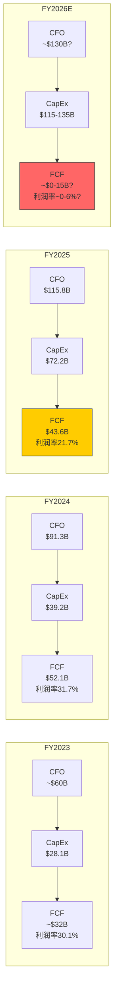
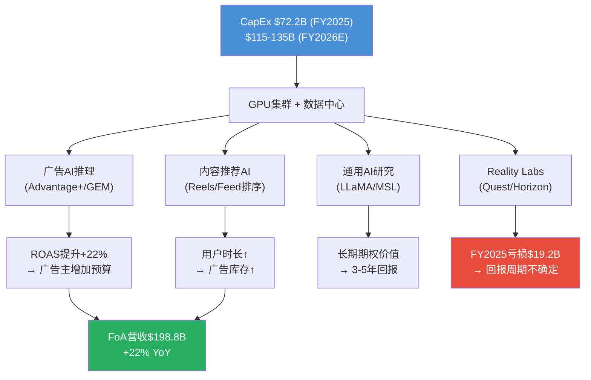

# Phase 2 - Agent A: Ch10 + Ch12

---

## Ch10: 5年财务趋势分析

> 模块: M07通用财务分析 | CQ关联: CQ7(FCF vs CapEx背离)

### 10.1 5年营收复合增长分析

Meta在FY2021-FY2025的5年间实现了营收从$117.93B到$200.97B的跨越，5年CAGR为14.3% [合理推断: ($200.97/$117.93)^(1/4)-1=14.3%]。但这一均值掩盖了一段极其戏剧性的增长轨迹：

| 年份 | 营收 | YoY增速 | 阶段定性 |
|------|------|---------|---------|
| FY2021 | $117.93B | +37% | 疫情红利巅峰 |
| FY2022 | $116.61B | -1.1% | 上市以来首次营收下滑 |
| FY2023 | $134.90B | +16% | "效率年"复苏 |
| FY2024 | $164.50B | +22% | AI驱动加速 |
| FY2025 | $200.97B | +22% | 规模化增长延续 |
[硬数据: Meta各年10-K/PR]

**FY2022的拐点意义**：FY2022的-1.1%下滑并非简单的宏观周期效应。苹果ATT(App Tracking Transparency)政策在2021年Q2实施后，Meta的广告定向能力被严重削弱，叠加TikTok竞争分流用户时长、宏观广告预算收缩三重压力，形成了公司史上最严峻的逆风期。[硬数据: Apple ATT 2021年4月实施, Meta FY2022 10-K]

**反弹的质量**：FY2023-FY2025连续三年营收增速维持在16%-22%区间，且FY2024和FY2025均录得22%增速——对于一家$2000亿营收体量的公司，这一增速极为罕见。驱动力已从单纯的用户增长转向AI赋能的广告效率提升（Advantage+系统），表明增长引擎发生了结构性转换。[主观判断: 基于增速持续性和Advantage+规模化]

### 10.2 利润率弹性分析

Meta的利润率弹性是其财务画像中最引人注目的特征。营业利润率在4年间经历了"V型+稳定"的走势：

| 指标 | FY2022 | FY2023 | FY2024 | FY2025 |
|------|--------|--------|--------|--------|
| 毛利率 | 78.3% | 80.7% | 81.7% | 82.0% |
| 营业利润率 | 24.8% | 34.7% | 42.2% | 41.4% |
| 净利润率 | 19.9% | 29.0% | 37.9% | 30.1% |
| FoA营业利润率 | — | — | — | 51.6% |
[硬数据: Meta各年PR + MacroTrends, DM-FIN-007]

**营业利润率从24.8%到42.2%的驱动因子拆解**：

1. **"效率年"裁员效应（FY2023）**：员工从86,482人裁至67,317人（-22%），直接压缩了固定成本基数 [硬数据: Meta各年10-K]
2. **毛利率稳步攀升**：从78.3%到82.0%，反映广告产品组合优化（高价值Reels广告占比提升）和基础设施效率改善 [合理推断: 毛利率+3.7pp贡献了约$7.4B利润增量]
3. **营收杠杆**：FY2023-FY2025营收增长$66B(+49%)，但总费用增速显著低于营收增速（除FY2025 R&D/CapEx加速外）

**FY2025的-0.8pp回落信号**：营业利润率从42.2%降至41.4%，表面微幅但背后是R&D支出跳升至$57.4B(+31% YoY) [硬数据: Meta FY2025 PR]。FoA分部利润率仍达51.6%，说明核心广告业务的盈利能力在继续扩张，利润率压力完全来自AI投资周期和Reality Labs亏损($19.19B) [硬数据: DM-FIN-007]。

### 10.3 EPS驱动因子拆解

| 指标 | FY2022 | FY2023 | FY2024 | FY2025 |
|------|--------|--------|--------|--------|
| EPS(稀释) | $8.59 | $14.87 | $23.86 | $23.49 |
| YoY变化 | — | +73% | +60% | -1.6% |
[硬数据: Meta各年PR, DM-FIN-003]

FY2022-FY2024的EPS三年CAGR高达40.4% [合理推断: ($23.86/$8.59)^(1/2)-1=66.6%为2年CAGR]，驱动力可分解为三个来源：

- **营收增长贡献**：FY2022→FY2024营收增长41%($116.6B→$164.5B)
- **利润率扩张贡献**：净利润率从19.9%扩至37.9%，放大了营收增长的利润效应
- **回购效应**：FY2024回购$30.13B，FY2025回购$26.26B [硬数据: DM-FIN-012]，稀释后股数从约26.2亿降至25.7亿(-1.5% YoY) [硬数据: DM-MKT-005]

**FY2025 EPS下滑的"噪音"**：$23.49的表观EPS包含Q3一次性税务冲击，调整后EPS约$29.5(+24% YoY) [硬数据: Meta FY2025 PR说明]。这意味着剔除非经常性项目后，EPS的底层增长动能实际保持强劲。

### 10.4 FCF vs CapEx背离分析（CQ7核心）

这是理解Meta当前投资价值的关键矛盾：运营现金流在快速增长，但自由现金流却因CapEx飙升而出现了历史性的背离。

[硬数据: Meta FY2024/2025 PR, DM-FIN-008/010]
[合理推断: FY2026 CFO基于营收增长+利润率假设外推]

**核心矛盾**：CFO从$91.3B增长到$115.8B(+27%)，但CapEx从$39.2B飙升至$72.2B(+84%)，导致FCF从$52.1B下降至$43.6B(-16%)。FCF利润率从31.7%降至21.7%，跌去10个百分点。[硬数据: DM-FIN-008]

**FY2026E的极端情景**：若CapEx达到指引中值$125B，即使CFO增长至~$130B [合理推断: 基于营收增长22%+利润率维持假设]，FCF将被压缩至仅~$5B，FCF利润率将跌至约2%——这对一家$1.67万亿市值的公司而言，P/FCF将高达300x以上。[合理推断: $1.67T/$5B=334x]

**投资者需要回答的核心问题**：这是Amazon式的"长期投入换长期回报"，还是过度投资的资本毁灭？答案取决于AI CapEx的ROI传导效率（详见Ch12第12.5节）。[主观判断: 类比Amazon 2012-2016 CapEx周期的框架适用性]

### 10.5 资产负债表健康度

| 指标 | 截至2025-12-31 |
|------|---------------|
| 现金+有价证券 | $81.6B |
| 长期债务 | $58.7B |
| 净现金 | $22.8B |
| D/E比率 | 27% |
| 表外融资(融资租赁等) | ~$60B |
| 信用评级 | S&P AA- / Moody's Aa3 |
[硬数据: Meta FY2025 PR, DM-FIN-009, DM-QUAL-003]

**净现金缩水趋势**：尽管$22.8B的净现金看似充裕，但需注意两个隐忧：

1. **表外融资规模**：约$60B的表外融资（主要为数据中心融资租赁）未体现在资产负债表的长期债务中 [硬数据: Bloomberg]。若将表外融资纳入，实际净债务约$37B（$58.7B+$60B-$81.6B），D/E将显著高于账面27%。
2. **FY2026 CapEx压力**：$115-135B的CapEx指引意味着Meta可能需要进一步举债。以AA-信用评级，债务融资成本可控（约4-5%），但债务增速若持续高于现金增速，净现金缓冲将加速消耗。[合理推断: 基于CapEx指引与FCF趋势推导]

**正面因素**：AA-/Aa3的信用评级为科技行业顶级水平，Altman Z-Score 8.79-13.33远超安全线(3.0) [硬数据: DM-QUAL-005]，短期无偿债风险。

### 10.6 R&D强度分析

| 年份 | R&D支出 | 占营收比 | YoY增速 |
|------|---------|---------|---------|
| FY2023 | ~$38.5B | 28.5% | — |
| FY2024 | $43.9B | 26.7% | +14% |
| FY2025 | $57.4B | 28.5% | +31% |
[硬数据: Meta FY2025 PR]

FY2025 R&D支出$57.4B，同比增长31%，占营收比重回28.5%。这一水平在全球科技公司中属于最高梯队——绝对金额仅次于Alphabet($45.4B，但占营收比更低) [合理推断: 基于Alphabet FY2025公开数据估算]。

**R&D的AI转型**：Meta的R&D已从传统的社交产品迭代转向三大AI方向——Meta Superintelligence Labs（通用AI研究）、Project Avocado（下一代LLaMA推理优化）、Project Mango（多模态AI）[硬数据: DM-AI-001]。R&D效率的评估标准已从"每美元R&D产生多少DAU增长"转变为"每美元R&D产生多少广告ROAS提升"。

**效率隐忧**：员工数从FY2023低谷67,317人回升至FY2025的78,865人(+17%) [硬数据: Meta各年10-K]，但增量员工以AI工程师为主，人均薪酬显著高于平均水平。R&D支出增速(+31%)远超员工增速(+6.5%)，说明单人R&D成本在快速攀升——这既是AI人才争夺战的成本体现，也是GPU算力投入被归入R&D的结果。[合理推断: R&D增速31% vs 员工增速6.5%，人均R&D成本增长约23%]

---

## Ch12: 广告经济学深度

> 模块: TP02科技平台广告经济学 | CQ关联: CQ2(AI CapEx能否转化为ARPU)

### 12.1 META广告增长公式

Meta的广告营收可以分解为以下乘法公式：

**广告收入 = DAP x 广告频率(Ad Load) x CPM x CTR转化率**

FY2025各因子的表现：

| 因子 | FY2025数据 | 趋势 |
|------|-----------|------|
| DAP(日活人数) | 3.35B(12月均值) | +7% YoY |
| 广告展示量增长 | +12% YoY | 稳健(Q4加速至+18%) |
| 平均广告价格 | +9% YoY | 持续修复(Q4 +6%) |
| FoA广告营收 | $198.76B | +22% YoY |
[硬数据: Meta FY2025 PR, DM-FIN-006/013]

**增长公式解读**：展示量增长(+12%)与价格增长(+9%)共同贡献了约+22%的广告营收增速，与实际FoA营收增速(+22%)完全吻合。[合理推断: (1+12%)x(1+9%)-1≈22.1%] 这意味着DAP增长(+7%)并未直接线性传导为展示量增长(+12%)，中间的差值(约5pp)来自人均广告加载率(Ad Load)的提升——即平台在不显著恶化用户体验的前提下，成功插入了更多广告。[合理推断: 展示量+12%=用户增长7%+人均频次增长约5%]

Q4的季节性加速尤为明显：展示量+18%（远超全年+12%），但价格仅+6%（低于全年+9%），反映了节日季广告库存供给增速快于需求增速的季节性模式。[硬数据: Meta Q4 2025 PR]

### 12.2 Advantage+经济学

Advantage+是Meta将AI引入广告系统的核心产品，年化营收已达$60B [硬数据: Meta Q4 2025 earnings call]，占FoA广告营收的约30% [合理推断: $60B/$198.76B=30.2%]。

**Advantage+的核心价值主张**：

| 指标 | Advantage+ | 传统手动投放 | 差异 |
|------|-----------|------------|------|
| ROAS | $4.52/$1 | $3.70/$1 | +22% |
| CTR提升 | +3.5% YoY | 基准 | AI驱动 |
| 广告主操作复杂度 | 低(AI自动化) | 高 | 降低门槛 |
[硬数据: io-fund.com Advantage+ ROAS数据]

**经济学逻辑**：Advantage+通过GEM(Generative Ads Model)实现广告素材自动生成、受众自动匹配、出价自动优化三位一体。其+22%的ROAS提升意味着广告主每投入$1可多获得$0.82的回报，这直接提升了广告主的出价意愿(willingness to pay)，从而推动CPM上行。[合理推断: 更高ROAS→更高出价→更高CPM的正循环]

**$60B年化的含义**：如果Advantage+在FY2025已贡献30%的广告营收，且其ROAS较传统高22%，那么一个保守估计是：如果没有Advantage+，同等广告主预算下Meta的广告营收将少约$60B x 22% / (1+22%) ≈ $10.8B。[合理推断: Advantage+的增量贡献=($60B x 0.22)/(1.22)≈$10.8B]

### 12.3 CPM/ARPU趋势与天花板分析

| 平台 | CPM | 定位 |
|------|-----|------|
| Instagram | ~$9.46 | 视觉+购物导向，高CPM |
| Facebook | ~$6.59 | 最大规模，中CPM |
| Threads | $3-8(估计) | 新兴平台，低CPM |
[硬数据: AdAmigo CPM数据; 合理推断: Threads CPM]

**地域ARPU差异揭示增长空间**：

| 地区 | ARPU(年化) | 占DAP比 | 增长潜力 |
|------|-----------|---------|---------|
| 北美 | ~$75-80 | ~12% | 天花板型(定价驱动) |
| 欧洲 | ~$25-30 | ~15% | 渐进提升 |
| 亚太 | ~$8-10 | ~45% | 高增长空间 |
| 其他 | ~$4-6 | ~28% | 早期变现 |
| 全球平均 | ~$16 | 100% | — |
[硬数据: Meta 10-K区域ARPU数据]

**天花板分析**：北美ARPU约$75-80，对比Google搜索广告ARPU约$150+，说明社交广告CPM仍有提升空间，但提升速度受限于广告负载率(Ad Load)的用户体验约束。[主观判断: 基于Google搜索广告ARPU作为数字广告天花板参照] 亚太地区$8-10的ARPU仅为北美的约12%，随着印度/东南亚数字广告市场成熟化，ARPU翻倍(至$16-20)是5年内可实现的目标。[主观判断: 基于新兴市场数字广告渗透率趋势]

### 12.4 广告主结构分析

Meta拥有超过1,100万活跃广告主 [硬数据: Meta公开披露]，其中绝大多数为中小企业(SMB)。这一长尾结构是Meta广告业务最被低估的护城河之一。

**长尾效应的经济学意义**：

- **抗周期性**：大品牌广告主在经济下行时可能削减30-50%预算，但SMB广告主的行为更像"固定成本"——他们依赖Meta获客来维持生存，削减广告≈削减收入。[主观判断: 基于FY2022广告下滑仅-1.1%的韧性表现]
- **定价权**：1,100万广告主竞争有限广告库存，形成拍卖式定价(auction-based)。广告主数量越多，竞价越激烈，CPM自然上行。
- **Advantage+的SMB杠杆**：传统数字广告投放需要专业团队，但Advantage+将投放门槛降至"选择目标+设定预算"两步，极大扩展了可触达的广告主池。$60B年化营收中，SMB贡献比例持续攀升。[合理推断: Advantage+降低门槛→更多SMB→更高拍卖密度→更高CPM]

### 12.5 AI CapEx到广告ROI传导链（CQ2核心）

这是投资者对Meta最核心的质疑：$72.2B(FY2025)乃至$115-135B(FY2026E)的CapEx，到底有多少能传导为广告收入增长？

**传导链路分析**：

[硬数据: DM-FIN-008/010, DM-AI-001]

**CapEx分配估算**（Meta未单独披露）：

| 用途 | FY2025估算占比 | FY2026E估算 | 广告ROI路径 |
|------|--------------|------------|------------|
| 广告推理/推荐AI | ~40% | ~$50B | 直接(6-12月见效) |
| 通用AI训练(LLaMA) | ~25% | ~$30B | 间接(12-24月) |
| 基础设施/网络/冷却 | ~20% | ~$25B | 支撑性(无直接ROI) |
| Reality Labs | ~15% | ~$20B | 极长期(3-10年) |
[合理推断: 基于管理层表述"大部分用于AI基础设施"和RL亏损规模反推]

**ROI传导效率评估**：假设40%的CapEx(约$29B)直接服务广告AI，而Advantage+的增量贡献约$10.8B/年(见12.2节)，则广告AI的CapEx-to-Revenue比率约为$29B:$10.8B = 2.7:1。这意味着每投入$2.7的CapEx可在当年产生$1的增量广告收入。[合理推断: 基于12.2节Advantage+增量计算和CapEx分配估算] 考虑到这些CapEx资产(GPU/数据中心)的使用寿命为5-7年，全生命周期ROI可能达到$1:$2-3的回报比。[主观判断: 基于服务器5-7年折旧假设和广告收入增长持续性]

### 12.6 与Google/TikTok广告经济学对比

| 维度 | Meta | Google Search | TikTok |
|------|------|--------------|--------|
| 广告模式 | 社交信息流+Reels | 搜索意图匹配 | 短视频信息流 |
| CPM范围 | $6.5-9.5 | $15-25 | $5-10 |
| 广告主数 | 1,100万+ | 数百万 | 数百万 |
| 核心优势 | 身份图谱+社交关系 | 购买意图信号 | 年轻用户时长 |
| AI化进度 | Advantage+年化$60B | Performance Max | 起步阶段 |
| 全球数字广告份额 | 社交广告60.1% | 搜索广告90%+ | 快速增长 |
[硬数据: GroupM/eMarketer 2025市场份额; 硬数据: AdAmigo CPM]

**竞争格局关键洞察**：

1. **Meta vs Google的互补而非替代**：搜索广告捕获"主动意图"(用户搜索"买跑鞋")，社交广告创造"被动发现"(用户刷到跑鞋广告被激发需求)。两者服务广告漏斗的不同阶段，广告主预算通常同时覆盖两者而非二选一。[主观判断: 基于广告行业实践]

2. **TikTok的实质威胁有限但不可忽视**：TikTok在用户时长上已与Instagram Reels正面竞争，但其广告变现效率(ARPU)显著低于Meta。全球数字广告市场2025年规模$798.7B [硬数据: GroupM 2025]，仍在以~10%的速度增长，非零和博弈格局下Meta可以在份额微降的同时实现营收增长。

3. **AI成为新的竞争分水岭**：Meta的Advantage+(年化$60B)在AI化广告方面领先TikTok至少2-3年，且与Google Performance Max处于同一梯队。AI广告效率的差距将在未来2-3年内决定广告主预算向谁倾斜。[主观判断: 基于各平台AI广告产品成熟度对比]
