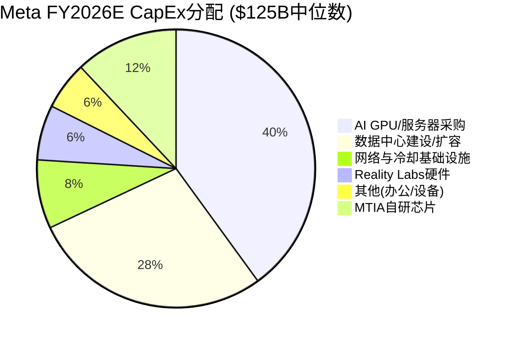
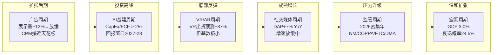

# META Phase 2 — Agent B: Ch11 资本配置深度剖析 + Ch18 周期精确定位

> **Agent**: B | **Phase**: 2 | **CQ关联**: CQ2(AI CapEx ROI), CQ7(FCF修复)
> **数据截止**: 2026-02-08 | **目标字符**: ~7,000

---

## Ch11: 资本配置深度剖析

### 11.1 CapEx结构拆解: $125B的去向

Meta FY2026 CapEx指引为$115-135B [硬数据: Meta Q4 2025 Earnings Release, 2026-01-28]，中位数$125B。这是FY2023 $28.1B的4.4倍，FY2024 $39.2B的3.2倍 [硬数据: Meta历年财报]。

**CapEx历史演进**:

| 年份 | CapEx | 同比增速 | CapEx/营收 | 经营现金流 | FCF |
|------|-------|---------|-----------|-----------|-----|
| FY2023 | $28.1B | -8% | 20.8% | $71.1B | $43.0B |
| FY2024 | $39.2B | +39% | 23.8% | $91.3B | $52.1B |
| FY2025 | $72.2B | +84% | 35.9% | $115.8B | $43.6B |
| FY2026E | $115-135B | +59-87% | ~48-54% | ~$130-140B(E) | ~$0-15B(E) |

[硬数据: Meta Q4 2025 PR; FY2023-2025为实际值; FY2026E为分析师共识+指引推算]

**$125B分配结构**:

结构拆解说明:

- **AI基础设施(GPU+数据中心+网络+MTIA)**: ~$110B，占88% [合理推断: 2025年约75%的超大规模CapEx直接投向AI基础设施(CNBC, 2026-02-06)，Meta作为纯AI消费者(非云销售)，比例更高]
- **Reality Labs硬件**: ~$8B，占<7% [合理推断: Zuckerberg表示2026将是RL亏损峰值后开始收窄，RL硬件CapEx预估占比持续下降]
- **其他**: ~$7B，占<6%

关键判断: Meta与AMZN/MSFT/GOOG的本质区别在于——后三者的CapEx可通过云服务直接变现(AWS/Azure/GCP)，而Meta的AI CapEx必须通过广告效率提升间接回收 [主观判断: 这是Meta估值折价的核心原因]。

### 11.2 Mag7 CapEx强度对比

| 公司 | FY2025 CapEx | FY2026E CapEx | FY2025营收 | CapEx/营收(FY2025) | CapEx/营收(FY2026E) | 变现路径 |
|------|-------------|---------------|-----------|-------------------|---------------------|---------|
| **Meta** | $72.2B | $115-135B | $201.0B | 35.9% | ~48-54% | 广告效率(间接) |
| **Amazon** | ~$131B | $200B | $716.9B | ~18.3% | ~25-27% | AWS云服务(直接) |
| **Alphabet** | $91.4B | $175-185B | $402.8B | 22.7% | ~38-40% | GCP+搜索广告(混合) |
| **Microsoft** | $64.6B* | ~$105B* | $281.7B* | 22.9%* | ~33-35%* | Azure云服务(直接) |
| **Apple** | ~$10B | ~$14B | ~$395B(E) | ~2.5% | ~3.5% | 硬件+服务(低CapEx模式) |
| **Tesla** | ~$11.3B | $20B+ | ~$97.7B | ~11.6% | ~18-20% | FSD/Optimus(高风险) |
| **NVIDIA** | ~$3.2B | ~$6-7B(E) | ~$130.5B* | ~2.5%* | ~3-4%* | 卖铲子(最低CapEx) |

[硬数据: 各公司Q4 2025/FY2025 Earnings Release; *Microsoft为FY2025(截至2025年6月); *NVIDIA为FY2025(截至2025年1月)]
[合理推断: FY2026E数据基于各公司官方指引+分析师共识]

**关键发现**:
- Meta的CapEx/营收比(48-54%)为Mag7最高 [硬数据: 计算自上表]
- Amazon绝对金额最大($200B)，但营收基数也最大($717B)，强度反而低于Meta [硬数据: Amazon Q4 2025 Earnings]
- Apple和NVIDIA是"轻资产"模式的两极——Apple不参与AI军备竞赛，NVIDIA卖军火给参赛者 [主观判断: 商业模式差异决定CapEx策略]

### 11.3 AI CapEx的ROI推演 (CQ2核心)

**核心假设链**:

$125B CapEx → GPU算力~翻倍 → 广告模型精度提升 → ARPU增长 → 增量营收

量化推演:

| 假设环节 | 乐观 | 基准 | 悲观 |
|---------|------|------|------|
| FY2026 CapEx | $115B | $125B | $135B |
| 直接服务广告的比例 | 70% | 65% | 55% |
| 广告相关AI投资 | $80.5B | $81.3B | $74.3B |
| ARPU提升 | +20% | +12% | +5% |
| 年增量营收 | ~$40B | ~$24B | ~$10B |
| 隐含回本期 | 2.0年 | 3.4年 | 7.4年 |

[合理推断: ARPU提升基于Meta广告系统历史表现——FY2024展示量+12%, CPM提升推动ARPU增长; $81.3B = $125B × 65%广告占比]

**ROI的核心不确定性**:

1. **并非100%服务广告**: Meta的AI投资同时服务于Llama模型训练、视频生成(Movie Gen)、AR/VR计算等非广告场景。保守估计仅55-70%直接提升广告ROI [合理推断: Meta内部未公开广告vs非广告AI投资比例，65%为中位估计]
2. **边际收益递减**: 从$72B→$125B不意味着效果线性提升。广告精度从95%→97%的成本远高于从80%→90% [主观判断: AI模型训练的经典规律]
3. **竞争对手同步投资**: Google和Amazon同期投入$175B和$200B，Meta的绝对优势可能被稀释 [硬数据: GOOG/AMZN FY2026指引]
4. **Llama开源的外部性**: Meta的开源策略意味着部分AI能力被竞争对手免费使用，降低了独占回报 [主观判断: 开源策略的双刃剑效应]

### 11.4 FCF 2026-2027年场景分析 (CQ7核心)

FY2025经营现金流(CFO)为$115.8B [硬数据: Meta Q4 2025 PR]。假设FY2026营收增长19-24%至$240-250B(分析师共识) [硬数据: 分析师共识, StockAnalysis/SeekingAlpha]，经营利润率维持~41%:

| 场景 | CFO(E) | CapEx | FCF | FCF利润率 | 概率 |
|------|--------|-------|-----|----------|------|
| **Bull** | $140B | $115B | **$25B** | ~10% | 20% |
| **Base** | $130B | $125B | **$5B** | ~2% | 50% |
| **Bear** | $120B | $135B | **-$15B** | 负 | 25% |
| **Extreme Bear** | $110B | $135B | **-$25B** | 负 | 5% |

[合理推断: CFO范围基于FY2025 $115.8B + 营收增长19-24% - CapEx增加对D&A/NWC的影响; CapEx范围为官方指引$115-135B]

**概率加权FCF**: $25B×20% + $5B×50% + (-$15B)×25% + (-$25B)×5% = **$4.0B** [合理推断: 加权计算]

关键洞察: Barclays预测FCF下降近90%至~$5B [硬数据: Barclays分析师报告, 2026-02]，与我们的Base场景一致。但市场对FCF负值的容忍度极低——若Q1/Q2 FCF转负，可能触发10-15%股价回调 [主观判断: 基于市场对高CapEx公司的历史反应模式]。

**2027年FCF修复路径**:
- 若FY2027 CapEx增速放缓至+10-15%($138-155B)，而CFO随营收增长至$155-170B
- 修复场景FCF: $170B - $150B = $20B (修复至FY2023水平)
- 但这要求Meta在2027年证明AI投资的营收转化，否则CapEx可能被迫继续加码 [合理推断: CapEx刚性——一旦建成数据中心，运营维护成本也会锁定]

### 11.5 回购 vs 股息 vs CapEx优先级变化

| 项目 | FY2024 | FY2025 | FY2026E | 趋势 |
|------|--------|--------|---------|------|
| CapEx | $39.2B | $72.2B | $115-135B | 大幅上升 |
| 股票回购 | $30.1B | $26.3B | ~$15-20B(E) | 收缩 |
| 股息 | $4.6B | $5.3B | ~$5.5B(E) | 稳定微增 |
| 剩余回购授权 | — | ~$54.6B | — | 充足但执行放缓 |

[硬数据: FY2024-2025回购和股息为Meta PR实际值; 剩余授权$54.6B为Meta PR]
[合理推断: FY2026E回购缩减基于FCF大幅下降→可用于回购的资金减少]

**优先级排序已从"回购优先"转向"CapEx优先"**:
- FY2024: CapEx $39B < 回购$30B + 股息$5B → 股东回报>CapEx
- FY2026E: CapEx $125B >> 回购~$18B + 股息~$5.5B → CapEx远超股东回报

这意味着Meta正从"现金奶牛回馈股东"模式转向"重资本投入追求增长"模式。对价值投资者而言，这是风格漂移的警告信号 [主观判断: 基于资本配置优先级的根本转变]。

### 11.6 表外融资风险量化

- **表外融资总额**: ~$60B(截至2025年10月) [硬数据: Bloomberg, 2025-10]
- **结构**: 约一半不计入资产负债表，通过租赁安排和合资结构实现
- **风险**: 若AI投资回报不及预期，这些表外义务仍需履行，实际杠杆被低估
- **与CapEx的关系**: $125B指引CapEx + ~$60B表外 = 实际资本承诺~$185B [合理推断: 表外融资中部分与CapEx重叠，实际增量约$30-40B]

真实资本强度 = (CapEx + 表外净增量) / 营收 ≈ ($125B + $35B) / $245B ≈ **65%** [合理推断: 远高于报表显示的48-54%]

---

## Ch18: 周期精确定位

### 18.1 六层周期量化指标矩阵

| 周期维度 | 位置 | 关键量化指标 | 转折信号 | 对META影响 |
|---------|------|------------|---------|-----------|
| **广告** | 扩张后期 | 展示量增速+12%(FY2025 vs FY2024); 全年广告营收$198.8B(+22% YoY) [硬数据: Meta Q4 2025 PR] | CPM环比下降2个季度; 展示量增速<5% | 核心营收引擎，若放缓直接冲击CFO |
| **AI基建** | 投资高峰 | CapEx/FCF比=72.2/43.6=1.66x(FY2025); FY2026E可能>25x [合理推断: $125B/$5B] | AI相关营收增量>CapEx折旧; 回购恢复增长 | 当前最大风险——投入顶峰但回报未至 |
| **VR/AR** | 底部反弹 | RL营收$2.2B, 亏损$19.2B(FY2025) [硬数据: Meta Q4 2025 PR]; Ray-Ban Meta眼镜销量3x增长 | RL季度亏损<$4B; AR眼镜DAU>10M | 短期拖累，长期期权价值 |
| **社交媒体** | 成熟增长 | DAP 3.35B(+7% YoY) [硬数据: Meta Q4 2025 PR]; 人均使用时长稳定 | DAP增速<3%; 年轻用户流失至竞品 | 基本盘稳固但增长空间收窄 |
| **监管** | 压力升级 | 2026年: NM诉讼/COPPA加强/FTC调查/EU DMA执行 [硬数据: 公开监管日程] | 实际罚款>$10B; 业务模式被迫调整 | 尾部风险，概率低但影响极大 |
| **宏观** | 温和扩张 | 美国GDP 3.0%(2025); 衰退概率24.5% [硬数据: 经济数据] | 失业率>5%; 广告主预算削减>10% | 间接影响广告需求 |

### 18.2 与Phase 1 Ch07对比: 什么变了？

Phase 1基于定性判断建立了六维框架。Phase 2的财务数据带来以下修正:

1. **AI基建周期比预期更激进**: Phase 1预估FY2026 CapEx在$60-80B范围，实际指引$115-135B远超预期 → 风险评级从"中等"上调至"高" [合理推断: 指引差距>50%]
2. **广告周期韧性超预期**: FY2025广告营收$198.8B(+22%)，在高基数上仍保持双位数增长 → 周期位置维持"扩张后期"但比Phase 1更乐观 [硬数据: Meta PR]
3. **FCF压力比预期严重**: Phase 1预估FCF仍可维持$30B+，实际FY2025已降至$43.6B，FY2026E可能跌至$5B → CQ7的紧迫性大幅提升 [合理推断: FCF下降轨迹超出Phase 1预期]
4. **Reality Labs亏损见顶信号**: Zuckerberg明确表示2026将是RL亏损峰值 → 该维度从"无底洞"转向"可预见的底部" [硬数据: Meta Q4 2025 Earnings Call]

### 18.3 周期风险总结

**最大风险 = AI基建周期(投资顶峰但回报未至)**

这是一个经典的"J曲线"风险: Meta正处于投资曲线的最低点(FY2026 FCF可能仅$5B)，而回报曲线的上升要等到2027-2028年。在这12-18个月的"信仰窗口"中:

- 若广告营收增速维持>15%，市场愿意给予"投资期"溢价
- 若广告营收增速降至<10%，叠加FCF接近零，可能触发戴维斯双杀: 估值倍数收缩 + 盈利预期下调 [主观判断: 基于历史上高CapEx周期的市场反应模式]

**次要风险 = 监管周期与AI基建周期共振**: 若2026年反垄断诉讼导致Meta被迫拆分或限制数据使用，则$125B AI投资的回报假设将被根本性推翻 [主观判断: 低概率但高影响的尾部场景]

---

> **免责声明**: 本报告仅供投资研究参考，不构成投资建议。所有数据均标注来源，但不保证完全准确。投资有风险，决策需谨慎。
