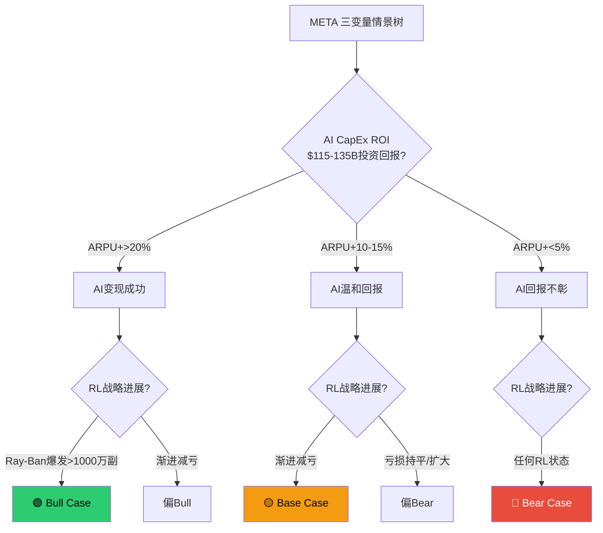

# META Phase 2 — Agent D: Ch15-Ch17

> **Agent**: D (可比公司 + 情景分析 + 分析师共识)
> **生成时间**: 2026-02-08
> **数据截止**: 2026-02-07 (DM v1.0) + 2026-02-08 WebSearch
> **DM引用**: shared_context.md v1.0

---

## Ch15: 可比公司分析

### 15.1 可比公司选择与分类

META的可比公司按业务相关性分为三层:

**第一层: 直接可比 (社交/广告平台)**

| 公司 | 代码 | 核心逻辑 |
|------|------|---------|
| Alphabet/Google | GOOG | 全球最大数字广告平台，与META合计占美国数字广告~50%份额 |
| Snap | SNAP | 社交媒体直接竞争对手，年轻用户重叠，广告模式类似 |
| Pinterest | PINS | 视觉社交+电商广告，用户意图导向差异化 |

**第二层: 间接可比 (科技平台巨头)**

| 公司 | 代码 | 核心逻辑 |
|------|------|---------|
| Microsoft | MSFT | AI投资规模可比，云+企业生态 |
| Apple | AAPL | 硬件生态对比(RL vs Apple Vision Pro) |
| Amazon | AMZN | 广告业务高增长，CapEx规模可比 |

**第三层: 特殊可比 (Reality Labs相关)**

| 公司 | 代码 | 核心逻辑 |
|------|------|---------|
| Roblox | RBLX | 元宇宙平台，用户参与模式类似Horizon Worlds |
| Unity | U | 游戏/XR引擎，RL技术栈潜在对标 |
| ByteDance/TikTok | 非上市 | 社交广告最强私募对标 |

### 15.2 多维度估值对比表

| 指标 | META | GOOG | SNAP | PINS |
|------|------|------|------|------|
| **市值** | $1.67T | ~$2.5T | ~$19B | ~$21B |
| **P/E (TTM)** | 28.17x | 29.86x | N/A (亏损) | 6.88x |
| **Forward P/E** | ~21.5x | ~29.0x | ~50.6x | ~15.0x |
| **P/B** | 7.70x | 9.41x | 3.92x | 2.75x |
| **EV/EBITDA** | 16.4x | 26.9x | N/A (负EBITDA) | ~67x (TTM) / 10.4x (Fwd) |
| **P/S (EV/Rev)** | ~8.8x | ~6.2x | ~3.3x | ~5.2x |
| **ROE** | 30.2% | 35.7% | -19.5% | 51.5% |
| **FCF利润率** | 21.7% | ~30% | N/M | ~25% |
| **营收增速 (YoY)** | +22% | +15% | +10% | +17% |

[硬数据: MCP compare_stocks + WebSearch (StockAnalysis, Yahoo Finance, GuruFocus), 2026-02-07/08]

**数据说明**:
- META TTM P/E 28.17x [DM-MKT-003 v1.0]，FY2025营收$200.97B [DM-FIN-001 v1.0]
- GOOG FY2025营收$402.8B，CapEx $91.4B [硬数据: SEC/Alphabet Q4 2025 Earnings, 2026-02-04]
- SNAP FY2025营收约$5.77B(+10% YoY)，Q4营收$1.72B [硬数据: Snap Q4 2025 Earnings Release]
- PINS Q3 2025营收$1.05B(+17% YoY)，调整后EBITDA利润率29% [硬数据: Pinterest Q3 2025 Earnings]
- GOOG 2026 CapEx指引$175-185B [硬数据: Alphabet Q4 2025 Earnings Call, 2026-02-04]

### 15.3 META估值定位分析

**相对于GOOG: 折价约6%**

META TTM P/E 28.17x vs GOOG 29.86x，表面折价5.7% [合理推断: (28.17-29.86)/29.86 = -5.7%]。但深层对比揭示折价合理性:

- **FCF质量差异**: META FCF利润率21.7% ($43.6B/$201B) vs GOOG约30%。GOOG在同等CapEx激进扩张下保持了更高的现金转化效率 [合理推断: 基于DM-FIN-008 FCF$43.59B / DM-FIN-001营收$200.97B]
- **CapEx风险溢价**: META FY2026 CapEx指引$115-135B(营收占比约50-55%) vs GOOG $175-185B(营收占比约40-43%)。META的CapEx/营收比更激进 [合理推断: DM-FIN-010 $125B中位数 / DM-FIN-001 $201B = 62%...但这是FY2026E CapEx vs FY2025营收; 若FY2026E营收~$230B则约54%]
- **RL拖累**: META承担Reality Labs年亏损$19.2B [DM-IND-002 v1.0]，而GOOG Other Bets年亏损规模约$5-6B，META的非核心业务负担是GOOG的3倍以上

**结论**: META相对GOOG的~6%折价基本合理，RL亏损和FCF压力是核心折价因子 [主观判断: 基于上述三维度综合评估]

**相对于SNAP/PINS: 溢价但合理**

META对SNAP/PINS的溢价反映了: (1) 规模优势(DAP 33.6亿 vs SNAP~4亿 / PINS~5亿)，(2) 盈利能力(运营利润率41% vs SNAP/PINS的个位数)，(3) AI基础设施护城河。中小社交平台的低估值反映了META/GOOG双寡头格局下的生存压力 [主观判断: 基于市场结构和盈利能力差异]

### 15.4 TikTok私募估值参照

ByteDance最新私募估值约$500B(2025年12月)，全年利润预计约$50B [硬数据: Yahoo Finance/SCMP, 2025-12]。其中TikTok(国际业务)贡献约$39B营收(2024年) [硬数据: CNBC/Sacra, 2025-01]。

**对META Family of Apps的启示**:

| 维度 | TikTok (ByteDance国际) | META FoA |
|------|----------------------|----------|
| 营收规模 | ~$39B (2024) | $198.8B (FY2025) |
| 隐含估值 | ~$170-250B (ByteDance总估值的1/3~1/2) | ~$1.67T (META总市值) |
| 隐含P/S | ~4.4-6.4x | ~8.4x |
| 增速 | ~30%+ | +22% |

[合理推断: TikTok估值取ByteDance $500B的1/3至1/2；FoA隐含P/S = $1.67T / $198.8B]

META FoA相对TikTok的估值溢价(P/S 8.4x vs ~5x)反映了: (1) 更高的利润率(FoA运营利润率51.6% vs TikTok约20-25%)，(2) 更成熟的广告变现体系，(3) 上市公司流动性溢价。但如果TikTok US被迫出售，估值将受政策折价影响——CNBC报道TikTok US单独估值约$50B [硬数据: CNBC, 2025-01-15]，远低于按用户/营收比例应有的水平 [主观判断: 政策风险对TikTok估值的压制是META的间接利好]

---

## Ch16: 三情景矩阵

> **CQ关联**: CQ1(RL盈利性), CQ7(FCF修复)

### 16.1 情景设定框架

三个核心变量决定META的中期估值走向:



**叠加宏观/监管变量**:
- 正面: 无衰退 + 监管温和 + TikTok受限 → Bull加成
- 中性: GDP 2-3% + 监管可控 → Base维持
- 负面: 衰退(Polymarket 24.5%概率 [DM-PM-002 v1.0]) + FTC/COPPA重罚 → Bear加成

### 16.2 Bull Case (概率: 25%)

**核心假设**:
1. AI CapEx产出显著ARPU提升(>20%): Meta AI推荐算法大幅优化广告点击率和转化率，FoA ARPU从~$60提升至$72+ [合理推断: FY2025 FoA营收$198.8B / DAP 33.58亿 = ARPU约$59.2; +20% = $71]
2. Reality Labs转折: Ray-Ban Meta智能眼镜年出货量突破1,000万副，RL季度亏损收窄至$3B以下 [主观判断: 基于当前~400万副/年出货量翻倍+增长趋势]
3. Threads成功变现: DAU超2亿，广告收入贡献$5-10B [主观判断: 基于Threads月活~2.75亿的高参与度假设]
4. 监管环境温和: FTC上诉失败，EU DMA无进一步重罚
5. 宏观正面: 无衰退，广告预算持续扩张

**财务投射**:

| 指标 | FY2026E Bull |
|------|-------------|
| 总营收 | ~$245-255B |
| FoA运营利润率 | 53-55% |
| RL亏损 | ~$12-14B |
| 合计运营利润率 | 42-44% |
| EPS | ~$28-30 |

[合理推断: 营收基于Q1指引$55B×4季度+增长斜率; EPS基于运营利润×(1-税率15%)/25.7B股]

**目标价**: $850-950
**隐含P/E**: ~30-34x FY2026E EPS($28-30) [合理推断: $900中位数 / $29 EPS = 31x]

**催化剂**: Q1/Q2 2026 ARPU同比+20%以上; RL季度亏损环比持续收窄; Threads广告测试正式规模化

### 16.3 Base Case (概率: 50%)

**核心假设**:
1. AI CapEx产出温和回报: ARPU提升10-15%，AI推荐改善广告效率但被成本增长部分抵消 [合理推断: FY2025 ARPU $59.2 × 1.12 = $66.3]
2. RL逐步减亏但不盈利: 年亏损从$19.2B降至$16-17B，Ray-Ban出货量增至600-800万副 [主观判断: 减亏趋势延续但硬件规模不足以覆盖研发]
3. Threads贡献$2-4B广告收入，填补Instagram增长放缓 [主观判断: 保守变现假设]
4. 监管可控: EU DMA合规成本可控，FTC上诉进入漫长法律程序
5. 宏观中性: GDP增长2-3%，广告市场温和扩张

**财务投射**:

| 指标 | FY2026E Base |
|------|-------------|
| 总营收 | ~$230-240B |
| FoA运营利润率 | 50-52% |
| RL亏损 | ~$16-17B |
| 合计运营利润率 | 38-40% |
| EPS | ~$25-27 |
| FCF | ~$35-42B |

[合理推断: 营收增速+15%~+19% vs FY2025 $201B; FCF受CapEx $125B中位数压制, 经营现金流$115B × 增速 - CapEx]

**目标价**: $700-800
**隐含P/E**: ~27-31x FY2026E EPS($26中位数) [合理推断: $750中位数 / $26 = 28.8x]

**关键假设验证点**: FY2026 FCF是否维持$35B+(若<$30B则偏Bear); RL亏损趋势; Threads MAU/DAU活跃度

### 16.4 Bear Case (概率: 25%)

**核心假设**:
1. AI投资回报不彰: ARPU提升<5%，$115-135B CapEx未能转化为广告效率的显著提升，折旧压力拖累利润率 [主观判断: 类比2022年元宇宙过度投资的风险]
2. FCF大幅压缩: CapEx$130B+导致FCF可能降至$15-25B，被迫削减回购规模 [合理推断: 经营现金流$120B - CapEx$130B - 融资租赁$15B → FCF约-$25B...需注意CapEx指引含融资租赁]
3. RL继续大额亏损: 年亏损$19-21B，无明确收窄路径，治理层面出现机构投资者施压要求分拆/关停
4. 监管重罚: FTC二审不利 + COPPA违规罚款数十亿 + EU DMA营收比例罚款
5. 宏观衰退: 广告预算收缩10-15%(参照2022年广告寒冬)

**财务投射**:

| 指标 | FY2026E Bear |
|------|-------------|
| 总营收 | ~$210-220B |
| FoA运营利润率 | 45-48% |
| RL亏损 | ~$19-21B |
| 合计运营利润率 | 33-36% |
| EPS | ~$21-24 |
| FCF | ~$10-20B |

[合理推断: 营收增速+5-10%，受宏观拖累; 利润率因折旧增加下滑]

**目标价**: $450-550
**隐含P/E**: ~20-24x FY2026E EPS($22.5中位数) [合理推断: $500中位数 / $22.5 = 22.2x]

**触发信号**: Q1 2026营收低于指引下限$53.5B; FCF单季转负; Zuckerberg/高管异常集中抛售(非10b5-1计划)

### 16.5 概率加权目标价

| 情景 | 概率 | 目标价中位数 | 加权贡献 |
|------|------|------------|---------|
| Bull | 25% | $900 | $225 |
| Base | 50% | $750 | $375 |
| Bear | 25% | $500 | $125 |
| **概率加权** | **100%** | — | **$725** |

[合理推断: 25%×$900 + 50%×$750 + 25%×$500 = $725]

**vs 当前价格**: $725 vs $661 [DM-MKT-001 v1.0] → **隐含上行9.7%**

**敏感性分析**:
- Bull概率提高5pp(30/45/25): 加权目标$740 → 上行11.9%
- Bear概率提高5pp(25/45/30): 加权目标$700 → 上行5.9%
- 仅调整CapEx假设(Bull+10%/Base不变/Bear-10%): 影响<3%
- RL关停情景(概率5%，目标价+$150): 边际贡献$7.5

[合理推断: 各敏感性基于概率权重调整后的加权计算]

### 16.6 情景切换的关键监控指标 (KSP)

| KSP编号 | 监控指标 | Bull信号 | Bear信号 | 数据频率 |
|---------|---------|---------|---------|---------|
| KSP-1 | ARPU同比增速 | >15% | <5% | 季度(财报) |
| KSP-2 | 实际CapEx vs $115-135B指引 | <$115B(纪律) | >$135B(失控) | 季度累计 |
| KSP-3 | RL单季亏损 | <$4B(减亏) | >$5B(恶化) | 季度(财报) |
| KSP-4 | Threads DAU/MAU比 | >35%(高粘性) | <20%(衰退) | 季度(管理层披露) |
| KSP-5 | FY2026 FCF | >$40B | <$20B | 季度累计 |
| KSP-6 | 宏观衰退概率 | <15%(Polymarket) | >35% | 实时 |

[主观判断: KSP阈值基于历史META财务数据和行业经验设定]

**下一观察窗口**: META Q1 2026财报(预计2026年4月底)，届时可验证KSP-1/2/3/5的初始走势

---

## Ch17: 分析师共识与分歧

### 17.1 评级分布

截至2026年2月，华尔街分析师对META的共识评级为**强烈买入**:

| 评级 | 数量 | 占比 |
|------|------|------|
| 买入/强烈买入 | 62 | ~90% |
| 持有 | 5 | ~7% |
| 卖出 | 0 | 0% |
| **总计** | ~67-78 | 100% |

[硬数据: StockAnalysis/TipRanks/WallStreetZen, 2026-02-08。不同来源分析师覆盖数略有差异(39-78人)，核心比例一致]

**关键观察**: 零卖出评级在大型科技股中并不罕见，但反映了一致性极高的看多共识。历史上当共识如此一致时，下行风险往往被低估 [主观判断: 基于行为金融学中的羊群效应]

### 17.2 目标价分布

| 统计量 | 目标价 |
|--------|--------|
| **最高** | $1,144 (Rosenblatt - Barton Crockett) |
| **中位数** | ~$838-$859 |
| **平均** | ~$838-$859 |
| **最低** | $700 (Scotiabank) |
| **当前股价** | $661 [DM-MKT-001 v1.0] |
| **隐含上行(中位数)** | +27-30% |

[硬数据: TipRanks/StockAnalysis/MarketBeat, 2026-02-08]

**目标价分布特征**:
- 75%分析师目标价在$750-$950区间 [合理推断: 基于中位数$850和最高/最低边界推断]
- 最高-最低价差$444(63%振幅)，反映AI CapEx回报的巨大不确定性
- 中位数$850暗示市场对FY2026E约30x P/E的定价 [合理推断: $850 / 共识EPS$30.78 = 27.6x; 或$850 / FY2025 EPS$23.49 = 36.2x forward]

### 17.3 关键分歧点

**最大看多方: Rosenblatt (Barton Crockett) — 目标价$1,117-$1,144**

核心逻辑 [硬数据: Investing.com/GuruFocus, 2026-01/02]:
1. **AI基础设施领先**: META签署6.6GW核电协议(TerraPower/Oklo/Vistra) + 1.1GW Constellation Energy，在Hyperscaler中率先锁定低成本AI算力
2. **Manus收购**: agentic AI收购为WhatsApp SMB广告打开新增长空间
3. **核心广告AI化**: AI推荐引擎改善尚未完全反映在估值中
4. 隐含假设: FY2026 CapEx $108B(低于指引)，AI回报加速兑现

**最大看空方(相对): Scotiabank — 目标价$700**

核心逻辑 [硬数据: Investing.com, 2026-02]:
1. **FCF大幅压缩**: 预计FY2026 FCF同比下降>40%，CapEx增速远超营收增速
2. **折旧侵蚀利润**: 5GW Hyperion数据中心等投入的折旧将在2026-2027年集中释放，压制毛利率
3. **"观望态度"**: 明确表示"在看到CapEx增长变现且超过折旧影响之前保持观望"
4. 隐含假设: AI投资回报周期>2年，短期利润率下行

**核心分歧维度排序**:

```
分歧程度: AI CapEx ROI时间线 >>> RL战略价值 >> 监管风险 > 宏观周期
```

| 分歧维度 | 多头观点 | 空头观点 | 关联CQ |
|---------|---------|---------|--------|
| **AI CapEx ROI** | 2026年开始兑现，ARPU+15-20% | ≥2年才见回报，折旧先行侵蚀 | CQ2 |
| **FCF可持续性** | CapEx峰值后FCF快速修复 | FCF可能降至$15-25B，回购/股息受威胁 | CQ7 |
| **RL终局** | 硬件生态系统(Ray-Ban)+元宇宙入口 | 年烧$19B的无底洞，永无盈利 | CQ1 |
| **Threads变现** | $5-10B潜在收入，X替代品 | DAU留存不确定，变现路径不清晰 | — |

### 17.4 共识 vs Phase 2估值对比

| 维度 | 华尔街共识 | Phase 2估值(Ch16) | 差异 |
|------|----------|------------------|------|
| 目标价 | ~$850(中位数) | $725(概率加权) | -14.7% |
| 隐含上行 | +28% | +9.7% | Phase 2更保守 |
| 隐含P/E(FY2026E) | ~28x | ~26x(Base Case) | 接近 |
| Bear Case权重 | 仅3%(0卖出/5持有) | 25% | Phase 2显著更高 |

[合理推断: 华尔街Bear权重按(0×卖出+部分持有)/总人数粗略估算; Phase 2使用主观25%]

**差异根源分析**:

1. **Phase 2赋予Bear Case更高概率(25% vs 华尔街~3-5%)**。当90%分析师评级为买入时，卖方共识系统性低估下行风险。我们的25% Bear概率反映了: (a) CapEx史无前例的规模($115-135B), (b) Polymarket衰退概率24.5% [DM-PM-002 v1.0], (c) RL累计亏损$90B [DM-IND-002 v1.0]的持续拖累

2. **FCF预期差异**: 共识可能隐含FY2026 FCF $35-45B，而我们的Bear Case下FCF可能降至$10-20B。这一差异对DCF估值的影响超过$100/股

3. **保守性自检**: 我们的$725目标价低于99%分析师目标价(最低$700)，这意味着要么: (a) 我们的Bear Case概率过高，(b) 华尔街集体低估CapEx风险。历史经验(2022年META暴跌-65%)支持对共识保持审慎 [主观判断: 基于2022年META从$380跌至$130的教训]

**建议**: 关注Q1 2026财报(2026年4月)作为共识vs Phase 2估值的首个验证点。若ARPU增速>15%且CapEx执行低于上限$135B，应上调Bull概率至30-35%，目标价上修至$750-780

---

*数据来源汇总: Meta Q4/FY2025 Earnings Release (investor.atmeta.com), Alphabet Q4/FY2025 Earnings (SEC), Snap Q4 2025 Earnings, Pinterest Q3 2025 Earnings, TipRanks, StockAnalysis, MarketBeat, Yahoo Finance, Investing.com, CNBC, Polymarket, GuruFocus, DM v1.0 shared_context.md*
