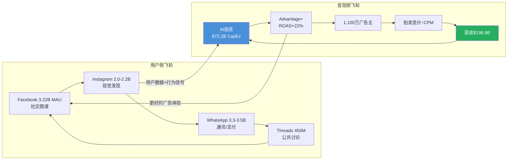

# Phase 3 - Agent A: Ch19 + Ch23

---

## Ch19: 护城河识别与量化

> 模块: TP03科技平台竞争壁垒 | CQ关联: CQ6(Family of Apps网络效应是否仍在扩张？)

### 19.1 网络效应量化

Meta的网络效应包含直接网络效应(用户-用户)和间接网络效应(用户-广告主)两层结构，且通过跨平台飞轮形成叠加放大。

**直接网络效应——DAP 3.35B的"引力场"**

DAP(Daily Active People)达33.5亿(FY2025年12月均值) [硬数据: DM-FIN-013 v1.0]，覆盖全球约42%的互联网用户 [合理推断: 33.5亿DAP/~80亿全球互联网用户≈42%]。五大平台各自承载不同社交功能，形成互补而非替代关系：

| 平台 | MAU | 核心功能 | 网络效应类型 |
|------|-----|---------|------------|
| Facebook | 3.22B | 社交关系维护+群组 | 强直接(社交图谱) |
| WhatsApp | 3.3-3.5B | 即时通讯+支付 | 极强直接(通讯必需品) |
| Instagram | 2.0-2.2B | 视觉社交+购物发现 | 双边(创作者-消费者) |
| Threads | ~450M(+48% YoY) | 公共话题讨论 | 成长期直接 |
| Messenger | ~1B | 一对一通讯 | 强直接 |
[硬数据: Meta FY2025 PR, Phase 1发现]

**跨平台用户重叠构成"生态锁定"**：80.3%的Instagram用户同时使用Facebook，77.1%同时使用WhatsApp [硬数据: DemandSage/DataReportal, 2025]。这种高重叠率意味着用户并非在单一平台上形成粘性，而是在整个Meta生态中形成了多重社交关系网——离开任何一个平台都意味着部分社交关系的断裂。

**间接网络效应——广告主侧**

1,100万+活跃广告主 [硬数据: Meta公开披露] 通过拍卖机制竞争广告库存。广告主越多，拍卖越激烈，CPM越高，Meta收入越高，进而投入更多资源改善用户体验和广告工具，吸引更多用户和广告主。Phase 2 Ch12已证实Advantage+年化$60B(占FoA 30%) [硬数据: Meta Q4 2025 earnings call]，AI化广告将这一间接网络效应的传导速度提升了至少一个数量级。

**网络效应强度评分**: 直接网络效应 9/10(几乎覆盖全球互联网人口的半数)；间接网络效应 8/10(1,100万广告主+拍卖机制形成强正循环)。[主观判断: 基于DAP规模、广告主数量、跨平台重叠率综合评估]

### 19.2 转换成本量化

用户和广告主离开Meta的真实成本远高于表面认知。

**用户侧转换成本**

| 转换路径 | 转换成本 | 原因 |
|---------|---------|------|
| Meta → TikTok | 中低 | 娱乐内容可替代，但社交图谱无法迁移 |
| Meta → X | 低(公共讨论) / 高(私人社交) | X缺乏真实社交关系图谱 |
| WhatsApp → Signal | 极高 | Signal仅40M MAU [硬数据: DemandSage, 2025]，群聊迁移需所有成员配合 |
| WhatsApp → Telegram | 高 | Telegram已达1B MAU [硬数据: Telegram官方, 2025-03]，但家庭/工作群聊迁移成本极高 |
| Instagram → TikTok | 中 | 创作者粉丝无法迁移，品牌店铺需重建 |

关键洞察：**单平台可替代，但多平台生态不可替代**。用户可以在TikTok上获得娱乐内容，但无法同时替代WhatsApp的通讯、Facebook的群组、Instagram的视觉社交。要完全离开Meta生态，用户需要同时注册并维护3-4个替代平台，且说服其社交关系链上的人也完成迁移——这在实操层面几乎不可能。[合理推断: 基于五平台功能互补性和社交关系链迁移的协调成本]

**广告主侧转换成本**

- **数据资产沉没成本**: 多年积累的Pixel数据、Conversions API集成、自定义受众列表、Lookalike模型训练数据，均为Meta平台专属，无法导出至TikTok或Google [合理推断: 广告数据与平台深度绑定]
- **工具链依赖**: Marketing API v22.0 + Graph API v22.0生态中的第三方工具(如Sprout Social, Hootsuite, AdManage)形成了工具链锁定 [硬数据: Meta Graph API v22.0, 2025]
- **ROI对比劣势**: Advantage+ ROAS $4.52/$1 vs 手动投放$3.70/$1(+22%) [硬数据: Phase 2 Ch12]，切换到AI化程度较低的平台意味着接受更低的投资回报率
- **GEM自动化降低操作门槛**: 2025年Q2起GEM对所有广告主自动生效 [硬数据: Growth Foundry, 2025]，进一步加深了对Meta AI广告系统的依赖

**转换成本评分**: 用户侧 7/10(单平台中等，但生态整体极高)；广告主侧 8/10(数据资产+工具链+ROI三重锁定)。[主观判断: 综合评估]

### 19.3 品牌护城河

**Instagram的全球品牌价值**：Instagram已从"照片分享App"演化为全球性的品牌基础设施。"Instagram-worthy"已成为英语中的常用形容词，品牌在Instagram上的存在已等同于"数字身份"。主流零售品牌绝大多数拥有Instagram账号，这不是因为Instagram广告ROI最高，而是因为缺乏Instagram存在的品牌在消费者眼中"不完整"。[主观判断: 基于品牌营销行业通行实践观察]

**Meta AI的品牌重塑效应**：Meta AI月活已突破10亿(2025年5月) [硬数据: CNBC/TechCrunch, 2025-05-28]，约占Meta总用户基数的25% [合理推断: 10亿/39.8亿DAP≈25%]。Meta正从"社交媒体公司"向"AI公司"品牌转型。品牌评分: 7/10(Instagram强，但Meta品牌仍受历史隐私争议拖累)。[主观判断: 品牌价值+负面遗产综合]

### 19.4 数据护城河

**身份图谱的独特深度**

Meta拥有全球最大的实名制社交身份图谱：30亿+真实用户 x 多平台行为数据(社交关系、兴趣偏好、购物行为、通讯模式)。关键差异化在于：

| 数据类型 | Meta | Google | TikTok |
|---------|------|--------|--------|
| 身份确认度 | 极高(实名+社交验证) | 高(账号体系) | 中(匿名使用占比高) |
| 社交关系图谱 | 独有(好友/家庭/同事) | 无 | 弱(关注关系) |
| 跨平台行为 | 5平台交叉 | 搜索+YouTube | 单平台 |
| 购买意图信号 | 中(兴趣推断) | 极强(搜索关键词) | 弱 |
| 通讯内容信号 | 有(WhatsApp端到端加密但元数据可用) | Gmail有 | 无 |
[合理推断: 基于各平台公开产品特性的系统对比]

**ATT后数据重建的战略成功**

苹果ATT(2021年Q2实施)是Meta近年最大的外部冲击，但Meta的数据重建已基本完成：

1. **Conversions API(CAPI)**: 服务端直传绕过浏览器限制，捕获iOS用户的关键转化事件 [硬数据: Meta开发者文档, 2025]
2. **On-device learning**: 在用户设备本地运行广告模型，不需跨App追踪即可实现个性化投放
3. **Advantage+/GEM系统**: 2025年Q2起全量自动生效，利用Meta自有的第一方数据生态重建了广告定向能力

证据：Meta广告价格在ATT冲击后(FY2022下滑)已连续3年恢复性增长(FY2023-FY2025 CPM持续上行) [硬数据: DM-FIN-013 v1.0, 平均广告价格+9% YoY]，表明数据护城河已修复至ATT前水平甚至更强。

**数据护城河评分**: 9/10(实名身份图谱+跨平台行为数据在全球独一无二，ATT重建完成)。[主观判断: 基于数据深度和广告价格恢复]

### 19.5 规模经济

**人力规模壁垒**: 78,865名员工(FY2025) [硬数据: Meta 10-K]，其中AI工程师占比持续提升。AI人才的招聘和留存成本构成了对中小竞争者的天然壁垒——一个GPT级别的模型训练团队年成本超过$1B [合理推断: 基于顶级AI研究员年薪$1-5M及团队规模]。

**CapEx规模壁垒**: FY2025 CapEx $72.2B，FY2026指引$115-135B [硬数据: DM-FIN-008/010 v1.0]。全球仅有5家公司有能力进行此等规模的AI基础设施投资(Meta, Google, Microsoft, Amazon, Apple)。TikTok母公司字节跳动虽有资金能力，但受中美地缘政治限制，难以在美国大规模部署算力。

**AI训练数据量优势**: Llama系列模型基于Meta自有的数十亿用户数据+公开互联网数据训练。开源策略(1.2B下载量) [硬数据: Meta AI@Threads, 2025] 进一步通过社区反馈优化模型质量，形成了"训练数据→开源模型→社区反馈→更好模型"的增量循环。

**规模经济评分**: 8/10(CapEx规模全球前5，AI数据量独特)。[主观判断: 基于绝对投资规模和竞争者门槛]

### 19.6 护城河综合评分表

| 护城河维度 | 评分(0-10) | 权重 | 加权分 | 关键论据 |
|-----------|-----------|------|--------|---------|
| 网络效应(直接) | 9 | 25% | 2.25 | DAP 3.35B, 5平台互补 |
| 网络效应(间接) | 8 | 20% | 1.60 | 1,100万广告主拍卖生态 |
| 转换成本(用户) | 7 | 10% | 0.70 | 单平台中等，生态整体高 |
| 转换成本(广告主) | 8 | 15% | 1.20 | Pixel/CAPI+Advantage+ ROI锁定 |
| 品牌护城河 | 7 | 5% | 0.35 | Instagram品牌价值极强 |
| 数据护城河 | 9 | 15% | 1.35 | 实名身份图谱+ATT重建完成 |
| 规模经济 | 8 | 10% | 0.80 | $72.2B CapEx, Llama 1.2B下载 |
| **加权总分** | | **100%** | **8.25/10** | |
[主观判断: 权重分配基于广告平台业务特性——网络效应和数据是核心价值驱动力]

**对标Morningstar评级**: Wide Moat(宽护城河) [硬数据: DM-QUAL-004 v1.0]，与本评估一致。

**护城河趋势判断**: **稳固偏强**。网络效应在DAP+7% YoY下仍在扩张(CQ6的回答)；数据护城河因ATT重建和Advantage+/GEM而强化；主要侵蚀力量来自TikTok在年轻用户中的时间份额争夺(Instagram互动率-28% YoY [硬数据: SocialInsider, 2025])和AI竞争格局的不确定性。综合而言，护城河在未来2-3年内大概率维持，但5年以上需关注TikTok/AI原生平台的替代风险。[主观判断: 基于数据趋势的方向性判断]

---

## Ch23: 开发者生态健康

> 模块: TP04科技平台化评估 | CQ关联: CQ6(平台生态的扩展性)

### 23.1 Meta开发者生态概览

Meta的开发者生态由三大支柱构成：

1. **传统社交API层**: Graph API(v22.0) + Marketing API(v22.0) + Instagram API + WhatsApp Business API——服务于全球数百万应用开发者和广告技术公司 [硬数据: Meta Developers Portal, 2025]
2. **AI模型开源层**: Llama系列(1.2B累计下载) + PyTorch(ML框架行业标准) [硬数据: Meta AI@Threads, 2025]
3. **AI平台化层**: Meta AI Studio(自定义AI agent创建) + Llama API(LlamaCon 2025发布) [硬数据: Meta LlamaCon, 2025-04-29]

这三层生态的战略意义不同：传统API层是"防守性护城河"(锁定第三方工具链)；AI开源层是"进攻性战略"(建立LLM标准)；AI平台化层是"未来增长引擎"(将Meta AI从功能变为平台)。[主观判断: 基于平台战略分析框架]

### 23.2 传统API生态与开发者规模

Meta的Graph API和Marketing API是全球最大的社交媒体开发者生态之一。虽然Meta未公开披露活跃开发者总数，但间接指标显示生态规模庞大：

- **API版本迭代速度**: 2024年10月发布v21.0，2025年发布v22.0，后续v24.0 [硬数据: Meta Developers Blog, 2024-2025]，保持约每季度一次大版本更新的节奏
- **Marketing API生态**: 覆盖全球主要广告科技公司(Sprout Social, Hootsuite, AdManage等)，以及1,100万广告主背后的数万家代理商
- **WhatsApp Business API**: 全球中小企业客服和商务通讯的核心基础设施，尤其在印度、巴西、印尼市场渗透率极高
- **v22.0新特性**: 位置定向成本降低6.7%，Instagram统一端点和新指标 [硬数据: Swipe Insight, 2025]

传统API层的健康度稳定，但增长动力有限——真正的生态扩张来自AI层。[主观判断: 基于API迭代内容分析]

### 23.3 Llama开发者采用率

Llama是Meta在AI开发者生态中的核心抓手，也是其开源AI战略的基石。

**下载量里程碑**:
- 2025年初: 突破10亿次累计下载 [硬数据: Meta官方博客, 2025]
- 2025年5月(LlamaCon时): 更新至12亿次 [硬数据: Meta AI@Threads, 2025]
- Hugging Face上85,000+个Llama衍生模型(较2024年初增长5倍+) [硬数据: Meta AI官方博客, 2025]

**企业采用案例**: Goldman Sachs、AT&T、Accenture、DoorDash等已将Llama集成至生产工作流 [硬数据: IBM LlamaCon报道, 2025]。25+家合作伙伴提供Llama托管服务，包括Nvidia、Databricks、Groq、Dell、Snowflake [硬数据: Meta LlamaCon公告, 2025-04-29]。

**Llama 4模型家族**: Scout(17B活跃参数)和Maverick(17B活跃参数)为MoE架构，首次原生支持多模态 [硬数据: Meta AI博客, 2025-04]。Behemoth(288B活跃参数)尚未发布。Llama API以限量预览形式发布，兼容OpenAI SDK，降低了迁移门槛 [硬数据: Meta LlamaCon公告, 2025-04-29]。

**开源战略的"围魏救赵"逻辑**: Llama的直接变现能力有限(开源免费)，但其战略价值在于：(a)将开源LLM标准绑定到Meta的模型架构上，形成开发者思维锁定；(b)每个Llama部署都是潜在的Meta AI分发渠道；(c)社区反馈加速Llama迭代，降低Meta自身的AI研发成本。[合理推断: 基于开源商业模式的间接变现逻辑——类比Google开源Android建立移动生态]

### 23.4 Meta AI平台化进展

**Meta AI月活突破10亿**: 2025年5月28日，Zuckerberg宣布Meta AI达到10亿MAU [硬数据: CNBC, 2025-05-28]，较2024年9月的5亿翻倍(+100%) [硬数据: TechCrunch, 2025-05-29]。这使Meta AI成为增速最快的AI助手产品。

**AI Studio开发者平台**:
- 无代码拖拽界面创建自定义AI Agent [硬数据: Meta AI Studio官网, 2025]
- 创作者可建立自己的AI分身，在Messenger、Instagram、WhatsApp上与粉丝互动
- 企业可创建品牌AI客服，集成到电商和客户支持流程中
- 数据管理工具支持上传训练数据、测试Agent性能

**LlamaCon 2025的平台化信号**: 首届LlamaCon(2025年4月29日)标志着Meta正式将AI开发者生态从"开源项目"升级为"开发者平台" [硬数据: Meta AI博客, 2025-04-29]。关键发布包括：Llama API限量预览、Cerebras/Groq推理加速合作、Red Hat企业部署支持、Llama Defenders安全程序。

### 23.5 vs Google/Apple/Amazon开发者生态对比

| 维度 | Meta | Google | Apple | Amazon |
|------|------|--------|-------|--------|
| 开发者生态核心 | 社交API+Llama开源+AI Studio | Android/GCP/Gemini | iOS/macOS/Swift | AWS/Alexa |
| 开源AI模型 | Llama(1.2B下载) | Gemma(开源版Gemini) | 无重大开源模型 | 无重大开源模型 |
| AI开发者平台 | AI Studio(早期) | Vertex AI(成熟) | Core ML(设备端) | SageMaker(成熟) |
| 广告API成熟度 | 极高(v22.0, 20年+) | 极高(Ads API) | 低(Search Ads) | 高(Amazon Ads) |
| 开发者变现路径 | 广告收入分成(有限) | Play Store+AdMob | App Store(30%分成) | AWS服务+Marketplace |
| 生态锁定强度 | 中(社交数据锁定) | 高(Android生态) | 极高(硬件+软件) | 高(云服务锁定) |
[主观判断: 基于各平台公开产品和开发者文档的横向对比]

**Meta的相对劣势**: 缺乏操作系统级别的开发者锁定(不像Apple的iOS或Google的Android)，变现路径不够直接(不像App Store 30%分成)。

**Meta的差异化优势**: (1) Llama的开源策略使其在AI开发者社区的影响力快速扩张，85,000+衍生模型是Google Gemma的数倍；(2) 社交数据+广告AI的结合是独特的——Google有搜索意图数据但缺乏社交图谱，Apple有设备数据但缺乏广告变现能力。[合理推断: 基于各平台核心资产差异]

### 23.6 开发者生态健康评分

| 维度 | 评分(0-10) | 趋势 | 论据 |
|------|-----------|------|------|
| 传统API生态(Graph/Marketing) | 7 | 稳定 | 成熟但增长平缓 |
| Llama开源生态 | 9 | 快速上升 | 1.2B下载, 85K衍生模型, 5x增长 |
| AI Studio平台化 | 5 | 早期成长 | 10亿Meta AI用户基础强，但平台化工具仍早期 |
| 企业开发者采用 | 7 | 上升 | Goldman/AT&T等案例，25+托管伙伴 |
| **综合评分** | **7.0/10** | **上升** | Llama驱动的AI生态是最大增长引擎 |
[主观判断: 基于各维度数据的综合评估]

**核心风险**: Llama的开源模式意味着竞争者可以免费使用Meta投入数十亿美元训练的模型。如果Llama未能建立足够的"生态粘性"(如通过Llama API和AI Studio形成平台锁定)，Meta可能面临"为他人做嫁衣"的风险——DeepSeek等竞争者已证明基于开源模型可以快速迭代出有竞争力的产品。AI安全法案如通过(Polymarket 31%概率 [硬数据: DM-PM-005 v1.0])，可能限制Llama的开源分发策略。[合理推断: 开源商业化风险+监管不确定性]

---

*Agent A Ch19+Ch23完成 | 数据截止: 2026-02-08*
