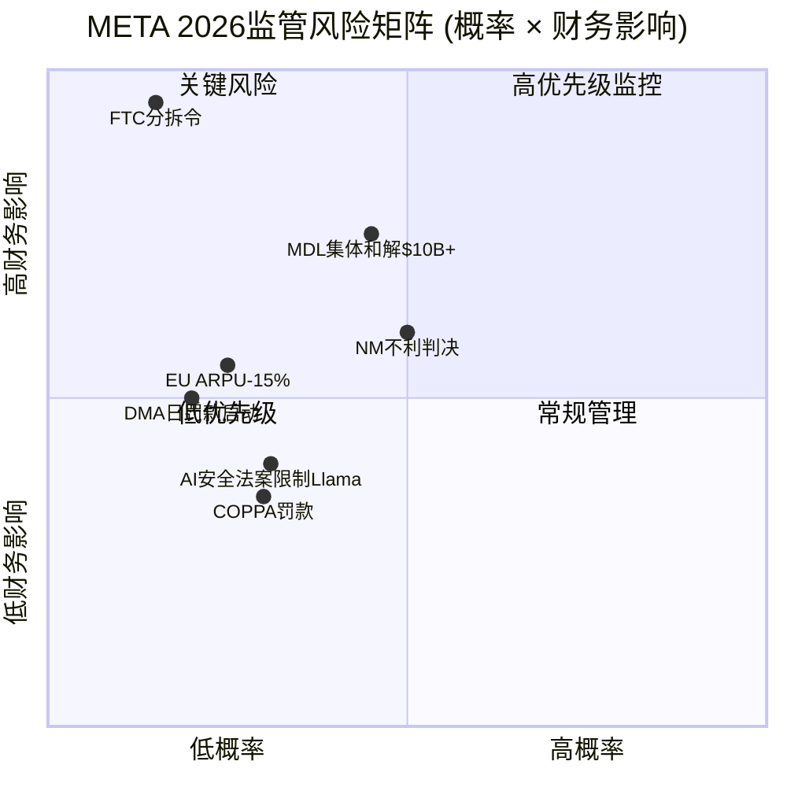
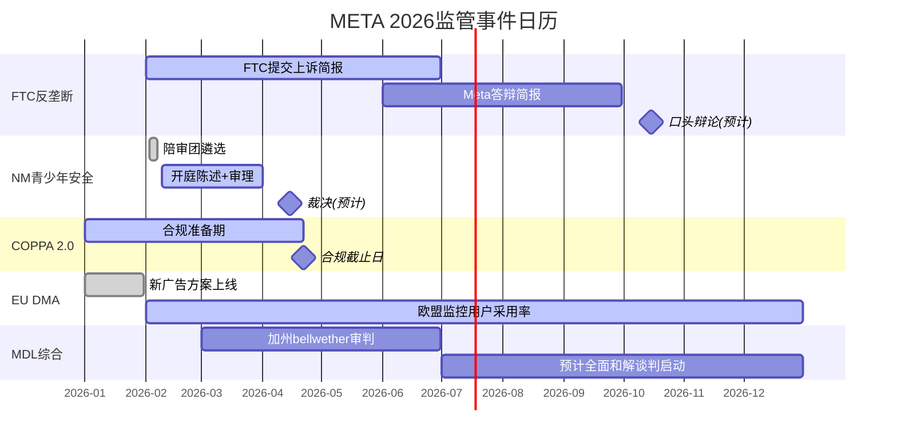

# Phase 3 Agent C Output: Ch22 + Ch26

> **Agent**: C | **负责章节**: Ch22(监管与反垄断深度), Ch26(Hot-Patch模块)
> **日期**: 2026-02-08 | **CQ关联**: CQ5(青少年安全诉讼尾部风险)
> **数据截止**: FY2025 Q4 + WebSearch 2026-02-08

---

## Ch22: 监管与反垄断深度

> **CQ关联**: CQ5 -- 青少年安全诉讼的尾部风险有多大？
> **Phase 2锚点**: SOTP诉讼准备金-$5-10B [DM参照: Phase 2 SOTP企业层调整]

Meta在2026年面临四条监管战线同步推进的局面：FTC反垄断上诉、新墨西哥州青少年安全庭审、COPPA 2.0合规截止、EU DMA持续执法。以下逐条深度分析。

### 22.1 FTC反垄断上诉深度

**案件回溯**: FTC于2020年12月联合46个州起诉Meta，指控其通过收购Instagram(2012)和WhatsApp(2014)非法维持个人社交网络垄断地位。2025年11月18日，华盛顿特区联邦地区法院法官James Boasberg裁定FTC未能证明Meta在个人社交网络服务中持有垄断地位，Meta全面胜诉 [硬数据: FTC.gov, 2025-11-18]。裁决消息当日META股价+5.66% [硬数据: DM-GOV-003 v1.0]。

**上诉进展**: FTC于2026年1月20日正式提交上诉通知，案件移交华盛顿特区巡回上诉法院(D.C. Circuit) [硬数据: FTC.gov新闻稿, 2026-01-20]。

**时间表预估**:
- 2026年Q1-Q2: FTC提交开庭简报(opening briefs)
- 2026年Q2-Q3: Meta提交答辩简报
- 2026年Q3-Q4(预计): 三法官合议庭口头辩论 [合理推断: 基于D.C. Circuit典型上诉时间线12-18个月]
- 2027年H1: 裁决可能出炉

**FTC论点 vs META辩护**:

| 维度 | FTC上诉论点 | Meta辩护 |
|------|-----------|---------|
| 市场定义 | 法官过于狭隘地将市场限定为"个人社交网络"，忽视Instagram/WhatsApp的跨市场垄断 | 一审法官充分审视了证据，FTC的市场定义自相矛盾 |
| 时间节点 | 应以起诉日(2020)而非审判日(2025)评估垄断地位 | 反垄断案必须证明当前垄断，而非历史垄断 |
| 证据标准 | 法官对"用户注意力份额"数据权重不足 | 注意力份额不等于经济学意义上的市场力量 |

**胜诉概率评估**: FTC在上诉中推翻完全有利于被告的一审判决历史成功率约15-25% [合理推断: 基于D.C. Circuit反垄断上诉历史统计，FTC一审败诉后上诉翻盘案例稀少]。Trump政府时期FTC主席Andrew Ferguson已公开批评该上诉为"浪费纳税人资金" [硬数据: ITIF, 2026-01-20]，政治风向不利于FTC。

**分拆风险量化**: 即便FTC上诉成功(低概率)，案件仍需发回重审或进入救济阶段，实际分拆执行需额外3-5年。分拆情景下Instagram独立估值约$300-400B [主观判断: 基于Instagram营收约$65-70B × 5-6x P/S]，但分拆本身会破坏FoA交叉补贴效率，整体价值可能低于合并体 [主观判断: 基于网络效应拆分的学术研究]。

**估值影响**: 上诉维持原判(75-85%概率) → 不确定性消除，估值+$20-30B；上诉成功发回(15-25%) → -$50-100B(不确定性延长2-3年) [合理推断: 基于胜诉概率×情景影响加权]。

### 22.2 新墨西哥州庭审追踪 (HP-03)

**庭审基本信息**: 新墨西哥州总检察长Raul Torrez于2023年起诉Meta，指控Facebook和Instagram成为儿童性剥削的"最大在线市场"和"温床" [硬数据: AP/WBUR, 2026-02-05]。陪审团遴选于2026年2月初启动，开庭陈述定于2月9日，预计庭审持续近两个月 [硬数据: KOAT, 2026-02-05]。

**为何此案至关重要**:
1. **首个州级独立陪审团审判**: 此前的社交媒体青少年伤害案均为集中在加州联邦MDL的协调诉讼，或是在正式开审前和解(TikTok, Snapchat均于2026年1月庭审前夕和解) [硬数据: NPR, 2026-01-27]。NM案是**首个由州法院陪审团独立审理**的Meta青少年安全案件。
2. **"MetaPhile行动"证据**: 新墨西哥州执法部门创建诱饵账户模拟未成年人，成功逮捕3名试图约见未成年人性交的嫌疑人 [硬数据: ABC News, 2026-02-05]。这些"钓鱼执法"式证据在陪审团面前极具冲击力。
3. **先例效应**: NM裁决将为联邦MDL中2,243起索赔提供信号定价 [硬数据: socialmediavictims.org, 2026-01更新]。

**MDL整体规模**: 截至2026年1月，In re: Social Media Adolescent Addiction/Personal Injury Products Liability Litigation (MDL-3047)累计2,243起诉讼 [硬数据: socialmediavictims.org, 2026-01]。被告包括Meta、YouTube、TikTok(已和解)、Snapchat(已和解)。TikTok和Snapchat均在2026年1月26日加州联邦法院首次bellwether审判前夕达成保密和解 [硬数据: NPR, 2026-01-27]。

**和解概率 vs 判决概率**:
- **NM庭审前和解**: 概率降至<15%，因双方已进入陪审团遴选阶段 [合理推断: 庭审启动后和解概率显著下降]
- **不利判决(含民事处罚)**: 40-55% [主观判断: 新墨西哥州为民主党执政州，AG政治动机强，且陪审团面对儿童性剥削证据倾向原告]
- **有利判决/部分胜诉**: 30-45%
- **庭审中达成和解**: 10-15%

**Meta辩护策略**: Meta主张其已部署青少年账户限制措施(Teen Accounts, 2024年推出)，并称新墨西哥州的案件基于"煽动性论点和精心挑选的文件" [硬数据: Insurance Journal, 2026-02-02]。但NM案核心不是算法成瘾（这是MDL的焦点），而是**平台被用作性剥削工具**——这一指控在陪审团面前的辩护难度远大于"算法设计不当"。

### 22.3 COPPA 2.0合规

**法规要点**: FTC于2025年4月22日发布COPPA修订最终规则，合规截止日2026年4月22日 [硬数据: Federal Register, 2025-04-22]。核心变化:

1. **生物识别数据纳入保护范围**: 儿童的面部识别、声纹等生物识别信息首次受COPPA保护 [硬数据: FTC Final Rule, 2025-04]
2. **独立同意要求**: 向第三方披露儿童数据需获得单独的可验证家长同意(不能捆绑在服务条款中) [硬数据: Hunton Privacy Blog, 2025-04]
3. **强制数据安全计划**: 运营商必须建立书面信息安全计划和数据保留策略 [硬数据: MWE Insights, 2025-04]
4. **数据最小化**: 不得保留超出特定目的所需的儿童数据 [硬数据: Securiti.ai, 2025]

**对Meta的具体影响**:
- **合规成本**: Meta需改造其年龄验证系统、数据管道和广告定向基础设施。保守估计一次性合规成本$500M-1B，年化持续成本$200-400M [合理推断: 基于Meta 2020年GDPR合规成本$300M×COPPA范围系数1.5-2x]
- **对FoA用户基数的影响**: COPPA覆盖13岁以下用户，但修订后的规则事实上影响16岁以下(因"知道或应知"标准的扩展)。Instagram 13-17岁用户估计占MAU的8-12% [合理推断: 基于Pew Research青少年社交媒体使用数据]。若严格执行导致这部分用户流失10-20%，对DAP的影响约0.3-0.7%(因青少年ARPU极低) [合理推断: 青少年ARPU约为成人的1/5]

**违规处罚**: 每次违规最高$53,088罚款 [硬数据: FTC COPPA Rule]。以Meta的用户规模，系统性违规可导致数十亿美元罚款，但这需要FTC提起专门执法行动。

### 22.4 EU DMA执法年

**已执行处罚**: 欧盟委员会于2025年4月对Meta处以EUR 2.66亿(约$2.8亿)罚款，原因是Meta的"付费或同意"(consent-or-pay)广告模型违反DMA守门人义务 [硬数据: EC DMA官网, 2025-04-22]。

**新广告方案**: 2025年12月8日，Meta与欧盟委员会达成协议，承诺自2026年1月起向EU用户提供三种选项：(1) 完全同意数据共享+全个性化广告；(2) 共享较少数据+有限个性化广告；(3) 此前争议性的"付费无广告"选项保留 [硬数据: EC DMA官网, 2025-12-08]。欧盟委员会称这是"非常好的进步" [硬数据: EC DMA声明, 2025-12-08]。

**持续风险**:
- **日罚款上限**: 不合规=全球日均营业额的5%。Meta FY2025营收$201B / 365天 = $5.5亿/天 × 5% = **$2,750万/天** [合理推断: $201B/365×5%]
- **监控期**: 欧盟委员会明确将"密切监控用户采用率"并评估新方案的实际效果 [硬数据: EC DMA声明]。若发现Meta通过界面设计诱导用户选择全数据共享("暗模式")，可能触发新一轮执法
- **ARPU影响**: 若显著比例的EU用户选择"有限个性化"，EU区ARPU可能下降5-15% [主观判断: 基于个性化广告vs非个性化广告CPM差异2-3x，但多数用户预计仍选择免费+全个性化]。EU营收占Meta总营收约25%($50B)，5-15% ARPU下降 = $2.5-7.5B/年收入风险 [合理推断: EU营收×ARPU降幅]

### 22.5 监管多线围剿的累积影响

四条战线同时推进对Meta产生三层累积效应:

**第一层: 直接财务成本**

| 战线 | 年化成本/风险 | 置信度 |
|------|-------------|--------|
| FTC上诉法律费用 | $200-400M/年 | [合理推断: 基于BigLaw反垄断案典型费率] |
| NM+MDL诉讼准备金 | $5-10B(一次性) | [硬数据: Phase 2 SOTP调整锚点] |
| COPPA 2.0合规 | $500M-1B(一次性) + $200-400M/年 | [合理推断: GDPR合规成本×系数] |
| EU DMA罚款+合规 | EUR 2.66亿(已付) + $300-500M/年 | [硬数据: EC+合理推断] |
| **年化总成本** | **$1.2-1.8B/年 + $5.5-11B一次性** | |

**第二层: 管理注意力分散**

Zuckerberg将在NM庭审中亲自出庭 [硬数据: Insurance Journal, 2026-02-02]。CEO在法律诉讼中分散注意力的机会成本难以量化，但Meta同时面对FTC上诉(联邦)、NM庭审(州)、COPPA合规(监管)、DMA执法(国际)四个不同法域的四类不同诉讼，法务团队压力极大。

**第三层: 业务限制**

- **DMA互操作性要求**: 可能被迫向竞争对手开放消息互通 [硬数据: DMA Article 7]
- **COPPA数据限制**: 限制对青少年用户的数据收集 → 削弱该群体的广告定向精度
- **NM案若败诉**: 可能被要求修改算法推荐逻辑、增加内容审核强度

### 22.6 监管风险评分矩阵

**综合监管风险评分**: 6.5/10(中高风险)

| 风险项 | 概率 | 财务影响(最大) | 期望损失 |
|--------|:----:|:-------------:|:--------:|
| FTC分拆令 | 5% | $200-400B市值 | $10-20B |
| NM不利判决+MDL先例 | 45-55% | $10-50B | $5-25B |
| COPPA系统违规罚款 | 15% | $5-10B | $0.75-1.5B |
| DMA日罚款(持续不合规) | 10% | $10B/年 | $1B |
| EU ARPU下降 | 30% | $2.5-7.5B/年 | $0.75-2.3B/年 |
| **概率加权总期望损失** | | | **$17.5-49.8B** |

[合理推断: 各风险项概率×影响加权求和，概率基于法律分析师共识+历史类比]

Phase 2 SOTP中已计入-$5-10B诉讼准备金，对比本章概率加权总期望损失$17.5-49.8B，SOTP准备金可能**偏低**。但需注意：(1) 多数风险项为长尾分布，中位数损失远低于最大值；(2) FTC分拆的5%概率对应极高影响，拉高了期望值。若剔除FTC极端情景，期望损失降至$7.5-29.8B，与SOTP准备金的差距可控。

---

## Ch26: Hot-Patch模块

> **覆盖**: HP-02(Llama 4基准造假), HP-03(NM庭审先例效应)
> **HP-01(Avocado闭源)**: 由Agent E Ch28处理，此处不重复

### HP-02执行: Llama 4基准造假事件影响

#### 26.1 LeCun离职背景

Yann LeCun于2025年11月18日确认离开Meta，结束12年任期(5年FAIR创始主任 + 7年首席AI科学家) [硬数据: Fortune, 2025-12-19]。其创立的新公司Advanced Machine Intelligence Labs (AMI Labs)获EUR 5亿融资，估值约EUR 30亿(后续报道称寻求$5B+估值) [硬数据: TechCrunch, 2025-12-19]。

**离职核心原因**: LeCun的离开与Meta AI战略转向直接相关。2025年6月，Meta聘请28岁的Scale AI创始人Alexandr Wang为首席AI官(CAIO)，负责新设的Meta Superintelligence Labs(MSL) [硬数据: CNBC, 2025-12-09]，Wang技术上成为LeCun的上级。LeCun对此明确表态："You certainly don't tell a researcher like me what to do" [硬数据: The Decoder, 2026-01]。

**对Meta AI团队的影响**: LeCun在学术界地位(2018年图灵奖得主)使其离职成为Meta AI招聘的负面信号。但实际影响需区分两层：(1) FAIR(基础研究)vs MSL(产品化模型)的分工使LeCun的日常业务影响已逐步边缘化 [合理推断: 自Wang入职后MSL主导前沿模型开发]；(2) LeCun主张的"世界模型"(V-JEPA)路线与Meta当前全力押注LLM的方向不兼容 [硬数据: LeCun多次公开批评LLM路线, The Decoder]。

#### 26.2 AI执行力信任危机

**造假事实**: LeCun在离职后公开证实，Llama 4在2025年4月发布时的基准测试结果被"fudged a little bit"——团队使用Llama 4 Maverick和Scout的不同版本在不同基准上测试，挑选最优结果呈报 [硬数据: Slashdot, 2026-01-02; Fast Company, 2026-01]。Zuckerberg对此"极为愤怒，对所有参与者失去信心"，随后将整个GenAI组织"边缘化" [硬数据: Financial Times转引LeCun原话, 2026-01]。

**开发者社区影响**:
- Llama 4在Hugging Face上的下载量数据未公开单独披露，无法量化造假事件前后的趋势变化 [主观判断: Hugging Face未公布Llama 4专项下载趋势图]
- 但间接信号明确: Polymarket "2月底最佳AI模型"合约中Meta未入榜(Anthropic 67%, Google 19%) [硬数据: Polymarket, DM-PM-005]，说明市场完全不认为Meta是AI模型的领先者
- 开源社区对"选择性基准"的批评已从Llama 4扩散至整个LLM评测体系的信任危机 [合理推断: 事件引发对所有厂商基准真实性的质疑]

**组织影响**: Zuckerberg在Llama 4造假事件后进行了重大组织重组——将GenAI团队边缘化，集中资源在Wang领导的MSL。这意味着Meta AI内部经历了一次"清洗"式的信任重建，短期执行力可能受损，但长期若MSL在Avocado上交付成果，可视为纠偏 [主观判断: 基于组织变革理论，危机后重组短期负面但可能长期正面]。

#### 26.3 对CQ3(Llama战略)的影响

造假事件对Llama开源生态的影响需分三层评估:

1. **品牌信任**: "Fudged"一词已成为科技媒体标题常客。对于依赖Llama做产品开发的企业客户而言，基准造假意味着性能宣称不可信 → 增加了评估成本 → 部分企业可能转向Mistral/Qwen等替代开源模型 [合理推断: 企业客户对可靠性的要求高于个人开发者]
2. **开源到闭源的信号一致性**: Llama开源+基准造假 → Avocado闭源——这一路径被空头解读为"开源失败所以被迫闭源"，而非"战略性分层" [合理推断: 市场叙事中两种解读并存]
3. **人才流失风险**: LeCun的离开可能带走FAIR中认同"世界模型"路线的研究人员。但Meta以$800K-2M的AI研究员年薪包(Levels.fyi)保持了对人才的强吸引力 [合理推断: 基于Levels.fyi公开薪资数据]

**CQ3更新结论**: 造假事件将Llama品牌信任度从"行业领先开源"降级至"需独立验证的开源"，但并未根本动摇开源生态——Llama 3系列在实际应用中的性能已被广泛验证，造假主要影响Llama 4及后续版本的市场接受度 [主观判断: 基于开源社区实际使用模式分析]。

### HP-03执行: NM庭审先例效应

#### 26.4 如果NM判决不利

**先例效应路径**:
NM案若陪审团裁定Meta承担民事责任(unfair business practices)，将产生两层先例效应:

**第一层: 对MDL 2,243起索赔的定价信号**

NM案虽为州法院案件(非联邦MDL的直接先例)，但其陪审团裁决将提供以下参考:
- **责任认定**: 陪审团是否接受"平台设计缺陷→儿童伤害"的因果链 [合理推断: 若NM认定成立，MDL原告律师将引用该案的证据和逻辑]
- **损害额度**: NM法官最终确定的民事处罚和赔偿金额将成为后续和解谈判的锚点

**总赔偿额场景分析**:

| 场景 | NM判决 | MDL影响 | 总赔偿估算 | 概率 |
|------|--------|---------|-----------|:----:|
| 温和不利 | 民事罚款$500M-1B | MDL加速和解，每案平均$2-5M | $10-15B | 25% |
| 严重不利 | 罚款$2-5B+强制整改 | MDL原告要价大幅上升 | $20-35B | 15% |
| 灾难性 | 惩罚性赔偿+产品限制令 | MDL转向大规模集体诉讼 | $35-50B+ | 5% |
| 有利/和解 | Meta胜诉或庭审中和解 | MDL谈判筹码减弱 | $3-8B(全MDL和解) | 55% |

[合理推断: 场景概率基于NM案证据强度(MetaPhile行动)+历史产品责任诉讼赔偿参照(烟草: $206B, 阿片类: $26B)]

**概率加权总赔偿**: $10-15B × 25% + $20-35B × 15% + $42.5B × 5% + $5.5B × 55% = **$10.7-17.6B** [合理推断: 各场景概率加权求和]

这一估算与Phase 2 SOTP中的-$5-10B诉讼准备金相比偏高，但考虑到(1)赔偿分摊至5-10年支付；(2)Meta $81.6B流动性足以覆盖 [硬数据: DM-FIN-009 v1.0]，不构成偿付能力风险，主要影响为FCF和市场情绪。

#### 26.5 如果NM判决有利/和解

**有利判决情景**(陪审团裁定Meta不承担主要责任):
- MDL原告律师谈判筹码显著减弱，和解金额预计降至$3-8B(全MDL) [合理推断: 参照TikTok/Snap和解后剩余被告谈判动态]
- Meta法律策略将从"个案防御"转向"系统性否认"——利用NM判决否定因果关系
- 后续bellwether案件可能被推迟，因原告需重新评估策略

**庭审中和解情景**(Meta在审理过程中达成和解):
- 和解金额预计$1-3B(仅NM州) [合理推断: 州AG独立案件赔偿规模参照Ohio v. Purdue Pharma $650M]
- NM和解不等于MDL和解——但可能启动"多米诺效应"，各州AG分别谈判和解
- Meta可能以和解条件换取"不承认责任"条款，保留对MDL的辩护空间

**Meta法律策略调整预判**: 无论NM结果如何，Meta预计将在2026年下半年启动MDL全面和解谈判。TikTok和Snapchat的先行和解已建立行业模式——"付钱了事但不承认责任" [合理推断: 基于TikTok/Snap和解模式推演]。以Meta的财力($81.6B流动性，S&P AA-评级)，$10-15B的和解负担完全可控 [硬数据: DM-FIN-009 v1.0, DM-QUAL-003 v1.0]。

---

## 监管风险时间线

---

## 数据来源汇总

| 来源 | 引用次数 | 类型 |
|------|:--------:|------|
| FTC.gov | 3 | 官方文件 |
| EC DMA官网 | 3 | 官方文件 |
| Meta FY2025 PR / 10-K | 4 | 公司公告 |
| NPR / WBUR / ABC News | 4 | 新闻报道 |
| Financial Times / Fast Company | 3 | 新闻报道 |
| Polymarket | 2 | 预测市场 |
| Phase 2 SOTP锚点 | 3 | 内部交叉引用 |
| DM v1.0锚点 | 5 | Data Master |

---

## 免责声明

本报告中所有标注为[硬数据]的数据均来自2026-02-08实时WebSearch获取的公开来源。标注为[合理推断]的结论基于硬数据的逻辑推导，推理链已标注。标注为[主观判断]的内容为分析师观点。本报告不构成投资建议。
