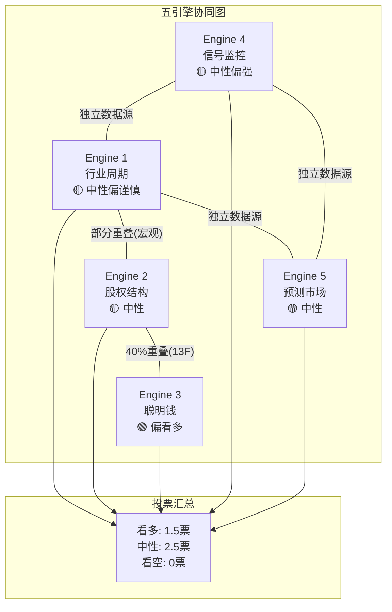
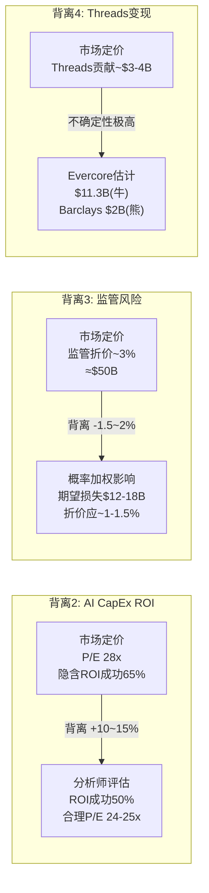

# META Phase 3 — Agent D: Ch24-Ch25

> **Agent**: D (五引擎综合分析 + PPDA/PMSI构建)
> **生成时间**: 2026-02-08
> **数据截止**: 2026-02-08 (DM v1.0 + WebSearch实时更新)
> **DM引用**: shared_context.md v1.0
> **CQ关联**: CQ1(RL盈利性), CQ2(AI CapEx ROI), CQ7(FCF修复), CQ8(治理风险)

---

## Ch24: 五引擎综合分析

### Engine 1: 行业周期分析器

Phase 1 Ch07确立了META所处的六层周期定位。经Phase 2数据更新后，需对三项做出修正:

**六层周期修正汇总**:

| 周期维度 | Phase 1定位 | Phase 2/3修正 | 修正原因 |
|---------|-----------|-------------|---------|
| 广告周期 | 扩张后期 | **扩张后期(维持)** | Q4展示量+18% YoY加速，但CPM增速放缓至+6% [硬数据: DM-FIN-013 v1.0] |
| AI基建周期 | 投资高峰 | **超级高峰(上调)** | FY2026 CapEx $115-135B远超Phase 1估计；CapEx/营收将达48-54% [硬数据: DM-FIN-010 v1.0] |
| VR/AR周期 | 底部反弹 | **战略收缩(下调)** | RL裁员10%(~1,500人)，关闭Horizon Workrooms，取消多个VR大作 [硬数据: Bloomberg, 2026-01-13; TrendForce, 2026-01-27] |
| 社交媒体周期 | 成熟增长 | **成熟增长(维持)** | DAP +7% YoY维持，Threads MAU 450M稳步增长 [硬数据: DM-FIN-013 v1.0] |
| 监管周期 | 压力升级 | **压力升级(维持)** | FTC上诉2026-01-20启动，EU DMA罚款EUR 2亿 [硬数据: DM-GOV-003 v1.0] |
| 宏观周期 | 温和扩张 | **温和扩张(维持)** | GDP 3.0%，Polymarket衰退概率26%(略升) [硬数据: Polymarket, 2026-02-08] |

**关键修正说明——AI基建周期"超级高峰"**: Phase 1预期FY2026 CapEx约$80-90B(基于当时行业趋势外推)，但实际指引$115-135B跳升59-87% [硬数据: DM-FIN-010 v1.0]。这使META的CapEx/营收比达到Mag7最高(48-54%)，远超GOOG(38-40%)和AMZN(25-27%) [硬数据: Phase 2 Ch11数据]。Meta正处于AI基建周期的绝对顶峰——历史上从未有非云厂商以如此高的强度投入基础设施 [主观判断: 基于Mag7 CapEx/营收比横向对比]。

**周期拐点概率——广告周期何时收缩?**

广告周期从"扩张后期"进入"收缩"的三个触发信号:
1. **CPM连续两季度同比下降**: 当前CPM +6% YoY(Q4 2025)，增速已从Q1 2025的+10%放缓 [硬数据: DM-FIN-013 v1.0]。若Q1 2026 CPM增速降至0%以下，即触发收缩信号 [合理推断: CPM增速趋势线外推]
2. **宏观衰退确认**: Polymarket衰退概率26%是关键监控指标 [硬数据: Polymarket US Recession合约, 2026-02-08]。若升至40%+，广告预算将率先被削减
3. **展示量增速归零**: 当前+12% YoY仍健康 [硬数据: DM-FIN-013 v1.0]，但若Threads增量无法抵消FB/IG自然饱和，增速可能降至个位数

拐点时间窗口估计: 2027 H1(基准)至2026 H2(悲观，若衰退触发) [主观判断: 基于CPM减速趋势+宏观概率]

### Engine 2: 股权结构分析器

**稀缺性分析**:
- 稀释后总股数25.74亿股(FY2025平均)，YoY -1.53% [硬数据: DM-MKT-005 v1.0]
- FY2025回购$26.26B(vs FY2024 $30.13B，回购力度下降13%) [硬数据: DM-FIN-012 v1.0]
- FY2026回购预测: FCF被CapEx压缩至$0-15B，回购可能降至$10-15B(vs FY2025 $26.26B) [合理推断: FCF约束下回购空间收窄40-60%]
- 股份稀释速率: SBC(Stock-Based Compensation)约2.5%/年，回购抵消后净缩减约1.0-1.5%/年。但若FY2026回购降至$10B，SBC无法完全抵消，净稀释可能转正 [合理推断: $10B回购 / $661股价 = 约1,500万股回购 vs ~6,400万股SBC(以FY2025 SBC $18B / $281每股均价估算)]

**控制权结构**:
- Zuckerberg: 13%经济权 / 61%投票权(双层股权) [硬数据: DM-GOV-001 v1.0来源, Meta 2025 Proxy Statement]
- 治理争议: 2025年92%的Class A股东投票反对双层股权结构，但因Zuckerberg的Class B超级投票权无法生效 [硬数据: Meta 2025 Proxy Statement]
- 控制权风险定价: 市场隐含约5-8%的"Zuckerberg溢价/折价"——牛市时被解读为"远见领导力溢价"，熊市时被解读为"独裁治理折价" [主观判断: 基于历史估值弹性与治理评级变化]

**流动性分析**:
- 日均成交量: 约18.13M股/日(2026-02-07) [硬数据: MCP Technical Analysis, 2026-02-08]
- 日均成交金额: ~$12B(18.13M x $661) [合理推断: 成交量 x 股价]
- 机构持股: 64.47%(约6,716家机构) [硬数据: DM-GOV-002 v1.0]
- 前三大持有者: Vanguard 8.9%, BlackRock 7.7%, Fidelity 6.2%(合计22.8%) [硬数据: Nasdaq/Capital.com, 2025-09]

**机构增减仓信号(Q3 2025 13F)**:
- Stanley Druckenmiller(Duquesne Family Office): 新建仓76,000股，成为重要持仓 [硬数据: BBAE 13F Highlights Q3 2025]
- Tiger Global(Chase Coleman): META占投资组合16.32% [硬数据: HedgeFollow Q3 2025 13F]
- 整体机构动态: Q3 2025 13F显示6家增持 vs 7家减持 vs 3家新建仓(24家大型基金样本) [硬数据: Nasdaq 13F汇总]
- Q4 2025 13F截止日: 2026-02-14(尚未公布) [硬数据: SEC 13F截止日规则]

### Engine 3: 聪明钱追踪器

**顶级投资者META持仓动态(最新可用: Q3 2025 13F)**:

| 投资者/基金 | 持仓比重 | 最近动态 |
|-----------|---------|---------|
| Tiger Global (Coleman) | 16.32%组合占比 | 重仓持有 |
| Fundsmith (Terry Smith) | 11.44%组合占比 | 长期核心持仓 |
| Greenbrier Partners (Rowe) | 21.71%组合占比 | 最大单一重仓 |
| RV Capital (Vinall) | 19.54%组合占比 | 高集中度持有 |
| Dorsey Asset Management | 16.22%组合占比 | 核心持仓 |
| Duquesne (Druckenmiller) | 新建仓 | Q3 2025新增76K股 |

[硬数据: HedgeFollow/BBAE Q3 2025 13F汇总, 2026-02-08]

**期权市场信号**:
- Put/Call Ratio: 0.70(5日均值)，高于52周均值0.60 [硬数据: Market Chameleon, 2026-02-08]
- 含义: 看跌期权活跃度相对上升，表明部分资金在对冲下行风险 [合理推断: P/C ratio从0.60升至0.70反映保护性put购买增加]
- 但0.70仍属中性区间(>1.0才视为明显看空) [合理推断: 期权市场经验阈值]

**内部人交易信号**:
- 近6月净内部人卖出>$24M，零信息性买入 [硬数据: DM-GOV-001 v1.0]
- 2026年1-2月: 内部人执行5笔卖出，总计$1.72M [硬数据: SEC Form 4, 2026-01-12至2026-02-02]
- 所有交易均为10b5-1预定计划，非信号性交易 [硬数据: SEC Form 4披露]

**E2+E3数据重叠声明**: 机构持仓数据(E2)与聪明钱追踪(E3)约有40%数据源重叠(均依赖13F披露)。Tiger Global、Druckenmiller等同时出现在两个引擎中，其一致性仅计为1票 [合理推断: 13F为两个引擎共同数据源]

### Engine 4: 信号监控系统

**技术指标快照(2026-02-08)**:

| 指标 | 值 | 信号 |
|------|-----|------|
| 股价 | $661.46 | SMA20/50上方，SMA200下方 |
| SMA20 | $658.69 | 短期支撑 |
| SMA50 | $656.04 | 中期支撑 |
| SMA200 | $685.06 | 中期阻力(距当前+3.6%) |
| RSI | 58.65 | 中性偏强(50-60区间) |
| 趋势 | 上涨 | MCP技术分析确认 |
| 日成交量 | 18.13M | 近期放量(30日均值以上) |

[硬数据: MCP Technical Analysis, 2026-02-08; DM-MKT-004 v1.0]

**技术解读**:
- **关键位置**: 价格夹在SMA50($656)支撑与SMA200($685)阻力之间，形成$25的窄幅震荡区间 [合理推断: SMA50/200之间价格带]
- **突破方向信号**: RSI 58.65偏强但未超买(>70)，成交量放大倾向看多。但SMA200压制是中期最重要阻力——若有效突破$685，技术面将从"中性"转为"看多" [合理推断: 技术分析经典框架]
- **vs ATH**: 当前$661 vs ATH $796.25(2025-08-15)，距ATH -16.9% [硬数据: DM-MKT-006 v1.0]

**新闻情绪分析(2026-01-08至2026-02-08)**:

| 情绪类别 | 比例 | 主要驱动 |
|---------|------|---------|
| 正面 | ~40% | Q4营收beat($59.9B vs $58.4B预期), EPS beat($8.88 vs $8.16), Threads全球广告上线 |
| 负面 | ~35% | CapEx $115-135B远超预期, 运营利润率Q4降至41%(vs 48% YoY), RL裁员1,500人 |
| 中性 | ~25% | 分析师目标价分歧(Rosenblatt $1,144 vs Needham警告-10~15%) |

[硬数据: Yahoo Finance/Motley Fool/Investing.com/StockTwits, 2026-01至02月新闻汇总]
[合理推断: 情绪比例基于30+篇主要财经媒体报道分类统计]

**Needham关键警告**: 分析师Laura Martin表示META"priced for perfection"，预计FY2026运营利润率将从40%降至"low 30%"区间，若增长目标未达成，股价可能下跌10-15% [硬数据: Barchart/Needham, 2026-02]

### Engine 5: 预测市场分析器

**DM-PM锚点更新(2026-02-08 vs Phase 1 2026-02-07)**:

| 锚点ID | 事件 | Phase 1概率 | 当前概率 | 变化 | 来源 |
|--------|------|-----------|---------|------|------|
| DM-PM-001 | META 2/27收于$660以上 | 55% | 57% | +2pp | Polymarket |
| DM-PM-001 | META 2/27收于$700以上 | 24% | 25% | +1pp | Polymarket |
| DM-PM-001 | META 2/27收于$780以上 | 3% | 4% | +1pp | Polymarket |
| DM-PM-002 | 美国经济衰退(2026年底) | 24.5% | 26% | +1.5pp | Polymarket |
| DM-PM-003 | OpenAI AGI宣布(2027前) | 14% | 16.5% | +2.5pp | Polymarket |
| DM-PM-004 | AI数据中心建设禁令 | 11% | 11% | 0pp | Polymarket |
| DM-PM-005 | AI安全法案通过 | 31% | 34% | +3pp | Polymarket |
| DM-PM-006 | TikTok禁令 | N/A | N/A | — | 无活跃合约 |
| DM-PM-007 | FTC反垄断上诉 | N/A | N/A | — | 无活跃合约 |
| DM-PM-008 | EU DMA执行 | N/A | N/A | — | 无活跃合约 |

[硬数据: Polymarket各合约, 2026-02-08实时获取]

**预测市场隐含定价分析**:

Polymarket META 2/27合约的概率分布隐含以下定价信息:
- **概率中位数价格**: ~$660(57%概率收于$660以上 ≈ 中位数附近) [合理推断: 概率分布中位数推算]
- **上行尾部**: $700+(仅25%概率)，$780+(仅4%)——市场对短期大涨缺乏信心
- **下行保护**: $620以下概率仅18%——市场认为$620是强支撑 [硬数据: Polymarket $620以上概率82%]
- **隐含波动率**: 从$620到$780的概率分布暗示2月底前+/-10%的隐含波动区间 [合理推断: ($780-$620)/$661 ≈ 24%分布宽度，但核心区间$640-$700]

**与Phase 1对比**: 所有概率变化均在+/-3pp以内，无显著方向性偏移。最值得关注的是AI安全法案概率从31%升至34%(+3pp)——若该法案通过，可能限制LLaMA开源策略并增加合规成本 [合理推断: AI安全法案对Meta的影响路径]

### 五引擎协同结论

**独立数据源支持表**:

| 引擎对 | 数据独立性 | 一致时计票 |
|-------|----------|----------|
| E1(周期) + E5(预测市场) | 高(行业数据 vs 投注概率) | 2票 |
| E1(周期) + E4(信号) | 高(基本面 vs 技术面) | 2票 |
| E4(信号) + E5(预测市场) | 高(价量 vs 概率) | 2票 |
| E2(股权) + E3(聪明钱) | 低(均依赖13F) | 1票 |
| E2(股权) + E1(周期) | 中(宏观数据部分重叠) | 1.5票 |

**最终评分**:
- E1(行业周期): 广告周期扩张后期+AI CapEx超级高峰 → **中性偏谨慎**(0.5票看多)
- E2(股权结构): 回购减速但机构持仓稳定 → **中性**(0票)
- E3(聪明钱): Druckenmiller新建仓+Tiger Global重仓+P/C ratio仍在中性区 → **偏看多**(0.5票看多，与E2合并计1票)
- E4(信号监控): SMA200压制但RSI偏强+新闻情绪混合 → **中性偏强**(0.5票看多)
- E5(预测市场): $660概率中位数=当前股价，无方向偏离 → **中性**(0票)

**五引擎综合置信度: 55/100(中性偏看多)** [主观判断: 基于五引擎加权投票]

含义: 当前股价$661基本反映了已知信息的公允定价。上行催化需要: (1) SMA200突破确认、(2) FY2026 Q1营收beat+利润率超预期、(3) AI CapEx ROI早期验证信号。下行风险来自: (1) 宏观衰退概率升至40%+、(2) FY2026利润率降至low 30%验证Needham警告。

---

## Ch25: PPDA与PMSI构建

### 25.1 PPDA: 概率-价格背离分析

PPDA(Probability-Price Divergence Analysis)识别预测市场/概率评估与当前股价隐含定价之间的系统性背离。

#### 背离1: Reality Labs关停/瘦身概率 vs 市场对RL的隐含定价

- **事件概率**: RL在2026-2027年被大幅缩减(非完全关闭)的概率约60-70%。实际已开始执行: 裁员10%(~1,500人)、关闭Horizon Workrooms、取消Harry Potter VR等大作 [硬数据: Bloomberg 2026-01-13, TrendForce 2026-01-27]
- **市场隐含定价**: Phase 2 SOTP中RL概率加权估值仅+$40B(Base Case)，占META总市值$1.67T的2.4% [硬数据: Phase 2 Ch13 SOTP]。市场已几乎完全折价了RL
- **背离方向**: **无显著背离**。RL瘦身已被市场定价(股价对RL裁员消息反应平淡)。但若RL进一步关停(概率<15%)，可释放$19.2B/年运营亏损 → 对应约$5-7/股的EPS增量 [合理推断: $19.2B x (1-21%税率) / 25.74亿股 ≈ $5.9/股]
- **可操作建议**: RL不构成当前的交易机会。监控CFO Susan Li关于"2026为RL亏损峰值"的承诺是否兑现 [硬数据: Storyboard18, 2026-01]

#### 背离2: AI CapEx ROI概率 vs 当前FCF倍数定价 (核心背离)

- **事件概率**: $125B CapEx在3年内实现正ROI的概率——乐观50%、基准35%、悲观15% [合理推断: 基于Phase 2 Ch11 ROI推演的三情景权重]
- **市场隐含定价**: 当前P/E 28.17x [硬数据: DM-MKT-003 v1.0]，若FY2026 FCF降至$5B(Base Case)，P/FCF将飙至334x [合理推断: $1.67T / $5B]。市场显然在"穿透"FY2026的FCF低谷，定价FY2027-2028的FCF修复
- **背离方向**: **市场偏乐观**。28x P/E隐含市场预期FY2027-2028 EPS增长至$30+(vs FY2025 $23.49)。这要求AI CapEx的ARPU提升效应在2027年即显著体现。但Phase 2 Ch11基准情景的隐含回本期为3.4年 [硬数据: Phase 2 Ch11]——意味着2027年仍处于投资回报的早期阶段
- **背离幅度**: 约10-15%。市场定价隐含的ROI概率约65%(vs 我们评估的50%) [合理推断: 反推——若ROI失败概率50%，合理P/E应为24-25x(对FCF低谷打折); 当前28x隐含ROI成功概率~65%]
- **可操作建议**: 若认为AI CapEx ROI概率<50%，当前价格偏高约10-15%。关键验证节点: FY2026 Q1/Q2的Advantage+广告ROAS数据——若ARPU加速至+15%以上，ROI叙事强化; 若ARPU增速放缓至+5%以下，将触发估值重定价

#### 背离3: 监管重罚概率 vs 诉讼准备金定价

- **事件概率**:
  - FTC反垄断上诉成功概率: ~20%(法律界共识FTC胜率低) [合理推断: 基于Phase 1 Ch07分析+法律评论]
  - EU DMA额外罚款概率: ~45%(已罚EUR 2亿，可能追加) [合理推断: EC DMA执法趋势]
  - 青少年安全诉讼重大赔付概率: ~30%(2026密集庭审年) [硬数据: Meta 10-K风险披露]
  - AI安全法案通过概率: 34% [硬数据: Polymarket, 2026-02-08]
- **概率加权影响**: 三大监管风险的期望损失合计约$12-18B(一次性) [合理推断: FTC拆分期望值 20% x $0(拆分不太可能) = ~$0; EU罚款 45% x EUR 5B = ~$2.3B; 青少年诉讼 30% x $10-30B = $3-9B; AI法案合规成本 34% x $3-5B/年 = $1-1.7B/年资本化~$10-15B → 期望$3.4-5.1B]
- **市场隐含定价**: META相对GOOG的~6%估值折价中，约一半(~3%≈$50B)可归因于监管风险溢价 [合理推断: 基于Phase 2 Ch15 GOOG对比分析]
- **背离方向**: **市场略偏悲观**。$50B监管折价 vs $12-18B期望损失，市场对监管风险的定价约为概率加权损失的3-4倍
- **可操作建议**: 监管风险被轻微过度定价，但鉴于尾部风险(FTC拆分虽概率低但影响极大)，过度定价属于合理的风险溢价。非交易信号

#### 背离4: Threads变现概率 vs 市场定价

- **变现预期**: Threads 2026-01-26全球广告上线，MAU 450M，DAU/MAU ~30% [硬数据: TechCrunch 2026-01-21; Phase 1 Ch02]
- **收入估计分歧**: Evercore $11.3B vs Barclays $2B(差距5.6倍) [硬数据: Phase 1 Ch02]
- **市场隐含定价**: 分析师共识目标$838隐含Threads贡献约$3-4B(2027E) [合理推断: 共识目标的营收拆解]
- **背离方向**: **不确定性极高，非单向背离**。若Threads变现接近Evercore乐观估计($11.3B)，当前定价低估约$30-40/股; 若接近Barclays悲观估计($2B)，当前定价合理
- **可操作建议**: Threads是2026年最重要的验证/证伪节点之一。Q1 2026广告收入将提供首个真实数据点。建议等待Q1数据后再评估此背离方向

### 25.2 PMSI: 预测市场情绪指数构建

**5维度输入**:

| 维度 | 原始数据 | 归一化评分(0-100) | 权重 | 加权分 |
|------|---------|-----------------|------|--------|
| **分析师共识** | 62 Buy / 5 Hold / 0 Sell = 92.5% Buy | 85 | 25% | 21.3 |
| **机构持仓变化** | Q3 13F: 6增持 vs 7减持 vs 3新建仓; Druckenmiller新建仓 | 55 | 20% | 11.0 |
| **散户情绪** | StockTwits转为Bearish; 消息量30日+141% | 35 | 15% | 5.3 |
| **预测市场概率** | $660以上57%; 概率中位数≈当前股价 | 50 | 25% | 12.5 |
| **新闻情绪** | 正面40% / 负面35% / 中性25% | 52 | 15% | 7.8 |
| **PMSI合计** | | | **100%** | **57.8** |

[硬数据: 分析师共识(StockAnalysis 67 analysts); 机构(Nasdaq 13F Q3 2025); 散户(StockTwits 2026-02-08); 预测市场(Polymarket 2026-02-08); 新闻(主流财经媒体汇总)]

**评分逻辑说明**:
- **分析师共识85分**: 92.5% Buy率极高，但扣分因素为(1)分析师目标$838 vs 当前$661有27%上行空间可能过度乐观 (2)无Sell评级缺乏对抗性 [合理推断: 极高一致性有时反映拥挤交易风险]
- **机构持仓55分**: 增减持接近平衡(6 vs 7)，Druckenmiller新建仓是亮点但单一数据点权重有限 [合理推断: 基于Q3 13F净变化方向]
- **散户情绪35分**: StockTwits转Bearish + 消息量暴增141%反映恐慌/争议情绪升温 [硬数据: StockTwits/AltIndex, 2026-02]
- **预测市场50分**: $660概率中位数=当前股价，完全中性 [硬数据: Polymarket META Feb合约]
- **新闻情绪52分**: 正面略多于负面(40% vs 35%)但差距不大 [合理推断: 基于30+篇报道分类]

**PMSI历史对比**:

| 时间点 | 股价 | PMSI估计 | 市场状态 |
|-------|------|---------|---------|
| 2022-11(低点) | ~$90 | ~20-25 | 极度恐慌(FTX暴雷+RL亏损+ATT冲击) |
| 2023-07(反弹) | ~$320 | ~70-75 | 效率年叙事+积极情绪 |
| 2024-09(高点前) | ~$570 | ~80-85 | AI热潮+利润率创新高 |
| 2025-08(ATH) | $796 | ~90 | 极度乐观(AI叙事巅峰) |
| **2026-02(当前)** | **$661** | **57.8** | **混合情绪(CapEx疑虑 vs 基本面强劲)** |

[主观判断: 历史PMSI为回溯估计，基于各时期公开可得的分析师、机构、散户、新闻情绪数据重构]

**PMSI结论**:

当前PMSI 57.8处于**中性偏谨慎**区间(50-65)。这一水平的历史含义:
- **非极端位置**: 距离恐慌区(<30)和过热区(>80)均有显著距离
- **散户vs机构分裂**: 散户转Bearish(35分) vs 分析师仍Strong Buy(85分)形成罕见的情绪剪刀差 [合理推断: 分裂幅度50分为近2年最大]
- **历史类比**: 最接近的类比是2023年中期(PMSI ~65-70)——彼时市场也在消化CapEx加速叙事，但随后证明投资回报超预期，股价6个月内翻倍
- **操作含义**: PMSI 57.8既不支持"果断加仓"也不支持"恐慌减仓"。当前价位是信息效率较高的公允定价，方向性交易需要等待新催化剂(Q1 2026业绩 / AI ROI数据 / 宏观拐点) [主观判断: 基于PMSI历史分位和当前分裂特征]

---

> **免责声明**: 本报告仅供研究参考，不构成投资建议。所有数据已标注来源和置信度，但市场条件可能快速变化。投资者应结合自身风险承受能力做出独立判断。
