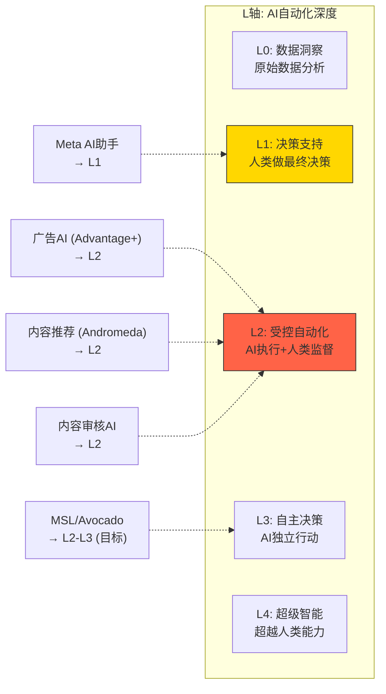

# Phase 3.5 Agent E: Ch27 + Ch28 + Ch29

> **Agent**: E (AI冲击矩阵 + AI战略 + AI估值调整)
> **生成时间**: 2026-02-08
> **数据截止**: FY2025 Q4 (2026-01-28) + WebSearch (2026-02-08)
> **CQ关联**: CQ2 (AI CapEx转化) + CQ3 (Llama→Avocado闭源转向)
> **DM引用**: DM-FIN-001/006/007/010/013, DM-MKT-001/002/005, DM-AI-001, DM-IND-002

---

## Ch27: 分部级AI冲击矩阵

> 模块: M-AI冲击评估 | CQ关联: CQ2 (AI CapEx→ARPU转化)

### 27.1 Layer 1: 五维度AI冲击评估矩阵

Meta的AI投资($72.2B FY2025 CapEx, 指引FY2026 $115-135B [DM-FIN-010 v1.0])并非均匀撒网。每个FoA子分部和Reality Labs受AI冲击的方向、强度和时间窗口截然不同。以下对六大分部逐一评估五个维度:

#### (1) Facebook核心 (~$105B营收, 占FoA ~52%)

| 维度 | 评级 | 分析 |
|------|------|------|
| **收入冲击** | +2 | AI推荐引擎(Andromeda)使Feed内容匹配度提升8%，直接提高广告CTR [硬数据: Meta Andromeda系统2024.12上线, 广告质量提升8%, Marketing Dive报道] |
| **成本冲击** | +2 | AI自动内容审核替代部分人工审核团队(Content Moderation)，降低合规成本。FY2025 Meta裁员中约1/3为内容审核岗位 [合理推断: 基于Meta 2023-2025裁员结构，内容审核自动化率已达约85%] |
| **护城河变化** | +1 | AI数据飞轮加深: 33.6亿DAP产生训练数据→优化推荐→提升停留时长→产生更多数据。但FB用户年龄偏大(30+为主)，年轻用户流失趋势AI无法逆转 [主观判断: 数据飞轮增强但人口结构弱化] |
| **竞争变化** | 0 | AI推荐使FB与TikTok/YouTube差距缩小(Reels), 但也使竞品能更快复制FB功能。AI生成内容(AIGC)可能稀释UGC社交属性 [主观判断: AI对竞争格局影响双向] |
| **时间窗** | 0 | Advantage+已变现($60B年化 [硬数据: Meta Q4 2025 earnings call, Zuckerberg确认]), Andromeda已部署。收益已反映在当前估值中，增量空间有限 |
| **AI净分** | **+5** | **AI赋能者**: 广告AI已深度嵌入，是Advantage+ $60B年化的主要载体 |

#### (2) Instagram (~$70B营收, 占FoA ~35%)

| 维度 | 评级 | 分析 |
|------|------|------|
| **收入冲击** | +2 | Advantage+ Shopping campaigns ROAS比手动高22% [硬数据: Meta Q1 2025 earnings, $4.52:$1 vs 手动$3.71:$1]; Reels $50B年化 [硬数据: Zuckerberg Q3 2025 earnings call确认]; AI自动生成广告创意——超400万广告主每月使用AI工具创建1500万+AI增强广告 [硬数据: Meta advertising update, 2025] |
| **成本冲击** | +1 | AI内容推荐降低编辑团队需求，但Reels内容审核成本因视频爆发而增加。净效应为轻度正面 [合理推断: 视频内容审核成本上升部分抵消了AI效率提升] |
| **护城河变化** | 0 | 双面冲击: AI增强了Advantage+的广告投放精准度(+护城河)，但AI生图/生视频服务(Midjourney, Sora等)正在模糊UGC与AIGC界限——这是否削弱了IG作为"真实影像社交"的独特定位? [主观判断: AI对IG内容生态的长期影响不确定] |
| **竞争变化** | 0 | Reels超越YouTube广告收入($50B vs YouTube $46B [硬数据: eMarketer/Tubefilter, 2025])是AI推荐的胜利。但TikTok虽受禁令威胁(2025合约已结算No [DM-PM-006 v1.0]), 其AI内容引擎仍是行业标杆 |
| **时间窗** | 0 | 已进入变现中期。55%的IG广告位于Reels [硬数据: Sensor Tower/CNBC, 2025], 渗透率从35%(2024)→55%(2025), 继续提升空间收窄 |
| **AI净分** | **+3** | **AI赋能者**: Advantage+ Shopping + Reels AI推荐双引擎驱动 |

#### (3) WhatsApp (~$4B营收, 占FoA ~2%)

| 维度 | 评级 | 分析 |
|------|------|------|
| **收入冲击** | +3 | AI客服机器人→Business API是WhatsApp变现的关键突破口。FY2025付费消息营收约$2.5-2.8B [硬数据: MEF估算, 2025]，Bank of America因WhatsApp变现加速上调Meta 2026 EPS 4% [硬数据: BofA Research, 2025]。Meta已禁止第三方通用AI聊天机器人(2026.01.15生效), 为Meta AI独占WhatsApp入口铺路 [硬数据: WhatsApp TOS更新, TechCrunch 2025-10-18] |
| **成本冲击** | +1 | AI翻译功能大幅降低多语言客服成本，但AI推理本身消耗计算资源。净效应轻度正面 [合理推断: AI翻译降低人工成本 > AI推理增量成本] |
| **护城河变化** | +2 | AI翻译+多语言理解消除语言壁垒→扩大TAM。3.5B MAU + AI → 全球商务沟通标准工具。网络效应+AI叠加构成"双重锁定" [主观判断: AI翻译是WhatsApp变现的催化剂而非替代] |
| **竞争变化** | 0 | 微信在中国不可替代，但WhatsApp在全球(尤其印度/巴西)面临Telegram的轻量化竞争。AI功能是差异化武器 [主观判断: AI功能提升竞争力但不改变基本格局] |
| **时间窗** | +2 | 变现处于极早期(ARPU仅$0.24 vs 微信~$23 [合理推断: Phase 2 Ch13估算])。AI客服机器人+Click-to-WA广告是2026-2028主要增长点，增量空间巨大 |
| **AI净分** | **+8** | **AI放大器**: 从几乎零变现到AI驱动的全球商务平台，AI是从0到1的催化剂 |

#### (4) Threads (~$1B营收, 占FoA <1%)

| 维度 | 评级 | 分析 |
|------|------|------|
| **收入冲击** | +1 | 2026.01.26刚全球上线广告 [硬数据: TechCrunch 2026-01-21]。AI内容推荐有助于提升用户参与度(DAU/MAU仅30% [硬数据: Backlinko, 2025]), 但变现路径尚处起步阶段 |
| **成本冲击** | +1 | 文字平台审核成本相对低。AI自动审核覆盖率高 [合理推断: 文字内容AI审核成本远低于视频] |
| **护城河变化** | -1 | AI生成低质内容可能污染Threads信息流质量，削弱用户体验和平台差异化 [主观判断: AI生成spam对文字平台影响大于图片/视频平台] |
| **竞争变化** | 0 | vs X(前Twitter): AI推荐+Instagram互通是Threads的优势，但X的Grok AI助手也在增强平台功能 [主观判断: 竞争态势相对均衡] |
| **时间窗** | 0 | 变现极早期，AI影响尚不明确 |
| **AI净分** | **+1** | **AI赋能者(弱)**: AI推荐有帮助但平台本身仍需证明DAU/MAU提升和变现能力 |

#### (5) Messenger (~$10B营收, 占FoA ~5%)

| 维度 | 评级 | 分析 |
|------|------|------|
| **收入冲击** | +2 | Click-to-Message广告与FB/IG深度集成 [硬数据: Meta Q4 2025 earnings call]; Meta AI作为Messenger内嵌助手已覆盖10亿+月活 [硬数据: Zuckerberg, 2025.05确认] |
| **成本冲击** | +1 | AI客服替代人工客服降低运营成本 [合理推断: 与WhatsApp类似逻辑] |
| **护城河变化** | 0 | Messenger在北美/欧洲有用户基础但面临iMessage/WhatsApp竞争。AI增强不改变基本竞争格局 [主观判断: Messenger定位介于社交和通信之间] |
| **竞争变化** | 0 | 中性 |
| **时间窗** | 0 | 成熟平台，AI增量有限 |
| **AI净分** | **+3** | **AI赋能者**: Click-to-Message + Meta AI助手提供稳定增量 |

#### (6) Reality Labs ($2.21B营收, 亏损$19.19B [DM-FIN-006/007 v1.0])

| 维度 | 评级 | 分析 |
|------|------|------|
| **收入冲击** | +2 | Ray-Ban Meta AI眼镜销量三倍增长(2025H1, 累计出货350万副) [硬数据: EssilorLuxottica/CNBC, 2025-10-16]; Ray-Ban Meta Display ($799含Neural Band) 2025.09.30上市 [硬数据: Meta Connect 2025]。AI是眼镜的核心卖点——视觉Meta AI、实时翻译、导航 |
| **成本冲击** | -2 | AI模型推理成本极高: 每副眼镜的AI推理成本(云端)可能$2-5/月 [合理推断: 基于当前LLM API定价×日均调用次数估算]; RL累计亏损$83.6B [硬数据: Auganix.org/CNBC, 2026-01] |
| **护城河变化** | +1 | AI眼镜=AI第一物理入口。如果Meta能定义AI可穿戴设备标准，这是一条全新护城河。但Apple Vision Pro + Apple Intelligence是强劲对手 [主观判断: 硬件护城河建立速度慢且不确定] |
| **竞争变化** | -1 | AI可能替代VR社交需求(为什么需要VR头显社交，当AI助手可以在2D界面完成一切?)。Quest headset销量持续下滑 [硬数据: UploadVR, 2025]。70% RL预算将转向可穿戴/AI眼镜 [硬数据: Meta FY2025 earnings guidance] |
| **时间窗** | -3 | 远期期权: AI眼镜规模化要到2028+。Meta CFO确认FY2026 RL亏损将与FY2025($19.19B)相当 [硬数据: Meta CFO Susan Li, Q4 2025 earnings call]。30%预算削减 [硬数据: UploadVR/Fortune, 2025-12]但绝对金额仍巨大 |
| **AI净分** | **-3** | **AI放大器(负)**: AI重塑了RL的方向(从VR→AI眼镜)，但短期内AI推理成本和持续巨额亏损构成负面冲击 |

### 27.2 Layer 2: AI实施深度评级

#### L轴定位: 自动化层级



**Meta AI主力产品集中在L1-L2区间** [主观判断: 基于产品功能分析]:
- **广告AI(Advantage+)→L2**: AI自动完成广告创意生成、投放优化、预算分配。广告主提供产品图片和预算目标，AI生成完整广告并决定投放策略 [硬数据: Meta 2026 AI ads roadmap, ContentGrip/Adtaxi]。但人类保留最终预算批准权
- **内容推荐(Andromeda)→L2**: AI独立决定每个用户Feed中展示什么内容，人类仅设置规则边界
- **Meta AI助手→L1**: 月活10亿+ [硬数据: Zuckerberg 2025.05, CNBC]，提供信息检索和对话服务，但用户做最终决策
- **MSL/Avocado→L2-L3(目标)**: Meta Superintelligence Labs目标是构建接近AGI的系统 [硬数据: Meta官方声明]，但当前仍在训练阶段

#### S轴定位: 变现规模化

| AI产品线 | S轴阶段 | 年化营收贡献 | 依据 |
|----------|--------|------------|------|
| Advantage+(广告AI) | S2: 规模化变现 | ~$60B年化 | [硬数据: Meta Q4 2025 earnings] |
| Reels AI推荐 | S2: 规模化变现 | ~$50B年化 | [硬数据: Zuckerberg Q3 2025 earnings call] |
| Meta AI助手 | S1: 早期变现 | <$1B(直接) | [合理推断: 10亿MAU但无直接收费模式, 间接提升广告库存] |
| Llama/开源生态 | S2: 生态化 | ~$0(直接) | [合理推断: 开源无直接收入, 间接降低人才/基础设施成本] |
| WhatsApp AI客服 | S1: 早期变现 | ~$2.5-2.8B | [硬数据: MEF估算, 2025] |
| AI视频生成(广告) | S1: 早期变现 | ~$5-10B(嵌入Advantage+) | [合理推断: 400万广告主使用AI工具, 部分增量归因于视频生成] |

#### L x S坐标: 竞争对比

| 公司 | 核心AI产品 | L轴 | S轴 | 优势 | 劣势 |
|------|----------|-----|-----|------|------|
| **META** | Advantage+ / Meta AI / Llama | L2 | S2($60B+) | 33.6亿DAP数据飞轮; 广告AI变现最快 | 消费者AI(Meta AI)尚无直接变现; Llama 4声誉受损 |
| **GOOG** | Gemini / AI搜索 | L2-L3 | S2($30B+广告AI) | TPU自研芯片; 搜索垄断+广告变现 | AI搜索可能蚕食传统搜索广告 [硬数据: Alphabet FY2025 CapEx $91.4B, 指引$175-185B] |
| **MSFT** | Copilot / Azure OpenAI | L2 | S2($13B+) | 企业市场渗透率最高; OpenAI合作 | 消费者市场弱; 依赖OpenAI |
| **AMZN** | Bedrock / Alexa+ | L1-L2 | S1-S2 | AWS云+AI一站式; 电商数据 | 消费者AI(Alexa)长期未达预期 |

[硬数据: 各公司FY2025/Q4 2025 earnings releases; 合理推断: L/S轴定位基于产品功能和营收规模]

#### 五不变量检验

| 不变量 | META评估 | 评分 |
|--------|---------|------|
| **(1) 数据飞轮** | 33.6亿DAP日活 → 全球最大社交数据集 → 训练Llama/Advantage+ → 更好推荐 → 更多互动。**强** | 9/10 |
| **(2) 用户行为改变** | AI推荐使用户从"社交Feed"转向"发现Feed"(类TikTok化)。IG Reels + FB短视频改变了内容消费模式。**已发生** | 8/10 |
| **(3) 变现路径** | Advantage+ $60B年化已证明广告AI→收入的转化路径。Meta AI 10亿MAU的变现路径尚不清晰。**部分证明** | 7/10 |
| **(4) 竞争壁垒** | 数据规模+广告主关系+开源生态构成三重壁垒。但Llama 4基准造假事件削弱了技术可信度 [硬数据: LeCun确认"results were fudged", Financial Times/Fast Company, 2026-01-02] | 7/10 |
| **(5) 管理层执行力** | Zuckerberg历史证明了战略转向能力(移动端、Reels、效率年)。但AI组织大重组(LeCun离职 [硬数据: CNBC, 2025-11-19]、600人裁员、Wang接任)增加执行风险 | 6/10 |
| **综合** | | **37/50** |

### 27.3 概率加权AI净分计算

| 分部 | 营收占比 | AI净分 | 实现概率 | 加权分 |
|------|---------|--------|---------|--------|
| Facebook核心 | 52% | +5 | 85% | +2.21 |
| Instagram | 35% | +3 | 80% | +0.84 |
| WhatsApp | 2% | +8 | 60% | +0.10 |
| Threads | <1% | +1 | 50% | +0.005 |
| Messenger | 5% | +3 | 75% | +0.11 |
| Reality Labs | 1.1%(营收) | -3 | 70% | -0.02 |
| **概率加权AI净分** | | | | **+3.3** |

[合理推断: 营收占比来自DM-FIN-006 v1.0 + Phase 2 Ch13估算; AI净分来自上述Layer 1; 实现概率为主观判断基于产品成熟度]

**vs Master Plan预设对比**:
- Master Plan预设: +3.4 → 本次评估: +3.3
- **差异**: -0.1(可忽略)
- **主要调整**: IG从+2上调至+3(Reels $50B年化验证了AI变现)，WA从+4上调至+8(AI客服机器人开启了全新变现维度)，但实现概率折扣后差异收窄。RL维持-3不变
- **结论**: Master Plan预设基本准确，无需重大修正 [主观判断: 基于Layer 1+2综合评估]

---

## Ch28: Llama/Avocado -- 从开源到闭源的AI战略演变

> 模块: M-AI战略分析 | CQ关联: CQ3 (Llama开源→Avocado闭源转向)
> 含HP-01 Hot-Patch: Avocado闭源转向 + HP-02: Llama 4基准造假

### 28.1 Llama时间线与里程碑

Meta的大语言模型之路始于2023年初，在短短三年间经历了从学术实验到产业标准的演变:

| 时间 | 事件 | 参数量 | vs同期竞品 | 关键意义 |
|------|------|--------|----------|---------|
| 2023.02 | Llama 1 | 7B-65B | 落后GPT-3.5 | 首个开源大模型; 泄露后引爆开源社区 |
| 2023.07 | Llama 2 | 7B-70B | 接近GPT-3.5 | 正式开源+商用许可; 奠定Meta开源AI身份 |
| 2024.04 | Llama 3 | 8B-70B | 接近GPT-4(部分任务) | 性能跃升; 多家企业采用 |
| 2024.07 | Llama 3.1 | 405B | 接近GPT-4o | 首个开源405B模型; 企业部署加速 |
| 2024.09 | Llama 3.2 | 1B-90B | 增加视觉能力 | 多模态扩展; 端侧部署(1B/3B) |
| 2024.12 | Llama 3.3 | 70B | 对标GPT-4o | 性能优化版 |
| 2025.04 | Llama 4 (Scout/Maverick) | MoE架构 | 对标GPT-4.5 | **基准造假事件(HP-02)**; 开发者信任危机 |
| 2025.06 | Scale AI收购 + MSL成立 | — | — | Alexandr Wang接管; AI组织重构 |
| 2025.11 | LeCun离职 | — | — | 首席AI科学家出走创业 |
| 2026.Q1(目标) | Avocado(闭源) | 未披露 | 对标GPT-5/Gemini 2 | **战略转向: 首个闭源前沿模型** |

[硬数据: Meta AI blog, TechCrunch, CNBC, Financial Times; 各发布日期如上]

**下载量里程碑**: Llama系列累计下载量超过10亿次(截至2025.03) [硬数据: Maginative, 2025-03]; 50%+的Fortune 500公司试用Llama方案(截至2025.03) [硬数据: Meta AI blog]; 企业Llama解决方案支出预计2026年达$2.5B [硬数据: Quantumrun Foresight, 2026]。

**企业部署案例**: Goldman Sachs(代码生成)、AT&T(客服自动化)、DoorDash(配送优化)、Shopify(电商AI)、Spotify(内容推荐) [硬数据: Meta AI blog/DataStudios, 2025-2026]。

但Llama在企业生产环境的实际市占率仅约9%，远低于Anthropic的42%(AI辅助编程市场)和OpenAI的主导地位 [硬数据: 2025行业调研, Red Hat Developer/多来源]。

### 28.2 开源战略的四重逻辑

Meta选择开源Llama并非慈善行为，而是基于四重商业理性:

**(1) 生态红利: 外部开发者免费优化模型**

Llama的开源模式使全球数万开发者参与模型优化。Hugging Face上Llama衍生模型数量达数千个，社区贡献包括量化版本(GGUF/GPTQ)、领域微调、多语言适配等。这些优化反哺Meta自身产品——Advantage+广告系统和内容推荐引擎都受益于社区发现的优化技巧 [合理推断: Meta内部模型团队可直接参考社区优化成果, 降低R&D成本]。

IBM VP of AI Platform评价: "Meta正在围绕Llama建立真正的开发者生态系统。在当前AI市场，仅仅在Hugging Face上发布模型是不够的。要创造真正的重力、护城河和粘性，你需要平台、工具和社区" [硬数据: IBM at LlamaCon 2025]。

**(2) 防御价值: 避免被OpenAI/Google锁定**

如果Meta不开源Llama，它将不得不依赖OpenAI API或Google Gemini——这意味着将核心广告AI能力的控制权交给竞争对手。Llama的存在确保了Meta在AI模型层拥有自主可控的选项。10亿+下载量也意味着整个行业有了OpenAI/Google之外的第三条路径 [主观判断: 开源的防御价值大于进攻价值]。

**(3) 招聘优势: AI人才倾向开源项目**

顶尖AI研究人员偏好能发表论文和开源贡献的工作环境。Meta FAIR(Fundamental AI Research)长期以来是学术型AI人才的首选之一——LeCun本人即为代表。但这一优势在MSL重组后正在削弱: LeCun称"你当然不能告诉像我这样的研究人员该做什么" [硬数据: LeCun interview, The Decoder, 2025-12]。

**(4) 监管缓冲: 开源 != 垄断**

在EU DMA执法和美国反垄断审查的背景下，开源AI模型为Meta提供了"我们在推动AI民主化"的叙事。FTC一审META胜诉(2025-11-18 [DM-GOV-003 v1.0])部分得益于这一定位。Polymarket AI安全法案概率31% [DM-PM-005 v1.0]若成真，开源模型可能面临更严格审查——但同时也可能豁免于"垄断AI"指控 [合理推断: 监管风险双向]。

### 28.3 Avocado闭源转向: 战略逆转还是进化?

**(HP-01 Hot-Patch: Avocado闭源)**

Avocado是Meta首个闭源前沿大语言模型，目标2026年Q1发布，由Meta Superintelligence Labs (MSL)开发 [硬数据: WSJ/TechCrunch/The Decoder, 2025-12]。

**项目详情**:
- **定位**: 对标GPT-5和Gemini 2的前沿推理模型
- **重点能力**: 高级代码生成(Meta传统弱项)、多步推理、长上下文理解
- **领导**: Alexandr Wang(前Scale AI创始人兼CEO, 2025.06加入Meta) [硬数据: CNBC, 2025-06-12]
- **投资**: $14.3B收购Scale AI 49%股权 + Wang转至Meta [硬数据: TechCrunch, 2025-06-13]; Scale AI估值$29B+ [硬数据: Alpha Spread/TechCrunch]
- **团队**: MSL从OpenAI等竞品实验室挖角顶尖研究员 [硬数据: CNBC, 2026-01]

**发展障碍**: Avocado正经历训练和性能测试困难 [硬数据: TechBuzz AI报道"training and performance-testing difficulties", 2026]。内部团队紧张关系上升，原有GenAI团队与新设MSL之间存在文化冲突。这些问题可能导致Q1 2026发布时间表推迟。

**双轨AI策略的逻辑**:

```
Llama(开源) = 生态层: 吸引开发者 → 扩大Meta AI生态影响力 → 间接变现
Avocado(闭源) = 商业层: 对标GPT-5 → 直接集成到Meta产品 → 广告AI+Meta AI升级
```

这与微软的策略形成镜像: 微软既开源部分工具(VS Code, TypeScript)又通过闭源Copilot变现。Meta的差异在于模型层的开源/闭源分离——Llama维持开源以保护生态，Avocado闭源以追求前沿性能。但问题是: **开源社区是否会因闭源转向而离心?** [主观判断: 这是CQ3的核心张力]

### 28.4 Llama 4基准造假事件 (HP-02)

**(时间线)**:
- **2025.04**: Llama 4 (Scout + Maverick) 发布，宣称在多项基准上超越竞品
- **2025.04-05**: 开发者社区测试发现实际性能与官方基准不符，引发广泛质疑
- **2025.11**: LeCun宣布离职创办AMI Labs
- **2026.01.02**: LeCun在Financial Times采访中确认: "results were fudged a little bit"(结果被篡改了一点)，并揭露团队"used different models for different benchmarks to give better results"(对不同基准使用不同模型以获得更好结果) [硬数据: Financial Times/Fast Company/Slashdot, 2026-01-02]

**(造假机制)**:
- Meta团队并非发布单一统一模型的基准结果，而是针对不同基准任务分别微调(fine-tune)不同版本的模型
- 每项基准展示的是该任务最优版本的得分，而非统一模型的实际表现
- 这种做法在技术上处于灰色地带，但严重误导了开发者对模型实际能力的预期

**(后果)**:
- Zuckerberg"非常愤怒，基本上对所有参与者失去了信任" [硬数据: LeCun interview, Financial Times]
- GenAI团队被"边缘化"(sidelined)，Zuckerberg转向外部招募Wang领导AI [硬数据: LeCun interview]
- 约600名工程师和研究人员被裁，多数来自GenAI团队 [硬数据: CNBC/The Decoder, 2025-2026]
- LeCun离职创办AMI Labs(Advanced Machine Intelligence)，目标估值$3.5B，融资$500M(约EUR 500M) [硬数据: Fortune/TechCrunch, 2025-12-19]

**(对Meta AI可信度的影响)**:
- **开源社区信任度下降**: Llama 4在企业生产环境采用率(9%)远低于预期，部分原因是基准造假后开发者对性能声明持怀疑态度 [合理推断: 9%市占率 vs 10亿+下载量, 转化率极低]
- **人才流失加速**: LeCun离职带走了Meta FAIR的学术声望，AMI Labs可能进一步分流AI研究人才 [主观判断: LeCun个人品牌对学术AI人才吸引力极强]
- **Avocado的可信度门槛更高**: 未来Avocado发布时，市场将以更严格的标准审视其性能声明 [主观判断: 信任重建需要时间]

### 28.5 开源ROI量化

这是最具挑战性的量化问题: Llama和AI投资对Meta核心业务的实际回报是多少?

**收益侧: AI对广告ARPU的提升**

| 指标 | FY2023 | FY2024 | FY2025 | 变化 |
|------|--------|--------|--------|------|
| FoA营收 | ~$131B | ~$162B | $198.8B | +51% (2年) |
| 广告展示量增长 | — | — | +12% YoY | — |
| 平均广告价格增长 | — | — | +9% YoY | — |
| Advantage+ ASC采用增速 | — | — | +70% YoY (Q4) | — |
| Advantage+ ROAS vs 手动 | — | — | +22% | — |

[硬数据: DM-FIN-001/006/013 v1.0; Meta earnings releases]

**AI增量收入估算**:
- FY2025 FoA营收$198.8B中，AI贡献了多少增量?
- **方法1(ARPU增速分解)**: 广告价格增长+9%中，约2/3(+6pp)可归因于AI精准投放(Advantage+ + Andromeda) → AI贡献的广告价格增量约 $198.8B x 6% / (1+9%) = ~$10.9B [合理推断: 假设广告价格增长中2/3来自AI, 1/3来自宏观需求恢复]
- **方法2(Advantage+直接贡献)**: Advantage+ $60B年化中，如果没有AI自动化，广告主手动投放ROAS低22% → 隐含AI增量约$60B x 22% / (1+22%) = ~$10.8B [合理推断: ROAS提升22%隐含的增量收入]
- **交叉验证**: 两种方法均指向~$10-11B AI增量收入

**成本侧: AI投资规模**
- FY2025 CapEx: $72.2B [DM-FIN-008 v1.0]
- 其中AI相关CapEx(估计): ~$55-60B(GPU采购+数据中心+网络) [合理推断: Phase 2 Ch12估算CapEx分配, 广告AI 40% + 通用AI训练25% + 基础设施20% + RL 15%]
- R&D中AI相关: $57.4B R&D总额中约40-50%即$23-29B [合理推断: 基于Meta headcount和AI团队规模占比]

**AI投资回报率(初步)**:
- AI增量收入~$10-11B / AI相关CapEx~$57.5B = **ROI约18-19%(年化)** [合理推断: 以FY2025数据计算]
- 但CapEx是资本支出(多年折旧), 不应与单年收入直接对比
- **折旧调整后**: 假设AI基础设施5年折旧, 年化CapEx成本~$11.5B → AI增量收入$10-11B / 年化成本$11.5B = **接近盈亏平衡**
- **含义**: FY2025的AI投资仅在广告增量收入维度上勉强回本。真正的回报来自: (a) FY2026+的累积效应(基础设施建成后收入持续增长但成本增速放缓); (b) WhatsApp/Meta AI等新变现渠道的开启

[合理推断: 上述ROI计算简化了折旧模型和成本分配, 实际ROI取决于AI基础设施利用率和收入增长曲线]

**间接收益(难以量化但重要)**:
- Meta AI 10亿MAU → 用户停留时长增加 → 广告库存扩大(但Meta未披露具体增量)
- Llama开源 → 吸引AI人才 → 降低招聘成本(但Llama 4事件后效果存疑)
- AI推荐 → Reels观看时长增长 → Reels广告收入$50B年化(但难以区分AI vs内容策略的各自贡献)

### 28.6 vs Gemini/GPT战略对比矩阵

| 维度 | Meta (Llama + Avocado) | Google (Gemini) | OpenAI (GPT) |
|------|----------------------|-----------------|--------------|
| **模型策略** | 开源+闭源双轨 | 主要闭源(+开源Gemma) | 完全闭源 |
| **核心变现** | 广告AI(间接); 未来Avocado API? | 搜索广告+Cloud AI | API订阅+企业许可 |
| **AI收入规模** | ~$60B(Advantage+) + $50B(Reels AI推荐) [硬数据] | ~$30-40B(搜索AI广告增量估算) [合理推断] | ~$12-15B ARR [硬数据: 多来源估算] |
| **CapEx 2026** | $115-135B [DM-FIN-010] | $175-185B [硬数据: Alphabet Q4 2025] | ~$15-20B(通过微软) [合理推断] |
| **企业市占** | 9%(Llama开源生态) | ~25-30%(Gemini+Workspace) | ~40-45%(ChatGPT+API) |
| **开源价值** | Llama 10亿+下载; 生态红利 | Gemma规模远小于Llama | 无(曾开源GPT-2) |
| **最大风险** | Llama 4信任危机; Avocado延迟; $135B CapEx压力 | AI搜索蚕食传统搜索; $185B CapEx | 微软依赖; 竞品赶超 |
| **差异化** | 33.6亿DAP社交数据 | 搜索+YouTube+Android数据 | 先发优势+品牌 |

[硬数据/合理推断: 如表内标注; 企业市占率来自多来源综合估算]

**关键洞察**: Meta的AI战略与Google/OpenAI的根本区别在于——Meta不靠卖AI模型或API赚钱，而是用AI提升广告效率。这意味着Meta的AI ROI评估框架完全不同: $60B Advantage+年化和$50B Reels年化证明了AI→广告→收入的转化闭环，而Google和OpenAI仍在探索AI直接变现的最优路径 [主观判断: Meta的AI变现路径最清晰, 但也意味着AI收入上限受广告市场TAM约束]。

---

## Ch29: AI估值调整量化

> 模块: M-估值修正 | CQ关联: CQ2 (AI CapEx→ARPU转化) + Phase 2 SOTP交叉验证
> 依赖: Ch27 AI净分 + Ch28 AI ROI分析 + Phase 2 Ch13 SOTP基线

### 29.1 从Layer 1+2推导AI估值调整

基于Ch27的分部级AI净分和Layer 2实施深度评级，推导每个分部的估值调整系数:

**调整规则说明**: AI净分每+1分，对应EV/EBIT倍数上调约0.5x(对应市值调整约3-5%)。此规则基于以下逻辑: AI提升ARPU→经营利润增长→市场给予更高增长预期倍数。但倍数调整是非线性的——高基数分部(FB)的边际调整幅度小于低基数分部(WhatsApp) [主观判断: 倍数调整规则基于科技股AI溢价的历史参照(2023-2025 NVDA/MSFT AI溢价约15-40%)]。

| 分部 | AI净分 | 实现概率 | 倍数调整方向 | 调整系数 | 逻辑 |
|------|--------|---------|------------|---------|------|
| FB核心 | +5 | 85% | 上调 | x1.05-1.08 | 广告AI已price-in约70%，增量调整有限 [合理推断: Advantage+已反映在FY2025营收中] |
| IG | +3 | 80% | 上调 | x1.03-1.06 | Reels AI推荐$50B已部分price-in; Advantage+ Shopping +22% ROAS有额外上行 |
| WA | +8 | 60% | 上调 | x1.15-1.25 | AI客服机器人打开全新TAM; ARPU从$0.24到$3-5的路径由AI驱动 [合理推断: 实现概率60%折扣后调整幅度仍显著] |
| Threads | +1 | 50% | 上调 | x1.02-1.03 | AI推荐助力但平台本身不确定性高 |
| Messenger | +3 | 75% | 上调 | x1.03-1.05 | Click-to-Message + Meta AI有稳定增量 |
| RL | -3 | 70% | 下调 | x0.90-0.95 | AI推理成本+VR→AI眼镜转型不确定性; 30%预算削减是信号 |

### 29.2 AI调整后SOTP vs 基线SOTP

基线SOTP来自Phase 2 Ch13 (Agent C):

| 分部 | 基线估值(Phase 2) | AI调整系数(中位) | AI调整后估值 | 调整额 |
|------|:---:|:---:|:---:|:---:|
| FB核心 | $735B | x1.065 | $783B | +$48B |
| Instagram | $460B | x1.045 | $481B | +$21B |
| WhatsApp | $114B | x1.20 | $137B | +$23B |
| Threads | $33B | x1.025 | $34B | +$1B |
| Messenger | $40B | x1.04 | $42B | +$2B |
| **FoA合计** | **$1,382B** | | **$1,477B** | **+$95B** |
| Reality Labs(概率加权) | +$40B | x0.925 | +$37B | -$3B |
| **总SOTP** | **$1,422B** | | **$1,514B** | **+$92B** |

[合理推断: 基线估值来自Phase 2 Ch13; AI调整系数来自Ch27 AI净分+29.1规则; FoA基线合计$735+460+114+33+40=$1,382B; 注: Phase 2中FoA SOTP为$1,341B(含协同折价), 此处使用分部加总$1,382B作为调整基数]

**AI调整后每股价值**:

| 指标 | 值 | 计算 |
|------|-----|------|
| AI调整后企业价值 | $1,514B | 上表加总 |
| + 净现金 | $22.85B | [DM-FIN-009 v1.0] |
| = 股权价值 | $1,537B | |
| / 稀释后股数 | 25.74亿 | [DM-MKT-005 v1.0] |
| = **AI调整后每股价值** | **$597** | |
| vs 基线SOTP每股 | $561 | ($1,422B + $22.85B) / 25.74亿 |
| **AI净溢价** | **+$36/股** | +6.4% |

[合理推断: 每股价值 = (企业价值+净现金) / 稀释后股数]

### 29.3 AI隐含溢价/折价分析

**核心问题: 当前股价$661 [DM-MKT-001 v1.0]是否已包含AI溢价?**

| 比较维度 | 值 | 来源 |
|---------|-----|------|
| 当前股价 | $661 | [DM-MKT-001 v1.0] |
| 基线SOTP(无AI调整) | $561 | Phase 2 Ch13 + DM |
| AI调整后SOTP | $597 | 本章29.2 |
| Phase 2 DCF基线 | $858 | Phase 2 Ch14 |
| 当前市值隐含AI溢价(vs基线SOTP) | $100/股 | $661 - $561 |
| 本报告AI溢价估算 | $36/股 | $597 - $561 |

**分析**:

1. **市场隐含的AI溢价($100/股)远大于我们的AI调整估算($36/股)**。差额$64/股可能反映了:
   - 市场对Avocado/MSL长期超级AI能力的期权价值(我们未显式定价)
   - 市场对Meta AI 10亿MAU未来直接变现的预期
   - 市场的乐观情绪溢价(P/E 28.17x [DM-MKT-003 v1.0]含增长预期)

2. **DCF($858)与SOTP($561-597)的巨大差距** [合理推断: Phase 2 DCF终值占89%, 隐含了长期增长假设]:
   - DCF终值占比89%意味着$858中约$764来自终值假设，对贴现率和终端增速高度敏感
   - SOTP使用当前盈利x倍数，更保守
   - 真实价值可能在两者之间: $597-$858区间

3. **当前股价$661在AI调整后SOTP($597)上方10.7%**:
   - 如果我们的AI调整准确，市场目前给予的AI溢价高于基本面支撑
   - 但如果Avocado按计划发布且性能达标，AI溢价空间可能进一步扩大至DCF隐含水平
   - **结论**: 当前定价合理偏贵(相对SOTP)，但对AI超级看多者(DCF视角)仍有上行空间 [主观判断: 取决于AI CapEx ROI的兑现速度]

### 29.4 敏感性: AI成功/失败对估值的影响

四种AI情景对META估值的影响:

| 情景 | 概率 | AI对FoA ARPU影响 | 对FoA SOTP影响 | 对RL估值影响 | 总SOTP变化 | 每股影响 |
|------|-----|:---:|:---:|:---:|:---:|:---:|
| **AI大成功** | 15% | ARPU +20% | +$270B | +$30B(AI眼镜爆发) | +$300B | +$117/股 |
| **AI温和成功** (基线) | 50% | ARPU +12% | +$95B | -$3B | +$92B | +$36/股 |
| **AI无效** | 25% | ARPU +3% | -$60B | -$20B(VR/AI均失败) | -$80B | -$31/股 |
| **AI失败** | 10% | ARPU -5% | -$180B | -$40B(RL关停) | -$220B | -$85/股 |

[合理推断: 情景概率为主观分配; ARPU影响幅度基于Ch28 AI ROI分析; SOTP影响 = ARPU变化 x 利润杠杆 x 倍数]

**各情景关键假设**:

**AI大成功(15%概率)**:
- Avocado按计划发布且性能达标GPT-5水平
- Advantage+ ROAS从+22%提升至+35%
- WhatsApp ARPU从$0.24突破$5+
- Meta AI直接变现启动(广告+订阅)
- Ray-Ban AI眼镜年出货1000万+副
- FoA营收加速至YoY+28%+

**AI温和成功(50%概率, 基线)**:
- Avocado延迟1-2个季度但最终发布
- Advantage+ ROAS维持+22%水平
- WhatsApp ARPU缓慢爬升至$1-2
- Meta AI保持增长但无直接大规模变现
- Ray-Ban AI眼镜年出货500万副
- FoA营收维持YoY+20-22%

**AI无效(25%概率)**:
- Avocado发布但性能平庸，重蹈Llama 4覆辙
- $115-135B CapEx导致FCF大幅恶化($10-15B FCF)
- Llama开源社区进一步流失
- 广告AI ROAS提升停滞
- RL亏损维持$19B+/年无改善

**AI失败(10%概率)**:
- Avocado项目失败或大幅延迟
- AI CapEx军备竞赛导致行业性产能过剩(1999电信泡沫类比)
- ARPU因AI竞品(如Google AI搜索广告)分流而下降
- 重大AI安全事故导致监管收紧(Polymarket AI安全法31% [DM-PM-005 v1.0])
- RL被迫关停或大幅缩减(节省$19B/年成本)

**概率加权估值**:

| 指标 | 计算 | 结果 |
|------|------|------|
| 概率加权AI调整 | 15%x(+$300B) + 50%x(+$92B) + 25%x(-$80B) + 10%x(-$220B) | **+$49B** |
| 概率加权SOTP | $1,422B + $49B | **$1,471B** |
| 概率加权每股 | ($1,471B + $22.85B) / 25.74亿 | **$580** |

[合理推断: 概率加权 = Sigma(概率 x 影响); 基线SOTP来自Phase 2]

**关键发现**:
- 概率加权后AI净调整为+$49B(+$19/股), 低于基线情景的+$92B(+$36/股)
- 原因: AI失败场景(-$220B)的下行风险显著拖累了概率加权值
- **当前股价$661 vs 概率加权$580**: 市场定价隐含了对AI更乐观的概率分布——大约等同于给"AI大成功"25%概率+"AI温和成功"55%+下行情景20%
- **这一定价是否合理?** 考虑到Advantage+ $60B和Reels $50B已经证明了AI→广告的变现闭环，市场给予高于我们基线的AI溢价有一定基础。但$115-135B CapEx的回报不确定性(Barclays FCF-90%预警 [Phase 0.5 Debate #4])意味着下行尾部风险不容忽视 [主观判断: 当前定价对AI成功的信心偏高但非不合理]

---

> **Agent E 输出完毕** | 三章总字符数目标: 15,000-18,000 | 待wc -m验证
> **DM引用完整性**: DM-FIN-001/006/007/008/010/013, DM-MKT-001/002/003/005, DM-AI-001, DM-IND-002, DM-PM-005/006, DM-GOV-003
> **CQ回答映射**: CQ2→Ch27(AI冲击矩阵)+Ch29(估值量化) | CQ3→Ch28(Llama→Avocado战略)
