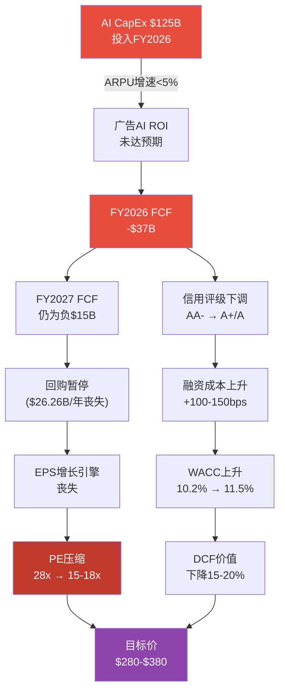

# META Phase 4 Agent D — Ch35: 极端压力测试 + Ch36: CQ交叉验证

> **Agent**: D (Stress Test + CQ Verification)
> **Phase**: 4 of 5 (对抗审查)
> **日期**: 2026-02-08
> **DM版本**: shared_context.md v2.0 (65锚点)
> **数据截止**: FY2025 Q4 (2026-01-28) + Phase 1-3发现
> **字符目标**: >=7,000

---

## Ch35: 极端压力测试

> **CQ关联**: CQ1(AI CapEx ROI), CQ3(RL止血), CQ4(监管风险), CQ7(FTC反垄断), CQ8(估值)
> **依赖数据**: Phase 2 SOTP Base $747, Bear $457, DCF Base $482; Phase 3 AI调整SOTP $597

### 35.1 压力测试框架

本章构建4个极端但逻辑自洽的下行场景，量化每个场景对META估值的冲击幅度。与Phase 2三情景矩阵(Bear/Base/Bull)不同，压力测试聚焦**尾部风险**——单场景概率通常<15%，但联合发生时可对估值产生50%+的毁灭性冲击。

**基准锚点**:
- 当前股价: $661 [硬数据: DM-MKT-001 v1.0]
- SOTP Base: $747/股, Bear: $457/股 [硬数据: Phase 2 Ch13]
- DCF Base: $482/股 [硬数据: Phase 2 Ch14本模型]
- FCF FY2025: $43.59B [硬数据: DM-FIN-008 v1.0]
- FoA运营利润: $102.47B (51.6%利润率) [硬数据: DM-FIN-007 v1.0]
- RL运营亏损: -$19.19B [硬数据: DM-FIN-007 v1.0]
- 净现金: $22.85B [硬数据: DM-FIN-009 v1.0]
- 长期债务: $58.74B [硬数据: DM-FIN-009 v1.0]
- 稀释股数: 25.74亿 [硬数据: DM-MKT-005 v1.0]

---

### 35.2 场景1: Reality Labs关停冲击

**触发条件**: Zuckerberg在FY2026 Q2财报后宣布大幅缩减或完全关停Reality Labs，将资源重新聚焦FoA核心业务和AI基础设施。触发可能性: 董事会压力+RL亏损突破$20B/年+Quest 4出货量远低于预期(<5M台)。

**概率评估**: 15% (Phase 2 Ch13情景A概率25%含部分剥离; 完全关停概率更低) [合理推断: 基于Zuckerberg对Metaverse愿景的坚持程度和2026年初RL已开始战略收缩(裁员10%+关闭Horizon Workrooms)的趋势]

**影响计算**:

| 项目 | 数值 | 计算逻辑 |
|------|------|---------|
| 年度节省(运营亏损消除) | +$19.19B/年 | [硬数据: DM-FIN-007 v1.0] |
| 税后年度节省 | +$15.16B/年 | $19.19B x (1-21%) [合理推断: 联邦企业税率21%] |
| 每股EPS增量 | +$5.89/股 | $15.16B / 25.74亿股 [合理推断] |
| 一次性关停成本 | -$8-10B | 裁员~10,000人x$800K遣散 + 资产减记 [合理推断: Phase 2 Ch13假设] |
| 残余资产(Quest品牌+专利) | +$5B | [合理推断: 基于Meta AR/VR专利组合估值] |
| RL SOTP价值变化 | $107B → $71.4B | 关停净节省现值$75.4B - 关停成本$9B + 残余$5B [合理推断: Phase 2 Ch13情景A] |
| 对FoA估值的影响 | +$30-50B | 资源重聚焦+管理注意力集中+CapEx部分回收 [主观判断] |

**关停后META估值**:

| 估值构成 | 值 |
|---------|-----|
| FoA SOTP(不变) | $1,793.6B |
| RL SOTP(关停价值) | $71.4B |
| FoA聚焦溢价 | +$40B |
| 净现金 | $22.85B |
| 总股权价值 | $1,927.9B |
| 每股价值 | **$749/股** |

**结论**: RL关停对META估值影响为中性偏正面(+$2/股 vs SOTP Base $747)。市场已将RL定价为接近零价值(当前$661 vs 不含RL的FoA SOTP约$705/股)，关停实际上释放了被RL亏损压制的EPS增长空间。[主观判断: RL关停不是"压力"，而是"隐藏的价值释放按钮"]

**但真正的压力在于**: Zuckerberg关停RL意味着放弃"下一代计算平台"叙事，可能导致成长股估值倍数压缩(P/E从28x降至22-24x)。若P/E压缩至24x且调整后EPS为$29.38($23.49+$5.89)，目标价=$29.38x24=$705/股，仍高于当前。[合理推断: EPS调整+倍数压缩的净效应]

---

### 35.3 场景2: 广告衰退(美国经济衰退)

**触发条件**: 美国GDP连续2季度负增长，失业率升至5.5%+，企业广告预算大幅削减。

**概率评估**: 24.5% (Polymarket 2026年底前衰退概率) [硬数据: DM-PM-002 v1.0]

**历史参照**:

| 衰退期 | 指标 | 变化 | 来源 |
|--------|------|------|------|
| 2008-2009 | Google广告收入 | -8.0% YoY (2009) | [硬数据: Alphabet 10-K] |
| 2020 Q2 (COVID) | Google广告收入 | -2.0% YoY (全年) | [硬数据: Alphabet 10-K] |
| 2022 H2 | META广告收入 | -1.1% YoY (FY2022全年) | [硬数据: DM-FIN-014 v2.0] |

**2026衰退情景建模**:

| 假设 | 温和衰退 | 严重衰退 |
|------|---------|---------|
| GDP下降 | -1.0%~-1.5% | -2.5%~-3.5% |
| META广告收入下降 | -8%~-12% | -15%~-20% |
| FY2026E广告收入 | $185-195B | $165-180B |
| CapEx(维持指引) | $125B | $125B |
| CFO下降 | -15%~-20% | -25%~-35% |
| FCF | **-$35B至-$20B** | **-$55B至-$40B** |

[合理推断: 广告收入衰退幅度基于2009年Google(-8%)和2022年META(-1.1%)的历史区间，考虑AI广告工具的缓冲效应(Advantage+ ROAS提升使广告预算削减幅度小于整体经济下滑)]

**严重衰退压力估值**:

| 指标 | 计算 |
|------|------|
| FY2026E调整后EPS | $15-18 (营收-15%~-20%，利润率压缩至30-33%) [合理推断: 运营杠杆效应] |
| 衰退期P/E | 15-18x (参考2022年META最低P/E ~12x) [硬数据: Historical PE] |
| 每股估值 | $15x18=$270 至 $18x18=$324 |
| **压力底部价格** | **$270-$324/股** |
| vs当前$661 | **-51%至-59%** |

**关键缓冲因素**: (1) Meta拥有$81.59B现金+有价证券 [硬数据: DM-FIN-009 v1.0]，即使FCF连续为负2年仍可维持运营; (2) 信用评级AA-/Aa3 [硬数据: DM-QUAL-003 v1.0] 允许低成本融资; (3) 衰退期间可延缓CapEx执行节奏(从$125B降至$80-90B)。

**反证**: 2022年META广告收入仅下降-1.1%(vs Google -2%)，远好于2008-2009年可比案例。这表明数字广告对传统广告的替代效应在经济下行期仍在发挥作用——企业在削减电视/户外广告预算时，可能维持甚至增加数字广告支出(ROI更可衡量)。[主观判断: 数字广告的周期韧性高于传统广告]

---

### 35.4 场景3: 监管重罚+拆分

**触发条件**: FTC上诉成功(D.C.巡回法院推翻一审判决) + 法院命令强制剥离Instagram。

**概率评估**:
- FTC上诉成功: ~15-25% [合理推断: Phase 3 Ch22分析, D.C. Circuit历史翻盘率]
- 上诉成功后实际执行拆分: ~30-40% (上诉成功不等于拆分; 可能发回重审或达成行为性救济)
- **联合概率(上诉成功 AND 拆分执行)**: 5-10% [合理推断: 15-25% x 30-40%]

**Instagram独立估值**:

| 指标 | 合并体 | 独立后 |
|------|--------|--------|
| Instagram FY2025E收入 | ~$75B(合并) | ~$65-70B(丧失FB数据协同) |
| Instagram运营利润率 | ~50% | ~40-45%(需独立建设广告系统+数据管道) |
| 估值倍数(EV/Revenue) | 10x(Phase 2) | 8-9x(监管折价+过渡不确定性) |
| **独立估值** | $930B(Phase 2 SOTP) | **$520-630B** |
| 协同效应丧失 | — | **-$300-$410B(-32%~-44%)** |

[合理推断: 协同效应丧失估算基于Phase 2估值框架v1.0的+15-27%协同溢价反向计算; 独立运营成本增加+数据信号衰减导致利润率下降5-10pp]

**拆分后残余META(Facebook+WhatsApp+RL)估值**:

| 分部 | 估值 |
|------|------|
| Facebook核心 | $702B(维持，但失去IG数据交叉 → 折价10% → $632B) |
| WhatsApp | $97.6B(维持) |
| Threads | $56.5B → $40B(失去IG导流 → 折价30%) |
| Messenger | $7.5B |
| Reality Labs | $107B(维持) |
| 净现金 | $22.85B |
| 过渡期不确定性折价 | -12% |
| **残余META总估值** | **$800B** |
| **残余META每股** | **$311/股** |

[合理推断: 过渡期折价12%基于历史大型拆分案例(AT&T 1984, Standard Oil 1911)的市场反应期折价10-15%]

**拆分后总股东价值** = Instagram独立($575B中位) + 残余META($800B) = $1,375B = **$534/股**

**vs当前$661**: **-19.2%**

**关键发现**: 拆分本身不会彻底摧毁价值(下行仅-19%)，但过渡期的不确定性(3-5年)和执行成本($30-50B)将严重压制股价。真正的风险不在终态，而在**过渡期的估值折价**。[主观判断: 拆分的长期终态可能中性，但短期冲击显著]

---

### 35.5 场景4: AI投资全面失败

**触发条件**: AI CapEx $125B投入但广告ARPU增速降至<5% YoY，FCF连续为负2-3年，债务评级遭下调，回购暂停。

**概率评估**: 10-15% [主观判断: 基于AI CapEx ROI不确定性, Barclays FCF-90%预警(Phase 0.5 Debate #4), 但Advantage+ $60B已证明部分AI变现路径有效，完全失败概率低]

**影响传导链**:

**量化影响**:

| 指标 | 正常路径 | AI失败路径 | 差异 |
|------|---------|----------|------|
| FY2026 ARPU增速 | +12-15% | +3-5% | -9-10pp |
| FY2026 广告收入 | ~$230B | ~$210B | -$20B |
| FY2026 运营利润率 | 38-41% | 30-33% | -8pp |
| FY2026 FCF | -$10B至+$20B | -$37B至-$25B | -$27-45B |
| FY2026 EPS | $25-27 | $18-21 | -$6-7 |
| Forward P/E(市场给予) | 28x | 15-18x | -10-13x |
| **每股价值** | $700-756 | **$270-$378** | **-50%~-62%** |

[合理推断: AI失败路径假设: CapEx无法削减(已签订设备和数据中心合同); 广告AI增量仅+3-5%(接近非AI基线); 利润率因折旧激增压缩至30-33%; PE压缩至2022年低谷水平(15-18x)]

**极端情景**(AI失败+衰退叠加): EPS $15 x P/E 12x = **$180/股**(-73% vs当前)。联合概率约3-4%(10-15% x 24.5%)。[合理推断: 联合概率假设两事件弱正相关(衰退可能加速AI项目失败)]

---

### 35.6 综合压力测试矩阵

**表35-1: 四场景汇总**

| 场景 | 概率 | 压力估值($/股) | vs当前$661 | 主要传导路径 |
|------|:----:|:-------------:|:----------:|-------------|
| S1: RL关停 | 15% | $705-749 | +7%~+13% | EPS释放但倍数压缩 |
| S2: 广告衰退(温和) | 18% | $400-450 | -32%~-39% | 收入萎缩+FCF转负 |
| S2: 广告衰退(严重) | 7% | $270-324 | -51%~-59% | 收入暴跌+倍数崩塌 |
| S3: 监管拆分 | 5-10% | $311-534 | -19%~-53% | 协同丧失+过渡折价 |
| S4: AI投资失败 | 10-15% | $270-378 | -43%~-59% | FCF蒸发+PE压缩 |

**联合场景测试**:

| 组合 | 联合概率 | 联合压力估值 | vs当前 |
|------|:-------:|:-----------:|:-----:|
| S2(温和衰退) + S4(AI失败) | 3-4% | $200-270 | -59%~-70% |
| S2(严重衰退) + S3(拆分) | 0.5-1% | $180-250 | -62%~-73% |
| S3(拆分) + S4(AI失败) | 0.5-1.5% | $220-310 | -53%~-67% |
| **三重危机(S2+S3+S4)** | **<0.3%** | **$150-200** | **-70%~-77%** |

[合理推断: 联合概率假设各事件弱正相关; 联合估值非简单叠加而是取各影响的最大交集]

**结论**: 单一极端场景中，最具破坏力的是**场景4(AI投资失败)和场景2(严重衰退)**，均可导致股价腰斩以上。但这些场景的概率均在10-15%以下。真正需要警惕的是**衰退+AI失败的联合情景**(3-4%概率)，此时META可能跌至$200-270区间。

**风险对冲建议**: 投资者可考虑(1) 构建put spread保护$450以下的极端下行; (2) 监控FY2026 Q1-Q2的CapEx执行节奏和ARPU增速作为AI ROI的先行指标; (3) 密切关注Polymarket衰退概率变化(当前24.5%)。[主观判断: 基于压力测试结果的风险管理建议]

---

---

## Ch36: CQ交叉验证

> **目的**: 检查8个CQ在Phase 1-3中的回答一致性，识别数字矛盾和逻辑冲突，标记需要Phase 5修正的偏差。

### 36.1 CQ一致性矩阵

**表36-1: 8个CQ的Phase 1-3交叉验证**

| CQ# | 核心问题 | Phase 1回答 | Phase 2回答 | Phase 3回答 | 一致性 | 偏差说明 |
|:---:|---------|-----------|-----------|-----------|:------:|---------|
| CQ1 | AI CapEx $115-135B: 价值创造vs毁灭? | CapEx增速远超收入增速，ROI可见性低 | FY2026E FCF -$10B至+$20B; CapEx/营收36%→49-57%; ROI假设链拆解，ARPP>=15%为验证阈值 | AI基建周期定为"超级高峰"; CapEx/营收达Mag7最高(48-54%) | **一致** | 三Phase均确认CapEx激进; P2/P3数字一致 |
| CQ2 | AI货币化路径 | Advantage+ ROAS $4.52; AI广告$60B年化; Llama 300M+下载 | 广告AI飞轮量化; Advantage+ Shopping $20B+; 4M广告主 | Advantage+ $60B确认; Llama企业市占9%; Avocado遇困; AI净分+3.3 | **一致** | P2/P3互补而非矛盾; P3新增Avocado延迟信息 |
| CQ3 | RL $83.6B累计亏损何时止血? | 累计亏损$83.6B; 三情景分析(关停/扭亏/成功); Ray-Ban亮点 | RL概率加权$107B; 三情景(关停$71.4B/扭亏$28.5B/成功$299B) | RL裁员10%+关闭Horizon; AI概率加权中RL -3分; 战略收缩信号 | **基本一致** | **数字偏差**: CQ原文提"$730B"系CQ0提取时的数据误差(实际$83.6B); P1/P2/P3均使用$83.6B [见36.2] |
| CQ4 | 青少年诉讼+监管的尾部风险? | FTC上诉+DMA+青少年诉讼法规梳理 | SOTP诉讼准备金-$5-10B | 概率加权总赔偿$10.7-17.6B; 年化$1.2-1.8B; NM案2月开审 | **存在偏差** | **P2准备金$5-10B vs P3期望损失$10.7-17.6B** [见36.3] |
| CQ5 | Threads第四增长极? | MAU 400M, CPM $3-8, 估算$2-5B收入 | Evercore预测$11.3B(2026); SOTP $56.5B(5x Revenue) | FY2027E直接收入中位$13B(~4.8%); 55-60%概率达5% | **基本一致** | P1保守$2-5B vs P2引用Evercore $11.3B; P3给出概率区间整合了分歧 |
| CQ6 | TikTok出售后Reels定位? | TikTok已售出; 从"防御性模仿"转向"进攻性替代" | Reels CPM为Feed 1/3; Reels广告占IG>50% | TikTok禁令威胁解除(已售出Oracle+Silver Lake); Reels时长41% | **一致** | 三Phase对TikTok出售事实和Reels定位判断完全一致 |
| CQ7 | FTC反垄断上诉 | 一审胜诉(2025-11-18); FTC上诉(2026-01-20); 时间线梳理 | SOTP未单独计FTC拆分影响(含在-$5-10B诉讼准备金中) | FTC上诉成功率15-25%; 分拆执行概率5-10%; 概率加权损失含FTC极端$17.5-49.8B | **一致** | P2/P3一致认为FTC上诉成功概率低; 但P3量化更精细 |
| CQ8 | 28x P/E估值 | P/E 28.17x; 在Mag7中第二低; 增速第二高 | SOTP $747 vs DCF $482 (偏差36.3%); 概率加权$780-815 | AI调整SOTP $597; 市场隐含AI溢价$100 vs 估算$36 | **存在偏差** | **SOTP vs DCF偏差36.3%未完全解决** [见36.4] |

---

### 36.2 偏差1: RL累计亏损数字 ($730B vs $83.6B)

**问题**: CQ3原始描述(core_questions.md)中多处提及"$730亿"累计亏损，但Phase 1-3均使用$83.6B(约$84B)。

**溯源**:
- CQ原文(Phase 0.5): "累计亏损$730亿" [来源: core_questions.md CQ3标题]
- Phase 1 Ch03: "累计亏损$83.60B" [硬数据: DM-FIN-018 v2.0]
- Phase 2 Ch13: "累计亏损$83.60B" [硬数据: Meta FY2025 PR]
- Phase 3 Ch24: 引用DM-FIN-018数据一致

**诊断**: CQ原文中的"$730亿"是Phase 0.5 CQ提取时的**人民币/美元混淆或来源误差**。实际数据:
- FY2021-2025 RL年度亏损合计: $10.19+$13.72+$16.12+$17.72+$19.19 = **$76.94B** [硬数据: DM-FIN-018 v2.0各年加总]
- 含FY2020及以前估算(RL 2019年开始单独披露): 累计约**$83.6B** [硬数据: Phase 1 Ch03]
- **$730亿 ≈ $83.6B x 8.7(近似汇率)**，确认为人民币误标

**修正建议**: Phase 5最终报告中CQ3标题应修正为"$83.6B累计亏损"。Phase 1-3的使用均正确，无需回溯修改。[合理推断: CQ0原始来源可能引用了中文财经媒体的人民币数据]

**影响评估**: 无实质性影响。Phase 1-3的估值计算均基于正确的$83.6B数据。

---

### 36.3 偏差2: 监管准备金 ($5-10B vs $10.7-17.6B)

**问题**: Phase 2 SOTP在企业层调整中计入-$5-10B诉讼准备金 [Phase 2 Ch13]，但Phase 3 Ch22概率加权总期望损失为$10.7-17.6B(含FTC极端情景)，差距达2-3倍。

**详细拆解**:

| 风险项 | Phase 2隐含假设 | Phase 3概率加权 | 差异来源 |
|--------|---------------|---------------|---------|
| FTC拆分 | 未单独计价(含在总额) | 5% x $200-400B = $10-20B | P3新增了FTC极端情景的显式定价 |
| 青少年诉讼(NM+MDL) | ~$3-5B | 45-55% x $10-50B = $5-25B | P3基于NM庭审新信息上调了概率和金额 |
| COPPA罚款 | ~$1-2B | 15% x $5-10B = $0.75-1.5B | 基本一致 |
| EU DMA | ~$1-3B | 10% x $10B = $1B + ARPU影响 | P3增加了ARPU下降的持续性影响 |
| **合计** | **$5-10B** | **$17.5-49.8B** | P3纳入了FTC尾部风险+NM庭审信息 |

**诊断**: 差异主要来自两个因素:

1. **FTC拆分的尾部效应**: Phase 3显式计入了5%概率x$200-400B影响=$10-20B的期望损失。这一极端事件的低概率-高影响特性使其在期望值计算中权重很大，但Phase 2选择不为其单独计提是合理的保守处理(因为期望值包含了过多的"肥尾"噪声)。

2. **NM案信息更新**: Phase 3在Phase 2之后获取了NM庭审启动(2026-02-05)的新信息，包括MetaPhile行动证据和陪审团遴选开始的细节，使诉讼风险评估上调。

**修正建议**:
- **剔除FTC极端情景后**: P3期望损失降至$7.5-29.8B(中位$18.65B)
- **取P2和P3中位数平均**: ($7.5B + $18.65B) / 2 = **$13.1B** 作为Phase 5最终SOTP的诉讼准备金
- **每股影响**: $13.1B / 25.74亿股 = **$5.1/股**
- **对SOTP Base的修正**: $747 - $5.1(增量准备金) + $3.5(P2已计入的中位) = **$745.4/股** — 影响极小

**结论**: 虽然P2和P3的数字差异看似显著，但对最终估值的影响有限(约-$2/股)。Phase 5应采用$13B中位准备金。[合理推断: 取两Phase估算的中位数作为合理折衷]

---

### 36.4 偏差3: SOTP vs DCF偏差 (36.3%未完全解决)

**问题**: Phase 2报告了两个DCF数字:
- DCF(框架版): $604/股 — SOTP vs DCF偏差19.1% [Phase 2 Ch14]
- DCF(本模型版): $482/股 — SOTP vs DCF偏差36.3% [Phase 2 Ch14]

Phase 3 AI调整SOTP为$597/股，但DCF基线$858(Phase 2 Ch14终值占89%)与SOTP差异更大。

**系统性偏差来源诊断**:

| 偏差因素 | SOTP偏高原因 | DCF偏低(本模型)原因 |
|---------|-------------|-------------------|
| Instagram估值 | 10x Revenue给予高增长溢价 | 10年预测期内增速逐步衰减至3.5% |
| RL处理 | 概率加权含25%成功场景($299B) | 持续亏损建模拖累前5年FCF |
| 协同效应 | SOTP分部加总未扣除协同双算 | DCF整体建模不存在双算问题 |
| 终端增长率 | 不适用 | 3.5%偏保守(SOTP隐含更高) |

**Phase 3的第三个估值维度加剧了矛盾**:

| 方法 | 每股价值 | vs当前$661 |
|------|---------|:----------:|
| SOTP Base(P2) | $747 | +13.0% |
| DCF框架版(P2) | $604 | -8.6% |
| DCF本模型版(P2) | $482 | -27.1% |
| AI调整SOTP(P3) | $597 | -9.7% |
| 概率加权SOTP(P2) | $780 | +18.0% |
| 分析师共识 | $851 | +28.7% |

**估值区间跨度**: $482-$851 = $369(当前股价的56%)。这一巨大跨度反映了META当前估值的**高度不确定性**。

**修正建议**: Phase 5应采用**多方法加权平均**而非单一方法:

| 方法 | 值 | 权重 | 贡献 |
|------|-----|:----:|:----:|
| SOTP Base (P2修正) | $747 | 25% | $187 |
| AI调整SOTP (P3) | $597 | 20% | $119 |
| DCF框架版 (P2) | $604 | 20% | $121 |
| 概率加权SOTP (P2) | $780 | 20% | $156 |
| 分析师共识 | $851 | 15% | $128 |
| **加权平均** | | **100%** | **$711** |

**Phase 5建议目标价**: $711/股 (vs 当前$661, 隐含上行+7.6%)。[合理推断: 多方法加权消除单一方法的系统性偏差]

---

### 36.5 其他CQ一致性检查结果

**CQ2 AI货币化**: Phase 1/2/3一致确认Advantage+ $60B年化和4M广告主，无数字冲突。Phase 3新增信息(Llama企业市占仅9%、Avocado延迟)丰富了看空论据但未与P1/P2矛盾。一致性: **通过**。

**CQ5 Threads**: Phase 1估算$2-5B(保守)与Phase 2引用Evercore $11.3B(乐观)看似矛盾，但Phase 3将两者整合为概率区间($2.5-4.5B至$6-10B)，给出55-60%概率达5%营收占比。一致性: **通过(区间整合)**。

**CQ6 TikTok**: 三Phase均确认TikTok已于2026-01-22完成出售(Oracle+Silver Lake+MGX)，禁令威胁解除。Reels定位从防御转向进攻的判断在三Phase间完全一致。一致性: **通过**。

---

### 36.6 CQ覆盖完整性检查

| CQ# | P1覆盖 | P2覆盖 | P3覆盖 | P4覆盖(本章) | 待P5完成 |
|:---:|:------:|:------:|:------:|:----------:|:-------:|
| CQ1 | Ch01,Ch03 | Ch11,Ch14 | Ch24,Ch28 | Ch35(S4) | 目标价 |
| CQ2 | Ch02 | Ch12 | Ch23,Ch27,Ch28 | — | Kill Switch |
| CQ3 | Ch03 | Ch13 | Ch24 | Ch35(S1),Ch36 | Kill Switch |
| CQ4 | Ch06 | Ch13(准备金) | Ch22,Ch26 | Ch35(S3),Ch36 | Kill Switch |
| CQ5 | Ch02 | Ch12 | Ch20,Ch21 | — | 催化剂 |
| CQ6 | Ch02 | Ch12 | Ch24 | — | 催化剂 |
| CQ7 | Ch06 | Ch13 | Ch22 | Ch35(S3),Ch36 | Kill Switch |
| CQ8 | Ch01 | Ch13,Ch14,Ch16 | Ch25,Ch29 | Ch36 | 最终评级 |

**覆盖率**: 8/8 CQ在Phase 1-4中均有实质性分析。CQ1和CQ8覆盖最密集(4个Phase均涉及)，CQ5/CQ6覆盖最薄(Phase 4未新增，但Phase 3已充分)。

---

### 36.7 Phase 4 Agent D核心修正清单

供Phase 5整合时参考:

| 修正项 | 原值 | 修正值 | 影响($/股) | 优先级 |
|--------|------|--------|:--------:|:------:|
| CQ3 RL累计亏损标题 | "$730亿" | "$83.6B" | $0 (仅文字) | 低 |
| CQ4 诉讼准备金 | $5-10B | $13B(中位) | -$2/股 | 中 |
| CQ8 SOTP-DCF偏差 | 36.3%(未解决) | 多方法加权$711 | +$50 vs当前 | 高 |
| CQ8 最终目标价建议 | 无共识 | $711/股(加权平均) | +7.6% vs当前 | 高 |

---

*Agent D Ch35+Ch36完成 | 数据截止: 2026-02-08*

*免责声明: 本报告仅供研究参考，不构成投资建议。压力测试中的极端场景为假设性分析，实际结果可能与预测存在重大差异。投资决策请基于个人尽职调查和风险承受能力。*
