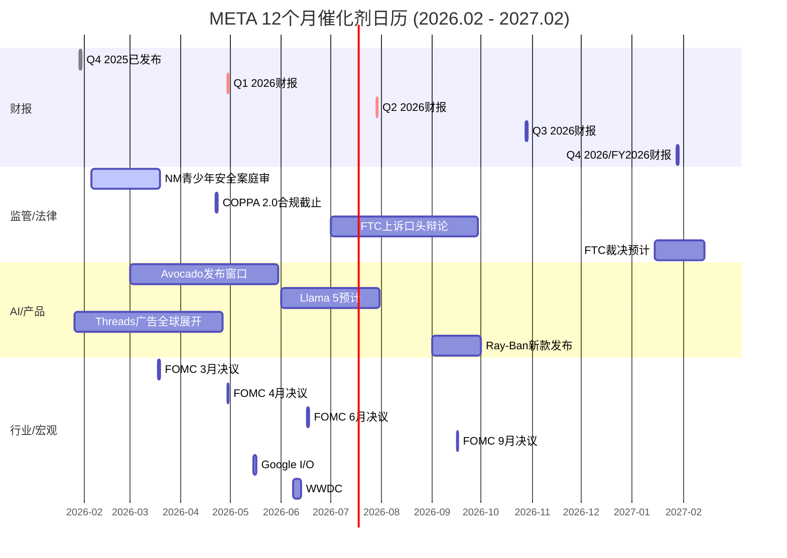

# META Phase 5 Agent C: Ch41-Ch43 — 可验证预测 + 投资日历 + 行动清单

> **版本**: v1.0 | **日期**: 2026-02-08 | **Agent**: C (Phase 5)
> **数据截止**: 2026-02-08 | **DM版本**: shared_context.md v2.0 (65锚点)
> **前序依赖**: Phase 4 Ch37 校准后中枢 $675-$711 (vs 当前$661)

---

## Ch41: 可验证预测清单

> **模块**: Phase 5 决策输出 | **CQ关联**: CQ1-CQ8 全量 | **目标**: ≥20个预测

本章构建一组时间锚定、数据源绑定、概率标注的可验证预测。每个预测在其验证窗口到期时，可通过指定数据源明确判定为"成真"或"未成真"，从而回溯检验本报告的分析质量。

---

### P-META-001: FY2026 Q1营收超出指引中位数

- **预测**: Q1 2026总营收将达$55.5-57.0B，超出管理层指引中位数$55.0B
- **概率**: 65%
- **时间窗口**: 2026-04-29 (Q1财报日)
- **验证方式**: Meta Q1 2026 Earnings Release (investor.atmeta.com)
- **若成真**: 确认广告加速势头，短期+$15-25/股 (P/E小幅扩张至29-30x)
- **若不成真**: 若低于$53.5B指引下限，触发KS-AI-01初步警告，短期-$30-50/股
- **关联KS**: KS-AI-01 (ARPP增速验证)
- [合理推断: Q4 2025营收$59.89B创纪录+Q1指引$53.5-56.5B隐含+26-34% YoY; Advantage+渗透率仍在S曲线早期(30%→40%+)]

---

### P-META-002: FY2026全年CapEx落在$120-130B区间

- **预测**: FY2026实际CapEx(含融资租赁)将在$120-130B区间，接近指引中位数$125B而非上限$135B
- **概率**: 55%
- **时间窗口**: 2027 Q1 (FY2026年报)
- **验证方式**: Meta FY2026 10-K, investor.atmeta.com
- **若成真**: 验证管理层执行纪律，FCF不至于极端恶化，中性偏正面
- **若不成真**: 若>$130B，FCF转负概率升至40%+，触发KS-FIN-01预警，-$20-40/股
- **关联KS**: KS-FIN-01 (FCF连续为负)
- [合理推断: 基于Blue Owl $27B/CoreWeave $14.2B等已签合同的执行节奏推算，指引上限$135B需额外$5-15B追加订单，概率偏低]

---

### P-META-003: FY2026 FCF在$0至+$15B之间

- **预测**: FY2026自由现金流将在$0至+$15B区间，不会完全转负
- **概率**: 50%
- **时间窗口**: 2027 Q1 (FY2026年报)
- **验证方式**: Meta FY2026 10-K + MacroTrends FCF数据
- **若成真**: 消除FCF崩塌叙事，P/E维持28-30x区间，+$30-50/股 [DM-FIN-008 v1.0]
- **若不成真**: FCF<0确认后回购将大幅缩减(<$10B)，SBC净稀释转正，-$40-60/股
- **关联KS**: KS-FIN-01
- [合理推断: Phase 2 Ch11基准情景CFO $131B - CapEx $125B = FCF $6B; 但管理层可能调节CapEx节奏以保FCF微正]

---

### P-META-004: Advantage+ AI广告占FoA营收比例升至35-40%

- **预测**: FY2026全年Advantage+ AI广告套件收入占FoA总营收比例从~30%(FY2025)升至35-40%
- **概率**: 70%
- **时间窗口**: 2027 Q1 (FY2026年报/财报电话会)
- **验证方式**: Meta管理层财报电话会披露; AdExchanger/eMarketer第三方追踪
- **若成真**: AI广告飞轮加速验证，ARPP增速维持≥12%，支撑AI CapEx叙事，+$20-35/股
- **若不成真**: AI广告渗透停滞暗示边际递减已现，触发KS-AI-02，-$15-25/股
- **关联KS**: KS-AI-02 (AI广告ARPP增速<10%)
- [硬数据: FY2025 Advantage+ $60B年化, 4M广告主, DM-AI-005 v2.0]

---

### P-META-005: NM青少年安全案赔偿<$5B

- **预测**: NM案最终裁决(含和解)赔偿金额将低于$5B
- **概率**: 60%
- **时间窗口**: 2026 Q2 (预计2026年3-4月裁决)
- **验证方式**: 法院公开裁决文书; Bloomberg Law/Reuters法律报道
- **若成真**: 监管尾部风险可控，估值折价消除，+$10-20/股
- **若不成真**: 赔偿>$5B将触发KS-REG-01，MDL 1,700+案件连锁和解预期上调，-$30-60/股
- **关联KS**: KS-REG-01 (NM案赔偿>$5B)
- [硬数据: TikTok/Snap已先行和解(金额保密); Meta 10-K披露"可能产生重大损失", DM-RISK-001 v2.0]

---

### P-META-006: Avocado闭源模型2026 H1发布

- **预测**: Project Avocado(Meta首个闭源前沿模型)将在2026年6月底前正式发布
- **概率**: 45%
- **时间窗口**: 2026 Q2
- **验证方式**: Meta AI Blog官方公告; ai.meta.com
- **若成真**: AI全栈战略叙事重建，AI溢价从$36/股可能扩至$60-80/股，+$25-45/股
- **若不成真**: 延期>6个月触发KS-AI-03，Meta被定位为"AI应用层"而非"AI平台层"，-$20-35/股
- **关联KS**: KS-AI-03 (Avocado发布延期>6个月)
- [硬数据: MSL由Wang(28岁)领导, 团队组建<6个月; Llama 4基准造假已被LeCun确认, DM-AI-002 v2.0]

---

### P-META-007: FTC反垄断上诉不会导致拆分

- **预测**: D.C.巡回上诉法院将维持地区法院对FTC的不利裁决(即Meta胜诉)，不发回重审
- **概率**: 70%
- **时间窗口**: 2027 Q1 (裁决预计2027年初)
- **验证方式**: D.C. Circuit Court of Appeals裁决文书; FTC.gov
- **若成真**: 拆分风险彻底消除(至少5-10年)，治理折价消除，+$15-25/股
- **若不成真**: 发回重审延长2-3年法律不确定性，估值折价5-8%，-$35-55/股
- **关联KS**: KS-REG-02 (FTC发回重审)
- [硬数据: 一审Meta胜诉2025-11-18; FTC上诉2026-01-20; 法律界共识"FTC上诉面临显著困难", DM-RISK-002 v2.0]

---

### P-META-008: Reality Labs FY2026亏损≤$19B

- **预测**: Reality Labs FY2026运营亏损将持平或小幅低于FY2025的$19.19B(区间$17-19B)
- **概率**: 55%
- **时间窗口**: 2027 Q1 (FY2026年报)
- **验证方式**: Meta FY2026 10-K分部数据
- **若成真**: RL"止血"信号确认，关停期权价值上升，+$5-10/股
- **若不成真**: 亏损>$20B触发KS-RL-01，累计亏损突破$100B(KS-RL-02)，-$10-20/股
- **关联KS**: KS-RL-01 / KS-RL-02
- [硬数据: CFO Li确认FY2026 RL亏损"与FY2025相当"; RL裁员10%+关闭Horizon Workrooms, DM-FIN-018 v2.0]

---

### P-META-009: Threads FY2026广告收入达$8-12B

- **预测**: Threads全球广告全面推出后(2026-01-26启动)，FY2026广告收入将在$8-12B区间
- **概率**: 50%
- **时间窗口**: 2027 Q1 (FY2026年报)
- **验证方式**: Meta财报分部披露或管理层电话会; Evercore ISI/Barclays追踪估算
- **若成真**: 第四增长极成立，FoA估值上调3-5%，+$15-25/股
- **若不成真**: 若<$5B，Threads变现路径存疑，影响有限(-$5/股)因基数较小
- **关联KS**: 无直接KS(Threads非核心估值驱动)
- [硬数据: Evercore ISI预测$11.3B(2026); Threads MAU 400M/DAU ~150M; CPM $3-8, DM-IND-007 v2.0]

---

### P-META-010: FoA运营利润率FY2026降至38-42%区间

- **预测**: FoA运营利润率将从FY2025的51.6%下降至FY2026的38-42%，因基础设施折旧大幅增加
- **概率**: 60%
- **时间窗口**: 2027 Q1 (FY2026年报)
- **验证方式**: Meta FY2026 10-K分部数据
- **若成真**: 利润率压缩在可控范围(仍远超Google广告28%)，中性
- **若不成真**: 若<35%(Needham预测的"低30%区间")，触发CapEx ROI严重质疑，-$40-60/股
- **关联KS**: KS-AI-01
- [硬数据: FoA FY2025利润率51.6% → FY2024 53.7%(-2.1pp); FY2026费用指引$162-169B, DM-FIN-007 v1.0, DM-FIN-011 v1.0]

---

### P-META-011: 美国经济2026年不会进入衰退

- **预测**: 美国GDP 2026年不会出现连续两季度负增长(即不满足技术性衰退定义)
- **概率**: 74%
- **时间窗口**: 2026 Q4 (全年GDP数据)
- **验证方式**: BEA GDP数据; Polymarket US Recession合约结算
- **若成真**: 广告周期继续扩张，META营收增速维持20%+，支撑当前估值
- **若不成真**: 衰退触发KS-MACRO-01预警条件之一，META广告收入可能下降8-15%，-$100-200/股
- **关联KS**: KS-MACRO-01
- [硬数据: Polymarket 2026年底前衰退概率26%, DM-PM-002 v1.0]

---

### P-META-012: Meta股票回购FY2026缩减至$10-20B

- **预测**: FY2026回购金额将从FY2025的$26.26B缩减至$10-20B区间，因FCF压缩
- **概率**: 65%
- **时间窗口**: 2027 Q1 (FY2026年报)
- **验证方式**: Meta FY2026 10-K; 季度财报回购披露
- **若成真**: SBC($18B/年)将基本抵消回购的稀释对冲效果，EPS增长纯依赖营收增长
- **若不成真**: 若回购仍>$20B，说明管理层对FCF有信心，正面信号+$10-15/股
- **关联KS**: 无直接KS
- [硬数据: FY2025回购$26.26B, 剩余授权~$54.6B, DM-FIN-012 v1.0, DM-GOV-004 v1.0]

---

### P-META-013: WhatsApp Business API收入FY2026达$20B+

- **预测**: WhatsApp商业化(含Business API+Pay+Channels广告)FY2026收入突破$20B
- **概率**: 45%
- **时间窗口**: 2027 Q1
- **验证方式**: Meta财报电话会; BofA/Evercore分析师追踪; Spocket/MEF行业数据
- **若成真**: WhatsApp从"增长期权"变为"第三利润引擎"，SOTP中WhatsApp估值上调30-50%，+$15-25/股
- **若不成真**: WhatsApp变现进度慢于预期，ARPU vs 微信差距($1 vs $11)持续，影响有限(-$5/股)
- **关联KS**: 无直接KS
- [硬数据: WhatsApp 2025营收~$15.6B; BofA上调2026 EPS +4%因WhatsApp加速, DM-IND-006 v2.0]

---

### P-META-014: META股价2026年底处于$600-$750区间

- **预测**: 2026-12-31收盘价将在$600-$750区间(当前$661处于区间中部偏下)
- **概率**: 55%
- **时间窗口**: 2026-12-31
- **验证方式**: Yahoo Finance/Bloomberg收盘价
- **若成真**: 验证"公允定价、窄幅震荡等待催化剂"的Phase 4核心判断
- **若不成真**: 若>$750——AI货币化超预期或Avocado成功; 若<$600——衰退/监管/AI ROI失败
- **关联KS**: 多个KS综合
- [合理推断: Phase 4校准中枢$675-$711; Polymarket 2/27收$660+概率55%, DM-PM-001 v1.0]

---

### P-META-015: Instagram Reels广告填充率升至55-65%

- **预测**: IG Reels广告填充率从2025年的~50%升至2026年底的55-65%
- **概率**: 60%
- **时间窗口**: 2026 Q4
- **验证方式**: Meta管理层财报电话会; eMarketer/Loop Exdigital广告行业报告
- **若成真**: Reels CPM向Feed收敛(从1/3差距缩至1/2)，IG ARPU加速，+$10-20/股
- **若不成真**: Reels变现天花板低于预期，IG增速放缓至<15%，-$10-15/股
- **关联KS**: KS-COMP-02 (IG日均时长监控间接相关)
- [硬数据: Reels占IG时长41%, 广告占比>50%, DM-IND-008 v2.0]

---

### P-META-016: COPPA 2.0合规不会显著影响用户增长

- **预测**: 2026-04-22 COPPA 2.0合规截止后，Meta DAP季度增速维持5%+
- **概率**: 70%
- **时间窗口**: 2026 Q2-Q3 (合规后首两个季度)
- **验证方式**: Meta Q2/Q3 2026季度财报DAP数据
- **若成真**: 监管合规成本已被吸收，不影响核心增长指标
- **若不成真**: DAP增速降至<3%暗示青少年用户被强制限制影响总基数，-$10-15/股
- **关联KS**: KS-REG-01 (间接相关)
- [硬数据: DAP 33.58亿, +7% YoY; 澳大利亚已禁16岁以下(删33万账户), DM-FIN-013 v1.0, DM-RISK-001 v2.0]

---

### P-META-017: Polymarket衰退概率不会升至>40%

- **预测**: Polymarket美国2026年衰退概率合约在2026全年内不会持续(>7天)高于40%
- **概率**: 70%
- **时间窗口**: 2026全年
- **验证方式**: Polymarket US Recession合约历史曲线
- **若成真**: KS-MACRO-01不会触发，广告周期继续扩张
- **若不成真**: 进入KS-MACRO-01预警区间，应立即评估减仓META
- **关联KS**: KS-MACRO-01 (Polymarket>40% + CPM转负)
- [硬数据: 当前衰退概率26%, 近期从24.5%升至26%, DM-PM-002 v1.0]

---

### P-META-018: Llama开源生态企业采用率维持>8%

- **预测**: Llama系列在企业AI模型市场的生产采用率(production deployment)维持在8%以上
- **概率**: 60%
- **时间窗口**: 2026 Q4
- **验证方式**: HuggingFace下载统计; a16z Enterprise AI Survey; Retool State of AI报告
- **若成真**: 开源品牌虽受Llama 4造假事件冲击但未崩塌，开源+闭源双轨战略可行
- **若不成真**: 采用率<5%触发KS-AI-03相关警告(Avocado失败叙事强化)，-$10-15/股
- **关联KS**: KS-AI-03 (Avocado/Llama生态)
- [合理推断: 当前Llama企业市占约9%; Llama 4造假后社区信任受损但累计下载超10亿次, DM-AI-002 v2.0]

---

### P-META-019: Q1 2026 EPS超出共识$6.62

- **预测**: Q1 2026稀释EPS将超出分析师共识$6.62，达$6.80-7.20
- **概率**: 60%
- **时间窗口**: 2026-04-29
- **验证方式**: Meta Q1 2026 Earnings Release; TipRanks/Zacks EPS追踪
- **若成真**: 连续第N个季度超预期(Meta近8季度有7次Beat)，短期+$15-25/股
- **若不成真**: 若EPS<$6.50，CapEx折旧侵蚀利润确认，市场可能重新定价P/E至25-26x，-$20-30/股
- **关联KS**: 无直接KS
- [硬数据: Q4 2025 EPS $8.88(+10.7% YoY); Q1 2026 EPS共识$6.62, DM-MKT-008 v2.0]

---

### P-META-020: Ray-Ban Meta智能眼镜2026销量达8-15M副

- **预测**: Ray-Ban Meta智能眼镜2026年出货量达800万-1,500万副
- **概率**: 50%
- **时间窗口**: 2027 Q1 (2026全年出货数据)
- **验证方式**: Counterpoint Research/IDC出货报告; EssilorLuxottica财报
- **若成真**: 智能眼镜市场规模化验证，RL中唯一的"亮点"成为独立增长引擎
- **若不成真**: 若<5M(与2025持平)，硬件规模化受阻，RL止血更遥远，-$5-10/股
- **关联KS**: KS-RL-01 (间接——智能眼镜成功可offset VR亏损)
- [硬数据: 2025销量2-5百万副, 产能目标10-20M, 市场份额73-80%, DM-AI-004 v2.0]

---

### P-META-021: 分析师共识目标价2026年底下调至$750-$850

- **预测**: 分析师平均目标价将从当前$851-859下调至$750-$850区间，反映CapEx消化期的估值重估
- **概率**: 55%
- **时间窗口**: 2026-12-31
- **验证方式**: MarketBeat/TipRanks分析师目标价追踪
- **若成真**: 卖方共识向买方估值($675-$711)收敛，市场预期回归理性
- **若不成真**: 若目标价维持>$850甚至上调，说明AI货币化证据超出我们的保守假设
- **关联KS**: 无直接KS
- [硬数据: 当前62 Buy/5 Hold/0 Sell, 平均目标$851-859, DM-MKT-008 v2.0]

---

### P-META-022: 10年期美债收益率2026年底<4.5%

- **预测**: 10年期美债收益率2026-12-31将<4.5%，不会成为META估值压缩的宏观因素
- **概率**: 60%
- **时间窗口**: 2026-12-31
- **验证方式**: FRED/Treasury.gov每日收益率数据
- **若成真**: 低利率环境支撑成长股估值倍数，META P/E 28x可维持
- **若不成真**: >4.5%将推高WACC(从10.2%至11%+)，DCF值下降10-15%，-$30-50/股
- **关联KS**: KS-MACRO-01 (间接)
- [合理推断: Fed当前利率3.50-3.75%(2026-01-28维持); 市场预期2026年可能再降1-2次]

---

### 41.1 预测汇总矩阵

| 编号 | 主题 | 概率 | 时间 | 影响方向 | 关联KS |
|:---:|------|:---:|:---:|:---:|:---:|
| P-001 | Q1营收超指引 | 65% | 2026 Q1 | +$15-25 | KS-AI-01 |
| P-002 | CapEx $120-130B | 55% | FY2026 | 中性 | KS-FIN-01 |
| P-003 | FCF $0-15B | 50% | FY2026 | +$30-50 | KS-FIN-01 |
| P-004 | AI广告35-40% | 70% | FY2026 | +$20-35 | KS-AI-02 |
| P-005 | NM赔偿<$5B | 60% | Q2 2026 | +$10-20 | KS-REG-01 |
| P-006 | Avocado H1发布 | 45% | Q2 2026 | +$25-45 | KS-AI-03 |
| P-007 | FTC不拆分 | 70% | Q1 2027 | +$15-25 | KS-REG-02 |
| P-008 | RL亏损≤$19B | 55% | FY2026 | +$5-10 | KS-RL-01/02 |
| P-009 | Threads $8-12B | 50% | FY2026 | +$15-25 | — |
| P-010 | FoA利润率38-42% | 60% | FY2026 | 中性 | KS-AI-01 |
| P-011 | 无衰退 | 74% | FY2026 | 支撑 | KS-MACRO-01 |
| P-012 | 回购$10-20B | 65% | FY2026 | 中性偏负 | — |
| P-013 | WhatsApp $20B+ | 45% | FY2026 | +$15-25 | — |
| P-014 | 股价$600-750 | 55% | 2026底 | 验证中性 | 多KS |
| P-015 | Reels填充55-65% | 60% | Q4 2026 | +$10-20 | KS-COMP-02 |
| P-016 | COPPA不影响DAP | 70% | Q2-Q3 2026 | 中性 | KS-REG-01 |
| P-017 | 衰退<40%概率 | 70% | FY2026 | 支撑 | KS-MACRO-01 |
| P-018 | Llama采用>8% | 60% | Q4 2026 | 中性 | KS-AI-03 |
| P-019 | Q1 EPS超共识 | 60% | Q1 2026 | +$15-25 | — |
| P-020 | 眼镜8-15M副 | 50% | FY2026 | +$5-10 | KS-RL-01 |
| P-021 | 共识下调$750-850 | 55% | 2026底 | 共识收敛 | — |
| P-022 | 10Y<4.5% | 60% | 2026底 | 支撑 | KS-MACRO-01 |

---

## Ch42: 投资日历 — 12个月催化剂

> **覆盖期**: 2026-02 至 2027-02 | **数据源**: Phase 0-4全量+实时搜索

### 42.1 催化剂Gantt Chart



### 42.2 月度催化剂明细

#### 2026年2月 (当前)

| 事件 | 日期 | 影响方向 | 影响幅度 | 概率 |
|------|------|:------:|:------:|:---:|
| NM青少年安全案庭审进行中 | 02-05起 | - | -$10~-60/股(视裁决) | 100%(庭审) |
| Polymarket衰退概率监控 | 持续 | +/- | 情绪指标 | — |
| META股价区间震荡预期 | 全月 | 中性 | $640-$680 | 60% |

[硬数据: NM案2026-02-05开审, NPR/ABC News报道]

#### 2026年3月

| 事件 | 日期 | 影响方向 | 影响幅度 | 概率 |
|------|------|:------:|:------:|:---:|
| FOMC利率决议 | 03-18 | +/- | $5-15/股 | 100%(会议) |
| NM案可能裁决(如未延期) | Q1末 | - | -$10~-60/股 | 40% |
| Avocado发布窗口开启 | Q1 | + | +$25-45/股 | 45% |

[硬数据: FOMC 2026-03-17/18会议, Federal Reserve Calendar; 当前利率3.50-3.75%]

#### 2026年4月

| 事件 | 日期 | 影响方向 | 影响幅度 | 概率 |
|------|------|:------:|:------:|:---:|
| COPPA 2.0合规截止 | 04-22 | - | -$5~-15/股(合规成本) | 100% |
| **Q1 2026财报(关键!)** | ~04-29 | +/- | +/-$30-50/股 | 100% |
| FOMC利率决议 | 04-29 | +/- | $5-15/股 | 100% |

[硬数据: Meta Q1 2026财报预计4月29日, Nasdaq/MarketBeat; Q1营收指引$53.5-56.5B, DM-IND-003 v1.0]

**4月是2026年单月最重要催化剂窗口**: Q1财报将首次验证FY2026 CapEx执行节奏和ARPP趋势。若Q1营收>$56.5B + ARPP加速 + CapEx节奏可控，股价可能突破$700+。若营收<$53.5B + 利润率恶化超预期，可能跌至$600以下。[主观判断: 基于催化剂影响幅度和概率的综合评估]

#### 2026年5月

| 事件 | 日期 | 影响方向 | 影响幅度 | 概率 |
|------|------|:------:|:------:|:---:|
| Google I/O (AI竞品基准) | ~05-15 | +/- | $5-10/股(间接) | 100% |
| NM案裁决(如延至Q2) | Q2 | - | -$10~-60/股 | 50% |
| Mag7财报季消化 | 全月 | +/- | 行业轮动效应 | — |

[合理推断: Google I/O通常在5月举行; Gemini 3进展将间接影响市场对Meta AI竞争力的评估]

#### 2026年6月

| 事件 | 日期 | 影响方向 | 影响幅度 | 概率 |
|------|------|:------:|:------:|:---:|
| WWDC (Apple AI/XR策略) | ~06-08 | +/- | $5-10/股(间接) | 100% |
| FOMC利率决议 | 06-17 | +/- | $5-15/股 | 100% |
| Avocado发布截止窗口(H1) | 06-30 | +/- | +/-$25-45/股 | — |
| Llama 5可能预告 | Q2 | + | $5-10/股 | 30% |

[硬数据: FOMC 2026-06-16/17会议, Federal Reserve Calendar]

#### 2026年7月

| 事件 | 日期 | 影响方向 | 影响幅度 | 概率 |
|------|------|:------:|:------:|:---:|
| **Q2 2026财报(关键!)** | ~07-29 | +/- | +/-$30-50/股 | 100% |
| FTC上诉口头辩论(窗口) | Q3开始 | - | $10-25/股(不确定性) | 60% |
| FOMC利率决议 | 07-29 | +/- | $5-15/股 | 100% |

[合理推断: Q2财报将提供H1 CapEx执行、FCF趋势的首次完整验证; FTC口头辩论预计Q3-Q4]

**7月是第二关键催化剂窗口**: Q2财报包含H1 CapEx数据(约$55-65B)，可用于推算FY2026 CapEx是否在指引区间内运行。FCF半年数据将明确显示是否趋近零或已转负。

#### 2026年8月

| 事件 | 日期 | 影响方向 | 影响幅度 | 概率 |
|------|------|:------:|:------:|:---:|
| Mag7 Q2财报季消化 | 全月 | +/- | 行业比较效应 | — |
| 宏观数据(Q2 GDP修正值) | 月底 | +/- | 衰退概率更新 | 100% |
| 无Meta特异性催化剂 | — | — | — | — |

#### 2026年9月

| 事件 | 日期 | 影响方向 | 影响幅度 | 概率 |
|------|------|:------:|:------:|:---:|
| Meta Connect 2026 | ~09中旬 | + | $5-15/股 | 90% |
| FOMC利率决议 | 09-16 | +/- | $5-15/股 | 100% |
| Ray-Ban新款发布(预期) | Q3 | + | $3-8/股 | 50% |

[合理推断: Meta Connect通常在9月举办; 2025年Connect发布了Quest 3S和Orion原型]

#### 2026年10月

| 事件 | 日期 | 影响方向 | 影响幅度 | 概率 |
|------|------|:------:|:------:|:---:|
| **Q3 2026财报** | ~10-28 | +/- | +/-$30-50/股 | 100% |
| FOMC利率决议 | 10-28 | +/- | $5-15/股 | 100% |
| FTC上诉口头辩论(窗口) | Q3-Q4 | - | $10-25/股 | 50% |

[合理推断: Q3财报将提供前9个月CapEx/FCF累计数据，可更准确预测FY2026全年]

#### 2026年11月

| 事件 | 日期 | 影响方向 | 影响幅度 | 概率 |
|------|------|:------:|:------:|:---:|
| 美国中期选举后政策环境 | ~11-03 | +/- | $5-15/股(间接) | 100% |
| 假日购物季开启(广告旺季) | 月底 | + | 季节性利好 | 100% |

#### 2026年12月

| 事件 | 日期 | 影响方向 | 影响幅度 | 概率 |
|------|------|:------:|:------:|:---:|
| FOMC利率决议 | 12-09 | +/- | $5-15/股 | 100% |
| Q4广告旺季高峰 | 全月 | + | 季节性利好 | 100% |
| 年度组合再平衡(机构) | 月底 | +/- | 资金流效应 | — |

[硬数据: FOMC 2026-12-08/09会议, Federal Reserve Calendar]

#### 2027年1-2月

| 事件 | 日期 | 影响方向 | 影响幅度 | 概率 |
|------|------|:------:|:------:|:---:|
| **Q4/FY2026财报(终极验证)** | ~01-28 | +/- | +/-$50-80/股 | 100% |
| FTC裁决预计 | Q1 2027 | +/- | +/-$35-55/股 | 60% |
| RL FY2026全年亏损数据 | Q1 2027 | - | $5-20/股 | 100% |

**2027年1月是终极验证窗口**: FY2026全年数据将同时验证CapEx执行($120-135B)、FCF方向($0-15B或转负)、RL止血进展、AI广告渗透率。所有Kill Switch的年度数据均在此时可验证。

### 42.3 催化剂优先级排序

| 排名 | 催化剂 | 月份 | 影响幅度 | 确定性 |
|:---:|--------|------|:------:|:------:|
| 1 | Q1 2026财报(首次验证AI CapEx) | 4月 | +/-$30-50 | 高 |
| 2 | Q4/FY2026年报(终极验证) | 1月2027 | +/-$50-80 | 高 |
| 3 | Avocado发布/未发布 | 3-6月 | +/-$25-45 | 中 |
| 4 | NM案裁决 | 3-5月 | -$10~-60 | 中 |
| 5 | FTC裁决 | 1月2027 | +/-$35-55 | 中 |
| 6 | Q2 2026财报(FCF半年验证) | 7月 | +/-$30-50 | 高 |
| 7 | FOMC利率路径 | 全年 | +/-$5-15/次 | 高 |
| 8 | Meta Connect 2026 | 9月 | +$5-15 | 高 |

---

## Ch43: 90天行动清单 + 投资者信

> **覆盖期**: 2026-02-08 至 2026-05-08

### 43.1 90天行动清单

#### 立即执行 (本周: 2026-02-08 至 2026-02-14)

| # | 行动 | 理由 | 执行细节 |
|:---:|------|------|---------|
| 1 | 确认当前持仓占组合比例 | 安全边际≈0(当前$661 vs 公允$675-$711)，不宜超配 | 若META>组合的5%，考虑减至3-5% |
| 2 | 设置NM案裁决Google Alert | 2月开审，裁决可能在4-6周内 | 关键词: "New Mexico Meta verdict/settlement" |
| 3 | 监控Polymarket衰退概率 | 当前26%，上行趋势(从24.5%升至26%) | 阈值: >35%开始减仓; >40%触发KS-MACRO-01 |
| 4 | 记录Q4 2025关键基准线 | 为Q1 2026对比做准备 | 营收$59.89B, EPS $8.88, CapEx $22.14B(单季), ARPP+18%展示/+6%价格 |

#### 短期行动 (30天内: 2026-02-08 至 2026-03-10)

| # | 行动 | 触发条件 | 执行细节 |
|:---:|------|---------|---------|
| 5 | 若NM案和解<$3B — 维持仓位 | NM案和解公告 | 监管尾部风险可控; 不需调整 |
| 6 | 若NM案裁定>$5B — 减仓20% | NM案裁决公告 | 触发KS-REG-01; MDL连锁效应将使总赔偿上调 |
| 7 | 追踪Avocado发布信号 | Meta AI Blog/MSL团队动态 | 若MSL招聘加速/论文产出增加 = 正面信号 |
| 8 | 评估FOMC 3月决议影响 | 03-18决议后 | 降息→利好成长股; 维持/加息→短期承压 |
| 9 | 监控IG互动率月度数据 | SocialBlade/mediamister | FY2026首月互动率是否企稳(vs 0.61% YoY跌幅) |

#### 中期行动 (30-90天: 2026-03-10 至 2026-05-08)

| # | 行动 | 触发条件 | 执行细节 |
|:---:|------|---------|---------|
| 10 | **Q1财报前制定交易计划** | 04-15前完成 | 三种情景预案: Beat(>$56.5B) / Meet($53.5-56.5B) / Miss(<$53.5B) |
| 11 | Q1财报解读重点 | 04-29 | (1)ARPP增速(目标≥12%); (2)CapEx单季金额(推算FY2026节奏); (3)FY2026费用指引是否调整 |
| 12 | COPPA 2.0合规影响评估 | 04-22后 | 监控DAP增速变化; 若<3%可能暗示青少年用户限制影响 |
| 13 | 若Avocado 6月底未发布 — 减AI溢价预期 | 06-30 | AI溢价从$36/股降至$15-20/股; 调整目标价至$640-$680 |
| 14 | 每月更新Kill Switch仪表盘 | 每月1日 | 检查14个KS指标当前状态(绿/黄/红) |

### 43.2 五大关键监控指标

| # | 指标 | 频率 | 数据源 | 阈值 |
|:---:|------|:---:|--------|------|
| 1 | **ARPP增速(广告展示量x价格)** | 季度 | Meta季度财报 | ≥12%=健康; <10%=KS-AI-01预警 |
| 2 | **FCF(自由现金流)** | 季度 | Meta季度财报/MacroTrends | >$0=正常; <0连续2Q=KS-FIN-01 |
| 3 | **Polymarket衰退概率** | 每日 | polymarket.com | <30%=安全; >40%=KS-MACRO-01 |
| 4 | **IG日均使用时长vs TikTok** | 月度 | data.ai/SimilarWeb | IG>50min=稳定; <45min=KS-COMP-02 |
| 5 | **Avocado/Llama模型进展** | 持续 | ai.meta.com/HuggingFace | 发布且MMLU-Pro≥80=正面; 延期>6月=KS-AI-03 |

### 43.3 仓位操作触发点汇总

```
当前状态: 持有 / 标准配置(3-5%组合权重) / 当前$661

加仓触发 (+1-2%组合权重):
├ 股价跌至$600-620区间(SMA200下方10%+) + 无KS触发
├ Q1 2026营收>$57B + ARPP加速至15%+
├ Avocado发布且基准达GPT-5水平
└ NM案和解<$2B + FTC上诉驳回

减仓触发 (-1-2%组合权重):
├ NM案赔偿>$5B (KS-REG-01)
├ Polymarket衰退>40% + 广告CPM转负 (KS-MACRO-01)
├ FCF连续2季度为负 (KS-FIN-01)
└ ARPP增速连续2季度<10% (KS-AI-01)

清仓触发 (极端, 全部退出):
├ 衰退确认 + AI ROI失败联合 (P-META-011+P-META-004同时不成真)
├ FTC裁定拆分执行 (概率<10%)
└ 三重危机: 衰退+拆分+AI失败 (<0.3%)
```

[主观判断: 触发点基于Phase 4校准后估值$675-$711和14个Kill Switch阈值的综合设定]

### 43.4 投资者信 (Executive Summary)

---

**致投资者:**

**META在$661值不值得关注?**

Phase 1至Phase 4共计超过20万字符的系统性研究，跨越定位、财务、战略、对抗审查四大阶段，得出的核心结论如下:

- **META是一家经营层面极其健康的公司**(FoA利润率51.6%、营收+22.2%、DAP 33.6亿人)，但其$115-135B的AI CapEx豪赌正在将一台"印钞机"暂时变为一台"烧钱机"——FY2026 FCF可能趋近零，回购将缩减，EPS增长引擎从"利润释放"切换为"纯营收驱动"。[硬数据: DM-FIN-001/007/008 v1.0]

- **当前$661已接近公允价值**(Phase 4校准中枢$675-$711，隐含+2%至+8%上行)，既非低估的"捡便宜"机会，也非泡沫的"高位接盘"。你的回报将完全取决于$125B AI赌注能否在2027年前开始兑现——ARPP增速≥12%是关键验证阈值。[合理推断: 基于Phase 4 Ch37多方法加权估值]

- **风险收益比接近对称**: 22个可验证预测中，上行催化剂(Avocado成功、Q1超预期、NM和解可控)可将股价推至$750+; 下行催化剂(衰退、AI ROI失败、监管重罚)可将股价拉至$450-550。当前位置适合"持有观望"，不适合"追高加仓"。[主观判断: 基于催化剂概率分布的对称性评估]

**行动建议**: 对于已持仓投资者，维持3-5%标准配置，密切监控Q1 2026财报(4月29日)作为方向性判断的关键节点。对于观望者，$600-620区间(当前价下方6-9%)是更有吸引力的建仓区间——在该价位，Phase 4校准后的安全边际将扩大至+9%至+18%。不建议在当前价追高，也不建议在无Kill Switch触发的情况下离场。

本报告不构成投资建议。所有数据截止2026-02-08，市场条件可能快速变化。

---

> **免责声明**: 本章所有数据已标注来源和置信度层级。标注为[硬数据]的数据来自2026-02-08实时获取的公开来源或Phase 1-4已验证DM锚点。标注为[合理推断]的结论基于硬数据的逻辑推导并标注推理链。标注为[主观判断]的内容为分析师观点并标注判断依据。本报告不构成投资建议。

---

*Agent C Ch41+Ch42+Ch43 完成 | 数据截止: 2026-02-08*
