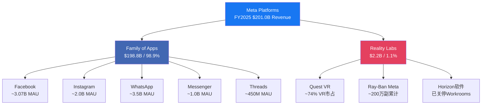
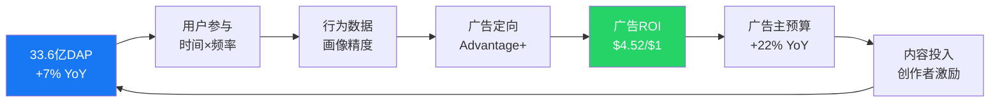
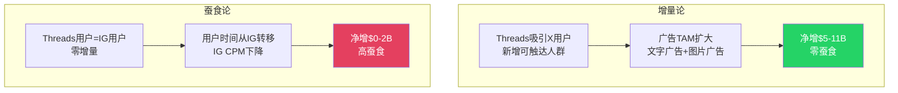
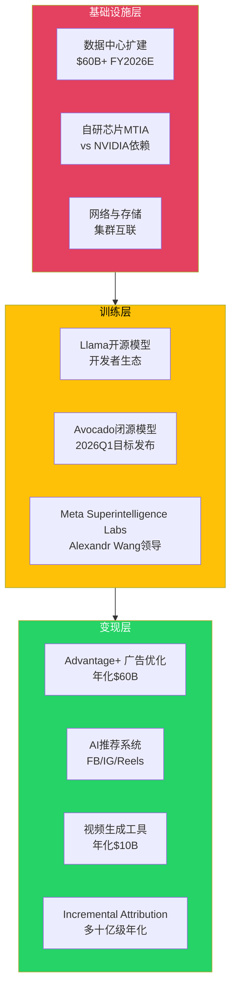
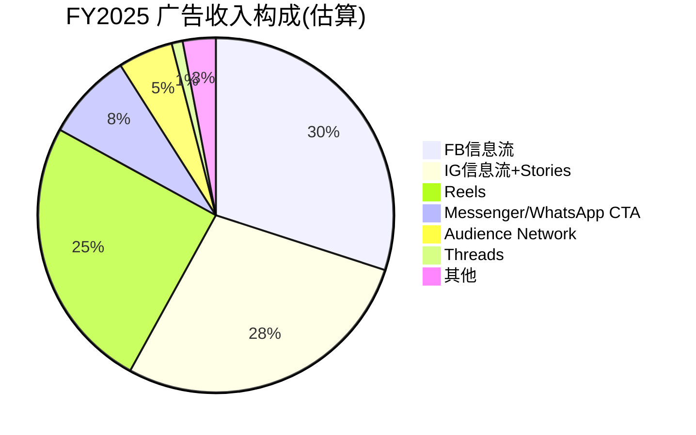
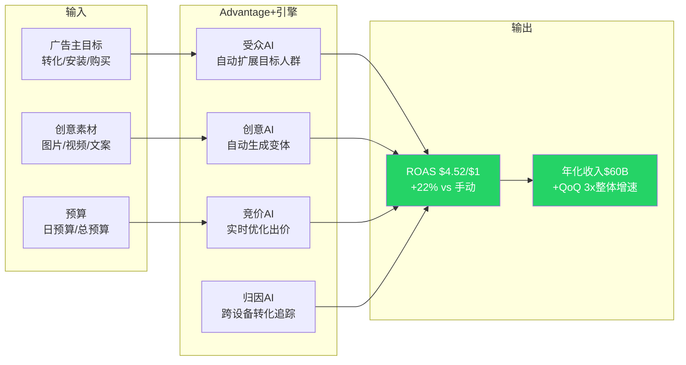
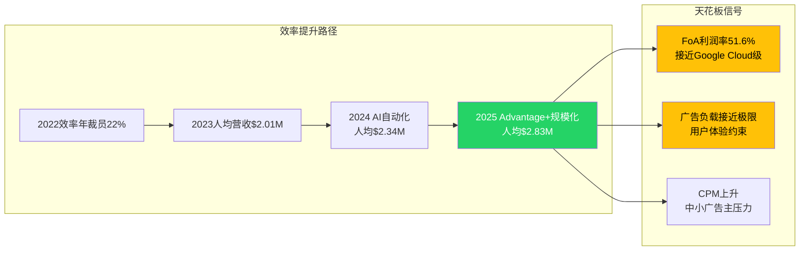
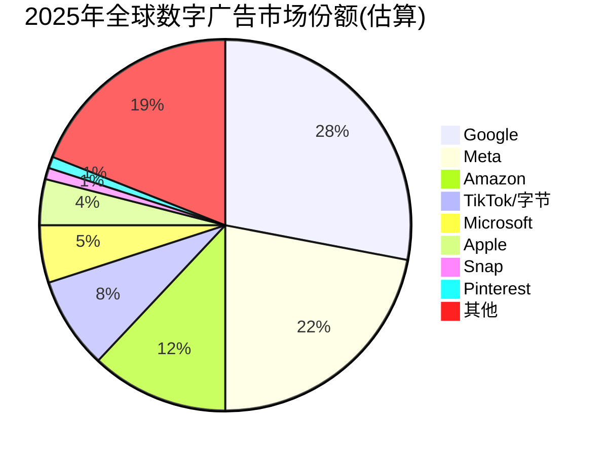
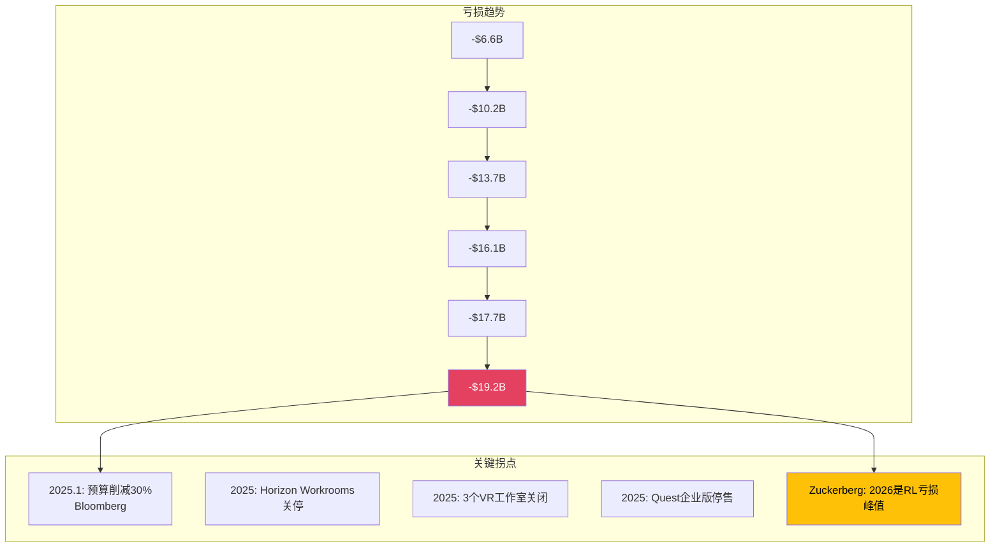

## Part I: 今天的Meta Platforms

---

### Chapter 1: 商业模式 — 四引擎拆解

#### 1.1 引擎全景

Meta Platforms运营着全球最大的社交网络生态系统，连接39.8亿月活用户(截至2025年12月)，通过两个财务报告分部运营:



**关键财务对照**:

| 分部 | FY2025营收 | 运营利润 | 利润率 | YoY增长 |
|------|:---------:|:--------:|:------:|:-------:|
| Family of Apps | $198.8B | $102.5B | 51.6% | +22% |
| Reality Labs | $2.2B | -$19.2B | N/M | +3% |
| **合计** | **$201.0B** | **$83.3B** | **41.4%** | **+22%** |

这张表揭示了META的核心经济学: FoA是一台51.6%运营利润率的印钞机，每年产出超过$100B运营利润，其中$19.2B被RL吞噬。换言之，FoA的真实盈利能力比报表所示高出约23%。

#### 1.2 引擎一: Facebook/Instagram广告核心

Facebook和Instagram构成META的绝对核心，贡献约97%的广告收入。这是一个自我强化的飞轮:



**广告双引擎驱动模型**:

META的广告收入增长由两个杠杆驱动:

| 杠杆 | FY2025表现 | Q4 2025表现 | 趋势 |
|------|:---------:|:-----------:|:----:|
| 广告展示量增长 | +12% YoY | +18% YoY | 加速 |
| 平均广告单价增长 | +9% YoY | +6% YoY | 稳定 |
| **合计收入效应** | **+22% YoY** | **+24% YoY** | **加速** |

展示量的加速增长(从Q1的+10%到Q4的+18%)反映了三个结构性变化: (1) Reels视频广告位的持续扩展; (2) Threads全球广告上线(2026年1月26日); (3) AI推荐系统将更多用户时间导向可变现内容(FB信息流中AI推荐内容占比已超过30%)。

单价增长虽然在Q4放缓至+6%(vs Q1的+11%)，但这部分反映了新兴市场广告位(单价较低)增长更快的混合效应，而非需求减弱。北美和欧洲的CPM仍在上升。

#### 1.3 引擎二: Threads与Reels — 增长引擎

**Threads**:

Threads在2023年7月上线后经历了典型的炒作-崩溃-恢复周期，截至2026年初已成为真正的增长引擎:

| 指标 | 值 | 对标 |
|------|:--:|:----:|
| MAU | ~450M | X(Twitter) ~600M |
| 增长率 | +48% YoY | X -5% YoY(估计) |
| 互动率 | 6.25% | X 3.6% (+73.6%) |
| 广告上线 | 2026年1月26日全球 | — |
| 收入预测(Evercore) | $11.3B (2026E) | 对标X巅峰~$4.5B |
| 收入预测(Barclays) | $2B (2026E) | — |

Evercore与Barclays之间5.6倍的预测差异揭示了市场对Threads的核心争论: 这是增量收入还是IG自相残杀? Threads 100%用户来源于IG，如果Threads广告CPM($3-8)远低于IG($10-25)，且用户时间从IG转移至Threads，净效应可能是负面的。



**Reels**:

Reels已从防御性产品(抵御TikTok)演变为核心变现引擎:

- 年化收入约$50B(占FoA广告收入的~25%)
- Reels广告CPM已达FB信息流的~80%(2023年时仅~40%)
- Reels每日播放量超过2000亿次
- AI推荐内容在Reels中的占比已超过50%

Reels的变现效率提升是FY2025广告收入加速的关键驱动力之一。每次推荐精度的提升都直接转化为更高的广告转化率，这是META的AI投入最直接、最可量化的回报路径。

#### 1.4 引擎三: WhatsApp — 沉睡巨人

WhatsApp是META最大的未变现资产，拥有3.3-3.5B MAU，覆盖全球超过180个国家:

| 指标 | WhatsApp | 微信(对标) | 差距 |
|------|:--------:|:---------:|:----:|
| MAU | ~3.5B | ~1.35B | 2.6x |
| ARPU | ~$0.24 | ~$7.00 | **29x** |
| 支付渗透 | <5% | ~94% | 18x |
| 商业消息收入 | ~$2.5-2.8B/年 | 未单独披露 | — |

29倍ARPU差距是META估值中最大的"期权"之一。如果WhatsApp ARPU在5年内缩窄至微信的30%(~$2.1)，隐含年收入约$73.5B——几乎等于当前FoA收入的37%。但这种线性外推忽视了重大结构性障碍:

1. **端到端加密**: WhatsApp的隐私承诺限制了数据变现路径
2. **支付基础设施**: 印度虽然取消UPI用户上限，但WhatsApp Pay市占率微不足道(vs GPay/PhonePe)
3. **文化差异**: 微信的超级App模式依赖于中国特有的移动支付生态
4. **监管差异**: 欧洲GDPR和印度数据本地化要求限制了商业化深度

更现实的路径是Click-to-WhatsApp广告(+60% YoY增长)和商业消息(Business API)，这些已经在产生收入且增速可观，但天花板显著低于"微信化"叙事。

#### 1.5 引擎四: AI基础设施

这是META最新也最具争议的引擎。FY2025资本支出$69.7B(不含融资租赁)，FY2026指引$115-135B(含融资租赁)。这些投入分布在三个层次:



**层次分析**:

| 层次 | 估计投入(FY2026E) | ROI可见度 | 回报时间 |
|------|:-----------------:|:---------:|:--------:|
| 基础设施(数据中心/GPU) | ~$80-90B | 低 | 3-5年 |
| 训练(Llama/Avocado/MSL) | ~$15-25B | 中 | 1-3年 |
| 变现(Advantage+/推荐/生成) | ~$10-20B | **高** | 已在回报 |

变现层已经产生了可量化的回报: Advantage+广告优化工具年化收入$60B，AI驱动的广告ROAS为$4.52/$1(比手动投放高出22%)。但基础设施层占CapEx的绝大部分，且回报路径尚不清晰——这是市场争论的核心。

---

### Chapter 2: 广告生态深度 — META的印钞机

#### 2.1 广告收入结构

META的广告收入几乎等于FoA收入($198.8B)，因为FoA的非广告收入(主要是WhatsApp商业消息和Facebook Marketplace手续费)仍然微不足道。

**按地区拆解**:

| 地区 | Q4 2025 ARPU(估算) | 占比 | YoY趋势 |
|------|:------------------:|:----:|:-------:|
| 北美 | ~$85-90 | ~45% | +15-18% |
| 欧洲 | ~$22-25 | ~24% | +18-22% |
| 亚太 | ~$5-7 | ~20% | +25-30% |
| 其他 | ~$3-5 | ~11% | +20-25% |

地区结构揭示了一个关键洞察: META的增长越来越多地来自低ARPU地区(亚太+其他占比31%，但增速最快)。这意味着收入增长的"质量"可能不如表面数字所示——每新增$1收入的利润率低于历史平均。

**按产品拆解**:



Reels从2022年的几乎零占比增长至~25%，是META最成功的产品转型之一。但Reels的崛起部分蚕食了FB和IG信息流广告(用户时间有限)，净增量效应可能低于毛收入数字。

#### 2.2 Advantage+ — AI广告革命

Advantage+是META将AI投入转化为广告收入的核心管道。这是一套端到端的AI驱动广告优化系统:



**Advantage+的核心指标**:

| 指标 | 值 | 来源 |
|------|:--:|:----:|
| 年化收入 | ~$60B | Meta Q4 2025 earnings call |
| ROAS | $4.52/$1 | io-fund.com / Meta披露 |
| vs 手动投放 | +22%转化率 | Meta广告主案例 |
| 视频生成工具年化 | ~$10B | Meta Q4 2025 call |
| QoQ增速 | 3x整体广告增速 | Meta Q4 2025 call |
| Incremental Attribution | 多十亿级年化 | 上线仅7个月 |

关键争议在于$60B年化收入中有多少是"真正新增"vs"重新归因"的旧收入。当广告主从手动投放切换到Advantage+时，同一笔广告支出会从"手动"口径转入"Advantage+"口径。这不是欺诈，但意味着Advantage+的增量贡献可能远低于$60B的表面数字。

更保守的估计: Advantage+带来的真正增量收入(即如果没有Advantage+就不会发生的广告支出)可能在$15-25B范围，对应FoA收入的8-13%——仍然非常显著，但与$60B叙事差距明显。

#### 2.3 广告效率天花板

META的广告效率已经处于历史高位:

| 效率指标 | FY2025 | FY2024 | FY2023 | FY2022 |
|---------|:------:|:------:|:------:|:------:|
| 毛利率 | 82.0% | 81.7% | 80.8% | 78.3% |
| 运营利润率(FoA) | 51.6% | ~50% | ~47% | ~35% |
| 广告每美元成本(估算) | ~$0.18 | ~$0.19 | ~$0.20 | ~$0.22 |
| 人均营收(员工) | ~$2.83M | ~$2.34M | ~$2.01M | ~$1.35M |



FoA 51.6%的运营利润率已经接近软件行业天花板。进一步提升利润率的空间有限，未来的价值创造更多依赖于收入增长而非利润率扩张。这是一个关键的框架假设——牛市叙事中"利润率继续扩张"的假设可能过于乐观。

#### 2.4 广告行业地位

META与Google共同构成数字广告的双寡头:



META的~22%市场份额在过去三年基本稳定(2022: ~21%, 2023: ~21%, 2024: ~22%)。主要的份额流动发生在Google内部(搜索→YouTube)和Amazon(零售媒体崛起)之间。TikTok虽然增长迅速(从2022年的~4%到2025年的~8%)，但更多侵蚀的是长尾玩家而非META——这部分因为META的Reels有效防守了短视频广告份额。

---

### Chapter 3: Reality Labs — $80B+的沉没成本

#### 3.1 亏损全景

Reality Labs是META历史上最大的战略赌注，累计亏损已超过$80B:

| 年度 | RL营收 | RL运营亏损 | 累计亏损 |
|:----:|:------:|:---------:|:-------:|
| FY2020 | $1.1B | -$6.6B | — |
| FY2021 | $2.3B | -$10.2B | -$16.8B |
| FY2022 | $2.2B | -$13.7B | -$30.5B |
| FY2023 | $1.9B | -$16.1B | -$46.6B |
| FY2024 | $2.2B | -$17.7B | -$64.3B |
| FY2025 | $2.2B | -$19.2B | **-$83.5B** |



Q4 2025单季亏损$6.02B创历史新高，但这也可能是峰值——Zuckerberg在Q4财报会议上表示"2026年是Reality Labs亏损的峰值年，此后将逐步减亏"。Bloomberg报道的30%预算削减(约$5-6B/年)为这一预期提供了一定支撑。

#### 3.2 RL产品矩阵

```mermaid
graph TB
    RL[Reality Labs]
    RL --> HW[硬件]
    RL --> SW[软件/平台]
    HW --> Quest[Quest系列VR头显<br>VR市占~74-84%]
    HW --> RBM[Ray-Ban Meta眼镜<br>累计200万副]
    HW --> Phoenix[Phoenix MR眼镜<br>延期至2027]
    SW --> Horizon[Horizon Worlds<br>社交VR平台]
    SW --> MetaAI[Meta AI助手<br>跨平台集成]
    SW --> SDK[开发者SDK<br>Presence Platform]

    Quest --> QS[Quest 3/3S<br>2025出货170万台(-16%)]
    RBM --> RBD[Ray-Ban Display<br>首批15K副后暂停]

    style Quest fill:#FFC107,color:#000
    style RBM fill:#25D366,color:#fff
    style Phoenix fill:#ccc,color:#333
    style Horizon fill:#E4405F,color:#fff
```

**各产品线评估**:

| 产品 | 状态 | 商业前景 | 战略价值 |
|------|:----:|:-------:|:-------:|
| Quest VR | 市场领导者但市场萎缩 | 弱 (VR整体2025 -14%) | 中 (VR平台占位) |
| Ray-Ban Meta | 高速增长(+300% H1 2025) | 中 (年产能目标1000万副) | **强** (第一人称AI数据采集) |
| Phoenix MR | 延期至2027 | 未知 | 高 (AR终极形态) |
| Horizon Worlds | 关停Workrooms | 弱 | 低 (已缩减投入) |
| Meta AI助手 | 跨平台集成中 | 中 | 高 (AI入口竞争) |

#### 3.3 Ray-Ban Meta: RL唯一的亮点

Ray-Ban Meta是RL战略转型的核心载体——从VR头显向AI可穿戴设备的转型:

| 指标 | 值 | 来源 |
|------|:--:|:----:|
| 累计销量 | ~200万副 | CNBC 2025-07-28 |
| H1 2025收入增长 | +300% | EssilorLuxottica确认 |
| 2026E产能目标 | 1000万副/年 | Bloomberg |
| ASP(估算) | ~$300 | 基于零售价 |
| 如果1000万副×$300 | ~$3B年收入 | 计算推导 |

即使Ray-Ban Meta实现1000万副年销量，$3B收入仍然无法覆盖RL每年$17-19B的亏损。但Ray-Ban Meta的战略价值不在于收入——而在于构建一个"第一人称AI数据采集网络"。每副带有摄像头和麦克风的AI眼镜都是一个移动数据节点，为META的AI模型提供独特的多模态训练数据。

这是一个期权论证: 如果AI可穿戴设备取代智能手机成为下一个计算平台(类似iPhone取代功能手机)，META可能在这个$500B+市场中占据先发优势。如果不是，$80B+就是沉没成本。

#### 3.4 VR市场的残酷现实

```mermaid
graph LR
    subgraph VR市场2025
        A[全球VR头显出货<br>2025年~810万台<br>-14% YoY]
        B[Meta Quest<br>~170万台(-16%)]
        C[Apple Vision Pro<br>~4.5万台/Q4]
        D[Sony PSVR2<br>~110万台]
        E[其他<br>~530万台]
    end

    subgraph 判断
        F[META赢了VR<br>但VR不值得赢]
        G[Apple暂停低价Vision<br>转向智能眼镜]
        H[IDC预测2026反弹+87%<br>但基数极低]
    end

    A --> F
    C --> G
    A --> H

    style F fill:#FFC107,color:#000
    style G fill:#E4405F,color:#fff
```

META以74-84%的市场份额统治VR市场，但这是一个萎缩14%的市场。更关键的信号是Apple暂停了低价Vision的开发，转向智能眼镜——这可能意味着即使是Apple也认为VR的消费级市场短期内不可行。

META的战略调整(削减VR预算30%、关停Horizon Workrooms和三个VR工作室、停售Quest企业版)实际上是一个对的方向——从VR头显转向AI可穿戴是务实的止损。问题在于止损是否足够快，以及AI可穿戴能否在RL现有团队和基础设施上高效执行。

#### 3.5 RL估值框架

RL的估值应当拆分为两个组件:

| 组件 | 估值逻辑 | 估值范围 |
|------|---------|:-------:|
| VR业务(Quest) | 市场萎缩+份额领先 = 有限价值 | $5-15B |
| AI可穿戴期权(Ray-Ban Meta/Phoenix) | 平台期权(低概率高回报) | $20-80B |
| RL整体 | VR + AI可穿戴期权 | **$25-95B** |
| 当前市场隐含RL价值(估算) | 市值 - FoA独立估值 | ~$100-200B |

市场可能对RL期权的定价过于慷慨。即使在乐观情景下(AI可穿戴成为主流平台)，RL的合理估值上限可能在$80-100B区间——这意味着市场价格中$100-200B的隐含RL价值可能包含了过高的期望。

这将在Part II的OVM模块中进行更精确的定量分析。
