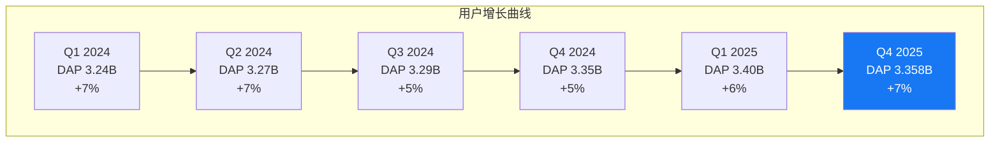
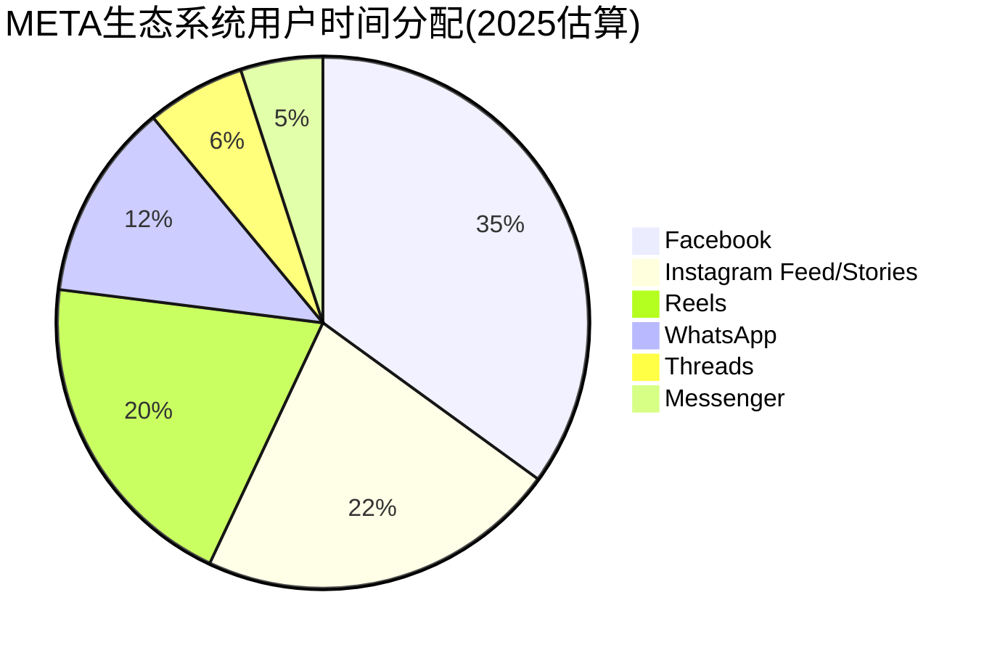
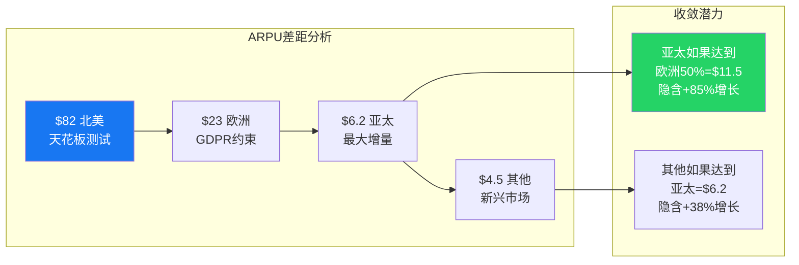
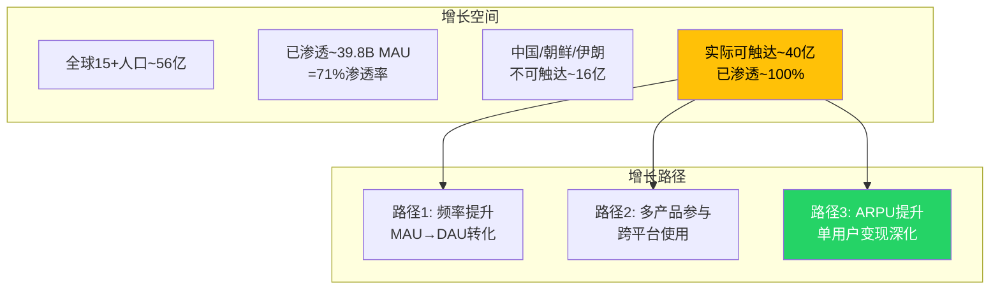
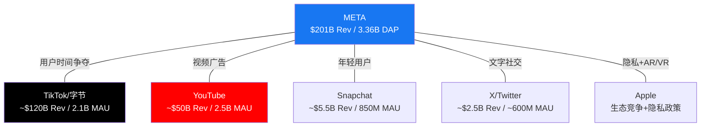
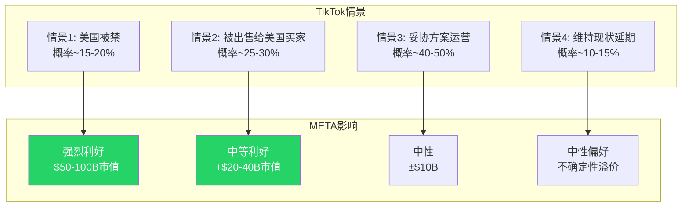
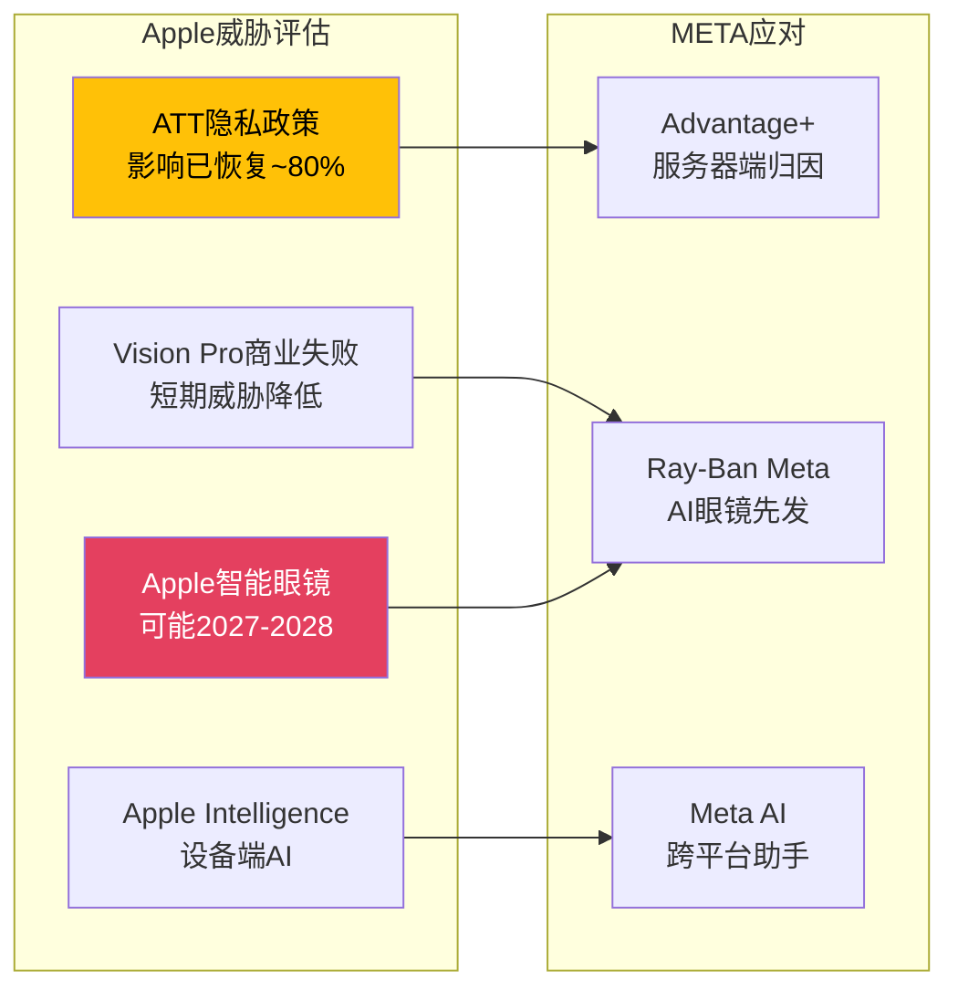
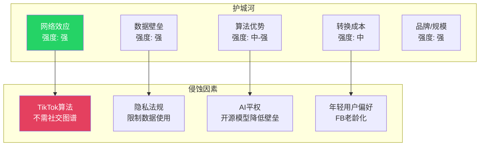
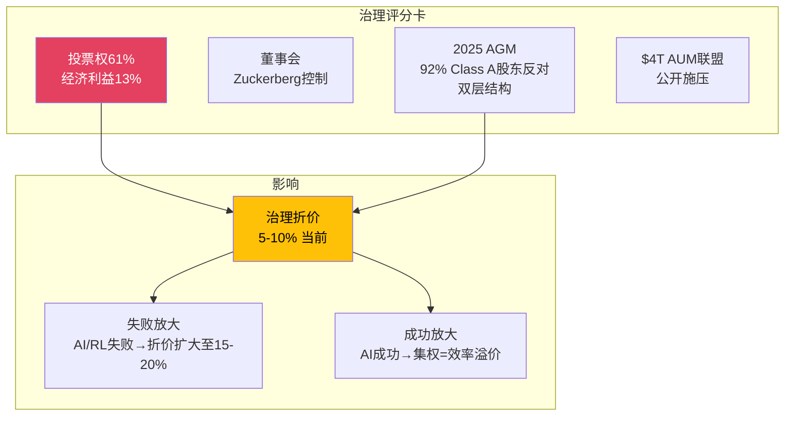

### Chapter 4: 平台用户经济学

#### 4.1 用户规模与增长

META的用户基础已覆盖全球过半人口:

| 平台 | MAU(估算) | DAU/MAU | YoY增长 | 增长阶段 |
|------|:---------:|:-------:|:-------:|:--------:|
| Facebook | ~3.07B | ~68% | +3% | 成熟 |
| Instagram | ~2.0B | ~60% | +8% | 增长 |
| WhatsApp | ~3.5B | ~75% | +5% | 成熟 |
| Messenger | ~1.0B | ~55% | +2% | 成熟 |
| Threads | ~450M | ~35% | +48% | 早期高增长 |
| **DAP(日活人数,去重)** | **3.358B** | **—** | **+7%** | **稳定增长** |



DAP(Daily Active People)是META最核心的用户指标，通过跨平台去重统计每日使用任何一个Meta产品的独立用户数。33.6亿DAP意味着地球上每2个人中就有超过1个每天使用META的产品(按15岁以上人口约56亿计算，渗透率约60%)。

#### 4.2 用户参与度趋势

用户参与度比用户数量更重要——它直接决定广告展示量:

| 指标 | 趋势 | 驱动因素 |
|------|:----:|---------|
| FB日均使用时长 | 稳定(~33分钟) | AI推荐维持信息流黏性 |
| IG日均使用时长 | 略降(-5%至~28分钟) | 部分迁移至Threads/Reels |
| Reels日均观看量 | 上升(2000亿+次/天) | AI推荐+短视频趋势 |
| Threads参与度 | 快速上升(互动率6.25%) | 新平台+X用户迁移 |
| 总时间占比 | 稳定至上升 | Threads新增时间抵消IG下降 |



关键洞察: IG互动率下降15%(来源: Metricool 2026报告)是一个值得关注的信号，但Threads +48%增长和Reels扩张在很大程度上抵消了这一下降。净效应是META生态系统的总用户时间仍在增长——只是在产品之间重新分配。

#### 4.3 ARPU分析

每用户平均收入(ARPU)是META商业化效率的核心衡量:

| 地区 | FY2025 ARPU(估算) | FY2024 ARPU | YoY变化 | 全球占比 |
|------|:-----------------:|:-----------:|:-------:|:-------:|
| 美国&加拿大 | ~$82 | ~$68 | +21% | ~43% |
| 欧洲 | ~$23 | ~$19 | +21% | ~25% |
| 亚太 | ~$6.2 | ~$5.1 | +22% | ~20% |
| 其他 | ~$4.5 | ~$3.7 | +22% | ~12% |
| **全球平均** | **~$16.0** | **~$13.1** | **+22%** | **100%** |



北美ARPU $82意味着北美用户每年为META创造$82的广告收入——这已经是全球最高水平之一，进一步增长需要依赖AI提升广告效率(Advantage+)而非简单扩量。亚太和新兴市场是ARPU增长的主要来源，但低ARPU地区的利润贡献率也相应较低。

#### 4.4 用户增长天花板

META面临的用户增长天花板问题:



如果排除不可触达市场(中国约14亿、朝鲜等)，META的可触达人口中MAU渗透率已接近100%。这意味着未来的增长几乎完全依赖于:
1. 频率提升(更多MAU变为DAU)
2. 多产品交叉渗透(FB用户→IG→Threads→WhatsApp)
3. ARPU深化(每用户更高变现)

其中路径3(ARPU)是最可持续的增长引擎，而这直接取决于AI驱动的广告效率提升。

---

### Chapter 5: 竞争定位矩阵

#### 5.1 五大竞争对手定量对标



**核心竞争指标对比**:

| 指标 | META | TikTok | YouTube | Snap | X |
|------|:----:|:------:|:-------:|:----:|:-:|
| 2025营收 | $201B | ~$120B | ~$50B | ~$5.5B | ~$2.5B |
| YoY增长 | +22% | ~+30% | ~+20% | ~+15% | ~-20% |
| DAU/MAU | ~3.36B DAP | ~2.1B MAU | ~2.5B MAU | ~850M MAU | ~600M MAU |
| 广告ARPU(全球均) | ~$16 | ~$10 | ~$5 | ~$6.5 | ~$4 |
| 运营利润率 | 41.4% | ~25%(估) | ~30%(估) | ~2% | 负 |
| AI投入(估) | $70B | ~$15B | (含Google) | ~$2B | ~$5B |

#### 5.2 TikTok: 最大威胁的不确定性

TikTok是META面临的最大竞争威胁，但其自身处于极端不确定性中:

**TikTok在美国的状态(截至2026年2月)**:

TikTok在美国的命运仍然悬而未决。2025年1月的禁令法案后经历了多次延期和谈判。无论最终结果如何，这种不确定性本身对META是有利的:
- 如果TikTok被禁或被出售: META直接受益(Reels/IG获取用户时间)
- 如果TikTok继续运营但受限: 广告主可能转移预算至更"安全"的平台
- 如果TikTok正常运营: 维持现状，META已经通过Reels有效防御



#### 5.3 YouTube: 视频广告的同级竞争

YouTube是META在视频广告领域最直接的竞争对手。两者的竞争焦点已从用户争夺转向广告预算争夺:

| 维度 | META (Reels) | YouTube (Shorts) |
|------|:-----------:|:----------------:|
| 短视频日均播放 | 2000亿+ | 700亿+(估) |
| 短视频广告CPM | ~$6-12 | ~$5-10 |
| 长视频广告 | 有限 | **强大** |
| 创作者变现 | Reels Play + 广告分成 | Partner Program(更成熟) |
| AI推荐 | 强(自有模型) | 强(Google模型) |
| 搜索广告 | 无 | **有(YouTube搜索)** |

YouTube的长视频广告和搜索广告是META无法直接竞争的领域。但META在短视频领域通过社交图谱+AI推荐的组合拳，创造了YouTube难以复制的"社交×视频"广告体验。

#### 5.4 Snap/X: 不同维度的竞争

**Snapchat**: 在18-24岁用户群中仍有强势地位(日均使用~30分钟)。但Snap的$5.5B收入和~2%运营利润率意味着它不构成对META的实质性经济威胁。META更关注Snap的AR镜头技术(vs Ray-Ban Meta)。

**X(Twitter)**: X的衰落(英国广告收入-58%)直接有利于Threads。但X的TAM($4.5B巅峰)相对于META的$201B收入微不足道。Threads的战略价值更多在于防御性占位(防止其他竞争者填补X留下的文字社交真空)。

#### 5.5 Apple: 生态级竞争

Apple不在广告市场直接竞争，但通过两个渠道影响META:

1. **ATT(App Tracking Transparency)**: 2021年推出后对META的精准广告造成重大冲击(META曾估算年损失$10B)。但META通过Advantage+和服务器端归因已大部分恢复。
2. **AR/VR竞争**: Apple Vision Pro的商业失败(Q4仅4.5万台)意味着Apple已暂停低价Vision开发，转向智能眼镜——这将直接与Ray-Ban Meta竞争。



#### 5.6 护城河综合评估



| 护城河类型 | 强度 | 持久性 | 主要侵蚀威胁 |
|-----------|:----:|:------:|-------------|
| **网络效应** | 强 | 高(3-5年+) | TikTok证明不需社交图谱也能获取用户时间 |
| **数据壁垒** | 强 | 中(法规风险) | GDPR/DMA/ATT持续限制数据可用性 |
| **算法优势** | 中-强 | 中(AI平权) | 开源AI模型(包括META自己的Llama)降低算法壁垒 |
| **转换成本** | 中 | 中 | 社交图谱不可迁移，但用户可多平台使用 |
| **品牌/规模** | 强 | 高 | 广告主预算惯性+一站式投放的便利性 |

综合评估: META的护城河整体为**强**，但呈现"缓慢侵蚀"趋势而非"突然崩塌"风险。最大的长期威胁不是单一竞争者，而是注意力碎片化(用户时间分散到更多平台)导致的ARPU增长放缓。

---

### Chapter 6: 管理层、治理与组织

#### 6.1 Zuckerberg: 集权的双刃剑

Mark Zuckerberg通过双层股权结构持有约61%的投票权(但仅持有约13%的经济利益)。这意味着:

| 维度 | 优势 | 劣势 |
|------|------|------|
| 战略决策 | 可以做长期押注(VR→AI可穿戴) | 无人制衡错误判断($80B+ RL亏损) |
| 执行速度 | "效率年"裁员22%迅速执行 | 投资决策缺乏外部审核 |
| 资本配置 | $125B CapEx无需股东批准 | Barclays预测FCF-90%但股东无力阻止 |
| 人才 | 技术创始人吸引顶级工程师 | 高管更替频繁(COO Sandberg离职后未替代) |



2025年股东大会上，92%的Class A股东投票支持恢复一股一票——但被Zuckerberg的61%投票权否决。代表$4T资产管理规模(AUM)的ICEV联盟也公开反对双层结构。这种股东-管理层对立是META估值中被低估的风险因素。

#### 6.2 关键管理层评估

| 高管 | 职位 | 贡献 | 风险信号 |
|------|------|------|---------|
| **Mark Zuckerberg** | CEO/Chairman | FB→移动→IG收购→Reels→AI转型 | $80B RL沉没 / Llama 4造假 |
| **Susan Li** | CFO | "最高优先级是AI投资" | 激进CapEx指引$115-135B |
| **Chris Cox** | CPO | FoA产品矩阵协调 | Threads/Reels的蚕食管理 |
| **Javier Olivan** | COO | Sandberg后的运营接班 | 较低public profile |
| **Andrew Bosworth** | CTO/RL负责人 | Quest/Ray-Ban Meta推动 | RL持续巨亏 |
| **Alexandr Wang** | MSL(新) | 接管Meta Superintelligence Labs | Scale AI关联($14.3B交易) |

**Alexandr Wang的加入**是2025年最值得关注的管理层变动。Wang作为Scale AI创始人(AI数据标注领域的领导者)加入META领导Meta Superintelligence Labs，同时META收购了Scale AI 49%的股份($14.3B)。这标志着META在AI竞赛中提升了"人才密度"——但也引发了利益冲突的担忧(Wang同时领导内部团队和保留Scale AI角色)。

#### 6.3 内部人交易信号

| 指标 | 值 | 信号 |
|------|:--:|:----:|
| 内部人交易率(TTM) | -0.05% | 轻微净卖出 |
| SBC覆盖率(回购/SBC) | 128.5% | 回购>SBC(正面) |
| 股份YoY变化 | -0.62% | 净缩股(回购驱动) |
| Zuckerberg减持(2025) | ~$1.5B(估) | 计划性减持(CZI慈善) |

内部人信号整体中性: 回购显著超过SBC稀释(128.5%覆盖率)，但内部人总体呈净卖出状态(-0.05%)。Zuckerberg的减持主要通过计划性10b5-1交易完成，用于资助CZI(Chan Zuckerberg Initiative)慈善基金，不应解读为对公司前景的看空信号。

#### 6.4 表外风险

META存在一些被低估的表外风险:

| 风险项 | 估计规模 | 性质 |
|--------|:-------:|:----:|
| 融资租赁承诺 | ~$25B | 数据中心长期租赁 |
| 其他表外融资 | ~$35B(估) | 基础设施项目融资 |
| 诉讼或有负债 | $5-30B(范围) | 青少年安全MDL+FTC+DMA |
| AI基础设施购买承诺 | ~$50B(估) | NVIDIA GPU等采购合同 |

合计表外/或有负债可能达到$115-140B——接近一年的广告收入。虽然这些不会同时兑现为损失，但它们代表了META资产负债表"干净"表象背后的真实杠杆水平。

---

### CQ置信度初始评估 (Phase 0.5 → Phase 1)

基于Part I的分析，更新8个Core Questions的置信度:

| CQ | 问题 | P0.5 | P1 | 变化 | 理由 |
|----|------|:----:|:--:|:----:|------|
| CQ1 | Reality Labs何时盈利/应否关停? | 45% | 40% | -5% | RL亏损持续扩大($19.2B)，30%削减不够。但Ray-Ban Meta亮点降低全面悲观 |
| CQ2 | AI CapEx $125B能否转化为ARPU提升? | 50% | 50% | — | Advantage+ $60B数据看多，但"重归因vs增量"争论未解 |
| CQ3 | Llama→Avocado闭源转向的逻辑? | 45% | 42% | -3% | Llama 4造假+LeCun证实降低AI执行力信心 |
| CQ4 | Threads+WhatsApp能否贡献>5%营收? | 50% | 52% | +2% | Threads全球广告上线+450M MAU+WA CTA +60%支持乐观 |
| CQ5 | 青少年安全诉讼尾部风险? | 50% | 48% | -2% | NM开审(2026.2.5)是首个独立陪审团审判，先例效应不确定 |
| CQ6 | FoA网络效应是否仍在扩张? | 55% | 55% | — | DAP +7%稳定增长，IG互动-15%被Threads抵消 |
| CQ7 | CapEx/FCF背离何时修复? | 45% | 43% | -2% | Barclays FCF-90%预测+CFO"AI是最高优先级"降低短期修复预期 |
| CQ8 | Zuckerberg集权利还是弊? | 50% | 48% | -2% | 92%股东反对+$4T ICEV施压+$80B RL沉没增加治理忧虑 |

**CQ加权置信度(P1)**: 47.3% (P0.5: 48.8% → -1.5pp)

信心整体微降，反映了Part I中Reality Labs持续巨亏、Llama 4造假事件和治理争论对综合判断的影响。广告核心(CQ2/CQ6)保持稳定，新产品变现(CQ4)略有改善。

```mermaid
graph LR
    subgraph CQ变化方向
        Up[上升: CQ4(+2%)]
        Flat[持平: CQ2, CQ6]
        Down[下降: CQ1(-5%), CQ3(-3%),<br>CQ5(-2%), CQ7(-2%), CQ8(-2%)]
    end

    style Up fill:#25D366,color:#fff
    style Flat fill:#FFC107,color:#000
    style Down fill:#E4405F,color:#fff
```

---

### 承重墙初步识别 (Phase 1)

基于Part I分析，META的五个承重墙初步评估:

| # | 承重墙 | 当前假设 | 初步脆弱度 | 打破概率 |
|---|--------|---------|:----------:|:-------:|
| W1 | **广告收入增速** | FoA收入CAGR 15-18% (5年) | 中 | 25-35% |
| W2 | **AI CapEx产生正ROI** | $125B CapEx→ARPU≥15%增速 | **高** | 35-45% |
| W3 | **FCF保持正值** | 2026 FCF>0 | **高** | 40-50% |
| W4 | **竞争份额稳定** | FB/IG日均时长不降>10% | 中 | 20-30% |
| W5 | **估值倍数不压缩** | P/E维持28-35x | 中 | 30-40% |

W2和W3是最脆弱的承重墙:
- **W2(AI CapEx ROI)**: $125B是前所未有的投入规模，且ROI路径尚未清晰到足以支撑这一数字。如果2026 ARPU增速<10%，市场将质疑AI投入的回报
- **W3(FCF正值)**: Barclays预测2026 FCF接近零甚至为负。如果OCF~$130B而CapEx $125B，FCF仅$5B(收益率<0.3%)

这些承重墙将在Part II进行量化压力测试，在Part V进行红队审查。

---

*[Part I完]* — 字数统计待组装时确认
