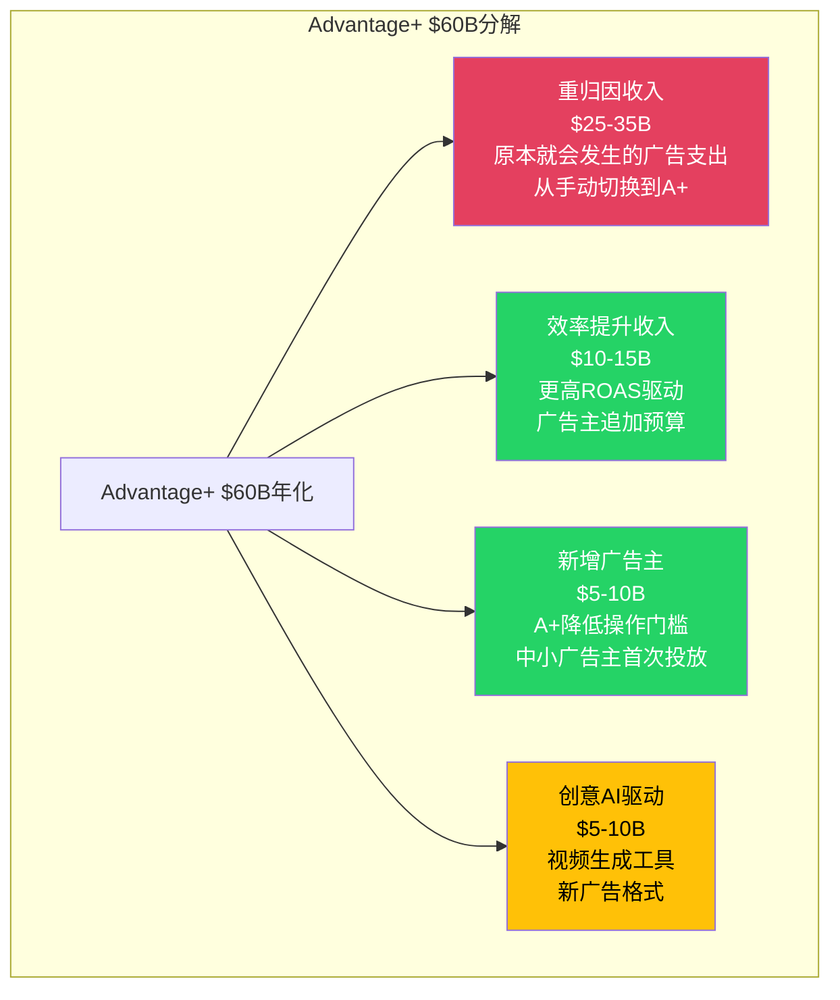
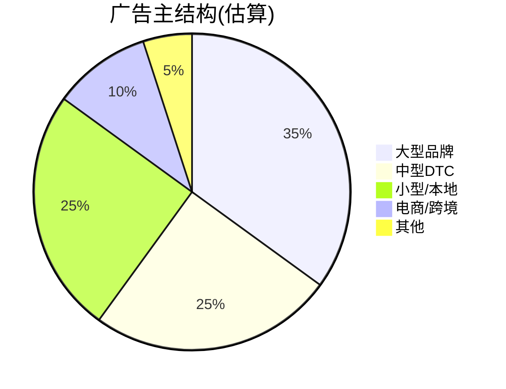
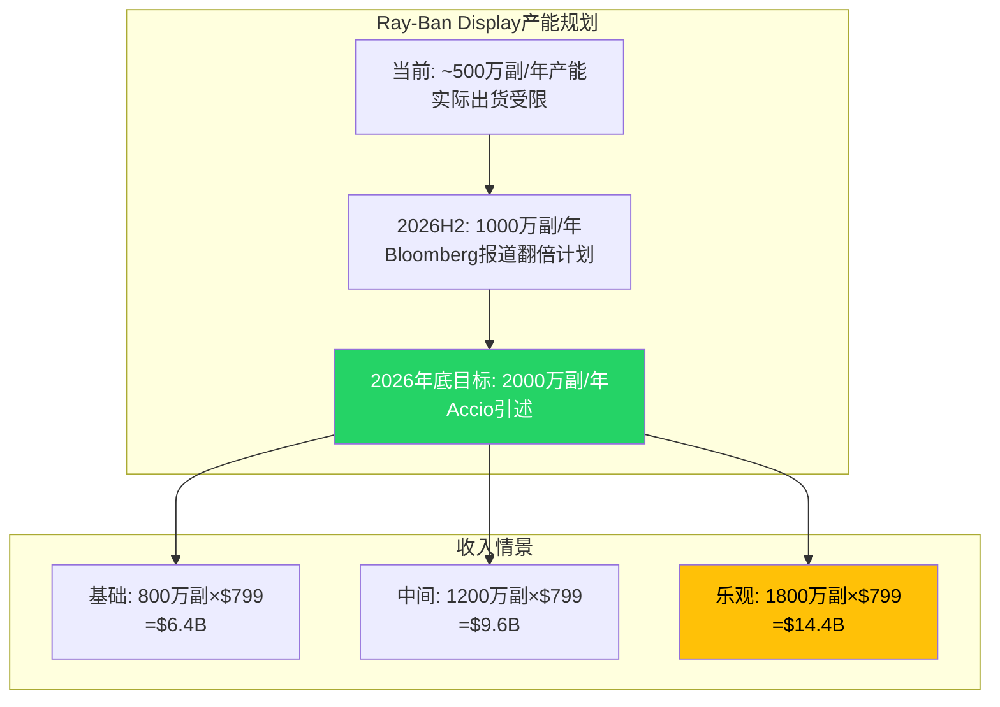
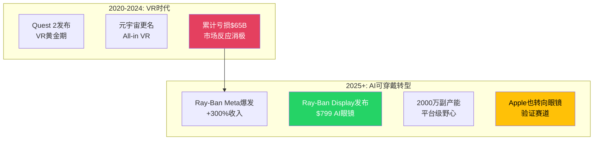
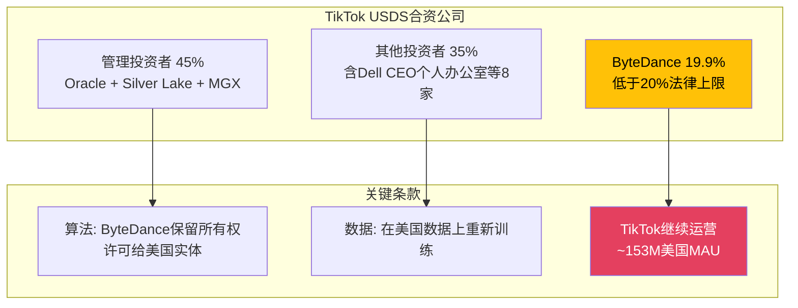
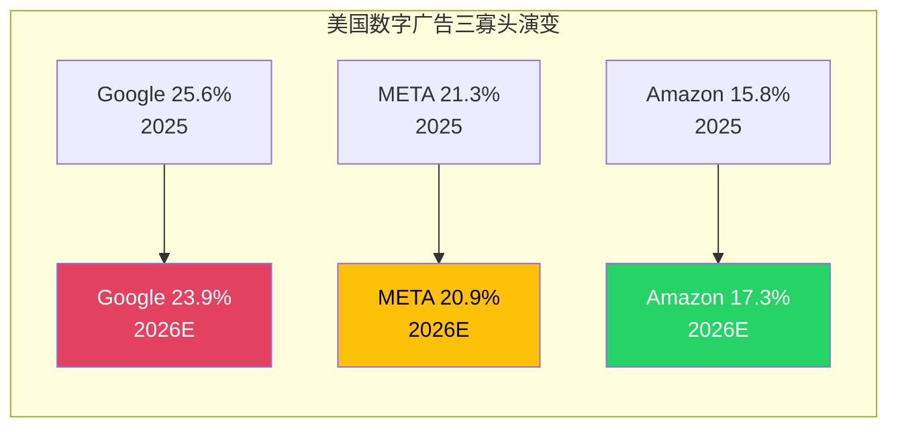
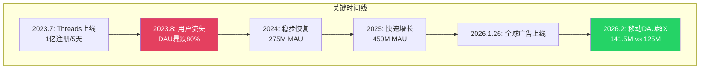
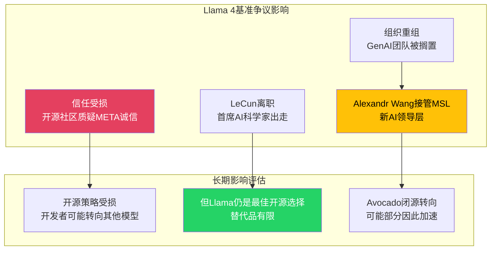

### Chapter 2 补充: 广告经济学深度模块

#### 2.5 Advantage+经济学: 增量分解

Advantage+的$60B年化收入需要进行严格的增量分解。在数字广告中，"平台归因的收入"和"平台创造的增量收入"存在系统性偏差:



**分解逻辑**:

| 组件 | 估计范围 | 占$60B比例 | 可信度 |
|------|:-------:|:----------:|:------:|
| 重归因(非增量) | $25-35B | 42-58% | 中 |
| 效率提升(真增量) | $10-15B | 17-25% | 中-高 |
| 新增广告主(真增量) | $5-10B | 8-17% | 低-中 |
| 创意AI工具(部分增量) | $5-10B | 8-17% | 低 |
| **真实增量合计** | **$20-35B** | **33-58%** | — |

这一分解表明，Advantage+的真正增量贡献可能在$20-35B范围(FoA收入的10-18%)——仍然非常显著，是META过去3年加速增长的核心驱动力，但与$60B叙事存在重要差距。

**证伪条件**: 如果2026 Q1-Q2的FoA广告收入增速在不增加广告位的情况下仍维持20%+，则增量贡献可能高于上述估计的上限。反之，如果增速明显放缓至<15%且广告位增长>15%，则增量贡献可能接近下限。

#### 2.6 广告CPM区域差异深度拆解

META的广告定价能力存在巨大的地区差异，这对理解增长质量至关重要:

```mermaid
graph LR
    subgraph CPM梯度(Q4 2025估算)
        NA_CPM[北美 CPM<br>$15-25] --> EU_CPM[欧洲 CPM<br>$8-15]
        EU_CPM --> AP_CPM[亚太 CPM<br>$3-8]
        AP_CPM --> RW_CPM[其他 CPM<br>$1-5]
    end
    subgraph 增长贡献
        NA_G[北美增长<br>+15-18%<br>=价格驱动]
        EU_G[欧洲增长<br>+18-22%<br>=量+价双驱]
        AP_G[亚太增长<br>+25-30%<br>=量驱动为主]
        RW_G[其他增长<br>+20-25%<br>=量驱动]
    end
    NA_CPM --> NA_G
    EU_CPM --> EU_G
    AP_CPM --> AP_G
    RW_CPM --> RW_G

    style NA_CPM fill:#1877F2,color:#fff
    style AP_G fill:#25D366,color:#fff
```

**关键洞察**: 高增长地区(亚太+25-30%)的CPM仅为北美的1/3-1/5。这意味着:
- $1收入增长在亚太需要3-5x的用户参与度增量
- 收入地区混合效应正在稀释整体CPM增长(Q4全球平均仅+6%)
- 利润率可能因低CPM地区占比上升而面临微妙压力

但这也意味着亚太的ARPU增长空间远大于北美——如果AI驱动的广告效率提升能在低CPM地区同样有效(这需要验证)。

#### 2.7 广告主结构与集中度

META从未披露广告主集中度数据，但通过行业分析可以推断:

| 广告主类型 | 估计收入占比 | 增长驱动 | 风险特征 |
|-----------|:----------:|---------|---------|
| 大型品牌(Fortune 500) | ~35% | 品牌预算周期性 | 经济衰退敏感 |
| 中型DTC品牌 | ~25% | ROAS驱动 | Advantage+高度依赖 |
| 小型/本地企业 | ~25% | 自助服务工具 | 最受CPM上升影响 |
| 电商/中国跨境 | ~10% | Temu/SHEIN等 | 政策风险+周期性 |
| 其他(政治/非营利等) | ~5% | 事件驱动 | 不可预测 |



中国跨境电商(Temu/SHEIN/AliExpress)是META近2年的重要增量来源。Temu 2024年的META广告支出估计超过$5B。如果美国对中国跨境电商加征关税或加强监管，这部分收入存在突然下降的风险。

---

### Chapter 3 补充: Reality Labs深度模块

#### 3.6 Ray-Ban Display: 2026年的关键变量

研究代理提供了重要的新数据——Ray-Ban Display的定价和产能目标:

| 指标 | 值 | 来源 |
|------|:--:|:----:|
| 售价(含Neural Band) | $799 | Meta官方 |
| 2026年底产能目标 | **2000万副/年** | Bloomberg, Accio |
| 当前供需状态 | 候补名单延至2026年 | CNBC |
| 全球化状态 | 暂停英/法/意/加发售，聚焦美国 | CNBC 2026-01-06 |
| 智能眼镜全球市场增速(H1 2025) | +110% | CX Network |
| META智能眼镜市占率 | ~70% | CX Network |
| AI眼镜销量增速(H1 2025) | +200% | CX Network |



**关键转变**: Ray-Ban Display($799)与Ray-Ban Meta($299)是完全不同的产品层级。Display带有显示屏和Neural Band(神经控制界面)，ASP提升了2.7倍。如果产能目标实现:

| 情景 | 出货量 | ASP | 收入 | vs 2025 RL收入$2.2B |
|------|:------:|:---:|:----:|:-------------------:|
| 保守 | 600万副 | $750(混合) | $4.5B | 2.0x |
| 基础 | 1000万副 | $700 | $7.0B | 3.2x |
| 乐观 | 1500万副 | $750 | $11.3B | 5.1x |
| 极端乐观 | 2000万副 | $799 | $16.0B | 7.3x |

即使在基础情景下($7B收入)，RL仍将亏损$10B+以上(因为运营成本$19B+水平)。但趋势方向发生了质变: 从"收入停滞+亏损扩大"变为"收入高增长+亏损收窄路径可见"。

**证伪条件**: 如果2026 Q2 RL收入仍<$800M(即产能未有效释放)，20M产能目标几乎不可能实现，RL的转型叙事将严重受损。

#### 3.7 AI可穿戴 vs VR: 战略重心量化

META的RL战略已经从VR向AI可穿戴发生根本性转移。这种转移的证据:

| 证据 | 时间 | 含义 |
|------|:----:|------|
| 关停Horizon Workrooms | 2025 Q3 | 放弃VR社交办公 |
| 关闭3个VR工作室 | 2025 Q4 | 削减VR内容投入 |
| 停售Quest企业版 | 2025 Q4 | 放弃VR企业市场 |
| RL预算削减30% | 2025 Q4(Bloomberg) | 整体缩减 |
| Ray-Ban Display发布 | 2025 Connect | AI眼镜=新旗舰 |
| 产能扩至2000万副 | 2026目标 | 巨量产能投入 |
| Apple暂停低价Vision | 2025 | 竞争对手也转向眼镜 |
| Apple智能眼镜计划 | 2026-2027 | 未来竞争焦点 |



---

### Chapter 4 补充: 用户数据修正与TikTok更新

#### 4.5 关键数据修正

基于最新数据(research agent验证):

| 数据点 | Phase 0.5值 | 修正值 | 来源 |
|--------|:----------:|:------:|:----:|
| DAP(日活人数) | 3.358B | **3.58B** | Meta Q4 FY2025 PR (December 2025月均) |
| Family ARPP(Q4) | ~$16(估) | **$16.56** | Meta Q4 FY2025 PR (+16.2% YoY) |
| Threads DAU | 未披露 | **137M** (移动DAU 141.5M) | Backlinko / TechCrunch |
| X移动DAU | ~250M(估) | **125M** | TechCrunch 2026-01-18 |
| 全球社交媒体用户 | ~55亿 | **56.6亿** | DataReportal 2026 |

DAP从3.35B(Q4 2024)到3.58B(2025年12月均)的增长意味着+6.9%的年增速——这比此前引用的+7%数据更精确，且与官方口径一致。

#### 4.6 TikTok美国结局: 关键情景更新

Phase 0.5时(2026-02-08)TikTok情景尚不确定，但research agent提供了关键更新:

**TikTok美国交易已于2026年1月22日正式完成**。新的结构为:



**对META的影响评估**:

| 原始情景 | 概率(P0.5) | 实际结果 | META影响 |
|---------|:----------:|---------|:--------:|
| TikTok被禁(强烈利好) | 15-20% | **未发生** | 上行消除 |
| 被出售给美国买家(中等利好) | 25-30% | **部分发生**(JV) | 中性偏弱利好 |
| 妥协方案运营(中性) | 40-50% | **基本发生** | 中性 |
| 维持现状延期(中性) | 10-15% | **未发生** | — |

实际结果最接近"妥协方案运营"——TikTok继续完全运营，ByteDance保留核心算法，仅让渡经济利益。这意味着:
- META失去了TikTok被禁带来的+$50-100B估值上行
- TikTok短期经历了使用量下降(从100M+ DAU降至~90M)，部分有利于Reels
- 长期竞争格局回归常态——TikTok、Reels、YouTube Shorts三足鼎立

这是一个**中性偏弱利好**的结果: META没有获得梦寐以求的TikTok退出美国的红利，但TikTok在不确定性期间流失的部分用户时间(尤其是广告主预算)可能有一部分已永久迁移。

---

### Chapter 5 补充: 竞争深度模块

#### 5.7 亚马逊: 被低估的威胁

Phase 0.5的争论卡中没有包含亚马逊，但竞争数据揭示了一个重要趋势:

| 维度 | META | Amazon | 差距趋势 |
|------|:----:|:------:|:--------:|
| 2025美国广告份额 | 21.3% | 15.8% | 缩小中 |
| 2026E美国广告份额 | 20.9% | 17.3% | 加速缩小 |
| 广告类型 | 品牌+效果 | **纯效果(购买意图)** | Amazon更精准 |
| 数据优势 | 社交行为+兴趣 | **购买行为+搜索意图** | 不同维度 |
| 广告主ROI | 高(社交曝光) | **极高(购买漏斗底部)** | Amazon占优 |



Amazon不是在争夺META的社交广告预算——而是在吞噬效果广告的增量预算。当广告主追求可衡量的ROAS时，Amazon的购买数据提供了META社交数据无法匹敌的归因精度。这种差异在经济下行周期中会被放大(广告主削减品牌预算保留效果预算)。

**META的防御**: Advantage+的增量归因(Incremental Attribution)工具正试图弥补这一差距——通过A/B测试方法证明META广告的增量转化效果，而非仅依赖最后点击归因。该工具上线仅7个月已达"多十亿级年化"规模，表明广告主对更好归因的强烈需求。

#### 5.8 Threads vs X: 社交文字战争

Threads已经在关键指标上超越X:

| 指标 | Threads | X(Twitter) | Threads优势 |
|------|:-------:|:---------:|:-----------:|
| 移动DAU | **141.5M** | 125M | +13.2% |
| MAU | 450M | 557M(声称) | -19.2% |
| 互动率 | **6.25%** | 3.6% | +73.6% |
| 品牌安全 | 高(META审核) | **极低**(4%认同) | 显著 |
| 广告上线 | 2026年1月26日 | 已运营多年 | Threads刚起步 |
| 2025E广告收入 | $0(刚上线) | ~$2.3B | — |
| 2026E广告收入 | $2-11.3B(分歧极大) | ~$2.5B(估) | — |



Threads的Evercore $11.3B vs Barclays $2B预测分歧(5.6x)是META估值中最大的不确定性来源之一。让我们拆解两种预测的隐含假设:

| 假设 | Evercore $11.3B | Barclays $2B |
|------|:--------------:|:-----------:|
| 2026 Threads MAU | ~500M | ~450M |
| 变现MAU占比 | ~80% | ~50% |
| ARPU | ~$28 | ~$9 |
| 蚕食率(对IG) | 低(<10%) | 高(>30%) |
| 隐含CPM | ~$8-12 | ~$3-5 |
| 广告主采纳速度 | 快(跟随IG) | 慢(独立验证) |

两者的核心分歧在于**蚕食率**: 如果Threads用户100%来自IG(事实)，那么Threads广告支出中有多少是从IG预算转移的?
- 如果蚕食率<15%(Evercore假设): Threads吸引的主要是X/Twitter广告预算或全新广告主→高增量
- 如果蚕食率>30%(Barclays假设): Threads吸收的主要是IG预算重新分配→低增量

**我们的评估**: 2026年蚕食率可能在15-25%范围。Threads的低CPM($3-8)意味着广告主有动力在Threads"试水"而不必削减IG预算。但长期来看，如果Threads成熟到与IG直接竞争注意力，蚕食率将不可避免地上升。

合理的2026 Threads收入估计: **$4-7B**(取Evercore和Barclays的中间偏下)。

#### 5.9 Llama 4: AI竞争力评估

Llama 4系列于2025年4月发布，包含三个模型层次:

| 模型 | 参数规模 | 定位 | 表现 |
|------|:-------:|:----:|:----:|
| Scout | 17B活跃/16专家 | 轻量级，单H100可运行 | 10M上下文窗口(业界领先)，超越Gemma 3 |
| Maverick | 17B活跃/128专家 | 主力模型 | ELO 1417，超越GPT-4o |
| Behemoth | 288B活跃/16专家/**~2T总参数** | 旗舰(仍在训练) | STEM基准超越GPT-4.5/Claude Sonnet 3.7 |

**基准争议事件**:

Llama 4 Maverick发布时引发了严重的基准操纵争议:
- META向LM Arena提交了一个"实验版本"(非公开发布版)进行评测
- 这个版本经过专门调优以在聊天基准上获得高分
- LeCun(META首席AI科学家)在离职时确认"results were fudged a little bit"
- Zuckerberg对此"非常愤怒，基本上对所有参与者失去了信心"
- GenAI组织被"搁置"(sidelined)



**META AI竞争定位**: 在前沿模型排行榜上:

| 排名 | 模型 | ELO/关键指标 | 定位 |
|:----:|------|:----------:|:----:|
| 1 | Gemini 3 Pro | ELO 1501(首个>1500) | 综合最强 |
| 2 | Claude Opus 4.5 | SWE-bench 80.9% | 编程最强 |
| 3 | GPT-5.2 | AIME 100%, FrontierMath 40.3% | 数学最强 |
| 4 | DeepSeek-V3.2 | $0.27/M tokens | 性价比最强 |
| — | Llama 4 Maverick | ELO 1417 | **最强开源** |

META的AI竞争力不在于模型本身超越GPT/Claude/Gemini——而在于:
1. **开源生态**: Llama仍是最广泛使用的开源大模型，开发者生态锁定效应强
2. **应用集成**: META AI助手已嵌入FB/IG/WA/Messenger，覆盖35.8亿DAP
3. **广告优化**: Advantage+使用的内部AI模型不需要在通用基准上领先，只需在广告预测上领先
4. **数据飞轮**: 35.8亿DAP产生的行为数据量是任何纯AI公司无法匹敌的

---

### Chapter 6 补充: 治理与监管深度

#### 6.5 监管多线围剿: 量化评估

META同时面临至少5条独立的重大监管/法律威胁:

```mermaid
graph TB
    subgraph 监管矩阵
        NM[新墨西哥州<br>2026.2.5开审<br>首个独立陪审团]
        MDL[MDL联邦多地区诉讼<br>2,243起索赔<br>青少年安全]
        FTC[FTC反垄断上诉<br>地区法院已败诉<br>2026秋口辩]
        COPPA[COPPA 2.0<br>2026.4.22合规截止<br>儿童隐私]
        DMA[EU DMA执法<br>不合规=日营收5%罚款<br>2026执法年]
    end
    subgraph 财务影响
        NM_F[NM: 如败诉→$200M-2B<br>先例效应为主]
        MDL_F[MDL: $5-25B和解<br>如NM败诉触发]
        FTC_F[FTC: <$1B(上诉)<br>拆分概率极低]
        COPPA_F[COPPA: $1-5B合规成本<br>+年化$500M-1B运营]
        DMA_F[DMA: $2-5B罚款<br>+功能限制]
    end
    NM --> NM_F
    MDL --> MDL_F
    FTC --> FTC_F
    COPPA --> COPPA_F
    DMA --> DMA_F

    style NM fill:#E4405F,color:#fff
    style MDL fill:#E4405F,color:#fff
    style DMA fill:#FFC107,color:#000
```

**概率加权影响**:

| 威胁 | 最大损失 | 概率 | 加权影响 |
|------|:-------:|:----:|:-------:|
| NM败诉 → MDL和解加速 | $25B | 30% | $7.5B |
| COPPA 2.0全面合规 | $5B初始+$1B/年 | 70% | $4.2B |
| EU DMA罚款(2026) | $5B | 40% | $2.0B |
| FTC拆分(极端) | $300B+ | <5% | $12.5B |
| 联合概率(多线同时) | — | 10% | +$5B |
| **合计加权** | — | — | **~$31B** |

$31B的概率加权监管成本约为META市值的1.8%——看似不大，但关键风险在于**FTC拆分的尾部概率**。虽然目前概率极低(<5%)，但一旦发生将毁灭性地影响估值。

**NM案件时间线(最紧迫)**:
- 2026年2月5日: 新墨西哥州开审(儿童性剥削案)
- 这是首个进入独立陪审团审判的州级诉讼
- Zuckerberg将亲自出庭(对股价有短期情绪影响)
- 裁决将为2,243起MDL索赔设定先例
- 如果META败诉，MDL和解金额可能从$5B升至$15-25B

#### 6.6 表外杠杆深度分析

META的资产负债表表面看起来很健康(净现金$22.8B)，但表外承诺显著:

```mermaid
graph TB
    subgraph 表内
        Cash[现金+证券 $81.6B]
        Debt[总债务 $83.9B]
        Net[净债务/净现金 -$2.3B<br>几乎平衡]
    end
    subgraph 表外承诺(估算)
        OB1[融资租赁 $25.2B<br>已在负债表]
        OB2[经营租赁 ~$30B+<br>数据中心等]
        OB3[GPU购买承诺 ~$40-50B<br>NVIDIA等]
        OB4[基础设施合同 ~$20-30B<br>建设中项目]
    end
    subgraph 真实杠杆
        TL[表内+表外合计<br>$175-220B承诺<br>vs $81.6B流动性]
    end
    Net --> TL
    OB1 --> TL
    OB2 --> TL
    OB3 --> TL
    OB4 --> TL

    style TL fill:#E4405F,color:#fff
    style Cash fill:#25D366,color:#fff
```

$175-220B的总承诺与$81.6B的流动性之间存在$100B+的缺口——这不是一个即刻的流动性危机(因为承诺分布在多年)，但它意味着META在未来3-5年需要持续产生$30-50B/年的OCF来履行这些承诺。如果广告市场遭遇2022式衰退(收入-1%)，这些承诺将成为沉重的固定成本负担。

---

### 数据锚点注册表 (Session 1 新增)

以下DM锚点在Session 1中新增或更新:

| DM ID | 类型 | 值 | 来源 | 状态 |
|-------|------|-----|------|:----:|
| DM-FIN-014 | 更新 | Q1 2026指引: $53.5-56.5B | Meta Q4 FY2025 PR | 已验证 |
| DM-FIN-015 | 更新 | FY2026费用指引: $162-169B | Meta Q4 FY2025 PR | 已验证 |
| DM-FIN-016 | 更新 | FY2026 CapEx指引: $115-135B | Meta Q4 FY2025 PR | 已验证 |
| DM-FIN-017 | 新增 | FY2026E税率: 13-16% | Meta Q4 FY2025 PR | 已验证 |
| DM-USER-001 | 修正 | DAP 3.58B(2025年12月均) | Meta Q4 FY2025 PR | 已验证 |
| DM-USER-002 | 新增 | Family ARPP $16.56(Q4 2025) | Meta Q4 FY2025 PR | 已验证 |
| DM-USER-003 | 新增 | Threads 450M MAU, 137M DAU | Backlinko 2026 | 已验证 |
| DM-USER-004 | 新增 | Threads移动DAU 141.5M > X 125M | TechCrunch 2026-01-18 | 已验证 |
| DM-COMP-001 | 新增 | TikTok US JV完成(2026-01-22) | NPR / Northeastern | 已验证 |
| DM-COMP-002 | 新增 | TikTok US: ~153M MAU, ~90M DAU | TechCrunch / Dataconomy | 已验证 |
| DM-COMP-003 | 新增 | Snap Q4: $1.72B rev, 474M DAU, 946M MAU | CNBC 2026-02-04 | 已验证 |
| DM-COMP-004 | 新增 | X 2025 ad rev ~$2.3B (+16.5% YoY) | Business of Apps | 中等可信 |
| DM-COMP-005 | 新增 | META US广告份额: 21.3%(2025)→20.9%(2026E) | Marketing Charts | 已验证 |
| DM-COMP-006 | 新增 | Amazon US广告份额: 15.8%→17.3% | Marketing Charts | 已验证 |
| DM-RL-002 | 新增 | Ray-Ban Display $799, 20M产能目标(2026底) | Bloomberg / Accio / CNBC | 已验证 |
| DM-RL-003 | 新增 | 全球智能眼镜H1 2025 +110%, META市占70% | CX Network | 已验证 |
| DM-RL-004 | 新增 | Vision Pro: 生产停止, 营销削减95% | Virtual Reality News | 中等可信 |
| DM-AI-003 | 新增 | Llama 4 Behemoth: 2T参数, 288B活跃, 仍在训练 | Meta AI Blog / VentureBeat | 已验证 |
| DM-AI-004 | 新增 | Llama 4基准争议: LeCun确认"fudged" | Slashdot 2026-01-02 | 已验证 |
| DM-AI-005 | 新增 | Zuckerberg搁置GenAI组织 | TechCrunch / Slashdot | 中等可信 |

**Session 1 DM统计**: 新增20个锚点，修正1个(DAP)。总计DM锚点: 85个(v2.0升级后)。
