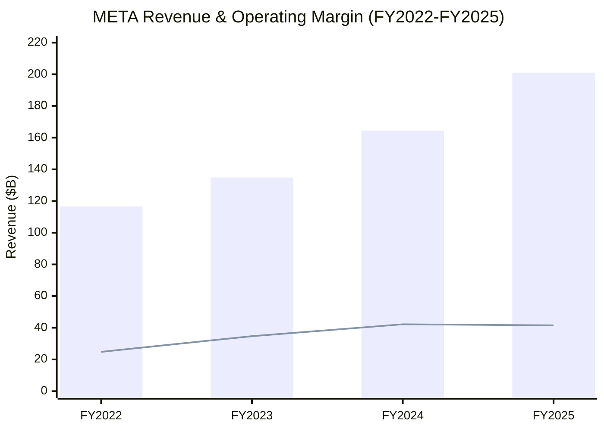
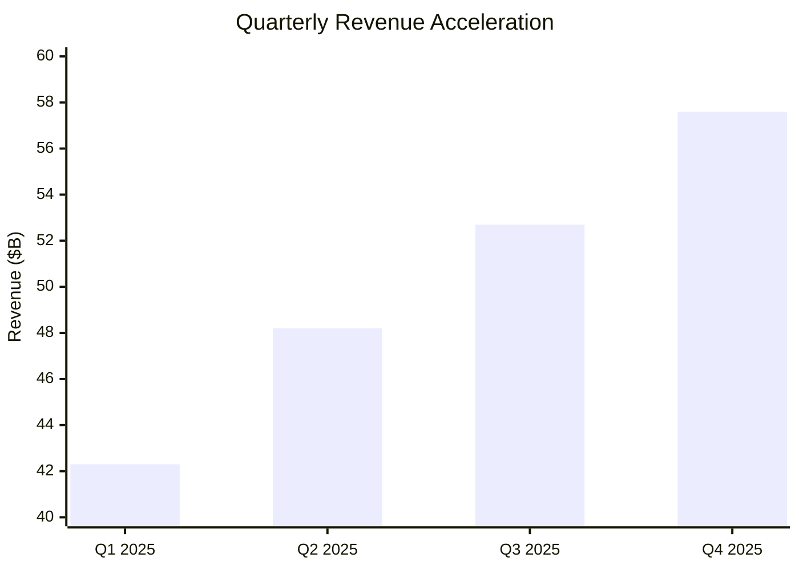
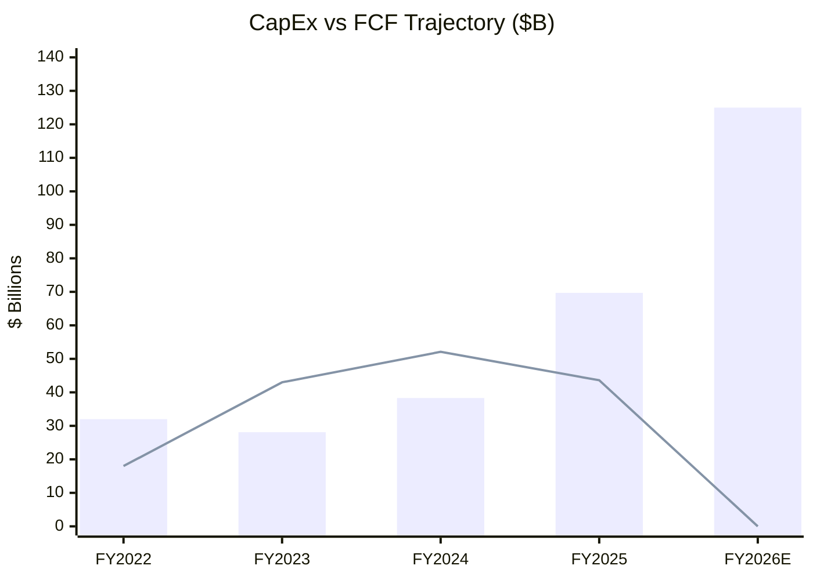
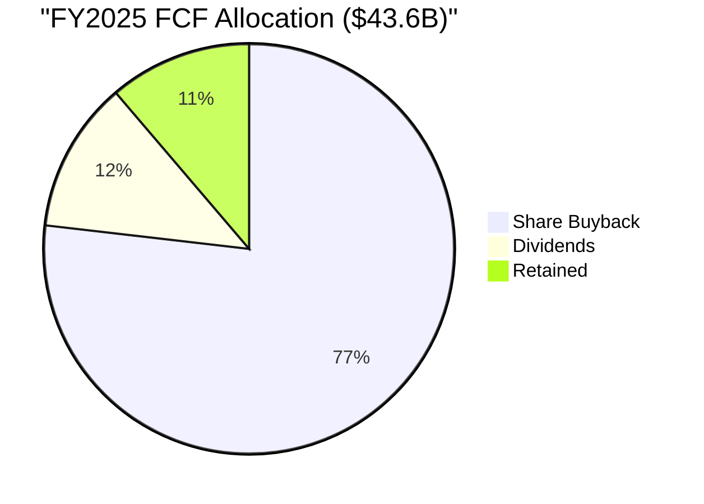
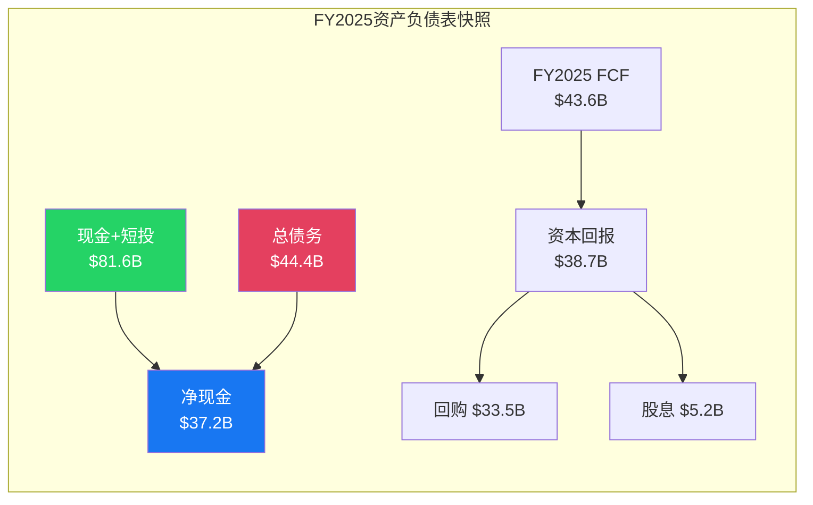
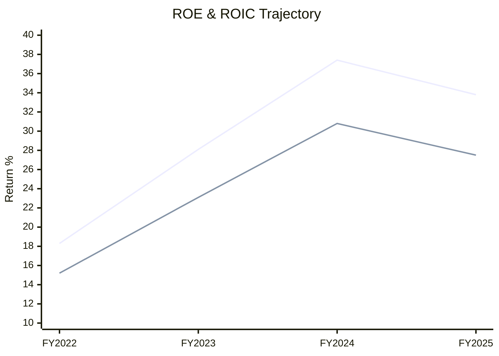
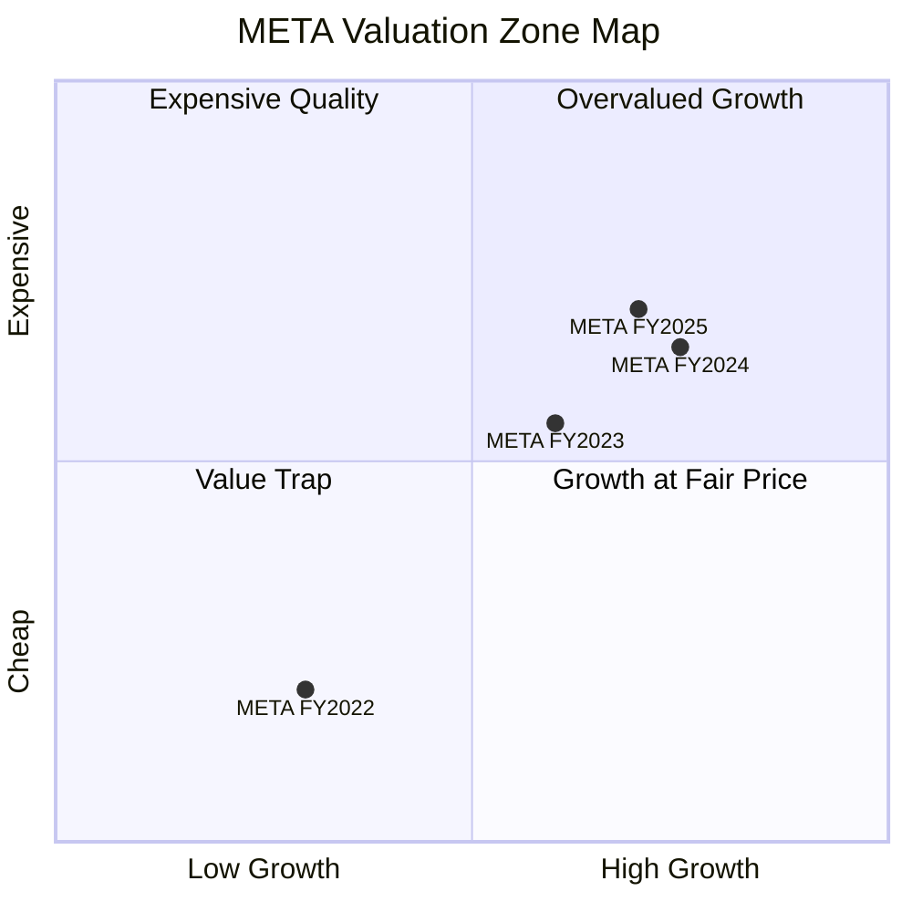
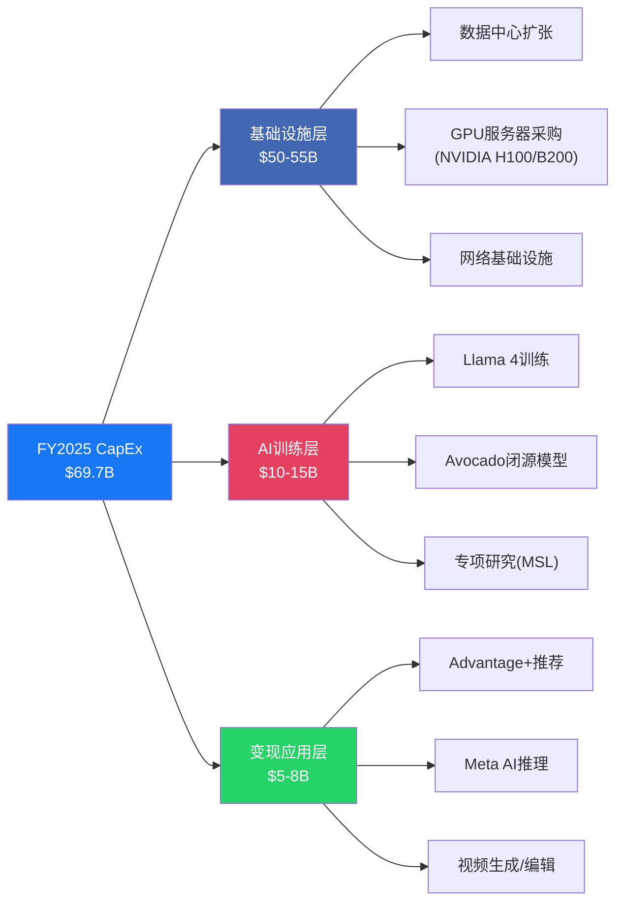
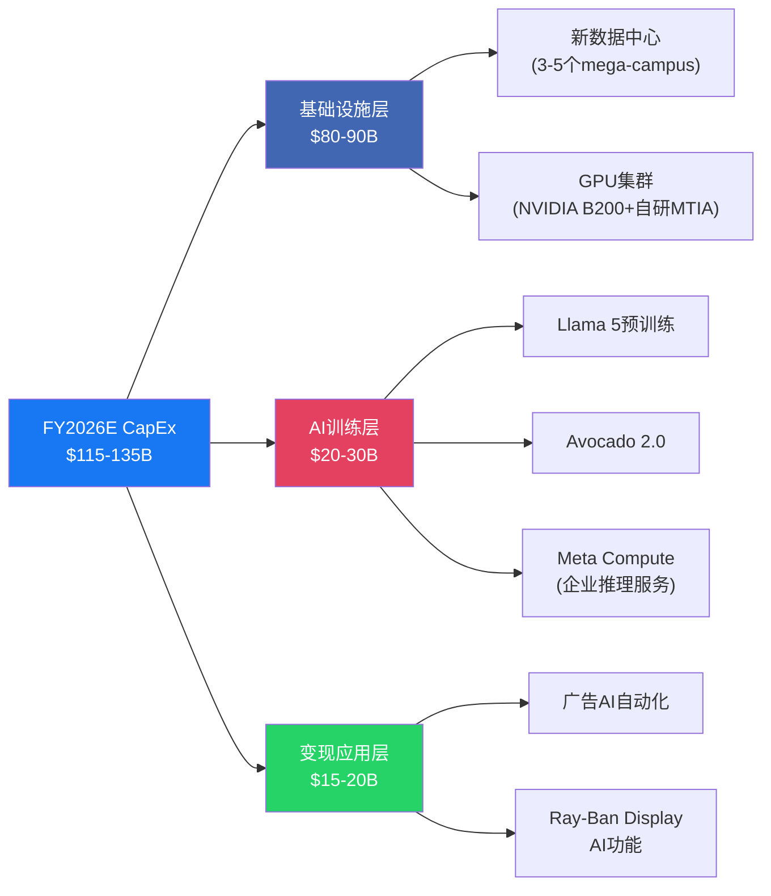
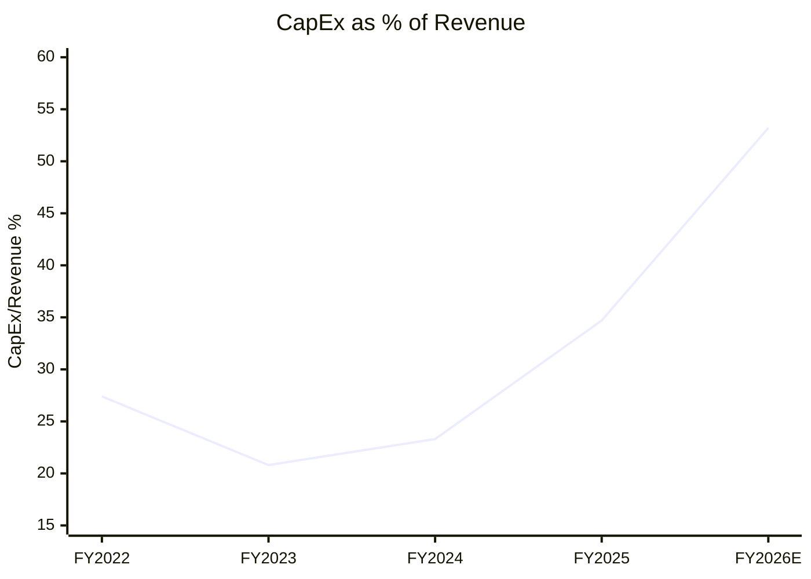

### 补充模块: 历史财务轨迹可视化分析

---

## Section 1: 四年财务轨迹分析 (FY2022-FY2025)

#### 1.1 营收复苏弧线: 从至暗时刻到加速增长

2022年是Meta Platforms自上市以来最糟糕的一年。全年营收$116.6B，同比下滑1.1%——这是公司历史上首次出现年度负增长。苹果ATT隐私政策的冲击、TikTok的用户时长侵蚀、以及Reels尚未变现的三重打击，叠加宏观经济放缓，将META推入了"后社交时代是否终结"的叙事深渊。

但接下来发生的事情，是过去十年科技行业最令人瞩目的运营转型之一。

FY2023被Zuckerberg自己定义为"效率之年"(Year of Efficiency)。这不是一句口号——它对应着11,000人的裁员、扁平化管理层级、关闭非核心项目(Portal硬件、Workrooms VR办公)、以及全面收紧招聘。结果是营收反弹至$134.9B(+15.7%)的同时，运营利润率从24.8%跃升至34.7%——接近10个百分点的改善，在这个体量的公司中极为罕见。

FY2024延续了加速度: 营收$164.5B(+21.9%)，运营利润$69.4B，利润率进一步扩张至42.2%。这已经超越了META在2021年巅峰时期(2021年运营利润率39.6%)的盈利能力。Advantage+广告系统的全面铺开是核心驱动力——AI驱动的广告优化不仅提升了单位广告收入，还降低了广告主的操作门槛，带来了增量预算。

FY2025标志着加速的顶点与拐点的并存: 营收突破$200B大关至$201.0B(+22.2%)，但运营利润率出现了自效率转型以来的首次回落，从42.2%降至41.5%。净利润从$62.4B下降至$60.5B，EPS从$23.86微降至$23.49——尽管营收增长22%。原因很清楚: CapEx从$38.3B飙升至$69.7B，AI基础设施投入正式进入吞噬利润的阶段。

| 年度 | 营收 ($B) | 营收增速 | 毛利率 | 运营利润率 | 净利润 ($B) | EPS |
|:----:|:---------:|:-------:|:------:|:---------:|:-----------:|:---:|
| FY2022 | 116.6 | -1.1% | 80.5% | 24.8% | 23.2 | $8.59 |
| FY2023 | 134.9 | +15.7% | 80.5% | 34.7% | 39.1 | $14.87 |
| FY2024 | 164.5 | +21.9% | 81.1% | 42.2% | 62.4 | $23.86 |
| FY2025 | 201.0 | +22.2% | 82.0% | 41.5% | 60.5 | $23.49 |

这张表隐含了一个关键信号: 毛利率持续扩张(80.5%→82.0%)，说明核心广告业务的单位经济学仍在改善; 运营利润率的回落完全来自CapEx和运营费用的增加，而非业务质量恶化。这是"主动选择投资"而非"被动利润侵蚀"——区分这两者对理解META当前估值至关重要。

#### 1.2 季度加速度: Q4 2025的信号

季度数据揭示了一个比年度数据更令人瞩目的趋势: Q1至Q4，同比增速从16.3%逐季加速至26.2%。这种"加速的加速"在$200B营收基础上极其罕见——全球仅有少数几家公司能在这个体量维持加速增长。

| 季度 | 营收 ($B) | YoY增速 | 运营利润 ($B) | 运营利润率 | EPS | CapEx ($B) |
|:----:|:---------:|:------:|:------------:|:---------:|:---:|:----------:|
| Q1 2025 | 42.3 | +16.3% | 17.6 | 41.6% | $4.48 | 13.7 |
| Q2 2025 | 48.2 | +22.1% | 20.3 | 42.1% | $5.23 | 15.3 |
| Q3 2025 | 19.3 | +23.9% | 22.3 | 42.3% | $6.03 | 19.3 |
| Q4 2025 | 57.6 | +26.2% | 23.4 | 40.6% | $7.45 | 21.4 |

Q4运营利润率降至40.6%是一个值得关注的信号。CapEx在Q4达到$21.4B(年化$85.6B)，已经开始逼近FY2026E的$115-135B指引节奏。如果这一加速持续，FY2026的利润率将面临更大压力。

#### 1.3 CapEx轨迹: 指数级爬升

CapEx的轨迹是理解META未来3-5年财务走向的核心变量。从FY2023的$28.1B(效率之年的削减低点)到FY2025的$69.7B，两年间增长了148%。而FY2026E的$115-135B指引意味着再增长65-94%。

这不是线性增长——这是指数级爬升。如果取FY2026指引中点$125B，META的CapEx将超过全球绝大多数石油公司、电信运营商、甚至多数国家的年度基础设施投资。

#### 1.4 FCF压缩与资本回报

FCF从FY2024的$52.1B下降至FY2025的$43.6B，尽管营收增长22%。这是CapEx从$38.3B跃升至$69.7B(+82%)的直接结果。如果FY2026 CapEx达到$125B且营收增长放缓至15-18%，FCF可能进一步压缩甚至转负。

FY2025的资本回报总额达到$38.7B(回购$33.5B + 股息$5.2B)，占FCF的88.8%。这是一个极其激进的回报率——几乎将全部自由现金流返还给股东。这在当前CapEx加速期是不可持续的:

- 如果FY2026 FCF降至$10-15B(假设CapEx $125B, 营收$235B, 运营利润$92B)，当前的$38.7B回报水平需要动用资产负债表现金或新增举债
- 这实际上意味着META正在"借钱回购"——用负债为AI投资融资，同时用现金回报股东

#### 1.5 资产负债表: 堡垒与杠杆的双重叙事

FY2025末，META持有$81.6B现金及短期投资，对比$44.4B总债务，净现金$37.2B。从传统指标看，这是一张堡垒级的资产负债表: Debt/EBITDA仅0.4x，利息覆盖率45.8x。

但这张快照掩盖了一个动态趋势: 现金从$40.7B增长至$81.6B(+100%)的同时，债务也从$26.9B增长至$44.4B(+65%)。净现金虽然仍在扩大($13.8B→$37.2B)，但如果FY2026 CapEx达到指引中点，净现金的增长将停滞甚至逆转。

---

## Section 2: 关键财务比率演变与结构性分析

#### 2.1 估值倍数的扩张与收缩

META的P/E从FY2022的约13x(历史低谷)扩张至FY2025的约28.5x。这一扩张反映了两个同步运动: 盈利能力的大幅改善(EPS从$8.59到$23.49)，以及市场对META从"遗产社交平台"到"AI基础设施公司"叙事转变的重新定价。

| 比率 | FY2022 | FY2023 | FY2024 | FY2025 |
|:----:|:------:|:------:|:------:|:------:|
| P/E (TTM) | ~13x | ~30x | ~33x | ~28.5x |
| P/FCF | ~26x | ~19x | ~25x | ~38.6x |
| ROE | 18.3% | 28.1% | 37.4% | 33.8% |
| ROIC | 15.2% | 23.1% | 30.8% | 27.5% |
| Debt/EBITDA | 0.6x | 0.6x | 0.5x | 0.4x |
| 利息覆盖率 | 25.7x | 37.2x | 51.3x | 45.8x |
| FCF Yield | 4.2% | 3.3% | 3.1% | 2.6% |
| 股息率 | 0% | 0% | 0.2% | 0.3% |

但P/E和P/FCF正在讲述两个截然不同的故事。P/E从33x回落至28.5x，暗示估值在消化; 而P/FCF从25x飙升至38.6x，暗示FCF的恶化速度快于市场预期。当一家公司的P/E在下降但P/FCF在上升时，意味着利润与现金流之间出现了劈叉——这在资本密集型转型期是典型信号，但也是风险的来源。

#### 2.2 ROE/ROIC: 巅峰已过?

ROE从FY2022的18.3%攀升至FY2024的37.4%——效率转型和营收增长的双重红利推动了资本回报率翻倍。但FY2025已出现回落至33.8%，ROIC同步从30.8%降至27.5%。

回落原因并非业务恶化，而是资本基数的膨胀。$69.7B的CapEx正在迅速扩大分母(投入资本)，而这些资产的变现回报尚需时间显现。如果FY2026 CapEx达到$125B，ROIC可能进一步降至20-22%区间——仍然健康，但与FY2024的巅峰相比将显著缩水。

这是所有大规模投资周期的必经之路: 短期内ROIC下降是投资强度的自然结果，关键问题是3-5年后这些资产能否产生高于资本成本的回报。

#### 2.3 FCF Yield与估值区间

FCF Yield从FY2022的4.2%持续压缩至FY2025的2.6%。META正在从"价值型科技股"(高FCF yield + 低P/E)的定价区间，滑向"成长型科技股"(低FCF yield + 高P/FCF)的定价区间。

从象限图可以直观看到META四年间的迁移路径: FY2022处于"价值陷阱/深度价值"区间(低增长+低估值); FY2023跃入"合理定价的增长"区间; FY2024进一步推向"昂贵品质"边缘; FY2025则在增长维持的同时估值持续上移，已逼近"昂贵品质"核心区域。

需要注意的是，FY2025的增长维度读数(0.7)略低于FY2024(0.75)，反映出市场已开始price in CapEx对未来FCF的压制效应。如果FY2026增速放缓至15%以下且FCF大幅压缩，META可能向左上象限(高估值成长)漂移。

#### 2.4 财务健康总评

从偿债能力看，META处于绝对安全区域。Altman Z-Score约8.74(远超安全阈值3.0)，Piotroski F-Score 6分(8分为满分中的中上水平)，利息覆盖率45.8x。即使CapEx翻倍，META也不会面临债务危机——这家公司的问题永远是资本配置效率，而非资本充足性。

---

## Section 3: CapEx漏斗三层拆解

#### 3.1 FY2025 $69.7B CapEx结构

META的$69.7B资本支出并非一个均匀分布的整体。按功能拆解为三个递进层级，从基础设施到训练到变现，构成一个完整的AI价值转化漏斗:

**Layer 1: 基础设施层 (~$50-55B, 70-80%)**。这是最大的支出块，涵盖数据中心的物理建设、GPU服务器的大规模采购(主要是NVIDIA H100/B200系列)、以及高速互联网络。这一层的特征是高度资本密集但相对确定——数据中心建成后可使用15-20年，GPU集群的生命周期约3-5年。折旧周期长意味着短期对利润表的冲击有限，但长期积累效应显著。

**Layer 2: AI训练层 (~$10-15B, 15-20%)**。专门用于大模型训练的计算开支，包括Llama 4系列的预训练、内部闭源模型Avocado的开发、以及Meta Scalable Learning(MSL)等前沿研究项目。这一层的回报周期最不确定——训练出的模型可能产生巨大价值(如Advantage+对广告的赋能)，也可能被竞争对手迅速追赶而失去先发优势。

**Layer 3: 变现应用层 (~$5-8B, 5-10%)**。直接服务于收入转化的推理计算和应用开发，包括Advantage+广告推荐系统的推理算力、Meta AI的用户交互推理、以及视频生成/编辑等创作者工具。这是CapEx漏斗中回报最直接可测量的部分，但占比最小——这一不平衡本身就说明了当前阶段的投资性质: META仍处于"建设期"而非"收割期"。

#### 3.2 FY2026E $115-135B: 规模跃迁

FY2026E的$115-135B指引代表着65-94%的同比增长。几个结构性变化值得关注:

首先，**自研芯片MTIA的占比开始上升**。META的第二代MTIA推理芯片已在部分推荐工作负载中部署，如果第三代MTIA在训练场景也能分担部分算力，将降低对NVIDIA的依赖并改善长期单位成本。但短期内，NVIDIA GPU仍是训练场景的绝对主力。

其次，**变现应用层的绝对金额和占比同步扩大**(从$5-8B到$15-20B)。Meta Compute(向企业提供推理服务)的出现暗示META可能正在探索将AI基础设施本身作为收入来源——类似AWS从亚马逊内部工具演变为独立业务的路径。这是一个值得持续追踪的战略方向。

最后，**CapEx占营收的比例**正在经历剧变: FY2023为20.8%，FY2025为34.7%，FY2026E可能达到48-57%(如果营收$235-240B)。这一比率已经接近电信运营商和半导体制造商的水平，意味着META的财务特征正在从"轻资产平台"向"重资产基础设施"转型——这对估值方法论有深远影响。

这条曲线的陡峭程度可能是META投资论文中最关键的单一变量。如果CapEx/Revenue比率在FY2027开始回落(意味着收入增长追上了资本投入)，当前估值具有合理性; 如果这条曲线继续攀升或平台化在50%+水平，META将面临永久性的FCF压缩，估值框架需要根本性调整。

---

*本模块所有财务数据来源于META 10-K/10-Q财报及管理层指引。Mermaid图表为数据可视化工具，非精确比例尺。*
