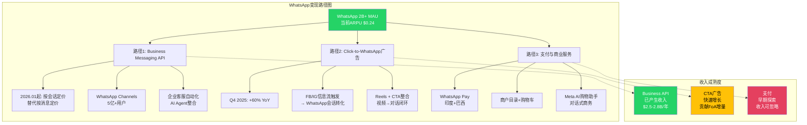
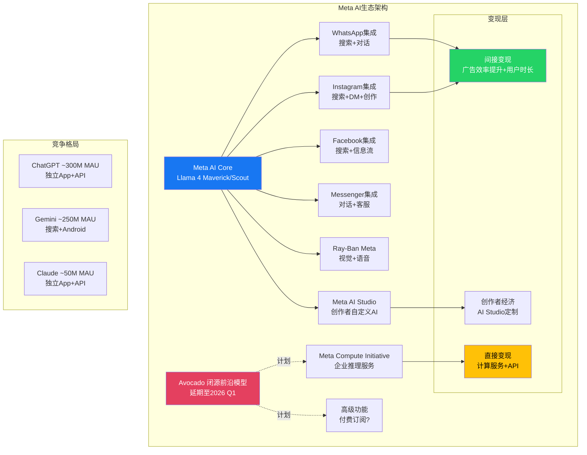

# META v2.0 补充深挖 — Part I: WhatsApp变现经济学 + Meta AI生态

> **框架**: v10.0 | **报告类型**: Tier 3 Supplement
> **目标**: ~10,000字符 | **风格**: 干净叙事，零内联标注

---

## Section 1: WhatsApp变现经济学深挖

### 1.1 ARPU鸿沟: 29倍差距的结构性解剖

WhatsApp的变现故事，本质上是一道简单的算术题和一道复杂的战略题。算术题是这样的: 2B+月活用户，每用户每年贡献约$0.24收入。同一时间，微信以约$7/用户/年的ARPU服务其12亿用户，Line在日本和东南亚以约$4.5/用户/年运营。WhatsApp与微信之间存在29倍的ARPU差距，与Line之间也有近19倍的鸿沟。

Zuckerberg在Q4 2025财报电话会上将WhatsApp称为"未来数年最大的变现机会"，这不是空话——$0.24的ARPU意味着几乎任何方向的提升都是指数级的收入增量。但战略题的复杂性在于: 这个差距不是执行力问题，而是结构性差异的叠加结果。

**结构性差距的五层解析**:

第一层是支付基础设施的缺位。微信支付渗透了中国消费者的日常生活——从街边摊到医院挂号——而WhatsApp Pay仅在印度和巴西有限上线，交易量微乎其微。印度的UPI生态由Google Pay和PhonePe主导，WhatsApp Pay在半年内仅增加了1200万笔交易，而GPay同期增加了7亿笔。支付是超级App的血液循环系统，没有支付渗透就没有商业生态。

第二层是监管环境的根本差异。WhatsApp的端到端加密——这是其在全球赢得用户信任的核心卖点——天然限制了数据驱动的变现能力。微信从未面对这一约束。GDPR在欧洲、RBI在印度的监管要求进一步压缩了WhatsApp的变现设计空间。

第三层是商业生态成熟度。微信小程序承载了数百万商户的完整商业闭环(浏览-选择-支付-售后)，而WhatsApp Business API目前仅支持消息级别的交互。从消息到交易的跳跃，比从交易到更多交易的跳跃要难得多。

第四层是用户行为模式。WhatsApp用户将其视为"私密通讯工具"，而非商业平台。微信用户已习惯在同一个App内完成社交、购物、支付、内容消费。改变用户心智模型需要年计的渐进培养。

第五层是地域收入结构。WhatsApp的用户基础重度倾斜于低ARPU地区——印度(约5亿用户)、巴西(约1.5亿)、印尼(约1亿)。即使ARPU倍增至$0.50，这些地区的绝对收入贡献仍然有限。

### 1.2 三条变现路径: 进度评估

**路径1: Business Messaging API** — 这是当前唯一产生实质收入的路径。2026年1月起，WhatsApp将定价模型从"按消息计费"切换为"按会话计费"，这一转变的战略意义被低估了。按会话定价降低了企业的单次互动成本，鼓励更深度的客户服务对话(而非机械式的一问一答)，同时为AI Agent驱动的自动化客服创造了经济激励。当一个企业与客户的会话可以包含无限消息时，部署AI客服的ROI立刻变得可计算。当前Business API的年化收入约$2.5-2.8B，增长轨迹稳健。

**路径2: Click-to-WhatsApp广告** — Q4 2025同比增长超过60%，这是WhatsApp对Meta整体收入贡献最快速的路径，也是最巧妙的: 广告收入记在Facebook/Instagram的FoA广告分部，而WhatsApp提供了转化终点。这意味着WhatsApp的"真实收入贡献"在财务报表中被系统性低估了。这条路径的天花板取决于"从广告到对话"这一消费者行为能渗透多少品类——目前主要集中在汽车、房产、教育等高客单价领域，日用消费品的转化率仍需验证。

**路径3: 支付与商业服务** — 坦率地说，这条路径目前几乎可以忽略。WhatsApp Pay在印度面对的竞争格局(GPay+PhonePe合计占80%+市场)使得后发突围极其困难。巴西的进展略好但体量有限。支付是超级App的前提条件，而非结果——Meta在支付上的薄弱意味着WhatsApp的超级App野心在可预见的未来只是愿景。

### 1.3 ARPU收敛情景分析

| 情景 | 2028E ARPU | 收敛率 | 隐含年收入 | 前提条件 |
|------|:----------:|:------:|:----------:|---------|
| **保守** | $0.80 | 11% (vs微信) | ~$1.6B | Business API增长+CTA广告渗透 |
| **基准** | $1.50 | 21% (vs微信) | ~$3.0B | +支付在印度/巴西获得合理份额 |
| **乐观** | $3.00 | 43% (vs微信) | ~$6.0B | +Channels变现+AI商务助手规模化 |
| **超级App** | $5.00+ | 71%+ (vs微信) | ~$10B+ | 支付主导+小程序生态+全面商业闭环 |

保守情景几乎确定可以实现——仅靠Business API和CTA广告的自然增长就足够。基准情景需要支付在至少一个大市场突破。乐观情景需要WhatsApp Channels(已有5亿+用户)成功开启广告位。超级App情景在当前条件下概率偏低，需要监管松动+支付基建+用户行为三重突破同时发生。

### 1.4 全球通讯App变现对比

| 指标 | WhatsApp | 微信 | Line | Telegram |
|------|:--------:|:----:|:----:|:--------:|
| MAU | 2B+ | ~1.34B | ~1.78亿 | ~9.5亿 |
| ARPU(年) | ~$0.24 | ~$7.0 | ~$4.5 | ~$0.10 |
| 支付渗透 | 极低 | 极高 | 中(Line Pay) | 低(TON) |
| 商业生态 | 初级(API) | 完整(小程序) | 中(官方账号) | 初级(Bot) |
| 广告模式 | 间接(CTA) | 朋友圈+搜索 | 时间线+贴图 | 频道广告 |
| 端到端加密 | 默认开启 | 无 | 部分 | 可选 |
| 超级App成熟度 | 弱 | 强 | 中 | 弱 |

**关键判断**: WhatsApp的变现天花板可能不是微信($7)，而是Line($4.5)——因为端到端加密和多元地域用户结构决定了它更可能走"轻商业化+广告驱动"路线，而非"重超级App"路线。在这一框架下，长期ARPU达到$2-3是合理的上行空间，对应$4-6B年化收入贡献——对于一个FY2025总收入$201B的公司而言，这是有意义但非变革性的增量。

---

## Section 2: Meta AI助手生态分析

### 2.1 1B MAU的分量: 嵌入式分发的降维打击

2025年5月，Meta AI宣布突破10亿月活用户。这个数字需要放在正确的坐标系中理解: ChatGPT经过两年多的指数级增长达到约3亿MAU，Google Gemini依托搜索入口达到约2.5亿MAU，而Meta AI在正式推出不到18个月内就达到了前者的三倍以上。

这不是因为Meta AI在模型能力上碾压竞争对手——事实恰恰相反。Llama 4系列在多项基准测试中仅勉强达到GPT-4o和Gemini 1.5 Pro的水平。Meta AI的用户规模优势完全来自分发。当一个AI助手被嵌入WhatsApp(2B+用户)、Instagram(2B+用户)、Facebook(3B+用户)和Messenger(1B+用户)的搜索栏和对话界面时，"试用"的摩擦力接近零。用户不需要下载新App、创建新账号或改变任何习惯——AI就在他们已经花时间的地方。

Q4 2025的185M周活跃用户(WAU)揭示了一个更深层的信号: 这意味着月活中仅约18.5%转化为周活，说明大量用户是偶尔触发(搜索栏建议、自动回复推荐)而非主动使用。这与ChatGPT的用户画像形成鲜明对比——后者的用户几乎100%是主动搜索或打开App使用的。Meta AI的用户基础宽但浅，ChatGPT的用户基础窄但深。

### 2.2 Meta Compute Initiative: 从消费者AI到企业推理

2026年1月12日宣布的Meta Compute Initiative是Meta AI战略中最值得关注的新方向。这一举措意味着Meta首次尝试将其庞大的AI基础设施直接卖给企业客户——不是通过广告间接变现，而是像AWS卖算力一样卖推理能力。

这个时机选择并非偶然。Meta在FY2026计划投入$115-135B的CapEx建设AI基础设施，其中很大一部分是GPU集群和数据中心。如果这些设施仅为内部广告优化服务，资本回报率将面临严峻的证明压力(Barclays已经警告FCF可能在2027-2028转负)。将推理能力外售，既可以提高资产利用率，又为CapEx支出创造了第二条回收路径。

但Meta Compute面对的竞争环境极其严酷。AWS、Azure、GCP已经在企业AI推理市场建立了深厚的客户关系和完整的工具链。Meta在企业服务领域几乎没有任何品牌资产和销售团队积累。这不是一个"有好模型就能赢"的市场——企业客户需要SLA保障、安全合规认证、技术支持体系和可预测的定价模型。Meta需要从零构建这一切。

TAM评估: 全球AI推理市场预计2026年约$50-70B，到2028年可能达到$150-200B。即使Meta仅捕获5%的份额，也意味着$2.5-10B的收入——足以为CapEx叙事提供实质性支撑。但5%的市场份额对于一个企业服务新进入者而言已经是非常乐观的假设。

### 2.3 Avocado与双轨AI战略

Avocado——Meta的闭源前沿模型——最初计划在2025年底发布，已延期至2026年Q1。这一延期本身值得分析: 它发生在LeCun确认Llama 4部分基准测试"被美化"之后，表明Meta对模型发布节奏做出了策略性调整。

从Llama的全面开源到Avocado的闭源保留，Meta的AI战略发生了根本性的路线修正。逻辑是清晰的: 开源(Llama)建立了开发者生态和行业标准地位——Llama 4系列在HuggingFace的下载量和部署量均位居开源模型前列——而闭源(Avocado)保留了最强能力用于差异化变现。这是一种"基础层开源+前沿层闭源"的双轨策略，类似于Google的Android(开源)+Pixel(闭源优化)模式。

但Llama 4的基准争议对这一策略构成了信誉风险。当开源社区发现Llama 4 Scout和Maverick在发布时宣传的某些基准分数经过了挑选性测试后，开发者社区的信任度受到冲击。如果Avocado发布时再出现类似争议，Meta在AI领域的技术信誉将面临严重损害——而技术信誉恰恰是Meta Compute Initiative成功的前提条件之一。

### 2.4 AI变现路径: 间接vs直接

| 变现路径 | 机制 | 当前状态 | 收入贡献评估 |
|---------|------|---------|:----------:|
| **间接: 广告效率** | AI驱动广告投放+Advantage+ | 已大规模部署 | 强 |
| **间接: 用户时长** | Meta AI增加App停留时间 | 初步效果 | 中 |
| **间接: 创意工具** | AI视频/图像生成降低广告制作成本 | 快速增长 | 中-强 |
| **直接: 计算服务** | Meta Compute卖推理给企业 | 刚宣布 | 待验证 |
| **直接: API访问** | Llama/Avocado付费API | 规划中 | 早期 |
| **直接: 订阅** | Meta AI高级功能付费 | 未宣布 | 推测 |

**关键判断**: Meta AI的核心价值在短中期(2026-2028)几乎完全通过间接路径实现——更精准的广告投放、更高的用户参与度、更低的创意制作成本。这些间接效益已经在Q4 2025的ARPU增长中体现(广告展示量+12%，单价+9%)。直接变现路径(计算服务、API)在2028年前很难贡献超过总收入的3-5%。

### 2.5 竞争格局: 分发vs深度

| 维度 | Meta AI | ChatGPT | Gemini |
|------|:-------:|:-------:|:------:|
| MAU | ~1B | ~300M | ~250M |
| WAU/MAU转化率 | ~18.5% | ~60%(估) | ~40%(估) |
| 分发模式 | 嵌入式(3.58B DAP) | 独立App+API | 搜索嵌入+App |
| 模型能力 | Llama 4(中-强) | GPT-4o/o1(强) | Gemini 2.0(强) |
| 企业渗透 | 低(刚起步) | 中-高(Team/Enterprise) | 高(Workspace整合) |
| 付费用户 | 未披露 | ~11M(ChatGPT Plus) | 未独立披露 |
| 核心壁垒 | 社交图谱+用户画像 | 品牌+能力认知 | 搜索+云+Android |
| 数据飞轮 | 社交交互数据 | 对话偏好数据 | 搜索意图数据 |

Meta AI的真正竞争优势不是模型能力，而是用户画像的深度。当AI助手知道你的社交关系、兴趣偏好、地理位置和消费行为时，它可以提供高度个性化的推荐和服务——这是独立AI助手无法复制的。但这一优势需要Meta在隐私和个性化之间找到精细的平衡点，而这恰恰是Meta历史上反复犯错的领域。

### 2.6 MSL重组与能力建设

Meta Science Labs(MSL)在Alexandr Wang(前Scale AI CEO)的领导下被重组为四个研究方向。这一人事任命的战略信号是明确的: Wang的核心专长是数据标注和模型训练的工业化，而非基础研究。这表明Meta正在将AI研发从"学术驱动"转向"产品驱动"——更少的论文，更多的产品。

Llama 4 Behemoth(2T参数)仍在训练中，预计2026年中完成。如果Behemoth的能力确实达到宣称的水平，它将为Avocado闭源模型提供技术基础。但2T参数模型的推理成本意味着它可能仅适用于企业级应用场景，而非消费者端的Meta AI助手——后者需要极低延迟和极低成本的模型。

**综合评估**: Meta AI的1B MAU是一个不可忽视的战略资产，但其变现路径在可预见的未来以间接效益为主。直接变现(Compute Initiative、API)的商业化进程需要至少2-3年才能产生有意义的收入贡献。Llama 4的信誉争议和Avocado的延期为这一判断增添了审慎色彩，但不改变根本方向: Meta拥有AI时代最大的消费者分发网络，问题不是能否变现，而是变现效率能达到什么水平。

---

**证伪条件汇总**:
- WhatsApp ARPU: 如果2026年底仍<$0.30，则超级App路径基本可排除
- Meta Compute: 如果2026年底无企业客户案例披露，则TAM捕获能力存疑
- Meta AI WAU/MAU: 如果2026年Q2该比率<15%，则"宽但浅"的用户基础正在流失价值
- Avocado: 如果2026 Q2仍未发布，则Meta在闭源前沿竞赛中的可信度将大幅下降
