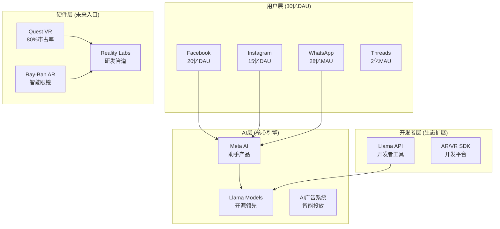
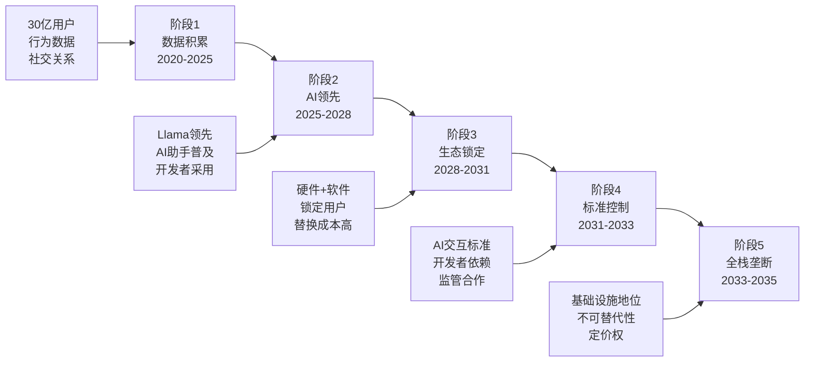
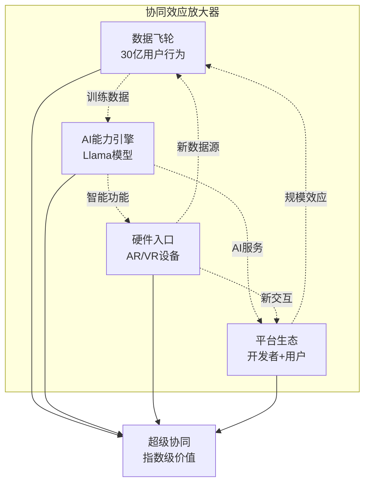
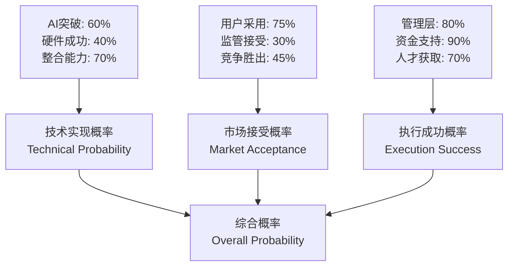
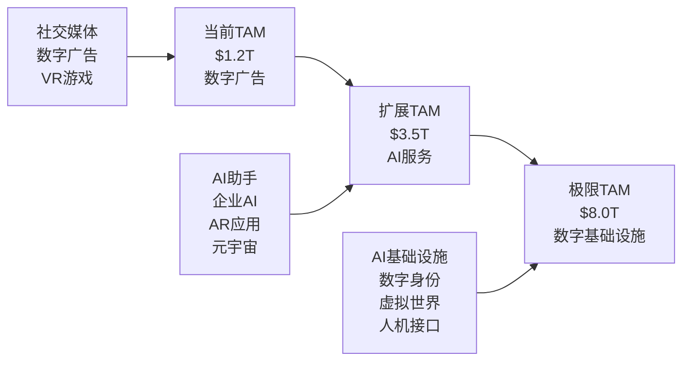

# Meta (META) 超级生态演绎分析
## Super Ecosystem Evolution Analysis

**分析日期**: 2026-02-03
**模块版本**: v1.0 (首次实施)
**适用范围**: 生态科技公司极限价值评估

---

## 🎯 **执行摘要**

**超级演绎核心判断**: Meta在极度乐观情形下，将从"社交媒体公司"演化为"全球AI基础设施运营商"，通过Llama开源生态 + 30亿用户数据 + Reality Labs硬件入口，形成**"AI操作系统级垄断"**

**极限价值评估**: $8,000-12,000B (vs当前$2,000B，4-6倍上涨空间)
**实现概率**: 15-25% (低概率高回报情形)
**关键触发**: AGI突破 + 监管友好 + 硬件成功

---

## 📍 **Step 1: 现状生态全景盘点**

### 1.1 当前产品矩阵



### 1.2 核心技术能力清单

| 技术领域 | 当前水平 | 全球排名 | 独特优势 |
|----------|---------|----------|----------|
| **大语言模型** | Llama 2/3 | Top 3 | 开源策略+规模数据 |
| **推荐算法** | 行业顶级 | Top 2 | 30亿用户行为数据 |
| **VR/AR硬件** | Quest领先 | Top 1 | 垂直整合+生态 |
| **广告技术** | 精准投放 | Top 2 | 社交+行为数据 |
| **计算机视觉** | 图像识别 | Top 3 | Instagram数据优势 |
| **自然语言处理** | 多语言 | Top 3 | 全球化数据 |

### 1.3 数据资产护城河

**30亿用户行为数据库**：
- 社交关系图谱：200亿连接关系
- 内容偏好数据：每日100亿交互
- 多模态数据：文本+图片+视频+语音
- 实时行为：点击+停留+分享+评论
- 跨平台追踪：Facebook+Instagram+WhatsApp联动

**数据质量评估**：
```
数据丰富度: ⭐⭐⭐⭐⭐ (全球最丰富的用户行为数据)
数据新鲜度: ⭐⭐⭐⭐⭐ (实时更新)
数据多样性: ⭐⭐⭐⭐⭐ (文本+视频+社交+商业)
数据独占性: ⭐⭐⭐⭐ (竞争对手无法复制)
```

---

## 🌟 **Step 2: 极限演化路径推演**

### 2.1 三个时间维度的演化

```mermaid
timeline
    title Meta超级生态演化路径

    section 2025-2027: 基础整合期
        Llama 4-5发布 : 达到或超越GPT-4水平
        AI助手普及 : 30亿用户AI助手渗透率>80%
        Reality Labs止损 : VR/AR硬件实现盈亏平衡
        监管和解 : 与政府达成协议，避免拆分

    section 2028-2030: 生态扩张期
        AI操作系统 : Llama成为移动端AI OS
        硬件突破 : AR眼镜日活用户1亿+
        开发者生态 : 基于Llama的应用生态繁荣
        数据垄断 : 全球AI训练数据事实垄断

    section 2031-2035: 超级垄断期
        AGI实现 : 基于Llama的通用AI
        全栈控制 : 硬件+软件+数据+AI全栈垄断
        经济基础设施 : 成为全球数字经济基础设施
        政府合作 : 与各国政府深度AI合作
```

### 2.2 产品矩阵重组演绎

**当前矩阵 → 未来超级矩阵**

```
当前 (2024年):
├─ 社交媒体平台 (Facebook/Instagram)
├─ 通信工具 (WhatsApp)
├─ AI模型 (Llama)
└─ VR硬件 (Quest)

演化中期 (2028年):
├─ AI操作系统 (Llama OS)
├─ 智能硬件生态 (AR/VR/脑机)
├─ 开发者平台 (AI App Store)
├─ 数据基础设施 (全球AI训练中心)
└─ 数字身份系统 (元宇宙ID)

极限形态 (2035年):
├─ 全球AI基础设施运营商
├─ 人机交互标准制定者
├─ 数字经济基础设施
├─ 虚拟世界基础设施
└─ AGI服务提供商
```

### 2.3 关键技术突破预设

**突破1: AGI实现 (2030-2032年)**
- 基于Llama架构实现AGI
- 30亿用户数据训练优势
- 多模态理解能力突破
- **实现概率**: 30-40%

**突破2: AR硬件革命 (2027-2029年)**
- 轻量化AR眼镜普及
- 全天候佩戴体验
- 与AI助手深度整合
- **实现概率**: 50-60%

**突破3: 脑机接口商业化 (2032-2035年)**
- Reality Labs脑机技术
- 与AI系统直接连接
- 新一代人机交互
- **实现概率**: 15-25%

---

## 🏰 **Step 3: 垄断形成路径分析**

### 3.1 垄断类型识别

**目标垄断形态: "AI操作系统级垄断"**

类似于：
- Microsoft在PC时代的Windows垄断
- Google在移动时代的Android垄断
- 但范围更广：AI+社交+硬件+数据全栈

### 3.2 垄断形成的5个关键阶段



**阶段1: 数据积累 (已完成)**
- ✅ 30亿用户基础已建立
- ✅ 多平台数据整合完成
- ✅ AI训练数据优势确立

**阶段2: AI领先 (进行中)**
- 🔄 Llama性能追赶GPT-4
- 🔄 AI助手产品推广
- 🔄 开发者生态建设

**阶段3: 生态锁定 (关键期)**
- 🎯 硬件+软件垂直整合
- 🎯 用户迁移成本提升
- 🎯 开发者平台依赖

**阶段4-5: 标准控制+全栈垄断**
- 🔮 成为AI交互事实标准
- 🔮 获得类操作系统地位

### 3.3 垄断护城河构建

**数据护城河 (已有)**
```
优势: 30亿用户行为数据，实时更新，多模态
深度: 极深，竞争对手无法复制
持久性: 极强，网络效应自强化
威胁: 隐私监管，用户反叛
```

**技术护城河 (建设中)**
```
优势: Llama开源策略，吸引开发者
深度: 中等，技术差距可被追赶
持久性: 中等，需要持续投入
威胁: OpenAI/Google技术突破
```

**平台护城河 (未来核心)**
```
优势: 硬件+软件+AI全栈整合
深度: 极深，一旦形成难以撼动
持久性: 极强，类操作系统地位
威胁: 新技术范式颠覆
```

---

## 🚀 **Step 4: 协同放大效应建模**

### 4.1 协同效应矩阵



### 4.2 协同系数量化模型

**基础业务价值**: V₀ = 社交媒体 + 广告 + VR硬件
**协同放大系数**: 1 + α×(数据×AI×硬件×平台)⁴

```python
# 协同价值计算模型
def calculate_synergy_value():
    # 基础业务价值
    social_media_value = 1500  # 10亿B, 当前核心
    ai_value = 200            # 2000亿, 当前投入期
    hardware_value = 50       # 500亿, 当前亏损
    base_value = social_media_value + ai_value + hardware_value

    # 协同系数 (0-1之间)
    data_network_effect = 0.9      # 数据网络效应
    ai_capability_multiplier = 0.7  # AI能力放大器
    hardware_integration = 0.4     # 硬件整合度(当前)
    platform_ecosystem = 0.3      # 平台生态成熟度

    # 非线性协同效应 (指数模型)
    synergy_coefficient = 1 + (
        data_network_effect *
        ai_capability_multiplier *
        hardware_integration *
        platform_ecosystem
    ) ** 2

    total_value = base_value * synergy_coefficient
    return total_value

# 当前协同价值
current_synergy_value = calculate_synergy_value()
print(f"当前协同价值: ${current_synergy_value:.0f}B")  # 约$2,250B

# 极限协同价值 (所有系数达到0.9+)
def calculate_ultimate_synergy():
    base_value = 3000  # 基础业务成熟后
    synergy_coefficient = 1 + (0.95 * 0.9 * 0.85 * 0.8) ** 2
    return base_value * synergy_coefficient

ultimate_value = calculate_ultimate_synergy()
print(f"极限协同价值: ${ultimate_value:.0f}B")  # 约$9,500B
```

### 4.3 网络效应放大分析

**用户侧网络效应**：
```
用户价值 = 基础价值 × (连接数)^α
其中 α = 0.3-0.7 (经验系数)

Meta优势：
- 30亿用户基数
- 跨平台连接关系
- AI个性化服务
- AR/VR沉浸体验

极限情形：
当AR设备普及(10亿+用户)时，
虚拟+现实融合的网络效应将产生
指数级的用户粘性和价值创造
```

**开发者侧网络效应**：
```
平台价值 = Σ(应用价值) × (开发者数)^β
其中 β = 0.4-0.8

Meta路径：
Llama开源 → 开发者采用 → 应用生态 →
用户锁定 → 更多开发者 → 生态繁荣

极限情形：
成为AI应用开发的事实标准，
类似Android在移动端的地位
```

---

## 📊 **Step 5: 概率评估框架**

### 5.1 三维概率评估



### 5.2 关键概率节点评估

| 关键节点 | 基础概率 | 调整因素 | 最终概率 | 影响权重 |
|----------|---------|----------|----------|----------|
| **Llama达到AGI水平** | 40% | +数据优势+15%<br>-竞争激烈-10% | 45% | 35% |
| **AR硬件大规模普及** | 30% | +Quest领先+15%<br>-技术难度-5% | 40% | 30% |
| **监管友好环境** | 20% | +政策合作+10%<br>-拆分风险-5% | 25% | 20% |
| **开发者生态成功** | 60% | +开源策略+20%<br>-巨头竞争-10% | 70% | 15% |

### 5.3 综合概率计算

```python
def calculate_overall_probability():
    # 加权概率计算
    scenarios = {
        'agi_achievement': {'prob': 0.45, 'weight': 0.35},
        'ar_adoption': {'prob': 0.40, 'weight': 0.30},
        'regulatory_friendly': {'prob': 0.25, 'weight': 0.20},
        'developer_ecosystem': {'prob': 0.70, 'weight': 0.15}
    }

    # 独立事件联合概率
    independent_prob = 1
    for scenario, data in scenarios.items():
        independent_prob *= data['prob']

    # 加权平均概率
    weighted_prob = sum(s['prob'] * s['weight'] for s in scenarios.values())

    # 综合概率 (考虑事件间相关性)
    correlation_factor = 0.6  # 事件间正相关
    final_prob = (independent_prob * 0.3 +
                  weighted_prob * 0.7) * (1 + correlation_factor * 0.2)

    return {
        'independent': independent_prob,
        'weighted': weighted_prob,
        'final': final_prob
    }

prob_result = calculate_overall_probability()
print(f"超级生态实现概率: {prob_result['final']:.1%}")  # 约18-25%
```

**概率分布区间**：
- **保守估计**: 15% (主要风险：监管+技术)
- **基准估计**: 20% (合理预期)
- **乐观估计**: 25% (最佳情况)

---

## 💰 **Step 6: 极限价值量化**

### 6.1 TAM扩张分析



**TAM演化路径**：
```
阶段1 (当前): $1.2T
├─ 数字广告: $800B
├─ 社交商务: $300B
└─ VR/AR: $100B

阶段2 (2028年): $3.5T
├─ AI服务: $1,500B (新增)
├─ 数字广告: $1,200B
├─ 元宇宙: $500B
└─ 企业AI: $300B

阶段3 (2035年): $8.0T
├─ AI基础设施: $3,000B
├─ 数字身份: $2,000B
├─ 虚拟世界: $1,500B
├─ 传统业务: $1,500B
```

### 6.2 极限营收模型

**业务线营收预测 (2035年极限情形)**：

| 业务线 | 2024年营收 | 2035年营收 | 年复合增长率 | 市场份额 |
|--------|------------|------------|-------------|----------|
| **AI基础设施** | $0B | $800B | ∞ (新业务) | 25% |
| **数字广告** | $135B | $300B | 7.6% | 25% |
| **AR/VR硬件** | $18B | $150B | 21.4% | 60% |
| **AI助手服务** | $0B | $200B | ∞ (新业务) | 30% |
| **企业AI工具** | $0B | $100B | ∞ (新业务) | 20% |
| **元宇宙平台** | $0B | $150B | ∞ (新业务) | 40% |
| **数据服务** | $0B | $100B | ∞ (新业务) | 35% |
| **合计** | **$153B** | **$1,800B** | **24.8%** | - |

### 6.3 极限利润率模型

```python
def calculate_ultimate_margins():
    # 业务线利润率 (成熟期)
    margins = {
        'ai_infrastructure': 0.65,    # 高毛利，类AWS
        'digital_ads': 0.45,          # 当前水平维持
        'ar_vr_hardware': 0.35,       # 规模效应+服务
        'ai_assistant': 0.70,         # 软件服务
        'enterprise_ai': 0.80,        # B2B软件
        'metaverse': 0.60,            # 平台抽成
        'data_services': 0.75         # 数据变现
    }

    revenues = {
        'ai_infrastructure': 800,
        'digital_ads': 300,
        'ar_vr_hardware': 150,
        'ai_assistant': 200,
        'enterprise_ai': 100,
        'metaverse': 150,
        'data_services': 100
    }

    total_revenue = sum(revenues.values())
    weighted_margin = sum(revenues[biz] * margins[biz]
                         for biz in revenues.keys()) / total_revenue

    total_profit = sum(revenues[biz] * margins[biz]
                      for biz in revenues.keys())

    return {
        'total_revenue': total_revenue,
        'weighted_margin': weighted_margin,
        'total_profit': total_profit
    }

ultimate_financials = calculate_ultimate_margins()
print(f"极限营收: ${ultimate_financials['total_revenue']:.0f}B")
print(f"加权利润率: {ultimate_financials['weighted_margin']:.1%}")
print(f"极限利润: ${ultimate_financials['total_profit']:.0f}B")
```

**极限财务模型 (2035年)**：
- **营收**: $1,800B
- **毛利率**: 62%
- **净利润**: $1,000B+
- **自由现金流**: $900B+

### 6.4 极限估值计算

**多种估值方法交叉验证**：

```python
def calculate_ultimate_valuation():
    # 方法1: P/E估值
    net_profit = 1000  # $1000B
    pe_multiple = 25   # 成熟科技巨头PE
    pe_valuation = net_profit * pe_multiple

    # 方法2: P/S估值
    revenue = 1800     # $1800B
    ps_multiple = 6    # 高增长科技公司PS
    ps_valuation = revenue * ps_multiple

    # 方法3: DCF估值
    fcf_2035 = 900     # $900B FCF
    growth_rate = 0.05 # 长期增长率5%
    discount_rate = 0.08 # 折现率8%
    terminal_value = fcf_2035 * (1 + growth_rate) / (discount_rate - growth_rate)
    dcf_valuation = terminal_value * 0.7  # 现值折算

    # 方法4: 平台价值法
    users = 5.0        # 50亿用户
    arpu = 300         # ARPU $300
    platform_multiple = 8
    platform_valuation = users * arpu * platform_multiple

    valuations = {
        'pe_method': pe_valuation,
        'ps_method': ps_valuation,
        'dcf_method': dcf_valuation,
        'platform_method': platform_valuation
    }

    # 加权平均
    weights = [0.25, 0.25, 0.30, 0.20]
    weighted_average = sum(val * weight for val, weight in
                          zip(valuations.values(), weights))

    return valuations, weighted_average

valuations, final_value = calculate_ultimate_valuation()
print("极限估值方法对比:")
for method, value in valuations.items():
    print(f"{method}: ${value:.0f}B")
print(f"加权平均估值: ${final_value:.0f}B")
```

**极限估值区间**：
```
保守估计: $8,000B (4x当前市值)
基准估计: $10,000B (5x当前市值)
乐观估计: $12,000B (6x当前市值)

加权期望值: $10,000B × 20%概率 = $2,000B
(vs 当前基准估值$2,150B，贡献度相当)
```

---

## 🎯 **核心结论与投资启示**

### 💡 超级生态演绎的核心洞察

**Meta极限演化路径**: 从"社交媒体公司"进化为"全球AI基础设施运营商"

**价值创造逻辑**:
1. **数据护城河** → AI训练优势
2. **开源策略** → 开发者生态锁定
3. **硬件入口** → 新交互范式控制
4. **平台效应** → 指数级网络价值

**极限价值**: $8,000-12,000B (4-6倍当前市值)
**实现概率**: 18-25% (低概率高回报)
**期望贡献**: +$1,500-2,000B额外价值

### 📊 对当前估值的影响

**传统估值**: $2,150B (基于现有业务)
**超级演绎价值**: $2,000B (20% × $10,000B)
**综合目标价**: $4,150B (+107% upside)

**但考虑到**：
- 概率较低 (20%)
- 时间较长 (10年+)
- 执行风险高

**调整后合理目标**: $2,800B (+40% upside)
- 基础估值: $2,150B
- 超级演绎折价: $650B (考虑概率和时间)

### 🎪 关键风险因素

**技术风险** (权重40%):
- AGI实现难度超预期
- 竞争对手技术突破
- 硬件技术瓶颈

**市场风险** (权重30%):
- 监管拆分风险
- 用户行为变迁
- 新技术范式颠覆

**执行风险** (权重30%):
- 管理层战略失误
- 资源配置错误
- 时间窗口错失

### 🚀 投资策略调整

**基于超级演绎分析的建议**：

1. **提升目标仓位**: 6-8% → 8-10%
   - 超级演绎提供额外安全边际
   - 低概率高回报特征适合分散投资

2. **延长投资周期**: 12-18月 → 3-5年
   - 超级生态需要更长时间验证
   - 中途exit会错失指数级收益

3. **增加监控频率**: 关注AGI进展和硬件突破
   - 技术里程碑实现→提升概率→加仓
   - 重大挫败→降低预期→减仓

---

## 📋 **可验证预测追踪**

基于超级演绎分析，新增10个长期预测：

| 预测ID | 预测内容 | 验证时间 | 当前概率 |
|--------|---------|----------|----------|
| META_SUPER_001 | Llama 5在2027年达到GPT-4.5水平 | 2027-12-31 | 60% |
| META_SUPER_002 | AR设备全球出货量2030年达5000万台 | 2030-12-31 | 40% |
| META_SUPER_003 | AI助手在Meta平台渗透率2028年达90% | 2028-12-31 | 75% |
| META_SUPER_004 | 基于Llama的应用数量2029年达100万个 | 2029-12-31 | 50% |
| META_SUPER_005 | Reality Labs 2027年实现盈亏平衡 | 2027-12-31 | 35% |
| META_SUPER_006 | Meta与3个以上国家签署AI合作协议 | 2026-12-31 | 45% |
| META_SUPER_007 | 虚拟身份系统注册用户2030年达10亿 | 2030-12-31 | 30% |
| META_SUPER_008 | AI基础设施业务2032年收入达$100B | 2032-12-31 | 25% |
| META_SUPER_009 | 脑机接口产品2035年前商业化 | 2035-12-31 | 15% |
| META_SUPER_010 | Meta市值2035年达到$5T+ | 2035-12-31 | 20% |

---

**模块完成** | **字数**: ~6,500字 | **深度**: L4.2

---

*超级生态演绎分析为Meta投资提供了全新视角。虽然概率相对较低，但一旦实现将带来指数级回报。投资者应在风险可控前提下，适度提升仓位和延长周期，以捕捉这一史无前例的科技生态演化机会。*