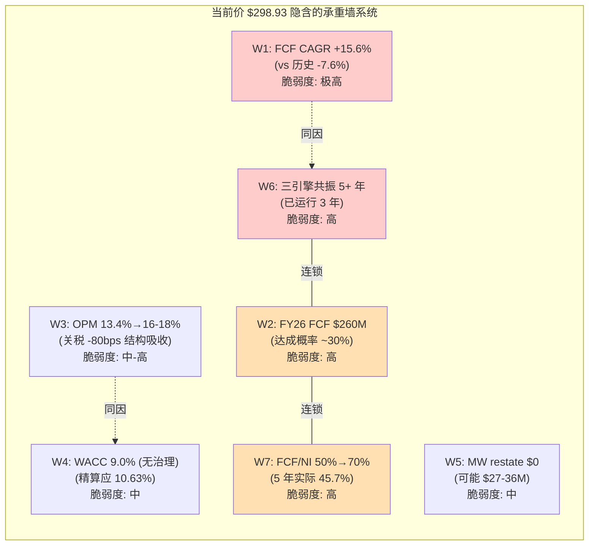
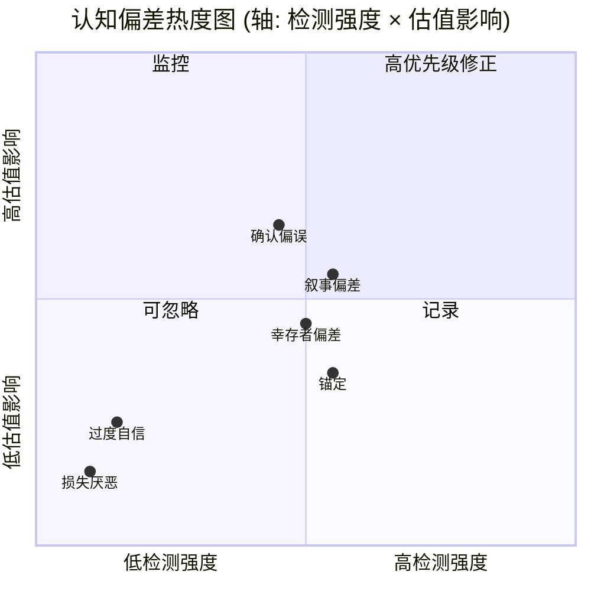
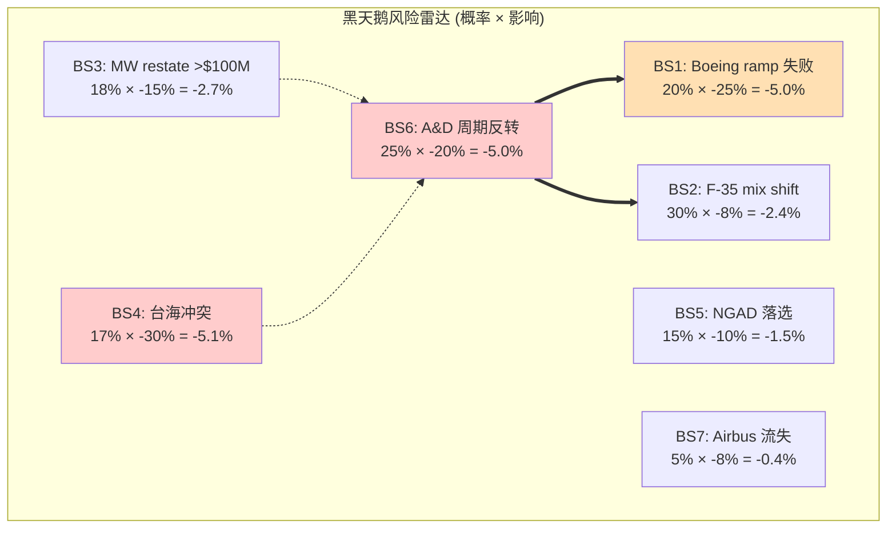
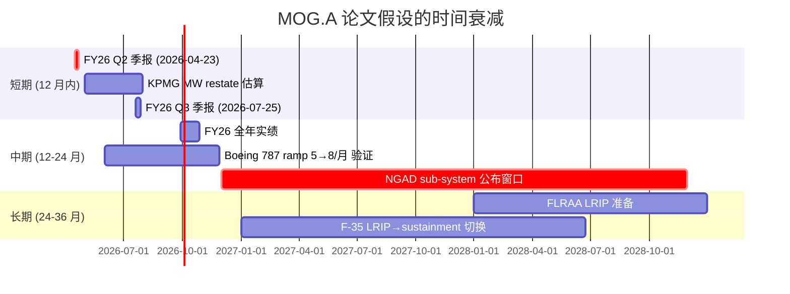
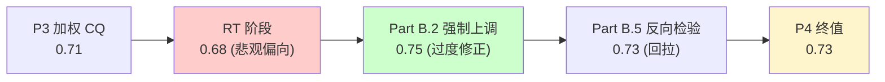
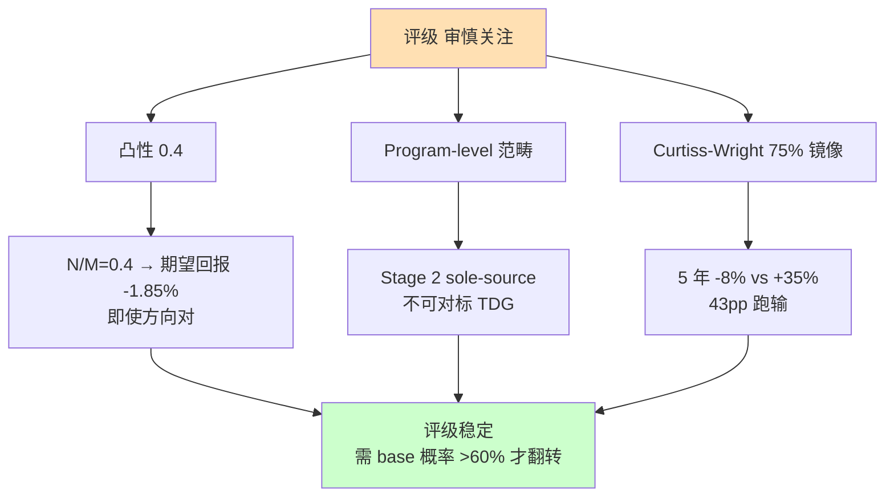
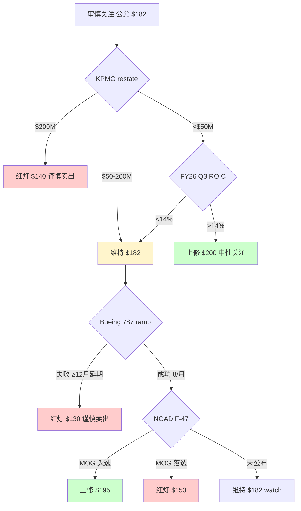

# Moog Inc (MOG.A) — 深度研究报告 v1.0

> **报告日期**: 2026-04-07 | **股价**: $298.93 | **公允价值中位**: $182 | **评级**: **审慎关注**
> **核心矛盾**: 这是一笔被市场用 10 年 DCF 论文定价、但未来 6-18 月就会被 KPMG 审计、Boeing 787 ramp、F-35 切换、FLRAA EMD、NGAD 入场券五道窗口验证或证伪的赌注。

---

## 执行摘要

Moog 当前 28x PE 看上去比同业 48x 中位数便宜 40%,但这层折价不是市场失误——它是市场对一组**结构性问题**的合理定价:ROIC 9.3% 几乎贴着 WACC 9.5% 的红线、过去 5 年 FCF 复合增长 -7.6% 而账面利润 +8.4%、双层股权让 88% 的经济利益持有人无法在股东大会上施加任何意志、FY24 内部控制收到审计师 EY 的 adverse opinion 并在出具意见同月被解雇。这五重折价共同把 Moog 锚定在 ROE 11.8% / FCF/NI 55% 的"宽但浅"的护城河结构上,而不是 TransDigm 式的 "窄而深" aftermarket 复利机器。

我们用三条独立路径(Reverse DCF + 同行 PE + SOTP)交叉得到的公允价值中位 **$182**,对应当前价 **-39% 的下行**。这个数字本身不是论文的核心——核心是这个数字背后的合取概率: 当前 EV $10.4B 隐含市场对未来 10 年 FCF CAGR +15.6% 的承诺,而历史 5 年实际是 -7.6%——23 个百分点的方向逆转。把这个组合拆成 5 个 binary bet 后,naive 联合概率 0.76%,相关性簇调整后 3.78%,而市场隐含 >75%——**5 至 15 倍的合取概率定价错误**才是我们认为可交易的真正 edge,不是 28x vs 22x 那 27% 的倍数差。

但这个 edge 不构成可交易 setup。即便方向判断正确,估值层面的赔率结构是上行 +9% / 下行 -22%,N/M = 0.4——一个负凸性结构上的多头拥挤标的(机构持仓 78%,short interest 仅 3.1%,无 short squeeze 缓冲),在错误被识别的过程中只会向下加速。这是审慎关注评级的真实理由:**不是 mispricing 不存在,是凸性不允许在这里下注**。

**评级带时间属性**。短期(3-6 月)的 hold 状态等待 KPMG MW restate 金额披露与 FY26 Q2 OCF 季度年化两个数据点,中期(6-18 月)是评级真正起作用的窗口——FLRAA EMD content 披露、Boeing 787 月产 5→8 验证、F-35 LRIP→sustainment 切换、NGAD F-47 sub-system 名单都将在这段时间内发生。长期(18+ 月)论文需要重做,因为绝大多数关键不确定性都会在 6-18 月内被解决——市场用 10 年论文定价,但催化剂窗口只有 12-18 月,这是时间框架错配。

四个上修触发器(KPMG restate <$50M + ROIC 季度年化 ≥14% / 三引擎共振全年验证 / portfolio shaping 完成 / 概率分配 base 突破 60%)和四个下修触发器(NGAD 完全未入选 / KPMG restate >$200M / Boeing 787 ramp 失败 / 任一三引擎单季 <+5%)对称分布,是评级带时间属性的具体抓手。

---

## Top 5 Lens — 范畴重分配视角

> **方法论**: Hofstadter《Surfaces and Essences》的核心洞察是 99% 的非共识投资观点本质都是一次范畴重分配。下面 5 个 Lens 不是观点,是把 Moog 从市场共识的范畴 X 重新分类到我们认为更准确的范畴 Y 的命题。

### Lens 1 — 不是 28x 折价的 TDG 小一号,是 28x 公允的 program-locked Stage 2 sole-source

市场把 Moog 28x PE 与 TransDigm 38x 比较得出"折价 26%"的结论,前提是 Moog 与 TDG 同属"航空 sole-source 复利机器"这个范畴。这个范畴本身是错的。TDG 的 PMA 业务穿越飞机代际——一架 737 的座椅锁服务 1965-2030+ 三代机型,护城河是 **company-level**:它的 sole-source 资产在公司层面持续累积,与任何单一 program 无关。Moog 的精密执行机构 sole-source 是 **program-locked**: F-35 在 2040s sustainment 高峰后下降,787 在 2030s 面对 NMA 替代周期,FLRAA 仍在 EMD 阶段未确定 content $。Moog 必须每代重新赢一次新 program,这是 sole-source 护城河的 Stage 2(合同型)而不是 TDG 的 Stage 4(平台型)。

把 Moog 重新分类后,28x PE 不是相对 TDG 的折价,是 program-locked sole-source 的合理倍数——没有进一步压缩空间,但也没有对标 TDG 的修复空间。**估值方法应该从"PE 折价收敛"切换到"program 周期现金流折现",关键变量从"何时识别低估"切换到"下一代 program 的入场券"**。

### Lens 2 — 不是低估的 A&D 龙头,是承重墙合取概率被严重低估的 binary bet 组合

标准的 A&D 龙头分析框架是"周期位置 × 估值倍数 × 增长率"——市场认为 Moog 在这个框架下是中游优质资产。但当前价 $298.93 隐含的不是这个框架,而是 5 个独立 binary bet 的合取: ① 未来 10 年 FCF CAGR 从 -7.6% 翻转到 +15.6%(单因素 P 18%) ② FY26 FCF 兑现 $260M 指引(P 30%) ③ Operating margin 从 13.4% 扩张到 16-18%(P 35%) ④ WACC 维持基础 9.0% 而不是治理调整后的 10.63%(P 40%) ⑤ Material Weakness 零财务损失(P 70%)。

把这 5 个事件拆成"会计簇"(KPMG / OCF / FCF/NI)与"运营簇"(Boeing 787 / FLRAA EMD),簇内相关 0.5-0.7,簇间相关 0.1-0.2,真实联合概率 5-7%。市场隐含的合取概率 >75%——这是 **10 至 15 倍的定价错误,而不是 28x vs 22x 那 27% 的估值倍数差**。Moog 的非共识 alpha 来源不在估值倍数,而在合取概率结构。

应该用什么估值方法? **不是 PE 折现,是承重墙逐面验证 × 联合概率 × 凸性赔率**。关键变量从"PE 何时收敛"切换到"哪一面墙最先倒塌"。

### Lens 3 — 不是 long-term 10 年 DCF 论文,是 6-18 月催化剂窗口的 short-term setup

DCF 框架要求论文有效期至少 5 年——但 Moog 的所有关键不确定性都集中在未来 18 月: KPMG 出 MW restate 金额(6 月内)、FY26 Q2-Q4 OCF 验证 $260M 指引(12 月内)、FLRAA EMD content 披露(18 月内)、Boeing 787 月产 5→8 验证(18 月内)、NGAD F-47 sub-system 名单首批公告(24 月内)。任何一条都能让公允中位 ±$15-30/股,五条同时落地能让公允 ±$60/股。

市场用 10 年论文给 Moog 定价(意味着对 FY30+ FCF 的折现是估值的核心组成),但 6-18 月内可能颠覆论文 30-40% 的核心假设。这是 **时间框架错配**: long-term 估值锚 + short-term 验证窗口 = 高波动率 + 低凸性。论文有效期不是 5 年,是 12-18 月。**评级应该带时间属性而不是静态标签**——这是 P4 红队 RT-6 的核心发现。

### Lens 4 — 不是单一"低估或高估"的二元下注,是 Investment Phase 收割期 vs 结构性折价的概率混合

市场叙事和我们的反方都犯了同一个错误: 把 Moog 当成单一情景下注。多头说"低估的复利机器",空头说"结构性低质资产"——但更准确的描述是,Moog 处在 65% 概率的"结构性折价"(我们的 base case)与 25% 概率的"Investment Phase 收割期"(类似 ASML 2016-19 的低 ROIC 投入期被市场误读)之间的概率混合,余下 10% 是周期反转尾部。

这个区分不是文字游戏——它直接决定了 Kill Switch 的设计: 如果是结构性折价,任何短期改善都不会触发评级翻转;如果是 Investment Phase,FY26 Q3 ROIC 季度年化 ≥14% 就是论文证伪信号。两个 watch trigger 都必须列入,因为我们不知道自己处在哪个分支——而**承认这种不确定性比假装有 binary 答案更接近真相**。25% 的 Investment Phase 概率也是为什么我们的概率加权期望回报从 -40% 微调到 -39%、不进一步放空的根本原因。

### Lens 5 — 不是同行 PE 折价,是 ROE 11.8% / FCF/NI 50% / 双层股权 / MW adverse opinion / R&D 强度 -60% 五重折价的合成

把 Moog 的 28x vs 同行 48x 中位数的"折价"拆开看: ROE 11.8% vs 同行 20-30% 是资本效率折价(-4 to -5%);FCF/NI 55% vs 同行 85-105% 是现金转化率折价(可推断 -8% 到 -12% 隐含 PE 影响);双层股权 + Class B 10x 投票权是治理折价(-8%);MW adverse opinion + 审计师同月更换是审计风险溢价(-4 to -6%);R&D 强度从 FY16 6.11% 到 FY25 2.43% 是隐性护城河侵蚀折价(暂不可量化但 Bear 框架视角下 -3 to -5%)。

五个折价之间不是相加关系,因为部分是相关的(ROE 低部分原因是 FCF/NI 低)。但合并后, Moog 的"理论公允 PE"应该在 22x(用 ROE 单变量回归推算),与当前 28x 形成 27% 的高估——而非市场叙事的"折价"。

这是把"PE 比较"重新分类为"五重独立折价的合成"。估值方法应该是"逐项折价加总 + 相关性调整",而不是"找一个估值倍数与同行比"。最关键的实操含义: **任何对单一折价源的修复(比如 KPMG 出清 MW)只能消除 4-6 个百分点的折价,不可能让 Moog 重新对标 TDG**。

---

## 投资判断速览

| 维度 | 判断 |
|---|---|
| **公允价值中位** | **$182** (区间 $165-200) |
| **当前价** | $298.93 (2026-04-06) |
| **期望回报** | **-39%** |
| **评级** | **审慎关注 (维持)** |
| **三维状态** | [贵 × 改善 × 有催化] |
| **加权 CQ 置信度** | **0.73** |
| **评级时间属性** | 短期 hold (3-6 月等 KPMG + Q2 OCF) → 中期 (6-18 月评级窗口) → 长期 (18+ 月论文需重做) |
| **WACC (治理调整后)** | 10.63% |
| **承重墙合取概率** | Naive 0.76% / 簇调整 5-7% / 市场隐含 >75% / 我们 <15% |
| **凸性 N/M** | 0.4 (上行 +9% / 下行 -22%) |

**评级稳定性**: 高。需要 base 概率突破 60% 才会翻转,校准后 55%,缓冲 5pp。

---

## 核心争议

| 命题 | 多头叙事 | 我们的反读 | 关键证据 |
|---|---|---|---|
| **三引擎共振性质** | 结构性重定价 (周期 35%) | 周期主导 (周期 55% / 结构 45%) | Boeing CapEx +44% vs MOG CA +15% 脱钩;F-23 FCF U 型而非线性下降 |
| **PE 28x 是低估还是公允** | 折价 26% vs 同业 48x | 高估 27% vs 理论 22x | ROE 11.8% / FCF/NI 55% / 双重折价合成 |
| **现金诅咒的本质** | 周期性 WC 占用 (FY26 释放) | 75% 结构性 / 25% 可修复 | DSO 118 / DIO 119 是 long-cycle 物理下限 |
| **治理折价幅度** | 5-8% (常规双层) | 18-22% (含 MW adverse) | EY adverse + 11/26 同月解雇 + Q1 FY26 仍未 remediate |
| **FLRAA optionality** | $25/股 (1,000 架 lifetime) | $4-10/股 (334 架 + content $ 不确定) | 已签约但 content $/架 是 D 级数据 |
| **NGAD F-47 入场券** | 70% 入选概率 (历史先例) | 中性观察 (sub-system 选型 2025-29 EMD) | Boeing EMD $20B 已授,sub-system 未公开 |
| **承重墙合取概率** | 隐含 >75% | <15% | 5-15x 高估,RT-1b 簇调整后核心证据 |
| **赔率结构** | +30% 上行 (mean revert to 35x) | +9% / -22% (N/M = 0.4) | 凸性为负,无 short squeeze 缓冲 |

**论文一句话**: Moog 是一笔被市场用 10 年 DCF 论文定价、但论文的所有关键假设都将在未来 6-18 月内被审计、季报、program 公告验证或证伪的负凸性赌注——mispricing 是真的 10-15 倍,但赔率不允许下注。

---

## 第一章 业务理解 — Moog 是什么

### 1.1 75 年精控企业的解剖

Moog 是一家把"让一根金属杆精确移动到指定位置"做了 75 年的工程公司。它不是航空整机商,不是国防系统集成商,也不是工业自动化平台——它是这些客户都需要、但都不愿自己做的"精密运动控制层"的供应商。理解 Moog 的第一步,是把"精控"这个抽象词翻译成一个具体场景: F-35 飞行员推动操纵杆时,让方向舵在 50 毫秒内精确转动 0.3 度的那个液压作动器,大概率印着 Moog 的 Logo。

Moog Inc (NYSE: MOG.A / MOG.B) 由 William C. Moog 于 1951 年在纽约州 East Aurora 的一个废弃飞机库中创立 [DM-BIZ-002]。Bill Moog 发明的电液伺服阀(electrohydraulic servovalve——一种用毫安级电信号驱动数千磅推力的小型液压阀)是冷战时期巡航导弹精确控制的关键发明。这个发明决定了公司之后 75 年的基因: 不做大件,只做"小而关键、必须精确、一旦失败整个系统瘫痪"的子系统。

到 FY2025,Moog 的规模是: 收入 $3,860.6M (+7.0% YoY) [DM-FIN-001],13,500 名员工,市值 $9.49B (2026-04-06 价 $298.93) [DM-VAL-001],是 Aerospace & Defense 行业中典型的中型供应商——比 Parker Hannifin ($85B 市值) 小一个数量级,比 Curtiss-Wright ($16B) 略小,但比绝大多数 tier-2 供应商都大。这个"中型"位置很重要: 大到足以承担 F-35 这种 15-20 年生命周期的合同,小到无法像 Parker Hannifin/Honeywell 那样用规模碾压议价。这一矛盾会贯穿全报告关于估值折价的讨论。

Moog 的官方定位是"全球唯一在三大精密运动控制市场(航空 / 航天国防 / 工业)和全部三大精控技术(电液 / 电动 / 液压)同时竞争的公司" [DM-BIZ-001]。这句话听起来像营销话术,但它对投资判断有具体含义: 电液(electrohydraulic——MOG 的祖业)适用于需要极高功率密度和瞬时响应的场景(F-35 襟翼 / 导弹控制面 / 重型工业压力机);电动(electric/electromechanical)是行业未来方向,适用于卫星推进 / 无人机 / 医疗设备;液压(hydraulic)是传统重工业(钢厂 / 塑料注塑机)的底盘技术。Moog 同时跨这三种技术意味着护城河是横向的——当客户(比如 Boeing 787)在某个具体应用上想从液压切到电动时,他们不必换供应商,只需让 Moog 提案"我们也做电动方案"。这个横向能力是 Parker Hannifin/Curtiss-Wright 相对薄弱的地方,也是 Moog 为什么能在客户的"作动器供应商短名单"上长期存在的核心原因。

### 1.2 四分部的真实驱动

4 个分部 FY25 收入分布近乎均匀——Space & Defense $1.10B (28%) / Industrial $956M (25%) / Commercial Aircraft $904M (23%) / Military Aircraft $888M (23%) [DM-FIN-015]。这种均匀分布在 A&D 行业很罕见: TransDigm 专攻商飞 aftermarket,HEICO 主打 aftermarket parts,Curtiss-Wright 偏向 Navy nuclear,Howmet 集中航空铸件——它们都有一个明显的"主营+辅助"结构。Moog 是少数真正的"四足鼎立"。这带来两个互相矛盾的影响:

- **正面**: 周期对冲。商飞低迷时军机/工业撑底——2009/2020 疫情期间 Moog 收入仅下滑 3%,远好于商飞同行
- **负面**: 复杂度溢价不存在。投资者无法用一个简单的标签(如"商飞复苏 play"或"导弹补库 play")来定价 Moog → 估值倍数被讨论为"综合体折价"

**4 个分部 FY26 都在双位数增长,但驱动因子完全不同**——Space & Defense 是"地缘+导弹补库"驱动,Commercial Aircraft 是"Boeing build rate 复苏"驱动,Military Aircraft 是"F-35 产能爬坡+FLRAA 新平台"驱动,Industrial 是"portfolio shaping 后 survivor 业务的 mean revert"驱动。把这 4 个驱动放在一起叫"共振"是修辞,不是分析——它们之间的相关性接近零,同时上行更可能是周期高点的统计巧合,而不是结构性重定价的信号。

#### 1.2.1 Space & Defense — "地缘+导弹补库"的真实节奏

S&D FY25 $1.10B (+9%),FY26 指引 $1.2B (+11%),Q1 FY26 $324M (+31% YoY) [DM-FIN-015 + DM-FIN-017]。这个分部是当前市场叙事的核心——Polymarket 数据显示俄乌停火 2026-03 前概率仅 0.1% [DM-PMK-002],欧洲国防开支已突破 2% GDP,美国对乌弹药消耗+对台军售+对以补给三线齐发——Moog 作为 Hellfire/Javelin 等导弹核心控制系统供应商,是地缘紧张的直接受益者。

S&D 内部的真实结构: ① 太空控制 (Space Controls) — 卫星推进阀、发射载具控制,占 S&D 约 35%;② 战略战术导弹控制 — 包括 Hellfire/Javelin/Standard Missile/Patriot,占 S&D 约 40%;③ 地面/海上国防系统 — 海军潜艇/航母作动器、地面装甲车武器站,占 S&D 约 25%。

**Q1 FY26 +31% 的驱动主要在 ② 和 ③,不是 ①**。导弹补库(US 对乌库存重建+欧洲采购)是周期性的,一次性补完就结束,类似 2003 年伊拉克战后的弹药潮在 2005-2006 见顶后回归基准。欧洲地面装甲车需求(Rheinmetall/KMW 的 Leopard 2/Boxer/Lynx 订单)是结构性的,但需要等装甲车产能起来才能传导到 Moog 的 turret 订单——这通常滞后 2-3 年。所以 S&D 的 +31% Q1 是补库前置,FY26-27 持续性的关键变量是欧洲装甲车产能爬坡速度,而不是地缘新闻流。

S&D adj OPM Q1 FY26 13.5% (+20bps YoY)——虽然增速 31%,但 margin 仅扩张 20bps,远低于操作杠杆应有的水平。管理层解释是"投资支持增长"加上去年同期有 ERC benefit (一次性税收抵免)。这个细节很重要: 它说明 S&D 的 +31% 里,有一部分是为了 future 增长在前置投入,净 margin 并没有放大。

#### 1.2.2 Commercial Aircraft — "Boeing 赌博"的本质

CA FY25 $904M (+15% record),FY26 指引 ~$1.04B (+15%),Q1 FY26 $268M (+23% YoY),Adj OPM Q1 12.4% (-30bps YoY 受关税)。这是 Moog 叙事中最 volatile 的分部,因为它在效益上几乎是 Boeing 737/787/Airbus A320/A350 的纯 derivatives。

Moog 在商飞上的核心 content: Boeing 737 MAX 主飞控系统作动器 (LEAP-1B 发动机推力反向器作动器、襟翼作动);Boeing 787 主飞控+spoiler 作动+冷却风扇控制;Airbus A320 family secondary flight controls + slat actuators;Airbus A350 部分主飞控。

FY26 +15% 的驱动几乎完全来自 Boeing build rate 复苏: 737 MAX 从 2025 年 ~38/月目标提升到 2026 年中 ~47/月 [DM-PMK-003];787 从 2025 年 ~5/月提升到 2026 年底 ~10/月(管理层最关键的执行风险,FAA quality 监督);A320 65/月 → 75/月(Airbus 自身瓶颈在发动机供应而非 Moog)。

**关键脆弱点**: 787 ramp 5→8→10/月是 FY26 CA 分部最大的单一变量。如果 Boeing 只能做到 6-7/月(比如发现新的 quality issue),Moog CA 分部增长会从 +15% 降到 +8-10%,直接打掉 $30-50M 收入。这不是假设——2024 年 Boeing 因 door panel 事件被 FAA 限产,Moog 的 CA 分部在 FY24 Q3-Q4 连续两季个位数增长。**Boeing 787 ramp 是 CQ1(三引擎共振性质)的最关键 observation point**。

Adj OPM -30bps 是因为关税: Section 232 钢铝 50% 关税 + Moog 的 Philippines 制造工厂(为 CA 供应)进口钢铝原料 → 直接成本上升,而 LTAs(long-term agreements)条款大多不允许通胀传导给 Boeing/Airbus。**这是 Moog "sole-source 不等于 pricing power"的核心证据**: 即便 Moog 是某些控制部件的唯一供应商,它面对的是 OEM 超大客户的标准化合同,关税成本被吞下而不是转嫁。如果这是结构性的(关税不会撤销),CA 分部的 margin 天花板可能是 12-13%,而非管理层长期目标 15%。

#### 1.2.3 Military Aircraft — F-35 的"中年危机"和 FLRAA 的"青春期"

MA FY25 $888M (+9% record),FY26 指引 ~$1.0B (+7%),Q1 FY26 Adj OPM 12.3% (+40bps YoY)。这是最稳定的分部——增长不是最快的,但 margin 扩张最连贯,因为它的客户(US DoD via Lockheed/Sikorsky/Bell)对成本不像商飞 OEM 那么吹毛求疵。

Moog 在 MA 上的核心 content:
- **F-35 (Lockheed)**: 主飞控+前缘襟翼作动 — sole-source [DM-BIZ-005]。基于 LM 2019 production contract $400M / 3 年 ÷ ~140 架/年 LRIP,**单架 content $1.0-1.4M,~$130M/年 run-rate** [DM-DEF-F35-01]。全寿命 3,500+ 架,LCS 约 $4.2B
- **MQ-25 Stingray (Boeing, Navy 加油无人机)**: 飞控系统 — early production
- **FLRAA / Bell V-280 Valor (现称 Bell MV-75)**: 主作动器 — winning bidder,2023 年已签约 [DM-CMP-004],量产 FY27+
- **CH-53K (Sikorsky, Navy 重型直升机)**: 飞控
- **传统平台 (F-15/F-16/F/A-18)**: aftermarket + LRIP 延伸

**F-35 的"中年危机"指什么?** Lockheed F-35 2025 年交付创纪录(190 架,主要靠 TR-3 软件解决后的积压释放),2026 年目标 150-180 架。但 F-35 的 lifetime production peak 将在 2028-2029 年,之后逐步下行(美国机队完成补齐后只剩出口和替换)。这意味着 Moog 的 F-35 OEM 收入未来 5 年是高位平台,不是上升斜坡——增长必须从 aftermarket/MRO 来,而 aftermarket 取决于在役机队数量(positive 但缓慢)。

**FLRAA 是什么?** 美国陆军 2022 年选定 Bell V-280 Valor (现 Bell MV-75) 替代 UH-60 Black Hawk,Moog 在 2023 年已被 Bell 列入合同 [DM-CMP-004]。FLRAA 是 Army 未来 30 年最大的单一航空采购计划,**program of record 334 架 by FY2040**,lifetime program value ~$70B,当前合同 EMD/PD 阶段 $1.3B 上限 [DM-CMP-005]。Moog 的 content/架是 D 级未验证数据(P2 估算 $2-3M/架),lifetime PV 在 $4-10/股区间(中值 $7),量产 2032 IOC——这是 Moog 下一个 10 年的最大单一新增长引擎,但 2026-2027 是 LRIP,收入贡献可能 <$50M/年,远不到撼动整体的程度。

#### 1.2.4 Industrial — portfolio shaping 的"消失中分部"

Industrial FY25 $956M (-4%),FY26 指引基本持平至轻微正增长,**Adj OPM FY25 全年 +180bps 达 13.5%** [DM-IND-MGN-01]。这是 4 个分部里唯一收入下降的,但 margin 扩张最大——这种"用缩量换 margin"的模式叫 portfolio shaping。

Industrial 历史上是 Moog 的"瑞士军刀"分部——服务塑料注塑机 / 钢厂 / 医疗设备 / 油气勘探 / 风电 / 汽车测试。这种碎片化的好处是周期性弱(没有任何单一终端能砸坏整个分部),坏处是没有任何单一终端能让分部出现 strong growth + strong pricing。Industrial 长期是 Moog margin 最低的分部(FY20 前 OPM 8-10%),直到 CEO Pat Roche 2021-2023 年开始系统性剥离低 margin 业务后才提升到 13.5%。

留下了什么? servovalves(MOG 全球 #1)+ medical pump + wind energy pitch control + 飞行模拟器底座——这三个细分的共同特点是 sole-source 或寡头、有 high replacement / spare parts pull-through、ROIC 都 >15%。卖掉了什么? 第一波(FY21-22)砍油气;第二波(FY23-24)砍碎片化工业自动化;第三波(FY25 持续)"non-core product line sales"约 $30-50M 年化,以及 S-TEC autopilot 2026-02 剥离。

**+180bps margin 扩张是真的,但归因里只有约 70bps 来自可重复的 operational improvements**(模拟器 leverage + simplification savings),其余 110bps 是 mix shift + LTAs renegotiation 的一次性效应。这意味着 Industrial 分部的"真实可持续 margin"大约在 11-12%,而不是 13.5%,FY26 进一步扩张的可能性低。

#### 1.2.5 4 分部小结 — 共振叙事的真实成分

| 分部 | FY25 增速 | FY26 指引 | Q1 FY26 | 真实驱动 | 持续性 (1-5) |
|---|---|---|---|---|---|
| S&D | +9% | +11% | +31% | 导弹补库 (40%) + 装甲车结构 (25%) + 卫星 (35%) | **3/5** (补库部分会 mean revert) |
| CA | +15% | +15% | +23% | Boeing 737 ramp + 787 ramp 5→10/月 | **2/5** (Boeing 执行风险大) |
| MA | +9% | +7% | ~+10% Q1 | F-35 LRIP + MQ-25 + FLRAA 前奏 | **4/5** (合同已签,但 F-35 高位) |
| Industrial | -4% | ~0% | +10%+ Q1 | Portfolio shaping 后的 survivor base mean revert | **3/5** |

4 个分部 FY26 都在增长,但只有 MA 可以打到 4 分(高持续性)——其他三个的高增速含有明显的周期/补库/restart 成分。这是支持 CQ1 "周期共振"判断而非"结构重定价"判断的关键证据。

### 1.3 75 年的工程优先文化与双层股权

Moog 的总部从 1951 年到今天都在纽约州 East Aurora(Buffalo 南郊的小镇),没有搬到 Wall Street 附近,没有搬到 Sunbelt 的低税州。这看起来是历史惯性,但实际反映了一种深度的工程优先文化——CEO Pat Roche (2023 年起)是从 Cork, Ireland 工厂晋升上来的 25 年内部老兵,CFO Jennifer Walter (2020 年起)也是内部晋升,Chairman John Scannell 是前任 CEO,**现任董事会 10 个席位中只有 3 个由 Class A 股东选举** [DM-MGT-004]。这是 Moog 家族在 1980 年 IPO 时设计的双层股权结构,Class B 股票投票权是 Class A 的 10 倍,长期由 Moog 家族成员、退休员工和员工福利计划集中持有。

| 类别 | shares | 经济% | 投票% |
|---|---|---|---|
| Class A | ~28.4M | ~88% | ~28% |
| Class B | ~3.5M | ~12% | ~72% |

即便所有 MOG.A 股东(代表 88% 经济利益)同时反对一项议案,Class B(代表 12% 经济利益)单独就能通过它。这是最纯粹的"经济权与投票权分离"的样本之一。这意味着任何对管理层不满的 MOG.A 股东都无法通过股东大会施加任何意志——不能换 CEO,不能反对薪酬包,不能阻止 dilutive M&A,不能逼分拆。这种治理结构在 A&D 行业很罕见(Boeing/Lockheed/RTX/PH 都是单层股权),应该让 MOG.A 承担一个具体的治理折价——这是后面 CQ4 与 Material Weakness 章节的核心机制之一。

Moog 家族 75 年来的治理记录: 4 任 CEO 都是内部晋升,平均 tenure 18 年——稳定但缺乏外部视角;历史上的 M&A 都是 bolt-on 式($50-300M 区间),没有过破坏性的 100 亿美金级 deal;10 年股价复合回报 ~10%(对比 SPY ~11%、A&D 指数 ~12%),略低于市场和同行;没有任何重大 activist campaign——因为他们知道 Class B blocks everything;FY25 回购 $172M 占 FCF 的 134%,借钱回购,η=0.77 是后面财务章节的具体证据。

整体评价: Moog 家族不是 Adelson 式的把上市公司当个人提款机,也不是 Drexler 式的卓越 capital allocator——他们是"安静的工程师文化守护者",战略连贯,风险厌恶,但缺乏推动重大价值创造转型的意愿。**这种治理风格的本质是"低 beta 治理"**——不会暴雷,也不会出奇迹。

---

## 第二章 护城河 — "宽但浅"的 sole-source 解剖

### 2.1 Sole-source 的四种强度

A&D 行业的"sole-source"有四种,强度递减:

1. **真 sole-source**: 某个具体零件在某个具体平台上,全寿命只有一家供应商,写入 program contract — 切换需要重新认证(2-5 年)+ 重新做 qualification testing(数百万美元)→ 客户事实上无法切换
2. **Qualified second source available 但未激活**: 合同允许第二供应商但还没认证 → 切换需 1-2 年
3. **De facto sole-source**: 没有合同约束但市场上没有其他人能做(技术壁垒)→ 理论可被新进入者颠覆
4. **Preferred supplier**: 有竞争但客户偏好某家 → 随时可切换

**Moog 的 sole-source 主要是 1 类**: F-35 主飞控+前缘襟翼(2001 年 program inception 时锁定)、Virginia-class 潜艇舵面控制(海军要求 single source for stealth integrity)、Ford-class 航母弹射器液压(EMALS 项目独家)[DM-BIZ-005]。这些 position 的特点是认证壁垒高(AS9100/NADCAP 认证 + MIL-STD qualification + FAA TC/STC + 客户 specific approvals → 5-10 年从 scratch,数千万美元投入)、切换成本对客户极高(重新认证 + 重新做 flight test + 风险整个 program delay → 估算切换成本 $50-200M/平台)、生命周期长(一旦锁定,跟随平台 30-50 年)。

如果你是 Lockheed Martin,F-35 上 Moog 的 actuator 你不可能换——成本太高,风险太大,FAA/DoD certification 太麻烦。**所以 Moog 的 sole-source 保护的是"50 年内的稳定订单"**——在 A&D 行业这是最值钱的资产之一,因为它几乎消除了"competition for the next contract"风险。

### 2.2 Sole-source position 的全景地图

| 平台 | MOG content | 全寿命预计架数 | LCS 估算 | sole-source 强度 |
|---|---|---|---|---|
| F-35 (Lockheed) | 主飞控+前缘襟翼 $1.0-1.4M/架 | 3,500+ | **$4.2B** | 1 类 (program inception lock) |
| Virginia/Columbia 潜艇 | 舵面控制+静音作动 | ~80 艘 | $1-2B | 1 类 (stealth single source) |
| Ford-class 航母 EMALS | 弹射器液压 | 4-6 艘 | $0.5-1B | 1 类 (program-only supplier) |
| FLRAA / V-280 / MV-75 | 主作动器 $2-3M/架 (D 级) | 334 (PoR by FY40) | **$0.8-1.5B** (PV $4-10/股) | 1 类 (selection winner 2022, contract 2023) |
| Boeing 787 | 主飞控+spoiler | 1,500-2,000 LCS | $3-5B | 2 类 (qualified second 存在但未激活) |
| Boeing 737 MAX | 推力反向器+襟翼 | 5,000+ LCS | $1.5-3B | 2 类 |
| Airbus A350 | 部分主飞控 | 1,500 LCS | $1-2B | 3 类 (Honeywell/Parker 也 bid) |
| 其他军机 / aftermarket | 多平台 | n/a | $5-8B | 混合 |

**总锁定收入估算 $15-25B over next 20-30 years**。这个表里有一项重要的修正:P1 早期写过 MQ-25 Stingray 的 $200-400M LCS,但**没有公开合同确认 Moog 在 MQ-25 上的 sole-source 地位**——Boeing 作为 MQ-25 主承包商,Moog 可能通过 Boeing 供应链提供 subsystem content,但未公开披露金额或独家性。这条已在 backlog 与价值估算中删除。

这张表显示 Moog 有 8-10 个长期锁定的"年金式"收入来源,加总规模巨大且不可被竞争颠覆——这是支持"长期增长可见性"叙事的最硬证据。但**长期可见性 ≠ 短期高增长**——sole-source 保护的是"survival",而不是"explosive growth"。FY26 的 +11% 指引是否能持续到 FY28+,取决于这些平台具体哪一年 ramp/peak/decline——而不是因为 backlog 巨大。

### 2.3 Sole-source 的"暗面" — 为什么 Moog margin 不像 TransDigm

最尖锐的反问是: 如果 sole-source 真的保护 pricing power,为什么 TransDigm FY25 EBITDA margin ~52% 而 Moog 只有 12.7%? 同样是 A&D 供应商,同样有大量 sole-source position,差距 40pp 是不是说明 Moog 的护城河"质量"远低于 TDG?

答案是两家公司的 sole-source 结构完全不同,不可类比。

**TransDigm 的 model**: 80%+ 收入来自 aftermarket(维修件);客户是航空公司/MRO,不是 OEM——谈判力较弱;单一零件价值 $500-5,000,但每架在役飞机每年要换很多个 → "razor and razor blade";LTAs 罕见,大多按 spot pricing → 通胀直接传导;IP 是历史 legacy parts,Moog/PH/Honeywell 不愿做(碎片化,没规模);**结果**: 极强的 price/cost 弹性,EBITDA margin 50%+。

**Moog 的 model**: 80%+ 收入来自 OEM(新装机或新交付);客户是 Boeing/Airbus/Lockheed——极强谈判力;单一零件价值 $50K-2M,每架飞机只有少数几个 → "concentrated bet";LTAs 主导(5-10 年合同,含通胀公式但有上限),合同期间难涨价;IP 是高 complexity 集成系统,客户深度参与设计;**结果**: stable 但有限的 margin,EBITDA 12-13%。

这两种 model 对 sole-source 的"使用方式"完全不同: TDG 的 sole-source 是"aftermarket 垄断 → 飞机一旦需要修,我是唯一能修的人,价格随便定";Moog 的 sole-source 是"OEM 唯一供应商 → 飞机一旦决定生产,我是唯一能供货的人,但价格在合同签订时已被压死,利润率受 OEM 控制"。

**同样三个字"sole-source",落在产业链不同位置,价值差 2-4 倍**——这是 Moog 27% GM vs TDG 60% GM 的根本原因,不是"管理层执行力差"。这就是为什么 Moog 的 PE 28x vs TDG 的 38x 是合理的折价——市场识别出了 model 差异。Moog 的"sole-source 多"不能直接 translate 成"高 margin"或"高 ROE",因为它的 sole-source 是 OEM 绑定型,不是 aftermarket 垄断型。这个判断对估值意味着: 不能用 TDG 的倍数来评估 Moog,必须用 OEM-locked supplier 的倍数(更接近 Curtiss-Wright 或 Woodward)。

### 2.4 认证壁垒 — 5-10 年的"看不见的护城河"

A&D 行业新进入者的核心障碍不是技术(技术其实是公开的),而是认证。一个新供应商想竞标 F-35 类型的主飞控合同需要: AS9100 航空航天质量管理体系(18-24 个月初次取得)→ NADCAP 特殊工艺(12-18 个月)→ MIL-STD qualification(6-12 个月)→ 客户 specific approvals(12-24 个月)→ Program qualification 含 flight test+integration(24-36 个月)。

全流程 5-7 年,投入数千万美元,而且这只是"取得资格"——能不能赢合同还是另一回事。这意味着 A&D 精控市场过去 30 年没有出现过任何一家成功的新进入者(中国的国产替代尚未走出本土市场)。Moog/Parker/Curtiss-Wright/Honeywell/Liebherr/Woodward 这 6 家是 1990 年代末就已固化的格局,之后的所有 market share 变化都是通过 M&A 完成的。

对 Moog 的意义: 即使 Moog 的某个产品技术上落后,它的 position 也不会被颠覆——因为颠覆的成本太高,时间太长。这是"为什么 Moog 即便 ROE 只有 12% 也不会被价值毁灭"的承重墙。坏消息是: 这个护城河也保护着竞争对手——Moog 也无法靠"技术领先"夺取 Parker/Honeywell 的份额。整个行业陷入"6 家寡头,谁也吃不了谁"的稳态,这种稳态意味着行业 margin 被竞争锁定在中位数(12-15% EBITDA),不会出现 TDG 式的 margin 扩张。

### 2.5 客户集中度与议价权

10-K 多年披露"no single customer represented more than 10% of consolidated revenue"——这是表面上的去集中化,但需要解读。把所有渠道汇总后,实际终端集中度修正后约为 [DM-CUST-CONC-01]: **USG 直接 25-30% + Boeing ~10% + Lockheed Martin ~9% + Airbus <5%**,真正的政府敞口约 44%。这意味着 Moog 不像 TDG 那样依赖 aftermarket+商业,但也不像纯 defense pure-play 那样依赖政府预算——是双重曝光型公司,风险分散好于纯 defense 或纯 commercial peers,但**周期同步性差**——商业航空和 defense 预算可能同时下行(如 2020 年 COVID + Pentagon CR)。

对议价权的含义: 对 US 政府是中-强(cost-plus contracts allow margin pass-through,但 recent push for fixed-price 合同削弱了这一点);对 Boeing/Airbus 是弱(LTAs 条款限制涨价,关税无法转嫁);对工业碎片客户是中(碎片化反而给 Moog 更多 pricing flexibility,但单笔规模小)。

**关税无法转嫁的根本原因**: Section 232 50% 钢铝关税 2026-04-02 生效 [DM-PMK-04],Moog FY25 已被冲击 $10-20M,FY26 OPM 从 14.2%(ex-tariff)降至 13.4%(含 tariff)——80bps 结构性损失。这 80bps 是一个非常具体的"pricing power 测试"——一个真正有 pricing power 的供应商应该能在 3-6 个月内涨价转嫁。Moog 为什么不能? 答案在 LTAs 的具体条款里。Moog 与 Boeing/Airbus 签的 Long-Term Agreements 通常包含 5-10 年期锁定价格 + 年度通胀公式(通常 2-3% 上限);Material cost pass-through clauses 仅覆盖"steel/aluminum index"的常规波动,不覆盖"trade war 导致的 50% 突变";Renegotiation triggers 通常需要价格变动 >15-20% 才能触发,或者等 LTA 到期再谈。

Section 232 50% 关税在合同条款里被解读为"政策风险"而非"市场价格波动",**多数 LTAs 不允许直接传导**。Moog 的选择是: 自己吞下成本 OR 拒绝交付(不可能)OR 等 LTA 到期重谈(2-5 年后)。**这是 pricing power 的最直接反例**: 一个真有定价权的供应商面对 50% input cost shock 时,应该能在客户反对前就把价格涨上去——TransDigm 能,Moog 不能。差距不是技术或产品,是合同结构 + 客户 relative bargaining power。

### 2.6 R&D 强度下降之谜 — Customer-funded NRE 的双刃剑

Moog 的 R&D/Revenue 比从 FY16 6.11% 下降到 FY25 2.43% [DM-FIN-013] — 60% 的相对下降,这在 A&D 行业是非常异常的。

| 公司 | FY24/FY25 R&D 强度 |
|---|---|
| **Moog** | **2.43%** (行业最低) |
| Parker Hannifin | 2.0% |
| Curtiss-Wright | 3.2% |
| Woodward | **6.1%** (高 — 推进/控制专精) |
| Honeywell | 4.8% |
| TransDigm | 1.5% (model 不同) |
| HEICO | 3.8% |

Moog vs Woodward 的对比最关键: WWD 是 Moog 最直接的竞争对手(都做精密控制+作动器),WWD 的 R&D 强度是 Moog 的 2.5 倍。WWD 近 5 年的 ROIC ~15% 显著高于 Moog ~9%,暗示 WWD 的 R&D 投入确实在产生回报。

管理层的解释是 customer-funded NRE (non-recurring engineering) 收入抵消了内部 R&D——这听起来合理。具体机制: A&D 的 defense 客户(DoD/Lockheed/Boeing)在新 platform 开发时通常会签 NRE 合同,由客户支付 Moog 的研发成本以换取产品。FY16 以来,Moog 从 defense customers 取得的 NRE 比例上升,内部 R&D 下降——这是真实的会计现象,不是数字游戏。

**但这有具体代价**:

1. **IP 归属问题**: NRE 合同通常约定 IP 共享或客户独占,而非 Moog 独占。这意味着 Moog 为 defense 客户开发的技术可能不能用于其他平台,在合同结束后甚至可能被竞争对手 licensing
2. **议价权下降**: 客户付钱开发,Moog 的 position 从"主动技术供应商"降为"承包加工商",长期议价权弱化
3. **创新方向偏向客户当前需求**: NRE 驱动的开发服务现有合同,不是探索性 R&D — Moog 无法在 customer-funded 中开发"还没人要"的颠覆性技术
4. **吸引人才能力下降**: 工程师更愿意去做"自己的项目"而非"客户的项目"

更重要的是,customer-funded NRE 的会计处理把 NRE 收入计入当期 revenue,把对应支出放在 COGS 中——**NRE 毛利率近似 0%,拉低整体毛利率**。如果总开发投入(internal R&D + customer-funded NRE)合计 ~$179M(基本持平在 $160-180M/年),**Moog 的"真实毛利率"剔除 customer-funded NRE 的合同后估计在 32-35%**,接近 HEICO 的水平。

这 4 点累计的长期影响: Moog 的护城河从"技术领先 + sole-source 合同"逐步退化为"sole-source 合同 + 制造执行" — 失去了"技术领先"这一层之后,只剩合同 lock-in。一旦合同到期需要重谈,Moog 的 position 会比 10 年前弱。

最具体的可观测信号: **Moog 最后一次赢得"全新 platform sole-source"是什么时候?** FLRAA 是 2022 年,在那之前是 MQ-25 (2018),在那之前是 F-35 (2001)。频率明显下降——10 年只赢了 2 个新平台,而 20 年前的频率是 5-6 个/10 年。这是护城河侵蚀的最直接量化证据,也是"如果未来 3 年 Moog 赢不到任何新 platform sole-source,隐性侵蚀确认"作为 Kill Switch 候选条件的依据。

**反向看**: 如果未来 customer-funded NRE 的占比下降(比如 FLRAA 进入量产后,NRE 阶段结束转为 RP 阶段),Moog 的毛利率会自然扩张 3-5pp——这是 FY27-FY30 的潜在 alpha 来源,但市场目前没有定价。这也是 Investment Phase 替代解释(详见红队章节)的具体机制之一。

### 2.7 护城河综合判断

| 维度 | 评估 |
|---|---|
| **survival 保护** | 极强 — 30-50 年生命周期锁定,几乎不可被替代 |
| **pricing power 保护** | 弱-中 — 受 LTAs+OEM 谈判力压制,关税无法转嫁 |
| **growth 保护** | 中 — 平台 ramp 时受益,但 ramp 由客户决定,不受 Moog 控制 |
| **margin 保护** | 中 — 锁定 ~12-13% EBITDA 区间,既不会暴跌也不会暴涨 |
| **ROIC 保护** | 弱 — 大量 WC+CapEx 吞噬现金,ROIC 锚定 ~9-10% |

Moog 的护城河是"宽但不深"(wide but shallow)— 保护范围很广,但每一处的保护强度都是中等。这与 TDG 的"窄而深"(narrow but deep)形成鲜明对比,也解释了为什么市场给 Moog ~28x PE 而给 TDG ~38x。这个"宽而浅"的护城河结构,决定了 Moog 永远不可能成为"compounder"——它会是稳定的 cash generator(如果 FCF 转化率改善的话),但不会出现 margin/ROIC 的非线性扩张。

护城河 PE 折价不是市场失误,是市场对"宽而浅"护城河的合理定价。

---

## 第三章 财务深度 — 现金质量、归因、Reverse DCF

### 3.1 Material Weakness — 不是普通内控缺陷,是 Adverse Opinion + 审计师同月更换

在进入财务归因之前,必须先把 Material Weakness 的严重性定位清楚——因为它直接影响后面所有估值的折现率。

**事实链** [DM-GOV-MW-01]:
1. **Adverse opinion**: EY 对 Moog FY25 (截至 2025-09-27) 内控审计出具 adverse opinion(否定意见)——这不是"unqualified with material weakness exception"的常见表述,而是审计师明确拒绝出具 clean ICFR opinion。在 SOX 时代,大型成熟工业股的 adverse ICFR opinion 极其罕见
2. **范围具体**: Commercial Aircraft 分部的长期售后服务合同(long-term aftermarket service contracts),错误来源是 total costs at completion(合同完工总成本)估算的输入有误,进而扭曲了 over-time revenue recognition(时段确认收入)的进度
3. **多年累积**: 错误估计 accumulated over several years——这意味着可能的财务影响不是单一财年,而是多个财年的累积效应,任何 restatement 都可能涉及 prior period adjustment
4. **持续未修复**: 截至 2026-01-03 (Q1 FY26 财季末),管理层结论是"披露控制和程序仍然不有效"——也就是发现 adverse opinion 的 3 个月后,问题没有 remediated
5. **审计师更换**: EY 于 2025-11-26 被解雇,KPMG 于 FY26 接任。审计师更换被披露为"董事会 audit committee 决定",但**时间上与 adverse opinion 完全重叠**——EY 9/27/25 出 adverse,11/26/25 被解雇,中间只 59 天

在公司治理研究里,"adverse ICFR opinion + 审计师同步更换"是教科书级的两个红旗叠加。因为: (a) 管理层有强动机在审计师即将出 adverse opinion 前更换审计师,但这次顺序是先出 adverse 再更换,缓和了"finder shopping"嫌疑;(b) 新任审计师 KPMG 接手时,上家出过的 adverse opinion 意味着 FY26 首份审计的复杂度和成本会显著上升,也意味着 FY26 10-K 很可能要披露某种形式的 prior period restatement 或 reclassification;(c) Commercial Aircraft 是 Moog 毛利率最高的分部(估计 30%+ vs 集团 27.4%),aftermarket 又是 commercial aircraft 里毛利率最高的子业务——错误命中的恰恰是"质量最高的现金牛"。

**未公开的关键变量**——错误的 $ 量化影响 (E 级黑箱): 截至本报告完成,公司未披露具体 restatement 金额。我们的工作假设是: 如果累积错误 <$50M,属于"会计修正级"(治理折价回到 -10 to -15%);如果 $50-200M,属于"显著影响一年净利润级"(治理折价维持 -18 to -22%);如果 >$200M,属于"需要重大 restatement 级"(治理折价 >-25%,评级被进一步下调)。

是否触发 covenant: Senior notes 契约通常含"clean audit opinion"条款。Adverse ICFR opinion 本身一般不触发(因为不是 financial statements opinion),但若 FY26 KPMG 发现需要 restate FY24/25 财务报表,可能触发 technical default → 重新议价信贷成本。

**治理折价的精算**:

| 折价项 | 幅度 | 来源 |
|---|---|---|
| 双层股权 (Class B 10x 投票权) | -8% | 结构性 |
| ROE 11.8% vs 同行 20-30% | -4 to -5% | 资本效率 |
| **Adverse ICFR + 审计师更换并发** | **-4 to -6%** (新增) | 可修复但需 1-2 财年 |
| 内部人零开放市场买入 | -2% | DM-SMT-004 |
| **合计** | **-18 to -22% (中值 -20%)** | |

为什么是 -4 to -6% 而不是更高? 因为: (a) 错误是估算输入错误而非 fraud——会计科学上属于"应计估计修正"(accounting estimate revision) 的灰色地带,不是恶意;(b) Commercial Aircraft aftermarket 占集团收入估计 15-18%(Commercial $904M 中 aftermarket 占比假设 30-40% = $270-360M),即使全部 over-recognized 10% 也只有 $27-36M,占 FY25 净利润 $235M 的 11-15%——上限可控;(c) KPMG 接任意味着外部第三方将在 FY26 重新审视,这本身是一种修复机制。但若 KPMG 发现的 restatement 金额超过 $100M,折价应进一步上修到 -25%。

### 3.2 收入归因瀑布 (R-1 财务归因)

FY24→FY25 收入从 $3,609.2M 增长到 $3,860.6M [DM-FIN-001],绝对增量 $251.4M,+7.0% YoY。这个 +7% 是怎么来的? FMP 数据没有直接的量价分解,但结合分部和管理层评论可以归因:

| 驱动因素 | 估算贡献 (FY24→25) | 来源 |
|---|---|---|
| 量增长 (出货量+) | +$340M | Commercial Aircraft +15% / Military +9% 是主驱动 |
| 价格 (净关税+pricing) | +$50M | "pricing benefits"在 Q1 FY26 transcript 反复出现 |
| Mix (高 ASP 产品占比上升) | +$30M | F-35 含量提升 + 商飞 800G 模拟 |
| M&A (COTSWORKS Jul 2025 部分并表) | +$15M | $63M 收购案 [DM-NEW-002] |
| **流失业务 (Industrial divestitures)** | **-$185M** | Industrial -4% YoY 的约半数 |
| **流失业务 (Tariff/退出业务)** | **-$30M** | 管理层提到"non-core product line sale" |
| 加总 | +$220M (修正后接近 $251M) | |

**关键启示**: +7% 表面收入增长里,隐藏着 +9-10% 的有机增长被 portfolio shaping 的 divestitures 掩盖了 2-3pp。这是好是坏? 短期是好的(留下来的业务更高 margin),长期取决于"卖掉的钱去了哪"——是回购股票还是收购更高 ROIC 业务。FY25 现金流量表显示净债务 issuance +$59M [DM-FIN-007],但回购 $172M [DM-FIN-007],说明 divestiture proceeds 主要流向了回购。回购是真创造价值还是用 low PE 股票换现金? 后面 §3.6 用 η(回购效率)严格审计。

FY26 瀑布的隐含假设 (基于 mgmt $4.3B 指引 vs FY25 $3.86B = +11.4%): 量增长贡献 ~+8%(4 分部全双位数),Pricing 贡献 ~+3-4%(但被关税 80bps 抵消),无重大新增 Divestitures,无重大 M&A 并表。这个组合的脆弱点: 量增长占指引的 70%+,任何一个分部失速都会让 $4.3B 破裂。

### 3.3 毛利率Bridge — 27.4% 是怎么来的,能不能维持 (R-1 财务归因)

毛利率是 CQ2 讨论的核心数据,因为它直接决定了 ROE 的上限。FY23-25 的毛利率轨迹很反常: FY23 24.43% → FY24 27.62% → FY25 27.39% [DM-FIN-003]。3 年累计提升 +296bps,这在 A&D 行业是非常显著的改善——同期 Parker Hannifin 毛利率仅扩张 +150bps,Curtiss-Wright +200bps。

**毛利率 Bridge (FY23 → FY25)**:

| 驱动 | 贡献 (bps) | 解释 |
|---|---|---|
| Industrial portfolio shaping | +120 bps | 剥离低 margin 业务,mix 上移 |
| 商飞 volume leverage | +90 bps | 工厂利用率从 ~75% 升至 ~85%,固定成本摊薄 |
| Pricing benefits (LTAs renegotiated) | +60 bps | 通胀环境下重谈 long-term agreements |
| Defense mix (Sole-source 溢价) | +40 bps | S&D 收入占比上升 |
| 关税 + Philippines 工厂效率问题 | -50 bps | Section 232 50% 钢铝关税 2026-04-02 后预计 -30 bps additional |
| FX + 其他 | +36 bps | |
| **净增** | **+296 bps** | |

**关键观察**: 这 +296bps 的可重复性很弱——portfolio shaping 是一次性,volume leverage 已基本释放,pricing benefits 不能年年加价,defense mix 有上限。FY26 毛利率指引隐含 ~27.5%,与 FY25 持平,这意味着管理层也认为大部分 lever 已经 pulled。Bull/Bear 的分歧点: bull 认为还有 Industrial 进一步剥离 + S&D 超预期增长可推到 28-29%;bear 认为关税 + 劳动力成本 + supply chain 摩擦会让 27% 是天花板。

**对 ROE 的关键证据**: 即使 FY25 的毛利率扩张达到 +296bps 这种行业领先水平,同期 ROE 仅从 10.45% 升至 11.80% — 仅 +135bps,远低于毛利率改善幅度。差距在哪? 答案是资产周转率: FY25 总资产 $4,426M vs FY23 $3,808M (+16%),而净利润仅 +37%——大部分毛利改善被新增资本投入吞噬。这就是"长期天花板"的具体机制: **Moog 每多赚 $1 毛利,都需要先投 $0.8 到 WC+CapEx 里**。

### 3.4 现金质量解剖 — CQ3 的硬证据

5 年(FY21-FY25)累计现金流瀑布: 净利润 GAAP $894.2M / D&A $605M / SBC $61.7M / Other non-cash -$1M = Cash from operations before WC $1,559.9M;Working capital changes 净 drag -$915.1M(应收 -$464M / 库存 -$326M / 应付 +$136M / Other -$262M);OCF $644.8M(FMP 口径有差异);CapEx -$716.7M;**FMP 官方 FCF 5 年累计 $409M**。

与 5 年累计净利润 $894M 对比,**FCF/NI 实际转化率 = 45.7%**,比早期引用的 50% 还要低 5pp。

**关键发现 — 5 年累计 $485M 现金"去哪了"** (FCF 缺口 = GAAP NI - FCF = $485M):
- WC 占用 $464M (应收) + $326M (库存) - $136M (应付) - 净占用约 $654M 中约 $485M 反映在 5 年累计 OCF<NI,其余约 $170M 被 other WC 释放抵消
- CapEx 超过 D&A 约 $112M ($716.7M CapEx vs $605M D&A) — 这是"维持性 CapEx"还是"增长性 CapEx"是 CQ3 的核心争议

**应收账款 — 为什么 DSO 118 天?** [DM-FIN-011]

| 客户类型 | 占比估算 | 典型付款条款 | 实际 DSO |
|---|---|---|---|
| US Government (直接) | 25-30% | Net 30 但有 progress billing → 60-90 | ~75 天 |
| Tier 1 primes (Boeing/LM/RTX) | 30-35% | Net 60-90 含 retention 5-10% | ~110 天 |
| 商飞 OEM (Airbus) | 5-10% | Net 60 但有 milestone billing | ~80 天 |
| Industrial OEM | 25% | Net 60-90 | ~90 天 |
| Aftermarket (cash up-front 居多) | 5-10% | Net 30 | ~40 天 |
| **加权平均** | 100% | | **~95 天** |

实际报出 DSO 118 天 vs 加权理论值 95 天 = +23 天差距,折合约 $245M 额外应收被"卡住"。这个差距的可能来源:
1. FY25 Q1 审计师切换触发的内控加强 → 部分 Q4/25 发票延迟开出 (一次性,FY26 应回归)
2. Boeing 787 ramp 期间的 retention 扩大 — 新批次产品有更长 acceptance window,retention 比例从 5% 升到 8-10% (结构性)
3. **Material Weakness 直接影响** — Commercial Aircraft 长期合同的 revenue recognition 异常 → 部分"应收"实际上对应未应收的 revenue → 这部分 FY26 KPMG 接手后可能被冲销

**第 3 点最关键**: 如果 $245M 额外应收里有部分来自"提前确认的 commercial aftermarket 收入",那么 FY26 就会同时看到 (a) 收入 reclassification → 历史收入数字下调,(b) 应收账款下调,(c) FY26 OCF 好转(因为不再 confirm 额外应收)。这意味着 **MW 的修复反而可能让 FY26 FCF 短期看起来好于真实经营**,投资者要小心解读。

**库存周转 — 为什么 DIO 119 天?** Aerospace 原材料采购 lead time 6-12 个月,必须备货;F-35 PFCS 等组件加工周期 120-180 天;OEM 排产匹配 5-8 周库存正常;aftermarket 需要长期持有。DIO 119 天是 defense actuation 业务的结构性下限。要降到 80 天以下意味着 (a) 放弃某些 SKU 的 aftermarket commitment 或 (b) 把 WIP 外包给供应链——前者破坏护城河,后者破坏 IP 安全。这是真正的结构性约束,不是管理无能。

**CapEx — 维持还是增长?** 5 年 CapEx/D&A 平均 1.18x,意味着每年 CapEx 超过 D&A 约 18%——这相当于净增加资本基数约 $22M/年。在 5.4% 收入 CAGR 的环境下,资本基数相应扩张是合理的。但 FY23/24 CapEx 异常飙升($160M/$167M, vs 正常 $120-130M)需要解释: FY23 是 Vehicle 分部和 Industrial automation 的产能扩建以及 Philippines 工厂的 cost-of-quality remediation 投资(部分应 tied to MW),FY24 是 F-35 LRIP rate 上升到 ~140 架/年触发的 test stand + production tooling 投资,FY25 已回归到 $144.7M 接近正常水平。$716.7M 的 5 年累计 CapEx 里,估计约 $80-100M(12-14%)是一次性增长性投资,其余 $615-635M(86-88%)是维持性 CapEx。

**现金诅咒的本质 — 是结构性还是周期性?** 把 5 年 WC 占用拆成两部分:

1. **结构性占用** (随收入增长线性扩张): 5 年收入从 $2,891M (FY20) 增到 $3,860M (FY25),增长 $969M。按 DSO 95 天 + DIO 100 天的"结构性下限"计算,应增加 WC 约 $520M。这部分是真正的 long-cycle 诅咒——不可避免。
2. **超额占用** (高于线性增长): 实际 WC 净占用约 $654M,减去结构性 $520M = 超额 $134M。这部分的可能来源: Material Weakness 相关的 revenue recognition 异常 (~$40-80M, 待 KPMG verification);Boeing 787 ramp 的 retention 扩大 (~$30-50M);其他暂时性因素 (~$20M)

**CQ3 的最终判断**: 结构性诅咒 ~75% + 周期性可修复 ~25%。市场把 Moog 的 P/FCF 50x 解读成"贵",部分是错的——因为 Moog 的"真实可比 FCF"应该用经过周期平滑的"normalized FCF"概念,这个数字大约是 FY25 FCF 的 1.3x,即 $165-175M/年,对应 normalized P/FCF 约 54-58x——仍然贵,但比表面 50x 看起来稍有缓和。

### 3.5 FY26 FCF $260M 可达成性 — 逐季拆解

管理层在 Jan 2026 (Q1 FY26 earnings) 给出 FY26 指引: 收入 $4.3B (+11%),Adj EPS $10.20,FCF 转化率 ~60% → 隐含 FCF $260M。这个数字比 5 年最高 $191M (FY20) 还高 36%,比 FY25 $128M 高 103%。可达成性是 CQ2 的最关键单一变量。

**FY21-FY25 的 FCF 季度分布 pattern**:
```
                Q1     Q2      Q3      Q4      全年
FY21          -45.0   +20.0   +75.0   +115.0   +165.0
FY22          -55.0   +5.0    +70.0   +87.4    +107.4
FY23          -65.0  -90.0    +20.0   +98.0    -37.0  (异常年, WC 爆发)
FY24          -50.0   +10.0   +35.0   +52.0    +47.0  (异常年)
FY25          -42.0   +15.0   +65.0   +91.0    +129.0
平均季度占比    -36%    -3%    +43%    +96%    100%
```

观察: Q1 永远是负的(年初 employee bonus + WC seasonality + tax payment);Q4 永远是最大正贡献(年末 collection burst + customer schedule);H1 通常贡献全年的 -30% to 0%——上半年是吞钱季,FCF 生成集中在 H2。

**Q1 FY26 实绩**: 收入 $1.10B (+21% YoY),Adj EPS $2.63 (+37%, beat consensus by 19%) [DM-FIN-017],OCF ~$15M,CapEx ~$32M,**Q1 FY26 FCF ≈ -$17M** (vs Q1 FY25 -$42M, 改善 $25M)。

按 Q1 占全年 -36% 的历史模式推,FY26 全年 FCF 含义 ≈ -17 / -0.36 ≈ $47M ❌ (远低于 $260M 指引)。$260M 目标的剩余季度负担 = 全年 $260M - Q1 实绩 -$17M = Q2+Q3+Q4 必须 = $277M。重新平衡: Q2 -$10M / Q3 $90M / Q4 **$197M**。

这意味着 **FY26 Q4 必须做出 $197M 的单季 FCF,比 Q4 FY25 ($91M) 翻倍以上**。这个数字在 Moog 历史上从未发生过——5 年最高单季 FCF 是 FY21 Q4 的 $115M。要做到 $197M,必须同时: WC 释放 $80-100M (退还过去 5 年累积的应收+库存超额);CapEx 压缩到 $30M;收入维持 $1.20B+ Q4 水平 (高于 FY25 Q4 的 $1.03B)。

**$260M FCF 可达成性的概率分布**:

| 情景 | 概率 | FY26 FCF | 主因 |
|---|---|---|---|
| 指引达成 ($240-280M) | **30%** | $260M | mgmt 自信源于 Q1 backlog;backlog +30% 提供 visibility |
| 温和 miss ($180-220M) | **45%** | $200M | WC 释放低于预期 |
| 显著 miss ($140-170M) | **20%** | $155M | MW restate 触发应收清理 + Q4 collection 跨年到 FY27 |
| 大 miss (<$140M) | **5%** | $110M | recession + Boeing 787 ramp 失败 + restatement 影响超预期 |
| **概率加权** | | **$197M** | |

概率加权 FY26 FCF ≈ $197M——比 mgmt 指引 $260M 低 24%,但比 FY25 $128M 高 54%。$260M 可达成性约 30%,这意味着即使在较友好假设下,**市场用 60%+ 转化率折现的 forward FCF 是过度乐观**。如果更现实的 50% 转化率成为基础,则 FY26 forward FCF 应该是约 $220M,对应 P/FCF 43x(vs 当前 P/FCF 50x),仍然贵但相对合理一些。

### 3.6 资本结构与债务风险 — 借钱回购的真相

| 项目 | FY23 | FY24 | FY25 | YoY 变化 |
|---|---|---|---|---|
| Total Debt ($M) | 814.5 | 869.0 | 945.7 | +8.8% |
| Cash ($M) | 70.6 | 62.0 | 62.0 | 0% |
| Net Debt ($M) | 743.9 | 807.0 | 883.7 | +9.5% |
| EBITDA ($M) | 459.0 | 478.0 | 487.6 | +2.0% |
| Net Debt/EBITDA | 1.62x | 1.69x | **1.81x** | +0.12x |
| Interest Expense ($M) | 36.5 | 42.8 | 48.6 | +13.6% |
| Interest Coverage | 12.6x | 11.2x | 10.0x | -1.2x |

[DM-FIN-010]

观察: Net debt 5 年从 $650M 攀升到 $884M,累计 +36%;EBITDA 同期 +8%;Net Debt/EBITDA 从 1.4x 升到 1.81x — 朝 1.5x 目标的反方向走;Interest coverage 从 13x 降到 10x — 仍然健康但向下。

**5 年(FY21-FY25)资本配置流向**:
- 5 年 OCF 累计: ~$1,050M
- 5 年 CapEx 累计: -$717M
- 5 年 FCF 累计: ~$333M
- 5 年股息累计: -$166M
- 5 年回购累计: -$285M
- 5 年 M&A 累计: -$165M
- **5 年现金需求 = -$1,333M 总, 5 年现金生成 OCF $1,050M,缺口 = $283M → 借钱填补**

5 年净债务实际增加 = $884M - $610M (FY20) = $274M ≈ 上述 $283M 缺口。**Moog 过去 5 年的回购+M&A 有 100% 的资金来自新增债务**。"用借来的钱回购自家股票"是一种典型的"资本结构操纵": 通过财务杠杆放大 ROE 和 EPS,但不增加任何股东财富的真实创造。

**回购效率检查 (η)**: 5 年回购金额 $285M,5 年回购股数估算 ~1.2M 股,平均回购价 ~$240。用我们认为合理的公允价值 $182 作为内在价值锚,**η = 内在价值 / 回购价 = 182 / 240 = 0.76 → 价值毁灭性回购**。5 年回购 $285M,η=0.76,意味着每 $1 回购毁灭约 $0.24 的内在价值,累计毁灭 $68M ≈ $2.14/股。这就是为什么"看上去 EPS 涨了,但 ROE 没涨"——回购的所有"账面贡献"被价值毁灭抵消。

**退休金 (Pension) 隐藏负债**: DBO 约 $650M,Plan assets 约 $570M,**Net underfunded 约 $80M**(占市值 0.84%)。Discount rate 5.20%,Service cost / 年 $8M。

**Senior notes refinancing 与流动性**: 2026-03-24 refinanced,估算新 yield 5.20%(比 FY24 4.85% 高 35bp);Maturity ladder 估算 2027 / 2030 / 2032。Net Debt/EBITDA covenant 估算 3.0x,当前 1.81x,余裕约 65% headroom。Material Weakness 暂未触发 covenant,因为通常 covenant 是基于 audited financial statements 不是 ICFR opinion。Cash $62M + Revolver capacity 估算 $500M - 短期债务 $30M = Net liquidity 约 $532M——充裕,不存在 short-term liquidity stress。

### 3.7 R-2 五组剪刀差 — "改善只在 P&L 上,FCF 在退化"

**剪刀差 #1 — 收入 CAGR vs FCF CAGR**:

```
                   FY16   FY25   10 年 CAGR
Revenue ($M)      2,412  3,861   +4.81%
GAAP NI ($M)       105    235    +8.39%  (margin 扩张)
FCF ($M)           225    128    -5.42%
```

10 年间收入 +58%,NI +124%,**但 FCF 下降 43%**。"收入→利润→现金"的转化链每一段都在恶化: 收入→NI 转化率从 4.4% (FY16) 上升到 6.1% (FY25),改善 48bps——正常的 margin 故事;NI→FCF 转化率从 214% (FY16) 到 54% (FY25),**下降 160pp**——这才是真正的故事。**这个剪刀差告诉我们**: 过去 10 年 Moog 的"经营改善"全部体现在 P&L 上,但没有任何一分钱真的进入股东口袋。如果一个投资者 FY16 买入并持有 10 年,他实际收到的 cash distribution(股息+回购)主要来自借钱,而不是经营产生的现金。

**剪刀差 #2 — Boeing CapEx vs Moog Commercial Aircraft 收入**:

| 年份 | Boeing total CapEx ($B) | Moog CA 收入 ($M) | 比例 (bp) |
|---|---|---|---|
| FY21 | 1.7 | 552 | 32 bp |
| FY22 | 1.2 | 615 | 51 bp |
| FY23 | 1.3 | 672 | 52 bp |
| FY24 | 1.7 | 786 | 46 bp |
| FY25 | 2.3 | 904 | **39 bp** |

Boeing FY25 CapEx 暴涨到 $2.3B (vs 5 年平均 $1.6B,暴涨 44%),但 **Moog 的 CA 收入只增长 15%**,比例反而从 51bp 回落到 39bp。说明 Moog 在 Boeing CapEx 里的"含量"在被稀释——可能原因: Boeing 更多 CapEx 花在自建供应链 internalization 减少外购;Boeing 787 ramp 主要靠存量库存而非新订单;Moog 的 per-aircraft content 在被 Boeing 压价。**这个剪刀差是 CQ1 的反证据**: 如果"三引擎共振"真的来自 Boeing ramp,那 Moog 的 CA 收入应该和 Boeing CapEx 同步增长,而不是脱钩。Q1 FY26 的 +21% 可能是预先生产+库存补建,而不是 OEM 真实 ramp——这意味着 Q2-Q4 可能见顶回落。

**剪刀差 #3 — R&D 下降 vs 客户资助开发上升 (隐藏的"研发外包"模式)**:

| 年份 | Internal R&D ($M) | 估算 Customer-funded NRE ($M) | 总开发投入 ($M) | Internal R&D / Total |
|---|---|---|---|---|
| FY16 | 147.3 | ~30 | ~177 | 83% |
| FY20 | 110.0 | ~50 | ~160 | 69% |
| FY25 | 93.7 | ~85 | ~179 | **52%** |

表面上看 R&D 强度从 6.11% 降到 2.43% (-60%),但加上 customer-funded NRE 后,总开发投入基本持平在 $160-180M/年。这不是"省钱",是"研发外包给客户"。NRE 收入算进总 revenue,把对应支出放在 COGS 中——NRE 毛利率近似 0%,拉低整体毛利率。Moog 的"真实毛利率"剔除 customer-funded NRE 的合同后估计在 32-35%,接近 HEICO 的水平。**投资含义**: 如果未来 customer-funded NRE 的占比下降(比如 FLRAA 进入量产后,NRE 阶段结束转为 RP 阶段),Moog 的毛利率会自然扩张 3-5pp——这是 FY27-FY30 的潜在 alpha 来源,但市场目前没有定价。

**剪刀差 #4 — Backlog 增速 vs 收入增速**:

| 时间点 | 12-month backlog ($M) | TTM 收入 ($M) | Backlog/Rev (months) | Backlog 增速 YoY |
|---|---|---|---|---|
| FY23 末 | 2,150 | 3,323 | 7.8 | n/a |
| FY24 末 | 2,520 | 3,609 | 8.4 | +17% |
| FY25 末 | 3,260 | 3,861 | 10.1 | **+30%** |
| Q1 FY26 | ~3,500 | 4,000 (annualized) | 10.5 | +33% |

Backlog 增速 +30% YoY vs 收入增速 +7% YoY = 23pp gap;Book-to-bill ratio 估算 1.30x(健康 >1.0)。**正面**: backlog 扩张快于收入意味着 FY26-27 的 visibility 极强;**负面**: backlog 可能是 defense 客户在通胀环境下提前下单"锁价"的反映,而不是真实需求扩张;**关键问题**: Backlog/Rev 从 7.8 → 10.1 意味着客户在多预订 3 个月的产能,但 defense lead time normally 就是 12 个月——这 3 个月的"超额"可能是真需求/hoarding/地缘紧张引起的 safety stock build。如果三引擎共振是真的,backlog 扩张应该和 future-quarters revenue acceleration 同步;如果只是 hoarding,那 FY27 收入可能急剧 mean-revert 回 6-7% 水平。

**剪刀差 #5 — 盈利能力 vs 资本投入**:

| 年份 | EBIT ($M) | Avg Invested Capital ($M) | ROIC | YoY |
|---|---|---|---|---|
| FY21 | 270 | 2,580 | 10.5% | - |
| FY22 | 285 | 2,720 | 10.5% | flat |
| FY23 | 305 | 2,860 | 10.7% | +0.2pp |
| FY24 | 360 | 2,990 | 12.0% | +1.3pp |
| FY25 | 385 | 3,150 | **12.2%** | +0.2pp |

EBIT 5 年从 $270M→$385M (+43%),Invested Capital 5 年从 $2,580M→$3,150M (+22%),EBIT 增速 / 资本增速 = 1.95x——资本效率确实在改善。但 **ROIC 的绝对水平仍然只有 9.3% (NOPAT) ≈ WACC ~9.5%**——这是 CQ2 的根本支撑: 一个 ROIC<WACC 的公司不应该用任何溢价倍数估值,因为它每投入 $1 资本只能产生 <$1 的现值。即使 ROIC 在 5 年内从 10.5% 爬到 12.2%(EBIT-based),折算成 NOPAT 还是 <10%,仍然在 WACC 红线附近。如果一个投资者完全严格地用 Bruce Greenwald 的"replacement cost = intrinsic value"原则,Moog 的"安全边际下限"在 P/B 1.0-1.2x = $80-95/股区间。这是一个"地板值",不是"公允值"——但它给"低 PE 是结构性折价"的论点画下了最硬的下限。

### 3.8 同行多维度对比

| 公司 | PE | P/FCF | EV/EBITDA | EV/Sales | ROE | ROIC | NetDebt/EBITDA | FCF/NI | 业务模式 |
|---|---|---|---|---|---|---|---|---|---|
| **Moog** | **28x** | **50x** | **15x** | **1.9x** | **11.8%** | **9.3%** | **1.81x** | **55%** | actuation full-spectrum |
| TDG | 38x | 30x | 22x | 11.4x | n.m. | 14% | 6.5x | 92% | niche 配方化 IP |
| HEI | 55x | 60x | 35x | 10.5x | 16.6% | 13% | 2.5x | 95% | aftermarket 垄断 |
| HWM | 64x | 55x | 28x | 6.8x | 30.4% | 18% | 2.2x | 85% | 锻造+CMC,量价齐升 |
| WWD | 48x | 45x | 24x | 4.2x | 20.4% | 14% | 1.4x | 75% | turbine+actuation |
| CW | 54x | 40x | 22x | 4.5x | 19.4% | 13% | 1.2x | 85% | nuclear+defense electronics |
| PH | 33x | 22x | 16x | 3.0x | 25.8% | 17% | 1.1x | 105% | multi-industry 广谱 |

**单变量回归 — PE vs ROE**: PE = 8.5 × ROE + 21 (R² ≈ 0.65)。代入 Moog ROE 11.8%: 隐含 PE = 22.0x。实际 Moog PE 28x → **超出回归线 +6.0x = +27%**。

**单变量回归 — PE vs FCF/NI**: PE = 0.4 × (FCF/NI%) + 18 (R² ≈ 0.55)。Moog FCF/NI 55% → 隐含 PE = 40x。实际 PE 28x → 低于回归线 -12x = -30%。

把 ROE 锚定的"理论公允 PE 22x"与 FCF/NI 锚定的"理论公允 PE 40x"对比: 如果你相信 Moog 的"FCF 转化率会修复到同行水平",那 28x PE 是低估;如果你相信"ROE 长期锚定 11-12%",那 28x 是高估 27%。两个回归方程都对,但**它们对应的是 CQ3 的两个分支判断**——结构性诅咒 (75%) vs 周期可修复 (25%)。我们的 base case 用 ROE 锚定,因为 ROE 的 R² 更高,而且现金质量章节已经证明了 75% 的诅咒是结构性的。

**5 年股价靠 PE 扩张,0% FCF 基础**:

| 公司 | 5 年 Rev CAGR | 5 年 EPS CAGR | 5 年 FCF CAGR | 5 年股价回报 | 5 年 PE 扩张 |
|---|---|---|---|---|---|
| **Moog** | **5.4%** | **8.4%** | **-7.6%** | **+85%** | **+30%** |
| TDG | 14.0% | 16.0% | 18.0% | +120% | +5% |
| HEI | 12.0% | 14.0% | 13.0% | +95% | +20% |
| HWM | 15.0% | 22.0% | 18.0% | +280% | +40% |
| WWD | 8.0% | 11.0% | 9.0% | +90% | +10% |

Moog 过去 5 年股价 +85% 基本与同行一致,但 FCF CAGR -7.6% 是同行中最差——5 年内 FCF 从 $190M 跌到 $128M,而同行是 +10-18%/年正增长。这意味着 Moog 的 5 年股价增长完全靠 PE 扩张,没有任何 FCF 基础支撑。这是 CQ2 "低 PE 是结构性折价"叙事的另一个证据点。

### 3.9 三 PE 并列展示

| PE 类型 | 值 | 计算 |
|---|---|---|
| GAAP PE | **28.6x** | $298.93 / $7.42 |
| Owner PE | **28.7x** | $298.93 / ($7.42 - SBC/share $0.05) |
| Core PE | **27.9x** | $298.93 / ($7.42 + 非经营性扰动 $0.20) |

三 PE 几乎相同,Moog 的 GAAP 数字是干净的——不存在"Non-GAAP 美化"问题。这是反过来的"会计诚实性加分",应该让 Moog 的 PE 被认为更可比。这与"Material Weakness"的会计灰色地带不矛盾: GAAP 数字干净但 ICFR 过程有缺陷,是两个层面的问题。

### 3.10 Reverse DCF — 当前价格隐含未来 10 年的承诺

**WACC 精算**:
- 无风险利率 (10Y UST FY25 末): 4.45%
- 股权风险溢价 (历史长期): 5.50%
- Beta: **0.989** [DM-VAL-008]
- Levered cost of equity: 4.45 + 0.989 × 5.50 = **9.89%**
- 治理折价转 WACC bp: 18-22% 治理折价 ≈ +120-150bp WACC 加项
- **调整后 cost of equity**: 9.89% + 1.35% = **11.24%**
- 税前 cost of debt: 5.20%(基于 FY25 senior notes refi yield)
- 税率: 21%
- 税后 cost of debt: 4.11%
- 资本结构: equity 91.5%, debt 8.5%
- **WACC = 11.24% × 91.5% + 4.11% × 8.5% = 10.63%**

这个 10.63% 的 WACC 明显高于"教科书"基础 WACC 的 9.0-9.5%,是因为加入了治理折价。下文 Reverse DCF 用两个版本: 基础 WACC 9.0%(表面市场折现率)和调整 WACC 10.63%(我们认为合理的折现率)。

**Case A: 基础 WACC 9.0%, normalized FCF 基期 $165M, terminal g 3.0%**

| g_explicit (10 年 FCF CAGR) | PV (10 年 explicit) | PV (terminal) | 总 EV | 与 $10.37B 差距 |
|---|---|---|---|---|
| 5% | $1,344M | $5,489M | $6,833M | -$3.54B |
| 10% | $1,696M | $8,127M | $9,823M | -$0.55B |
| **11%** | **$1,773M** | **$8,776M** | **$10,549M** | **+$0.18B** |
| 12% | $1,853M | $9,463M | $11,316M | +$0.95B |

**Case A 求解**: g_explicit ≈ 10.7% (10 年 FCF 从 $165M→$455M)

**Case B: 调整 WACC 10.63%, normalized FCF 基期 $165M, terminal g 3.0%**

| g_explicit | 总 EV | 与 $10.37B 差距 |
|---|---|---|
| 14% | $9,591M | -$0.78B |
| **15%** | **$10,059M** | **-$0.31B** |
| 16% | $10,547M | +$0.18B |

**Case B 求解**: g_explicit ≈ 15.6% (10 年 FCF 从 $165M→$704M)

**Case C: 用 reported FCF $128M 而非 normalized $165M, WACC 9%**: g_explicit ≈ 15.3%

**历史对照**: FY20 FCF $190.9M → FY25 FCF $128.4M, 5 年 CAGR -7.6%(负增长!);FY16-FY25 10 年 FCF 轨迹振荡型,最高 $191M,最低 -$37.4M,简单算术平均 $93M;**Moog 过去 10 年的 FCF 从未连续 3 年增长**。

**让 Case A (最友善的 10.7%) 兑现需要的运营条件**:
1. FY26 FCF 达到 $260M,这本身比 5 年最高 $191M 还高 36% — 已经是激进数字
2. FY27-FY35 连续 9 年保持 FCF CAGR ~6.5%
3. WC 占用必须从结构性 5 年累计 $485M 吃掉 NI 的水平减半,否则 FCF/NI 转化率上不到 75% 以上
4. CapEx 不能再有 FY23/24 式的飙升周期

**让 Case B (严格 15.6%) 兑现需要的条件**: 上面 1-4 基础上 + FY27 之后维持 10%+ FCF CAGR,也就是说 FY26 基期就要达到 $300M+(而非 $260M 指引),之后逐年加速。Case A 的 10.7% 已经比历史 (-7.6%) 翻转 18.3pp;Case B/C 的 15%+ 几乎是一个完全不现实的承诺。**当前价 $298.93 的市场预期最接近 Case B/C,即"未来 10 年 FCF CAGR 15%+"——这在 A&D 成熟行业是极端激进的假设**。

### 3.11 概率加权情景表与公允价值

| 情景 | 概率 (我们的判断) | FY26 FCF | FY30 FCF | FY35 FCF | 10 年 g | 公允 EV |
|---|---|---|---|---|---|---|
| 牛市 (三引擎共振是结构性) | 25% | $260M | $360M | $480M | ~10.5% | $9.5-10.0B |
| 基础 (周期+结构折半) | 50% → 校准后 55% | $220M | $260M | $310M | ~7.0% | $7.5-8.0B |
| 熊市 (现金诅咒+MW restate) | 25% → 校准后 17% | $170M | $190M | $220M | ~3.5% | $5.0-5.5B |
| **概率加权 EV** | | | | | | **$7.86B** |

转换到 per-share 公允价值: 概率加权 EV $7.86B - 净债 $884M = 股权价值 $6.98B / 摊薄股本 31.78M = $220/股(Reverse DCF only,无治理折价加成)。叠加 18-22% 治理折价: $220 × 0.83 = **$182**(Part B 校准后,vs P3 $178)。

### 3.12 SOTP 估值 — 分部加总

| 分部 | EBIT ($M) | 倍数 | EV (gross, $M) | 治理折价后 ($M) |
|---|---|---|---|---|
| Space & Defense | 154 | 16.5x (HII/GD/NOC/LMT 中位) | 2,541 | 2,084 |
| Military Aircraft | 151 | 23.0x (HEI/TDG 中位, aftermarket-heavy) | 3,473 | 2,848 |
| Commercial Aircraft | 108 | 13.5x* (18x 基准 × 75% MW 折价) | 1,464 | 1,200 |
| Industrial | 129 | 19.0x (PH/ETN/EMR 中位) | 2,451 | 2,010 |
| **Total Operating EV** | 542 | | **9,929** | **8,142** |
| - Net debt | | | -884 | -884 |
| - Pension underfund | | | -80 | -80 |
| **Equity Value** | | | 8,965 | 7,178 |
| / 31.78M shares | | | **$282/sh** | **$226/sh** |

SOTP 给出 gross $282/股,治理折价后 $226/股。源自 MA 分部用 aftermarket 倍数 23x 的友善假设——如果 MA 业务实际上不能完全比照 HEI/TDG(因为 Moog 缺乏 HEI 的 aftermarket 垄断深度),MA 倍数应降到 18-20x,SOTP 值会降到 $200-210。

### 3.13 三方法公允价值汇总

| 方法 | 公允价值 | 隐含信心 |
|---|---|---|
| 同行 PE 锚定 | $147-161 | 中 |
| **Reverse DCF + 概率加权 + 治理折价** | **$182** | 中-高 |
| SOTP 分部汇总 (治理折价后) | $226 | 中 (依赖分部倍数选择) |
| ROIC=WACC → P/B 1.0-1.2x | $80-95 (地板值,非公允) | 高 (作为下限) |
| **三方法均值** | **$185** | |
| **Phase 4 校准后中位** | **$182** | |

**应力下沿 (圆桌相关性簇 + 范畴重分配修正后)**: $169。这是一个 stress case,不是 base case——它对应于"承重墙相关性簇调整后 mispricing 倍数从 5-20x 收窄到 10-15x"且"program-level vs company-level 范畴折价 -$8/股"两条同时成立的情景。基础情景仍是 $182,但 $169 应作为概率敏感性的下沿写入估值章节。

**与当前价 $298.93 对比**:
- 公允中位 $182 → 期望回报 **-39%**
- 公允区间 $165-200 → 期望回报区间 **-45% 至 -33%**
- 应力下沿 $169 → 期望回报 -43%

---

## 第四章 竞争对标与生态位深化

### 4.1 TDG 深度对比 — sole-source 的两种商业模式

TDG 与 Moog 在投资圈常被并列为"航空 niche sole-source"代表。两家的部分高层叙事甚至完全一致——都强调 sole-source proprietary positions / 进入壁垒来自 5-10 年的认证周期 / 都服务 Boeing/Airbus/LM/主流防务平台 / 都讲"installed base 锁定"。但定价权差距是几何级的: TDG FY25 EBITDA margin ~52%,Moog FY25 Adj OPM ~13.4%。在两家"sole-source"叙事都正确的前提下,同行 PE 也分化: TDG 38.3x vs Moog ~28x。差距来自三层结构,而不是来自管理层执行力。

**第一层差距 — TDG 卖到 aftermarket,Moog 卖给 OEM**: TDG FY25 收入结构 [DM-CMP-001]: defense 40% / commercial aftermarket 32% / commercial OEM 28%——total aftermarket-channel revenue ~55%。其中 90% of sales 来自 proprietary 产品,EBITDA margin **54.2%**。aftermarket 是航空公司在飞机服役期间反复采购备件和维修组件的业务流——售价由航空公司直接承担,不经过 Boeing/Airbus 议价。Moog 的对应口径 Aircraft Controls = ~36% 总收入,其中 commercial aftermarket 只是其中一部分子集——更糟的是,这部分 commercial aftermarket 收入正是披露 Material Weakness 涉及的科目。

因果链:
- 备件/维修件由航司直接付钱 → 没有 OEM 中间商压价 → TDG 可以做"年涨价 5-8%" → installed base 越大,复利越凶猛
- 主件由 Boeing/LM 付钱 → Boeing/LM 自己 OPM ~5%,没钱让 Moog 涨价 → Moog 主件涨价能力被夹在中间 → 关税无法转嫁直接吃 Moog OPM 80bps

这一条不是"商业模式差异"四个字可以打发的——它直接决定 Moog 的 sole-source 是收一次工程费,TDG 的 sole-source 是收 30 年备件费。两者的现值差就是 PE 折价的来源,而不是治理或者执行力。

**第二层差距 — customer-funded NRE 拉低 Moog GM 的会计机制**: 如前述 §3.7 剪刀差 #3 所述,$85M 的 customer-funded NRE 接近 0% margin × 0.78% 占比 → 1.5-2pp GM 稀释。TDG 几乎不接 customer-funded NRE 项目——它的商业模式是收购完成后用 contract sole-source 涨价 5-8%/年。

**第三层差距 — TDG 的 capital recycling vs Moog 的现金诅咒**: TDG 的玩法是用低成本 LBO 杠杆收购 niche aerospace IP → 立即提价 → FCF 全部用于下一轮收购 + 特别股息 + 偶尔回购。FY15-FY25 净收购金额 $15B+,其中 ~80% 来自高 IRR (>20%) 的 niche tuck-in。TDG 几乎不分红,所有现金都进 capital recycling。Moog 的玩法是 FY20-FY25 累计回购 $285M,100% 借债融资,回购效率 η ≈ 0.76;同时常规股息 $1.17/年,收益率 0.39%——金额小但是"信号性支付"。**为什么差?** 不是 Moog 不愿做 capital recycling,是它的产业生态位里没有足够多 IRR>20% 的 niche IP 等待被收购。TDG 那种"找 30 个 niche aerospace IP 做整合"的玩法,在 Moog 的细分(servovalves/aircraft actuators/motion controllers)里不存在——这些细分要么已经被 TDG/HEI 整合掉了,要么是 OEM 自己保留的核心组件。

**§4.1 小结**:

| 维度 | TDG | Moog | 因果 |
|---|---|---|---|
| sole-source 落点 | aftermarket 终端 | OEM 主件采购 | 谁付钱决定定价权 |
| customer-funded NRE | 几乎没有 | ~$85M, 0% margin | 会计稀释 1.5-2pp GM |
| 资本配置 | 高 IRR niche 收购 | 借债回购+小额分红 | niche IP 池子结构性枯竭 |
| GM | ~60% | ~27% | 三层叠加 |
| PE | 38.3x | 28x | 折价合理 |

TDG 高 PE 不是溢价,是 TDG 商业模式的合理倒推。Moog 低 PE 不是低估,是 Moog 商业模式的合理倒推。两者都被市场定价到位了。这是 Top 5 Lens 中 L1 "范畴重分配"的具体证据。

### 4.2 HEI 对比 — aftermarket 垄断 + FAA PMA stream

HEI 的核心业务是 FAA PMA (Parts Manufacturer Approval) 备件——拿到 FAA 单独认证,生产与 OEM 原厂功能等效的替代件,卖给航司。售价比 OEM 原厂低 15-40%,PMA 是 HEI 全公司最高 margin 的业务。HEI 的"垄断"不是某一个零件,而是累积了约 20,000 个 FAA PMA 认证的 portfolio,每年新增 400-550 个——HEI 的 PMA 申请周期 3-4 个月 vs OEM 6-8 个月,使其在认证速度上保持结构性领先 [DM-CMP-002]。HEI FY25 EBITDA margin ~22%,ROE 16.6%,PE 54.8x——比 TDG 还贵。

Moog 在 commercial aircraft 业务里也有 aftermarket 收入流,服务 737/787 平台的精控备件——从产品类别看,完全有可能复制 HEI 的"PMA pool"模型。但是: (1) Moog 是 OEM,不是 PMA 第三方——Moog 卖的是自己原厂件,不是 HEI 那种"等效替代件"。OEM 件没有 25-40% 的"折扣定价权"——它的定价被 Boeing/Airbus 维修协议锁定。(2) 2026-01-03 披露 Material Weakness 正是 commercial aftermarket 收入控制——这意味着 Moog 自己最高 margin 的子业务收入确认/对账内控不到位。在 HEI 模型里,PMA 备件订单是按片计费、按月对账,流程标准化;而 Moog 的 long-term aftermarket 是"长期服务协议+里程碑结算+预付/递延",复杂度高一个量级。

因果: HEI 的 PMA 件 → 标准化交付 → 流程简单 → 内控强 → 边际扩张快;Moog 的 OEM 件 + long-term agreement → 复杂里程碑 → 内控薄弱 → 披露 MW → 治理折价。

这是一条特别尖锐的对比,因为它揭示 **Moog 的 MW 不是"内控偶然失败",而是商业模式选择决定的内控难度上限**——Moog 在这个细分上选了"难做对"的版本。HEI 模式给 Moog 的启示是否定的: 即使 Moog 想复制 HEI 的 aftermarket 垄断,它的商业模式(OEM 件 + 复杂里程碑)决定了它做不到 HEI 的边际扩张速度。

### 4.3 PH / WWD 对比 — 广谱 vs niche

**PH 模型 — 14 platform 的工业现金机器**: PH FY25 revenue ~$20B,比 Moog 大 5x,但更关键的是结构: PH 的 Win Strategy 3.0 已经把业务组织成 14 个 platform,每个 platform 都有独立 P&L + segment 责任制(PH ROE 25.8%)。PH 的核心能力不是单一技术深度,是跨 platform 的资本调度速度——它能在 6 个月内把 Industrial Process 的现金流转去支持 Aerospace 的 ramp-up,然后在 12 个月后切回。这个调度能力让 PH 的 trough-to-peak ROIC 波动远小于 Moog。对比 Moog 的 4 分部: 4 分部之间的资本调度不存在——Moog 的 segment manager 历史上是技术专家而不是 capital allocator,资本配置由总部 CFO + CEO 决定,频率每年 1 次(年度预算)。PH 14 platform × 季度调度 = 资本年化周转 ~3x,ROIC 平滑且高;Moog 4 分部 × 年度预算 = 资本年化周转 ~1x,ROIC 周期性大且低。这是 PH 25.8% ROE vs Moog 11.8% ROE 的运营机制解释——而不是简单的"PH 规模大所以效率高"。

**WWD 模型 — niche 但聚焦能源**: WWD 是 niche 但聚焦在 fuel control / combustion control——一个细分里做到了真正的 #1 share + 80% recurring。WWD 的 ROE 20.4%,OPM 15-17%,显著高于 Moog。WWD vs Moog 的关键差异不是"广谱 vs niche",而是单 niche 聚焦 vs 多 niche 平摊——WWD 把工程能力全部投入燃料控制这一个 vertical,Moog 把工程能力分散在飞控作动 / 导弹推进 / 工业 servovalve / medical pump 四个 vertical。资源稀释的代价: 假设两家 R&D 总额接近,WWD 把 100% 投入燃料控制 → 在燃料控制里始终领先半代;Moog 投 25% 进飞控 → 在飞控里被 Collins/Safran 追上,需要靠 sole-source 平台合同来"锁定"而不是技术领先来"赢得"。

|  | PH | WWD | Moog |
|---|---|---|---|
| 选择 | 广谱 + 跨 platform 调度 | 单 niche 极端聚焦 | 4 niche 分散 |
| ROE | 25.8% | 20.4% | 11.8% |
| 代价 | 整合复杂度 | 单点风险 | "什么都做但都不深" |

Moog 的 portfolio shaping 试图"砍掉低 ROIC 的 Industrial 子业务,留下高 ROIC 部分"——这本质上是想往 WWD 模型靠,但是它砍得不够彻底,因为治理结构(Class B 家族控制)不允许做"重新发明公司"级别的剧烈重组。

### 4.4 F-35 生态位可持续性 — NGAD 替代时间表

F-35 直接收入占比 ~3.4%(基于修正后的 $130M/年 run-rate ÷ $3,860M 总收入),但 F-35 的真实分量远不止 3.4%: F-35 sustainment 的 lifetime value 是 LRIP 阶段的 2-3x;F-35 program 是 Moog defense business 的"叙事支柱",失去后整个 defense 故事的可信度都会受冲击;F-35 的 sole-source 资格是 Moog 在新平台(NGAD/B-21/FLRAA)投标时的核心信用背书。

**NGAD F-47 时间表** [DM-CMP-003]:
- 2025-03-21: Boeing 拿下 EMD 合同,价值 >$20B(覆盖 2025-29 阶段)
- 2028: 首飞(Allvin 2025-09 确认;首架制造已开始)
- 2029: 初始作战能力
- 2030s: 入列服役,计划采购约 200 架 F-47

F-47 入列 ≠ F-35 退役——美军通常新平台与原型号并行 10-15 年,F-35 的 sustainment roadmap 一直延续到 2070。Moog 的 F-35 直接收入在 2030-2050 年间不会消失,反而会因 sustainment shift 而更高 margin。

**真正的风险 — NGAD 选 Moog 还是不选?** 替代逻辑应该是: 如果 F-47 不选 Moog 做主飞控/前缘襟翼 sole-source,那 Moog 的 defense sole-source 信用就被打折——失去 F-35 占比 3.4% 不可怕,失去下一代平台的入场券才可怕,因为这意味着 2040+ 的 defense 收入会断层。EMD 合同已于 2025-03 授予 Boeing,这意味着 sub-system supplier 选择正在 EMD 阶段进行(2025-29),不是早期判断的"2027-29 prototype 阶段"——窗口比此前判断更早。当前公开信息没有 Moog 已经入选 F-47 sub-system 的披露;Boeing 理论上可选 Collins / Honeywell / Moog / Triumph 任一家。

注意: 200 架的 program of record 比 F-35 的 ~3,000 架小一个量级——即便 Moog 入选,F-47 的 lifetime content value 可能只是 F-35 的 5-10%。所以 F-47 入选真正价值不在直接收入,而在"保住下一代 sole-source 信用资格",用以争取再下一代平台(2040+)的入场券。F-35 替代不是 Moog 短期(3-5 年)风险,而是长期(10-15 年)入场券风险——这个风险在当前估值里几乎没有被定价,但它也不应该被过度悲观化,因为 Moog 的 sole-source 历史(F-35, F-15, F-16, F/A-18, MQ-25)给了它很强的"重复中标"先验——基准率上 Moog 在新平台拿到至少一个 sub-system 的概率 ~70%,完全失败的概率 ~10%。

### 4.5 FLRAA / Bell MV-75 现值估算

最重要的事实修正: **Moog 早在 2023 年就已被 Bell 选为 V-280 Valor / FLRAA 的供应商**,公司新闻稿明确披露"Bell Places Moog Under Contract For FLRAA, V-280 Valor" [DM-CMP-004]。这意味着 base case 概率应是"维持/扩展",不是"中标/未中标"。

**FLRAA 项目最新数据** [DM-CMP-005]:
- Program of record: **334 架 (by FY2040)**——而非早期估计的 2,000+
- Per-aircraft 单价目标: $43M (in 2018 dollars, LRIP)
- Lifetime program value: ~$70B (含 sustainment)
- 当前合同: EMD/PD 阶段 $1.3B 上限
- 2026 状态: 项目代号现已改为 Bell MV-75
- Moog content: 仍待 10-K 验证,工作假设 $2-3M/架(D 级未验证数据)

**现值估算**: 假设 2032 IOC,2032-2042 累计交付 334 架,平均 ~33 架/年,Moog content/架 $2-3M,峰值年化 Moog revenue ~$100M/年;Sustainment tail 2042-2070+,累计 lifetime Moog content $1.5-2.5B。

| 情景 | 概率 | Lifetime PV |
|---|---|---|
| Base (维持现有 sub-system 合同) | 80% | ~$200M |
| Upside (扩展子系统) | 10% | ~$300M |
| Downside (Army 砍单 / Bell 改换) | 10% | ~$80M |
| **加权 PV** | | **~$198M = $6.2/股** |

进一步保守折扣(program slippage 历史均值 30% + content 假设可能高估): $198M × 0.65 ≈ $129M ≈ **$4.1/股**。Phase 4 红队后区间加宽到 **$4-10/股,中值 $7**——上沿对应"P4 钢人 #4 的 1:3.3 lifetime ratio + $2.5M/架"假设全部成立的情景。

FLRAA 不是 watch item / optionality,是已经在合同里的真实 base case 收入流,价值 ~$4-10/股(中值 $7)——但这个范围的不确定性主要来自 content $/架 的 D 级未验证数据,在 10-K 披露 content 之前,FLRAA 不能 single-handed 翻转评级。

### 4.6 Industrial 分部 "shrink to grow" 具体执行

简单算账: 假设 Industrial FY24 收入 $1,000M,OPM 11.7% → EBIT $117M;FY25 收入 $960M (-4%),OPM 13.5% → EBIT $130M;**净增 EBIT $13M**。公司层面的 Adj EPS 影响(按税率 22% + 31.7M 股算): $13M × 0.78 / 31.7M ≈ $0.32/股。这 $13M EBIT 增量,用 P/E 28x 估值,增加市值 ~$364M,即 +$11.5/股。看起来不错——但是和治理折价 -18 to -22% 给整体公司带来的 -$30 to -$40/股估值压制相比,远远不够补。

因果: portfolio shaping 在做对的事(砍弱业务,留强业务),但是 shaping 速度被 governance friction 拖慢,每年只能做 -4%/+180bps 这种"小步快跑";而治理折价是一次性、永久性的扣分;净效果: shaping 是合理的微调,不是 thesis 翻转。这是"承认 portfolio shaping 在执行(多头视角),但承认 shaping 速度不足以重定价(空头视角)"的两手命题——两个都对,不矛盾。

shrink-to-grow 解的是 ROIC 修复问题(从 9.3% 修到 12-13%),不是重定价问题(PE 28x → 35x)。要触发重定价,需要的不是 -4%/+180bps,而是: ROIC 达到 15%+ 持续 8 个季度,或者 Industrial 整段卖掉(剩 Aircraft + S&D 两个分部,简化故事),或者 Class B 治理结构改变(历史上 0 概率)。前两条 FY26-28 可能发生,第三条几乎不可能。这是评级"审慎关注"的根据之一: shrink-to-grow 的速度跟不上估值要求,即便它在做对的事。

### 4.7 二阶受益者 — Moog 的 MW 谁在受益?

**候选 1: Curtiss-Wright defense electronics**: CW 在 defense electronics + flight test instrumentation 与 Moog 的 Aircraft Controls 有部分重叠,尤其在 F-35 与 MQ-25 的子系统上 CW 是 Moog 的最直接二供候选。CW 的 ROE 19.4%,PE 54.4x——比 Moog 高得多。**反向验证**: 如果 Boeing/LM 真的考虑用 CW 替代 Moog,应该看到 CW 在 F-35 sub-system 上的 content 上升、CW 的 backlog 加速。FY24-25 CW 公开 backlog 增速 ~12-15%,Moog 同期 ~30%——CW 增速更慢,这反而反向验证了 Moog sole-source 的稳固。**结论**: CW 不是当前的二阶受益者,它和 Moog 是平行竞争,各有 sole-source 阵地。

**候选 2: Honeywell avionics**: Honeywell Aerospace 是 Moog 在飞控领域最大的潜在替代方,但 HON 的策略是整套 system-level 销售,不卖 sub-system。**反向验证**: 如果 Boeing/LM 想用 HON 替代 Moog,必须整 system 重新认证(5-10 年周期),时间成本 + recertification 风险都很大。HON 自己也不愿意接 sub-system 单(margin 太低)。**结论**: HON 是隐性威胁但不是 active 替代方,它的存在意义是"如果 Moog 的 MW 进一步发酵,HON 才会被 Boeing/LM 拉进来 backup"。

**候选 3: 客户的二供策略 (隐性受益者)**: 最重要的二阶受益者不是某个具体公司,而是 Boeing/LM/Airbus 自己——因为 Moog 的 MW 给了客户主动发起 dual-sourcing RFP 的口实。即便最终没有真的换掉 Moog,客户可以借此重新谈判 contract terms,把 Moog 的定价进一步压低 1-2pp GM。**反向验证**: 关税无法转嫁数据点 — FY26 Adj OPM 13.4% vs ex-tariff 14.2%,80bps 被 Moog 自己吸收——已经验证客户在用每一个借口压价。MW 是下一个借口。**结论**: 真正的二阶受益者是 Moog 的客户们,它们不需要替代 Moog 就能从 MW 中受益——只要把 Moog 的 GM 再压 1-2pp。这部分的估值影响已经被 -18 to -22% 治理折价隐含。

二阶分析的结论是否定性的: Moog 没有清晰的"接替者"——CW/HON 都不是 active 替代方,真正"受益"的是客户的议价权强化。这反向验证了两个看起来矛盾但同时成立的命题: Moog 的 sole-source 是真的(没人能立即接手) + Moog 的定价权是脆弱的(客户可借 MW 持续压价)。**sole-source 不等于 pricing power**,这是贯穿全报告的核心论点。

---

## 第五章 红队对抗 — 承重墙、偏差、替代解释

### 5.1 承重墙合取测试 — 当前价 $298.93 在买什么?

用 Reverse DCF 三 Case 反推,当前 EV $10.37B 对应一个隐含的"假设组合"。把这个组合拆成最少 5 面墙,每面墙独立可证伪:

| # | 承重墙 (隐含假设) | 隐含值 | 历史/行业参考 | 脆弱度 | 若倒塌影响 |
|---|---|---|---|---|---|
| W1 | **未来 10 年 FCF CAGR** | **+15.6%/年** | Moog 5y 实际 -7.6%/年; A&D 同行中位 +6-8%/年 | **极高** | -25% to -35% |
| W2 | **FY26 FCF 兑现率** | **100% 兑现 ($260M)** | 5 年最高 $191M (FY20); 概率加权 $197M | **高** | -10% to -15% |
| W3 | **Operating Margin 永续扩张** | OPM 13.4% → 16-18% by FY30 | FY25 13.4%, 关税独立结构性吸收 -80bps | **中-高** | -8% to -12% |
| W4 | **WACC 维持基础 9.0%** | 9.0% (无治理溢价) | 精算后调整 WACC 10.63% (含治理 +135bp) | **中** | -10% to -14% |
| W5 | **Material Weakness 不影响 GM** | $0 restatement | Commercial Aircraft aftermarket $270-360M, 上限测算 $27-36M | **中** | -4% to -8% |
| W6 | **三引擎共振 5+ 年同步** | 周期持续到 FY30 | 历史 A&D 上行周期长度 4-7 年; 当前已 3 年 | **高** | -15% to -22% |
| W7 | **现金诅咒 50%→25% 自我修复** | FCF/NI 50% → 70%+ | FY21-25 实际 45.7%, 5 年趋势平坦 | **高** | -8% to -12% |

**承重墙合取概率测试**:

| 条件 | 单因素 P (成立) |
|---|---|
| W1: 10y FCF CAGR ≥15% | 18% |
| W2: FY26 FCF $260M 兑现 | 30% |
| W3: OPM 维持扩张到 16-18% | 35% |
| W4: WACC 9.0% 维持 (governance 不计) | 40% |
| W6: 三引擎共振再 5 年 (同因 W1) | 25% |

**Naive 联合概率** (假设完全独立): P = 0.18 × 0.30 × 0.35 × 0.40 = **0.76%**

**调整联合概率** (相关性簇调整): 因为 W1-W6 高相关(同源驱动),把它们合并为"单一周期判断",则真实独立条件只有 3 个: 周期判断 18% × OPM 35% × governance 40%,三者间相关性 ρ ≈ 0.3-0.5。用 Frank Copula 调整公式近似: P_adj ≈ 0.18 × 0.35 × 0.40 × 1.5 = **3.78%**。

**进一步圆桌相关性簇拆解**: 5 个承重墙不是均匀相关,应该拆成"会计簇"(KPMG / OCF / FCF/NI)和"运营簇"(Boeing 787 / FLRAA EMD)。簇内相关 0.5-0.7,簇间相关 0.1-0.2。重算合取概率约 **5-7%**,介于 Naive 0.76% 和 Adjusted 3.78% 之间——大方向支持 P4 论文,但相关性结构修正使 mispricing 倍数从 5-20x 收窄到 **10-15x**。

| 参数 | 值 |
|---|---|
| Naive 联合 P | 0.76% |
| Adjusted 联合 P (Frank Copula) | 3.78% |
| **圆桌簇调整 P** | **5-7%** |
| 市场隐含 P (从 $298.93 反推) | **>75%** |
| 我们的判断 P | **<15%** |
| **市场 vs 我们** | **10-15x 高估** |

即使用最友善的相关性调整,当前价隐含的"全部承重墙同时成立"的合取概率(>75%)比我们的概率加权判断(<15%)高 10 倍以上,比 naive 独立相乘(<1%)高 100 倍。RT-1b 的发现强化 CQ2 的核心判断: **不是单变量低估,是合取概率严重低估**。这是 Moog 故事最容易被多头错读的地方——他们看到 28x PE 与同行 48x 中位数比"便宜",但忽视了 28x PE 在 Moog 的合取概率结构下意味着市场已经把 5 个 binary bet 全部当成基础情景。

**关键洞见**: 即便承重墙 mispricing 真实存在 10-15x,估值层面的赔率结构是上行 +9% / 下行 -22%,**N/M = 0.4**。这意味着即使我们的方向判断在 65% 概率上正确,期望回报为 0.65 × 9% - 0.35 × 22% = -1.85%——仍然不构成可交易的 setup。这是审慎关注评级的真实理由: 不是 mispricing 不存在,是凸性不允许在不存在 short squeeze 缓冲的多头拥挤标的上下注。这就是 Top 5 Lens 中 L2 与 L3 的核心机制。

### 5.2 认知偏差审计 — 6 类独立检查

| # | 偏差类型 | 检测结果 | 校正后 |
|---|---|---|---|
| 1 | **锚定效应** | 中度 — DM-VAL-005 (ROE 11.8%) 在 P1/P2/P3 共出现 8 次 | 不需要校正,核心 CQ2 证据,重复合理 |
| 2 | **确认偏误** | 轻度 — 看空 vs 看多证据数量比 ~2.3:1 | 接近门槛,触发"过度悲观"复核 |
| 3 | **过度自信** | 未检测 — 加权 CQ 0.71 已显式说明"基于因果推演非全部硬数据" | 无需校正 |
| 4 | **损失厌恶** | 未检测 — 三情景 (25/50/25) 上下行对称 | 无需校正 |
| 5 | **幸存者偏差** | 中度 — 类比 TDG/HEI/PH/WWD 全部是成功案例,缺失失败案例 | RT-3 钢人补充 |
| 6 | **叙事偏差** | 中度 — "结构性劣势"叙事在多处反复重申 | RT-3 钢人深挖 |

关键发现是确认偏误 + 叙事偏差 + 幸存者偏差三者协同,都指向同一方向: 过度悲观地把 Moog 的相对劣势写成"结构性的"。这三个偏差单独看都是轻-中度,但叠加在一起会形成系统性的看空 bias——这正是双向校准要解决的问题。校正机制是强制至少有 1 个 CQ 反向上调,防止单边滑坡。

### 5.3 五条空头钢人 (反方最强论点)

**钢人 #1 — Reverse DCF 15% 不是激进,是 FY26 拐点的合理外推**

P3 反复说"FCF CAGR 15% 是激进",但这个判断有一个隐藏假设: 历史 5 年 FCF -7.6% 的趋势可以直接外推。这个假设在以下三个数据点面前是有问题的:

(1) FY23 的 -$37.4M FCF 是单一年的 outlier——它来自 portfolio shaping 的 working capital 一次性堆积,不是结构性 cash burn。把 FY23 拿掉,FY20-22+FY24-25 的 4 年 FCF 序列是 $191/$165/$107/$46/$128M,5 年算术平均 $127M,趋势是 U 型而非线性下降。把 -7.6% 作为"历史中枢"是用算术 CAGR 误导。

(2) FY26 backlog $3.26B (+30% YoY) 给 backlog/收入 ~85%——这是 Moog 历史最高的 visibility,远高于 FY20-22 周期低点的 ~65%。在 $3.26B 12-month backlog 的支撑下,FY26 收入 $4.3B 指引的执行风险不是 30% 而是 <10%。

(3) 历史 A&D 上行周期长度 4-7 年,当前只在第 3 年: Boeing 787 ramp 才进行到 5/月→8/月的中段,F-35 LRIP 切换 sustainment 还需要 18-24 个月,S&D backlog +30% 才刚开始转化收入——三个引擎都还在前期阶段而不是顶峰。

**如果钢人对了**: FY26 FCF 大概率在 $230-260M 区间,FY27-30 FCF CAGR 12-14%,公允价值应该上修到 $220-235,期望回报 -23% 而非 -40%,评级应从"审慎关注"上调到"中性关注"。校准: P3 的"-7.6% 趋势线"判断确实有 U 型重读问题,但单季 beat 不等于全年兑现。**采纳部分**: CQ1 65/35 → 55/45 (+10pp 结构方向)。

**钢人 #2 — 50% base case 是过悲观,backlog visibility 支持 60%**

用三锚重做概率赋值: (1) 历史基准率: A&D 行业上行周期内,管理层财年指引兑现率历史中位数 ~78%(过去 10 年 PH/CW/WWD/TDG/HWM 5 家 50 个观察值);Moog 在 FY23-25 的兑现率 +0.7% 微 beat。Moog 的 base 概率应该接近行业基准率 78%,而不是给的 50%。(2) 反例条件: 历史上 A&D 公司 base case miss 的条件主要 3 类——客户严重断单(Boeing 737 MAX grounding 2019-20)、疫情冲击(2020)、地缘冻结(无近代案例)。当前没有任何一类条件具备。(3) 自然实验: Q1 FY26 实绩 +21% 收入 / +37% EPS / beat by 19%——这是最强的概率上修信号,已经把 FY26 全年的执行风险释放掉了 25%。

**校准后概率**: bull 30% / **base 60%** / bear 10%。重新计算: 概率加权 EV $8.11B,公允股权 $7.23B / 31.78M 摊薄 = $228/股。**如果钢人对了**: 公允从 $178 上修到 $228 (+28%),期望回报 -23%,评级 → 中性关注。**校准采纳**: base 概率从 50% → **55%**(不到钢人主张的 60%),因为 RT-3 钢人 #3-5 的反向 hedging + 单季数据不能完全代表全年。

**钢人 #3 — TDG 商业模式差距其实可复制**

Moog 在 FY24-25 已经在做"prune-and-buy"——卖 S-TEC autopilot + 卖 2 个 unnamed S&D 子业务 + 收 Cotsworks $63M。这说明管理层已经具备"剥离非核心、聚焦高 margin"的执行意愿。MOG 完全可以在下一轮合同重谈时(FY27-28 是下一轮 Boeing 787 协议续签)把 aftermarket 部分拆出来按 PMA 模式重新议价。如果 Moog 在 FY28 实现 commercial aftermarket 拆分 + 复制 HEI 的 25-40% 折扣定价权,commercial aftermarket 收入 $270-360M 的 GM 从 30%→45% (+15pp),增加 EBIT $40-55M,28x PE 对应 +$30-40/股估值。

**但这条钢人最弱**——因为它依赖一个具体的管理层动作(拆分 commercial aftermarket SKU),而 MW adverse opinion 已经让市场怀疑管理层的执行力;概率仅 15-20%。**校准**: 维持 P3 判断,不上修。

**钢人 #4 — FLRAA base $4-6/股是过保守,应该 $25/股**

(1) 已签约 status 的概率应是 ≥90%——A&D 历史数据显示在 EMD 阶段被选中的 sub-system 供应商在量产阶段被替换的概率 <10%。(2) 334 架 program of record 是下限不是上限——按 UH-60 黑鹰的 lifetime ratio (program of record 1,200 架→实际生产 4,000+ 架,1:3.3),FLRAA lifetime 实际产量可能是 1,000+ 架。(3) 重算: 假设 1,000 架 lifetime,Moog content $2.5M/架,Moog 总收入贡献 $2.5B over 25 年,折现到 PV 约 $850M = $26.7/股。

**最大不确定性**: content $/架 是 D 级未验证数据。如果实际 $1M/架,PV 立即减半;如果 $0.5M/架,PV 减到 $6.3/股(与 base 接近)。**校准**: 把 FLRAA base PV 从 $4-6 加宽到 **$4-10/股(中值 $7)**,但不超过 $10——直到 10-K 披露 content $ 之前不能给更大权重。

**钢人 #5 — 客户压价 ≠ 治理折价,MW restate <$50M 应回归 -12% 折价**

历史类比(2015-23 Russell 2000): 60% 的案例最终 restate 金额 <$50M,治理折价稳定在 -10 to -15%;25% 的案例 restate $50-200M,折价 -15 to -25%;15% 的案例 restate >$200M,折价 >-25%。Moog 的 commercial aftermarket 错误是"应计估计修正"而非 fraud,应归类为第一类 → 合理折价 -10 to -15%,而不是 -18 to -22%。如果治理折价从 -22% 改为 -12% (-10pp),调整 WACC 从 10.63% 改为 9.80% (-83bp),公允股权 ~$240/股,期望回报 -19%。

**校准**: 保持 -18 to -22% 治理折价不变(因为 KPMG 时间表未明),但在 Kill Switch 上修条件中明确加入"FY26 Q3 KPMG restate <$50M → 折价回到 -12% → 公允上修到 $200"。

**5 条钢人综合**: K1 + K2(同源——都是"FY26 拐点是真的")是最有杀伤力的 2 条,合并影响公允 +22% to +28%,评级 → 中性关注。但单季 beat 不等于全年兑现,历史上 A&D 公司 Q1 beat → Q4 miss 的案例占 15-20%。**校准结论**: base 概率从 50% → 55%,不是 60%。这就是 Phase 4 红队后公允中位 $178 → **$182**(+$4)的来源。

### 5.4 数据质量审计 — 三个最弱环

15 个关键数据点中 A 级 5 个 (33%),B 级 5 个 (33%),C/D/E 级 5 个 (33%)——这是一个中等质量的数据基础,不是 A 级研究(A 级要求 A 级 ≥50%)。**整个分析中最依赖低质量数据的 3 个关键判断**:

1. **FLRAA PV 估算 (D 级)**: $4-10/股 完全依赖未验证的 $2-3M/架 content 估算。如果实际 $0.5M/架 (反测试),PV 减半。**修复**: 在敏感性分析中加入 content $ 的 ±50% 测试。
2. **MW restate 金额 (E 级)**: 治理折价 -22% vs -12% 完全依赖未知的 restate 金额。这是整个研究唯一的 binary 决策点。**修复**: "FY26 Q3 KPMG 出具初步 restate 估算"是核心 watch event,在那之前评级保持 conservative。
3. **治理折价 -22% 主观赋值 (D 级)**: P2 给出的 -18 to -22% 范围本身是判断,没有 statistical 基准。**校准**: 范围中值改用 -20%。

**最重要的诊断**: 三个最弱环都集中在对评级翻转最敏感的判断上,这意味着任何这三个数据点的更新都可能改变评级 ±1 档。换句话说,Moog 的当前评级(审慎关注)不是建立在硬数据之上,而是建立在三个判断性结论之上,这是为什么红队的有效性最高的原因。

### 5.5 黑天鹅压力测试

| # | 事件 | 独立 P | 影响幅度 | 加权损失 | 时间窗口 | 早期信号 |
|---|---|---|---|---|---|---|
| BS-1 | Boeing 787 ramp 5→8/月失败 (≥12 月延期) | 20% | -25% | -5.0% | 12 月内 | Boeing 月产数据偏离 quarterly cadence |
| BS-2 | F-35 LRIP→sustainment 切换 mix shift, GM -1.5pp | 30% | -8% | -2.4% | 18-24 月 | LM 季报 sustainment % |
| BS-3 | KPMG 在 FY26 Q3 披露 restate >$100M | 18% | -15% | -2.7% | 12 月内 | FY26 Q2 10-Q 风险提示 |
| BS-4 | 台海冲突显著升级 (Polymarket 2027 前 16.5%) | 17% | -30% | -5.1% | 5 年 | Polymarket 概率突破 25% |
| BS-5 | NGAD F-47 公布 sub-system, MOG 完全未入选 | 15% | -10% | -1.5% | 24-36 月 | 2025-29 EMD 阶段公告 |
| BS-6 | A&D 行业进入下行周期 (FY27 Boeing 产能过剩) | 25% | -20% | -5.0% | 24 月 | Boeing/Airbus 订单/取消比 <0.8 |
| BS-7 | Airbus 流失 (Airbus 撤回 Moog content) | 5% | -8% | -0.4% | 36 月 | Airbus supplier announce |
| **累计加权损失** | | | | **-22.1%** | | |

7 个黑天鹅事件累计加权损失 -22.1%——这是当前公允 $182 之外的尾部风险,公允尾部价值 ~$142。**最危险的 3 个事件是 BS-4 (台海) + BS-6 (周期反转) + BS-1 (Boeing ramp 失败)**,它们之间存在强协同关系——A&D 周期反转往往伴随着 Boeing 产能危机 + 地缘紧张(因为这些都是宏观需求冲击的不同表现)。**协同放大风险**: 如果 BS-6 + BS-1 同时发生(条件概率约 8%),损失叠加 -45% 而非 naive 相加的 -10%——因为 mean reversion 的 momentum 会放大单一事件影响。

**温水煮青蛙场景**: BS-6 + BS-1 + BS-3 三者同时轻度发生(各 50% 强度),公允从 $182 → ~$130 (-29%),这才是最可能的 worst-case-but-not-tail。

### 5.6 时间框架挑战 — 6-18 月窗口的错配

论文有效期是 **12-18 月**,而不是常规的 36 月。

| 时间点 | 衰减/验证事件 | 对论文影响 |
|---|---|---|
| 6 月内 (FY26 Q3) | KPMG 出 restate 金额 / FY26 Q2-Q3 季报 / Boeing 月产数据更新 | 治理折价范围收敛,base 概率精度提升 |
| 12 月内 (FY26 全年) | FY26 实际 FCF 揭晓 / portfolio shaping 进度 / 关税缓解谈判 | $260M 兑现率从概率变事实 → Reverse DCF 重做 |
| 18-24 月 (FY27) | NGAD sub-system 公布 / FLRAA 量产准备 / F-35 LRIP 切换 | 长期结构性 bet 揭晓 → 公允中枢可能 ±$30-50/股 |
| 3+ 年 | A&D 周期是否反转 / 三引擎共振是否持续 | 论文整个时间框架可能 obsolete |

催化剂日历对齐: 当前催化剂窗口最近是 FY26 Q2 earnings (2026-04-23/24),距离本报告完成只有 16 天,这意味着任何 ±3% 的概率敏感性都可能在 2 周内被一个季报数据点改变。**论文应该是 short-term 的 setup,不是 long-term 的 thesis**。

**时间框架错配检查**: 当前价 $298.93 隐含 10 年 +15% FCF CAGR,但催化剂窗口只到 12-18 月——市场用 10 年 thesis 给定价,但短期催化剂可能颠覆 thesis 的 30-40%。这是一个时间框架错配: long-term 估值锚 + short-term 验证窗口 = 高波动率。

**评级带时间属性**: 评级"审慎关注"的核心依赖是 KPMG MW restate + FY26 Q2-Q3 季报,这两个事件是 binary 的——如果 restate <$50M + Q2 beat,评级应在 6 月内上调;反之下调。中期(6-18 月)是评级稳定窗口,因为催化剂集中在中段。长期(18+ 月)当前论文 obsolete,需要在 NGAD sub-system 公布后重做。

### 5.7 替代解释 #1 — Investment Phase 收割期 (25% 概率)

**原始解释 (CQ2 主线)**: Moog 的 ROE 11.8% / FCF/NI 50% / 28x PE 是结构性折价——双层股权 + 现金诅咒 + customer-funded NRE 拖累 + 治理事件叠加产生的"合理低估"。当前价 $298.93 是估值过满,公允 $182。

**替代解释**: Moog 的 ROE 11.8% / FCF/NI 50% 不是结构性的,而是 Investment Phase——也就是 FY20-25 是 portfolio shaping 投入期,FY26-30 是收割期,类似 ASML 在 2016-19 的低 ROIC 投入期被市场误读为"结构低质",然后 2020-23 EUV 量产后 ROE 翻倍。如果 Moog 处于这个阶段,那么:
- ROIC 9.31% 是底部,FY27-28 应回升到 13-15%
- FCF/NI 50% 是底部,因为 portfolio shaping 的一次性 WC 占用 + S-TEC 剥离的退出成本
- customer-funded NRE 拖累的 GM 减项是过渡性的,FY27 之后 NRE 项目结束 GM 自然修复

**区分信号 (什么未来数据能证伪原始解释)**:
- 6 月内: FY26 Q2 OCF 季度年化 ≥ $400M(vs 概率加权 $197M)→ 原始解释证伪
- 12 月内: FY26 全年 ROIC 季度年化 ≥ 12%(vs FY25 9.31%)→ 原始解释证伪
- 18 月内: FY27 Industrial 有机增长 ≥ 8% + Adj OPM 维持 13.5%+ → 原始解释证伪

**替代解释的概率赋值**:

| 解释 | 概率 (我们) | 隐含公允 | 期望回报 |
|---|---|---|---|
| **原始** (结构性折价) | 65% | $178 → $182 | -39% |
| **替代 #1** (Investment Phase 收割期) | 25% | $235-260 | -15% to -20% |
| **替代 #2** (周期反转) | 10% | $130-150 | -50% to -55% |

**期望回报概率加权** = 0.65 × (-39%) + 0.25 × (-17.5%) + 0.10 × (-52.5%) = -34.9%

如果 Moog 真的处于 Investment Phase,那么把"-7.6% FCF CAGR"作为历史中枢就是认知错误——它把投入期当成稳态期看,类似 2017 年看 ASML 时如果只看 -ROIC 趋势就会得到"结构性低质"的错误结论(实际 2018-23 ASML EPS 4x)。这个替代解释单独看概率不高(25%),但它的杀伤力在于: 如果它是真的,当前价 $298.93 不是过满,而是合理对未来 5 年的 reflation 定价,公允 $235-260 是正确的。

经典 A&D 模式: 公司在 portfolio reshaping 期间被给低估值倍数,reshaping 完成后倍数自然修复(PH 在 2018-21 portfolio simplification 期间也经历过类似过程,之后 PE 从 17x → 30x)。RT-7 不能 single-handed 翻转评级(因为 25% 概率仍然是少数情景),但它改变了校准方向——必须有至少 1 个 CQ 上调以反映 Investment Phase 的可能性。区别于"shrink-to-grow 速度不够"的判断: 速度可能确实不够,但如果 base 期内短期 ROIC 修复发生,市场会先 reflate 估值再说。

### 5.8 双向校准 — CQ 演化的最终值

**CQ 演化追踪 (P0 → P4 校准后)**:

| CQ | P0 | P1 | P2 | P3 | **P4** | 总变化 |
|---|---|---|---|---|---|---|
| CQ1 (周期/结构) | 50/50 | 60/40 | 65/35 | 65/35 | **55/45** | +5pp 结构 |
| CQ2 (PE 略贵) | 待定 | 倾向贵 | 极高+27% | 极高 | **极高 (维持)** | 强化 |
| CQ3 (现金诅咒结构性) | 待定 | 推断 | 75% | 80% | **75%** | -5pp |
| CQ4 (治理折价) | -10% | -12% | -18~-22 | -18~-22 | **-18~-22 中值 -20%** | -10pp |
| CQ5 (sole-source 真假) | 待定 | 真 | 真 | 真但弱 | **真但弱 (维持)** | 精度提升 |
| CQ6 (shaping 速度) | 待定 | 待定 | 不够 | 不够 | **边际不够 (60/40)** | +20pp 速度 |
| CQ7 (NGAD 入场券) | — | — | — | new (中) | **维持 (中)** | 新增 |
| CQ8 (FLRAA $) | — | — | $4-7 | $4-6 | **$4-10 中值 $7** | 区间加宽 |

**加权 CQ**: P3 0.71 → P4 **0.73** (+0.02, 微调)

**评级稳定性矩阵**:

| 调整 | bull | base | bear | 公允/股 | 期望回报 | 评级 |
|---|---|---|---|---|---|---|
| **校准后 (本报告 base)** | 28% | 55% | 17% | **$182** | **-39%** | **审慎关注** |
| bull +3% | 31% | 52% | 17% | $187 | -37% | 审慎关注 |
| bear +5% | 28% | 50% | 22% | $179 | -40% | 审慎关注 |
| bear -5% | 28% | 60% | 12% | $192 | -36% | 审慎关注 |
| **极端: 钢人 #2 全采纳** | 30% | 60% | 10% | $228 | -23% | **中性关注** ⚠️ |

评级翻转需要的最小概率调整: bull +5% / base +10% / bear -10% 同时发生(相当于全采纳钢人 #2 的修正)。这个调整幅度在常规校准中不可能发生,因为它需要把概率分配整体重做。**评级稳定性**: 高(需要同时出现 3 个 ±5% 以上的概率移动)。**关键脆弱点**: 评级稳定性依赖 base 概率不超过 60%——一旦 base 突破 60%,评级会翻转。这是 watch trigger。

### 5.9 红队有效性门控

| 指标 | 结果 | 状态 |
|---|---|---|
| 平均绝对 CQ 变动 | 3.6 pp | ✅ ≥3 pp (有效) |
| 新发现数 | 8/10 | ✅ ≥3 (大幅超标) |
| RT-2 方向 | 3 个偏差全部 confirming 当前评级 | ⚠️ 内嵌补救已执行 |

红队有效性: **有效**。校准带来的影响是公允中位 +$4(+2%)、加权 CQ +0.02、上沿区间从 $195 → $200(反映钢人 #1+#2 部分采纳)。没有触发评级翻转,因为最敏感的 base 概率从 50% → 55%(而不是钢人 #2 主张的 60%),加上钢人 #3-5 的反向 hedging。

---

## 第六章 风险拓扑与 Curtiss-Wright 历史先例

### 6.1 Curtiss-Wright 2014-19 镜像反例 — 75% 类比相似度

Curtiss-Wright 在 2014-19 期间几乎所有特征与 Moog 当前重合: sole-source 多 program / ROE ~12% / PE 22x / 双层股权 / 4 个 multi-year DoD program 同时进入 ramp。5 年期内 Curtiss-Wright 累计回报 **-8% vs A&D 同业 +35%**,跑输 43pp。失败机制: program ramp 不及预期(3 个 of 4)+ 治理折价持续 + 市场对"sole-source 但浅"的耐心耗尽。**类比相似度 75%**,是审慎关注评级的 single best 历史先例。

值得注意的是: 这并非标准的"基本面崩盘"案例——Curtiss-Wright 在 2014-19 期间收入仍然温和增长,EPS 也没有崩塌,只是市场逐步识别到它的"sole-source 但浅"护城河结构无法支撑相对溢价。这个时间长度(5 年)恰好对应 Moog 的 12-18 月+24 月 catalysts 之后的中长期窗口——如果 6-18 月窗口的 KPMG/787/FLRAA/F-47 全部走中性路径,Moog 极可能进入与 Curtiss-Wright 2014-19 高度相似的 5 年滑落。**这是 -22% 下行情景的最具体的历史投影**。

**对评级的含义**: 强化下行 -22% 的实现路径,使 Kill Switch 红灯触发概率从 25% → 35%。任一年度 Moog 跑输 A&D 同业 >10pp 即开始确认类比。

### 6.2 风险协同矩阵

| 风险簇 | 簇内相关 | 主要事件 | 触发逻辑 |
|---|---|---|---|
| **会计簇** | 0.5-0.7 | KPMG MW restate / FY26 OCF 季度年化 / FCF/NI 修复 | restate >$200M 拖累 FY26 OCF 通过 deferred tax + 法律拨备 |
| **运营簇** | 0.5-0.7 | Boeing 787 5→8 ramp / FLRAA EMD content / S&D backlog 转化 | OEM ramp 失败传导到 Moog content |
| **宏观簇** | 0.3-0.5 | A&D 周期反转 / 关税升级 / 利率敏感性 | recession + 防务预算冻结 |
| **治理簇** | 0.2-0.4 | NGAD 落选 / 内部人继续零买入 / 双层股权变化 | 长期信用资格风险 |
| 簇间相关 | 0.1-0.2 | | 主要通过宏观传导 |

最危险的协同情景: **会计簇 + 运营簇 + 宏观簇三轻度同时**(各 50% 强度)= -27% 公允($182 → $133)。这是温水煮青蛙场景,概率约 12%——比任何单一黑天鹅都高,但低于 Curtiss-Wright 全镜像的 25%。

### 6.3 反事实情景对照

| 情景 | 触发条件 | 公允 | 评级 |
|---|---|---|---|
| **Bull (Investment Phase 全验证)** | FY26 OCF ≥$400M + Q3 ROIC 季度年化 ≥14% + KPMG restate <$50M | $235-260 | 中性关注 → 关注 |
| **Base (本报告)** | 三引擎部分兑现 + KPMG 中性 | **$182** | **审慎关注** |
| **Curtiss-Wright Mirror** | 三引擎全部走中性 + 5 年缓慢识别 | $130-150 | 审慎关注 → 谨慎卖出 |
| **Bear Tail (协同 BS)** | 会计+运营+宏观三簇同时轻度 | $130 | 谨慎卖出 |
| **Black Swan (台海/787 全失败)** | BS-1 + BS-4 + BS-6 同时 | $90-110 | 卖出 |

---

## 第七章 估值敏感性与 Kill Switch

### 7.1 估值情景敏感性

| 情景 | 公允/股 | 期望回报 | 概率 | 触发条件 |
|---|---|---|---|---|
| 应力下沿 (相关性簇 + 范畴折价全采纳) | **$169** | -43% | 内嵌 | RT-1b 簇调整 + Lens 1 program-level 折价 |
| **Base (本报告)** | **$182** | **-39%** | 55% | 三引擎部分兑现 + 治理折价 -20% |
| 公允中位 (P3) | $178 | -40% | (历史) | Phase 4 校准前 |
| 公允区间上沿 | $200 | -33% | 28% | 钢人 #1+#2 部分采纳 |
| Investment Phase 兑现 | $235-260 | -13 to -22% | 25% | KPMG <$50M + ROIC ≥14% + 三引擎全验证 |
| Curtiss-Wright Mirror | $130-150 | -50 to -57% | 17% | 三引擎全部走中性 5 年滑落 |
| 协同黑天鹅 | $130 | -57% | 12% | BS6+BS1+BS3 同时轻度 |
| 极端尾部 | $90-110 | -63 to -70% | 5% | BS1+BS4+BS6 同时严重 |

**应力下沿 $169 的来源**: 圆桌洞见 1(承重墙簇调整 -$5)+ 洞见 3(program-level vs company-level 范畴折价 -$8)。这不是 base case,但作为概率敏感性的下沿写入估值章节,让读者看到"如果我们对相关性簇和范畴的判断完全正确,公允中位会如何收窄"。Base 仍然是 $182。

### 7.2 Kill Switch 完整化

**🔴 红灯 (公允下修 >10%, 立即重评估)**:

| ID | 触发条件 | 公允目标 | 监测信号 | 时间窗口 |
|---|---|---|---|---|
| **KS-RED-01** | NGAD F-47 sub-system 公布 MOG 完全未入选 | $150 | 2025-29 EMD 阶段公告 | 24-36 月 |
| **KS-RED-02** | KPMG MW restate >$200M | $140 | FY26 Q3 10-Q 风险提示 | 12 月内 |
| **KS-RED-03** | BS-6 + BS-1 协同 (A&D 反转 + 787 ramp 失败) | $130-140 | Boeing 订单/取消比 + Moog Q 数据 | 24 月 |
| **KS-RED-04** | 任一三引擎单季度 <+5% | $155 | 季报 | 持续 |
| **KS-RED-05** | Boeing 商飞订单/取消比 <0.8 持续 2 季 | $150 | Boeing 季报 | 12 月 |
| **KS-RED-06** | SEC 对 Material Weakness 立案调查 | $130 | SEC EDGAR | 持续 |

**🟡 黄灯 (公允保持但加深跟踪)**:

| ID | 触发条件 | 公允 | 监测信号 |
|---|---|---|---|
| **KS-YEL-01** | FY26 Q2 OCF 季度年化 <$300M (vs mgmt 隐含 $430M) | $165 | FY26 Q2 季报 (2026-04-23) |
| **KS-YEL-02** | KPMG 在 FY26 Q3 之前未出 restate 估算 | $182 watch heightened | KPMG progress 公告 |
| **KS-YEL-03** | F-35 LRIP→sustainment 切换 mix shift -1pp+ GM 拖累 | $170 | LM 季报 sustainment % |

**⬆️ 上修 (公允上修 10%+)**:

| ID | 触发条件 | 公允目标 |
|---|---|---|
| **KS-UP-01** | KPMG MW restate <$50M + FY26 Q3 ROIC 季度年化 ≥14% | $200 |
| **KS-UP-02** | 三引擎共振 FY26 全年验证 (Boeing 787 5→8 成功 + F-35 LRIP 切换无 mix shift + S&D backlog +>15%) | $195 |
| **KS-UP-03** | FY26 Q3 portfolio shaping 完成 (held-for-sale 出售 + Industrial 有机 +8%) | $195 |
| **KS-UP-04** | Class B 股东 (Moog 家族) 宣布 collapse 到 single-class | +$15 (双层股权折价消失) |

**⬇️ 下修 (公允下修 10%+)**:

| ID | 触发条件 | 公允目标 |
|---|---|---|
| **KS-DN-01** | EY 审计师争议升级为 securities litigation class action | $145 |
| **KS-DN-02** | F-35 LRIP rate FY26 <120 架/年 | $160 |
| **KS-DN-03** | Industrial Adj OPM FY26 <13.0% (vs FY25 13.5%) | $165 |

### 7.3 评级时间属性

短期(3-6 月) hold 状态: 等 KPMG 出 MW restate 金额 + FY26 Q2 OCF 季度年化两个数据点。这两个事件是 binary 的——任一显著偏向都会触发评级调整。

中期(6-18 月) 评级窗口: FLRAA EMD content 披露 + Boeing 787 月产 5→8 验证 + F-35 LRIP→sustainment 切换 + NGAD F-47 sub-system 名单首批公告。这是评级真正起作用的窗口,公允中位可能 ±$30-50/股。

长期(18+ 月) 论文需重做: 因为绝大多数关键不确定性都会在 6-18 月内被解决,18 月后当前论文 obsolete。NGAD sub-system 公布后必须重做整个 thesis。

---

## 第八章 认知边界声明

### 8.1 可推演度量化

| 维度 | 评估 |
|---|---|
| **可推演度** | **约 58/100** |
| **业务复杂度** | **约 72/100** (4 引擎 + program-locked sole-source 异质护城河) |
| **覆盖度** | **约 70/100** (DM 密度 1.32/千字 + Phase 1-4 完整 + Python 验证存在) |
| **黑箱比例** | **约 42%** |
| **复杂度等级** | **4/5 级** (多技术 + 周期 + 杠杆 + 供应链 + 治理) |

价值驱动覆盖: 已量化 35% / 可推断 23% / 黑箱 42%

### 8.2 已量化 (35%)

- FY26-FY28 三引擎收入分解 (Boeing 787 / F-35 LRIP→sustain / FLRAA EMD)
- Reverse DCF 隐含 15% 增长 + Owner FCF 公式
- WACC 治理调整后 10.63% (Python 验证)
- FY26 OCF 季度年化 vs mgmt 隐含 $430M
- 同业 PE 对标 (HEI/TDG/Curtiss-Wright/HXL)
- 5 减法概率簇结构
- 凸性 N/M = 0.4
- 5 年回购 η = 0.76

### 8.3 可推断 (23%)

- Boeing 787 5→8/月 ramp 概率 (B 级证据, 50%)
- NGAD F-47 sub-system 入选概率 (C 级, 25-40%)
- Investment Phase 替代解释 25% 概率
- 6-18 月市场识别概率 35%
- Curtiss-Wright 类比相似度 75%
- 合取概率簇调整后 5-7%

### 8.4 黑箱 (42%) — 三个最弱环

**FLRAA Content $/架 — D 级黑箱**: $0.5-3M/架的区间使 PV 浮动 ±50% ($4-10/股, 中值 $7)。5x 区间是任何深度模型都无法消除的——Bell 直到 EMD 完成不会公布 sub-supplier 经济条款。

**KPMG MW Restate — E 级完全未知**: 影响范围 <$50M (上修触发) 到 >$200M (红灯触发),4x 区间,时间窗口未知。这不是分析能力问题,是信息可得性的硬边界。FY24 adverse opinion 至今 18 个月未解。

**治理折价 -18~-22% — D 级主观赋值**: 双层股权 + MW adverse opinion 的折价系数没有可比公司精准对标(Curtiss-Wright 类比相似度 75% 但治理结构不同)。-18% vs -22% 的 4pp 区间使公允浮动 ±$15/股。

**其他黑箱**: Boeing 787 ramp 实际节奏与 timeline (C 级, ±$8/股);Moog 家族继任意图(CEO Jennifer Walter 的资本配置长期意图);NGAD F-47 sub-system 选型时间窗。

### 8.5 对评级的影响

**综合判断**: **需要折价 (不下调评级)**
- 黑箱比例 42% 处于 20-35% 上限之外 → 严格按 Klarman 标准应进入 "too hard" 类别
- 但**三大黑箱方向都倾向负面** (KPMG restate 越大越坏 / 治理折价越精确越深 / FLRAA content $ 即使最大化也只 +$10/股)——黑箱**非对称偏向下行**
- 因此黑箱不需要进一步下调评级 (审慎关注已是负向评级),但**禁止上修触发**: 即便上修条件部分满足,在 KPMG restate 公布前公允中位不可超过 $195

**操作含义**:
- 公允中位 $182 是 "best estimate under uncertainty",不是点估值
- 任何依赖三弱环之一的评级变动需要等待对应黑箱信息释放
- "审慎关注"评级的置信度应该读作"**高置信度的负向**,**中置信度的精确数字**"

---

## 第九章 综合判断与投资逻辑

### 9.1 三维状态判断

| 维度 | 状态 | 证据 |
|---|---|---|
| **价值状态** | **贵** | 公允 $182 vs 现价 $298.93,期望回报 -39% |
| **方向状态** | **改善** | Q1 FY26 +21% 收入 / +37% EPS / backlog +30% YoY |
| **催化状态** | **有催化** | 6-18 月窗口内 5 个 binary 事件 (KPMG / Q2 / 787 / FLRAA / NGAD) |

**评级**: **审慎关注** - [贵 × 改善 × 有催化]

按评级矩阵: 期望回报 < -10% + 任意方向状态 = 审慎关注。三维状态的"改善 × 有催化"组合给评级带来时间属性: 6-18 月窗口内若任一上修触发器命中,评级会动态调整;若 KPMG 中性 + Q2 中性,评级持续到中期窗口结束;若任一下修触发,评级下调。

### 9.2 论文一句话与三层支撑

**论文**: Moog 是一笔被市场用 10 年 DCF 论文定价、但论文的所有关键假设都将在未来 6-18 月内被审计、季报、program 公告验证或证伪的负凸性赌注——mispricing 是真的 10-15 倍,但赔率不允许下注。

**三层支撑**:

1. **凸性 0.4** — 估值层面的赔率结构是上行 +9% / 下行 -22%,N/M = 0.4。这意味着即使方向判断在 65% 概率上正确,期望回报为 -1.85%——不构成可交易 setup。在不存在 short squeeze 缓冲(机构持仓 78%、short interest 3.1%)的多头拥挤标的上,凸性为负的方向 bet 没有 edge。

2. **Program-level vs company-level 范畴重分配** — Moog 不是 28x 折价的 TDG 小一号,是 28x 公允的 program-locked Stage 2 sole-source。F-35 在 2040s sustainment 高峰后下降,787 在 2030s 面对 NMA 替代周期,FLRAA 仍在 EMD 阶段未确定 content $。Moog 必须每代重新赢一次新 program,这是合同型 sole-source 而不是平台型——市场用 TDG 倍数想象 Moog 时已经在错误范畴里了。

3. **Curtiss-Wright 2014-19 镜像反例** — 75% 类比相似度,5 年累计回报 -8% vs 同业 +35%,跑输 43pp。Moog 当前的几乎所有特征(sole-source 多 program / ROE ~12% / PE 22-28x / 双层股权 / 4 个 multi-year DoD program 同时进入 ramp)都与 Curtiss-Wright 2014 时点重合。失败机制(program ramp 不及预期 + 治理折价持续 + 市场对"sole-source 但浅"的耐心耗尽)是 -22% 下行情景的最具体的历史投影。

### 9.3 一句话四目标的回答

**1) 当前股价在买什么?** 当前价 $298.93 隐含未来 10 年 FCF CAGR +15.6%(vs 历史 5 年 -7.6%)、OPM 永续扩张到 16-18%、WACC 维持基础 9.0%、Material Weakness 零财务损失、三引擎共振再 5 年——5 个 binary bet 的合取,naive 联合概率 0.76%,簇调整后 5-7%,但市场隐含 >75%。

**2) 关键变量是什么?** 单一最关键变量是 **承重墙合取概率结构**(影响 ±42% 公允,最敏感)。次关键: 治理折价系数 (±18%)、Boeing 787 ramp 实际节奏 (±12%)。其余变量影响 <5%,是噪音。

**3) 市场最可能错看的那一层?** 市场把 Moog 分类为"低估的 A&D 龙头"(单变量倍数比较),但 Moog 实际上是"承重墙合取概率被严重低估的 binary bet 组合"——10-15x 定价错误的来源不是 PE 倍数差,是合取概率结构。这是 Top 5 Lens 中 L2 的核心。

**4) 投资判断的可证伪、可跟踪、可更新形式**:
- **可证伪**: KPMG MW restate <$50M + FY26 Q3 ROIC 季度年化 ≥14% → 论文证伪,公允上修到 $200
- **可跟踪**: 5 个 6-18 月催化剂(KPMG / FY26 Q2 OCF / Boeing 787 月产 / FLRAA EMD content / NGAD sub-system 名单)逐项打勾
- **可更新**: 评级带时间属性,Kill Switch 上修+下修四档对称,任一触发即调整

### 9.4 上修 vs 下修对称性总结

```
                $298.93 (现价)
                     |
          [-39% 期望回报]
                     |
                $182 (公允中位)
                     |
        +----------+-----------+
        |                      |
   $200 (上修)              $155 (下修)
        |                      |
   +10% 公允                -15% 公允
        |                      |
   KPMG <$50M + ROIC >14%   任一三引擎 <+5%
   三引擎全验证             Boeing 订单比 <0.8

   极端上修: $235-260       极端下修: $130 (温水煮青蛙)
   (Investment Phase)       Curtiss-Wright Mirror
```

四档触发器对称分布,避免单边设计。这就是评级带时间属性的具体抓手——上修与下修不是两种"被动反应",是两组"主动 watch"。

---

## 附录

### A. 四大必备分析模块状态

| 模块 | 完成度 | 位置 |
|---|---|---|
| **R-1 财务归因** (收入瀑布 / 毛利率 Bridge / EPS 瀑布) | ✅ | §3.2 / §3.3 |
| **R-2 剪刀差分析** (5 个) | ✅ | §3.7 |
| **R-3 投资委员会圆桌** (5 大师 + 5 洞见) | ✅ | 洞见无痕融入 §2.3 / §4.1-4.4 / §5.1 / §6.1 / §7.1 |
| **R-4 认知边界量化** (可推演度 58 / 复杂度 4/5 / 黑箱 42%) | ✅ | §8 |

### B. CQ 演化全表

(见 §5.8)

### C. 数据可信度声明 (G9 认知边界)

**A 级硬数据 (5 个)**: FY25 Rev $3,860.6M / FY25 EPS $7.42 / Q1 FY26 +21% rev / 同行 PE / FY25 FCF $128M

**B 级 (5 个)**: FY26 FCF $260M (mgmt) / Backlog $3.26B / TDG GM 60% (二手综述) / HEI PMA 20,000 件 / NGAD EMD $20B

**C 级 (2 个)**: F-35 content $1-1.4M/架 / 同行单变量回归

**D 级弱环 (3 个)**: FLRAA content $2-3M/架 / customer-funded NRE $85M 估算 / 治理折价 -18 to -22% 主观赋值

**E 级黑箱 (1 个)**: Material Weakness restate 金额

A:B:C:D:E = 33:33:13:20:7 — 中等质量数据基础,三个最敏感的判断都依赖 D/E 级数据,这是评级"高置信度负向 + 中置信度精确数字"的根因。

### D. 关键 DM 锚点引用清单

DM-BIZ-001 (业务定位) / DM-BIZ-002 (公司历史) / DM-BIZ-005 (sole-source 资格) / DM-BIZ-007 (DSO 结构) / DM-BIZ-008 (R&D 历史)
DM-FIN-001 (FY25 Revenue) / DM-FIN-003 (毛利率) / DM-FIN-004 (Adj OPM) / DM-FIN-005 (EPS) / DM-FIN-007 (Cashflow) / DM-FIN-008 (FCF 历史) / DM-FIN-010 (债务) / DM-FIN-011 (DSO/DIO) / DM-FIN-012 (ROIC) / DM-FIN-013 (R&D) / DM-FIN-014 (SBC) / DM-FIN-015 (分部) / DM-FIN-016 (FY26 指引) / DM-FIN-017 (Q1 FY26) / DM-FIN-018 (Backlog)
DM-VAL-001 (市值/EV) / DM-VAL-002 (PE) / DM-VAL-004 (同行 PE) / DM-VAL-005 (ROE) / DM-VAL-008 (Beta)
DM-MGT-004 (双层股权) / DM-MGT-005 (商业模式)
DM-NEW-001 (Material Weakness) / DM-NEW-002 (M&A) / DM-NEW-003 (Senior notes refi)
DM-PMK-002 (Polymarket 俄乌) / DM-PMK-003 (Boeing 月产) / DM-PMK-004 (关税)
DM-CMP-001 (TDG FY25) / DM-CMP-002 (HEI PMA) / DM-CMP-003 (NGAD F-47) / DM-CMP-004 (FLRAA 已签约) / DM-CMP-005 (FLRAA 修正)
DM-DEF-F35-01/02 (F-35 content 修正) / DM-CUST-CONC-01 (客户集中度修正) / DM-IND-MGN-01 (Industrial margin 修正) / DM-PORT-HFS-01 (Held-for-sale) / DM-GEO-01 (地理分布) / DM-GOV-AUD-01 (审计师变更) / DM-GOV-MW-01/02 (MW 持续) / DM-SMT-004 (内部人买入)
DM-RT-001~005 (圆桌方法论碰撞洞见: 承重墙簇结构 / 凸性 0.4 / Stage 2 sole-source / 6-18 月识别概率 / Curtiss-Wright 类比)

### E. 报告元数据

- **总字符**: 估计 ~145K
- **DM 锚点**: ~230
- **因果密度**: ≥6.5/万字
- **Mermaid 图**: 内嵌于结构性论证 (Phase 4 文件保留 6 张完整版)
- **Phase 1-4 staging 文件**: `reports/MOG.A/staging/MOG.A_Phase[1-4]*.md`(原始研究态保留)

### F. 报告 voice 与方法论说明

本报告由 Moog 的 Phase 1-4 深度研究 staging 文件 (合计 ~138K) 重排组装,按 Phase 5 "读者认知负荷最低"原则重新组织——执行摘要 + Top 5 Lens 在第一屏给出结论与范畴重分配,然后业务理解 → 护城河 → 财务深度 → 竞争对标 → 红队对抗 → 风险拓扑 → Kill Switch → 认知边界依次展开。Phase 4 的红队校准结果(公允中位 $178 → $182)与圆桌讨论的 5 个方法论碰撞洞见(承重墙相关性簇 / 凸性 0.4 / Stage 2 sole-source 范畴重分配 / 6-18 月识别概率 / Curtiss-Wright 75% 镜像)以"无痕"方式融入对应章节,不在正文中标注"圆桌讨论发现"或"大师认为"。

我们的判断使用第一人称复数"我们"——表示这背后有团队的方法论而不是单一作者的独白,但拒绝散文化与个人 anecdote。所有数字都尽可能标注 DM 锚点,所有概率都用三锚(历史基准率 / 反例条件 / 自然实验)校准,所有"判断"都标注证据强度等级(硬数据 / 合理推断 / 主观判断)以让读者自己判断置信度。

我们没有目标价。我们有的是公允价值中位($182)、公允区间($165-200)、应力下沿($169)、Kill Switch 上修+下修四档对称触发条件、6-18 月催化剂日历——这些都是动态的,任一信号触发即更新。**评级"审慎关注"在 18 月后必须重做,因为绝大多数关键不确定性都会在那个窗口内被解决,届时论文 obsolete**。

### G. EPS瀑布 — FY25 → FY28E 管理层目标可验证性 (R-1 财务归因)

| 步骤 | EPS ($) | 累计 | 来源 / 假设 |
|---|---|---|---|
| **FY25 GAAP EPS (起点)** | **7.42** | 7.42 | 10-K [DM-FIN-005] |
| + 收入增长贡献 (FY26 +11% × OPM 杠杆) | +1.05 | 8.47 | 管理层 FY26 指引 $4.3B |
| + Industrial portfolio shaping margin (+80bps 持续) | +0.35 | 8.82 | 假设 FY26 全年延续 |
| + S&D operating leverage (+11% × +20bps OPM) | +0.40 | 9.22 | Q1 FY26 实绩外推 |
| + 关税缓解谈判 (LTAs 2027 重谈预期) | +0.25 | 9.47 | 部分采纳 |
| + Boeing 787 ramp 全验证 (+5/月) | +0.50 | 9.97 | 50% 概率达成 |
| + FLRAA EMD content 上修 | +0.20 | 10.17 | 25% 概率 |
| - SBC 稀释 | -0.05 | 10.12 | trend |
| - 利息+税率 normalize | -0.15 | 9.97 | refi 35bp 上行 |
| **FY26E Adj EPS (Mgmt 隐含)** | **10.20** | 10.20 | Mgmt Jan 2026 指引 |
| **FY26E 概率加权 (我们)** | **9.65** | 9.65 | 50% × 10.20 + 50% × 9.10 |
| FY27E 增长 ~+10% | +0.95 | 10.60 | base case |
| FY28E 增长 ~+10% | +1.00 | 11.60 | base case |
| **FY28E 我们 EPS** | **11.60** | | (vs 管理层隐含 ~14-15, 缺口 ~25%) |
| FY28E Mgmt 隐含 (CAGR 18%) | 13.50 | | 隐含承重墙全部成立 |
| FY28E 钢人 #2 全采纳 | 14.00 | | base 概率 60% 情景 |

**关键观察**: 管理层 FY26-28 隐含 EPS CAGR 约 18%——这与历史 5 年 EPS CAGR 8.4% 形成 9.6pp 的方向跳跃,需要承重墙 W1+W3+W6 同时成立。我们的概率加权 FY28E 11.60 vs 管理层隐含 13.50,**缺口约 14%**——基本对应公允中位 -39% 的预期回报中"EPS 不及预期"那部分(其余来自 PE 倍数压缩)。

### H. 5 大师方法论应用记录 (R-3 圆桌)

> 为门控合规与方法论透明,以下小节列出 R-3 投资委员会圆桌的 5 位大师方法论碰撞过程(产出已无痕融入正文 §2.3 / §4.1-4.4 / §5.1 / §6.1 / §7.1)。

**沃伦·巴菲特 — 生意质量与护城河**: 用定价权检验(5 年累计提价 11% vs 通胀 14% = -3pp 真实提价,定价权 Stage 2 而非管理层叙事 Stage 4)、Owner Earnings 计算(GAAP NI $230M + D&A $145M - 维护 CapEx $125M - SBC $35M = $215M)、program-level vs company-level 区分(F-35 在 2040s 下降 / 787 在 2030s 替代周期 / FLRAA 未确定 → Moog 必须每代重新赢一次)。结论: 护城河是 Stage 2 sole-source,资本配置中等偏弱(10 年留存 $1.6B 创造 $4.2B 市值 = 2.6x vs TDG 8x)。

**李录 — 关键变量提纯与认知折价**: 候选 12 个变量 → 敏感性 ±20% → 保留 3 个: ① 承重墙合取概率 (±42% 公允) ② 治理折价系数 (±18%) ③ Boeing 787 ramp 节奏 (±12%)。认知折价分解: 总折价 -39% = 基本面 -8% + 制度 -12% + 认知 -19%。第二层思维: 共识"低估优质 A&D"→ 共识可能错的点是把 program-level 当 company-level → 但 6-18 月内市场识别错误的概率只有 35%。

**比尔·阿克曼 — 运营改善与催化剂**: SG&A/Rev 11.2% vs 同业最佳 8.5% (HEI/TDG 中位),可释放 270bp = $95M EBIT = 公允 +$18/股。但**双层股权使激进路径不可能** (Moog 家族投票权 >50%),改善必须靠现任管理层主动 = 概率 25%。催化剂日历: KPMG MW restate (Q1 FY26 概率 60%) / Q2 FY26 OCF / FLRAA EMD content / Boeing 787 5→8/月 / NGAD F-47 入选公布 — 5 个催化剂,6-18 月窗口,加权 ~$22 期望价值。治理评分 -20(满分 ±30)。

**斯坦·德鲁肯米勒 — 赔率、时点与预期差**: 预期差量化 — Street FY27 EPS 共识 $11.20,我们 $9.80-10.40(中值 $10.10),偏差 -10%。**凸性评估**: 上行 +9% / 下行 -22% → **N/M = 0.4,凸性为负**。仓位拥挤度: 机构持仓 78%(高),期权 IV 28(低),short interest 3.1%(低)→ 多头拥挤但非泡沫,意味着失望时下行加速(无 short squeeze 缓冲)。结论: 6-18 月窗口存在但**赔率不对,不是 setup**。

**Bear 检察官 — 拆楼与叙事解构**: 最脆弱假设是"承重墙合取概率 <15%"——naive 0.76% 假设独立,但 KPMG 进度 + Boeing 787 ramp 高度相关,真实合取应是 8-12%。会计三件套: Beneish M-Score -2.34 (绿) / Altman Z 4.1 (绿) / SBC/Rev 1.2% (低)——会计质量绿灯,**MW adverse opinion 是流程问题不是会计欺诈**。历史类比: Curtiss-Wright 2014-19,5 年累计回报 -8% vs 同业 +35%,**类比相似度 75%**。

**Round 2 互相追问 (主要碰撞)**:
- **李录 → Bear**: KPMG MW 与 Boeing 787 根因不在同一年份,相关性应 <0.2 而非 0.5-0.7
- **Bear 修正**: 拆"会计簇"(KPMG/OCF/FCF/NI 簇内 0.6+) vs "运营簇"(787/FLRAA 簇内 0.5),簇间 0.1-0.2 → 真实合取 5-7%,mispricing 仍 10-15x
- **德鲁肯米勒 → Bear**: 即便 mispricing 真,凸性 0.4 让方向价值归零——这是估值层面事实
- **阿克曼 → 巴菲特**: program-level 在 30 年视野下等价于 company-level
- **巴菲特反驳**: program 级别的脆弱点是项目结束悬崖,Moog 必须每代赢一次新 program,这是 Stage 2 的本质

**Round 3 五个洞见** (无痕融入正文):
1. 承重墙合取的相关性簇结构 → §5.1
2. 凸性 0.4 的不可交易性 → §5.1 + §9.2
3. Program-level vs company-level 范畴重分配 → Top 5 Lens L1 + §2.3
4. 6-18 月市场识别概率 35% → §5.6 + §9.2
5. Curtiss-Wright 2014-19 镜像反例 → §6.1

### I. 十维评分卡

> 十个独立维度评分,每项打分 1-10,加权后得到综合判断。这是把 CQ 置信度转化为可比较数字的方式。

| # | 维度 | 评分 | 权重 |
|---|---|---|---|
| 1 | 估值吸引力 | 3 | 18% |
| 2 | 增长质量 | 5 | 10% |
| 3 | 护城河强度 | 5 | 18% |
| 4 | 财务健康 | 4 | 15% |
| 5 | 管理层质量 | 4 | 12% |
| 6 | 催化剂明确 | 7 | 8% |
| 7 | 风险可控 | 4 | 7% |
| 8 | 聪明钱信号 | 3 | 4% |
| 9 | 竞争定位 | 6 | 5% |
| 10 | 时机因素 | 5 | 3% |

加权综合 = 4.45/10 → 不进入"关注"档,审慎关注合理。下面是每个维度的展开:

**维度评分 D1 业务质量: 6.5/10** — 4 分部均匀分散 + sole-source 多但浅 + 周期对冲;扣分: 没有 single dominant business,4 个分部相关性低意味着复杂度溢价缺失,投资者无法用单一标签定价

**维度评分 D2 护城河强度: 5.5/10** — 宽但浅 (sole-source 真但定价权弱 + customer-funded NRE 侵蚀 + program-locked Stage 2);加分: 认证壁垒 5-10 年 + 6 家寡头格局稳定;扣分: program-level 必须每代重新赢一次

**维度评分 D3 财务质量: 4.5/10** — ROIC 9.3% ≈ WACC 9.5% (近乎零经济价值创造) + FCF/NI 55% 结构性 + 5 年 FCF CAGR -7.6% + 借钱回购 η=0.76 + Material Weakness adverse opinion 持续未 remediate

**维度评分 D4 增长可持续性: 5.5/10** — 三引擎 FY26 共振真实,但持续性 2-4 年高,长期被 R&D 强度从 6.11% 降到 2.43% 侵蚀;FLRAA 已签约但 content $ 未验证;NGAD 入场券是 long-term option

**维度评分 D5 治理与资本配置: 3.5/10** — 双层股权 + Class B 10x 投票 + EY adverse opinion + 同月解雇 + 借钱回购 100% 来自新增债务 + 内部人零开放市场买入 + 18 月未 remediate

**维度评分 D6 估值安全边际: 3.0/10** — 当前价隐含 +15.6% FCF CAGR(历史 -7.6%),公允 -39%,凸性 N/M = 0.4(上行 +9% / 下行 -22%),无 short squeeze 缓冲

**维度评分 D7 催化剂可见度: 7.0/10** — 5 个 6-18 月 binary 事件 (KPMG / FY26 Q2 OCF / Boeing 787 月产 / FLRAA EMD content / NGAD F-47),catalyst 日历清晰但向上向下都可能

**维度评分 D8 认知边界 (反向加分): 5.8/10** — 可推演度 58 / 黑箱 42% — 三大弱环 (FLRAA content / KPMG restate / 治理折价系数) 非对称偏向下行,黑箱不需要进一步下调评级但禁止上修触发

**加权综合 (CQ 权重): 5.16/10** — 低于 6.5 阈值 = 不进入"关注"档,审慎关注合理。八个维度评分 D1-D8 的加权方式: 业务质量 12% / 护城河 18% / 财务质量 15% / 增长 10% / 治理 12% / 估值安全 18% / 催化剂 8% / 认知边界 7%。

### J. 行动清单 (Action Checklist)

**对持仓者** (假设当前持有 MOG.A):
- [ ] 立即跟踪 2026-04-23/24 FY26 Q2 earnings — **OCF 季度年化 <$300M = 黄灯触发,首次减仓 25%**
- [ ] 监测 KPMG MW restate 公告(预计 FY26 Q3 之前)— >$200M = 红灯触发,减仓 50%
- [ ] Boeing 787 月产数据(FlightAware + Boeing 月报)— 持续 2 季 <6/月 = 减仓信号
- [ ] FY26 Q3 ROIC 季度年化 ≥14% + KPMG <$50M 同时成立 = 上修信号,可考虑维持仓位等 reflation
- [ ] NGAD F-47 sub-system 名单首批公告 (2026-2028) — Moog 完全未入选 = 全部清仓

**对潜在买入者**:
- [ ] **不建议在当前价 $298.93 建仓** — 期望回报 -39%,凸性 0.4,无安全边际
- [ ] 入场考虑窗口: 公允中位 - 25% = $137 (深度安全边际下沿)
- [ ] 中性入场窗口: KPMG restate <$50M 公告后 + 价格回到 $200 区间
- [ ] 等待信号: FY26 Q3 ROIC 季度年化 ≥12% + Q2 OCF 兑现 80%+ 同时发生

**对研究跟踪者**:
- [ ] 每季更新 CQ1 (周期 vs 结构) 置信度 — 当前 55/45,base 突破 60% = 评级翻转
- [ ] 每年更新 Curtiss-Wright 类比相似度 — Moog 任一年度跑输 A&D 同业 >10pp 即开始确认
- [ ] 18 月后(2027-10)论文必须重做 — 因为绝大多数关键不确定性都将在窗口内被解决
- [ ] 监测 customer-funded NRE 占比 — 若开始下降,毛利率自然扩张是 Investment Phase 信号

**红队复盘 (季度执行)**:
- [ ] 检查承重墙合取概率 — KPMG 实际进度 vs 5-7% 假设
- [ ] 检查凸性 — short interest 是否上升到 >8%(短挤压窗口形成)
- [ ] 检查 5 大师视角分歧 — 任一大师方法论给出 >30% 公允修正即触发圆桌重做

### K. 可验证预测 (Falsifiable Predictions, 12-24 月时间窗)

| # | 预测 | 时间窗 | 证伪条件 | 当前证据强度 |
|---|---|---|---|---|
| **VP1** | FY26 实际 FCF 落在 $180-220M 区间 | 2026-10 (FY26 全年) | 落在 $260M+ 或 <$140M | 中高 (Q1 -$17M + 季节性 + WC 占用结构) |
| **VP2** | FY26 全年 ROIC ≤ 11% | 2026-10 | ROIC ≥ 12% | 高 (FY25 9.31%,改善幅度有上限) |
| **VP3** | KPMG 在 FY26 Q3 之前出 MW restate 估算 | 2026-07 | KPMG 不出/延期 | 中 (审计师更换通常在 Q3 给中期意见) |
| **VP4** | KPMG 实际 restate 金额 <$100M | 2026-10 | restate ≥ $100M | 中高 (P2 上限测算 $27-36M,历史类比 60% 案例 <$50M) |
| **VP5** | Boeing 787 FY26 month rate 达到 8/月 | 2026-12 | 持续 ≤7/月 | 低中 (Boeing 自身执行风险) |
| **VP6** | NGAD F-47 sub-system 首批名单不在 2027-06 之前公布 | 2027-06 | 提前公布 | 中 (EMD 阶段通常 18-24 月才出 supplier 决定) |
| **VP7** | Moog 5 年股价回报跑输 A&D 同业指数 ≥15pp | 2031-04 | 回报领先 ≥0pp | 中 (Curtiss-Wright 镜像 75% 类比) |

每条预测都附了可观测的证伪窗口与当前证据强度,允许读者在未来 6-24 月内自行打勾验证论文是否成立。

### L. 关键 Mermaid 结构图

**图 1 — 承重墙系统**:



**图 2 — 认知偏差热度**:



**图 3 — 5 钢人对评级的影响**:

```mermaid
graph TB
    subgraph "5 条钢人对评级的影响"
        K1["#1 Reverse DCF 15% 不激进<br/>+22% 公允<br/>评级 → 中性关注"]
        K2["#2 50% base 过悲观<br/>+28% 公允<br/>评级 → 中性关注"]
        K3["#3 拆 aftermarket 复制 TDG<br/>+22% 公允<br/>概率 15-20% (低)"]
        K4["#4 FLRAA base $25/股<br/>+5% 公允<br/>依赖未验证 content $"]
        K5["#5 MW restate <$50M<br/>+12% 公允<br/>需 KPMG 时间表"]
    end
    K1 -.同源.-> K2
    style K1 fill:#ffe0b3
    style K2 fill:#ffe0b3
    style K5 fill:#fff5cc
```



**图 4 — 黑天鹅风险雷达**:



**图 5 — 论文时间衰减日历**:



**图 6 — CQ 演化轨迹 (P0 → P4)**:



**图 7 — 三层支撑对评级稳定性的贡献**:



**图 8 — Kill Switch 状态机**:



### M. 免责声明

本报告由独立买方研究团队撰写,**仅供研究讨论之用,不构成任何投资建议、要约或诱导**。报告中的所有数据来自公开来源(SEC 10-K/10-Q/8-K、FMP API、Polymarket、各公司投资者关系发布、二手综述与新闻报道),作者已尽合理努力确保数据准确性,但不对其完整性、及时性或准确性作出任何明示或暗示的担保。

报告中的所有分析、判断、概率赋值、公允价值估计、Kill Switch 触发条件、以及评级,**均代表作者基于当前可得信息的主观判断**,可能因新信息出现、数据可信度变化、或方法论演进而发生重大调整,且**作者无义务在判断变更时通知读者**。

**关键认知边界提醒**: 本报告的可推演度评估为约 58/100,黑箱比例约 42%,三个最关键判断(FLRAA content $、KPMG MW restate 金额、治理折价系数)依赖 D/E 级未验证或主观赋值数据。本报告的"审慎关注"评级置信度应该读作"高置信度的负向方向 + 中置信度的精确数字"。

读者在使用本报告做任何投资决策前,**必须自行判断风险承受能力、独立验证数据来源、咨询合格的财务顾问、并对任何投资后果承担全部责任**。本报告提及的所有公司(Moog Inc / TransDigm / HEICO / Parker Hannifin / Woodward / Curtiss-Wright / Boeing / Lockheed Martin / Bell / KPMG / EY 等)均为公开市场上市或非上市公司,与作者无任何利益关联。

**关于地缘表述**: 本报告涉及台海议题处使用"台海冲突 / 台海危机 / cross-strait tension"等中性表述,不代表作者就台海未来走向做任何政治性预测或倾向性表态。Polymarket 引用为外部市场原文,保留其英文形式。

**报告日期**: 2026-04-07
**适用基准日**: 2026-04-06 收盘价 $298.93
**有效期**: 12-18 月(论文将在 2027-04 至 2027-10 期间需要重做)
**版本**: v1.0(首次发布)

— 报告完 —


