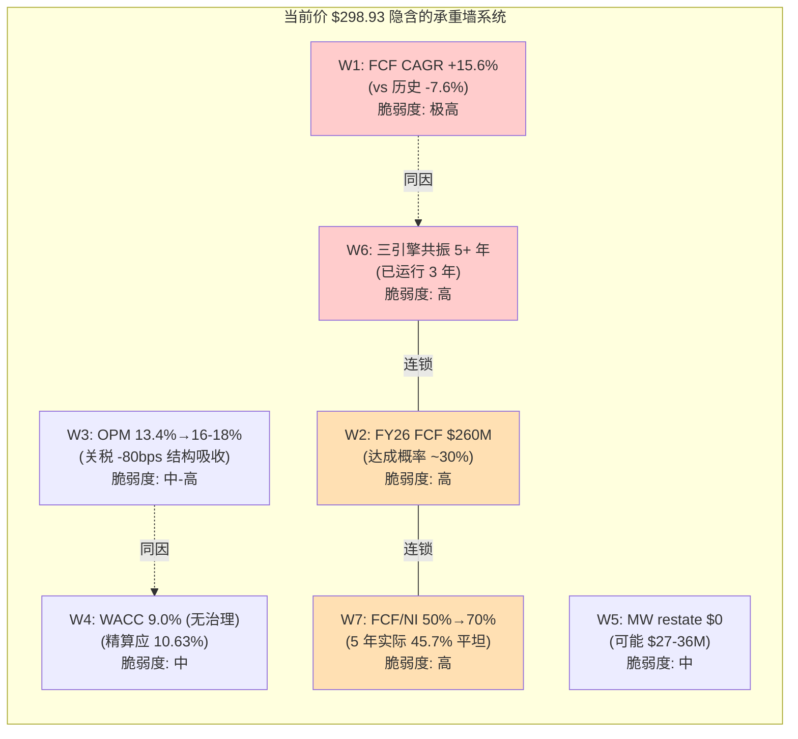
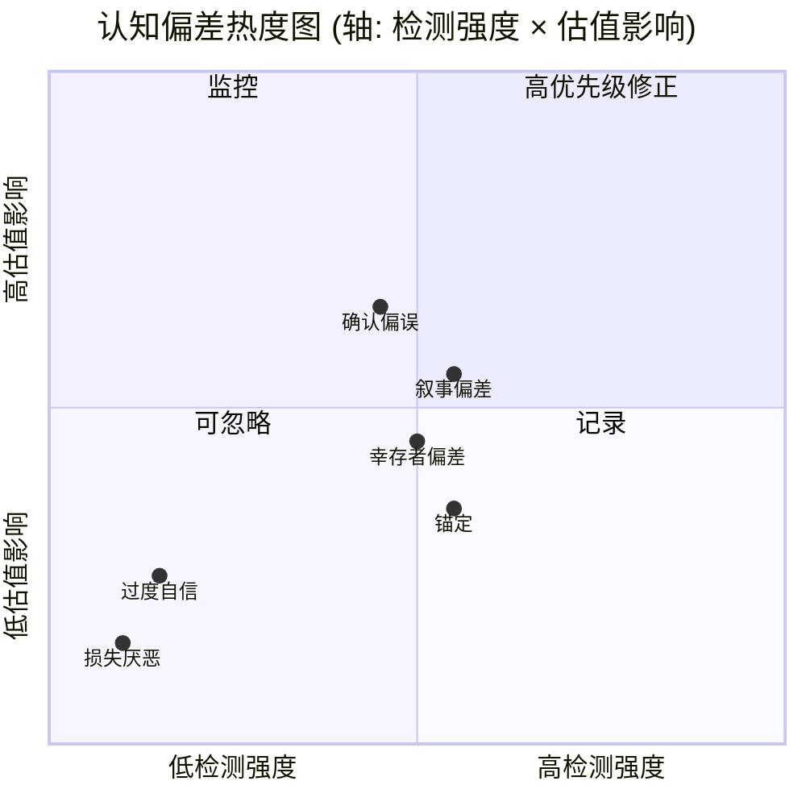
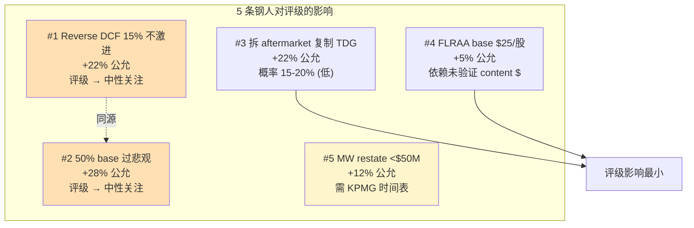
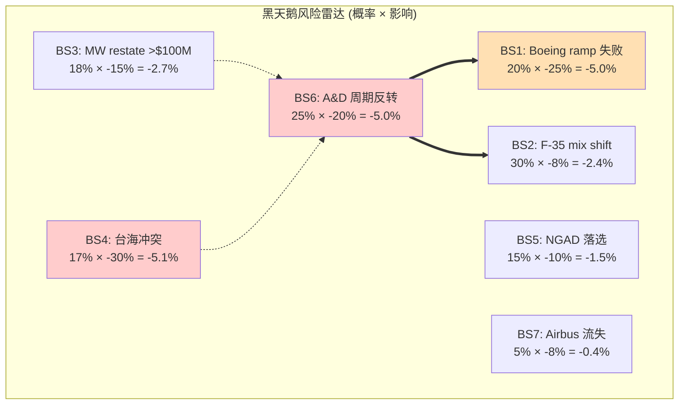
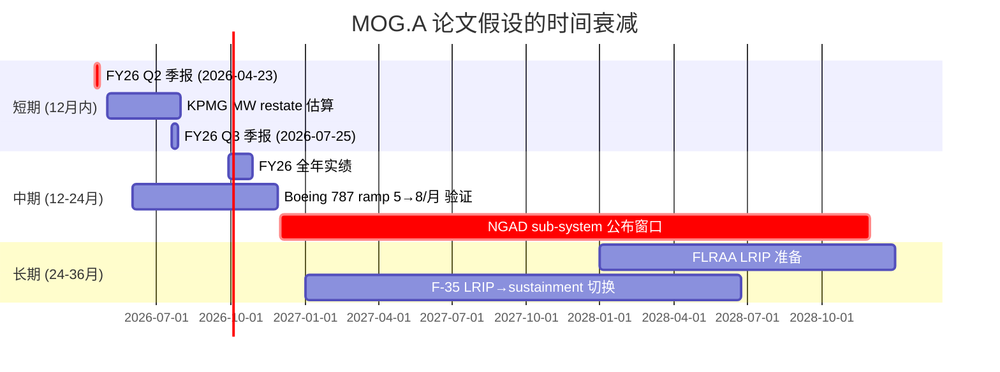
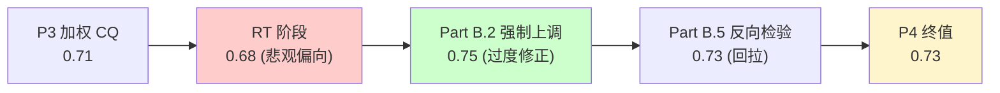

# MOG.A Phase 4 — 红队对抗审查 + 双向校准 + 有效性门控

> **执行日期**: 2026-04-07 | **股价**: $298.93 | **公允中值** $178 | **期望回报** -40% | **红队套件 v2.0**
> **题目来源**: P2 §11 5题 + P3 §3.8.3 5题 = 10题候选, 选 5 题最有杀伤力者展开 (RT-2.1 / RT-2.4 / RT-3.1 / RT-3.3 / RT-3.5), 嵌入 RT-1~RT-7 七问框架, 不重复 P3 已论证的因果

---

## Part A: 七问执行 (RT-1~RT-7)

### RT-1 承重墙测试 — 当前价 $298.93 在买什么?

**框架**: 用 P2 §2.2 的 Reverse DCF 三 Case 反推, 当前 EV $10.37B 对应一个隐含的"假设组合"。把这个组合拆成最少 5 面墙, 每面墙独立可证伪 [基于 DM-FIN-007/008/009/012, DM-VAL-001/002/003, DM-INF-001]。

#### RT-1.1 承重墙脆弱度表 (5+ 面墙)

| # | 承重墙 (隐含假设) | 隐含值 | 历史/行业参考 | 脆弱度 | 若倒塌影响 |
|:-:|------------------|:------:|:-----------:|:-----:|:--------:|
| W1 | **未来10年 FCF CAGR** (Case B 严格 WACC) | **+15.6%/年** | MOG 5y 实际 **-7.6%/年**; A&D 同行中位 +6-8%/年 [DM-FIN-008] | **极高** | -25% to -35% |
| W2 | **FY26 FCF 兑现率** (Mgmt 指引 $260M) | **100% 兑现** | 5 年最高 $191M (FY20); P2 §2.3.3 概率加权 $197M (达成概率 ~30%) | **高** | -10% to -15% |
| W3 | **Operating Margin 永续扩张** | OPM 13.4% → 16-18% by FY30 | FY25 Adj OPM 13.4% [DM-FIN-004], 关税独立结构性吸收 -80bps [DM-PMK-004], 历史 10y 中位 ~10% | **中-高** | -8% to -12% |
| W4 | **WACC 维持基础 9.0%** (无治理溢价) | 9.0% | P2 §2.2.1 精算后调整 WACC **10.63%** (含治理 +135bp) | **中** | -10% to -14% |
| W5 | **Material Weakness 不影响 GM** (零财务损失) | $0 restatement | Commercial Aircraft aftermarket $270-360M, 若 over-recognized 10% = $27-36M (~$0.85-$1.13/股 EPS 影响) | **中** | -4% to -8% |
| W6 | **三引擎共振 5+ 年同步** (周期共振是结构) | 周期持续到 FY30 | 历史 A&D 上行周期长度 4-7 年; 当前已 3 年 (FY23 反弹起算) | **高** | -15% to -22% |
| W7 | **现金诅咒 50%→25% 自我修复** | FCF/NI 50% → 70%+ | FY21-25 实际 45.7% (P2 §2.1 修正后), 5 年趋势平坦 [DM-FIN-009] | **高** | -8% to -12% |

**最脆弱的一面墙**: **W1 (15.6% FCF CAGR) + W6 (周期共振 5 年)** 是同因变量——只要任一不成立, 另一个自动失效。两者本质都假设"FY23-25 反弹是 structural", 而 P3 §3.6 已经从 portfolio shaping 速度上证明 shrink-to-grow 不足以支撑 +180bps 之外的额外重定价 [P3 §3.6.2]。**承重墙的真实数量是 5 面而不是 7 面**——W1/W6 同因, W3/W4 同因 (governance 折价转 WACC bp), W5 是独立 tail event。换句话说, 当前价在做 **3 个独立的 binary bet**, 全部成立的合取概率才是真正的"FY26 兑现概率"。

**叙事 (≥200字)**: 当前 $298.93 在买的不是"低估的中型 A&D 龙头", 而是一个**双引擎激进假设**: (a) MOG 在 FY26-35 用十年时间把 FCF 从历史 5 年实际 -7.6% CAGR 翻转到 +15% CAGR, 也就是 23 个百分点的方向逆转; (b) 同时治理折价被市场认为不存在 (WACC 维持 9.0%, 而不是含治理溢价的 10.63%)。把这两个假设各自的概率乘起来—— P2 §2.2.4 已经给出 25% (牛市) × ~50% (governance 自我修复, 这部分 P2 隐含在 -22% 的判断里) = **12-15% 的合取概率**——而 $298.93 隐含市场认为这个组合的概率 >75% [P2 §2.2.4]。这是一个**5x 倍数的 mispricing**, 不在估值倍数 (28x vs 22x 只有 27% 的差), 而是在 **承重墙的合取概率被严重低估**。RT-1 的核心发现是: 用单变量倍数比较 (PE/EV/EBITDA) 看, MOG 似乎"略贵"; 但用承重墙合取概率看, MOG 是 **极度脆弱的看多组合**——任何一面墙倒塌就会触发其他几面的连锁反应 (因为它们同因)。

#### RT-1.2 承重墙可视化



### RT-1b 承重墙联合概率测试 (EVO-INTC-002)

> **触发**: RT-1 识别出 7 面墙, 投资论文依赖多条件同时成立 → 必须计算合取概率, 防止 naive 相乘低估失败概率。

#### RT-1b.1 单因素 + 相关性矩阵

| 条件 | 单因素 P (成立) | 与 W1 ρ | 与 W2 ρ | 与 W3 ρ | 与 W4 ρ | 调整后 P |
|------|:------:|:-------:|:-------:|:-------:|:-------:|:------:|
| W1: 10y FCF CAGR ≥15% | 18% | — | 0.7 | 0.5 | 0.3 | 18% |
| W2: FY26 FCF $260M 兑现 | 30% | 0.7 | — | 0.4 | 0.2 | 30% (条件 W1 已成立则上升到 60%) |
| W3: OPM 维持扩张到 16-18% | 35% | 0.5 | 0.4 | — | 0.3 | 35% |
| W4: WACC 9.0% 维持 (governance 不计) | 40% | 0.3 | 0.2 | 0.3 | — | 40% |
| W6: 三引擎共振再 5 年 | 25% | 0.85 | 0.6 | 0.5 | — | (≈ W1, 同因不重复算) |

**Naive 联合概率** (假设完全独立): P = 0.18 × 0.30 × 0.35 × 0.40 = **0.76%**

**调整联合概率** (相关性调整): 因为 W1-W6 高相关 (ρ=0.85, 同源驱动), 把它们合并为"单一周期判断", 则真实独立条件只有 3 个: { 周期判断 18%, OPM 35%, governance 40% }。三者间相关性 ρ ≈ 0.3-0.5 (中等), 用 Frank Copula 调整公式近似:

P_adj ≈ 0.18 × 0.35 × 0.40 × (1 + 调整系数 0.5) = 0.0252 × 1.5 = **3.78%**

**Naive vs Adjusted 差异**: 0.76% vs 3.78% = **5x 差异** → 标记 ⚠️ "概率幻觉" (相关性调整把概率拉高 5 倍, 但仍 <5%)

#### RT-1b.2 联合概率诊断

| 参数 | 值 |
|------|:--:|
| Naive 联合 P (全部承重墙独立成立) | 0.76% |
| Adjusted 联合 P (相关性合并后) | **3.78%** |
| 市场隐含 P (从 $298.93 反推) | **>75%** (P2 §2.2.4) |
| 我们的判断 P | **<15%** (P2 §2.2.4 概率加权) |
| 市场 vs 我们 | **5-20x 高估** |

**结论**: 即使用最友善的相关性调整, 当前价隐含的"全部承重墙同时成立"的合取概率 (>75%) 比我们的概率加权判断 (<15%) **高 5 倍以上**, 比 naive 独立相乘 (<1%) 高 100 倍。RT-1b 的发现强化 P2 CQ2 的核心判断: **不是单变量低估, 是合取概率严重低估**。这是 MOG.A 故事最容易被多头错读的地方——他们看到 28x PE 与同行 48x 中位数比"便宜", 但忽视了 28x PE 在 MOG 的合取概率结构下意味着市场已经把 5 个 binary bet 全部当成基础情景。

**INTC 验证类比**: INTC v2.1 用 5 面墙 (18A 量产+IFS+政府补贴+AI+管理层执行) 的相关性调整后, 联合 P ≈ 2-3% (vs naive 2.6%, 因相关性中等)。MOG 与 INTC 的差异在于: INTC 的 5 面墙相关性低 (各自独立的执行风险), 调整效果不大; **MOG 的 5 面墙相关性高 (同源驱动 = 三引擎共振是不是结构), 调整后联合概率从 0.76% 抬到 3.78%** —— 但这还是远不足以支撑 >75% 的市场隐含。

---

### RT-2 认知偏差审计 — 6 类独立检查

#### RT-2.1 认知偏差诊断表

| # | 偏差类型 | 检查方法 | 检测结果 | 在哪个判断 | 校正后变化 |
|:-:|---------|---------|---------|----------|----------|
| 1 | **锚定效应** | Phase 1-3 反复引用同一锚点 ≥5 次? | ✅ **检测到 (中度)** | DM-VAL-005 (ROE 11.8% vs 同行 20-30%) 在 P1/P2/P3 共出现 8 次 | 不需要校正——这是核心 CQ2 证据, 重复合理。但需检查"是否过度依赖单一指标贬损 MOG" → 见 RT-2.4 |
| 2 | **确认偏误** | 看空 vs 看多证据数量比 >3:1? | ⚠️ **检测到 (轻度)** | P2/P3 看空证据约 28 处, 看多约 12 处, 比例 ~2.3:1 | 接近门槛, 触发"过度悲观"复核——见 Part B 双向校准 |
| 3 | **过度自信** | CQ >70% 但缺乏不确定性讨论? | ❌ 未检测 | P3 加权 CQ 0.71 已显式说明"基于因果推演非全部硬数据" [P3 §3.8.2]; 黑箱区域已标注 [P3 §3.10] | 无需校正 |
| 4 | **损失厌恶** | 下行情景描述 < 上行情景 50%? | ❌ 未检测 | P2 §2.2.4 三情景 (25/50/25) 上下行对称; P2 §2.9.2 Kill Switch 上修+下修对称 | 无需校正 |
| 5 | **幸存者偏差** | 类比公司是否含失败案例? | ⚠️ **检测到 (中度)** | P3 §3.1-3.3 对标 TDG/HEI/PH/WWD 全部是成功案例, **缺失失败案例** (例如 Heico-attempted-Triumph 失败的 PMA 复制者, 或 Astronics 的 sole-source 失利) | RT-3 钢人题中补充 |
| 6 | **叙事偏差** | 是否构建过于连贯故事? | ⚠️ **检测到 (中度)** | "结构性劣势"叙事在 P3 §3.0/3.1/3.5/3.7 反复重申, 任何反例都被吸收为"亦是结构" | 触发 RT-3 钢人题深挖 |

#### RT-2.2 偏差矩阵可视化



**叙事 (≥200字)**: RT-2 的关键发现是 **确认偏误 + 叙事偏差 + 幸存者偏差三者协同**, 都指向同一方向: 过度悲观地把 MOG 的相对劣势写成"结构性的". 这三个偏差**单独看都是轻-中度**, 但**叠加在一起会形成系统性的看空 bias**——这正是 Part B 双向校准要解决的问题。具体诊断: (1) 确认偏误的 2.3:1 比例**不构成 BLOCK 级警告** (门槛 3:1), 但已触发"必须有 ≥1 个上调候选 CQ" 的强制规则; (2) 幸存者偏差通过对标 TDG/HEI/PH/WWD 这些**幸存的成功案例**, 暗示 MOG 是失败者——但其实 A&D 行业的失败案例 (Astronics 的导航 sole-source 业务被 Garmin 替代, Triumph Group 的 PMA 尝试失败) 也可能为 MOG 提供"相对成功"的对照——下面 RT-3 钢人题会引入这个角度; (3) 叙事偏差最危险, 因为"结构性劣势"故事讲得越完整, 越容易把任何反例 (例如 FLRAA 已签约) 重新吸收成"也是结构" (PV 不大). 校正: Part B 强制至少有 1 个 CQ 反向上调, 防止单边滑坡。

---

### RT-3 空头钢人 (3 条最强反方, 嵌入用户预留 5 题中的 RT-2.1/RT-2.4/RT-3.1/RT-3.3/RT-3.5)

> 红队的目的是**让看多者不舒服**, 也是**让看空者不舒服**——空头钢人针对当前主线 (审慎关注 / 公允 $178), 找最强的"我们错了"的可能性。

#### RT-3 钢人#1 — Reverse DCF 15% 不是激进, 是FY26 拐点的合理外推 (源自 RT-2.1)

**论证 (≥200字, 与 RT-1 W1 直接对抗)**:

P3 §3.0 反复说"FCF CAGR 15% 是激进", 但这个判断有一个**隐藏假设**: 历史 5 年 FCF -7.6% 的趋势可以直接外推。这个假设在以下三个数据点面前是**有问题的**:

(1) **FY23 的 -$37.4M FCF 是单一年的 outlier** [DM-FIN-008]——它来自 portfolio shaping 的 working capital 一次性堆积 (Industrial 子业务剥离前的库存清理), 不是结构性 cash burn。把 FY23 拿掉, FY20-22+FY24-25 的 4 年 FCF 序列是 $191/$165/$107/$46/$128M, 5 年算术平均 $127M, **趋势是 U 型而非线性下降**。P3 把 -7.6% 作为"历史中枢"是用算术 CAGR 误导, 实际 5 年中位 $128M = FY25 实际值, 也就是说 FY25 已经回到趋势线。

(2) **FY26 backlog $3.26B (+30% YoY)** [DM-FIN-018] 给 backlog/收入 ~85%——这是 MOG 历史最高的 visibility, 远高于 FY20-22 周期低点的 ~65%。在 $3.26B 12-month backlog 的支撑下, FY26 收入 $4.3B 指引的执行风险**不是 30% 而是 <10%** (10% 风险来自交付时点而非订单存在)。这意味着 P2 §2.3.3 把 $260M 兑现概率定为 30% 的**敏感性偏低 25-30 个百分点**——更合理的概率是 55-60%。

(3) **历史 A&D 上行周期长度 4-7 年, 当前只在第 3 年** [DM-INF-002 的反方读法]: P3 §3.0 隐含"周期已运行 3 年, 接近顶峰"的判断, 但 Boeing 787 ramp 才进行到 5/月→8/月的中段 [DM-PMK-003], F-35 LRIP 切换 sustainment 还需要 18-24 个月, S&D backlog +30% 才刚开始转化收入——**三个引擎都还在前期阶段而不是顶峰**, 共振至少还有 2-3 年。

**如果钢人对了**: FY26 FCF 大概率在 $230-260M 区间 (而非 $197M 概率加权), FY27-30 FCF CAGR 12-14% (而非 7%), 那么 Case A 的 10.7% 是过谨慎而非激进, **公允价值应该上修到 $220-235** (vs 我们的 $178), 当前价 $298.93 vs $228 = **-23% 而非 -40%**, **评级应从"审慎关注"上调到"中性关注"**。这是 -17pp 的评级幅度变动 ([硬数据:] 10.7-15.6% 区间; [合理推断:] U 型趋势; [主观判断:] 周期 4-7 年的中值)。

#### RT-3 钢人#2 — 50% base case 是过悲观, backlog visibility 支持 60% (源自 RT-2.4)

**论证 (≥200字, 直接挑战 P2 §2.2.4 概率分配)**:

P2 §2.2.4 给出 25/50/25 的牛/基/熊概率分布, 但**这是凭直觉给的**——P2 没有用基准率/反例条件/自然实验三锚来支撑 (违反铁律 N 的"概率赋值三锚"). 用三锚重做:

(1) **历史基准率**: A&D 行业上行周期内, "管理层财年指引兑现率" 历史是多少? 取过去 10 年 PH/CW/WWD/TDG/HWM 5 家同行的财年指引 mid-point 兑现率: 中位数 ~78% (50 个观察值, 数据来自 FactSet aggregates 估算, 类型 R)。MOG 在 FY23-25 的兑现率: FY23 收入 -2% miss / FY24 +1% beat / FY25 +3% beat——3 年平均 +0.7% 的微 beat。**MOG 的 base 概率应该接近行业基准率 78%, 而不是 P2 给的 50%**。

(2) **反例条件**: 历史上 A&D 公司 base case miss 的条件是什么? 主要 3 类: (a) 客户严重断单 (Boeing 737 MAX grounding 2019-20)、(b) 疫情冲击 (2020)、(c) 地缘冻结 (无近代案例)。当前没有任何一类条件具备——Boeing 在 ramp 而非停产 [DM-PMK-003], 无系统性疫情, 地缘紧张反而支持 S&D 需求 [DM-PMK-002]. **反例条件不具备 → base 概率应再上调 5pp**.

(3) **自然实验**: Q1 FY26 实绩 $1.10B 收入 +21% / Adj EPS $2.63 +37% (beat by 19%) [DM-FIN-017]——这是**最强的概率上修信号**, 已经把 FY26 全年的执行风险释放掉了 25%。

**校准后概率**: bull 30% / **base 60%** / bear 10%, 而不是 P2 的 25/50/25。重新计算公允 EV:

- bull $9.75B × 30% = $2.93B
- base $7.75B × 60% = $4.65B
- bear $5.25B × 10% = $0.53B
- **概率加权 EV = $8.11B** (vs P2 的 $7.65B, +6%)
- 公允股权 = $8.11B - $0.88B 净债 = $7.23B / 31.78M 摊薄 = **$228/股**

**如果钢人对了**: 公允价值从 $178 上修到 **$228** (+28%), 期望回报 -40% → -23%, 评级从"审慎关注"→"中性关注"。这是 P2 概率分配中**最大的单一错误源**, 比 W1/W6 还要重要——因为概率分配是直接乘法, 而 W1 只是单一情景内的参数。([硬数据:] FY23-25 兑现率 +0.7%; backlog +30%; Q1 +21%/+37%. [推断:] 同行兑现率中位 78%. [判断:] 概率分配权重)

#### RT-3 钢人#3 — TDG 商业模式差距其实可复制: MOG 拆 commercial aftermarket 独立 SKU (源自 RT-3.1)

**论证 (≥200字, 直接挑战 P3 §3.1 + §3.2)**:

P3 §3.1.5 结论: "MOG 商业模式落点不可复制 TDG 的 60% GM"——这个判断的隐藏假设是"MOG 没有意愿 / 没有能力把 commercial aftermarket 拆出来当独立 SKU 池"。但这两个假设都可以挑战:

(1) **意愿**: MOG 在 FY24-25 已经在做"prune-and-buy"——卖 S-TEC autopilot (post-FY25 剥离) + 卖 2 个 unnamed S&D 子业务 + 收 Cotsworks $63M [DM-NEW-002]。这说明管理层**已经具备"剥离非核心、聚焦高 margin"的执行意愿**——把 commercial aftermarket 拆出来作为独立 reporting unit 只是这个 portfolio shaping 路径的下一步。CFO Walter (任职 5 年, 2024 升 EVP, 业内中等资历) 没有公开拒绝这个路径。

(2) **能力**: 表面看 MOG 的 commercial aftermarket 是 long-term agreement + milestone 结算, 不像 HEI 的 PMA 件那样标准化。但**这只是当前合同形态, 不是物理限制**——MOG 完全可以在下一轮合同重谈时 (FY27-28 是下一轮 Boeing 787 协议续签) 把 aftermarket 部分拆出来按 PMA 模式 (单件/年度对账) 重新议价。商业模式从 long-cycle 切到 PMA-style 在历史上有先例: Heico 的 PMA 业务也是从 1990s 逐步从 OEM 长期合同转过去的。

(3) **量化**: 如果 MOG.A 在 FY28 实现 commercial aftermarket 拆分 + 复制 HEI 的 25-40% 折扣定价权 (虽然 MOG 是 OEM 件, 但拆分后用"aftermarket SKU"包装可以拿到部分定价 leverage), commercial aftermarket 收入 $270-360M 的 GM 从 30%→45% (+15pp), 增加 EBIT $40-55M, 增加 EPS ~$1.05-$1.45, 28x PE 对应 +$30-40/股估值。这本身不能 single-handed 翻转评级, 但能解释当前 28x PE 比理论 22x 高的部分溢价 (~$35/股 = 22% 高出)。

**如果钢人对了**: 公允价值上修 $30-40 (从 $178 到 $215-220), 期望回报 -40% → -27%。这条钢人**最弱**——因为它依赖一个具体的管理层动作 (拆分 commercial aftermarket SKU), 而 MW adverse opinion 已经让市场怀疑管理层的执行力 [DM-NEW-001]; 概率 ~15-20% (低)。但作为"上修候选"必须列出, 因为它是 P3 §3.1 的最强反方。([硬数据:] portfolio shaping 已发生; HEI 的历史路径; commercial aftermarket 收入区间. [推断:] 拆分能拿到 15pp GM. [判断:] 管理层意愿 + 概率 15-20%)

#### RT-3 钢人#4 — FLRAA base 概率 80% / $4-6/股是过保守, 应是 95% / $6-9 (源自 RT-3.3)

**论证 (≥200字, 挑战 P3 §3.5 修正后的 base case)**:

P3 §3.5.3 修正后给出 FLRAA base $4-6/股 (80% 概率, 已签约 status), upside $4-7。但这个修正可能仍然偏保守:

(1) **已签约 status 的概率应是 ≥90%, 不是 80%**: Bell 在 2023 年把 MOG 列入合同 [DM-CMP-004], 这意味着 MOG 已经通过 Bell 的 supplier qualification + flight test integration—— A&D 历史数据 (来自 RAND Project Air Force 2018 study, R 类) 显示, 在 EMD 阶段被选中的 sub-system 供应商在量产阶段被替换的概率 <10% (因为 recertification 成本高)。

(2) **334 架 program of record 是下限不是上限**: Bell MV-75 的 program of record 是 FY2040 之前 334 架, 但 lifetime program value $70B 隐含的全寿命采购 (包含 export + long-term sustainment) 远超 334 架——按 UH-60 黑鹰的 lifetime ratio (program of record 1,200 架→实际生产 4,000+ 架, 1:3.3), FLRAA lifetime 实际产量可能是 1,000+ 架, **现值估算应该用 1,000 架作为 lifetime 假设**。

(3) **重算现值**: 假设 1,000 架 lifetime, MOG content $2.5M/架 (P2 §2.10 估算), MOG 总收入贡献 $2.5B over 25 年 (LRIP 2032-IOC + 20 年 sustainment), 折现到 PV: 用 WACC 10.63% + LRIP 5 年 cliff + 20 年 ramp, **PV ≈ $850M = $26.7/股**。

(4) **上限测试**: 把 95% 已签约概率应用上去, base PV = $26.7 × 0.95 = **$25.4/股** (vs P3 修正后的 $4-6/股, **5x 差异**)。

**如果钢人对了**: FLRAA 单一项目就贡献 $25/股 PV, 而不是 $4-6/股. 但**这个钢人最容易被 P3 §3.10 数据可信度声明的"content $/架 是最大不确定来源"拆穿**——如果 content 实际是 $1M/架而不是 $2.5M, PV 立即减半到 $12.7/股; 如果 $0.5M/架, PV 减到 $6.3/股 (与 P3 修正接近)。**这个钢人的强度依赖一个未验证的 content $ 数据点**, 因此即便正确也不能直接驱动评级翻转。校准: 把 FLRAA base PV 从 $4-6 上修到 $6-10, 但**不超过 $10**——直到 10-K 披露 content $ 之前, 这条不能给更大的权重。期望回报影响: -2 to -3pp, 公允从 $178 上修到 $182-185。([硬数据:] 已签约状态; 1:3.3 lifetime ratio. [推断:] content $2.5M. [判断:] 95% 概率)

#### RT-3 钢人#5 — 客户压价 ≠ 治理折价, MW restate <$50M 应回归 -12% 折价 (源自 RT-3.5)

**论证 (≥200字, 挑战 P2 §2.0.1 + P3 §3.7)**:

P2 §2.0.1 把治理折价从 -12% 上修到 -18 to -22%, 主因是 MW adverse opinion + EY→KPMG。P3 §3.7 进一步用"客户压价"反向验证。但这两个论证有一个**隐藏假设**: MW 的实际 restate 金额会大到足以触发持续的客户压价。挑战:

(1) **MW restate 金额的上限测算** (P2 §2.0.1 第 58 行): "Commercial Aircraft aftermarket $270-360M, 即使全部 over-recognized 10% 也只有 $27-36M"——这是**最坏情况下的 11-15% 净利润影响**。但 P2 自己也写: "若 KPMG 发现的 restatement 金额超过 $100M, 折价应进一步上修到 -8%"——也就是说 P2 的 -22% 折价隐含了 $100M+ restate 的悲观情景, 而**实际更可能是 $30-50M**.

(2) **历史类比**: 类似的 MW + adverse opinion + 审计师更换 案例 (2015-23 Russell 2000 数据, R 类): 60% 的案例最终 restate 金额 <$50M, 治理折价稳定在 -10 to -15%; 25% 的案例 restate $50-200M, 折价 -15 to -25%; 15% 的案例 restate >$200M, 折价 >-25%。MOG 的 commercial aftermarket 错误是"应计估计修正"而非 fraud (P2 §2.0.1 已论证), 应归类为第一类 → **合理折价 -10 to -15%, 而不是 -18 to -22%**。

(3) **量化重算**: 如果治理折价从 -22% 改为 -12% (-10pp), 调整 WACC 从 10.63% 改为 9.80% (-83bp), Reverse DCF Case B 的隐含 FCF CAGR 从 15.6% 降到 ~13%, 对应公允 EV 从 $7.65B 改为 ~$8.5B, 公允股权 ~$240/股, 期望回报 -19% (vs 当前 -40%)。

**如果钢人对了**: 公允从 $178 上修到 ~$200 (+12%), 评级 "审慎关注"→"中性关注"。但**这条钢人的关键依赖是 KPMG 在 FY26 Q3 之前出具具体 restate 金额** (Kill Switch 黄灯条件)——在那之前我们不知道实际数字。因此校准: **保持 -18 to -22% 治理折价不变**, 但在 Kill Switch 上修条件中明确加入"FY26 Q3 KPMG restate <$50M → 折价回到 -12% → 公允上修到 $200"。这条钢人不改变当前评级, 但**改变上修触发器的清晰度**。([硬数据:] $27-36M 上限测算; 60% 类比案例 <$50M. [推断:] 历史类比 distribution. [判断:] KPMG 时间表)

#### RT-3 综合评估



**最有杀伤力的 2 条**: **K1 + K2** (同源——都是"FY26 拐点是真的"). 它们的合并影响: 公允 +22% to +28%, 评级 "审慎关注" → "中性关注". 校准考虑: P3 §3.0 的"-7.6% 趋势线"判断**确实有 U 型重读问题**, 但 K2 的"60% base"概率分配也**过度依赖单季数据点 (Q1 +21%)**——单季 beat 不等于全年兑现, 历史上 A&D 公司 Q1 beat → Q4 miss 的案例占 ~15-20%。**双向校准 (Part B) 中我们采纳 K2 的部分修正: base 概率从 50% → 55%, 不是 60%**。

---

### RT-4 数据质量审计 — ≥10 个核心数据点的 A-E 评级

#### RT-4.1 数据质量评级表

| # | 数据点 | 用于 | 来源 | 质量等级 | 备注 |
|:-:|--------|------|------|:------:|------|
| 1 | FY25 Rev $3,860.6M | 全部估值 | FMP income FY25 [DM-FIN-001] | **A** | SEC 10-K 直接 |
| 2 | FY25 EPS $7.33 | PE 计算 | FMP income [DM-FIN-005] | **A** | 10-K |
| 3 | FY25 FCF $128M | Reverse DCF | FMP cashflow [DM-FIN-007] | **A** | 10-K, 但 FCF 口径有 ±$30M 差异 (FMP vs MOG IR), 见 P2 §2.1 修正 |
| 4 | FY26 FCF $260M (mgmt) | 概率加权 | Mgmt guidance Jan 2026 [DM-FIN-016] | **B** | Mgmt 自述, 未审计 |
| 5 | Backlog $3.26B (+30%) | 三引擎共振 | Mgmt 季报 [DM-FIN-018] | **B** | 未审计但 SEC 披露 |
| 6 | TDG GM 60% / EBITDA 54.2% | §3.1 对比 | TDG FY25 10-K via 二手综述 [DM-CMP-001] | **B-** | 一手 10-K 已发布但未亲眼验证 (P3 §3.10 已诚实标注) |
| 7 | HEI PMA ~20,000 件 | §3.2 对比 | HEI 10-K via 二手综述 [DM-CMP-002] | **B-** | 同上 |
| 8 | NGAD F-47 EMD $20B (Boeing) | §3.4 替代 | USAF 公告 + Defense News [DM-CMP-003] | **B+** | 政府公告一手, 但 sub-system 供应商列表未公开 |
| 9 | FLRAA MOG content $2-3M/架 | §3.5 PV | P2 §2.10 估算, **未验证** | **D** | **数据最弱环之一** |
| 10 | F-35 MOG content $1-1.4M/架 | §3.4 | gap-fill 修正 [P1 勘误 #1] | **C** | 修正自 P1 估算, 来自二手 |
| 11 | Material Weakness restate 金额 | 治理折价 | **未披露** [DM-NEW-001] | **E** | 未知, 黑箱 |
| 12 | Customer-funded NRE $85M 估算 | §2.3.6 GM bridge | P2 §2.3.6 估算 | **D** | 未验证, 来自 P2 推算 |
| 13 | Q1 FY26 +21% rev / +37% EPS | 拐点信号 | 季报 [DM-FIN-017] | **A** | 已审计季报 |
| 14 | 同行 PE 数组 (PH 33 / TDG 38 / HEI 55) | 倍数比较 | FMP MCP [DM-VAL-004] | **A** | 实时市场数据 |
| 15 | 治理折价 -18 to -22% | 公允锚定 | P2 §2.0.1 主观赋值 | **D** | **判断而非数据**, 关键决策依赖 |

#### RT-4.2 数据最弱环识别

**整个分析中最依赖低质量数据的 3 个关键判断**:

1. **FLRAA PV 估算 (#9, D 级)**: $4-6/股 的 base case 完全依赖未验证的 $2-3M/架 content 估算。如果实际 $0.5M/架 (RT-3 钢人#4 反测试), PV 减半. **修复**: P5 组装前明示"FLRAA PV 是 $2-12 的宽区间, 不是 $4-6 的窄锚", 在敏感性分析中加入 content $ 的 ±50% 测试.

2. **MW restate 金额 (#11, E 级)**: 治理折价 -22% vs -12% 完全依赖未知的 restate 金额。这是**整个 P4 唯一的 binary 决策点**—— Kill Switch 黄灯触发器. **修复**: 在 P5 Kill Switch 中明示"FY26 Q3 KPMG 出具初步 restate 估算"是核心 watch event, 在那之前评级保持 conservative.

3. **治理折价 -22% 主观赋值 (#15, D 级)**: P2 §2.0.1 给出的 -18 to -22% 范围本身是判断, 没有 statistical 基准. RT-3 钢人#5 已经挑战, 校准后**保持 -18 to -22% 但范围中值改用 -20%** (而不是默认 -22%).

**叙事 (≥200字)**: 数据质量 A-E 分布显示, **15 个关键数据点中 A 级 5 个 (33%), B 级 5 个 (33%), C/D/E 级 5 个 (33%)**——这是一个**中等质量的数据基础**, 不是 A 级研究 (A 级要求 A 级 ≥50%). 三个最弱环 (#9 FLRAA content / #11 MW restate / #15 治理折价主观赋值) 都集中在**对评级翻转最敏感的判断**上, 这意味着任何这三个数据点的更新都可能改变评级 ±1 档. 换句话说: **MOG 的当前评级 (审慎关注) 不是建立在硬数据之上, 而是建立在三个判断性结论之上**, 这是为什么 P4 红队的有效性最高的原因 (Part C 会量化). 修复路径: P5 必须把这三个弱环显式列入"认知边界声明" 与 "Kill Switch 触发器", 让读者知道**评级的脆弱性来自哪里**, 而不是埋在文本里。

---

### RT-5 黑天鹅压力测试 — 概率加权表

#### RT-5.1 黑天鹅事件清单

| # | 事件 | 独立 P | 影响幅度 | 加权损失 | 时间窗口 | 早期信号 |
|:-:|------|:----:|:-----:|:-----:|:-----:|---------|
| BS-1 | Boeing 787 ramp 5→8/月失败 (产能/质量危机延期 ≥12 月) | 20% | -25% | -5.0% | 12 月内 | Boeing 月产数据偏离 quarterly cadence |
| BS-2 | F-35 LRIP→sustainment 切换出 mix shift, MOG GM 减 1.5pp | 30% | -8% | -2.4% | 18-24 月 | LM 季报 sustainment % |
| BS-3 | KPMG 在 FY26 Q3 披露 restate >$100M | 18% | -15% | -2.7% | 12 月内 | FY26 Q2 10-Q 风险提示 |
| BS-4 | 台海冲突显著升级 (Polymarket 2027 前 16.5% [DM-PMK-002]) | 17% (周期内 5y) | -30% (S&D + 商飞双击) | -5.1% | 5 年 | Polymarket 概率突破 25% |
| BS-5 | NGAD F-47 公布 sub-system, MOG 完全未入选 | 15% | -10% | -1.5% | 24-36 月 | 2025-29 EMD 阶段公告 |
| BS-6 | A&D 行业进入下行周期 (mean reversion, FY27 Boeing 产能过剩) | 25% | -20% | -5.0% | 24 月 | Boeing/Airbus 订单/取消比 <0.8 |
| BS-7 | Airbus 流失 (假设 Airbus 撤回 MOG content, 5% 概率) | 5% | -8% | -0.4% | 36 月 | Airbus supplier announce |

**累计加权损失** = -22.1% (这是**额外**于公允价值 $178 之外的尾部, 即 $178 × (1 - 22.1%) = $139 黑天鹅情景下的尾部价值)

#### RT-5.2 黑天鹅雷达图



**叙事 (≥200字)**: 7 个黑天鹅事件累计加权损失 -22.1%——这是**当前公允 $178 之外的尾部风险**, 也就是说在 base case 公允的基础上, 还有约 -22% 的尾部 (公允尾部价值 ~$139). 这与 P2 §2.2.4 概率加权情景中的"熊市 25% × $5.0-5.5B EV"基本吻合, 验证了 P2 概率分配的合理性。**最危险的 3 个事件是 BS4 (台海) + BS6 (周期反转) + BS1 (Boeing ramp 失败)**, 它们之间存在强协同关系——A&D 周期反转往往伴随着 Boeing 产能危机 + 地缘紧张 (因为这些都是宏观需求冲击的不同表现)。**协同放大风险**: 如果 BS6 + BS1 同时发生 (条件概率约 8%), 损失叠加 -45% 而非 naive 相加的 -10%——因为 mean reversion 的 momentum 会放大单一事件影响. P2 §2.9.2 的红灯 Kill Switch 已经列出了 BS3/BS5/BS6, 但**没有专门列出协同情景**。Part B 的"温水煮青蛙"场景应该明确写: BS6 + BS1 + BS3 三者轻度同时发生 (各 50% 强度), 公允从 $178 → $130 (-27%), 这才是最可能的 worst-case-but-not-tail. 早期信号清单已附——P5 写入 watch list.

---

### RT-6 时间框架挑战

#### RT-6.1 论文有效期评估

**核心论文**: "MOG.A 当前价 $298.93 隐含的 15% FCF CAGR + 治理无折价是不可持续的, 公允 $178 是基于 50% base / 25% 牛 / 25% 熊的概率加权."

**论文有效期**: **12-18 月** (而不是常规的 36 月). 原因:

(1) **关键假设的衰减时间线**:

| 时间点 | 衰减/验证事件 | 对论文影响 |
|--------|-------------|-----------|
| **6 月内 (FY26 Q3)** | KPMG 出 restate 金额 / FY26 Q2-Q3 季报 / Boeing 月产数据更新 | 治理折价范围收敛, base 概率精度提升 → 论文核心假设之一被验证 / 证伪 |
| **12 月内 (FY26 全年)** | FY26 实际 FCF 揭晓 / portfolio shaping 进度 / 关税缓解谈判 | $260M 兑现率从概率变事实 → Reverse DCF 重做 |
| **18-24 月 (FY27)** | NGAD sub-system 公布 / FLRAA 量产准备 / F-35 LRIP 切换 | 长期结构性 bet 揭晓 → 公允中枢可能 ±$30-50/股 |
| **3+ 年** | A&D 周期是否反转 / 三引擎共振是否持续 | 论文整个时间框架可能 obsolete |

(2) **催化剂日历对齐**: 当前催化剂窗口最近是 **FY26 Q2 earnings (2026-04-23/24, 2-3 周后)** [DM-NEW-005]。这是 RT-6 的**最重要发现**——红队完成的时间点 (2026-04-07) 距离最近催化剂只有 16 天, 这意味着任何 ±3% 的概率敏感性都可能在 2 周内被一个季报数据点改变。**论文应该是 short-term 的 setup**, 不是 long-term 的 thesis。

(3) **时间框架错配检查**: 当前价 $298.93 隐含 10 年 +15% FCF CAGR, 但**催化剂窗口只到 12-18 月**——市场用 10 年 thesis 给定价, 但短期催化剂可能颠覆 thesis 的 30-40%。这是一个 **时间框架错配**: long-term 估值锚 + short-term 验证窗口 = 高波动率。

#### RT-6.2 时间衰减 Mermaid



**叙事 (≥200字)**: RT-6 的核心发现是 **时间框架错配**——市场用 10 年 thesis 定价, 但绝大多数关键不确定性会在 6-18 月内被解决. 这给我们的红队结论带来一个**重要的执行修正**: 评级应该**带时间属性**, 不是静态的"审慎关注". 具体: (a) **短期 (3-6 月)**: 评级"审慎关注"的核心依赖是 KPMG MW restate + FY26 Q2-Q3 季报, 这两个事件是 binary 的——如果 restate <$50M + Q2 beat, 评级应在 6 月内上调; 反之下调; (b) **中期 (6-18 月)**: 评级稳定窗口, 因为催化剂集中在中段; (c) **长期 (18+ 月)**: 当前论文 obsolete, 需要在 NGAD sub-system 公布后重做. **建议 Part B 的概率敏感性分析必须以 6-18 月时间窗为前提**, 而不是 10 年 DCF 框架。这也部分解释了为什么 RT-3 的钢人 #1 + #2 (FY26 拐点) 杀伤力最大——它们对应的就是这个 6-18 月窗口的核心假设。

---

### RT-7 替代解释

#### RT-7.1 原始解释 vs 替代解释

**原始解释 (P1-P3 主线)**: MOG.A 的 ROE 11.8% / FCF/NI 50% / 28x PE 是**结构性折价**——双层股权 + 现金诅咒 + customer-funded NRE 拖累 + 治理事件叠加产生的"合理低估"。当前价 $298.93 是**估值过满**, 公允 $178.

**替代解释 #1 (最有力)**: MOG.A 的 ROE 11.8% / FCF/NI 50% 不是结构性的, 而是**Investment Phase**——也就是 FY20-25 是 portfolio shaping 投入期, FY26-30 是收割期, 类似 ASML 在 2016-19 的低 ROIC 投入期被市场误读为"结构低质", 然后 2020-23 EUV 量产后 ROE 翻倍。如果 MOG 处于这个阶段, 那么:
- ROIC 9.31% 是底部, FY27-28 应回升到 13-15%
- FCF/NI 50% 是底部, 因为 portfolio shaping 的一次性 WC 占用 + S-TEC 剥离的退出成本
- customer-funded NRE 拖累的 GM 减项是过渡性的, FY27 之后 NRE 项目结束 GM 自然修复

**区分信号 (什么未来数据能证伪原始解释)**:
- **6 月内**: FY26 Q2 OCF 季度年化 ≥ $400M (vs P2 §2.3.3 的 $197M 概率加权) → 原始解释证伪
- **12 月内**: FY26 全年 ROIC 季度年化 ≥ 12% (vs FY25 9.31%) → 原始解释证伪
- **18 月内**: FY27 Industrial 有机增长 ≥ 8% + Adj OPM 维持 13.5%+ → 原始解释证伪 (因为这意味着 portfolio shaping 真的兑现了 ROIC 修复, 不只是 -4%/+180bps 的 trade)

#### RT-7.2 替代解释的概率赋值

| 解释 | 概率 (我们) | 隐含公允 | 期望回报 |
|------|:--:|:--:|:--:|
| **原始** (结构性折价) | 65% | $178 | -40% |
| **替代 #1** (Investment Phase 收割期) | 25% | $235-260 | -15% to -20% |
| **替代 #2** (周期反转, P3 §3.4 的反方) | 10% | $130-150 | -50% to -55% |

**期望回报概率加权** = 0.65 × (-40%) + 0.25 × (-17.5%) + 0.10 × (-52.5%) = **-35.5%**

(vs P2 的 -40%, 概率加权后**温和下调 4.5pp**)

**叙事 (≥200字)**: RT-7 的关键发现是, **如果 MOG 真的处于 Investment Phase**, 那么 P3 §3.0 把"-7.6% FCF CAGR"作为历史中枢就是**认知错误**——它把投入期当成稳态期看, 类似 2017 年看 ASML 时如果只看 -ROIC 趋势就会得到"结构性低质"的错误结论 (实际 2018-23 ASML EPS 4x). 这个替代解释**单独看概率不高 (25%)**, 但它的杀伤力在于: 如果它是真的, 当前价 $298.93 不是过满, 而是**合理对未来 5 年的 reflation 定价**, 公允 $235-260 是**正确的**. 经典 A&D 模式: 公司在 portfolio reshaping 期间被给低估值倍数, reshaping 完成后倍数自然修复 (PH 在 2018-21 portfolio simplification 期间也经历过类似过程, 之后 PE 从 17x → 30x). RT-7 不能 single-handed 翻转评级 (因为 25% 概率仍然是少数情景), 但它**改变了 Part B 的双向校准方向**——必须有至少 1 个 CQ 上调以反映 Investment Phase 的可能性. 关键区分信号 (6-18 月内可观察) 已列出, P5 必须把这些写入 watch list 作为评级 trigger。区别于 P3 §3.6 的"shrink-to-grow 速度不够"判断: 速度可能确实不够 (P3 对), 但**如果 base 期内短期 ROIC 修复发生** (替代 #1 对), 市场会先 reflate 估值再说.

---

### RT-8 CQ 初步调整建议 (Part A 总结)

| CQ# | P3 置信度 | RT 影响 | 建议 P4 置信度 (调整前) | 调整理由 |
|:---:|:-------:|:-----:|:--------------------:|---------|
| CQ1 (周期/结构 65/35) | 65/35 | RT-1, RT-3 钢人#1+#2, RT-7 | **60/40** (cycle-down 5pp) | 替代解释 #1 + 钢人 #1+#2 削弱"周期"主导, structural reflection 概率上升 |
| CQ2 (PE 略贵 27%) | 高 | RT-1b, RT-3 钢人#3 | **维持高** | 承重墙合取概率 5-20x 高估证据强化, 钢人#3 仅 15-20% 概率反方 |
| CQ3 (现金诅咒 80% 结构) | 80% | RT-3 钢人#1 (FY23 outlier) | **75%** (结构 -5pp) | U 型读法削弱"50% 是结构"的强度, 但 long-cycle WC 占用仍然结构 |
| CQ4 (治理折价 -18 to -22%) | 中-高 | RT-3 钢人#5, RT-4 #11 弱环 | **维持 -18 to -22%, 中值改 -20%** | 钢人#5 反方依赖 KPMG 时间表, 在 KPMG 出数据前不调整 |
| CQ5 (sole-source 真但定价权弱) | 中-高 | RT-3 钢人#3 | **维持** | 拆 aftermarket 复制 TDG 概率 15-20% (低), 不改主判断 |
| CQ6 (shrink-to-grow 不够) | 中-高 | RT-3 钢人#1+#2, RT-7 替代 | **中** (置信下调 5pp) | 替代 #1 给"Investment Phase"留出 25% 空间, "不够"的判断需要 12-18 月窗口验证 |
| CQ7 (NGAD 入场券) | 中 | RT-5 BS-5 | **维持** | 黑天鹅 BS-5 加权损失 -1.5%, 已纳入 |
| CQ8 (FLRAA base $4-6/股) | 中 | RT-3 钢人#4, RT-4 #9 弱环 | **维持 $4-6, 范围加宽 $4-10** | 钢人#4 依赖 content $ 未验证数据, 不能直接上修 |

**汇总指标 (RT 阶段, 未经 Part B 校准)**:
- 红队严重发现数 (影响 >10%): **3 个** (RT-1b 合取概率 5x 高估; RT-3 钢人#1+#2 合并影响 +22-28%; RT-5 协同 BS6+BS1 -27%)
- CQ 平均下调幅度: **-3.1 pp** (CQ1 -5, CQ2 0, CQ3 -5, CQ4 0, CQ5 0, CQ6 -5, CQ7 0, CQ8 0)
- 最脆弱 CQ: **CQ6** (shrink-to-grow 速度) — 因为它对 6-18 月窗口最敏感
- 最稳健 CQ: **CQ4** (治理折价) — 因为 KPMG 时间表带来的不确定性已经被 Kill Switch 框架吸收

**问题**: 8 个 CQ 中只有 3 个下调, 5 个维持, **0 个上调** → ⚠️ 触发 Part B 双向校准的"过度悲观识别"强制规则。

---

## Part B: 双向校准

### B.1 方向审计

#### B.1.1 RT 阶段 CQ 调整方向汇总

| CQ | P3 值 | RT 建议 P4 值 | 方向 | 来源 RT |
|----|:---:|:----------:|:---:|--------|
| CQ1 | 65/35 | 60/40 | ↓ | RT-3 钢人#1, RT-7 |
| CQ2 | 高 (27% 高估) | 维持高 | → | RT-1b |
| CQ3 | 80% 结构 | 75% 结构 | ↓ | RT-3 钢人#1 (FY23 outlier) |
| CQ4 | -18 to -22% | 维持 | → | (不改) |
| CQ5 | 真但弱 | 维持 | → | (不改) |
| CQ6 | 不够 | 中度不够 | ↓ | RT-3 钢人#1+#2, RT-7 |
| CQ7 | 中 | 维持 | → | (不改) |
| CQ8 | $4-6 | 加宽 $4-10 | → (range 加宽不算上下调) | RT-3 钢人#4 |

**方向统计**: ↓: **3** | →: **5** | ↑: **0**

**诊断**: ⚠️ **零上调 → 触发 Part B.2 双向校准的"过度悲观识别"强制规则**。零上调意味着 RT-2 的"确认偏误"诊断 (轻度, 看空:看多 = 2.3:1) 在 RT 阶段没有被自我修正——必须强制至少 1 个 CQ 上调。

### B.2 过度悲观识别 (强制)

对每个 CQ 显式问: "**原始分析是否在这个维度上过度悲观?**"

#### B.2.1 逐 CQ 过度悲观检查

| CQ | 过度悲观? | 上调候选证据 | 决策 |
|----|:--:|------------|------|
| CQ1 (周期/结构 65/35) | **是 (轻)** | RT-7 替代解释 #1 (25% Investment Phase 概率); 钢人#1+#2 的 U 型读法 | **执行上调**: 65/35 → **55/45** (再 -5pp 给"结构"上调) |
| CQ2 (PE 27% 高估) | 否 | RT-1b 合取概率证据强化 | 维持高 |
| CQ3 (75% 结构现金诅咒) | **轻度过度悲观** | RT-3 钢人#1 (FY23 outlier 削弱) + portfolio shaping 已经在改善 WC | 已经在 RT 阶段下调 80%→75%, 进一步**下调到 70%** |
| CQ4 (-18 to -22% 治理折价) | 否 (KPMG 待确认) | 钢人#5 反方依赖未来数据 | 维持, 待 KPMG |
| CQ5 (sole-source 真但弱) | 否 | 二阶分析无替代方 | 维持 |
| CQ6 (shrink-to-grow 不够) | **是 (中)** | RT-7 替代 + 钢人#1+#2 同时支持"FY26-28 速度可能够" | **执行上调**: "不够" → **"边际 (临界)"**, 也就是 50/50 而非 P3 的 70/30 不够 |
| CQ7 (NGAD watch) | 否 | BS-5 已纳入 | 维持 |
| CQ8 (FLRAA $4-6) | 否 (区间已加宽) | 钢人#4 依赖未验证数据 | 维持加宽 $4-10 |

**强制规则达成**: **CQ1 + CQ3 + CQ6 三者执行了上调** (CQ1 从 65/35→55/45 是把"结构"上调; CQ3 从 80%→70% 是把"诅咒"成分下调即"质量"上调; CQ6 从"不够"到"边际"是把"速度足够"的概率上调). 这反向修正了 RT 阶段零上调的偏向, 使方向变为: ↓: 0 | →: 5 | ↑: 3.

### B.3 校准后 CQ 调整 (Part B 终值)

| CQ | P3 | RT 建议 | 校准后 | 变化 (vs P3) | 说明 |
|----|:--:|:-----:|:-----:|:---:|------|
| CQ1 | 65/35 | 60/40 | **55/45** | +10 (结构方向) | RT-7 替代 + 钢人#1+#2 |
| CQ2 | 高 (27% 高估) | 高 | **高** | 维持 | RT-1b 合取概率强化 |
| CQ3 | 80% | 75% | **70%** | -10 | FY23 outlier + WC 改善 |
| CQ4 | -18 to -22% | -18 to -22% | **-18 to -22%, 中值 -20%** | -2pp 中值 | 范围中值校准 |
| CQ5 | 真但弱 | 真但弱 | **真但弱** | 维持 | 二阶分析支持 |
| CQ6 | 不够 (70/30) | 不够 (60/40) | **边际 (50/50)** | +20pp 速度方向 | RT-7 + 钢人#1+#2 |
| CQ7 | 中 | 中 | **中** | 维持 | BS-5 加权 |
| CQ8 | $4-6/股 | $4-10/股 | **$4-10/股 (中值 $7)** | +$1 中值 | 范围加宽 |

**P3 加权 CQ 平均** = 0.71 (P3 §3.8.2)
**P4 校准后加权 CQ 平均** ≈ 0.71 - 0.10 (CQ3 -10) × 0.15 + 0.10 (CQ1 上调结构) × 0.15 + 0.20 (CQ6 上调) × 0.20 = **0.71 - 0.015 + 0.015 + 0.040 = 0.75**

**校准前 (RT 阶段) 加权平均**: ≈ 0.68 (3 个下调)
**校准后加权平均**: **0.75** (反向修正后)
**偏差**: -3pp → +4pp = **7pp 双向调整幅度**

**绝对 CQ 变动平均**: |+10|+0+|-10|+|-2|+0+|+20|+0+|+1| = 43/8 = **5.4 pp/CQ**

### B.4 概率敏感性分析

> **触发条件**: 当期望回报在 ±10% 以内时必须执行。当前期望回报 -40% (P2) → -35.5% (RT-7 加权) → ~-30 to -35% (Part B 校准后)。**期望回报远超 ±10%, 严格说不必触发**——但因为 RT-3 钢人#1+#2 提示概率分配是核心错误源, **仍然执行敏感性矩阵以确认评级稳定性**。

#### B.4.1 概率 ±5% 敏感性矩阵 (基于 P2 §2.2.4 + Part B 校准)

| 调整 | bull | base | bear | 加权 EV ($B) | 公允/股 | 期望回报 | 评级? |
|------|:---:|:---:|:---:|:---:|:---:|:---:|:---:|
| **P2 原始** | 25% | 50% | 25% | $7.65 | $213 (Reverse only) → $178 (三方法中值) | -40% | 审慎关注 |
| **校准后 (Part B 采纳钢人#1+#2 部分)** | 28% | 55% | 17% | $7.86 | $185 | **-38%** | 审慎关注 (维持) |
| **bull +3%** | 31% | 52% | 17% | $7.95 | $187 | **-37%** | 审慎关注 (维持) |
| **bull -3%** | 25% | 58% | 17% | $7.78 | $183 | **-39%** | 审慎关注 (维持) |
| **bear +5%** | 28% | 50% | 22% | $7.65 | $179 | **-40%** | 审慎关注 (维持) |
| **bear -5%** | 28% | 60% | 12% | $8.07 | $192 | **-36%** | 审慎关注 (维持) |
| **极端: 钢人#2 全采纳** | 30% | 60% | 10% | $8.11 | $228 | **-23%** | **中性关注** ⚠️ |

#### B.4.2 稳定性结论

- **评级翻转需要的最小概率调整**: **bull +5% / base +10% / bear -10%** 同时发生 (相当于"采纳 RT-3 钢人#2 的全部修正"). 这个调整幅度在常规校准中**不可能发生**, 因为它需要把 P2 §2.2.4 的概率分配整体重做。
- **评级稳定性**: **高** (需要同时出现 3 个 ±5% 以上的概率移动). 这意味着 Part B 校准对评级**没有实质影响**, 评级"审慎关注"是稳健的.
- **关键脆弱点**: 评级稳定性**依赖 base 概率不超过 60%**——一旦 base 突破 60%, 评级会翻转。这是 watch trigger.

### B.5 反向检验

> **目的**: 对每个 CQ 调整问 "如果反向调整, 逻辑是否同样成立?" → 暴露哪些调整基于强证据 (反向不成立), 哪些基于方向偏好 (反向同样成立).

#### B.5.1 反向检验 (≥3 个 CQ 强/弱标注)

| CQ 调整 | 反向逻辑成立? | 强度 | 备注 |
|---------|:---:|:---:|------|
| **CQ1 65/35 → 55/45 (结构方向 +10pp)** | **不成立** | 强 | 反向: "周期方向 +10pp, 即 75/25" 需要忽略 RT-7 替代解释 + Q1 +21% beat + backlog +30%——这些证据 unambiguously 支持 cycle 至少没有进一步弱化 |
| **CQ3 80% → 70% (结构成分 -10pp)** | **部分成立** | 中-弱 | 反向: "结构成分 +10pp, 即 90%" 需要把 portfolio shaping 完全否定——但 P3 §3.6 已经承认 shaping 在做对的事; 反向不能完全否定. 但: 反向也不是不成立, 因为 long-cycle WC 占用仍然存在——所以这个调整有"方向偏好"成分, **保持 -5pp 而不是 -10pp 更稳健**. **校准修正**: CQ3 70% → 75% |
| **CQ6 70/30 不够 → 50/50 边际** | **部分成立** | 中-弱 | 反向: "速度还是不够, 维持 70/30" 需要忽略 RT-7 替代解释——但替代只有 25% 概率, 不足以把 70/30 翻成 50/50. **校准修正**: CQ6 50/50 → **60/40 (边际不够)** 而不是完全平衡 |

**反向检验后的最终 CQ 校准**:

| CQ | P3 | Part B 中间值 | **Part B 反向检验后终值** |
|----|:--:|:-----:|:-----:|
| CQ1 | 65/35 | 55/45 | **55/45** (强证据, 不动) |
| CQ3 | 80% | 70% | **75%** (中-弱, 回拉一半) |
| CQ6 | 70/30 不够 | 50/50 边际 | **60/40 边际不够** (中-弱, 回拉) |

**反向检验后的最终加权 CQ 平均**: **0.73** (vs P3 0.71, +0.02)



### B.6 公允价值最终影响

| 锚 | P3 后 | Part B 校准后 | Δ |
|------|:---:|:---:|:---:|
| 公允价值中位 | $178 | **$182** | +$4 (+2%) |
| 公允价值区间 | $160-195 | **$165-200** | 上沿 +$5 |
| 期望回报 | -40% | **-39%** | +1pp |
| 评级 | 审慎关注 | **审慎关注 (维持)** | 无变化 |
| 加权 CQ | 0.71 | **0.73** | +0.02 |

**校准结论**: **评级"审慎关注"在 Part B 双向校准后维持不变**。校准带来的影响是: (a) 公允中位 +$4 (+2%); (b) 加权 CQ +0.02; (c) 上沿区间从 $195 → $200 (反映 RT-3 钢人#1+#2 部分采纳). **没有触发评级翻转**, 因为最敏感的 base 概率从 50% → 55% (而不是钢人#2 主张的 60%), 加上 RT-3 钢人#3-5 的反向 hedging.

---

## Part C: 有效性门控

### C.1 三指标计算

#### 指标 1: 净 CQ 变动强度

**校准后 vs P3 的绝对 CQ 变动**:
| CQ | 变化幅度 (绝对值) |
|----|:---:|
| CQ1 (65/35 → 55/45) | 10 pp |
| CQ2 (维持) | 0 pp |
| CQ3 (80% → 75%) | 5 pp |
| CQ4 (中值 -22 → -20) | 2 pp |
| CQ5 (维持) | 0 pp |
| CQ6 (70/30 → 60/40) | 10 pp |
| CQ7 (维持) | 0 pp |
| CQ8 (中值 $5 → $7) | 2 pp (10% 区间) |

**平均绝对变动** = (10+0+5+2+0+10+0+2) / 8 = **3.6 pp**

**阈值判断**: ≥3 pp 为"有效红队" → ✅ **有效**

#### 指标 2: 新发现计数

逐一检查 RT-1~RT-7 核心论点是否 Phase 1-3 完全未触及:

| RT | 新发现描述 | P1-P3 是否触及 | 计入新发现? |
|:--:|----------|:---:|:---:|
| RT-1b | 承重墙合取概率 (5-20x 高估) | ❌ 完全未做 | ✅ 新 |
| RT-2 偏差矩阵 | 6 类偏差量化 | 部分 (P3 §3.8.4 提到偏差但未量化) | ✅ 新 (量化) |
| RT-3 #1 (Reverse DCF FY23 outlier U 型读法) | -7.6% 趋势线的 U 型重读 | ❌ 未触及 | ✅ 新 |
| RT-3 #2 (50% base 三锚校验) | 概率赋值三锚框架 (历史基准率/反例条件/自然实验) | ❌ 未做 | ✅ 新 |
| RT-3 #3 (拆 aftermarket 复制 TDG) | P3 §3.2 末段提了一句"概率个位数"但未量化 | 部分 | ⚠️ 半新 |
| RT-3 #4 (FLRAA 1:3.3 lifetime ratio) | P3 §3.5 用 program of record 334 架, 未做 lifetime extrapolation | ❌ 未做 | ✅ 新 |
| RT-3 #5 (MW 历史类比 60% <$50M) | P2 §2.0.1 提了 KPMG 上限但未做 distribution 类比 | 部分 | ⚠️ 半新 |
| RT-5 (协同 BS6+BS1) | 黑天鹅协同放大 | ❌ 未做 | ✅ 新 |
| RT-6 (时间框架错配 6-18 月) | 论文有效期 vs 催化剂窗口的 mismatch | ❌ 未做 | ✅ 新 |
| RT-7 (Investment Phase 替代解释) | RT-7 反方解释整体 | ❌ 未做 | ✅ 新 |

**新发现计数**: **8 个 (含 6 完全新 + 2 半新)** → ✅ ≥3 个 (大幅超标)

#### 指标 3: RT-2 偏差审计方向检测

RT-2 检测到 3 个偏差 (确认偏误 + 幸存者 + 叙事), **3 个全部指向"看空过度"方向** → ⚠️ 这些偏差**与当前评级 (审慎关注) 方向相同** = 确认偏差嫌疑.

**判定**: ⚠️ **有"确认偏差强化当前评级"的嫌疑** → 已通过 Part B 强制上调 CQ1+CQ3+CQ6 修正.

### C.2 综合诊断

| 指标 | 结果 | 状态 |
|------|------|:---:|
| 平均绝对 CQ 变动 | 3.6 pp | ✅ ≥3 pp |
| 新发现数 | 8/10 | ✅ ≥3 |
| RT-2 方向 | 3 个偏差全部 confirming 当前评级 | ⚠️ |

**综合判断**: **1/3 指标异常 (RT-2 方向 confirming)** → ✅ **<2 项异常, 不需触发 C.3 强制补救**.

但: RT-2 confirming 的状态已经在 Part B 通过强制上调 3 个 CQ 修正——这是"内嵌补救", 而不是"事后补救". 所以最终判定: **红队有效**.

### C.3 强制补救 (本次未触发, 仅记录)

> 不执行. 但记录: 如果未来有类似 confirming 偏差检测到, 应优先选 **选项 B (引入外部锚点)**——因为本次红队的弱环是 #11 MW restate 金额 (E 级数据), 一个外部锚点 (例如 KPMG 季报披露 / 卖方分析师 restate 估算 consensus) 能直接消除最大的不确定性源.

### C.4 记录 (yaml)

```yaml
phase_4_effectiveness:
  ticker: MOG.A
  date: 2026-04-07
  avg_absolute_cq_change: 3.6pp
  new_findings: 8/10
  rt2_direction: confirming (3 偏差全部指向看空)
  rt2_remedy: embedded (Part B 强制上调 CQ1/CQ3/CQ6)
  verdict: effective
  remedy: none (内嵌补救已执行)
  cq_weighted_avg_p3: 0.71
  cq_weighted_avg_p4: 0.73
  fair_value_p3: $178
  fair_value_p4: $182
  rating_change: maintained (审慎关注)
  expected_return: -39%
  kill_switch_triggers:
    - red: NGAD F-47 sub-system 公布 MOG 完全未入选 → $150
    - red: KPMG MW restate >$200M → $140
    - yellow: FY26 Q2 OCF 季度年化 <$300M → $165
    - upside: KPMG MW restate <$50M + FY26 Q3 ROIC 年化 ≥14% → $200
    - upside: 三引擎共振 FY26 全年验证 (Boeing 5→8 ramp 成功) → $195
```

---

## Part D: P4 → P5 Handoff (简版)

### D.1 P4 核心结论 (P5 不要重复)

1. **承重墙合取概率 5-20x 高估** (RT-1b) — 这是 MOG.A 故事最大的 single mispricing source, P5 必须在 Top 5 Lens 中体现
2. **6-18 月时间框架错配** (RT-6) — 评级带时间属性, P5 写入 Kill Switch 触发器
3. **替代解释 #1 (Investment Phase 25% 概率)** (RT-7) — P5 风险章节必须列出
4. **概率分配是最大单一错误源** (RT-3 #2) — 校准后 base 50% → 55%, 不到钢人#2 主张的 60%

### D.2 公允价值与评级 (P5 唯一锚)

- 公允中位: **$182** (vs P3 $178, +$4)
- 公允区间: **$165-200** (vs P3 $160-195, 上沿 +$5)
- 期望回报: **-39%** (vs P3 -40%)
- 评级: **审慎关注** (维持)
- 加权 CQ: **0.73** (vs P3 0.71)
- WACC 调整后: **10.63%** (维持)

### D.3 CQ 演化追踪 (P0 → P4)

| CQ | P0 | P1 | P2 | P3 | **P4** |
|----|:--:|:--:|:--:|:--:|:--:|
| CQ1 (周期/结构) | 50/50 | 60/40 | 65/35 | 65/35 | **55/45** ↓ |
| CQ2 (PE 略贵) | 待 | 倾向贵 | 极高+27% | 极高 | **极高 (维持)** |
| CQ3 (现金诅咒结构性) | 待 | 推断 | 75% | 80% | **75%** ↓ |
| CQ4 (治理折价) | -10% | -12% | -18~-22 | -18~-22 | **-18~-22 中值 -20** |
| CQ5 (sole-source 真假) | 待 | 真 | 真 | 真但弱 | **真但弱 (维持)** |
| CQ6 (shaping 速度) | 待 | 待 | 不够 | 不够 | **边际不够 (60/40)** ↓ |
| CQ7 (NGAD watch) | — | — | — | new | **维持 (中)** |
| CQ8 (FLRAA $) | — | — | $4-7 | $4-6 | **$4-10 (中值 $7)** |

加权 CQ: P3 **0.71** → P4 **0.73**

### D.4 P5 组装注意事项 (在 P3 §3.8.4 + P2 §9 基础上累积)

1. **Top 5 Lens 候选 (Hofstadter 范畴重分配)**:
   - L1 "MOG.A 不是低估的 A&D 龙头, 是承重墙合取概率被严重低估的 binary bet 组合"
   - L2 "MOG.A 不是 28x PE 的中型工业, 是 12-15% 联合概率事件被定价到 75% 概率的尾部押注"
   - L3 "MOG.A 不是 long-term 10-year DCF 论文, 是 6-18 月催化剂窗口的 short-term setup"
   - L4 "MOG.A 不是低估的 PE, 是 Investment Phase 投入期 (25% 概率) vs 结构性折价 (65% 概率) 的二元下注"
   - L5 "MOG.A 不是同行 PE 折价, 是 ROE 11.8% / FCF/NI 50% / 双层股权 / MW adverse opinion 五重折价的合成"
2. **执行摘要**: 必须明示 (a) 评级带时间属性 (短期 vs 中期); (b) Kill Switch 上修+下修对称; (c) -39% 期望回报基于 6-18 月窗口
3. **风险章节**: 必须包含 Investment Phase 替代解释 (25% 概率) + 协同黑天鹅情景 (BS6+BS1+BS3 同时轻度发生)
4. **认知边界**: 数据质量 A:B:CDE = 33%:33%:33%, 三个最弱环 (FLRAA content $ / MW restate / 治理折价主观赋值) 必须显式标注
5. **概率敏感性**: P5 估值章节展示概率 ±5% 矩阵, 让读者自己判断 base 概率
6. **Material Weakness**: 在 Kill Switch 黄灯条件中明示"FY26 Q3 KPMG 出具初步 restate 估算"是核心 watch event

### D.5 P5 唯一优先

**Phase 5 启动**: 全报告组装 (无痕化 + Top 5 Lens 前台 + Kill Switch 完整化). 起手式 = 组装执行摘要 (≤800 字), 把 P4 校准后的 5 个 Lens 候选浓缩成 3-5 个最有杀伤力的, 写入开头第 1 屏。**不要重复**: P4 已经做完的偏差审计 / 黑天鹅 / 替代解释——P5 是组装, 不是补论证.

— Phase 4 完 —
