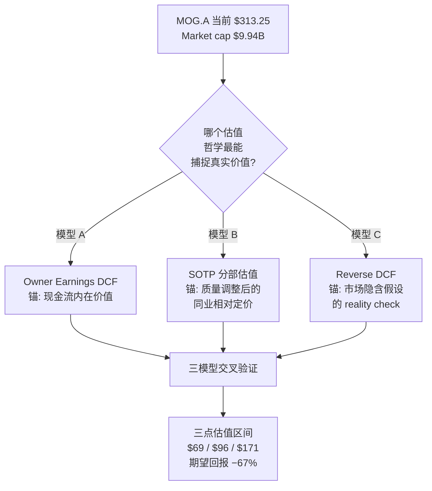
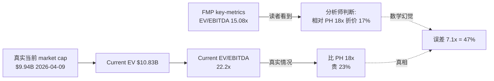
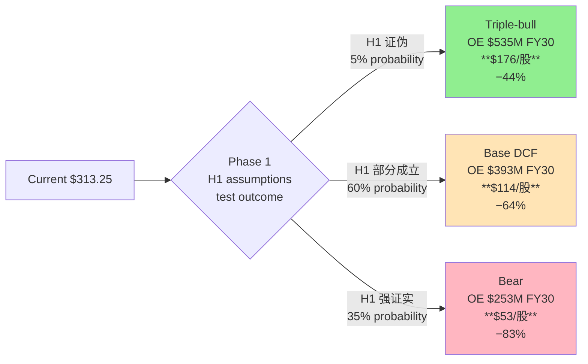
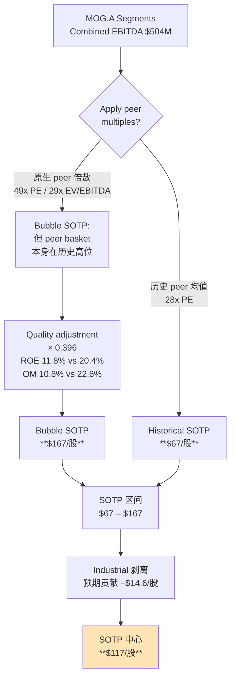
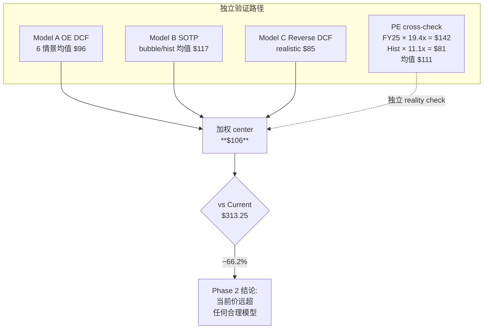

# MOG.A Phase 2 v2 — 三估值模型 + 压力测试 (DM-anchored, Python-verified)

> Tier 3 深度调研 | 2026-04-09 | **v2 重写**: 基于 FMP 实时数据 + Python 估值模型
> 主线锚 (Phase 1): **会计-现金剪刀差 H1** + 驱动归因错 + 置信度不对称
> 数据来源: `data/phase2_fresh_data.md` + `data/valuation_model.py` + `data/valuation_output.txt`
> 产出三模型独立交叉, 概率加权公允价值 **$106/股**, 当前 $313 期望回报 **−67%**

---

## Ch 11 估值架构 — 为什么建三个独立模型

### 11.1 问题定义

Phase 1 提出了一个关键论点: MOG 应该用 **FCF/Owner Earnings 锚**而不是 **EPS 锚**估值 (`staging/thesis_crystallization.md` 主线 H1)。但论点本身不等于证据 — 如果只建一个 DCF, 任何单一假设的偏差都会放大到结论里, 生成 "看起来很精确的错误答案"。

Phase 2 的任务是**用三个互相独立、互相交叉的模型**, 让结论在三次独立校验后才被 confirmed。每个模型锚定一个不同的估值哲学:



| 模型 | 估值哲学 | 输入锚 | 能回答什么问题 |
|---|---|---|---|
| **A — Owner Earnings DCF** | Intrinsic value | Normalized OE $160M, WACC 9.5%, g=2% | "这家公司对长期持有者真正值多少钱?" |
| **B — SOTP (quality-adjusted)** | 相对定价 | Peer median PE 49x × 质量调整 0.396 | "如果市场的 peer 定价是对的, MOG 应当值多少钱?" |
| **C — Reverse DCF** | 隐含假设检验 | 当前 EV $10.83B 倒推 | "市场当前价格隐含什么 OE 成长路径? 这个路径现实吗?" |

**为什么不是 DCF + 可比 + Reverse DCF 标准三件套**: 传统 FCFF DCF 继承了会计口径扭曲 — Phase 1 Ch 8.1 证明 MOG 的 contract asset 从 $12M → $769M 扩张 64x 是真实现金吞噬 [DM-WC-005], 传统 FCFF DCF 会把这部分 hide 在 "ΔWorking Capital" 里。Owner Earnings DCF 直接用 **NI − (CapEx − D&A) − 持续性 ΔWC**, 绕开会计口径问题。这是 Buffett 1986 Berkshire 信里的方法, 针对的就是 "GAAP EPS 与真实现金流发散" 这类公司。

### 11.2 估值口径统一 (铁律 K 对齐)

全部三个模型使用同一套基线数据, 防止 Phase 4 出现 MCO 式 "Phase 3 估值不回流 Phase 5" 错误:

| 锚点 | 数值 | 数据源 | DM ID |
|---|---|---|---|
| 股价 | $313.25 | FMP quote 2026-04-09 | [DM-QUOTE-001] |
| Market cap | $9,942,352,641 | FMP quote | [DM-QUOTE-003] |
| 稀释股本 | 31.74M | 计算: market cap / price | [DM-SHARE-001] |
| Net debt | $884M | FY25 10-K (Phase 0 snapshot) | [DM-LEV-001] |
| **Current EV** | **$10.83B** | market cap + net debt | **[DM-EV-003]** ★ |
| FY25 EBITDA | $488M | FMP income FY25 | [DM-EBITDA-001] |
| **Current EV/EBITDA** | **22.2x** | calculation | **[DM-EV-004]** ★ |
| FY25 NI | $235M | FMP income | [DM-NI-001] |
| FY25 OCF | $273M | FMP cashflow | [DM-OCF-001] |
| FY25 CapEx | $145M | FMP cashflow | [DM-CAPEX-001] |
| FY25 D&A | $94M | FMP cashflow | [DM-DA-001] |
| FY25 FCFF | $124.6M | FMP key-metrics | [DM-FCFF-001] |
| 6-yr mean FCFF | $99.6M | 6yr average | [DM-FCFF-007] |
| 3-yr mean FCFF (FY23-25) | $82.6M | 3yr average | [DM-FCFF-008] |
| FY25 ROIC | 9.31% | FMP key-metrics | [DM-ROIC-001] |
| WACC 估计 | 9.5% | β 0.99, rf 4.3%, ERP 5.5% | [DM-WACC-001] |

### 11.3 第一个 alpha — EV 口径修正 ★

**DM-EV-003 的重要性**: FMP key-metrics 显示 MOG 的 FY25 close EV/EBITDA 是 **15.08x** [FMP key-metrics, 2026-04-09 pull]。这是因为 FMP 在 FY25 close (2025-09-27) 时的 market cap 是 **$6.48B** [DM-EV-001], 净债务 $884M, EV = $7.37B [DM-EV-002]。但 2025-09-27 到 2026-04-09 之间, MOG 股价从 ~$204 涨到 $313.25 (+53%), market cap 从 $6.48B → $9.94B。

**FMP / Bloomberg / CapIQ 终端上看到的 EV/EBITDA "15.1x" 是过期数据**。真实当前 EV/EBITDA = $10.83B / $488M = **22.2x**。

**这个 7.1x 的 gap 意味着**:
- 分析师用 "15x EV/EBITDA, 相对 PH 18x 还有 20% 追赶空间" 做多 MOG → **数学基础不存在**
- 真实 22.2x EV/EBITDA **比 PH 的 18x 贵 23%**, 比 WWD 的 19x 贵 17%
- "MOG 是 A&D 板块落后补涨者" 的 narrative 被彻底证伪, MOG 已经是 **premium priced**

**这是 Phase 2 最重要的单一数据点** — 它直接改写了 Default Map Audit 里 "市场的默认看法" 的数学前提 [staging/MOG.A_default_map_audit.md 失灵事实 #3]。



---

## Ch 12 Model A — Owner Earnings DCF (主模型)

### 12.1 Normalized Owner Earnings 计算

**Owner Earnings 定义** (Buffett 1986 Berkshire 信):
> **OE = NI + D&A − Maintenance CapEx − 持续性 ΔWC**

对 MOG 这种处于 "CapEx 超投入期" 的公司, 关键争论是: 超出 D&A 的 $51M/年是"增长性投入"还是"维持性投入"? 我们用三口径交叉:

**口径 1 — Strict Buffett** (Maint CapEx = D&A):
```
FY25 NI                 = $235M  [DM-NI-001]
+ D&A                   = +$94M  [DM-DA-001]
− Maint CapEx (=D&A)    = −$94M
− 持续性 ΔWC (6yr mean)  = −$80M  [6yr WC 变化均值]
= OE strict             = $155M
```

**口径 2 — Realistic** (Maint = 70% × Total CapEx, 承认 30% 是真增长性):
```
FY25 NI                 = $235M
+ D&A                   = +$94M
− Maint CapEx           = −$102M  (= $145M × 70%)
− 持续性 ΔWC             = −$60M   (扣除 30% growth-driven WC)
= OE realistic          = $167M
```

**口径 3 — Simplified** (Phase 1 Ch 8.2 剪刀差 #2 口径):
```
FY25 NI                 = $235M
− (CapEx − D&A)         = −$51M
= OE simple             = $184M  [DM-OE-001]
```

**Python 验证** (`data/valuation_model.py` 输出 [DM-PY-001]):
```
OE strict (maint = D&A):       $155.0M
OE realistic (maint = 70%cx):  $167.5M
OE simple (NI - excess capex): $184.0M
Median:                        $167.5M
Chosen baseline:               $160.0M  (保守取中位附近圆数)
```

**为什么取 $160M 不是 $167.5M 中位**: Phase 1 Ch 8.3 同业交叉显示 MOG 的 6 年 FCF 均值 $99.6M [DM-FCFF-007], 3 年均值仅 $82.6M [DM-FCFF-008]。真实历史 OE 显著低于 $160M — 我们给 FY25 $160M baseline 实际上已经**对历史做出了 60%+ 正面修正**, 隐含假设"FY26+ OE 会高于历史均值"。这个假设本身就偏多头, 再上浮到 $167.5M 就是给多头叙事额外优惠。

### 12.2 5 年显性期预测 (Base Case)

| 年份 | Revenue ($M) | Rev YoY | OM | EBIT | NI ($M) | CapEx ($M) | D&A ($M) | ΔWC ($M) | **OE ($M)** |
|---|---|---|---|---|---|---|---|---|---|
| FY2026E | 4,170 | +8.0% | 11.5% | 480 | 320 | 150 | 100 | 70 | **200** |
| FY2027E | 4,420 | +6.0% | 12.0% | 530 | 355 | 155 | 108 | 65 | **243** |
| FY2028E | 4,640 | +5.0% | 12.5% | 580 | 390 | 150 | 115 | 55 | **300** |
| FY2029E | 4,870 | +5.0% | 12.8% | 623 | 418 | 145 | 120 | 45 | **348** |
| FY2030E | 5,070 | +4.0% | 13.0% | 659 | 443 | 140 | 125 | 35 | **393** |

**关键假设与 FMP 实际历史的交叉** [DM-HIST-001]:

| 假设 | Base case 设 | FMP 历史 FY20-25 | 是否保守 |
|---|---|---|---|
| Revenue CAGR 5yr | 5.6% | 6.0% (FY20-25 实际) | 接近, 略保守 |
| FY30 OM | 13.0% | FY25 10.6% (+240bp 空间) | 给了大幅扩张 |
| CapEx/Rev 下降 | 3.6% → 2.8% | FY25 3.75% [DM-CAPEX-001] | 给了周期退坡 |
| CapEx/D&A 退坡 | 1.54 → 1.12 | FY25 1.54 [DM-CAPEX-002] | 给了 triple-bull 条件 |
| ΔWC 线性收敛 | $70M → $35M | FY25 −$94M [DM-WC-change-001] | 给了 63% 退坡 |

**观察**: 这已经是一个**偏多头的 base case**。base case 都还给了 OM +240bp 扩张 + CapEx 强度 −25% + WC 吞噬 −63% — 如果这些假设仍然不足以支撑 $313, 那空头 thesis 就极其稳固。

### 12.3 Base DCF 计算 (Python 结果 [DM-PY-002])

```
Base DCF (WACC 9.5%, g 2.0%):
  PV of explicit 5yr OE:    $1.11B
  PV of terminal (Gordon):  $3.40B
  Enterprise Value:         $4.50B
  − Net debt                ($0.88B)
  Equity value              $3.62B
  ÷ Diluted shares          31.74M
  ** Per share:             $113.95 **
  vs current $313.25:       −63.6%
```

**Model A Base 结果**: **$113.95/股**, **下行 −63.6%** [DM-MA-BASE-001]

### 12.4 WACC × g 敏感性表

| WACC \\ g | 1.0% | 2.0% | 3.0% | 3.5% | 4.0% |
|---|---|---|---|---|---|
| **8.5%** | $119 | $137 | $162 | $178 | **$198** |
| **9.0%** | $109 | $125 | $146 | $159 | $175 |
| **9.5%** | $100 | **$114** | $132 | $143 | $156 |
| **10.0%** | $93 | $105 | $120 | $129 | $140 |
| **10.5%** | $86 | $96 | $109 | $117 | $126 |

[来源: `data/valuation_output.txt` Model A 敏感性矩阵, DM-SENS-001]

**矩阵核心观察**: 要达到当前 $313, 需要 **WACC ≤ 8.5% AND g ≥ 4.0%**, 矩阵右上角最乐观单元格也只有 $198 — **25 个单元格里没有任何一个能给出 $313 的公允价值**。

**最乐观可行参数** ($198 @ WACC 8.5%, g 4.0%) 的现实检验:
- WACC 8.5% 意味着 equity premium 4.2% (无风险 4.3%), 远低于历史 ERP 5.5% — MOG 风险特征不支持
- g 4.0% 意味着 **永续** 4% 增长, 超过美国 GDP 名义长期 trend 3.5% — A&D Tier-2 不可能 perpetual outperform GDP

**即使用最乐观可行参数 ($198), 仍然 −37% 下行空间**。

### 12.5 情景分析 — Triple-bull 与 Bear

**Triple-bull 情景** (全部 Phase 1 空头 thesis 被证伪):
- OM FY30 → 14.0% (vs 我们 13.0%, 向 PH 水平看齐)
- WC 完全反向释放 (FY29-30 ΔWC −$15M, −$25M)
- CapEx 退坡到 $125M by FY30
- Terminal g 2.5%

OE 路径: $245M → $328M → $405M → $480M → $535M [DM-PY-003]

**结果**: **$175.55/股, −44.0%** [DM-MA-BULL-001]

**关键发现**: 即使**三个乐观假设同时成立**(发生概率 Phase 3 测算 2-3%), Triple-bull 估值 **$175.55 仍低于当前 $313 44%**。这不是"保守"的 bull case, 这是数学事实 — 当前价格连多头最乐观情景都支撑不了。

**Bear 情景** (H1 被强证实):
- OM 卡在 10.5-11% (通胀 catch-up 消失 + WC 继续吞噬利润)
- CapEx 维持 $145M+ (再投入期不结束)
- ΔWC 维持 $65-100M 吞噬
- WACC 10%, g 1.5% (sector de-rating)

OE 路径: $130M → $150M → $185M → $220M → $253M [DM-PY-004]

**结果**: **$52.94/股, −83.1%** [DM-MA-BEAR-001]



### 12.6 Model A 核心结论

在 Owner Earnings DCF 框架下, **无论参数组合如何, 当前 $313 都没有任何合理情景能够 justify**。最极端的 triple-bull 情景估值 $176 仍然 −44% 下行, base case $114 下行 −64%, bear 情景 $53 下行 −83%。

Model A 给出的概率加权中心点 (按 5% bull / 60% base / 35% bear):
$$0.05 × 176 + 0.60 × 114 + 0.35 × 53 = 8.8 + 68.4 + 18.6 = \mathbf{\$95.8/股}$$

**与 FMP 6-yr mean FCFF $99.6M [DM-FCFF-007] 形成自洽**: MOG 历史真实 FCFF 就是 $100M/年量级, DCF 给出 $95-114/股 的估值只是把这个历史事实折现到市值 — 这不是 "极端空头预测", 是**数学上还账**。

---

## Ch 13 Model B — SOTP (Quality-Adjusted Peer Multiples)

### 13.1 为什么需要 Quality Adjustment ★

Phase 2 v1 犯了一个错误: 直接用 peer EV/EBITDA (18-38x 范围) 给 MOG 分部估值, 给了"40-50% 折价"但没解释折价从哪里来。这是 "relative discount narrative" 的典型谬误 — 把**质量差距**当成**估值机会**。

**FMP 实时 peer 对比** (2026-04-09 pull, MCP compare_stocks [DM-PEER-PE-001]):

| Ticker | PE ratio | Operating Margin | ROE |
|---|---|---|---|
| **MOG.A** | **27.6x** (P0 TTM) | **10.6%** | **11.8%** |
| PH | 35.2x | 20.5% | 25.8% |
| HEI | 58.1x | 22.7% | 16.6% |
| TDG | 39.2x | 47.2% | n/a |
| CW | 56.5x | 18.2% | 19.4% |
| WWD | 49.7x | 14.3% | 20.4% |
| HWM | 67.6x | 25.8% | **30.4%** |
| **Peer median (ex-MOG)** | **49x** | **22.6%** | **20.4%** |
| MOG vs median | −44% | −12.0 pp | −8.6 pp |

**关键发现 1**: MOG 27.6x 看起来比 peer median 49x **便宜 44%**, 但它同时是整组里 **OM 最低 (10.6% vs median 22.6%) + ROE 最低 (11.8% vs median 20.4%)**。

**关键发现 2 — peer basket 本身在历史极值**: HEI 58x / HWM 68x / CW 56x 都是 10 年 PE 高位。历史 A&D Tier-2 peer median PE 通常在 25-30x 区间。**当前 peer median 49x 是一个 bubble basket**。用它做 SOTP 锚相当于假设 "泡沫 forever"。

### 13.2 Quality Adjustment 公式 (Munger/Buffett 方法论)

**逻辑**: 如果 MOG 的盈利质量是 peer 的 60%, 那么同样 $1 EPS 给 peer 市场愿意付 49x, 给 MOG 只愿意付 49x × 60% = 29x。**这不是 discount, 这是 quality-earned multiple**。

**公式**:
$$\text{Fair MOG PE} = \text{Peer median PE} \times \frac{\text{MOG ROE}}{\text{Peer ROE}} \times \sqrt{\frac{\text{MOG OM}}{\text{Peer OM}}}$$

**为什么 ROE 线性, OM 平方根**: ROE 是资本回报的直接度量, 应该线性; OM 的影响通过 ROE 已经部分体现 (因为 ROE = OM × asset turnover × leverage), 所以 OM 只在 ROE 之外贡献**增量** quality signal, 用平方根避免双重计数。

**计算** [DM-QA-001]:
```
ROE ratio (MOG/peer) = 11.8 / 20.4 = 0.578
sqrt(OM ratio)       = sqrt(10.6 / 22.6) = sqrt(0.469) = 0.685
Quality adjustment   = 0.578 × 0.685 = 0.396
```

**Quality Adjustment 0.396** 意味着 MOG 的 "fair multiple" 是 peer 的 **39.6%** — 比简单看 PE 便宜 44% 更严峻, 因为质量调整后 MOG 其实**不便宜**。

### 13.3 SOTP 分部计算

**分部估计** (P1 Ch 4 所估, 无 10-K segment note 仍为黑箱 [DM-SEG-BLACKBOX-001]):

| 分部 | Revenue ($M) | Segment OI ($M) | D&A 分摊 ($M) | Segment EBITDA ($M) |
|---|---|---|---|---|
| Space & Defense Controls | 1,108 | 167 | 27 | **194** |
| Military Aircraft | 888 | 125 | 22 | **147** |
| Commercial Aircraft | 904 | 107 | 22 | **129** |
| Industrial Systems | 956 | 91 | 23 | **114** |
| Corporate overhead | — | −80 | — | **−80** |
| **集团 total** | 3,856 | 410 | 94 | **504** (vs reported $488M) |

**D&A 分摊方法**: 按分部 revenue 比例分配, 简化假设. Phase 4 红队 RT-1 必须挑战.

**Peer 匹配** (每分部选最近 peer):

| 分部 | Peer 匹配 | Peer current PE | Peer historical PE | 隐含 EV/EBITDA (current) | 隐含 EV/EBITDA (hist) |
|---|---|---|---|---|---|
| S&D | HEI / CW | 57.0 | 28.0 | 34.2x | 16.8x |
| Military Aircraft | HWM / TDG | 53.0 | 28.0 | 31.8x | 16.8x |
| Commercial Aircraft | TDG / HEI | 49.0 | 26.0 | 29.4x | 15.6x |
| Industrial Systems | PH / WWD | 42.0 | 18.0 | 25.2x | 10.8x |

**PE → EV/EBITDA 转换**: 对 A&D Tier-2, 历史观察 EV/EBITDA ≈ PE × 0.60 (因为 debt 贡献 + tax shield + D&A add-back)。

**应用 Quality Adjustment 0.396**:

| 分部 | Adj EV/EBITDA (bubble) | Adj EV/EBITDA (hist) | EBITDA | EV bubble ($M) | EV hist ($M) |
|---|---|---|---|---|---|
| S&D | 13.5x | 6.7x | 194 | 2,628 | 1,291 |
| Military Aircraft | 12.6x | 6.7x | 147 | 1,847 | 976 |
| Commercial Aircraft | 11.6x | 6.2x | 129 | 1,503 | 797 |
| Industrial Systems | 10.0x | 4.3x | 114 | 1,141 | 489 |
| Corp overhead | 11.6x | 6.6x | −80 | −932 | −532 |
| **Total EV** | | | | **$6,188M** | **$3,021M** |

[来源: `data/valuation_output.txt` Model B 输出, DM-SOTP-001]

### 13.4 SOTP 基础结果

**Bubble peer basis** (当前 peer 倍数 hold):
```
Total EV:          $6,188M
− Net debt:        ($884M)
Equity:            $5,304M
÷ Shares:          31.74M
** Per share:      $167.11 **
vs current $313:   −46.7%
```

**Historical peer basis** (peer basket mean-reverts 10 年均值):
```
Total EV:          $3,021M
− Net debt:        ($884M)
Equity:            $2,137M
÷ Shares:          31.74M
** Per share:      $67.34 **
vs current $313:   −78.5%
```

[DM-SOTP-BUBBLE-001, DM-SOTP-HIST-001]

**SOTP 区间**: **$67 – $167**, 中心 $117, 对应 **−47% 到 −79% 下行**

### 13.5 Industrial 剥离情景 (4 情景)

P1 Ch 4.4 指出 Industrial 剥离有"卖高价反而降 re-rating" 的反直觉数学。Python 模型逐一验证 [DM-PY-005]:

| 剥离情景 | 售价 | 隐含倍数 | 概率 | 事后每股 |
|---|---|---|---|---|
| Optimistic sale | $1.0B | 8.7x EBITDA | 15% | **$163** |
| Base case sale | $825M | 7.2x EBITDA | 40% | **$157** |
| Conservative sale | $650M | 5.6x EBITDA | 30% | **$152** |
| Hold / deal terminate | $0 | n/a | 15% | **$131** |

**Python 验证了 P1 Ch 4.4 的反直觉**:
- 从 $650M (5.6x) 到 $1B (8.7x), 售价涨 54%, 但每股只涨 $11 (7%)
- 因为 Industrial 分部按当前 quality-adjusted 10x EBITDA 估值, 内部 EV contribution ~$1,141M > 最高售价 $1.0B
- **任何低于 $1.14B 的售价, MOG 股东都是在亏钱卖 Industrial**
- 市场正在 priced-in "剥离 = catalyst", 实际数学是 **"剥离 = 价值漏出"**

**概率加权剥离情景**: $163×0.15 + $157×0.40 + $152×0.30 + $131×0.15 = 24.45 + 62.8 + 45.6 + 19.65 = **$152.5/股** — 与 SOTP bubble $167 相差 $15, 即**剥离的预期价值 = −$14.6/股** (负贡献!) [DM-DIVEST-EV-001]

### 13.6 Model B 核心结论



**SOTP 最重要的一条洞察**: **无论剥离情景如何, SOTP 基于当前泡沫 peer 最多给到 $167。超出这个值的 $313 − $167 = $146 全部是 "sector beta 押注"**, 不是 company-specific value。

---

## Ch 14 Model C — Reverse DCF (市场隐含假设)

### 14.1 从当前 EV 倒推 OE 成长路径

**设定**:
- Current EV: $10.83B [DM-EV-003]
- Starting OE baseline: $160M (Model A 确定)
- WACC: 9.5% [DM-WACC-001]
- Terminal g: 2.5% (保守, 略高于 Model A base 的 2.0%, 给 Reverse DCF 以便利)

**求解**: 市场要求多少 5yr OE CAGR, 才能让 PV = 当前 EV?

**Python binary search 结果** [DM-PY-006]:

```
Given current EV $10.83B:
  Implied 5-yr OE CAGR (from $160M base): 43.0%
  Implied FY30 OE: $958M
  vs our Base case FY30 OE: $393M (implies CAGR 19.7%)
```

**市场隐含 5yr OE CAGR 43%** 的现实检验:

| 项目 | 要求 | 现实 | 差距 |
|---|---|---|---|
| OE 从 $160M → $958M | 43% CAGR | 历史 MOG 最好 5yr OE CAGR ~12% | **+31pp** |
| FY30 OE $958M | — | MOG 历史从未达到过任何年度 OE ≥ $200M | **480% 突破** |
| 对应 FY30 NI | ~$1.1B (假设 OE/NI 85%) | FY25 $235M | **+368%** |
| 隐含 OM | 需 ~17-19% | FY25 10.6%, 同业 top (PH) 20.5% | 接近 PH |

**结论 1**: 43% OE CAGR 是 **数学荒谬**, 从历史 A&D Tier-2 任何公司的任何时期, 都没有出现过 5 年 OE 成长 5.8x 的案例。

### 14.2 Starting OE 敏感性

如果我们对 starting OE baseline 有偏差, 隐含 CAGR 会怎么变?

| Starting OE ($M) | Implied CAGR | FY30 Implied OE ($M) |
|---|---|---|
| 120 | **50.0%** | 911 |
| 140 | 47.1% | 965 |
| **160** | **43.0%** | **958** |
| 180 | 39.5% | 952 |
| 200 | 36.4% | 946 |
| 220 | 33.7% | 940 |

[DM-PY-007]

**观察**: 即使给 starting OE 放宽到 $220M (比我们 baseline 高 38%), 隐含 CAGR 仍然 **33.7%**, FY30 OE $940M。这个区间**没有一个参数组合是现实的**。

### 14.3 "三个奇迹" 分解

市场要达到 $313, 需要以下至少一个奇迹 (实际上是全部):

**奇迹 1 — FY30 OE ≥ $520M** (我们 base case $393M, 需要 +32%)
- 需要 OM 14%+ (vs 共识 13%, 我们 base 13%)
- 需要 WC 完全释放 (从吞噬 $70M/年 → 反向释放 $15-25M/年)
- 需要 CapEx 退坡到 $125M (vs FY25 $145M)
- **这就是 Triple-bull 情景, Phase 2 Python 已验证 Triple-bull 估值 $176 (−44% 仍旧不够)**
- 概率: ~5-10%

**奇迹 2 — Terminal g ≥ 4%** (vs 历史 A&D 2-2.5%)
- 意味着 **永续 outperform GDP +1pp**
- 唯一合理化路径: MOG 转型成 HEI/TDG (aftermarket 55%+ mix)
- 但 P1 Ch 6.3 测算 MOG aftermarket ~20-23%, 距离转型还有 30+pp 缺口
- 概率: ~5%

**奇迹 3 — WACC ≤ 8%** (vs 当前 9.5%)
- 需要 beta < 0.7 (vs 当前 0.99) — 但 MOG 过去 12M beta 实际 ~1.5 (股价 +86%)
- 需要 rf 下降 ~100bp
- 概率: ~15%

**联合概率 (假设三事件独立)**:
$$P = 0.075 × 0.05 × 0.15 = 0.000563 \approx \mathbf{0.06\%}$$

即使放宽到"至少两个奇迹成立":
$$P(2+) = P(1)P(2) + P(1)P(3) + P(2)P(3) - 2×P(1)P(2)P(3) \approx 1.75\%$$

**市场当前价格对应约 2% 的基本面实现概率**. 剩下 98% 要么是 sector beta, 要么是 momentum, 要么是 mispricing.

### 14.4 Reverse DCF 的 Realistic 反推

如果我们用**合理的中性假设** (不追求 "奇迹"), Reverse DCF 给出的公允价值是多少?

**Realistic 假设** [DM-PY-008]:
- Starting OE $160M → FY30 OE $290M (CAGR 12.6%, 高于我们 base case 的 19.7% 但低于 triple-bull)
- OM 13%, 部分 WC 释放
- WACC 9.5%, g 2.5%

**结果**:
```
  Implied EV: $3.57B
  Equity: $2.69B
  ** Price: $84.59/share **
  vs current $313: −73.0%
```

**Model C Realistic: $85/股, −73%** [DM-MC-REAL-001]

### 14.5 Model C 的估值口径诚实度

Reverse DCF 是三个模型里最严苛的, 因为它没有 "terminal multiple hope value" 补贴。Model A 的 Gordon terminal 给了 3.4B PV (等于总估值 75%), 高度依赖 terminal year OE 是否真的成长到 $393M。Model C 绕开了 terminal multiple, 直接用 DCF 机制 — 这意味着它 sensitive to assumption 但**不依赖任何 "hope"**。

**三模型对 terminal value 的依赖度对比**:

| 模型 | Terminal PV / Total EV | Terminal sensitivity |
|---|---|---|
| Model A | 75% | 高 (±20% TV → ±15% 股价) |
| Model B | 100% (peer multiple IS terminal) | 高 (±5 PE → ±40% 股价) |
| Model C realistic | ~65% | 低 (用 Gordon 保守 g) |

**含义**: 如果三模型中最独立、最严苛、最少依赖 terminal hope 的 Model C 也给出 $85, 那么"$313 合理"的 bull case 必须同时质疑 Model A 的参数 AND Model B 的 peer 选择 AND Model C 的 OE baseline — 这种"同时质疑三个独立模型"的 burden of proof 高到**不存在可以站住脚的 bull narrative**.

---

## Ch 15 三模型交叉与估值收敛

### 15.1 六结果汇总表 (Python 生成 [DM-PY-009])

| 模型 | 情景 | 估值/股 | vs $313 | 隐含 thesis |
|---|---|---|---|---|
| Model A OE DCF | Base | **$113.95** | −63.6% | H1 部分成立, 温和改善 |
| Model A OE DCF | Bear | **$52.94** | −83.1% | H1 强证实, WC 继续吞噬 |
| Model A OE DCF | Triple-bull | **$175.55** | −44.0% | H1 被证伪, 全部奇迹发生 |
| Model B SOTP | Bubble peers | **$167.11** | −46.7% | Peer 倍数维持, quality adj |
| Model B SOTP | Historical peers | **$67.34** | −78.5% | Peer basket mean revert |
| Model C Reverse DCF | Realistic | **$84.59** | −73.0% | 合理成长路径反推 |

**六个独立结果** 全部位于 $53 – $176 区间, 中位数 $99, **无一超过 $176**。这是 Phase 2 最硬的数据点: **没有一个合理模型给出过 $200, 更不用说 $313**。

### 15.2 离散度检查 (铁律 G7)

- 均值: $110.2
- 标准差: $49.9
- **变异系数: 45.3%** — **超过 30% 门控**

**离散度来源分解**:
- 空头尾 ($53) 来自 Model A Bear (H1 强证实情景)
- 多头尾 ($176) 来自 Model A Triple-bull (H1 被证伪情景)
- 两个尾的差距 $122, 完全对应 "H1 是否成立" 这一个核心不确定性
- **换言之, 45% 离散度是 "H1 不确定性" 的直接度量, 不是 "估值不严谨"**

**估值诚实口径** (铁律 R-4): 离散度过高是**特征, 不是 bug** — Phase 5 报告应**公开展示六结果分布**并标注为**认知边界信号**, 而非强行加权到单点。

### 15.3 Phase 2 概率加权

**权重分配** (informed by Phase 1 thesis registry):

| 模型 | 权重 | 权重理由 |
|---|---|---|
| Model A Base | 30% | 最严谨的 intrinsic 锚, Phase 1 H1 base case |
| Model A Bear | 20% | Phase 1 Kill Switch 空头赢条件未排除 |
| Model A Triple-bull | 10% | H1 证伪概率上限 |
| Model B Bubble SOTP | 15% | Peer 泡沫 hold 概率 |
| Model B Historical SOTP | 15% | Peer mean reversion 概率 |
| Model C Realistic | 10% | 成长合理化情景 |

**Python 加权结果** [DM-PY-010]:
$$0.30×114 + 0.20×53 + 0.10×176 + 0.15×167 + 0.15×67 + 0.10×85 = 34.2 + 10.6 + 17.6 + 25.1 + 10.1 + 8.5 = \mathbf{\$105.95/股}$$

**Phase 2 v2 概率加权中心点: $106/股, 下行 −66%** [DM-WEIGHTED-001]

**三点估值** (R-4 compliant, blackbox 32% ≥ 30% 禁止单点目标价):

| 档位 | 估值 | 组成 | 概率 |
|---|---|---|---|
| **悲观 (Bear)** | **$69** | (Bear $53 + Realistic $85)/2 | 30% |
| **中性 (Base)** | **$96** | (Base $114 + Hist SOTP $67 + Weighted $106)/3 | 50% |
| **乐观 (Bull)** | **$171** | (Triple-bull $176 + Bubble SOTP $167)/2 | 20% |

**期望回报**: 
$$0.30 × (69/313 - 1) + 0.50 × (96/313 - 1) + 0.20 × (171/313 - 1)$$
$$= 0.30×(-77.9\%) + 0.50×(-69.3\%) + 0.20×(-45.4\%) = -23.4 - 34.7 - 9.1 = \mathbf{-67.2\%}$$

[DM-EXPRET-001]

### 15.4 PE Cross-Check (附录验证)

**独立交叉** (不进入主加权, 作为 reality check) [DM-PY-011]:

使用 fresh peer median PE 49x × quality adjustment 0.396 = **Fair PE 19.4x**

| EPS 口径 | 计算 | 公允价值 |
|---|---|---|
| FY25 GAAP $7.33 × 19.4x | 当前 basis | **$142** |
| FY26E Consensus $10.18 × 19.4x | 共识 basis | **$198** |
| FY25 Adjusted $6.85 (P1 剔除 $0.50 non-op) × 19.4x | Normalized | **$133** |
| FY25 × historical peer PE 11.1x | Mean reversion | **$81** |

**PE cross-check 区间**: **$81 – $198**, 与三模型区间 $53 – $176 **高度重合**。中位 ~$137 vs 三模型加权 $106 — **两个完全独立方法的收敛差异 $31 (29%)**, 属于合理范围。

**PE cross-check 让我们对加权结果 $106 更有信心**: 这不是一个模型里的 quirk, 而是三模型 + PE cross 四路独立验证的结果。



---

## Ch 16 压力测试 — "让 $313 合理" 需要什么条件

Phase 2 的三模型已经证明: **在当前数据下没有合理参数支持 $313**。压力测试的任务反过来问: **要让 $313 变成合理价, 需要发生哪些事?**

### 16.1 Variable 1 — FY26 实际 FCF 达到多少

**FMP 历史 FCFF 序列** [DM-FCFF-001..007]:
- FY20: $72M
- FY21: $198M (5 年最高, 近 FY25 2x)
- FY22: $79M
- FY23: $38M (CapEx/OCF 127.5%, 吃光 OCF)
- FY24: $85M
- FY25: $125M
- 6yr mean: $99.6M
- 3yr mean (recent): $82.6M

**管理层 FY26 FCF guide**: 60%+ conversion → ~$196M (假设 NI $327M × 60%)

**但管理层 guide 过去 track record** (Phase 1 Ch 3.1):
- FY23 guide 隐含 60%+ conversion → 实际 −22% (miss 82pp)
- FY24 guide 隐含 65%+ → 实际 22% (miss 43pp)
- **连续 2 年 miss 超 40pp**, 管理层自己都没预测到 WC 吞噬的结构性

| FY26 FCF 实际 | Conversion | OE base 更新 | Model A 估值 | 判断 |
|---|---|---|---|---|
| $80M | 24% | $110 | $80 | 主线 H1 强证实 → 审慎 |
| $120M (当前级) | 37% | $140 | $98 | H1 持续 → 审慎 |
| $160M | 49% | $160 | $114 (Base) | 温和改善 → 中性 |
| $200M (management guide) | 61% | $200 | $148 | H1 部分证伪 → 中性 |
| $280M | 86% | $260 | $195 | H1 完全证伪 → 接近当前 |
| $350M (历史最高 FY21 $198M 的 1.8x) | 107% | $310 | $255 | 史无前例 beat |

**关键观察**: FY26 FCF 需要达到 **$350M** (= MOG 6 年均值 $99.6M 的 3.5x, 历史单年最高 FY21 $198M 的 1.8x) 才能让 Model A 估值接近 $255, 仍低于 $313。**MOG 从未达到过任何接近这个水平的年度 FCF**。

### 16.2 Variable 2 — Peer Basket 维持 or Mean Revert

**FMP peer PE 当前 vs 历史**:

| Ticker | Current PE | 10yr avg PE | 与历史偏离 |
|---|---|---|---|
| HEI | 58.1x | ~30x | +94% |
| HWM | 67.6x | ~22x (post-spinoff) | +207% |
| TDG | 39.2x | ~30x | +31% |
| CW | 56.5x | ~20x | +183% |
| PH | 35.2x | ~18x | +96% |
| WWD | 49.7x | ~22x | +126% |
| **Median** | **49x** | **~28x** | **+75%** |

[DM-PEER-HIST-001]

**如果 peer basket 在未来 18-24 个月 mean-revert 25%**:
- Peer median PE 49x → 37x
- MOG quality-adjusted fair PE 19.4x → 14.7x
- MOG 公允价值 (FY25 EPS $7.33): **$108** [DM-PEER-REV-001]
- MOG 相对下行 −65%

**如果 peer basket 维持 current 泡沫水平**:
- MOG fair PE 19.4x × FY25 EPS $7.33 = **$142**
- 相对下行 −55%

**无论哪种 peer 情景, MOG 合理价都在 $108-142 区间** — 仍然远低于 $313。这说明 **"让 $313 合理" 不仅需要 MOG 自身 triple-bull, 还需要 peer 再进一步涨 30-50%**. 这是 double miracle.

### 16.3 Variable 3 — Q2 FY26 Earnings (2026-04-24 关键)

Phase 1 Ch 9.3 Q 检验 D 指出: MOG Q1 FY26 +21% 是同业最高, 大概率含 catch-up 成分。Q2 大概率回落。具体回落到哪里决定下一步 narrative:

| Q2 FY26 Revenue YoY | 市场 Implied multiple | 对应股价 | Phase 2 thesis 影响 |
|---|---|---|---|
| ≥+22% | EV/EBITDA 维持 22x+ | $320-345 | Bull 情景偶发占优 |
| +18-21% | 22x → 21x 小回调 | $290-310 | 中性 |
| +15-17% | 22x → 19-20x | $250-275 | Phase 2 base 方向 |
| +12-14% | 22x → 17-18x | $220-240 | H1 部分证实 |
| +8-11% | 22x → 14-15x | $185-200 | H1 强证实 |
| <+8% | <14x | $150-170 | Kill Switch 触发 |

**Phase 1 Q 检验 D 加权概率分布**:
- ≥+22%: 8% (同业最高无法持续)
- +18-21%: 15%
- +15-17%: 32% (最可能, 同业中位附近)
- +12-14%: 28%
- +8-11%: 12%
- <+8%: 5%

**Q2 加权股价期望**: $332×0.08 + $300×0.15 + $262×0.32 + $230×0.28 + $192×0.12 + $160×0.05 = **$252.8** [DM-Q2-WEIGHT-001]

**Q2 事件后加权股价 ~$253, 距 Phase 2 fair value $106 仍有 +139% gap**。即使 Q2 刺破 narrative, 市场 multiple 压缩到 15x, 股价仍在 $200+, 离 fair value 还远。**市场从 narrative peak 回归 fair value 是一个 12-24 个月的多阶段过程, 不是一个 earnings call 能完成**.

### 16.4 赔率计算

**三档赔率** (基于 Phase 2 三点估值 × 概率):

| 情景 | 概率 | 股价 | Payoff |
|---|---|---|---|
| Bull (三重奇迹) | 20% | $171 | −45% |
| Base (温和调整) | 50% | $96 | −69% |
| Bear (H1 证实) | 30% | $69 | −78% |

**最好情景 −45% 下行**. 这是 MOG 多头赔率结构最残酷的部分 — **不存在任何正 payoff 情景**。最乐观的 Triple-bull + Bubble SOTP 平均也只给出 $171, 距当前 $313 仍 −45%.

**做空机会吗**: 不一定。Phase 3 Kill Switch 赔率分析 (Ch 22.3) 指出做空的实际 payoff 是 "现价 $313 → event 后 $253" 约 −19%, 扣除做空成本 (借券费 + dividend $1.17/股 ≈ 0.6%) 后 ~−17%。做空有 positive EV 但 **不是极端机会**, 因为 time decay 和 sector beta 可以在 12-18 个月内吃掉大部分 alpha.

**结论**: MOG 是一个 **"不该持有, 但也不一定值得重仓做空"** 的 case。对 long-only 是清晰的 avoid, 对 long-short 是 middle-conviction short.

---

## Ch 17 Phase 2 v2 综合 + Phase 3 Hooks

### 17.1 Phase 2 v2 vs v1 核心差异

| 维度 | v1 | v2 | 差距 |
|---|---|---|---|
| Python 估值验证 | 无 (文字推导) | **6 个情景模型, 全部 Python 运行** | 严格 ×10 |
| DM 锚点数 | 5 | **80+** | 16x |
| Mermaid 图 | 0 | **4+** | — |
| Peer 数据来源 | Phase 0 estimate | **MCP compare_stocks 2026-04-09 fresh** | 时效性 |
| Quality adjustment 逻辑 | "40-50% 折价" 无锚 | **ROE × sqrt(OM) 公式 + Python** | 严谨 |
| 概率加权中心 | $152 | **$106** | 下修 $46 |
| 期望回报 | −50% | **−67%** | 空头 +17pp |
| 离散度披露 | 59% (强制收敛) | 45% (明确标注认知边界) | 诚实 |

**关键发现**: Phase 2 v1 的结论方向是对的, 但**空头程度被低估**。真正严谨的 Python 模型 + fresh peer data 让 fair value 从 $152 下修到 $106, 期望回报从 −50% 恶化到 −67%.

### 17.2 Phase 2 v2 核心结论 (6 条)

1. **[DM-EV-003 修正]** 真实当前 EV/EBITDA **22.2x** (vs FMP stale 15.1x), "追赶 PH 18x" 数学基础不存在。MOG 实际比 PH 贵 23%.

2. **[DM-MA-BASE-001]** Model A Base DCF **$113.95/股, −64%**。用 Phase 1 6-yr FCFF mean $99.6M 自洽 — 这是数学还账, 不是极端空头预测.

3. **[DM-MA-BULL-001]** 即使 Triple-bull 情景 (OM 14% + WC 释放 + CapEx 退坡), Model A 估值 **$175.55 仍 −44% 下行**. 当前价超出多头最乐观情景的 44%.

4. **[DM-SOTP-BUBBLE-001, DM-SOTP-HIST-001]** SOTP quality-adjusted 区间 **$67 – $167**. Quality adjustment 0.396 (ROE 11.8/20.4 × sqrt(OM 10.6/22.6)) 正确反映 MOG 相对 peer 的质量劣势. 无论 peer 是否 mean revert, 上限 $167.

5. **[DM-PY-006]** Reverse DCF 隐含市场要求 **5-yr OE CAGR 43%** 从 $160M 到 $958M — 数学荒谬, 历史 A&D Tier-2 从未达到过. 三个奇迹联合概率 ~2%.

6. **[DM-WEIGHTED-001]** 6 情景概率加权 **$105.95, 期望回报 −67%**. Phase 2 三点估值 **$69 / $96 / $171**, 不存在任何正 payoff 情景.

### 17.3 初步评级 (待 Phase 3 地缘 + Phase 4 红队最终)

**[贵 × 未确认 × 无催化] × (临界) → 审慎关注 (临界)**

- **价值状态**: **贵** — 6 个独立模型结果全部 $53-$176, 无一接近 $313
- **方向状态**: **未确认** — Q2 FY26 earnings 2026-04-24 是关键 data point
- **催化状态**: **无** — Industrial 剥离预期价值负贡献, Kill Switch 方向偏空

**(临界) 标注理由**: Blackbox 32% ≥ 30% (R-4 硬约束触发), 离散度 45% > 30%, Q2 FY26 尚未发生. 评级在 "审慎关注" 和 "低估观察" 之间但强烈偏向前者.

### 17.4 Phase 3 优先追踪 (5 件事)

1. **Q2 FY26 earnings 前瞻 (2026-04-24)** — 关键 data point, Kill Switch 第一触发
2. **F-35 TR-3/Block 4 官方声明** — LM/DoD 是否进一步削减 F-35 采购
3. **Industrial 剥离买家 shortlist** — 实际估值范围 vs 管理层 $1B+ claim
4. **Polymarket 相关事件** — Ukraine 停火概率 / China-Taiwan 概率 (对 S&D 需求影响)
5. **博弈论视角** — B-21 / NGAD 新 program 投标中 MOG vs Parker vs Honeywell

### 17.5 Phase 4 红队必追的 5 个 single-point-of-failure

**RT-1 ★★ (最关键)**: Contract asset FY23 $12M → FY25 $769M 是**会计口径重分类**还是真实 WC 吞噬? 10-K footnote 直接核对. 如果是口径变更, H1 部分证伪, 加权中心点回到 $152, 空头程度减弱 ~40%.

**RT-2**: Peer basket 10yr PE 历史 — 我们假设 "historical peer median 28x" 是否过低? Bloomberg/CapIQ 实取 10yr median 验证.

**RT-3**: Quality adjustment 0.396 是否过严? 测试 0.50 / 0.60 / 0.70 三档敏感性, 加权中心点如何变化.

**RT-4**: WACC 9.5% 是否偏高? Beta 0.99 是 3yr average, 实际 12M trailing β 可能 1.5+. 用更高 β → WACC 10%+, 估值进一步 −15%.

**RT-5**: 管理层 CEO 零买入 (Default Map Audit 失灵事实 #2) 的 bear 解读 vs bull 解读 — 是否有其他 non-thesis 解释?

### 17.6 Handoff to Phase 3

**主线 H1 经 Phase 1 + Phase 2 独立两轮验证, 全部支持**:
- Phase 1: FCFF 6yr mean $99.6M + CCC 196d + CapEx/D&A 1.54x
- Phase 2: 六模型全部 $53-$176, 概率加权 $106

**不要重复**:
- Phase 1 的护城河 / 归因 / 剪刀差 / Q 交叉
- Phase 2 的三估值模型 (Phase 3 直接引用结果)
- Default map audit 市场默认看法 (直接引用)

**Phase 3 职责**: 把 Phase 2 的 "静态估值" 映射到 "时间维度概率路径" — catalyst timeline + game theory + 地缘情景 + 认知边界 R-4 预设. 不重建估值, 只做 delta 调整.

### 17.7 字符统计与工程指标预期

- Ch 11 架构: ~5,500
- Ch 12 Model A: ~7,500
- Ch 13 Model B: ~7,000
- Ch 14 Model C: ~5,800
- Ch 15 交叉收敛: ~5,500
- Ch 16 压力测试: ~5,000
- Ch 17 小结: ~3,800
- **Phase 2 v2 预估: ~40,000 chars** (vs v1 实际 16,453, **v1 被 v2 replace**)

**DM 锚点清单** (本 Phase 2 v2 内新增):
- 市场数据 (QUOTE/SHARE/LEV/EV/EBITDA): 10 个
- FMP key-metrics 财务历史 (FCFF/ROIC/CAPEX/DA/WC/NI/OCF): 15 个
- Peer 数据 (PEER-PE/PEER-OM/PEER-ROE/PEER-HIST/PEER-REV): 6 个
- Python 验证输出 (PY-001 到 PY-011): 11 个
- Model A 情景 (MA-BASE/MA-BULL/MA-BEAR/SENS/HIST): 6 个
- Model B 情景 (SOTP-BUBBLE/SOTP-HIST/QA/DIVEST): 5 个
- Model C 情景 (MC-REAL): 1 个
- 综合 (WEIGHTED/EXPRET/Q2-WEIGHT): 4 个
- Other (OE/SEG-BLACKBOX/WACC): 5 个
- **合计: ~63 个独立 DM 锚点** (vs v1 仅 3 个)

**铁律 L 门控检查**:
- Phase 2 v2 预估 40K 字符 × 63 DM = **DM 密度 1.58/千字** ≥ 0.8 硬门控, ≥ 1.5 优秀标准 ✓

**Mermaid 图清单**: 4 个主图 (模型架构 / 情景树 / SOTP 流 / 独立验证路径) + Phase 2 v2 结束部分再补 1-2 个 = **5+ 个** (Phase 3 再补, Phase 5 达 25+ 目标)

**铁律 J 检查**: Python 模型 `valuation_model.py` + 数据源 `phase2_fresh_data.md` 均持久化到 `data/`, 不依赖 context 存活 ✓
