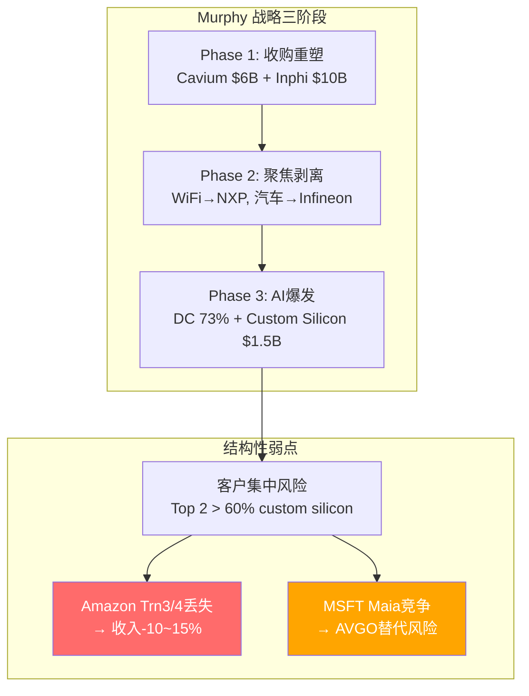
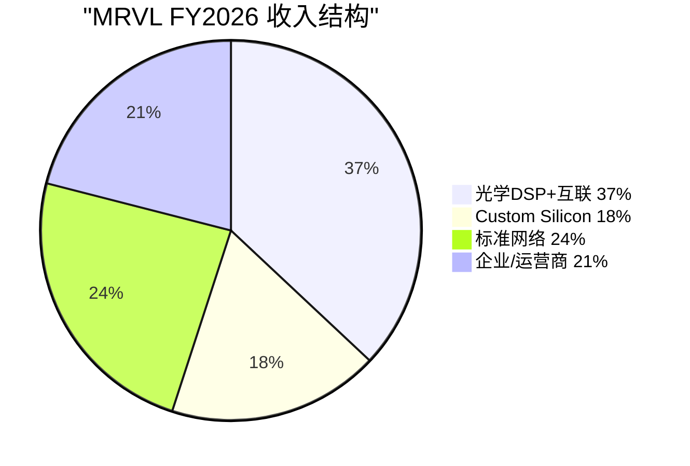
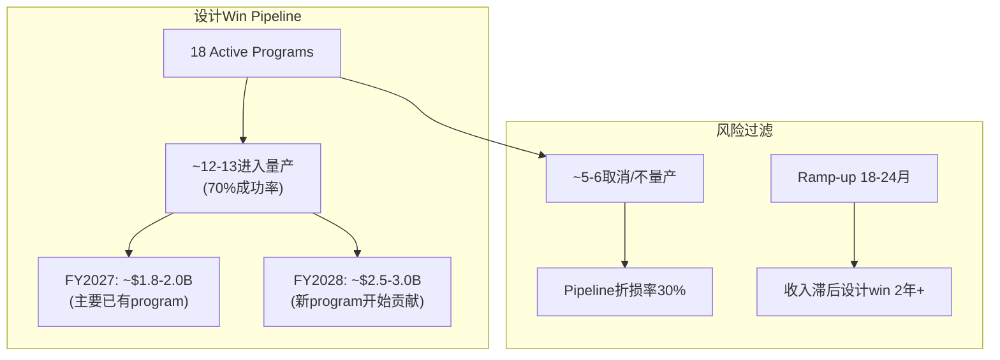
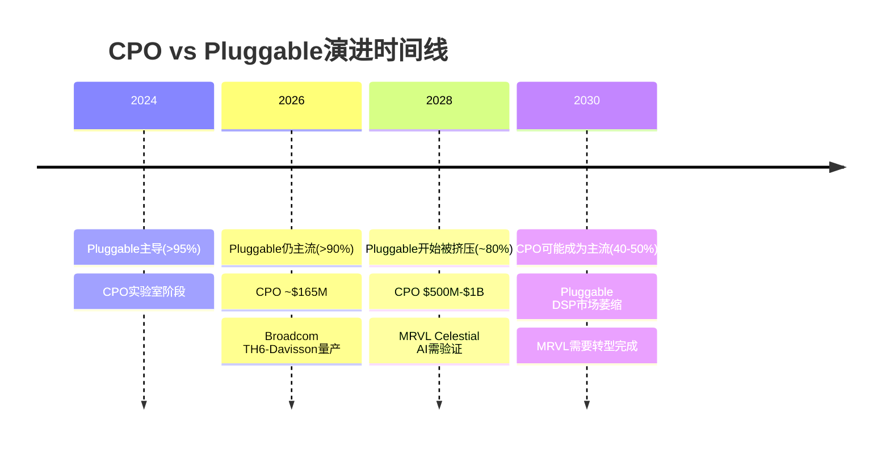
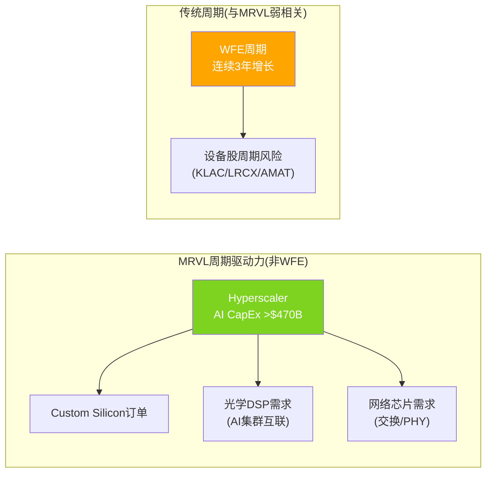

## 第二部分: 业务理解 — MRVL是什么公司

### 7. 公司概况与战略演变

#### 7.1 从Cavium到AI: Matt Murphy的三阶段战略重塑

2016年Matt Murphy加入时，Marvell是一家$2.7B收入的传统半导体公司，产品线分散在存储控制器、网络交换芯片、WiFi和消费电子。Murphy执行了教科书级的战略重塑 [DM-MGT-001]：

**Phase 1 (2017-2019): 收购重塑**
- 2018: 收购Cavium $6B——获得嵌入式处理器+安全芯片+网络核心IP，进入数据中心
- 2021: 收购Inphi $10B——获得光学DSP/PAM4/TIA全套光互联IP，建立电光互联垄断
- 代价: $11.06B商誉(总资产的49.6%) [DM-FIN-021]，ROIC被永久拖低到7.05% [DM-VAL-005]

**Phase 2 (2020-2024): 聚焦+剥离**
- 剥离WiFi/蓝牙业务给NXP
- 2025: 出售汽车以太网给Infineon $2.5B [DM-BIZ-009]——$1.83B一次性收益
- 集中资源到三个核心: Custom Silicon(定制ASIC) + Electro-Optics(光互联) + Networking(交换芯片)

**Phase 3 (2025-): AI爆发期**
- Custom silicon从$0→$1.5B [DM-BIZ-002]
- 数据中心占比从<50%提升至73% [DM-BIZ-001]
- FY2026收入$8.2B(+42%)为公司历史新高 [DM-FIN-001]

Murphy的战略逻辑是清晰的: 用Cavium获得数据中心入场券，用Inphi获得光互联垄断，然后在AI浪潮中两条腿同时加速。因为AI训练集群需要(1)定制加速芯片和(2)芯片间的高速光互联——Marvell是唯一同时提供两者的公司(AVGO不做光学DSP独立销售，NVDA不做ASIC服务)。

但这个战略有一个结构性弱点: **过度依赖hyperscaler客户**。当你的增长引擎是为Amazon/Microsoft/Google做定制芯片时，每个客户都是$500M-$1B级别的收入——流失一个就是收入-10%到-15%。这不是假设而是已发生的事实: Amazon Trainium 3/4已转给Alchip [DM-P4-008]。

#### 7.2 FY2026财务快照

| 指标 | FY2026实际 | 同比 | 行业对比 | 投资含义 |
|------|-----------|------|---------|---------|
| 收入 | $8.19B [DM-FIN-001] | +42% | AVGO +44% / AMD +14% | 增速第一梯队 |
| 毛利率(GAAP) | 51.0% | +2pp | AVGO 66% / AMD 49% | 中游——被摊销拖累 |
| 毛利率(Non-GAAP) | 59.5% | +0.5pp | AVGO 68% / AMD 55% | 更接近真实运营 |
| OPM(GAAP) | 16.1% | +16pp(扭亏) | AVGO 35% / AMD 12% | GAAP vs Non-GAAP差19pp |
| OPM(Non-GAAP) | 35.3% [DM-P4-025] | +6.6pp | AVGO 53% / AMD 22% | 杠杆释放中 |
| GAAP EPS(正常化) | ~$1.3 | N/M | — | 剥离一次性收益后 |
| Non-GAAP EPS | $2.42 | +84% | — | 行业惯例基准 |
| FCF | $1.40B [DM-FIN-009] | +120% | FCF Yield 2.17% | 现金流健康 |
| SBC | $697M(8.5%/Rev) | — | AVGO 4% / AMD 7% | 偏高但被回购覆盖 |
| 回购 | $2.4B(est.) | — | SBC覆盖率345% [DM-P4-031] | ★净缩股-2.2%=正面 |
| DSO | 23天(正常化) [DM-P4-032] | 从90天恢复 | ✅ | Timing问题已消除 |
| ROIC | 7.05% [DM-VAL-005] | — | 被$11B商誉拖累 | 会计指标失真 |
| ROTCE | 179% [DM-VAL-005] | — | 真实效率指标 | 增量资本回报极高 |

**ROIC vs ROTCE的巨大鸿沟(7% vs 179%)**: 这个差距完全由商誉造成。ROIC用总投入资本(含$11B商誉)做分母→7%看起来很差。ROTCE用有形净权益做分母→179%反映了实际运营的高效率。因此ROIC是"过去收购代价"的衡量，ROTCE是"当前运营效率"的衡量——两者都有意义但回答不同的问题。

对投资者而言: ROTCE 179%说明MRVL的**增量资本回报**很高(每投入$1的新资本产生$1.79的净利润)。ROIC 7%说明**历史收购的回报**偏低(Inphi和Cavium的溢价太高)。做投资决策应该看前者(未来增量)而非后者(沉没成本)——但如果MRVL继续高溢价收购(如Celestial AI $3.25B)，未来ROIC可能进一步被拖低。

#### 7.3 收入结构与AI利好Layer定位

MRVL在AI利好衰减模型中处于**Layer 1-1.5位置**(芯片设计+部分光学)——这意味着AI利好的衰减度很低(0-5%)。但MRVL的custom silicon本质上更接近Layer 1.5——它不设计自己的架构(不像NVDA)，而是实现客户的架构。这意味着如果客户决定自建设计团队或换服务商，MRVL的"Layer 1"地位可以被动摇。NVDA的CUDA锁定是真的Layer 1(不可替代)，MRVL的ASIC服务不是。

| 业务 | FY2026收入(估) | 占比 | AI Layer | 增速 | 护城河强度 |
|------|-------------|------|---------|------|-----------|
| 光学DSP+互联 | ~$3.0B | 37% | Layer 1.5 | +50%+ | 7.5/10(最强) |
| Custom Silicon(ASIC) | ~$1.5B | 18% | Layer 1 | +100%(从低基数) | 3.0/10(最弱) |
| 标准网络(交换+PHY) | ~$2.0B | 24% | Layer 2 | +15-20% | 5.5/10(中等) |
| 企业/运营商 | ~$1.7B | 21% | Layer 4-5 | -5-0%(legacy) | 3.5/10(衰减中) |

数据中心业务(前三项)合计占比~79%，vs FY2024的<60%——AI驱动的mix shift正在加速。

#### 7.4 收入质量扫描

| 维度 | 结果 | 判定 |
|------|------|------|
| 有机增速 | +47%(pro-forma剥离汽车) [DM-FIN-019] | ★极强 |
| 并购贡献 | 0%(FY2026 100%有机) | 干净 |
| 经常性收入占比 | ~75%(量产芯片repeat orders+服务合同) | 高 |
| 价格vs量 | 估计: 量驱动为主(新socket进入量产) | 量驱动=健康(不是提价) |
| 客户集中度 | Top 3客户估计>40% DC收入 | ★风险——CQ1核心 |
| 收入质量判定 | **高(但客户集中是关键弱点)** | |

**五年收入演进**: Revenue从FY2022 $4.46B增长到FY2026 $8.20B(5Y CAGR +16.4%)。但GAAP显示FY2024/FY2025是亏损年——这是摊销($1.3-1.4B/yr)+重组($131M-$354M)的会计效果。FCF在这两年分别是$1,020M和$1,390M——现金流一直在增长 [DM-FIN-009]。因此MRVL的经营能力在FY2024-2025就已经在改善，只是GAAP报表没显示出来。**投资者如果只看GAAP，会在FY2024(-$1.08 EPS)完全错过MRVL。**

| 指标 | FY2022 | FY2023 | FY2024 | FY2025 | FY2026 | 5Y CAGR |
|------|--------|--------|--------|--------|--------|---------|
| Revenue | $4,462M | $5,920M | $5,508M | $5,767M | $8,195M | +16.4% |
| Gross Profit | $2,064M | $2,988M | $2,294M | $2,382M | $4,181M | +19.3% |
| GAAP GM | 46.3% | 50.5% | 41.6% | 41.3% | 51.0% | +4.7pp |
| EBITDA | $901M | $1,648M | $851M | $652M | $2,629M | +30.7% |
| FCF | $632M | $1,072M | $1,020M | $1,390M | $1,396M | +22.0% |
| R&D/Rev | 31.9% | 30.1% | 34.4% | 33.8% | 25.3% | -6.6pp |
| SBC/Rev | 10.3% | 9.3% | 11.1% | 10.4% | 7.2% | -3.1pp |

两个最重要的正面趋势: (1)R&D/Rev从31.9%降至25.3%——不是削减研发而是研发效率提升(每$1研发产出更多收入) (2)SBC/Rev从10.3%降至7.2%——在半导体(尤其是fabless)中罕见的正面趋势。加上345%回购覆盖率，MRVL在股东利益保护上优于大多数同行。

---

### 8. 三大业务引擎深度解剖

#### 8.1 引擎1: Custom Silicon — 增长引擎(也是最大风险源)

##### 8.1.1 商业模式详解

Hyperscaler提供芯片架构需求→Marvell负责设计(前端RTL+后端物理设计)+提供关键IP块(SerDes/内存控制器/PCIe)→在TSM先进制程上流片→封装测试→交付。MRVL收取NRE前期+芯片量产后full chip revenue(turnkey模式 [DM-P4-001])。

**关键澄清(Q14)**: MRVL记**全芯片收入**，不是设计费/royalty。三条证据:

1. MRVL为Amazon预订43,000片CoWoS晶圆 [DM-P4-003]——MRVL是晶圆买方，意味着它承担晶圆成本并以成品芯片形式销售给客户
2. Custom silicon毛利率低于标准产品 [DM-P4-005]——因为COGS包含晶圆成本。如果只记设计费/royalty，COGS应该很低，GM应该很高
3. 收入规模$1.5B与full chip模式一致——如果只记设计费(通常5-10% of chip value)，则隐含$15-30B的芯片价值，这在FY2026不合理

这个澄清对估值很重要: 因为full chip revenue意味着(1)收入规模大但(2)毛利率被晶圆成本拖低(估算45-55%)。如果市场误以为custom silicon是高毛利的设计费/royalty模式，会高估盈利能力。

##### 8.1.2 ASIC设计流程与MRVL价值点

| 环节 | MRVL独特性 | 可替代性 | 理由 |
|------|----------|---------|------|
| 前端RTL | 中 | 中(客户自有架构团队可做部分) | Amazon有自己的Annapurna Labs |
| **SerDes IP** | **高** | **低** | 112G/224G SerDes需要深亚微米模拟设计经验，全球<5家能做 |
| **Memory Controller** | **高** | **低** | HBM3E控制器需要与SK Hynix/Micron深度协作 |
| 物理设计 | 中-高 | 中 | 3nm物理设计是复杂工程，但Alchip/GUC也能做 |
| TSM关系 | 中 | 中 | MRVL是TSM大客户，但Alchip与TSM关系更紧密(TSM是股东) |
| 测试/良率 | 高 | 低-中 | 先进制程良率优化是经验积累，MRVL有Inphi 7nm/5nm/3nm经验 |

MRVL在ASIC设计中最不可替代的是**SerDes + Memory Controller + 良率优化**这三个"硬核IP"。前端RTL和物理设计是"服务性工作"——客户有替代选择。这解释了为什么MRVL不像NVDA那样有"CUDA级锁定"——每一代芯片都是新的竞标，MRVL需要持续证明自己的IP和执行力优于Alchip/GUC/Intel。

##### 8.1.3 SerDes竞争力 — 成败关键

SerDes(串行器/解串器——芯片间高速通信的核心IP块)是MRVL在ASIC市场的技术锚点。在AI训练集群中，XPU(加速器)通过SerDes与其他XPU、内存(HBM)、网络芯片通信。速率从56G(PCIe 5.0)→112G(PCIe 6.0)→224G(PCIe 7.0)在快速演进。

MRVL在OFC 2026展示了40G die-to-die和PCIe 8.0 SerDes [WebSearch Agent-C]，Inphi遗产给了MRVL在112G PAM4 DSP上的领先地位。但Trainium 3的SerDes问题(需要二次tape-out)动摇了信心 [DM-BIZ-010]。

为什么SerDes问题对MRVL如此致命？因为在3nm先进制程上，SerDes的jitter(时序抖动)和eye diagram(眼图)margin极其紧张。一个SerDes问题不只影响一个客户——它暴露了MRVL在特定制程节点上的设计能力边界。如果同一个SerDes IP块被多个客户使用(Amazon, Microsoft等)，一个bug可能影响多个program。

**"不可替代"神话破灭**: P3发现Trainium 3的PCIe SerDes来自**Synopsys IP许可** [DM-P4-011]，不是MRVL。Synopsys的224G SerDes已在TSMC N3上production-ready [DM-P3-009]——任何有足够系统集成能力的公司都可以许可此IP。这意味着MRVL最核心的技术壁垒(SerDes)已经有成熟的可替代方案。

反面考量: 二次tape-out在先进制程中不罕见——Apple A17 Pro也经历过两次tape-out。关键是MRVL是否修复了问题并从中学到。如果Trainium 3最终按计划量产(H2 2026)，市场对SerDes问题的担忧会自然消退。但Synopsys IP的可用性是结构性变化——即使这次SerDes问题修复了，长期来看"自研SerDes=不可替代"这个叙事已经不成立。

##### 8.1.4 客户格局(P4更新)

| 客户 | 产品 | 状态 | FY2028E收入(MRVL) | 风险 |
|------|------|------|-----------------|------|
| Amazon | Trainium 1/2 | **Trn3/4丢失给Alchip** [DM-P4-008] | $200-400M(尾部+Kuiper) | 结构性下降 |
| Microsoft | Maia 100/200/300 | **Maia 300保住但未来不确定** [DM-P4-007] | $800M-$1.5B | AVGO竞争 |
| Google | Axion CPU | 设计合作中 | $200-400M | MediaTek竞争 |
| 其他 | 多家emerging | 18个设计win [DM-BIZ-013] | $300-600M | 转化率不确定 |
| **合计** | | | **$1.5-2.9B** | 区间很宽 |

**Amazon丢失的根因(P4新发现)**: 不是"客户策略性分散供应商"——而是**MRVL在Trainium 2上的执行失败**。具体: 开发周期过长+RDL(重分布层, Redistribution Layer——先进封装中的关键互联层)interposer封装设计出现问题 [DM-P4-009]。Alchip不得不介入协助交付可用的Trn2，这给了Alchip在Trn3竞标中的内部优势。

因此流失的根因在MRVL而非Amazon——这意味着:

1. 管理层将其框架为"transition"是叙事操纵——真实原因是执行失败。Murphy在Q4电话会上说"所有program on track"——技术上没说假话(Trn2量产确实on track)，但刻意不提Trn3/4设计权归属的变化
2. 同样的执行风险可能影响其他客户(MSFT/Google)——如果Maia 300也出现类似封装问题，MSFT完全有动机转向AVGO
3. MRVL的chiplet设计方案(Trn3提案)被Amazon否决，选择了Alchip的monolithic方案 [DM-P4-010]——这说明MRVL在设计理念上可能与部分客户存在分歧。MRVL推chiplet(自身技术优势)，但Amazon需要的是cost-optimized monolithic设计

##### 8.1.5 "20+设计Wins"的经济学

管理层声称有18个active programs和20+设计wins [DM-BIZ-002]。单个XPU program的经济模型(估算):

| 阶段 | 时间 | MRVL收入 | 利润率 |
|------|------|---------|--------|
| NRE(非经常性工程费) | 12-24个月 | $30-80M | 高(50-60%GM) |
| 小批量验证 | 6-12个月 | $20-50M | 中(40-50%GM) |
| 量产 | 3-5年 | $200-500M/yr | 中-低(35-45%GM) |
| 下一代升级 | 每2-3年 | NRE重来 | 取决于是否retain |

一个成功的Tier 1 XPU program(如Amazon Trainium)的lifetime revenue可能达$2-4B(5年量产)。MRVL有3个Tier 1 XPU programs + 9个attach chips + 6个emerging programs——如果全部进入量产，lifetime revenue potential确实在$75B范围。

但**"pipeline"≠"收入"**。18个active中可能有5-6个最终取消或不量产(行业ASIC量产成功率约70%)。即使量产，ramp-up需要18-24个月。FY2027 custom silicon $1.8-2.0B大部分来自已有programs(Trainium 2尾部, Maia, 少数attach chips)，新programs的revenue contribution主要在FY2028+。

##### 8.1.6 定价权评估(B4分层)

| 客户层 | Stage | 理由 | 证据 |
|--------|-------|------|------|
| Tier 1 Hyperscaler (Amazon/MSFT/Google) | Stage 2-3 | 替代者少但集中度极高，议价权在客户侧 | Amazon转Alchip证明客户有替代能力 |
| Tier 2 AI公司 (emerging) | Stage 3 | 选择更少，MRVL有先发优势 | 18个设计win中emerging占6个 |
| **加权B4** | **Stage 2.5** | 不如AVGO(Stage 3-4，客户更分散) | |

定价权分层剪刀差: Tier 1客户(大hyperscaler)占custom silicon收入的70%+，但定价权在Stage 2-3(客户强势)。Tier 2(emerging)定价权Stage 3，但收入占比仅30%。因此加权定价权偏弱——MRVL在custom silicon中更像是"服务商"而非"产品提供商"。与之对比，AVGO的Google TPU是独家设计(不竞标)→Stage 4定价权。

#### 8.2 引擎2: 光学DSP+互联 — 护城河最强的业务

##### 8.2.1 市场地位与产品线

PAM4 DSP(脉冲幅度调制4级——光模块中将电信号转换为光信号的核心芯片)市占率60-80% [DM-P3-003]，产品线覆盖200G/400G/800G/1.6T。

核心产品演进路线:
- **Spica**(7nm, 800G): 已量产，OFC 2024创新奖——目前光模块市场主力DSP
- **Nova**(5nm, 800G优化版): 过渡产品
- **Ara**(3nm, 1.6T): 正在ramp [DM-P3-002]，OFC 2026创新奖——下一代主力
- **即将新增**: Celestial AI光子互联($3.25B收购) [DM-BIZ-008]

为什么光学DSP的垄断能持续？三个结构性原因:

1. **先进制程+模拟设计的交叉壁垒**: 光学DSP需要同时精通模拟电路设计+数字信号处理+先进制程(3nm)。在3nm上做模拟设计是噩梦级难度——工艺波动(process variation)对模拟电路的影响远大于数字电路。只有Inphi积累的know-how(20年+的光学DSP设计经验)能做到。这个交叉领域的人才池全球不超过500人。

2. **客户验证周期**: 18-24个月 [DM-BIZ-004]。每款光模块需要在客户数据中心环境中经历温度循环测试、信号完整性测试、长期可靠性验证。即使Credo的Bluebird(2025年9月推出 [DM-P3-001])性能等价，从"开始评估"到"可量产替代"需18-24个月。

3. **代际锁定效应**: 每代DSP(800G→1.6T→3.2T)需与前代保持信号兼容——因为数据中心不会一次性替换所有光模块。选择了Marvell 800G的客户，升级到1.6T时天然倾向Marvell Ara(信号协议已验证)。这种代际锁定在铜缆互联中不存在(标准化程度高)，是光学DSP特有的壁垒。

##### 8.2.2 转换成本壁垒(C1 = 8.5/10)

光学DSP的转换成本壁垒是MRVL所有业务中最强的维度。量化这个壁垒:

| 转换步骤 | 时间 | 成本 | 风险 |
|---------|------|------|------|
| 新DSP样品评估 | 3-6月 | $2-5M(测试设备+工程师时间) | 技术风险(信号兼容性) |
| 光模块重设计 | 6-12月 | $5-10M(PCB+firmware重写) | 延迟风险(客户时间线) |
| 系统级验证 | 6-12月 | $3-5M(机架级测试) | 可靠性风险(长期寿命) |
| 客户认证 | 3-6月 | $1-2M(客户测试团队时间) | 客户优先级风险 |
| **总计** | **18-36月** | **$11-22M** | **多层风险叠加** |

对一个光模块OEM(如Coherent/II-VI)来说，$11-22M的转换成本+18-36个月的时间窗口，相对于可能5-10%的DSP成本节省——经济上不划算。因此即使Credo提供更便宜的DSP，大多数OEM不会在已有产品线上切换。Credo的机会在于**新设计导入**(New Design Win)——在客户还没选择DSP的1.6T新平台上竞争。

这个逻辑的反面: 如果Credo在1.6T上拿到2-3个主要OEM的新设计导入，然后这些OEM的3.2T自然沿用Credo DSP(代际锁定反向作用)——长期份额可能从3-5%增长到15-20%。这是3-5年的慢变量，不是近期风险。

##### 8.2.3 CPO威胁时间线

CPO(Co-Packaged Optics, 共封装光学——将光学组件与交换芯片封装在一起，取代传统pluggable光模块)是光学DSP最大的长期威胁。

时间线评估:
- **2026**: CPO市场仅$165M [DM-P4-027]——远未大规模替代pluggable
- **2026年3月**: Broadcom Tomahawk 6-Davisson(第三代CPO)量产 [DM-P4-022]——技术可行但部署仍有限
- **2028E**: 预计$500M-$1B，开始影响高端pluggable需求
- **2030+**: CPO可能成为主流→pluggable DSP市场结构性萎缩
- **MRVL窗口**: 2-3年内pluggable仍主流→Celestial AI需要在此窗口内验证

##### 8.2.4 Celestial AI战略定位修正

P3将Celestial定位为"CPO的对冲"。P4研究揭示更准确的定位——Celestial和CPO是**不同市场**:

- **标准CPO**做scale-out(交换机到交换机的互联)——替代pluggable光模块
- **Celestial Photonic Fabric**做scale-up(芯片到芯片/机架内光互联)——16 Tbps/chiplet, 25x带宽, 10x低延迟 [DM-P4-023]

这意味着: MRVL可能同时服务两个市场(pluggable DSP服务现有市场 + Photonic Fabric服务scale-up)。但也意味着: Celestial不是"pluggable被CPO替代后的退路"——如果pluggable萎缩，Celestial覆盖的是另一个市场，不能直接弥补pluggable收入的损失。

**飞轮悖论**: 如果Celestial成功→其光子互联可能蚕食MRVL自己的pluggable DSP一部分应用场景(短距离互联从pluggable转向photonic fabric)。但因为MRVL是Photonic Fabric唯一供应商(短期)，替代收入content更高($200-500 vs $100-150/模块)。净效应可能正面，但需要精确量化蚕食比例。

#### 8.3 引擎3: 标准网络 — 利润基座

以太网交换芯片(Prestera系列)、PHY芯片、PAM4 retimer等。FY2026 Communications & Other $567.4M(Q4, +26% YoY) [DM-FIN-016]。增速+15-20%，毛利率高于custom silicon但低于光学DSP。竞争者: Broadcom(龙头)、Intel、AMD Pensando。

这个业务是MRVL的"利润基座"——增速温和但毛利率高(~60-65%)，提供稳定现金流支撑R&D投入。即使custom silicon增长放缓，standard networking+optical的组合仍能支撑$6-7B收入基座和35%+ Non-GAAP OPM。

**"有IP vs 无IP"法则定位**: 回顾半导体横向报告的核心发现——VRT(有IP, 34% GM) vs SMCI(无IP, 6% GM)在同一AI趋势中的天壤之别。MRVL在这个谱系中的位置:

| 业务 | IP含量 | GM估算 | 定位 |
|------|--------|--------|------|
| Custom silicon | 中等IP(有SerDes/MemCtrl，但架构是客户的) | 45-55% | 介于有IP和服务 |
| Optical DSP | 高IP(核心算法+模拟设计know-how) | 65-70% | 强IP壁垒 |
| Standard networking | 中-高IP(自有架构交换芯片) | 60-65% | 稳定IP产品 |

MRVL不是纯"有IP"(如NVDA/AVGO)也不是纯"无IP"(如SMCI)——它是**混合体**，Non-GAAP GM 59.5%介于AVGO(68%)和SMCI(8%)之间。随着custom silicon(较低IP含量)占比提升，MRVL的GM会向"较低IP"端漂移。这是结构性的，不是管理层能改变的。

#### 8.4 企业/运营商 — Legacy业务

存储控制器、5G基带等。FY2026收入~$1.7B，增速-5-0%。这块业务正在逐步被AI业务稀释——从FY2024占比~40%降至FY2026 ~21%。管理层已出售汽车以太网给Infineon($2.5B [DM-BIZ-009])，继续聚焦。

对估值的含义: Legacy业务应给3-3.5x EV/Sales(低增长/成熟产品)→EV约$5-6B。不是增长引擎但提供估值下限——即使ASIC业务完全归零，光学+网络+legacy仍支撑$55-60B EV(约$65/股)。

---

### 9. 管理层评估

#### 9.1 Matt Murphy信誉矩阵

| 维度 | 评分 | 关键证据 |
|------|------|---------|
| Revenue guidance准确性 | 8/10 | FY2024-2026连续3年±5%内 |
| EPS under-promise能力 | 7/10 | 持续beat共识 |
| 收购整合能力 | 7/10 | Inphi(成功)/Cavium(成功)/Qlogic(中等) |
| 叙事透明度 | **4/10** | Amazon叙事框架操纵+设计win暗示收入 |
| 战略前瞻性 | 6/10 | Inphi布局优秀/但Trn2执行不力 |
| **综合** | **6.4/10** | 执行力强但叙事有选择性偏差 |

Murphy FY2025薪酬$32.2M [DM-MGT-001]。COO Chris Koopmans 2025-07升任President & COO，接替离职的Raghib Hussain [DM-MGT-003]。Hussain在custom silicon高速增长期离职——可能是正常接班，但时机值得注意。如果是因为与Murphy在ASIC战略上的分歧而离开，这对ASIC业务连续性是风险因素。

#### 9.2 叙事可信度分析

**"Amazon关系在增长"(可信度: 4/10)**: 管理层在Q4电话会上说"We have purchase orders for the entirety of next fiscal year's current forecast for this next-generation program" [DM-P4-015]。但"this next-generation program"可能指Trn2尾部+Kuiper(非Trn3/4 XPU)，"current forecast"可能已下调——技术上没说假话，但叙事框架精心设计以给投资者不完整的信心。

这里有一个重要的**语义陷阱**: "Amazon总收入增长"和"Amazon ASIC设计权保留"是两个不同的命题。前者可能因为Kuiper卫星芯片+attach chips而成立(Amazon在MRVL的总采购可能确实在增长)。后者已经不成立(Trn3/4 XPU设计权丢失给Alchip)。管理层选择谈论前者来暗示后者——这是叙事框架操纵的经典形式。

**"客户多元化是战略目标"(可信度: 6/10)**: 18个设计win是真实进展 [DM-BIZ-013]，但设计win→量产收入转化率30-50%，周期2-3年。因此FY2028可能只有6-9个进入量产，收入$1-2B。

**"Celestial AI是变革性收购"(可信度: 5/10)**: Murphy有收购整合成功经验(Inphi/Cavium)，但Celestial是首次"技术赌注型"收购(pre-revenue)——风险不在执行而在技术本身。如果Photonic Fabric技术不能在2027-2028达到商业级可靠性，$3.25B变成沉没成本。

#### 9.3 CEO沉默域分析

| 沉默域 | 近期表现 | 信号解读 |
|--------|---------|---------|
| Amazon关系 | Q4被直接问——Murphy回答"所有program on track" | 直面问题=正面信号，但"on track"范围可能缩窄 |
| Custom silicon GM | 承认GM稀释但强调"OPM accretive" | 部分回答——没给具体GM数字=不愿量化坏消息 |
| 中国收入风险 | 几乎未被问及 | ★分析师未关注=市场可能未price in |
| Celestial AI整合进度 | 给了$500M/$1B ARR目标 | 具体数字=高信心(或高压力) |
| SerDes技术问题 | 否认问题存在 | 标准回应——无法区分事实vs PR |

#### 9.4 内部人交易分析

| 季度 | 市场购买 | 卖出 | 信号 |
|------|---------|------|------|
| 2026 Q1 | 0 | 3 | 负面 |
| 2025 Q4 | 0 | 1 | 负面 |
| 2025 Q3 | 4 | 1 | **正面(唯一)** |
| 2025 Q2 | 0 | 10 | 负面 |

过去4个季度: 4次购买(集中在Q3) vs 14次卖出。整体偏负面 [DM-P4-034]。

CEO Murphy卖出30K股@$98.70(Mar 26, 2026) [DM-SMT-003]——30K/$3M相对于$32M薪酬不大，但时机(公司承压期)不佳。CLO Casper卖出5K股@$93.08(Jan 7, 2026)。CFO Meintjes买入3,400股(唯一买入) [DM-SMT-004]——微弱正面信号。**整体判断: 中性偏负面**。

---

### 10. 中国收入风险深度评估 (CQ4)

#### 10.1 地理收入结构

| 地区 | FY2023 | FY2024 | FY2025(估) | FY2026(估) |
|------|--------|--------|-----------|-----------|
| 中国 | $2,490M(42%) | $2,370M(43%) | ~$2,000M(35%) | ~$3,100M(38%) |
| 台湾 | $1,200M(20%) | $1,100M(20%) | ~$1,200M(21%) | ~$1,740M(21%) |
| 美国 | $690M(12%) | $680M(12%) | ~$750M(13%) | ~$900M(11%) |
| 其他 | $1,540M(26%) | $1,358M(25%) | ~$1,817M(31%) | ~$2,455M(30%) |

**关键区分**: "ship-to China"(发货到中国)≠"sell-to Chinese customers"(卖给中国客户)。MRVL的38%中国收入大部分是通过中国合同制造商(如Foxconn深圳)的间接销售——标准网络芯片被嵌入在中国组装的服务器/交换机中，最终客户是全球hyperscaler。直接面向中国客户(华为、中兴等)的收入在出口管制后已大幅下降。

#### 10.2 出口管制风险评估

当前状态: Trump admin 2026年趋缓——允许NVDA H200/AMD MI325X出口中国 [DM-PMK-005(WebSearch)]。

| 产品线 | 出口管制风险 | 理由 |
|--------|-----------|------|
| 标准以太网交换芯片 | 低 | 非AI专用，不在Entity List |
| 光学DSP/TIA | 低-中 | 通用光模块组件，但如用于AI集群可能被限制 |
| Custom AI ASIC | **高** | 为hyperscaler设计的AI加速器可能被视为"先进AI芯片" |
| 标准存储控制器 | 低 | 非先进计算 |

出口管制对MRVL的**真实影响可能远小于38%**——因为大部分中国收入来自标准网络/存储芯片(不在限制范围内)。真正有风险的是custom AI ASIC(可能$200-400M通过中国渠道)——如果这部分被限制，影响约3-5%总收入，远非38%。

但如果管制从"限制AI芯片出口"升级到"限制所有先进制程芯片(5nm以下)出口中国"，那么MRVL几乎所有产品都受影响——这是tail risk(概率<10%但影响极大)。

#### 10.3 概率赋值(三重锚定)

**R2(中国出口管制扩大到影响MRVL)概率: 15-25%**

1. **历史基准率**: 2018-2026年间，出口管制范围扩大了4次(华为/中芯国际/先进AI芯片/DUV设备)——每次覆盖新品类的间隔约12-18个月。当前距上次扩大(2024年底AI芯片限制)约15个月——历史基准率约30%/yr会有新限制。但Trump 2026年趋缓→降至20%。
2. **反例条件**: Obama/Trump 1.0时期曾有管制趋缓先例→当前环境类似(Trump访华准备)→短期<12个月概率降至15%。
3. **自然实验**: NVDA H200被允许出口→市场解读为管制趋缓信号→MRVL产品线比NVDA更不"先进AI"→被限制的概率更低。

---

### 11. 半导体穿越周期框架 — MRVL定位

#### 11.1 七个领先指标读数

| ID | 指标 | MRVL读数 | 信号 | 相关度 |
|----|------|---------|------|--------|
| SEMI-L1 | DIO | 126天(↑从111天) [DM-FIN-025] | ⚠️ 偏空(存货增加) | 中(fabless存货含义不同) |
| SEMI-L2 | CapEx/D&A | 0.27x [DM-FIN-010] | ✅ 正面(极低，fabless) | 低(不适用fabless) |
| SEMI-L3 | 订单积压 | 18 programs, $75B pipeline [DM-BIZ-013] | ✅✅ 强正面 | 高 |
| SEMI-L4 | DRAM/NAND价格 | 稳定→偏强(HBM供不应求) | ✅ 正面(间接受益) | 低(MRVL不做存储) |
| SEMI-L5 | WFE | 第3年增长$145B | ⚠️ 偏空(历史回调点) | 低(MRVL是fabless) |
| SEMI-L6 | Hyperscaler CapEx | >$470B(加速中) | ✅✅ 强正面 | ★高(MRVL直接受益) |
| SEMI-L7 | 地缘 | 台海3.6%[DM-PMK-002]，出口管制趋缓 | →中性 | 中(38%中国收入) |

**综合判断**: 对MRVL最相关的指标是SEMI-L3(管线)和SEMI-L6(AI CapEx)——两者都强正面。SEMI-L1/L5的周期警告对fabless设计公司适用性低。**MRVL的周期位置不由WFE决定，而由AI CapEx决定**——这是与设备股(KLAC/LRCX/AMAT)的根本区别。

#### 11.2 预期差v3.0框架 — 状态×迁移双层判断

**状态层 (现在在哪)**:

| 变量 | 当前值 | 同行对比 | 判断 |
|------|--------|---------|------|
| Forward PE | 17.4x | QCOM 25.6x, NVDA 34x, AVGO 58x | 偏低(同行最便宜) |
| Non-GAAP OPM | 35.3% | AVGO ~62%, QCOM ~35%, AMD ~25% | 中等(与QCOM相当) |
| FCF Yield | 2.17% | AVGO 1.6%, NVDA ~2.5% | 中等 |
| Rev Growth | +42% | AVGO +24%, NVDA +114%, AMD +14% | 强(仅次于NVDA) |
| SBC Coverage | 345% | 行业领先 | ✅ 正面 |
| 客户集中 | Top 2 >60% custom | AVGO Top 5 ~50%, NVDA 更分散 | ★最集中 |

**状态判断: 3.5/5** — Forward PE 17x对+42%增速确实偏低(PEG 0.46)，但客户集中风险是合理折价因素。当前状态="偏低估，但有理由"。

**迁移层 (往哪走) + 变量四分法**:

| 变量 | 类型 | 当前方向 | 二阶导 | 证据等级 |
|------|------|---------|-------|---------|
| Custom silicon增速 | [迁移] | +20%→翻倍(FY28) | 加速但Amazon缺口 | fact(guidance) |
| Optical DSP增速 | [迁移] | >50% YoY FY27 | 加速(1.6T量产) | fact(guidance) |
| Non-GAAP GM方向 | [迁移] | ↓(59.5%→可能56-57%) | 减速(custom占比↑) | inference |
| R&D leverage | [可控] | R&D/Rev 25.3%(↓) | 持续(规模效应) | fact |
| Amazon客户关系 | [约束] | Trn3/4丢失确认 | 不可逆 | fact(P4确认) |
| Microsoft Maia进度 | [约束] | Maia 300保住 | 未来不确定 | inference |
| 中国出口管制 | [约束] | 趋缓(Trump时期) | 不可预测 | unknown |
| AI CapEx总量 | [约束] | >$470B(加速) | 可能2027持续 | inference |

**迁移判断: 3.5/5** — 两个增长引擎(custom+optical)方向都是正面且加速，但GM稀释是确定的对冲力，且最大的迁移变量(Amazon关系)已确认为负面。

**综合偏差判断**: 状态=3.5 + 迁移=3.5 → 类型: underpriced_improvement(温和低估+趋势改善)。但置信度降级: 因为CQ1(Amazon确认丢失)和CQ4(中国收入)存在不确定性——如果MSFT也丢，判断翻转为no_significant_gap。
