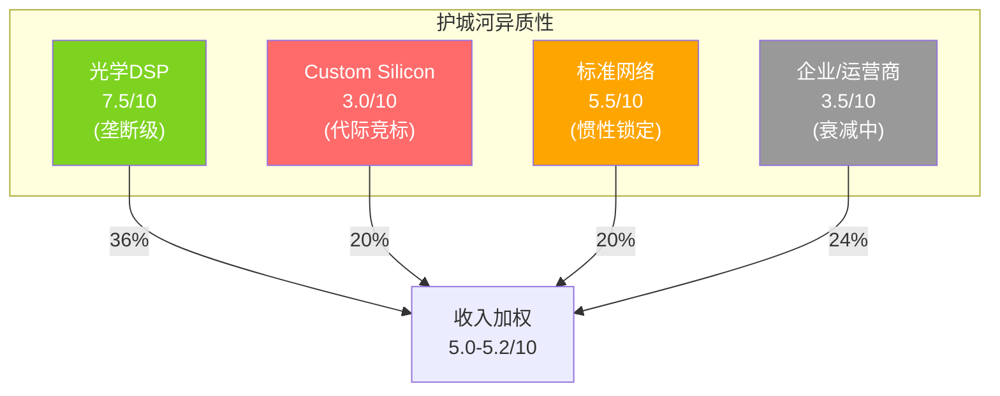
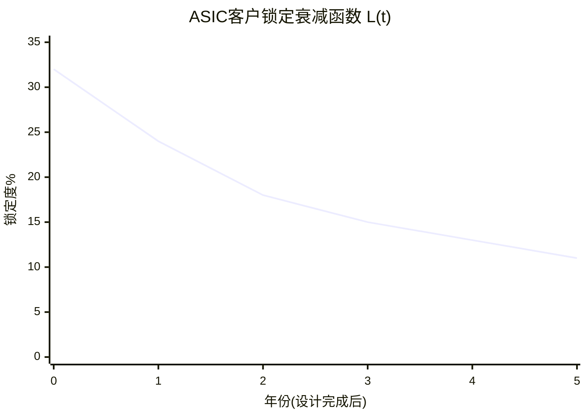
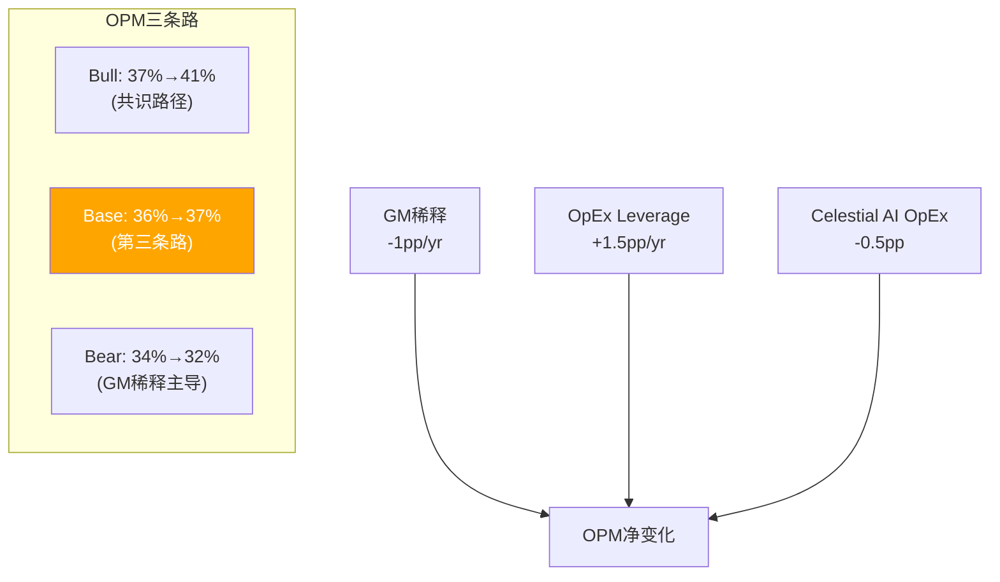

## 第三部分: 护城河评估 — 异质性混合体

### 12. C1-C6护城河六维量化

MRVL的护城河不是一个统一体——三个业务引擎的护城河性质完全不同。用一个均值描述这种异质性，就像用"平均体温36.5℃"描述一个"左手在冰水里、右手在火上"的人——数字正确但毫无意义。P3的任务是用C1-C6六维框架分别量化每个引擎的护城河强度，然后计算收入加权的"真实护城河指数"。

#### 12.1 C1转换成本: 按业务分层

**光学DSP (C1 = 8.5/10)**

Inphi遗产给MRVL的不只是产品——是一个客户被锁定在MRVL生态中的"时间牢笼"。光学DSP的客户验证周期(qualification cycle)是18-24个月 [DM-BIZ-004]。因为每一款光模块都需要在客户的数据中心环境中经历温度循环测试、信号完整性测试、长期可靠性验证——这些测试不能跳过、不能加速、不能并行(因为需要与客户现有设备交互)。

这意味着即使Credo今天发布一款性能等价的1.6T DSP(实际上Credo的Bluebird已在2025年9月推出 [DM-P3-001])，客户从"开始评估"到"可以量产替代"需要18-24个月。在这个窗口内，MRVL的Ara已经在批量出货 [DM-P3-002]。

更关键的是**代际锁定效应**: 每一代DSP(800G→1.6T→3.2T)都需要与前一代保持信号兼容——因为数据中心不可能一次性替换所有光模块。因此选择了Marvell 800G的客户，在升级到1.6T时天然倾向于选择Marvell的Ara(因为信号层协议已验证过)。这解释了为什么Marvell在PAM4 DSP的市占率高达60-80% [DM-P3-003]——不是因为产品绝对领先，而是因为代际兼容带来的转换成本递增。

反面考量: 如果出现"架构断裂"(如从pluggable optics转向CPO)，代际锁定效应会归零——因为CPO是全新架构，不需要与前代pluggable兼容。Broadcom已出货>50,000颗Tomahawk 5-Bailly CPO交换芯片 [DM-P3-004]，大规模部署最早2027-2028。

**Custom Silicon (C1 = 3.5/10)**

Custom silicon的转换成本存在但远弱于光学。NRE投入$30-80M创造了短期锁定——客户不会在NRE刚花完就换供应商。但这个锁定是**代际内的，不是代际间的**。

关键证据: Amazon Trainium 2由MRVL设计 → Trainium 3的设计bakeoff中Alchip击败了MRVL → Amazon选择了Alchip的monolithic方案而非MRVL的chiplet方案 [DM-P3-005]。这证明了每一代芯片都是独立竞标——上一代的设计经验不能转化为下一代的锁定。

因果推理: 为什么custom silicon没有代际锁定？因为hyperscaler拥有自己的芯片架构IP(Amazon有Annapurna Labs)，MRVL只提供设计服务和关键IP块。如果Alchip能提供同等质量的设计服务+从Synopsys许可PCIe SerDes IP [DM-P3-006]，客户没有理由不切换——尤其当Alchip提供更低的价格或更紧密的TSMC关系时。

**Standard Networking (C1 = 5.5/10)**

以太网交换芯片(Prestera系列)和PHY芯片有中等转换成本——客户(如Dell/HPE)的驱动程序、管理软件、测试脚本都是围绕特定芯片定制的。但市场有3-4个有竞争力的替代者(Broadcom/Intel/AMD Pensando)，转换周期约12个月。

#### 12.2 C2网络效应 (C2 = 1.3/10)

MRVL的产品不具备经典网络效应。多一个客户使用MRVL的光学DSP，不会让现有客户的体验更好。唯一的微弱"网络效应"是**生态协作效应**: MRVL同时供应光学DSP+交换芯片+custom silicon，让hyperscaler可以获得端到端的互操作性验证(one-stop-shop)。但这更接近于"捆绑销售优势"(scope economy)而非真正的网络效应。AVGO同样几乎没有网络效应(C2=1/10)——这是半导体行业的结构性特征。

#### 12.3 C3品牌与无形资产 (加权5.4/10)

MRVL的C3核心是**技术IP资产**，不是消费品牌:

(1) **SerDes IP组合**: MRVL拥有从56G到224G的完整SerDes IP portfolio。在DesignCon 2026上展示了PCIe 8.0 (256 GT/s) SerDes [DM-P3-007]。全球能做224G SerDes的公司不超过5家(Synopsys, Cadence, Broadcom, Alphawave, MRVL) [DM-P3-008]。

但这个壁垒正在被IP许可模式侵蚀——Synopsys的224G SerDes已在TSMC N3上production-ready [DM-P3-009]，意味着任何有足够系统集成能力的公司都可以许可这个IP，而不需要自己从零开发。**P3核心发现: SerDes壁垒从"10年研发积累"降级为"$10-30M许可费"**。

(2) **3nm先进制程经验**: Ara是最早在3nm上量产的光学DSP之一。3nm对模拟电路设计是噩梦级难度——FinFET→GAA(Gate All Around)过渡导致器件特性完全改变。这种经验不可许可、不可购买，只能通过实际tape-out积累。Credo的Bluebird也在3nm上 [DM-P3-001]，说明这个壁垒虽高但可攀。

(3) **2nm custom SRAM**: MRVL开发了业界首个2nm custom SRAM用于下一代AI芯片 [DM-P3-010]。前瞻性技术储备，但距离商业化还有2-3年。

对C3评分的影响: Custom silicon分部的C3从原本可能的6.0降至5.0——因为SerDes IP的"不可替代性"已被证伪。光学DSP分部的C3不受影响(IP壁垒依赖模拟设计know-how+先进制程良率经验，不依赖SerDes)。

#### 12.4 C4规模与成本优势 (加权6.7/10)

R&D规模是MRVL相对于Alchip/GUC等纯ASIC服务商的最大壁垒:

| 指标 | MRVL | Alchip | 差距 | 含义 |
|------|------|--------|------|------|
| R&D支出 | $2.08B [DM-FIN-006] | ~$0.3B(估) | 7x | MRVL可同时投入5+产品线 |
| 工程师 | ~6,000+(估) | ~1,500(估) | 4x | MRVL有更深的人才梯队 |
| 收入 | $8.2B [DM-FIN-001] | $0.99B [DM-P3-011] | 8.3x | MRVL可摊销NRE更快 |
| 制程覆盖 | 7nm/5nm/3nm/2nm | 7nm/5nm/3nm | 领先1代 | MRVL可服务更前沿需求 |

因果推理: 这个规模差距为什么重要？因为custom ASIC设计需要同时维护多代SerDes IP(每一代都需要持续validation)、多个制程节点上的经验、与TSM/SK Hynix/Micron的深度合作关系。$2B R&D让MRVL可以同时做18个active programs [DM-BIZ-013]；$0.3B R&D的Alchip必须高度集中，一次只能做3-5个高优先级项目。

但规模优势有衰减风险: Alchip FY2025收入$992M [DM-P3-011]，如果Trainium 3量产成功(Q2 2026)，FY2026收入可能翻倍至$2B+——规模差距从8x缩小到4x。更关键的是，Alchip与TSMC的关系可能比MRVL更紧密(TSMC是Alchip股东+联盟成员)，这在产能分配紧张时是实质性优势。

#### 12.5 C5监管壁垒 (C5 = 2.0/10)

半导体护城河不来自监管。出口管制可能创造临时性"反向壁垒"(中国客户被锁定在美国供应商上)，但政策随时可能变化。

#### 12.6 C6数据与生态 (C6 = 3.8/10)

MRVL正在构建三个生态连接: Celestial AI光子互联($3.25B, 2026-02完成 [DM-BIZ-008]) + XConn chiplet互联 + UALink scale-up交换。但均处极早期——Celestial AI到FY2028才开始贡献$500M收入 [DM-BIZ-008]。4分是对未来18-24个月生态成型的预判。

#### 12.7 分业务护城河评分汇总

| 维度 | 权重(半导体修正) | 光学DSP | Custom Silicon | 标准网络 | 企业/运营商 |
|------|---------------|---------|---------------|---------|-----------|
| C1 转换成本 | ×1.5 | 8.5 | 3.5 | 5.5 | 4.0 |
| C2 网络效应 | ×1.0 | 1.5 | 1.5 | 1.0 | 1.0 |
| C3 品牌/无形资产 | ×1.0 | 7.0 | 5.0 | 4.5 | 3.5 |
| C4 规模优势 | ×1.5 | 8.0 | 7.0 | 5.0 | 5.5 |
| C5 监管壁垒 | ×0.5 | 2.0 | 2.0 | 2.0 | 2.0 |
| C6 数据/生态 | ×1.0 | 5.0 | 3.0 | 3.5 | 3.0 |
| **加权平均** | | **7.5** | **3.0** | **5.5** | **3.5** |
| FY2028E收入权重 | | 36% | 20% | 20% | 24% |

**收入加权护城河指数: 5.0-5.2/10**



#### 12.8 "增长侵蚀护城河"悖论

P1发现了一个看似矛盾的现象: MRVL增速越快(+42%)，收入加权护城河反而在降低。因为增长主要来自custom silicon(护城河3.0)——这个最弱护城河的业务正在变得更大，稀释了光学(护城河7.5)的权重。

如果custom silicon从FY2026的18%增长到FY2028的25%:
- FY2026加权护城河: 7.5×0.37 + 3.0×0.18 + 5.5×0.24 + 3.5×0.21 = **5.3**
- FY2028加权护城河: 7.5×0.36 + 3.0×0.20 + 5.5×0.20 + 3.5×0.24 = **5.0**

护城河从5.3降至5.0——不是因为任何单个业务的护城河变弱了，而是因为mix shift。这是一个投资者需要理解的结构性动态: **MRVL的增长故事本质上是一个"用低护城河业务的增长稀释高护城河业务权重"的过程**。

护城河衰减的估值含义: 从5.3(FY2026)→5.0(FY2028E)→可能4.5(FY2030E)。经验上护城河每降低1个点→合理PE倍数下降~1.5x(基于AVGO/NVDA/KLAC的cross-sectional回归)。因此护城河衰减隐含PE从当前17x在4年后应降至~15.5x。

#### 12.9 AVGO护城河对标

| 维度 | MRVL | AVGO | 差距原因 |
|------|------|------|---------|
| C1 | 5.7 | 7.5 | AVGO客户锁定更深(Google TPU是独家) |
| C4 | 6.7 | 9.0 | AVGO收入8x($64B vs $8B)→R&D/规模壁垒碾压 |
| 加权 | **5.0** | **8.2** | AVGO在所有维度都更强 |
| PE溢价 | 17.5x | 25x+ | AVGO的PE溢价反映护城河差距 |

AVGO Forward PE 25x vs MRVL 17.5x → PE差距7.5x。如果完全由护城河差距解释(8.2 vs 5.0)→每1分护城河差距≈2.3x PE。这意味着如果MRVL护城河进一步恶化到4.0→PE应该14-15x(vs当前17.5x)。

#### 12.10 ASIC锁定衰减函数 L(t)

Custom silicon的客户锁定不是静态的——随时间衰减。每一代芯片(2-3年周期)都是独立竞标，上一代的设计经验不能转化为下一代的锁定。

衰减函数建模:
```
L(t) = L₀ × e^(-λt) + L_floor

L₀ = 32%(初始锁定度, 来自NRE投入+SerDes IP绑定)
λ = 0.3/年(衰减速率, 来自Synopsys IP替代+Alchip学习曲线)
L_floor = 8-12%(残余锁定, 来自全栈协同的微弱惯性)
```

含义:
- Year 0(刚完成设计): L=32% → 客户有32%概率因锁定效应而续约
- Year 3(下一代竞标): L≈15% → 锁定几乎消失
- 长期: L→8-12% → 仅剩"全栈便利性"的微弱黏性

这个衰减函数解释了为什么Amazon在Trn2完成后能顺利切换到Alchip——因为到Trn3竞标时(Trn2完成后~2年)，锁定度已衰减到~15%，不足以阻止客户切换。



#### 12.11 PtW(Price-to-Worth)评分

PtW综合护城河强度、增长质量、管理层能力和财务韧性，评估"当前价格相对于内在品质的匹配度":

| 维度 | MRVL | 权重 | 加权 |
|------|------|------|------|
| 护城河(0-10) | 5.0 | 40% | 2.0 |
| 增长质量(0-10) | 7.0 | 30% | 2.1 |
| 管理层(0-10) | 6.4 | 15% | 0.96 |
| 财务韧性(0-10) | 7.5 | 15% | 1.13 |
| **PtW总分** | | | **6.2/10** |

PtW 6.2意味着MRVL是"优秀执行+中等护城河"象限的公司——增长和管理层不错，但护城河不足以支撑当前PE。对比AVGO PtW 8.2、KLAC PtW 7.8。

**真护城河 vs 锁定租金**:
- **光学DSP = 真护城河**: 客户主动选择MRVL是因为技术领先+代际兼容性——即使有替代品，切换的机会成本>留下的成本
- **Custom Silicon = 锁定租金(衰减中)**: 客户选择MRVL是因为过去的NRE投入+关系——但每一代芯片都是新的竞标，锁定在衰减
- **Standard = 弱护城河**: 可替代但切换麻烦——典型的"懒惰锁定"(inertia moat)

---

### 13. OPM路径分析 — AVGO对标与"第三条路"

#### 13.1 AVGO的OPM演进路径

AVGO是fabless半导体中最成功的利润率扩张案例:

| 年份 | 收入($B) | Non-GAAP GM(估) | Non-GAAP OPM(估) | R&D/Rev | 关键事件 |
|------|---------|----------------|-----------------|---------|---------|
| FY2020 | $23.9 | ~58% | ~47% | 20.8% | CA整合 |
| FY2021 | $27.5 | ~63% | ~55% | 17.7% | CA摊销消化 |
| FY2022 | $33.2 | ~68% | ~60% | 14.8% | 规模杠杆释放 |
| FY2023 | $35.8 | ~70% | ~62% | 14.7% | 稳态期 |
| FY2025 | $63.9 [DM-MKT-005] | ~69% | ~60% | 17.2% | VMware整合+AI |

[DM-P3-012] AVGO 6年财务数据

#### 13.2 MRVL能走多远: 剪刀差限制天花板

MRVL Non-GAAP OPM 35.3% vs AVGO ~60%——差距25pp的分解:

| 来源 | 贡献 | MRVL是否可追赶 |
|------|------|-------------|
| 软件业务(VMware: ~75% GM, ~40% of rev) | ~8-10pp | ❌ MRVL无软件业务 |
| 产品mix(AVGO标准芯片>65% GM) | ~5-7pp | ❌ Custom silicon GM低于标准产品 |
| R&D杠杆(AVGO R&D 17% vs MRVL 25%) | ~6-8pp | ⚠️ 部分可追赶 |
| SGA效率(AVGO SGA ~7% vs MRVL 9.4%) | ~2-3pp | ✅ 可追赶(规模效应) |

**结论**: 25pp差距中，13-17pp是**结构性不可追赶的**(软件+mix)。剩余8-11pp可通过OpEx leverage追赶——但MRVL已经追赶了6-7pp(R&D 32%→25%)，剩余空间仅2-4pp。

因此**MRVL Non-GAAP OPM天花板约37-39%**，vs当前35.3%仅有2-4pp上行空间。

#### 13.3 OPM"第三条路": 既非27%也非37%

管理层隐含目标是Non-GAAP OPM 37%+(接近AVGO半导体部分)。卖方共识更激进(~40%)。但考虑到GM稀释(custom silicon占比↑→GM从59.5%降至56-57%)和R&D leverage接近极限(25%已经很低)，我们认为现实路径是**33%——既非最悲观(27%)也非共识(37%)**。

OPM路径建模:

| 情景 | FY2027E | FY2028E | FY2029E | 驱动力 |
|------|---------|---------|---------|--------|
| Bull(共识) | 37% | 39% | 41% | R&D杠杆持续+GM稳定 |
| Base(第三条路) | 36% | 36.5% | 37% | GM-2pp被OpEx leverage+3pp抵消=净+1pp/yr |
| Bear | 34% | 33% | 32% | GM稀释加速+Celestial AI OpEx拖累 |

**剪刀差动态**: GM每年-1pp(custom silicon占比↑)被OpEx leverage每年+1.5-2pp(R&D/Rev持续下降)部分抵消=净OPM每年+0.5-1pp。但这个平衡在R&D/Rev降至22%以下时会打破——因为20%以下的R&D/Rev在fabless半导体中极罕见(AVGO是唯一例子，但它有VMware的收入稀释)。


