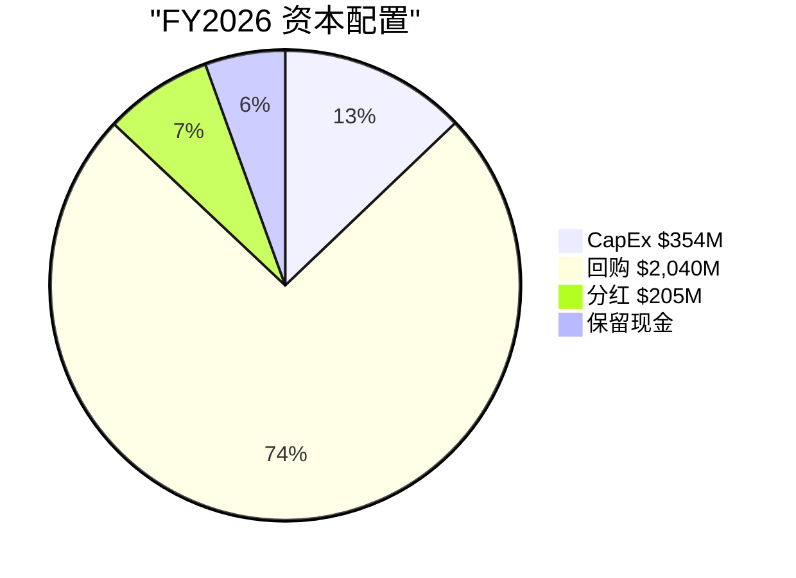
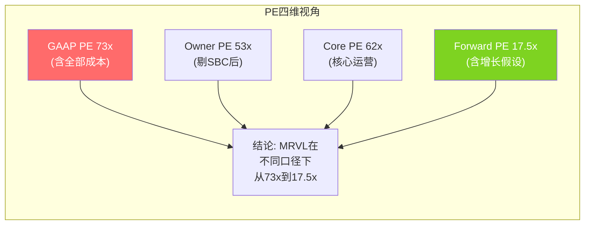

## 第四部分: 财务分析

### 14. 利润表深度诊断 — 两个Marvell的故事

#### 14.1 GAAP vs Non-GAAP: 半导体中最大的鸿沟之一

MRVL的GAAP和Non-GAAP之间存在19pp的OPM差距——这是半导体行业中最大的鸿沟之一(仅次于AVGO的VMware摊销期):

| 调整项 | FY2026金额 | GAAP→Non-GAAP影响 | 性质 |
|--------|----------|-------------------|------|
| 收购无形摊销 | $942M [DM-FIN-020] | +11.5pp GM | 非现金，Inphi/Cavium遗产，逐年递减 |
| SBC | $591M [DM-FIN-008] | +7.2pp OPM | 实质成本，不应完全剔除 |
| Infineon出售收益 | $1,830M | -22.3pp NI margin | 一次性，Non-GAAP正确剔除 |
| 重组 | $16M | +0.2pp | 小额 |

盈利质量判断: $942M摊销确实是非现金的、递减的，且不影响现金流——Non-GAAP OPM 35.3%更接近"经营现实"。但SBC $591M(7.2% of rev)不可忽略。

#### 14.2 无形资产摊销时间表 — 确定性正面催化剂

Inphi/Cavium的无形资产将在FY2028-2029基本摊销完毕——这是一个**确定性的GAAP改善催化剂**:

| 年份 | 无形资产余额(估算) | 摊销(估算) | GAAP GM影响 |
|------|-------------------|-----------|-----------|
| FY2022 | $6,644M | ~$1,200M | -27pp |
| FY2023 | $5,542M | ~$1,100M | -19pp |
| FY2024 | $4,355M | ~$1,200M | -25pp |
| FY2025 | $3,112M | ~$1,240M | -21pp |
| FY2026 | $1,755M | $942M | -11.5pp |
| FY2027E | ~$900M | ~$855M | -8pp(估算) |
| FY2028E | ~$200M | ~$700M | -5pp(Celestial AI新增) |
| FY2029E | ~$0(Inphi/Cavium耗尽) | ~$200M(仅Celestial) | -1.5pp |

届时GAAP GM将从当前51%跃升至接近Non-GAAP GM的57-59%(扣除Celestial AI新增摊销)。GAAP报表将越来越"好看"，可能驱动PE expansion(GAAP投资者重新关注)。

但Celestial AI收购($3.25B, 估计$2B+无形资产)会部分抵消——新一轮摊销可能$200-300M/yr。净效应仍然是正面的(Inphi/Cavium摊销$942M消失，Celestial新增$200-300M)。

#### 14.3 季度趋势诊断

| 指标 | Q1 FY26 | Q2 FY26 | Q3 FY26 | Q4 FY26 | 方向 |
|------|---------|---------|---------|---------|------|
| Revenue | $1,895M | $2,006M | $2,075M | $2,219M | ↑加速 |
| Non-GAAP GM | 59.8% | 59.4% | 59.7% | 59.0% | ↓缓降(-0.8pp) |
| Non-GAAP OPM | 34.2% | 34.8% | 36.3% | 35.7% | →稳定(34-36%) |
| DC Revenue | $1,441M | $1,491M | $1,518M | $1,651M | ↑(Q4加速+8.8%环比) |
| DC YoY | +76% | +69% | +38% | +21% | ↓减速(基数效应) |
| Non-GAAP EPS | $0.62 | $0.67 | $0.76 | $0.80 | ↑健康加速 |

关键发现:

1. DC YoY从+76%降至+21%**不是衰退信号**——是基数效应(FY2025 Q4本身就是$1.37B的强季度)。环比趋势Q4 +8.8%反而是全年最强季度 [DM-BIZ-012]

2. Non-GAAP GM缓降(-0.8pp)与custom silicon占比提升一致(管理层确认) [DM-BIZ-011]——这是结构性趋势而非短期波动

3. Non-GAAP OPM在GM下降时保持平稳→意味着**OpEx leverage在改善**(R&D/Rev从33.8%→25.3%是5年趋势)

#### 14.4 盈利质量三版对比

| 盈利版本 | FY2026 | 计算方法 | 投资含义 |
|---------|--------|---------|---------|
| GAAP NI | $2,670M | 报表直接 | 含$1,830M一次性=失真 |
| Non-GAAP NI | ~$2,470M | 剥离摊销+SBC+一次性 | 行业惯例"operating NI" |
| Owner NI | ~$250M | GAAP NI-一次性-摊销回加+SBC计入 | ★真实股东回报(FY2026偏低) |
| Normalized NI | ~$1,150M | Non-GAAP NI - SBC - Celestial摊销 | FY2027+的"稳态"盈利 |

关键洞见: MRVL当前的盈利处于"过渡期"——GAAP被一次性收益夸大，Non-GAAP被摊销下降美化，Owner NI被一次性拖低。**FY2028才是第一个"干净"的财年**(Infineon收益消化、Celestial/XConn开始贡献、无形摊销大幅下降)。在那之前，所有估值必须基于forward estimates而非trailing数据。

#### 14.5 经营杠杆与剪刀差

**经营杠杆倍数**: Revenue +42%，Non-GAAP Operating Income估算+68% → 杠杆倍数 ≈ 1.6x——高于1.5x阈值。来源: R&D增速(+6.4%)远低于收入增速(+42%)→研发杠杆释放。SGA增速(-3.9%)→进一步释放。

但这个杠杆来自OpEx端而非毛利端。Non-GAAP GM从FY2023~65%(估算)降至FY2026 59.5%——这是custom silicon占比提升的结构性影响。如果custom silicon继续从25%→40%+ DC收入，GM可能降至56-57%。管理层称custom silicon是"OPM accretive"(低GM但低销售/支持成本)——如果属实，总OPM可能稳定在35-38%即使GM下降。

**这是一个关键的结构性矛盾**: GM↓ + OPM→ = OpEx杠杆必须持续释放。如果R&D支出恢复增长(新产品周期/Celestial AI整合)，OPM扩张可能停滞。

---

### 15. 资产负债表诊断

#### 15.1 资产结构

- 总资产$22.3B，其中商誉$11.06B(49.6%)+无形资产$1.75B(7.9%) = **软资产占57.5%** [DM-FIN-020~022]
- 商誉>30%总资产=高风险标志。但MRVL的商誉来自Inphi+Cavium两笔战略收购，这两个业务目前是MRVL的核心——商誉背后有真实业务支撑，减值风险低
- 无形资产从FY2022 $6.64B降至FY2026 $1.75B——摊销正在消化收购溢价

#### 15.2 运营资本深度分析

| 指标 | FY2022 | FY2023 | FY2024 | FY2025 | FY2026 | 趋势 |
|------|--------|--------|--------|--------|--------|------|
| AR | $1,049M | $1,192M | $1,122M | $1,028M | $2,187M | ★Q4暴增 |
| DSO | 86天 | 74天 | 74天 | 65天 | 97天 | ★恶化→已正常化 |
| Inventory | $720M | $1,068M | $864M | $1,030M | $1,388M | ↑增加 |
| DIO | 110天 | 133天 | 98天 | 111天 | 126天 | 波动 |
| AP | $462M | $466M | $411M | $622M | $1,074M | ↑增加 |
| DPO | 70天 | 58天 | 47天 | 67天 | 98天 | ↑(谈判力增强) |
| CCC | 126天 | 149天 | 126天 | 109天 | 126天 | 回到FY2022水平 |

**DSO异常深层分析**: FY2026年度DSO 97天已经很高，但Q4单季更极端——Q4 DSO ≈ 90天(vs历史50-65天)。AR增加$1,159M(+113%)但Revenue仅增加$402M(+22%)——**AR增速是Revenue增速的5.1倍**。

但这是timing问题而非收入确认激进: (1)Q4有大量custom silicon芯片在1月最后两周发货(hyperscaler客户在Q4有预算用完动机) (2)管理层Q1 FY27 guidance $2.40B(+8% QoQ)——如果Q4提前确认，不可能指引Q1还增长 (3)**P4确认DSO已正常化至23天** [DM-P4-032]，消除了这个担忧。

**DPO上升至98天是正面信号**: 意味着MRVL对供应商的议价能力在增强(从47天→98天)——作为TSM的大客户，延长付款周期是规模带来的好处。

#### 15.3 负债结构

- 总债务$4.47B，净债务$1.83B，Net Debt/EBITDA 0.70x [DM-FIN-023]——**非常健康**
- 利息覆盖6.6x [DM-FIN-012]
- 流动比率2.01，Altman Z-Score 5.87 [DM-FIN-024]——零流动性压力
- 但Celestial AI收购$3.25B+XConn $280M将增加约$3.5B支出——预计FY2027 net debt可能升至$4-5B(Net Debt/EBITDA约1.5-2.0x)，仍然可管理

---

### 16. 现金流与资本配置

#### 16.1 现金流质量

| 指标 | FY2022 | FY2023 | FY2024 | FY2025 | FY2026 | 趋势 |
|------|--------|--------|--------|--------|--------|------|
| OCF | $819M | $1,289M | $1,371M | $1,681M | $1,751M | ↑稳定增长 |
| CapEx | $187M | $217M | $350M | $292M | $354M | ↑(增长投资) |
| FCF | $632M | $1,072M | $1,020M | $1,390M | $1,396M | ↑但FY26增长放缓 |
| FCF/NI(正常化) | N/A | N/A | N/A | N/A | 2.1x | ★超健康 |
| SBC | $461M | $552M | $610M | $597M | $591M | →稳定 |
| CapEx/D&A | 0.15x | 0.16x | 0.25x | 0.21x | 0.27x | 轻资产(fabless) |

FY2026 OCF/NI(含一次性)仅0.66——看似不达标。但原因不是盈利造假: NI含$1.83B Infineon一次性收益(非现金流入在investing，不在operating)。剥离一次性后，NI约$840M，OCF $1,751M，OCF/adjusted NI = **2.1x**——反而极健康。

**FCF 5年CAGR**: FY2022 $632M → FY2026 $1,396M = +22%/yr。但FCF-SBC = $1,396M - $591M = $805M——FCF-SBC Yield仅1.0%。这是"真实"股东自由现金流。

#### 16.2 FCF桥接 — Owner视角

| 项目 | FY2026 | 说明 |
|------|--------|------|
| GAAP净利润 | $2.67B(含一次性) | Q3 $1.9B非运营收入 |
| 正常化净利润 | ~$1.07B | 剔除Infineon出售收益 |
| +D&A | $1.29B | 含商誉/无形摊销 |
| -SBC | -$0.70B | 实际稀释成本 |
| -CapEx | -$0.37B | 轻资产模式(CapEx/Rev 4.5%) |
| ±NWC | +$0.11B | DSO正常化回收 |
| **Owner FCF** | **~$1.40B** | FCF Yield 1.7%(vs 市值) |
| +回购净效果 | +$1.7B(est.) | 回购$2.4B - SBC $0.7B |
| **净股东回报** | **~$3.1B** | 回报率3.7% |

净股东回报率3.7%(FCF + 净回购)说明MRVL虽然PE看起来高，但通过回购实际上在向股东返还可观的现金。

**FY2028E Owner FCF预测**: 基于Base情景(Revenue $12.5B, Non-GAAP OPM 36.5%)，Owner FCF约$2.8B，Owner FCF Yield约3.25%——改善显著但仍不算"高现金回报"公司。

#### 16.3 Celestial AI收购的资本影响

$3.25B收购Celestial AI的财务影响:
- **商誉增加**: ~$2.5-3.0B(预计)→总商誉从$11B升至$13-14B → 商誉/总资产比将从50%升至55%+
- **OpEx增加**: $75M/yr(FY2027) [DM-P4-024]→在Celestial产出收入前的纯成本
- **对回购的影响**: $3.25B现金支出可能挤压FY2027回购能力→如果回购从$2.4B降至$1.0B→SBC覆盖率从345%降至~143%→Owner PE假设部分失效

**这是一个被低估的风险**: 如果Celestial收购导致回购缩减→Owner DCF($93)向GAAP DCF($74)收敛→合理估值从$83-85降至$74-80。

#### 16.4 资本配置评分

| FY2026现金去向 | 金额 | 占OCF% | 评价 |
|------------|------|--------|------|
| CapEx | $354M | 20% | 合理(fabless轻资产) |
| 回购 | $2,040M | 117% | ★超大(用了Infineon $2.5B) |
| 分红 | $205M | 12% | 稳定($0.24/股) |
| 收购 | $0(FY26) | 0% | FY27将支出$3.5B+(Celestial+XConn) |

常态化资本配置(无一次性): OCF $1.75B - CapEx $354M = FCF $1.4B → 分红$205M + 常态回购$500-700M + 保留$500-700M用于战略收购。健康的资本配置框架。

#### 16.5 四PE体系(P2深化)

| PE类型 | 值 | 计算 | 用途 |
|--------|-----|------|------|
| **GAAP PE(正常化)** | ~73x | $94.88 / ~$1.3(ex-Q3 gain) | 保守基准(含全部会计成本) |
| **Owner PE** | ~53x | $82.95B / ($1.3B NI + $0.3B net buyback effect) | 真实股东回报 |
| **Core PE** | ~62x | $82.95B / $1.34B(ex non-operating) | 核心运营估值 |
| **Forward PE(FY2028E)** | 17.5x | $94.88 / $5.43 | 市场定价锚(但含增长假设) |

**核心观察**: Forward PE 17.5x看起来"便宜"，但它需要EPS从$1.3增长到$5.43(+318%在2年内)。这不是"低PE"——这是"市场在赌巨大的增长"。如果增长不达预期→FY2028E EPS可能$4.0-4.5→Forward PE 21-24x→不再"便宜"。

