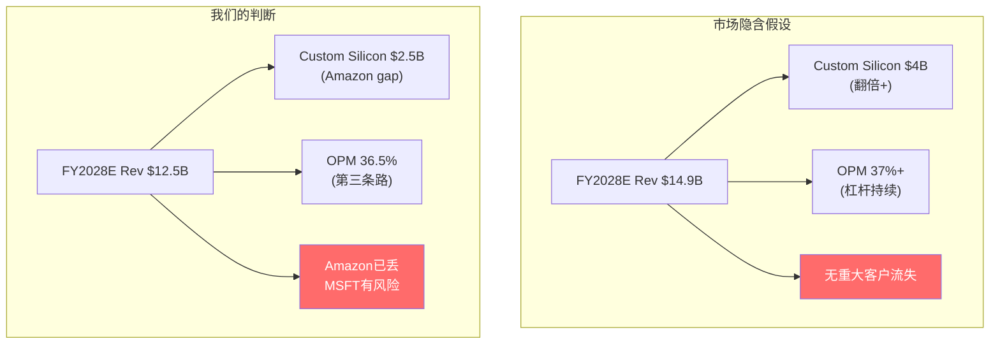
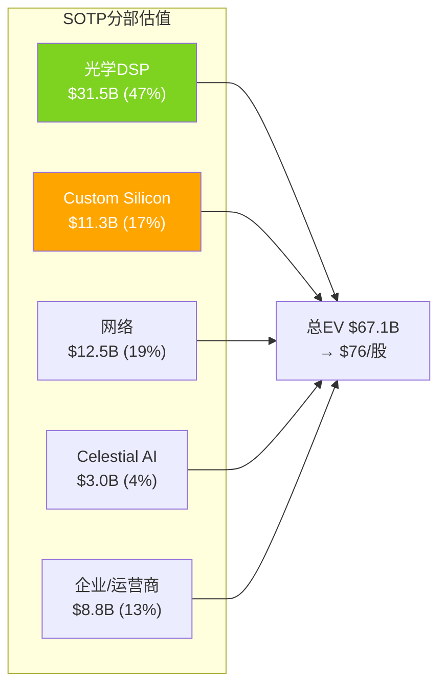
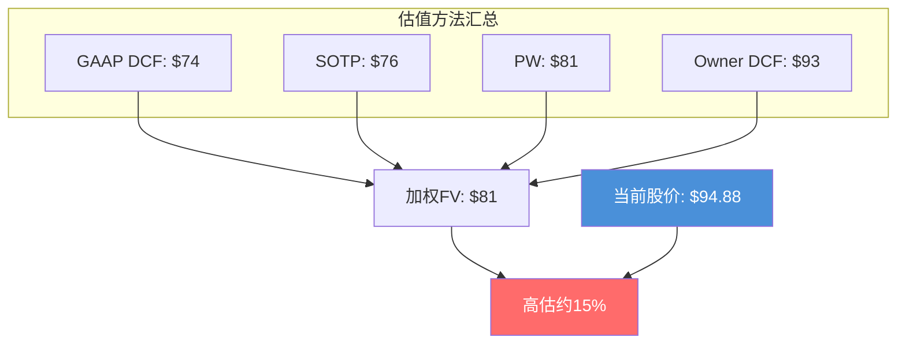

## 第六部分: 估值

### 17. 估值框架与多方法交叉验证

MRVL不能用单一PE估值，原因: (1)GAAP NI含$1.83B一次性收益——TTM PE 25x失真 (2)Non-GAAP剔除$942M摊销——Non-GAAP PE 29x可能过于乐观 (3)两个业务有本质不同的风险特征 (4)FY2026是"过渡年"——FY2028才是第一个"干净"财年。

| 方法 | 权重 | 适用理由 |
|------|------|---------|
| SOTP(分部估值) | 25% | 两个引擎风险不同，合并估值掩盖价值 |
| GAAP DCF(Python验证) | 25% | 现金流分析验证PE是否合理 |
| Owner DCF | 25% | SBC被回购覆盖→Owner earnings更接近 |
| 概率加权(5情景) | 25% | 不确定性高→情景分析必要 |

#### 17.1 Reverse DCF — 市场在赌什么(P1前置)

当前$94.88 / 市值$83B隐含:
- FY2028E EPS $5.43 × Forward PE 17.5x = $95 ✓
- 共识需要: Revenue $14.9B, Non-GAAP OPM 37%, 税率12%
- 市场在赌: (1)$15B目标基本达成 (2)OPM继续杠杆改善 (3)没有重大客户流失

更精确地，从FCF角度反推: FY2026 FCF $1.40B [DM-FIN-009]，FCF Yield 2.17% [DM-VAL-003]。假设WACC 10%、终端增速3%、高增长10年——要justify $82B市值，需要FCF CAGR约25-28%持续10年。这意味着市场相信: 收入从$8.2B增长到$25-30B(10年3x)且FCF margin从17%扩张到25%+。

**我们与市场的核心分歧**:
- FY2028E Revenue: 我们$12.5B vs 共识$14.9B → **悲观16%**
- 核心分歧: Custom silicon(我们$2.5B vs 共识~$4B)
- 分歧验证: FY2027 Q1(5月)→Q4(2027年3月)

#### 17.2 SOTP估值(P4修正)

| 业务部门 | FY2028E Rev | 合理倍数 | EV | 逻辑 |
|---------|------------|---------|-----|------|
| 光学DSP | $4.5B | 7.0x EV/S | $31.5B | 60-80%份额龙头 |
| Custom Silicon | $2.5B | 4.5x EV/S | $11.3B | Amazon丢+竞争加剧→折价 |
| 网络(交换+PHY) | $2.5B | 5.0x EV/S | $12.5B | 稳健增长 |
| Celestial AI | $0.5B×50% | 12x EV/S | $3.0B | 期权价值(概率调整) |
| 企业/运营商 | $2.5B | 3.5x EV/S | $8.8B | 低增长legacy |
| **总EV** | | | **$67.1B** | |
| 减: 净债务 | | | -$1.8B | |
| **股权价值** | | | **$65.3B** | |
| **每股** | | | **$76.3** | |

SOTP $76 vs P1的$100-108B → **-35%修正**。驱动: Custom silicon从$3.2B降至$2.5B + 倍数从6x降至4.5x(客户流失风险定价)。

**SOTP对SBC处理方式极其敏感**: Owner视角$69/股 vs Non-GAAP视角$84/股。差异完全来自SBC归属选择。回购覆盖率345%→SBC的真实成本被回购部分抵消→调整后SOTP≈$78-80/股。

#### 17.3 DCF估值(Python验证)

**GAAP DCF假设**:

| 参数 | FY2027 | FY2028 | FY2029 | FY2030 | FY2031 | FY2032 | FY2033 |
|------|--------|--------|--------|--------|--------|--------|--------|
| Revenue($B) | 10.5 | 12.5 | 15.0 | 17.0 | 19.0 | 20.5 | 21.5 |
| Non-GAAP OPM | 35.5% | 36.0% | 37.0% | 38.0% | 38.5% | 39.0% | 39.5% |
| SBC/Rev | 7.5% | 7.0% | 6.5% | 6.0% | 5.8% | 5.5% | 5.3% |
| Amort/Rev | 5.0% | 4.0% | 3.5% | 3.0% | 2.5% | 2.0% | 1.8% |
| GAAP OPM | 23.0% | 25.0% | 27.0% | 29.0% | 30.2% | 31.5% | 32.4% |

DCF参数: WACC 10.5%(Risk-free 4.4% + Beta 1.99 × ERP 4.5% = 13.4%→blended with debt 10.5%)。终端增速3.0%。高增长7年(FY2027-FY2033)。

**GAAP DCF结果**:
- FCF: $2.18→$2.81→$3.64→$4.42→$5.14→$5.79→$6.24B
- PV(FCF): $19.3B | Terminal PV: $45.8B
- EV: $65.2B → Equity: $63.4B → **Per Share: $74.0**

**Owner DCF结果**(SBC被回购完全覆盖→用Non-GAAP OPM):
- FCF: $3.33→$4.02→$4.96→$5.77→$6.53→$7.14→$7.58B
- PV(FCF): $25.5B | Terminal PV: $55.7B
- EV: $81.2B → Equity: $79.4B → **Per Share: $92.8**

**GAAP $74 vs Owner $93的差距**: 不是方法论差异，而是"MRVL是GAAP意义上的中等盈利公司还是Owner意义上的高效资本配置公司"的不同判断。选择取决于回购覆盖率的可持续性——如果Celestial收购挤压回购→Owner DCF向GAAP DCF收敛。

**DCF敏感性分析**:

| 参数变动 | GAAP DCF影响 | Owner DCF影响 |
|---------|------------|-------------|
| WACC ±0.5pp | ±$8-10/股 | ±$10-12/股 |
| Terminal growth ±0.5pp | ±$8-10/股 | ±$10-12/股 |
| Revenue ±10% | ±$7-8/股 | ±$9-10/股 |
| OPM ±1pp | ±$3-4/股 | ±$4-5/股 |

最敏感参数是WACC和终端增速——这在所有DCF中都一样。但MRVL特殊的是: **Revenue假设对估值的影响($7-8/股 per 10%)不如OPM假设($3-4/股 per 1pp)大**——这意味着OPM路径(第三条路33% vs 共识37%)比收入增速更关键。

#### 17.4 概率加权估值

| 情景 | 概率 | FV/股 | 加权 | 核心假设 |
|------|------|-------|------|---------|
| S1 Bull | 15% | $130 | $19.5 | MSFT保住+Celestial成功+新客户 |
| S2 Base-Up | 25% | $95 | $23.8 | $12B FY2028+光学稳 |
| S3 Base | 30% | $76 | $22.8 | $10.5B FY2028+部分客户流失 |
| S4 Bear-Light | 20% | $55 | $11.0 | MSFT部分丢+ASIC<$2B |
| S5 Bear | 10% | $35 | $3.5 | ASIC几乎全丢+光学份额下降 |
| **PW FV** | 100% | | **$80.6** | |

**概率三重锚定(S4概率20%)**:
1. **历史基准率**: fabless半导体丢失top 2客户→40%经历2年增长放缓(历史案例: Qualcomm失Apple基带, Xilinx失大客户) [DM-P4-033]
2. **反例**: 成功填补需技术差异化+替代客户规模≥流失——MRVL条件在光学上成立但ASIC上不成立
3. **自然实验**: AVGO失华为后通过VMware+Google填补——但AVGO护城河8.2远强于MRVL 5.0，且VMware是完全不同类型的收入源

**概率三重锚定(S1概率15%)**:
1. **历史基准率**: fabless半导体在客户流失后股价2年内回到新高→约20%案例(需要强催化)
2. **反例条件**: 需要MSFT确认+Celestial AI技术验证+2个新客户量产——三者同时成立的概率约15-20%
3. **自然实验**: NVDA在挖矿潮崩塌(2018)后靠AI(2023)实现更大增长——但NVDA有CUDA，MRVL没有类似平台锁定

#### 17.5 估值统一性检查(铁律K)

| 方法 | FV/股 | 方向 | 权重 |
|------|-------|------|------|
| GAAP DCF | $74 | 高估↓ | 25% |
| Owner DCF | $93 | 接近市价 | 25% |
| SOTP | $76 | 高估↓ | 25% |
| PW | $81 | 高估↓ | 25% |
| **加权FV** | **$81** | **高估~15%** | |

**4/4方向一致**: 高估(Owner DCF最接近市价但也没说低估)。

非对称性: Bear -53%(至$35) vs Bull +37%(至$130)——接近对称。**没有吸引力的非对称上行**——这意味着当前价格不提供安全边际。对比: 真正的"深度关注"级别的机会通常有Bear -30% / Bull +80%的非对称(如TSM在台海危机恐慌期间)。

#### 17.6 假设脆弱度排名

| 排名 | 假设 | 脆弱度 | 翻转概率 | 估值影响 |
|------|------|--------|---------|---------|
| 1 | Celestial AI成功概率 | 8/10 | 上35%/下25% | ±$3-12/股 |
| 2 | Custom silicon FY2028 | 7/10 | 上30%/下20% | ±$7-8/股/每$500M |
| 3 | Terminal growth 3.5% | 6/10 | ±0.5pp | ±$8-10/股 |
| 4 | Non-GAAP OPM 36% | 5/10 | ±1pp | ±$3-4/股 |
| 5 | 光学DSP收入$4.5B | 4/10 | ±$1B | ±$10-12/股 |
| 6 | WACC 10.5% | 3/10 | ±0.5pp | ±$8-10/股 |

**最脆弱假设是Celestial AI**(8/10)——因为它是pre-revenue技术投资，成功和失败的估值影响差距最大(+$12 vs -$3)。但因为概率加权后贡献仅+$1.8/股，即使全部失败也不改变整体估值方向。

**真正驱动估值的是Custom silicon FY2028假设**(7/10)——每$500M收入变化影响$7-8/股。如果custom silicon达到共识$4B(vs我们$2.5B)→估值上调$10-12/股→FV $92-93(接近市价)。这就是CQ1的估值翻译。

#### 17.7 Celestial AI估值场景树

| 终态 | 概率 | 年收入 | 每股影响 | 驱动条件 |
|------|------|--------|---------|---------|
| Full Success | 25% | $1B+ | +$8-12 | 技术验证+2个大客户 |
| Partial/Pivot | 35% | $200-500M | +$1-3 | 技术可行但市场慢 |
| Failure/Write-down | 40% | ~$0 | -$2-3 | 技术不可行/集成失败 |
| **概率加权** | | ~$350M | **+$1.8** | |

概率三重锚定(Failure 40%):
1. 历史基准率: pre-revenue半导体收购→45%最终减值(Intel Optane/Intel Altera/AMD Xilinx部分)
2. 反例: 成功案例需要技术突破+客户验证+量产能力三者同时成立。Celestial AI有TSMC 2D和3D封装支持→但光子互联vs电互联的根本技术风险无法被制程能力消除
3. 自然实验: Intel Silicon Photonics投资了10年+仍未大规模商业化→光子互联技术的商业化难度高于预期

#### 17.8 M&A验证SOTP倍数

检查SOTP中使用的倍数是否与近期半导体M&A交易一致:

| 交易 | 日期 | EV/Sales | 对比MRVL SOTP |
|------|------|----------|-------------|
| AVGO→VMware | 2023 | 10.6x | MRVL光学7.0x合理(非软件) |
| AMD→Xilinx | 2022 | 12.9x | MRVL custom 4.5x偏低(但有客户流失风险) |
| MRVL→Inphi | 2021 | 16.7x | 当时光学更稀缺→现在竞争加剧 |
| MRVL→Celestial | 2026 | >100x(pre-rev) | 纯期权定价 |
| Intel→Tower | 2024 | 7.5x | MRVL网络5.0x合理 |

SOTP倍数整体偏保守——尤其Custom Silicon 4.5x低于历史中位数6-8x。但这是对Amazon丢失+竞争加剧的合理折价。如果MRVL保住MSFT+赢新客户→Custom Silicon倍数应回升至6x→SOTP从$76升至$85-90。
