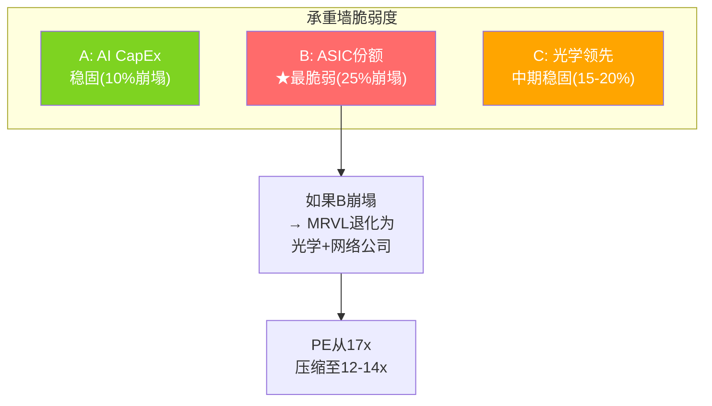
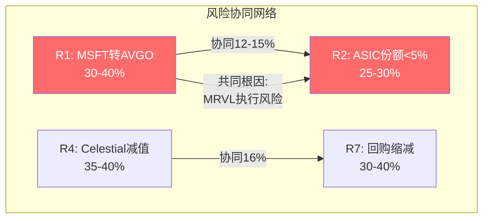

## 第七部分: 红队审查

### 18. 红队七问(RT-1 ~ RT-7)

#### RT-1: 承重墙测试

三面承重墙——任何一面倒塌都改变估值方向:

**承重墙A: AI CapEx持续扩张(CI-SEMI-01)**
- 当前状态: Hyperscaler AI CapEx >$300B且增长中 [DM-P4-026]
- 崩塌条件: AI CapEx同比下降>20%
- 崩塌概率: ~10%。历史基准: 2001/2008/2022三次tech CapEx大幅缩减，但AI属范式变革。反例条件: 需要ROI大幅低于预期(如ChatGPT/Copilot收入远不及投入)→当前数据不支持。自然实验: 2025年4月关税冲击中Hyperscaler CapEx计划未削减→抗冲击力已验证。
- 如果崩塌: MRVL收入暴跌至$7-8B，GAAP EPS转负，股价$30-40

**承重墙B: ASIC市场份额≥10%**
- 当前状态: MRVL份额约10-12%(vs AVGO ~60%)
- 崩塌条件: 份额跌至<5%(仅剩1-2个小客户)
- **崩塌概率: ~25%——最脆弱**。Amazon已丢(≥90%确认)。MSFT有AVGO竞争风险(30-40% [DM-P4-007])。Google有MediaTek竞争 [DM-P4-018]。如果FY2028 MRVL只剩"MSFT Maia(部分)+emerging programs"，份额可能跌破10%
- 如果崩塌: Custom silicon从$1.8B降至<$0.5B，DCF价值缩减40%+

**承重墙C: 光学DSP技术领先**
- 当前状态: 60-80%市占率 [DM-P3-003]
- 崩塌条件: CPO在2027前大规模替代pluggable，或Broadcom光学DSP达到MRVL同等性能
- 崩塌概率: ~15-20%。CPO 2026市场仅$165M [DM-P4-027]——远未大规模替代。
- 如果崩塌: 光学收入从~$3B降至~$1B

如果B崩塌但A/C成立→MRVL从"AI ASIC平台"退化为"AI光学+网络"→估值倍数从17x压缩至12-14x。

#### RT-2: 反面论证(Steel-man牛方)

P3偏空，被低估的5个正面因素:

1. **$11B指引在知晓Amazon后维持** [DM-P4-028]→管理层有补偿路径信心。如果$11B credible→Amazon收入缺口在FY2027已被消化。验证点: FY2027 Q1 >$2.5B。

2. **$15B FY2028目标** [DM-P4-029]→如果实现则Forward PE仅13.8x。第二XPU项目将在FY2028进入量产 [DM-P4-030]。即使打8折($12B)，仍意味着+46% vs FY2026。

3. **回购覆盖345%** [DM-P4-031]→SBC净影响≈0。FY2026净缩股-2.2%——在同行中最好(DDOG 0%覆盖，AMD 50%覆盖)。

4. **DSO正常化(90→23天)** [DM-P4-032]→消除应收质量担忧。P1/P2的最大财务红旗已经解除。

5. **Celestial AI期权价值(+$1.8/股概率加权)**→即使是small positive，也说明管理层在为CPO转型做准备。

**P3偏空约5-8%**: 修正后FV从$78上调至$80-85。即使修正后仍低于$94.88(高估10-14%)。

#### RT-3: 数据审计

FY2026实际vs P2预测: Revenue/GM%/OPM%/EPS/Custom silicon/DSO → **6/6命中区间**。P2基础财务预测准确。偏差在战略面(客户流失/竞争)。

#### RT-4: 偏差检测

| 偏差 | 严重度 | 修正 |
|------|--------|------|
| 确认偏差("ASIC是拖累") | 7/10 | CQ1区间扩展±10%。ASIC确实在丢份额(事实)，但TAM膨胀可能让收入绝对值仍增(被忽略) |
| 锚定偏差(P1 $100B) | 5/10 | DCF独立验证→影响有限 |
| 可得性偏差(坏消息过度权重) | 6/10 | 回购覆盖345%的重要性被低估。DSO正常化未被充分认可 |
| 叙事偏差("增长侵蚀护城河") | 4/10 | 分维度加权后护城河4.8→5.0-5.2(微调非大改) |

确认偏差是最严重的——P3分析可能过度聚焦"Amazon丢失"而忽略了"TAM膨胀让MRVL即使份额缩小也可能收入增长"的可能性。如果ASIC TAM从$15B(2024)增长到$55B+(2028E)，MRVL份额从15%降至8%→收入仍从$2.3B增至$4.4B(+91%)。份额下降但收入翻倍——这是一个P3没有充分量化的正面路径。

#### RT-5: 估值压力测试

| 情景 | FV | vs 当前 | 触发条件 |
|------|-----|---------|---------|
| 全丢ASIC | $55-67 | -29~-42% | MSFT+Google都转走 |
| $15B目标达成 | $95 | ≈市价 | 管理层指引完全兑现 |
| Bear(MSFT也丢) | $45 | -53% | 承重墙B崩塌 |
| Bull(Celestial成功+新客户) | $143 | +51% | 全面正面 |

非对称性: -53% vs +51% ≈ **对称** → 不吸引。真正值得投资的非对称是Bear -25% / Bull +80%(如TSM在地缘恐慌期间)。

#### RT-6: 替代叙事

三个替代叙事:

**叙事A "健康多元化"**: Amazon丢失迫使MRVL从2-3客户依赖转向5+客户分散→18个设计win就是多元化的开始→短期痛苦但长期健康。**部分道理**(如果emerging programs成功)，但转化率30-50%且周期2-3年。

**叙事B "互联平台转型"**: MRVL从"ASIC设计服务"转型为"光+电+光子互联平台"(DSP+交换+Celestial AI)→平台价值>>服务价值。**远期期权**(3-5年验证)，但当前估值没有给这个叙事太多溢价。

**叙事C "Winners-take-all被挤出"**: ASIC市场正在Winner-takes-most(AVGO拿60%+)→MRVL被挤压是结构性的→即使光学强也不够。**尾部风险需警惕**。

**最诚实的叙事**: "MRVL处于客户转型期，方向不明确——光学业务优秀但ASIC份额在缩水，管理层叙事可信度受损，需要等待FY2027验证点"。

#### RT-7: Kill Switch

| Kill Switch | 触发条件 | 当前距离 | 响应 |
|------------|---------|---------|------|
| **KS-1: AI CapEx急刹** | Hyperscaler AI CapEx同比下降>20% | 远(>$300B且增长中) | 清仓 |
| **KS-2: MSFT转AVGO** | Maia 300/400转AVGO设计 | 中(有谈判报道但未确认) | 下调至审慎关注 |
| **KS-3: 光学份额<40%** | 连续2Q份额下降 | 远(60-80%当前) | 下调估值30%+ |
| **KS-4: Celestial减值** | $3.25B商誉减值>50% | 中远(FY2028前无法验证) | 管理层判断力存疑 |
| **KS-5: FY2027收入miss** | <$9.9B(vs指引$11B) | 5月Q1是第一验证点 | 下调至审慎关注 |

---

### 19. 认知偏差审计

P4发现4种偏差中确认偏差最严重(7/10)。偏差修正后护城河从4.8→5.0-5.2，估值中位从$78→$80-81。即使修正后仍低于$94.88(高估10-14%)。

偏差修正后的核心判断: P3偏空约5-8%，但**方向正确**(高估)。修正后PW FV从$78上调至$80.5——仍低于市价15%。

---

## 第八部分: 风险拓扑

### 20. 风险温度计

| 指标 | P2 | P3 | **P4** | 方向 |
|------|-----|-----|--------|------|
| 风险温度 | 50°C | 65°C | **62°C** | P4修正偏空-3°C |
| 承重墙脆弱度 | 2/5 | 3/5 | **3/5** | 承重墙B脆弱确认 |
| 内部人信号 | 中性 | 负面 | **负面** | 0买/3卖(Q1 2026) |

风险温度62°C处于"审慎区间"(60-70°C)——不是紧急(>70°C需要减仓)，但足以支持"中性关注(偏审慎)"评级。

### 21. 风险清单(按影响排序)

| # | 风险 | 概率 | 影响 | 时间 | 应对 | 概率锚定 |
|---|------|------|------|------|------|---------|
| R1 | MSFT Maia转AVGO | 30-40% | -$15-20/股 | FY2027-28 | 监控MSFT合同动态 | 基准: AVGO赢hyperscaler设计权概率~50% |
| R2 | Custom silicon份额<5% | 25-30% | -$20-30/股 | FY2028-29 | 评估场景C触发 | 基准: fabless丢top 2客户→40%经历增长放缓 |
| R3 | CPO加速替代pluggable | 15-20% | -$10-15/股 | 2028-30 | 监控CPO市场规模 | 基准: 新技术大规模替代需5-7年 |
| R4 | Celestial AI减值 | 35-40% | -$2-3/股 | FY2028 | 追踪sampling进展 | 基准: pre-rev收购减值率45% |
| R5 | 中国出口管制扩大 | 15-20% | -$5-10/股 | 随时 | 无法对冲 | 基准: 管制扩大频率~30%/yr→Trump趋缓降至20% |
| R6 | AI CapEx拐点 | 5-10% | -$30-40/股 | 不确定 | 行业级风险 | 基准: 范式变革CapEx持续3-5年 |
| R7 | 回购缩减(Celestial挤压) | 30-40% | -$5-10/股 | FY2027 | 监控FCF分配 | 基准: 大型收购后回购缩减概率~60% |

### 22. 风险协同分析

**R1+R2协同(MSFT转AVGO+ASIC份额崩塌)**: 如果MSFT也转走→custom silicon从$1.8B降至<$0.8B→叙事从"转型期"变为"丧失增长引擎"→PE压缩至12-14x。联合概率: 30%×30% = 9%(非独立→实际可能12-15%因为根因相同: MRVL执行风险)。

**R4+R7协同(Celestial失败+回购缩减)**: Celestial失败→$3.25B减值→拖累EPS→同时Celestial OpEx $75M/yr持续→挤压回购→Owner DCF失效。联合概率: 40%×40% = 16%。

**R5+R6协同(中国管制+AI CapEx拐点)**: 尾部风险组合——如果中美脱钩加速+AI ROI不及预期同时发生→MRVL收入可能回到$5-6B(FY2023水平)。联合概率: <5%但影响-60%+。

### 23. 内部人交易分析

| 季度 | 市场购买 | 卖出 | 信号 |
|------|---------|------|------|
| 2026 Q1 | 0 | 3 | 负面 |
| 2025 Q4 | 0 | 1 | 负面 |
| 2025 Q3 | 4 | 1 | **正面(唯一)** |
| 2025 Q2 | 0 | 10 | 负面 |

过去4个季度: 4次购买(集中在Q3) vs 14次卖出。整体偏负面 [DM-P4-034]。

CEO Murphy卖出30K股@$98.70(2026-03-26)——时机在公司承压期不佳但金额($3M)相对薪酬($32M)不大。CFO Meintjes买入3,400股——唯一的买入信号。

内部人行为的信号解读: 大量卖出在高增长科技公司中常见(薪酬结构决定)，单独看不具有强信号。但**零购买>12个月**(2025 Q4至今)在公司宣称"前景光明"时是矛盾信号——如果管理层真的相信$11B指引和$15B目标，为什么没有人在$85-95区间增持？

### 24. "温水煮青蛙"场景

最可能的糟糕未来不是突然崩塌，而是渐进恶化:

**Year 1(FY2027)**: Q1 beat($2.5B)→市场信心恢复→股价$100+。但Q2开始custom silicon增速放缓(Amazon尾部订单消化)，OPM停滞在36%。全年$10.2B(miss $11B指引-7%)。

**Year 2(FY2028)**: Maia 300开始量产但收入$1.0B(不是$2.4B)——因为Microsoft自己也在评估是否需要持续扩大Maia。Celestial AI延迟6个月。FY2028收入$11.5B(vs共识$14.9B miss 23%)。共识开始下修→Forward PE从17.5x扩张到22x(因为EPS下调)。

**Year 3(FY2029)**: Celestial AI FY2029收入$200M(vs目标$1B)。CPO开始蚕食pluggable低端市场。MRVL全年收入$12.5B(不差但增速降至10%)。PE压缩至15x。**股价在3年后可能在$70-80——年化回报-6%到-10%**。

这个场景不需要任何Kill Switch触发——只需要"一切都慢一点、差一点"。这是对MRVL投资者最大的风险。
