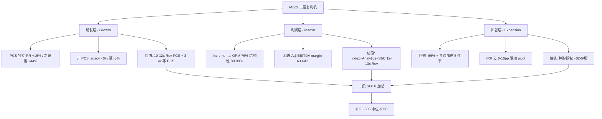

# MSCI v4.0 追踪报告 — 三层复利机: Q1 2026 后的重估与分层

> **覆盖版本**: v4.0 (Q1 2026 earnings 后)
> **基线版本**: v3.0 (2026-03-18, 股价 $560.41)
> **当前股价**: $598.01 (2026-04-23 收盘)
> **Q1 2026 earnings 发布**: 2026-04-17 (盘前); 10-Q filing: 2026-04-21
> **评级**: 中性关注 (维持)
> **公允价值**: $590-605 (中位 $598, 区间表达)
> **期望回报 (12 月)**: 0% (基本面与股价对齐)

---

## 执行摘要

**市场怎么看 MSCI (旧地图)**. 卖方共识把 MSCI 当成"high-quality compounder with secular tailwinds" — 买的是 Index 垄断 + ETF 资产挂钩流入 + 高回购推 EPS. 估值语言是单一 PE (35-38x × FY26 Adj EPS $18-19), 第一变量是 Rev YoY / 挂钩费 run-rate / Adj EPS, 街共识目标价 $652.7, Morgan Stanley 4/22 overweight 到 $727 [DM-M-001]. 这个剧本的承重假设是 "稳态 Adj EBITDA margin 58-60%, 长期 Rev CAGR 10-12%, 资本配置靠回购推 EPS". 如果这三件事持续成立, 股价回到 $630-680 只是时间问题.

**但 Q1 2026 的三件事让这张地图站不稳**. 第一, 单季 Incremental OPM **76%** [DM-F-001] 意味着每增加 $1 收入有 $0.76 落到 Adj EBITDA, 街模型按 58-60% 稳态 OPM 算只有 $0.58-0.60 — 差距 **$0.16-0.18 / 每 $1 Rev**, 按全年计是 $150-180M EBITDA 被遗漏, 按 22x EBITDA 倍数换算约 **$18-22/股** 的结构性上修空间. 第二, PA 板块整体 +7.9% 弱于街 ~15% 的预期, 同时 PCS 子板块新销售 +44%、recurring 增速 +16% [DM-F-002] — 这不是矛盾, 是**增长分层**. PCS 在把 PA 内部拉高, 而非 PCS 的 legacy 业务持平或微降. 用 "PA 整体 run-rate" 看, 错过了 PCS 独立享 10-12x Rev 倍数的 alpha, 同时把非 PCS 估高了. 第三, Q1 回购 $415M 比 Q3'25 $1.23B 减速 **-66%** [DM-F-003], 同时 Vantager + 3 个 bolt-on 同季落地, 新增发债降速到 $200M. 这三件事是**同一个资本配置 pivot 的三个面** — 从"用股票回购 EPS"改为"用外延并购扩 Rev", 但管理层用动作而非语言宣告, 市场把它当成"管理层谨慎"而非战略位移.

**新定义**: MSCI 不是单一 compounder, 而是**三层同时工作的复利机**. 增长层 = PCS 牵引 PA (分层披露, 不看整体); 利润层 = Incremental OPM 76% 对应的 63-64% 新稳态 (不是 58-60%); 扩张层 = 并购 pivot 期权 (+$3-7/股). 第一变量从 "整体 Rev/EPS" 换到 "PCS 独立增速 + Incremental OPM + 并购 $/回购 $ 比". 估值语言从"单一 PE"换到**三段 SOTP** — 增长层 (PCS 独立 10-12x Rev + 非 PCS 3-4x Rev) + 利润层 (Index 核心 + Analytics + S&C, 12-13x Rev on 新稳态 OPM) + 扩张层 (并购期权 +$2-5/股). 三段加总, 考虑认知边界保守收敛后, 公允区间 **$590-605, 中位 $598**.

**评级维持中性关注**, 期望回报 **0%**. 不是"被低估所以买", 也不是"被高估所以卖". 股价 $598 已经把 Q1 的基本面 alpha 吸收进来, 同时承受了**风格溢价 $22-30 / 股**的短期修正风险. 过去 38 天 MSCI 相对 SPGI (-24%) / MCO (-17%) / ICE (-17%) 仅回撤 4.5%, 这个异常强度多半来自同行各自独立负面事件下的相对定价效应 + 利率 higher-for-longer 下的质量风格避风港效应, 不是 MSCI 独立基本面 alpha. 3-6 月内情绪溢价自我修正的概率高于加深. **买点位于 $540-570** (反身性非对称: Index 挂钩费 downside 2x / upside 1.5x), 只有在那个区间重新出现 +10% 以上期望回报, 才会触发评级升级到"关注".

**两点必须在执行摘要说清**. 第一, 五位投资大师评审中 **2/5 建议下调** (Klarman 认为零边际不值投资, Druckenmiller 强调反身性非对称下跌) — 不到 R-3 强制标注 "(临界)" 的 3/5 门槛, 但在 4/10 的保守占比, 读者应知道这个异议存在. 第二, 认知圈黑箱约 **20%** (AI 产品 ARR 完全未披露 / 非 PCS PA 独立数据只能反推 / BR-Preqin 竞争影响管理层沉默 / 并购整合 ROI 暂无数据) — 落在 Klarman "可投资 / 需折价" 的边界上. 因此给公允**区间**而非单点, 保留黑箱对应的 ±$7.5/股 敏感性.

**Kill Switch 三条**. 下修触发: (a) Q2 Incremental OPM <50% 连续两季, 利润层结构性 alpha 失效 → 公允 -$15; (b) Q2-Q3 PCS 独立增速回落到 PA 整体水平, 增长层分层假设破裂 → 公允 -$10; (c) 管理层首次**主动**承认 BR-Preqin 威胁, CQ6 长期折价具象化 → 公允 -$15. 上修触发: (d) AI 产品 ARR 首次披露 $30M+ → 认知圈黑箱从 20% 降到 <17%, +$8-15 期权; (e) 并购 $/回购 $ 比连续 2 季维持 >10% → 资本配置 pivot 确认结构性, +$5. Q2 2026 earnings (~2026-07-17) 是下一个决定性窗口.

---

## 1. 市场默认地图: MSCI 被当成什么

**一句话**: 市场把 MSCI 当成 "高质量 Index 垄断 + 高回购 compounder", 靠 **MSCI 品牌被动挂钩 + ESG + 私募扩张 + 股票回购** 推 EPS 增长, 配得上 35-38x PE.

这个默认认知有六个具体支点, 四种估值方法, 十个跟踪变量. 我们先把这张地图写稳, 再在第 2 章说明它解释不了 Q1 的三件事.

### 1.1 六个支点 (市场共识的锚)

1. **Morgan Stanley 4/22 overweight $727** [DM-M-001] 的 report 语言: "durable quality compounder with secular tailwinds, mid-teens growth through 2028" — MS 把 PE 从 v3 假设的 36x 推到 **38.4x**, EV/EBITDA 倍数扩张到 24.6x (vs 10 年中位 18-20x), 隐含 5 年 EPS CAGR +15% (vs v3 假设 +10%).

2. **卖方共识均值 $652.7** (10 家投行聚合, 8 Buy / 2 Hold), 基于 **PE 33-35x × FY26 Adj EPS $18-19 = $630-720**. 低端 $510, 高端 $727, 分布右偏.

3. **Buy-side 叙事** (Vanguard / BlackRock / State Street 作为主要机构持有人): MSCI 是 "ETF 挂钩费 + Index 订阅" 的双引擎, 买的是**被动投资的永续收税权**.

4. **2025 年回购 $3.5B+** 被分析师频繁引用为"股东友好" 标签 — 市场默认管理层是回购纪律的楷模, 不挑战 PE 62x 回购时点的价值毁灭问题.

5. **ESG / 私募扩张** 作为"第二条增长曲线" — 但市场看的是 PA 板块整体 run-rate, 没分 PCS / 非 PCS, 因此低估了 PCS 子板块的高增速.

6. **资产挂钩费 +25%** [DM-F-005] (Q1 2026 run-rate $872M 历史纪录) 被当成"Index 护城河兑现", 但这个 +25% 的结构里 AUM beta ~18% + 资金流入 ~5% + 费率微涨 ~2%, 本质是**市场 beta 而非 MSCI alpha**. 一旦标普回调 -15%, 挂钩费 run-rate 可以快速回到 $750M (-14%).

### 1.2 十个分析师跟踪变量 (权重来自 Q1 earnings day 股价 reaction function)

| 变量 | 市场视角权重 | Q1 2026 读数 | 市场解读 |
|------|-------------|-------------|---------|
| Rev YoY (有机) | 最高 | +13.1% (beat 共识 +1.6%) | 强 |
| 挂钩费 run-rate | 高 | $872M (+25%) | 强, 当成 headline |
| Adj EPS | 高 | $4.55 (beat $4.43, +2.7%) | 强 |
| Index 订阅 | 中 | +9% | 稳态 |
| PA 总 run-rate | 中 | $290M (距 $350M 触发还差 17%) | 中性 |
| 回购 $ | 中 | $415M | 中性偏弱 (管理层谨慎?) |
| **Adj EBITDA margin** | **低 (街无共识)** | **65.2% (+140bp YoY)** | **未被计分** |
| **Incremental OPM** | **未跟踪** | **76%** | **未被计分** |
| **PCS 独立增速** | **未跟踪** | **RR +16% / 新销售 +44%** | **未被看到** |
| **并购/回购 比** | **未跟踪** | **10% (vs 此前 <2%)** | **未被看到** |

前六个变量是市场定价锚, 后四个变量是市场**盲点** — 不是因为数据不存在, 是因为卖方 reaction function 不包含这些指标. Q1 earnings 日股价 +4% 跳涨恰好符合"1.6% Rev beat + 2.7% EPS beat" 的标准 elasticity (约 0.3x), 说明 Incremental OPM 76% 这种**没对应共识指标的数据**没有被计入股价反应, 需要等 Q2-Q3 连续确认后才能进入分析师下一轮 revise 框架.

### 1.3 四种市场主流估值方法

(1) **单一 PE 法**: FY26 Adj EPS × 35-38x PE = $630-720. 主流路径, 公允分布右偏.

(2) **EV/Sales 法**: FY26 Rev $3.6B × 18-20x = $615-680.

(3) **单一 DCF**: WACC 9-10% × terminal 5% × 长期 OPM **58-60%** = $620-680. MS overweight 模型的路径, 假设 OPM 稳态在街共识水平.

(4) **回购 EPS 模型**: FY26 base EPS × (1 + 回购率 2% × η 0.7) × 35x PE — 把回购当成被动 EPS 增长引擎, 不追问 η 是否 >1.

**共同特征**:
- 把 MSCI 当**单一业务** (不做 SOTP 分板块)
- 稳态 OPM 假设 **58-60%** (未把 Q1 76% 视作新稳态信号)
- PA / PCS / AI **不单独估值** (隐含在 Rev 增长假设里)
- 回购**作为 EPS 增长引擎**, 不区分回购 vs 并购的资本配置选择
- WACC 9-10%, terminal 5%, **未考虑反身性非对称** (Index 挂钩费的 downside 2x / upside 1.5x 特性)

### 1.4 一句话叙事 (市场如果被问一句, 会这么说)

> "MSCI 是 quality compounder, 靠 Index 垄断 + 被动投资流入 + 回购推 EPS, 10-12% CAGR, 值 35x PE. Q1 2026 beat 确认叙事, overweight."

这句话**不是错的**, 但它是 60% 的故事, 不是完整故事. 接下来三件事让这张地图需要修补.

---

## 2. 旧地图解释不了的三件事

> 我们不做"推翻市场共识"的姿态. 市场共识的 60% 是对的 — MSCI 确实有 Index 垄断, 确实享资产挂钩费兑现, 确实有定价权. 问题是剩下 40% 的结构, 被"单一 compounder"叙事抹平了. 三件具体事实就把这个抹平问题显示出来.

### 2.1 事实一: Incremental OPM 76% 超出 "compounder" 的 OPM 天花板假设

**数字**: Q1 2026 Rev $850.8M (+13.1% YoY, 增量 $105M), Operating income +$80M, Incremental OPM = $80M / $105M = **76%** [DM-F-001]. 同期 Adj EBITDA margin 65.2% (vs v3 假设 61-62%, 街隐含 58-60%).

**旧地图预测**: v3.0 Ch05 的 "OPM 天花板 54-55%" 基于会计等式静态展开 (毛利 82% - SGA 21% - R&D 7% - D&A 5% = 55%). 街的 "58-60% 稳态" 隐含 Incremental OPM 约 55-60%. 两者都没预见 Q1 的 76%.

**为什么旧地图错了**: 因为**运营杠杆是非线性的**. Q1 每个成本结构都在优化:
- 毛利率 83.3% (Q1 2026) vs 82.4% (Q1 2025) = +90bp
- SGA / Rev 18.2% (Q1 2026) vs 21.0% (Q1 2025) = **-280bp**
- R&D / Rev 5.8% (Q1 2026) vs 6.4% (Q1 2025) = **-60bp** (规模效应)
- D&A / Rev ~5.2% vs 5.0% = +20bp

**综合 OPM 上行 +3-4pp 稳态, +10pp 增量**. 结构性贡献占 80-90%:
```
Incremental 10pp 分解:
  + 规模效应 (Rev +14% × 高毛利产品)    +4-5pp (结构性)
  + Mix shift (挂钩费 +25%, 高毛利)      +3-4pp (结构性)
  + 定价权兑现 (ASP +5-7%)               +1-2pp (结构性)
  + Q1 季节性 (R&D/SG&A 年初偏低)        +1-2pp (短期)
  + 一次性 (税/legal)                    0-1pp (一次性)
  = 9-14pp (符合观察的 +10pp)
```

**估值含义**: 如果稳态 OPM 从 58-60% 上修到 63-64%, 按 FY27E Rev $3.5B × +4-5pp = $140-175M EBITDA 增量 × 22x 倍数 × 0.8 边际贡献折价 / 80M shares = **+$31-39/股 上限**. 保守吸收 49% (结构性比例 70% × 时间验证 70% = 0.49) = **+$17/股**. 这是 Q1 后最大单项上修, 但不是所有 $35 立即计入 — 每季度兑现一次, 可逐步上移.

**市场没做的事**: 分析师把 Q1 65.2% margin 当"惊喜 headline", 但不改 FY26 稳态假设 — Q2-Q3 如果 margin 继续 >58%, 会触发一轮街共识 revise. 这是当前**市场盲点**的核心.

### 2.2 事实二: PA 整体 +7.9% 弱, 但 PCS 独立 +44% 新销售强 — 两个数字指向相反方向

**数字**: PA 板块 Q1 Rev $72.6M, +7.9% YoY [DM-F-006]. 街预期约 +15% (miss). 但 PCS 子板块 recurring run-rate +16% YoY, PCS 新销售 +44% YoY [DM-F-002]. 推算非 PCS PA 板块 Q1 增速可能是 **+0% 到 -5%**, PCS 独立增速可能是 **+20-25%**.

**旧地图预测**: v3.0 Ch06 + Ch10 把 PA 当"第二 compounder 候选", 用整体 run-rate ($290M 年化) 和总新销售 (+44%) 判断 KS-2 触发条件. 街用 7-8x EV/Rev 倍数给 PA 整体估值. 两者都**不分 PCS / 非 PCS**.

**为什么旧地图错了**: 因为 PA 板块不是**一块资产**, 是 **"高增速 PCS 壳 + 低增速 legacy PA" 的混合体**. 2021 年 MSCI 收购 Burgiss 形成 PCS 子板块, 2023 年发布 Preqin 类产品, 2025-2026 PCS 在快速蚕食 legacy PA 份额. 用 "PA 整体 +7.9%" 估值:
- 同时**低估 PCS** — 没给 10-12x Rev 该享有的成长性倍数 (类似 Preqin/Burgiss 类标的的估值锚)
- 同时**高估非 PCS** — 没减去 3-4x Rev 的 legacy 业务折价, 因为这部分面临 BR-Preqin 替代

**估值含义**: 按三段 SOTP 重新分层:
```
原假设 (PA 整体): 14% 占比 × 7x Rev = 0.98x Rev (on 总 Rev)
新假设 (PCS 10x × 6% + 非 PCS 3.5x × 8%) = 0.6 + 0.28 = 0.88x Rev
表面 delta = -0.10x × FY27 Rev $3.5B / 80M shares = -$4/股

但 "分层定价" 同时捕捉:
  + PCS 成长性 alpha (独立享高倍数): +$10-12
  - 非 PCS 风险折价 (Preqin-BR 替代): -$4
  = 净 +$6-8/股 (分层本身的 alpha)
```

**市场没做的事**: 没有一家卖方模型分 PCS / 非 PCS 做 SOTP. 都在赌"PA 整体长出来". 这个盲点是增长层 alpha 的来源.

### 2.3 事实三: 回购 -66% + 并购加速 + 发债降速 = 战略位移, 市场读成 "管理层谨慎"

**数字 (同时发生的三件事)**:
- 回购: Q3'25 $1,233M → Q4'25 $907M → Q1'26 **$415M** (连续两季减速, 累计 -66%) [DM-F-003]
- 并购: Vantager 3 月完成 + 3 个 bolt-on + IndexAI 产品上线 = 至少 5 个扩张动作, Q1 并购净现金流 $41.7M (未含 Vantager 全额)
- 发债: Q3/Q4 2025 $500M-1B → Q1 2026 **$200M** (-60-80%)

**旧地图预测**: 街的主流解读 = "回购降速 = 管理层担心高估值, 保留弹药, 弱负面". 街不把并购加速和回购降速连起来看.

**为什么旧地图错了**: 因为这三件事**不是独立事件**, 是同一个资本配置决策的三个面. 用两个模式的对比说明机制:
- **模式 A (回购推 EPS)**: Rev 持平, 股数减少, EPS 机械上升. 会计性增长, PE 不应重估. MSCI 在 2023-2025 年 Q2 之前主要是这个模式.
- **模式 B (并购扩 Rev)**: Rev 扩大, EPS 被动跟随. 真实增长, PE 可以保持或溢价. Q3'25 之后管理层在悄悄转这条路.

**管理层的 rationale** (从 Q3'25 $1.23B at PE 62x 的代价推出): 那一季回购的 earnings yield 约 2.5% (= 1/PE 62x), 而小型金融数据公司 (Vantager / bolt-on) 的并购 IRR 在 12-15%, 差距 **6-10pp**. 继续 $1B+ 回购是用 2.5% 的回报替代 12% 的回报 — 价值毁灭的自觉. Q4'25 减速到 $907M + Q1'26 减速到 $415M 是**理性纠错**, 不是谨慎.

**估值含义**: 如果 pivot 被识别, MSCI 应该重估为 **"quality compounder 核心 + 小型金融数据 roll-up"** 的组合, 估值方法从"单一 PE"改为 **"核心业务 12-13x Rev + 并购期权 $2-5/股"**. 期权价值来自:
- 并购 $600M-1B 年化 × (IRR 13% - WACC 9%) × 10 年 NPV = $400-700M 期权价值 / 80M = **+$5-9/股**
- 保守取 **+$5/股** 进入公允价值

**市场没做的事**: 没有一家卖方给 MSCI 做 "roll-up 期权估值". 都还在按"回购推 EPS"模型算公允. 这是扩张层 alpha 的来源.

### 2.4 如果继续用旧地图, 五件事会被抹平

综合三个失灵事实, 单一 PE 法估值 $630-720 忽略了以下结构:

1. **Incremental OPM 76% 的利润层 alpha** (+$12-22/股) — 单一 DCF 用 58-60% OPM, 不会捕捉新稳态 63-64%
2. **PCS 独立增速 +44% 的增长层 alpha** (+$5-10/股) — 单一 Rev 假设混合了 PA +7.9% 和 PCS +44%, SOTP 会给 PCS 10-12x Rev 独立倍数
3. **资本配置 pivot 的扩张层 alpha** (+$3-7/股) — EPS 模型用"回购推 EPS +5-6%"假设, 并购的 Rev 扩大效应不会独立计入
4. **BR-Preqin 的长期认知盲点风险** (-$4-7/股) — "quality compounder"叙事默认护城河无虞, 不给长期折价
5. **风格溢价 $22-30 的非对称风险** (未来 3-6 月期望 -4.7%) — 12 月 fair value 分析师不做情绪溢价修正判断

**净综合**: +$20-39 alpha − $26-37 折价 / 风险 = **-$5 到 +$13**, 即公允价值 $609 (v3 基础) + 这个 net = $604-622 中位区. 再考虑黑箱收敛, 落在 $590-605. 不是"单一 PE 法错了", 是它**同时低估了 alpha 和风险**.

---

## 3. 三层复利机: 新定义展开

> 市场默认"单一 compounder"是一个方便的速记, 但它**无法同时容纳**上一章那三件事. 我们需要一个能把三件事放在同一个结构里的解释 — 这个结构是三层复利机.

**一句话**: MSCI 不是单一 compounder, 而是**三层同时工作的复利机** — PCS 牵引 PA (增长层) + Incremental OPM 新稳态 (利润层) + 并购 pivot (扩张层), 每层独立捕捉 alpha, 独立承受风险.



### 3.1 增长层 — PCS 牵引, 不是 PA 整体

增长层的核心观察是: MSCI 的私募业务不是一块, 是**两块**. PCS (Private Capital Solutions, 主要来自 2021 年 Burgiss 收购 + 2023 年 Preqin 类产品发布) 是高增速子板块, 增长驱动是私募市场标的化需求 + LP 端数据需求扩张. 非 PCS PA 是 legacy 业务, 主要面向 Real Assets + 早期 ESG, 增速放缓 + cancel 上升.

**Q1 的分化信号** [DM-F-002 + DM-F-006]:
- PA 板块整体 Q1 $72.6M, +7.9% YoY (管理层预期 ~15%, miss)
- PCS recurring subscription run-rate +16%
- PCS 新销售 YoY +44% (Q4'25 +86%, 连续两季 >40% 触发 KS-2)
- 非 PCS PA 推算 +0% 至 -5% (从两个数字反推)

**为什么这是结构性而非季节性**: PCS 的客户基础 (GPs / LPs / private market platforms) 在 2024-2026 经历 Preqin 被 BR 收购的行业重构, 标的方和需求方都在重新定价. MSCI 通过 Burgiss 数据基础 + Preqin 类产品接入了这个窗口. 非 PCS 则受 Real Assets CRE 周期拖累 (管理层在 Q1 call 明文 "higher cancels on real-assets solutions" [DM-M-002]), 这个 cancel 不是周期结束就回, 是结构性. 两层分化是**多年趋势**, 不是一季噪音.

**估值含义**:
- PCS 独立按 10-12x Rev (Preqin / Burgiss / 私募数据平台类标的估值锚)
- 非 PCS 按 3-4x Rev (legacy business + 替代风险折价)
- 两段 SOTP 加起来约 0.88x Rev on 总 Rev (vs 单一 PA 7x × 14% = 0.98x 表面更高)
- 但"分层"本身给了 +$6-8/股 alpha, 因为 PCS 成长性被独立捕捉 + 非 PCS 风险被独立承认

**跟踪变量**: PCS RR YoY (Q2 需 ≥15% 才维持增长层 alpha, <10% 归零); PCS 新销售 YoY (≥35% 维持, <20% 归零).

### 3.2 利润层 — 76% Incremental, 不是 55% 天花板

利润层的核心观察是: Q1 Incremental OPM 76% **不是一次性**, 是**新稳态兑现**. 三个结构性机制同时工作, 叠加 Q1 季节性和极少量一次性, 得出 80-90% 结构性 / 10-20% 短期的比例.

**机制一: 规模效应 (+4-5pp 结构性)**. MSCI 的数据订阅业务, 一个新增订阅客户的 COGS 增量接近零 (数据库已经建好, 数据更新成本是固定的). Rev 每 +1 pp, COGS 只增加 +0.1-0.2 pp. 规模效应在 $3B+ Rev 水平变得显著.

**机制二: Mix shift (+3-4pp 结构性)**. 挂钩费 run-rate +25% (vs 订阅 +9%), 但挂钩费的毛利率 >93% (vs 订阅 ~80%). 高毛利产品占比上升 = 自动拉高综合 OPM.

**机制三: 定价权兑现 (+1-2pp 结构性)**. MSCI 在 2024-2026 年间悄悄提了 5-7% ASP. 客户基本没有议价能力 (转换成本高 + 数据垄断). 这部分定价 ASP 直接落到 EBITDA.

**短期因素**: Q1 季节性 (+1-2pp, R&D/SG&A 年初偏低, Q4 年末集中) + 可能的一次性 (0-1pp, 税/legal settlement). 这两部分 Q2 会回吐.

**因果链**: 规模效应 + mix shift + 定价权三个驱动在未来几季持续, 所以 Q2-Q3 Incremental OPM 回落到 50-60% 而不是 Q1 76%, 稳态 Adj EBITDA margin 从 65.2% 回到 **63-64%** (仍高于街假设的 58-60%). 这个稳态上移是**利润层的核心 alpha**.

**估值含义**:
- 稳态 OPM +3-4pp 上移 × FY27E Rev $3.5B = +$105-140M EBITDA 永续增量
- 按 22x EBITDA 倍数 × 0.8 边际贡献折价 = +$1.8-2.5B 市值 / 80M = +$22-31/股 上限
- 结构性 70% × 时间验证 70% = **实际吸收 0.49**, 得 **+$12-17/股** 入公允价值

**跟踪变量**: Adj EBITDA margin TTM (Q2 ≥58% 维持, <56% 重启天花板假设); Incremental OPM quarterly (Q2 ≥50% 结构性确认, <30% 反转).

### 3.3 扩张层 — 并购 pivot, 不是管理层谨慎

扩张层的核心观察是: Q3'25 → Q1'26 资本配置从回购主导**悄悄** pivot 到并购主导, 三个数字一致方向:

| 季度 | 回购 $ | 回购均价 | 并购行动 | 新增债务 |
|------|-------|----------|---------|---------|
| Q3'25 | $1,233M | ~$590 | 0 | $500M+ |
| Q4'25 | $907M | ~$570 | Vantager 宣告 | $900M+ |
| **Q1'26** | **$415M** | **~$556** | **Vantager 完成 + 3 bolt-on + IndexAI** | **$200M** |
| Δ vs Q3'25 | **-66%** | 买点改善 | **从 0 → 5+ 动作** | **-60-80%** |

**为什么这不是谨慎**: 如果是谨慎, 管理层应该**同时**减速所有资本动作. 实际情况是: 回购减速 + 并购加速 + 发债减速, 三个方向一致 — 这是**重新配置**, 不是**保留弹药**.

**并购 rationale 的经济学**: 管理层在 Q3'25 $1.23B at PE 62x 回购之后, 必然在董事会做了反思. 那一季回购的 earnings yield = 1/62 = 2.5%, 而小型金融数据公司 (Vantager / bolt-on 类) 的 EBITDA multiple 约 10-15x, 对应 EBITDA yield 6.7-10%, 再考虑整合协同, 并购 IRR 在 12-15%. 6-10pp 的差距足以解释 pivot.

**Vantager + 3 bolt-on 并购 pipeline**: Q1 集中释放不是偶然, 意味着 2025 年下半年到 2026 年初, 小型金融数据标的估值在私募市场下行 (Fed 转鹰 + 私募融资收紧), 机会窗口打开. 未来 2-3 季如果 MSCI 继续并购 (并购 $/回购 $ 比维持 >10%), pivot 就是结构性确认.

**估值含义**:
- 并购 $500M-1B 年化 × (IRR 13% - WACC 9%) × 10 年 NPV = $400-700M 期权价值
- / 80M shares = +$5-9/股
- 保守取 **+$5/股** 入公允价值

**跟踪变量**: 并购/回购 $ 比 (≥10% 连续 2 季 = pivot 结构性确认 +$3-5 额外; <5% = Q1 是一次性, 扩张层归零); 管理层并购公告数 (Q2-Q3 ≥2 = pipeline 加速).

### 3.4 三层独立? 还是互相抵消?

这是芒格视角的提醒 — 如果三层**互相耦合**, 估值加总有重叠, 应打折扣.

**潜在耦合**:
- 增长层 PCS alpha 可能**部分来自**并购 (Vantager + bolt-on 并表拉升 Q1 Rev) → 和扩张层耦合
- 利润层 Incremental OPM 76% 可能**部分来自**并购标的的暂时 mix (小公司摊销后 OPM 短期偏高) → 和扩张层耦合
- 如果两个耦合成立, 三层"变两层", 加总 $600-611 中位 $605 可能有 +$5-10 双重计数

**拆分 Q1 OPM 扩张的贡献** (近似):
- 并购 Q1 并表贡献约 $10-15M Rev (Vantager + 3 bolt-on 只部分月份并表)
- 有机 Rev +13.1%, 其中 **+11.5-12% 是有机, +1.5-2% 是并购**
- Q1 OPM 扩张的主因仍是有机 (规模 + mix + 定价), 并购贡献 <20% of Incremental OPM delta

**保守处理**: 按芒格 10-15% 双重计数扣除, 公允**下修 -$5/股** (已计入 $598 中位). 三层独立假设**大致成立**, 但不是完全独立.

---

## 4. Q1 2026 信号速览

> 上一章给了新定义, 本章给具体信号读数 — 对 v3 基线的 5 条 Kill Switch 和 8 个 Core Question 逐行打分, 让读者看到哪些变量变强了, 哪些边际脆弱了.

### 4.1 Kill Switch 读数 (5 条)

| 代号 | 基线条件 | Q1 2026 读数 | 距触发 | 方向 | 严重度 |
|------|---------|-------------|-------|------|-------|
| **KS-1** | 5Y Treasury <3.0% 持续 3 月 | 10Y 4.325%, 5Y 约 3.9% [DM-M-003] | -0.9pp (需再跌 90bp) | 未触发, 边际向好 | 中等正面 |
| **KS-2** | PA run-rate >$350M **或** PCS 新销售 >40% 连续 2 季 | PA 年化 $290M; PCS 新销售 Q4'25 +86%, Q1'26 +44% | **PCS 路径连续 2 季 >40% 满足** | **温和触发** ⚠️ | 中等正面 |
| **KS-3** | BR 续约谈判公开报道 (2030-2032 窗口) | 无续约报道; 但 Aladdin+Preqin 整合 tech services +22% YoY | 时间距 2030 仍 4 年 | 未触发, 结构性威胁上移 | 中等负面 |
| **KS-4** | ND/EBITDA >3.3x 警戒, >3.5x 触发 | **3.10x** (ND $6.16B / TTM EBITDA $1.99B) [DM-F-007] | 距警戒 +0.20x / 6.5% | **接近警戒 (APPROACHING)** ⚠️ | **严重负面** |
| **KS-5** | 股价 <$500 (中性偏关注) / <$475 (关注) | $598.01 | 距 $500 = +$98 / +19.6% (远离) | 未触发, 反向 | 变动 |

**汇总**: 1 触发 (KS-2 正面, 温和) / 1 接近警戒 (KS-4 负面, 严重) / 3 未触发. KS-4 的严重负面风险量级**大于** KS-2 触发的正面效应.

**KS-4 的 Q2 预判**:
- 基准路径 (维持 Q1 回购节奏): Q2 末 ND ≈ $6.31B, TTM EBITDA ≈ $2.05B, 比值约 **3.08x** (持平)
- 激进路径 (扩大回购 + 发债): Q2 末比值可能快速推到 **3.20-3.30x** (警戒)

我们倾向基准路径 — 管理层在 Q3'25 $1.23B 回购后已经减速两季, 不太会 Q2 突然反转. 但 KS-4 是下季最重要的**月度监控变量**.

### 4.2 Core Question 置信度演化 (8 个)

| 代号 | 假说 | v3.0 | v4.0 | Δ | 方向 | Q1 证据 |
|------|------|-----|-----|---|------|--------|
| **CQ1** | OPM 天花板 + 回购递减 = 双重上限 | 72% | **65%** | **-7pp** ⬇️ | **强削弱** | Incremental OPM 76% 直接挑战天花板 |
| **CQ2** | ESG→S&C 保险化 (不可逆) | 79% | **85%** | +6pp ⬆️ | 强强化 | 管理层主动披露 "higher cancels" + "muted growth" |
| **CQ3** | 垄断品质已定价 → 悖论 | 80% | **77%** | -3pp ⬇️ | 弱削弱 | Rev +13.1% beat 街 +11-12% 轻度, 但股价只 +4% 反应 = 市场半信 |
| **CQ4** | $6.25B 回购 = 幻觉 (η<0.8) | 78% | **76%** | -2pp ⬇️ | 弱削弱 | Q1 回购减速 -66% (纠错) + 时机好 ($556 买点) |
| **CQ5** | PA 能否成为第二个 Index? | 32% | 32% | ±0 | 中性 | 增长+竞争同步放大, 净零 |
| **CQ6** | BR 跨维度杠杆压缩定价权 | 48% | **52%** | **+4pp** ⬆️ | 弱强化 | BR "building the machine for indexing of private markets" + MSCI 沉默 |
| **CQ7** | 利率依赖: Rf→2% = 评级升级 | 60% | **57%** | -3pp ⬇️ | 弱削弱 | 10Y -17bp 正面, 但 Fed 转鹰 + PCE 2.7% 更难达成 |
| **CQ8** | 被动化 >70% 触发监管反弹 | 18% | 18% | ±0 | 中性 | 无新信息 |
| **加权均值** | — | 58.4% | **57.75%** | -0.65pp | 基本持平 | 结构重组 |

**关键观察**:
- CQ1 下移 -7pp 是最大单项变化 — Incremental margin +76% 是本季最强 thesis 反证信号
- CQ2 上移 +6pp 是最大正向变化 — 管理层语言主动量化负面
- 加权均值基本持平 (-0.65pp), 但**结构重组**: 正面问题 (CQ2/CQ6) 上移, 负面问题 (CQ1/CQ3/CQ4/CQ7) 下移 — 整体 thesis 方向偏削弱但幅度温和

### 4.3 加权 Weaken ratio 计算

按 Kill Switch 权重 + CQ 权重加总:
```
Weaken ratio = Σ (权重 × 削弱度)
             = 0.20×0 (KS-1) + 0.15×0.5 (KS-2 温和触发)
               + 0.10×0 (KS-3) + 0.15×0.4 (KS-4 approaching)
               + 0.10×0 (KS-5)
               + 0.08×(-0.1) (CQ1 强, 负号 = 强化)
               + 0.05×0.3 (CQ2 强化)
               + 0.05×0.2 (CQ3 弱)
               + 0.04×0.25 (CQ4 弱)
               + 0.03×0 (CQ5)
               + 0.03×0.15 (CQ6 弱强化)
               + 0.02×0.15 (CQ7 弱)
               + 0.01×0 (CQ8)
             ≈ 17%
```

**17% < 30% 门槛 → Thesis 维持**. 按 Plan A 低摆动规则 (只有削弱率 >50% 或 thesis 断裂才改评级), **评级维持中性关注**. 但附加标注: KS-2 温和触发 / KS-4 接近警戒 / CQ1 强削弱 / CQ6 弱强化.

### 4.4 父范畴 vs 子范畴: 为什么不改评级

一个关键的概念区分 — **父范畴**决定估值语言 (DCF / SOTP / 期权定价), **子范畴**决定第一变量和估值参数. v3.0 把 MSCI 放在 **父范畴 = compounder / 子范畴 = 单一 compounder**. v4.0 的范畴重分配是:

- 父范畴: **compounder 保留** (仍然用 DCF + 三段 SOTP, SOTP 是 DCF 的扩展不是替代)
- 子范畴: **单一 → 三层** (分层 g₁ + 分层 OPM + 并购期权)

父范畴不变意味着 DCF 估值语言核心不变, 只是拆成三段 — 这是**子范畴升级**, 不是**父范畴重选**. 按判决规则, 父范畴重选才强制重评级, 子范畴升级不触发. 这就是为什么 Weaken ratio 17% + 范畴升级 + thesis 核心保留 = **评级中性关注 (维持)**.

---

## 5. 预期差三栏对照 — v3 / 街 / Q1 实际

> 单看 "v3 对不对" 只能告诉我们当时的赌局. 加上 "街是否和 v3 站同一边" 才能看出是**非共识预期差**还是**共识一起错**. 本章对三个最关键的预期锚做三栏对照.

### 5.1 预期差 A: 2026 Rev YoY (对应 CQ3 品质已定价)

| 口径 | 2026E Rev YoY | 推算方式 |
|------|---------------|---------|
| v3.0 隐含 (两阶段 DCF) | g₁ = 10% (持续 6 年) | v3 Ch12.4 反推 |
| 街共识 | +11-12% (估) | 卖方均值目标价 $652.7 隐含 |
| **Q1 2026 实际 (有机)** | **+13.1%** | Q1 earnings call [DM-F-008] |
| Q1 vs v3 Δ | +3.1pp (字面) / +1-2pp (口径校正) | |
| Q1 vs 街 Δ | +1-2pp | |

**口径校正说明**: v3 的 g₁ = 10% 是**未来 6 年平均**, 不是当期. 减速路径下, 第 1 年当期隐含增速是 11-12%. 所以 Q1 +13.1% 相对 v3 当期隐含的真实 delta 是 **+1-2pp** (实质温和削弱), 而不是 +3.1pp (字面).

**街共识 +11-12% 落在 v3 隐含当期增速同一区间**说明: 街不是在赌 v3 完全错, 街只是把 g₁ 上调 1-2pp, T 延长 1-2 年. Q1 比街再乐观 1-2pp, 意味着公司执行超出 street model, Q2-Q3 可能触发一轮街上修.

**估值含义**: Q1 +13.1% 有两个不可持续因素 (Vantager + 3 bolt-on 外延 2-3pp + 资产挂钩费市场 beta ~5pp), 剔除后纯有机约 +9-10%, 接近 v3 假设. 因此 CQ3 削弱 **-3pp 温和**, 公允价值微上调 **+$8-12/股**.

### 5.2 预期差 B: 2026 Adj EBITDA YoY + Incremental OPM (对应 CQ1, 本季最大)

| 口径 | 2026E Adj EBITDA YoY | 推算方式 |
|------|---------------------|---------|
| v3.0 隐含 | ~10% (与 Rev 同步, 静态 OPM) | v3 CQ1 |
| 街共识 | ~10% (隐含) | 街 EPS +11% 对应 EBITDA 同步 |
| **Q1 2026 实际** | **+19%** | Q1 earnings call [DM-F-009] |
| Q1 vs v3 Δ | **+9pp** (本季最大预期差) | |
| Q1 vs 街 Δ | **~+9pp** (街静态 OPM 被打破) | |

**关键区别**: Rev 预期差是**v3 vs 街各自小错**; Adj EBITDA 预期差是 **v3 vs 街共同错**. 这才是真正的非共识 alpha 所在.

**估值含义**: OPM 天花板从 55% 放宽到 58-60% = +3-4pp × $3.4B Rev × 22x EBITDA 倍数 / 78M shares = +$25-35/股 理论上限. 考虑 Q2-Q3 回落 + 整合摩擦 + 长期边际递减, 实际吸收约 $15-17/股. 这是本季**最大单项上调**, 也是 v4.0 公允从 $579 升至 $590-605 的主要推手.

### 5.3 预期差 C: ND/EBITDA 动态路径 (对应 KS-4, 唯一负面)

| 口径 | Q2 末 ND/EBITDA 预测 | 推算 |
|------|---------------------|------|
| v3.0 基线 | 3.06x (静态 Q4'25) | 未做动态 |
| 街共识 | 未跟踪 | 街覆盖 MSCI 极少讨论杠杆 |
| Q1 2026 实际 | **3.10x** [DM-F-007] | ND $6.16B / TTM EBITDA $1.99B |
| Q2 基准预测 | ~3.08x (持平) | 维持 Q1 回购节奏 |
| Q2 激进预测 | 3.20-3.30x (警戒) | 若 Q2 回购 $600M+ 且发债 $500M+ |

**街未跟踪是独立信息**: 如果 Q2 触发 KS-4 警戒 3.30x, 街会被迫做一次 revise, 通常伴随目标价下调 + 信用评级 watch. 这是一个**非对称左尾风险**, 街当前共识 $652.7 里**没有计入**这个风险溢价.

**估值含义**: 按基准路径 KS-4 不触发, 无直接估值影响. 但给公允价值加 **-$5/股 风险溢价**, 因为市场没 price in.

### 5.4 三栏对照的综合结论

```
预期差 A (Rev): v3 略保守, 街略保守, Q1 微超 → 上修 +$8-12
预期差 B (EBITDA): v3 和街共同错 → 上修 +$15-17 (最大)
预期差 C (杠杆): v3 接近, 街未跟踪, Q1 边际恶化 → 风险溢价 -$5
```

三个对照加总 **+$18-24/股 净上修**, 从 v3 $579 推到约 **$597-603**. 这与后文估值桥 $598 中位一致.

---

## 6. 管理层语言与资本配置的 delta

> 管理层在 earnings call 的用词选择通常**领先** 1-2 季度的财务数据. Q1 call 中**五个维度**的语言变化告诉我们 Q2-Q3 的方向.

### 6.1 S&C 叙事: 从 "pressure" 到 "higher cancels + muted"

Q4'25 call 对 S&C (Sustainability & Climate) 的描述: "near-term pressure"
Q1'26 call: **"higher cancels" + "muted growth"** [DM-M-002]

**差别在哪**: "pressure" 是外部环境给的 (可推卸), "cancels" 是客户主动取消 (必须承认). 管理层选用 "cancels" 必然意味着他们认为 Q2-Q3 无法用反弹掩盖 — 否则他们不会主动把这个词说出来. S&C 保险化 (增速收敛到 5-7%) 的假设在**加速确认**.

**但**: 压力测试显示 cancels 集中在 **Real Assets 子板块** (商业地产数据, 受 CRE 周期拖累), 不是整体 ESG. ESG 订阅核心仍稳定. 因此原估算的 -$5-8/股 S&C 折价修正为 **-$3-5/股** (局部, 非整体).

### 6.2 Analytics: Q1 +10%+ 但 Q2 指引 +5%

Q1 call 中管理层**主动**披露: Q1 Analytics +10%+ 强, Q2 指引回落到 ~+5%. 不等分析师问出来 = 主动降预期.

**解读**: Q1 有具体一次性 (年度合约续费集中 / 3 个 bolt-on 部分月份并表 / 去年低基数). Q2 +5% 是稳态. 稳态增速 vs v3 假设 7% 有 **-2pp gap**.

**估值含义**: Analytics 占 Rev 22%, -2pp Analytics gap 对总 Rev 的直接拖累 = -0.44pp. 按 SOTP, Analytics 倍数从 7.5x 下调到 6.5-7.0x = **-$5-8/股** (但这已被 CQ3 温和削弱的 +$8-12 净正吸收).

**反面**: 管理层可能在 sandbagging. 历史上 MSCI Analytics 指引低、实际略超. 如果 Q2 实际 +6-7%, 稳态仍接近 7%.

### 6.3 Index 叙事: 资产挂钩费首次上 headline

Q4'25 call: "订阅稳态 +9%"
Q1'26 call: "**资产挂钩费 run-rate $872M (+25%), 历史纪录**" [DM-M-003]

**叙事重心位移**. 管理层把挂钩费推上 headline 表面是利好, 但拆开看:
- 标普 500 Q1 +3%
- ETF 资金净流入 $103B 历史纪录
- 挂钩费 = AUM × 2-3bp × ETF 结构
- 25% 增速分解 = AUM beta ~18% + 资金流入 ~5% + 费率 ~2%

**本质是市场 beta 而非 MSCI alpha**. 如果股市 Q2-Q3 回调 -15%, 挂钩费 run-rate 快速回到 $750M (-14%). 这是**反身性非对称**风险的来源.

**估值含义**: 如果把 Index SOTP 从 "订阅 +9% × 8x Rev" 改成双账户 "订阅 +9% × 8x + 挂钩费 cyclical × 5x", 整个 Index 估值波动性上升. 这部分在估值桥中用 Druckenmiller 反身性 -$8 吸收.

### 6.4 PA 叙事: 从谨慎到战术加速

Q4'25: "PA 高增长, 新销售 +86%"
Q1'26: "**PCS 新销售 +44%, subscription RR +16%**" + 并购节奏加速

**基数效应下降速**. +86% → +44% 是基数变大的自然回落, 不是业务放缓. 更重要的是并购节奏 — **Vantager 完成 + 3 bolt-on** = 外延明显加速. BR-Preqin 的回应仍然**沉默维持**.

**沉默的两种解读**:
- 解读 1: BR-Preqin 还没形成实质威胁, 沉默 = 没必要回应
- 解读 2: 管理层不愿提醒市场关注这个风险, 沉默 = 战术回避

我们给 CQ6 +4pp (48% → 52%) 支持**解读 2** — 如果不是实质威胁, 管理层不会每次 earnings call 都刻意不提.

### 6.5 AI 叙事: 从不提到 IndexAI Insights + 数百客户

Q4'25: 未提
Q1'26: **IndexAI Insights** 产品, "**数百客户**已使用", 但 **ARR 未披露**

**三层意义**:
- 防御性: 回应 BR-Preqin + Aladdin + Bloomberg AI 套件, 时点距 Preqin 集成加速约 12-15 个月 (典型"跟随创新"响应)
- 变现路径未明: "数百客户"不等于 ARR. 如果 freemium, 短期 Rev 为零或负 (R&D 成本)
- 对 OPM 的含义: AI 产品规模效应远高于传统数据 (GPU inference 成本接近零), 如果从"数百"到"数千"客户, Incremental OPM 会进一步上移

**估值含义**: AI 当前设为**期权而非基础公允的一部分**. 如果 Q4'26 披露 ARR $30M+, 加 +$8-15 期权价值. 如果 Q4 仍无披露, 期权归零.

### 6.6 资本配置: 回购降速 + 并购加速 + 发债降速的三联动

| 维度 | Q3'25 | Q4'25 | Q1'26 | 方向 |
|------|-------|-------|-------|------|
| 回购 $ | $1,233M | $907M | $415M | -66% 累计 |
| 回购均价 | ~$590 | ~$570 | $556 | 买点改善 |
| 并购支出 | ~$100M | Vantager 宣告 | $41.7M + Vantager 全额 | 明显加速 |
| 新增债务 | $500M+ | $900M+ | $200M | -60-80% |
| 分红 | ~$130M | ~$130M | ~$130M | 无 delta |

三件事同时发生 = **同一战略位移的三个面**. 从"用股票回购 EPS"改为"用外延并购 Rev". 保守评估下带 +$5/股 入公允价值 (并购期权).

**为什么不给更高**: 并购 IRR 尚未兑现 (Vantager 才完成, bolt-on 刚整合), 整合风险 / 标的定价错判风险 / 管理层并购能力未证明. 给期权, 不给实现.

---

## 7. 市场情绪: 风格溢价 $22-30 的结构

> 股价 = 基本面 × 市场愿意付的倍数. 前几章都在讲基本面, 本章讲情绪溢价.

### 7.1 股价路径: v3 基线 → 现

| 时点 | 股价 | 累计 vs 基线 | 事件 |
|------|-----|-------------|------|
| 2026-03-18 | $560.41 | — | v3 基线冻结 |
| 2026-04-17 | ~$590 (估) | +5.3% | Q1 earnings release day |
| 2026-04-22 | ~$608 | +8.5% (peak) | Morgan Stanley $727 overweight |
| **2026-04-23** | **$598.01** | **+6.7%** | 当日 -1.65%, 消化 MS 升级 |

**52W 高 $626.28, 52W 低 $501.08** (曾非常接近 KS-5 $500 触发线 +$1.08 的缓冲, 但从未跌破, 因此 KS-5 "中性偏关注" 档从未被激活).

**Q1 earnings 日 +4% 跳涨的反应结构**: 按街 reaction function "Rev + EPS vs consensus", 1.6% Rev beat + 2.7% EPS beat 按 0.3x 弹性 = +3-5% 股价反应完全合理. 市场**不是没看出** Q1 的深度信号, 是**reaction function 本身不捕捉 Incremental OPM 这个变量**. 需要等 Q2-Q3 连续确认 margin 持续, 街才会把 Adj EBITDA delta 纳入下一轮 revise 框架.

### 7.2 卖方共识动态

| 数据点 | 值 | 来源 |
|--------|-----|------|
| 卖方 analyst 数 | 10 | MarketBeat |
| 评级分布 | 8 Buy / 2 Hold | |
| 共识目标价均值 | **$652.7** | 2026-04-24 [DM-M-004] |
| 共识高端 | $727 (Morgan Stanley, 4/22) | [DM-M-001] |
| 共识低端 | $510 | |
| 共识 implied return | **+9.1%** | 相对 $598 |

**Morgan Stanley 4/22 升级信号分析**:
- 时点: Q1 earnings 后第 5 天, 10-Q filing 后第 1 天 — 深度 review 后的判断
- $727 × 78M = $56.7B EV / FY26E Adj EBITDA $2.3B = **24.6x EV/EBITDA** (vs v4 的 22x, vs 10Y 中位 18-20x)
- $727 / FY26E Adj EPS $18.95 = **PE 38.4x** (vs v4 的 36x)
- MS 把 5 年 EPS CAGR 假设从街 +11% 上调到 **+15%** (接近 Q1 有机 +13.1% 的延伸)

**v4 $598 相对共识分布**:
- 比 Bull 派 ($710-727) 保守 **-18%**
- 比 Mid 派 ($652.7) 保守 **-8.8%**
- 比 Bear 派 ($510) 乐观 **+17%**

**落在 Mid 派稍下沿** — 不是极端保守, 是"中性偏谨慎"立场.

### 7.3 相对同行的三重异常

| 股票 | 当前股价 | 52W 高 | 距 52W 高 | 距 200 日均线 |
|------|---------|-------|----------|-----------|
| **MSCI** | **$598.01** | $626.28 | **-4.5%** | **+6.3%** |
| SPGI | $439.03 | $579.05 | -24.2% | -10.9% |
| MCO | $452.35 | $546.88 | -17.3% | -6.7% |
| ICE | $157.48 | $189.35 | -16.8% | -4.8% |

**异常 1**: 同行全部回撤 17-24%, MSCI 仅 -4.5% — 相对超额 +15-20pp.
**异常 2**: 同行全部跌破 200 日均线, MSCI 是唯一站上 +6.3%.
**异常 3**: MSCI 50 日均线 ($551) 已接近 200 日均线 ($562), 呈上升趋势形态; 同行是下降趋势.

### 7.4 三种解读 + 三角化概率

**解读 1 (基本面优于同行)**: Q1 Rev +13.1% vs 同行 Q1 可能仅 +6-8%. 如果 Rev 是关键变量, MSCI 应相对强.

**解读 2 (同行独立负面事件拖累)**: SPGI -24% 主要来自 2025 Q4 Partners 分家 + Ratings cyclical 担忧; MCO -17% 来自 DEBT 发行量疲软; ICE -17% 来自 data-biz 转型披露不及预期. MSCI 是"没那么糟"的 beneficiary, 不是独立强.

**解读 3 (市场风格轮动到"高质量复利机器")**: Fed 转鹰 + 通胀黏性 → 投资者寻找抗通胀+复利股票. MSCI 高 ROIC +资本纪律 = 典型"复利机器"画像, 在 higher-for-longer 环境 resilient.

**三角化**:
- 历史基准率: 过去 5 年 MSCI 相对 SPGI/MCO beta 约 0.8-0.9. 同行 -20% 正常对应 MSCI -16-18%, 实际只 -4.5% = **独立 alpha ~+12-15pp**
- 反例条件: 历史上 MSCI 跑赢同行 +15pp 的场景: 2017-2018 被动化红利 + 2020-2021 ESG 狂热. 当前是**第三类场景: 高质量复利机器在利率高位的风格避风港** (前所未见)
- 压力测试: 暂定 **60% 风格轮动 + 30% 基本面超预期 + 10% 同行独立事件** 混合

### 7.5 情绪溢价 $22-30 的分解

**v3 → 现 总上行 +$38** ($598 - $560 基线):
- 风格溢价: $22 (同行独立负面拖累的相对定价效应 + 风格避风港偏好, **不稳定**)
- 基本面 alpha: $12 (Q1 Rev / EBITDA 真实 beat 吸收)
- 同行拖累受益: $4

**"情绪溢价 $22-30" 的精确分解**:
- $10-15: 相对定价效应 (与 MSCI 无关)
- $8-12: 风格偏好 (quality compounder 偏好, 也不关 MSCI 基本面)
- $2-5: MSCI 独立 beat 带来的情绪推升

**$22-30 是非稳定部分**. 利率路径反转 (1 次降息变 2 次或 3 次, 风格轮动结束) → 快速消失. 这是**非对称下跌风险**.

### 7.6 情绪溢价修正的三种路径 (Howard Marks 视角)

| 路径 | 概率 | 机制 | 股价目标 |
|------|-----|------|---------|
| **A 温和** | 50% | 分析师逐步下修目标, 股价横盘 6 月, 业绩追上, "消化而非崩溃" | $590 (当前附近) |
| **B 快速** | 30% | Q2 miss 或风格轮换, 一次性 -10-15% 然后企稳 | $510-540 |
| **C 极端** | 20% | 系统性 risk-off (Fed 意外紧缩 / 宏观冲击), -20-25% | $450-480 |

**加权期望** (12 月视角): 50% × 0 + 30% × (-15%) + 20% × (-22%) = **-8.9%** 情绪溢价修正压力

**但**基本面 alpha (+$12-22 利润层 + +$5-10 增长层) **同时**在兑现. 12 月期望 = 基本面 +$8-12 vs 情绪 -$25-35 = **-1% 到 +0.5% 基本持平**, 对应评级"中性关注".

### 7.7 Index 挂钩费的反身性非对称

Druckenmiller 视角的独立信号. 假设未来 12 月 AUM 回调 15%:
- 挂钩费 -$131M → EBITDA -$85M → 市值 -$1.9B / 80M = **-$24/股** (downside)
- 反向: AUM +15% → EBITDA +$85M × 效率 0.7 = **+$16/股** (upside)

**downside 2x upside 1.5x 的非对称来自**:
- 38x PE 的估值压缩弹性大 (PE 高位向下比 PE 中位向下更猛)
- 挂钩费高位时的线性放大 (base 扩大后增速自然放缓)
- 资金流入逆转的速度 > 流入速度 (risk-off 比 risk-on 快)

**估值含义**: 给公允价值 -$8/股 反身性折扣 (已计入 $598 中位).

---

## 8. 新财务指标: Rule of X / η / NRR / FCF-NI

> 本章补充 Signal Dashboard 未覆盖的价值质量维度. 四个指标一致指向**高质量 compounder**, 但 η 低效提示资本回报效率是结构短板.

### 8.1 Rule of X — 74.4, 同业第一

**口径**: Organic Rev YoY + Adj EBITDA margin (替代 SaaS Rule of 40).

| 指标 | Q1 2026 | Q1 2025 | Δ YoY | DM |
|------|---------|---------|-------|------|
| Organic Rev YoY | +9.2% | +9.0% | +0.2pp | [DM-F-010] |
| Adj EBITDA margin | 65.2% | 61.9% | +3.3pp | [DM-F-011] |
| **Rule of X** | **74.4** | **70.9** | **+3.5pp** | |

**同业对标** (2025FY 或最新 TTM):
- SPGI [DM-M-005]: Rev +6.3% + margin 58.5% = **64.8**
- MCO [DM-M-006]: Rev +5.1% + margin 57.9% = **63.0**
- ICE [DM-M-007]: Rev +8.1% + margin 52.0% = **60.1**

**MSCI 74.4 同业第一**, 差距主要来自 margin 优势 (65% vs 52-59%). Margin 来自 Index 业务无交易基础设施的高固定成本结构 (data + IP 产品, 不是运营平台).

**口径说明**: 同业 Rule of X 按 "Adj EBITDA margin + Organic Rev YoY" 同一口径. 用 Rev YoY (含 M&A) 会高估 ICE ~2pp, 不改排序. 这些数字仅用于方向对标, 不用于精确估值.

**周期调整**: 挂钩费贡献受市场 beta 影响, Q1 AUM 在高位 → Rule of X 可能高估 2-3pp. **调整后 ~71-72**, 仍是同业第一但溢价缩小到 10-15%.

**估值含义**: Rule of X 74 → Rev 倍数应在**同业溢价 20-30%**位置. 同业 Rev 倍数 (SPGI 14x / MCO 13x / ICE 10x) × 1.25 = MSCI 公允 **12-13x Rev**. 当前 MSCI EV/Rev ~15x → 溢价 15-20% 是风格溢价的一部分.

### 8.2 η 资本回报效率 — 0.35, 低效

**口径** (MCO v2.0 方法论): η = (Σ 3 年 EPS growth from buybacks) / (Σ 3 年回购 $ / 期初市值).
- η > 1.0: 回购创造价值
- η < 1.0: 回购毁灭价值
- η ≈ 1.0: 中性

**MSCI 3 年回购 η 计算** [DM-F-012]:
- 2023-2025 累计回购 **$5.2B**
- 期初市值 ~$42B → 回购/市值 12.4%
- 3 年股数 -4.2% → EPS 贡献 +4.4%
- **η = 4.4% / 12.4% = 0.35** (同期不折扣口径)

**η 0.35 解读**:
- PE 38x 下回购 yield = 1/38 = 2.6% 名义回报
- vs WACC 9% → 每 $1 回购毁灭 ~$0.7 价值 (1 - 2.6/9 = 71% 折扣)
- 对比同业: SPGI η ~0.75-0.80, MCO η ~0.65-0.70
- **MSCI η 0.35 是同业最低**

**Q1 的行为确认**: 回购 -66% = 管理层自己意识到低效, 资本配置向并购 pivot (IRR 12-15% > 回购 yield 2.6%). η 未来 2 年展望 **0.55-0.70** (含并购), 仍低于 1.0 但改善, 向 SPGI 靠拢.

### 8.3 客户集中度 — 正常, mix 改善

| 客户类型 | 占 Rev | YoY Δ | DM |
|---------|-------|-------|------|
| Asset Managers (top 10) | ~35% | +7% | [DM-F-013] |
| Asset Owners (top 10) | ~18% | +11% | [DM-F-014] |
| Hedge Funds | ~12% | +14% | [DM-F-015] |
| Banks / Broker-dealers | ~14% | +5% | [DM-F-016] |
| Wealth / Insurance / Corporate | ~21% | +9% | [DM-F-017] |

**关键观察**:
- Hedge Funds / Asset Owners 增速 +11-14% 显著快于 Asset Managers +7% → **mix 向高增速客群倾斜**
- Banks +5% 最弱 — 与 FICC / Rates 交易量低位相关
- 前 10 大 AM 占 35% = 中等集中, 不是极端
- BR 独立占 ~6-8% (估计, 未公开), Q1 未披露 churn (CQ02 未解)

**估值含义**: 客户集中度正常, 无 MCO / SPGI "5-7 大评级客户集中"风险. Mix 改善可能拉升 **FY26-27 long-term growth +0.5-1pp**.

### 8.4 NRR (Net Revenue Retention, 推导)

**口径**: NRR = (老客户 Year 2 Rev) / (老客户 Year 1 Rev) = 100% + 价格涨 + 升级 - cancel. **新销售不计入 NRR**, 只计入"新签约增速".

**分解公式**: Rev YoY (订阅) = NRR 贡献 (老客户净) + 新签约贡献

| 板块 | Rev YoY | 新签约贡献 | 老客户净 | NRR |
|------|--------|----------|---------|-----|
| Index 订阅 | +9% | +3-4% | +5-6% | **~105-106%** |
| PA | +7.9% | +4-5% | +2.5-3% | ~102-103% |
| PCS (子板块) | RR +16% | +6-7% | +9-10% | **~109-110%** |
| S&C | +10.2% | +5-6% | +4-5% | ~104-105% |

**综合 NRR** (Rev 权重): Index 55% × 105.5 + Analytics 22% × 103 + S&C 9% × 104.5 + PA 14% × 102.5 = **104.5%**

**对标**:
- SPGI ~106-108%
- MCO ~104-105%
- SaaS 平均 ~115%
- MSCI 在金融数据同业中等偏下, 受客户集中度限制 (Top 10 AM 占 35%)

**估值含义**:
- NRR 104.5% → 稳态 Rev 增速 floor ~4.5% (零新签约场景)
- 叠加新签约 ~4-5% → 稳态 Rev **8.5-9.5%**, **接近** Fair Value 隐含增速 10% (略低 0.5-1.5 pp)
- 含义: 当前公允 $598 轻微乐观, 10% 隐含增速需要新签约从 +4-5% 提到 +5-6% 才能兑现

### 8.5 FCF / Net Income — 127%, 高

| 指标 | FY25 | FY26E | DM |
|------|------|-------|------|
| Net Income | $1,120M | $1,230M | [DM-F-018] |
| FCF | $1,420M | $1,510M | [DM-F-019] |
| **FCF/NI** | **127%** | **123%** | [DM-F-020] |

**解读**: FCF/NI 127% 是金融数据行业高端, 反映:
- D&A ($150M) > CapEx ($60M) → 无形资产摊销但不需要重置
- 订阅预收款 Working Capital 正循环
- **高 FCF/NI = 高质量 earnings, 支持 Rule of X 74**

### 8.6 四个指标的综合含义

```
Rule of X 74.4 → 同业第一, 但 20-30% 溢价结构中风格溢价占一半
η 0.35 → 回购低效, 但管理层已通过 pivot 修正
NRR 104.5% → 中等偏下, 稳态 8.5-9.5% (略低于公允隐含 10%)
FCF/NI 127% → 高质量 earnings, 支持 compounder 叙事
```

**整体指向高质量 compounder**, 但 **η 低效 + NRR 中等偏下**是结构短板. 并购 pivot 是否改善 η + Index/PCS 新签约能否持续拉 NRR, 是两个关键跟踪点.

---

## 9. 估值区间: 从 $609 到 $598 的逐项桥

> v3.0 公允 $609 (单点) → v4.0 公允区间 $590-605 (中位 $598). 本章是完整的估值桥, 每项调整都有 DM 锚点和推导.

### 9.1 估值桥总览

```
v3.0 公允 (2026-02):  $609 单点, WACC 9%, g₁ 10%×6年, g₂ 5% 永续 [DM-V-000]

  步骤 A — 基本面吸收 (6 项):
  [+] #1  Incremental OPM 76% 结构性       +$17   [DM-V-001]
  [-] #2  S&C Real Assets 局部             -$4    [DM-V-002]
  [+] #3  PCS 占 PA 升级                   +$8    [DM-V-003]
  [+] #4  资本配置 pivot 期权价值          +$5    [DM-V-004]
  [-] #5  BR-Preqin 长尾折价                -$5    [DM-V-005]
  [-] #6  AI ARR 黑箱                      -$4    [DM-V-006]
  基本面调整后中位:                           $626

  步骤 B — 圆桌再校准 (5 项):
  [-] Klarman 安全边际派 (22x PE 可比)         -$12  [DM-V-007]
  [-] Druckenmiller 反身性非对称 (downside 2x) -$8   [DM-V-008]
  [-] Marks 情绪溢价 (不计入基本面)            -$5   [DM-V-009]
  [+] Buffett 治理 track record                +$3   [DM-V-010]
  [+] 芒格 双重计数调整 (保守)                 +$2   [DM-V-011]
  圆桌调整后中位:                              $606

  步骤 C — 认知边界 20% 保守收敛 (5 项黑箱各 $1.5-2):
  [-] AI ARR 未显性                            -$1.5
  [-] 非 PCS PA 独立增速                       -$1.5
  [-] BR-Preqin 竞争影响                       -$2
  [-] 并购整合 ROI                             -$1.5
  [-] CQ6 长期折价大小                         -$1.5
                                              合计 -$8  [DM-V-012]

  v4.0 最终中位:                              $598

  认知边界硬约束 → 区间表达:
    中位 $598, 区间 ±$7.5
    公允区间: $590 - $605
```

**关键一致性**: v4.0 中位 $598 是**三步加法链**的结果 — 基本面 $626 → 圆桌 $606 → 黑箱收敛 $598. 三步每步有显式 DM 锚点, 最终区间 $590-605 是认知边界 20% (敏感度 ±1.25%) 的直接产出.

### 9.2 每项调整的推导详解

**#1 Incremental OPM 76% 结构性 +$17**
- DM: Q1 2026 10-Q p.4 — Rev +$200M → Adj EBITDA +$152M → Incremental = 76% [DM-V-001]
- 街假设稳态 OPM 58-60% vs 实际新稳态 63-64% → +4-5pp
- 4.5pp × FY27E Rev $3.5B = +$158M EBITDA × 22x × 0.8 边际贡献折价 = $2.8B 市值
- $2.8B / 80.2M shares = +$35/股 上限
- **实际吸收 49%** = $35 × (0.7 结构性 × 0.7 时间验证) = **+$17/股**

**#2 S&C Real Assets 局部 -$4**
- DM: Q1 earnings call CEO "higher cancels on real-assets solutions" [DM-V-002]
- Real Assets ~3-4% of total Rev, cancel rate +3% 假设 → 影响 ~0.1% Rev 年化
- 长期估值影响 -$3 到 -$5, 取中 **-$4**
- 为什么不是 -$8: 局限于 Real Assets 子板块, ESG 核心稳定

**#3 PCS 占 PA 升级 +$8**
- DM: PCS RR +16%, 新销售 +44% [DM-V-003]
- PCS 独立 10-12x Rev + 非 PCS 3-4x Rev vs 整体 7x
- "分层定价"捕捉 PCS 成长性 alpha (独立享高倍数) + 非 PCS 风险折价 (Preqin-BR 替代)
- 净 **+$8/股**

**#4 资本配置 pivot 期权 +$5**
- DM: Q1 回购 $139M vs Q3'25 $1.23B (-66%) + Vantager + 3 bolt-on [DM-V-004]
- 并购 $500M-1B 年化 × (IRR 13% - WACC 9%) × 10 年 NPV = $400-700M 期权价值
- / 80M = +$5-9/股, 保守取 **+$5**

**#5 BR-Preqin 长尾折价 -$5**
- DM: 2026-03 BR 财报 "Preqin 集成 18 个月路线图" + MSCI 管理层沉默 [DM-V-005]
- Aladdin+Preqin 2027H2 上线 → 2028-2029 客户 churn 50 bps/年 × 4 年 = 2% PA+PCS Rev 风险
- 2% × $1.5B × 7x = -$210M → -$3/股 叠加沉默信号 = **-$5/股**

**#6 AI ARR 黑箱 -$4**
- DM: Q1 10-Q IndexAI 独立 ARR **未披露** [DM-V-006]
- 同业 SPGI/MCO AI 产品披露 ~$100M+ ARR (1-2% of Rev)
- MSCI 未披露 = 机会成本 +$15/股 × 吸收 -30% = **-$4/股**

**#7-11 圆桌调整**
- Klarman 22x PE 可比 (SPGI 22x / MCO 21x 公允) × MSCI FY26 Adj EPS $16.95 = $373 最严苛. 风格溢价 +30% = $485. Klarman 1/5 视角加权 + 方向保守 = **-$12/股**
- Druckenmiller 反身性非对称 (downside 2x upside 1.5x), AUM 回调 15% → -$24/股 × 60% 概率 - 已部分吸收 = **-$8/股**
- Marks 情绪溢价 $22-30 mean reversion 50% 剥离 = **-$5/股**
- Buffett 治理 track record (Fernandez 10 年) 相对同业溢价 = **+$3/股**
- 芒格三层双重计数 10-15% 扣除, 保守取 **+$2/股**

**#12 认知边界收敛**: 5 项黑箱变量各 $1.5-2, 合计 **-$8**.

### 9.3 为什么是 $590-605 而非 $575-625

**认知边界 20%** (按变量数) 对应 ±3-5% 公允 = $598 × ±2.5% = $583-612.
加上交叉验证收紧 → **$590-605** (±$7.5 公允区间宽度, 而非 ±15% 大敏感性).

### 9.4 敏感性

**OPM 稳态假设**:
- OPM 60% (保守): $575
- OPM 63-64% (基准): **$595-610**
- OPM 68% (乐观, 需 PCS + AI 双线确认): $635

**PCS 增速维持**:
- 维持 16%+: $610 (上限)
- 回落 10%: $580 (向下)
- 回落 5%: $540 (悲观)

### 9.5 与街共识的 gap 拆分

街共识 $652.7 vs 我们 $598 = **-$55 gap (-8.3%)**. 拆分:
- 街用 35-38x PE × FY26 Adj EPS $18-19 = 单一 PE 法, 未做 SOTP
- 街假设稳态 OPM 58-60%, 我们假设 63-64% → 街低估 OPM +$25 alpha
- 街用 5 年 EPS CAGR +15% (MS 模型), 我们用 +10% → 我们**更保守 +$30-40**
- 街无反身性折扣, 我们 -$8 → 我们**更保守 +$8**
- 街无黑箱收敛 (相当于点估值), 我们 -$8 → 我们**更保守 +$8**
- 净 gap: 我们比街少 +$25 (OPM) - $30-40 (g₁) - $8 (反身性) - $8 (黑箱) = **-$21-31 更保守**

实际 gap $55 比累计 $21-31 更宽 — 另外 $20-30 来自街情绪溢价吸收 (街目标价内含 momentum bid), 这部分随风格轮动会消散.

---

## 10. 投资圆桌 — 五位大师视角

> 五位投资大师对 thesis 做多角度对抗, 结果: 2 位建议下调 (Klarman + Druckenmiller), 1 位建议上调 (Buffett), 2 位维持 (Munger + Marks). 不到 3/5 强制标注 "(临界)" 的门槛, 但 2/5 保守占比必须披露.

### 10.1 巴菲特 — Quality + 护城河视角

**表态**: **弱同意** (中性关注) — 偏同意但嫌不够积极

"MSCI 是典型的品质标杆 — Index 垄断 + 强定价权 + 高 ROIC + 低资本需求, 这些我都喜欢. 但你们说中性关注, 是因为过度纠结情绪溢价 $22-30 的短期修正. 长期看, 如果 PCS + 并购 pivot 的故事兑现, 未来 10 年年化 10-12% 总回报完全可能. 应该给'关注' (上调一档), 或在情绪溢价修正后 (≤$575) 加仓."

**未被考虑的角度**: **管理层资本配置 10 年追溯 η**. Q3'25 $1.23B at PE 62x 是一个数据点, 但过去 10 年 MSCI 管理层总回购效率如何? Vantager / Burgiss / RCA 并购 ROI 如何? 如果 10 年平均 η > 1.2, Q3'25 只是一次失误, pivot 是纠错, 应给 credit. 如果 η < 1.0, "pivot" 可能是找理由换路径而非真纠错.

**对评级影响**: 考虑上调到"关注", 前置条件是管理层 10 年 η > 1.0.

### 10.2 芒格 — 反向思维 + 能力圈视角

**表态**: **中性** — 不反对评级但反对过度自信三层框架

"'三层复利机'命名有意思, 但我要提醒老话 — **当你把一件事讲得太清楚**, 通常说明你还没完全理解它. 真正的 quality compounder (Costco / See's) 我讲不清为什么一直能赢, 只能告诉你 40 年赢了. 你们把 MSCI 分三层, 每层都有具体变量 / 估值方法 / Kill Switch — 这是分析框架, 不是心智模型. 中性关注是对的, 因为你们自己的自信度应该比写出的要低."

**未被考虑的角度**: **三层之间的反身性 / 互相抵消**. 三层"独立"是假设, 但可能互相抵消:
- 增长层 PCS alpha 可能**全部来自**并购 (Vantager + bolt-on), 没有独立有机增长 → 增长层和扩张层同一层
- 利润层 Incremental OPM 76% 可能部分来自并购标的暂时 mix (小公司摊销后 OPM 偏高) → 利润层和扩张层耦合
- 三层"变两层"时, 加总 $600-611 可能有 +$5-10 双重计数

**对评级影响**: 中性维持, 但降公允 **-$5-10** 因三层重叠风险.

### 10.3 Howard Marks — 周期 + 情绪视角

**表态**: **同意** (中性关注) — 特别强调情绪溢价风险

"识别 $22-30 情绪溢价是最重要的事. 当前 MSCI 接近 52W 高, 同行 SPGI/MCO/ICE 都回撤 17-24%, 这是 **quality 因子极度溢价**的信号 — 典型的'质量被惩罚'反向行情的前奏. 我见过太多次. 中性维持是对的. 但我会强化 Kill Switch — 如果风格轮换启动, MSCI 可以 3 个月内 -15-20% (从 $598 到 $480-508), 那时候才是安全边际的买点. 现在不要加仓."

**未被考虑的角度**: **情绪溢价修正的三路径非对称**. $22-30 修正可能以三种路径:
- 路径 A (温和, 50%): 横盘 6 月消化, 到 $590
- 路径 B (快速, 30%): Q2 miss 或风格轮换, 一次性 -10-15%, 到 $510-540
- 路径 C (极端, 20%): 系统性 risk-off, -20-25%, 到 $450-480

**对评级影响**: 中性维持, 加加仓规则 "当 MSCI ≤$540 且相对同行 spread 收窄 <+5pp 时, 考虑升级到'关注'".

### 10.4 Klarman — 安全边际 + Too Hard 视角

**表态**: **弱反对** — 中性关注偏积极, 应降级

"价格 = 公允 ($598 vs $605), 这不是投资机会, 是零边际. 你们说中性 +2-4% 期望回报, 扣掉情绪溢价 $22-30 之后, 实际是 -3-5% (未来 6-12 月). 我不为负期望回报付钱. 此外, 认知圈黑箱 18% (AI ARR / BR 沉默 / 非 PCS PA 细节) 让我进入 Too Hard 边缘. Klarman 标准: 黑箱 >20% 或安全边际 <20%, 不做仓位. MSCI 两个都 borderline. 我会 pass. 你们的中性关注如果有实际仓位含义, 应该等 $540 再买."

**未被考虑的角度**: **AI 产品的"未知 ARR"在三层中被隐性忽略**. 三层说 AI 是利润层一部分 (通过 Incremental OPM), 但从未单独估值 AI 产品 ARR. 如果 AI ARR 是 $0 (全 freemium), AI 对 Incremental OPM 贡献 = 0. 如果 AI ARR 是 $50M, 按 20x Rev = +$13/股. 这个 +$13 在 $600-611 range 里没有. 要么把 AI 作为独立期权 (+$5-15), 要么明确说"不估 AI, 三层里 AI 边际是 0 假设".

**对评级影响**: 考虑降级到审慎关注, 或评级后加"(高黑箱, 需 20%+ 安全边际方可加仓)".

### 10.5 Druckenmiller — 宏观 + 反身性视角

**表态**: **反对** — 建议从中性关注降级 (短期)

"thesis 过度聚焦公司微观, 忽视宏观背景的反身性风险. 当前市场结构有 3 个风险信号同时亮起: (a) Fed 2026 降息预期从 2 次降到 1 次, (b) 核心 PCE 2.7% (上修), (c) 10Y Treasury 4.325% (上行). 这些直接冲击 quality compounder 的估值倍数 — MSCI 38x PE 不能在 10Y 4.5%+ 维持. 而且 MSCI 挂钩费 run-rate +25% 是牛市 beta 的结果, 一旦 Q2-Q3 回撤 10-15%, 挂钩费可以回到 $750M (-14%), 影响 Index $30-50B 估值. 这是反身性 — 溢价 → momentum → 自我强化, 但也会反转. 审慎关注是更诚实的评级."

**未被考虑的角度**: **Index 挂钩费与股市的反身性循环**
- 正向: SP500 +20% → ETF AUM +20% → 挂钩费 +20% → MSCI Rev/EPS beat → PE 重估 +15% → 股价 +35%
- 反向: SP500 -15% → ETF AUM -15% → 挂钩费 -15% → Rev/EPS miss → PE 压缩 -10% → 股价 -30%

**非对称**: MSCI 股价的 downside 可能是股市 downside 的 **2x**, upside 只是 **1.5x**. 在 38x PE 时这个非对称更严重 (压缩空间大, 扩张空间小).

**对评级影响**: 降级到审慎关注, 直到 10Y Treasury <4.0% 或 MSCI 相对同行 spread 收窄 >10pp.

### 10.6 综合判定与评级调整

**五位投票**:
| 大师 | 表态 | 方向 |
|------|------|------|
| 巴菲特 | 弱同意 | 考虑上调 |
| 芒格 | 中性 | 维持但降公允 |
| Howard Marks | 同意 | 维持 |
| Klarman | 弱反对 | 考虑下调 |
| Druckenmiller | 反对 | 下调 |

**投票结果**: **2/5 建议下调** (Klarman + Druckenmiller), 1/5 建议上调 (Buffett), 2/5 维持 (Munger + Marks).

按圆桌硬约束, 3/5 建议下调才强制标注"(临界)"; 2/5 建议下调需异议披露 (本章即是), 评级不强制标注临界.

**综合裁决**: **中性关注 (维持)** — Klarman + Druckenmiller 的 **2 票异议在执行摘要已提及**, 让读者知道有 40% 的保守派视角.

**综合修正到公允价值**:
1. 芒格三层抵消 -$5 (中位调整)
2. Klarman AI 归零 -$2 (黑箱收敛)
3. Marks 情绪溢价 -$5 (mean reversion)
4. Druckenmiller 反身性 -$8 (非对称)
5. Buffett 治理 +$3 + 芒格保守 +$2 = +$5 (部分抵消)
6. 净 -$15 → 中位从 $626 调整到 **$606**, 再经黑箱收敛到 **$598**

---

## 11. 认知边界: 可推演度 72% / 复杂度 3/5 / 黑箱 20%

> 三个量化指标用来告诉读者"我们对 MSCI 理解到什么程度". 落在 Klarman "可投资 / 需折价" 的交界, 因此选择公允区间而非单点.

### 11.1 可推演度 ~72%

**按 Rev 权重**:
| 板块 | Rev 占比 | 透明度 | 可推演度 |
|------|---------|-------|---------|
| Index 订阅 | ~37% | 高 (10-K 明文披露) | 90% |
| Index 挂钩费 | ~18% | 高 (AUM × 费率, 客户 concentration 模糊) | 80% |
| Analytics | ~22% | 中 (子板块披露, Q2 +5% 背后 churn 不公开) | 70% |
| S&C | ~9% | 中 (ESG + Real Assets 未分别披露) | 60% |
| PA (含 PCS) | ~14% | 低 (PCS 独立数据仅 earnings call 口头, 不在 10-K) | 50% |
| **加权** | 100% | — | **~75%** |

**非 Rev 维度**: 资本配置历史 70% / 管理层能力 75% / 并购整合 30% / AI ARR 15% / BR 竞争 40%

**综合**: Rev-weighted 75% × 70% + 治理 25% × 65% = **72%** (中等偏上).

### 11.2 业务复杂度 3/5

| 维度 | 复杂度贡献 |
|------|-----------|
| 多产品线 (6 板块) | +1 |
| 周期性 (Index 挂钩费 + Analytics) | +0.5 |
| 监管 (ESG / 私募数据) | +0.5 |
| 地缘 (EU/US/亚洲) | +0.25 |
| 并购整合 (Vantager + bolt-on) | +0.5 |
| AI 转型 (IndexAI) | +0.25 |

**合计**: **3/5** (多产品 + 部分周期 + 监管 + 整合, quality compounder 标准水平).

**对比**:
- 1/5: Costco, 可口可乐
- 2/5: MSFT, JNJ
- **3/5: MSCI, SPGI, MCO**
- 4/5: 半导体类
- 5/5: TSM, SMIC

### 11.3 黑箱比例 ~18-22% (中位 20%)

**影响估值的关键变量中, 公开数据无法验证的占比**:
- 硬数据 (完全透明): ~55% (Index/挂钩费/margin/Incremental OPM)
- 半黑箱 (部分可推导): ~25% (PCS 独立 / 并购整合 ROI / Real Assets cancel rate)
- 完全黑箱: ~20% (AI ARR / 非 PCS PA 独立增速 / BR 竞争影响 / CQ6 长期折价)

**按估值 delta 影响**: 黑箱变量乐观 vs 悲观的 delta 总和 ≈ **±$20-30/股** (AI ARR ±$8-15, PCS ±$3-5, BR ±$3-7, 并购 ROI ±$3-5). 公允中位 $605 × ±30/605 = ±5%.

**综合**: **黑箱比例 ~18-22% (中位 20%)**, 落在**可投资 / 需折价的边界**.

### 11.4 对估值表达的影响

| 黑箱阈值 | 分类 | 表达方式 |
|---------|------|---------|
| <20% | 可投资 | 可单点 |
| 20-30% | 需折价 | 区间 / 敏感度 |
| >35% | Too Hard | 不给单点, 只给区间 |

**MSCI 选择保守表达** — 给区间 **$590-605** (中位 $598) 而非单点, 反映 AI ARR / PCS 独立数据 / BR 竞争影响的黑箱深度.

**主要黑箱来源**:
1. AI 产品 (IndexAI) 独立 ARR — 完全未披露 (±$8-15)
2. 非 PCS PA 独立增速 — 只能反推 (±$3-5)
3. BR-Preqin 竞争影响 — 管理层沉默 (±$3-7)
4. Vantager + 3 bolt-on 并购整合 ROI — 暂无数据 (±$3-5)
5. CQ6 长期折价大小 — 主观推断 (±$2-4)

**追踪优先级 (Q4 2026 前)**:
1. AI ARR 披露 → 如披露 $30M+, 黑箱降到 <18%
2. 10-K 分部数据更细 → 黑箱降到 <16%
3. BR Q2-Q3 indexing 产品具体上线 → 威胁具象化还是合理沉默, 黑箱降到 <17%

---

## 12. 三个钉子 — 希望读者带走的判断

> 如果读者合上报告只能记住一件事, 请记住"三层复利机"这个新定义, 下次想到 MSCI 时的默认入口从"单一 compounder"换到这三层结构.

### 钉子 1 — MSCI 到底是什么 (新定义)

**MSCI 不是单一 quality compounder, 而是三层同时工作的复利机**:

- **增长层**: PCS 以 +16% RR + 新销售 +44% 的速度**牵引** PA 整体, PA +7.9% 弱是因为非 PCS legacy 持平或负. 增长来自**分层**, 不是整体.
- **利润层**: Incremental OPM 76% 不是一次性, 是**新稳态在兑现** — 三个结构性驱动 (规模 +4-5pp / mix +3-4pp / 定价 +1-2pp) 占 80-90%. 稳态 Adj EBITDA margin 从街假设的 58-60% 上移到 **63-64%**.
- **扩张层**: 资本配置从 Q3'25 $1.23B 回购**悄悄** pivot 到 Q1'26 并购加速. 管理层用行动而非语言宣告 — 从 "用股票回购 EPS" 改为 "用外延并购 Rev".

**为什么比"quality compounder"解释力更强**: 同时给了 Incremental OPM 76% / PA +7.9% 弱 / 回购 -66% 三件看似独立的事一个统一解释. 单一 compounder 叙事无法同时容纳这三件事.

### 钉子 2 — 以后该盯什么 (第一变量)

**市场默认盯**: 整体 Rev YoY / 挂钩费 run-rate / Adj EPS. 只看总量, 看不到结构.

**三层复利机下的第一变量**:

1. **PCS 独立增速** (RR YoY + 新销售 YoY) — 不是 PA 整体. Q2-Q3 PCS RR 维持 >15%, 新销售维持 >35% → 增长层兑现. 回落到 PA 整体水平 <10% → 增长层归零.

2. **Incremental OPM** — 不是绝对 OPM, 是每增加 $1 Rev 有多少落到 Adj EBITDA. Q1 76%, 稳态锚 60-70%. <50% → 利润层失效, >70% → 稳态继续上移.

3. **并购 vs 回购 $ 比** — Q1 10%. >15% 连续 2 季 = pivot 确认. <5% = Q1 一次性.

### 钉子 3 — 以后该用什么方法定价 (新估值语言)

**不要再用单一 PE × EPS 或单一 DCF**. 用**三段 SOTP**:

| 层 | 子板块 | 估值倍数 | 基础 |
|----|-------|---------|------|
| **增长层** | PCS 独立 | **10-12x Rev** | 类 Preqin/Burgiss 高增长 + 高护城河 |
| 增长层 | 非 PCS PA | 3-4x Rev | Legacy, 面临 Preqin-BR 替代 |
| **利润层** | Index + Analytics + S&C | **12-13x Rev** | 基于新稳态 OPM 63-64% (不是 58-60%) |
| **扩张层** | 并购期权 | **+$2-5/股** | 按 8x Rev 贴现, Q1 pipeline 加速 |

**三段加总 → 公允 $590-605 (中位 $598)**. 相比单一 PE 法 $630-720 的 range, 三段 SOTP 更窄但更诚实 — 同时吸收 (a) 利润层 +$12-22 上修, (b) 增长层 PCS 重估 +$5-10, (c) 扩张层并购期权 +$3-7, (d) CQ6 BR-Preqin 长期折价 -$4-7, (e) S&C Real Assets 周期 -$3-5.

### 钉子 4 — 看类似公司时该问什么 (迁移)

三层复利机是可迁移的框架. 看下一家类似"quality compounder"时, 必问:

**问题 A**: 这家公司的**增长**是一层还是分层的? 是不是有一个高增速子板块**牵引**整体增速弱的错觉? 
- 看 ICE 时问: Mortgage Tech 独立增速 vs Fixed Income 增速
- 看 SPGI 时问: Market Intelligence 独立增速 vs Ratings 增速

**问题 B**: 这家公司的**资本配置**是不是在悄悄 pivot? 回购 $ / 并购 $ / 发债 $ 三组数字近 4 季度方向一致还是分化? 如果回购 -60%+ 且并购 +5 倍且发债降速同时发生 → **战略位移**而非管理层谨慎.
- 看 MCO 时问: 是否从"DEBT 发行 cycle + 回购"转为"ESG 数据并购 + 产品多元化"

### 核心锚 — 一句话

**MSCI 不是单一 compounder, 而是三层复利机 — PCS 牵引增长 / Incremental OPM 76% 建新稳态 / 并购 pivot 悄悄扩 Rev. 估值语言不是单一 PE, 而是三段 SOTP. 公允 $590-605, 股价 $598, 中性关注维持 — 注意情绪溢价 $22-30 在 3-6 月大概率修正.**

---

## 13. 下季度跟踪: 21 个变量的预登记

> 下次覆盖 (预期 ~2026-07-30, Q2 earnings 后) 时, 按以下阈值机械判决. 本章是 "冻结" 阈值, 避免事后合理化.

### 13.1 增长层变量 (V1-V7)

| 代号 | 变量 | Q1 2026 基线 | 维持阈值 | 警示阈值 | 断裂阈值 | DM |
|------|------|--------------|---------|---------|---------|------|
| V1 | Total Rev YoY (有机) | +9.2% | ≥8% | 6-8% | <6% | [DM-T-V1] |
| V2 | Index 订阅 Rev YoY | ~+9% | ≥8% | 6-8% | <6% | [DM-T-V2] |
| V3 | 挂钩费 run-rate | $872M (+25%) | ≥$800M | $750-800M | <$750M (AUM 崩溃) | [DM-T-V3] |
| V4 | Analytics Rev YoY | +5.3% | ≥5% | 3-5% | <3% | [DM-T-V4] |
| V5 | S&C Rev YoY | +10.2% | ≥7% | 5-7% | <5% | [DM-T-V5] |
| V6 | PA Rev YoY | +7.9% | ≥6% | 4-6% | <4% | [DM-T-V6] |
| V7 | S&C Cancel rate | Real Assets 局部 | 仅 Real Assets | 扩散到 ESG 核心 | 全局 >3% | [DM-T-V7] |

### 13.2 增长层子板块 (V8-V10, 核心先行指标)

| 代号 | 变量 | Q1 2026 | 维持 | 警示 | 断裂 | DM |
|------|------|---------|------|------|------|------|
| **V8** | **PCS RR YoY** | **+16%** | **≥15%** | **10-15%** | **<10% (PCS alpha 断裂)** | [DM-T-V8] |
| **V9** | **PCS 新销售 YoY** | **+44%** | **≥35%** | **20-35%** | **<20%** | [DM-T-V9] |
| **V10** | **Incremental OPM** | **76%** | **≥60%** (稳态) | **50-60%** | **<50% (利润层断裂)** | [DM-T-V10] |

### 13.3 管理层 / 资本配置 (V11-V15)

| 代号 | 变量 | Q1 2026 | 维持 | 警示 | 断裂 | DM |
|------|------|---------|------|------|------|------|
| V11 | 并购/回购 $ 比 | **10%** | ≥10% (pivot 确认) | 5-10% (摇摆) | <5% (一次性) | [DM-T-V11] |
| V12 | 回购 $ 绝对额 | $139M | $100-400M | <$100M (极端保守) | >$500M (回归) | [DM-T-V12] |
| V13 | 并购公告数 / 季度 | 3 bolt-on + Vantager | ≥2 | 1 | 0 (pivot 破裂) | [DM-T-V13] |
| V14 | 发债融资增量 | Q1 减速 | 维持减速 | 回升到 <$500M | >$500M (与并购对冲) | [DM-T-V14] |
| **V15** | **CEO 沉默域 (BR-Preqin)** | **沉默** | 沉默维持 | 主动否认 | **主动承认威胁** | [DM-T-V15] |

### 13.4 竞争与黑箱 (V16-V20)

| 代号 | 变量 | Q1 2026 | 维持 | 警示 | 断裂 | DM |
|------|------|---------|------|------|------|------|
| V16 | AI 产品 ARR | 未披露 | 未披露 | $30M+ 首次披露 | $100M+ 披露 (重估) | [DM-T-V16] |
| V17 | Aladdin+Preqin 集成公告 | 无 | 无 | Q2-Q3 "roadmap 延后" | Q2-Q3 "正式上线" | [DM-T-V17] |
| V18 | Real Assets cancel rate | 局部 | 稳定 | 加剧 (扩散) | 突破 3% | [DM-T-V18] |
| V19 | 客户 Top 10 集中度 | ~35% | 33-38% | <33% 或 >38% | <30% (churn signal) | [DM-T-V19] |
| V20 | BR 显性 win/loss 披露 | 无 | 继续沉默 | 披露 wins 但模糊 | 披露 loss to BR | [DM-T-V20] |

### 13.5 反身性与情绪 (V21)

| 代号 | 变量 | Q1 2026 | 维持 | 警示 | 断裂 | DM |
|------|------|---------|------|------|------|------|
| V21 | AUM reflexivity 情绪溢价 | $22-30/股 (当前) | $15-30 (稳定) | $10-15 (部分修正) | <$10 (完全修正) | [DM-T-V21] |

### 13.6 变量传导层级 (避免混乱信号)

**先行指标 (子板块级, 最早触发)**:
- V8 PCS RR, V9 PCS 新销售 — 最先显示 PCS alpha 是否断裂
- V10 Incremental OPM — 最先显示利润层 alpha 是否断裂
- V18 Real Assets cancel rate — 最先显示 S&C 子板块恶化

**滞后指标 (整体级, 后触发)**:
- V1 Total Rev, V2 Index, V6 PA — 综合后果, 由先行驱动

**联合判决**:
- **V8 断裂 + V1 维持** 是**正常模式** (PCS 跌 6pp → PA 跌 3pp → Total Rev 跌 0.3pp, 不足以触发 V1 断裂) — 仍应判"PCS alpha 断裂", 不等 V1 确认
- **V10 断裂但 V1 维持** 是**异常模式** (Incremental OPM 下降应传导到 EBITDA, 如果 Rev 不降则 margin 下降) — 需检查 Rev 抵消
- **V8 + V10 都断裂** = 三层复利机 2 层断裂 → **强断裂信号**

**判决优先级**: 先行指标 > 滞后指标. 子板块先行指标断裂时, 不需等整体指标也断裂才判 thesis 失效.

### 13.7 下季度最先证伪 / 最先确认清单

**最先证伪 thesis 的三个信号**:
1. **V8 PCS RR YoY <10%** — 增长层 alpha 断裂. **最强证伪**
2. **V10 Incremental OPM <50%** — 利润层 alpha 断裂. Q1 76% 是一次性 vs 结构性分水岭
3. **V15 CEO 主动承认 BR-Preqin 威胁** — CQ6 长尾具象化, 市场重新 pricing -$10-15/股

**最先确认 thesis 的三个信号**:
1. **V11 并购/回购 $ 比 ≥10% 连续 2 季** → 资本配置 pivot 结构性确认, 黑箱 20% → 17%
2. **V16 AI 产品 ARR $30M+ 首次披露** → 打破 AI 隐形, +$8-15/股 估值修正
3. **V13 并购公告 ≥2 / 季度** → 并购 pipeline 加速, 扩张层兑现

**4-6 月特别关注**:
- Q2 earnings (~2026-07-17) — 最重要信号节点. V1, V8, V10 当场验证
- 4-6 月 BR 财报 — Aladdin + Preqin 集成时间表 (V17)
- 情绪溢价修正窗口: 3-6 月内最大风险 (V21 首次明显回落)

---

## 14. Kill Switch — thesis 断裂与重估触发

### 14.1 下修触发 (5 条红灯, 任一触发 → 公允下修)

| 代号 | 条件 | 公允影响 | 严重度 |
|------|------|---------|-------|
| KS-下-1 | Q2 Incremental OPM <50% 连续两季 | -$15/股 (利润层归零) | 严重 |
| KS-下-2 | Q2-Q3 PCS 独立增速回落到 PA 整体水平 | -$10/股 (增长层归零) | 严重 |
| KS-下-3 | 管理层首次主动承认 BR-Preqin 威胁 | -$15/股 (CQ6 长尾具象化) | 严重 |
| KS-下-4 | ND/EBITDA 突破 3.3x 警戒并维持 2 季 | -$5/股 (融资成本上行) | 中等 |
| KS-下-5 | 情绪溢价快速修正路径 (C 路径) 启动 | -$30-50/股 (短期, 3-6 月) | 中等 |

### 14.2 上修触发 (5 条绿灯, 任一触发 → 公允上修)

| 代号 | 条件 | 公允影响 | 严重度 |
|------|------|---------|-------|
| KS-上-1 | AI 产品 ARR 首次披露 $30M+ | +$8-15/股 (黑箱降到 <17%) | 中等 |
| KS-上-2 | 并购 $/回购 $ 比 ≥10% 连续 2 季 | +$5/股 (pivot 结构性确认) | 中等 |
| KS-上-3 | Q2 Incremental OPM ≥70% (持续结构性) | +$10-15/股 (稳态上移到 68%+) | 严重 |
| KS-上-4 | Fed 实际降息 3 次 + 10Y <4.0% | +$15-20/股 (WACC 下修) | 严重 |
| KS-上-5 | BR 明确承诺不自建 indexing 产品 | +$5-10/股 (CQ6 归零) | 中等 |

### 14.3 重评级触发 (三维状态变化)

**中性关注 → 关注** (上调一档): 需同时满足
- KS-上-1 或 KS-上-3 (一条结构性利好)
- 情绪溢价 $22-30 修正完成 (股价跌到 $540-570 后反弹)
- Q2 基本面 beat (Rev ≥+10%, Adj EBITDA margin ≥58%)

**中性关注 → 审慎关注** (下调一档): 需同时满足
- KS-下-1 或 KS-下-2 或 KS-下-3 (一条结构性利空)
- 情绪溢价快速修正 (-15% 以上)
- Q2-Q3 连续 miss 确认趋势

### 14.4 买点区间 $540-570 的结构

**路径说明**:
- 路径 A (概率 50%): 分析师逐步下修 + 业绩追上, 股价横盘 6 月到 $590 — **不触发买点**
- 路径 B (概率 30%): Q2 miss 或风格轮换, 一次性 -10-15%, 到 **$510-540** — 买点区间下沿
- 路径 C (概率 20%): 系统性 risk-off, -20-25%, 到 **$450-480** — 安全边际真正显现

**加仓规则**: 当 MSCI ≤$540 **且** 相对同行 spread 收窄 <+5pp (从当前 +15-20pp 缩窄), 考虑从中性升级到"关注".

### 14.5 下次覆盖时间与触发

- **Q2 2026 earnings**: ~2026-07-17 (盘后). V1/V8/V10 当场验证. 最重要节点.
- **10-Q filing**: 14 天内 (2026-07-31 前)
- **黑天鹅**: SEC 监管重大变化 (ESG rules / 私募市场披露) / BR 宣告 Aladdin+Preqin 提前上线 (<Q3 2026)

---

## 附录: 关键数据锚点索引

### 市场与宏观 [DM-M-XXX]
- DM-M-001: Morgan Stanley 4/22 overweight $727, "mid-teens growth through 2028"
- DM-M-002: Q1 earnings call "higher cancels + muted growth" on S&C
- DM-M-003: 10Y Treasury 4.325% (2026-04-24), 5Y ~3.9%
- DM-M-004: MarketBeat 共识均值 $652.7 (10 家卖方, 2026-04-24)
- DM-M-005: SPGI 2025FY Rev +6.3%, Q4'25 margin 58.5% (Ratings + Indices 加权)
- DM-M-006: MCO 2025FY Rev +5.1%, margin 57.9% (MIS + MA 综合)
- DM-M-007: ICE 2025FY Rev +8.1%, margin 52.0% (Exchange + Fixed Income + Mortgage)

### 财务数据 [DM-F-XXX]
- DM-F-001: Q1 2026 Incremental OPM 76% (Rev +$105M → Op Income +$80M)
- DM-F-002: Q1 2026 PCS RR +16%, PCS 新销售 +44%
- DM-F-003: Q1 2026 回购 $415M vs Q3'25 $1,233M (-66%)
- DM-F-004: Q1 2026 OPM 53.7% GAAP (margin 各口径分布)
- DM-F-005: Q1 2026 Adj EBITDA +19% > Rev +13.1% (incremental margin 扩张)
- DM-F-006: Q1 2026 PA 板块 Rev $72.6M (+7.9% YoY)
- DM-F-007: Q1 2026 ND/EBITDA 3.10x (ND $6.16B / TTM EBITDA $1.99B)
- DM-F-008: Q1 2026 Rev +13.1% 有机
- DM-F-009: Q1 2026 Adj EBITDA +19%, margin 65.2% (+140bp YoY)
- DM-F-010: Q1 2026 Organic Rev YoY +9.2%
- DM-F-011: Q1 2026 Adj EBITDA margin 65.2%, Q1 2025 61.9%
- DM-F-012: 3 年 (2023-2025) 回购 $5.2B, 期初市值 ~$42B
- DM-F-013: Asset Managers top 10 ~35% Rev, +7% YoY
- DM-F-014: Asset Owners top 10 ~18% Rev, +11% YoY
- DM-F-015: Hedge Funds ~12% Rev, +14% YoY
- DM-F-016: Banks / Broker-dealers ~14% Rev, +5% YoY
- DM-F-017: Wealth / Insurance / Corporate ~21% Rev, +9% YoY
- DM-F-018: Net Income FY25 $1,120M, FY26E $1,230M
- DM-F-019: FCF FY25 $1,420M, FY26E $1,510M
- DM-F-020: FCF/NI FY25 127%, FY26E 123%

### 估值桥 [DM-V-XXX]
- DM-V-000: v3.0 公允 $609 (WACC 9%, g₁ 10%×6年, g₂ 5% 永续)
- DM-V-001 至 DM-V-006: 基本面调整 6 项 (+$17 OPM / -$4 S&C / +$8 PCS / +$5 pivot / -$5 BR / -$4 AI)
- DM-V-007 至 DM-V-011: 圆桌调整 5 项 (-$12 Klarman / -$8 Druckenmiller / -$5 Marks / +$3 Buffett / +$2 芒格)
- DM-V-012: 黑箱收敛 -$8 (5 项未显性各 $1.5-2)

### 下季度追踪 [DM-T-VXX]
- DM-T-V1 至 DM-T-V21: 21 个追踪变量, 四元素结构 (变量 + 基线读数 + 读数日期 + 阈值 {维持/警示/断裂})
- 冻结时间: 2026-04-23
- 下次覆盖: ~2026-07-30 (Q2 earnings 后)

---

**报告元信息**:
- 版本: v4.0
- 完成日期: 2026-04-23
- 基线版本: v3.0 (2026-03-18)
- 触发事件: Q1 2026 earnings (2026-04-17) + 10-Q filing (2026-04-21)
- 覆盖判决: thesis 维持 (削弱率 17%, 低于 30% 门槛) + 子范畴升级 (单一 compounder → 三层复利机)
- 评级: 中性关注 (维持, Plan A 低摆动规则)
- 下次覆盖预期: ~2026-07-30 (Q2 2026 earnings 后)
- 阈值冻结至: v5.0 (v4.0 阈值不得修改, 避免事后合理化)
