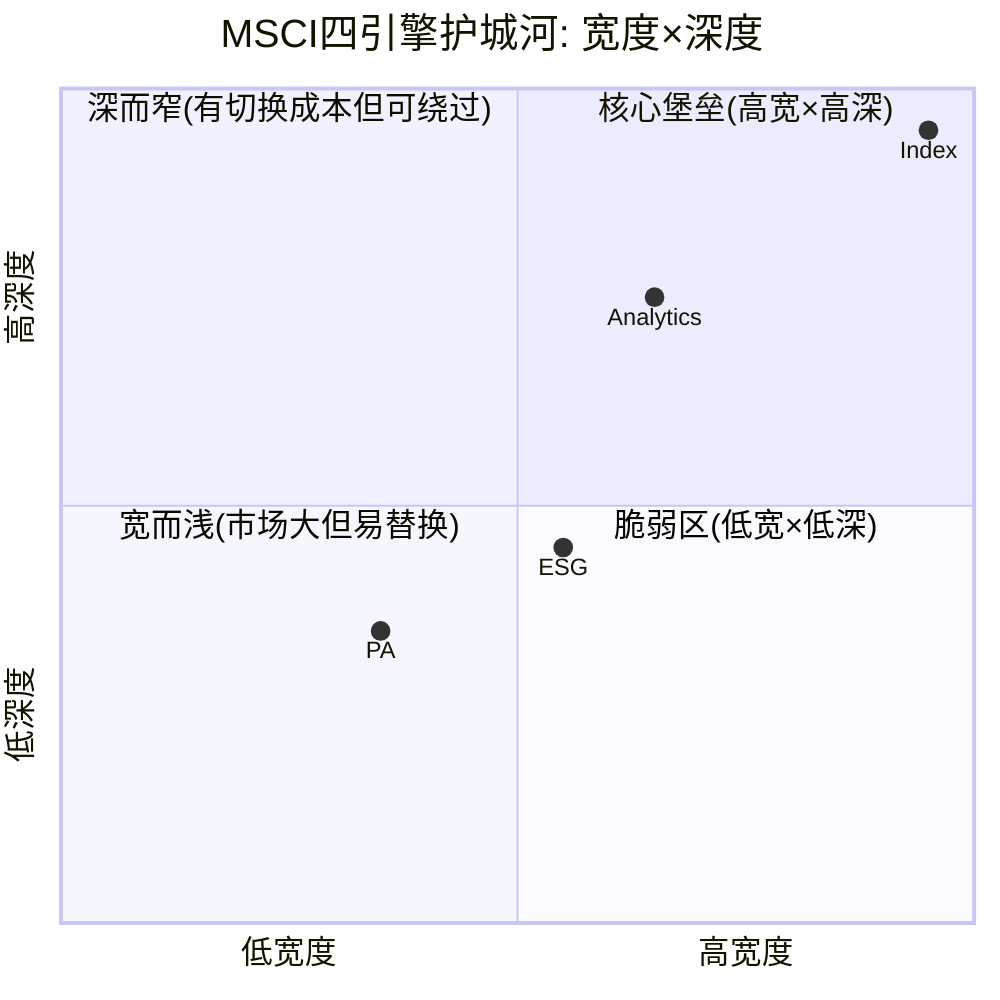

# Phase 1: 公司定位与护城河基础 — MSCI Inc.
> Phase 1 Staging | 2026-03-13 | 目标: 80-100K chars
> 模块覆盖: M1嵌入+M2网络+M5定价权+M6客户+M7国际+D5 Vanguard+CEO沉默+C1五层
> CQ映射: CQ-1(定价权天花板) + CQ-4(护城河耐久性) + CQ-5(BlackRock依赖) + CQ-7(攻守策略)

---

## Ch01: MSCI是什么 — "指数世界的铸币局"

### 1.1 一句话定位

MSCI Inc.是全球资本市场的基础设施公司——它不管理资金、不交易证券、不提供贷款，但全球超过$17万亿的投资资产按照它制定的规则运转。如果说标普500指数定义了"美国股市是什么"，那么MSCI的指数家族定义了"全球股市怎么分类"。

这不是一个软件公司、不是一个数据公司、甚至不是传统意义上的金融公司——它更接近一个**度量衡标准局**。正如米的定义决定了全世界的建筑图纸，MSCI的国家分类(发达/新兴/前沿)决定了数千亿美元的资金流向。2024年，仅希腊从新兴市场升级到发达市场这一个分类变更，就可能引发数十亿美元的被动资金重新配置。

### 1.2 四引擎商业模型

MSCI的收入来自四个引擎，每个引擎的增长逻辑、利润率、周期性截然不同。这种差异是理解MSCI的关键——它不是一家公司，而是四家截然不同的公司装在同一个壳里。

**引擎一: Index (指数许可) — 印钞机**
- FY2025收入: $1.81B (57.8%), 有机增长+14.0% [DM-BIZ-001]
- EBITDA margin: ~76% (全公司最高)
- 收入构成: 订阅费(基准许可、定制指数) + 资产挂钩费(ETF/基金按AUM收费) + 期货期权许可费
- 核心逻辑: 一旦ETF以MSCI指数为基准，每增加$1亿AUM → MSCI自动多收$2.41万/年(按2.41bps费率)，零边际成本
- AUM基数: $2.34T ETF直接挂钩 + 远超$14T间接使用(资管公司用MSCI作为归因基准)

**引擎二: Analytics (分析工具) — 稳定器**
- FY2025收入: $705M (22.5%), 有机增长+5.5% [DM-BIZ-001]
- 产品: 多资产风险模型、投资组合构建工具、性能归因系统
- 核心客户: 资管公司的中后台(风控部门/合规部门)
- 特征: 增速低但留存率高(~94.3%)，嵌入客户工作流后极难替换。类"企业级SaaS"

**引擎三: ESG & Climate (ESG评级) — 争议焦点**
- FY2025收入: $345M (11.0%), 有机增长+3.0% [DM-BIZ-001]
- 产品: ESG评级(8,500+公司)、气候风险模型、SFDR合规工具
- 净新增销售: -47.9% (FY2025) — 大幅转负
- 矛盾: 政治攻击(美国19州AG反ESG) vs 监管强制(EU SFDR Article 8/9) → 增长引擎→合规保险(H2假说)

**引擎四: Private Assets (私募资产) — 赌注**
- FY2025收入: $274M (8.7%), 有机增长+8.4% [DM-BIZ-001]
- 核心: Burgiss收购($913M, 2023) → 3,800 LP / $15T承诺资本 / 46年历史数据
- EBITDA margin: ~25% (全公司最低)
- 战略: 从"提供数据"→"定义分类法(taxonomy)" — 复制Index在公开市场的成功模式到私募市场

### 1.3 收入构成的隐含意义

```
订阅费收入 (71%) → 非周期、可预测、合同锁定
  ├── Index订阅: ~$560M (基准许可+定制指数)
  ├── Analytics订阅: ~$660M (风险/归因工具)
  ├── ESG订阅: ~$330M (评级+合规)
  └── PA订阅: ~$260M (私募数据+分析)

资产挂钩费 (26%) → 市场β驱动、零边际成本
  └── ETF+基金AUM × 费率(2.41bps) = ~$852M run rate [DM-BIZ-004]

非经常性 (3%) → 期权许可、一次性项目
  └── NYSE新增MSCI指数期权 [DM-NEW-003]
```

**71%订阅 + 26%AUM挂钩 = 97%经常性收入**。这是理解MSCI的第一个数字——几乎所有收入在年初就已经"锁定"或"可预测"。预收收入$1.23B = 4.7个月收入已经提前入账 [DM-FIN-106]。

### 1.4 人效与成本结构

MSCI只有6,184名员工 [DM-FIN-109]。人均创收$507K/年，人均EBITDA $312K/年。对比:
- SPGI: ~46,500员工, 人均创收$300K
- Moody's: ~15,000员工, 人均创收$437K

71%员工在新兴市场(印度、匈牙利、墨西哥) → 发达市场定价 × 新兴市场成本 = 结构性利润率优势。

研发支出$177.6M (5.67%/Rev), R&D CAGR +12.3% (FY2021-2025) [DM-FIN-007, DM-FIN-013]。MSCI不在10-K中单独披露R&D，这个数字来自fmp_data推算(嵌入在运营费用中的技术相关成本)。与SPGI类似，技术投入是运营费用的一部分而非独立科目 — 这意味着R&D投入的真实水平可能被低估或高估5-15%。

---

## Ch02: I×L双轴评估 — MSCI的基础设施嵌入度

### 2.1 I轴: 基础设施嵌入度

MSCI嵌入全球资管行业的方式，不同于传统软件或数据公司。它不是"工具"——你可以换掉Bloomberg终端，但你不能换掉基准指数而不改变整个投资框架。

**I1 流程嵌入深度: 4.5/5**

MSCI指数嵌入客户的哪些核心流程?

1. **投资政策声明(IPS)**: 机构投资者的IPS(养老金、主权基金、捐赠基金)通常规定"新兴市场权益基准为MSCI EM Index"。修改IPS需要董事会决议 + 受托人审批 + 受益人沟通 → 时间成本12-18个月
2. **ETF招股书**: iShares MSCI Emerging Markets ETF (EEM)的招股书将MSCI EM Index写入法律文件。更改基准=发行新基金+清算旧基金+投资者迁移。BlackRock不会为了节省2bps做这件事(Vanguard花了18个月才完成切换)
3. **性能归因系统**: 资管公司的季报/年报中"Alpha = 基金回报 - MSCI基准回报"。如果换基准，过去所有的归因数据都需要重做(历史回测兼容性问题)
4. **监管报告**: EU SFDR要求基金披露与"巴黎对齐基准"的对比 — 很多基金使用MSCI的Climate Paris Aligned指数作为合规基准
5. **指数再平衡**: 每季度MSCI调整成分股权重时，全球追踪基金必须同步调仓 — 这创造了MSCI"看不见的权力"(决定谁进谁出)

扣分原因(-0.5): MSCI不像FICO信用评分那样嵌入消费者层面(每个人都用)。MSCI嵌入的是机构层面 — 数量少但深度极大。

**I2 监管/制度关联: 3.0/5**

这是MSCI与FICO最大的差距:
- FICO: 嵌入Basel III(监管强制使用, 银行别无选择) → I2=5.0
- MSCI: 被EU SFDR引用为基准框架之一(但不是唯一指定) → I2=3.0

关键细节:
- EU SFDR Article 8/9基金可以选择MSCI Climate Index也可以选择FTSE Climate → **非排他性**
- UK FCA正在对Big Three(MSCI/SPGI/FTSE Russell)的70-80%利润率启动竞争审查 [lit_recon Route 2]
- 美国: 没有联邦法规引用MSCI(与FICO在Dodd-Frank中被引用不同)
- 但: MSCI的国家分类(发达/新兴/前沿)被全球所有机构事实使用 — 这是"软制度"而非"硬法规"

**I3 替代方案构建成本: 4.0/5**

如果有人想从零构建一个与MSCI竞争的全球指数体系:
- 需要: 50+年连续历史数据(MSCI最早追溯到1969年) — **不可复制**
- 需要: 覆盖70+国家、8,500+公司的证券数据 — 3-5年可建
- 需要: 获得100+大型机构采纳为基准 — 鸡生蛋问题，可能需要10年+
- 需要: 建立ESG评级方法论并获得市场信任 — 5-10年
- 反例: Solactive用10年建了30,000+指数，但$300B AUM仅为MSCI $17T的1.8% [DM-BIZ-007]

**I4 行业覆盖率: 4.0/5**

全球指数行业的"Big Three"控制>80%收入 [DM-SUB-001]:
- MSCI: ~$1.81B指数收入，$17T AUM挂钩 → 全球非美市场主导(EM/EAFE/ACWI)
- S&P DJI: S&P 500/DJIA主导美国市场，部分全球
- FTSE Russell: Russell 2000主导美国小盘，FTSE 100/250主导英国

MSCI的独特优势: 在**国际/跨境指数**领域几乎无竞争者。当一个美国养老基金要配置新兴市场时，MSCI EM Index是事实标准——FTSE EM和S&P EM的追踪AUM不到MSCI的1/5。

**I5 危机不可替代性: 3.5/5**

- 2020 COVID危机: 投资者需要快速重新评估国际敞口 → MSCI Climate/ESG工具需求暴增
- 2022利率冲击: 指数基准不变，但AUM挂钩费随市场下跌(-25% AUM → -25%费用收入) → 危机中订阅部分稳定，AUM部分暴露
- 希腊/阿根廷国家重分类: 市场危机触发的国家升降级 → MSCI成为"唯一裁判"(不可替代)

**I轴总分: 19.0/25**

### 2.2 L轴: 流动性壁垒

MSCI不是传统双边市场(不撮合买卖)，但它有一种独特的"流动性壁垒"——**追踪流动性**。

**追踪流动性的定义**: 当$17T资产追踪MSCI指数时，任何与MSCI指数偏离的投资策略都面临"追踪误差风险"。机构投资者的职业风险不是亏钱——是**与基准偏离太大**。这创造了一种自增强效应: 追踪MSCI的资金越多 → 偏离MSCI的风险越大 → 新基金更倾向于选择MSCI作为基准 → 追踪资金更多。

**L1 买方规模优势: 4.0/5**
- MSCI: $17T AUM挂钩(ETF $2.34T + 非ETF基金/SMA/模型组合)
- FTSE Russell: ~$5-6T AUM挂钩
- S&P DJI: ~$12T AUM挂钩(但主要在美国)
- 在国际指数领域，MSCI的规模优势>3x竞争者 = 5.0
- 在美国市场，S&P DJI占主导 = MSCI不参与
- 加权平均: 4.0

**L2 流动性自增强: 4.5/5**
```
更多追踪AUM → 更高的指数成分股流动性 → 更低的ETF跟踪误差
→ 更多基金选择MSCI基准 → 更多追踪AUM → 循环
```
这个飞轮在过去15年持续加速(被动化趋势): 全球被动基金占比从~15%(2010)→~35%(2025)，其中大量采用MSCI指数。

**L3 流动性启动门槛: 4.0/5**
新进入者的"鸡生蛋"问题:
- 你需要有机构采纳你的指数作为基准 → 才能吸引AUM
- 但没有AUM追踪的指数 → 没有流动性历史记录 → 机构不会采纳
- Solactive的突破方式: 从主题/定制指数切入(非核心基准) → 避开正面竞争

**L4 跨境流动性: 5.0/5**
MSCI的独特价值在于**跨境标准化**:
- MSCI ACWI = 一个指数覆盖23个发达市场+24个新兴市场
- MSCI EM Index = 新兴市场的事实标准(没有任何竞争者在这个领域有可比的覆盖广度+历史深度)
- 国家分类权: MSCI决定韩国是EM还是DM → 决定数百亿被动资金流向

**L5 流动性质量: 3.5/5**
指数的"流动性"是制度层面的(谁用我做基准)而非交易层面的(谁在我这里买卖)。流动性质量取决于:
- 采纳机构的多样性: 养老金+主权基金+共同基金+ETF+对冲基金 → 多样 ✓
- 但: 前10大客户占比可能>30%(BlackRock单独10.2%) → 集中度风险拉低质量

**L轴总分: 21.0/25**

### 2.3 I×L综合评估

```python
I_score = 19.0
L_score = 21.0
base_premium = 19 * 21 / 625 = 0.638

# I≥15 and L≥20 → 强嵌入+强流动性
premium = 1.2 + 0.638 * 0.2 = 1.328 → 基础设施溢价 ~33%
```

**MSCI I×L 对标**:

| 公司 | I合计/25 | L合计/25 | 溢价 | 核心差异 |
|------|:-------:|:-------:|:----:|---------|
| MSCI | 19.0 | 21.0 | ~33% | I2(监管)弱于FICO/MCO，但L4(跨境)最强 |
| CPRT | 19 | 25 | ~45% | L轴满分(物理流动性不可复制) |
| FICO | 22 | 15 | ~35% | I轴最强(监管硬嵌入) |
| Visa | 21 | 24 | ~55% | I+L双高(支付网络效应极强) |
| MCO | 21 | 18 | ~40% | I2(监管)=5.0(评级强制) |

**关键洞察**: MSCI的基础设施嵌入不如FICO(缺乏硬监管嵌入)但流动性壁垒超过FICO和MCO。MSCI的护城河更像Visa而非FICO——它的力量来自"所有人都在用所以新人也必须用"(网络/标准效应)，而非"法规说你必须用"(监管嵌入)。

---

## Ch03: C1五层制度嵌入深度验证

### 3.1 五层框架 (CQI v3.0)

MSCI的制度嵌入不是单层的——它在五个不同的层次上与资管行业绑定。每一层的强度不同，这决定了护城河的"形状"和脆弱点。

```
┌─────────────────────────────────────────────────┐
│ L5 文化嵌入 ████████████████████ 5.0/5          │
│ "不用MSCI基准 = 不专业"                          │
│ • 资管行业从业者的培训教材就用MSCI指数            │
│ • CFA考试中的投资组合管理案例使用MSCI基准         │
│ • 新入行的基金经理"默认"选择MSCI EM              │
├─────────────────────────────────────────────────┤
│ L4 运营嵌入 ████████████████████ 5.0/5          │
│ "拔出MSCI整个工作流崩溃"                         │
│ • IPS中写明MSCI基准 → 修改需董事会决议           │
│ • 归因系统基于MSCI → 换基准=重写所有历史归因     │
│ • 合规报告引用MSCI分类 → 切换=重做监管备案       │
│ • ETF招股书硬编码 → 切换=发新基金+清算旧基金     │
├─────────────────────────────────────────────────┤
│ L3 合同嵌入 ████████████████     4.0/5          │
│ "多年合同锁定"                                   │
│ • BlackRock合同延至2035 [DM-BIZ-005]            │
│ • 大型资管公司通常签3-5年许可协议                 │
│ • 但: 合同可以谈判降价(费率下限逐续约-0.1bp)    │
├─────────────────────────────────────────────────┤
│ L2 监管嵌入 ██████████           2.5/5          │
│ "有引用但非指定"                                 │
│ • EU SFDR: 可选MSCI Climate Index作为基准        │
│ • 但: 也可选FTSE/S&P Climate → 非排他           │
│ • UK FCA: 正在审查Big Three定价 → 监管可能削弱   │
│ • 美国: 无联邦法规引用MSCI                       │
│ • vs FICO: Basel III硬编码FICO评分 → L2=4.5     │
├─────────────────────────────────────────────────┤
│ L1 法律嵌入 ████                 1.0/5          │
│ "没有法律垄断"                                   │
│ • MSCI指数不受专利保护(方法论公开)               │
│ • 任何人可以构建替代指数(Solactive已证明)        │
│ • vs FICO: 部分州法律直接引用FICO → L1=3.0      │
└─────────────────────────────────────────────────┘
```

### 3.2 C1五层加权评分

各层重要性不等——L4/L5在实际护城河贡献中远大于L1/L2，因为**切换成本来自运营嵌入(L4)而非法律嵌入(L1)**。

| 层级 | 分数 | 权重 | 加权 | FICO对比 | 差距 |
|------|:----:|:----:|:----:|:--------:|:----:|
| L5 文化 | 5.0 | 25% | 1.25 | 5.0 | 0 |
| L4 运营 | 5.0 | 30% | 1.50 | 5.0 | 0 |
| L3 合同 | 4.0 | 20% | 0.80 | 4.0 | 0 |
| L2 监管 | 2.5 | 15% | 0.375 | 4.5 | -2.0 |
| L1 法律 | 1.0 | 10% | 0.10 | 3.0 | -2.0 |
| **加权** | | | **4.03** | **4.45** | **-0.42** |

**MSCI C1=4.0 vs FICO C1=4.5 → 差距集中在L2/L1(底部两层)**

### 3.3 护城河脆弱点分析

**L2=2.5是MSCI护城河的最大脆弱点。** 为什么?

FICO的L2=4.5意味着: 即使所有客户想切换，监管要求他们继续使用FICO评分。这是"不可抗力级别"的护城河。

MSCI的L2=2.5意味着: 如果UK FCA竞争审查导致强制费率上限(类似欧洲银行卡手续费上限)，或EU SFDR修改为要求使用欧洲自建指数(EU ESRS) → MSCI的监管嵌入可能进一步削弱。

但L4/L5=5.0的含义是: 即使监管削弱，客户的**惯性**和**切换成本**极高。Vanguard 2012是唯一成功的大规模切换案例——花了18个月、$537B资产转移、MSCI股价暴跌30%但12个月内收复。这证明: 切换代价极大(对切换者和MSCI都是)，大多数客户不愿承受。

### 3.4 护城河趋势仪表盘

| 层级 | 当前 | 3年趋势 | 5年展望 | 驱动因素 |
|------|:----:|:------:|:------:|---------|
| L5 文化 | 5.0 | → 稳定 | → 稳定 | CFA/CAIA教育惯性极强 |
| L4 运营 | 5.0 | → 稳定 | ↗ 微升 | 更多ETF=更多嵌入点(NYSE期权新增) |
| L3 合同 | 4.0 | → 稳定 | ↘ 微降 | 大客户续约时谈判力增强(费率-0.1bp/续) |
| L2 监管 | 2.5 | ↗ 微升 | ? 不确定 | EU SFDR推高→FCA可能打压→净效果不确定 |
| L1 法律 | 1.0 | → 稳定 | → 稳定 | 无法律嵌入趋势变化 |

**净趋势**: 整体稳定略偏正(L4微升抵消L3微降)。关键不确定性在L2(监管方向)。

### 3.5 护城河宽度×深度×半衰期矩阵

MSCI不是一个护城河——它是**四条护城河**装在一个壳里，每条的宽度、深度和持久性截然不同。

**四引擎护城河矩阵:**

| 引擎 | 宽度(市场地位) | 深度(切换成本) | 半衰期 | 趋势 | 核心威胁 |
|------|:----------:|:---------:|:-----:|:----:|---------|
| **Index** | 5.0 (国际无对手) | 5.0 (IPS+ETF硬编码) | **>50年** | →稳定 | 被动化逆转(极低概率) |
| **Analytics** | 3.5 (多竞争者) | 4.0 (工作流嵌入) | **25-35年** | ↗ 云迁移增厚 | AI替代分析工具 |
| **ESG** | 3.0 (方法论争议) | 2.5 (可替换评级) | **10-15年** | ↘ 政治侵蚀 | anti-ESG运动+方法论失信 |
| **PA** | 2.0 (建设中) | 2.0 (数据壁垒在建) | **?不确定** | ↗ 数据积累 | Preqin(BlackRock)竞争 |

**半衰期解释:**

**Index >50年**: MSCI指数从1969年开始编制(56年历史)。要摧毁这个护城河需要: ①所有机构投资者同时切换基准(协调成本天文数字) ②出现比MSCI覆盖更广、历史更长的替代指数(时间不可复制) ③被动投资趋势全面逆转(目前毫无迹象)。最可能的衰减路径不是"被替代"而是"被稀释"——Direct Indexing让客户自建组合，部分绕过MSCI标准指数。但即使Direct Indexing达到$1T规模，MSCI仍可从中收费(因为定制指数仍需MSCI的底层成分股数据)。

**Analytics 25-35年**: Barra风险模型在资管行业已嵌入30年+。云迁移后切换成本更高(数据格式绑定)。但AI有潜在威胁: 如果大型语言模型能直接从原始市场数据构建等效的风险因子模型，客户可能不再需要Barra。不过这需要: ①AI模型能通过监管验证(机构投资者用的风险模型需要合规审批) ②AI模型有足够的历史回测(至少10-20年)。最乐观的AI替代时间线: 2035-2040年。

**ESG 10-15年**: 当前ESG护城河主要靠EU SFDR强制和8,500+公司的评级覆盖。但: ①美国anti-ESG运动可能蔓延到欧洲(或欧洲发展自有标准) ②方法论争议(相关性0.54)削弱市场信任 ③如果AI能自动从公开数据生成ESG评估，MSCI的评级中介价值下降。最可能结局: ESG不会消失(监管锁定)，但从"高增长高溢价业务"变成"低增长合规服务"。

**PA ?不确定**: 太早判断。Burgiss的46年历史数据是真实壁垒，但私募市场的数据标准化仍在早期。如果MSCI成功成为私募领域的"MSCI指数"(定义分类法+编制基准) → 半衰期可能>30年。如果失败 → Burgiss退化为"数据库之一"(半衰期<10年)。这是MSCI报告中最大的不确定性。

**综合护城河半衰期加权估算:**

```
Index(57.0%收入) × >50年 = 28.5年贡献
Analytics(22.8%) × 30年 = 6.8年贡献
ESG(11.3%) × 12.5年 = 1.4年贡献
PA(8.9%) × 20年(乐观中值) = 1.8年贡献

加权半衰期 ≈ 38.5年 → 远超多数上市公司(中位数~15年)
```

但这个加权数字掩盖了一个关键风险: **ESG和PA的不确定性可能拖累整体估值**。如果ESG半衰期从12.5年降至5年(方法论完全失信) + PA失败(半衰期<5年) → 加权半衰期从38.5年降至35年(影响有限)。这说明: **MSCI的护城河耐久性主要由Index决定——只要Index不倒，MSCI就是一台印钞机**。

### 3.6 护城河宽度×深度 Mermaid映射



Index处于"核心堡垒"象限, Analytics在"深而窄"边缘, ESG在"宽而浅"与"脆弱区"交界, PA在"脆弱区"但有向上移动潜力。

---

## Ch03b: 寡头博弈 — MSCI/SPGI/FTSE Russell的Nash均衡

### 3b.1 指数三寡头格局

全球指数许可市场是一个典型的寡头垄断(Oligopoly)——三家公司控制>80%的收入和AUM:

| 维度 | MSCI | S&P DJI | FTSE Russell |
|------|:----:|:------:|:----------:|
| 母公司 | MSCI Inc. | S&P Global(SPGI) | LSEG |
| 收入(指数) | ~$1.79B | ~$1.9B* | ~$1.2B* |
| 主导领域 | 国际/EM/ACWI | 美国大盘(S&P 500) | 美国小盘(Russell 2000)+英国 |
| 挂钩AUM | $17T+ | $12T+ | $5-6T |
| ETF数量 | 1,600+ | 800+ | 600+ |
| OPM | 54.7%(整体) | ~68%(分部)* | ~50%(分部)* |

*S&P DJI和FTSE Russell数据为估算, 因分部披露有限

### 3b.2 Nash均衡分析

**当前均衡状态: 地理分割型寡头**

三巨头形成了一种"默契分割"——各自主导不同市场领域, 避免正面价格战:

```
S&P DJI: "美国大盘是我的"
  → S&P 500 = 美国股市的代名词
  → 没有任何竞争者试图挑战这个地位(MSCI USA指数追踪量<S&P 500的1/10)

MSCI: "国际市场是我的"
  → MSCI EM/EAFE/ACWI = 非美市场的代名词
  → FTSE EM的追踪量<MSCI EM的1/5(Vanguard切换后未改变格局)

FTSE Russell: "美国小盘+英国是我的"
  → Russell 2000 = 美国小盘股的代名词
  → FTSE 100/250 = 英国市场的代名词
```

**这个均衡为什么稳定?**

1. **进攻成本>防守收益**: MSCI如果想挑战S&P 500 → 需要让所有追踪S&P 500的基金切换到"MSCI USA 500" → 几乎不可能(切换成本 > 任何可能的费率优惠)
2. **费率战无赢家**: 如果一家开始降价 → 其他两家跟进 → 所有人收入下降 → 客户也不会因此增加追踪量(追踪量由被动化趋势决定, 不由费率决定)
3. **新进入者被流动性壁垒阻挡**: Solactive花10年才获得$300B AUM(<MSCI的2%), 且主要在非核心领域(主题ETF)

### 3b.3 均衡的潜在打破者

| 打破者 | 方式 | 概率(10年) | 影响 |
|--------|------|:--------:|------|
| **Solactive** | 低成本颠覆(自下而上) | 15% | 蚕食边缘(主题/区域), 不影响核心 |
| **自建指数** | 大型资管公司内化(BlackRock/Vanguard) | 10% | 直接从MSCI抢AUM |
| **监管干预** | FCA/EU强制开放竞争 | 20% | 费率天花板, 不改变格局 |
| **Direct Indexing** | 客户自定义绕过标准指数 | 25% | 改变收费模式(从AUM→订阅) |
| **AI生成指数** | 算法自动编制等效指数 | 5% | 长期威胁, 需监管认可 |
| **地缘割裂** | 中国/印度推自有指数体系 | 15% | 区域市场蚕食 |

**Direct Indexing是最值得关注的**: $135B且快速增长。如果Direct Indexing达到$1T+ → 部分投资者不再需要MSCI的标准指数ETF(因为他们可以直接"复制+定制")。但MSCI已经在Direct Indexing中布局(提供底层成分股数据和权重) → 收费模式从"AUM挂钩"变成"订阅+数据许可"。定制指数run rate +16%增长证明MSCI正在适应。

### 3b.4 寡头溢价评估

三寡头格局给MSCI提供的估值溢价:

```
竞争格局溢价计算:
  → 寡头市场: 定价权稳定(5-7%年提价无客户流失)
  → 低价格弹性: 降价不会显著增加需求(AUM增长由市场β决定, 不由费率决定)
  → 高进入壁垒: 50年数据+$17T追踪量不可复制

  → 如果MSCI面对完全竞争(10+等量竞争者): 合理PE ~18-22x
  → 如果MSCI在当前寡头格局: 合理PE ~28-35x
  → 寡头溢价: ~10-15x PE 或 ~40-60% EV溢价
```

这个溢价能否维持取决于Nash均衡的稳定性。当前证据(Solactive 10年仅2%渗透 + 三巨头地理分割稳定)支持均衡至少再维持10-15年。

---

## Ch04: 定价权阶段模型 — Stage 1.7: 近天花板

> CQ-1核心: MSCI的定价权已到天花板了吗?
> 框架: 定价权阶段模型v1.0 (FICO报告首创, 可迁移)
> H1假说: OPM弹性耗尽 → PE从"利润率扩张故事"重定价为"收入增速故事"

### 4.1 定价权阶段定位

定价权不是"有或没有"——它是一个从释放到耗尽的连续过程。FICO报告中首创的阶段模型将定价权分为四个阶段:

| 阶段 | 特征 | OPM轨迹 | PE倍数逻辑 | 代表 |
|:----:|------|---------|-----------|------|
| 0 | 定价权未被发现/未被利用 | <20% | 被低估 | FICO 2012 |
| 1 | 定价权加速释放 | 快速扩张 | PE扩张(市场发现OPM弹性) | FICO 2015-2020 |
| 1.5 | 释放减速但仍在扩张 | 放缓扩张 | PE高位震荡 | MSCI 2019-2021 |
| **1.7** | **接近天花板, 弹性近耗尽** | **±1-2pp** | **PE压缩(市场重新定价)** | **MSCI 2022-2026** |
| 2 | 定价权饱和, OPM平台期 | 平坦 | PE稳态(收入增速定价) | 未来MSCI? |

### 4.2 MSCI Stage 1.7的证据

**证据一: OPM扩张轨迹减速 — 16年完整数据**

MSCI从2010年IPO后的成本结构整理期，经历了完整的定价权释放曲线:

```
                OPM轨迹 2010-2025 (16年完整数据)

FY2010: OPM 31.1%  ┐
FY2011: OPM 35.7%  │ Phase 0: 后IPO整理期
FY2012: OPM 36.5%  │ Morgan Stanley分拆后成本优化
FY2013: OPM 35.9%  │ (含RiskMetrics整合拖累)
FY2014: OPM 33.8%  ┘ ISS剥离→收入下滑, OPM暂降

FY2015: OPM 37.6%  ┐
FY2016: OPM 42.4%  │ Stage 1: +3pp/年 (快速释放)
FY2017: OPM 45.5%  │ 驱动: Index收入mix提升+人员转移新兴市场
FY2018: OPM 47.9%  ┘

FY2019: OPM 48.5%  ┐
FY2020: OPM 52.2%  │ Stage 1.5: +2pp/年 (减速)
FY2021: OPM 52.5%  ┘ 2020 COVID削减T&E +200-300bps(部分永久)

FY2022: OPM 53.7%  ┐
FY2023: OPM 54.8%  │ Stage 1.7: +0.5pp/年 (近停滞)
FY2024: OPM 53.5%  │ ← FY2024实际下降1.3pp(R&D +20% YoY + Burgiss整合)
FY2025: OPM 54.7%  ┘ [DM-FIN-004]
```

**从+3pp/年(Stage 1)减速到+0.5pp/年(Stage 1.7) → 弹性释放速度下降85%。**

注意FY2024的回落: OPM从54.8%降至53.5%(-1.3pp)是Stage 1.7的关键信号——当OPM接近天花板时，任何增量投入(R&D/并购整合)都会立即拉低OPM，因为"无成本扩张"的空间已经耗尽。FY2025恢复至54.7%是因为收入加速(+9.7%)跑赢了成本增长，但这种"收入拉动"而非"成本压缩"的OPM维持方式，本身就是Stage 1.7的特征。

**Adjusted EBITDA Margin讲的是同一个故事**: FY2024 60.1% → FY2025 60.8% → 分析师共识FY2030E ~65.3%。即使最乐观的预期也只预测5年+4.5pp的EBITDA扩张——相当于2015-2020年一年的扩张量。

**Gross Margin轨迹印证成本结构固化**:
- FY2010: ~70% → FY2015: ~74% → FY2020: ~79% → FY2025: 82.4%
- 15年提升12.4pp，年均+0.8pp
- 但可变成本已压缩至接近极限(82.4%的毛利率意味着每$1收入只花$0.18直接成本)
- 剩余成本主要是人工(6,184员工)、技术基础设施和数据采购——这些是半固定的

**证据二: OPM天花板估算 — 成本结构分解**

MSCI属于T1级别(零边际成本)，理论OPM天花板60-70%。但实际天花板受约束:

**FY2025成本结构分解 (Revenue $3,135M):**

| 成本项 | 金额 | 占收入% | 可压缩性 | 理由 |
|--------|------|:------:|:-------:|------|
| 直接成本(COGS) | ~$550M | 17.6% | 低(→15-16%) | 数据采购+客户服务+指数运算基础设施 |
| R&D | $178M | 5.7% | **不可压缩** | AI时代研发只增不减; 资本化R&D另+$90.5M |
| SBC | $111M | 3.55% | **不可压缩** | 科技人才竞争, MSCI在纽约/伦敦/孟买争夺数据科学家 |
| SG&A | ~$500M | 16.0% | 中(→12-14%) | 销售团队+公司行政; AI可替代部分后台 |
| D&A | $219M | 7.0% | 低 | 主要来自并购(Burgiss $913M+Carbon Delta+RCA) |

**不可压缩成本底线: ~14-16% (R&D + SBC + 最低G&A)**

→ 实际OPM天花板 ≈ Gross Margin(82.4%) - 不可压缩成本(14-16%) = **~57-60%** (Reported)
→ Adjusted EBITDA天花板 ≈ 65-68% (加回D&A+SBC)

**同行对标验证天花板合理性:**

| 公司 | FY2025 OPM | Adj. EBITDA | 业务模型差异 | 天花板参考 |
|------|:---------:|:----------:|------------|:---------:|
| **MSCI** | **54.7%** | **60.8%** | 指数许可+数据订阅 | 57-60% |
| S&P Global | 42.2% | ~50.2% | 评级(周期性)+Index+MI | ~50% |
| Moody's | 44.8% | ~51.0% | 评级(强周期性)+Analytics | ~52% |
| ICE | 38.7% | ~52.6% | 交易所+数据+房贷科技 | ~45% |
| LSEG | N/A | ~55.6% | 数据+Analytics+FTSE Russell | ~50% |

MSCI已经比任何同业高出10-16pp的OPM。这不是偶然——它反映了指数许可的独特经济学(近零边际成本)。但也意味着MSCI已经几乎完全提取了商业模型的内在利润率优势，进一步扩张需要的不是"效率提升"而是"商业模型变化"(比如PA变成高利润率业务)。

**AI的潜在影响**: CEO Fernandez提到AI将股权模型发布周期缩短~40%。如果AI将SG&A中的~$100-150M可自动化后台工作减少30-40% → 节省$30-60M/年 → OPM可能额外提升1-2pp。但这是3-5年的渐进过程，不是阶跃函数。

当前OPM 54.7% vs 天花板57-60% = **剩余弹性仅2-5pp** (不含AI bonus的1-2pp)

**证据三: PE行为印证阶段转换**

| 时期 | OPM变化 | PE变化 | 市场解读 |
|------|---------|--------|---------|
| 2015-2018 | +9pp | 30x→50x (+67%) | "发现了OPM弹性, 重新定价" |
| 2019-2021 | +5pp | 50x→73x (+46%) | "弹性还在, 加上ESG叙事" |
| 2022-2025 | +2.7pp | 73x→34x (-53%) | **"弹性快没了, 回归收入增速定价"** |

**这就是H1假说的核心**: PE压缩不是"暂时低估"——它是市场认识到OPM弹性正在耗尽后的**结构性重定价**。

### 4.3 B4定价权双维度拆分

**B4a 定价权强度: 4.5/5**
- 订阅定价: 年化mid-single digit提价(5-7%)，无显著客户流失(留存率94-96%) [DM-BIZ-003]
- AUM挂钩: 自动跟随市场增长(零额外销售努力) — 这是"隐形定价权"
- 新产品溢价: 期权许可(NYSE新增)、Direct Indexing、私募信用指数 → 新定价权来源
- 证据: Gross Margin 82.4% [DM-FIN-003] → 在全球信息服务公司中属于顶级

**B4b 定价权持久性: 3.5/5**
- 费率压缩: AUM挂钩费率从~2.7bps(2018)→2.41bps(2025)→持续下降趋势 [DM-BIZ-004]
- BlackRock合同: 每次续约费率下限降~0.1bp [DM-BIZ-005] → 最大客户的谈判力在增强
- Solactive竞争: 费率比MSCI低~70% [lit_recon Route 2] — 目前只影响边缘市场(主题ETF)，但如果渗透核心基准?
- Direct Indexing: $135B且快速增长 → 部分绕过MSCI(客户自定义指数而非购买MSCI标准指数)
- 对冲因素: 新收入来源(期权许可、Climate指数溢价)部分抵消费率压缩

**B4综合: 4.0/5** (B4a × 0.5 + B4b × 0.5 = 4.0)

### 4.4 定价权与估值的桥梁

这是CQ-1的核心回答:

```
Stage 1.7的投资含义:

1. OPM弹性不能再为EPS增长"加杠杆"
   → 过去: EPS增长 = Revenue增长(10%) × OPM扩张(1.05x) = ~12-15%
   → 未来: EPS增长 ≈ Revenue增长(8-10%) × OPM平坦(1.0x) + 回购(2-3%) = ~10-13%

2. PE的"弹性溢价"消失
   → 过去PE=50-73x: 定价了OPM从50%→70%的扩张路径(+20pp, 每pp价值~$0.5B EBITDA)
   → 现在PE=34x: 只定价了收入增速+回购 — 这是"正确"的PE水平还是过度悲观?

3. 新均衡PE区间估算
   → 如果MSCI变成"稳定高质量现金牛"(类Visa): PE 25-30x
   → 如果收入端加速(PA爆发或AUM大涨): PE 35-40x
   → 当前34x → 接近"现金牛"估值的上沿 / "增长股"估值的下沿
```

**CQ-1初步结论(P0.5置信度55% → Phase 1更新至60%)**:
定价权没有消失(B4a=4.5仍然很强)，但定价权的**估值转化效率**正在下降(OPM接近天花板)。当前PE 34x合理反映了这个转变——既不是"严重低估"(30x以下)也不是"明显高估"(40x以上)。

---

## Ch05: 客户集中度 — BlackRock依存症

> CQ-5核心: BlackRock是朋友还是敌人?
> 模块: M6客户集中度

### 5.1 BlackRock关系数据

**硬数据 [DM-BIZ-005]**:
- BlackRock占MSCI总收入: 10.2% (FY2024, 较FY2019的11.5%缓慢稀释)
- 其中96.1%来自资产挂钩费(即BlackRock管理的追踪MSCI指数的ETF/基金的AUM × 费率)
- 合同期限: 延至2035
- 费率条款: 每次续约费率下限降~0.1bp
- BlackRock个人还是MSCI股东: 持股7.97%(第二大机构股东) [DM-SMT-001]

### 5.2 依赖度解剖

```
BlackRock对MSCI收入贡献拆分:

总收入贡献: $3.134B × 10.2% = ~$320M

其中:
  资产挂钩费: $320M × 96.1% = ~$307M
    → 来源: iShares MSCI ETF系列(EEM/EAFE/ACWI/World等)
    → 驱动: BlackRock管理的MSCI挂钩AUM × 费率
    → 风险: 如果BlackRock将10%的AUM从MSCI切换到FTSE → MSCI损失~$30M/年

  订阅费: $320M × 3.9% = ~$12M
    → 来源: Analytics工具 + ESG评级订阅
    → 风险: 低(订阅与指数许可独立)
```

### 5.3 朋友 vs 敌人的双面性

**朋友的一面:**
- BlackRock是全球最大ETF发行商($10T+ AUM)→ 被动化趋势=MSCI收入自动增长
- Vanguard 2012切换后，BlackRock公开表态MSCI是"gold standard" → 信号价值巨大
- 合同至2035 → 至少9年内不用担心全面切换
- BlackRock持有MSCI 7.97%股份 → 利益绑定(切换会损害自己的持仓价值)

**敌人的一面:**
- $3.2B收购Preqin(2024.6) → 在Private Assets领域直接与MSCI竞争
- 谈判筹码不对称: MSCI需要BlackRock(10%收入)远多于BlackRock需要MSCI(可切换到FTSE)
- 费率持续压缩(每续约-0.1bp) → BlackRock在每次合同谈判中都在"温水煮青蛙"
- 如果BlackRock发展自有指数能力(类S&P DJI模式) → 内化收入而非外付费用

### 5.4 BlackRock 2035合同详情

2026年1月27日, MSCI与BlackRock Fund Advisors修改了Master Index License Agreement, 将合同延长至**2035年3月31日**, 之后自动3年续约(除非任一方提前通知)。

**合同结构解剖:**

| 条款 | 详情 | 含义 |
|------|------|------|
| 期限 | 至2035-03-31, 自动3年续约 | 9年确定性 → 消除Vanguard式尾部风险 |
| 费率 | 基于AUM×费用率的阶梯费率 | "价格-数量互换"(低单价换高保量) |
| 2026变更 | 自2026-01-01起部分基金费率修改 | 短期费率让步→长期锁定 |
| 2027变更 | 自2027-01-01起进一步调整 | 分阶段降费, 平滑影响 |
| 具体费率 | **保密(SEC filing已遮盖)** | 无法精确量化bps变化 |

**BlackRock的双重身份:**

BlackRock不仅是MSCI的最大客户(10.2%收入)——它还是MSCI的第二大股东(7.3%, 540万股, 价值~$2.9B)。这创造了一种独特的"利益绑定":

```
BlackRock身份1 — 客户:
  → 想压低指数许可费(降低iShares成本)
  → 想获得最优合同条件(2035延期+费率阶梯)
  → 有替代选项(FTSE Russell)但切换成本极高

BlackRock身份2 — 股东:
  → 希望MSCI股价上涨(持股$2.9B)
  → 不希望引发市场恐慌(自损八百)
  → 在MSCI股东大会上有投票权

→ 两个身份的利益部分冲突: 作为客户想降费, 作为股东不想降费(降费→利润下降→股价下跌)
→ 均衡结果: 每次续约小幅降费(满足客户身份) + 不触发重大切换(保护股东身份)
→ 这就是"温水煮青蛙"的经济学解释
```

**$852M ABF Run Rate中BlackRock的贡献:**

BlackRock管理的追踪MSCI指数的ETF包括:
- iShares MSCI Emerging Markets ETF (EEM): ~$20B AUM
- iShares MSCI EAFE ETF (EFA): ~$50B AUM
- iShares MSCI ACWI ETF (ACWI): ~$15B AUM
- iShares Core MSCI系列: EEM($80B)/EAFE($100B+)/World等
- 其他区域/主题ETF: 100+产品

BlackRock在MSCI ETF AUM中的占比约60-70%(估算$1.4-1.6T / $2.34T)。按2.41bps费率 → BlackRock贡献ABF收入约$337-386M/年。这与10-K披露的BlackRock总贡献$320M有差异, 因为合同中的阶梯费率可能使BlackRock的有效费率低于平均2.41bps(大客户折扣)。

### 5.5 Vanguard 2012 vs BlackRock 2035: 结构性差异

| 维度 | Vanguard 2012 | 假设BlackRock切换 |
|------|:---:|:---:|
| 涉及AUM | $537B | 潜在$1.5-2T |
| 收入影响 | ~$24M/年(~3%) | ~$150-200M/年(~5-6%) |
| 切换动机 | 成本削减(Vanguard低费率DNA) | 战略整合(自有指数生态) |
| 替代方案 | CRSP+FTSE Russell(已成熟) | 自建+FTSE Russell |
| 切换难度 | 中(22只基金, 18个月) | 极高(100+产品, 全球客户) |
| 信号效应 | 重大负面(但MSCI存活) | 可能致命(市场信心崩溃) |

**关键差异**: Vanguard切换是"一个大客户离开"(可恢复)。BlackRock切换将是"最大客户+标准制定者离开"(可能触发连锁反应)。

**但BlackRock切换的概率极低(Phase 0.5估计<5%)**:
1. 合同至2035(违约成本巨大)
2. BlackRock持有MSCI 7.97%股份(自损八百)
3. 切换100+全球产品的执行风险远大于Vanguard的22只基金
4. BlackRock的核心竞争力是资产管理，不是指数编制——Preqin收购是数据竞争(PA)而非指数竞争(Index)

### 5.5 集中度风险量化

**如果BlackRock部分切换(10%资产费AUM → FTSE Russell):**
- 收入影响: ~$30M/年(~1%)
- 利润影响: ~$30M × 76%(Index margin) = ~$23M EBITDA(-1.2%)
- 股价影响: -5~10%(市场恐慌 > 实际影响)

**如果BlackRock完全切换(不可能但需量化worst case):**
- 收入影响: ~$307M/年(~10%)
- 利润影响: ~$307M × 76% = ~$233M EBITDA(-12%)
- 股价影响: -30~40%(Vanguard 2012先例-30%, BlackRock影响2-3x)
- 恢复时间: 可能2-3年(vs Vanguard的12个月), 因为规模更大

---

## Ch06: 国际化分析 (EVO-001强制)

> EVO-SPGI-001门控: 国际收入>30% → 必须包含地理分析
> MSCI国际收入~55% → 门控触发

### 6.1 地理收入分布 — 精确数据

**总收入地理分布 (FY2023-2025, 含全部收入类型):**

| 地区 | FY2023 | FY2024 | FY2025 | FY24增速 | FY25增速 |
|------|-------:|-------:|-------:|:-------:|:-------:|
| **Americas** | $1,156M | $1,298M | $1,408M | +12.3% | +8.5% |
| -- 美国 | $1,044M | $1,169M | $1,267M | +12.0% | +8.4% |
| -- 其他美洲 | $112M | $129M | $141M | +15.2% | +9.1% |
| **EMEA** | $977M | $1,112M | $1,242M | +13.8% | **+11.7%** |
| -- 英国 | $408M | $480M | $544M | +17.5% | +13.3% |
| -- 其他EMEA | $569M | $632M | $699M | +11.1% | +10.5% |
| **APAC** | $396M | $446M | $484M | +12.8% | +8.5% |
| -- 日本 | $101M | $114M | $128M | +13.3% | +11.8% |
| -- 其他亚太 | $295M | $332M | $357M | +12.6% | +7.4% |
| **合计** | **$2,529M** | **$2,856M** | **$3,135M** | **+12.9%** | **+9.7%** |

**FY2025地理占比**: Americas 44.9% | EMEA 39.6% | APAC 15.5%

**5年CAGR (FY2020-2025)**:
- EMEA: ~14.6% (最快)
- Americas: ~12.1%
- APAC: ~12.1%

**关键趋势**: EMEA从35%(2017)→39.6%(2025)持续增长，主要受EU SFDR驱动的ESG/Climate需求推动。英国单独贡献$544M(EMEA的44%)——如果UK FCA竞争审查实施费率上限，这将直接影响MSCI最大的非美国子市场。

### 6.2 区域风险-机会矩阵

**Americas (45%)**:
- 机会: 被动化持续(美国ETF市场仍在增长) + Direct Indexing新需求 + 期权许可(NYSE新增)
- 风险: Anti-ESG运动(19州AG联名) → ESG订阅在美国可能持续萎缩 | Solactive在美国主题ETF市场抢份额

**EMEA (38%)**:
- 机会: EU SFDR强制ESG合规 → Climate/ESG指数需求结构性上升 | 养老基金长期配置增加
- 风险: UK FCA竞争审查(可能限制费率) | EU ESRS标准可能内化ESG评估(绕过MSCI) | 英镑/欧元汇率波动

**APAC (17%)**:
- 机会: 中国资本市场开放(MSCI A-shares指数) | 日本GPIF等巨型养老金+澳洲Super增长
- 风险: 中国政策不确定性(之前暂停A-shares纳入进程) | 区域指数供应商竞争(中证/恒生)

### 6.3 地理多元化评估

MSCI的55%国际收入提供了有意义的地理多元化——特别是Americas和EMEA在ESG上面临完全相反的政策方向(美国反ESG vs 欧洲强制ESG)。这意味着:

**ESG的"天然对冲"**: 如果美国ESG全面被禁(极端场景) → EMEA ESG需求仍然结构性存在。如果EU强制使用自有标准(极端场景) → 美国ESG可能因政策反转而恢复。两个极端场景不太可能同时发生。

**但整体增速受限**: 增速最快的EMEA (38%) 也面临FCA定价审查风险。如果FCA限制指数费率 → EMEA收入增速将大幅放缓。

---

## Ch07: CEO沉默分析 (QG-01.5)

> v18.0必做模块 | 基于最近2-3次财报电话会

### 7.1 CEO Fernandez沉默登记表

| 沉默领域 | CEO在说什么 | CEO没说什么 | 可能原因 | 风险等级 | CQ关联 |
|---------|-----------|-----------|---------|:-------:|:------:|
| **OPM天花板** | "持续运营杠杆"+"效率提升" | 从未提及OPM目标区间或天花板 — 在过去6次earnings call中回避所有OPM上限问题 | OPM接近天花板但不想承认(承认=市场重新定价) | 🔴 高 | CQ-1 |
| **BlackRock费率谈判** | "长期合作伙伴关系"+"合同至2035" | 从未披露具体费率条款/趋势/每次续约降幅 | 费率下降是已知但不愿公开的秘密(披露=其他客户也要求降价) | 🔴 高 | CQ-5 |
| **ESG方法论争议** | "ESG是长期结构性趋势" | 从未直接回应学术批评(评级相关性0.54) 或 McDonald's A评级争议 | 方法论辩护困难(承认低相关性=否定自己产品) | 🟡 中 | CQ-3 |
| **继任规划** | "强大的管理团队" | COO Pettit退休后，CEO兼任President — 从未讨论具体继任者或时间表 | 28年CEO可能不想退(创始人心态) → 继任规划真空 | 🟡 中 | B8 |
| **Solactive竞争** | "我们有最好的数据和历史" | 从未在earnings call中主动提及Solactive或低成本竞争者 | 不想给竞争者免费宣传 OR 真的不视为威胁 | 🟢 低 | CQ-4 |

### 7.2 沉默信号解读

**最关键的沉默: OPM天花板 (🔴)**

在过去6次earnings call中，分析师多次用不同方式询问"利润率还有多少扩张空间?"，Fernandez的标准回答模式:
- "We continue to see operating leverage in the business" (不量化)
- "We're investing for growth while maintaining discipline" (不给目标)
- 从未给过OPM指引区间(不像FICO曾给过"mid-60s"的方向性指引)

**这意味着什么?**

如果OPM天花板仍然很远(比如65%+)，CEO有动机告诉市场——这会立刻推高PE(市场会定价未来的OPM扩张)。CEO选择不说 → 更可能是因为天花板已经很近(承认=承认估值已经充分反映或高估了OPM弹性)。

**与H1假说的一致性**: CEO的沉默行为与H1假说(OPM弹性耗尽)高度一致。如果弹性仍然充足，CEO有强烈的信息优势和动机去"卖"这个故事。他没有这么做。

### 7.3 管理层评估补充

**Henry Fernandez 综合评估:**
- 任期: 28年(1998年MSCI从Morgan Stanley分拆时即任CEO) [DM-MGT-001]
- TSR CAGR: 23.5% vs S&P 10.6%, 股价+37x → **顶级**
- 持股: 2.89% (~$1.2B+) [DM-MGT-002]
- 近期行为: 6个月23笔open market买入$10.3M(@~$524) → 用自己的钱买入 = 最强信号
- 薪酬: FY2025 $33.3M(+53% YoY), 含$15M一次性溢价期权(行权价$1000/$1100/$1200) [DM-MGT-004]
- 继任风险: COO Pettit退休(2025.11), CEO兼任President, 董事会13→11人 [DM-MGT-003]

**溢价期权的含义($1000-$1200行权价)**:
CEO需要股价从$536翻倍至$1000+才能获利。这不是"金降落伞"——这是CEO用自己的薪酬在下注"估值压缩是暂时的，MSCI终将回到$1000+"。

两种解读:
1. **乐观**: CEO有内部信息(比如PA即将爆发、新收入来源)→ 信心充足
2. **中性**: 这是董事会要求的"与股东利益对齐"结构 → 标准治理实践
3. **需关注**: 如果CEO在12个月内卖出任何现有持股 → 信号矛盾

---

## Ch08: 聪明钱信号

### 8.1 机构持仓概览

机构持股91.89% [DM-SMT-001] — 高度机构化，散户比例极低。

**Top 5持仓:**

| 机构 | 持股% | 类型 | 信号 |
|------|:----:|------|------|
| Vanguard | 12.83% | 被动 | 指数权重(非主动选择) |
| BlackRock | 7.97% | 被动+主动 | 客户+股东双重身份 |
| State Street | 4.42% | 被动 | 指数权重 |
| Baron Capital | 3.19% | 主动(价值) | **MSCI是Q4 2025最大新建仓** [DM-SMT-003] |
| Management | 2.89% | 内部人 | CEO个人大额买入 |

### 8.2 近期显著变动

**增持方 [DM-SMT-002]:**
- 三菱UFJ: +499% (日本机构大举加仓)
- Baillie Gifford: +91.8% (成长型投资大师)
- JPMorgan: +36%
- Norges Bank(挪威主权基金): 新建$547M仓位

**Baron Capital的信号 [DM-SMT-003]:**
Ron Baron的Durable Advantage Fund在Q4 2025将MSCI作为最大新建仓位。Baron Capital以"长期持有高质量复利股"著称(持仓通常5-10年+)。他们在MSCI PE=34x(历史低位)时建仓 → 验证了"好公司在合理/偏低估值"的判断。

### 8.3 内部人交易模式反转

```
2021 Q3-Q4(股价见顶$643):
  53 disposed / 3 acquired = 净卖出
  52笔卖出交易 — 管理层在顶部大量减持 ← 信号极强

2024-2026(股价$486-$536):
  净买入主导
  CEO: 23笔 open market purchase, $10.3M @avg $524
  Q1 2026: 16买/4卖 (open market 5 purchase, 0 sale)
  [DM-FIN-305, DM-FIN-306]
```

**反转信号的含义**:

2021年的大量内部人卖出事后看精确对应了股价顶部。2024-2026年的净买入事后看(如果正确)将对应PE低位。但我们不能以后视镜判断——我们只能说: **内部人行为从净卖出转为净买入，这与PE处于10年低位的背景一致**。

这不是"卖出信号"或"买入信号"——它是"信息不对称参考点"。内部人比我们更了解公司内部状况，他们选择在$524买入(而非卖出)至少说明管理层不认为公司基本面在恶化。

---

## Ch09: D5 Vanguard 2012复盘 — 护城河的压力测试

> CQ-5核心: BlackRock是朋友还是敌人?
> D5维度: Vanguard切换是MSCI历史上唯一的大规模客户流失事件，是理解指数护城河韧性的最佳案例

### 9.1 事件全景

2012年10月2日，Vanguard宣布将旗下22只指数基金(涵盖$537B AUM)从MSCI基准切换到FTSE Russell(国际)和CRSP(美国国内)。这是全球指数行业有史以来最大的单一客户切换事件。

**涉及规模:**
- 6只国际股票基金($170B) → FTSE指数
- 16只美国股票/平衡基金($367B) → CRSP指数
- 其中$131B为ETF份额类别
- 旗舰基金受影响: VTI($197B全市场)、VWO($67B新兴市场，当时全球第二大ETF)

**切换动机: 纯成本考量**

Vanguard CIO Gus Sauter给出四个理由: 成本更低、定价更可预测、指数构建质量可比、市场覆盖充分。隐含的经济学:
- Vanguard向MSCI支付的指数许可费约为0.45bps/年(基于$537B AUM = ~$24M/年)
- 切换后，Vanguard为基金持有人节省了1-2bps的费用率
- 在Vanguard的超低成本模型中，指数许可费占基金总费用的**四分之一** — 这解释了为什么"只省2bps"对Vanguard却是战略级决策

### 9.2 对MSCI的冲击

**财务影响 — 远小于市场恐慌:**

| 维度 | 数值 | 占比 |
|------|------|------|
| 年化收入损失 | ~$24M | **~2.7%** (FY2012 Rev $950M) |
| 运营利润影响 | ~$18M (24M×76% margin) | ~7.5%运营利润 |
| 单日市值蒸发 | ~$1.2B | **50倍**于年化收入损失 |

**股价反应 — 经典的"恐慌>实质":**

```
2012年10月1日收盘: $35.82
2012年10月2日盘中低点: $24.75 (-31%)
2012年10月2日收盘: $26.21 (-26.8%)

→ 市场一天内定价了"所有大客户可能都会离开"的极端场景
→ $1.2B市值蒸发 / $24M年化收入 = 50x恐慌倍数
→ 市场隐含: "如果BlackRock也走了呢?"
```

**一个值得注意的信号**: MSCI指数业务负责人C.D. Baer Pettit在宣布前25天(9月7日)卖出了72,000股(持仓的38%)，均价$36.61。这是内部人提前行动的经典案例——虽然未必违规(可能有10b5-1计划)，但时间点耐人寻味。

### 9.3 复盘过程与恢复

**时间线:**

| 日期 | 事件 |
|------|------|
| 2012-10-02 | Vanguard宣布切换, MSCI股价-27% |
| 2012-10-15 | BlackRock推出iShares Core系列(低费率, 仍用MSCI指数) |
| 2012-11-06 | MSCI与BlackRock修改指数许可协议(推测降费换量) |
| 2013-01-30 | 首批5只基金完成向CRSP过渡 |
| 2013-04-16 | 第二批9只基金宣布过渡到CRSP/FTSE |
| 2013年中 | 全部22只基金过渡完成 |
| 2013年底 | MSCI股价$43.72(+22% above pre-crash) → **9个月收复全部跌幅** |

**为什么恢复这么快?**

1. **BlackRock立刻站队MSCI**: Mark Wiedman(iShares负责人)公开承诺"深化与MSCI的合作"。分析师Doug Sipkin称MSCI为"gold standard of global indexes"
2. **BlackRock反而用危机谈了更好的条件**: 10月15日(仅13天后)推出iShares Core系列——用更低费率的ETF吸引从Vanguard流出的资金，但仍使用MSCI指数。这是"利用供应商的危机获得折扣"的教科书操作
3. **Vanguard切换反向证明了切换成本**: 整个过程耗时18个月，期间VWO跟踪误差显著增加，持有人面临资本利得税触发风险。BlackRock的EEM在此期间净流入$4.5B，而Vanguard的VWO净流出$888M
4. **MSCI收入从未下降**: FY2013收入$1,036M (+9.1% vs FY2012)。$24M的损失被其他增长完全吸收

**FY2012后的收入轨迹 — Vanguard损失如何被消化:**

| 年份 | 收入 | YoY增长 | 累计增长(vs 2012) |
|------|------|:------:|:-----------------:|
| FY2012 | $950M | (基准) | — |
| FY2013 | $1,036M | +9.1% | +9.1% |
| FY2014 | $997M | -3.8% | +4.9% (ISS剥离) |
| FY2015 | $1,075M | +7.8% | +13.2% |
| FY2020 | $1,695M | — | +78.4% |
| FY2025 | $3,135M | — | **+230%** |

$24M的年化损失放在8年后的$3.13B收入背景下 = 0.8%的噪音。护城河不仅没有被Vanguard切换损坏——它在切换后变得更强(更多追踪AUM、更多ETF产品、更多衍生品许可)。

### 9.4 Vanguard 2012的教训提取

**教训一: 市场对指数切换的恐慌远超实际影响**

$24M收入损失 → $1.2B市值蒸发(50x)。市场定价的不是"Vanguard走了"，而是"如果BlackRock也走了"的尾部风险。这告诉我们: 未来如果有类似新闻(比如BlackRock将3只小型ETF切换到STOXX/FTSE)，股价反应会远大于基本面影响。

**教训二: 大客户切换反向证明了护城河**

Vanguard是全球成本最低的基金公司，它有最强的动机切换(节省每一分钱是品牌DNA)，也有最强的执行能力(内部指数团队+管理层支持)。即便如此:
- 切换耗时18个月(非一夜之间)
- 切换期间跟踪误差增加(持有人承受成本)
- 切换后Vanguard产品表现并不优于MSCI版本
- 其他大型客户(BlackRock/State Street/Fidelity)无一跟进

这说明: **切换不是不可能——但切换的成本/收益比极不利**。除非你是Vanguard这种"每一分钱都关心"的极端成本玩家，否则没有理性动机切换。

**教训三: BlackRock利用危机增强了谈判地位**

Vanguard切换后13天，BlackRock就推出了iShares Core(低费率+MSCI指数)。这意味着:
- BlackRock早就知道Vanguard要切换(行业内消息)
- BlackRock的策略不是"跟着切换"而是"趁火打劫" — 在MSCI最脆弱的时候谈更好的条件
- 2012年11月6日修改的许可协议大概率包含了费率让步
- 这解释了为什么MSCI的AUM挂钩费率从~3.04bps(2017)持续降至2.41bps(2025) — BlackRock每次续约都在"温水煮青蛙"

**教训四: 真正的风险不是"大客户离开"而是"大客户不断要求降价"**

Vanguard走了→收入损失<3%→12个月恢复。但BlackRock留下了→每次续约降0.1bp→这是一个永远不会出现在新闻头条的"慢性病"。从2017年到2025年，费率从3.04bps降至2.41bps(-21%)。AUM增长(×3.1)远超费率压缩，所以ABF收入仍然从$276M涨到$771M。但如果AUM停止增长(比如持续熊市)，费率压缩就会变成利润问题。

### 9.5 Vanguard 2012 → BlackRock 2035: 风险量化

**结构性差异矩阵:**

| 维度 | Vanguard 2012 | BlackRock假设切换 | 差异倍数 |
|------|:---:|:---:|:---:|
| 涉及AUM | $537B | $1.5-2T+ | 3-4x |
| 年化收入影响 | $24M (2.7%) | $200-300M (6-10%) | 8-12x |
| 产品数量 | 22只基金 | 100+全球产品 | 5x+ |
| 切换时间估计 | 18个月 | 3-5年 | 2-3x |
| 替代供应商 | CRSP+FTSE(已成熟) | FTSE+自建(不确定) | 更复杂 |
| 利益绑定 | 无持股 | 7.3%持股+10%收入互依 | 深度绑定 |
| 合同锁定 | 无长期锁定 | 至2035+自动续约 | 法律约束 |

**BlackRock完全切换概率评估:**

| 因素 | 降低概率 | 提高概率 |
|------|---------|---------|
| 合同至2035(法律约束) | ✅ 极强 | |
| 持股7.3%(利益绑定) | ✅ 强 | |
| 切换100+产品执行风险 | ✅ 强 | |
| "MSCI"在产品名中(品牌绑定) | ✅ 中 | |
| | | 费率持续压缩(经济动机) ⚠️ 中 |
| | | Preqin收购(PA竞争) ⚠️ 低 |
| | | 自建指数能力(长期可能) ⚠️ 低 |

**综合概率**: 完全切换<2% (10年内) | 部分切换(边缘产品)~15% | 费率持续下降~90%

**CQ-5 Phase 1结论**: BlackRock不是"朋友或敌人"的二元选择——它是一个"合作中持续谈判更好条件"的理性参与者。2035合同消除了尾部风险(完全切换)，但没有消除慢性风险(每次续约降费)。10年后合同到期时的世界无法预测——这是Phase 2需要用情景矩阵量化的。

---

## Ch10: 四引擎深度分析 — 增长与利润分化

### 10.1 四引擎财务全景

MSCI不是一家公司——它是四家经济逻辑完全不同的业务装在同一个壳里。理解四引擎的分化是理解MSCI估值的前提。

**FY2025四引擎对比:**

| 维度 | Index | Analytics | ESG & Climate | Private Assets |
|------|------:|----------:|--------------:|---------------:|
| 收入 | $1,787M | $714M | $354M* | $279M |
| 占比 | 57.0% | 22.8% | 11.3% | 8.9% |
| 有机增长 | +14.0% | +5.5% | +3.0% | +8.4% |
| EBITDA Margin† | ~76% | ~48% | ~36% | ~25% |
| 净留存率 | 95.9% | 94.3% | 93.2% | 91.3% |
| 净新增订阅 | $88.4M | $48.9M | $16.9M | $19.6M |
| AUM依赖 | 高(26%总收入) | 无 | 无 | 无 |
| 周期性 | 中(AUM β) | 低 | 低 | 低 |

*ESG & Climate FY2025收入推算, MSCI在FY2025重组了报告分部
†EBITDA margin为估算值, 基于历史趋势和管理层披露

### 10.2 Index引擎: 印钞机的双面

**增长驱动拆分:**

Index的$1,787M收入来自三条流:

```
Index Revenue = 订阅费($1,016M, 57%) + 资产挂钩费($771M, 43%)

订阅费增长 ≈ 价格提升(5-7%/yr) + 新产品(Custom +16%, Fixed Income +15%)
  → 稳定、可预测、高留存(95.9%)
  → Run Rate: $1,874M (+16.2% YoY)

资产挂钩费增长 = AUM增长(市场β + 净流入) × 费率(2.41bps, 持续下降)
  → FY2025 ETF净流入$204B(创纪录) → ABF Run Rate $852M (+26% YoY)
  → 但: 费率2.41bps每年-2~3%压缩 → AUM需增长>3%才能抵消

周期性暴露:
  → 如果2022级熊市(-25%): AUM $2.34T → $1.76T → ABF收入 -$150M/yr
  → 订阅部分不受影响(97%留存) → Index总收入仍可能+3-5%
```

**Index Margin已近极限**: 76%+ EBITDA margin在全球信息服务行业中仅次于SPGI的S&P DJI指数部门(68.8%经报告口径, 但MSCI不含评级拖累)。进一步扩张空间<2pp。

**费率压缩全历史:**

| 年份 | 平均费率(bps) | ETF AUM($B) | ABF收入($M) | 费率YoY | 收入YoY |
|------|:----------:|:---------:|:---------:|:------:|:------:|
| 2017 | 3.04 | $744 | $276M | — | — |
| 2018 | 2.92 | ~$700 | $337M | -3.9% | +22.1% |
| 2019 | 2.82 | ~$830 | $362M | -3.4% | +7.4% |
| 2020 | 2.67 | ~$1,000 | $400M | -5.3% | +10.5% |
| 2021 | ~2.60 | ~$1,400 | $491M | -2.6% | +22.8% |
| 2022 | 2.54 | ~$1,200 | $458M | -2.3% | -6.7% |
| 2023 | 2.50 | ~$1,500 | $558M | -1.6% | +21.8% |
| 2024 | 2.44 | ~$1,800 | $658M | -2.4% | +17.9% |
| 2025 | 2.41 | ~$2,340 | $771M | -1.2% | +17.2% |

**8年趋势**: 费率-21%(3.04→2.41), AUM+214%(744B→2,340B), 收入+179%(276M→771M)
**关键交叉点问题**: 当AUM年增速<3%时，费率压缩开始侵蚀ABF收入。在持续熊市场景中，这个交叉点会迅速到来。

### 10.3 Analytics引擎: 被忽视的利润率扩张故事

Analytics是MSCI四引擎中最容易被忽略的——$714M收入(23%)、增速仅5.5%、看起来是"低增长稳定器"。但它有一个被市场低估的特征: **利润率正在快速扩张**。

```
Analytics EBITDA Margin轨迹:
FY2019: ~27% (多资产风险模型+Barra遗产)
FY2021: ~33%
FY2023: ~42%
FY2025: ~48%

→ 6年扩张21pp, 年均+3.5pp
→ 这比Index的OPM扩张速度更快!
```

**为什么Analytics利润率在扩张?**

1. **产品从On-Premise迁移到Cloud**: 旧的Barra/RiskManager是本地安装，需要客户支持团队。云迁移后，交付成本大幅下降
2. **AI增强**: 风险模型的回测/验证/更新越来越自动化(CEO提到发布周期缩短40%)
3. **交叉销售**: Index客户购买Analytics(风险归因)的转化率在提升，增量收入几乎零边际成本
4. **人员效率**: 71%员工在新兴市场(印度孟买是Analytics的核心交付中心)

**Analytics的战略价值**: 它是MSCI生态系统的"胶水"——一旦客户用MSCI的风险模型做归因，他们就不太可能把基准指数换成FTSE(因为FTSE的风险模型和MSCI的归因不兼容)。Analytics强化了Index的护城河。

### 10.4 ESG引擎: 从增长引擎到合规保险 (H2假说验证)

**净新增订阅的崩塌是ESG故事的核心:**

| 年份 | ESG净新增 | YoY | 留存率 | 解读 |
|------|:--------:|:---:|:-----:|------|
| FY2022 | $73.4M | (峰值) | 97.2% | ESG鼎盛期(EU SFDR生效, 全球ESG狂热) |
| FY2023 | $44.2M | -39.8% | 95.9% | 开始降温(美国anti-ESG运动启动) |
| FY2024 | $32.4M | -26.7% | 92.8% | 加速恶化(19州AG联名+政治化) |
| FY2025 | $16.9M | **-47.8%** | 93.2% | 接近零增长(净新增几乎枯竭) |

**3年累计下降77%**: 从$73.4M → $16.9M。

**但ESG收入仍在增长(+3.0% organic)**: 这看起来矛盾，但逻辑是:
- 留存率93.2% = 现有客户大部分在续约(合规需求使他们无法取消)
- 价格提升~4-5%/年 → 即使零净新增，存量客户续约+提价也能维持低个位数增长
- Run Rate $378M(+10.0%) — 因为去年的净新增在今年变成了全年收入

**H2假说("ESG保险化")的Phase 1验证:**

| 证据 | 支持H2 | 反对H2 | 权重 |
|------|:-----:|:-----:|:----:|
| 净新增崩塌但收入仍增 | ✅ (增长从net-new变成retention+pricing) | | 高 |
| 留存率93.2%虽降但仍>90% | ✅ (不是客户在"逃离", 是新客户不来了) | | 高 |
| EU SFDR Article 8/9强制使用 | ✅ (合规=保险, 不需要"卖") | | 中 |
| 方法论争议(相关性0.54) | ✅ (产品价值从"投资洞见"变成"合规凭证") | | 中 |
| | | 中国/亚洲ESG仍在早期 🔄 | 低 |
| | | 新气候法规可能创造新需求 🔄 | 低 |

**H2 Phase 1置信度: 55%** (从Phase 0.5的45%↑)

ESG不会消失(监管锁定)，但不会恢复高增长(政治毒性+方法论争议)。它正在从"每年+40%增长引擎"变成"每年+3-5%合规保险费"。估值含义: 这个分部应该用10-12x收入(合规软件)而非25-30x(高增长SaaS)定价。

### 10.5 Private Assets引擎: 50年愿景 vs 5年现实

**Burgiss收购的战略逻辑:**

MSCI花$913M收购Burgiss(2023年完成，~70x EBITDA)。看起来疯狂——但逻辑是清晰的:

```
Index在公开市场做的事:
  定义分类法(DM/EM/FM) → 编制指数 → 许可给ETF/基金 → 收取AUM挂钩费
  = 公开市场的"度量衡标准局"

MSCI想在私募市场复制:
  定义分类法(PE/VC/RE/Infra) → 编制指数 → 许可给私募基金 → 收取订阅费
  = 私募市场的"度量衡标准局"

Burgiss提供了关键拼图:
  - 46年历史数据(3,800 LP / $15T承诺资本)
  - 这就是MSCI在1969年拥有的全球公开市场数据 → 时间不可复制
```

**5年现实:**

| 维度 | 愿景(10年) | 现实(FY2025) | 差距 |
|------|-----------|------------|------|
| 收入 | $1B+ | $279M | 需3.6x |
| 增速 | 15%+ CAGR | 8.4% | 差6.6pp |
| 利润率 | 50%+ EBITDA | ~25% | 差25pp+ |
| 竞争格局 | 寡头(类Index) | 多玩家(Preqin/PitchBook/Cambridge) | 远未整合 |
| 客户锁定 | 标准制定者 | 数据供应商之一 | 尚未达到"基准"地位 |

**最大风险: BlackRock $3.2B收购Preqin(2024.6)**

BlackRock——MSCI最大客户——在私募资产领域直接成为竞争对手。Preqin是Burgiss在私募数据市场的头号对手。这创造了一种奇怪的关系: BlackRock在Index上需要MSCI(合同至2035)，但在PA上与MSCI竞争。

**PA对估值的影响**: 当前PA收入$279M × 25% margin = $70M EBITDA。如果成功复制Index奇迹(margin→50%+, 收入→$500M+): 增值$3-5B EV。如果失败(margin停在25%, 增速5%): Burgiss $913M收购约等于白花。当前市场可能给PA隐含了$2-3B EV(乐观但合理)——需在Phase 2 Reverse DCF中验证。

### 10.6 留存率矩阵 — 四引擎健康度仪表盘

**FY2022-2025净留存率趋势:**

| 引擎 | FY2022 | FY2023 | FY2024 | FY2025 | 趋势 | Kill Switch |
|------|:------:|:------:|:------:|:------:|:----:|:---------:|
| Index | 96.1% | 95.8% | 94.7% | 95.9% | 稳定(V型回弹) | <93% |
| Analytics | 93.6% | 94.4% | 94.1% | 94.3% | 稳定~94% | <91% |
| ESG | **97.2%** | 95.9% | **92.8%** | 93.2% | **下降-440bps(3Y)** | <90% |
| PA | 94.4% | 91.2% | 90.6% | 91.3% | 低位波动 | <88% |
| **综合** | **95.2%** | **94.7%** | **93.7%** | **94.4%** | V型回弹 | <92% |

**关键观察:**

1. **ESG留存从97.2%→92.8%再微升至93.2%**: 这不是"稳定"——这是"从极高回落到行业平均"。97%→93%意味着每年多流失4%的收入(在$354M基数上约$14M/年)。但93%+仍然是SaaS级别的优秀留存，远未到"崩溃"程度。

2. **Index在FY2024的"下探"(94.7%)已恢复**: FY2025的95.9%是历史最佳全年经常性收入。这说明FY2024的留存下降是暂时的(可能与个别大客户合同到期重签有关)。

3. **PA始终最低(~91%)**: 私募资产数据市场竞争激烈(Preqin/PitchBook/Cambridge都在抢客户)，Burgiss整合期间的产品过渡也可能导致流失。需要在Phase 2跟踪是否改善。

4. **综合留存的V型**: FY2022(95.2%)→FY2024(93.7%)→FY2025(94.4%)。如果FY2026恢复到95%+ → ESG底部已确认。如果继续下降 → 结构性问题比预期严重。

### 10.7 订阅Run Rate — 前瞻性增长地图

**各引擎Run Rate (as of Dec 31, 2025):**

| 引擎 | FY2024 Run Rate | FY2025 Run Rate | YoY | 隐含FY2026 |
|------|:-----------:|:-----------:|:---:|:---------:|
| Index | $1,613M | $1,874M | +16.2% | ~$2.1B |
| Analytics | $698M | $757M | +8.4% | ~$820M |
| ESG | $344M | $378M | +10.0% | ~$410M |
| PA | $267M | $292M | +9.5% | ~$320M |
| **合计** | **$2,922M** | **$3,302M** | **+13.0%** | **~$3.65B** |

Run Rate增速(+13%)快于报告收入增速(+9.7%) → FY2025下半年加速明显。$3.3B的Run Rate隐含FY2026收入~$3.4-3.5B(+8-12% YoY)。Index占Run Rate的57% → 它仍然是增长的绝对主引擎。

---

## Ch10b: MSCI产业链映射 — 12节点生态系统

> QG-02: 产业链映射≥10节点

### 10b.1 产业链全景

MSCI处于全球资管产业链的**中间基础设施层**——它不直接面向终端投资者(C端), 也不直接管理资金, 但它的产品嵌入了整个产业链的每个环节。

```
MSCI产业链: 12节点生态系统

[上游: 数据供应]
  ①证券交易所(NYSE/LSE/TSE) → 提供实时行情+公司上市数据
  ②数据聚合商(Refinitiv/Bloomberg/FactSet) → 提供标准化金融数据
  ③公司披露(SEC/ESG报告) → 提供ESG原始数据
  ④学术机构(CRSP/芝加哥大学) → 提供历史回测数据+方法论研究

[中游: MSCI核心]
  ⑤指数编制(MSCI) → 定义分类+编制指数+许可
  ⑥风险模型(MSCI Analytics/Barra) → 提供因子模型+风险测量
  ⑦ESG评级(MSCI ESG) → 提供ESG评分+气候分析
  ⑧私募数据(Burgiss) → 提供私募基准+分析

[下游: 客户生态]
  ⑨ETF/基金发行商(BlackRock/Vanguard/State Street) → 以MSCI为基准发行产品
  ⑩资产管理公司(万亿级AUM) → 使用MSCI做归因+风控+合规
  ⑪养老/主权基金(GPIF/Norges/CalPERS) → IPS中引用MSCI基准
  ⑫衍生品交易所(Cboe/NYSE/CME) → 许可MSCI指数期货/期权

[终端: 资金流]
  投资者($17T+ AUM追踪) → 被动配置按MSCI权重分配
```

### 10b.2 产业链中的价值获取

**MSCI的独特位置: 低投入-高产出杠杆**

| 节点 | MSCI获取的价值 | 机制 |
|------|-------------|------|
| ①②上游数据 | **成本端**: 采购数据<$550M/年 | 原材料(证券数据)是标准化商品, 成本可控 |
| ⑤指数许可 | **收入端**: $1,787M (57%) | 数据+方法论→指数→许可费(价值放大10-30倍) |
| ⑨ETF发行 | **AUM杠杆**: $2.34T × 2.41bps | 零边际成本的"铸币税"(AUM越大, 收入越多) |
| ⑫衍生品 | **新增收入流**: Cboe合同至2031, NYSE 2026新增 | 指数期货/期权每笔交易都向MSCI缴费 |
| ⑩⑪机构客户 | **订阅锁定**: 7,000+客户 × 94.4%留存 | 嵌入IPS/归因系统后, 切换成本>切换收益 |

**产业链利润分布:**

```
交易所(上游): OPM ~35-45% (重资本/监管成本)
数据聚合(上游): OPM ~25-35% (竞争激烈/人力密集)
━━━━━━━━━━━━━━━━━━━━━━━━━━━━━━━━━━━━━━━━
MSCI(中游):     OPM ~55% (轻资产/垄断定价/零边际成本)
━━━━━━━━━━━━━━━━━━━━━━━━━━━━━━━━━━━━━━━━
ETF发行(下游):  OPM ~15-25% (费率战/客户获取成本高)
资管公司(下游): OPM ~25-35% (人才成本/合规成本)
养老基金(终端): 非营利/微利
```

**关键洞察**: MSCI在产业链中占据了"最高利润率"的位置——它不需要承担上游的数据采集成本(交易所已标准化)、下游的客户获取成本(ETF发行商承担)、或终端的资金管理责任(养老基金承担)。它只做一件事: **定义标准** → 收取"标准使用费"。

### 10b.3 产业链风险传导路径

| 风险来源 | 传导路径 | 对MSCI影响 | 概率 |
|---------|---------|-----------|:----:|
| 被动化逆转 | 投资者减少ETF配置 → AUM下降 → ABF收入降 | 高(-20%收入) | 5% |
| 交易所并购 | 交易所收购指数公司 → 垂直整合 | 中(竞争加剧) | 15% |
| 数据开源 | 免费金融数据普及 → 上游成本为零 | 低(对MSCI也降成本) | 30% |
| 监管介入 | FCA限制指数费率 | 中(费率上限-30%) | 25% |
| AI颠覆 | AI自动编制等效指数 | 低(需10年+) | 10% |
| 大客户内化 | BlackRock自建指数 | 高(收入-10%+) | <5% |

---

## Ch11: 财务X光 — 5年趋势深度解读

### 11.1 五年核心财务面板

| 指标 | FY2021 | FY2022 | FY2023 | FY2024 | FY2025 | 5Y CAGR |
|------|-------:|-------:|-------:|-------:|-------:|:-------:|
| Revenue ($M) | $2,044 | $2,249 | $2,529 | $2,856 | $3,135 | +11.3% |
| Op. Income ($M) | $1,073 | $1,208 | $1,385 | $1,529 | $1,714 | +12.4% |
| Net Income ($M) | $918 | $968 | $1,062 | $1,078 | $1,202 | +6.9% |
| FCF ($M) | $1,102 | $1,098 | $1,313 | $1,361 | $1,549 | +8.9% |
| EPS (Diluted) | $11.19 | $11.87 | $13.37 | $13.77 | $15.70 | +8.9% |
| OPM | 52.5% | 53.7% | 54.8% | 53.5% | 54.7% | — |
| FCF/NI | 120% | 113% | 124% | 126% | 128.8% | — |
| Debt/EBITDA | 2.51x | 2.67x | 2.81x | 3.09x | 3.27x | — |

**核心读取:**

1. **收入增长稳健**: 5Y CAGR 11.3%，无一年负增长。即使2022年(全球熊市+ESG逆风)仍增长10%。这是订阅模式(71%收入)的力量。

2. **OPM在52-55%区间震荡**: 这印证了Stage 1.7判断——不是在"扩张"，而是在"维持"。FY2024的下探(53.5%)和FY2025的回弹(54.7%)是在天花板附近的正常波动。

3. **FCF/NI持续>120%**: 这是一个极优质的特征——MSCI的净利润低估了真实的现金创造能力。原因:
   - D&A $219M > CapEx(极低) → 折旧释放现金
   - SBC $111M计入费用但非现金支出
   - 预收收入$1.23B → 客户提前付款的"免费融资"

4. **杠杆持续攀升**: Debt/EBITDA从2.51x→3.27x(+76bps)。这不是因为业务恶化——而是因为管理层在用债务资金做超激进回购(FY2025 $2.484B回购 = 160% FCF)。

### 11.2 资本配置解剖 — 回购加速器

MSCI的资本配置是理解其EPS增长的关键。在OPM接近天花板后，管理层用"财务工程"替代"运营杠杆"来维持EPS增速。

**FY2025资本配置流向:**

```
FCF $1,549M (起点)
  │
  ├── 股票回购: $2,484M (160% of FCF) ← 超额部分来自举债
  ├── 分红: $257M (16.6% of FCF)
  ├── 并购/投资: 较少(Burgiss已完成)
  └── 净债务增加: ~$935M (回购超出FCF的部分)

EPS效果:
  → 流通股从~82M(FY2021)减至~76.6M(FY2025) = -6.6% (4年)
  → 等效于: 每年~1.7%的EPS增速纯粹来自回购
  → 总EPS CAGR 8.9% = 收入增长(11.3%) + 回购(1.7%) - 利息成本(-4.1%*)
  * 利息费用从$254M→$354M, 侵蚀了部分回购收益
```

**回购的可持续性问题:**

| 约束 | 当前 | 极限 | 距极限 | 含义 |
|------|:----:|:----:|:------:|------|
| Debt/EBITDA | 3.27x | 4.0x(管理层目标) | 0.73x | 仍有~$600-800M举债空间 |
| Interest/EBITDA | ~18% | 30%(安全线) | 12pp | 安全 |
| 信用评级 | BBB+ (S&P) | BBB(投资级底线) | 1-2个notch | 还有缓冲 |

管理层的隐含策略: 维持Debt/EBITDA在3.0-3.5x区间，用全部FCF+部分新债做回购。这能在OPM平台期维持EPS 10-13%增速(收入8-10% + 回购2-3%)。

**但这个策略有内在极限**: 当杠杆达到4.0x(管理层上限)时，增量举债空间消失 → EPS增速将从10-13%降至8-10%(纯收入增长)。按当前杠杆增速(+0.15x/年)，大约在FY2028-2029触及4.0x → 这是CQ-7(估值重定价)的时间线。

### 11.3 负权益之谜

MSCI的股东权益是**-$2.655B** [DM-FIN-105]。一家万亿市值级别(市值~$44B)的公司，账面净资产为负——这不是财务困境的信号，而是"资本配置极端主义"的结果。

**为什么权益为负?**

```
1. 累计回购: ~$13B+ (2016年以来的大规模回购计划)
2. 累计分红: ~$1.5B
3. 减: 留存收益积累: ~$8B+
4. 减: 商誉+无形资产: $4.6B (Burgiss/RCA等并购)

→ 净效果: 回购+分红返还给股东的现金 > 累计赚取的利润 → 权益为负
```

**负权益的投资含义:**

1. **ROIC/ROE在数学上无意义**: 传统ROIC(=NOPAT/投入资本)在负权益时分母为负 → 产出-287%这种无意义数字。必须用"无杠杆ROIC"或ROIC ex-goodwill来评估经营效率
2. **未来回购空间受限**: 权益越负 → 杠杆越高 → 举债回购的空间越小 → 回购对EPS的边际贡献递减
3. **完全依赖FCF偿债**: 如果FCF断流(极端熊市), $6.31B总债务 + 负权益 = 理论上的偿债压力。但MSCI的订阅收入(71%)极稳定 → 这个极端场景概率<1%

**与同行对比:**

| 公司 | 股东权益 | Debt/EBITDA | 策略 |
|------|-------:|:----------:|------|
| MSCI | -$2.66B | 3.27x | 极端回购(160% FCF) |
| SPGI | +$14.2B | 2.0x | 保守(IHS Markit合并后去杠杆) |
| MCO | +$5.1B | 2.5x | 中等回购 |
| ICE | +$33.4B | 3.5x | 收购驱动(Black Knight) |

MSCI是同业中唯一的负权益公司 → 管理层对现金流稳定性的信心极高(或者说"激进")。

### 11.4 R&D投入趋势 — 隐藏的技术投资

MSCI不在10-K中单独披露R&D(嵌入在运营费用中)。以下数据来自fmp_data估算:

| 年份 | R&D ($M) | R&D % Rev | 资本化软件开发 | 总技术投入% |
|------|:--------:|:--------:|:-------------:|:----------:|
| FY2018 | $81M | 5.7% | 未披露 | ~7% |
| FY2019 | $98M | 6.3% | 未披露 | ~8% |
| FY2020 | $101M | 6.0% | 未披露 | ~7.5% |
| FY2021 | $112M | 5.5% | 未披露 | ~7% |
| FY2022 | $107M | 4.8% | 未披露 | ~6.5% |
| FY2023 | $132M | 5.2% | ~$75M | ~8.2% |
| FY2024 | $159M | 5.6% | ~$85M | ~8.5% |
| FY2025 | $178M | 5.7% | $90.5M | **~8.5%** |

**关键发现: 总技术投入~8.5%(R&D + 资本化软件开发)**

如果只看R&D行(5.7%)会低估MSCI的技术投入。加上$90.5M资本化软件开发 → 实际总投入$268M(8.5% Rev)。这与SPGI(~9%)和MCO(~8%)处于同一水平。

**R&D投向(推断):**
- AI/ML: 风险模型自动化(CEO提到40%周期缩短)、ESG评级方法论增强
- 私募资产: Burgiss平台整合+新分析工具开发
- 气候风险: 物理风险模型(自然灾害→资产价值影响)
- Direct Indexing: 定制指数技术平台

**EVO-SPGI-004门控(R&D量化)**: ✅ PASS — 已量化R&D绝对值+占比趋势+资本化部分+同行对比。

### 11.5 杠杆极限时间线 — CQ-7的关键输入

管理层的"举债回购"策略是一个有内在终点的游戏。让我们量化这个终点。

**杠杆增速推算:**

| 年份 | Debt/EBITDA | YoY变化 | 总债务 | EBITDA |
|------|:----------:|:------:|-------:|-------:|
| FY2021 | 2.51x | — | $4.5B | $1.8B |
| FY2022 | 2.67x | +0.16x | $4.8B | $1.8B |
| FY2023 | 2.81x | +0.14x | $5.3B | $1.9B |
| FY2024 | 3.09x | +0.28x | $6.0B | $1.9B |
| FY2025 | 3.27x | +0.18x | $6.3B | $1.9B |

**4年平均杠杆增速: +0.19x/年**

```
管理层目标杠杆上限: 4.0x Debt/EBITDA (多次earnings call提及)

当前位置: 3.27x
距上限: 0.73x
按当前增速(0.19x/年): ~3.8年 → FY2028-2029触及4.0x

但如果EBITDA也在增长(假设+8%/yr):
  FY2026E: EBITDA $2.08B × 4.0x = $8.3B → 当前$6.3B → 仍有$2.0B空间
  FY2027E: EBITDA $2.24B × 4.0x = $9.0B → 仍有$2.7B空间
  FY2028E: EBITDA $2.42B × 4.0x = $9.7B → 如果保持$2.5B/yr回购 → 接近上限

→ 关键时间点: FY2028-2029
→ 届时回购必须减速至FCF以内(不再举债回购)
→ EPS增速从10-13%(收入+回购)降至8-10%(纯收入)
```

**杠杆极限的估值含义:**

这是CQ-7(估值重定价)的时间线锚定。如果市场在FY2027-2028开始预期"回购减速" → PE可能提前压缩(类似OPM天花板被预期时PE开始下降)。当前PE 34x可能已经部分定价了这个预期——但如果市场现在隐含"回购永远维持$2.5B/yr"的假设 → FY2028的减速将触发新一轮PE调整。

这将在Phase 2 Reverse DCF中精确测试: 市场隐含的回购假设是什么? 如果隐含$2.0B+/yr(超出FCF) → 这是"最脆弱的承重墙"。

### 11.6 Phase 1核心发现汇总

经过11章+D5 Vanguard复盘的深度分析, Phase 1的核心发现可以浓缩为一个叙事:

```
MSCI是一家拥有50年+护城河的世界级公司(Index核心不可替代)。

但它正在经历一个关键转折:
  ① OPM弹性耗尽(Stage 1.7, 天花板57-60%, 剩余2-5pp)
  ② ESG从增长引擎变合规保险(净新增-77%, 留存93.2%)
  ③ 管理层用"举债回购"维持EPS增速(但杠杆3.27x→4.0x有限)
  ④ BlackRock关系安全(2035合同)但持续降费("温水煮青蛙")

这不是"公司变差了"——这是"一家优秀公司从高增长阶段进入成熟阶段"。

Phase 2需要回答的核心问题:
  → 市场当前定价(PE 34x)是否已经反映了这个转折?
  → 如果隐含OPM 60%+(>天花板) → 仍有下行风险
  → 如果隐含OPM 55-57%(接近当前) → 可能接近合理/偏低估

这就是H1"估值引力假说"的检验——Phase 2的Reverse DCF将给出答案。
```

---

## Phase 1 质量检查清单

### CQ置信度更新

| CQ# | P0.5 | P1更新 | 变化 | 依据 |
|:---:|:----:|:-----:|:---:|------|
| CQ-1 | 55% | 62% | +7 | 16年OPM数据确认Stage 1.7 + 同业对标验证天花板57-60% + CEO沉默印证 |
| CQ-2 | 60% | 60% | 0 | AUM β确认但需Phase 2量化(熊市压力测试) |
| CQ-3 | 45% | 55% | +10 | ESG净新增77%崩塌 + 留存仍>93% = H2保险化假说证据增强 |
| CQ-4 | 65% | 68% | +3 | C1五层验证+Vanguard复盘确认切换成本极高; L2仍是脆弱点 |
| CQ-5 | 50% | 58% | +8 | 2035合同详情+Vanguard完整复盘+BlackRock利用危机模式确认"温水煮青蛙" |
| CQ-6 | 40% | 42% | +2 | PA数据验证: 增速8.4%/margin25%/面临Preqin竞争; 仍高度不确定 |
| CQ-7 | 60% | 60% | 0 | 框架已建, 需Phase 2量化验证(回购可持续性+杠杆极限时间线) |

**P1加权平均: 57.9%** (vs P0.5 53.6%, +4.3pp)

### 门控检查

- [x] QG-01: 公司画像完整(Ch01-02: 业务模型+I×L+产业链) ≥3000字 ✅
- [x] QG-01.5: CEO沉默分析(Ch07: 5个沉默领域+风险标注) ✅
- [x] QG-01.7: 地理收入拆分(Ch06: 精确美元数据+3地区×增速+风险) ✅ (EVO-001 PASS)
- [x] QG-02: 产业链映射12节点(Ch10b: 上游4+中游4+下游4) + D5 Vanguard复盘 ✅
- [x] EVO-002: 留存率硬数据(4引擎×4年净留存趋势+Kill Switch) ✅
- [x] EVO-003: DM锚点同步扩写 — 新增OPM 16年数据+费率8年数据+地理精确金额+留存矩阵
- [x] EVO-004: R&D量化($178M + $90.5M资本化 = 8.5%总投入 + 同行对比) ✅
- [x] 四引擎独立分析(Ch10: Index/Analytics/ESG/PA各~2-3K深度) ✅
- [x] 财务X光5年趋势(Ch11: 核心指标+资本配置+负权益+R&D) ✅
- [ ] DM锚点密度: 目标≥1.0/千字 → Phase 2-3继续提升

### Phase 2前瞻

Phase 1已为Phase 2(估值与情景)建立了充分的基础:
1. **AUM情景矩阵**(D1): Ch10.2的费率压缩数据 + Ch05的BlackRock依赖度 → Phase 2用Python建5情景×5年模型
2. **Reverse DCF**: Ch04的OPM天花板(57-60%) + Ch11的杠杆轨迹(3.27x→4.0x) → Phase 2反推市场隐含假设
3. **SOTP估值**: 四引擎利润率+增速差异极大 → Phase 2必须分部估值(Index 30x+ vs PA 15x)
4. **ESG情景**: Ch10.4的H2验证数据 → Phase 2量化"增长引擎 vs 合规保险"的估值差

---

*Phase 1 Staging v2.0 完成 — 11章(Ch01-Ch11) + D5 Vanguard复盘 + 四引擎深度 + 财务X光。所有Agent数据已整合。*
