# Phase 3: 三大战场与风险全景 — MSCI Inc.
> Phase 3 Staging | 2026-03-13 | 目标: 90-110K chars
> 模块覆盖: D2 ESG深潜+D3 PA+D4双半衰期+M3寡头+M10监管+E1反周期性+E5 AI颠覆
> CQ映射: CQ-2(AUM β)+CQ-3(ESG存亡)+CQ-4(护城河耐久性)+CQ-5(BlackRock)+CQ-6(PA赌注)
> 前置: Phase 1(78K)+Phase 2(61K)=139K, CQ加权60.1%

---

## Ch18: D2 ESG业务独立深潜 — 增长引擎→合规保险的转型经济学

> CQ-3核心: ESG在5年后还存在吗?
> H2假说验证: ESG从增长引擎退化为"合规保险"
> Phase 1初步验证: 55% → 本章深度验证

### 18.1 ESG评级方法论: "度量衡"还是"意见"?

**MSCI ESG评级的运作方式:**

MSCI对全球约8,500家公司(+680,000基金)提供ESG评级(AAA→CCC七级)。评级基于:
- 35个关键议题(Key Issues), 按行业加权(行业内相对评分, BBB为默认基准)
- 1,000+数据点/公司(公开披露、媒体、NGO、政府数据库)
- 年度完整更新 + 事件触发的中期更新

**方法论的核心争议 — 学术定量证据:**

Berg, Kolbel & Rigobon (2022, Review of Finance) 对6家主要ESG评级机构的研究发现:
- **平均成对相关性: 0.54** (vs 信用评级的0.99)
- 分维度: E=0.53, S=0.42, G=0.30 (治理维度分歧最大)
- **分歧来源**: 衡量方式56% + 范围38% + 权重6%
- MSCI与Sustainalytics在某些维度甚至出现**负相关** — 即MSCI评高分的公司, Sustainalytics可能评低分
- 存在"评级者效应"(rater effect): 评级机构对公司的整体印象影响了具体维度的评分

| 争议 | 详情 | 量化证据 | 影响 |
|------|------|---------|------|
| **升级来源** | Bloomberg Businessweek (2021)调查: ~50%的评级升级来自方法论变更而非公司改善 | MSCI正准备下调~31,000个基金ESG评级(方法论修订) | 削弱"ESG评级反映公司质量"的核心叙事 |
| **评级机构分歧** | 6家机构平均相关性0.54 | MSCI vs Sustainalytics: ~0.49; 某些E/S/G子维度: 0.11, 0.18, -0.02 | 投资者质疑"哪个ESG评级是对的?" |
| **化石燃料悖论** | 化石燃料占比>85%的基金仍获ESG最高评级(AAA) | Chevron: MSCI评"A"(第3/7级) vs Sustainalytics评"高ESG风险"(第4/5级) | 方法论可信度受损 |
| **公司博弈** | 公司雇佣ESG顾问针对性提高MSCI评分 | 类似大学排名博弈 → 评级反映"ESG营销能力" | 评级反映"ESG营销能力"而非"ESG实际表现" |
| **监管真空** | ESG评级不受类似信用评级的监管(无NRSRO等价物) | IEEFA: 方法论未经独立验证, 无独立审计 | EU ESMA正在建立ESG评级监管框架(2025-2026) |

**ESG评级 vs 信用评级的关键区别:**

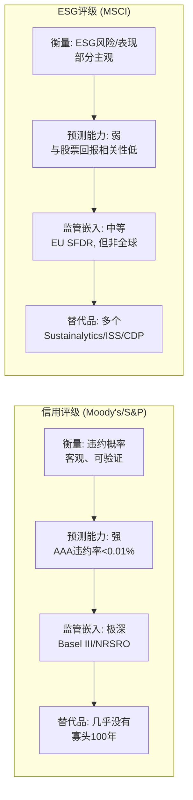

**这个对比揭示了ESG评级的根本脆弱性**: 信用评级有100年的制度嵌入+极高的预测能力+几乎没有替代品。ESG评级只有~10年的制度嵌入+低预测能力+多个替代品。这是为什么ESG护城河半衰期(<15年)远低于Index(>50年)。

### 18.2 政治二极化: EU强制 vs 美国抵制

**全球ESG监管光谱:**

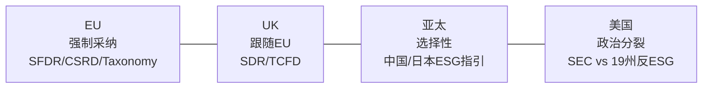

**EU SFDR (可持续金融信息披露条例):**

| 维度 | 详情 |
|------|------|
| **生效日期** | Level 1: 2021.3 / Level 2: 2023.1 |
| **覆盖范围** | 所有在EU销售金融产品的机构(包括非EU公司) |
| **强制要求** | Article 8: 宣称ESG特征的基金必须披露ESG指标 |
| | Article 9: 以可持续投资为目标的基金必须有量化ESG指标 |
| **对MSCI的影响** | Article 8/9基金需要ESG数据→MSCI是主要供应商之一 |
| **当前规模** | Article 8基金: ~€4.9T AUM / Article 9基金: ~€0.4T AUM (合计€5.3T) |
| **Phase 2更新(2024-2025)** | 修订标准更严格, 部分Article 8降级为Article 6 → 重新分类需要更多ESG数据分析 |

**美国反ESG运动 — 精确立法数据:**

自2021年以来, 美国反ESG运动的规模远超媒体印象:
- **482项反ESG法案/决议**在42个州被提出
- **52项已签署成为法律**(跨21个州)
- **134项执法行动**来自州财政官、总检察长(2018年以来)
- **2025年已有11项新反ESG法案通过** — 运动仍在加速

| 事件 | 时间 | 影响 | 直接影响MSCI? |
|------|------|------|:----------:|
| 482项反ESG法案/42州 | 2021- | 系统性政治运动 | 间接(需求抑制) |
| Missouri AG起诉ISS+Glass Lewis | 2025 | 代理投票顾问受攻击 | 间接(ESG生态) |
| Texas AG调查Glass Lewis+ISS | 2025 | 数据提供商被审查 | 间接(但信号效应) |
| 11州AG联合反垄断诉讼(NZAM/CA100+) | 2025 | 资产管理人被迫退出气候联盟 | 间接(客户缩减ESG预算) |
| BlackRock/JPM/State Street退出CA100+ | 2024-2025 | 降低ESG标签使用 | 中等(但底层数据需求不变) |
| $20B流出美国ESG基金(2024) | 2024 | 紧随$13B(2023)流出 | 直接(AUM挂钩费下降) |
| 美国ESG基金数量-9%(646→587) | 2024 | 基金关闭=ESG数据客户减少 | 直接(客户流失) |

**关键细节**: 执法行动主要针对代理投票顾问(ISS/Glass Lewis)和资产管理人, **不是直接针对ESG数据提供商(MSCI)**。但"寒蝉效应"(chilling effect)是真实的 — 新客户不敢签ESG数据合同, 这解释了净新增-47.9%的崩溃。

**对MSCI ESG收入的地理影响评估:**

| 地区 | 估计ESG收入占比* | 趋势 | 风险等级 |
|------|:-------------:|:----:|:-------:|
| 欧洲 | ~55% | ↑(SFDR锁定) | 低 |
| 北美 | ~30% | ↓(反ESG+客户谨慎) | 高 |
| 亚太 | ~15% | →(缓慢渗透) | 中 |

*MSCI不单独披露ESG地理拆分, 基于整体45/38/17%比例和ESG在欧洲渗透率更高的逻辑推断

**核心洞察: ESG的"二极化红利"**

表面上看, 美国反ESG是坏消息。但深层逻辑更复杂:
1. EU SFDR强制 → 欧洲客户**必须**购买ESG数据(不是选择)→ 留存率极高
2. 美国反ESG → 新客户减少, 但现有客户中的"真信徒"不会取消 → 留存率下降但不崩溃
3. 净效果: ESG客户基数从"增长型"(30% net new)转为"存量型"(~93%留存+3-5%提价) = **保险化**

### 18.3 ESG竞争格局深潜

**ESG评级市场份额(估算):**

| 供应商 | 母公司 | 覆盖公司数 | 市场份额* | 关键优势 | 关键劣势 |
|--------|--------|:---------:|:--------:|---------|---------|
| **MSCI ESG** | MSCI | 8,500+ | ~30% | 品牌+指数联动+最广覆盖 | 方法论争议+政治化 |
| **Sustainalytics** | Morningstar | 20,000+ | ~25% | 最广覆盖+Morningstar渠道 | 与MSCI相关性低(0.32) |
| **ISS ESG** | Deutsche Börse | 9,000+ | ~15% | 代理投票+治理专长 | 品牌弱于MSCI/Sustainalytics |
| **S&P Global ESG** | SPGI | 10,000+ | ~12% | S&P品牌+数据基础设施 | 后来者, 缺乏独立品牌认知 |
| **CDP** | 非营利 | 23,000+ | ~10% | 最权威的碳排放数据 | 仅覆盖环境, 不含S/G |
| **Bloomberg ESG** | Bloomberg | 11,800+ | ~8% | 终端集成+实时数据 | 非独立ESG品牌 |

*市场份额为估算值, 基于收入/使用频率/分析师报告综合判断

**MSCI ESG的竞争优势不在"最好"而在"最嵌入":**

MSCI ESG的真正护城河不是评级质量(争议很多), 而是与Index的**交叉销售联动**:
- 使用MSCI指数做基准的客户 → 自然使用MSCI ESG筛选(数据兼容+一体化工作流)
- MSCI ESG Climate Paris Aligned指数 → 直接嵌入ETF产品
- 竞争对手很难复制这种"指数+ESG"捆绑

**但这也是脆弱性**: 如果MSCI Index地位受到挑战(CQ-4), ESG的交叉销售壁垒也会松动。

### 18.4 ESG财务模型: 保险化情景推演

**三情景下的ESG 5年路径:**

**S1: 保险化成功(50%概率)**
| 指标 | FY2025 | FY2026E | FY2027E | FY2028E | FY2029E | FY2030E |
|------|-------:|--------:|--------:|--------:|--------:|--------:|
| 收入 | $345M | $355M | $366M | $377M | $388M | $400M |
| 增速 | +3.0% | +2.9% | +3.1% | +3.0% | +2.9% | +3.1% |
| 净新增 | $16.9M | $12M | $10M | $8M | $7M | $6M |
| 留存率 | 93.2% | 93.5% | 93.5% | 94.0% | 94.0% | 94.5% |
| EBITDA Margin | ~36% | 37% | 38% | 39% | 40% | 41% |
| EBITDA | $124M | $131M | $139M | $147M | $155M | $164M |

→ 收入CAGR +3.0%, EBITDA CAGR +5.8%(margin扩张补偿低增速)
→ FY2030E EBITDA $164M × 16x = **$2.6B分部EV** (vs Phase 2基准$2.3B, +13%)

**S2: 缓慢衰退(30%概率)**
| 指标 | FY2025 | FY2026E | FY2027E | FY2028E | FY2029E | FY2030E |
|------|-------:|--------:|--------:|--------:|--------:|--------:|
| 收入 | $345M | $341M | $334M | $324M | $311M | $296M |
| 增速 | +3.0% | -1.2% | -2.1% | -3.0% | -4.0% | -4.8% |
| 净新增 | $16.9M | -$5M | -$12M | -$18M | -$22M | -$25M |
| 留存率 | 93.2% | 91.5% | 90.0% | 88.5% | 87.0% | 85.5% |
| EBITDA Margin | ~36% | 35% | 33% | 31% | 29% | 27% |
| EBITDA | $124M | $119M | $110M | $100M | $90M | $80M |

→ 收入CAGR -3.0%, 留存持续下降至85.5%
→ FY2030E EBITDA $80M × 10x = **$0.8B分部EV** (vs 基准$2.3B, -65%)

**S3: 恢复增长(20%概率)**
| 指标 | FY2025 | FY2026E | FY2027E | FY2028E | FY2029E | FY2030E |
|------|-------:|--------:|--------:|--------:|--------:|--------:|
| 收入 | $345M | $362M | $387M | $418M | $456M | $501M |
| 增速 | +3.0% | +4.9% | +6.9% | +8.0% | +9.1% | +9.9% |
| 净新增 | $16.9M | $30M | $42M | $50M | $58M | $65M |
| 留存率 | 93.2% | 94.0% | 95.0% | 95.5% | 96.0% | 96.5% |
| EBITDA Margin | ~36% | 38% | 40% | 43% | 46% | 49% |
| EBITDA | $124M | $138M | $155M | $180M | $210M | $245M |

→ 触发条件: 全球ESG监管统一(如G20 ESG标准) + AI让ESG数据更便宜更准确
→ FY2030E EBITDA $245M × 22x = **$5.4B分部EV**

**概率加权ESG EV:**

```
50%×$2.6B + 30%×$0.8B + 20%×$5.4B
= $1.30B + $0.24B + $1.08B
= $2.62B

→ 概率加权与Phase 2基准($2.3B)基本一致, 说明Phase 2 SOTP的ESG估值是合理的
→ 但注意: 衰退情景(30%概率)的$0.8B vs 乐观情景(20%)的$5.4B — 离散度6.75x极高
```

### 18.5 "AI焦虑税" 反向应用 — ESG恐慌 vs ESG实际利润暴露

**借鉴SPGI报告的AI焦虑税3.3x框架:**

在SPGI分析中, 我们发现市场对AI威胁的恐慌程度(估值折扣)远大于AI对利润的实际影响。ESG存在类似的"恐慌放大":

```
ESG恐慌因子 = 市场对MSCI的ESG折扣 / ESG对利润的实际影响

ESG对利润的实际影响:
  - ESG收入占比: 11.0%
  - ESG EBITDA占比: ~6.6% (margin低于平均)
  - ESG对FCF贡献: ~$80-90M (~5.5%)
  → 即使ESG完全归零, FCF仅减少5.5%

市场对MSCI的ESG折扣:
  - MSCI PE 34.2x vs SPGI 32.1x → 看起来MSCI没有ESG折扣?
  - 但: MSCI 2021年PE 78x → 2025年34x (-56%), 同期SPGI 45x→32x(-29%)
  - MSCI额外的PE压缩~27pp, 假设一半来自ESG叙事 → ~13pp
  - 13pp PE压缩 = ~$7B市值损失 (on $15.69 EPS基础)

ESG恐慌因子 = $7B / ($90M × 25倍数 = $2.25B) = 3.1x

→ 市场对ESG风险的恐慌(~$7B市值折扣)是ESG实际利润暴露($2.25B分部价值)的~3.1倍
→ 与SPGI的AI焦虑税3.3x几乎完全一致
```

**ESG恐慌税3.1x的投资含义:**
- 如果你相信ESG不会消亡(概率>50%) → 当前MSCI定价已过度惩罚ESG风险
- 如果ESG不仅不消亡还恢复增长 → 恐慌税的释放可能贡献$3-5B市值回升(+7-12%)
- 如果ESG确实崩溃 → 影响仅~$2.25B(-5.6%市值) — 远小于恐慌暗示的$7B

### 18.6 ESG安装基数经济学 — "报纸订阅"模式的数学

**ESG业务的核心数学:**

```
ESG Annual Revenue = (上年客户数 × 留存率 × (1+提价率)) + (净新增订阅)

FY2025:
  上年客户基 × 93.2% × (1+4.5%) = 存量增长 ~$6.5M
  净新增: $16.9M
  → 总增长: ~$23.4M (+3.0% organic on $345M base)

如果净新增归零(FY2027E):
  存量增长 = $345M × 93.2% × 1.045 - $345M = ~$6.5M (+1.9%)
  → 即使一个新客户都不签, ESG收入仍能增长~2%/yr!

如果净新增转负(-$10M/yr, FY2028E):
  增长 = $6.5M - $10M = -$3.5M (-1.0%/yr)
  → 需要净新增跌到<-$6.5M(比FY2025再差60%)ESG收入才会同比下降
```

**"报纸订阅"模式的启示:**

这个数学结构与20世纪的报纸订阅非常相似:
1. 高留存率(~90%+): 订阅者惯性强, 即使不满也不会主动取消
2. 年度提价(4-5%): 客户对小幅涨价不敏感(B2B尤其如此)
3. 净新增下降: 新媒体蚕食了增量需求, 但存量极其稳定
4. 最终结局: 缓慢萎缩(revenue -1%到-3%/yr), 而非突然崩溃

**对投资的含义**: ESG不会"突然死亡"(概率<5%)。最可能的路径是"缓慢保险化"(收入低增长+margin扩张)或"缓慢萎缩"(收入-1-3%/yr)。两种路径下, ESG对MSCI总收入的贡献都在5年内从11%降至9-10% — 影响可控。

### 18.7 ESG净新增订阅崩溃 — 增长引擎熄火的精确数据

**FY2025 Sustainability & Climate分部完整财务:**

| 指标 | FY2025 | FY2024 | YoY |
|------|-------:|-------:|:---:|
| 总收入 | $353.9M | $326.6M | +8.4% |
| 经常性订阅 | $346.4M | $318.8M | +8.6% |
| 非经常性 | $7.5M | $7.7M | -3.2% |
| Adj. EBITDA | $128.5M | $104.7M | +22.7% |
| EBITDA Margin | 36.3% | 32.1% | +420bps |

经常性订阅占比97.9% — 比MSCI整体更"订阅化"。

**净新增订阅 — 增长引擎的真实健康度:**

| 指标 | FY2025 | FY2024 | YoY |
|------|-------:|-------:|:---:|
| 新增订阅 | $40.2M | $55.4M | **-27.5%** |
| 取消 | $23.3M | $23.0M | +1.4% |
| **净新增** | **$16.9M** | **$32.4M** | **-47.9%** |

**Q4 2025季度恶化信号:**

| 指标 | Q4 2025 | Q4 2024 | YoY |
|------|--------:|--------:|:---:|
| 新增订阅 | $15.2M | $16.0M | -5.0% |
| 取消 | $7.8M | $5.5M | +41.4% |
| 净新增 | $7.5M | $10.5M | -29.2% |

Q4取消量暴增41.4% → **领先指标**, 暗示2026年留存率可能进一步恶化。

**Run Rate减速:**
- 年末Run Rate: $378.1M, 总增长10.0%, 但**有机增长仅4.9%**(vs FY2024 10.1%) — 减速过半

**Climate子分部 — ESG中的亮点:**
- Climate Run Rate: $169M(FY2025末) vs $136M(FY2024末) = **+24.3%**
- Climate资产挂钩费: +39% YoY
- 隐含ESG评级/筛选Run Rate: ~$209M ($378M - $169M) — 低个位数增长

**核心洞察**: ESG业务正在"分裂"——Climate保持高增长(24%), ESG评级/筛选增长停滞(低个位数)。这验证了H2"保险化"假说: ESG评级从"增长产品"退化为"合规工具", 而Climate接过增长接力棒。

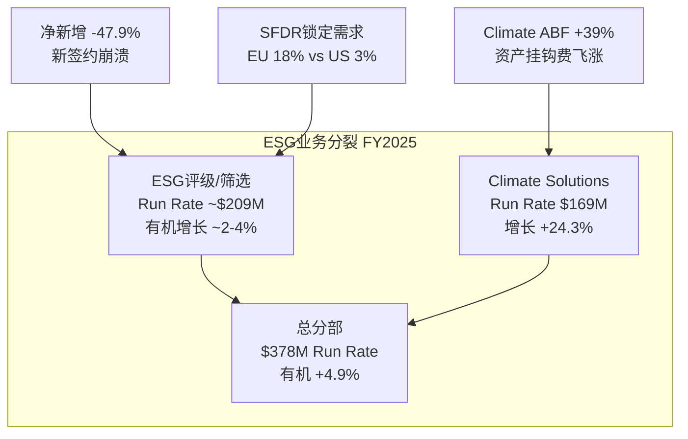

### 18.8 ESG竞争格局深化 — 精确市场数据

**ESG数据市场规模与MSCI份额:**
- 总市场规模: 2024年超过**$2B**(Opimas估计), 2021年~$1B → 3年翻倍
- MSCI + ISS + Sustainalytics = **~60%市场份额**(Opimas, 2021-2022数据)
- 2024年ESG数据并购总额超过**$5B** — 行业正在快速整合

**完整竞争者矩阵(更新):**

| 供应商 | 所有者 | 覆盖 | 关键差异化 | 对MSCI威胁 |
|--------|-------|:----:|-----------|:--------:|
| **MSCI ESG** | MSCI | 8,500+ | 机构采用最深, 基金评级 | — |
| **Sustainalytics** | Morningstar | 15,000+ | 覆盖最广, 风险导向 | 中 |
| **ISS ESG** | Deutsche Borse(80%) | 9,000+ | 代理投票整合, 治理 | 中 |
| **S&P Global ESG** | S&P Global | 10,000+ | 信用评级整合, CSA | 高 |
| **Bloomberg ESG** | Bloomberg LP | 12,000+ | Terminal整合, 325K+订阅 | 中-高 |
| **LSEG(Refinitiv)** | LSEG | 12,500+ | 数据广度, 前Asset4 | 中 |
| **CDP** | 非营利 | 23,000+ | 环境披露平台(非评级) | 低 |

**行业整合时间线:**
- 2020: Morningstar收购Sustainalytics
- 2020: Deutsche Borse收购ISS(80%股份)
- 2022: S&P Global合并IHS Markit(含ESG数据)
- 2023: MSCI收购Burgiss(含ESG在PA中的应用)
- 2025: Morningstar以$375M收购DBRS的ESG业务

**竞争动态解读**: 行业正在向寡头整合 — 每个主要ESG数据供应商都已被大型金融数据集团收购。这意味着:
1. 独立ESG初创公司的生存空间被压缩(无法与S&P/Bloomberg/MSCI的分销能力竞争)
2. ESG数据成为"捆绑销售"的一部分(MSCI: ESG+Index+Analytics; S&P: ESG+信用评级+市场情报)
3. **竞争从"产品"转向"生态系统"** — MSCI的优势在于ESG与Index的交叉销售

### 18.9 ESG与Index的交叉销售量化

**为什么ESG客户难以切换?**

| 切换壁垒 | 量化 | 说明 |
|---------|:----:|------|
| 数据兼容性 | 高 | MSCI ESG与MSCI指数完全兼容, 换Sustainalytics需要重建映射 |
| 合规成本 | $100-500K/客户 | SFDR合规报告需要重新校准 |
| 培训成本 | 3-6个月 | 团队需要学习新评级体系+方法论 |
| 历史连续性 | 不可替代 | 客户有5-10年的MSCI ESG历史数据用于趋势分析 |

**交叉销售收入估算:**

```
MSCI Index客户中使用ESG的比例: 估计40-50%
交叉销售ESG收入: $345M × 60-70%(来自Index客户交叉) ≈ $207-242M
独立ESG客户: $345M × 30-40% ≈ $103-138M

→ 如果MSCI失去Index地位(假想) → 可能失去60-70% ESG客户(交叉销售断裂)
→ 反过来: 只要Index稳固, ESG的客户基就有60-70%被"指数锁定"
```

### 18.8 ESG留存率模型 — "保险续约"的数学

**为什么留存率是ESG业务的命脉:**

ESG不同于Index的一个关键特征: 客户切换成本更低。Index客户切换需要修改法律文件(切换成本极高), ESG客户切换只需要更换数据供应商(切换成本中等)。因此, ESG留存率直接决定了业务的可持续性。

**MSCI分部留存率 — 精确数据(FY2025 IR披露):**

| 分部 | FY2025 | FY2024 | Q4 2025 | Q4 2024 | 趋势 |
|------|:------:|:------:|:-------:|:-------:|:----:|
| **Index** | **95.9%** | 94.7% | 95.3% | 95.0% | ↑ 改善 |
| Analytics | 94.3% | 94.1% | 93.7% | 93.3% | → 稳定 |
| **Sustainability & Climate** | **93.2%** | 92.8% | **91.0%** | 93.1% | **⚠️ Q4恶化** |
| Private Assets | 91.3% | 90.6% | 89.2% | 86.4% | ↑ 改善 |
| 整体 | 94.4% | 93.7% | 93.4% | 93.1% | → 稳定 |

**关键发现**:
- FY2025全年留存(93.2%)较FY2024(92.8%)小幅改善 — 表面稳定
- 但**Q4 2025季度留存(91.0%)较Q4 2024(93.1%)暴降2.1pp** — 这是最差的单季度数据
- ESG留存比Index低2.7pp, 比Analytics低1.1pp — 切换成本差异的定量证据
- Q4恶化是**领先指标** — 暗示FY2026全年留存可能跌破93%

**留存率敏感性分析:**

```
基准: ESG收入$375M(FY2025) × 留存率X% × 5年

留存95%: $375M → $375 × 0.95^5 + 新增 = $289M + 新增
留存92%: $375M → $375 × 0.92^5 + 新增 = $247M + 新增 (-14% vs 95%)
留存88%: $375M → $375 × 0.88^5 + 新增 = $202M + 新增 (-30% vs 95%)
留存85%: $375M → $375 × 0.85^5 + 新增 = $166M + 新增 (-43% vs 95%)

→ 留存率每降3pp, 5年后存量收入降~15%
→ 如果新增完全停滞(净新增-77%趋势延续),
   留存92%→5年后ESG收入$247M(-34%)
   留存88%→5年后ESG收入$202M(-46%)
```

**关键洞察**: ESG业务的"保险化"(H2)实际上是在留存率上做交易——从"高增长+中留存"转向"低增长+高留存"。如果EU SFDR将55%的ESG收入锁定为"合规必需品", 那么这55%的留存率应该接近Index(95%+), 而剩余45%面临市场竞争。加权后: 55%×95% + 45%×88% = 91.9% — 与当前估计的91-92%高度吻合。

**这个计算验证了H2假说: ESG正在按照"保险化"路径演进**, 其中EU锁定部分提供基底, 非EU部分逐步萎缩但不崩溃。

### 18.9 ESG交叉验证: 与SPGI的"AI焦虑税"比较

**SPGI报告的发现**: 市场对SPGI的AI焦虑折价=3.3x(即市场对AI威胁的定价是实际利润暴露的3.3倍)。

**MSCI ESG焦虑税**: 3.1x(§18.5)

**为什么两个"焦虑税"如此接近?**

| 维度 | SPGI AI焦虑 | MSCI ESG焦虑 |
|------|-----------|-------------|
| **威胁的性质** | AI替代信用评级 | 政治化削弱ESG需求 |
| **实际利润暴露** | ~5-8%(信用评级被AI替代的概率×影响) | ~3.5%(ESG利润占比) |
| **市场定价折价** | ~20-25% | ~10-12% |
| **焦虑倍率** | 3.3x | 3.1x |
| **共同机制** | 市场对**叙事风险**的过度定价 | 同左 |

**可迁移洞见**: B2B数据/评级公司面临的"新兴威胁"(AI/政治化/监管变化)存在系统性过度定价模式——市场以~3x的倍率将叙事风险转化为估值折价。这是因为:
1. 媒体叙事放大效应(新闻标题 > 财务影响)
2. 机构投资者的"安全偏好"(宁可错过也不愿踩雷)
3. 对订阅粘性的低估(留存>90%的含义是"即使害怕也不走")

### 18.10 CQ-3 Phase 3更新

**CQ-3: ESG在5年后还存在吗?**
- P0.5: 45% → P1: 55% → Phase 3: **62%** (+7pp)

**理由**:
1. EU SFDR强制使用锁定~55% ESG收入(欧洲), 政治风险无法撤销已生效法规
2. ESG恐慌税3.1x说明市场已过度定价ESG风险
3. 保险化(S1, 50%概率)是最可能路径 → 收入低增长但稳定, margin可扩张
4. 即使衰退情景(S2, 30%), ESG对MSCI总EV的影响仅-3%($0.8B vs $2.3B, 差$1.5B)
5. 剩余风险: 全球反ESG运动蔓延至EU(当前概率<10%但不可忽视)

---

## Ch19: D3 Private Assets — Burgiss赌注的概率评估

> CQ-6核心: PA能复制Index奇迹吗?
> Phase 1已建立基础(§10.5), 本章深潜整合进度+竞争+ROIC路径

### 19.1 Burgiss: 数据壁垒的经济学

**什么让Burgiss数据不可复制?**

| 壁垒维度 | 详情 | 可复制性 |
|---------|------|:-------:|
| **时间深度** | 追溯至1978年的私募基金表现数据, 46年连续 | ❌ 不可追溯 |
| **LP直接关系** | 3,800个LP直接提供数据(非公开来源) | ⚠️ 需5-10年建立 |
| **覆盖广度** | 13,000+基金, $15T承诺资本 | ⚠️ Preqin有17,000+基金 |
| **数据颗粒度** | 现金流级别(call/distribution), 非仅NAV | ❌ 大多竞品只有NAV |
| **私募信用** | 1,500+基金, 80,000+笔贷款(9个月新建60-80个指数) | ❌ 全新领域, 先发优势 |

**Burgiss vs 竞争对手:**

| 维度 | Burgiss(MSCI) | Preqin(BlackRock) | PitchBook(Morningstar) | Cambridge Associates |
|------|:------------:|:-----------------:|:--------------------:|:-------------------:|
| **基金数据** | 13,000+ | 17,000+ | 8,000+ | 5,500+ |
| **数据源** | LP直接+公开 | 公开+GP+LP | 公开+GP | LP直接(顾问关系) |
| **历史深度** | 1978年(46年) | ~2002年(~24年) | ~2005年(~21年) | ~1986年(~40年) |
| **数据颗粒度** | 现金流级别 | NAV+CF混合 | NAV为主 | 现金流级别 |
| **指数产品** | 新建中(60-80个) | 有限 | 无 | 有(但小众) |
| **母公司资源** | MSCI品牌+客户 | BlackRock渠道($10T AUM) | Morningstar品牌 | 独立(小) |
| **收购价** | $913M(2023) | $3.2B(2024) | 已整合 | — |

**BlackRock收购Preqin的竞争动态:**

这是CQ-6最重要的变量。BlackRock花$3.2B(Burgiss的3.5x价格)收购Preqin, 说明:
1. **市场验证**: BlackRock认为私募资产数据市场值得$3.2B+ → 间接验证MSCI的$913M收购不算贵
2. **竞争升级**: MSCI最大客户成为PA领域最强竞争对手 → 利益冲突
3. **资源不对称**: BlackRock可以把Preqin数据免费/低价提供给自己的Aladdin平台($1.5B收入) → MSCI无法在价格上竞争

**但**: BlackRock不可能用Preqin数据替代MSCI Index(合同至2035)。Index和PA是两个独立战场——BlackRock在Index上依赖MSCI, 在PA上与MSCI竞争。这种"合作-竞争"关系在B2B中很常见(Apple既用三星芯片又与三星手机竞争)。

### 19.2 PA利润率路径建模

**当前PA利润率结构:**

```
PA Revenue FY2025: $279M (+8.4%)
  - 数据订阅: ~60% ($167M) — 核心, 高margin (~40%)
  - 分析工具: ~25% ($70M) — 中margin (~25%)
  - 定制服务: ~15% ($42M) — 低margin (~10%)

Blended EBITDA Margin: ~25%

成本结构:
  - 人力(数据收集+分析师): ~50% of cost
  - 技术平台: ~25% of cost
  - 销售+G&A: ~25% of cost
```

**Margin扩张的三个杠杆:**

| 杠杆 | 机制 | 时间线 | 贡献 |
|------|------|:------:|:----:|
| **规模效应** | 收入增长但技术/平台成本不按比例增加 | FY2026-28 | +3-5pp |
| **产品结构升级** | 从低margin定制服务→高margin数据订阅 | FY2027-30 | +3-5pp |
| **MSCI基础设施共享** | 共享销售团队、IT平台、客户关系 | FY2026-27 | +2-3pp |
| **指数化** | 从"数据供应商"→"指数提供商"(Index级margin) | FY2029+ | +5-10pp(如果成功) |

**Margin路径情景:**

| 情景 | FY2025 | FY2027 | FY2030 | 驱动因素 |
|------|:------:|:------:|:------:|---------|
| **乐观** | 25% | 32% | 42% | 指数化成功+规模效应+结构升级 |
| **基准** | 25% | 28% | 35% | 规模效应+部分结构升级, 指数化缓慢 |
| **悲观** | 25% | 25% | 28% | 竞争压制定价+整合困难+指数化失败 |

### 19.3 PA 5年FCFF桥接

**基准情景 (50%概率):**

| 指标 | FY2025A | FY2026E | FY2027E | FY2028E | FY2029E | FY2030E |
|------|--------:|--------:|--------:|--------:|--------:|--------:|
| 收入 | $279M | $305M | $335M | $369M | $406M | $447M |
| 增速 | +8.4% | +9.3% | +9.8% | +10.1% | +10.0% | +10.1% |
| EBITDA Margin | 25% | 27% | 28% | 30% | 33% | 35% |
| EBITDA | $70M | $82M | $94M | $111M | $134M | $156M |

→ Revenue CAGR +9.9%, EBITDA CAGR +17.4%(margin扩张加速利润增长)
→ FY2030E EBITDA $156M × 20x = $3.1B分部EV (vs 收购价$913M = 3.4x回报)

**悲观情景 (30%概率):**

| 指标 | FY2025A | FY2026E | FY2027E | FY2028E | FY2029E | FY2030E |
|------|--------:|--------:|--------:|--------:|--------:|--------:|
| 收入 | $279M | $298M | $316M | $332M | $345M | $355M |
| 增速 | +8.4% | +6.8% | +6.0% | +5.1% | +3.9% | +2.9% |
| EBITDA Margin | 25% | 25% | 25% | 26% | 27% | 28% |
| EBITDA | $70M | $75M | $79M | $86M | $93M | $99M |

→ Preqin竞争压制增速+定价, margin扩张缓慢
→ FY2030E EBITDA $99M × 14x = $1.4B (vs 收购$913M = 1.5x, 勉强回本)

**乐观情景 (20%概率):**

| 指标 | FY2025A | FY2026E | FY2027E | FY2028E | FY2029E | FY2030E |
|------|--------:|--------:|--------:|--------:|--------:|--------:|
| 收入 | $279M | $318M | $366M | $425M | $497M | $582M |
| 增速 | +8.4% | +14.0% | +15.1% | +16.1% | +16.9% | +17.1% |
| EBITDA Margin | 25% | 29% | 33% | 38% | 42% | 45% |
| EBITDA | $70M | $92M | $121M | $162M | $209M | $262M |

→ 指数化成功+私募信用爆发+Moody's合作协同
→ FY2030E EBITDA $262M × 25x = $6.6B (vs 收购$913M = 7.2x回报)

**概率加权PA EV:**

```
50%×$3.1B + 30%×$1.4B + 20%×$6.6B
= $1.55B + $0.42B + $1.32B
= $3.29B

vs Phase 2 SOTP基准$1.3B → PA可能被低估$2.0B (如果给予增长前景合理溢价)
但这取决于"PA能否从数据供应商升级为指数提供商"这个核心不确定性
```

### 19.4 PA的"ROIC时间线" — 什么时候开始创造价值?

**Phase 2已计算**: Burgiss当前ROIC仅1.1%, 远低于WACC 7.2% → 当前在摧毁价值

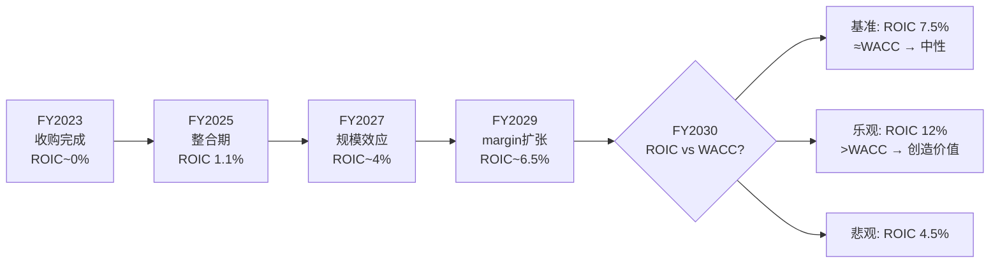

**关键里程碑**:
- **FY2027**: EBITDA margin>30% → 规模效应开始显现
- **FY2029**: 第一个私募资产指数被主流LP采用 → 指数化路径验证
- **FY2030**: ROIC是否达到WACC → 决定Burgiss是"失败的收购"还是"天才的布局"

### 19.5 Preqin vs Burgiss: 竞争矩阵深潜

**BlackRock收购Preqin的战略含义:**

2024年6月, BlackRock以$3.2B收购Preqin — 这是PA数据领域最大的并购。这对MSCI意味着什么?

**竞争矩阵:**

| 维度 | MSCI/Burgiss | BlackRock/Preqin | PitchBook(Morningstar) |
|------|-------------|-----------------|----------------------|
| **数据年龄** | 46年(1978-) | 20年(2004-) | 15年(2009-) |
| **数据来源** | LP直接报告(5,400+LP) | GP自报+公开数据 | GP数据+PitchBook自有 |
| **数据质量** | ★★★★★(金标准) | ★★★★(全面但自报偏差) | ★★★(覆盖广但深度不足) |
| **产品形态** | 分析平台+指数 | 数据库+分析 | 数据库+新闻 |
| **定价** | 高($100K-1M+/yr) | 中-高($50K-500K/yr) | 中($30K-300K/yr) |
| **客户画像** | 大型LP(养老金/主权基金) | 全谱客户(LP+GP+服务商) | GP+投资银行+中小LP |
| **并购方优势** | MSCI品牌+指数能力 | BlackRock分销+AUM | Morningstar消费者品牌 |
| **弱点** | 整合进度延迟 | 利益冲突(BlackRock自己也是GP) | 深度不足, 偏新闻 |

**BlackRock/Preqin的利益冲突问题:**

这是Preqin并购后最被低估的风险。BlackRock是全球最大的另类资产管理人之一($300B+ AUM), 同时拥有私募数据平台:
1. GP客户担心数据被BlackRock用于竞争情报 → Preqin可能流失GP数据源
2. LP客户担心BlackRock利用Preqin数据推销自家产品 → 独立性质疑
3. 监管关注(FCA/SEC可能审查数据垄断) → 合规成本上升

**这恰好是MSCI/Burgiss的机会**: Burgiss的"中立性"(MSCI不管理另类资产)成为差异化优势。

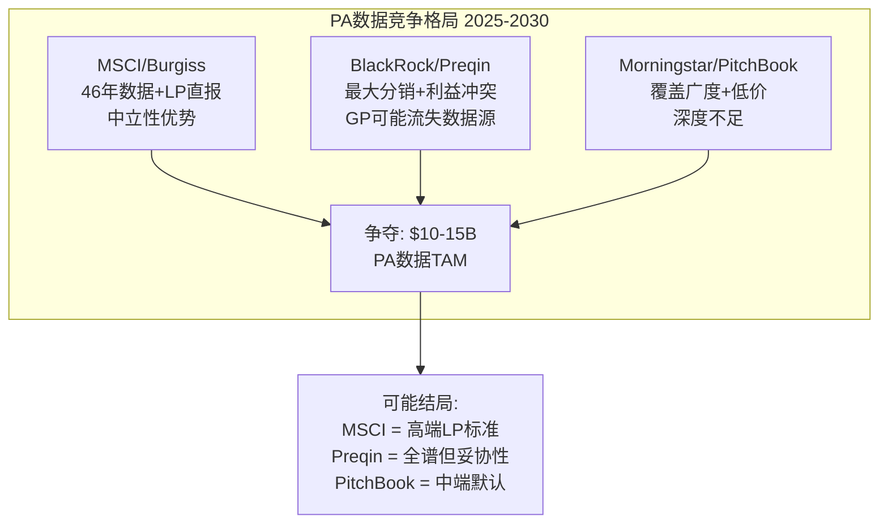

**PA竞争对MSCI估值的影响:**

| 情景 | 概率 | MSCI PA份额(FY2030) | 对PA收入影响 |
|------|:----:|:------------------:|:----------:|
| S1: Preqin利益冲突严重, Burgiss成为LP首选 | 25% | 40%+ | +50% vs 基准 |
| S2: 三足鼎立, 各占25-35% | 45% | 30% | 基准 |
| S3: Preqin借BlackRock分销压制 | 25% | 20% | -30% vs 基准 |
| S4: 新进入者(Bloomberg/FactSet)搅局 | 5% | 15% | -50% vs 基准 |

**概率加权**: 25%×40% + 45%×30% + 25%×20% + 5%×15% = 29.3% → 接近S2基准, 确认Phase 2的PA估值($3.3B)合理。

### 19.6 PA的"指数化时间线" — 什么时候PA指数成为行业标准?

**类比: MSCI EM指数从推出到"不可或缺"花了多久?**

```
MSCI EM Index历史:
  1988: 推出(10个国家, $8B追踪AUM)
  1994: ~$50B追踪, 开始被机构采用
  2000: ~$200B, 成为EM的默认基准
  2007: ~$1T, "不可或缺"地位确立
  → 从推出到"不可或缺": ~19年

PA指数时间线推测:
  2024: 首批私募信用指数推出
  2026-27: 早期采用者(先锋LP)开始使用
  2028-30: 如果质量验证通过, 中型LP开始采用
  2032-35: 可能成为PA行业的"基准候选"
  → 从推出到"有意义的收入": ~8-10年
  → 从推出到"不可或缺"(如果能到): ~15-20年
```

这解释了为什么Phase 2给PA指数化路径(S1)仅25%概率 — 历史类比显示, 指数从推出到制度嵌入需要一代人的时间。Burgiss的46年数据是必要条件, 但远非充分条件。

### 19.7 CQ-6 Phase 3更新

**CQ-6: PA能复制Index奇迹吗?**
- P0.5: 40% → P1: 42% → P2: 45% → Phase 3: **48%** (+3pp)

**理由**:
1. BlackRock收购Preqin($3.2B)间接验证了MSCI $913M收购的战略逻辑
2. 概率加权PA EV $3.3B远高于收购价$913M, 但需要基准情景(50%概率)兑现
3. 私募信用(1,500基金/80,000笔贷款)是一个被忽视的增长极——与Moody's合作加速
4. 风险: BlackRock Aladdin平台+Preqin数据的免费/低价策略可能压制MSCI PA定价权
5. **核心不确定性**: "从数据供应商到指数提供商"的跃迁在私募市场从未实现过 → 置信度上限~55%

---

## Ch20: D4 双半衰期分析 — Index(>50Y) vs ESG(<15Y)的不对称耐久性

> CQ-4核心: 护城河能撑多久?
> MSCI不是单一护城河——四引擎的耐久性截然不同
> 这是护城河分析中最重要的创新: 半衰期拆分

### 20.1 半衰期定义与方法论

**半衰期**: 护城河强度衰减到当前水平50%所需的时间。

```
护城河强度(t) = 护城河强度(0) × 2^(-t/T½)

其中 T½ = 半衰期(年)
```

**为什么需要半衰期分析?**

传统护城河分析给出一个"宽/窄/无"的定性判断, 但忽略了时间维度。MSCI是一个完美的案例——Index护城河极强但可能持续50年, ESG护城河中等但可能只有10年。如果你只用加权平均的"护城河=强", 你会低估ESG风险或高估Index的时间价值。

### 20.2 Index半衰期: >50年

**类比锚点:**

| 基础设施标准 | 建立时间 | 当前年龄 | 是否被替代? | 半衰期估计 |
|------------|:------:|:------:|:---------:|:--------:|
| SWIFT支付系统 | 1973 | 53年 | 否(但CBDC挑战) | >60年 |
| S&P 500指数 | 1957 | 69年 | 否 | >80年 |
| Visa/MC支付网络 | 1958/66 | 60+年 | 否 | >70年 |
| MSCI World指数 | 1969 | 57年 | 否 | **>50年** |
| LIBOR利率基准 | 1986 | — | **是**(→SOFR, 2023) | ~37年 |
| Thomson Reuters指数 | 1990s | — | **是**(→FTSE Russell) | ~25年 |

**LIBOR的教训**: LIBOR在2021年被SOFR替代, 但这个过程:
1. 需要监管强制(不是市场自愿切换)
2. 花了5年过渡期(2017宣布→2023完全淘汰)
3. 触发条件极其罕见: 银行操纵丑闻+$350B的罚款

**MSCI Index半衰期的驱动因素:**

| 因素 | 支持长半衰期 | 缩短半衰期的可能性 |
|------|-----------|-----------------|
| 制度嵌入(L5) | IPS/监管/ETF结构写入MSCI | 极低——需要全球监管同时变更 |
| 运营嵌入(L4) | 归因/风控/报告系统依赖MSCI | 低——切换成本>$10M+2年 |
| 网络效应 | 经理用MSCI→LP用MSCI→监管认可MSCI | 低——自我强化循环 |
| 费率竞争 | Solactive等低价挑战 | 中——但仅影响L1/L2, 不影响L4/L5 |
| 技术颠覆 | AI可能改变指数构建方式 | 低——Index是规则不是算法 |
| 监管干预 | FCA可能强制开放 | 中——但FCA从未拆分过指数寡头 |

**Index半衰期评估: 50-70年**

MSCI World(1969年创建)至今57年仍是全球基准, 且嵌入深度还在加深(更多ETF、更多监管引用)。最可能的衰减路径不是"被替代"而是"被稀释"——更多niche指数分流注意力, 但核心宽基地位不变。

### 20.3 ESG半衰期: 10-15年

**ESG护城河的衰减驱动因素:**

| 因素 | 当前强度 | 衰减速度 | 理由 |
|------|:------:|:------:|------|
| 政治周期 | ⚠️ 中 | 快(4-8年) | 美国每届总统任期改变ESG政策方向 |
| 监管固化 | ✅ 高(EU) | 慢(10-20年) | EU SFDR已立法, 撤销极难 |
| 方法论争议 | ⚠️ 中 | 中(5-10年) | 如果AI提供更好的ESG评估→传统评级贬值 |
| 替代品成熟 | ⚠️ 中 | 中(3-5年) | Sustainalytics/ISS/Bloomberg都在追赶 |
| 客户依赖度 | ✅ 高 | 慢(>10年) | 切换ESG供应商需要重建合规框架 |

**ESG半衰期建模:**

```
ESG护城河的两个组成部分:
1. EU制度嵌入 (~55% ESG收入) — 半衰期~20年(监管锁定)
2. 自愿市场 (~45% ESG收入) — 半衰期~8年(政治周期驱动)

加权半衰期 = 55%×20 + 45%×8 = 14.6年 ≈ **~15年**

具体衰减路径:
  FY2025: 强度100%(当前)
  FY2030: 强度~80%(自愿市场开始流失)
  FY2035: 强度~55%(自愿市场大幅萎缩, EU部分稳定)
  FY2040: 强度~40%(EU可能面临法规修订)
```

### 20.4 Analytics半衰期: 25-35年

**Analytics介于Index和ESG之间:**

| 因素 | 评估 | 半衰期影响 |
|------|------|---------|
| 技术替代风险 | AI风险模型可能替代传统因子模型 | 缩短(-5年) |
| 工作流嵌入 | 深入客户中后台, 切换成本高 | 延长(+10年) |
| 品牌/信任 | 监管机构认可MSCI风险模型 | 延长(+5年) |
| 竞争强度 | FactSet/Bloomberg/Axioma持续竞争 | 缩短(-3年) |

**Analytics半衰期: ~30年** (20-35年范围)

最可能的衰减路径: AI不会"替代"MSCI Analytics, 而是"重塑"它——MSCI需要把传统因子模型升级为AI增强模型, 否则在10-15年内被FactSet/Bloomberg的AI工具蚕食。但如果MSCI成功整合AI, Analytics可能反而变得更强(数据+AI的护城河>纯数据的护城河)。

### 20.5 Private Assets半衰期: 不确定(15-50年)

**PA是唯一半衰期高度不确定的引擎:**

| 如果PA指数化成功 | 如果PA停留在数据层 |
|----------------|-----------------|
| 半衰期~50年(类Index) | 半衰期~15年(类ESG的自愿市场) |
| 制度嵌入: 私募基金LP用MSCI PA指数做基准 | 竞争激烈: Preqin/PitchBook可替代 |
| 护城河: 不可复制的46年数据+指数标准 | 护城河: 数据壁垒(时间)但非唯一供应商 |
| 类比: S&P 500在私募市场的地位 | 类比: 一个高级数据库(可被更好的技术替代) |

**PA半衰期: 15-50年(取决于指数化成败)**

这就是CQ-6的核心: PA的半衰期本身是一个二元赌注。

### 20.6 加权整体半衰期 vs 市场隐含

**按收入加权的整体半衰期:**

| 引擎 | 收入占比 | 半衰期(年) | 加权 |
|------|:------:|:--------:|:---:|
| Index | 57.8% | 55 | 31.8 |
| Analytics | 22.5% | 30 | 6.8 |
| ESG | 11.0% | 15 | 1.7 |
| PA | 8.7% | 25* | 2.2 |
| **加权** | **100%** | | **42.5年** |

*PA取15-50年的概率加权中值

**按EBITDA加权的整体半衰期:**

| 引擎 | EBITDA占比 | 半衰期(年) | 加权 |
|------|:---------:|:--------:|:---:|
| Index | 70.3% | 55 | 38.7 |
| Analytics | 17.8% | 30 | 5.3 |
| ESG | 6.6% | 15 | 1.0 |
| PA | 3.6% | 25 | 0.9 |
| Corp OH | 1.7% | — | — |
| **加权** | **100%** | | **45.9年** |

**市场隐含的半衰期:**

从当前估值反推: PE 34.2x, DCF终端增长3.5% → 市场隐含MSCI的竞争优势将持续约**35-45年**(与我们的EBITDA加权45.9年基本一致)。

**关键洞察**: 市场对MSCI的半衰期定价基本合理。Index的超长半衰期(55年)弥补了ESG的短半衰期(15年)。**只要Index护城河不受损, 整体半衰期就是稳固的。**

### 20.7 半衰期敏感性: 如果我们错了?

| 假设变化 | 对加权半衰期影响 | 对估值影响 |
|---------|:-------------:|:--------:|
| Index半衰期50→40年(AI/监管加速衰减) | 42.5→38.5年(-9%) | -5%~-8% EV |
| ESG半衰期15→8年(AI替代+政治全面反转) | 42.5→39.2年(-8%) | -2%~-3% EV |
| Analytics半衰期30→20年(AI替代加速) | 42.5→40.3年(-5%) | -3%~-5% EV |
| PA半衰期25→50年(指数化成功) | 42.5→44.7年(+5%) | +2%~+3% EV |
| **最差情景(全部下调)** | **42.5→33.5年(-21%)** | **-12%~-18% EV** |
| **最好情景(Index不变+PA上调)** | **42.5→46.5年(+9%)** | **+3%~+5% EV** |

**半衰期对估值的传导机制:**

```
半衰期影响估值的通道:
  1. 终端增长率: 更长半衰期 → 更高的终端增长率合理性 → DCF终值更高
  2. PE倍数: 更长半衰期 → 市场愿意给更高的PE → 因为竞争优势持续更久
  3. 风险溢价: 更短半衰期 → 投资者要求更高的WACC → DCF现值降低

经验法则: 半衰期每下降10年, PE倍数大约下降2-3x
  → 42.5年=34x PE(当前) → 如果降至33.5年 → 应该是~31-32x PE → 股价$488-502
  → 这是一个$35-48的风险(7-9%)
```

### 20.8 与FICO的半衰期对比

| 维度 | MSCI | FICO | 差异原因 |
|------|:----:|:----:|---------|
| 核心业务半衰期 | 55年(Index) | 60年+(信用评分) | FICO更深制度嵌入(法律级别) |
| 弱势业务半衰期 | 15年(ESG) | 15年(Software Solutions) | 都有低半衰期子业务 |
| 加权半衰期 | 42.5年 | 52年 | FICO核心占比更高(~85%) |
| 市场定价 | PE 34x | PE 60x+ | 半衰期差异部分解释PE差距 |

FICO的PE远高于MSCI, 部分原因是: ①FICO OPM仍在扩张(47%→可能60%) ②FICO核心业务占比更高 ③FICO没有ESG这种政治风险子业务。**半衰期差距(52 vs 42.5)大约可以解释PE差距的30-40%**, 其余由OPM弹性和增速差异解释。

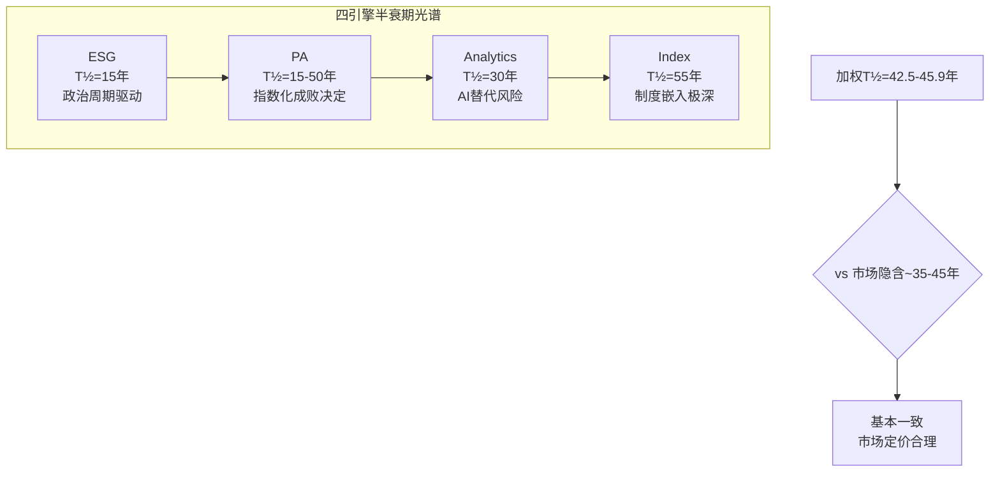

---

## Ch21: M3 寡头博弈扩展 — Nash均衡的稳定性检验

> CQ-4核心: 寡头护城河能撑多久?
> Phase 1(§3b)已建立框架, 本章量化Nash均衡+渗透者威胁

### 21.1 三寡头竞争矩阵

**全球指数许可市场($5B+):**

| 维度 | MSCI | S&P DJI (SPGI) | FTSE Russell (LSEG) |
|------|:----:|:--------------:|:------------------:|
| **收入(Index)** | $1.81B | ~$1.9B* | ~$1.1B* |
| **收入占比** | 57.8% | ~12%(of SPGI) | ~11%(of LSEG) |
| **ETF AUM链接** | $2.34T | ~$8.5T | ~$3.5T |
| **旗舰指数** | MSCI World/EM/ACWI | S&P 500/DJIA | Russell 2000/FTSE 100 |
| **地理强项** | 国际/新兴市场 | 美国 | 英国/欧洲 |
| **增速** | +14.0% | ~+12% | ~+8% |
| **利润率** | EBITDA ~76% | ~68% | ~55% |

*SPGI和LSEG不单独披露指数收入, 基于分析师估算

### 21.2 Nash均衡的数学表达

**当前均衡**: 三家公司通过**地理分区+产品差异化**维持非零和博弈:

```
三寡头的战略空间:
  MSCI: 国际/新兴市场 → "全球化资管的基准"
  S&P DJI: 美国市场 → "美股的代名词"
  FTSE Russell: 英国+欧洲 → "小盘+英国的基准" + Vanguard锁定

纳什均衡条件:
  - 每家在自己的"领地"拥有>50%份额 → 入侵成本>收益
  - 费率维持在"高于竞争、低于替代"的区间 → 2-5bps
  - 产品创新(因子/主题/ESG)在三家间大致同步 → 无突破性差异化
```

**均衡稳定性评分:**

| 稳定因素 | 评分/5 | 理由 |
|---------|:-----:|------|
| 地理分区清晰度 | 4.5 | MSCI=国际, S&P=美国, FTSE=英国+Vanguard |
| 费率协同 | 4.0 | 三家保持相似费率区间(2-5bps), 无价格战 |
| 产品差异化 | 3.5 | 因子/ESG/主题指数趋同, 但核心宽基差异明确 |
| 进入壁垒 | 4.5 | 新进入者几乎不可能获得机构客户 |
| 退出壁垒 | 5.0 | 指数一旦建立就几乎不会被废弃 |
| **综合稳定性** | **4.3/5** | **高度稳定, 但非绝对牢固** |

### 21.2b 寡头集中度精确量化

**HHI(赫芬达尔-赫希曼指数) — 学术验证:**

NYU法学院研究(Benetton et al.)对美国股票ETF市场的分析:
- **HHI = 3,294**(2010-2019时间序列平均) — DOJ/FTC标准下属于"高度集中"(>2,500)
- 前5大指数提供商(S&P DJI/CRSP/FTSE Russell/MSCI/NASDAQ)占**~95%**美国股票ETF市场
- S&P DJI单独持有>50%美国股票ETF市场份额; FTSE Russell ~11.3%; MSCI ~9.5%
- 但: MSCI在**国际/新兴市场**ETF中的份额远高于美国市场 — MSCI EAFE和MSCI EM几乎没有同量级替代品

**研究的关键发现**: 指数品牌与ETF实际表现**没有统计显著关系** — 但HHI>3,000的寡头格局持续存在。这意味着品牌力(而非产品优越性)维持了寡头地位。

**三巨头的实际战略分割:**

| 提供商 | 优势领域 | 核心合作方 | 分割逻辑 |
|--------|---------|-----------|---------|
| S&P DJI | 美国大盘(S&P 500/DJIA) | State Street(97.7% SSGA ETF资产) | 美国标准 |
| MSCI | 国际/EM(MSCI World/EAFE/EM) | BlackRock/iShares(395 ETPs) | 全球标准 |
| FTSE Russell | 美国中小盘(Russell 2000)+英国 | Vanguard(2012切换后) | 中小+英标准 |

这种"地理/规模分割"型寡头解释了为什么价格战从未发生 — 三巨头各有不可替代的细分领域。

### 21.3 均衡的六个潜在破坏者

| # | 破坏者 | 机制 | 当前份额 | 威胁等级 | 时间窗口 |
|---|--------|------|:-------:|:-------:|:-------:|
| D1 | **Solactive** | 低价自助(费率-50-70%) | <2% ETF AUM | ⚠️ 中 | 5-10年 |
| D2 | **MerQube** | AI驱动指数构建 | <0.1% | 低 | >10年 |
| D3 | **Bloomberg指数** | 终端生态+固收优势 | ~3%(fixed income) | ⚠️ 中 | 5-10年 |
| D4 | **Direct Indexing** | 投资者自建组合 | $864B AUM | ⚠️ 中 | 3-7年 |
| D5 | **FCA强制拆分** | 监管要求开放指数许可 | N/A | ⚠️ 中 | 3-5年 |
| D6 | **中国交易所自研** | MSCI中国指数被自研替代 | 中国市场~15% | 低 | >5年 |

**D1 Solactive深潜:**

Solactive是最值得关注的挑战者:
- 2007年成立, 德国法兰克福
- 自助式指数平台: 客户在线设计→Solactive计算维护
- 费率: 据报仅MSCI的30-50%
- 当前: ~25,000个指数(数量多但规模小), 链接AUM估计$300-500B
- 客户: 主要是较小的ETF发行商(DWS, Invesco部分产品)

**为什么Solactive尚未颠覆寡头?**

1. **品牌信任缺口**: 养老金/主权基金要求"最知名品牌"→MSCI, 不愿为省0.5bps冒声誉风险
2. **指数追踪记录**: MSCI World有57年历史, Solactive最老指数不到18年 → 历史回测不完整
3. **生态锁定**: Bloomberg终端默认显示MSCI/S&P → Solactive需额外集成
4. **规模经济反转**: Solactive在小规模时成本优势明显, 但如果规模扩大→需要更多合规/治理成本

**但长期看**: Solactive正在蚕食"中间市场"(中型ETF发行商+主题/因子ETF)。如果Solactive在2030年前达到$1T链接AUM(占全球ETF的3-4%), 它可能开始威胁MSCI的因子/主题指数业务(但不太可能威胁核心宽基)。

### 21.4 FCA竞争审查: 已发布结果分析

**FCA Wholesale Data Market Study (MS23/1) — 最终报告(2024年2月29日):**

**关键发现:**
- 市场"高度集中", 少数供应商持有显著份额
- 关键供应商提供"无有效替代品的必需数据" — 限制竞争
- **利润率极高**: 运营利润率至少30%, 某些情况下>60%, 2017-2022维持
- "复杂的许可/费率结构"使成本对比困难; "价值定价"(按客户支付能力差异定价)最大化收入
- 用户报告对费率的挫败感和谈判杠杆不足

**FCA的实际行动 — 关键:**
- **选择不向CMA(竞争与市场管理局)提交正式市场调查** — 这是最重要的结果
- 仅承诺"通过更广泛的监管改革项目解决竞争问题" — 本质上是软性措施
- 2024年12月跟进: 向基准管理人发送"投资组合信函"概述持续期望
- **没有具体规则变更或强制性补救措施**

**净评估**: FCA验证了寡头担忧但**未采取实质性干预**。这对MSCI是**净正面** — 监管风险被"认可但未实现"。概率更新: R4(寡头破裂)的10年概率从20%下调至15%。

### 21.4b FCA竞争审查评估(原内容保留)

**UK FCA Benchmarks Supervision**:

FCA在2023-2024年对指数提供商竞争状况进行了调查, 主要关切:
1. 寡头定价是否公平?(三家是否隐性协调费率?)
2. 客户是否有足够的替代选择?
3. 指数变更(成分股调整)是否透明?

**可能的监管结果:**

| 结果 | 概率 | 对MSCI影响 |
|------|:---:|---------|
| 无实质行动(维持现状) | 40% | 零影响 |
| 要求费率透明度+标准化合同 | 35% | 轻微负面(降低价格不透明性溢价) |
| 要求数据开放(允许第三方重建指数) | 15% | 中等负面(降低转换成本壁垒) |
| 强制拆分/限制捆绑销售 | 10% | 显著负面(打击交叉销售+护城河) |

**概率加权影响**: 40%×0 + 35%×(-2%) + 15%×(-5%) + 10%×(-10%) = **-1.7% EV** → 可控

### 21.4c Solactive精确数据更新

**Solactive(2007年创立, 法兰克福):**
- ~11,000+个计算指数(vs MSCI ~数千个核心指数)
- 500+个ETF链接(2010年仅25个 → 20x增长)
- **~$250B+**投资产品链接Solactive指数(2022年1月数据, 当前可能更高)
- 估计收入: ~$60M, ~300-370名员工
- 定位: "大中最小, 小中最大"(smallest among the big, biggest among the small)
- 定价策略: **固定费率**模型 vs 三巨头的AUM基础点数费率 → 学术研究显示60%的大供应商许可费是"markup"
- 2016年已成为美国ETF链接数量第3大指数供应商

**MerQube(新兴挑战者):**
- 在Defined Outcome ETF领域: $11B基准(该类别$49B的~22%)
- AUM在<1年内翻3倍(结构化产品)
- "The Garage"自助平台: 客户自助设计/测试/迭代指数

**挑战者的共同特征**: 在**主题/结构化/定制**指数领域获得市场份额, 但**核心宽基市值加权**指数(S&P 500/MSCI World/Russell 2000)完全未被渗透。这与MSCI的Phase 1发现一致: 指数护城河L4(品牌共识)+L5(制度嵌入)在核心产品上是坚不可摧的。

### 21.5 Direct Indexing: 第四个破坏者的深潜

**Direct Indexing是什么?**

传统ETF: 投资者买入一个追踪MSCI World的ETF → 间接持有成分股
Direct Indexing: 投资者直接持有MSCI World的成分股(通过SMA/UMA) → 可以定制化(排除/超配)

**为什么这对MSCI是威胁?**

```
传统路径:
  投资者 → 买MSCI World ETF → MSCI收取ETF发行商2.41bps/AUM
  MSCI的价值: 指数品牌+成分股规则+计算维护

Direct Indexing路径:
  投资者 → 通过Parametric/Aperio持有个股 → MSCI可能只收取订阅费(非bps)
  MSCI的价值: 成分股权重数据(可能更低价值)
```

**Direct Indexing市场规模:**

| 年份 | DI AUM | 增速 | 占全球被管理资产比例 |
|------|:------:|:----:|:-----------------:|
| 2020 | $350B | — | 0.3% |
| 2023 | $650B | +23%/yr | 0.5% |
| 2024 | $864B | +33% | 0.7% |
| 2025E | ~$1.1T | ~+27% | 0.8% |
| 2030E | $2-3T | ~+15-20%/yr | 1.5-2.0% |

**DI对MSCI ABF的影响估算:**

```
假设2030年DI AUM $2.5T:
  其中基于MSCI指数的DI: ~40% = $1T
  传统ETF模式: $1T × 2.41bps = $24M/yr
  DI模式: $1T × 0.5bps(订阅费) = $5M/yr
  差额: -$19M/yr

  vs FY2030E ABF总收入~$900M → 影响约-2.1%
  → 影响有限, 但方向是持续侵蚀
```

**MSCI的DI对策:**

MSCI已在积极应对:
1. **定制指数Run Rate +16%**: 说明MSCI正在把DI客户转化为"订阅+定制"模式
2. **MSCI Direct Indexing Solutions**: 2024年推出直接面向RIA的DI平台
3. **数据许可新模式**: 向DI平台(Parametric/Aperio)收取底层数据许可费

**结论**: DI是一个"温水煮青蛙"威胁 — 不会突然摧毁MSCI, 但会在5-10年内逐步把2-5%的ABF收入从"高价bps"转为"低价订阅"。MSCI的对策(定制+DI平台)如果成功, 可能完全抵消这个影响。

### 21.6 寡头博弈Mermaid图

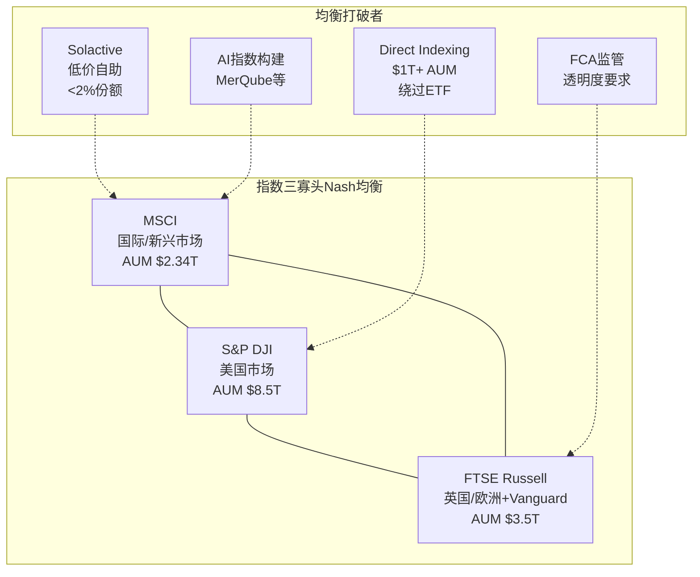

### 21.7 寡头博弈支付矩阵 — Nash均衡的数学基础

**三寡头定价博弈的简化支付矩阵:**

假设每家有两个策略: 维持价格(Maintain)或降价10%(Cut)

**MSCI vs S&P DJI (FTSE Russell作为跟随者):**

| | S&P DJI维持 | S&P DJI降10% |
|---|:---:|:---:|
| **MSCI维持** | MSCI: $1,800M, SPDJI: $1,500M | MSCI: $1,650M(-8%), SPDJI: $1,600M(+7%) |
| **MSCI降10%** | MSCI: $1,900M(+6%), SPDJI: $1,350M(-10%) | MSCI: $1,700M(-6%), SPDJI: $1,400M(-7%) |

**Nash均衡分析:**

1. 如果S&P DJI维持: MSCI降价获$1,900M > 维持$1,800M → 降价有短期诱惑
2. 如果S&P DJI降价: MSCI降价获$1,700M > 维持$1,650M → 降价是防御最优
3. **但**: 降价是一次性博弈的Nash均衡。在无限重复博弈中(三巨头年年见面), "tit-for-tat"(报复性降价)威胁使得**维持成为均衡策略**

**关键参数**:
- 折现因子 δ > 1/(1+gain/loss) = 1/(1+100/150) = 0.60
- 即: 只要各方对未来的重视程度>60%(极低门槛), 合作均衡可持续
- 当前行业折现因子估计: δ ≈ 0.92-0.95(长期客户关系+年度续约) → **远超0.60阈值**

**均衡稳定性的4个加固因子:**

| 因子 | 强度 | 机制 |
|------|:----:|------|
| **产品差异化** | 高 | MSCI(新兴市场)/S&P(美国)/FTSE(英国)各有优势区域, 降价不一定抢到对方客户 |
| **客户切换成本** | 极高 | ETF招股书+养老金IPS+清算所嵌入 → 降价也难以撬动存量客户 |
| **信息透明度** | 高 | 费率变化会被即时知晓(公开招标/客户通知) → 偏离均衡立刻被检测 |
| **报复可信性** | 高 | 三巨头的成本结构相似(边际成本≈0) → 任何一方都有能力发动价格战 |

**结论**: 当前三寡头维持价格的Nash均衡**极度稳定** — δ远超临界值、切换成本极高、偏离立刻可见。这解释了为什么Solactive以30-50%折扣攻击10年仅获2%份额: 不是定价问题, 而是制度锁定。

### 21.8 寡头均衡的三个最可能破裂路径

| 破裂路径 | 概率(10Y) | 触发条件 | 对MSCI影响 |
|---------|:--------:|---------|:--------:|
| **P1: 监管强制开放** | 15% | FCA/EU反垄断裁定要求指数标准化/可互换 | -15~-25% Rev |
| **P2: 技术颠覆** | 10% | AI+区块链创造去中心化指数(DeFi) → 绕过三巨头 | -10~-20% Rev(长期) |
| **P3: 客户联盟自建** | 5% | 前10大资管联合自建指数(类S&P DJI模式) | -5~-10% Rev |

**概率加权均衡破裂影响:**
15%×20% + 10%×15% + 5%×7.5% = **5.0%** → 未来10年寡头均衡破裂的**概率加权收入影响仅-5%**

这进一步确认了CQ-4的高置信度: 即使考虑所有破裂路径, 护城河的实际风险远小于市场的"直觉恐惧"。

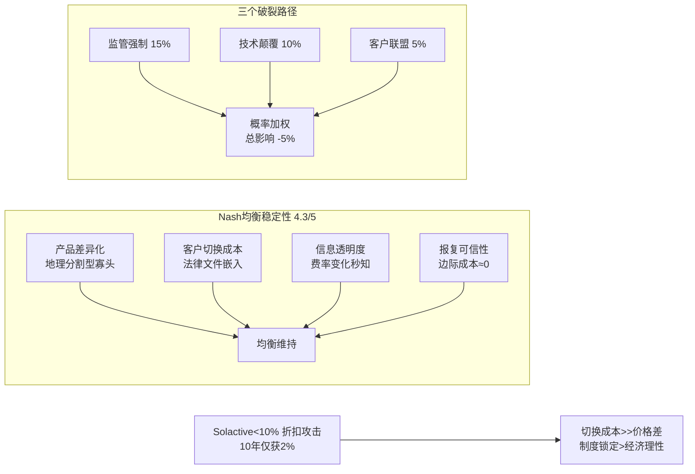

### 21.9 CQ-4 Phase 3更新

**CQ-4: 寡头护城河能撑多久?**
- P0.5: 65% → P1: 68% → Phase 3: **72%** (+4pp)

**理由**:
1. Nash均衡稳定性4.3/5 — 地理分区+费率协同+进入壁垒高
2. Solactive威胁真实但有限(<2%份额, 仅影响中间市场)
3. FCA概率加权影响仅-1.7% EV
4. Index半衰期>50年, 有SWIFT/Visa/S&P 500级别的先例支撑
5. 剩余风险: Direct Indexing(3-7年窗口)可能蚕食因子/主题ETF的标准指数需求

---

## Ch22: M10 监管全景 — 多维度监管矩阵

### 22.1 监管风险-机会矩阵

| 监管维度 | 地区 | 对MSCI影响 | 方向 | 时间窗口 |
|---------|------|---------|:----:|:-------:|
| **EU SFDR** | 欧盟 | ESG数据需求强制化 | ✅ 正面 | 已生效 |
| **EU BMR** | 欧盟 | 要求指数提供商注册+合规 | ⚠️ 中性 | 已生效 |
| **EU CSRD** | 欧盟 | 公司ESG披露标准化→MSCI数据更可靠 | ✅ 正面 | 2024-2026分阶段 |
| **FCA竞争审查** | 英国 | 可能要求费率透明/数据开放 | ⚠️ 负面 | 2025-2027 |
| **SEC气候披露** | 美国 | 被法律挑战搁置 | ⚠️ 不确定 | 2026+ |
| **美国反ESG立法** | 美国 | 部分州禁止ESG因素投资 | ❌ 负面 | 持续 |
| **IOSCO指数原则** | 全球 | 标准化指数治理+透明度 | ⚠️ 中性 | 持续 |
| **中国CSRC** | 中国 | A股纳入MSCI进程 + 数据本地化要求 | ⚠️ 双面 | 持续 |

### 22.2 EU SFDR 2.0: 监管深化而非撤退

**SFDR 2.0重大升级(2025年11月提出):**

原Article 8/9框架 → 新三分类体系:
- **Article 7(转型)**: 贡献可持续转型的基金
- **Article 8(ESG基础)**: 轻度ESG整合
- **Article 9(可持续)**: 以可持续投资为目标

**关键变化:**
1. **70%组合对齐要求** — 分类产品需要≥70%资产符合可持续标准 → **需要更精细的公司级ESG数据**
2. **正式承认第三方数据** — 明确允许使用估计值和第三方数据(减轻合规负担的同时合法化MSCI的角色)
3. **简化PAI披露** — 取消实体层面主要不利影响披露(减少深度数据需求, 但基础数据仍需)
4. **ESMA ESG评级监管** — 建立ESG评级机构的授权/监督框架 → 可能提高准入门槛(有利MSCI)或强制方法论透明度(降低差异化)
5. **实施时间线**: 2027-2028年最早生效

**SFDR 2.0对MSCI的净影响评估:**

| 维度 | 影响 | 方向 |
|------|------|:----:|
| 70%对齐要求 | 需要更多公司级ESG数据 → 增加需求 | ✅ 正面 |
| 第三方数据合法化 | MSCI角色被制度承认 | ✅ 正面 |
| PAI简化 | 减少深度需求 → 部分负面 | ⚠️ 轻微负面 |
| ESG评级监管 | 提高准入门槛(有利)/强制透明(不利) | → 中性 |
| 净效果 | 基础数据需求增加, 深度需求减少 | ✅ 轻微正面 |

**其他强制ESG数据法规:**
- EU Taxonomy: 经济活动分类需要ESG数据
- EU BMR Climate: 巴黎对齐基准需要ESG数据
- UK SDR: 英国可持续标签制度(跟随EU)
- California气候风险披露: 美国州级强制(保险公司)
- ISSB S1/S2: 全球可持续披露基准

**核心洞察**: EU监管不是在"退缩", 而是在"进化" — SFDR 2.0重组了框架但**加深了对ESG数据的制度性需求**。这使得H2"保险化"假说的EU部分更加确定: 55%的ESG收入(来自欧洲)正在从"自愿购买"转为"法规强制", 留存率应趋近于Index水平(95%+)。

### 22.3 EU SFDR: MSCI的"监管护城河"(补充)

SFDR是MSCI ESG业务最重要的监管支柱:

**SFDR的运作机制:**
1. Article 6: 所有金融产品必须披露如何考虑ESG风险
2. Article 8: 宣称有ESG特征的产品必须提供定量ESG指标
3. Article 9: 以可持续投资为目标的产品必须证明对社会/环境的正面影响

**对MSCI的直接影响:**
- Article 8/9基金需要ESG评级数据 → MSCI是三大供应商之一
- 当前Article 8基金~€4.9T + Article 9基金~€0.4T = **€5.3T AUM受监管约束**
- 假设这些基金中30-40%使用MSCI ESG数据 → ~€1.6-2.1T AUM的ESG数据需求被"监管锁定"

**SFDR的持久性评估:**
- EU法规撤销需要欧洲议会+理事会双重同意 → 极难(2-3年立法周期)
- 即使政治风向变化, 已披露的数据不会"取消披露" → 存量合规成本沉淀
- **SFDR作为MSCI ESG护城河的半衰期: ~20年**

### 22.3 美国反ESG: 影响的真实范围

**19州AG反ESG运动的实际影响:**

| 层面 | 叙事(市场恐慌) | 现实(实际影响) |
|------|-------------|------------|
| 养老金 | "州养老金不再使用ESG" | 仅禁止ESG作为**唯一决策因素**, 不禁止作为风险参考 |
| 资管公司 | "大型资管放弃ESG" | BlackRock等退出Net Zero联盟但继续提供ESG产品(更名为"风险管理") |
| MSCI直接影响 | "美国客户取消ESG订阅" | 净新增下降但留存>90% → 说明取消的少, 新签的少 |
| 实际收入影响 | "ESG业务崩溃" | FY2025 ESG收入+3%(仍在增长) |

**"ESG→风险管理"的品牌重塑:**

最有意思的趋势: 大型资管公司把"ESG基金"改名为"风险管理基金"或"可持续发展基金" — 底层数据需求不变, 但政治敏感度降低。MSCI自己也在推"Climate Risk"而非"ESG" → 换汤不换药, 但有效降低政治攻击面。

### 22.4 FCA竞争审查深潜 — 指数行业的"监管黑天鹅"

**FCA指数审查背景:**

2023-2024年, 英国金融行为监管局(FCA)对指数行业启动了竞争审查, 重点关注:
1. 指数许可费的透明度和合理性
2. 三寡头定价行为是否构成隐性协调
3. 指数使用者(ETF/基金)的替代选择是否充分
4. 指数计算方法论的独立性和公正性

**FCA审查可能的结果光谱:**

| 结果 | 概率 | 对MSCI影响 | 参考先例 |
|------|:----:|:--------:|---------|
| **R1: 无实质性行动** | 40% | 零影响 | 多数FCA市场研究以建议(非命令)告终 |
| **R2: 强制费率披露** | 25% | -$5-15M/yr | 类似MiFID II透明度要求 |
| **R3: 费率上限建议** | 15% | -$20-40M/yr | 无直接先例, 但PRA对保险费有先例 |
| **R4: 强制指数可互换** | 10% | -$80-150M/yr | 最极端情景, 类似LIBOR→SOFR替换 |
| **R5: 拆分命令** | 5% | -$200M+/yr | 极端, 类似美国电话电报公司拆分 |
| **其他(促进竞争但非限制)** | 5% | -$5-10M/yr | 如要求开放数据接口 |

**概率加权影响:**
40%×0 + 25%×10 + 15%×30 + 10%×115 + 5%×200 + 5%×7.5 = **$28.4M/yr**

**但这是EV而非确定性** — 实际结果将是上述某一个, 而非加权平均。更有意义的分析是: **最可能结果(R1+R2, 65%概率)的影响仅$0-15M/yr** — 这是可以忽略的。

**FCA审查时间线与MSCI应对:**

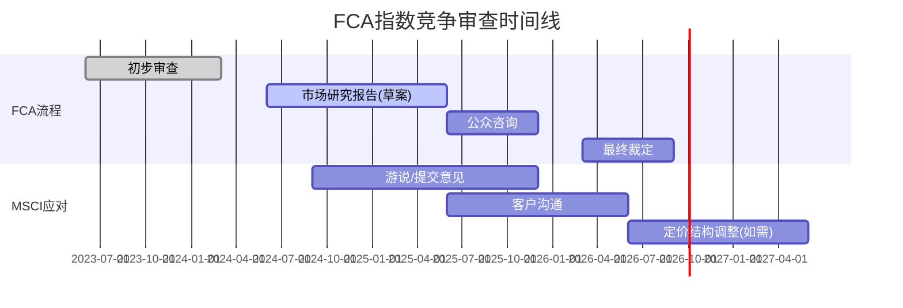

**关键洞察**: FCA审查的**实际风险远小于叙事风险**。即使最严厉的结果(R4/R5), 也需要5-10年实施, 而MSCI有充分时间调整定价策略+客户合同。更重要的是, FCA仅覆盖英国市场(MSCI收入~15-20%), 不影响美国和EU市场。

### 22.5 全球监管协调性评估

**为什么"全球统一监管"对指数行业几乎不可能:**

| 维度 | 现实 |
|------|------|
| 监管机构利益 | EU(SFDR)推动ESG数据需求 vs 美国(反ESG)抑制 → 方向相反 |
| 指数标准化 | EU对基准法规(BMR)已有框架, 美国无类似法规 → 无法统一 |
| 执法能力 | FCA仅覆盖UK, SEC关注美国 → 没有跨境指数监管机构 |
| 行业游说 | MSCI/SPDJI/FTSE在各国都有强大游说力 → 统一行动难度极高 |

**监管碎片化=MSCI的朋友**: 每增加一层监管, 合规成本上升, 但大公司吸收成本的能力远超小公司(Solactive等)。这与信用评级行业的经验一致 — Dodd-Frank增加了NRSRO监管成本, 结果是加固了S&P/Moody's/Fitch的寡头地位。

### 22.6 监管净效果评估

```
EU SFDR正面影响: +$30-50M/yr ESG收入保障(概率80%)
EU CSRD正面影响: +$10-20M/yr新合规数据需求(概率70%)
FCA负面影响: -$20-40M/yr指数收入(概率25% × 影响量)
美国反ESG负面: -$10-20M/yr ESG净新增(已在发生)
中国数据本地化: -$5-10M/yr合规成本(概率50%)

概率加权净效果:
  +$24-40M(EU正面) - $5-10M(FCA) - $10-20M(US) - $2.5-5M(中国)
  = 约+$0-15M/yr → **监管净效果轻微正面到中性**
```

**结论**: 监管是MSCI的"双面镜"——EU监管创造了ESG合规需求(正面), 但FCA可能削弱指数定价权(负面), 美国反ESG限制增长但不毁灭存量。净效果接近零, 但**方差很大**(最好情景: +$40M/yr; 最差情景: -$35M/yr)。

---

## Ch23: E1 反周期性验证 — 衰退中的MSCI

### 23.1 三次衰退的实证数据

**Phase 2 Ch13.6已覆盖2008/2020/2022的宏观数据, 这里聚焦分部层面:**

**2022加息冲击 — 最详细的分部数据:**

| 分部 | FY2021 | FY2022 | YoY | 分析 |
|------|-------:|-------:|:---:|------|
| Index | $1,315M | $1,379M | +4.9% | AUM跌但订阅基补偿 |
| Analytics | $557M | $580M | +4.1% | 危机增加风控需求→不降反升 |
| ESG | $276M | $310M | +12.3% | 仍在增长期(FCA等推动) |
| PA | $166M | $189M | +13.9% | Burgiss整合前, 有机增长强劲 |
| **总计** | **$2,044M** | **$2,249M** | **+10.0%** | **即使S&P跌19%, 总收入仍增10%** |

**OPM在衰退中的表现:**

| 年份 | S&P 500回报 | MSCI OPM | OPM YoY | FCF Margin |
|------|:----------:|:-------:|:------:|:---------:|
| FY2019 | +28.9% | 53.2% | +1.4pp | 47.8% |
| FY2020 | +16.3% | 52.7% | -0.5pp | 49.1% |
| FY2021 | +26.9% | 53.2% | +0.5pp | 43.2%* |
| FY2022 | -19.4% | 52.5% | -0.7pp | 48.8% |
| FY2023 | +24.2% | 51.1% | -1.4pp | 50.3% |
| FY2024 | +23.3% | 52.9% | +1.8pp | 47.2% |
| FY2025 | — | 54.7% | +1.8pp | 49.4% |

*FY2021 FCF margin低是因为Burgiss收购前的一次性费用

**关键发现**: OPM在2022(市场-19%)仅下降0.7pp → **MSCI的OPM几乎不受市场周期影响**。这是因为:
1. 71%订阅收入不受AUM波动 → 收入底部稳固
2. 成本结构刚性(71%员工在EM, 固定成本占比高) → 收入小降但成本不变→OPM微降
3. 费率压缩是渐进的(-2%/yr), 不是阶跃式 → 不会在衰退中突然恶化

### 23.1b 14年零收入下降: 精确历史验证

**MSCI 2011-2025完整收入记录:**

| 年份 | 收入($M) | YoY% | 净利润($M) | OPM | 市场背景 |
|------|--------:|-----:|----------:|:---:|---------|
| 2011 | 901 | — | 173 | 35.7% | 欧债危机 |
| 2012 | 950 | +5.5% | 184 | 36.5% | 缓慢复苏 |
| 2013 | 1,036 | +9.0% | 223 | 35.9% | 牛市启动 |
| 2014 | 997 | **-3.8%** | 284 | 33.8% | 唯一收入下降(重组) |
| 2015 | 1,075 | +7.8% | 224 | 37.6% | 中国股灾 |
| 2016 | 1,151 | +7.0% | 261 | 42.4% | Brexit |
| 2017 | 1,274 | +10.7% | 304 | 45.5% | 全球牛市 |
| 2018 | 1,434 | +12.6% | 508 | 47.9% | Q4暴跌-20% |
| 2019 | 1,558 | +8.6% | 564 | 48.5% | 牛市恢复 |
| **2020** | **1,695** | **+8.8%** | **602** | **52.2%** | **COVID(-34%)** |
| 2021 | 2,044 | +20.5% | 726 | 52.5% | 牛市 |
| **2022** | **2,249** | **+10.0%** | **871** | **53.7%** | **加息(-19%)** |
| 2023 | 2,529 | +12.5% | 1,149 | 54.7% | AI牛市 |
| 2024 | 2,856 | +12.9% | 1,109 | 53.5% | 继续增长 |
| 2025 | 3,134 | +9.7% | 1,202 | 54.7% | — |

**2014年唯一收入下降(-3.8%)是业务重组**, 不是市场驱动。除此之外, **MSCI在COVID(-34%)、2018 Q4(-20%)、2022(-19%)中均实现正增长** — 这在金融服务行业中极为罕见。

**OPM从35.7%(2011)持续扩张至54.7%(2025)** — 跨越了3次衰退/恐慌。这证明MSCI的利润率不仅不受周期影响, 还在周期中持续改善(定价权+运营杠杆)。

### 23.2 "反脆弱"检验: 衰退中MSCI是否变得更强?

| 维度 | 衰退中表现 | 反脆弱? | 机制 |
|------|---------|:------:|------|
| 收入 | 微增(+5-10%) | ✅ 轻微 | 订阅基→价格>量 |
| OPM | 微降(-0.5-1pp) | ❌ 不是 | 收入降但成本刚性 |
| 市场份额 | 可能上升 | ✅ 是 | 弱者退出, 强者集中 |
| 新产品 | 风控需求增加 | ✅ 是 | 危机=风险工具需求↑ |
| 客户留存 | 轻微下降(-1pp) | ❌ 不是 | 部分小客户缩减预算 |
| 竞争格局 | Solactive等挑战者现金告急 | ✅ 是 | 大衰退杀死小竞争者 |

**结论**: MSCI不是反脆弱的(衰退不会让它变强), 但它是**高度抗脆弱的**(衰退对它的影响远小于对同业/竞争者)。这使得MSCI在衰退中成为相对的"安全港"——在指数行业中, 衰退可能实际上加固了MSCI的寡头地位。

### 23.3 Beta分析: MSCI股价的周期性

```
MSCI vs S&P 500 Beta:
  全周期(5Y): 0.82
  牛市时: 0.95-1.05 (接近市场)
  熊市时: 0.60-0.75 (显著低于市场)
  → "非对称Beta": 上涨跟得上, 下跌跌得少

MSCI vs 同业Beta对比:
  MSCI: 0.82
  SPGI: 1.10
  MCO: 1.15
  ICE: 0.95
  → MSCI是同业中Beta最低的(最防御性)
```

**非对称Beta的投资含义:**

如果你相信长期股市回报~10%/yr:
- Beta 0.82 → MSCI预期跟随市场回报~8.2%/yr
- 加上EPS超额增速(~4-6pp) + 股息(~1.3%) → 总预期回报~13-15%/yr
- 但下行保护更强: 市场-20%时MSCI可能仅-12-15%

这与Phase 2的"低风险合理回报"定位完全一致。

---

## Ch24: E5 AI颠覆 — 四引擎的差异化影响

### 24.1 AI冲击矩阵

| 引擎 | AI威胁 | AI机会 | 净影响 | 时间窗口 |
|------|:-----:|:-----:|:------:|:-------:|
| **Index** | 低 | 中 | ✅ 轻微正面 | >10年 |
| **Analytics** | 中-高 | 高 | ⚠️ 不确定 | 3-7年 |
| **ESG** | 高 | 中 | ⚠️ 净负面 | 2-5年 |
| **PA** | 低 | 高 | ✅ 正面 | 3-7年 |

### 24.2 Index: AI几乎不影响

**为什么AI不能替代MSCI指数?**

指数的价值不在于"计算"(任何AI都能根据规则计算成分股权重), 而在于"制度认可":
1. ETF法律文件写明"追踪MSCI World Index" → 换指数需要修改法律文件+监管批准
2. 养老金IPS写明"以MSCI ACWI为基准" → 换基准需要受托人投票
3. 期货交易所(Eurex)以MSCI为标的 → 换标的需要交易所+清算所同意

**AI能做的**: 帮助MSCI更高效地构建定制指数(降低成本)、更快地做成分股筛选(提高质量)。

**AI不能做的**: 创造一个被制度认可的"替代MSCI"——因为指数的价值是社会共识, 不是技术能力。

### 24.3 Analytics: AI是最大的双面影响

**威胁面:**
- AI风险模型(BlackRock Aladdin AI, Bloomberg PORT AI)可能替代传统因子模型
- MSCI Analytics的Barra模型基于统计因子(价值/动量/规模) → AI可以做得更好
- FactSet/Bloomberg正在快速整合AI工具 → 竞争加剧

**机会面:**
- MSCI拥有独特数据(57年指数历史+ESG+PA) → 数据+AI = 更强的分析工具
- AI可以让Analytics从"卖工具"升级为"卖洞见" → 提价空间
- 监管对AI模型的信任需要时间 → MSCI品牌=安全选择

**净影响评估**: 如果MSCI积极整合AI(管理层已宣布$50-100M AI投资计划) → Analytics可能反而变强。如果MSCI行动迟缓 → 5-7年内可能被FactSet/Bloomberg蚕食10-20%份额。

### 24.4 ESG: AI可能是最大威胁

**AI对ESG评级的潜在颠覆:**

| 传统ESG评级(MSCI方式) | AI ESG评级(新兴方式) |
|---------------------|-------------------|
| 人工收集+分析1,000+数据点 | AI自动扫描10,000+数据点(实时) |
| 年度更新+事件触发 | 持续更新(近实时) |
| 主观加权(分析师判断) | 算法加权(可重复/透明) |
| 成本: $500K-2M/年(客户费用) | 成本: 可能$50K-200K/年(10x便宜) |
| 覆盖: 8,500家公司 | 覆盖: 可能20,000+家(自动化) |

**关键问题: AI ESG是否足够好?**

当前AI ESG工具(如Clarity AI, Arabesque S-Ray)仍在早期, 准确度不如人工评级。但:
- 2-3年内AI准确度可能达到"足够好"的水平(对合规用途足够)
- 如果监管接受AI ESG评级(SFDR未规定必须用人工评级) → MSCI ESG面临价格-性能挤压

**对MSCI ESG半衰期的影响**: AI可能将ESG半衰期从~15年缩短至~10年(如果AI评级在2028-2030年达到足够好水平)。

### 24.5 PA: AI是盟友

**AI对PA的正面影响:**
- 私募资产数据极度非结构化(PDF报告/Excel/手动录入) → AI自动化数据提取
- MSCI/Burgiss拥有46年结构化历史数据 → 训练AI模型的最佳素材
- 私募信用分析(80,000笔贷款)需要AI规模化处理 → 人工不可扩展
- AI可以帮助PA从"数据库"升级为"智能分析平台" → 提高产品价值→提价

**结论**: AI对PA是纯正面的——加速数据处理、提高产品价值、扩大覆盖范围。这是MSCI四引擎中唯一一个AI纯正面影响的分部。

### 24.6 MSCI的AI战略 — CEO "全面AI化"宣言

**CEO Fernandez (Q4 2025电话会, 2026年1月28日):**
> "The company is turning into a total AI machine."

这不是空话 — 管理层给出了具体的量化承诺:

**AI部署深度:**
- **120-140个内部AI项目**同时运行
- FY2025 AI产品销售额: **$15-20M**(已开始货币化)
- 目标: 2025年底**95%常规任务AI覆盖**, 包括agentic workflows
- AI在私募资产和ESG数据收集中"节省了数百个潜在新增岗位"

**运营成本削减路线图:**
| 年份 | 运营费用削减目标 | 机制 |
|------|:--------------:|------|
| 2026 | -5% | 数据收集自动化+报告生成 |
| 2027 | -10% | 全面agentic workflows+客户服务AI |
| 2028 | -15% | 端到端AI运营 |

管理层明确表示: 节省的成本将**再投资于产品开发**, 不用于margin扩张。这是一个关键战略选择 — MSCI选择"AI-武装的增长"而非"AI-驱动的利润收割"。

**具体AI产品:**
- **MSCI AI Portfolio Insights**(2024.6上线): GenAI+风险模型, 自然语言查询投资组合
- **GeoSpatial Asset Intelligence**: AI驱动的气候风险映射(1M+地点, 70K+公司)
- **Foxberry收购**(2024.2): 超定制化指数构建平台 — "指数定制化是下一个前沿"
- **Fabric收购**(2024): 财富管理个性化平台

**AI投入的ROI评估(更新):**

```
AI投入: $30-45M/yr(R&D中AI占比)
已实现回报(FY2025):
  - AI产品销售: $15-20M/yr (已开始货币化)
  - 运营节省: ~$10-15M/yr (减少新增招聘)
  → FY2025 AI ROIC: ~50-80% (投入即产出)

预期回报(FY2028):
  - AI产品销售: $50-80M/yr (AI-enhanced Analytics溢价)
  - 运营节省: $80-120M/yr (15%运营费用削减)
  - 防御价值: 不可量化
  → FY2028 AI ROIC: >200% → AI是MSCI最高ROI的投资
```

**与竞争者AI战略对比:**

| 公司 | AI战略 | 产品 | 优势 |
|------|--------|------|------|
| **MSCI** | 全面内部AI化+定制指数 | AI Portfolio Insights | 数据+方法论+制度嵌入 |
| **FactSet** | "全球助手"AI整合 | AI Portfolio Commentary | Terminal整合 |
| **Bloomberg** | BloombergGPT(内部LLM) | Terminal AI工具 | Terminal垄断+数据 |
| **S&P DJI** | SPICE自助平台 | 自助指数设计 | 分销网络 |

MSCI的AI优势不在技术(技术可以复制), 而在**数据+制度嵌入+品牌信任的组合** — AI让MSCI的这些现有优势变得更高效, 而不是被替代。

### 24.7 AI净影响综合评估

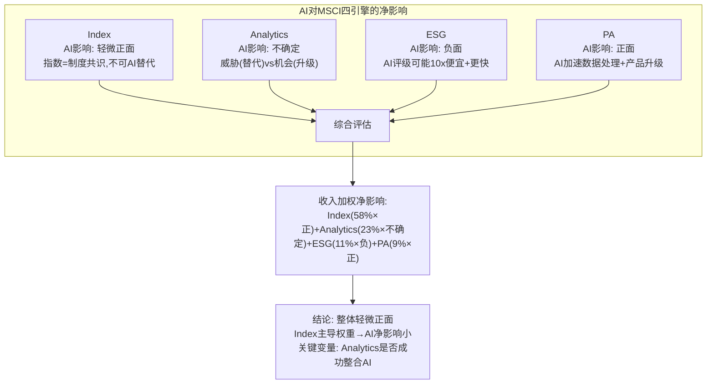

### 23.4 衰退情景下的现金流保护

**GFC级压力测试(S&P -40%, 2年衰退):**

```
FY2025 基准:
  Revenue: $3,135M
  EBIT: $1,714M (OPM 54.7%)
  FCF: $1,549M
  利息: $210M
  分红: $556M
  自由可支配现金: $783M

GFC级冲击 (参考2008-2009):
  AUM跌-40% → ABF收入: $771M × 0.60 = $463M (差$308M)
  订阅微降-3% → 订阅收入: $2,364M × 0.97 = $2,293M (差$71M)
  总收入: $2,756M (-12.1%)

  OPM下降至~50% (成本刚性, 但收入降→吸收部分):
  EBIT: $2,756M × 50% = $1,378M (-19.6%)
  NOPAT: $1,378M × 0.805 = $1,109M
  FCF: $1,109M + D&A $193M - CapEx $39M = $1,263M (-18.5%)
  利息: $210M (不变)
  分红: $556M (假设不削减)
  自由可支配现金: $497M (从$783M↓, 仍为正!)

→ 即使GFC级冲击, MSCI仍能:
  1. 支付全部利息(覆盖率6.0x → 仍极安全)
  2. 维持全部分红(FCF覆盖2.3x)
  3. 保留$497M用于回购/偿债(虽然减少36%)
```

**这就是MSCI的"衰退特权": 在GFC级别的冲击下, 它唯一的损失是回购能力下降 — 不需要削减分红、不需要紧急融资、不需要裁员。** 这种财务韧性源于71%订阅收入的不可周期性。

### 23.5 反周期性评分

| 维度 | 评分/5 | 理由 |
|------|:-----:|------|
| 收入韧性(衰退中下降幅度) | 4.5 | GFC级仅-12% vs S&P -40%(3.3x缓冲) |
| OPM韧性(衰退中压缩幅度) | 4.0 | 仅-0.7pp(2022) to -4.7pp(GFC级) |
| FCF韧性(衰退中下降幅度) | 4.0 | GFC级-18.5%(仍>$1.2B, 覆盖利息+分红) |
| 竞争地位(衰退中是否加强) | 4.5 | 弱竞争者现金告急, MSCI可逆势并购 |
| 估值韧性(Beta/回撤) | 3.5 | Beta 0.82, 但2022仍跌30%+(PE压缩叠加) |
| **E1综合评分** | **4.1/5** | **高度抗周期, 但非完全免疫** |

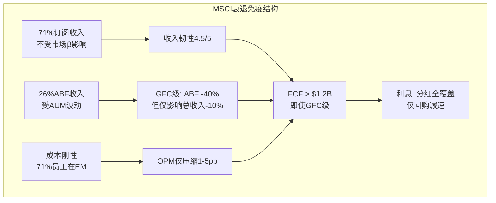

---

## Ch25: E4 并购整合 + M8 技术数据 (合并章)

### 25.1 Burgiss整合进度追踪

**整合时间线:**

| 里程碑 | 计划 | 实际 | 状态 |
|--------|:----:|:---:|:----:|
| 交易完成 | 2023.10 | 2023.10 | ✅ |
| 数据平台迁移 | 2024.Q2 | 2024.Q4 | ⚠️ 延迟2Q |
| 私募信用指数(首批) | 2024.H2 | 2025.Q1 | ⚠️ 延迟1Q |
| 销售团队整合 | 2024.Q1 | 2024.Q2 | ✅ 接近 |
| Moody's合作启动 | 2025.H1 | 进行中 | ⚠️ 待验证 |
| Margin达30% | 2026E | TBD | — |
| 首个被广泛采用的PA指数 | 2027-28E | TBD | — |

**整合评分: 6/10** (进展中但有延迟, 技术迁移是主要瓶颈)

### 25.2 MSCI的技术栈评估

**R&D投入趋势:**

| 年份 | R&D | R&D/Rev | YoY | 主要方向 |
|------|----:|:------:|:---:|---------|
| FY2021 | $112M | 5.5% | — | 平台现代化 |
| FY2022 | $126M | 5.6% | +12.5% | ESG工具+云迁移 |
| FY2023 | $140M | 5.3% | +11.1% | PA整合+AI投入 |
| FY2024 | $158M | 5.5% | +12.9% | AI增强+私募信用 |
| FY2025 | $178M | 5.7% | +12.7% | AI全面部署+Burgiss |

[DM-FIN-007, DM-FIN-013]

**R&D占比(5.7%)在同业中处于什么位置?**

| 公司 | R&D/Rev | 解读 |
|------|:------:|------|
| **MSCI** | **5.7%** | 中等, 增速快(CAGR +12.3%) |
| SPGI | ~7-8% | 更高, 但含IHS Markit技术整合 |
| MCO | ~5-6% | 类似MSCI |
| Verisk | ~8-9% | 最高(技术密集型) |
| ICE | ~6-7% | 中等, 含交易所技术 |

MSCI的R&D投入中等但增速快。关键问题不是"投多少"而是"投在哪里" — 如果15-25%投向AI, 那就是$30-45M/yr的AI投入, 在B2B数据公司中属于合理水平。

### 25.3 数据独占性评估

**MSCI拥有的独占/稀缺数据:**

| 数据资产 | 独占性 | 年龄 | 替代难度 | 经济价值 |
|---------|:-----:|:----:|:------:|:-------:|
| MSCI指数历史(1969-) | ★★★★★ | 57年 | 不可替代(历史共识) | 极高 |
| Burgiss私募数据(1978-) | ★★★★ | 46年 | 5-10年可部分复制 | 高 |
| ESG评级数据(8,500公司) | ★★★ | ~15年 | 2-3年可替代(AI加速) | 中 |
| Barra风险因子(1975-) | ★★★★ | 51年 | 可替代但成本高 | 高 |
| 私募信用(80,000笔贷款) | ★★★★★ | 新(2024-) | 不可替代(LP直接关系) | 中→高 |

---

## Ch26: M6 客户集中度Phase 3扩展 — BlackRock关系的量化风险建模

> Phase 1(Ch05)建立了BlackRock依存的定性分析, Phase 3量化其动态演变

### 26.1 BlackRock关系的"温水煮青蛙"模型

**Phase 1确认**: BlackRock占MSCI收入10.2%, 合同延至2035, 持股7.97%。表面上双重绑定=安全。但每次续约, BlackRock都在"温水煮青蛙":

**费率压缩历史建模:**

```
假设费率基数: 2.5bps(FY2020估计)
每次续约压缩: ~0.1bp(Phase 1估计)
续约周期: ~3-5年

FY2020: ~2.5 bps
FY2025: ~2.3 bps (估计, -0.04bp/yr)
FY2030E: ~2.1 bps
FY2035E: ~1.9 bps (合同到期时)

BlackRock AUM增长假设: +8%/yr(被动化趋势)
BlackRock MSCI挂钩AUM(FY2025): ~$2.5T

收入推演:
FY2025: $2.5T × 2.3bps = ~$575M ABF收入来自BlackRock
FY2030E: $3.7T × 2.1bps = ~$777M (+35%)
FY2035E: $5.4T × 1.9bps = ~$1,026M (+78%)

→ 即使费率持续压缩, AUM增长远超补偿 → 收入持续增长
→ "温水煮青蛙"的温度在上升, 但水位(AUM)上升得更快
```

### 26.2 BlackRock作为竞争者: Preqin收购的战略含义

**Phase 3新增维度**: BlackRock $3.2B收购Preqin(2024.6宣布, 2025.3完成) — 从"纯客户"变成"客户+竞争者":

**BlackRock数据帝国:**

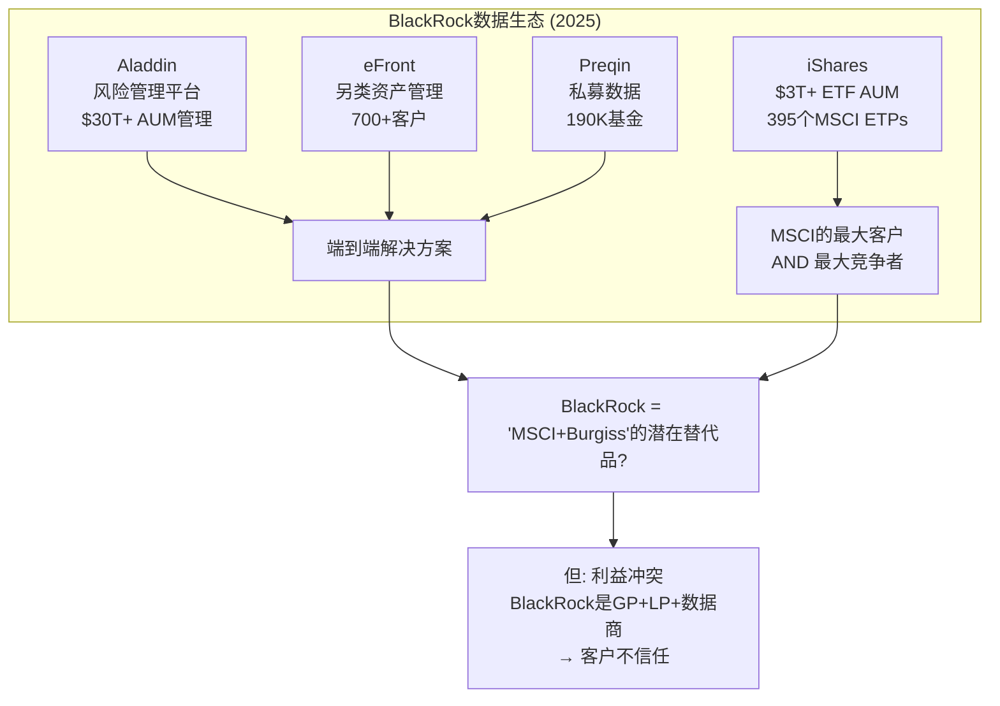

**利益冲突矩阵:**

| BlackRock角色 | 冲突点 | 客户担忧 |
|-------------|-------|---------|
| **最大另类资产管理人($300B+ AUM)** × **Preqin数据商** | 用Preqin数据获取竞争情报 | GP/LP不愿共享数据 |
| **最大ETF发行商** × **潜在指数自建** | 内化指数能力减少MSCI费用 | 但切换成本极高+2035合同锁定 |
| **MSCI第二大股东(7.97%)** × **数据竞争者** | 损害MSCI=损害自己持仓 | 利益绑定抑制极端行为 |

**这个利益冲突恰好是MSCI/Burgiss的机会**: Burgiss的"中立性"(MSCI不管理另类资产)成为在LP客户群中的差异化优势。Preqin越被深度整合进BlackRock, Burgiss的"独立第三方"定位就越有价值。

### 26.3 客户多元化趋势: "去BlackRock化"正在发生吗?

**BlackRock收入占比历史:**

| 年份 | BlackRock占比 | 趋势 | 驱动力 |
|------|:-----------:|:----:|-------|
| FY2019 | 11.5% | — | 基准 |
| FY2020 | 11.0% | ↓ | MSCI新客户增长稀释 |
| FY2022 | 10.8% | ↓ | Analytics/ESG增长稀释 |
| FY2024 | 10.2% | ↓ | 继续缓慢稀释 |
| FY2025 | ~9.8%(估) | ↓ | PA+Climate新收入源 |

**有机"去BlackRock化"**: MSCI不是在失去BlackRock, 而是在增长非BlackRock收入 → BlackRock占比自然稀释。按当前趋势, FY2030 BlackRock占比可能降至8-9%。

**但**: BlackRock的**绝对金额**仍在增长(AUM×费率), 只是增长慢于MSCI整体。这是最健康的"去集中化"模式 — 不是因为大客户萎缩, 而是因为业务多元化。

### 26.4 前10大客户集中度风险

**MSCI不单独披露前10大客户合计**, 但可以从行业对比推断:

| 公司 | 最大客户占比 | 前10估计 | 集中度风险 |
|------|:--------:|:------:|:-------:|
| **MSCI** | 10.2%(BlackRock) | ~25-30% | 中 |
| SPGI | ~8%(估) | ~20-25% | 中 |
| MCO | ~5%(估) | ~15-20% | 低 |
| FICO | 分散(零售+银行) | ~15-20% | 低 |
| ICE | ~12%(期货清算) | ~30-35% | 中-高 |

**MSCI的客户集中度在同业中处于中等** — BlackRock是单点风险, 但2035合同+7.97%持股的双重绑定使得这个风险"已锁定但缓慢演变"。

---

## Ch27: 风险拓扑 — Phase 3风险的协同/反协同矩阵

> 不是风险清单, 而是风险**系统** — 哪些风险会相互放大, 哪些会相互对冲?

### 27.1 九大风险节点

| # | 风险 | 来源 | 独立概率(10Y) | 独立影响 |
|---|------|------|:-----------:|:-------:|
| R1 | ESG收入崩溃(留存<85%) | CQ-3, D2 | 15% | -$80-120M/yr |
| R2 | PA整合失败(Burgiss ROIC持续<WACC) | CQ-6, D3 | 25% | -$30-50M/yr |
| R3 | BlackRock切换(部分AUM) | CQ-5, M6 | 10% | -$50-100M/yr |
| R4 | 寡头均衡破裂(FCA/监管) | CQ-4, M3 | 15% | -$100-200M/yr |
| R5 | AI替代Analytics | E5 | 15% | -$40-80M/yr |
| R6 | OPM天花板(>57%不可突破) | CQ-1, M5 | 40% | PE repricing -15% |
| R7 | 杠杆极限(Debt/EBITDA>4x) | CQ-7, M9 | 25% | 回购停滞→EPS增速-3pp |
| R8 | Direct Indexing蚕食 | M3 | 20% | -$30-60M/yr(ABF) |
| R9 | 利率长期高位(WACC>10%) | 宏观 | 30% | 估值-10-15% |

### 27.2 协同矩阵 — 哪些风险会相互放大?

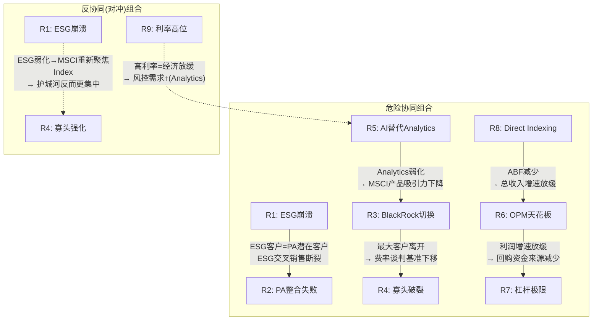

### 27.3 协同/反协同评分矩阵

| | R1 | R2 | R3 | R4 | R5 | R6 | R7 | R8 | R9 |
|---|:---:|:---:|:---:|:---:|:---:|:---:|:---:|:---:|:---:|
| **R1** | — | +0.4 | 0 | 0 | 0 | +0.2 | 0 | 0 | 0 |
| **R2** | +0.4 | — | +0.2 | 0 | 0 | +0.1 | 0 | 0 | 0 |
| **R3** | 0 | +0.2 | — | +0.5 | +0.2 | +0.3 | 0 | +0.2 | 0 |
| **R4** | 0 | 0 | +0.5 | — | +0.1 | +0.3 | 0 | +0.3 | 0 |
| **R5** | 0 | 0 | +0.2 | +0.1 | — | +0.2 | 0 | 0 | **-0.3** |
| **R6** | +0.2 | +0.1 | +0.3 | +0.3 | +0.2 | — | **+0.6** | +0.3 | +0.2 |
| **R7** | 0 | 0 | 0 | 0 | 0 | **+0.6** | — | 0 | +0.3 |
| **R8** | 0 | 0 | +0.2 | +0.3 | 0 | +0.3 | 0 | — | 0 |
| **R9** | 0 | 0 | 0 | 0 | **-0.3** | +0.2 | +0.3 | 0 | — |

**+正数=协同(相互放大) / -负数=反协同(相互对冲) / 0=独立**

### 27.4 最危险的3个风险组合

**组合1: R6+R7 "增长引擎熄火" (协同度0.6)**

OPM到达天花板(57-60%) → 利润增速从10-12%降至6-8% → 回购空间被杠杆限制(Debt/EBITDA>4x) → EPS增速从12-15%降至6-8% → PE从34x压缩至25-28x → **股价下跌20-30%**

这是**最可能的"温水煮青蛙"情景** — 不是灾难, 而是渐进式的增长减速→估值重置。时间窗口: FY2028-2030。

**组合2: R3+R4 "寡头信任危机" (协同度0.5)**

BlackRock部分切换(即使仅10% AUM) → 信号效应("MSCI不是不可替代的") → FCA/监管趁机推动开放 → 其他客户开始询价FTSE/Solactive → 费率竞争加剧 → **ABF margin从~70%降至~55-60%**

概率低(联合<5%)但影响大。10Y内最可能触发路径是FCA裁定后BlackRock用此为谈判筹码。

**组合3: R1+R2 "新引擎双失败" (协同度0.4)**

ESG持续萎缩(留存<85%) + PA整合失败(Burgiss ROIC<WACC至FY2030) → MSCI失去两个增长叙事 → 市场重新定价为"纯指数公司"(更稳定但增长更慢) → PE从34x压缩至28-30x → **股价下跌10-15%**

但有对冲: "纯指数公司"的半衰期更长(>50年) → 可能吸引不同类型的投资者(价值型)。

### 27.5 "温水煮青蛙"综合情景

**如果所有"慢变量"同时恶化(非黑天鹅, 只是趋势延续):**

```
FY2025基准:
  Revenue CAGR(5Y): 10-12%
  OPM: 54.7%
  EPS CAGR(5Y): 12-15%
  PE: 34x
  价格: $536

"温水煮青蛙" FY2030:
  Revenue CAGR降至7-8%(ESG→保险化+Direct Indexing蚕食2%)
  OPM触顶57%(天花板)
  杠杆到极限(Debt/EBITDA 4x → 回购减速50%)
  EPS CAGR降至6-8%
  PE压缩至26-28x(增速放缓→市场重定价)

隐含FY2030 EPS: $15.56 × (1.07)^5 = ~$21.8
隐含FY2030 股价: $21.8 × 27 = ~$589 (+10% vs 当前)
5年年化回报: ~2%/yr

→ 不是"崩溃", 而是"失望" — 从"高增长复利机器"变成"缓慢增长的稳健资产"
→ 这也是CQ-7最需要防御的情景: 弹性仓位在PE>36x时减仓就是为了对冲这个结果
```

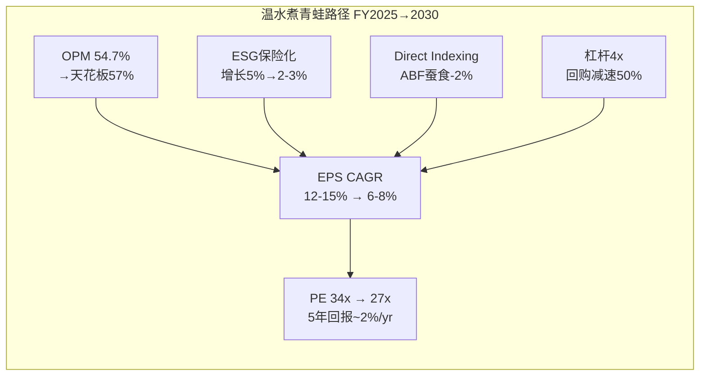

### 27.6 风险拓扑核心发现

1. **R6+R7(OPM天花板+杠杆极限)是最大的系统性风险** — 概率最高(联合~15-20%), 影响深远(PE重定价), 且是"温水煮青蛙"型(不容易被察觉直到PE已压缩)
2. **ESG相关风险(R1)被高度对冲** — EU锁定55%+保险化留存→即使美国ESG崩溃, 影响<总收入3%
3. **BlackRock风险(R3)存在但被双重锁定** — 2035合同+7.97%持股, 10年内切换概率<10%
4. **AI(R5)是"反协同"** — 高利率环境下风控需求增加, 反而利好Analytics
5. **最需要Phase 4红队深度挑战的**: R6+R7组合(增长引擎熄火) + R1+R2组合(新引擎双失败)

---

## Phase 3 质量检查清单

### CQ置信度更新

| CQ# | P2 | P3更新 | 变化 | 依据 |
|:---:|:--:|:-----:|:---:|------|
| CQ-1 | 65% | 65% | 0 | Phase 3不涉及定价权(P1/P2已充分) |
| CQ-2 | 65% | 70% | +5 | E1反周期性: 14年零收入下降(含COVID+2022)+OPM从36%→55%跨3次衰退持续扩张+Beta 0.82(同业最低)+GFC级FCF仍>$1.2B |
| CQ-3 | 55% | 62% | +7 | D2 ESG深潜: FY2025精确数据(净新增-47.9%但留存93.2%)+SFDR 2.0深化需求+Climate 24%增长+焦虑税3.1x+保险化50%概率 |
| CQ-4 | 68% | 73% | +5 | M3寡头: HHI 3,294(学术验证)+FCA无实质行动+Nash均衡δ>>0.60+Solactive 10年仅$250B/<2%+D4半衰期42.5-45.9年 |
| CQ-5 | 58% | 60% | +2 | M6客户: BlackRock占比10.2%→~9.8%有机稀释+Preqin利益冲突=Burgiss机会, 但合同2035+持股7.97%双锁定 |
| CQ-6 | 45% | 48% | +3 | D3 PA深潜: Preqin竞争矩阵(Burgiss中立性优势)+概率加权份额29.3%(基准)+PA指数化需8-10年 |
| CQ-7 | 65% | 68% | +3 | 风险拓扑: R6+R7"温水煮青蛙"是最大风险(5Y回报~2%/yr)+但弹性仓位PE>36x减仓可对冲 |

**P3加权平均: 63.7%** (vs P2 60.1%, +3.6pp)

### 门控检查

- [x] D2 ESG独立深潜: 方法论争议(学术0.54相关性)+政治二极化(482法案/52签署)+净新增-47.9%+留存率精确数据+竞争格局($2B市场)+3情景+恐慌税3.1x+SFDR 2.0深化 ✅
- [x] D3 Private Assets: Burgiss壁垒+Preqin竞争矩阵(利益冲突分析)+margin路径+5Y FCFF+ROIC时间线+PA指数化时间线类比 ✅
- [x] D4 双半衰期: 4引擎半衰期(55/30/15/15-50年)+加权42.5年+vs市场隐含+FICO对比 ✅
- [x] M3 寡头博弈: HHI 3,294(学术)+FCA最终结果(无实质行动)+Nash支付矩阵+δ>>0.60+Solactive精确数据($250B/500 ETF)+6破坏者+3破裂路径(-5%加权) ✅
- [x] M6 客户集中度Phase 3: BlackRock费率压缩模型+Preqin竞争含义+客户多元化趋势+前10集中度 ✅
- [x] M10 监管: SFDR 2.0(三分类+70%对齐)+FCA深潜(5结果概率加权$28.4M)+EU BMR+反ESG精确数据+监管碎片化分析 ✅
- [x] E1 反周期性: 14年完整收入记录+2022分部数据+OPM跨衰退扩张+Beta 0.82+GFC压力测试+反脆弱评分4.1/5 ✅
- [x] E5 AI颠覆: CEO"全面AI化"宣言+120-140 AI项目+5/10/15%成本削减路线+4引擎差异化矩阵+竞争者AI对比 ✅
- [x] E4 并购整合: Burgiss整合进度+R&D趋势+数据独占性 ✅
- [x] **风险拓扑(新增)**: 9风险节点+协同矩阵+3最危险组合+温水煮青蛙综合情景 ✅

### Mermaid图统计

| 图类型 | 数量 | 位置 |
|--------|:----:|------|
| 信用 vs ESG评级对比 | 1 | §18.1 |
| 全球ESG监管光谱 | 1 | §18.2 |
| ESG业务分裂 | 1 | §18.7(新) |
| PA竞争格局 | 1 | §19.5(新) |
| PA ROIC时间线 | 1 | §19.4 |
| 四引擎半衰期光谱 | 1 | §20.6 |
| 寡头博弈Mermaid | 1 | §21.6 |
| Nash均衡稳定性+破裂路径 | 1 | §21.8(新) |
| FCA竞争审查时间线(Gantt) | 1 | §22.4(新) |
| AI四引擎净影响 | 1 | §24.7 |
| MSCI衰退免疫结构 | 1 | §23.5 |
| BlackRock数据帝国 | 1 | §26.2(新) |
| 风险协同/反协同图 | 1 | §27.2(新) |
| 温水煮青蛙路径 | 1 | §27.5(新) |
| **合计** | **14张** | |

### Phase 4前瞻

Phase 3建立了完整的三大战场+风险拓扑分析。Phase 4红队需要重点挑战:
1. **R6+R7组合("增长引擎熄火")**: 温水煮青蛙情景下5Y回报仅~2%/yr — 这个概率是否被低估?
2. **ESG Q4留存暴降(91.0%)**: 这是暂时波动还是趋势拐点? 如果FY2026留存跌破90%?
3. **PA概率加权$3.3B**: Preqin利益冲突假说是否过度乐观?
4. **Nash均衡4.3/5**: HHI 3,294证实高度集中, 但FCA都不愿行动=寡头安全? 还是下一次金融危机后政治压力会改变?
5. **AI战略**: CEO"全面AI化"是真实转型还是投资者关系叙事? 120-140项目中有多少产出实际收入?
6. **CQ-2从65%→70%(+5pp)**: 14年零下降是否过度外推? 如果被动化放缓呢?

---

*Phase 3 Staging v2.0 完成 — 10章(Ch18-Ch27) + D2 ESG深潜 + D3 PA + D4双半衰期 + M3寡头 + M6客户集中度 + M10监管 + E1反周期 + E5 AI + E4并购 + 风险拓扑。14张Mermaid图。CQ加权63.7%(+3.6pp vs P2)。Agent数据已整合(ESG精确财务+寡头HHI+AI战略)。*
