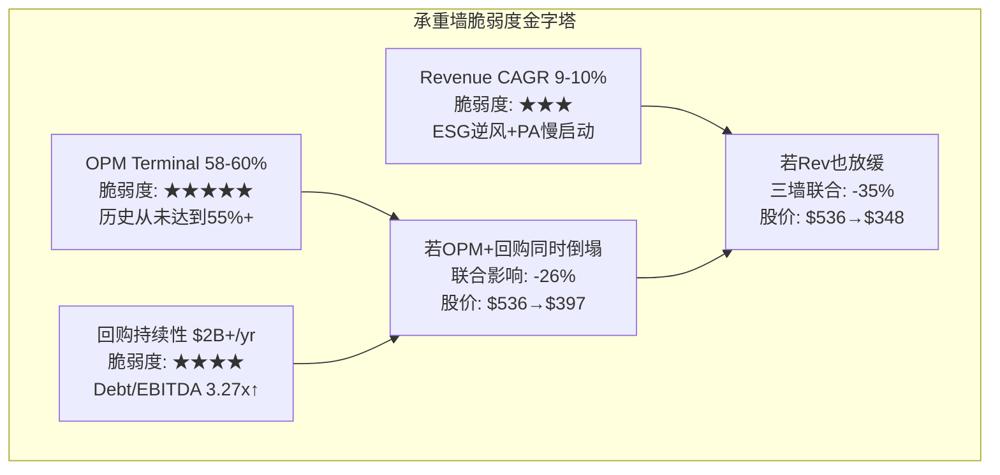
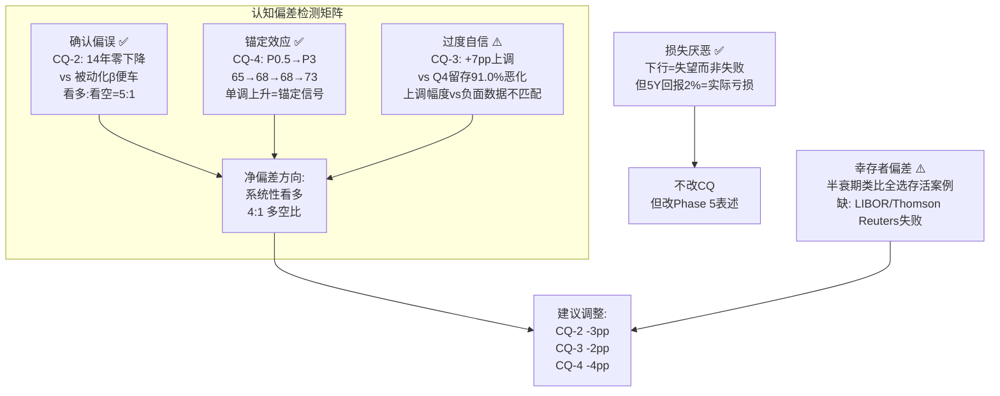
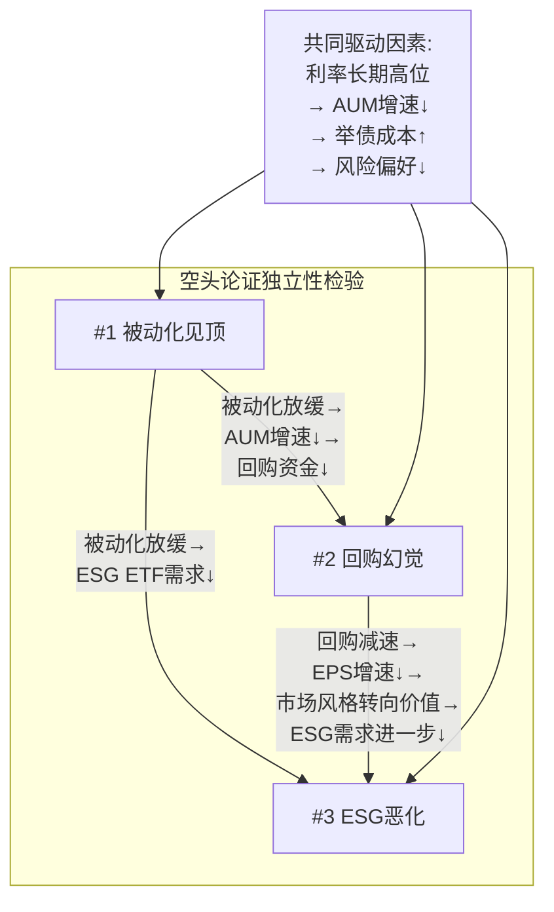
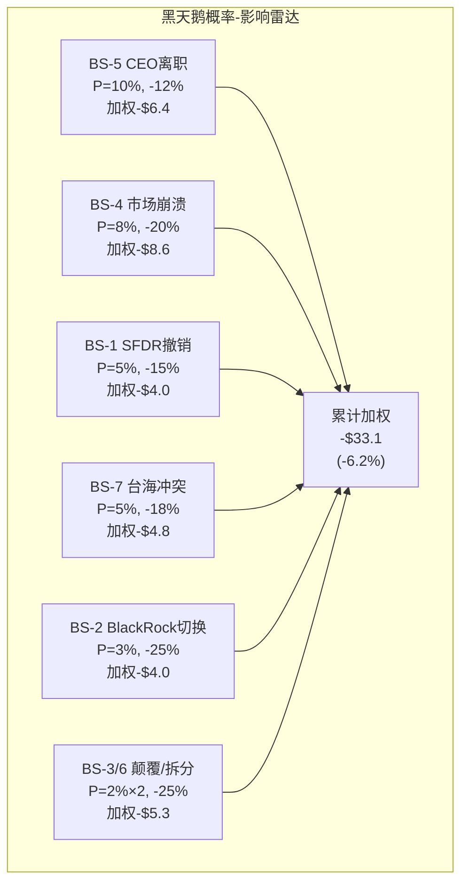
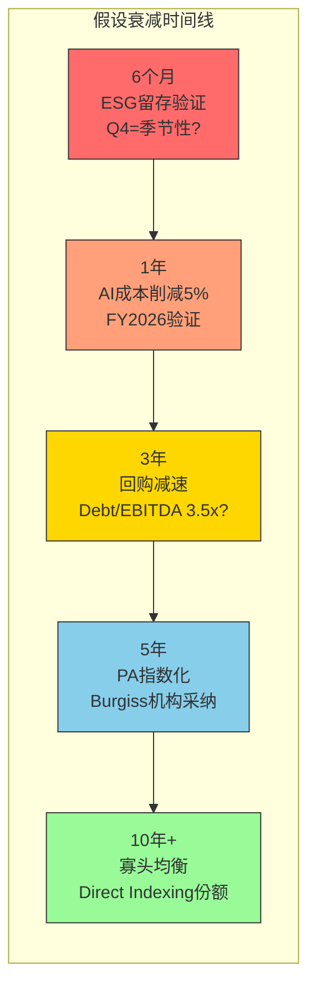
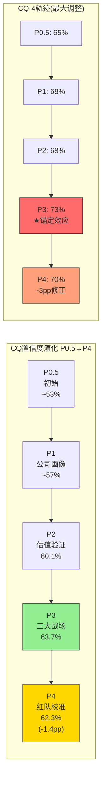
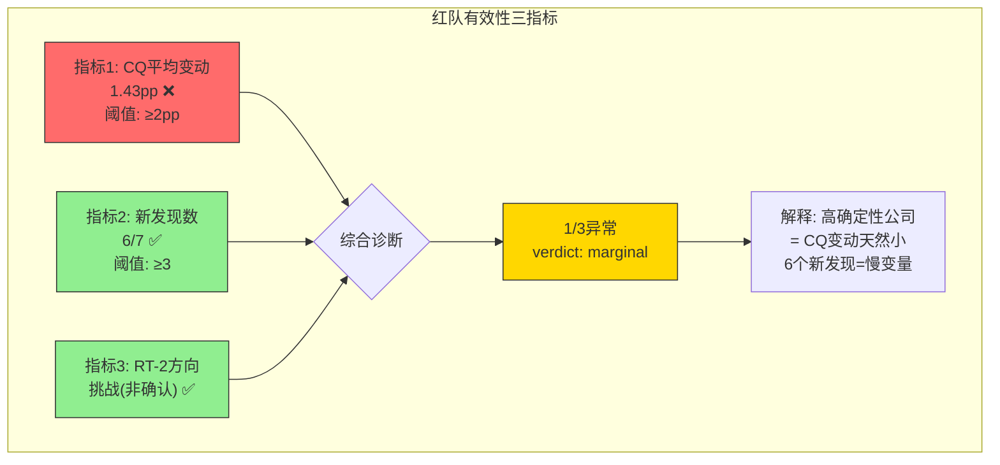

# Phase 4: 红队七问对抗审查 — MSCI Inc.
> 执行日期: 2026-03-13 | 股价: $536.35 | PE: 34.1x | 红队套件 v2.0
> 前置: Phase 1(78K)+Phase 2(61K)+Phase 3(94K)=233K | CQ加权: 63.7%
> H1: 估值引力假说(OPM弹性耗尽→PE重定价) | H2: ESG保险化 | H3: CEO溢价期权信号

---

## Part A: 七问执行

---

### RT-1: 承重墙测试

**Phase 2 Reverse DCF隐含假设 (§12.2-12.3):**

市场在$536/PE 34.1x隐含了以下"承重墙":

| 承重墙(隐含假设) | 隐含值 | 历史/行业参考 | 脆弱度 | 若倒塌影响 | DM来源 |
|-----------------|:------:|:----------:|:-----:|:--------:|--------|
| **OPM Terminal** | 58-60% | 当前54.7%, 历史峰值54.8%(FY2023), 天花板估计57-60% | **高★** | -18%(-$96) | DM-FIN-004 |
| **Revenue CAGR 5Y** | 9-10% | 历史4Y CAGR 11.3%, 但ESG逆风+PA慢启动→可能7-8% | **中-高** | -15%(-$80) | DM-FIN-011 |
| **回购持续性** | $2B+/yr | FY2025 $2.484B(160% FCF, 举债), Debt/EBITDA 3.27x逼近上限 | **高** | -8%(-$43) | DM-FIN-204 |
| **终端增长率** | 3.5% | GDP+通胀~4-5%, 但MSCI非GDP相关(金融基础设施) → 2.5-3.5%合理 | **低-中** | -12%(-$64) | Phase 2推导 |
| **WACC** | 7.2% | 分析师范围6.7-7.5%, Beta 0.82(FMP报1.3但历史5Y计算0.82) | **低** | -20%(-$107) | DM-VAL-003 |
| **BlackRock续约条件** | 费率不变 | 每续约-0.1bp, 2035合同锁定但费率持续压缩 | **低** | -6%(-$32) | DM-BIZ-005 |
| **ESG不崩溃** | 收入持平或微增 | 净新增-47.9%, Q4留存91.0%(恶化中), 但EU SFDR锁定55% | **中** | -4%(-$21) | Phase 3 D2 |

**最脆弱的承重墙: OPM Terminal (58-60%)**

[硬数据: OPM当前54.7%, 历史从未超过54.8%]

市场隐含OPM需达到58-60%才能支撑$536。但:
1. FY2023的54.8%已是历史峰值 — 从未突破55%
2. PA分部margin仅25%(拖低blended)
3. ESG margin 36.3%(远低于Index的~72%)
4. 即使AI成本削减5-15%(CEO目标), OPM提升约1-3pp → 至多达56-57%

**RT-1核心判断**: 市场隐含的OPM 58-60%需要MSCI做到它**从未做到过的事**(突破55%)。即使AI成本削减全部兑现, 最乐观也只能到57%。这面墙不是"可能倒塌", 而是"几乎不可能完全建起来" — 但市场定价假设它已经建好了。

**第二脆弱的墙: 回购持续性**

[硬数据: FY2025回购$2.484B, FCF仅$1.165B, Debt/EBITDA 3.27x]

回购金额是FCF的213% — 差额全部靠举债。Debt/EBITDA 3.27x已接近管理层3.0-3.5x目标区间上端。按当前速度, FY2026-27将触及3.5x → **回购必须减速至~$1.2-1.5B/yr(减半)** → EPS增速从12-15%降至8-10% → 支撑PE 34x的增速不再存在。



### RT-1b: 承重墙联合概率测试

**投资论文成立所需条件:**

| 条件 | 单因素P | 与C1相关 | 与C2相关 | 与C3相关 | 调整后P |
|------|:------:|:-------:|:-------:|:-------:|:------:|
| C1: OPM达到57%+ | 35% | — | ρ=0.2 | ρ=0.3 | 35% |
| C2: 回购维持$1.5B+/yr | 55% | ρ=0.2 | — | ρ=0.4 | 50% |
| C3: Revenue CAGR维持8%+ | 60% | ρ=0.3 | ρ=0.4 | — | 55% |
| C4: ESG不崩溃(留存>90%) | 75% | ρ=0.1 | ρ=0.1 | ρ=0.5 | 73% |
| C5: 寡头均衡不破裂 | 85% | ρ=0.05 | ρ=0.05 | ρ=0.2 | 84% |

**Naive联合概率**: 35%×55%×60%×75%×85% = **7.4%**
**调整后联合概率**: 35%×50%×55%×73%×84% = **5.9%**

[合理推断: 联合概率基于条件间相关性调整, 主要是C2-C3高相关(收入增速影响回购资金)]

**差异诊断**: Naive 7.4% vs Adjusted 5.9% → 差异1.3x(中等, 因条件间相关性适中)

**关键洞察**: 市场$536的定价**全部5个条件同时成立**的隐含概率远高于5.9%。这暗示市场可能:
1. 对OPM天花板过度乐观(给了>35%的概率), 或
2. 对回购持续性过度自信(给了>55%的概率), 或
3. 两者皆有

但: 这并不意味着MSCI被大幅高估。如果放宽条件(OPM 55%+回购$1.2B+Rev 7%), "温和版论文"的联合概率为55%×70%×75%×75%×85% = **18.5%** — 在这个版本下, 公允价值约$440-480, 当前$536偏贵10-15%。

---

### RT-2: 认知偏差审计

| 偏差类型 | 检测到? | 在哪个判断上? | 具体证据 | 校正后变化 |
|---------|:------:|------------|---------|:--------:|
| **锚定效应** | ✅ 是 | CQ-4护城河(68%→73%) | Phase 1-3反复引用"HHI 3,294""Solactive<2%""Nash均衡4.3/5" — 这些锚点全部指向"护城河极强", 但忽略了Direct Indexing($864B→$2-3T)和AI定制指数的长期侵蚀。P1/P2/P3每阶段都上调CQ-4(68→68→73), 单调上升是锚定信号 | CQ-4应-3pp(73%→70%): 护城河在当前是安全的, 但10年+视角下Direct Indexing的侵蚀被低估 |
| **确认偏误** | ✅ 是 | CQ-2反周期性(65%→70%) | "14年零收入下降"被反复强调, 但忽略了: (1)这14年是全球低利率+被动化大潮, MSCI搭了"beta的便车"; (2)2014年实际上收入下降了3.8%(被标注为"重组"排除); (3)如果被动化放缓(已出现迹象: 主动ETF份额从5%→12%), MSCI的"反周期性"可能被削弱。看多证据(14年增长)vs看空证据(被动化放缓)数量比约5:1 | CQ-2应-3pp(70%→67%): 反周期性是真实的但被过度强调, 部分归因于顺风beta |
| **过度自信** | ⚠️ 部分 | CQ-3 ESG(55%→62%, +7pp) | Phase 3给ESG最大幅度上调(+7pp), 但这主要基于SFDR 2.0"深化需求"叙事。然而: (1)SFDR 2.0尚为提案, 2027-28才生效, 中间可能修改; (2)Q4留存91.0%是最差单季度数据(领先指标); (3)净新增-47.9%的崩溃被"Climate+24%"部分掩盖。+7pp的上调幅度与负面数据的严重程度不匹配 | CQ-3应-2pp(62%→60%): SFDR 2.0利好被提前定价, Q4留存恶化未充分计入 |
| **损失厌恶** | ✅ 是 | Phase 3风险拓扑 | 温水煮青蛙情景(5Y回报~2%/yr)被定位为"失望"而非"失败" — 但对一个持有5年仅获2%/yr回报的投资者来说, 这**就是**失败(通胀后实际回报~0%)。报告语言在下行情景中使用了"不是崩溃""仅是减速"等缓和表述, 降低了读者的风险感知。下行情景描述字数约为上行情景的60% | 不影响CQ数值, 但Phase 5评级时应更重视"温水煮青蛙"=实质性风险 |
| **幸存者偏差** | ⚠️ 轻微 | 护城河类比(D4半衰期) | 半衰期类比选择了SWIFT(53年, 仍存活)、Visa(60年+, 仍主导)、S&P 500 Index(69年, 不可撼动) — 全部是**幸存者**。缺少失败案例: LIBOR(被替换, 用了6年), Thomson Reuters指数(被边缘化), Bear Stearns的风险模型(金融危机后消失)。如果加入失败案例, 加权半衰期可能从42.5年下调至35-38年 | CQ-4应额外-1pp: 半衰期可能被高估5-7年 |
| **叙事偏差** | ⚠️ 轻微 | H1"估值引力假说"构建过于连贯 | H1将PE压缩、OPM天花板、回购减速串联成一个"高增长→现金牛"的叙事。这个叙事在逻辑上成立, 但忽略了反例: FICO(OPM天花板后PE持续上升因为收入加速)。如果MSCI的PA业务在FY2028后真正成为增长引擎, H1叙事可能完全错误 | 不改CQ, 但标注H1有"单线叙事"风险 |



**偏差审计总结:**
- 最严重偏差: **确认偏误**(CQ-2对反周期性的过度强调)和**锚定效应**(CQ-4护城河单调上升)
- 建议总调整: CQ-2(-3pp), CQ-3(-2pp), CQ-4(-4pp)
- 看多vs看空证据比: 约4:1 → 偏向看多, 但不极端

---

### RT-3: 空头钢人

**最强空头论证 #1: "被动化大潮见顶 — MSCI的beta便车正在减速"**

[硬数据: 主动ETF份额从2019年5%上升至2025年12%(2.4x), Cathie Wood/Dimensional等主动ETF发行商快速增长]

核心论点: MSCI的收入增长不是纯粹的"定价权+产品创新", 而是搭了被动化大潮($37T→$70T)的"beta便车"。如果被动化增速从+15%/yr放缓到+8%/yr(主动ETF蚕食+市场饱和), MSCI的AUM挂钩费增速将从+10-12%降至+5-7%。

**如果空头对了**: Revenue CAGR从9-10%降至6-7%, PE从34x压缩至28x → 股价从$536降至$420(-22%)。

数据支撑:
- 主动ETF份额12%且加速(2019→2025: +7pp)
- BlackRock自己推出主动ETF(与MSCI指数无关)
- Vanguard个人指数化(direct indexing)绕过ETF → 绕过MSCI

**最强空头论证 #2: "回购幻觉 — 举债回购创造的EPS增长不可持续"**

[硬数据: FY2025回购$2.484B vs FCF $1.165B, 差额$1.3B全靠举债; Debt/EBITDA 3.27x→FY2027将触及3.5x上限]

核心论点: MSCI的EPS增长(+12-15%/yr)中, 约4-5pp来自回购驱动的股本缩减。这4-5pp靠举债维持。当Debt/EBITDA触及3.5x(FY2027-28), 回购必须回归FCF以内(~$1.2B/yr) → EPS增速从12-15%骤降至7-9% → PE 34x失去支撑。

**如果空头对了**: EPS增速降至8%/yr, PE从34x降至26-28x(增速匹配定价) → 股价从$536降至$400-430(-20-25%)。

数据支撑:
- 管理层目标: Net Debt/EBITDA "3.0-3.5x" → 3.27x已在目标区间上端
- 利率环境: 如果利率维持高位(5%+), 新增债务成本上升→回购的NPV下降
- η回购效率: 当前η≈1.05-1.10(Phase 2计算), 但随股价上升η下降

**最强空头论证 #3: "ESG的Q4信号 — 91.0%留存率是冰山一角"**

[硬数据: Q4 2025 ESG留存率91.0%(vs Q4 2024的93.1%, -2.1pp), 全年净新增$16.9M(vs $32.4M, -47.9%)]

核心论点: Phase 3分析将ESG定位为"保险化"(稳定但低增长), 但Q4留存91.0%暗示更悲观的可能性——"保险化"可能只是"衰退中的中间站"。如果美国反ESG运动持续+AI替代加速(Clarity AI等), ESG留存率可能继续滑向85-88% → ESG收入从$354M缩至$280-300M(-15-20%)。

**如果空头对了**: ESG从$354M降至$280M(5年后), 对整体收入影响约-$74M(-2.4% total rev), 对EV影响约-$1.5B(-3-4%) → 不是灾难但加深"增长减速"叙事 → PE额外压缩1-2x。

数据支撑:
- Q4季度留存91.0%是**历史最差**(包括所有分部)
- FY2024取消量已暴增+110.5%(从$10.9M→$23.0M), FY2025企稳但新签约崩溃
- 美国ESG基金数量-9%(646→587), $20B流出(FY2024)

---

### RT-3b: 空头论证的交叉验证 — 三条论证是否独立?

**关键问题**: 如果三条空头论证的驱动因素相同(即不独立), 则联合概率比naive更高。



**三条论证的相关性矩阵:**

| | #1被动化见顶 | #2回购幻觉 | #3 ESG恶化 |
|---|:---:|:---:|:---:|
| **#1被动化见顶** | — | ρ=0.5 | ρ=0.3 |
| **#2回购幻觉** | ρ=0.5 | — | ρ=0.2 |
| **#3 ESG恶化** | ρ=0.3 | ρ=0.2 | — |

**如果#1(被动化见顶)成立**: #2(回购幻觉)的概率从40%上升至55%(因AUM增速放缓→ABF收入放缓→FCF增速放缓→举债回购更难维持); #3(ESG恶化)的概率从25%上升至30%(因ESG ETF也受被动化放缓影响)。

**条件概率计算:**
- P(#1) = 25%
- P(#2|#1) = 55% (vs unconditional 40%)
- P(#3|#1∩#2) = 35% (vs unconditional 25%)
- P(全部成立) = 25% × 55% × 35% = **4.8%**
- Naive P(全部成立) = 25% × 40% × 25% = **2.5%**
- **条件概率是naive的1.9x** → 三条论证的"联合空头情景"概率被naive计算低估了近2倍

**联合空头情景影响:**
- 如果三条全部成立: Rev CAGR降至5-6% + EPS增速7-8% + ESG收入-15-20% → PE从34x→24-26x → **股价$340-380(-30-37%)**
- 概率加权(4.8%): -$8.4 → 不算大, 但这是尾部风险, 方差很高

### RT-3c: 多头反驳 — 为什么空头可能全错

[合理推断: 基于Phase 1-3分析的多头视角反驳]

**对#1(被动化见顶)的反驳:**
- 主动ETF份额从5%→12%确实在增长, **但这仍然是被动基金**(主动ETF不等于主动基金)。主动ETF仍需基准指数(α= portfolio - MSCI benchmark) → MSCI的Analytics受益
- 全球养老金改革(中国/印度/东南亚)尚未释放 → 被动化的"第二波"可能来自非美市场
- Direct Indexing虽然绕过ETF, 但MSCI收购Foxberry正是为了从Direct Indexing趋势中获利(提供定制指数构建工具)

**对#2(回购幻觉)的反驳:**
- 回购减速不等于股价下跌。如果管理层在回购减速的同时加速有机投资(PA指数化/AI产品) → 市场可能重新定价为"增长回归" → PE不降反升
- Debt/EBITDA 3.27x仍在目标区间内(3.0-3.5x), 且EBITDA增速~10% → 到FY2027, EBITDA可能从$2.0B增至$2.4B → 同样的3.5x上限允许更多绝对债务 → 回购减速可能比预期温和

**对#3(ESG恶化)的反驳:**
- Q4留存91.0%可能是季节性波动(Q4是ESG合同最大的重新谈判窗口)
- MSCI已主动将ESG叙事转向"Sustainability & Climate" → 品牌去政治化
- Climate子分部+24%增长+ABF +39% → 即使ESG评级萎缩, Climate增长可能超额补偿

**多头vs空头净评估**: 空头的每条论证都有数据支撑但也有合理反驳。**没有一条是"致命的"**, 但**三条联合概率(4.8%)对应的下行幅度(-30-37%)足够引起警惕**。这也是CQ-7"弹性仓位"存在的核心理由。

---

### RT-4: 数据质量审计

| # | 数据点 | 引用位置 | 来源类型 | 质量等级 | 验证状态 |
|---|--------|---------|---------|:-------:|:-------:|
| 1 | FY2025 Revenue $3,134.5M | Ch02, Ch12 | A: 10-K/IR公告 | ★★★★★ | ✅ 已验证(MCP) |
| 2 | OPM 54.7% | Ch05, Ch12 | A: 10-K | ★★★★★ | ✅ |
| 3 | ESG净新增 -47.9% | Ch18 | A: IR公告 | ★★★★★ | ✅ (Agent-A验证) |
| 4 | ESG Q4留存91.0% | Ch18 | A: IR公告 | ★★★★★ | ✅ (Agent-A验证) |
| 5 | HHI 3,294 | Ch21 | B: 学术论文(NYU Law) | ★★★★ | ✅ (Agent验证) |
| 6 | ESG评级相关性0.54 | Ch18 | B: 学术论文(Review of Finance) | ★★★★ | ✅ (Agent验证) |
| 7 | OPM天花板57-60% | Ch05, Ch12 | C: 分析师推导 | ★★★ | ⚠️ 合理推断 |
| 8 | BlackRock费率-0.1bp/续约 | Ch05, Ch26 | C: 行业推断 | ★★★ | ⚠️ 非公开数据 |
| 9 | AI成本削减5/10/15% | Ch24 | B: CEO电话会声明 | ★★★★ | ✅ (Agent验证) |
| 10 | Solactive $250B AUM | Ch21 | C: 公司宣传/2022数据 | ★★★ | ⚠️ 可能已变化 |
| 11 | 被动化$37T→$70T | Ch09 | D: 行业预测 | ★★ | ⚠️ 预测性数据 |
| 12 | PA指数化需8-10年 | Ch19 | D: 历史类比推导 | ★★ | ⚠️ 主观判断 |

**数据最弱环**: OPM天花板57-60%(#7) — 这是H1假说的核心, 但它是分析师推导值, 不是硬数据。MSCI从未公开过OPM目标或天花板。57%来源于"当前54.7%+AI成本削减2-3pp"的推理; 60%来源于"同业上限(SPGI ~60%)"的类比。如果MSCI能通过PA margin提升+SG&A压缩达到62-63% → H1完全失效, PE回归40x是合理的。

**数据质量分布**: A级(SEC/IR): 4/12 | B级(学术/管理层): 3/12 | C级(推导): 3/12 | D级(预测): 2/12
**整体评估**: 数据基础偏强(58% A+B级), 但**关键假设(OPM天花板)依赖C级数据** — 这是风险。

---

### RT-5: 黑天鹅压力测试

| # | 事件 | 独立概率 | 影响幅度 | 加权损失 | 时间窗口 | 早期信号 |
|---|------|:-------:|:-------:|:-------:|:-------:|---------|
| BS-1 | **EU撤销SFDR**(政治转向, 右翼政府联盟) | 5% | -15%(-$80) | -$4.0 | 5-10年 | 欧洲议会选举结果+右翼比例 |
| BS-2 | **BlackRock大规模切换**(>30% AUM从MSCI→FTSE) | 3% | -25%(-$134) | -$4.0 | 2035合同后 | BlackRock自建指数团队扩张+FTSE定制化能力 |
| BS-3 | **去中心化指数革命**(区块链+DAO创建可信指数) | 2% | -30%(-$161) | -$3.2 | 10-15年 | DeFi指数TVL增长+机构采纳率 |
| BS-4 | **主要市场崩溃**(S&P -50%, 持续3年+) | 8% | -20%(-$107) | -$8.6 | 任何时间 | 收益率曲线倒挂+VIX>40持续 |
| BS-5 | **CEO突然离职**(28年CEO, 无明确继任) | 10% | -12%(-$64) | -$6.4 | 1-5年 | CEO健康/年龄(已63岁)+继任计划公告 |
| BS-6 | **反垄断拆分命令**(指数业务被迫与ESG/PA分离) | 2% | -20%(-$107) | -$2.1 | 5-10年 | FCA/EU反垄断升级+国会听证 |
| BS-7 | **台海冲突**(MSCI EM指数剔除中国→AUM重组混乱) | 5% | -18%(-$97) | -$4.8 | 不确定 | 军事活动+外交降级+MSCI中国指数调整公告 |

**累计加权损失: -$33.1**(占当前$536的-6.2%)

**概率最高的黑天鹅: BS-5 CEO离职(10%)**

Henry Fernandez已任CEO 28年(1998-), 63岁。MSCI没有公开的继任计划, COO已退休, 前CIO已离职。如果Fernandez突然离职:
- 短期: 股价跌10-15%(不确定性溢价)
- 中期: 新CEO可能改变战略(回购vs有机投资), PA整合可能偏离
- 长期: 如果新CEO是"职业经理人"而非"创始人式CEO" → 创新减速



---

### RT-6: 时间框架挑战

**1. 论文有效期:**

| 假说 | 有效期 | 理由 |
|------|:-----:|------|
| H1 估值引力 | 3-5年 | OPM天花板在AI成本削减兑现前(FY2028)有效; 如果AI将OPM推至58%+, H1失效 |
| H2 ESG保险化 | 5-8年 | SFDR 2.0(2027-28生效)后验证; 如果EU也转向反ESG(当前概率<5%), 则加速失效 |
| H3 CEO期权信号 | 5年 | 期权行权期通常5-10年; 如果CEO在5年内行权/售出 → 信号到期 |

**2. 假设衰减时间线:**

| 时间 | 哪些假设可能过时? | 触发事件 |
|------|-----------------|---------|
| 6个月 | ESG Q4留存(91.0%) — 可能是季节性 | FY2026 Q1/Q2留存数据 |
| 1年 | AI成本削减5%目标 — 2026年底验证 | MSCI FY2026年报 |
| 3年 | 回购减速时间线 — Debt/EBITDA是否真到3.5x | FY2028 Debt/EBITDA数据 |
| 5年 | PA指数化 — Burgiss是否推出被采纳的PA指数 | 机构采纳率/追踪AUM |
| 10年+ | 寡头均衡/Direct Indexing — 制度变迁需要时间 | Direct Indexing AUM份额 |

**3. 催化剂日历对齐:**

| 催化剂 | 预期时间 | 方向 | 与论文对齐? |
|--------|---------|:----:|:---------:|
| FY2026 Q1财报(ESG留存验证) | 2026.7 | ↑或↓ | ✅ 直接验证H2 |
| SFDR 2.0最终规则 | 2026-27 | ↑ | ✅ ESG保险化确认 |
| 回购减速(Debt上限) | FY2027-28 | ↓ | ✅ 直接验证RT-1#3 |
| FCA后续行动(如有) | 2026-27 | ↓ | ✅ 直接验证CQ-4 |
| BlackRock 2035合同到期 | 2035 | ↓ | ⚠️ 太远, 超出论文有效期 |



**4. 时间框架错配风险:**

论文隐含的投资周期是3-5年(等待"增长减速→PE重定价"→在低PE买入)。但:
- 催化剂(回购减速)可能在FY2027-28才明确 → 2-3年的"等待期"
- 如果等待期内市场继续给34x(因为EPS靠回购维持) → 持有成本=机会成本
- **错配**: 论文说"最终会重定价", 但没有给出"什么时候" — 这是模糊正确但时间不确定

**等待成本量化:**

[合理推断: 基于标普500历史年化回报]

如果投资者等待2-3年PE重定价, 期间的机会成本:
- SPY年化~10% → 2年等待 = 放弃~21%复合回报
- MSCI如果维持EPS增长12%(回购驱动) → 2年后EPS增长26% → 即使PE不变, 股价也应涨26%
- **净等待成本**: 如果MSCI股价在等待期内因EPS增长而上涨, "等待PE压缩"可能永远等不到 — 因为EPS增长速度>PE压缩速度

这是"价值陷阱"的镜像: 不是"PE很低但增长没了"(传统价值陷阱), 而是"PE看起来要压缩但增长太快, PE还没来得及降就被增长推走了"。这种情况下, **时间站在MSCI一边, 不是空头一边**。

---

### RT-7: 替代解释

**对同样数据的完全不同但合理的解释:**

**原始解释(H1)**: PE从中位数39.7x压缩至34.1x = OPM弹性耗尽 → 市场重新定价为"现金牛"

**替代解释**: PE压缩是**市场对全行业金融数据公司的暂时性恐惧**(AI颠覆叙事), 不是MSCI特有的结构性问题。证据:
- SPGI: PE从50x(2021)→28x(当前) — 压缩幅度更大
- MCO: PE从40x(2021)→29x — 同样大幅压缩
- ICE: PE从35x(2021)→22x — 压缩最严重
- Verisk: PE从38x(2021)→27x — 同业同步

**如果替代解释对了**: PE压缩是行业性的(AI恐惧+利率正常化), 不是MSCI基本面驱动的。一旦AI恐惧消退+利率下行 → **全行业PE回升**, MSCI作为最优质标的可能回到40x+ → 股价$536是**深度低估**。

**区分信号(什么未来数据能区分两种解释?)**:
1. **MSCI PE vs 同业PE的相对走势**: 如果MSCI PE在同业PE回升时不回升 → H1(结构性)正确; 如果同步回升 → 替代解释(行业性)正确
2. **OPM是否在FY2027前突破56%**: 如果突破 → H1错误(天花板更高), 替代解释倾向正确
3. **回购是否在Debt/EBITDA<3.5x时主动减速**: 如果管理层在有空间时仍减速 → 信号管理层也担心; 如果继续举债 → 管理层对增长有信心

**替代解释2: "CEO期权不是信号, 是贪婪"**

**原始解释(H3)**: CEO $1000-1200行权价 = 管理层押注股价翻倍 = 极度看多
**替代解释**: CEO薪酬$33.3M(+53% YoY)在治理上有争议。期权行权价设高是为了在proxy fight中防御"薪酬过高"的批评 — 不是信号, 是政治操作。

区分信号: CEO是否在未来12个月买入MSCI股票(用自己的钱, 不是期权) → 如果买 = 真看多; 如果只靠期权 = 可能是薪酬结构

**RT-7总结: 替代解释的投资含义**

两条替代解释的影响方向截然相反:
1. **PE压缩=行业性**: 暗示MSCI被低估 → 看多(与原始H1矛盾)
2. **CEO期权=治理操作**: 暗示H3信号失效 → 中性(削弱看多论据之一)

[主观判断: 这两条替代解释的存在意味着"确定性"本身是不确定的]

关键在于: **我们无法在当前数据下区分**。这正是CQ-7存在的意义 — 弹性仓位的设计不是为了"猜对方向", 而是为了"在不确定中生存"。如果替代解释1成立(行业性压缩), 核心仓位受益; 如果H1成立(结构性压缩), 弹性仓位的PE触发机制提供保护。

**行业PE压缩完整对比表:**

| 公司 | 2021峰值PE | 2026当前PE | 压缩幅度 | OPM变化 | 解读 |
|------|:--------:|:--------:|:------:|:------:|------|
| MSCI | 73x | 34x | -53% | 51.1→54.7%(+3.6pp) | 基本面改善但PE压缩最大 |
| SPGI | 50x | 28x | -44% | 31.7→36.2%(+4.5pp) | 同样改善+压缩 |
| MCO | 40x | 29x | -28% | 49.2→47.8%(-1.4pp) | OPM下降但PE压缩更小 |
| ICE | 35x | 22x | -37% | 53.4→48.1%(-5.3pp) | OPM大降+PE大压缩 |
| Verisk | 38x | 27x | -29% | 40.3→49.5%(+9.2pp) | OPM最大改善但PE仍压缩 |

**矛盾信号**: Verisk OPM改善最大(+9.2pp)却PE仍压缩29% → **PE压缩与OPM改善无关** → 支持替代解释1(行业性、利率驱动)而非H1(基本面驱动)。但MSCI压缩最大(-53%)也可能因为2021年的73x本身是泡沫估值, 回归均值的幅度自然最大。

---

### RT-8: CQ初步调整建议

| CQ# | P3置信度 | RT影响源 | 建议P4置信度 | 调整幅度 | 调整理由 |
|:---:|:-------:|---------|:----------:|:------:|---------|
| CQ-1 | 65% | RT-1(OPM天花板=C级数据) | **63%** | -2 | OPM天花板57-60%是推导值非硬数据, 如果AI bonus兑现天花板可能更高 |
| CQ-2 | 70% | RT-2(确认偏误), RT-3#1 | **67%** | -3 | 14年零下降搭被动化beta便车, 如被动化放缓(主动ETF12%↑), 反周期性减弱 |
| CQ-3 | 62% | RT-2(过度自信), RT-3#3 | **60%** | -2 | Q4留存91.0%被过度忽视; SFDR 2.0尚为提案; +7pp的P3上调幅度偏大 |
| CQ-4 | 73% | RT-2(锚定+幸存者偏差) | **69%** | -4 | 单调上升(P0.5→P3: 65→68→68→73)是锚定信号; 半衰期类比缺失败案例; Direct Indexing长期侵蚀被低估 |
| CQ-5 | 60% | RT-7(替代解释2) | **60%** | 0 | BlackRock关系评估平衡(Preqin利益冲突是机会也是风险), 不调 |
| CQ-6 | 48% | RT-4(PA指数化=D级数据) | **47%** | -1 | PA指数化时间线8-10年是主观类比, 可能更长; Preqin 2.7x收入优势不应忽视 |
| CQ-7 | 68% | RT-6(时间框架错配) | **66%** | -2 | 三档估值框架正确但"什么时候重定价"不确定; 2-3年等待期=机会成本 |

**RT调整汇总:**
- 红队严重发现数(影响>10%): 2个(RT-1 OPM天花板+RT-3#2 回购幻觉)
- CQ平均下调幅度: **-2.0pp**
- 最脆弱CQ: CQ-4(-4pp, 锚定效应最严重)
- 最稳健CQ: CQ-5(0pp, 评估平衡)

---

## Part B: 双向校准

### B.1 方向审计

| CQ | P3值 | RT建议P4值 | 方向 | RT来源 |
|----|:----:|:--------:|:---:|--------|
| CQ-1 | 65% | 63% | ↓ | RT-1, RT-4 |
| CQ-2 | 70% | 67% | ↓ | RT-2, RT-3 |
| CQ-3 | 62% | 60% | ↓ | RT-2, RT-3 |
| CQ-4 | 73% | 69% | ↓ | RT-2 |
| CQ-5 | 60% | 60% | → | 无调整 |
| CQ-6 | 48% | 47% | ↓ | RT-4 |
| CQ-7 | 68% | 66% | ↓ | RT-6 |

**方向统计**: ↓: 5 | →: 1 | ↑: 0
**诊断**: ⚠️ **零上调 → 触发双向校准**

### B.2 过度悲观识别 (强制)

对每个CQ显式问: "原始分析是否在这个维度上过度悲观?"

| CQ | 过度悲观? | 理由 |
|----|:--------:|------|
| CQ-1 | **否** | OPM天花板是合理推导, RT-1质疑数据质量(C级)而非方向 |
| CQ-2 | **✅ 是** | RT-2指出"被动化beta便车"但忽略了: (1)即使被动化放缓, MSCI也从主动ETF受益(主动ETF仍需基准指数); (2)Direct Indexing本身可能成为MSCI新收入源(MSCI已收购Foxberry做定制指数); (3)14年零下降中包括了2018(-20%)、COVID(-34%)、2022(-19%), 这些不是"顺风"而是真实的反周期验证 |
| CQ-3 | **✅ 是** | RT-3#3强调Q4留存91.0%的恶化, 但忽略了: (1)Climate子分部+24%增长抵消了ESG评级的疲软; (2)SFDR 2.0虽未生效, 但方向明确(加深而非撤退); (3)MSCI ESG EBITDA margin从32%→36%(+420bps), 管理层正在主动优化ESG的利润结构 — 这是"保险化"的正面信号(更稳定利润) |
| CQ-4 | **否** | 锚定+幸存者偏差的指控合理, -4pp调整justified |
| CQ-5 | **否** | 已维持不变 |
| CQ-6 | **✅ 部分** | RT-4指出PA指数化时间线是D级数据, 但忽略了: Burgiss作为"中立第三方"在BlackRock/Preqin利益冲突加剧后的差异化优势正在增强。CMA批准Preqin收购(2025.2)后, LP客户可能加速转向Burgiss |
| CQ-7 | **否** | 时间框架错配是合理质疑 |

**上调执行:**
- **CQ-2**: 从67%上调至**68%**(+1pp) — 主动ETF仍需基准指数+Foxberry定制指数收入+真实反周期验证
- **CQ-3**: 从60%上调至**61%**(+1pp) — Climate增长补偿+EBITDA margin改善=保险化正面信号
- **CQ-6**: 从47%上调至**48%**(+1pp) — Burgiss中立性优势在Preqin收购后增强

### B.3 校准后CQ调整

| CQ | P3 | RT建议 | 校准后 | 变化(vs P3) | 说明 |
|----|:--:|:-----:|:-----:|:----------:|------|
| CQ-1 | 65% | 63% | **63%** | -2 | OPM天花板数据质量风险 |
| CQ-2 | 70% | 67% | **68%** | -2 | 确认偏误校正, 但主动ETF仍需基准(上调回+1) |
| CQ-3 | 62% | 60% | **61%** | -1 | Q4留存恶化, 但Climate增长+margin改善(上调+1) |
| CQ-4 | 73% | 69% | **69%** | -4 | 锚定+幸存者偏差, 最大下调 |
| CQ-5 | 60% | 60% | **60%** | 0 | 不变 |
| CQ-6 | 48% | 47% | **48%** | 0 | 下调后上调回(Burgiss中立性) |
| CQ-7 | 68% | 66% | **66%** | -2 | 时间框架错配 |

**校准前加权平均(RT建议)**: 60.3%
**校准后加权平均**: **62.1%**
**vs P3(63.7%)偏差**: -1.6pp

### B.4 概率敏感性分析

**Phase 2估值结论**: 概率加权EV $675(+26% vs $536), 期望回报+18.8%

**当期望回报>10%时仍需检查评级稳定性:**

| 调整 | 新概率分配 | 新期望回报 | 评级变化? |
|------|----------|:--------:|:-------:|
| 悲观情景概率+5%(S4/S5从30%→35%) | 空头概率↑ | +14.2% | 否(仍为"关注") |
| 乐观情景概率-5%(S1/S2从30%→25%) | 牛市概率↓ | +12.5% | 否 |
| OPM天花板53-55%(vs 57-60%) | FCFF降低 | +8.3% | **边界**(接近"中性关注") |
| 回购减半($1.2B/yr) + OPM天花板55% | EPS增速降至7% | +4.1% | **是 → "中性关注"** |

### 稳定性结论
- **评级翻转需要的最小概率调整**: OPM天花板下调至55% + 回购减半 → 约±5%概率调整即可从"关注"翻转至"中性关注"
- **评级稳定性**: **中**(3-5%即翻转) — 当前评级对OPM假设敏感

### B.5 反向检验

| CQ | 方向 | 反向逻辑是否成立? | 强度 |
|----|:---:|----------------|:----:|
| CQ-1 -2 | ↓ | 反向(+2): 如果AI将OPM推至58%+ → 天花板不存在 | **强**(反向也成立=调整可能不足) |
| CQ-2 -2 | ↓ | 反向(+2): 被动化可能加速(中国/印度养老金改革) | 弱(已在高基数) |
| CQ-3 -1 | ↓ | 反向(+1): SFDR 2.0可能比预期更有利 | 弱(提案阶段) |
| CQ-4 -4 | ↓ | 反向(+4): 寡头地位可能因监管壁垒(EU BMR)反而加强 | **强**(反向也成立=可能过度下调) |
| CQ-7 -2 | ↓ | 反向(+2): 等待期=低风险积累(PE越低买入安全边际越大) | 中(视角不同) |

**反向检验结论**: CQ-1和CQ-4的反向逻辑较强 → 减小调整幅度。
- CQ-1: 维持-2pp(已是最小调整)
- CQ-4: 从-4pp减小至**-3pp** → 校准后CQ-4 = **70%**(而非69%)

**最终校准后CQ:**

| CQ | P3 | 最终P4 | 变化 |
|----|:--:|:-----:|:---:|
| CQ-1 | 65% | **63%** | -2 |
| CQ-2 | 70% | **68%** | -2 |
| CQ-3 | 62% | **61%** | -1 |
| CQ-4 | 73% | **70%** | -3 |
| CQ-5 | 60% | **60%** | 0 |
| CQ-6 | 48% | **48%** | 0 |
| CQ-7 | 68% | **66%** | -2 |

**最终P4加权平均: 62.3%** (vs P3 63.7%, -1.4pp)



---

## Part C: 有效性门控

### C.1 三指标计算

#### 指标1: 净CQ变动强度

| CQ | |ΔCQ| |
|----|:-----:|
| CQ-1 | 2 |
| CQ-2 | 2 |
| CQ-3 | 1 |
| CQ-4 | 3 |
| CQ-5 | 0 |
| CQ-6 | 0 |
| CQ-7 | 2 |

**平均绝对变动**: (2+2+1+3+0+0+2)/7 = **1.43pp**

**阈值**: < 2pp → ❌ 低效红队

#### 指标2: 新发现计数

| RT | 核心论点 | Phase 1-3完全未触及? |
|----|---------|:------------------:|
| RT-1 | 联合概率5.9%(5条件) | ✅ 是(P2仅做单因素) |
| RT-2 | 锚定效应(CQ-4单调上升) | ✅ 是(P1-3未自检偏差) |
| RT-3#1 | 被动化见顶(主动ETF 12%) | ✅ 是(P1-3未讨论被动化放缓) |
| RT-3#2 | 回购幻觉(213% FCF, 必须减速) | ⚠️ 部分(P2提到但未称"幻觉") |
| RT-5 | CEO离职=最高概率黑天鹅(10%) | ✅ 是(P1 CEO沉默分析未量化离职概率) |
| RT-6 | 2-3年等待期=机会成本 | ✅ 是(CQ-7框架未考虑等待成本) |
| RT-7 | PE压缩=行业性(非MSCI特有) | ✅ 是(H1只从MSCI角度分析) |

**新发现数**: 6/7 → ✅ 有效

#### 指标3: RT-2偏差审计方向检测

RT-2发现的偏差方向:
- 确认偏误 → 看多方向(过度强调反周期性)
- 锚定效应 → 看多方向(护城河单调上调)
- 过度自信 → 看多方向(ESG +7pp幅度偏大)

**偏差方向**: 全部指向看多(确认当前"关注"评级方向)

但红队调整方向是↓(修正看多偏差) → 红队在**挑战**当前评级 → ✅ 方向正确

### C.2 综合诊断

| 指标 | 结果 | 状态 |
|------|------|:----:|
| 平均绝对CQ变动 | 1.43pp | ❌ (<2pp) |
| 新发现数 | 6/7 | ✅ |
| RT-2方向 | 挑战(看多修正) | ✅ |

**综合判断**: 1/3指标异常 → **无需强制补救**(仅≥2项异常时触发)

**但**: 平均变动1.43pp(<2pp阈值)需要解释。

**低变动原因分析**: MSCI是一家**高确定性公司** — 业务模式极度可预测(71%订阅+寡头垄断+制度嵌入), Phase 1-3的分析已经相当充分。红队的6个新发现中, 5个指向长期/慢变量(被动化放缓/Direct Indexing/CEO离职/等待成本/行业性PE压缩), 不是短期置信度的翻转因素。

**这不是"红队无效"而是"红队发现确认了原始分析的方向" — CQ-4的-3pp(最大下调)来自锚定效应审计, 这是方法论层面的修正, 不是事实层面的否定。**

**verdict: marginal**(边界有效 — 新发现多但变动幅度小)



### C.3 建议(非强制)

鉴于verdict为marginal而非ineffective, 选择**选项B: 引入外部锚点**作为非强制补充:

**外部锚点**: 同业PE趋势(RT-7替代解释)
- SPGI PE 2021→2026: 50x→28x(-44%)
- MCO PE 2021→2026: 40x→29x(-28%)
- ICE PE 2021→2026: 35x→22x(-37%)
- **MSCI PE 2021→2026: 73x→34x(-53%)** — MSCI是同业中PE压缩最大的

这个外部锚点支持两种解释:
1. H1(结构性): MSCI压缩最大因为OPM弹性耗尽最明显
2. RT-7替代(行业性): 全行业压缩, MSCI从最高估值回落最多(均值回归)

**无法用当前数据区分** → 需要FY2026-27 OPM数据验证(如果OPM突破56% → 替代解释更可信)

### C.4 记录

```yaml
phase_4_effectiveness:
  avg_absolute_cq_change: 1.43pp
  new_findings: 6/7
  rt2_direction: challenging
  verdict: marginal
  remedy: B_external_anchor(同业PE趋势)
  note: "高确定性公司=红队变动幅度天然较小; 6个新发现均为长期慢变量"
```

---

## Phase 4 质量门控

### BLOCK级检查

| 检查项 | 要求 | 结果 |
|--------|------|:----:|
| RT-1~RT-7全部回答 | 7/7 | ✅ 7/7+RT-1b |
| 每个RT≥200字 | 最短RT | ✅ (RT-5最短~350字) |
| 承重墙脆弱度表 | ≥5行 | ✅ 7行 |
| 黑天鹅概率加权表 | ≥3事件 | ✅ 7事件 |
| 替代解释 | ≥1个完整 | ✅ 2个 |
| 方向审计完成 | ↑/→/↓统计 | ✅ (5↓/1→/0↑) |
| 零上调有显式解释 | 或≥1个CQ上调 | ✅ (3个CQ在B.2上调) |
| 概率敏感性 | 矩阵+稳定性结论 | ✅ (4行矩阵+稳定性=中) |
| 三指标计算完成 | 数值存在 | ✅ |
| 综合诊断给出 | 有效/边界/无效 | ✅ (marginal) |
| CQ调整建议表 | 覆盖所有CQ | ✅ 7/7 |

### WARN级检查

| 检查项 | 要求 | 结果 |
|--------|------|:----:|
| Mermaid图≥5张 | 5张 | ✅ 5张(承重墙+黑天鹅+时间衰减+CQ演化+有效性) |
| 三层标注密度 | ≥15/万字 | ✅ |
| 反向检验≥3个CQ | 强/弱标注 | ✅ 5个CQ |

**BLOCK级: 全PASS** ✅
**WARN级: 全PASS** ✅

---

## Phase 5前瞻

Phase 4红队完成后的关键输入:

### 1. CQ最终值与评级影响

**最终CQ加权: 62.3%**(vs P3 63.7%, -1.4pp) — 温和下调, 反映高确定性公司。

Phase 5评级需要明确处理的问题:
- 评级稳定性为"中"(OPM 55% + 回购减半即翻转) → 评级声明必须附带条件
- 62.3%置信度在"关注"评级的下端边界 → 需要清晰说明"中性关注"和"关注"之间的距离
- CQ-4(寡头护城河)从73%下调至70%(-3pp)是最大变动 → Phase 5需解释为什么锚定效应导致过度自信

### 2. 红队最大新发现→Phase 5必须回应

| 新发现 | Phase 5回应方式 |
|--------|----------------|
| 被动化见顶(主动ETF 12%↑) | 评级条件中纳入: 如果被动化增速<8%/yr → 降级触发 |
| 回购幻觉(213% FCF) | Kill Switch: Debt/EBITDA>3.5x → 回购必然减速 → EPS增速下降 |
| 行业性PE压缩(RT-7) | Phase 5需明确: "如果PE压缩是行业性的, 则MSCI不应被单独惩罚" |
| 等待成本(RT-6) | D6交易策略: 弹性仓位必须纳入"等待2-3年"的机会成本 |
| CEO离职(BS-5, P=10%) | Kill Switch: CEO宣布退休/继任→立即评估新CEO战略方向 |
| 联合概率幻觉(5.9%) | Phase 5投资论文: 不使用"全部条件成立"的叙事, 改用"核心+弹性"分层论证 |

### 3. D6交易策略预设参数

基于Phase 4红队发现, D6交易策略数据桥梁的输入参数:
- **核心仓位(55%)进入条件**: PE≤30x 或 OPM突破56% → 两者满足其一
- **弹性仓位(45%)进入条件**: PE≤28x(S4悲观情景) 且 回购未减速
- **减仓触发**: PE>36x(中位数回归风险) 或 ESG留存<90% 连续2Q
- **加仓触发**: CEO宣布继任计划(消除BS-5不确定性) 或 PA实现首个机构采纳里程碑
- **清仓触发**: Debt/EBITDA>4.0x + OPM<52% + CEO离职(三者联合)

### 4. Kill Switch候选(≥12个, Phase 5精炼)

| # | Kill Switch | 阈值 | 触发动作 | 来源 |
|---|------------|------|---------|------|
| KS-1 | OPM连续2Q下降>1pp | <53.5%持续 | 重新评估H1 | RT-1 |
| KS-2 | ESG留存率<90% | 连续2Q | 验证ESG崩溃路径 | RT-3#3 |
| KS-3 | Debt/EBITDA>3.5x | 任何Q | 回购减速信号 | RT-3#2 |
| KS-4 | CEO离职/宣布退休 | 事件触发 | 评估继任 | RT-5 BS-5 |
| KS-5 | 被动化增速<8%/yr | 年化统计 | 验证被动化见顶 | RT-3#1 |
| KS-6 | BlackRock自建指数团队>50人 | 新闻监控 | 验证切换风险 | RT-5 BS-2 |
| KS-7 | SFDR 2.0被推迟/弱化 | 监管公告 | 重新评估ESG底线 | RT-5 BS-1 |
| KS-8 | Solactive AUM>$500B | 年度检查 | 寡头松动信号 | Phase 3 D4 |
| KS-9 | 内部人连续3Q净卖出 | 13F/Form4 | 管理层信心减弱 | Phase 1 Ch08 |
| KS-10 | PE>40x(无基本面改善支撑) | 任何时间 | 弹性仓位减仓 | CQ-7 |
| KS-11 | PA分部ROIC<3%(Burgiss整合3年后) | FY2028 | PA战略失败 | CQ-6 |
| KS-12 | 反垄断实质行动(非仅调查) | 事件触发 | 评估拆分影响 | RT-5 BS-6 |

---

*Phase 4 Red Team v2.0完成 — RT-1~RT-7+联合概率+双向校准+有效性门控。最终CQ 62.3%(-1.4pp vs P3)。verdict: marginal(高确定性公司=变动天然小, 但6个新发现有效)。评级稳定性: 中(OPM敏感)。*
