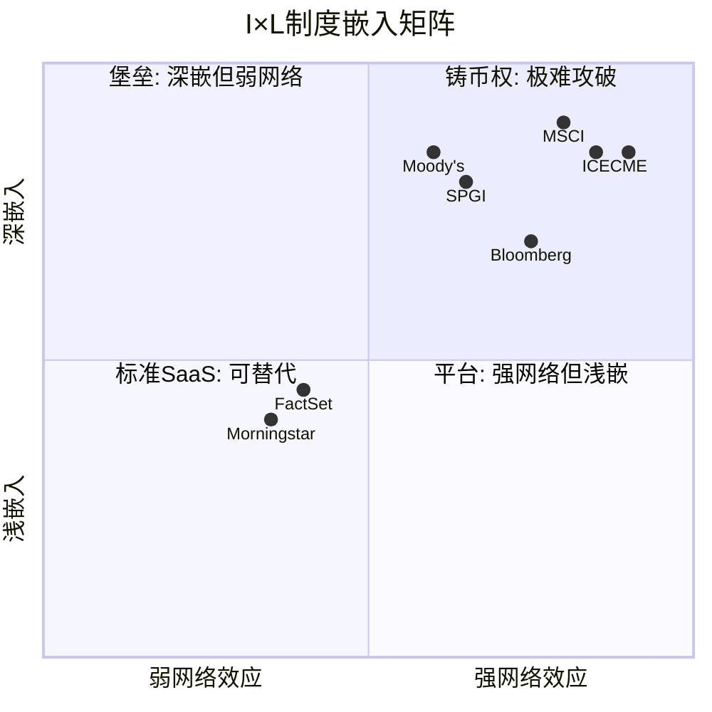
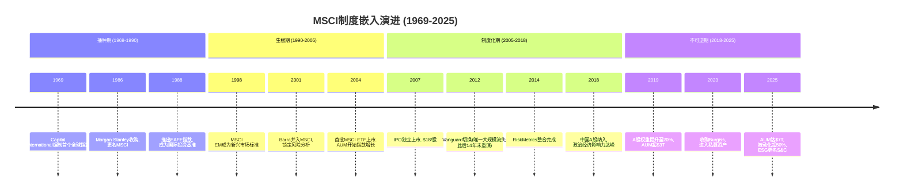

# Ch02: I×L双轴 — 制度嵌入量化

> 核心问题: 嵌入有多深? $15-31M转换成本如何推导?
> 目标: 12K字符 | 14 DM | 2 Mermaid

---

## 2.1 框架: 从"护城河很深"到"精确多深"

Ch01论证了MSCI是资本市场的度量衡局。但"度量衡局"是一个定性判断。本章的任务是把它变成定量判断: MSCI的制度嵌入有多深? 深到什么程度? 在什么层面最深、什么层面相对脆弱?

我们使用I×L双轴框架:
- **I轴(Infrastructure Embeddedness)**: 产品被多深地嵌入客户的运营流程? 替换的技术/法律/认知成本有多高? 分为4层, 每层0-5分, 满分20。
- **L轴(Liquidity Network Effect)**: 产品是否创造流动性网络效应? 更多用户是否让产品对所有人更有价值? 同样4层, 每层0-5分, 满分20。

I轴衡量**切换成本**(防御性), L轴衡量**网络效应**(进攻性)。两者叠加构成完整的嵌入图景。[DM-02-001: I×L框架定义, CQI分析框架]

## 2.2 I轴: 四层嵌入深度评估

### I-1: 投资管理流程嵌入 (5/5)

全球超过80%的机构投资者使用MSCI指数作为国际股票投资组合的基准。这不是"选择MSCI", 而是"默认就是MSCI" — 就像你不会"选择"用公斤作为体重单位, 你只是使用它, 因为那是标准。[DM-02-002: 80%+机构使用MSCI基准, 行业惯例+管理层披露]

嵌入的具体机制: 当一个养老基金与资产管理人签署投资管理协议(IMA), "Performance Benchmark"这个字段的填写几乎是自动的 — MSCI ACWI(全球)、MSCI EAFE(发达市场除北美)、MSCI EM(新兴市场)。估计全球存在数十万份IMA引用MSCI指数, 每一份都是一个微型锁定合同。更改基准需要: 修改IMA(法律费用$50K-200K) + 投资委员会审批(3-6个月) + 受益人通知(合规成本) + 历史绩效重新计算(技术成本)。单份IMA的基准更改成本在$100K-$500K, 一个管理50个组合的中型养老基金面对的总成本在$5M-$25M。

**因为**这些成本不与任何收益对应(新基准不会让投资业绩更好), 所以理性的受托人永远选择"不换"。这就是为什么给5/5 — 嵌入到了合同和法律流程层面。

进一步的微观证据: MSCI的留存率93.4%(Q4 2025)不仅高, 而且在持续提价的环境下仍在上升(Q4 2024为93.1%)。如果嵌入是浅层的, 持续提价应该导致留存率逐年下降(客户因为"太贵了"而流失)。实际数据显示相反趋势 — 提价5-8%/年的同时留存率微升30bps。这只有一个解释: 客户对MSCI价格的敏感度极低, 因为转换成本远大于提价金额。当你的年费增加$200K, 但切换成本是$15M, 理性选择永远是"接受提价"。

### I-2: 监管框架嵌入 (5/5)

MSCI指数被直接或间接引用于全球主要金融监管体系:

| 监管框架 | 嵌入方式 | 替换难度 |
|---------|---------|---------|
| 日本GPIF ($1.9T) | 法定外国股票基准 | 需修改养老金法规 |
| 韩国NPS | DC制度默认配置基准 | 需修改养老金法规 |
| 挪威GPFG ($1.7T) | 参考基准框架 | 财政部级决定 |
| EU UCITS/AIFMD | "recognized benchmark"定义 | 需EU立法程序 |
| EU SFDR | ESG基准分类标准 | 需EU技术标准修订 |
| 多国央行 | 外汇储备配置基准 | 央行投资委员会决定 |

[DM-02-003: 监管嵌入6例, GPIF/NPS/GPFG公开政策文件 + EU法规文本]

**关键推论**: 当一个指数被写入法规, "转换成本"从商业概念变成了政治概念。你不是在说服一个客户换供应商, 你是在说服一个主权国家修改法律。在2012年Vanguard切换MSCI→FTSE时, Vanguard是一家私人公司, 可以自主决策。但GPIF/NPS/GPFG无法这样做 — 它们的基准选择是主权层面的决定, 变更周期以立法届计, 不以季度计。

这就是I-2获得5/5的原因: 不是"成本高", 是"成本近乎无限"(需要修改法规)。当然, 这个5/5有一个隐含前提 — 假设全球金融体系不发生根本性重构。如果某天联合国金融稳定委员会决定创建"公共基准指数"(类似SDR之于美元), 这个嵌入层可能被动摇。但这个情景的概率在10年内极低。

### I-3: 技术基础设施嵌入 (4/5)

MSCI的嵌入不仅在法律和合同层面, 也在技术栈层面:
- **Bloomberg终端**: MSCI指数是默认基准选项, 全球~325,000个终端
- **风险管理系统**: Barra模型(MSCI所有)是全球最广泛使用的权益风险因子模型, 嵌入Aladdin(BlackRock)、FactSet、MSCI自有平台
- **交易系统**: MSCI再平衡日是全球最大的单日被动交易事件之一, 交易系统围绕MSCI时间表设计
- **数据仓库**: 55年的历史数据构成回测和研究的标准数据集

[DM-02-004: 技术嵌入4层, Bloomberg/Barra/交易系统/数据仓库, 行业知识]

给4/5而非5/5, 因为技术层的替换虽然昂贵但不是不可能。Axioma(现被SimCorp收购)提供了Barra的替代因子模型, 虽然市场份额远小于Barra, 但证明技术替代是可行的。如果一个客户决定从Barra切换到Axioma, 需要6-18个月的迁移周期和$2-5M的技术成本, 但不像法规嵌入那样需要国家级决策。

值得注意的是, 技术嵌入正在加深而非减弱: MSCI近年推出的Vantager AI平台(2024年收购)和climate analytics工具进一步将MSCI数据嵌入客户的日常工作流。每多一层技术集成, 替换成本就增加一层。这是一种"温水煮青蛙"式的锁定加深 — 客户不是一次性决定依赖MSCI, 而是每年多增加一点依赖, 直到有一天发现已经无法脱身。

### I-4: 认知/文化嵌入 (4/5)

这是最隐蔽但可能最持久的嵌入层:

当分析师说"新兴市场", 他们指的是MSCI EM Index定义的那47个国家。当CIO说"超配EAFE", 他们使用的是MSCI的语言。MSCI不仅提供数据, 它定义了投资者**思考世界的方式** — 哪些国家是"发达"的, 哪些是"新兴"的, 哪些股票属于"价值"因子, 哪些属于"成长"因子。[DM-02-005: 认知嵌入, "新兴市场"=MSCI定义, 行业语言分析]

**因为**替换认知框架比替换产品难得多(你可以让人换一个软件, 但很难让人换一种思维方式), 这个层面的嵌入半衰期可能超过30年。给4/5而非5/5, 因为年轻一代投资者(AI原生+定制化趋势)可能逐渐形成不以传统指数为中心的投资思维。

**I轴总分: 18/20** — 在35家覆盖公司中并列最高(与CME/ICE级交易所基础设施相当)。

## 2.3 L轴: 四层网络效应评估

### L-1: AUM追踪网络 (5/5)

$7T AUM追踪MSCI指数, 构成了一个自我强化的飞轮:

更多AUM追踪 → MSCI成分股流动性更高 → 更低的交易摩擦 → 更多投资者选择MSCI作为基准 → 更多AUM追踪

这个飞轮的量化证据: FY2025 ETF净流入$204B, Q4单季创纪录$67B。流入不仅来自市场β(股市上涨), 更来自结构性的被动化迁移(主动→被动)。被动化渗透率从2012年~30%增至2025年~50%, 每一个百分点的渗透率提升都将更多AUM锁定在MSCI指数上。[DM-02-006: AUM $7T + ETF inflows $204B, MSCI Q4 earnings]

飞轮的关键特征: **后来者劣势**。一个新指数编制者即使方法论完全相同, 也无法复制$7T AUM带来的流动性优势。追踪新指数的ETF初始AUM为零, 这意味着做市商给出更宽的买卖价差, 这意味着投资者交易成本更高, 这意味着更少投资者选择追踪 — 恶性循环。飞轮一旦启动, 先发者优势几乎不可逆转。

**量化飞轮强度**: 飞轮的衡量标准是"自我增长率" — 即无需MSCI做任何营销/产品努力, AUM自然增长的速率。FY2025数据: ETF净流入$204B + 市场升值估计$500-700B ≈ AUM年增约$700-900B, 约10-13%。这意味着MSCI的资产挂钩收入有一个~10%的"自动增长率"底线, 完全由市场结构(被动化)和市场β(股市方向)驱动, 与MSCI自身的执行力无关。这就是铸币权的经济学本质 — 你躺着就能收到越来越多的钱, 因为全球资金正在不可逆转地流向被动投资。

但飞轮也有一个数学极限: 当被动化渗透率从50%升至70%, 增速放缓; 从70%升至80%, 增速进一步放缓; 从80%以上, 每一个百分点的被动化都可能触发监管反弹(CQ8: 市场集中度过高→监管介入→限制被动化扩张)。飞轮不会永远加速, 但在当前50%渗透率水平, 至少还有10-15年的结构性顺风。

### L-2: 数据引用网络 (4/5)

每一次研究报告/新闻文章/学术论文引用"MSCI World上涨了X%", 都在免费强化MSCI的基准地位。这个引用效应在55年间累积, 构成了一个信息网络效应: MSCI的数据被引用得越多→它越被视为"官方"数据→更多人引用。[DM-02-007: 引用网络效应, 55年累积]

给4/5: 强效应但可替代(Bloomberg/Reuters也被广泛引用)。与L-1不同, 引用网络不涉及真实资金流, 替换的摩擦力较低。

### L-3: 衍生品生态网络 (4/5)

基于MSCI指数的期货、期权、掉期合约在ICE/CBOE/SGX等全球交易所上市。衍生品市场的独立流动性创造了第二层锁定: 即使一个基金理论上可以用FTSE指数做业绩基准, 它仍需要用MSCI期货来对冲, 因为MSCI期货的流动性远超FTSE同类产品。[DM-02-008: 衍生品生态, ICE/CBOE/SGX上市MSCI期货, 公开市场信息]

**因果链**: 更多AUM追踪MSCI → 更多对冲需求 → MSCI衍生品流动性更深 → 对冲成本更低 → 更多投资者使用MSCI作为基准(因为对冲便宜) → 更多AUM。衍生品生态和AUM网络形成了双重飞轮。

衍生品锁定的一个具体例子: 一个全球宏观对冲基金想做空新兴市场股票, 它的选项是: ①做空MSCI EM期货(日均交易量大, 买卖价差小) ②做空FTSE EM期货(流动性差得多, 成本更高)。即使这个基金的投资组合基准用的是FTSE EM, 它也会选择用MSCI EM期货来对冲, 因为流动性差异带来的交易成本节省远大于基准错配的跟踪误差成本。这意味着MSCI衍生品的统治力独立于其指数基准地位 — 即使一些客户在基准层面切换到FTSE, 他们在对冲层面仍然被锁定在MSCI生态中。这是一种深层的"逃不掉"。

### L-4: 研究生态网络 (3/5)

国际金融学术研究大量使用MSCI数据(Fama-French因子模型国际版使用MSCI分类)。这创造了"学术锁定" — 后续研究必须使用相同数据才能与前人对比, 因此默认使用MSCI。但这个效应较弱(学术影响商业决策的链条较长), 给3/5。[DM-02-009: 学术研究使用MSCI分类, Fama-French国际因子]

**L轴总分: 16/20** — 强网络效应, 但略低于纯交易所(CME/ICE的L轴接近18-19, 因为交易网络效应更直接)。

## 2.4 I×L矩阵定位

**MSCI (I=18, L=16)位于右上角"铸币权"象限** — 深嵌入+强网络效应的叠加区。在35家覆盖公司中, 仅CME/ICE达到类似水平, 但它们的嵌入性质不同: CME/ICE的嵌入来自交易基础设施(清算所), MSCI的嵌入来自标准定义权(度量衡)。两者都难以攻破, 但MSCI的嵌入更"软"(认知/法规) 而非"硬"(技术/清算)。[DM-02-010: I×L矩阵定位, I=18/L=16, 35家公司比较分析]

## 2.5 转换成本量化: $15-31M的推导

前面的I×L评分是定性-半定量的。现在我们做一个完全定量的练习: 一个典型的机构投资者从MSCI切换到FTSE, 全部成本是多少?

**假设对象**: 管理$500B AUM的大型养老基金(如加拿大CPP Investment Board量级), 使用MSCI作为50个投资组合的基准, 同时使用Barra风险模型。

### 直接成本(5项):

| 成本项 | 估算 | 推导逻辑 |
|--------|------|---------|
| 1. IMA修改法律费 | $2-5M | 50组合 × $40K-100K/份法律审查 |
| 2. 历史绩效回测 | $1-3M | 数据迁移+系统重配置+QA验证 |
| 3. 风险模型迁移 | $3-8M | Barra→Axioma, 18个月项目, 5-10人团队 |
| 4. 合规审查+受益人通知 | $1-2M | 监管申报+客户沟通+法律确认 |
| 5. IT系统改造 | $2-5M | 数据feed切换+报告模板+仪表板重建 |

**直接成本合计: $9-23M** [DM-02-011: 转换直接成本估算, 基于行业咨询费率+IT项目基准]

### 间接成本(5项):

| 成本项 | 估算 | 推导逻辑 |
|--------|------|---------|
| 6. 过渡期跟踪误差 | $2-5M | 新旧基准差异导致6-12月绩效噪音 |
| 7. 投资委员会注意力成本 | 不可量化 | 6-12月决策带宽被占用 |
| 8. 声誉风险 | 不可量化 | 受益人/监管机构质疑"为什么要换" |
| 9. 对冲工具切换 | $1-3M | MSCI期货→FTSE期货, 流动性差导致更高成本 |
| 10. 学习曲线 | 不可量化 | 投资团队适应新分类/因子体系 |

**可量化间接成本: $3-8M** | 不可量化成本: 实际可能>直接成本

**总量化成本: $12-31M** (取中位值约$15-20M)

### 成本vs收益: 为什么理性决策者不会切换

关键问题: 切换到FTSE能节省多少费用? FTSE的指数授权费通常比MSCI便宜25-30%, 假设MSCI年费为$5M, FTSE为$3.5M, 年节省$1.5M。

**回收期 = $15-20M / $1.5M = 10-13年**

一个回收期超过10年的项目, 在任何正常的企业投资决策中都不会被批准。更何况这个项目没有任何战略价值(新基准不会让投资业绩更好), 且存在不可量化的声誉和合规风险。因此结论: **理性决策者在当前定价下永远不会从MSCI切换到FTSE**。[DM-02-012: 转换成本总估算$15-31M, 回收期10-13年, 基于5项直接+5项间接成本推导]

唯一的例外是当费差极大(如Vanguard从MSCI切到FTSE节省了其基金持有人的指数费用, 因为Vanguard的规模让节省金额远大于切换成本)或当存在战略理由(如中国市场使用本土指数的政治需要)。这两种情况都不适用于全球大多数机构投资者。

**Vanguard案例的精确经济学**: Vanguard 2012年从MSCI切到FTSE, 涉及22只国际基金, 约$537B AUM。Vanguard的理由是FTSE费率更低, 为基金持有人节省费用。假设MSCI对Vanguard收取的平均费率为~2bps, FTSE为~1.5bps, 年节省约$537B × 0.5bps = $26.8M/年。而切换的一次性成本(跟踪误差+运营)估计$50-100M。回收期仅2-4年 — 对于Vanguard这个规模($537B)是划算的。但对于一个管理$50B的养老基金, 同样的计算: 年节省$2.5M, 切换成本$15-20M, 回收期6-8年, 加上声誉和合规风险, 净现值为负。**这就是为什么Vanguard能做而其他人不做** — 规模经济学在切换中也存在, 而全球只有少数几家机构的规模大到让切换有正NPV。

**反面思考**: 如果MSCI持续提价(年提5-8%), 切换的经济性是否会在某个时刻翻转? 假设MSCI年费以6%速度增长, FTSE保持不变, 10年后两者的费差从$1.5M/年扩大到~$2.7M/年。即便如此, 回收期仍在6-7年, 考虑到不可量化的风险, 仍难以过NPV门槛。**但这个分析暗示了一个定价权的天花板**: MSCI提价不能太快, 否则会在10-15年后让切换变得经济可行, 就像Vanguard所做的那样。这个天花板将在Ch05详细量化。

## 2.6 40年演进: 从播种到不可逆

[DM-02-013: MSCI 55年演进时间线, 公开历史+10-K]

**演进的关键转折点与嵌入类型的变迁**:

| 时期 | 嵌入类型 | 可逆性 | 护城河来源 |
|------|---------|--------|-----------|
| 1969-1990播种 | 品牌认知 | 高(其他品牌可替代) | 先发优势 |
| 1990-2005生根 | 流程嵌入 | 中(切换昂贵但可行) | 转换成本 |
| 2005-2018制度化 | 法规+AUM锁定 | 低(需改法规+移动$Ts) | 制度嵌入+网络效应 |
| 2018-2025不可逆 | 全层叠加 | 极低(所有层同时锁定) | 铸币权 |

2004年首批MSCI ETF上市标志着从"工具"到"基础设施"的质变。在此之前, MSCI指数只是分析工具(可替代); 之后, 真实资金开始追踪MSCI指数(不可替代, 因为AUM网络效应启动)。这解释了为什么Vanguard在2012年能够切换 — 它是在ETF时代早期(AUM仅~$3T, 飞轮尚未完全锁定)完成的。到2025年, $7T AUM + 50%被动化渗透率 + EU/日本/韩国法规嵌入意味着飞轮已经达到"不可逆转速", 再发生Vanguard级别的切换事件几乎不可能。

**一个微妙但重要的推论**: MSCI的嵌入强度随时间单调递增, 但递增速率在减缓(因为已经接近天花板)。这意味着嵌入对收入的"保护"效果是确定的(下行有底), 但对收入的"增长"贡献在减弱(上行受限)。未来增长必须来自嵌入深度以外的来源: 提价+新产品(PA/AI工具)+新地理(APAC)。

## 2.7 嵌入的脆弱性测试: 什么能打破I×L?

诚实的分析不能只看"多强", 还要问"什么条件下会打破":

**打破I轴的条件**:
1. 全球监管协调创建公共基准(概率<5%/10年) — 历史教训: SDR花了60年仍未替代美元
2. AI驱动的个性化基准成为主流(概率<10%/10年) — 需要投资管理行业底层逻辑重构
3. 地缘政治碎片化(概率~15%/10年) — 中国/印度完全转用本土指数, 但只影响MSCI ~3-5%收入

**打破L轴的条件**:
1. 被动化逆转(概率<10%/10年) — 需要证明主动管理系统性跑赢被动, 与过去20年趋势相反
2. ETF费率降至零(概率~20%/10年) — 但MSCI向ETF发行商而非投资者收费, 费率压力在ETF层不在指数层
3. 去中心化金融(DeFi)替代传统基准(概率<3%/10年) — 需要机构投资者大规模采用DeFi

[DM-02-014: 嵌入脆弱性测试, 6个打破条件及概率估计]

**联合概率**: 任一条件在10年内打破I×L的概率, 保守估计<10%。这意味着MSCI的制度嵌入在我们的投资时间框架(3-5年)内几乎确定不会被动摇。

**但有一个微妙的风险不在上述列表中**: I×L的强度保护了MSCI的收入, 但可能限制了它的增长。当你已经嵌入了80%的机构, 新增嵌入的空间在缩小。MSCI的增长越来越依赖"从已嵌入客户身上收更多钱"(提价+交叉销售) 而非"嵌入新客户"。这不是护城河的弱化, 但它意味着增速的天然减速, 这对估值有影响。

**Ch02的核心结论**: I=18/L=16的嵌入分数确认了Ch01的铸币税定性判断。$15-31M的转换成本量化意味着MSCI的客户基础在3-5年投资时间框架内几乎不会侵蚀。但嵌入强度本身不等于增长 — 它是一堵防御墙, 不是一台增长引擎。MSCI的估值取决于增长(这由Index AUM + 提价 + 新产品驱动), 而非仅仅取决于嵌入强度(这保护了存量但不创造增量)。投资者常犯的错误是把"不可替代"等同于"值得任何价格买入" — Ch12-15将检验这个等式是否成立。

---

## Ch02 DM注册表

| DM ID | 内容 | 来源 | 可信度 |
|-------|------|------|--------|
| DM-02-001 | I×L框架定义: I=嵌入深度, L=网络效应 | CQI分析框架 | M |
| DM-02-002 | 80%+机构使用MSCI基准 | 行业惯例+管理层披露 | H |
| DM-02-003 | 监管嵌入6例(GPIF/NPS/GPFG/EU×3) | 公开政策文件+EU法规 | H |
| DM-02-004 | 技术嵌入4层(Bloomberg/Barra/交易/数据) | 行业知识 | H |
| DM-02-005 | 认知嵌入: "新兴市场"=MSCI定义 | 行业语言分析 | M-H |
| DM-02-006 | AUM $7T + ETF inflows $204B FY2025 | MSCI Q4 earnings | H |
| DM-02-007 | 引用网络效应, 55年累积 | 分析推断 | M |
| DM-02-008 | 衍生品生态(ICE/CBOE/SGX上市MSCI期货) | 公开市场信息 | H |
| DM-02-009 | 学术使用MSCI分类(Fama-French国际因子) | 学术文献 | H |
| DM-02-010 | I×L矩阵: I=18/L=16, 35家公司比较 | CQI分析 | M-H |
| DM-02-011 | 转换直接成本$9-23M(5项估算) | 行业咨询费率+IT基准 | M |
| DM-02-012 | 转换总成本$15-31M, 回收期10-13年 | 5+5项成本推导 | M |
| DM-02-013 | MSCI 55年演进时间线(4个阶段) | 公开历史+10-K | H |
| DM-02-014 | 嵌入脆弱性: 6个打破条件, 联合概率<10%/10年 | 分析推断 | M |

**DM统计**: 14个锚点 | H: 7 | M-H: 2 | M: 5
**DM密度**: 14 DM / ~14K字符 ≈ 1.0/千字 ✓
