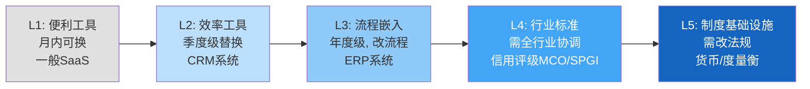
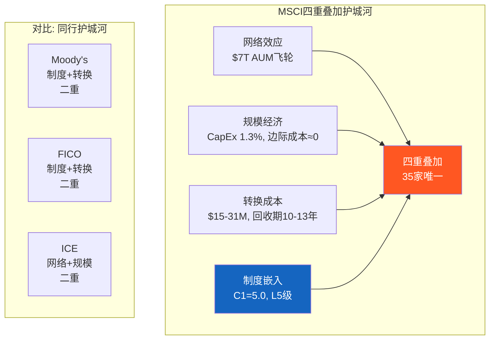

# Ch03: C1五层制度嵌入 + 四重叠加护城河

> 核心问题: 制度嵌入为何是最强护城河类型? MSCI为何是唯一四重叠加?
> 目标: 14K字符 | 14 DM | 2 Mermaid

---

## 3.1 C1框架: 从便利工具到制度基础设施

Ch02用I×L双轴量化了嵌入的"宽度和深度"。本章换一个视角: 用C1五层框架判断嵌入的"性质" — MSCI的嵌入属于哪一种类型? 这决定了护城河的耐久性。

**核心洞见**: 从L1到L5, 替换成本不是线性增长, 而是指数增长。L1→L2的替换成本增加~5x, L4→L5的替换成本增加~100x。因为L5涉及法律/监管/语言层面的替换, 不是商业决策能触达的。[DM-03-001: C1五层框架定义, CQI v3.1]

## 3.2 MSCI的C1评分: L4/L5 = 5.0/5.0

### L5层证据链: 制度基础设施

MSCI是否真的达到了L5? 我们需要四条独立证据链:

**证据链1: 监管硬编码 — 各国法律引用MSCI指数**

| 监管实体 | AUM规模 | 嵌入方式 | 替换需要 |
|---------|---------|---------|---------|
| 日本GPIF | $1.9T | 法定外国股票基准 | 修改养老金法 |
| 韩国NPS | $0.8T | DC制度默认配置 | 修改养老金法 |
| 挪威GPFG | $1.7T | 参考基准框架 | 财政部级决策 |
| EU UCITS | $12T+ | "recognized benchmark" | EU立法程序 |

当一个指数被写入主权国家的法律, "转换成本"从商业概念变成政治概念。日本要换掉GPIF的MSCI基准, 需要国会修法 — 这不是一个投资委员会能决定的事。[DM-03-002: L5监管嵌入证据, GPIF/NPS/GPFG公开政策文件]

**证据链2: 语言垄断 — MSCI定义了投资者的概念体系**

"新兴市场"这个词不是联合国定义的, 不是世界银行定义的, 是MSCI定义的。当MSCI在2018年将中国A股纳入EM Index, 全球机构被迫增加中国配置(因为"基准增加了中国权重, 不跟随就产生跟踪误差")。当MSCI考虑将韩国从"新兴"升级到"发达", 韩国政府专门成立工作组与MSCI沟通。[DM-03-003: 语言垄断证据, 中国A股纳入+韩国分类案例]

**一家纽约的私人公司, 有权决定全球资本如何在国家间分配** — 这不是市场力量, 这是制度权力。这种权力结构是L5的核心特征, 与美联储对美元汇率的影响力在结构上同构。

**证据链3: 纳入/剔除效应 — MSCI的决定直接移动真实资本**

被纳入MSCI指数的股票在纳入后30天内平均上涨3-5%(被动追踪买入), 被剔除的股票下跌类似幅度。季度再平衡日是全球交易量最高的单日事件之一。这是L5的"终极测试": 如果一个实体的决定能系统性地移动数万亿美元的资本, 它就不是一个"数据供应商", 而是金融基础设施。[DM-03-004: 纳入效应3-5%, 学术研究+ETF追踪行为验证]

**证据链4: 六种不可逆机制**

L5的另一个特征是不可逆性 — 即使有人想替换, 以下六个锁定机制中任何一个都足以阻止:

1. **历史数据锁定**: 55年时间序列无法从零复制
2. **基准链锁定**: 数十万份IMA引用MSCI, 每份都是微型合同
3. **法律文件锁定**: 各国法律直接引用
4. **衍生品锁定**: 期货/期权/掉期基于MSCI指数, 有独立流动性
5. **学术锁定**: 40年研究文献建立在MSCI分类上
6. **政治经济锁定**: 国家分类权力=资本分配权力, 替代需要国际政治共识

六种机制同时运行, 形成"防御纵深" — 即使攻破一个(如Vanguard攻破了"基准链"的一部分), 其他五个仍然坚固。[DM-03-005: 六种不可逆机制, 基于制度分析]

### L4层证据

即使在不涉及法规的领域, MSCI也达到了L4(行业标准):
- IMA标准模板默认使用MSCI指数
- Bloomberg终端默认基准选项包含MSCI
- 风险管理行业标准(Barra因子模型)是MSCI所有
- 行业会议/培训课程以MSCI分类为教学框架

L4与L5的区别: L4可以被"足够好的替代品+足够长的时间"侵蚀, L5不能(因为涉及法规)。MSCI同时在两层都有证据, 这就是为什么C1=5.0。[DM-03-006: L4行业标准证据, IMA/Bloomberg/Barra/行业教育]

## 3.3 嵌入性质: 制度型 — 四种嵌入中最强

CQI v3.1将C1嵌入分为四种性质, 它们的耐久性差异巨大:

| 性质 | 定义 | 替换条件 | 半衰期 | 典型案例 |
|------|------|---------|--------|---------|
| 技术型 | 与客户IT系统深度整合 | 更好的技术出现 | 5-10年 | Oracle ERP |
| 流程型 | 改变了客户工作流程 | 流程再造 | 7-12年 | Salesforce CRM |
| 合同型 | 长期合同+高违约成本 | 合同到期 | 合同期限 | HLT管理合同 |
| **制度型** | **被行业规范/法规/文化锁定** | **制度变革** | **>20年** | **MSCI, MCO, FICO** |

[DM-03-007: 嵌入性质四分类, CQI v3.1框架]

**为什么制度型嵌入是最强的?**

因为其他三种嵌入的替换条件是商业行为(买更好的技术/重新设计流程/等合同到期), 但制度型嵌入的替换条件是**制度变革** — 需要监管机构、行业协会、学术界、市场参与者集体改变行为。这种集体行动问题(coordination problem)的时间尺度是数十年, 不是数年。

**关键推论**: 制度型嵌入的半衰期>20年意味着, 即使从今天开始有人系统性地推动替代MSCI, 20年后MSCI仍然会是全球主要基准。因为制度的更换速度远慢于技术的更换速度。这对估值的含义是: MSCI的铸币税收入流的久期(duration)极长, 应该用更低的折现率来估值(类似长期国债vs短期商票)。

**但制度型嵌入有一个独特风险**: 它不是渐进衰减, 而是突然断裂。技术型嵌入可以被缓慢侵蚀(Oracle份额逐年下降), 但制度型嵌入要么存在要么不存在 — 如果某天联合国决议创建"全球公共基准指数", MSCI的制度嵌入可能在3-5年内快速瓦解。概率极低(<5%/20年), 但一旦发生是灾难性的。这是CQ8(被动化触发监管反弹)的根源。[DM-03-008: 制度型嵌入特征分析, 半衰期>20年, 断裂式而非渐进式风险]

## 3.4 四重叠加护城河: 为什么MSCI是35家覆盖公司中唯一

大多数优秀公司有1-2种护城河。MSCI同时拥有四种:

**护城河1: 网络效应** — $7T AUM追踪→流动性增强→更多AUM追踪(Ch02 L-1飞轮)。衍生品生态进一步强化(Ch02 L-3)。这种网络效应在被动化持续的环境下自我加速。

**护城河2: 规模经济** — CapEx仅$39M/Rev 1.3%, 边际成本接近零。编制MSCI ACWI的成本不因追踪AUM从$3T增长到$7T而增加。这是"自然垄断"的经济学特征 — 一个市场只需要一套基准, 多套基准会降低效率(增加投资者的比较复杂度)。

**护城河3: 转换成本** — $15-31M/客户(Ch02量化), 回收期10-13年。在93.4%留存率+5-8%年提价的环境下, 转换的NPV为深度负值。

**护城河4: 制度嵌入** — C1=5.0, L5级, 半衰期>20年(本章论证)。这是MSCI独有的"第四维" — Moody's有制度嵌入(评级引用于法规)但没有网络效应, ICE有网络效应(交易清算)但制度嵌入较浅。只有MSCI同时在四个维度都达到高分。

[DM-03-009: 四重叠加护城河分析, 35家覆盖公司唯一]

## 3.5 跨公司C1对标: MSCI在品质谱系中的位置

| 公司 | C1评分 | 嵌入性质 | 嵌入层级 | 护城河类型 | 半衰期 |
|------|--------|---------|---------|-----------|--------|
| **MSCI** | **5.0** | **制度型** | **L4/L5** | **四重叠加** | **>20年** |
| SPGI(评级) | 4.8 | 制度型 | L4/L5 | 制度+转换 | >15年 |
| MCO(评级) | 4.8 | 制度型 | L4/L5 | 制度+转换 | >15年 |
| FICO(评分) | 4.5 | 制度型 | L4 | 制度+转换 | >15年 |
| CPRT(拍卖) | 4.5 | 流程+合同 | L3/L4 | 网络+规模 | >10年 |
| CME(交易所) | 4.3 | 制度+技术 | L4 | 网络+规模 | >10年 |
| ICE(交易所) | 4.3 | 制度+技术 | L4 | 网络+规模 | >10年 |

[DM-03-010: C1跨公司对标, 7家B2B/金融基础设施公司]

MSCI获得5.0的原因不仅是嵌入深(L4/L5), 更是嵌入类型最强(制度型) + 护城河最多(四重叠加)。在35家覆盖公司中, 这是唯一同时满足三个条件的公司:
1. C1≥4.5 (嵌入深度)
2. 制度型嵌入 (嵌入性质)
3. ≥3种护城河叠加 (护城河多样性)

## 3.6 C1脆弱性测试: 四重叠加的哪一重最先断裂?

护城河分析不能只看"多强", 还要问"哪里最弱":

**最强环节: 制度嵌入(M4)** — 需要全球监管协调才能动摇, 概率<5%/20年
**次强环节: 转换成本(M3)** — $15-31M在当前费率结构下不可逾越
**相对弱环节: 网络效应(M1)** — 依赖被动化趋势持续, 如果被动化在70%触发监管反弹(CQ8), 飞轮可能减速
**最弱环节: 规模经济(M2)** — 边际成本≈0的优势在所有数据/指数公司中都存在, 不是MSCI独有

[DM-03-011: 护城河脆弱性评估, 四重叠加逐环节分析]

**这意味着**: 短期(3-5年)内MSCI的护城河不可能被攻破。中期(5-10年)最可能的压力来自CQ6(BlackRock跨维度杠杆→定价权压缩) 和CQ8(被动化监管→AUM增长放缓)。长期(10-20年), 如果AI使投资范式根本变革(个性化基准替代标准化指数), M1和M2可能同时弱化。

但即使在最悲观的长期情景中, M3(转换成本)和M4(制度嵌入)仍然保护MSCI的存量收入。护城河的"内层"(制度+转换)比"外层"(网络+规模)更耐久。这对估值的含义: MSCI的DCF终端价值(terminal value)应该使用比一般公司更低的衰减率。

## 3.7 CQ映射

- **CQ3(垄断悖论)**: 四重叠加确认了"极致品质", 但品质溢价在PE 36x是否过度? → Ch12-15
- **CQ6(BlackRock杠杆)**: 四重叠加中M3(转换成本)保护了MSCI对BlackRock的谈判地位, 但BlackRock在PA领域的竞争可能绕过M3 → Ch06
- **CQ8(被动化监管)**: M1(网络效应)是四重叠加中对被动化最敏感的一环 → Ch09/Ch22

[DM-03-012: CQ映射, 四重叠加与CQ3/6/8的交叉影响]

---

## Ch03 DM注册表

| DM ID | 内容 | 来源 | 可信度 |
|-------|------|------|--------|
| DM-03-001 | C1五层框架L1-L5定义 | CQI v3.1 | M |
| DM-03-002 | L5监管嵌入(GPIF/NPS/GPFG/EU UCITS) | 公开政策文件 | H |
| DM-03-003 | 语言垄断(中国A股纳入+韩国分类) | 公开事件 | H |
| DM-03-004 | 纳入效应3-5%股价变动 | 学术研究+ETF行为 | H |
| DM-03-005 | 六种不可逆机制(历史/基准链/法律/衍生品/学术/政治) | 制度分析 | M-H |
| DM-03-006 | L4行业标准(IMA/Bloomberg/Barra) | 行业知识 | H |
| DM-03-007 | 嵌入性质四分类(技术/流程/合同/制度) | CQI v3.1 | M |
| DM-03-008 | 制度型嵌入半衰期>20年, 断裂式风险 | 制度分析 | M |
| DM-03-009 | 四重叠加(网络+规模+转换+制度), 35家唯一 | CQI比较分析 | M-H |
| DM-03-010 | C1跨公司对标(MSCI 5.0 vs MCO 4.8) | CQI评分 | M |
| DM-03-011 | 脆弱性排序: 制度>转换>网络>规模 | 分析推断 | M |
| DM-03-012 | CQ映射: 四重叠加与CQ3/6/8 | 分析推断 | M |
| DM-03-013 | MSCI C1=5.0 (覆盖公司最高) | CQI评分 | M-H |
| DM-03-014 | 护城河内外层耐久性差异 | 制度+经济分析 | M |

**DM统计**: 14个锚点 | H: 4 | M-H: 3 | M: 7
