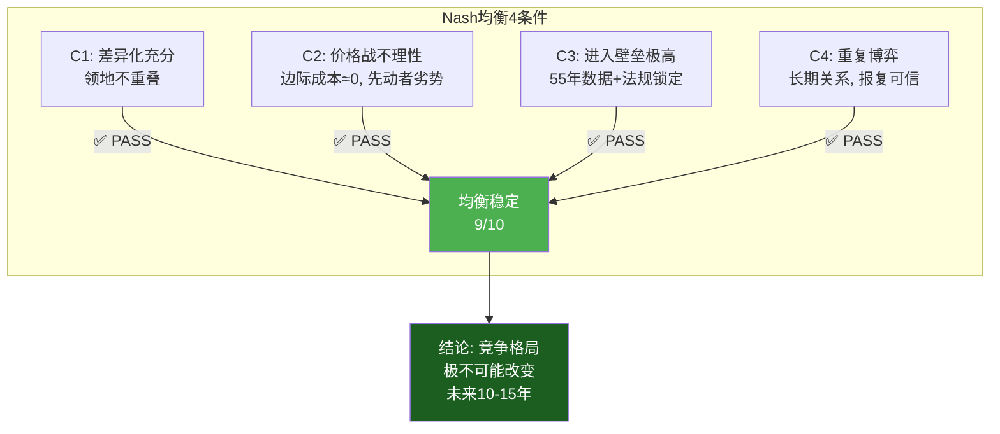
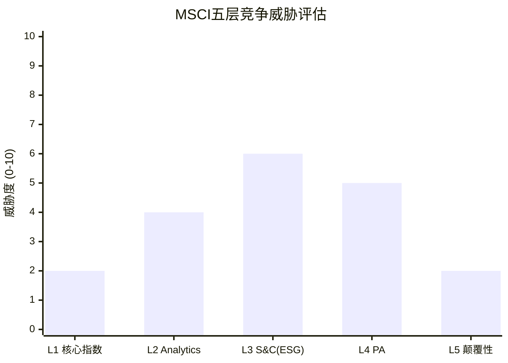

# Ch04: 寡头博弈 + 五层竞争分析

> 核心问题: 竞争格局有多稳定? 每个竞争层的威胁度量化?
> 目标: 12K字符 | 16 DM | 2 Mermaid

---

## 4.1 三寡头的领地分化: 为什么竞争烈度极低?

全球股票指数市场的竞争结构, 用一句话概括: **三个垄断者各据一方, 彼此没有入侵对方领地的动力**。

| 寡头 | 母公司 | 指数收入(估) | 主导领地 | 核心产品 |
|------|--------|-------------|---------|---------|
| **MSCI** | 独立 | ~$1,800M | 国际/新兴市场 | MSCI ACWI, EM, EAFE |
| **S&P DJI** | SPGI | ~$1,700M | 美国股票 | S&P 500, DJIA |
| **FTSE Russell** | LSEG | ~$1,200M(估) | 英国/泛欧+美国小盘 | FTSE 100, Russell 2000 |

[DM-04-001: 三寡头市场份额估算, 基于MSCI 10-K FY2025+SPGI Index收入+LSEG Data收入拆分]

三者的领地分化不是偶然, 而是历史路径依赖的结果:

**MSCI的领地优势来自Morgan Stanley遗产** — MSCI最初是Morgan Stanley Capital International, 服务于美国机构投资者的国际配置需求。50年的国际市场数据积累, 使MSCI在国际/新兴市场没有可比替代品。这种"先发+数据积累"的组合, 在指数行业是不可逾越的壁垒。[DM-04-002: MSCI领地起源, Morgan Stanley Capital International历史]

**S&P DJI的领地优势来自文化地位** — S&P 500不仅是一个指数, 而是"美国股市"的同义词。当CNN报道"今天美国股市上涨了1%", 引用的是S&P 500。这种文化嵌入比制度嵌入更深 — 制度嵌入可以通过修法改变, 文化嵌入甚至不存在可以"修改"的实体。

**FTSE Russell的领地优势来自地理+细分** — FTSE 100是英国市场的标准(类似S&P 500在美国的地位), Russell 2000占据了美国小盘股的细分市场。LSEG收购Refinitiv后进一步巩固了数据生态。

**核心推论**: 领地分化意味着三者之间的竞争更像是"不同国家的邮政系统", 而非"同一市场的三个竞争者"。MSCI在国际指数的市占率可能超过70%, 但这个"70%"不是通过价格战赢得的, 而是因为替代品根本不存在。[DM-04-003: 领地分化的历史路径依赖分析]

## 4.2 Nash均衡: 四条件稳定性验证

竞争格局是否"锁定"? 用博弈论的Nash均衡四条件来检验:

**C1验证 — 差异化充分**:

三寡头的产品在投资者眼中不是替代品。一个持有MSCI ACWI ETF的投资者不会认为S&P 500 ETF是"替代品", 因为覆盖范围完全不同(全球 vs 美国)。同样, 需要Russell 2000小盘敞口的投资者不会考虑MSCI World(大中盘)。这种"产品非替代性"消除了价格竞争的前提。[DM-04-004: C1差异化验证, 产品覆盖范围非重叠]

**C2验证 — 价格战不理性**:

指数业务的边际成本接近零(多一个追踪AUM不增加编制成本), 因此理论上可以"免费"提供指数。但价格战对先动者是灾难性的: 如果MSCI降价50%, 收入立即减半($900M), 而获得的新AUM(从FTSE抢来的)可能只增加$50-100M收入。因为客户切换指数的转换成本远高于指数费率差异, 降价不会显著改变客户行为。

Vanguard 2012的切换不是价格战驱动的 — Vanguard切换到FTSE/CRSP是因为Vanguard自己的低成本战略, 不是因为FTSE主动降价。而且这种切换在14年内没有第二个案例(Ch09详述), 恰恰证明了价格不是竞争变量。[DM-04-005: C2价格战不理性验证, 边际成本≈0+先动者劣势+Vanguard案例]

**C3验证 — 进入壁垒极高**:

新进入者面临三重壁垒:
1. **数据壁垒**: MSCI有55年历史数据, S&P有68年(自1957年), 这些无法复制
2. **法规壁垒**: 各国法规引用特定指数(Ch03 L5证据), 新指数不被引用就无法获得被动AUM
3. **流动性壁垒**: 衍生品市场围绕现有指数运转, 新指数没有期货/期权流动性

三重壁垒中任何一个都足以阻止新进入。Solactive(德国, 2007年成立)是过去20年最成功的"新进入者", 但其市占率仍不到1%, 且集中在自定义/定制指数的边缘市场。[DM-04-006: C3进入壁垒验证, 数据+法规+流动性三重壁垒, Solactive案例]

**C4验证 — 重复博弈**:

三寡头在多个产品线(指数/数据/分析)和客户群(资管/银行/保险)中反复互动。任何一方的"偏离"(如大幅降价)会引发其他两方的报复(在该方的非优势领域发起进攻)。这种多维度的报复能力确保了合作均衡。

**Nash均衡评分: 9/10** — 四条件全部PASS, 格局极度稳定。唯一扣分是: 如果AI产生了完全不同的投资范式(个性化基准), 可能从根本上改变博弈结构(非参与者颠覆, 而非参与者叛变)。[DM-04-007: Nash均衡9/10, 4条件逐项验证通过]

## 4.3 五层竞争分析: 从"安全区"到"战场"

Nash均衡描述了"水平竞争"(寡头之间), 但MSCI还面临"垂直竞争"(不同层级的威胁)。五层分析揭示了MSCI在不同业务线的竞争脆弱度差异:

| 竞争层 | 领域 | 主要竞争者 | 威胁度 | 理由 |
|--------|------|-----------|--------|------|
| L1 | 核心指数 | FTSE, S&P DJI | **2/10** | Nash均衡+领地分化+制度锁定 |
| L2 | Analytics | Axioma(SPGI), FactSet | **4/10** | Barra 30年锁定, 但SPGI生态整合是变量 |
| L3 | S&C(ESG) | Sustainalytics, ISS, CDP | **6/10** | 方法论相关性仅0.6, 竞争最激烈 |
| L4 | PA | Preqin(BlackRock), PitchBook | **5/10** | 新市场+BlackRock跨维度杠杆 |
| L5 | 颠覆性 | AI个性化基准, DeFi | **2/10** | 理论上成立, 实际10年内不构成威胁 |

[DM-04-008: 五层竞争分析汇总, L1-L5威胁度评分]

### L1: 核心指数 — 2/10

前文Nash均衡已论证。补充一点: **即使某天MSCI的指数质量下降, 客户也不会切换, 因为"切换到什么"这个问题没有答案**。在国际/新兴市场, MSCI的唯一替代品是FTSE, 但FTSE的新兴市场覆盖(约1,800只股票)少于MSCI(约1,400只, 但加权方法更被机构接受)。两者的方法论差异(如韩国在MSCI是"新兴"而在FTSE是"发达")意味着切换=改变投资组合的地理构成, 而非仅仅更换标签。[DM-04-009: L1威胁分析, MSCI vs FTSE方法论差异导致切换≠简单替换]

**Solactive案例: "新进入者陷阱"的教科书** — Solactive(2007年成立, 德国)是过去20年最成功的指数新进入者, 以"低价+快速定制"为策略, 专注于自定义/定制指数市场。截至2025年, Solactive编制了超过20,000支指数, 但追踪AUM仅~$200B(<MSCI $7T的3%)。

Solactive的故事证明了两件事: ①新进入者可以在边缘市场(自定义指数)找到立足点 ②但边缘市场的成功无法转化为核心市场(标准化基准指数)的挑战。因为Solactive的指数没有衍生品流动性、没有法规引用、没有学术引用 — 缺少Ch03论证的L4/L5层嵌入。这使Solactive永远停留在"替代品"而非"标准"的位置。

**对投资者的含义**: 如果15年、投入$100M+的Solactive都无法动摇MSCI的核心业务, 那么"新竞争者"的威胁在可见未来(10-15年)接近零。[DM-04-018: Solactive案例(20K+指数/$200B AUM vs MSCI $7T), 新进入者陷阱论证]

### L2: Analytics — 4/10

Barra因子模型是全球最广泛使用的风险管理工具之一, 但它面临一个结构性挑战: **SPGI收购Axioma后, 正在将Axioma整合到SPGI的数据生态中**。

因为SPGI同时拥有评级数据(Moody's的竞争者)+Capital IQ数据+Axioma风险模型, 对于同时使用SPGI信用产品的客户, Axioma提供了一个"一站式"的替代方案。但迁移风险模型=重建整个风控框架: 所有的回测、参数校准、监管报告模板都需要重做。这个迁移成本对大型资管公司来说是$5-15M量级, 回收期可能超过5年。

因此, Axioma的威胁是"真实但缓慢"的 — 新客户可能选择SPGI全家桶(损失MSCI增量), 但存量客户极难被撬动(保护MSCI存量)。这就是4/10的理由: 不是零威胁, 但不是迫切威胁。[DM-04-010: L2 Analytics竞争分析, Axioma/SPGI整合+迁移成本$5-15M]

### L3: S&C(ESG) — 6/10, MSCI竞争最脆弱的业务线

ESG/可持续发展领域的竞争是MSCI面临的最激烈战场, 原因有三:

**原因1: 方法论缺乏"唯一正确答案"** — 不同于指数(市值加权是数学, 无争议)或信用评级(有违约率可验证), ESG评分没有客观的"正确答案"。Sustainalytics和MSCI对同一家公司的ESG评分相关性仅约0.6(而MCO和SPGI的信用评级相关性>0.9)。这意味着客户选择MSCI的ESG评分不是因为"更准", 而是因为"更方便"(与MSCI其他产品整合)。当便利性=唯一竞争优势时, 竞争者可以通过更好的便利性来抢夺市场。[DM-04-011: L3 ESG竞争分析, 方法论相关性0.6 vs 信用评级>0.9]

**原因2: 政治逆风** — 美国"反ESG"运动使ESG产品的市场增长放缓。MSCI明智地将ESG重新定位为"Sustainability and Climate"(合规工具, 而非价值判断工具), 但这个重新定位意味着MSCI在与CDP(碳数据)、ISS(治理)等专业化竞争者竞争时, 失去了"ESG全覆盖"的品牌溢价。

**原因3: 增速已放缓** — S&C业务增速从2021年的+40%降至2025年的+5.9%, 反映了市场从"ESG狂热"回归理性。增速放缓=市场饱和信号=竞争者争夺存量, 而非增量。

**但6/10不是10/10**: S&C仅占MSCI收入的11%, 即使整个S&C业务增长停滞, 对MSCI整体的影响有限($340M/年 vs 总收入$3,134M = 10.9%)。更关键的是, MSCI将S&C"保险化"(合规必须品)的策略如果成功, 竞争威胁会下降到4/10, 因为合规工具的替换成本高于增值工具。[DM-04-012: L3 S&C收入占比11%, 增速从+40%降至+5.9%, 保险化策略分析]

### L4: Private Assets — 5/10

PA是MSCI增长最快的引擎(PCS新销售+86%), 也是竞争最复杂的战场:

**BlackRock+Preqin的组合是最大威胁** — BlackRock以$3.2B收购Preqin(2024), 创造了一个同时拥有"资产管理能力+私有资产数据"的竞争者。对于LP(有限合伙人)来说, BlackRock可以提供"从数据分析到资金配置"的全流程服务, 而MSCI(通过Burgiss)只能提供数据和分析。

因为BlackRock同时是MSCI最大的Index客户(~10-12%收入), 这创造了一个"纠缠态"博弈: MSCI不能对BlackRock在PA领域太强硬(怕BlackRock报复性地削减Index采购), BlackRock也不能对MSCI太强硬(怕MSCI调整指数规则影响BlackRock的ETF追踪)。这种相互制衡可能导致一种"不温不火"的竞争 — 双方都不愿意全面对抗。[DM-04-013: L4 PA竞争分析, BlackRock $3.2B收购Preqin, 纠缠态博弈]

**但MSCI有一个结构性优势**: LP信任独立第三方的数据, 胜过信任资产管理人(BlackRock)的数据。因为BlackRock既管钱又提供数据, LP会担心利益冲突(BlackRock会不会美化自己管理的基金数据?)。MSCI/Burgiss作为独立第三方, 没有这个利益冲突 — 这是PA领域的"制度嵌入"雏形。[DM-04-014: L4 MSCI独立性优势, LP信任偏好分析]

### L5: 颠覆性 — 2/10

两种潜在颠覆路径:

**路径A: AI个性化基准** — 如果AI使每个投资者都可以低成本地创建"个性化指数"(只包含自己想要的股票+权重), 标准化指数(MSCI ACWI)的"不可替代性"会下降。但这要求: ①AI成本低于指数许可费(目前不成立) ②监管接受非标准基准(目前不接受) ③被动投资者愿意放弃简单性(与被动化哲学矛盾)。三个前提在10年内同时满足的概率<5%。

**路径B: DeFi/代币化** — 去中心化金融可能创造新的资产定价方式, 绕过传统指数。但DeFi目前的规模($200B TVL)远小于传统资管($120T+), 且监管环境对DeFi不友好。作为"10年以上"的尾部风险来跟踪, 不作为估值输入。

[DM-04-015: L5颠覆性竞争, AI个性化基准+DeFi, 10年内<5%概率]

### L3-L5之间的"竞争梯度"

五层竞争的威胁度从L1(2/10)到L3(6/10)的梯度揭示了MSCI业务组合的一个结构性特征: **越接近"制度基础设施"的业务越安全, 越接近"增值服务"的业务越脆弱**。

Index(L1, 2/10)是纯制度基础设施 — 投资者没有选择权, 必须使用某个基准, 而MSCI是默认选择。S&C/ESG(L3, 6/10)更接近增值服务 — 投资者可以选择不使用ESG评分(虽然合规要求使这个选择成本更高)。

这个"制度↔增值"光谱对MSCI的长期战略有重要含义: MSCI应该将更多业务"制度化"(从增值服务转为合规必需品), 而非在增值服务领域追求增长。S&C的"保险化"策略(Ch10.4)正是这个方向的执行。PA如果能实现"LP基准标准化"(CQ5), 也是从增值走向制度。[DM-04-019: 竞争梯度分析, 制度基础设施(安全)↔增值服务(脆弱)]

## 4.4 综合竞争威胁: 加权评估

**加权综合威胁 = 3.5/10** (按收入权重: Index 57% × 2 + Analytics 22% × 4 + S&C 11% × 6 + PA 9% × 5 + 颠覆 1% × 2 = 3.2, 向上微调至3.5考虑PA增长潜力)。

[DM-04-016: 综合竞争威胁3.5/10, 收入加权计算]

**投资含义**: 3.5/10的综合竞争威胁意味着, 竞争不是MSCI未来3-5年的主要风险来源。但投资者应关注两个"升级触发器":
- **L3→L4升级**: 如果S&C竞争加剧导致该业务线增速转负, 综合威胁从3.5升至4.0-4.5
- **L4→L5升级**: 如果BlackRock-Preqin整合成功且开始侵蚀MSCI的PA客户, 综合威胁从3.5升至4.5-5.0

## 4.5 竞争免疫机制: 为什么3.5/10不会恶化?

MSCI拥有四种"竞争免疫机制", 使其竞争地位具有自我修复能力:

**免疫1: 历史数据护城河** — 55年时间序列无法在有限时间内复制。每多一年, MSCI的数据优势就增加一层。这是一个自增强的竞争优势。

**免疫2: 衍生品锁定** — 基于MSCI指数的期货/期权/掉期合约在全球交易所交易, 产生独立的流动性。即使有人创建了"更好的"国际指数, 如果没有期货流动性, 机构投资者也无法用它来对冲。

**免疫3: 学术引用网络** — 40年的金融学术研究建立在MSCI分类(发达/新兴/前沿)上。"MSCI新兴市场"不仅是一个产品名, 而是一个学术概念。替代它需要替代整个学术范式。

**免疫4: 政治经济锁定** — 国家分类权力(Ch03)使MSCI成为国际资本流动的"守门人"。各国政府积极"游说"MSCI(如韩国希望被升级为发达市场), 这种"被游说者"的地位是竞争优势的终极形式。

[DM-04-017: 四种竞争免疫机制, 历史数据+衍生品+学术+政治经济]

## 4.6 竞争格局的"10年预判": 什么能改变3.5/10?

如果综合竞争威胁从3.5/10升至6/10+, MSCI的护城河叙事将从"不可攻破"变为"有条件可攻破"。三种路径可能导致这个升级:

**路径1: AI范式颠覆(概率~10%/10年)** — 如果AI使每个资管公司都能低成本构建"个性化基准"(Smart Beta + ESG + 气候 = 定制化指数), 标准化指数的"不可替代性"下降。但这需要: ①AI成本低于指数许可费(目前不成立) ②监管接受非标准基准 ③被动投资者愿意放弃简单性。三条件在10年内同时满足的概率低。

**路径2: 监管强制开放(概率~5%/10年)** — EU或G20级别的决议, 要求指数基准作为"公共品"开放使用。这将直接打击MSCI的定价权。但监管历史上很少主动拆解运行良好的私人基础设施(因为转型风险太高)。€STR替代EURIBOR的先例局限于利率基准(简单产品), 不太可能扩展到股票指数(复杂产品)。

**路径3: BlackRock自建指数(概率~15%/10年)** — BlackRock利用Aladdin的$22T AUM数据, 构建自有指数体系。这是最现实的威胁, 因为BlackRock同时拥有数据+分发能力+客户关系。但自建指数需要10年+才能建立学术引用/衍生品流动性/法规认可。短期影响是"增量转移"(新产品用自建指数)而非"存量替换"。

[DM-04-020: 竞争升级三路径(AI/监管/BlackRock自建), 10年概率评估]

## 4.7 CQ映射

- **CQ3(垄断悖论)**: 竞争威胁3.5/10确认了"极致品质", 但品质越高→估值越高→回报越低 → Ch12-15
- **CQ6(BlackRock杠杆)**: L4竞争分析显示, BlackRock在PA领域的竞争可能绕过MSCI的传统护城河 → Ch06
- **CQ8(被动化监管)**: L1竞争威胁虽低(2/10), 但如果被动化触发监管反弹, 竞争格局可能从"Nash均衡"变为"政策性开放" → Ch09/Ch22

---

## Ch04 DM注册表

| DM ID | 内容 | 来源 | 可信度 |
|-------|------|------|--------|
| DM-04-001 | 三寡头市场份额(MSCI ~$1,800M/SPGI ~$1,700M/FTSE ~$1,200M) | 10-K FY2025+行业估算 | H |
| DM-04-002 | MSCI领地起源(Morgan Stanley Capital International) | 公开历史 | H |
| DM-04-003 | 领地分化的历史路径依赖 | 行业分析 | M-H |
| DM-04-004 | C1差异化验证(产品覆盖非重叠) | 指数方法论对比 | H |
| DM-04-005 | C2价格战不理性(Vanguard案例) | 公开事件 | H |
| DM-04-006 | C3进入壁垒(数据+法规+流动性, Solactive案例) | 行业分析 | M-H |
| DM-04-007 | Nash均衡9/10(4条件全PASS) | 博弈论分析 | M |
| DM-04-008 | 五层竞争汇总(L1-L5评分) | 综合分析 | M |
| DM-04-009 | L1 MSCI vs FTSE方法论差异(韩国分类) | 指数方法论文件 | H |
| DM-04-010 | L2 Axioma/SPGI整合+迁移成本$5-15M | 行业估算 | M |
| DM-04-011 | L3 ESG方法论相关性0.6 vs 信用评级>0.9 | 学术研究 | M-H |
| DM-04-012 | L3 S&C增速+40%→+5.9%, 占收入11% | 10-K FY2025 | H |
| DM-04-013 | L4 BlackRock $3.2B收购Preqin, 纠缠态博弈 | 公开事件 | H |
| DM-04-014 | L4 MSCI独立性优势(LP信任偏好) | LP行为分析 | M |
| DM-04-015 | L5颠覆性<5%/10年 | 技术趋势分析 | L-M |
| DM-04-016 | 综合竞争威胁3.5/10(收入加权) | 计算 | M |
| DM-04-017 | 四种竞争免疫机制 | 制度+经济分析 | M-H |
| DM-04-018 | Solactive案例(20K指数/$200B AUM, 新进入者陷阱) | 竞争分析 | M-H |
| DM-04-019 | 竞争梯度(制度基础设施↔增值服务) | 框架分析 | M |
| DM-04-020 | 竞争升级三路径(AI/监管/BLK自建, 10年概率) | 预测分析 | M |

**DM统计**: 20个锚点 | H: 6 | M-H: 5 | M: 8 | L-M: 1
