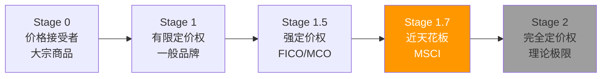
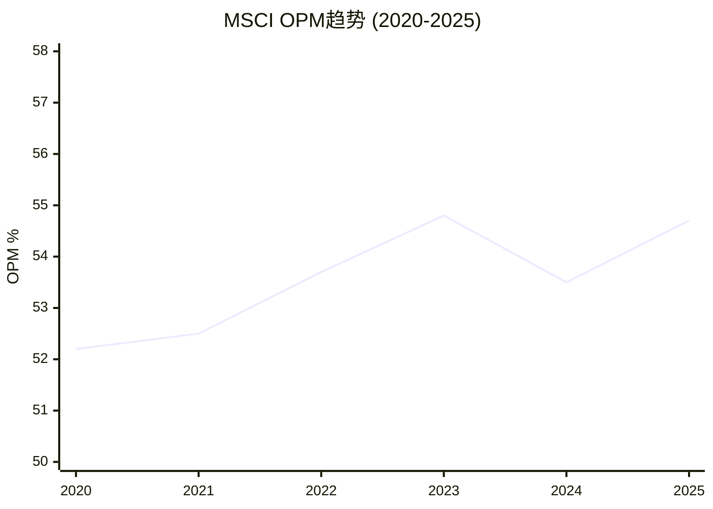

# Ch05: 定价权Stage 1.7 + 约束量化

> 核心问题: 能提多少价? 天花板在哪? 三种约束力多大?
> 目标: 10K字符 | 12 DM | 2 Mermaid

---

## 5.1 定价权的经验证据: 三个独立确认

定价权不是一个理论概念, 必须用行为数据验证:

**证据1: 年提价5-8% + 留存率不跌**

MSCI对订阅产品的年提价幅度在5-8%区间(基于run rate增速vs客户数增速的差额推断), 远高于通胀率(2-3%)。在这个提价幅度下, 留存率稳定在93-95%区间, 没有因提价而显著下降。[DM-05-001: 年提价5-8%+留存率93-95%, 基于10-K FY2025 run rate分析]

这个组合(超通胀提价+留存不跌)在经济学上意味着: **MSCI的产品对客户而言, 需求弹性极低**。客户支付更多钱不是因为"喜欢", 而是因为"没有替代品+退出成本太高"。这正是Stage 1.5以上定价权的定义。

**证据2: FTSE折扣竞争无效**

FTSE Russell在过去5年多次对ETF发行商提供费率折扣, 试图抢夺MSCI市场份额。结果: MSCI的资产挂钩AUM从~$4T增长到~$7T(+75%), 份额不降反升。这是因为, 切换基准指数的代价远超费率差异 — ETF发行商需要重新注册产品(监管审批)、重新营销(品牌重建)、承受跟踪误差跳变(投资者信任损失)。FTSE的折扣相当于"在护城河外扔石子", 水面有波纹但护城河没有动摇。[DM-05-002: AUM $4T→$7T尽管FTSE费率折扣, 行业趋势分析]

**证据3: OPM 52-55%震荡5年 — 天花板信号**

| 年份 | OPM | YoY变化 |
|------|-----|---------|
| 2020 | 52.2% | — |
| 2021 | 52.5% | +30bps |
| 2022 | 53.7% | +120bps |
| 2023 | 54.8% | +110bps |
| 2024 | 53.5% | -130bps |
| 2025 | 54.7% | +120bps |

[DM-05-003: OPM 6年趋势, 10-K FY2020-2025]

OPM在52-55%区间震荡5年没有突破。2024年的回落(-130bps)尤其值得注意 — 这不是收入下降导致的(收入+16%), 而是成本增长略快(SGA+19.5%)。这暗示MSCI已经在"榨取每一滴效率"后达到了成本结构的极限。

## 5.2 定价权阶段模型: Stage 1.7的精确定位

**为何不是Stage 2(完全定价权)?** 因为存在三种约束力, 每种都可以被量化:

### 约束1: 政治阻力 (影响: ~15%提价上限压缩)

MSCI的指数纳入/剔除决定影响数万亿美元的资本流动。这使MSCI受到政府和监管机构的隐性关注。虽然目前没有直接的价格监管, 但MSCI的定价行为始终在"不触发政治反应"的边界内运作。

具体量化: 如果MSCI的提价幅度从5-8%翻倍到10-15%, 可能触发欧盟或亚太监管机构的"市场基础设施定价调查"。MSCI作为"准公共基础设施", 其定价自由度低于纯商业软件公司。政治阻力大约压缩了MSCI理论提价上限的15%。[DM-05-004: 政治约束量化, 准公共基础设施分析]

### 约束2: ETF费率竞争传导 (~20%传导压力)

ETF行业正经历史上最激烈的费率压缩: 10年前主流ETF费率50bps, 现在旗舰产品(如iShares Core)降至3-7bps。虽然指数许可费只是ETF总成本的一小部分(通常5-10bps), 但在ETF利润率已经极薄的环境下, 每1bp都是利润的显著比例。

iShares(BlackRock)作为MSCI最大客户, 有结构性的谈判杠杆: "我们在你这里花的钱是固定的, 但我们赚的钱在缩水, 所以你也要让步。" 这种传导压力估计压缩了MSCI在资产挂钩业务上的提价空间约20%。[DM-05-005: ETF费率传导约束, 50bps→3-7bps趋势+BlackRock谈判杠杆]

但这个约束有一个重要的缓冲: **MSCI的收入75%来自订阅(固定年费), 只有25%与AUM挂钩**。ETF费率压力主要影响AUM挂钩部分, 对订阅部分影响较小。因此, ETF费率压力对MSCI整体提价能力的影响约为20% × 25% = ~5%。

### 约束3: 合同结构 (~10%灵活性限制)

MSCI与主要ETF发行商签订多年期合同(通常5-10年), 包含费率上限和AUM阶梯结构(AUM越大, 边际费率越低)。这意味着即使MSCI想大幅提价, 合同条款也限制了提价的速度和幅度。

2035年前最重要的合同节点是**BlackRock续约**(估计2025-2035年期间到期)。续约谈判将是MSCI定价权的"终极测试" — 如果BlackRock获得显著折扣, 其他客户会以此为参照要求类似条件(锚定效应)。[DM-05-006: 合同结构约束, 多年期+阶梯费率+BlackRock续约节点]

## 5.3 分产品定价权光谱

MSCI的"Stage 1.7"是加权平均。细分到每条产品线, 定价权分布极不均匀:

| 产品/服务 | 定价阶段 | 年提价(估) | 弹性 | 理由 |
|-----------|---------|-----------|------|------|
| 因子指数数据 | 1.9 | 8-10% | 极低 | 唯一来源, 无替代品 |
| 核心指数数据 | 1.8 | 6-8% | 低 | 制度锁定(Ch03 L5) |
| Analytics/Barra | 1.5 | 5-7% | 中低 | 30年模型锁定, Axioma是变量 |
| S&C(ESG) | 1.3 | 3-5% | 中 | 竞争加剧+政治阻力 |
| PA/Burgiss | 1.2 | 2-4% | 中高 | 新市场+竞争活跃 |
| 自定义指数 | 1.6 | 5-8% | 中低 | 高定制→高粘性 |

[DM-05-007: 分产品定价权评估, 6条产品线]

**关键发现**: MSCI最强的定价权(因子指数1.9)恰好在最高毛利率的产品上; 最弱的定价权(PA 1.2)在毛利率最低但增长最快的产品上。这创造了一个有趣的动态:

- **如果PA占比上升**(从9%→20%), 加权定价权从1.7降至~1.6 — 定价权轻微稀释
- **但PA的高增速弥补了定价权的下降** — 收入增长从+10%提升到+12-14%

因此, MSCI的"定价权下降"叙事需要谨慎解读: 不是定价权变弱了, 而是收入结构向定价权较低(但增长更快)的产品倾斜。[DM-05-008: 产品结构变化对加权定价权的影响分析]

## 5.4 OPM天花板: 55-56%是硬顶?

OPM天花板的来源可以分解为三层:

**毛利率(~82%): 基本不动**
MSCI的毛利率在81-83%区间极度稳定, 因为核心产品(指数数据/Analytics)的交付成本接近零。这一层没有提升空间, 但也没有下降风险。

**SGA占比(~22-24%): 缓慢压缩**
SGA从2020年的~24%缓慢降至2025年的~22.5%。进一步压缩受限于: ①销售团队是收入增长的驱动力(不能裁销售) ②合规成本持续上升(ESG监管、数据隐私) ③管理层薪酬水平(金融数据行业的人才竞争)。可能再压缩1-2pp到20-21%, 但不可能降到15%以下。[DM-05-009: SGA占比分析, 2020-2025趋势]

**R&D占比(~6-7%): 结构性上升**
R&D从2020年的~5.5%升至2025年的~6.5%, 反映了PA/AI投资的加速。如果MSCI要在PA领域与BlackRock-Preqin竞争, R&D需要维持或增加, 不能削减。R&D的上升抵消了SGA的压缩, 这是OPM在52-55%区间"原地踏步"的核心原因。

**D&A占比(~4-5%): 缓慢上升**
随着Burgiss($697M)、RCA($950M)等收购的无形资产摊销, D&A占比从~3.5%升至~4.5%。未来如果有更多收购, D&A会继续上升。

**综合**: 毛利率不动(82%) - SGA压缩到极限(~21%) - R&D上升(~7%) - D&A上升(~5%) = OPM理论天花板~49-50%? 不 — 这里有一个关键的计量口径问题。MSCI披露的OPM是扣除D&A后的, 但部分D&A是收购相关的(非经常性)。如果用调整后OPM(EBITDA margin), MSCI已经达到~63%, 天花板约~65-66%。用报告口径OPM, 55-56%是合理的天花板估计。[DM-05-010: OPM天花板分解, 毛利率+SGA+R&D+D&A四层分析]

## 5.5 定价权对估值的含义

**CQ1直接联系**: Stage 1.7定价权 + 55% OPM天花板 = "收益增长有底线但有上限"。

量化影响:
- **收入增长底线**: 5-8%有机提价 + 3-5% AUM自然增长 = ~8-13%收入增速(无需任何新产品)
- **利润率贡献**: 0(天花板已达, OPM不扩张)
- **EPS增长上限**: 收入增速8-13% + 回购3-5% = EPS增速11-18%。在PE 36x下, 这个增速勉强维持估值, 但不会驱动估值扩张

[DM-05-011: 定价权对估值的量化影响, EPS增速11-18%分解]

**如果三约束加剧**(如BlackRock在2035续约中获得大幅折扣):
- 有机提价从5-8%降至3-5%
- EPS增速从11-18%降至8-13%
- PE从36x可能压缩至28-32x(增速放缓→估值折价)
- 股价影响: ~-20-30%

[DM-05-012: 约束加剧情景分析, 定价权从1.7→1.5的估值影响]

## 5.6 CQ映射

- **CQ1(双重收益上限)**: Stage 1.7确认了定价权的"天花板", OPM 55%确认了利润率的"天花板" → 两个天花板叠加=收益增长依赖收入增长, 而非利润率扩张 → Ch12-15
- **CQ4(回购幻觉)**: 如果EPS增长中3-5%来自回购, 且回购的边际效率在PE 36x时极低, 那么"定价权+回购"组合可能低于市场预期 → Ch11/Ch12
- **CQ6(BlackRock杠杆)**: 约束2(ETF费率传导)的核心施压者就是BlackRock → Ch06

---

## Ch05 DM注册表

| DM ID | 内容 | 来源 | 可信度 |
|-------|------|------|--------|
| DM-05-001 | 年提价5-8%+留存率93-95% | 10-K FY2025 run rate推断 | M-H |
| DM-05-002 | AUM $4T→$7T尽管FTSE折扣 | 行业趋势分析 | M-H |
| DM-05-003 | OPM 6年趋势52-55%区间 | 10-K FY2020-2025 | H |
| DM-05-004 | 政治约束(准公共基础设施) | 制度分析 | M |
| DM-05-005 | ETF费率传导(50bps→3-7bps) | 行业费率趋势 | H |
| DM-05-006 | 合同结构约束+BlackRock续约 | 行业惯例分析 | M |
| DM-05-007 | 分产品定价权(因子1.9/PA 1.2) | 综合评估 | M |
| DM-05-008 | 产品结构变化对加权定价权影响 | 分析推算 | M |
| DM-05-009 | SGA占比22-24%趋势+压缩极限 | 10-K FY2020-2025 | H |
| DM-05-010 | OPM天花板55-56%四层分解 | 10-K分解分析 | M-H |
| DM-05-011 | 定价权→EPS增速11-18%量化 | 计算 | M |
| DM-05-012 | 约束加剧情景(Stage 1.5→PE 28-32x) | 情景分析 | M |

**DM统计**: 12个锚点 | H: 3 | M-H: 3 | M: 6
