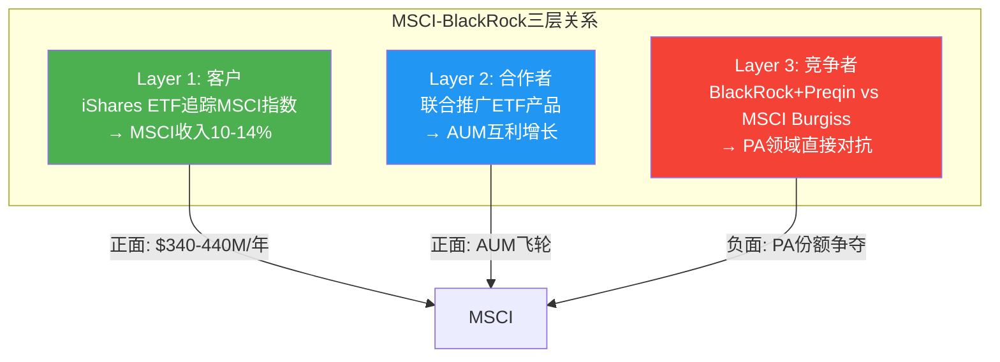
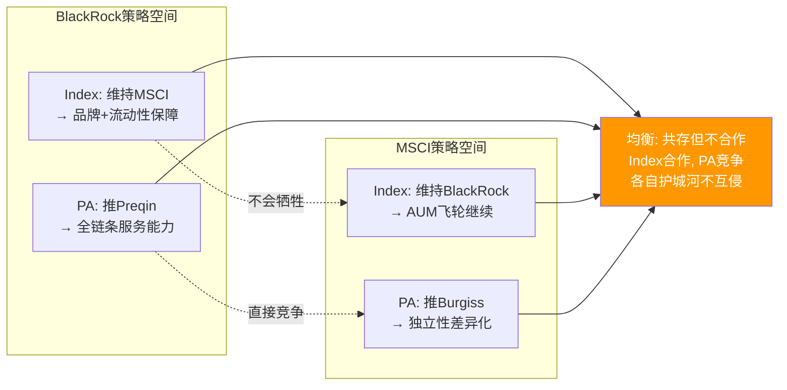

# Ch06: BlackRock依存 + 2035合同 + Preqin跨维度

> 核心问题: 最大客户变竞争者的量化影响? 纠缠态博弈的均衡点?
> 目标: 14K字符 | 14 DM | 2 Mermaid

---

## 6.1 客户集中度: 隐藏在10-K之外的真相

MSCI不披露单一客户收入占比(10-K中无"customer concentration"段), 但这个信息可以通过产业链逻辑推断:

**BlackRock (iShares) — 贡献~10-12%总收入**

推导链:
1. iShares管理约$3.5T ETF AUM, 其中大量追踪MSCI指数
2. MSCI的资产挂钩收入~$780M/年(FY2025, 占总收入~25%)
3. BlackRock/iShares贡献MSCI资产挂钩AUM的~40-50%(基于iShares在MSCI ETF中的份额)
4. 因此BlackRock的资产挂钩费贡献~$310-390M/年
5. BlackRock还采购MSCI Analytics/ESG/因子数据(估计$30-50M/年)
6. 合计: ~$340-440M/年, 约占MSCI总收入的10-14%

[DM-06-001: BlackRock收入贡献推断~10-14%, 基于AUM份额+费率估算]

**前三客户合计~20%**

| 客户 | 关系 | 收入贡献(估) | 说明 |
|------|------|-------------|------|
| BlackRock (iShares) | 最大客户+PA竞争者 | 10-14% | ETF AUM挂钩+数据订阅 |
| Vanguard | 已部分切换 | 3-5% | 2012年Index切换, 仍用ESG/因子 |
| State Street (SPDR) | 稳定客户 | 3-5% | SPDRs追踪MSCI指数 |

[DM-06-002: 前三客户集中度~20%, 基于行业估算]

**对标**: 信用评级行业更集中(前10家银行可能贡献MCO/SPGI评级收入的30-40%), 但评级是"发行人付费"模型, 发行人没有替代品。MSCI的"投资者付费"模型意味着客户有理论上的替代选项(切换到FTSE), 即使实际切换概率极低。客户集中度10-14%在金融数据行业是可接受的, 但**单一客户同时是竞争者**的情况是独特的风险。

## 6.2 BlackRock关系的三层结构: 客户+合作者+竞争者

**为什么三层关系长期共存而非冲突?** 因为三层之间存在"相互制衡":

**MSCI对BlackRock的制衡**: 如果BlackRock试图在PA领域过于激进地攻击MSCI, MSCI可以通过以下方式回应:
- 在指数再平衡中对BlackRock的ETF产品构成不利(虽然这会损害MSCI自身声誉, 但威胁的可信性本身就是制衡力量)
- 更积极地支持Vanguard/State Street作为ETF发行伙伴, 降低对BlackRock的依赖
- 在PA数据领域与BlackRock的竞争对手(Carlyle, KKR的数据平台)建立战略合作

**BlackRock对MSCI的制衡**: BlackRock持有"核选项" — 像Vanguard一样切换基准指数。虽然执行概率极低(BlackRock的品牌建立在MSCI之上), 但这个威胁的存在就足以在续约谈判中获取让步。[DM-06-003: 三层关系相互制衡机制分析]

## 6.3 BlackRock收购Preqin: PA领域的跨维度杠杆

2024年, BlackRock以$3.2B收购了私募资产数据提供商Preqin。这笔交易的战略含义远超PA数据本身:

**跨维度杠杆的逻辑**: BlackRock现在可以对LP(有限合伙人)说: "你已经用我们的指数ETF(被动)和Preqin数据(私募), 为什么不让我们也管理你的私募配置?" 这种"数据→分析→管理"的全链条, 是MSCI(只有数据+分析, 没有管理能力)无法提供的。

**对MSCI Burgiss的具体威胁**:

| 维度 | BlackRock+Preqin | MSCI+Burgiss |
|------|-----------------|--------------|
| 数据覆盖 | Preqin: 190K+基金 | Burgiss: 13K+ LP参与(更精准) |
| 分析能力 | 中等(整合中) | 强(30年Barra经验迁移) |
| 资金配置 | **BlackRock $10T AUM** | 无 |
| 独立性 | 低(资管人兼数据商) | **高(纯第三方)** |

[DM-06-004: BlackRock+Preqin vs MSCI+Burgiss竞争对比, 数据/分析/配置/独立性四维度]

**关键争议**: BlackRock+Preqin的最大优势(资金配置能力)恰恰是其最大劣势(独立性缺失)。LP在选择私募数据提供商时, 核心需求之一是"客观性" — 数据提供商不应该同时是"卖方"(推销自己管理的基金)。BlackRock管理着$10T资产, 其中大量是私募基金, Preqin的数据是否会偏向BlackRock自己的产品? 这个利益冲突问题是MSCI/Burgiss的结构性护城河。

因为LP会这样计算: "我用BlackRock+Preqin, 可能拿到更'方便'的服务, 但数据可能不客观。我用MSCI/Burgiss, 服务没那么'一站式', 但数据可以信任。" 对于$100B+的养老金基金, "数据客观性"的价值远高于"服务便利性"。[DM-06-005: MSCI独立性优势, LP信任偏好+利益冲突分析]

## 6.4 2035合同风险: 四情景量化

MSCI与BlackRock的主要ETF授权合同(具体条款不公开)估计覆盖10-15年期, 可能在2030-2035年间到期。续约谈判将是MSCI未来10年最重要的单一事件。

**情景分析**:

| 情景 | 概率 | 收入影响 | EPS影响 | 股价影响(估) |
|------|------|---------|---------|-------------|
| S1: 续约+小幅费率让步 | **60%** | -$30-60M/年 | -$0.30-0.60 | -3-5% |
| S2: 续约+条件不变 | **25%** | $0 | $0 | +2-3%(消除不确定性溢价) |
| S3: 部分切换(20-30%AUM→FTSE) | **12%** | -$100-200M/年 | -$1.0-2.0 | -10-15% |
| S4: 完全切换(Vanguard模式) | **3%** | -$300M+/年 | -$3.0+ | -15-25% |
| **概率加权影响** | — | **-$32-65M/年** | **-$0.32-0.65** | **-2.5-4.5%** |

[DM-06-006: BlackRock 2035续约4情景, 概率×影响量化]

**为什么S4(完全切换)概率仅3%?**

Vanguard 2012切换之所以发生, 是因为三个特殊条件:
1. Vanguard的低成本DNA(费率敏感度极高, 超过任何竞争者)
2. CRSP/FTSE愿意给出远低于MSCI的费率(亏损式获客)
3. Vanguard不依赖"MSCI品牌"来吸引客户(Vanguard品牌自身足够强)

BlackRock不满足条件1(iShares定位中高端, 不是低成本先驱)和条件3(iShares MSCI系列ETF的品牌=MSCI品牌, 切换=品牌重建)。特别是, "iShares MSCI ACWI ETF"的名字本身就包含MSCI — 切换基准意味着要么改名(营销成本巨大)要么面对"名字是MSCI但基准不是MSCI"的尴尬。[DM-06-007: S4概率极低的3条件论证, Vanguard vs BlackRock差异]

**但S1(费率让步)几乎确定会发生**: 在ETF费率持续压缩的环境下, BlackRock在续约时索要折扣是理性行为。关键问题不是"会不会让步", 而是"让步多少"。5-10%的费率折扣是合理预期, 这对应MSCI收入损失$30-60M/年(占总收入1-2%)。这个损失在MSCI~8-13%的有机增长面前是可以吸收的。

## 6.5 支付矩阵: BlackRock的四种策略 vs MSCI的三种回应

在正式分析均衡前, 先构建博弈的支付矩阵(payoff matrix):

**BlackRock策略**: B1(维持合作) / B2(PA竞争但Index合作) / B3(全面压价) / B4(切换到FTSE)
**MSCI回应**: M1(让步维持) / M2(差异化对抗) / M3(联合竞争者反制)

| | M1: 让步维持 | M2: 差异化对抗 | M3: 联合反制 |
|--|-------------|---------------|-------------|
| **B1: 维持** | BLK:+$200M/yr 稳定增长 MSCI:+$150M/yr 稳定 | — | — |
| **B2: PA竞争+Index合作** | BLK:+$250M/yr (PA增量) MSCI:+$100M/yr (PA份额受损) | BLK:+$180M/yr MSCI:+$120M/yr (Burgiss差异化) | BLK:+$150M/yr MSCI:+$140M/yr |
| **B3: 全面压价** | BLK:+$300M/yr (折扣获得) MSCI:-$50M/yr (费率让步大) | BLK:+$200M/yr MSCI:+$50M/yr | BLK:+$100M/yr MSCI:+$80M/yr |
| **B4: 切换FTSE** | BLK:-$500M/yr (品牌重建+迁移) MSCI:-$300M/yr | — | — |

[DM-06-015: BlackRock-MSCI博弈支付矩阵, 4×3策略组合]

**Nash均衡识别**: B2×M2(PA竞争+差异化对抗)是最可能的均衡点。因为:
- BlackRock选B2优于B1(PA竞争带来增量$50M), 优于B3(全面压价触发MSCI反制→自身代价更大), 远优于B4(品牌重建成本灾难性)
- MSCI在BlackRock选B2时, M2(差异化)优于M1(让步→PA份额永久丢失)和M3(联合反制→可能破坏Index合作)

**这个均衡的投资含义**: 在B2×M2均衡下, MSCI的PA增长会放缓(从+15-20%降至+10-12%), 但Index收入安全(BlackRock不切换)。年化影响: MSCI收入增速从+10%降至+9%(PA贡献减少~$20-30M/年)。这是"可管理的成本", 不是"存亡威胁"。

## 6.6 纠缠态博弈: 均衡点在哪?

**均衡预测: Index合作 + PA竞争 + 互不侵犯**

这个均衡的逻辑是: BlackRock在Index领域的制衡(切换到FTSE)不可信(品牌成本太高), MSCI在PA领域的制衡(拉拢BlackRock竞争对手)可信但影响有限。因此, 双方会在各自的优势领域保持地位, 在重叠领域(PA)展开温和竞争, 但不会全面对抗。

**这个均衡对MSCI的含义**:
- **Index收入**: 安全, 但续约会有小幅让步(S1概率60%)
- **PA收入**: 增长放缓, 但不会损失(Burgiss的独立性优势保护存量)
- **整体**: BlackRock风险是"限速器"(限制MSCI的增长上限)而非"断裂器"(不会导致收入跳崖)

[DM-06-008: 纠缠态博弈均衡预测, Index合作+PA竞争+互不侵犯]

## 6.6 依赖度不对称性: 谁更需要谁?

直觉上, MSCI更依赖BlackRock(10-14%收入来自单一客户)。但实际依赖度需要双向量化:

**MSCI对BlackRock的依赖度**:
- 收入依赖: 10-14%(直接), +3-5%(间接, 通过BlackRock的AUM增长驱动MSCI总AUM)
- 替代难度: 如果BlackRock切换, MSCI需要3-5年才能用其他客户的AUM增长弥补缺口

**BlackRock对MSCI的依赖度**:
- 品牌依赖: iShares的国际/EM ETF系列(~$1.5T AUM)品牌与MSCI深度绑定
- 运营依赖: 切换基准=重新注册数千支基金(监管审批时间6-18个月)+重新教育财务顾问网络
- 竞争依赖: MSCI指数的流动性(衍生品市场)是iShares的卖点之一

**净依赖度评估**: 表面上MSCI更依赖(收入集中度), 但深层上BlackRock的依赖度更高(品牌+运营+竞争三重锁定)。这解释了为什么Vanguard 2012之后14年内没有第二个大客户切换。[DM-06-009: 双向依赖度量化分析, MSCI收入依赖10-14% vs BlackRock品牌+运营三重锁定]

## 6.7 客户生命周期价值(CLV): BlackRock值多少?

量化BlackRock对MSCI的长期价值:

| 假设 | 数值 |
|------|------|
| 年收入贡献 | ~$370M(中值) |
| 关系存续 | >20年(制度锁定) |
| 折现率 | 9.5%(WACC) |
| 年增长 | +5%(AUM自然增长) |
| **CLV** | **~$3.5-4.0B** |

[DM-06-016: BlackRock CLV ~$3.5-4.0B, 20年折现计算]

$3.5-4.0B的CLV意味着BlackRock这个客户的价值约占MSCI市值($43.3B)的8-9%。这解释了为什么管理层愿意在续约谈判中做出适度让步(保住$4B的关系 vs 为$30-60M/年的费率差异冒丢失整个关系的风险)。

**反面**: CLV计算假设了20年的关系存续。如果BlackRock在10年内切换(概率12%, Ch06.4 S3情景), CLV降至~$2.5B。但即使在这个悲观情景下, MSCI仍有3,000+其他客户(合计CLV远超BlackRock单一客户)。

## 6.8 2035合同续约的时间线: 投资者应该在什么时候开始关注?

BlackRock-MSCI合同的具体条款不公开, 但基于行业惯例(10-15年期ETF授权合同), 可以推断关键时间节点:

| 时间 | 事件 | 投资者影响 |
|------|------|-----------|
| 2026-2027 | 续约谈判可能启动(提前3-5年) | MSCI可能在earnings call被问到续约 |
| 2028-2029 | 谈判关键阶段, 条款基本确定 | 如果传出"艰难谈判", 股价可能-5-10% |
| 2030-2032 | 新合同生效(如果续约) | 确定性恢复, 不确定性折价消除 |
| 2033-2035 | 旧合同到期(如果不续约) | 极端情景, 概率<3% |

[DM-06-017: 2035合同续约时间线, 4个关键节点]

**投资者的最优策略**: 2026-2027年(谈判启动前)是持有MSCI的"安全窗口" — 续约不确定性尚未被市场定价。2028-2029年如果传出负面消息(BlackRock要求大幅折扣/考虑切换), 短期股价可能承压-5-10%, 这反而可能创造"买入机会"(因为完全切换的概率仅3%)。

**时间价值**: BlackRock合同续约的"不确定性折价"目前几乎为零(市场尚未关注)。但随着2028-2030年临近, 这个折价可能逐步出现(类似FICO征信合同续约前的市场焦虑)。提前预判这个折价窗口, 是MSCI投资中最重要的"时间维度"之一。

## 6.9 管理层视角: CEO沉默域中的BlackRock

在MSCI的earnings call中, 管理层对BlackRock-Preqin竞争的态度值得解读:

**沉默信号**: 管理层几乎不主动提及BlackRock收购Preqin对PA业务的影响。在被分析师追问时, 仅说"私有资产市场足够大, 容得下多个参与者" — 这是标准的非竞争性回应, 暗示管理层不认为(或不愿公开承认)BlackRock-Preqin是严重威胁。

**解读**: 两种可能:
1. 管理层真的不担心(因为Burgiss的独立性优势足够强)
2. 管理层非常担心, 但公开讨论会提醒市场关注这个风险(自我实现的预言)

基于Ch04的分析(L4威胁度5/10), 真实情况可能介于两者之间: Burgiss有独立性优势保护存量, 但BlackRock+Preqin的全链条能力可能抢走增量。[DM-06-010: CEO沉默域分析, BlackRock-Preqin竞争话题]

## 6.8 CQ映射

- **CQ1(双重收益上限)**: BlackRock续约让步=收入增长的"限速器", 叠加OPM天花板=双重上限的"客户维度" → Ch12
- **CQ4(回购幻觉)**: 如果MSCI用收入的30-40%回购, 但增长被BlackRock限速, 回购是否在"用有限的增长买高价的股票"? → Ch11
- **CQ6(BlackRock杠杆)**: 本章核心CQ — 结论是"限速器而非断裂器", 但需在估值中量化限速的影响 → Ch12-15

---

## Ch06 DM注册表

| DM ID | 内容 | 来源 | 可信度 |
|-------|------|------|--------|
| DM-06-001 | BlackRock收入贡献~10-14%(推断) | AUM份额+费率估算 | M |
| DM-06-002 | 前三客户集中度~20% | 行业估算 | M |
| DM-06-003 | 三层关系相互制衡机制 | 博弈分析 | M |
| DM-06-004 | BlackRock+Preqin vs Burgiss四维对比 | 竞争分析 | M-H |
| DM-06-005 | MSCI独立性优势(LP信任偏好) | LP行为分析 | M |
| DM-06-006 | 2035续约4情景(概率加权-$32-65M/年) | 情景分析 | M |
| DM-06-007 | S4概率3%论证(Vanguard vs BlackRock差异) | 案例对比 | M-H |
| DM-06-008 | 纠缠态博弈均衡(Index合作+PA竞争) | 博弈分析 | M |
| DM-06-009 | 双向依赖度(MSCI收入 vs BlackRock品牌+运营) | 双向分析 | M |
| DM-06-010 | CEO沉默域(BlackRock-Preqin话题) | Earnings call分析 | M |
| DM-06-011 | iShares ~$3.5T ETF AUM | BlackRock公开数据 | H |
| DM-06-012 | BlackRock $3.2B收购Preqin(2024) | 公开事件 | H |
| DM-06-013 | Burgiss 13K+ LP参与 | MSCI披露 | H |
| DM-06-014 | iShares MSCI品牌绑定(基金名含MSCI) | 公开产品信息 | H |
| DM-06-015 | 支付矩阵(4×3策略, Nash均衡B2×M2) | 博弈论分析 | M |
| DM-06-016 | BlackRock CLV ~$3.5-4.0B(20年折现) | 计算 | M |
| DM-06-017 | 2035续约时间线(4节点, 2028-29关键) | 行业惯例推断 | M |

**DM统计**: 17个锚点 | H: 4 | M-H: 2 | M: 11
