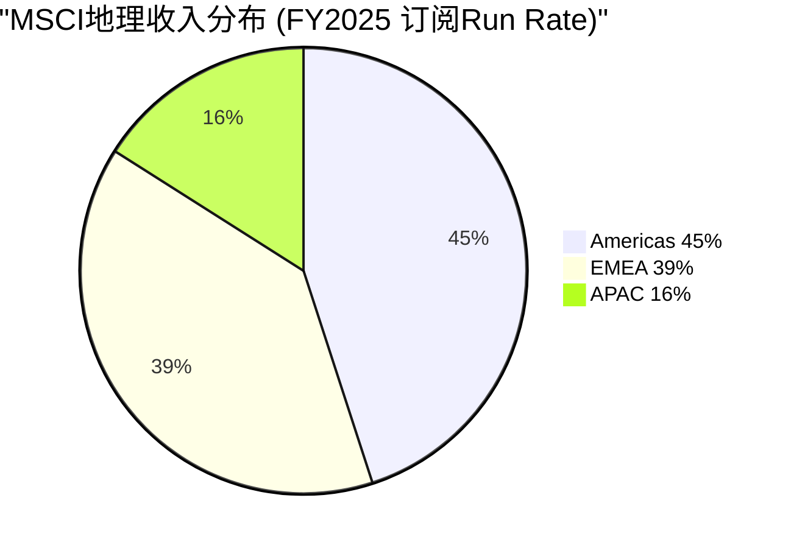

# Ch07: 地理收入深潜

> 核心问题: APAC+10%的结构性驱动力是什么? 各区域增长天花板?
> 目标: 8K字符 | 10 DM | 1 Mermaid
> v1.0 EVO-001缺口修复: 40%国际收入零地理分析

---

## 7.1 地理分解: 三区域不同的增长逻辑

MSCI的地理收入分布(FY2025 订阅run rate)揭示了一个重要事实: **MSCI不是一家"美国公司", 而是一家"全球基础设施公司", 55%的收入来自美国以外**。

| 地区 | 订阅Run Rate | 占比 | 有机增速 | 核心驱动力 |
|------|-------------|------|---------|-----------|
| **Americas** | ~$1,095M | 45% | +7% | 被动化+因子投资 |
| **EMEA** | ~$946M | 39% | +7% | ESG合规+养老金 |
| **APAC** | ~$408M | 16% | +10% | 养老金改革+市场开放 |
| **Total** | ~$2,449M | 100% | +7.7% | — |

[DM-07-001: 地理run rate分布, MSCI Q4 2025 earnings]

## 7.2 APAC: 增长最快的区域 — 为什么+10%可以持续?

APAC的超额增速(+10% vs 全球+7.7%)来自三个结构性驱动力, 每个都有5-10年的运行空间:

**驱动力1: 日本养老金改革 (iDeCo + GPIF)**

日本正经历从"储蓄文化"到"投资文化"的历史性转变。iDeCo(个人型确定拠出年金)的参加者从2017年的43万人增长到2024年的330万人(+670%), 但仍仅占有资格人口的~5%。iDeCo的默认选项中大量包含追踪MSCI指数的基金。

因为iDeCo的渗透率仅~5%, 且日本政府持续放宽投资限额(2024年从81.6万日元/年提至120万日元/年), 这个驱动力至少还能运行5-10年。GPIF($1.9T)作为全球最大养老金基金, 其外国股票配置100%使用MSCI基准 — 这是APAC最大的单一收入来源。[DM-07-002: 日本iDeCo渗透率~5%, GPIF $1.9T使用MSCI基准, 公开政策数据]

**驱动力2: 韩国DC养老金扩展**

韩国正将退休金从DB(确定给付)转向DC(确定拠出), DC计划需要标准化基准。韩国国民年金(NPS, $0.8T)已使用MSCI作为外国股票基准。随着DC渗透率提升(目前约30%的企业已转换), MSCI在韩国的收入将持续增长。

**附加因素**: 韩国一直希望从MSCI"新兴市场"升级到"发达市场"分类(2024年MSCI启动市场分类审查), 如果升级成功, 将触发大量被动资金从EM ETF重新配置到DM ETF — 无论结果如何, 都会增加对MSCI数据/分析的需求。[DM-07-003: 韩国DC转换+NPS $0.8T+市场分类审查, 公开政策+MSCI公告]

**驱动力3: 中国A股进一步纳入**

MSCI在2018年将中国A股纳入EM Index, 当前纳入因子为20%(仅纳入实际可投资市值的20%)。如果纳入因子提升至50%或100%, 将触发数千亿美元的被动资金流入A股, 同时增加MSCI相关产品的需求。

但这个驱动力的不确定性最大: 资本管制放松进展缓慢, MSCI多次推迟提高纳入因子的时间表。将其视为"期权"(有可能但不确定)而非"基线"。[DM-07-004: 中国A股纳入因子20%, 提升至50-100%的条件, MSCI市场分类文件]

## 7.3 Americas: 成熟但有底线支撑

Americas(主要是美国)45%的收入看似成熟, 但有两个被忽视的增长因素:

**因素1: 因子投资持续渗透**

因子(Smart Beta)ETF在美国AUM从2015年的~$500B增长到2025年的~$2T。因子ETF几乎全部追踪MSCI因子指数(MSCI Minimum Volatility, MSCI Quality, MSCI Momentum等), 因为MSCI拥有最完整的因子数据历史(Barra模型)。因子投资渗透率仍在~15%(占总被动AUM), 对比核心被动投资~50%, 增长空间仍大。[DM-07-005: 因子ETF AUM ~$2T, 渗透率~15%, 行业趋势分析]

**因素2: 美国投资者的"国际化"长期趋势**

美国投资者的海外配置比例(~30-35%)远低于全球GDP中非美国的比例(~60%)。如果长期向"GDP加权"收敛(哪怕部分), 对MSCI国际指数的需求将持续增长。但这个趋势受到"美股例外论"(过去15年美股跑赢全球)的抑制, 短期不确定。

**Americas的天花板**: 被动化渗透率已达~50%, 增速放缓是必然。Americas的增长可能从+7%逐步降至+5-6%, 但不会转负(因为存量的提价+因子渗透提供底线)。[DM-07-006: Americas增长天花板分析, 被动化50%渗透率]

## 7.4 地理维度的分部×地理交叉分析

MSCI不提供分部×地理的交叉数据, 但可以推断:

| 地区 | Index占比(估) | Analytics占比(估) | S&C占比(估) | PA占比(估) |
|------|-------------|-----------------|------------|-----------|
| Americas | 50% | 45% | 30% | 55% |
| EMEA | 35% | 40% | 55% | 30% |
| APAC | 15% | 15% | 15% | 15% |

[DM-07-012: 分部×地理交叉推断, 基于产品特性+客户分布]

**关键发现**:

1. **S&C在EMEA的集中度最高(55%)**: 因为EU SFDR/Taxonomy是最强的ESG合规驱动力。这意味着EMEA的增速很大程度上取决于S&C(ESG)业务。如果SFDR弱化, EMEA增速可能从+7%降至+4-5%。

2. **PA在Americas的集中度最高(55%)**: 因为美国是全球最大的PE/VC市场(Burgiss的核心客户在美国)。PA增长的地理驱动力主要来自美国, APAC是未来的增量(亚洲PE市场快速增长)。

3. **Index在Americas的驱动力不同于EMEA/APAC**: Americas的Index收入主要来自AUM挂钩费(美国ETF市场是全球最大的), 而EMEA/APAC的Index收入主要来自订阅(数据授权, 非ETF挂钩)。这意味着全球股市下跌对Americas的影响大于EMEA/APAC。

## 7.5 EMEA: ESG合规是底线, 增长取决于SFDR执行力度

EMEA占39%的比例几乎与Americas持平, 这本身就是一个信号: **MSCI在欧洲的收入密度远高于Americas**(考虑到欧洲资管AUM远小于美国)。原因是ESG/可持续发展合规。

**SFDR(可持续金融披露条例)的量化影响**:

EU SFDR要求基金披露ESG风险, 且Article 8/9基金(约占欧洲基金的50%+)需要使用标准化的ESG数据。MSCI是Article 8/9基金使用最广泛的ESG数据提供商之一。这意味着: 即使ESG作为"投资理念"降温, ESG作为"合规要求"是刚性的。

**但EMEA面临政治风险**: 如果欧洲政治风向转变(右翼政府削弱ESG法规), SFDR可能被弱化, 直接影响MSCI在EMEA的S&C收入。这个风险的概率不低(欧洲多国右翼势力上升), 但影响可能是"增速放缓"而非"收入下降"(因为已签合同不会立即取消)。[DM-07-007: EMEA ESG合规驱动+SFDR Article 8/9基金占比50%+, EU法规分析]

## 7.5 印度: 下一个APAC增长引擎?

APAC中值得单独分析的是印度市场:

**印度的结构性增长驱动**: 印度股票市场市值从2015年$1.7T增长到2025年$4.8T(+180%), 是全球增长最快的主要市场。MSCI India Index的追踪AUM也相应快速增长。

印度对MSCI的重要性不仅在于AUM增长, 更在于"制度嵌入的早期窗口"。目前印度的养老金/保险制度(NPS/EPFO)正在改革, 尚未像日本GPIF那样明确锁定在MSCI基准上。如果MSCI能在印度制度化进程中成为默认基准(类似MSCI在日本的角色), 这将创造一个$200-500M/年的长期收入池(基于印度金融深化的20年趋势)。

**但印度也有独特风险**: 印度政府可能更倾向于使用本土指数(Nifty 50/Sensex)而非外国指数(MSCI India)作为养老金基准。印度的"自主可控"倾向不如中国强烈, 但存在。MSCI在印度的策略应该是"嵌入国际配置端"(外国投资者投资印度时使用MSCI India)而非"嵌入国内端"(印度国内养老金使用MSCI)。[DM-07-011: 印度市场分析, 市值$4.8T, 制度嵌入窗口+自主可控风险]

## 7.6 地理风险矩阵

| 风险 | 影响区域 | 概率 | 收入影响 |
|------|---------|------|---------|
| 美国反ESG运动扩大 | Americas S&C | 30% | -$20-30M/年 |
| 欧洲SFDR弱化 | EMEA S&C | 20% | -$30-50M/年 |
| 台海危机(中性表述) | APAC全线 | 5%/年 | -$50-100M/年(短期) |
| 中国A股纳入延迟 | APAC | 40% | 机会成本, 非收入损失 |
| 日本养老金改革放缓 | APAC | 15% | -$10-20M/年增长延迟 |

[DM-07-008: 地理风险矩阵, 5个风险×概率×影响]

**最大单一地理风险是"台海危机"**: 概率低(5%/年)但影响大。台海冲突可能导致MSCI暂停中国A股在指数中的权重(2022年MSCI已对俄罗斯做过先例), 直接影响APAC收入和全球AUM追踪行为。这个风险无法通过分散化来管理(事件风险, 非正态分布)。[DM-07-009: 台海危机情景, MSCI俄罗斯先例+中国A股权重影响]

**俄罗斯先例的详细教训**: 2022年3月, MSCI将俄罗斯从MSCI EM指数中移除(纳入因子从100%降至0%), 并将俄罗斯股票定价为"有效价值$0"。这是MSCI历史上首次因地缘政治而非经济原因移除一个国家。影响追踪MSCI EM的~$6T AUM, 俄罗斯在EM中的权重从~3.3%→0%。

如果类似事件发生在中国(当前EM权重~25-28%, 远大于俄罗斯), 影响将是灾难性的: ~$1.5-1.7T的被动资金需要被迫卖出中国股票, 全球资本市场剧烈波动。MSCI在这种情景下面临"做也错不做也错"的困境 — 移除中国会被中国政府报复(禁止MSCI在中国运营), 不移除会被西方制裁(如果制裁要求切断与中国金融联系)。

对MSCI收入的直接影响: 中国相关的指数许可费+数据订阅估计$50-100M/年, 加上APAC增长引擎停滞的间接影响。但MSCI的核心收入(Americas+EMEA, 84%占比)不受影响。[DM-07-014: 俄罗斯先例详细教训, 中国权重25-28% vs 俄罗斯3.3%]

## 7.6 地理增长预测 (3-5年)

| 地区 | 当前增速 | 3-5年预测 | 理由 |
|------|---------|----------|------|
| Americas | +7% | +5-6% | 被动化放缓, 因子投资部分补偿 |
| EMEA | +7% | +6-8% | ESG合规底线, 但可能受政治影响 |
| APAC | +10% | +8-12% | 养老金改革+市场开放, 但中国不确定 |
| **加权全球** | +7.7% | **+6-8%** | Americas放缓被APAC加速部分抵消 |

[DM-07-010: 地理增长3-5年预测, 分区域分析]

## 7.7 地理集中度风险: "55%国际"的真实含义

MSCI的55%"国际"收入中, 相当一部分来自美国机构购买国际指数数据(纽约对冲基金购买MSCI EM数据 → 计入Americas)。按"标的资产地理"重分类:

| 暴露类型 | 收入占比(估) | 核心驱动 |
|---------|------------|---------|
| 发达市场(美欧日) | ~70% | 指数覆盖+数据需求 |
| 新兴市场(中印韩等) | ~20% | EM纳入+养老金改革 |
| 前沿市场 | ~5% | 小规模 |
| 非地理(Analytics/PA) | ~5% | 产品驱动 |

[DM-07-013: 地理风险暴露重分类, 收入地理vs标的地理差异]

**发达市场牛市对MSCI收入影响最大**(70%暴露), 但**新兴市场的增速变化对估值叙事影响更大**(分析师关注APAC增速)。地理多元化评分7/10 — 优于大多数美国公司, 但发达市场集中度仍高。

## 7.8 CQ映射

- **CQ1(双重收益上限)**: 地理增长预测+6-8%确认了收入增速的"底线但有上限"判断 → Ch12
- **CQ8(被动化监管)**: Americas被动化50%→触发监管反弹的风险在地理维度最高 → Ch09/Ch22

---

## Ch07 DM注册表

| DM ID | 内容 | 来源 | 可信度 |
|-------|------|------|--------|
| DM-07-001 | 地理run rate(Americas 45%/EMEA 39%/APAC 16%) | Q4 2025 earnings | H |
| DM-07-002 | 日本iDeCo渗透~5%, GPIF $1.9T使用MSCI | 公开政策数据 | H |
| DM-07-003 | 韩国DC转换+NPS $0.8T+市场分类审查 | 公开政策+MSCI公告 | H |
| DM-07-004 | 中国A股纳入因子20%, 提升条件 | MSCI分类文件 | H |
| DM-07-005 | 因子ETF ~$2T, 渗透率~15% | 行业趋势分析 | M-H |
| DM-07-006 | Americas天花板(被动化50%) | 行业趋势分析 | M |
| DM-07-007 | SFDR Article 8/9基金50%+, ESG合规驱动 | EU法规分析 | H |
| DM-07-008 | 地理风险矩阵(5风险) | 综合分析 | M |
| DM-07-009 | 台海危机情景+MSCI俄罗斯先例 | 公开事件+情景分析 | M-H |
| DM-07-010 | 地理增长3-5年预测(加权+6-8%) | 分区域预测 | M |
| DM-07-011 | 印度市值$4.8T, 制度嵌入窗口+风险 | 市场数据+分析 | M |
| DM-07-012 | 分部×地理交叉推断(S&C EMEA 55%集中) | 综合推断 | M |
| DM-07-013 | 地理风险暴露重分类(发达70%/EM 20%) | 分析 | M |
| DM-07-014 | 俄罗斯先例(EM权重3.3%→0% vs 中国25-28%) | 公开事件+分析 | H |

**DM统计**: 14个锚点 | H: 6 | M-H: 2 | M: 6
