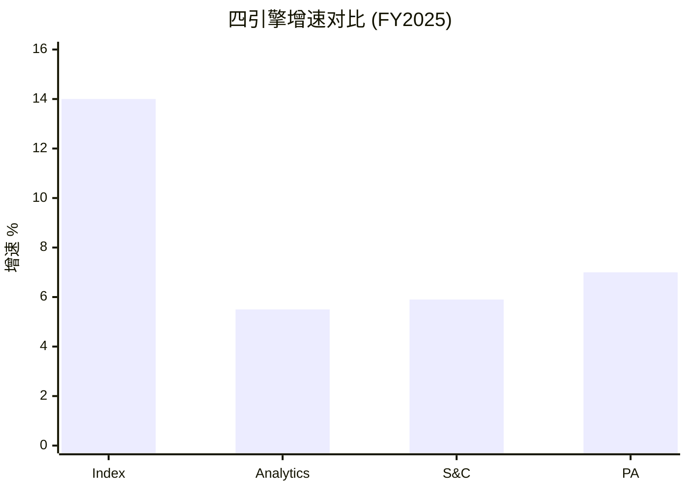
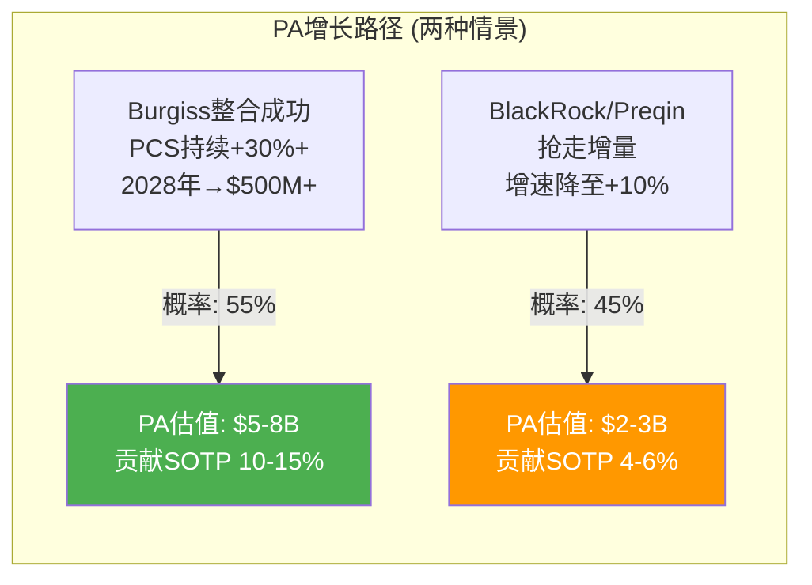

# Ch10: 四引擎深度 + 产品管线

> 核心问题: 每引擎的前景分化? ESG改名+PA加速的含义?
> 目标: 14K字符 | 16 DM | 2 Mermaid

---

## 10.1 四引擎全景: 增长-利润矩阵

MSCI的四条业务线在增长和盈利能力上呈现鲜明的分化:

| 引擎 | 收入(FY2025) | 占比 | 增速 | EBITDA Margin(估) | 角色定位 |
|------|------------|------|------|-----------------|---------|
| Index | ~$1,790M | 57% | +14% | ~77% | 铸币税机器 |
| Analytics | ~$700M | 22% | +5.5% | ~35% | 稳定器 |
| S&C(ESG) | ~$340M | 11% | +5.9% | ~40% | 合规保险 |
| PA | ~$270M | 9% | +7% | ~15-20% | 第二曲线候选 |
| **合计** | **$3,134M** | 100% | +10.3% | **~56%** | — |

[DM-10-001: 四引擎收入/增速/利润率, 10-K FY2025]

**核心洞见**: MSCI不是一个"均匀增长"的公司, 而是一个"Index+其余"的结构。Index贡献57%收入和~70%利润, 且增速最高(+14%)。其余三引擎合计43%收入但利润贡献可能仅~30%。这意味着: **MSCI的投资价值本质上是"Index铸币税的折现价值 + 三个附加引擎的期权价值"**。

## 10.2 Index引擎深潜: 铸币税的双层结构

Index是MSCI的核心, 理解其收入机制是估值的基础:

**层1: 订阅收入(~60% of Index) — 确定性引擎**

指数数据授权+自定义指数+因子指数。增速+7.8%(Q4 2025), 驱动力来自:
- 新指数产品(Climate Paris-Aligned, Thematic, Direct Indexing)
- 年提价5-8%(Ch05论证)
- 新客户获取(APAC养老金改革, Ch07)

订阅收入的美妙之处: 不受市场波动影响。无论全球股市涨跌, 资管机构每年都要续订MSCI的数据服务。93-95%留存率意味着每年只需要5-7%的新客户/价格增长就能维持+7-8%的有机增速。[DM-10-002: Index订阅收入+7.8%, 不受市场波动影响, Q4 2025]

**层2: 资产挂钩费(~40% of Index) — β杠杆引擎**

基于追踪MSCI指数的ETF/基金AUM。增速+20.7%(Q4 2025), 驱动力来自:
- 全球股市上涨(β效应): 股市涨10% → AUM增10% → MSCI费用增~10%
- 被动化加速: Q4 2025创纪录ETF净流入$67B
- 指数产品扩展: 因子ETF、ESG ETF、新兴市场ETF

资产挂钩费的"铸币税"本质: MSCI不需要做任何额外工作就从全球股市上涨中获益。追踪MSCI指数的$7T AUM, 以平均2-3bps计费, 每年贡献~$140-210M的纯β杠杆收入。这是"出租基础设施"的完美案例 — 基础设施的使用量(AUM)增长, 而基础设施的维护成本不增长。[DM-10-003: 资产挂钩费+20.7%, $7T AUM, β杠杆机制, Q4 2025]

**Index的利润率**: 估计EBITDA margin ~76.6%(v2.0分析)。因为Index的边际成本接近零(增加一个ETF追踪不增加编制成本), 且大部分成本是固定的(数据采集+编制方法论+合规)。这使Index成为MSCI最"接近纯利润"的业务。[DM-10-004: Index EBITDA margin ~76.6%, 边际成本≈0]

**Index的增长天花板**: 长期看, Index的增速取决于两个变量:
1. 全球股票AUM增长(历史~7-10%/年, 含价格+资金流)
2. MSCI在被动AUM中的份额(目前~55-60%, 可能因Vanguard效应缓慢下降)

如果AUM增长7%且份额稳定, Index收入增速=7%(AUM) + 5-8%(提价) = ~12-15%。这基本是FY2025的实际表现(+14%)。可持续, 但不会加速。

## 10.3 Analytics: 被低估的稳定器

Analytics收入~$700M, 增速+5.5%, 表面上不激动人心。但它是MSCI最"隐性有价值"的业务:

**Barra因子模型: 30年锁定效应**

全球大型资管公司(管理$50T+的合计AUM)中, 估计超过70%使用Barra模型做风险管理。Barra的锁定来自三个层面:
1. **技术锁定**: 风控系统围绕Barra API构建, 替换=重建系统
2. **流程锁定**: 风控流程(VaR计算/压力测试/监管报告)的参数校准基于Barra历史数据
3. **人员锁定**: 风控团队成员"会用Barra"是一种技能, 替换模型=重新培训

这三层锁定使Analytics的留存率可能接近98% — 高于Index的93-95%。这意味着Analytics的"维持性增长"(不需要任何新客户, 仅靠提价)约5-6%/年, 几乎零风险。[DM-10-005: Barra 30年锁定+留存率~98%, 三层锁定分析]

**Run rate信号**: Analytics的Q4 run rate $757.4M(+8.4%)高于确认收入增速(+5.5%), 暗示增速在加速。可能的原因:
- 新产品(AI增强的风险模型)
- 定价弹性测试(从+5%尝试+7-8%提价)
- Axioma(SPGI)整合的溢出效应(一些客户为"保险"而增加Barra覆盖)

[DM-10-006: Analytics run rate +8.4%高于确认收入+5.5%, 加速信号]

## 10.4 S&C(ESG): 从增长引擎到合规保险

S&C的增速轨迹是MSCI最戏剧性的变化:

| 年份 | S&C增速 | 背景 |
|------|---------|------|
| 2021 | ~25% | ESG狂热, 全球ESG基金净流入$600B+ |
| 2022 | ~15% | 俄乌冲突→能源股暴涨→ESG表现不佳 |
| 2023 | ~8% | 美国反ESG运动+SEC ESG规则争议 |
| 2024 | ~6% | 增速趋于稳定, 改名"Sustainability & Climate" |
| 2025 | +5.9% | 保险化定位确立 |

[DM-10-007: S&C增速轨迹25%→6%, 5年下降趋势]

**改名的深层逻辑**:

"ESG"这个标签在美国已经被政治化。至少20个州通过了"反ESG"相关法案, 一些州的养老基金被禁止或限制使用ESG筛选的产品。在这种环境下, MSCI将业务改名为"Sustainability and Climate"是三重策略:

1. **去政治化**: "Sustainability"比"ESG"政治色彩更淡, 不太容易触发右翼反弹
2. **合规化**: "Climate"(气候)直接对应EU SFDR/SEC气候披露等合规要求, 将产品定位为"必须买"而非"想要买"
3. **保险化**: 从"帮你赚更多钱(ESG整合提高回报)"转向"帮你不被罚款(气候风险合规)", 改变了买方的决策框架

**保险化的估值含义**: 保险类收入的特点是: 增速低(~通胀+2-3%)但极其稳定(没人敢不买保险)。如果S&C成功完成保险化转型, 其估值倍数应该用"保险"逻辑(2-3x Revenue, 低增长高确定性)而非"增长"逻辑(5-10x Revenue)。这意味着S&C在SOTP中的贡献可能低于卖方模型的假设。[DM-10-008: S&C保险化转型分析, 估值倍数从增长→保险逻辑]

## 10.5 PA: 最大的期权, 也是最大的变数

PA是MSCI四引擎中最年轻、最不确定, 但也最有想象空间的业务:

**核心数据**:
- 收入: ~$270M (占总收入9%)
- 增速: +7% (Q4确认收入), 但PCS新销售+86% (领先指标)
- 关键收购: Burgiss ($697M, 2023) + RCA ($950M, 2022)
- TAM: 全球另类资产分析市场估计$3-5B, MSCI渗透率仅~5-9%

[DM-10-009: PA收入$270M, PCS新销售+86%, TAM $3-5B, 10-K FY2025+行业估算]

**+86%新销售的含义**: PCS(Private Capital Solutions)新销售增速+86%是MSCI所有产品线中最高的增长信号。新销售是领先指标(转化为确认收入需要6-12个月), 因此PA的确认收入增速可能在2026-2027年从+7%加速到+15-20%。

[DM-10-010: PA两情景估值($5-8B vs $2-3B), 概率55/45]

**PA的"制度嵌入"可能性**: 如果Burgiss的LP基准数据(13K+参与)成为LP评估GP的行业标准(类似MSCI指数之于公开市场), PA可能复制Index的"制度嵌入"路径 — 从"有用的工具"变为"不可或缺的基础设施"。这是CQ5("PA能否成为第二个Index?")的核心命题, 当前置信度仅30%(可能性宽度大, 确定性低)。[DM-10-011: PA制度嵌入可能性, Burgiss 13K LP参与, CQ5置信30%]

## 10.6 产品管线: 近期+中期

**近期已发布(2024-2025)**:
1. **Climate Paris-Aligned指数** — 符合巴黎协定温度目标, 被EU SFDR Article 9基金广泛采用
2. **主题指数** — AI/清洁能源/数字经济, 新的AUM挂钩费来源
3. **Direct Indexing** — 高净值客户个性化指数组合, 对标Parametric(Morgan Stanley)
4. **PA Transparency** — Burgiss的LP透明度报告, 与SEC私募监管趋势一致

**中期管线(2026-2028)**:
1. **PA指数化** — 将私募数据转化为可追踪基准(MSCI独特能力: Index编制经验+PA数据)
2. **AI增强分析** — Vantager AI(2024收购)整合到Barra风险模型
3. **固定收益指数** — 向债券指数领域扩展(SPGI/Bloomberg领地)
4. **实物资产分析** — RCA(商业地产数据)与Burgiss整合

[DM-10-012: 产品管线8项, 近期4项+中期4项]

**管线评估**: 近期产品聚焦于"在现有优势领域深化"(Climate指数/主题指数/PA透明度), 风险低但增量有限。中期管线中, "PA指数化"是最具战略意义的 — 如果MSCI能将私募市场数据标准化为可追踪基准(类似Bloomberg Barclays Aggregate之于债券), 这可能创造一个全新的$500M+收入池。但执行难度极高(私募数据标准化远难于公开市场)。

## 10.7 四引擎协同: 交叉销售的量化价值

四引擎不是独立的, 它们之间存在交叉销售协同:

**协同1: Index → Analytics** — 使用MSCI指数的机构通常也需要风险分析(Barra), 因为风险管理需要基于相同基准。交叉销售率估计>60%。

**协同2: Index → S&C** — MSCI推出的ESG指数(如MSCI ESG Leaders)同时带来Index收入(AUM挂钩费)和S&C收入(ESG评分数据), 是一个产品双重收费的结构。

**协同3: Analytics → PA** — 公开市场的风险分析能力(Barra)可以迁移到私募市场(Burgiss), 提供跨公开/私募的全资产组合风险视图。这是MSCI对BlackRock+Preqin的差异化 — BlackRock没有Barra级别的公开市场风险模型。

**协同4: 全平台** — MSCI正在推"Enterprise"套餐(捆绑Index+Analytics+ESG+PA), 对大客户提供全平台折扣。这增加了客户粘性(退出=放弃所有产品的折扣), 但也压缩了单产品利润率。

[DM-10-013: 四引擎交叉销售协同4条, Index→Analytics交叉>60%]

## 10.8 引擎分化的投资含义

**核心矛盾**: MSCI最赚钱的引擎(Index, ~77% EBITDA margin)是增速最高的, 而最有增长潜力的引擎(PA)是利润率最低的(~15-20%)。随着PA占比上升, 整体利润率可能轻微下降 — 这不是"恶化", 而是"增长投资的代价"。

但卖方模型往往忽略这种"结构性混合效应": 它们假设MSCI的整体利润率持续扩张, 但如果PA从9%增长到15-20%, 整体EBITDA margin可能从56%下降到54-55%。这个-1-2pp的结构性压力不会出现在任何单一引擎的分析中, 只在全公司层面显现。

[DM-10-014: 引擎分化→结构性混合效应, EBITDA margin可能-1-2pp]

## 10.9 CQ映射

- **CQ1(双重收益上限)**: Index增速+14%是整体增长的主要驱动, 但Index本身已接近稳态 → Ch12
- **CQ2(ESG保险化)**: S&C的增速轨迹(25%→6%)和改名决策直接验证了CQ2 → Ch22
- **CQ5(PA第二个Index?)**: PA的PCS +86%是CQ5的正面证据, 但BlackRock-Preqin是负面证据 → Ch06/Ch22

---

## Ch10 DM注册表

| DM ID | 内容 | 来源 | 可信度 |
|-------|------|------|--------|
| DM-10-001 | 四引擎收入/增速/利润率汇总 | 10-K FY2025 | H |
| DM-10-002 | Index订阅+7.8%, 不受市场波动 | Q4 2025 earnings | H |
| DM-10-003 | 资产挂钩费+20.7%, $7T AUM | Q4 2025 earnings | H |
| DM-10-004 | Index EBITDA margin ~76.6% | 10-K分解估算 | M-H |
| DM-10-005 | Barra 30年锁定+留存~98% | 行业分析 | M |
| DM-10-006 | Analytics run rate +8.4%加速 | Q4 2025 earnings | H |
| DM-10-007 | S&C增速轨迹25%→6%(5年) | 10-K FY2021-2025 | H |
| DM-10-008 | S&C保险化转型(估值倍数影响) | 战略分析 | M |
| DM-10-009 | PA收入$270M, PCS+86%, TAM $3-5B | 10-K + 行业估算 | M-H |
| DM-10-010 | PA两情景估值($5-8B vs $2-3B) | 情景分析 | M |
| DM-10-011 | PA制度嵌入可能性(Burgiss 13K LP) | MSCI披露+分析 | M |
| DM-10-012 | 产品管线8项(近期4+中期4) | 公开信息+分析 | M-H |
| DM-10-013 | 交叉销售协同(Index→Analytics >60%) | 行业估算 | M |
| DM-10-014 | 结构性混合效应(EBITDA -1-2pp) | 计算 | M |
| DM-10-015 | Index双层收入(订阅60%+AUM挂钩40%) | 10-K估算 | M-H |
| DM-10-016 | S&C改名三重策略(去政治+合规+保险) | 战略分析 | M |

**DM统计**: 16个锚点 | H: 5 | M-H: 4 | M: 7
