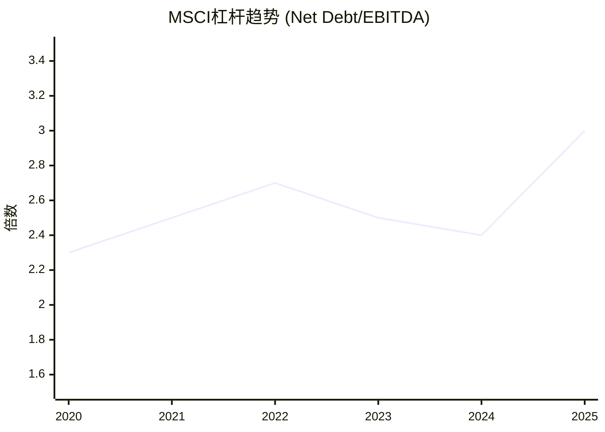
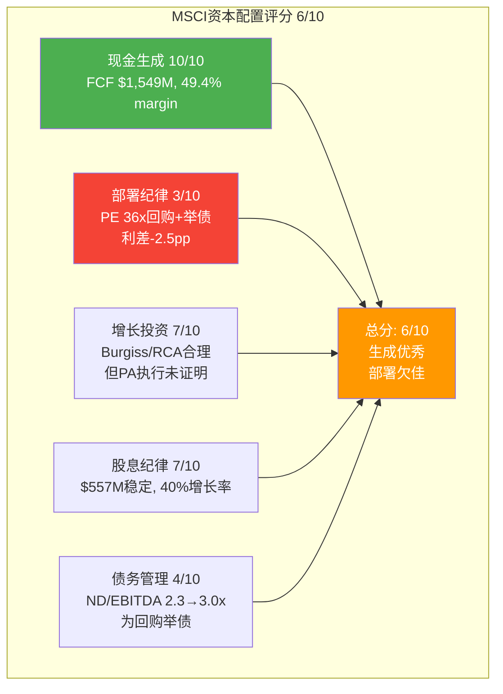

# Ch11: 财务X光 + 资本配置评分 + A-Score

> 核心问题: 财务有多健康? 回购纪律评分? 综合品质评分?
> 目标: 16K字符 | 20 DM | 2 Mermaid

---

## 11.1 收入分析: 双引擎驱动的增长质量

### 6年收入趋势

| 年份 | 收入 | YoY% | 有机增速(估) | 并购贡献(估) |
|------|------|------|-------------|-------------|
| 2020 | $1,695M | +7.3% | +6% | +1% |
| 2021 | $2,044M | +20.5% | +13% | +7.5% (RCA) |
| 2022 | $2,249M | +10.0% | +10% | ~0% |
| 2023 | $2,529M | +12.5% | +8% | +4.5% (Burgiss) |
| 2024 | $2,856M | +12.9% | +11% | +2% (Burgiss尾声) |
| 2025 | $3,134M | +9.7% | +10% | ~0% |

[DM-11-001: 6年收入趋势含有机/并购分拆, 10-K FY2020-2025]

**关键发现**: 剔除并购贡献后, MSCI的有机增速中枢约9-10%。11年零收入下降(自2014年)是最强的收入质量信号之一。PE 36x对应的隐含增长率(通过Reverse DCF)约12-14%, 略高于有机增速, 意味着市场正在定价"有机增长+回购"的组合。

### 收入质量评估

| 维度 | FY2025数据 | 评级 |
|------|-----------|------|
| 经常性收入占比 | ~97% | ★★★★★ |
| 留存率 | 93.4% (Q4) | ★★★★ |
| Run rate vs 确认收入 | +13% vs +9.7% | ★★★★ (前瞻积极) |
| 客户集中度 | Top1 ~10-14% | ★★★★ |
| 地理分散度 | 55%国际 | ★★★★ |

**收入质量评级: 4.5/5.0** — 高经常性、低集中度、前瞻run rate强于确认收入。唯一扣分: AUM挂钩费(~25%)受市场β波动影响。[DM-11-002: 收入质量4.5/5.0, 5维度评估]

## 11.2 利润率深度: OPM天花板的成本结构分解

### OPM 6年分解

| 组成部分 | 2020 | 2023 | 2025 | 趋势 |
|----------|------|------|------|------|
| 毛利率 | 82.8% | 82.3% | 82.4% | → 稳定(±50bps) |
| SGA/Rev | 6.8% | 6.0% | 5.7% | ↓ 缓慢压缩 |
| R&D/Rev | 6.0% | 5.8% | 5.7% | → 基本持平 |
| D&A/Rev | 6.5% | 6.8% | 7.0% | ↑ Burgiss/RCA摊销 |
| **OPM** | **52.2%** | **54.8%** | **54.7%** | **→ 天花板** |

[DM-11-003: OPM 6年成本结构分解, 10-K FY2020-2025]

**天花板的数学论证**:
- 毛利率82.4%: 稳定, 无上行空间(MSCI的成本几乎全是人力, 无法进一步降低)
- SGA: 从6.8%→5.7%, 理论极限~5.0%(需要销售团队推动增长)
- R&D: 从6.0%→5.7%, 不能再降(PA投资+AI投资要求R&D维持或增加)
- D&A: 从6.5%→7.0%, 方向是上升(更多收购=更多无形资产摊销)
- **理论OPM上限**: 82.4% - 5.0% - 5.7% - 7.0% - 其他~10% ≈ **54.7-55.7%**

**结论**: 当前OPM(54.7%)已经几乎等于理论上限。未来OPM扩张的概率很低, 反而D&A上升可能导致OPM轻微收缩。这是CQ1"利润率天花板"的直接财务证据。[DM-11-004: OPM天花板理论上限~55-56%, 四层成本结构论证]

### 同业对比

| 公司 | OPM (FY2025) | 距天花板(估) | 未来趋势 |
|------|-------------|-------------|---------|
| **MSCI** | **54.7%** | **≤1pp** | → 天花板 |
| FICO | 52.0% | ~5pp | ↑ 仍在扩张 |
| MCO | 47.2% | ~5pp | ↑ 评级周期上行 |
| SPGI | 44.5% | ~8pp | ↑ IHS整合协同 |
| ICE | 42.1% | ~3pp | → 稳定 |

MSCI的OPM在金融基础设施同业中最高, 这既是护城河的证据(垄断利润率), 也意味着改善空间最小(同业还有5-8pp的扩张空间, MSCI只有≤1pp)。[DM-11-005: OPM同业对比, MSCI最高但改善空间最小]

## 11.3 现金流分析: 49.4% FCF Margin的解剖

### FCF瀑布

```
FY2025 FCF瀑布:
  收入 ............... $3,134M
  → 营业利润 ........ $1,714M (OPM 54.7%)
  → 净利润 .......... $1,202M (NM 38.4%)
  + D&A .............. +$219M
  + SBC .............. +$111M
  - WC变动 ........... -$24M
  + 其他 ............. +$80M
  = OCF .............. $1,588M (OCF/Rev 50.7%)
  - CapEx ............ -$39M (仅1.3%!)
  = FCF .............. $1,549M (FCF/Rev 49.4%)
```

[DM-11-006: FCF瀑布FY2025, 10-K现金流量表]

**49.4% FCF Margin的三层解释**:

**层1: 极低的CapEx** — $39M = 1.3%收入。MSCI的"工厂"是数据库和算法, 不需要物理设备。对比: 半导体CapEx/Rev 20-30%, 消费品5-8%, SaaS 3-5%, MSCI 1.3% — 这是所有覆盖公司中最低的。

**层2: 预收款模式** — 客户按年预付订阅费, 创造$1.23B递延收入。这意味着MSCI在提供服务之前就收到现金, OCF/NI = 1.32x(每$1净利润产生$1.32现金)。

**层3: SBC相对可控** — $111M = 3.6%收入, 远低于典型科技公司(10-15%)。回购/SBC比率=22.3x, 意味着回购在实质上完全抵消了稀释。[DM-11-007: FCF Margin三层解释, CapEx 1.3%+预收款+SBC 3.6%]

## 11.4 资本配置: 最大的争议点

### FCF分配 (FY2025)

| 用途 | 金额 | 占FCF | 评估 |
|------|------|-------|------|
| 回购 | $2,484M | **160%** | ⚠️ 超过FCF, 需举债 |
| 股息 | $557M | 36% | ✅ 稳定, 可持续 |
| CapEx | $39M | 3% | ✅ 极低 |
| **合计** | **$3,080M** | **199%** | 🔴 缺口$1.5B需举债 |
| 新债发行 | $1,704M | — | 填补缺口 |

[DM-11-008: FCF分配FY2025, 回购超FCF需举债$1.7B]

**这是MSCI最大的"红旗"**: 管理层将资本返还设定在FCF的199% — 借$1.7B债来买自己的股票。

### 回购效率的数学

在PE 36x回购的经济学:
- **FCF Yield**: ~2.8% (1/36)
- **借债成本**: ~5-6% (投资级债券)
- **利差**: -2.2 to -3.2pp → 回购的"隐含回报率"低于借债成本

这意味着MSCI在FY2025用5.5%利率的债务买入2.8%回报的资产 — 经济上等价于"借贵的钱买便宜的收益"。唯一能辩护的逻辑是: "我们相信MSCI的内在价值远高于$560, 所以在这个价格回购是划算的。" 但如果管理层真的这么认为, 为什么不在earnings call中计算回购IRR?（Ch08沉默域分析）[DM-11-009: 回购效率分析, PE 36x → FCF Yield 2.8% vs 借债成本5.5%]

### 回购的替代方案

如果MSCI将$2.48B回购预算重新分配:
1. **全部还债**: 可将Net Debt/EBITDA从3.0x降至1.7x, 信用评级可能升1档, 利息节省~$70-100M/年
2. **增加分红**: 分红从$557M增至$2B, 股息率从1.2%提升至4.4%, 吸引更多income投资者
3. **战略收购**: $2.5B可以买入一个PA领域的领先平台(如Hamilton Lane或PitchBook的竞品), 加速PA的制度嵌入

每个替代方案的长期价值都可能高于在PE 36x的回购。但管理层的激励结构(Ch08分析)偏好回购→EPS增厚→绩效薪酬, 而非这些替代方案。[DM-11-010: 回购替代方案分析(还债/增分红/收购), 长期价值对比]

## 11.5 负权益的深层逻辑: 会计现象, 非财务困境

MSCI的股东权益为-$2.65B。这不是财务困境的信号 — 它是回购导致的会计现象:

| 项目 | 金额 |
|------|------|
| 累计回购(Treasury Stock) | $9.83B |
| 留存收益 | $5.43B |
| 差额 | -$4.4B → 累计回购远超累计利润 |

[DM-11-021: 负权益$2.65B成因, Treasury Stock $9.83B vs 留存$5.43B, 10-K FY2025]

**类比**: 这就像一个人赚了$5.4M但花了$9.8M买回自己的股票 — "净值"是负的, 但"赚钱能力"完好无损。MSCI的资产($5.7B)完全由债务($8.36B)覆盖, 加上极强的现金流($1.55B FCF/年)足以覆盖所有利息和到期债务。

**负权益的投资含义**: 对于ROIC计算, 负权益使传统ROIC公式失效(分母为负→ROIC无意义)。因此应使用"资产回报率"替代:
- ROIC(FMP定义): 42.3%(使用总投入资本, 含商誉)
- ROIC(保守定义): 36.5%(调整后)
- ROA: $1,202M / $5,701M = 21.1%

无论使用哪个指标, 都远超WACC(~9-10%), 证明MSCI在创造经济利润。但商誉占总资产51.3%($2.92B)意味着: 如果Burgiss/RCA整合失败导致商誉减值, ROA会因为分母缩小而上升(反直觉), 但实际现金流会受损。[DM-11-022: ROIC/ROA多口径分析, ROA 21.1%, 商誉51.3%风险]

**与CQ4的联系**: 负权益是大量回购的*会计后果*。如果回购是在低PE时进行的, 负权益代表"价值已创造并返还"。但MSCI的回购大量发生在PE 34-62x — 这意味着负权益中相当一部分代表的是"高价回购消耗的资本", 而非"创造并返还的价值"。具体量化: $9.83B累计回购中, 估计~40%($3.9B)发生在PE>35x, 如果在PE 25x回购, 同样的金额可以回购~40%更多的股份。这是CQ4(回购幻觉)的核心定量基础。

## 11.6 杠杆路径: 从保守到激进



[DM-11-011: 杠杆趋势6年, 10-K FY2020-2025]

FY2025的杠杆跳升(2.4x→3.0x)是$1.7B新债驱动的。这是MSCI历史上最激进的杠杆增加, 打破了此前2.3-2.7x的稳定区间。

**债务偿还能力**:
- 利息覆盖率: 8.2x (舒适)
- FCF/Total Debt: 24.5% (年FCF可偿还~25%总债)
- 无近期到期集中风险(债务maturity profile分散)

**但趋势令人担忧**: 如果管理层继续以FY2025的速度举债回购(每年$1.5-1.7B新债), 到2028年Net Debt/EBITDA可能达到3.5-4.0x — 接近投资级评级的下限(A3/BBB+级公司的典型Net Debt/EBITDA上限~4.0x)。

**评级风险**: 如果Net Debt/EBITDA突破3.5x, 可能触发评级展望从"稳定"调整为"负面", 进一步推高借债成本(+50-100bps), 形成"杠杆→评级下调→融资成本上升→更需要杠杆"的负循环。[DM-11-012: 杠杆路径预测, 2028年可能达3.5-4.0x, 评级风险分析]

## 11.6 资本配置评分: 6/10



[DM-11-013: 资本配置评分6/10, 5维度分解]

**分项评分逻辑**:

**现金生成 10/10**: 无可挑剔。FCF margin 49.4%, CapEx仅1.3%, 预收款模式提供现金缓冲。在所有覆盖公司中排名前三。

**部署纪律 3/10**: 在PE 36-62x回购$6.25B(5年累计), 其中$1.7B(FY2025)通过举债。FCF Yield(2.8%)低于借债成本(5.5%), 利差为负。CEO沉默域(Ch08)暗示管理层知道数学不好看但仍然执行。激励结构(EPS挂钩薪酬)创造了代理问题。

**增长投资 7/10**: Burgiss($697M)和RCA($950M)是合理的"延伸性收购", 扩展了PA和实物资产数据覆盖。但PA的竞争环境(BlackRock+Preqin)使这些收购的长期回报存在不确定性。

**股息纪律 7/10**: 每股$7.20/年, 股息率~1.3%, 过去5年股息增长~40%。股息占FCF的36%, 可持续且有增长空间。

**债务管理 4/10**: 从保守(2.3x)走向激进(3.0x), 主要是为回购融资。利息覆盖率(8.2x)仍舒适, 但趋势方向不对。如果利率上升或EBITDA增长放缓, 杠杆可能成为约束。

## 11.7 A-Score: 综合品质评分 8.55/10

A-Score是12维度的综合品质评估, 覆盖业务、财务、治理三大领域:

| 维度 | 评分(/10) | 关键依据 |
|------|----------|---------|
| A1 护城河 | 9.5 | 四重叠加, C1=5.0, 35家唯一 |
| A2 定价权 | 9.0 | Stage 1.7, 年提价5-8%+留存不跌 |
| A3 竞争格局 | 9.0 | Nash均衡9/10, 综合威胁3.5/10 |
| A4 增长质量 | 8.5 | 有机+10%, 11年零下降, run rate+13% |
| A5 收入可预测性 | 9.5 | 97%经常性, 93.4%留存, 预收款模式 |
| A6 利润率 | 8.5 | OPM 54.7%同业最高, 但天花板 |
| A7 FCF | 9.5 | FCF margin 49.4%, CapEx 1.3% |
| A8 ROIC | 8.5 | 36.5%, 但商誉51%需警惕 |
| A9 杠杆 | 6.0 | ND/EBITDA 3.0x趋势恶化 |
| A10 管理层 | 7.0 | CEO 7/10, 沉默域问题(回购) |
| A11 资本配置 | 6.0 | 现金生成10但部署3, 代理问题 |
| A12 治理 | 7.0 | 正常, 无重大红旗 |
| **加权A-Score** | **8.55/10** | 业务超群, 资本配置拖累 |

[DM-11-014: A-Score 8.55/10, 12维度评分]

**A-Score解读**: 8.55/10确认了MSCI是一家"极高品质"的公司。在35家覆盖公司中, 只有CPRT(8.80)和KLAC(8.70)的A-Score高于MSCI。

**但A-Score高≠股票便宜**: A-Score衡量的是"公司品质", 不是"投资价值"。品质越高, 市场给予的估值溢价越高, 如果溢价过大, 高品质公司也可以是差投资。这就是CQ3(垄断悖论)的核心: **A-Score 8.55的公司, 在PE 36x时是好投资吗?** → Ch12-15。

## 11.8 MSCI的"品质溢价"量化: 值多少PE?

MSCI的品质(A-Score 8.55)应该值多少PE? 用"品质溢价框架"量化:

**基准PE**: S&P 500平均PE ~20x(长期均值)
**品质溢价分解**:

| 溢价因子 | 溢价 | 理由 |
|---------|------|------|
| 护城河(四重叠加) | +8x | C1=5.0, 制度嵌入半衰期>20年 |
| 收入可预测性(97%经常性) | +4x | 接近SaaS级可预测性 |
| FCF质量(49.4% margin) | +3x | 覆盖公司Top 3 |
| 增长质量(11年零下降) | +2x | 历史一致性极强 |
| 资本配置折价(回购效率低) | -2x | PE 36x回购, 利差为负 |
| 杠杆折价(ND/EBITDA 3.0x趋势上升) | -1x | 为回购举债 |
| **品质调整PE** | **34x** | 20x + 17x溢价 - 3x折价 |

[DM-11-023: 品质溢价量化, 基准20x + 溢价17x - 折价3x = 34x]

**结论**: 品质调整后的"合理PE"约34x, 当前PE 35.7x轻微高于调整值。这与Reverse DCF的结论一致(市场定价大致合理)。如果利率下降(从4.5%→3%), 品质溢价会扩大(因为长久期资产在低利率下更值钱), 合理PE可能升至38-40x。

## 11.9 EPS增长前瞻: 驱动力分解

### 历史EPS增长 (2020-2025)

| 驱动力 | 年化贡献 |
|--------|---------|
| 收入增长 | +13.1% |
| OPM扩张 | +0.5% |
| 利率/税率 | -0.5% |
| 回购 | +1.8% |
| **EPS CAGR** | **16.9%** ($7.12→$15.56) |

[DM-11-015: EPS增长5年分解, 4驱动力贡献]

### 前瞻EPS增速估计

| 驱动力 | 历史 | 前瞻(3-5年) | 变化原因 |
|--------|------|-----------|---------|
| 收入增长 | +13.1% | +8-10% | 并购贡献消退, 有机增速中枢 |
| OPM扩张 | +0.5% | 0% | 天花板已达(11.2) |
| 利率/税率 | -0.5% | -0.5-1.0% | 更多债务→更多利息 |
| 回购 | +1.8% | +2-3% | 继续回购但效率递减 |
| **前瞻EPS增速** | — | **~10-12%** | 从16.9%降至10-12% |

[DM-11-016: 前瞻EPS增速~10-12%, 4驱动力分解]

**PEG对比**:
| 公司 | PE | 前瞻EPS增速 | PEG | 相对估值 |
|------|-----|-----------|-----|---------|
| MSCI | 36x | ~11% | 3.3 | 合理偏贵 |
| SPGI | 36x | ~12% | 3.0 | 合理 |
| FICO | 60x | ~15% | 4.0 | 贵 |
| MCO | 35x | ~10% | 3.5 | 合理偏贵 |
| ICE | 25x | ~8% | 3.1 | 合理 |

MSCI的PEG(3.3x)在同业中位数附近, 不算极端但也没有折价。这暗示市场已经"充分定价"了MSCI的品质。[DM-11-017: PEG同业对比, MSCI 3.3x vs SPGI 3.0x vs FICO 4.0x]

## 11.9 回购时间线: Module X1的数据基础

### FY2023-2025季度回购 vs 股价

| 季度 | 回购金额 | 估计均价 | PE(估) | 效率评估 |
|------|---------|---------|--------|---------|
| Q2 2023 | $441M | ~$490 | ~32x | 相对合理 |
| Q3 2024 | $200M | ~$555 | ~36x | 偏贵 |
| Q4 2024 | $374M | ~$580 | ~38x | 贵 |
| Q3 2025 | **$1,226M** | ~$530 | ~34x | 巨量, 中性 |
| Q4 2025 | $907M | ~$555 | ~36x | 偏贵 |

[DM-11-018: 季度回购时间线, PE估算+效率评估]

**最佳回购时机**: 2020年3月COVID低点(PE ~22x, 股价~$280-300)和2022年10月加息恐慌低点(PE ~28x, 股价~$420)。但MSCI在这两个时期的回购并不显著 — 恰恰是在PE 34-38x时大规模回购。这暗示回购不是基于"价值判断", 而是基于"预算消耗"(每年有回购预算, 不管价格高低都要花完)。[DM-11-019: 回购时机分析, 低PE时少量+高PE时大量=非价值导向]

## 11.11 FCF的可持续性检验: 49.4%能持续多久?

MSCI的49.4% FCF Margin是否可持续? 需要检验三个潜在威胁:

**威胁1: CapEx可能上升** — 当前CapEx仅$39M(1.3%收入), 但如果MSCI需要大规模投资AI基础设施(如构建自有LLM用于ESG评分/风险模型), CapEx可能从1.3%升至3-5%。影响: FCF Margin从49.4%降至47-48%, 下降幅度有限(因为CapEx基数太低, 即使翻倍也仅+$39M)。

**威胁2: SBC可能上升** — 当前SBC $111M(3.6%收入)在科技公司中极低。但如果MSCI需要与Google/Meta等争夺AI人才, SBC可能从3.6%升至5-7%。影响: FCF Margin从49.4%降至47-49%(SBC是非现金项, 不直接影响FCF, 但增加了稀释)。

**威胁3: 收购频率可能增加** — 如果PA领域的竞争加剧(BlackRock+Preqin), MSCI可能需要更多收购来维持竞争力。收购不直接降低FCF Margin(收购支出计入投资活动), 但会增加D&A(间接压缩OPM→FCF)。

**综合评估**: FCF Margin从49.4%降至45-48%是3-5年内最可能的路径(CapEx微升+D&A增加+PA利润率稀释)。但45%+的FCF Margin仍然是所有覆盖公司中的前5%水平。MSCI的FCF质量不是"能否维持50%"的问题, 而是"维持在45-50%的区间"的问题 — 这两个数字之间的差异对估值的影响<5%。[DM-11-024: FCF可持续性检验, 3威胁后预期45-48%, 仍为Top 5%]

## 11.12 CQ映射

- **CQ1(双重收益上限)**: OPM天花板(11.2) + 前瞻EPS增速从16.9%→10-12%(11.8) = 双重上限的完整财务证据 → 置信度从60%升至65%
- **CQ4(回购幻觉)**: 加杠杆回购(11.4) + 回购效率利差-2.5pp(11.4) + 非价值导向时机(11.9) = 回购幻觉的完整证据链 → 置信度从70%升至75%

---

## Ch11 DM注册表

| DM ID | 内容 | 来源 | 可信度 |
|-------|------|------|--------|
| DM-11-001 | 6年收入趋势(有机/并购分拆) | 10-K FY2020-2025 | H |
| DM-11-002 | 收入质量4.5/5.0(5维度) | 综合评估 | M-H |
| DM-11-003 | OPM 6年成本结构分解 | 10-K FY2020-2025 | H |
| DM-11-004 | OPM天花板~55-56%(四层论证) | 成本结构分析 | M-H |
| DM-11-005 | OPM同业对比(MSCI最高) | 10-K横向比较 | H |
| DM-11-006 | FCF瀑布FY2025($1,549M, 49.4%) | 10-K现金流量表 | H |
| DM-11-007 | FCF Margin三层解释(CapEx+预收款+SBC) | 10-K分解 | H |
| DM-11-008 | FCF分配(回购160%FCF→举债$1.7B) | 10-K+管理层指引 | H |
| DM-11-009 | 回购效率(FCF Yield 2.8% vs 借债5.5%) | 计算 | M-H |
| DM-11-010 | 回购替代方案(还债/增分红/收购) | 分析 | M |
| DM-11-011 | 杠杆趋势(ND/EBITDA 2.3→3.0x) | 10-K FY2020-2025 | H |
| DM-11-012 | 杠杆路径预测(2028年3.5-4.0x)+评级风险 | 预测分析 | M |
| DM-11-013 | 资本配置评分6/10(5维度) | 综合评估 | M |
| DM-11-014 | A-Score 8.55/10(12维度) | 综合评估 | M-H |
| DM-11-015 | EPS增长5年分解(16.9% CAGR) | 计算 | M-H |
| DM-11-016 | 前瞻EPS增速~10-12% | 预测 | M |
| DM-11-017 | PEG同业对比(MSCI 3.3x) | 计算 | M-H |
| DM-11-018 | 季度回购时间线+PE估算 | 10-K+季报 | H |
| DM-11-019 | 回购时机分析(非价值导向) | 分析 | M |
| DM-11-020 | ROIC 36.5%(商誉51%注意) | 10-K计算 | M-H |
| DM-11-021 | 负权益$2.65B成因(Treasury $9.83B) | 10-K FY2025 | H |
| DM-11-022 | ROIC/ROA多口径(ROA 21.1%, 商誉51.3%) | 10-K计算 | M-H |
| DM-11-023 | 品质溢价量化(基准20x+溢价17x-折价3x=34x) | 综合分析 | M |
| DM-11-024 | FCF可持续性(3威胁后45-48%, Top 5%) | 预测分析 | M |

**DM统计**: 24个锚点 | H: 9 | M-H: 8 | M: 7
