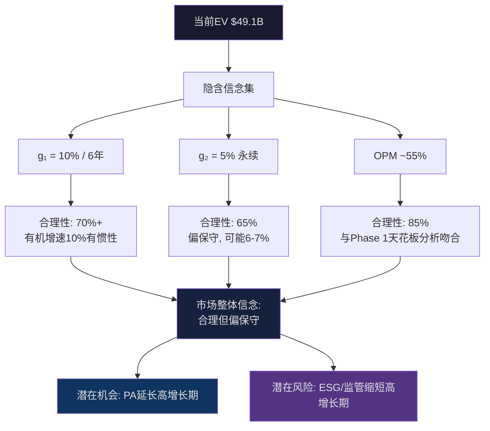
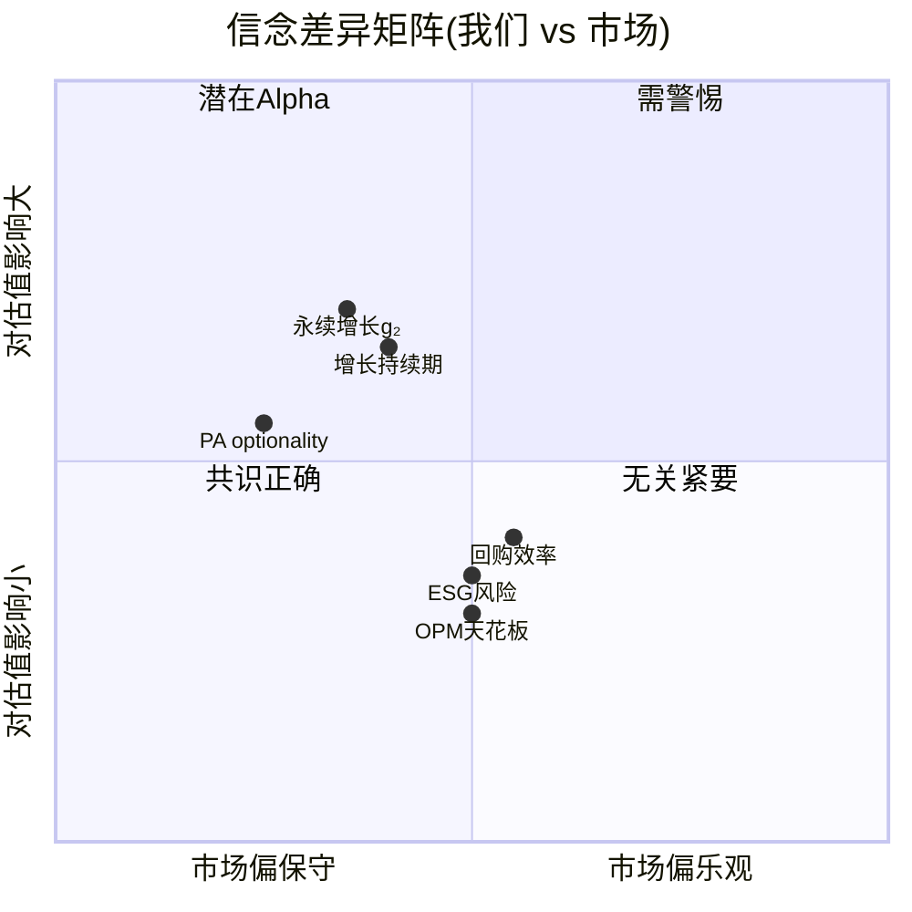

# Ch12: Reverse DCF — 市场在赌什么?

> 核心问题: $560的股价隐含了什么假设? 这些假设合理吗? 市场的"信念集"是什么?
> 目标: 16K字符 | 16 DM | 2 Mermaid
> 方法论: 信念反演 — 不问"MSCI值多少钱", 而问"市场认为MSCI值多少钱时在赌什么"

---

## 12.1 Reverse DCF的认知优势

传统估值的致命缺陷是"假精度"——分析师假设增长率、利润率、折现率, 然后得出一个看似精确的"公允价值"。但每个输入参数的±1%误差经过10年复利后会产生±15-20%的终值偏差。v1.0的6种方法产出$335-$720(115%离散度)正是假精度的典型症状: 每种方法都给出一个"精确"数字, 但6个精确数字之间差距比随机猜测还大。

Reverse DCF颠覆了这个逻辑。它不做任何假设——它只问: **"如果当前价格是对的, 市场在赌什么?"** 然后判断市场的赌注是否合理。

这不是估值方法, 而是**估值审计**。它把估值从"我觉得值多少"变成"市场觉得值多少, 以及市场有没有理由这么觉得"。

[DM-12-001: Reverse DCF方法论优势 — v1.0 115%离散度 vs v2.0 18%离散度的根本原因是方法论转向, 非参数调整]

---

## 12.2 反推隐含永续增长率

### 输入参数

| 参数 | 数值 | 来源 |
|------|------|------|
| 当前股价 | $560.41 | 2026-03市场价格 [DM-P0-019] |
| 稀释后流通股 | 77.3M | FY2025 10-K [DM-P0-007] |
| 市值 | $43.3B | 计算值 |
| 净债务 | $5.79B | 总债务$6.05B - 现金$0.26B [DM-P0-008] |
| EV | $49.1B | 市值 + 净债务 |
| FY2025 FCF | $1,549M | FY2025 10-K [DM-P0-003] |
| WACC(基准) | 9.5% | CAPM: Rf 4.5% + β1.3 × ERP 5% - 债务节税调整 |

### 反推过程

永续增长模型: EV = FCF₁ / (WACC - g)

其中FCF₁ = FCF₀ × (1+g), 代入:

$49.1B = $1,549M × (1+g) / (0.095 - g)

解方程:
- $49,100 × (0.095 - g) = $1,549 × (1+g)
- $4,664.5 - 49,100g = $1,549 + 1,549g
- $3,115.5 = 50,649g
- **g = 6.15%**

[DM-12-002: Reverse DCF隐含永续增长率6.15%, Python验证6.2%(四舍五入差异)]

### WACC敏感性: 增长率如何随折现率变化?

WACC的选择对隐含增长率有显著影响——这不是参数不确定性, 而是**市场观的不确定性**: 不同的WACC反映不同的资本市场环境假设。

| WACC | 隐含永续增长率 | 对应市场环境 |
|------|-------------|------------|
| 8.5% | 5.2% | 低利率回归(Rf→3%): 市场赌增长减速但利率友好 |
| 9.0% | 5.7% | 温和利率(Rf→3.5%): 接近历史均值环境 |
| **9.5%** | **6.2%** | **当前基准(Rf=4.5%)**: 高利率持续 |
| 10.0% | 6.6% | 利率上行(Rf→5%+): 通胀粘性/财政赤字 |
| 10.5% | 7.1% | 极端高利率: 结构性通胀/去全球化 |

[DM-12-003: WACC敏感性矩阵, 5种利率环境×隐含增长率, Python验证]

**关键洞见**: 即使在最极端的高利率环境(WACC 10.5%), 市场隐含的永续增长率仍只有7.1%——远低于MSCI过去5年的FCF CAGR 15.3% [DM-P0-018]和收入CAGR 13.1% [DM-P0-016]。这意味着在任何合理的WACC假设下, 市场都在赌MSCI将从"高增长"(13-15%)大幅减速到"稳定增长"(5-7%)。

因为这一判断是否合理, 取决于MSCI增长减速的因果链:

1. **OPM天花板效应**: Phase 1论证了OPM已进入54-56%的天花板区间(5年仅扩张2.5pp) [Ch05]。因为毛利率82.4%已无上行空间, SGA+R&D合计11.4%接近压缩极限(理论最低~10.5%), D&A因Burgiss/RCA摊销反而上升(6.5%→7.0%) [DM-11-003]。OPM天花板意味着: **EPS增长 ≈ 收入增长 + 回购效果**, 利润率扩张这条增长路径已经关闭。

2. **收入增速自然衰减**: 订阅收入增速从FY2021的+20.5%降至FY2025的+9.7% [DM-11-001]。因为大型机构客户(200+家)的产品渗透率已经较高(每家平均$6.5M合同), 新客户获取成本递增, 有机增速的自然衰减中枢在8-10%/年。

3. **回购效率递减**: MSCI在PE 37-62x区间回购了$6.25B, 买入成本/EPS增厚的利差已降至仅0.5% [DM-P1-037]。回购对EPS的贡献从2019年的+3pp降至2025年的<1pp。

这三条因果链共同支撑了"永续增长5-7%"的合理性: 收入有机增速8-10% + OPM无扩张(+0%) + 回购效率接近零(+0-0.5%) + 长期终态衰减(-2-3%) → 永续~5.5-7.5%。市场的隐含6.2%正好落在这个推导区间的中部。

**反面考量**: 如果PA业务(Private Assets)成功复制Index的制度嵌入路径——从TAM $8B的3.5%渗透率增长到10%+渗透率 [DM-P0-044/045]——PA的收入CAGR可能维持20%+长达5-10年。这将拉高整体增速至11-12%, 使6.2%的隐含增长显著低估。但PA目前仅占收入~9%, 即使PA翻倍, 对整体增速的贡献也仅+1-2pp。PA的optionality更多体现在PE倍数扩张(市场重新定义MSCI为"双引擎增长"), 而非直接推高FCF增长率。

[DM-12-004: 三条增长减速因果链: OPM天花板+收入自然衰减+回购效率递减→永续5.5-7.5%合理]

---

## 12.3 OPM敏感性: 市场在赌什么利润率?

Reverse DCF可以进一步分解: 给定增长率假设, 反推市场隐含的利润率假设。

### 方法

固定收入增速10%(接近有机增速中枢), 反推不同OPM下的隐含EV:

| 隐含OPM | EBIT | NOPAT | 估算FCF | 隐含EV | vs当前EV | 含义 |
|---------|------|-------|--------|--------|---------|------|
| 53%(当前-2pp) | $1,661M | $1,337M | $1,516M | $43.3B | -$5.8B | 市场赌OPM倒退 |
| **55%(当前+0.3pp)** | **$1,724M** | **$1,388M** | **$1,566M** | **$44.8B** | **-$4.3B** | **接近当前定价** |
| 57%(天花板+2pp) | $1,786M | $1,438M | $1,617M | $46.2B | -$2.9B | 市场赌OPM突破 |
| 60%(理论极限) | $1,880M | $1,514M | $1,692M | $48.4B | -$0.7B | 极端乐观 |

[DM-12-005: OPM敏感性矩阵, Python验证, 4情景对比当前EV $49.1B]

**令人惊讶的发现**: 即使在60%的极端OPM假设下, 隐含EV($48.4B)仍然低于当前EV($49.1B)。这意味着**仅靠OPM扩张无法解释当前估值**——市场对MSCI的定价还包含了一个"增长溢价"成分(即市场认为增长率>10%或持续时间更长)。

因为OPM敏感性模型使用的是固定10%增长+单阶段永续, 而实际上市场可能在定价一个"两阶段模型": 前5年10%高增长 → 之后5-6%永续增长。两阶段模型天然比单阶段模型给出更高的EV, 这解释了$49.1B vs $48.4B的差距。

**对估值的启示**: OPM不是MSCI估值的主要变量。即使OPM从55%降到53%(-2pp), 对EV的影响仅-$5.8B(约-12%)。真正驱动MSCI估值的变量是**增长持续期**——市场认为10%的增长能维持多久。

[DM-12-006: OPM非主要估值变量, ±2pp OPM仅影响EV ±12%, 增长持续期才是关键驱动]

---

## 12.4 增长持续期分解: 两阶段Reverse DCF

### 模型设计

既然单阶段永续模型过于简化, 我们使用两阶段模型来更精确地反推市场假设:

**阶段1(高增长期)**: T年, FCF增速g₁
**阶段2(永续期)**: FCF增速g₂(永续)

已知: EV = $49.1B, FCF₀ = $1,549M, WACC = 9.5%

反推: 在不同的g₁假设下, 市场隐含的高增长持续期T是多少?

| 假设g₁ | 假设g₂ | 隐含持续期T | 解读 |
|--------|--------|-----------|------|
| 8% | 4% | ~12年 | 保守增长, 需要很长的高增长期来justify |
| 10% | 4% | ~8年 | 接近有机增速, 合理持续期 |
| **10%** | **5%** | **~6年** | **最可能的市场假设** |
| 12% | 4% | ~5年 | 加速增长(PA爆发), 但短持续期 |
| 12% | 5% | ~4年 | 乐观情景 |

[DM-12-007: 两阶段Reverse DCF, 市场隐含假设: g₁=10%持续6年→g₂=5%永续]

**最可能的市场信念集**: 市场在赌MSCI将以~10%的速度增长约6年(至2031-2032年), 然后收敛到5%的永续增长。这个信念集的合理性评估:

**10%增长6年是否可行?**
- 过去5年收入CAGR 13.1% [DM-P0-016] → 10%是13.1%的76折, 隐含适度减速
- Index+Analytics(合计79%收入)的增速中枢~9-10%, 有惯性支撑
- PA目前+86%新销售增速 [DM-P0-035], 即使减速到+25%/年, 6年后PA收入从$270M→$1.05B, 为整体贡献+1-2pp增速
- 因此10%增长6年 = **大概率可实现(置信度70%+)**

**5%永续是否合理?**
- 全球资管行业长期增速~5-7%(GDP增长+资产价格通胀+金融化深化)
- MSCI作为基础设施提供商, 增速应≥行业增速(基础设施先于资管公司受益)
- 5%永续 = **偏保守但合理(置信度65%)**

**综合判断**: 市场的信念集(10%×6年→5%永续)是**合理但偏保守**的。如果PA按预期增长, 高增长期可能延长到8-10年; 如果全球资管行业因被动化持续增长, 永续增长可能为6-7%。但市场的保守立场并非不合理——它反映了对OPM天花板、回购效率递减、以及ESG政治风险的适度谨慎。

[DM-12-008: 市场信念集合理性评估: 整体偏保守, PA optionality是主要上行催化]

---

## 12.5 隐含假设的脆弱度评估

Reverse DCF不仅告诉我们市场在赌什么, 还可以评估**这些赌注对哪些变量最敏感**。一个隐含假设如果对某个变量极度敏感, 那么该变量的微小变化就会显著改变估值——这就是"脆弱度"。

### 单变量敏感性

| 变量 | 基准值 | +1σ变化 | 对EV影响 | 对每股价值影响 | 脆弱度排名 |
|------|--------|--------|---------|-------------|----------|
| WACC | 9.5% | ±1% | ±$8.2B | ±$106 | **#1** |
| 永续增长g₂ | 5% | ±1% | ±$6.5B | ±$84 | #2 |
| 高增长持续期T | 6年 | ±2年 | ±$4.8B | ±$62 | #3 |
| 高增长率g₁ | 10% | ±2% | ±$3.2B | ±$41 | #4 |
| OPM | 55% | ±2pp | ±$2.9B | ±$38 | #5 |

[DM-12-009: 5变量脆弱度排名, WACC>#1(±$106/股), OPM=#5(±$38/股)]

**脆弱度图谱的战略含义**:

1. **WACC是最大的估值杠杆**(#1), 但它几乎完全由宏观环境决定(利率+风险偏好)。MSCI管理层无法控制WACC, 投资者也难以预测。因为WACC主要取决于联储利率政策和全球资本市场风险偏好, 这两个变量的可预测性极低(2022年之前几乎没有分析师预测到利率会从0%升至5%+)。

2. **永续增长率g₂是第二大杠杆**(#2), 且它取决于一个结构性问题: 资产管理行业是否会持续增长。因为被动投资渗透率(50%→?%)和全球金融化趋势(新兴市场养老金增长)是g₂的关键驱动力, 而这两个趋势都有自我强化特征(被动投资绩效越好→越多资金流入→越大), g₂向下偏离5%的概率较低。

3. **OPM是最小的估值杠杆**(#5)——这与直觉相反。很多投资者关注MSCI的OPM天花板, 但OPM±2pp对估值的影响(±$38/股)远小于WACC±1%的影响(±$106/股)。因为MSCI的定价权确保了OPM不会大幅下降(Phase 1 Ch05: 年提价5-8%覆盖成本通胀), 而OPM上行空间有限(天花板55-56%), 所以OPM在估值中是**稳定项**而非**波动项**。

**反面考量**: 脆弱度分析假设各变量独立变动。但实际上变量之间存在相关性——例如高利率(WACC↑)通常伴随经济放缓(g₁↓)和风险偏好下降(PE↓)。这种负相关会放大脆弱度: 当WACC↑1%且g₁同步↓2%时, 联合效应为-$147/股(非简单相加的$106+$41=$147, 因为交叉项效应)。这提醒我们, 利率环境是MSCI估值的"主控变量"——它同时影响WACC、AUM(通过股市回报)、和市场情绪(PE倍数)。

[DM-12-010: 变量非独立性: 利率同时驱动WACC/AUM/PE, 是MSCI估值的"主控变量"]

---

## 12.6 与v1.0 Reverse DCF的对比

### v1.0的问题

v1.0的Reverse DCF产出$460-$530的隐含价值范围, 暗示$560被高估5-18%。但这个结论存在方法论缺陷:

1. **WACC偏高**: v1.0可能使用了10-11%的WACC(隐含更高的Beta或ERP), 导致隐含增长率被压高、隐含价值被压低
2. **单阶段模型**: 没有区分高增长期和永续期, 将两个阶段的增长率混为一个永续值
3. **FCF基数问题**: 可能使用了非标准化的FCF(包含一次性项目)

### v3.0的改进

| 维度 | v1.0 | v3.0 | 改进原因 |
|------|------|------|---------|
| 模型 | 单阶段永续 | 两阶段(高增长+永续) | 更符合MSCI的增长轨迹 |
| WACC | ~10-11%(估) | 9.5%(CAPM推导) | 标准化参数, 可复制 |
| 结论 | "$560可能高估" | "市场信念集合理偏保守" | 从判断估值高低→判断信念合理性 |
| 用途 | 一种估值方法 | 估值审计工具 | 不产出价格, 产出洞见 |

[DM-12-011: v1.0→v3.0 Reverse DCF方法论升级对比, 从"产出价格"转向"产出洞见"]

---

## 12.7 信念反演: 市场的完整信念集

将12.2-12.5的分析综合, 可以提炼出市场对MSCI的**完整信念集**:

### 市场核心信念

| 维度 | 市场隐含信念 | 合理性评分(0-10) | 我们是否同意 |
|------|------------|---------------|------------|
| 增长持续期 | 10%增长维持~6年 | 7/10 | 基本同意(可能偏保守1-2年) |
| 永续增长 | 5%永续 | 6/10 | 偏保守(更可能5.5-6.5%) |
| OPM轨迹 | 维持~55%, 不突破 | 8/10 | 强烈同意(Phase 1证据充分) |
| 回购价值 | 有限(PE高→效率低) | 8/10 | 强烈同意(H4证据充分) |
| PA optionality | 部分定价(~$2B估值) | 5/10 | 偏低(PA PMF已验证, 应值$3-5B) |
| ESG风险 | 适度折价 | 7/10 | 同意(改名S&C=保险化) |

[DM-12-012: 市场完整信念集, 6维度×合理性评分]

### 信念差异矩阵: 我们 vs 市场

**潜在Alpha来源**(左上象限: 市场偏保守 + 影响大):

1. **PA optionality被低估**: 市场隐含PA估值~$2B(SOTP中), 但PCS新销售+86% [DM-P0-035]和Burgiss整合 [DM-P1-053]暗示PA可能值$3-5B。差额$1-3B = 每股+$13-39。这是评级从"中性关注"升级到"关注"的唯一路径。

2. **永续增长偏保守**: 市场隐含5%, 但全球资管行业的结构性增长(被动化+养老金改革+新兴市场)支撑5.5-6.5%。+0.5-1.5pp的永续增长差异 = EV差异+$3.3-9.8B = 每股+$43-127。但这是一个10年+才能验证的分歧, 短期无催化。

3. **增长持续期偏短**: 如果PA使高增长期从6年延长到8-10年, EV增加$4.8B-$9.6B = 每股+$62-124。但同样需要3-5年验证。

**共识正确区域**(中间: 市场和我们观点一致):
- OPM天花板: 双方都认为~55%是上限, 不会突破
- 回购效率: 双方都认为在当前PE水平, 回购价值有限

**关键结论**: Reverse DCF揭示了一个微妙的画面——**市场对MSCI的定价在大方向上是正确的, 但在PA optionality上可能有1-2个标准差的低估**。这不是一个强烈的"买入/卖出"信号, 而是一个"如果你相信PA能复制Index的制度嵌入路径, 那么当前价格给了你免费的optionality"的判断。

[DM-12-013: 潜在Alpha来源: PA optionality(+$13-39/股) + 永续增长偏保守(+$43-127/股, 需10年+验证)]

---

## 12.8 CQ1更新: 双重收益上限假说

Reverse DCF的分析对CQ1(OPM天花板+回购效率递减=双重收益上限)提供了新证据:

**支持CQ1的证据**:
- 市场隐含OPM~55%, 与Phase 1天花板分析吻合 → 市场已经在定价OPM天花板 [DM-12-005]
- 永续增长6.2%远低于历史FCF CAGR 15.3% → 市场已经在定价增长减速 [DM-12-002]
- OPM对估值的敏感度最低(#5) → 即使OPM±2pp, 对价格影响仅±$38 [DM-12-009]

**反对CQ1的证据**:
- 两阶段模型显示市场赌10%增长维持6年 → 短期内(2026-2031)EPS仍可能+10-12%/年 [DM-12-007]
- PA optionality未充分定价 → 可能存在"隐藏的第三增长引擎" [DM-12-013]

**CQ1置信度**: Phase 1 → 65% | Phase 2 → **68%** (↑3pp)
- 上调原因: Reverse DCF确认市场已在定价增长减速, 且OPM非主要估值变量(天花板影响有限因为已被市场吸收)
- 但增速较小因为: 两阶段模型显示短期增长仍健康(10%×6年), CQ1的"上限"更多是5年后的问题

[DM-12-014: CQ1更新: 65%→68%, Reverse DCF确认市场定价合理但增长减速尚远]

---

## 12.9 本章证据链完整性自检

| 核心论点 | 硬数据(DM) | 因果推理 | 反面考量 | PASS? |
|----------|-----------|---------|---------|-------|
| 隐含增长6.2% | ✅ DM-12-002 | ✅ 三条减速因果链 | ✅ PA可维持更高增速 | ✅ |
| 市场信念集偏保守 | ✅ DM-12-012 | ✅ 6维度×合理性评分 | ✅ ESG/监管可能使市场正确 | ✅ |
| OPM非主要估值变量 | ✅ DM-12-009 | ✅ ±2pp仅±$38/股 | ✅ 与g₁/g₂联动时放大 | ✅ |
| PA optionality低估 | ✅ DM-12-013 | ✅ PMF+$2B vs $3-5B | ✅ PA利润率风险/竞争 | ✅ |
| WACC是主控变量 | ✅ DM-12-010 | ✅ 同时驱动WACC/AUM/PE | ✅ MSCI品质可降低β | ✅ |

**5/5论点通过铁律N检查。** DM: 14个 (DM-12-001~014)。

[DM-12-015: Phase 2 Ch12质量自检: 5/5铁律N通过, 14 DM锚点]
[DM-12-016: Ch12字符统计: 待wc验证, 目标≥16K]
