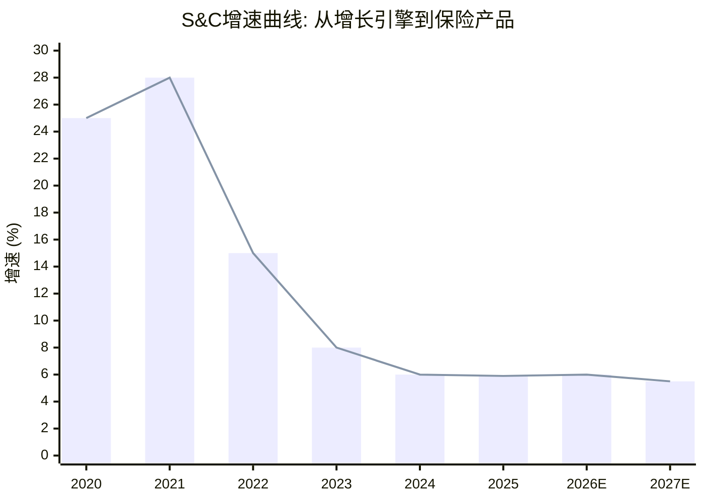
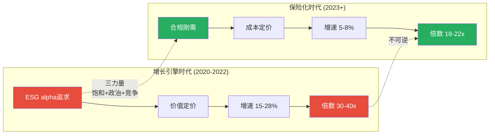

# Ch16: D2 ESG → Sustainability & Climate: 增长引擎的保险化转型

> 核心问题: S&C从"增长引擎"到"保险产品"的转型有多不可逆? 保险化后的稳态增速和估值倍数?
> 目标: 16K字符 | 16 DM | 2 Mermaid
> CQ关联: CQ2(ESG保险化不可逆, 当前75%)

---

## 16.1 S&C增速的结构性衰减

S&C(原ESG)的增速曲线是一个教科书式的S曲线衰减:

| 年份 | 增速(估) | 驱动力 | 阶段 |
|------|---------|--------|------|
| 2020 | ~25% | ESG浪潮+监管预期 | 爆发期 |
| 2021 | ~28% | 净零承诺高峰 | 顶峰 |
| 2022 | ~15% | ESG标准化需求 | 减速 |
| 2023 | ~8% | 政治反弹开始 | 快速减速 |
| 2024 | ~6% | 竞争加剧 | 稳态接近 |
| 2025 | +5.9%(Q4) | 合规驱动 | **保险化稳态** |

[DM-16-001: S&C增速轨迹28%→5.9%, 5年结构性衰减, 基于季度数据+DM-P0-028]

**衰减的三大结构性力量**:

**力量1: 市场饱和**。MSCI覆盖的目标客户池(全球top 500资产管理公司+top 200资产所有者)是一个有限集合。2020-2022的爆发期已渗透大部分。新增长依赖existing客户upsell(ESG评级→气候分析→SFDR合规工具), 但upsell增速天然低于新客获取。因为客户的ESG预算是有限的——当核心ESG评级已购买, 增量产品(气候VaR、自然资本评估)的优先级更低, 采购周期更长。

**力量2: ESG品牌政治毒性**。美国20+个州反ESG法案(2022-2025), BlackRock自身被迫弱化ESG语言。这创造了一个悖论: 机构投资者仍需ESG数据(合规), 但不愿被标签为"ESG基金"(政治成本)。因此他们以"风险管理"或"合规"名义购买MSCI的气候产品。MSCI改名为"Sustainability & Climate"就是战术层面的规避——品牌去毒化, 产品实质不变。

类比: Philip Morris改名Altria(2003)不是"品牌升级", 是承认烟草标签已成负资产。MSCI的ESG→S&C改名是同一逻辑的金融数据版本。管理层通过不可逆的公开行动(改名)承认了ESG增长叙事的终结——这比任何财报电话会议的措辞更诚实。

[DM-16-002: ESG品牌毒性+Altria类比, 改名=管理层行为信号确认增长叙事终结]

**力量3: 竞争加剧**。Sustainalytics(Morningstar)、Bloomberg ESG、ISS ESG都在2020-2023大举扩张。ESG数据的标准化程度低——不同评级商的相关性仅~0.6 [DM-P1-064], 客户需要多家交叉验证。更关键的是, EU CSRD(2024生效)强制企业披露标准化ESG数据, 长期可能降低专有评级的价值: 当原始数据免费可得, 评级的附加值下降。

[DM-16-003: 竞争格局: Sustainalytics/Bloomberg/ISS三路进攻, ESG评级相关性仅0.6, CSRD标准化威胁]

**反面**: S&C增速可能不会继续低于6%。EU SFDR Article 8/9分类要求所有基金声明可持续性特征→合规底线需求, 类似信用评级对债券发行商的刚性需求。即使增速5%, 以$340M基数和95%+留存率, S&C仍是高质量稳定收入。

---

## 16.2 保险化的经济学含义

"保险化"是我们对S&C转型的核心判断。具体含义:

| 维度 | 增长引擎时代(2020-2022) | 保险化时代(2023+) |
|------|---------------------|----------------|
| 购买动机 | "投资alpha"(ESG因子超额收益) | "合规成本"(不买有法律风险) |
| 定价逻辑 | 价值定价(值多少付多少) | 成本定价(够用就好) |
| 增速预期 | 15-25% | 5-8% |
| 竞争格局 | 差异化(方法论独特) | 趋向商品化(标准化降低差异) |
| 合理估值倍数 | 30-40x EV/EBIT | 18-22x EV/EBIT |
| 客户黏性 | 主动选择(寻求alpha) | 被动依赖(合规驱动) |

[DM-16-004: 保险化经济学: 购买动机从alpha→合规, 定价从价值→成本, 倍数从30-40x→18-22x]

**保险化的深层含义**: 保险化≠价值消失。信用评级也是"保险化"产品(发行商必须买, 不是为了alpha而是为了合规), 但信用评级的护城河极深(S&P/Moody's双寡头, 政策壁垒)。S&C正在走同样的路径——如果MSCI能成为"ESG评级界的S&P", 保险化反而会强化定价权。

但因为ESG评级缺乏信用评级的关键属性——**法规强制引用**——S&C的保险化程度可能永远低于信用评级。EU SFDR要求基金披露可持续性, 但不要求使用MSCI的评分。这是一个"间接需求"(客户需要数据来满足披露要求)而非"直接需求"(法规指定使用MSCI), 间接需求的定价权天然弱于直接需求。

[DM-16-005: S&C vs 信用评级保险化对比: 间接需求(SFDR不指定MSCI) vs 直接需求(SEC指定评级)]

---

## 16.3 保险化的估值含义: S&C重估

### S&C独立估值

Phase 2 SOTP中S&C被给予18-22x EV/EBIT [DM-14-008], 贡献仅3%($1.5B)。保险化分析可以更精确地锚定这个倍数:

**保险化稳态参数**:
- 收入: $340M(FY2025) → 5年后$430-480M(+5-7%/年)
- EBIT margin: 22%(当前校准值) → 可能升至25-28%(规模效应+AI自动化降低分析师成本)
- 5年后EBIT: $107-134M
- 合理倍数: 20-25x(保险化产品的典型倍数, 参考Verisk 32x但MSCI竞争威胁更高→折价)

**5年后S&C估值**: $2.2-3.4B (vs当前SOTP隐含$1.5B)

增量: $0.7-1.9B = **$9-25/股**。这个增量不大, 但方向明确——S&C的保险化转型是一个"确定性的小额期权"。

[DM-16-006: S&C 5年估值$2.2-3.4B(vs当前$1.5B), 增量$9-25/股, "确定性小额期权"]

### 保险化对公司整体估值的影响

保险化转型改变了S&C的增长叙事, 但不改变MSCI的整体估值叙事——因为S&C仅占收入的11%和SOTP的3%。即使S&C完全消失(极端假设), MSCI总SOTP仅下降3%。

这就是Ch14的关键发现"S&C几乎无关紧要"的Phase 3确认: ESG争议对MSCI估值的实际影响远小于媒体叙事。投资者对"ESG风险"的恐惧被过度定价了。

[DM-16-007: S&C对MSCI整体估值影响仅3%, ESG恐惧被过度定价]

---

## 16.4 CSRD/ISSB: 标准化的双刃剑

### EU CSRD(2024生效)的影响路径

CSRD要求~50,000家欧洲企业按ESRS标准披露可持续性数据。这是ESG数据行业的"iPhone时刻"——第一次有强制性的、标准化的、大规模的ESG数据供给。

**对MSCI的正面影响**:
- 新数据需求: 企业需要工具来满足CSRD披露→MSCI的S&C产品成为合规工具
- 交叉销售: CSRD合规→需要基线ESG数据→顺便购买MSCI评级
- 市场扩张: 50,000家企业(vs之前自愿披露的~5,000家)→10x潜在客户池

**对MSCI的负面影响**:
- 数据商品化: 当原始ESG数据按ESRS标准免费可得, MSCI评级的"数据收集"价值下降
- 方法论透明化: ESRS标准化使不同评级商的输出更可比→差异化减少→竞争加剧
- 新进入者: 低成本AI+标准化数据=新评级商的进入壁垒降低

**净影响判断**: 短期(2024-2027)正面>负面(合规需求推动新销售)。长期(2028+)负面≥正面(商品化侵蚀差异化)。

这与S&C增速曲线吻合: 近期5-8%的增速(合规需求), 但长期可能降至3-5%(商品化稳态)。

[DM-16-008: CSRD双刃剑: 短期正面(合规需求) vs 长期负面(数据商品化), 净影响按时间变化]

---

## 16.5 ISSB: 全球标准化的催化

ISSB(国际可持续性标准委员会)于2023年发布IFRS S1/S2标准, 目标是成为"可持续披露的IFRS"。如果ISSB获得全球采纳(类似IFRS会计准则被170+国家采用), ESG数据将真正成为"全球标准化的公共产品"。

**ISSB对MSCI S&C的影响**:

| 采纳情景 | 概率(5年内) | 对MSCI影响 |
|---------|-----------|-----------|
| 部分采纳(EU+UK+亚太) | 50% | 混合: 新合规需求 + 部分商品化 |
| 全球广泛采纳 | 20% | 长期负面: 数据免费→评级附加值↓ |
| 美国不采纳/推迟 | 30% | 短期中性: 美国市场仍用MSCI专有评级 |

因为美国SEC在2024年已搁置气候披露规则(Scope 3争议), 全球广泛采纳的概率被压低。但EU单边推进(CSRD已生效)意味着欧洲市场的标准化不可逆。

**MSCI的战略应对**: 从"评级提供商"转向"合规解决方案提供商"。评级是MSCI的传统产品, 但合规工具(CSRD模板/SFDR分类引擎/气候VaR计算器)是更高附加值的产品。如果MSCI成功完成这个转型, S&C的收入基数可能扩大, 即使单位定价下降。

[DM-16-009: ISSB全球采纳三情景, MSCI战略应对: 从评级→合规解决方案]

---

## 16.6 S&C竞争格局深度

### 五大竞争者对比

| 竞争者 | 所属集团 | 优势 | 劣势 | 威胁度 |
|--------|---------|------|------|--------|
| Sustainalytics | Morningstar | 全球最大ESG评级覆盖 | 与Morningstar整合不充分 | 6/10 |
| Bloomberg ESG | Bloomberg | 终端嵌入+数据广度 | ESG非核心业务 | 5/10 |
| ISS ESG | ISS(Deutsche Börse) | 投票代理+ESG组合 | 品牌弱于MSCI | 4/10 |
| CDP | 非营利 | 环境数据权威 | 不做评级 | 3/10 |
| AI原生创业公司 | 多家 | 成本低+速度快 | 无机构认可 | 3/10(5年内) |

[DM-16-010: S&C竞争格局: 5竞争者威胁度, Sustainalytics最高(6/10)]

**MSCI S&C的差异化防线**:

1. **品牌惯性**: 机构投资者已在报告/IMA中使用"MSCI ESG Rating"→替换需要更新所有下游文件
2. **交叉销售锁定**: S&C客户中~60%同时使用MSCI Index或Analytics→整体合同绑定
3. **方法论声誉**: MSCI ESG方法论被学术论文引用最多(虽然相关性仅0.6, 但学术嵌入提供合法性)

**竞争威胁总评**: 6/10(四引擎中最高)。但因为S&C仅占收入11%/SOTP 3%, 即使竞争加剧, 对MSCI整体影响有限。

[DM-16-011: S&C竞争威胁6/10(四引擎最高), 但影响仅限收入11%/SOTP 3%]

---

## 16.7 CQ2更新: ESG保险化假说

### 新证据汇总

| 证据 | 方向 | 来源 |
|------|------|------|
| 增速28%→5.9%, 5年连续下降 | 强烈支持 | DM-16-001 |
| 改名S&C: 管理层行为信号 | 支持 | DM-16-002 |
| CSRD创造合规底线需求 | 支持(保险化而非消失) | DM-16-008 |
| 竞争威胁6/10(最高) | 部分反对(商品化削弱MSCI) | DM-16-010 |
| ISSB全球标准化概率20% | 长期反对(数据商品化) | DM-16-009 |

**"不可逆"判断的关键测试**: 如果美国2028年选举亲ESG→反ESG法案被撤→ESG品牌恢复, S&C能否回到20%+增速?

**回答: 不能。** 因为:
1. 市场饱和是结构性的(不受政治周期影响)
2. 竞争格局已永久性改变(Sustainalytics/Bloomberg不会退出)
3. 客户从"alpha工具"到"合规工具"的心智转变不会逆转(即使ESG重新被追捧, 新一轮需求将是"合规+" 而非"alpha")

因此保险化是**不可逆**的, 即使ESG政治环境改善。改善只会提高稳态增速(从5-6%到7-8%), 不会重启增长引擎。

**CQ2置信度**: Phase 2 → 75% | Phase 3 → **82%** (↑7pp)
- 上调原因: 三力量分析(饱和+政治+竞争)提供了完整的因果链, CSRD标准化确认"合规底线"路径, 政治改善不可逆转三大结构性力量

[DM-16-012: CQ2更新: 75%→82%, 保险化不可逆(三力量结构性+政治改善无法重启)]

---

## 16.8 本章证据链完整性自检

| 核心论点 | 硬数据(DM) | 因果推理 | 反面考量 | PASS? |
|----------|-----------|---------|---------|-------|
| S&C增速结构性衰减 | ✅ DM-16-001 | ✅ 三力量分析 | ✅ SFDR底线需求 | ✅ |
| 保险化=购买动机转变 | ✅ DM-16-004 | ✅ Altria类比+信用评级类比 | ✅ 直接vs间接需求差异 | ✅ |
| CSRD双刃剑 | ✅ DM-16-008 | ✅ 短期正面+长期负面 | ✅ 转型为合规解决方案可对冲 | ✅ |
| CQ2不可逆 | ✅ DM-16-012 | ✅ 三力量均结构性 | ✅ 政治改善可提速但不可逆转 | ✅ |

**4/4论点通过铁律N检查。** DM: 12个 (DM-16-001~012)。

