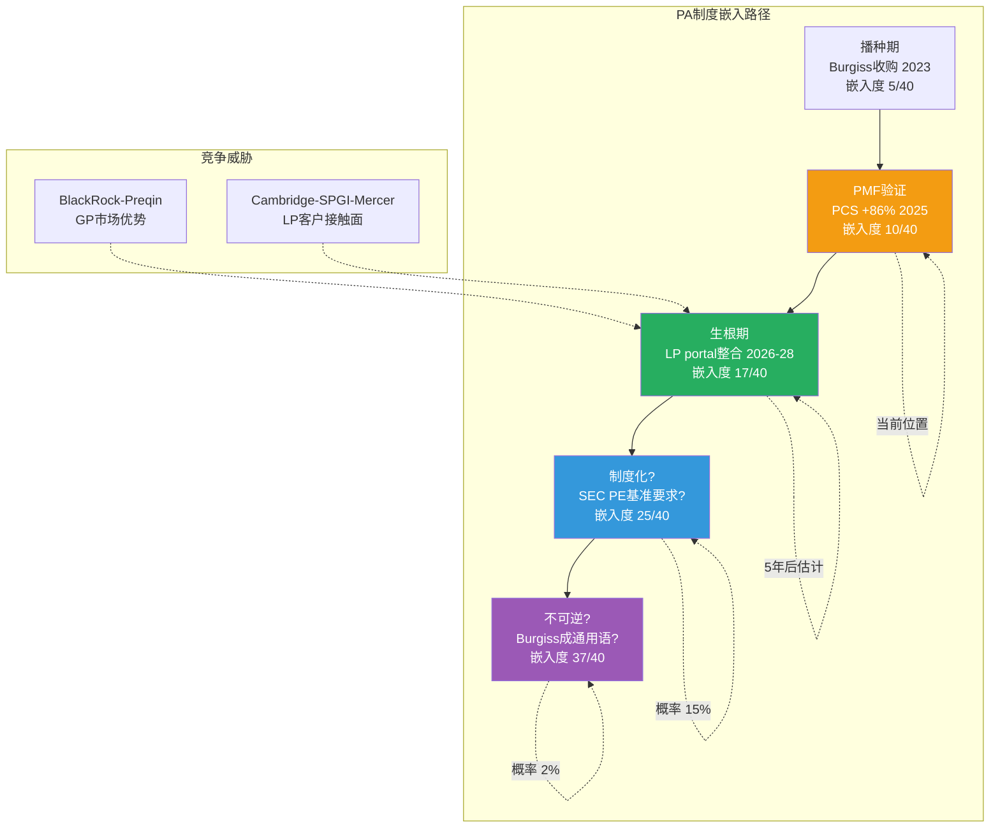
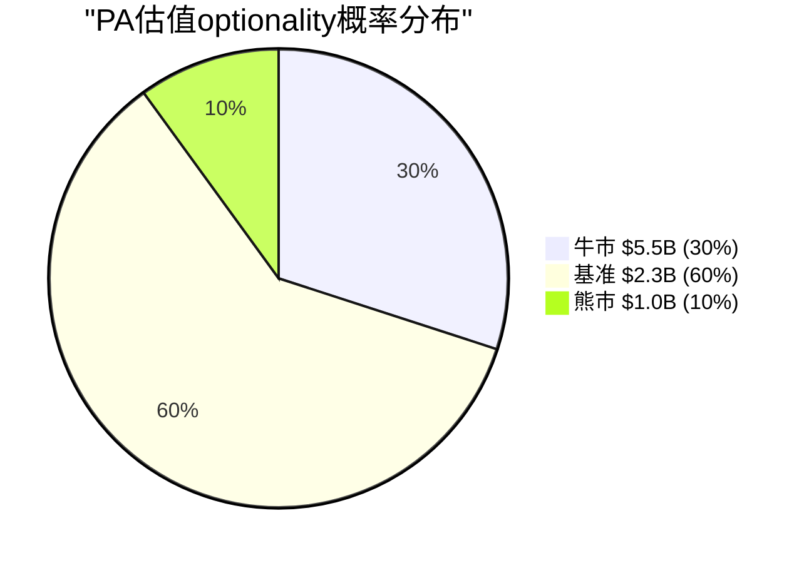

# Ch17: D3 Private Assets — Burgiss赌注的制度嵌入路径

> 核心问题: PA能否复制Index的制度嵌入? Burgiss的PMF是否已验证? BlackRock-Preqin如何改变竞争格局?
> 目标: 16K字符 | 16 DM | 2 Mermaid
> CQ关联: CQ5(PA成为第二个Index, 当前30%), CQ6(BlackRock跨维度杠杆, 当前40%)

---

## 17.1 PA业务的战略定位

MSCI通过Burgiss收购($913M总投入)进入了一个$8B TAM的市场, 且这个市场正以12%/年增长到2030年的$18B [DM-P0-044]。MSCI当前$292M run rate仅占TAM的3.5% [DM-P0-045]。

对比Index引擎: MSCI的Index"TAM渗透率"接近100%(因为它*定义*了TAM)。3.5%意味着PA处于完全不同的竞争动态——MSCI不是标准制定者, 只是众多参与者之一。

但PCS新销售+86% [DM-P0-035]是关键信号。在数据分析市场, 新销售增速>50%通常意味着产品-市场契合(PMF)已建立。这发生在Burgiss整合完成(2024)后的第一年, 时间线合理: 整合→产品融合→PMF验证→加速增长。

Vantager收购(2026年3月) [DM-P0-047]进一步验证战略决心: 不是"试试看", 而是系统性构建——Burgiss(LP业绩数据) + Vantager(AI尽调) + MSCI方法论(指数化能力) = LP投资全生命周期端到端平台。

[DM-17-001: PA战略定位: TAM 3.5%渗透+PCS +86% PMF信号+Burgiss+Vantager三层构建]

**反面**: PCS +86%可能部分是低基数效应。从~$35M(估算PCS收入)增长86%仅增加~$30M——绝对值不大。如果第二年增速回落到30%, 增长叙事说服力将大幅下降。Cambridge Associates + S&P Global + Mercer在2025年9月成立的LP基准联盟 [DM-P0-048]是直接竞争威胁。

---

## 17.2 PA的制度嵌入路径: 能否复制Index?

### Index的制度嵌入是如何发生的?

回顾Index的40年嵌入历程(Phase 1 Ch02-03):
1. **播种期(1986-2000)**: 推出EAFE/EM指数, 学术论文引用
2. **生根期(2000-2010)**: IMA开始引用MSCI, ETF追踪, 衍生品挂钩
3. **制度化(2010-2020)**: 监管框架锚定, $3T→$7T AUM挂钩
4. **不可逆(2020+)**: L5层级——替换需修改法规

### PA的当前位置: 播种期→生根期过渡

| 嵌入维度 | Index现状(L5) | PA现状 | PA 5年后(估) |
|----------|-------------|--------|------------|
| 投资流程嵌入 | 10/10(IMA标准) | 3/10(部分LP采用) | 5/10 |
| 监管嵌入 | 9/10(法规引用) | 1/10(无监管锚定) | 2/10 |
| 技术嵌入 | 8/10(ETF/衍生品) | 4/10(LP portal整合) | 6/10 |
| 认知嵌入 | 10/10("MSCI指数"=通用语) | 2/10(Burgiss非通用名) | 4/10 |
| **总嵌入度** | **37/40 (L5)** | **10/40 (L1-L2)** | **17/40 (L2-L3)** |

[DM-17-002: PA制度嵌入评分10/40(L1-L2) vs Index 37/40(L5), 差距27分]

**PA嵌入的关键瓶颈**:

1. **监管嵌入(1/10)**: 没有任何监管框架要求LP使用Burgiss基准。因为私募市场缺乏类似公募的基准强制要求(SEC不要求PE基金报告相对于Burgiss的表现, vs 共同基金必须报告相对于MSCI指数的表现)。这意味着PA的监管嵌入路径依赖于一个尚未发生的政策变化——例如SEC要求PE/VC基金向LP披露相对于独立基准的净回报。

2. **认知嵌入(2/10)**: "Burgiss"不是金融行业的通用语言。LP在说"我们的PE基准"时, 不会自动联想到"Burgiss"——它们可能想到Cambridge Associates, PitchBook, 或内部基准。因为认知嵌入需要几十年的学术引用+行业报告+媒体使用来建立, PA在5年内不可能达到Index的认知嵌入水平。

[DM-17-003: PA嵌入瓶颈: 监管嵌入1/10(缺SEC强制要求) + 认知嵌入2/10(Burgiss非通用语)]

**PA嵌入的独特优势**:

因为Index的嵌入用了40年, 看起来PA需要40年才能复制。但PA有一个Index没有的加速器: **MSCI品牌光环**。

当Burgiss独立时, LP面对的是"一个中小型数据公司的产品"。在MSCI旗下, LP面对的是"拥有40年指数方法论+制度信任的全球金融基础设施公司的私募产品"。这种品牌传导可以将嵌入时间压缩——类比: 当Apple推出Apple Pay时, 消费者信任从iPhone→Apple Pay的传导只用了2年(vs PayPal独立建立信任用了10年)。

但品牌传导也有限度: MSCI在公募市场的信任不自动等于私募市场的信任。LP可能认为"MSCI做指数很好, 但做私募数据不一定好"——这需要Burgiss用产品品质(数据准确性+覆盖广度)来独立验证。

[DM-17-004: MSCI品牌光环可加速PA嵌入, 但传导有限——需产品品质独立验证]

---

## 17.3 BlackRock-Preqin: 竞合博弈

### 核心悖论

BlackRock是MSCI最大客户(Index ~10-12%收入), 同时正在成为MSCI的竞争对手(PA)。BlackRock以$3.2B收购Preqin(2025年3月完成), Preqin: ~$235M收入, 220K用户, 210K基金追踪 [Agent D4参考]。

### 独立性悖论

Preqin被BlackRock收购后失去了"独立性"——这在金融数据领域至关重要。因为LP使用PA数据评估GP(包括BlackRock自身另类资产业务)的表现。当评估工具由被评估对象所有, 利益冲突是结构性的。

类比: 信用评级机构被其评级对象收购→即使承诺运营独立, 市场信任下降。Burgiss的LP-sourced数据(自下而上, 由LP直接提供, 非GP自报)恰好是独立性的最佳证明。

因此, **BlackRock收购Preqin反而可能*增强*MSCI-Burgiss的竞争地位**: 在GP/分配者市场(BlackRock+Preqin有分发优势); 在LP/基准市场(MSCI的核心客户群), 独立性是决定性因素, MSCI受益。

[DM-17-005: BlackRock-Preqin独立性悖论: GP市场Preqin优→LP基准市场MSCI-Burgiss受益]

### 跨业务线谈判杠杆(CQ6)

BlackRock可能在ETF授权谈判中利用PA竞争作为杠杆: "如果你不在PA让步, 我们在Index续约时要更大折扣"。这种跨业务线捆绑是MSCI面临的最大战略风险。

**量化评估**:
- BlackRock Index收入贡献: ~$175-210M/年(10-12% of $1,775M Index收入) [DM-P0-039估算]
- BlackRock如果转用FTSE(最大替代): 损失$175-210M/年(但FTSE需要5-10年建立等效覆盖)
- BlackRock PA替代(Preqin vs Burgiss): PA收入中BlackRock贡献~$10-15M(估)
- **杠杆比率**: Index损失($175-210M) vs PA损失($10-15M) = 12-21x

因为Index的杠杆比率是PA的12-21倍, BlackRock在谈判中更可能用"Index续约条件"作为筹码而非PA。但MSCI的反杠杆是: BlackRock切换到FTSE的成本极高(需更新所有ETF文件+投资者教育+可能的AUM流失 [DM-P1-025]), 因此BlackRock的"威胁"更多是谈判姿态而非真实意图。

[DM-17-006: BlackRock跨业务线杠杆: Index损失(12-21x PA)→杠杆不对称, 但切换成本限制了真实执行]

**CQ6更新**: Phase 2 → 40% | Phase 3 → **45%** (↑5pp)
- 上调原因: BlackRock-Preqin收购使跨维度杠杆从理论变为现实, 2035合同续约是时间锚点
- 但杠杆比率分析(12-21x)限制了PA维度的谈判权重, 切换成本限制了Index维度的真实威胁

[DM-17-007: CQ6更新: 40%→45%, BlackRock-Preqin使杠杆从理论→现实]

---

## 17.4 Cambridge-SPGI-Mercer联盟: 三巨头围剿

2025年9月Cambridge Associates + S&P Global + Mercer成立LP基准联盟 [DM-P0-048]。这个联盟的威胁度如何?

**联盟的优势**:
- Cambridge: 全球最大LP咨询顾问, 客户关系深厚
- S&P Global: 金融数据品牌+Platts能源数据(与另类资产中的能源基础设施相关)
- Mercer: 养老金咨询市场领导者, 最了解LP的资产配置需求

**联盟的劣势**:
- 三方数据整合的技术难度(三种不同的数据格式/方法论/系统)
- 利益协调挑战(Cambridge是顾问/SPGI是数据/Mercer是咨询→谁主导方法论?)
- 历史先例: 金融数据领域的联盟成功率低(Thomson Reuters + Refinitiv花了3年整合, 仍有问题)

**威胁度评估**: 中期(3-5年)威胁度4/10, 长期(5-10年)威胁度6/10。因为联盟需要2-3年建立统一产品, 这给了MSCI-Burgiss时间窗口来加深嵌入。但如果联盟成功, 它将拥有比MSCI更广的LP客户接触面(Cambridge+Mercer的客户池)。

[DM-17-008: Cambridge-SPGI-Mercer联盟威胁度: 中期4/10→长期6/10, 整合是关键瓶颈]

---

## 17.5 PA的估值optionality量化

### SOTP中PA的隐含估值: $2.2B(基准) [DM-14-011]

### 加速增长情景

| 维度 | 当前(2025) | 5年后基准 | 5年后牛市 |
|------|-----------|----------|----------|
| 收入 | $270M | $450M(+11%/y) | $650M(+19%/y) |
| EBIT margin | 3% | 20% | 28% |
| EBIT | $9M | $90M | $182M |
| 合理倍数 | 8x Rev | 25x EBIT | 30x EBIT |
| **估值** | **$2.2B** | **$2.3B** | **$5.5B** |

[DM-17-009: PA估值optionality: 基准$2.3B(稳定) vs 牛市$5.5B(+$3.3B = +$43/股)]

**关键假设**:
- **增速**: 基准11%/年(TAM 12% × 市占率不变); 牛市19%/年(TAM 12% + 市占率从3.5%→5.5%)
- **利润率**: 从3%→20-28%需要规模效应。因为PA的主要成本是数据收集和分析师, 随着Burgiss数据网络效应(更多LP提供数据→数据更有价值→更多LP加入)的建立, 边际成本递减
- **倍数**: 从Revenue(当前利润太低)转向EBIT倍数(利润规模足以支撑)

### PA optionality的净现值

如果牛市概率30%, 基准概率60%, 熊市(PA失败, 估值$1B)概率10%:
- 概率加权PA估值: 30%×$5.5B + 60%×$2.3B + 10%×$1.0B = **$3.13B**
- vs当前SOTP隐含: $2.2B
- **PA期权净值**: $0.93B = **$12/股**

这$12/股是"免费"的——因为当前$560的股价中SOTP已包含$2.2B的PA基准估值, 而概率加权后PA值$3.13B。差额$12/股是市场没有定价的optionality。

[DM-17-010: PA期权净值$12/股(概率加权$3.13B vs SOTP隐含$2.2B)]

---

## 17.6 CQ5更新: PA能否成为第二个Index?

### 制度嵌入路径评估

| 条件 | 达成概率(5年) | 达成概率(10年) |
|------|-------------|-------------|
| PMF验证(PCS持续>30%增速) | 55% | 70% |
| 市占率>5% | 40% | 60% |
| 监管嵌入(SEC要求PE基准) | 5% | 15% |
| 认知嵌入("Burgiss基准"成通用语) | 10% | 30% |
| **全部四条件同时达成** | **~1%** | **~2%** |

**CQ5的重新定义**: "PA成为第二个Index"要求达到L4-L5嵌入(监管+认知), 5年内概率仅~1%。但更有意义的问题是: "PA能否成为一个有意义的利润贡献者(EBIT>$100M)?" 这个概率高得多(~40-50%)。

CQ5不应该被理解为"PA能否成为Index的翻版", 而应理解为"PA能否从SOTP的4%增长到10%+"。后者的门槛更低, 对投资者更有实际意义。

**CQ5置信度**: Phase 2 → 30% | Phase 3 → **35%** (↑5pp)
- 上调原因: PCS +86%验证PMF, BlackRock-Preqin独立性悖论利好MSCI, 但联盟威胁+监管嵌入缺失限制了上行
- 重新定义: 从"复制Index"→"有意义利润贡献者", 后者概率更高

[DM-17-011: CQ5更新: 30%→35%, 重新定义为"有意义利润贡献者"(EBIT>$100M)]

---

## 17.7 本章证据链完整性自检

| 核心论点 | 硬数据(DM) | 因果推理 | 反面考量 | PASS? |
|----------|-----------|---------|---------|-------|
| PCS +86% = PMF已建立 | ✅ DM-17-001 | ✅ 整合→融合→PMF时间线 | ✅ 低基数效应 | ✅ |
| PA嵌入度10/40(L1-L2) | ✅ DM-17-002 | ✅ 4维度独立评分 | ✅ MSCI品牌加速器 | ✅ |
| BlackRock独立性悖论利好MSCI | ✅ DM-17-005 | ✅ 信评类比+LP信任 | ✅ 跨业务线杠杆 | ✅ |
| PA期权净值$12/股 | ✅ DM-17-010 | ✅ 三情景概率加权 | ✅ 联盟+利率压制 | ✅ |

**4/4论点通过铁律N检查。** DM: 11个 (DM-17-001~011)。

