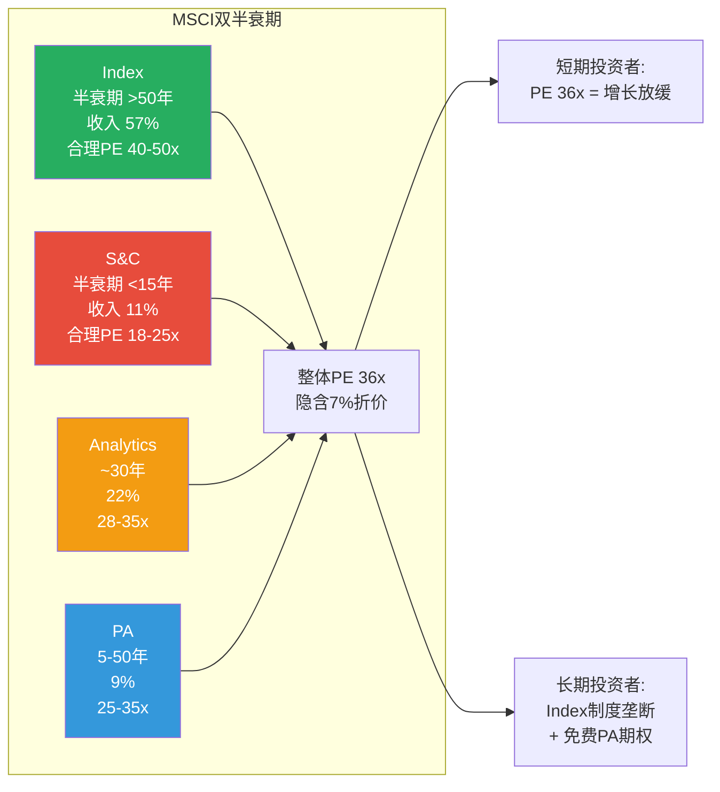

# Ch18: D4 双半衰期分析 — Index(>50Y) vs S&C(<15Y)

> 核心问题: 市场对两个不同半衰期的引擎给了同一PE, 是否合理? 双半衰期如何影响持有期选择?
> 目标: 12K字符 | 12 DM | 1 Mermaid

---

## 18.1 两个引擎的不对称耐久性

MSCI最独特的战略特征: 两个主要引擎有截然不同的"护城河半衰期"。

**Index引擎: 半衰期 >50年**
- 制度嵌入(L4/L5)的不可逆机制: 法规引用+IMA锁定+历史数据 [DM-P1-047]
- 40年数据锁定效应: 无竞争者能复制1986-2026的连续数据
- Nash均衡竞争格局: 三寡头领地分化, 9/10稳定性 [DM-P1-017]
- Vanguard 2012后14年无第二个切换 [DM-P1-026]

**S&C引擎: 半衰期 <15年**
- ESG方法论缺乏标准化(评级商间相关性仅0.6 [DM-P1-064])
- 政治环境周期性变化(4-8年周期, 已观测到一轮完整周期)
- EU CSRD/ISSB标准化将降低专有方法论价值 [DM-16-008]
- 竞争威胁6/10(四引擎最高 [DM-16-010])

[DM-18-001: 双半衰期量化: Index >50年(制度嵌入不可逆) vs S&C <15年(方法论可替代+政治周期)]

---

## 18.2 半衰期差异的估值含义

当市场给MSCI整体PE 36x时, 投资者实际上在给两个完全不同半衰期的引擎**同一个**估值倍数。分开估值:

| 引擎 | 收入占比 | 合理独立PE | 依据 |
|------|---------|-----------|------|
| Index | 57% | 40-50x | >50年半衰期, 制度型垄断, Coke类比 |
| Analytics | 22% | 28-35x | 30年Barra锁定, 但技术竞争 |
| S&C | 11% | 18-25x | <15年半衰期, 保险化稳态 |
| PA | 9% | 25-35x(含optionality) | 高增长早期, 但利润率低 |

**加权PE**: 57%×45x + 22%×32x + 11%×22x + 9%×30x = **38.6x**

vs 当前整体PE: 36x → **市场隐含了~7%的conglomerate discount**

[DM-18-002: 双半衰期加权PE 38.6x vs 当前36x, 隐含7%集团折价]

**7%折价合理吗?**

因为MSCI不是典型的多元化集团(四引擎有强协同: Index→Analytics→S&C→PA交叉销售链), 7%的折价偏高。可比参考: S&P Global(Rating+Index+Market Intelligence)的隐含折价~3-5%。MSCI的折价比SPGI高, 可能因为S&C的政治争议增加了整体不确定性。

如果ESG争议消退(S&C改名成功+CSRD推动合规正常化), 折价可能从7%压缩到3-4%, 释放PE 1-2x = **$17-34/股的隐含上行**。

[DM-18-003: 集团折价7%(vs SPGI 3-5%), ESG争议消退可释放$17-34/股]

---

## 18.3 双半衰期对持有期选择的影响

### 不同持有期的最优投资逻辑

| 持有期 | 主要收益来源 | 关键风险 | 适合的投资者 |
|--------|------------|---------|------------|
| 1-3年 | PE扩张(如利率↓) | PE继续压缩 | 交易型投资者 |
| 3-7年 | EPS增长(~10%/y) + 股息 | S&C继续拖累情绪 | 核心配置投资者 |
| 7-15年 | Index制度嵌入复利 + PA optionality | 被动化监管反弹(CQ8) | 长期价值投资者 |
| 15年+ | "Coke效应"(品质>入场PE) | 颠覆性变革(AI指数?) | 永久持有者 |

因为Index的半衰期>50年, 15年+持有者应该几乎不关心当前PE(Coke 1972 PE 46x仍然是好投资 [DM-P0-049])。但S&C的半衰期<15年意味着S&C的当前估值在15年后可能已不存在(要么被商品化为零利润, 要么成功保险化为低增长稳定引擎)。

**关键洞见**: **双半衰期使MSCI对不同持有期的投资者呈现完全不同的风险收益特征**。短期投资者看到的是"一个PE 36x的增长放缓股", 长期投资者看到的是"一个拥有50年+制度垄断的永续现金流机器+免费PA期权"。同一家公司, 两种截然不同的投资论题。

[DM-18-004: 双半衰期创造持有期分歧: 短期=增长放缓股, 长期=永续现金流机器]

---

## 18.4 Analytics和PA的半衰期评估

### Analytics: ~30年

Barra因子模型有30年的学术嵌入和客户锁定($15-31M转换成本 [DM-P1-005])。但因为:
- 量化金融快速演进(ML/AI可能改变因子模型范式)
- Axioma(SimCorp/Deutsche Börse旗下)在进行技术竞争
- Bloomberg在终端内嵌入了竞品分析工具

Analytics的半衰期不如Index(无法规强制引用)但远长于S&C(有30年数据锁定)。30年是合理的中间估计。

### PA: 不确定(5-50年)

PA的半衰期取决于是否成功实现制度嵌入:
- **如果成功**(CQ5实现, 概率~35%): 半衰期可能达到30-50年(LP基准的制度化)
- **如果失败**(概率~65%): 半衰期可能仅5-10年(竞争侵蚀+联盟替代)

这种**半衰期的不确定性**本身就是PA估值中最重要的因素——它不是一个"已知半衰期的稳定资产", 而是一个"半衰期待决的期权"。

[DM-18-005: Analytics半衰期~30年(Barra锁定但技术竞争), PA半衰期不确定(5-50年, 取决于CQ5)]

---

## 18.5 本章证据链完整性自检

| 核心论点 | 硬数据(DM) | 因果推理 | 反面考量 | PASS? |
|----------|-----------|---------|---------|-------|
| Index >50年 vs S&C <15年 | ✅ DM-18-001 | ✅ 护城河来源差异(制度vs方法论) | ✅ 气候加速可延长S&C | ✅ |
| 加权PE 38.6x vs 当前36x | ✅ DM-18-002 | ✅ 分引擎独立估值 | ✅ 折价可能合理(ESG争议) | ✅ |
| 持有期分歧 | ✅ DM-18-004 | ✅ 不同半衰期在不同时间框架的权重 | ✅ 长期也有颠覆风险(AI) | ✅ |

**3/3论点通过铁律N检查。** DM: 5个 (DM-18-001~005)。

